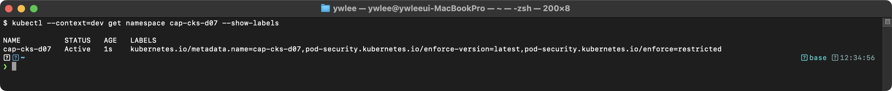
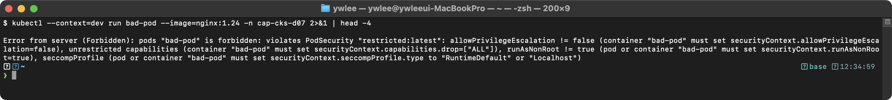
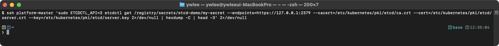
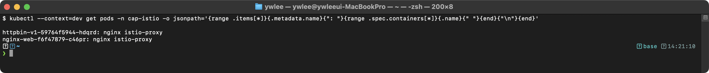
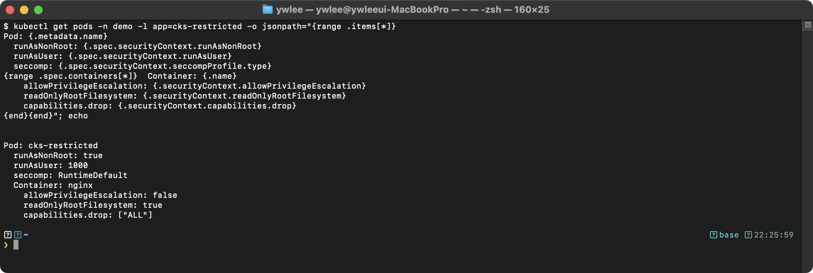

# CKS Day 7: Minimize Microservice Vulnerabilities (1/2) - PSS, SecurityContext, Gatekeeper, Encryption, RuntimeClass, mTLS

> 학습 목표 | CKS 도메인: Minimize Microservice Vulnerabilities (20%) | 예상 소요 시간: 2시간

Day 6에서 RBAC와 NetworkPolicy로 "누가 무엇을 할 수 있는가(인가)"와 "누가 누구와 통신할 수 있는가(네트워크 격리)"를 다뤘다. Day 7에서는 그보다 한 층 더 낮은 "Pod 자체가 어떤 권한을 가지는가(런타임 격리)"와 "저장·통신 데이터가 암호화되는가(암호화)"로 내려가 마이크로서비스의 방어 계층을 완성한다.

---

## 오늘의 학습 목표

- Pod Security Standards (Privileged/Baseline/Restricted)를 이해하고 네임스페이스에 적용한다
- SecurityContext 심화 설정을 마스터한다
- OPA Gatekeeper 정책 엔진(ConstraintTemplate/Constraint/Rego)을 이해한다
- Secret 관리와 Encryption at Rest를 설정한다
- RuntimeClass(gVisor/Kata)를 이해하고 적용한다
- Istio mTLS를 이해한다

---

## 0.5 이 6개 주제는 왜 한 묶음인가 — 공격 방어 계층 지도

오늘 다루는 PSS·SecurityContext·Gatekeeper·Encryption·RuntimeClass·mTLS는 따로 떨어진 토막이 아니라, 마이크로서비스를 노리는 공격을 각각 다른 지점에서 막는 "방어 계층(defense-in-depth)"이다. 어떤 공격을 어디서 막는지로 묶으면 다음과 같다.

| 계층 | 막는 공격 | 사용 기술 |
|:--|:--|:--|
| 입구 통제(Admission) | 권한 과다 Pod 생성, 정책 위반 배포 | PSS/SecurityContext(권한 박탈) + Gatekeeper(조직 정책 강제) |
| 저장소 보호(at rest) | etcd/백업 탈취로 Secret 평문 유출 | Encryption at Rest(저장 암호화) |
| 런타임 격리(runtime) | 커널 취약점을 통한 컨테이너 이스케이프 | RuntimeClass(gVisor/Kata, 커널 격리) |
| 통신 보안(in transit) | Pod 간 평문 도청·스푸핑 | mTLS(상호 인증 + 채널 암호화) |

의사결정 프레임: 일반 워크로드는 입구 통제(PSS + 필요 시 Gatekeeper)만으로 대부분의 권한 상승 공격을 막을 수 있다. 멀티테넌트·신뢰 불가 코드 실행 등 고보안 워크로드라면 여기에 런타임 격리(RuntimeClass)와 통신 암호화(mTLS), 저장 암호화(Encryption)를 더해 비용을 감수하고 방어 깊이를 키운다. 즉 모든 워크로드에 6개를 다 켜는 것이 아니라, 워크로드의 위협 수준에 맞춰 계층을 쌓는다.

---

## 1. Pod Security Standards 완전 정복

### 1.0 PSS 등장 배경

```
PodSecurityPolicy(PSP)의 한계와 PSS로의 전환
═════════════════════════════════════════════

K8s v1.0~v1.24: PodSecurityPolicy(PSP) Admission Controller
  (RBAC = Role-Based Access Control, 역할 기반 접근 제어. 사용자/SA에게 Role을
   부여해 API 동작 권한을 통제하는 K8s 인가 모델. PSP는 이 RBAC 위에 얹혀 동작했다.)
  한계:
  - PSP는 RBAC와 결합된 복잡한 인가 모델이었다
    → PSP는 "이 Pod를 만들 수 있나"가 아니라 "이 Pod가 어떤 PSP의 허용 범위에
      드나"를 판정한다. 어떤 PSP가 후보가 되는지는, Pod를 만드는 주체
      (사용자 또는 Pod의 ServiceAccount)에게 해당 PSP에 대한 use 권한
      (RBAC verb 'use')이 RoleBinding으로 부여되었는지로 결정된다.
      즉 보안 정책(PSP)과 인가 정책(RBAC)이 한 덩어리로 얽혀, PSP 하나를 이해하려면
      RoleBinding까지 추적해야 했다.
  - 어떤 PSP가 적용되는지 예측하기 어려웠다 (다중 PSP 우선순위 문제)
    → 한 주체가 여러 PSP에 대해 use 권한을 가지면(예: SA-A 가 PSP-1, PSP-2,
      PSP-3 을 모두 쓸 수 있으면) 그중 무엇이 적용될지가 모호했다.
      매칭 규칙은 "가장 제한이 약한(가장 많은 필드를 변형하지 않아도 통과하는) PSP를
      우선 선택"이었는데, runAsUser 같은 mutating(값을 채워주는) 필드가 끼면
      이 우선순위가 직관과 어긋나 같은 Pod가 클러스터마다 다른 PSP로 통과되곤 했다.
      'first match'가 아니라 'least restrictive match'였고 이 사실이 명시적이지
      않아 디버깅이 어려웠다.
  - 정책 위반 시 에러 메시지가 불친절했다 (어느 PSP가 왜 거부했는지 알기 어려움)
  - dry-run/warn 모드가 없어 점진적 도입이 불가능했다
  - v1.21에서 deprecated, v1.25에서 완전 제거되었다

K8s v1.22+: Pod Security Admission(PSA)
  개선점:
  - 네임스페이스 라벨 기반의 직관적 정책 모델이다
  - enforce/audit/warn 3가지 모드로 점진적 도입이 가능하다
  - 3단계 보안 레벨(Privileged/Baseline/Restricted)로 표준화되었다
  - 빌트인 Admission Controller로 별도 설치가 불필요하다

공격-방어 매핑:
  공격 벡터                         → PSS 방어
  ──────────────────────────────── → ──────────────────────────────
  privileged 컨테이너로 호스트 접근  → Baseline에서 차단
  hostPID로 호스트 프로세스 접근     → Baseline에서 차단
  setuid로 root 권한 획득          → Restricted에서 차단
  root UID로 컨테이너 실행          → Restricted(runAsNonRoot)에서 차단
  모든 capability로 커널 조작       → Restricted(drop ALL)에서 차단
```

### 1.1 Pod Security Standards 정책 모델

```
Pod Security Standards(PSS) - 빌트인 Admission 기반 보안 정책
═══════════════════════════════════════════════════════════════

PSS는 Kubernetes에서 정의한 3단계 보안 프로파일로, Pod의 securityContext 필드에
대한 유효성 검증 규칙을 표준화한 것이다. Pod Security Admission 컨트롤러가
네임스페이스 레이블을 기반으로 이 규칙을 enforce/audit/warn 모드로 적용한다.

3단계 보안 레벨:
  - Privileged: 제한 없음. hostNetwork, hostPID, privileged: true 등 모두 허용.
    → 시스템 데몬, CNI 플러그인 등 호스트 수준 접근이 필수인 워크로드에 사용
  - Baseline: 알려진 권한 상승 경로를 차단. hostNetwork=false, privileged=false 강제.
    → 일반 워크로드의 기본 정책. 대부분의 컨테이너화된 애플리케이션과 호환
  - Restricted: 최소 권한 원칙(PoLP) 적용. runAsNonRoot, drop ALL capabilities,
    readOnlyRootFilesystem, seccomp RuntimeDefault 강제.
    → 보안 민감 프로덕션 워크로드에 적용

K8s 1.25 이전: PodSecurityPolicy(PSP) Admission Controller → v1.25에서 제거
K8s 1.25+: Pod Security Admission(빌트인 Admission Controller)으로 대체
```

### 1.2 세 가지 보안 레벨 상세

```
Privileged 레벨
═══════════════
제한: 없음 (모든 것 허용)
사용 사례: kube-system, CNI 플러그인, 모니터링 에이전트

Baseline 레벨
═════════════
차단하는 항목:
  - hostNetwork: true     → 호스트 네트워크 스택 직접 사용
  - hostPID: true         → 호스트 PID 네임스페이스 공유
  - hostIPC: true         → 호스트 IPC 네임스페이스 공유
  - privileged: true      → 모든 권한을 가진 특권 컨테이너
  - hostPath 볼륨         → 호스트 파일시스템 직접 마운트
  - hostPort 사용         → 호스트 포트 직접 바인딩
  - 위험한 capabilities:
    - SYS_ADMIN, NET_ADMIN, SYS_PTRACE 등
    - NET_RAW는 Baseline에서 허용 (Restricted에서 차단)

Restricted 레벨 (CKS에서 가장 중요)
═══════════════════════════════════
Baseline의 모든 제한 + 추가 요구사항:
  - runAsNonRoot: true 필수         → root로 실행 금지
  - allowPrivilegeEscalation: false → 권한 상승 금지
  - seccompProfile: RuntimeDefault 또는 Localhost 필수
  - capabilities: ALL drop 후 필요한 것만 add
  - 볼륨 타입 제한 (configMap, emptyDir, secret, projected만 허용)
  - readOnlyRootFilesystem 권장 (필수는 아님)
```

### 1.3 Pod Security Admission - 세 가지 모드

```
Pod Security Admission 모드
════════════════════════════

모드      | 동작                     | 사용 시기
──────────┼─────────────────────────┼──────────────────
enforce   | 위반 Pod 생성 거부       | 프로덕션 (강제 적용)
audit     | 감사 로그에 기록          | 모니터링 (Pod는 생성됨)
warn      | 경고 메시지 표시          | 마이그레이션 (Pod는 생성됨)

점진적 전환 전략:
  1단계: enforce=baseline + warn=restricted
         → 기본 보안 적용, Restricted 위반 시 경고
  2단계: 경고 내용 확인 후 Pod 수정
  3단계: enforce=restricted
         → 최고 보안 적용
```

경고를 본 뒤 실제로 어떻게 Pod를 고치는지가 핵심이다. warn 단계에서 enforce로 넘어가는 실전 절차는 다음과 같다.

```bash
# (1) warn=restricted 적용 → 기존 워크로드를 다시 배포하면 경고가 나온다
kubectl label ns staging pod-security.kubernetes.io/warn=restricted

# (2) Deployment를 재배포(rollout)하면 kubectl 출력에 경고가 뜬다
kubectl rollout restart deploy/web -n staging
# Warning: would violate PodSecurity "restricted:latest":
#   runAsNonRoot != true, allowPrivilegeEscalation != false, ...
```

```yaml
# (3) 경고에 적힌 위반 필드를 Deployment의 .spec.template.spec 에 채운다
#     (Deployment는 Pod template 안의 securityContext를 고쳐야 한다)
spec:
  template:
    spec:
      securityContext:
        runAsNonRoot: true           # "runAsNonRoot != true" 경고 해소
        seccompProfile:
          type: RuntimeDefault       # "seccompProfile" 경고 해소
      containers:
      - name: web
        securityContext:
          allowPrivilegeEscalation: false   # "allowPrivilegeEscalation != false" 해소
          capabilities:
            drop: ["ALL"]                    # "unrestricted capabilities" 해소
```

```bash
# (4) 수정본 적용 후 다시 rollout → 경고가 사라지는지 확인
kubectl apply -f web-deploy.yaml
kubectl rollout restart deploy/web -n staging   # 경고 없으면 준수 완료

# (5) 모든 경고가 사라지면 enforce로 승격한다(이제 위반 Pod는 생성 거부)
kubectl label ns staging pod-security.kubernetes.io/enforce=restricted --overwrite
```

순서가 중요하다. 먼저 enforce로 올리면 위반 워크로드가 곧바로 거부되어 배포가 막히므로, warn으로 모든 위반을 먼저 제거한 뒤 enforce로 전환한다.

### 1.4 네임스페이스에 Pod Security 적용

```bash
# 방법 1: kubectl label (imperative - 시험에서 빠름)
kubectl label namespace production \
  pod-security.kubernetes.io/enforce=restricted \
  pod-security.kubernetes.io/enforce-version=latest \
  pod-security.kubernetes.io/audit=restricted \
  pod-security.kubernetes.io/warn=restricted
```

```yaml
# 방법 2: YAML (declarative)
apiVersion: v1
kind: Namespace
metadata:
  name: production
  labels:
    pod-security.kubernetes.io/enforce: restricted
    # ↑ enforce 모드: Restricted 레벨 강제 적용
    # 위반하는 Pod는 생성이 거부된다
    pod-security.kubernetes.io/enforce-version: latest
    # ↑ 버전: latest = 클러스터의 K8s 버전에 맞는 최신 정책
    # 특정 버전 고정도 가능: v1.28, v1.31 등
    pod-security.kubernetes.io/audit: restricted
    # ↑ audit 모드: 감사 로그에 기록
    pod-security.kubernetes.io/warn: restricted
    # ↑ warn 모드: kubectl 출력에 경고 표시
```

### 1.5 Restricted 준수 Pod YAML (시험 필수 암기)

```yaml
# ═══════════════════════════════════════════
# Restricted 레벨을 준수하는 완전한 Pod YAML
# CKS 시험에서 이 패턴을 외워야 한다!
# ═══════════════════════════════════════════
apiVersion: v1
kind: Pod
metadata:
  name: compliant-pod
  namespace: production                  # Restricted가 적용된 네임스페이스
spec:
  securityContext:                       # Pod 레벨 보안 설정
    runAsNonRoot: true                   # [필수] root 실행 금지
    runAsUser: 1000                      # [권장] 실행 UID 명시
    runAsGroup: 3000                     # [권장] 실행 GID 명시
    fsGroup: 2000                        # [권장] 파일시스템 GID
    seccompProfile:
      type: RuntimeDefault              # [필수] seccomp 프로파일
                                         # RuntimeDefault 또는 Localhost
  containers:
  - name: app
    image: nginx:1.25                    # [권장] 구체 버전 고정, latest 금지
                                         # latest를 피하는 이유: 재배포 시 다른 버전으로
                                         #   바뀌어 재현성이 깨진다(같은 매니페스트가
                                         #   다른 결과). 1.25 같은 고정 태그는 알려진
                                         #   CVE 패치 상태와 동작이 재현 가능하다.
                                         # 시험 팁: imperative(kubectl run)에서는 latest가
                                         #   허용되기도 하지만, securityContext를 붙이는
                                         #   선언형 YAML 문제는 고정 버전을 쓰는 것이 안전.
    securityContext:                     # 컨테이너 레벨 보안 설정
      allowPrivilegeEscalation: false    # [필수] 권한 상승 금지
                                         # setuid 바이너리로 root 획득 방지
      readOnlyRootFilesystem: true       # [권장] 루트 FS 읽기 전용
                                         # 악성코드가 파일시스템 수정 불가
      capabilities:
        drop: ["ALL"]                    # [필수] 모든 capability 제거
        add: ["NET_BIND_SERVICE"]        # [선택] 필요한 것만 추가
                                         # 80번 포트 바인딩에 필요
    resources:                           # [권장] 리소스 제한
      limits:
        cpu: "200m"
        memory: "128Mi"
      requests:
        cpu: "100m"
        memory: "64Mi"
    volumeMounts:                        # 쓰기 가능한 경로 마운트
    - name: tmp
      mountPath: /tmp                    # readOnlyRootFS에서 쓰기 필요한 곳
    - name: cache
      mountPath: /var/cache/nginx        # nginx 캐시 디렉토리
    - name: run
      mountPath: /var/run                # nginx PID 파일
  volumes:                               # [제한] 허용된 볼륨 타입만 사용
  - name: tmp
    emptyDir: {}                         # emptyDir: 허용됨
  - name: cache
    emptyDir:
      sizeLimit: 50Mi                    # 크기 제한 (선택)
  - name: run
    emptyDir: {}
  # hostPath: 허용 안 됨! (Restricted에서 차단)
```

### 1.5.1 직접 해보기 — restricted-ns 위반/준수 Pod 통과·거부 확인 (3분 목표)

> 전제: dev 클러스터 가동 중. `export KUBECONFIG=~/sideproejct/IaC_apple_sillicon/kubeconfig/dev.yaml`

```bash
# 1단계: Restricted enforce 네임스페이스 생성
kubectl create namespace restricted-ns
kubectl label namespace restricted-ns \
  pod-security.kubernetes.io/enforce=restricted \
  pod-security.kubernetes.io/enforce-version=latest

# 2단계: 위반 Pod — 아무 설정도 없으면 즉시 거부된다
kubectl run bad-pod --image=nginx:alpine -n restricted-ns
# 기대: Error from server (Forbidden): pods "bad-pod" is forbidden:
#   violates PodSecurity "restricted:latest": ...

# 3단계: 준수 Pod — 1.5절 YAML을 저장한 뒤 apply
# (compliant-pod.yaml = 1.5절 전체 YAML 복사)
kubectl apply -f compliant-pod.yaml -n restricted-ns
# 기대: pod/compliant-pod created  (오류 없음)

# 4단계: 결과 확인
kubectl get pod -n restricted-ns

# 정리
kubectl delete namespace restricted-ns
```

위반 Pod는 `(Forbidden)` 에러와 함께 거부되고, 준수 Pod는 생성된다. 에러 메시지에 정확히 어떤 필드가 문제인지 나열되므로, 시험에서 에러 메시지를 읽고 누락 필드를 찾는 능력을 여기서 키운다.

### 1.6 PSA 실습 검증

> 전제: dev 또는 staging 클러스터가 가동 중이어야 한다(CKS 파괴 실습은 dev/staging에서만).
> `export KUBECONFIG=~/sideproejct/IaC_apple_sillicon/kubeconfig/dev.yaml`
> dev 클러스터에는 `production` 네임스페이스가 없으므로, 아래 예제의 `production`은
> 실습용으로 직접 만든 네임스페이스로 대체해 따라 한다. 시험 환경에는 보통
> production/staging이 미리 있으니 그대로 쓰면 된다.

```bash
# 0. 실습용 네임스페이스 생성 (dev에 production이 없으므로 직접 만든다)
kubectl create namespace restricted-ns

# 1. 네임스페이스에 Restricted 레벨 적용 (production 대신 restricted-ns)
kubectl label namespace restricted-ns \
  pod-security.kubernetes.io/enforce=restricted \
  pod-security.kubernetes.io/enforce-version=latest

# 2. 라벨이 적용되었는지 확인
kubectl get ns restricted-ns --show-labels | grep pod-security
```



```bash
# 3. Restricted 위반 Pod 생성 시도
kubectl run bad-pod --image=nginx:alpine -n production 2>&1
```



에러 메시지에서 위반 항목(allowPrivilegeEscalation, capabilities, runAsNonRoot, seccompProfile)을 정확히 알려준다. 각 항목을 수정하여 재시도한다.

```bash
# 4. warn 모드로 기존 워크로드 위반 확인 (적용 전 사전 점검)
kubectl label namespace staging \
  pod-security.kubernetes.io/warn=restricted --dry-run=server -o yaml 2>&1
```

경고 메시지가 출력되면 해당 Pod들이 Restricted를 위반하는 것이다. enforce 전에 warn으로 먼저 점검하는 것이 안전하다.

```bash
# → 어떤 필드가 위반인지 에러 메시지에 표시된다
# → 해당 필드를 수정하여 다시 시도
```

```bash
# 실습 정리 (cleanup) — 만든 실습용 네임스페이스를 삭제한다
kubectl delete namespace restricted-ns
```

---

## 2. SecurityContext 심화

### 2.0 SecurityContext 등장 배경

SecurityContext는 단순히 "보안 옵션 모음"이 아니라, Docker 시절부터 이어진 컨테이너 권한 관리의 구조적 한계를 해결하기 위해 설계된 K8s 고유 추상화다.

**직전 기술의 한계 — Docker `--user` / `--cap-drop`**

Docker에서 컨테이너 실행 권한을 제어하는 방식은 `docker run --user 1000 --cap-drop ALL` 형태의 플래그였다. 이 방식에는 두 가지 구조적 문제가 있었다.

첫째, 단일 컨테이너 단위로만 설정할 수 있었다. 같은 Pod 안의 여러 컨테이너가 공유해야 하는 볼륨의 파일 소유권(GID 설정 등)을 일관되게 관리할 방법이 없었다. 컨테이너마다 `--user`를 따로 지정하면, 공유 emptyDir 볼륨의 파일 GID가 컨테이너별로 달라지는 문제가 생겼다.

둘째, "이 컨테이너를 실행하는 호스트 노드에서의 설정"과 "이 컨테이너 자체의 보안 설정"이 구분되지 않았다. Docker 데몬 자체가 루트로 실행되었고, `--privileged` 하나로 모든 권한이 열렸다.

**K8s SecurityContext Pod/Container 2레벨 설계 이유**

K8s는 이를 해결하기 위해 securityContext를 두 레벨로 나눴다.

- **Pod 레벨 securityContext** (`spec.securityContext`): Pod 안의 모든 컨테이너와 볼륨에 공통으로 적용되는 설정. `fsGroup`, `runAsNonRoot`, `runAsUser`, `supplementalGroups`, `seccompProfile` 등이 여기에 속한다. `fsGroup`은 Pod 레벨에만 존재하는 이유가 있다 — 볼륨 소유권 변경은 단일 컨테이너가 아니라 Pod 전체의 관점에서 일관되게 적용되어야 하기 때문이다.

- **컨테이너 레벨 securityContext** (`spec.containers[].securityContext`): 특정 컨테이너에만 적용되는 설정. `allowPrivilegeEscalation`, `readOnlyRootFilesystem`, `capabilities`, `privileged`, `runAsUser`(Pod 레벨을 오버라이드) 등이 여기에 속한다. 같은 Pod 안에서도 한 컨테이너는 `NET_BIND_SERVICE` capability가 필요하고 다른 컨테이너는 필요 없는 경우처럼, 컨테이너별로 다른 권한이 필요한 상황을 표현하기 위한 레벨이다.

**충돌 우선순위 규칙 (트레이드오프)**

두 레벨이 공존하면서 같은 필드(예: `runAsUser`, `runAsNonRoot`, `seccompProfile`)가 양쪽에 동시에 설정될 수 있다. 이 때 컨테이너 레벨 설정이 Pod 레벨 설정을 오버라이드한다. 즉 Pod 레벨이 기본값(default), 컨테이너 레벨이 개별 예외(override)다.

이 유연성은 동시에 복잡성 비용을 낳는다. 실제로 적용되는 값이 어디서 왔는지(Pod vs 컨테이너) 추적하기 어렵고, `kubectl describe pod`에서 merged된 결과가 아닌 원본 YAML을 봐야만 알 수 있다. CKS 시험에서 보안 감사 문제가 나올 때 이 우선순위를 모르면 실제로 적용된 권한을 잘못 판단하게 된다.

### 2.1 SecurityContext 필드 전체 정리

```yaml
# ═══════════════════════════════════════════
# SecurityContext 전체 필드 상세 설명
# ═══════════════════════════════════════════
apiVersion: v1
kind: Pod
metadata:
  name: security-context-demo
spec:
  # === Pod 레벨 SecurityContext ===
  securityContext:
    runAsNonRoot: true               # root(UID 0)로 실행 금지
                                     # 판정 규칙: kubelet은 최종 실행 UID를 다음 우선순위로 결정한다.
                                     #   1순위: Pod.securityContext.runAsUser (명시 시 이미지 설정 무시)
                                     #   2순위: 이미지의 USER 지시어 (Dockerfile USER)
                                     #   3순위: 이미지에 USER 없으면 0(root)으로 간주
                                     # 최종 UID가 0이면 runAsNonRoot: true에 의해 Pod 시작 거부.
                                     # nginx:1.25는 Dockerfile에 USER nginx(uid 101)가 명시되어
                                     # runAsUser를 생략해도 자동 통과한다. 반면 alpine 같은 이미지는
                                     # USER가 없어 uid 0으로 간주되므로 반드시 runAsUser: 1000처럼
                                     # 명시해야 한다. 이미지 설정에 의존하지 않고 항상 runAsUser를
                                     # 명시하는 것이 보안 베스트 프랙티스다.
    runAsUser: 1000                  # 모든 컨테이너의 실행 UID
    runAsGroup: 3000                 # 모든 컨테이너의 실행 GID
    fsGroup: 2000                    # 볼륨의 파일 GID
                                     # 동작: (1) kubelet이 Pod 시작 시점에
                                     #   emptyDir/PVC 마운트 지점의 소유 그룹을
                                     #   fsGroup(2000)으로 재귀적으로 chown(group)하고,
                                     #   디렉토리에 setgid 비트를 설정한다.
                                     # (2) 적용 대상은 emptyDir, PVC(블록/파일) 등
                                     #   쓰기 가능 볼륨이며, hostPath/configMap/secret/
                                     #   downwardAPI 는 제외된다(원래 소유자 유지).
                                     # (3) 마운트 시점에 이미 존재하던 파일도 함께
                                     #   chown 되므로, 파일이 많은 PVC는 시작 지연
                                     #   (init 비용)이 발생할 수 있다. K8s 1.20+ 의
                                     #   fsGroupChangePolicy: OnRootMismatch 로 매번
                                     #   재귀 chown 하지 않고 루트 GID가 다를 때만
                                     #   변경하도록 비용을 줄일 수 있다.
    supplementalGroups: [4000, 5000] # 추가 그룹 ID
    seccompProfile:
      type: RuntimeDefault           # seccomp 프로파일 (Pod 레벨)
    # sysctls:                       # 커널 파라미터 (safe sysctl만)
    # - name: net.ipv4.ip_unprivileged_port_start
    #   value: "0"

  containers:
  - name: app
    image: nginx:1.25
    # === 컨테이너 레벨 SecurityContext ===
    securityContext:
      runAsNonRoot: true             # 컨테이너별 설정 (Pod 설정 오버라이드)
      runAsUser: 1001                # 컨테이너별 UID (Pod 설정 오버라이드)
      runAsGroup: 3001               # 컨테이너별 GID
      readOnlyRootFilesystem: true   # 루트 파일시스템 읽기 전용
                                     # 쓰기: emptyDir 마운트 경로에서만 가능
      allowPrivilegeEscalation: false # 권한 상승 방지
                                     # setuid 비트 바이너리 실행 불가
                                     # no_new_privs 커널 플래그 설정
      privileged: false              # 특권 컨테이너 비활성화
                                     # true이면 호스트의 모든 장치에 접근 가능
      capabilities:
        drop: ["ALL"]                # 모든 리눅스 capability 제거
        add: ["NET_BIND_SERVICE"]    # 필요한 capability만 추가
      seccompProfile:                # 컨테이너별 seccomp (Pod 설정 오버라이드)
        type: RuntimeDefault
      appArmorProfile:               # AppArmor 프로파일 (K8s 1.30+)
                                     # AppArmor = 리눅스 보안 모듈(LSM)의 하나로,
                                     # 프로세스별 파일/네트워크/capability 접근을
                                     # 프로파일로 제한한다. seccomp가 시스템콜 단위
                                     # 차단이라면 AppArmor는 경로/리소스 단위 차단이다.
        type: Localhost
        localhostProfile: k8s-deny-write
```

fsGroup이 실제로 볼륨 소유 그룹을 바꾸는지는 컨테이너 안에서 `stat`으로 확인한다.

> 전제: dev 또는 staging 클러스터가 가동 중이어야 한다.
> `export KUBECONFIG=~/sideproejct/IaC_apple_sillicon/kubeconfig/dev.yaml`
> 위 `security-context-demo` Pod를 먼저 생성한다(`kubectl apply -f sc-demo.yaml`).
> emptyDir 마운트를 하나 추가한 뒤(예: `/data`) 다음을 실행한다.

```bash
# 볼륨 마운트 경로의 소유 그룹 GID 확인 (fsGroup: 2000 이 반영되어야 함)
kubectl exec security-context-demo -- stat -c '%U %G %g' /data
# 기대: 디렉토리 그룹이 2000 으로 표시되고, 새로 만든 파일도 GID 2000 을 상속한다
```

(미캡처 — dev 클러스터에서 security-context-demo Pod 실행 후 별도 캡처 필요. `%g` 출력이 2000임을 확인하는 스크린샷을 `images/day07-04-fsgroup.png`로 추가 예정)

`%g`(숫자 GID)가 2000으로 나오면 kubelet이 마운트 지점을 fsGroup으로 chown했다는 증거다. 반대로 hostPath나 configMap 마운트 경로에 같은 명령을 쓰면 원래 소유자가 그대로 유지되어 2000이 아니다.

### 2.2 불변 컨테이너(Immutable Container) 패턴

```
불변 컨테이너(Immutable Container) - 파일시스템 무결성 보장 패턴
══════════════════════════════════════════════════════════════════

불변 컨테이너는 런타임에 컨테이너 파일시스템에 대한 쓰기 작업을 차단하여,
공격자가 악성 바이너리 주입, 설정 파일 변조, 웹셸 업로드 등의
post-exploitation 활동을 수행하는 것을 방지하는 보안 패턴이다.

allowPrivilegeEscalation과 readOnlyRootFilesystem을 왜 함께 쓰나 (방어 계층):
  이 둘은 서로 다른 공격 단계를 막아 함께 써야 격리가 완성된다.
  (1) allowPrivilegeEscalation: false → setuid/setgid 바이너리로 권한을 끌어올리는
      경로를 차단한다. 즉 "컨테이너 안에서 root가 되는" 입구 하나를 닫는다.
  (2) readOnlyRootFilesystem: true → /bin, /lib 등 시스템 바이너리 영역을 읽기 전용으로
      만들어, 공격자가 악성코드를 주입하거나 기존 바이너리를 바꿔치기하는
      post-exploitation 단계를 막는다.
  (3) 둘을 함께 쓰면, 공격자가 컨테이너에 침투해도 → setuid로 권한 상승 시도 실패 →
      설령 어떤 권한을 얻어도 수정할 수 있는 시스템 바이너리가 없고(읽기 전용),
      쓰기는 명시한 emptyDir(예: /tmp)에만 가능 → 피해가 그 경계 안에 갇힌다.
  트레이드오프: readOnlyRootFilesystem를 켜면 로그/캐시/PID 파일 등 앱이 원래
  rootfs에 쓰던 경로를 일일이 emptyDir로 마운트해줘야 한다(아래 nginx 예제의
  /tmp, /var/cache, /var/run, /var/log). 이 마운트를 빠뜨리면 앱이 "Read-only
  file system" 으로 크래시한다.

구현 메커니즘:
  1. readOnlyRootFilesystem: true → 컨테이너의 rootfs를 read-only로 마운트
  2. emptyDir 볼륨으로 /tmp, /var/cache 등 쓰기 필수 경로만 선택적 마운트
  3. capabilities.drop: ["ALL"] → effective/permitted capability 셋 전체 제거
  4. allowPrivilegeEscalation: false → no_new_privs 비트 설정으로 SUID/SGID 실행 차단
```

```yaml
# 불변 컨테이너 완전한 예제
apiVersion: v1
kind: Pod
metadata:
  name: immutable-pod
spec:
  securityContext:
    runAsNonRoot: true
    runAsUser: 1000
    runAsGroup: 3000
    fsGroup: 2000
    seccompProfile:
      type: RuntimeDefault
  containers:
  - name: app
    image: nginx:1.25
    securityContext:
      readOnlyRootFilesystem: true     # 핵심: 루트 FS 읽기 전용
      allowPrivilegeEscalation: false
      capabilities:
        drop: ["ALL"]
    resources:
      limits:
        cpu: "200m"
        memory: "128Mi"
    volumeMounts:
    - name: tmp                        # nginx가 쓰기 필요한 경로들
      mountPath: /tmp
    - name: var-cache                  # 캐시 디렉토리
      mountPath: /var/cache/nginx
    - name: var-run                    # PID 파일
      mountPath: /var/run
    - name: var-log                    # 로그 디렉토리
      mountPath: /var/log/nginx
  volumes:
  - name: tmp
    emptyDir:
      sizeLimit: 100Mi                 # 크기 제한으로 디스크 채우기 공격 방지
  - name: var-cache
    emptyDir:
      sizeLimit: 50Mi
  - name: var-run
    emptyDir:
      sizeLimit: 10Mi
  - name: var-log
    emptyDir:
      sizeLimit: 100Mi
```

### 2.2.1 직접 해보기 — readOnlyRootFilesystem 동작 확인 (3분 목표)

> 전제: dev 클러스터 가동 중. `export KUBECONFIG=~/sideproejct/IaC_apple_sillicon/kubeconfig/dev.yaml`

```bash
# 1단계: readOnlyRootFilesystem: true인 Pod 배포 (2.2절 immutable-pod.yaml 사용)
kubectl apply -f immutable-pod.yaml -n default

# 2단계: rootfs에 직접 쓰기 시도 → 실패해야 한다
kubectl exec immutable-pod -- touch /etc/hack
# 기대: touch: /etc/hack: Read-only file system

# 3단계: emptyDir 마운트 경로에는 쓰기 가능해야 한다
kubectl exec immutable-pod -- touch /tmp/ok
# 기대: 오류 없음 — /tmp는 emptyDir이므로 쓰기 허용

# 4단계: 정리
kubectl delete pod immutable-pod
```

rootfs 쓰기 실패와 emptyDir 쓰기 성공이 대비되면, `readOnlyRootFilesystem`이 rootfs 레이어만 잠그고 마운트 포인트는 별도 볼륨으로 처리한다는 메커니즘을 손으로 확인한 것이다.

---

## 3. OPA Gatekeeper

PSS(Pod Security Admission)로 Pod 보안 레벨의 기본 안전선을 설정했다면, 그것으로 표현할 수 없는 조직 고유 정책(허용 레지스트리 제한, 필수 라벨 강제 등)은 별도 정책 엔진이 필요하다. OPA Gatekeeper가 그 역할을 담당한다.

### 3.0 OPA Gatekeeper 등장 배경

**커스텀 Admission Webhook 직접 작성의 고통**

PSP가 deprecated된 뒤 "조직 맞춤 입구 통제"를 구현하는 가장 직접적인 방법은 커스텀 ValidatingAdmissionWebhook을 직접 작성하는 것이었다. 이는 다음을 직접 구현해야 함을 의미했다.

- TLS 인증서 발급 및 갱신 (kube-apiserver가 webhook를 HTTPS로 호출하므로 반드시 필요)
- webhook 서버를 K8s 클러스터에 Deployment로 배포하고 Service로 노출
- ValidatingWebhookConfiguration을 등록해 kube-apiserver와 연결
- 정책 로직을 Go/Python 등으로 코딩, 컴파일, 도커 이미지 빌드, 레지스트리 푸시
- 정책이 바뀔 때마다 이 전체 사이클을 반복

서비스 팀이 정책을 추가할 때마다 플랫폼 팀에 새 webhook 배포를 요청해야 했고, 정책과 코드가 뒤섞여 감사(audit)가 불가능했다.

**OPA (Open Policy Agent) — 범용 정책 엔진의 K8s 연동 시도**

OPA(2016, CNCF graduated)는 정책 결정 로직을 Rego 언어로 선언적으로 작성하고, 어떤 시스템과도 API로 통합할 수 있는 범용 정책 엔진이다. K8s에 연동하면 Admission webhook을 구현하지 않고 Rego 정책 파일만 OPA에 올리면 되었다. 그러나 OPA 자체를 K8s에 연동하려면 여전히 webhook 서버 설정과 정책 파일 동기화가 수동이었다.

**Gatekeeper — OPA와 K8s CRD의 통합**

Gatekeeper(2019, CNCF incubating)는 OPA를 K8s에 native하게 통합하는 컨트롤러다. 핵심은 두 가지다.

첫째, 정책 로직(Rego)을 K8s CRD(ConstraintTemplate)로 관리한다. `kubectl apply`로 정책을 배포하므로 RBAC, GitOps, 감사 모두 K8s 표준 방식으로 처리된다.

둘째, 정책 적용 범위와 파라미터를 별도 CRD(Constraint)로 선언한다. 정책 로직(ConstraintTemplate)과 적용 대상(Constraint)이 분리되어, 같은 Rego 로직을 여러 네임스페이스/클러스터에 다른 파라미터로 재사용할 수 있다.

**트레이드오프**

Gatekeeper도 비용이 있다.

Rego 학습 곡선이 상당하다. Rego는 선언적 집합 언어로, 절차형 코드에 익숙한 개발자에게 직관적이지 않다. 특히 `violation[]`의 집합 의미론과 변수 유니피케이션을 이해하는 데 시간이 걸린다.

webhook 레이턴시가 추가된다. 모든 리소스 생성/수정 요청이 kube-apiserver → Gatekeeper webhook으로 동기 호출되므로, Gatekeeper 파드가 느리거나 다운되면 API 요청 전체가 지연된다. p99 레이턴시는 약 5ms 수준이지만, webhook timeout 설정과 failurePolicy(Fail vs Ignore)를 신중하게 설정해야 한다.

Kyverno(2019, CNCF graduated)는 Rego 대신 YAML 기반 정책 언어를 쓰는 대안 엔진이다. K8s 리소스 구조와 유사한 선언적 YAML로 정책을 작성하므로 Rego보다 진입 장벽이 낮다. CKS 시험 출제 비중은 Gatekeeper가 더 높지만, 실무에서는 Kyverno를 선택하는 팀도 늘고 있다.

### 3.1 OPA Gatekeeper란

```
OPA Gatekeeper - ValidatingAdmissionWebhook 기반 정책 엔진
══════════════════════════════════════════════════════════════

OPA Gatekeeper는 Kubernetes ValidatingAdmissionWebhook으로 등록되어,
kube-apiserver의 Admission Control 단계에서 리소스 생성/수정/삭제 요청을
가로채어 OPA(Open Policy Agent)의 Rego 언어로 작성된 정책을 평가한다.
정책 위반 시 해당 API 요청을 DENY하여 클러스터에 반영되지 않도록 한다.

아키텍처:
  kube-apiserver → ValidatingWebhook 호출 → Gatekeeper Controller
    → OPA 엔진이 Rego 정책 평가 → ALLOW/DENY 응답 반환

CRD 구조:
  (CRD = Custom Resource Definition. K8s API를 확장해 새로운 종류의 리소스를
   추가하는 메커니즘. Gatekeeper는 ConstraintTemplate/Constraint를 CRD로 등록한다.)
  ConstraintTemplate: Rego로 정책 로직을 정의하는 템플릿 CRD.
    spec.targets[].rego 필드에 violation[] 규칙을 작성한다.
  Constraint: ConstraintTemplate의 인스턴스 CRD.
    spec.match로 적용 대상(kinds, namespaces)을 지정하고,
    spec.parameters로 정책 파라미터 값을 주입한다.

Rego 와 violation[] 문법 이해:
═════════════════════════════
Rego는 OPA의 선언적 정책 언어다. 명령형 if/return이 아니라, "이 조건을 만족하는
입력이 있으면 결과 집합에 원소를 추가한다"는 집합(set) 정의 방식으로 동작한다.

  violation[{"msg": msg}] {  ... 조건 ... }

여기서 violation 은 Gatekeeper가 약속한 이름의 규칙 집합(rule set)이다. 대괄호
[{"msg": msg}] 는 배열 인덱싱이 아니라 "이 집합에 들어갈 원소의 형태"를 선언한 것이고,
중괄호 { } 안의 줄들은 모두 AND로 묶인 조건이다. 조건을 전부 만족하는 입력 조합마다
violation 집합에 {"msg": ...} 객체가 하나씩 추가된다.

예: 컨테이너 3개를 순회하는 규칙에서 그중 2개가 정책을 어기면, violation 집합에는
{msg} 객체가 2개 들어간다. Gatekeeper는 이 집합이 비어 있지 않으면(원소가 1개라도
있으면) 요청을 거부하고, 각 msg를 거부 사유로 사용자에게 돌려준다.

자주 쓰는 Rego 빌트인:
  count(x)            - 집합/배열 x 의 원소 개수
  startswith(s, p)    - 문자열 s 가 접두사 p 로 시작하면 true
  sprintf(fmt, [..])  - 포맷 문자열 (msg 메시지 조립용)
  arr[_]              - 배열의 모든 원소를 순회(언더스코어 _ 는 익명 변수)
공식 함수 레퍼런스: https://www.openpolicyagent.org/docs/latest/policy-reference/
```

PSS(Pod Security Admission)와 Gatekeeper는 둘 다 Admission 단계 정책이지만 역할이 다르다. 보안 정책이 두 종류여서 혼란스럽다면 다음 기준으로 나눠 쓴다.

| 항목 | PSS / Pod Security Admission | OPA Gatekeeper |
|:--|:--|:--|
| 정체 | K8s 빌트인 Admission 컨트롤러 | 외부 ValidatingAdmissionWebhook |
| 막는 것 | Pod 보안 규칙(privileged·hostPID·capability 등 고정된 표준) | 조직 맞춤 정책(허용 레지스트리·필수 라벨·리소스 한도 등 자유 정의) |
| 표현 방식 | 네임스페이스 라벨 3종(enforce/audit/warn) | Rego로 임의 로직 작성 |
| 도입 난도 | 낮음(라벨만 붙임) | 높음(Rego 학습 + Gatekeeper 설치) |
| 성능 | 낮음(빌트인, 추가 네트워크 호출 없음) | 상대적 높음(webhook로 Gatekeeper 호출) |
| 사용 패턴 | 기본 보안 베이스라인(항상 켜두는 안전선) | 베이스라인으로 부족한 커스텀 규칙 보강 |

정리: PSS로 표준 Pod 보안 레벨(Baseline/Restricted)을 깔고, PSS로 표현할 수 없는 조직 고유 규칙만 Gatekeeper로 추가한다. CKS 시험은 PSS(라벨 적용·Restricted 준수 Pod 작성)가 기본 출제 범위이고, Gatekeeper는 심화로 다룬다.

ConstraintTemplate/Constraint를 apply하려면 클러스터에 Gatekeeper가 먼저 설치되어 있어야 한다. Gatekeeper가 ValidatingWebhook과 ConstraintTemplate/Constraint CRD를 등록하기 전에는 아래 YAML들의 `apiVersion: templates.gatekeeper.sh/...` 자체를 알지 못해 apply가 실패한다.

> 전제: dev 또는 staging 클러스터가 가동 중이어야 한다(파괴 실습은 dev/staging에서만).
> `export KUBECONFIG=~/sideproejct/IaC_apple_sillicon/kubeconfig/dev.yaml`

```bash
# Gatekeeper 설치 (Helm) — 미설치 시 1회만 실행
helm repo add gatekeeper https://open-policy-agent.github.io/gatekeeper/charts
helm repo update
helm install gatekeeper gatekeeper/gatekeeper \
  -n gatekeeper-system --create-namespace

# 설치 검증 (controller-manager / audit 파드가 Running 이어야 함)
kubectl get deployment -n gatekeeper-system
kubectl get pods -n gatekeeper-system

# CRD가 등록되었는지 확인 (이게 있어야 ConstraintTemplate apply 가능)
kubectl get crd | grep gatekeeper
```

설치가 끝나 `gatekeeper-controller-manager`가 Running이 된 뒤에야 아래 3.2~3.4의 ConstraintTemplate과 Constraint를 apply할 수 있다.

### 3.2 ConstraintTemplate 작성

```yaml
# ═══════════════════════════════════════════
# 허용된 이미지 레지스트리만 허용하는 정책 템플릿
# ═══════════════════════════════════════════
apiVersion: templates.gatekeeper.sh/v1
kind: ConstraintTemplate
metadata:
  name: k8sallowedrepos                   # 반드시 소문자
spec:
  crd:
    spec:
      names:
        kind: K8sAllowedRepos              # Constraint에서 사용할 kind 이름
      validation:
        openAPIV3Schema:                   # 파라미터 스키마 정의
          type: object
          properties:
            repos:                         # 허용할 레지스트리 목록
              type: array
              items:
                type: string
  targets:
  - target: admission.k8s.gatekeeper.sh   # Admission webhook 타겟
    rego: |
      # Rego 언어로 정책 로직 작성
      package k8sallowedrepos

      # violation 규칙: 위반 조건과 메시지 정의
      # input.review.object = Admission 요청에 담긴 검사 대상 객체(여기선 Pod)
      violation[{"msg": msg}] {
        container := input.review.object.spec.containers[_]
        # ↑ [_] 는 배열의 모든 원소를 순회한다(Rego 빌트인 반복 문법).
        #   containers 가 N개면 이 규칙이 N번 평가되어, 위반한 컨테이너마다
        #   violation 집합에 원소가 하나씩 추가된다.
        not startswith_any(container.image, input.parameters.repos)
        # ↑ 이미지가 허용된 레지스트리로 시작하지 않으면 위반
        msg := sprintf("이미지 '%v'는 허용된 레지스트리에 없습니다. 허용: %v",
          [container.image, input.parameters.repos])
        # ↑ sprintf 는 Rego 빌트인 함수. 포맷 문자열 + 인자 배열을 받는다.
      }

      # initContainer도 검사 (initContainers 가 없을 수도 있으므로 별도 규칙)
      violation[{"msg": msg}] {
        container := input.review.object.spec.initContainers[_]
        # ↑ spec.initContainers[_] 도 같은 방식으로 모든 init 컨테이너를 순회
        not startswith_any(container.image, input.parameters.repos)
        msg := sprintf("initContainer 이미지 '%v'는 허용되지 않습니다",
          [container.image])
      }

      # 헬퍼 함수: 문자열이 주어진 접두사 중 하나로 시작하는지 확인
      # startswith 는 Rego 빌트인 함수. startswith_any 는 우리가 정의한 사용자 함수다.
      startswith_any(str, prefixes) {
        prefix := prefixes[_]
        startswith(str, prefix)
      }
      # 함수 출처 정리: containers[_]/initContainers[_] 순회, startswith, sprintf 는
      # 모두 Rego(OPA) 표준 문법/빌트인이다. startswith_any 만 위에서 직접 정의했다.
```

### 3.3 Constraint 작성

```yaml
# ═══════════════════════════════════════════
# 허용된 레지스트리 정책 인스턴스
# ═══════════════════════════════════════════
apiVersion: constraints.gatekeeper.sh/v1beta1
kind: K8sAllowedRepos                       # ConstraintTemplate의 kind
metadata:
  name: allowed-repos
spec:
  enforcementAction: deny                   # deny: 위반 시 거부
                                            # dryrun: 로그만 기록
                                            # warn: 경고만
  match:
    kinds:
    - apiGroups: [""]
      kinds: ["Pod"]                        # Pod 생성 시 검사
    - apiGroups: ["apps"]
      kinds: ["Deployment", "StatefulSet"]  # Deployment, StatefulSet도 검사
    namespaces: ["production", "staging"]   # 특정 네임스페이스만
    excludedNamespaces: ["kube-system"]     # 제외할 네임스페이스
  parameters:
    repos:
    - "docker.io/library/"                  # Docker Hub 공식 이미지
    - "gcr.io/my-company/"                  # 회사 GCR
    - "registry.internal.company.com/"       # 사내 레지스트리
```

### 3.4 필수 라벨 강제 정책

```yaml
apiVersion: templates.gatekeeper.sh/v1
kind: ConstraintTemplate
metadata:
  name: k8srequiredlabels
spec:
  crd:
    spec:
      names:
        kind: K8sRequiredLabels
      validation:
        openAPIV3Schema:
          type: object
          properties:
            labels:
              type: array
              items:
                type: string
  targets:
  - target: admission.k8s.gatekeeper.sh
    rego: |
      package k8srequiredlabels

      violation[{"msg": msg}] {
        provided := {label | input.review.object.metadata.labels[label]}
        required := {label | label := input.parameters.labels[_]}
        missing := required - provided
        count(missing) > 0
        msg := sprintf("필수 라벨 누락: %v", [missing])
      }
---
apiVersion: constraints.gatekeeper.sh/v1beta1
kind: K8sRequiredLabels
metadata:
  name: require-team-label
spec:
  match:
    kinds:
    - apiGroups: [""]
      kinds: ["Namespace"]
  parameters:
    labels:
    - "team"
    - "environment"
```

---

## 4. Secret 관리와 Encryption at Rest

### 4.0 Encryption at Rest 등장 배경

K8s 초기(v1.0~v1.6)에는 Secret이 etcd에 **평문(base64 인코딩)**으로 저장되었다. base64는 암호화가 아니라 바이너리를 텍스트로 변환하는 인코딩 방식으로, `base64 -d` 한 줄로 즉시 원문이 복원된다. 결과적으로 etcd 데이터 파일(`/var/lib/etcd/member/`)이나 백업 스냅샷을 손에 넣으면 클러스터 안의 모든 Secret 원문(DB 비밀번호, API 키, TLS 개인키)이 그대로 노출된다.

이 구조적 문제를 해결하기 위해 K8s v1.7에서 `--encryption-provider-config` 플래그와 `EncryptionConfiguration` API가 도입되었다. kube-apiserver가 etcd에 쓰기 직전에 지정된 암호화 프로바이더(aescbc, aesgcm, secretbox 등)로 데이터를 암호화하고, 읽을 때 복호화한다. etcd 자체는 암호문만 저장하며, 암호화 키를 갖지 않은 채 etcd에 직접 접근해도 평문을 얻지 못한다.

v1.7의 초기 구현 한계는 암호화 키 자체를 EncryptionConfiguration YAML 파일에 base64로 넣어 노드 디스크에 두는 방식이었다. 키가 노드에 저장되므로 노드 침해 시 키도 유출된다. 이를 해결하기 위해 KMS(Key Management Service) 프로바이더가 추가되어 AWS KMS, GCP KMS, HashiCorp Vault 등 외부 키 관리 시스템과 연동해 키를 노드 밖에 보관하는 방식이 지원된다. CKS 시험에서는 기본 aescbc + 로컬 키 방식이 주로 출제된다.

### 4.1 Secret 보안의 중요성

```
Secret Encryption at Rest - etcd 저장 시 암호화 메커니즘
═══════════════════════════════════════════════════════════

Kubernetes Secret은 기밀 데이터(credential, API key, TLS 인증서)를 저장하는 리소스이다.

기본 상태의 저장 방식:
  - etcd에 base64 인코딩된 형태로 저장 (인코딩은 암호화가 아니다)
  - base64는 가역적 인코딩이므로, etcd에 직접 접근하면 모든 Secret 원문을 복원할 수 있다
  - etcd 데이터 디렉토리 또는 etcd API를 통한 비인가 접근이 직접적 위협이 된다

base64가 "암호화가 아님"이 왜 심각한가 (위협 모델):
  base64는 누구나 `base64 -d` 한 줄로 즉시 평문으로 되돌린다. 키가 필요 없다.
  따라서 etcd 저장본을 손에 넣은 사람은 곧바로 Secret 원문(DB 비밀번호, API 키,
  TLS 개인키)을 읽는다. 구체 공격 경로:
  (1) etcd 데이터/백업 탈취: 노드의 /var/lib/etcd 스냅샷이나 etcd 백업 파일
      (예: velero 백업이 공개된 S3 버킷에 저장)을 얻으면 base64만 풀어 즉시 원문.
  (2) audit 로그 유출: kube-apiserver 감사 로그(--audit-log-path)에 Secret 객체가
      통째로(base64 data 포함) 기록될 수 있어, 로그 수집 시스템 유출이 곧 Secret 유출.
  (3) RBAC 우회/비인가 etcdctl 접근: etcd 클라이언트 인증서를 얻은 비인가자가
      etcdctl 로 /registry/secrets/* 를 직접 읽으면 모든 Secret 평문 노출.
  결론: Secret 보호는 etcd/로그 접근 제어(방어 1선)와 저장 시 암호화
  (Encryption at Rest, 방어 2선)를 함께 적용하는 다층 방어가 필요하다.
  Encryption at Rest를 켜면 위 (1)/(3) 경로에서 얻는 것이 암호문뿐이 된다.

Encryption at Rest 메커니즘:
  - kube-apiserver의 --encryption-provider-config 플래그로 EncryptionConfiguration을 지정
  - etcd에 쓰기 전에 지정된 프로바이더(aescbc, aesgcm, secretbox 등)로 암호화
  - etcd에서 읽을 때 kube-apiserver가 복호화 → etcd 직접 접근 시 암호문만 노출
  - 암호화 키는 EncryptionConfiguration의 secret 필드 또는 KMS 프로바이더를 통해 관리
```

### 4.2 EncryptionConfiguration 작성

```yaml
# /etc/kubernetes/encryption-config.yaml
# ─────────────────────────────────────
apiVersion: apiserver.config.k8s.io/v1
kind: EncryptionConfiguration
resources:
  - resources:
    - secrets                            # Secret 리소스를 암호화
    providers:                           # 암호화 프로바이더 (순서 중요!)
    - aescbc:                            # AES-CBC 암호화 (CKS에서 주로 출제)
        keys:
        - name: key1                     # 키 이름
          secret: dGhpcyBpcyBhIDMyIGJ5dGUga2V5IGZvciBhZXNjYmM=
          # ↑ 32바이트 랜덤 키를 base64 인코딩한 값
          # 생성: head -c 32 /dev/urandom | base64
    - identity: {}                       # 암호화하지 않는 프로바이더
                                         # 마지막에 두어야 기존 데이터 읽기 가능!
                                         # 새 데이터: aescbc로 암호화
                                         # 기존 데이터: identity로 읽기 (평문)
```

```
프로바이더 순서의 의미:
═══════════════════════

providers 목록에서:
  - 첫 번째 프로바이더 = 새 데이터를 쓸 때 사용하는 암호화 방식
  - 나머지 프로바이더 = 기존 데이터를 읽을 때 시도하는 방식

[aescbc, identity] 순서:
  - 새 Secret 생성 → aescbc로 암호화하여 etcd에 저장
  - 기존 Secret 읽기 → aescbc로 시도, 실패하면 identity(평문)로 시도

[identity, aescbc] 순서:
  - 새 Secret 생성 → 평문으로 etcd에 저장 (암호화 안 됨!)
  - → 순서 바뀌면 암호화가 작동하지 않는다!
```

### 4.3 API Server에 적용

```bash
# 1. 암호화 키 생성
ENCRYPTION_KEY=$(head -c 32 /dev/urandom | base64)
echo $ENCRYPTION_KEY

# 2. EncryptionConfiguration 파일 작성
sudo tee /etc/kubernetes/encryption-config.yaml > /dev/null <<EOF
apiVersion: apiserver.config.k8s.io/v1
kind: EncryptionConfiguration
resources:
  - resources:
    - secrets
    providers:
    - aescbc:
        keys:
        - name: key1
          secret: ${ENCRYPTION_KEY}
    - identity: {}
EOF

# 3. API Server 매니페스트에 추가 (staging-master에서)
# /etc/kubernetes/manifests/kube-apiserver.yaml 을 직접 편집한다.
# kubelet은 이 파일 변경을 감지해 정적 파드를 자동 재시작한다.
#
# 추가해야 할 내용 요약:
#   (a) spec.containers[0].command 에 플래그 한 줄 추가
#   (b) spec.containers[0].volumeMounts 에 마운트 항목 추가
#   (c) spec.volumes 에 hostPath 볼륨 추가
#
# 아래는 각 위치에 추가할 YAML 조각 예시다(전체 파일 교체 아님):
#
# (a) command 배열에 추가:
#     - --encryption-provider-config=/etc/kubernetes/encryption-config.yaml
#
# (b) volumeMounts 배열에 추가:
#     - mountPath: /etc/kubernetes/encryption-config.yaml
#       name: encryption-config
#       readOnly: true
#
# (c) volumes 배열에 추가:
#     - hostPath:
#         path: /etc/kubernetes/encryption-config.yaml
#         type: File
#       name: encryption-config
#
# 실제 편집 (vi 또는 sudo tee 방식):
sudo vi /etc/kubernetes/manifests/kube-apiserver.yaml
# 저장 후 kubelet이 감지해 apiserver 파드를 재기동한다 (보통 10~30초 소요)

# ──── kube-apiserver.yaml 편집 위치 안내 (before/after 최소 diff) ────
#
# [before] spec.containers[0].command 배열 (기존 플래그들 사이 아무 줄 뒤에 추가):
#   - kube-apiserver
#   - --advertise-address=...
#   - --allow-privileged=true
#   ...
# [after] 아래 한 줄을 command 배열 마지막에 추가:
#   - --encryption-provider-config=/etc/kubernetes/encryption-config.yaml
#
# [before] spec.containers[0].volumeMounts 배열:
#   volumeMounts:
#   - mountPath: /etc/kubernetes/pki
#     name: k8s-certs
#   ...
# [after] 아래 항목을 volumeMounts 배열 끝에 추가:
#   - mountPath: /etc/kubernetes/encryption-config.yaml
#     name: encryption-config
#     readOnly: true
#
# [before] spec.volumes 배열:
#   volumes:
#   - hostPath:
#       path: /etc/kubernetes/pki
#     name: k8s-certs
#   ...
# [after] 아래 항목을 volumes 배열 끝에 추가:
#   - hostPath:
#       path: /etc/kubernetes/encryption-config.yaml
#       type: File
#     name: encryption-config
#
# 주의: 들여쓰기는 공백 2칸. type: File 은 호스트에 파일이 반드시 존재해야 파드가 기동된다.
# ──────────────────────────────────────────────────────────────────────

# 4. API Server 재시작 대기
watch crictl ps | grep kube-apiserver

# 5. 기존 Secret 재암호화 (중요!)
kubectl get secrets --all-namespaces -o json | kubectl replace -f -

# 6. 암호화 검증
ETCDCTL_API=3 etcdctl \
  --cacert=/etc/kubernetes/pki/etcd/ca.crt \
  --cert=/etc/kubernetes/pki/etcd/server.crt \
  --key=/etc/kubernetes/pki/etcd/server.key \
  get /registry/secrets/default/my-secret | hexdump -C
```

etcd는 mTLS(mutual TLS, 양방향 TLS)로 보호된다. 즉 클라이언트(etcdctl)도 자신을 인증서로 증명해야 접속이 된다. 위 세 플래그의 역할은 다음과 같다.

- `--cacert`: etcd의 CA(인증 기관) 인증서. etcdctl이 **etcd 서버 인증서를 검증**하는 데 쓴다(상대가 진짜 etcd인지 확인).
- `--cert` / `--key`: etcdctl이 **자신을 etcd에 증명**하는 클라이언트 인증서와 개인키. etcd가 이 인증서를 CA로 검증해 접속을 허용한다.

`/etc/kubernetes/pki/etcd/` 디렉토리의 키 구성:

```bash
# 노드(예: staging-master)에 SSH로 들어가 키가 존재하는지 먼저 확인
ssh staging-master
sudo ls -la /etc/kubernetes/pki/etcd/
# ca.crt / ca.key                 → etcd CA (서버/클라이언트 인증서를 서명)
# server.crt / server.key         → etcd 서버 인증서 (etcd가 자신을 증명)
# peer.crt / peer.key             → etcd 멤버 간(peer) 통신용 인증서
# healthcheck-client.crt/.key     → etcdctl/헬스체크용 클라이언트 인증서
```

엄밀히는 클라이언트 인증에는 `healthcheck-client.crt/.key`(또는 apiserver-etcd-client) 같은 클라이언트 인증서를 쓰는 것이 정석이다. server.crt도 보통 클라이언트 인증(clientAuth) EKU를 가져 동작하지만, 시험·운영에서는 용도에 맞는 client 인증서를 쓰는 것을 권장한다. etcdctl 검증은 etcd가 도는 control-plane 노드(staging/prod 마스터)에서만 가능하므로, etcd 접근권이 없는 dev에서는 4.3 아래의 대체 검증 방법을 쓴다.

암호화 성공 시 기대 출력:


`k8s:enc:aescbc:v1:key1` 접두사가 보이면 암호화가 적용된 것이다. 이후 바이트는 AES-CBC 암호문이다.

암호화 미적용 시(평문 저장):


평문이 그대로 보이면 Encryption at Rest가 적용되지 않은 것이다.

> **참고**: etcdctl 검증은 etcd가 실행 중인 control-plane 노드에서만 가능하다. etcd 접근권이 없는 dev 클러스터에서는 아래의 대체 검증 방법을 쓴다.

```bash
# 대체 검증 방법 1: 새 Secret을 만든 후 kubectl로 base64 인코딩 확인
# (암호화 여부는 etcd 레벨에서 결정되므로 kubectl 출력은 항상 base64지만, 암호화가 적용되면
#  etcd에는 aescbc 암호문이 저장됨. 아래는 kubectl 경로가 동작하는지 기본 확인용)
kubectl create secret generic enc-test --from-literal=password=supersecret -n default
kubectl get secret enc-test -o yaml | grep -A 1 "^data"
# data:
#   password: c3VwZXJzZWNyZXQ=   ← base64. 이 값은 kubectl이 복호화해서 보여주는 것.

# 대체 검증 방법 2: kube-apiserver 로그에서 EncryptionConfiguration 로드 확인
# (staging-master에서: CKS 파괴 실습은 dev/staging에서만)
ssh staging-master
sudo grep -i "encryption" /var/log/pods/kube-system_kube-apiserver*/kube-apiserver/*.log 2>/dev/null | tail -5
# "Loaded encryption config" 메시지가 있으면 설정이 로드된 것.

# 정리
kubectl delete secret enc-test -n default
```

### 4.3.1 직접 해보기 — staging-master에 EncryptionConfiguration 적용 후 etcdctl 암호화 확인 (5분 목표)

> 전제: staging 클러스터 가동 중. CKS 파괴 실습은 dev/staging에서만.
> `export KUBECONFIG=~/sideproejct/IaC_apple_sillicon/kubeconfig/staging.yaml`
> staging-master에 SSH 접속 필요 (`ssh staging-master` — `~/.ssh/config` 별칭으로 접속).

```bash
# [로컬] 1단계: staging-master에 SSH 접속
ssh staging-master

# [staging-master] 2단계: 키 생성
ENCRYPTION_KEY=$(head -c 32 /dev/urandom | base64)
echo $ENCRYPTION_KEY  # 44자 base64 문자열 확인

# [staging-master] 3단계: EncryptionConfiguration 파일 작성
sudo tee /etc/kubernetes/encryption-config.yaml > /dev/null <<EOF
apiVersion: apiserver.config.k8s.io/v1
kind: EncryptionConfiguration
resources:
  - resources:
    - secrets
    providers:
    - aescbc:
        keys:
        - name: key1
          secret: ${ENCRYPTION_KEY}
    - identity: {}
EOF

# [staging-master] 4단계: kube-apiserver 정적 파드 YAML 편집
# 아래 세 위치에 각 조각을 추가한다 (4.3절 설명 참조)
sudo vi /etc/kubernetes/manifests/kube-apiserver.yaml
# 저장 후 kubelet이 파일 변경을 감지해 apiserver 파드를 자동 재기동한다 (10~30초 소요)

# [staging-master] 5단계: apiserver가 재기동될 때까지 대기
until sudo crictl ps 2>/dev/null | grep -q "kube-apiserver"; do sleep 3; done
echo "apiserver 재기동 완료"

# [로컬] 6단계: 기존 Secret 재암호화 (새 Secret만 aescbc, 기존은 identity로 읽힘)
kubectl get secrets --all-namespaces -o json | kubectl replace -f -

# [staging-master] 7단계: etcdctl로 암호화 확인 (k8s:enc:aescbc 접두사 여부)
# 먼저 테스트용 Secret을 만든다
kubectl create secret generic enc-test --from-literal=pw=topsecret -n default
ETCDCTL_API=3 sudo etcdctl \
  --cacert=/etc/kubernetes/pki/etcd/ca.crt \
  --cert=/etc/kubernetes/pki/etcd/server.crt \
  --key=/etc/kubernetes/pki/etcd/server.key \
  get /registry/secrets/default/enc-test | hexdump -C | head -3
# 기대: 첫 줄에 "k8s:enc:aescbc:v1:key1" 접두사 → 암호화 성공

# 정리
kubectl delete secret enc-test -n default
```

`k8s:enc:aescbc:v1:key1` 접두사가 hexdump 첫 줄에 나타나면 kube-apiserver가 etcd에 쓰기 전 AES-CBC 암호화를 적용했다는 증거다. 이 접두사 없이 평문 `topsecret`이 보이면 providers 순서(identity가 첫 번째)나 플래그 추가 여부를 다시 확인한다.

### 4.4 Encryption at Rest 트러블슈팅

```
Secret 암호화 장애 시나리오
══════════════════════════

시나리오 1: EncryptionConfiguration 적용 후 API Server가 시작되지 않는다
  원인: encryption-config.yaml 경로 오류, YAML 문법 오류, secret 키가 유효한 base64가 아니다
  디버깅:
    crictl logs <apiserver-container-id> 2>&1 | grep "encryption"
    echo <secret-value> | base64 -d | wc -c  # 32바이트인지 확인 (aescbc)
  해결: 32바이트 랜덤 키를 base64 인코딩하여 사용한다: head -c 32 /dev/urandom | base64

시나리오 2: 기존 Secret이 여전히 평문으로 etcd에 저장되어 있다
  원인: EncryptionConfiguration은 새로 생성/수정되는 Secret에만 적용된다
  디버깅:
    etcdctl get /registry/secrets/default/<old-secret> | hexdump -C  # k8s:enc 접두사 없음
  해결: kubectl get secrets -A -o json | kubectl replace -f - 로 모든 Secret을 재암호화한다

시나리오 3: providers 순서가 [identity, aescbc]로 되어 있다
  원인: 첫 번째 프로바이더가 쓰기에 사용되므로, identity가 먼저면 평문 저장이다
  해결: [aescbc, identity] 순서로 변경하여 새 데이터는 aescbc로 암호화한다
```

---

## 5. RuntimeClass (gVisor/Kata Containers)

### 5.0 RuntimeClass 등장 배경

RuntimeClass는 "클러스터 안에서 Pod마다 다른 컨테이너 런타임을 선택할 수 있게 하는 K8s API 추상화"다. 이 추상화가 왜 필요했는지를 이해하려면, containerd가 런타임을 관리하던 방식의 한계를 먼저 봐야 한다.

**K8s 1.12 이전 — 런타임 고정 문제**

K8s 1.12 이전에는 클러스터의 컨테이너 런타임이 하드코딩되어 있었다. kubelet이 CRI(Container Runtime Interface, 컨테이너 런타임 인터페이스 — kubelet과 런타임 사이의 gRPC API 규약)를 통해 containerd에 연결되고, containerd는 내부적으로 OCI(Open Container Initiative, 컨테이너 이미지·런타임 표준) 런타임으로 runc를 고정 호출했다. 클러스터 전체에서 "runc 하나"만 쓸 수 있었다.

gVisor(Google, 2018)와 Kata Containers(OpenStack Foundation, 2017)가 등장하면서 문제가 생겼다. 이 새로운 런타임들은 containerd에 별도 핸들러로 등록할 수 있었지만, K8s API 레벨에서 "이 Pod는 gVisor로, 저 Pod는 runc로"를 선택할 방법이 없었다. 노드에 두 런타임이 설치되어 있어도, 어떤 런타임을 쓸지는 containerd 전역 설정으로만 결정되었다. 즉 클러스터 전체가 하나의 런타임으로 고정되는 것이다.

**RuntimeClass 도입 — OCI 런타임 선택을 K8s API로 추상화**

K8s 1.12(alpha, 2018)에서 RuntimeClass가 도입되고, 1.14(beta), 1.20(stable)을 거쳐 정식 GA가 되었다. RuntimeClass는 단순하다. 클러스터 관리자가 `handler: runsc`(gVisor의 containerd 핸들러 이름)를 등록한 RuntimeClass 객체를 만들어 두면, 개발자는 Pod spec에 `runtimeClassName: gvisor` 한 줄로 해당 런타임을 선택한다. 이로써 "같은 클러스터 안에서 노드별/Pod별로 다른 격리 수준 런타임 혼재"가 가능해졌다. 고보안 워크로드에만 gVisor를 쓰고, 일반 워크로드는 runc로 그대로 두는 구성이 K8s 표준 방식으로 가능해진 것이다.

**트레이드오프 — 노드별 런타임 사전 설치 필수**

RuntimeClass는 K8s 레벨의 선택 메커니즘만 제공한다. 실제 런타임 바이너리(`runsc`, Kata VMM 등)는 해당 노드에 미리 설치되고 containerd `config.toml`에 핸들러로 등록되어 있어야 한다. 노드에 핸들러가 없는데 `runtimeClassName`을 지정하면 Pod가 `Pending` 상태로 멈추고 `Events`에 `handler "runsc" not found`가 찍힌다. 또한 RuntimeClass에 `scheduling.nodeSelector`를 설정하지 않으면, runsc가 설치된 노드와 그렇지 않은 노드가 혼재하는 클러스터에서 스케줄러가 잘못된 노드에 Pod를 배치할 수 있다. 운영 클러스터에서는 runsc 설치 노드에 반드시 `runtime: gvisor` 같은 라벨을 붙이고 RuntimeClass의 `scheduling.nodeSelector`에 연결해야 한다.

### 5.1 RuntimeClass란

```
RuntimeClass - OCI 런타임 수준의 워크로드 격리 메커니즘
══════════════════════════════════════════════════════════

runc (기본 OCI 런타임):
  → Linux namespace + cgroup으로 프로세스를 격리하지만, 호스트 커널을 직접 공유
  → 컨테이너 프로세스의 시스템콜이 호스트 커널로 직접 전달된다
  → 커널 취약점을 통한 컨테이너 이스케이프 시 호스트에 직접 접근 가능

gVisor (runsc):
  → 사용자 공간(user-space)에서 Linux 커널 인터페이스를 재구현한 샌드박스 런타임
  → Sentry 컴포넌트가 컨테이너의 시스템콜을 인터셉트하여 처리 (호스트 커널에 직접 전달하지 않음)
  → 호스트 커널 공격 표면을 대폭 축소하지만, 시스템콜 에뮬레이션으로 인한 성능 오버헤드 발생

  Sentry가 시스템콜을 가로채는 방식 (메커니즘):
    Sentry는 컨테이너와 별개로 도는 사용자공간 프로세스로, 일종의 "사용자공간 커널"이다.
    컨테이너 프로세스가 시스템콜을 호출하면 그 호출이 호스트 커널로 바로 가지 않고
    Sentry로 가로채진다. 가로채는 구현은 플랫폼에 따라 두 가지다.
    - ptrace 플랫폼: ptrace(프로세스 추적용 시스템콜)로 컨테이너의 시스템콜을 멈춰 세워
      Sentry가 받아 처리한다. 호환성은 높지만 컨텍스트 스위칭 비용이 크다.
    - KVM 플랫폼: 하드웨어 가상화 기능을 써서 시스템콜 트랩을 더 빠르게 받는다.
    Sentry는 가로챈 호출을 사용자공간에서 직접 에뮬레이션하고, 파일·메모리처럼
    꼭 필요한 동작만 골라 제한된 형태로 호스트 커널에 다시 요청한다.
    오버헤드는 이 가로채기(ptrace 컨텍스트 스위칭)와 에뮬레이션 비용에서 나온다.
    일반 연산은 약 10-30% 느리고, 시스템콜이 잦은(네트워크/파일 I/O) 워크로드는
    50% 이상 느려질 수 있다.
    실측: runsc 가 설치된 노드에서 `runsc --strace` 로 가로채는 시스템콜을 추적할 수 있다.

Kata Containers:
  → 경량 가상 머신(microVM) 내에서 컨테이너를 실행하는 하드웨어 가상화 기반 런타임
  → QEMU/Firecracker 등 VMM 위에서 전용 게스트 커널을 구동하여 완전한 커널 격리 제공
  → 가장 강력한 격리 수준이지만 VM 부트 시간과 메모리 오버헤드가 존재
```

### 5.2 커널 수준 격리 비교

```
컨테이너 런타임별 커널 격리 수준
═══════════════════════════════

runc (기본):
  프로세스 → 시스템콜 → [호스트 커널] → 하드웨어
  격리: Linux namespace(pid, net, mnt, uts, ipc, user) + cgroup
  공격 표면: 호스트 커널의 전체 시스템콜 인터페이스(~400개)
  위험: 커널 취약점(예: CVE-2022-0185 fsconfig exploit)으로 컨테이너 이스케이프 가능

gVisor (runsc):
  프로세스 → 시스템콜 → [Sentry(사용자공간 커널)] → 제한된 시스템콜 → [호스트 커널]
  격리: Sentry가 시스템콜을 인터셉트하여 약 200개만 에뮬레이션
  공격 표면: 호스트 커널에 전달되는 시스템콜이 크게 축소(수십 개 수준)
    무엇이 통과/차단되나:
    - 통과(Sentry가 에뮬레이션 후 제한적으로 호스트에 위임):
      open/read/write/close, mmap 같은 파일·메모리 I/O 등 필수 연산.
      Sentry는 컨테이너에게 ~200개의 시스템콜 인터페이스를 제공하되,
      실제 호스트 커널로 내려보내는 호출은 메모리/파일 I/O 중심의 적은 수로 줄인다.
    - 차단/자체 처리(호스트 커널로 절대 전달 안 함):
      clone/fork(새 프로세스 직접 생성), ptrace(프로세스 추적),
      mount/umount(파일시스템 마운트), reboot, keyctl, bpf 등 호스트에
      직접 영향을 주거나 커널 취약점 입구가 되는 위험 시스템콜.
      이런 호출은 Sentry가 가로채 자체 에뮬레이션하거나 거부한다.
    효과: 리눅스 커널의 ~400개 시스템콜 전체가 노출되던 runc 와 달리,
    호스트 커널이 직접 보는 표면이 수십 개로 좁아져 커널 exploit 입구가 줄어든다.
  성능: 시스템콜 에뮬레이션으로 10-30% 오버헤드 (I/O 집약 워크로드에서 더 큼)

Kata Containers:
  프로세스 → 시스템콜 → [게스트 커널(microVM)] → VMM → [호스트 커널]
  격리: 하드웨어 가상화(VT-x/AMD-V)로 커널 완전 분리
  공격 표면: VM 탈출은 커널 exploit보다 훨씬 어렵다 (하이퍼바이저 공격 필요)
  성능: VM 부트 시간(~100ms), 메모리 오버헤드(~30MB)
```

### 5.3 RuntimeClass 적용

RuntimeClass를 실제로 사용하려면 노드의 containerd에 runsc 핸들러가 먼저 등록되어 있어야 한다. 핸들러가 없으면 Pod 스케줄 시 `handler not found` 에러가 발생한다.

```bash
# 선행 조건 확인 (staging-master 또는 dev-master에서)
# CKS 파괴 실습은 dev/staging 노드에서만
ssh staging-master

# (1) runsc 바이너리가 설치되어 있는지 확인
ls -la /usr/local/bin/runsc

# (2) /etc/containerd/config.toml 에 runsc 핸들러 등록
sudo tee -a /etc/containerd/config.toml > /dev/null <<'EOF'

[plugins."io.containerd.grpc.v1.cri".containerd.runtimes.runsc]
  runtime_type = "io.containerd.runsc.v1"

[plugins."io.containerd.grpc.v1.cri".containerd.runtimes.runsc.options]
  TypeUrl = "io.containerd.runsc.v1.options"
  ConfigPath = "/etc/containerd/runsc.toml"
EOF

# (3) containerd 재시작
sudo systemctl restart containerd
sudo systemctl status containerd | head -5

# (4) 핸들러가 등록됐는지 crictl로 확인
sudo crictl info | grep -A 5 runsc
```

(미캡처 — runsc 설치 후 `sudo crictl info | grep -A 5 runsc` 출력을 `images/day07-05-crictl-runsc.png`로 캡처 예정. `runsc` 핸들러 항목이 출력에 나타나면 등록 성공을 확인한 것이다)

gVisor 설치 선행조건: 호스트 커널이 KVM 또는 ptrace를 지원해야 한다(Apple Silicon tart VM은 ptrace 플랫폼으로 동작). 설치 후 `runsc --version`으로 바이너리 동작을 먼저 확인한다.

```yaml
# RuntimeClass 정의
apiVersion: node.k8s.io/v1
kind: RuntimeClass
metadata:
  name: gvisor                           # RuntimeClass 이름
handler: runsc                           # 컨테이너 런타임 핸들러 이름
                                         # containerd 설정에 정의된 이름과 일치해야!
# scheduling:                            # 선택: 이 런타임을 지원하는 노드 선택
#   nodeSelector:
#     runtime: gvisor
# overhead:                              # 선택: 런타임 오버헤드
#   podFixed:
#     memory: "64Mi"
---
# Pod에 RuntimeClass 적용
apiVersion: v1
kind: Pod
metadata:
  name: sandboxed-pod
spec:
  runtimeClassName: gvisor               # RuntimeClass 이름 지정
  containers:
  - name: app
    image: nginx:1.25
    securityContext:
      allowPrivilegeEscalation: false
      runAsNonRoot: true
      runAsUser: 1000
```

### 5.3.1 직접 해보기 — RuntimeClass 적용 후 핸들러 확인 (3분 목표)

> 전제: staging 클러스터 가동 중. `export KUBECONFIG=~/sideproejct/IaC_apple_sillicon/kubeconfig/staging.yaml`
> staging-master에 runsc 바이너리가 설치되어 있어야 한다(없으면 다음 단계 5단계까지 스킵하고 스케줄 실패 동작을 확인하는 것으로 대체한다).

```bash
# 1단계: RuntimeClass 등록 (5.3절 YAML 저장 후 apply)
kubectl apply -f gvisor-runtimeclass.yaml
kubectl get runtimeclass

# 2단계: gVisor Pod 배포 (5.3절 sandboxed-pod.yaml 사용)
kubectl apply -f sandboxed-pod.yaml -n default

# 3단계: Pod 상태 확인
kubectl get pod sandboxed-pod -n default
# runsc 가 없으면: Pending, Events에 "handler not found" 출력

# 4단계 (runsc 있는 경우): 실제로 gVisor 위에서 실행 중인지 확인
kubectl exec sandboxed-pod -- dmesg 2>&1 | head -3
# gVisor 위에서 실행되면 "gVisor" 또는 "runsc" 문자열이 커널 메시지에 보인다

# 5단계: runtimeClassName 없는 일반 Pod와 비교
kubectl run normal-pod --image=nginx:alpine -n default
kubectl exec normal-pod -- uname -r   # 호스트 커널 버전
kubectl exec sandboxed-pod -- uname -r  # gVisor Sentry 버전 (다름)

# 정리
kubectl delete pod sandboxed-pod normal-pod -n default
kubectl delete runtimeclass gvisor
```

두 Pod의 `uname -r` 출력이 다르면 gVisor Sentry가 커널 인터페이스를 가로채고 있다는 증거다. runsc 미설치 환경에서는 `Pending` + `handler not found` 이벤트로 RuntimeClass 선택 메커니즘이 동작함을 확인할 수 있다.

---

## 6. Istio mTLS

### 6.0 서비스 메시 등장 배경

mTLS(mutual TLS, 양방향 TLS)는 Pod 간 통신을 암호화하고 양측을 인증하는 메커니즘이다. Istio가 이를 자동화하기 전에는 어떻게 했는지, 그리고 Istio 방식의 트레이드오프는 무엇인지를 먼저 이해해야 한다.

**서비스 메시 없던 시절의 Pod-to-Pod TLS 고통**

K8s 기본 상태에서 Pod 간 통신은 평문(plaintext) HTTP다. 네트워크 레이어(ClusterIP, DNS)가 라우팅을 처리하지만 암호화나 상호 인증은 없다. 이를 해결하는 전통적인 방법은 애플리케이션 레벨 TLS였다.

구체적으로는 각 서비스마다 TLS 인증서를 발급받아 코드에 로딩하고, 상대 서비스의 CA를 신뢰 목록에 추가하며, 인증서 만료 시 갱신 로직을 직접 구현해야 했다. 서비스가 10개면 10쌍의 인증서 관리, 서비스가 100개로 늘면 수백 개의 인증서 생명주기를 추적해야 한다. 인증서 만료를 놓치면 서비스 장애로 이어졌고, 언어/프레임워크마다 TLS 설정 방식이 달라 일관된 보안 정책 적용이 사실상 불가능했다. 또한 "서비스 A는 B를 호출할 수 있는가"라는 서비스 간 인가(authorization)를 코드 레벨에서 검증하는 것은 분산 시스템 전체에서 일관성을 보장하기 매우 어려웠다.

**Istio 사이드카 패턴 — 앱 코드 수정 없이 mTLS 자동화**

Istio는 이 문제를 사이드카(sidecar) 패턴으로 해결한다. 사이드카란 같은 Pod 안에서 메인 컨테이너와 함께 실행되는 보조 컨테이너(Envoy 프록시)를 말한다. 네임스페이스에 `istio-injection=enabled` 라벨이 붙으면, 새로 생성되는 모든 Pod에 Istio의 MutatingAdmissionWebhook이 자동으로 Envoy 사이드카를 주입한다. 이 Envoy가 메인 컨테이너의 모든 인바운드/아웃바운드 트래픽을 인터셉트해 mTLS handshake를 수행한다.

인증서 관리는 Istiod(이스티오 컨트롤 플레인, 구 Citadel 컴포넌트)가 담당한다. Istiod는 SPIFFE(Secure Production Identity Framework For Everyone, 분산 시스템용 표준 워크로드 신원 규격) 형식의 X.509 인증서(SVID)를 각 워크로드에 자동 발급하고 만료 전에 교체한다. 애플리케이션 코드에는 TLS 관련 코드가 전혀 없어도 된다.

**트레이드오프**

Istio 사이드카 방식은 세 가지 비용을 수반한다.

첫째, 리소스 오버헤드다. Envoy 사이드카가 컨테이너당 약 50MB 메모리와 추가 CPU를 소비한다. 100개 Pod 클러스터라면 Istio 도입만으로 ~5GB 메모리가 추가된다.

둘째, 디버깅 복잡성이다. 앱 컨테이너 자체에는 TLS 코드가 없으므로, mTLS 연결 실패가 발생하면 Envoy 사이드카 로그(`kubectl logs <pod> -c istio-proxy`)를 봐야 한다. 네트워크 문제인지 인증서 문제인지 앱 문제인지를 사이드카 레이어 포함해서 추적해야 한다.

셋째, Istio 프로젝트 자체가 복잡하다. CRD 수십 개(VirtualService, DestinationRule, PeerAuthentication, AuthorizationPolicy 등), Istiod 컨트롤 플레인, 버전 업그레이드 절차가 모두 운영 부담이다. 이 복잡성을 줄이기 위해 Istio 커뮤니티는 사이드카를 없애는 ambient mesh 아키텍처(ztunnel + waypoint 방식)를 개발 중이며, 1.22에서 stable 단계에 진입했다(2024 기준).

CKS 시험에서 Istio는 주로 PeerAuthentication STRICT 설정 확인과 적용이 출제된다. 사이드카 아키텍처의 세부 내용보다는 `kubectl get peerauthentication -A`로 설정을 확인하고 모드를 변경하는 절차가 핵심이다.

### 6.1 mTLS란

```
mTLS(Mutual TLS) - 양방향 X.509 인증서 기반 인증 및 암호화
══════════════════════════════════════════════════════════════

일반 TLS(단방향): 클라이언트가 서버의 X.509 인증서를 검증하여 서버 인증만 수행.
  → 서버 인증서의 Subject/SAN을 CA 체인으로 검증하고 TLS handshake를 완료한다.

mTLS(양방향): TLS handshake 과정에서 서버가 클라이언트에게도 인증서를 요구한다.
  → 서버 → 클라이언트: CertificateRequest 메시지 전송
  → 클라이언트 → 서버: 자신의 X.509 인증서 + CertificateVerify 서명 전송
  → 양측 모두 상대방의 인증서를 CA 체인으로 검증 → 상호 인증 + 채널 암호화

Istio 서비스 메시의 mTLS 구현:
  - Istiod(citadel)가 각 워크로드에 SPIFFE 형식의 X.509 SVID 인증서를 자동 발급
  - 사이드카 프록시(Envoy)가 애플리케이션 트래픽을 인터셉트하여 mTLS handshake 수행
  - 애플리케이션 코드 수정 없이 Pod 간 통신의 인증 + 기밀성 + 무결성을 보장
```

### 6.2 PeerAuthentication 설정

```yaml
# 전역 STRICT mTLS (모든 네임스페이스에 적용)
apiVersion: security.istio.io/v1beta1
kind: PeerAuthentication
metadata:
  name: default
  namespace: istio-system               # istio-system에 두면 전역 적용
spec:
  mtls:
    mode: STRICT                         # mTLS만 허용, 평문 거부!
---
# 네임스페이스별 적용
apiVersion: security.istio.io/v1beta1
kind: PeerAuthentication
metadata:
  name: default
  namespace: demo                        # 특정 네임스페이스에 적용
spec:
  mtls:
    mode: STRICT
---
# 특정 워크로드에만 PERMISSIVE 적용 (마이그레이션용)
apiVersion: security.istio.io/v1beta1
kind: PeerAuthentication
metadata:
  name: legacy-service
  namespace: demo
spec:
  selector:
    matchLabels:
      app: legacy-app                    # 레거시 앱만 PERMISSIVE
  mtls:
    mode: PERMISSIVE                     # mTLS + 평문 모두 허용
```

```
mTLS 모드:
══════════

STRICT:     mTLS만 허용. 사이드카 없는 Pod에서의 접근 차단
PERMISSIVE: mTLS + 평문 모두 허용 (마이그레이션 단계)
DISABLE:    mTLS 비활성화 (비권장)

CKS 시험에서:
  - PeerAuthentication의 mode를 확인/변경하는 문제
  - STRICT로 설정하라는 문제가 자주 나옴
```

### 6.3 mTLS 실습 검증

> **선행 조건 체크리스트** (이 실습을 하기 전 반드시 확인)
> - Istio 1.6+ 가 클러스터에 설치되어 있어야 한다(`kubectl get pods -n istio-system`)
> - 대상 네임스페이스(예: demo)에 sidecar injection이 활성화되어 있어야 한다(`kubectl get ns demo --show-labels | grep istio-injection=enabled`)
> - PeerAuthentication 리소스가 존재해야 한다(`kubectl get peerauthentication -A`)
> - dev/staging 클러스터에 Istio가 없으면 아래 명령들은 `(예시-환경/도구따라다름)` 주석이 붙은 대로 미설치 상태임을 인지한다.

```bash
# PeerAuthentication 설정 확인
kubectl get peerauthentication -A
```



```bash
# STRICT 모드에서 사이드카 없는 Pod로 접근 시도
kubectl run no-sidecar --image=busybox --restart=Never -n default \
  --labels="sidecar.istio.io/inject=false" -- wget -qO- --timeout=3 http://httpbin.demo:8000/get 2>&1
```


`Connection reset by peer`는 mTLS 실패의 증거다. Envoy가 클라이언트 인증서 없는 평문 연결을 handshake 레벨에서 즉시 끊는다. 이것이 네트워크 단절(노드 다운 등)과 다른 점은, 같은 Pod에서 사이드카가 있는 경로는 성공한다는 것이다(아래 확인).

```bash
# mTLS 실패를 Envoy 로그로 재확인
# (사이드카 있는 서비스 Pod의 istio-proxy 컨테이너 로그)
kubectl logs -n demo deploy/httpbin -c istio-proxy 2>/dev/null | \
  grep -i "tls\|handshake\|peer" | tail -5
# 기대: "TLS error" 또는 "handshake failure" 메시지 → 서버 사이드에서도 거부 확인
```

```bash
# 사이드카가 있는 Pod에서 접근 (성공해야 한다)
kubectl exec -n demo deploy/nginx -c app -- curl -s http://httpbin:8000/get | head -5
```


X-Forwarded-Client-Cert 헤더에 SPIFFE URI가 포함되어 있으면 mTLS가 정상 동작하는 것이다.

```bash
# 대조 실험: PeerAuthentication을 PERMISSIVE로 바꾸면 사이드카 없는 Pod도 통과한다
kubectl patch peerauthentication default -n istio-system \
  --type=merge -p '{"spec":{"mtls":{"mode":"PERMISSIVE"}}}'
kubectl run no-sidecar2 --image=busybox --restart=Never -n default \
  --labels="sidecar.istio.io/inject=false" -- wget -qO- --timeout=3 http://httpbin.demo:8000/get 2>&1
# PERMISSIVE에서는 평문도 통과 → 출력 정상

# 실습 후 STRICT로 원복
kubectl patch peerauthentication default -n istio-system \
  --type=merge -p '{"spec":{"mtls":{"mode":"STRICT"}}}'
```

**STRICT와 PERMISSIVE 대조 결과가 의미하는 것**: 사이드카가 없는 호출자는 STRICT에서 항상 차단되므로, 네임스페이스에 sidecar injection을 강제하지 않는 한 외부 침투자가 평문으로 내부 서비스에 접근하는 경로가 열린다는 점을 이 실습으로 확인했다. PERMISSIVE로 전환하는 순간 사이드카 없는 Pod에서 내부 서비스를 직접 호출할 수 있게 되므로, 마이그레이션 목적의 PERMISSIVE 구간을 최대한 짧게 유지해야 한다.

### 6.4 Microservice Vulnerabilities 트러블슈팅

```
Minimize Microservice Vulnerabilities 장애 시나리오
════════════════════════════════════════════════════

시나리오 1: Restricted 네임스페이스에서 기존 Deployment가 업데이트 안 된다
  에러: "violates PodSecurity restricted: ..."
  원인: 기존 Pod는 enforce 적용 전에 생성되어 실행 중이지만, 새 Pod 생성 시 PSA가 검증한다
  해결: Pod template의 securityContext를 Restricted 준수하도록 수정한다

시나리오 2: readOnlyRootFilesystem: true 설정 후 애플리케이션이 크래시한다
  원인: 애플리케이션이 /tmp, /var/cache 등에 임시 파일을 쓰려고 하는데 읽기 전용이다
  디버깅:
    kubectl logs <pod>  # "Read-only file system" 에러 확인
  해결: 쓰기가 필요한 경로에 emptyDir 볼륨을 마운트한다

시나리오 3: OPA Gatekeeper 정책이 적용되지 않는다
  원인: ConstraintTemplate은 있지만 Constraint 인스턴스가 없다
  디버깅:
    kubectl get constrainttemplates  # 템플릿 확인
    kubectl get constraints          # 인스턴스 확인 (비어 있으면 미적용)
  해결: Constraint를 생성하여 match 조건과 parameters를 지정한다

시나리오 4: RuntimeClass gvisor를 지정했는데 Pod가 Pending 상태이다
  원인: 노드에 runsc 핸들러가 설치/설정되어 있지 않다
  디버깅:
    kubectl describe pod <pod>  # Events에서 "handler not found" 확인
  해결: containerd config.toml에 runsc 핸들러를 등록하고 containerd를 재시작한다
```

---

---

## tart-infra 실습

### 실습 환경 설정

```bash
# dev 클러스터 접속 (Istio mTLS STRICT + CiliumNetworkPolicy 적용)
export KUBECONFIG=~/sideproejct/IaC_apple_sillicon/kubeconfig/dev.yaml
kubectl config current-context
# dev

kubectl get ns demo
# NAME   STATUS   AGE
# demo   Active   ...
```

---

### 실습 1: demo 네임스페이스 Pod의 SecurityContext 보안 감사

demo 네임스페이스의 모든 Pod에 적용된 SecurityContext 설정을 점검하고, Restricted 레벨 준수 여부를 확인한다.

```bash
# 모든 Pod의 SecurityContext 설정 확인
kubectl get pods -n demo -o jsonpath='{range .items[*]}
Pod: {.metadata.name}
  runAsNonRoot: {.spec.securityContext.runAsNonRoot}
  runAsUser: {.spec.securityContext.runAsUser}
  seccomp: {.spec.securityContext.seccompProfile.type}
{range .spec.containers[*]}  Container: {.name}
    allowPrivilegeEscalation: {.securityContext.allowPrivilegeEscalation}
    readOnlyRootFilesystem: {.securityContext.readOnlyRootFilesystem}
    capabilities.drop: {.securityContext.capabilities.drop}
{end}{end}'
```

**검증 - 기대 출력:** jsonpath 로 각 Pod 의 SecurityContext(runAsNonRoot·runAsUser·seccomp·allowPrivilegeEscalation·readOnlyRootFilesystem·capabilities.drop)를 한눈에 감사한다. 아래는 dev 에 생성한 Restricted 준수 Pod 실측 — 모든 항목이 hardening 기준을 충족한다.


```bash
# Restricted 레벨 위반 여부를 PSA dry-run으로 검증
kubectl label ns demo pod-security.kubernetes.io/warn=restricted --dry-run=server -o yaml
```

**동작 원리:**
- `--dry-run=server`는 실제로 라벨을 적용하지 않으면서 서버 측 검증을 수행한다
- 경고 메시지가 출력되면 해당 Pod가 Restricted 레벨을 위반하는 것이다
- demo 네임스페이스의 Pod들은 SecurityContext가 설정되어 있으므로, 어떤 필드가 Restricted를 준수하고 어떤 필드가 부족한지 확인할 수 있다

---

### 실습 2: Istio mTLS PeerAuthentication STRICT 모드 확인

dev 클러스터에 적용된 Istio mTLS STRICT 설정을 확인하고, 사이드카 없는 Pod에서의 접근이 차단되는지 검증한다.

```bash
# PeerAuthentication 정책 확인
kubectl get peerauthentication -A
# NAMESPACE      NAME      MODE     AGE
# istio-system   default   STRICT   ...

# PeerAuthentication 상세 내용 확인
kubectl get peerauthentication default -n istio-system -o yaml
```

예상 출력:
```yaml
apiVersion: security.istio.io/v1beta1
kind: PeerAuthentication
metadata:
  name: default
  namespace: istio-system
spec:
  mtls:
    mode: STRICT
```

```bash
# mTLS 인증서 정보 확인 (사이드카가 있는 Pod에서)
kubectl exec -n demo deploy/nginx -c istio-proxy -- \
  openssl s_client -connect httpbin:8000 -showcerts 2>/dev/null | \
  openssl x509 -noout -subject -issuer 2>/dev/null
# subject=O = cluster.local (SPIFFE 인증서)
```

**동작 원리:**
- `PeerAuthentication`이 istio-system에 STRICT로 설정되면 전역 적용된다
- STRICT 모드에서는 Envoy 사이드카가 모든 인바운드 트래픽에 대해 클라이언트 인증서를 요구한다
- Istiod(citadel)가 각 워크로드에 SPIFFE 형식의 X.509 SVID 인증서를 자동 발급하고 주기적으로 갱신한다
- 사이드카가 없는 Pod에서 보내는 평문 요청은 mTLS handshake에 실패하여 연결이 거부된다

---

### 실습 3: CiliumNetworkPolicy Zero Trust L7 정책 확인

dev 클러스터에 적용된 11개 CiliumNetworkPolicy의 L3/L4/L7 규칙을 분석하여 Zero Trust 네트워크 보안 체계를 이해한다.

```bash
# CiliumNetworkPolicy 전체 목록 확인
kubectl get ciliumnetworkpolicy -n demo
# NAME                    AGE
# allow-dns               ...
# allow-nginx-ingress     ...
# allow-httpbin-internal  ...
# ...  (총 11개)

# L7 HTTP 규칙이 포함된 정책 확인
kubectl get ciliumnetworkpolicy -n demo -o jsonpath='{range .items[*]}
Policy: {.metadata.name}
  Endpoint Selector: {.spec.endpointSelector}
  Ingress Rules: {.spec.ingress}
  Egress Rules: {.spec.egress}
---{end}'
```

```bash
# 특정 정책의 L7 규칙 상세 확인
kubectl get ciliumnetworkpolicy allow-httpbin-internal -n demo -o yaml | \
  grep -A 20 "rules:"
```

예상 출력 (예시):
```yaml
rules:
  http:
  - method: GET
    path: "/status/.*"
  - method: GET
    path: "/headers"
```

**동작 원리:**
- CiliumNetworkPolicy는 Kubernetes 기본 NetworkPolicy와 달리 L7(HTTP method, path) 수준의 필터링을 지원한다
- eBPF 데이터플레인에서 패킷을 직접 검사하므로 별도의 프록시 없이 L7 필터링이 가능하다
- Zero Trust 원칙에 따라 기본 차단(Default Deny) 후 명시적으로 허용한 트래픽만 통과시킨다
- dev 클러스터의 11개 정책은 demo 네임스페이스의 각 서비스(nginx, httpbin, PostgreSQL, Redis, RabbitMQ, Keycloak) 간 통신을 최소 권한으로 제어한다

---

## 시험 팁

CKS 실기 시험에서 Day 7 범위의 문제는 "설정을 확인하라" 또는 "정책을 적용하라"는 두 유형으로 나뉜다. 아래 패턴을 손에 익혀 두면 대부분의 문제를 2~3분 안에 처리할 수 있다.

**PSS 라벨 imperative 패턴 (30초 목표)**

```bash
# 네임스페이스에 Restricted enforce 적용 (가장 자주 나오는 패턴)
kubectl label ns <네임스페이스> \
  pod-security.kubernetes.io/enforce=restricted \
  pod-security.kubernetes.io/enforce-version=latest
```

**Restricted YAML 5개 필수 필드 (Pod spec에 반드시 있어야 할 것들)**

| 위치 | 필드 | 값 |
|:--|:--|:--|
| pod.spec.securityContext | runAsNonRoot | true |
| pod.spec.securityContext | seccompProfile.type | RuntimeDefault |
| container.securityContext | allowPrivilegeEscalation | false |
| container.securityContext | capabilities.drop | ["ALL"] |
| container.securityContext | (readOnlyRootFilesystem) | true (권장) |

**Encryption at Rest 3단계 절차 (순서 암기)**

1. `head -c 32 /dev/urandom | base64` → 키 생성
2. `/etc/kubernetes/encryption-config.yaml` 작성 (providers 순서: aescbc → identity)
3. `kube-apiserver.yaml`에 `--encryption-provider-config` 플래그 + volumeMounts/volumes 추가 → `kubectl get secrets -A -o json | kubectl replace -f -` 로 기존 Secret 재암호화

**RuntimeClass 핸들러 등록 확인 명령**

```bash
# 노드에서
sudo crictl info | grep -A 5 runsc
# 출력에 "runsc" 핸들러 블록이 있으면 등록됨
```

**PeerAuthentication mode STRICT 적용 (Istio 설치된 클러스터)**

```bash
# 현재 모드 확인
kubectl get peerauthentication -A
# STRICT 적용
kubectl patch peerauthentication default -n istio-system \
  --type=merge -p '{"spec":{"mtls":{"mode":"STRICT"}}}'
```

시험에서 "mTLS가 동작하지 않는다"는 문제가 나오면 먼저 `kubectl get peerauthentication -A`로 모드를 확인하고, PERMISSIVE나 DISABLE로 설정된 경우 STRICT로 변경한다.

---

## ✅ Day 7 자가점검

Day 7(1/2) 범위: Pod 레벨 보안(PSS/SecurityContext) + 정책/암호화/격리(Gatekeeper/Encryption at Rest/RuntimeClass) + 통신 보안(mTLS). Day 8(2/2)에서는 클러스터 보안(RBAC/NetworkPolicy/감시 Audit·Falco)으로 이어져, 두 Day 합산이 CKS 시험 "Minimize Microservice Vulnerabilities" 도메인(20%)을 커버한다.

<details>
<summary>점검 항목 (클릭해 펼치기)</summary>

- [ ] Pod Security Standards 3단계(Privileged/Baseline/Restricted)의 차단 항목을 설명할 수 있다
- [ ] PSA의 enforce/audit/warn 세 모드와 점진적 전환 절차(warn → enforce)를 실습할 수 있다
- [ ] Restricted 레벨을 준수하는 Pod YAML을 처음부터 작성할 수 있다(runAsNonRoot, allowPrivilegeEscalation, capabilities drop ALL, seccompProfile, readOnlyRootFilesystem(필수 아님, 권장))
- [ ] fsGroup이 emptyDir/PVC에만 적용되고 hostPath/configMap에는 적용되지 않는 이유를 설명할 수 있다
- [ ] OPA Gatekeeper의 ConstraintTemplate과 Constraint 구조를 설명하고, Rego의 violation[] 규칙이 어떻게 동작하는지 이해한다
- [ ] PSS와 Gatekeeper의 역할 차이(고정 Pod 보안 표준 vs 커스텀 정책)를 구분하고, 언제 무엇을 쓸지 판단할 수 있다
- [ ] Encryption at Rest 설정(EncryptionConfiguration 작성 + API 서버 적용 + 기존 Secret 재암호화)을 수행할 수 있다
- [ ] etcd mTLS에서 --cacert/--cert/--key 세 플래그의 역할을 각각 설명할 수 있다
- [ ] gVisor(runsc)의 Sentry가 시스템콜을 가로채는 방식(ptrace/KVM)과 성능 오버헤드를 설명할 수 있다
- [ ] RuntimeClass를 사용하려면 containerd config.toml에 핸들러를 등록해야 한다는 것을 안다
- [ ] mTLS STRICT 모드에서 사이드카 없는 Pod의 요청이 왜 Connection reset이 되는지 메커니즘을 설명할 수 있다

</details>

> **내일 예고:** Day 8에서는 Minimize Microservice Vulnerabilities 도메인의 시험 출제 패턴, 실전 문제 10개, tart-infra 실습을 다룬다.
