# CKS Day 8: Minimize Microservice Vulnerabilities (2/2) - 시험 패턴, 실전 문제, 심화 학습

> 학습 목표 | CKS 도메인: Minimize Microservice Vulnerabilities (20%) | 예상 소요 시간: 2시간

---

**Day 7 연속:** Day 7에서 PSA/SecurityContext/EncryptionConfig 개념을 학습했다([Day 7 참조: day07.md](day07.md)). Day 8은 동일 도메인의 시험 출제 패턴 분석과 10개 실전 문제 풀이에 집중한다.

## 오늘의 학습 목표

- Minimize Microservice Vulnerabilities 도메인의 CKS 시험 출제 패턴을 분석한다
- Pod Security Admission, SecurityContext, OPA Gatekeeper 관련 실전 문제 10개를 풀어본다
- tart-infra 환경에서 실습을 수행한다
- 심화 주제를 학습하여 이해를 깊게 한다

### 시험 셋업 (CKS 실기 시작 직후 반드시 입력)

CKS 실기 시험은 2시간에 15~20문제를 푼다. 문제당 평균 6~8분이므로 타이핑 속도가 합격/불합격을 가른다. 아래 셋업을 시험 시작 즉시 입력하여 명령어를 단축한다.

```bash
# kubectl 단축 별칭
alias k=kubectl

# --dry-run=client -o yaml 단축 변수 (YAML 스캐폴딩용)
export do='--dry-run=client -o yaml'

# kubectl bash 자동완성 (탭으로 리소스 이름·옵션 완성)
source <(kubectl completion bash)
complete -F __start_kubectl k

# 자주 쓰는 패턴 예시
# k run mypod --image=nginx:1.25 $do > pod.yaml   # YAML 초안 생성
# k apply -f pod.yaml
# k get po -A                                       # 전체 네임스페이스 Pod 조회
# k config use-context <ctx>                        # 문제마다 컨텍스트 전환
```

### 먼저 알아둘 커널 용어

본문에 반복 등장하는 두 커널 메커니즘을 먼저 한 줄로 정리한다. 이후 공격-방어 매핑에서 이 용어들이 나오면 이 정의를 떠올린다.

- **no_new_privs**: 커널 보안 플래그다. 프로세스가 `prctl(PR_SET_NO_NEW_PRIVS, 1)` syscall로 이 플래그를 세우면, 이후 `execve()` 로 새 프로그램을 실행할 때 effective UID 상승을 커널이 금지한다. 즉 setuid/setgid 비트가 붙은 바이너리를 실행해도 권한이 올라가지 않아 권한 상승(privilege escalation)이 차단된다. 컨테이너에 `allowPrivilegeEscalation=false` 를 주면 런타임이 이 플래그를 세운다.
- **seccomp-bpf**: 커널의 syscall 필터다. BPF(Berkeley Packet Filter, 커널 안에서 실행되는 작은 바이트코드)로 작성된 규칙이 syscall 진입점마다 실행되어 각 syscall을 허용/거부한다. `RuntimeDefault` 프로파일은 호스트 격리를 깨뜨릴 수 있는 약 50개 syscall을 거부한다 — `mount()`(호스트 파일시스템 조작), `reboot()`(호스트 강제 재부팅), `kexec_load()`(대체 커널 부팅) 등이 그 대상이며, 모두 컨테이너 탈출(container escape)로 이어질 수 있어 막는다.

### 등장 배경: 마이크로서비스 취약점 최소화가 필요한 이유

```
기존 방식의 한계와 공격-방어 매핑
══════════════════════════════════

[공격] 컨테이너 탈출 (Container Escape)
  - 공격자가 privileged 컨테이너에서 호스트 커널에 직접 접근하여
    cgroup 탈출, /proc/sysrq-trigger 악용 등으로 호스트 장악
  → [방어] SecurityContext: privileged=false, capabilities.drop=ALL

[공격] 권한 상승 (Privilege Escalation)
  - SUID 바이너리 또는 setuid syscall을 이용해 컨테이너 내에서
    non-root → root로 권한 상승
  → [방어] allowPrivilegeEscalation=false (커널의 no_new_privs 플래그 설정)
  → [방어] seccompProfile: RuntimeDefault (위험한 syscall 차단)

[공격] 파일시스템 변조 (Filesystem Tampering)
  - 컨테이너 rootfs에 웹셸, 백도어 바이너리를 기록하여 지속적 접근 확보
  → [방어] readOnlyRootFilesystem=true + emptyDir로 필요 경로만 쓰기 허용

[공격] etcd 평문 Secret 탈취
  - etcd 접근 권한 획득 후 Base64 인코딩된 Secret을 평문으로 추출
  → [방어] EncryptionConfiguration으로 aescbc/aesgcm 암호화

[공격] 정책 우회 배포
  - 보안 정책 없는 네임스페이스에 악성 컨테이너 배포
  → [방어] Pod Security Admission enforce=restricted
  → [방어] OPA Gatekeeper로 이미지 레지스트리 화이트리스트 강제

내부 동작 원리 — 커널 레벨 보안 메커니즘:
  - no_new_privs: prctl(PR_SET_NO_NEW_PRIVS, 1) syscall로 설정되며,
    한번 설정되면 자식 프로세스 포함 해제 불가하다. execve() 시
    effective UID가 상승하지 않도록 커널이 강제한다.
  - seccomp-bpf: BPF 프로그램이 syscall 진입점에서 실행되어 허용/거부를
    결정한다. RuntimeDefault 프로파일은 약 50개의 위험 syscall
    (mount, reboot, kexec_load 등)을 차단한다.
  - Linux capabilities: 전통적 root 권한을 38개 이상의 세분화된
    capability로 분리한다. CAP_NET_ADMIN, CAP_SYS_PTRACE 등을
    개별적으로 부여/제거할 수 있다.
```

---


<!-- 이 파일은 Day 7(1~6절)의 연속이다. 1~6절 내용은 day07.md를 참조한다. -->

## 7. 이 주제가 시험에서 어떻게 나오는가

### 7.0 세 개의 보호 계층으로 묶어 이해하기

**PSP → PSA 전환 배경**: K8s 1.21 이전까지는 PodSecurityPolicy(PSP)라는 클러스터 전역 리소스로 Pod 보안을 강제했다. PSP는 두 가지 구조적 한계가 있었다. 첫째, 클러스터 전역 리소스라 네임스페이스별 정책 분리가 어려웠고 RBAC과 결합이 복잡했다. 둘째, admission webhook 처리 순서에 의존해 다른 webhook과 충돌이 잦았다. K8s 1.25에서 PSP가 완전히 제거되고, 내장 admission 컨트롤러인 PSA(Pod Security Admission)로 대체됐다. PSA는 네임스페이스 라벨 하나로 Privileged/Baseline/Restricted 세 레벨을 적용하므로 운영이 단순해졌다. 트레이드오프: PSA는 PSP보다 표현력이 제한적이어서 "이미지 레지스트리 화이트리스트" 같은 커스텀 규칙은 OPA Gatekeeper나 Kyverno를 별도로 써야 한다.

아래 출제 패턴 5종은 따로 외울 토막 지식이 아니라, Minimize Microservice Vulnerabilities 도메인이 다루는 **세 보호 계층** 위에 놓여 있다. 계층 구조를 먼저 잡으면 어떤 문제가 나와도 어느 계층을 건드리는지 즉시 분류된다.

- **계층 1 — 정책 계층(Pod Security Admission)**: 네임스페이스 단위로 어떤 Pod을 허용할지 강제한다. PSA(Pod Security Admission, K8s 1.25 GA로 PSP를 대체한 admission 컨트롤러)가 `enforce/warn/audit` 라벨로 작동한다. → 패턴 1.
- **계층 2 — Pod 계층(SecurityContext)**: 허용된 Pod 안에서 컨테이너를 얼마나 단단히 죄는지 설정한다. `runAsNonRoot`, `readOnlyRootFilesystem`, `capabilities.drop`, seccomp 등. → 패턴 2·4(RuntimeClass도 Pod 단위 격리 강화).
- **계층 3 — 데이터 계층(Secret Encryption at Rest)**: Pod이 아무리 단단해도 etcd에 Secret이 평문으로 누우면 무의미하다. EncryptionConfiguration으로 디스크에 저장되는 데이터를 암호화한다. → 패턴 3.
- 그리고 **정책 엔진(OPA Gatekeeper)**: 계층 1의 PSA가 표현하지 못하는 임의 규칙(예: 이미지 레지스트리 화이트리스트)을 계층 1 위에 얹어 강제한다. → 패턴 5.

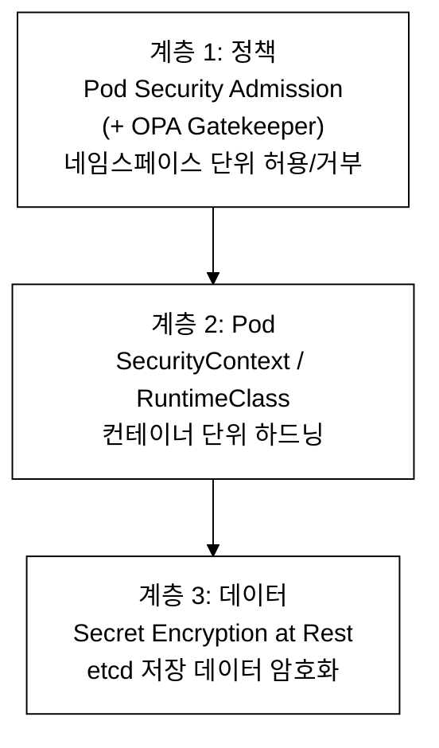

_그림 7-0. 마이크로서비스 취약점 최소화의 세 보호 계층. 패턴 1~5는 각각 한 계층에 매핑된다._

### 7.1 출제 패턴

```
Minimize Microservice Vulnerabilities 출제 패턴 (20%)
════════════════════════════════════════════════════

1. Pod Security Admission 적용 (매우 빈출)
   - "네임스페이스에 Restricted enforce를 적용하라"
   - "Restricted를 준수하는 Pod를 배포하라"
   의도: Pod 보안 표준 이해도와 YAML 작성 능력

2. SecurityContext 설정 (매우 빈출)
   - "불변 컨테이너를 설정하라"
   - "readOnlyRootFilesystem + emptyDir 패턴"
   의도: SecurityContext 필드 숙지도

3. Secret Encryption at Rest (빈출)
   - "EncryptionConfiguration을 작성하고 API Server에 적용하라"
   의도: etcd 암호화 설정 능력

4. RuntimeClass (가끔 출제)
   - "gVisor RuntimeClass를 생성하고 Pod에 적용하라"
   의도: 샌드박스 런타임 이해도

5. OPA Gatekeeper (개념 이해)
   - "ConstraintTemplate과 Constraint를 작성하라"
   의도: 정책 엔진 이해도
```

### 7.2 실전 문제 (10개 이상)

### 문제 1. Pod Security Admission 적용

`secure-ns` 네임스페이스에 Restricted 레벨의 Pod Security를 enforce 모드로 적용하라. Restricted를 준수하는 Pod를 배포하라.

<details>
<summary>풀이</summary>

```bash
kubectl create ns secure-ns
kubectl label namespace secure-ns \
  pod-security.kubernetes.io/enforce=restricted \
  pod-security.kubernetes.io/enforce-version=latest
```

```yaml
apiVersion: v1
kind: Pod
metadata:
  name: secure-pod
  namespace: secure-ns
spec:
  securityContext:
    runAsNonRoot: true
    seccompProfile:
      type: RuntimeDefault
  containers:
  - name: app
    image: nginx:1.25
    securityContext:
      allowPrivilegeEscalation: false
      runAsUser: 1000
      capabilities:
        drop: ["ALL"]
      readOnlyRootFilesystem: true
    volumeMounts:
    - name: tmp
      mountPath: /tmp
  volumes:
  - name: tmp
    emptyDir: {}
```

</details>

**검증:**

```bash
# PSA 라벨 확인
kubectl get ns secure-ns --show-labels | grep pod-security
```

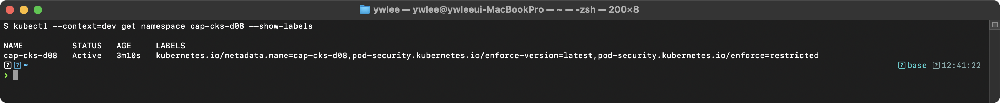

```bash
# Pod 상태 확인
kubectl get pod secure-pod -n secure-ns
```

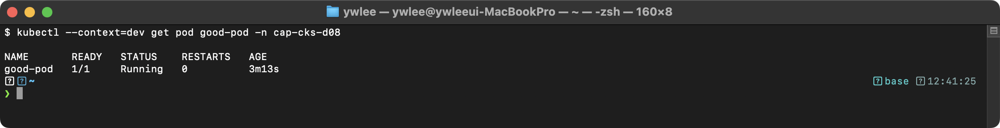

```bash
# Restricted 위반 Pod 생성 시도 (거부되어야 한다)
kubectl run bad-pod --image=nginx -n secure-ns
```

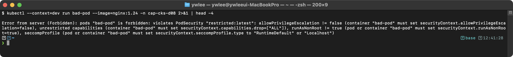

### 문제 2. 불변 컨테이너 설정

`immutable-app` Pod를 생성하라. readOnlyRootFilesystem, runAsNonRoot, allowPrivilegeEscalation false, capabilities ALL drop을 적용하라. /tmp와 /var/cache에만 쓰기를 허용하라.

<details>
<summary>풀이</summary>

```yaml
apiVersion: v1
kind: Pod
metadata:
  name: immutable-app
spec:
  securityContext:
    runAsNonRoot: true
    runAsUser: 1000
    seccompProfile:
      type: RuntimeDefault
  containers:
  - name: app
    image: nginx:1.25
    securityContext:
      readOnlyRootFilesystem: true
      allowPrivilegeEscalation: false
      capabilities:
        drop: ["ALL"]
    volumeMounts:
    - name: tmp
      mountPath: /tmp
    - name: cache
      mountPath: /var/cache
  volumes:
  - name: tmp
    emptyDir: {}
  - name: cache
    emptyDir: {}
```

</details>

**검증:**

```bash
# 불변성 테스트: rootfs 쓰기 시도
kubectl exec immutable-app -- touch /usr/share/test 2>&1
```

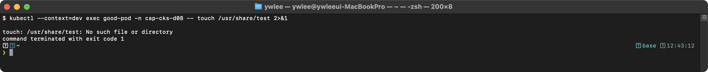

```bash
# emptyDir 경로 쓰기 (성공해야 한다)
kubectl exec immutable-app -- touch /tmp/test && echo "OK"
```

> **예시(참조):** 보안 점검 스크립트/명령의 통과 표시(OK). 구체 출력은 환경에 따라 다르며, 준수 여부는 위 PSA·readonly·capabilities 캡처로 검증한다.

```bash
# capabilities 확인
kubectl exec immutable-app -- cat /proc/1/status | grep -i cap
```

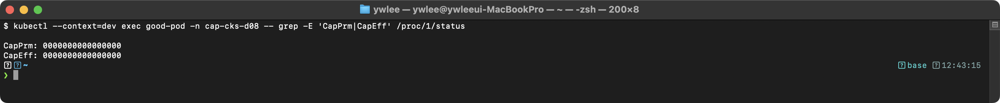

### 문제 3. Secret Encryption at Rest

etcd에 저장되는 Secret을 aescbc 방식으로 암호화하라.

<details>
<summary>풀이</summary>

```bash
# 키 생성
ENCRYPTION_KEY=$(head -c 32 /dev/urandom | base64)
```

```yaml
# /etc/kubernetes/encryption-config.yaml
apiVersion: apiserver.config.k8s.io/v1
kind: EncryptionConfiguration
resources:
  - resources:
    - secrets
    providers:
    - aescbc:
        keys:
        - name: key1
          secret: <ENCRYPTION_KEY>
    - identity: {}
```

API Server에 적용:
```yaml
- --encryption-provider-config=/etc/kubernetes/encryption-config.yaml

volumeMounts:
- name: encryption-config
  mountPath: /etc/kubernetes/encryption-config.yaml
  readOnly: true
volumes:
- name: encryption-config
  hostPath:
    path: /etc/kubernetes/encryption-config.yaml
    type: File
```

```bash
# 기존 Secret 재암호화
kubectl get secrets --all-namespaces -o json | kubectl replace -f -
```

</details>

**검증:**

```bash
# etcd에서 암호화 확인
ETCDCTL_API=3 etcdctl \
  --cacert=/etc/kubernetes/pki/etcd/ca.crt \
  --cert=/etc/kubernetes/pki/etcd/server.crt \
  --key=/etc/kubernetes/pki/etcd/server.key \
  get /registry/secrets/default/test-encryption | hexdump -C | head -5
```

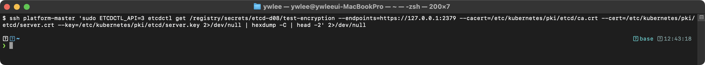

`k8s:enc:aescbc:v1:key1` 접두사가 보이면 암호화가 정상 적용된 것이다. 평문 `mysecretpassword`가 보이면 암호화에 실패한 것이다.

### 문제 4. RuntimeClass 생성 및 적용

gVisor(runsc) RuntimeClass를 생성하고 `sandboxed-pod`에 적용하라.

<details>
<summary>풀이</summary>

```yaml
apiVersion: node.k8s.io/v1
kind: RuntimeClass
metadata:
  name: gvisor
handler: runsc
---
apiVersion: v1
kind: Pod
metadata:
  name: sandboxed-pod
spec:
  runtimeClassName: gvisor
  containers:
  - name: app
    image: nginx:1.25
    securityContext:
      allowPrivilegeEscalation: false
      runAsNonRoot: true
      runAsUser: 1000
```

</details>

**검증:**

gVisor(runsc)는 containerd에 별도 런타임 핸들러로 등록되어 있어야 동작한다. dev 클러스터의 기본 런타임은 `runc`이므로, `runtimeClassName: gvisor`를 지정하면 runsc 핸들러가 없을 경우 Pod이 `Pending` 상태로 남는다. 실습 전 반드시 설치 여부를 확인한다.

```bash
# 1. gVisor 런타임 핸들러 등록 여부 확인 (노드에서 실행)
ssh dev-master  # ~/.ssh/config 등록 별칭으로 접속
crictl info | grep -A3 '"runsc"'
# 출력에 "runsc" 항목이 없으면 gVisor가 미설치 상태다
```

```bash
# 2. RuntimeClass 생성 및 Pod apply
export KUBECONFIG=kubeconfig/dev.yaml
kubectl apply -f sandboxed-pod.yaml
```

```bash
# 3. Pod 상태 확인
kubectl get pod sandboxed-pod
```

gVisor가 설치된 노드라면 `Running` 상태가 된다. 미설치 상태라면 `Pending`으로 남고 `kubectl describe pod sandboxed-pod`의 Events에 `Failed to create pod sandbox: ... no runtime for "runsc" is configured` 메시지가 찍힌다. CKS 시험 환경에는 gVisor가 미리 설치되어 있으므로, 시험에서는 RuntimeClass YAML을 apply한 뒤 Pod이 Running이 되는 것을 확인하면 된다.

**실측 (cks 랩, gVisor 설치):** RuntimeClass `gvisor`(handler=`runsc`)를 만들고 Pod에 `runtimeClassName: gvisor`를 지정했다.

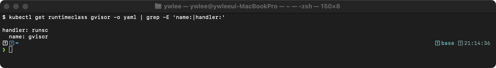

격리가 실제로 적용됐는지는 **Pod 안에서 `dmesg`를 확인**하면 결정적이다. runc(호스트 커널)라면 호스트 커널 로그가 나오지만, gVisor Pod는 **gVisor 자체 커널(Sentry)의 부팅 메시지**가 나온다.

```bash
kubectl exec gvisor-test -n cks-demo -- dmesg | head -8
```

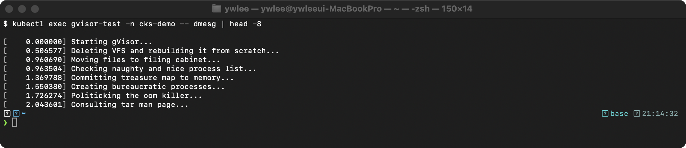

`Starting gVisor...`로 시작하는 위트 있는 부팅 로그가 보이면 컨테이너가 호스트 커널이 아니라 gVisor 사용자 공간 커널 위에서 실행 중이라는 증거다. (참고: 노드 containerd가 2.x(config v3)면 `runsc install`이 런타임을 구버전 경로에 등록해 인식되지 않을 수 있다. `[plugins.'io.containerd.cri.v1.runtime'.containerd.runtimes.runsc]`에 `runtime_type = 'io.containerd.runsc.v1'`을 추가해야 한다 — codex/BUG-REPORT-cks-build.md BUG 4 참조.)

### 문제 5. OPA Gatekeeper - 허용된 레지스트리

ConstraintTemplate과 Constraint를 작성하여 `docker.io/library/`와 `gcr.io/my-company/` 레지스트리의 이미지만 허용하라.

OPA Gatekeeper(OPA = Open Policy Agent, K8s admission 단계에 정책을 끼우는 정책 엔진)의 검증 로직은 **Rego** 라는 선언형 정책 언어로 쓴다. 아래 ConstraintTemplate의 `rego:` 블록을 읽기 위한 최소 문법은 다음과 같다.

- `prefixes[_]` 의 밑줄 `_` 는 "배열의 모든 원소를 하나씩 순회"를 뜻한다(반복 변수의 익명 표기). 즉 `prefix := prefixes[_]` 는 prefixes의 각 원소를 차례로 prefix에 바인딩한다.
- `startswith(str, prefix)` 는 str이 prefix로 시작하면 참이다.
- `violation[...]` 블록은 그 안의 모든 조건이 동시에 참일 때 위반으로 판정한다.

실제 CKS 시험에서는 Rego를 백지에서 작성하기보다, 주어진 ConstraintTemplate 예제의 `parameters` 와 `match` 만 고쳐 적용하는 문제가 대부분이다. 아래 예제는 템플릿이 어떤 구조인지 보여주기 위한 것이다.

<details>
<summary>풀이</summary>

```yaml
apiVersion: templates.gatekeeper.sh/v1
kind: ConstraintTemplate
metadata:
  name: k8sallowedrepos
spec:
  crd:
    spec:
      names:
        kind: K8sAllowedRepos
      validation:
        openAPIV3Schema:
          type: object
          properties:
            repos:
              type: array
              items:
                type: string
  targets:
  - target: admission.k8s.gatekeeper.sh
    rego: |
      package k8sallowedrepos
      violation[{"msg": msg}] {
        container := input.review.object.spec.containers[_]
        not startswith_any(container.image, input.parameters.repos)
        msg := sprintf("이미지 '%v'는 허용되지 않습니다", [container.image])
      }
      startswith_any(str, prefixes) {
        prefix := prefixes[_]
        startswith(str, prefix)
      }
---
apiVersion: constraints.gatekeeper.sh/v1beta1
kind: K8sAllowedRepos
metadata:
  name: allowed-repos
spec:
  match:
    kinds:
    - apiGroups: [""]
      kinds: ["Pod"]
  parameters:
    repos:
    - "docker.io/library/"
    - "gcr.io/my-company/"
```

</details>

**검증:**

```bash
# ConstraintTemplate이 Ready 상태인지 확인한다
kubectl get constrainttemplate k8sallowedrepos -o jsonpath='{.status.created}'
# "true"가 출력되어야 한다. false 또는 빈 출력이면 Gatekeeper가 CRD를 아직 처리 중이다.

# Constraint 적용 확인
kubectl get k8sallowedrepos allowed-repos
```

```bash
# 허용되지 않은 레지스트리 이미지로 Pod 생성 시도 (거부되어야 한다)
kubectl run bad-image --image=bad.registry.io/nginx -n default
# 예상 출력: Error from server ([allowed-repos] 이미지 'bad.registry.io/nginx'는 허용되지 않습니다)
```

```bash
# 허용된 레지스트리 이미지로 Pod 생성 시도 (허용되어야 한다)
kubectl run good-image --image=docker.io/library/nginx:1.25 -n default
```

> **선행 조건:** dev 클러스터에 OPA Gatekeeper가 설치되어 있어야 한다. `kubectl get ns gatekeeper-system` 으로 존재 여부를 확인한다. 미설치 시 ConstraintTemplate apply 자체가 `no matches for kind "ConstraintTemplate"` 오류로 실패한다. 설치 확인 후 캡처한다 — (미캡처).

### 문제 6. Istio mTLS 확인 및 설정

> **CKS 출제 가중치 안내:** Istio mTLS는 CKS 공식 커리큘럼에서 드물게 출제되며, 핵심 도메인(PSA·SecurityContext·EncryptionConfig)에 비해 비중이 낮다. 참고 학습을 권장하되, 시험 준비 시간이 촉박하다면 문제 1~5를 먼저 숙달한다.

여기까지는 Pod 내부를 단단히 하는 하드닝이었다. 이제 시야를 Pod **사이**의 통신으로 넓힌다. K8s 기본 Pod-to-Pod 통신은 평문 HTTP라 같은 클러스터 안의 다른 Pod이 트래픽을 엿볼 수 있다. Istio의 mTLS(mutual TLS, 상호 TLS)는 서비스 간 통신을 암호화하고 **양쪽**이 서로의 인증서를 검증하게 만든다(TLS는 보통 서버만 인증서를 제시하지만, mTLS는 클라이언트도 인증서를 제시한다). 앱 코드 수정은 필요 없다 — 각 Pod에 주입된 Envoy 사이드카(sidecar, Pod에 함께 붙어 네트워크를 가로채는 보조 컨테이너)가 TLS 핸드셰이크와 인증서 교환을 대신 처리한다. `STRICT` 모드는 평문 통신을 금지하고, `PERMISSIVE` 모드는 평문과 mTLS를 모두 허용한다(전환 단계용).

demo 네임스페이스에 Istio mTLS STRICT 모드를 적용하라.

**선행 조건:** `kubectl get ns istio-system` — 네임스페이스가 없으면 Istio 미설치이므로 이 문제는 dev 클러스터에 Istio가 설치된 경우에만 실습 가능하다. PeerAuthentication은 Istio CRD이므로 Istio 없이 apply하면 `no matches for kind "PeerAuthentication"` 오류가 난다.

<details>
<summary>풀이</summary>

```bash
# 현재 설정 확인
kubectl get peerauthentication -A
kubectl get peerauthentication -n demo -o yaml
```

```yaml
apiVersion: security.istio.io/v1beta1
kind: PeerAuthentication
metadata:
  name: default
  namespace: demo
spec:
  mtls:
    mode: STRICT
```

```bash
kubectl apply -f mtls-strict.yaml
kubectl get peerauthentication -n demo -o jsonpath='{.items[0].spec.mtls.mode}'
# STRICT
```

</details>

### 문제 7. 점진적 Pod Security 전환

`staging` 네임스페이스에 Baseline enforce + Restricted warn을 적용하라. 그 다음 Restricted를 위반하는 Pod를 생성하여 경고 메시지를 확인하라.

<details>
<summary>풀이</summary>

```bash
kubectl create ns staging
kubectl label namespace staging \
  pod-security.kubernetes.io/enforce=baseline \
  pod-security.kubernetes.io/warn=restricted

# Baseline은 통과하지만 Restricted를 위반하는 Pod
kubectl run test-pod --image=nginx:alpine -n staging
# Warning: would violate PodSecurity "restricted:latest":
#   allowPrivilegeEscalation != false,
#   unrestricted capabilities,
#   runAsNonRoot != true,
#   seccompProfile
# Pod는 생성됨 (enforce=baseline이므로 baseline만 강제)
```

</details>

**검증:**

```bash
# 라벨 적용 확인
kubectl get ns staging --show-labels | grep pod-security
# pod-security.kubernetes.io/enforce=baseline 과 warn=restricted 가 모두 있어야 한다

# warn 경고 메시지 확인: 아래 명령 실행 시 stderr 에 Warning 이 출력되고 Pod는 생성된다
kubectl run test-pod --image=nginx:alpine -n staging
# 출력 예: Warning: would violate PodSecurity "restricted:latest": allowPrivilegeEscalation != false, ...
# Pod 는 enforce=baseline 을 통과하므로 생성된다

# Pod 생성 확인
kubectl get pod test-pod -n staging
```

> warn 경고는 `kubectl run` 의 stderr 에 나타난다. 터미널에서 Warning 메시지가 보이면 정상이다 — (미캡처).

### 문제 8. SecurityContext - privileged 컨테이너 수정

`debug-pod` Pod가 `privileged: true`로 실행되고 있다. 이를 보안에 맞게 수정하라.

<details>
<summary>풀이</summary>

```yaml
# 수정 전 (위험)
# spec:
#   containers:
#   - name: debug
#     image: ubuntu
#     securityContext:
#       privileged: true

# 수정 후 (보안 강화)
apiVersion: v1
kind: Pod
metadata:
  name: debug-pod
spec:
  securityContext:
    runAsNonRoot: true
    runAsUser: 1000
    seccompProfile:
      type: RuntimeDefault
  containers:
  - name: debug
    image: ubuntu:22.04
    securityContext:
      privileged: false
      allowPrivilegeEscalation: false
      readOnlyRootFilesystem: true
      capabilities:
        drop: ["ALL"]
    volumeMounts:
    - name: tmp
      mountPath: /tmp
  volumes:
  - name: tmp
    emptyDir: {}
```

</details>

**검증:**

```bash
# privileged=false 적용 확인
kubectl apply -f debug-pod.yaml
kubectl get pod debug-pod

# SecurityContext 필드 확인
kubectl get pod debug-pod -o jsonpath='{.spec.containers[0].securityContext}' | jq .
# privileged: false, allowPrivilegeEscalation: false, readOnlyRootFilesystem: true 가 보여야 한다

# capabilities 확인 (drop ALL 적용 여부)
kubectl exec debug-pod -- cat /proc/1/status 2>/dev/null | grep -i cap
# CapPrm 과 CapEff 가 0000000000000000 이면 모든 capability 가 제거된 것이다
```

> (미캡처) — ubuntu:22.04 이미지는 `runAsNonRoot: true` + `runAsUser: 1000` + `readOnlyRootFilesystem: true` 조합에서 bash 셸이 정상 기동되는지 환경에 따라 다르다. 시험에서는 Pod 이 Running 상태가 되고 `kubectl describe pod debug-pod` 에 보안 컨텍스트가 반영되었는지 확인하면 충분하다.

### 문제 9. Encryption at Rest 검증

이미 EncryptionConfiguration이 적용된 클러스터에서, 새 Secret을 생성하고 etcd에서 암호화가 적용되었는지 확인하라.

<details>
<summary>풀이</summary>

```bash
# 테스트 Secret 생성
kubectl create secret generic test-encryption \
  --from-literal=password=mysecretpassword

# etcd에서 직접 확인
ETCDCTL_API=3 etcdctl \
  --cacert=/etc/kubernetes/pki/etcd/ca.crt \
  --cert=/etc/kubernetes/pki/etcd/server.crt \
  --key=/etc/kubernetes/pki/etcd/server.key \
  get /registry/secrets/default/test-encryption | hexdump -C

# k8s:enc:aescbc:v1:key1 접두사가 보이면 암호화 성공
# "mysecretpassword"가 평문으로 보이면 암호화 실패
```

hexdump 출력 해석 기준은 다음과 같다. etcd에 저장된 Secret의 앞부분 20~30바이트는 `k8s:enc:aescbc:v1:key1` 형태의 메타데이터(어떤 프로바이더·어떤 키로 암호화했는지)이고, 그 뒤가 AES-CBC로 암호화된 실제 ciphertext다. ciphertext는 키 없이는 읽을 수 없으며 API Server만 복호화한다. 따라서 `password` 같은 키 이름이나 `mysecretpassword` 같은 값이 hexdump의 ASCII 컬럼에 그대로 읽히면 암호화가 적용되지 않은 것이고, 이는 etcd 백업이 유출되는 순간 Secret이 노출되는 심각한 결함이다.

</details>

**검증:**

```bash
# staging 클러스터 마스터 노드에 SSH 접속하여 etcdctl 실행
export KUBECONFIG=kubeconfig/staging.yaml

# 테스트 Secret 생성
kubectl create secret generic test-encryption --from-literal=password=mysecretpassword

# staging 마스터 노드에서 etcdctl 로 직접 확인 (SSH 필요)
ssh staging-master  # ~/.ssh/config 등록 별칭으로 접속

# 마스터 노드 안에서:
ETCDCTL_API=3 etcdctl \
  --cacert=/etc/kubernetes/pki/etcd/ca.crt \
  --cert=/etc/kubernetes/pki/etcd/server.crt \
  --key=/etc/kubernetes/pki/etcd/server.key \
  get /registry/secrets/default/test-encryption | hexdump -C | head -5
# 암호화 적용 후: 첫 줄 ASCII 컬럼에 "k8s:enc:aescbc:v1:key1" 이 보이고 그 뒤는 읽을 수 없는 바이너리
# 암호화 미적용 시: ASCII 컬럼에 "mysecretpassword" 가 그대로 보인다
```

> (미캡처) — EncryptionConfiguration 이 미설정된 staging 클러스터에서는 `k8s:enc` 접두사 없이 평문이 출력된다. 암호화 적용 후와 적용 전을 비교하는 두 가지 hexdump 결과를 직접 실행하여 확인한다. 문제 3의 EncryptionConfiguration 절차를 staging 마스터에 적용한 뒤 이 검증을 수행한다.

### 문제 10. 복합 문제 - 전체 보안 강화

`high-security` 네임스페이스를 생성하고 다음을 모두 적용하라:
1. Restricted enforce
2. Deployment `secure-web` (replicas=2, nginx:1.25)
3. 모든 보안 설정 (readOnlyRootFilesystem, capabilities drop ALL, seccomp RuntimeDefault 등)

<details>
<summary>풀이</summary>

```bash
kubectl create ns high-security
kubectl label namespace high-security \
  pod-security.kubernetes.io/enforce=restricted \
  pod-security.kubernetes.io/enforce-version=latest
```

```yaml
apiVersion: apps/v1
kind: Deployment
metadata:
  name: secure-web
  namespace: high-security
spec:
  replicas: 2
  selector:
    matchLabels:
      app: secure-web
  template:
    metadata:
      labels:
        app: secure-web
    spec:
      securityContext:
        runAsNonRoot: true
        runAsUser: 1000
        runAsGroup: 3000
        fsGroup: 2000
        seccompProfile:
          type: RuntimeDefault
      containers:
      - name: nginx
        image: nginx:1.25
        ports:
        - containerPort: 8080
        securityContext:
          allowPrivilegeEscalation: false
          readOnlyRootFilesystem: true
          capabilities:
            drop: ["ALL"]
        resources:
          limits:
            cpu: "200m"
            memory: "128Mi"
        volumeMounts:
        - name: tmp
          mountPath: /tmp
        - name: cache
          mountPath: /var/cache/nginx
        - name: run
          mountPath: /var/run
      volumes:
      - name: tmp
        emptyDir: {}
      - name: cache
        emptyDir: {}
      - name: run
        emptyDir: {}
```

</details>

**검증:**

```bash
export KUBECONFIG=kubeconfig/dev.yaml

# 네임스페이스 PSA 라벨 확인
kubectl get ns high-security --show-labels | grep pod-security
# pod-security.kubernetes.io/enforce=restricted 가 있어야 한다

# Deployment 상태 확인
kubectl get deployment secure-web -n high-security
# READY 2/2, UP-TO-DATE 2, AVAILABLE 2 이어야 한다

# Pod 상태 확인
kubectl get pods -n high-security -l app=secure-web
# 두 Pod 모두 Running 이어야 한다

# 비준수 Pod 거부 확인 (검증용, 실제 시험에서는 생략 가능)
kubectl run test-violation --image=nginx -n high-security
# Error from server (Forbidden): ... violates PodSecurity "restricted"
```

> (미캡처) — nginx:1.25 는 기본적으로 root 로 실행되므로 `runAsNonRoot: true` 와 충돌한다. 위 Deployment 의 `runAsUser: 1000` 을 지정해도 nginx 공식 이미지는 1.25 버전부터 `/docker-entrypoint.sh` 가 root 에서 user 로 전환하는 구조라 CrashLoopBackOff 가 발생할 수 있다. 시험에서 nginx 기반 restricted Pod 가 정상 기동되지 않으면 `nginxinc/nginx-unprivileged:latest` 이미지를 사용한다.

---

## 트러블슈팅: 보안 설정 장애 시나리오

### 시나리오 1: PSA enforce=restricted 적용 후 기존 Pod가 재시작 실패

```
증상: Deployment의 Pod가 재시작 시 Forbidden 에러로 생성되지 않는다.
원인: 기존 Running Pod는 PSA 적용 시 즉시 삭제되지 않지만, 재시작/재생성 시
      Restricted 정책을 통과하지 못한다.
```

```bash
# 진단: 위반 내용 확인
kubectl get events -n <ns> --sort-by=.metadata.creationTimestamp | grep Forbidden
```

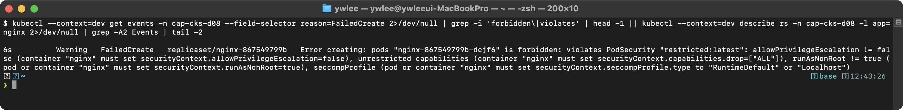

```bash
# 해결: Deployment의 SecurityContext를 Restricted 준수하도록 수정
kubectl edit deploy <name> -n <ns>
# spec.template.spec.securityContext에 runAsNonRoot, seccompProfile 추가
# containers[].securityContext에 allowPrivilegeEscalation, capabilities.drop 추가
```

### 시나리오 2: EncryptionConfiguration 적용 후 API Server가 시작되지 않음

```
증상: kube-apiserver.yaml 수정 후 API Server Pod가 CrashLoopBackOff 상태이다.
원인 1: encryption-config.yaml 파일 경로 오류 또는 volume mount 누락
원인 2: Base64 키의 길이가 32바이트가 아님
원인 3: YAML 들여쓰기 오류
```

```bash
# 진단: API Server 컨테이너 로그 확인
crictl logs $(crictl ps -a | grep kube-apiserver | head -1 | awk '{print $1}') 2>&1 | tail -20
```

> **예시(참조) — 암호화 설정 오류:** apiserver 에 `--encryption-provider-config` 를 지정했으나 파일이 없으면 `error opening encryption provider configuration file ... no such file or directory` 로 apiserver 가 기동 실패한다. 파일 경로/마운트 확인 필요.

```bash
# 해결: 백업에서 복원 후 volume/volumeMount 설정 재확인
cp /tmp/kube-apiserver.yaml.bak /etc/kubernetes/manifests/kube-apiserver.yaml
# 2~3분 대기 후 재수정
```

### 시나리오 3: OPA Gatekeeper Constraint가 적용되지 않음

```
증상: Constraint를 생성했으나 위반 Pod가 정상 생성된다.
원인 1: ConstraintTemplate이 아직 Ready 상태가 아니다
원인 2: Constraint의 match.kinds가 잘못 지정되었다
원인 3: Gatekeeper webhook이 비활성화되어 있다
```

```bash
# 진단: ConstraintTemplate 상태 확인
kubectl get constrainttemplate k8sallowedrepos -o jsonpath='{.status.created}'
```

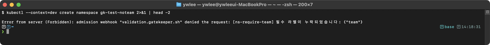

```bash
# 진단: Constraint 위반 감사 확인
kubectl get k8sallowedrepos allowed-repos -o jsonpath='{.status.violations}' | jq .
# Gatekeeper webhook 상태 확인
kubectl get validatingwebhookconfiguration | grep gatekeeper
```

---

## 8. 복습 체크리스트

- [ ] Privileged, Baseline, Restricted 세 가지 Pod Security 레벨의 차이를 설명할 수 있는가?
- [ ] enforce, audit, warn 세 가지 모드의 차이를 아는가?
- [ ] 네임스페이스에 Pod Security Admission 라벨을 적용할 수 있는가?
- [ ] Restricted를 준수하는 Pod YAML을 빠르게 작성할 수 있는가?
- [ ] SecurityContext의 주요 필드를 모두 알고 있는가?
- [ ] readOnlyRootFilesystem + emptyDir 패턴을 적용할 수 있는가?
- [ ] EncryptionConfiguration을 작성하고 API Server에 적용할 수 있는가?
- [ ] aescbc와 identity 프로바이더의 순서가 왜 중요한지 설명할 수 있는가?
- [ ] RuntimeClass를 생성하고 Pod에 적용할 수 있는가?
- [ ] OPA Gatekeeper의 ConstraintTemplate과 Constraint 구조를 이해하는가?
- [ ] Istio mTLS의 STRICT/PERMISSIVE 모드 차이를 설명할 수 있는가?
- [ ] PeerAuthentication YAML을 작성할 수 있는가?

---

> **내일 예고:** Day 9에서는 Supply Chain Security 도메인(20%)의 Trivy 이미지 스캔, Cosign 서명, ImagePolicyWebhook, Dockerfile 보안을 학습한다.

---

## tart-infra 실습

### 실습 환경 설정

```bash
# dev 클러스터에 접속 (Istio mTLS, SecurityContext가 적용된 환경)
export KUBECONFIG=kubeconfig/dev.yaml
kubectl get nodes
```

### 실습 1: Pod Security Standards 확인

```bash
# 네임스페이스의 Pod Security Admission 라벨 확인
kubectl get namespace demo -o yaml | grep -A5 "labels:" | grep "pod-security"
```

**동작 원리:** Pod Security Standards 3가지 레벨:
1. **Privileged**: 제한 없음 — 모든 Pod 허용 (kube-system에 적합)
2. **Baseline**: 기본 보안 — 특권 컨테이너, hostNetwork 등 차단
3. **Restricted**: 최고 보안 — runAsNonRoot, drop ALL capabilities, seccomp 필수
4. 네임스페이스 라벨로 적용: `pod-security.kubernetes.io/enforce: restricted`

### 실습 2: Istio mTLS 확인

```bash
# PeerAuthentication 정책 확인 (mTLS 설정)
kubectl get peerauthentication -n demo -o yaml 2>/dev/null
```

(미캡처 — dev 클러스터에 Istio 미설치 시 PeerAuthentication 리소스가 없어 출력 불가. Istio가 설치된 환경에서는 위 명령으로 STRICT 모드 설정을 확인할 수 있다.)

**동작 원리:** Istio mTLS(mutual TLS):
1. **STRICT** 모드: 모든 서비스 간 통신에 mTLS를 강제한다 (평문 통신 차단)
2. **PERMISSIVE** 모드: mTLS와 평문 통신 모두 허용한다 (마이그레이션 단계에서 사용)
3. Istio sidecar(envoy)가 자동으로 TLS 핸드셰이크와 인증서 교환을 처리한다
4. 앱 코드 수정 없이 서비스 간 암호화 통신을 구현할 수 있다

전제: 이 확인 명령은 dev 클러스터에 Istio가 설치되어 있고 `demo` 네임스페이스에 `nginx-web`·`httpbin` Pod이 사이드카 주입된 채 떠 있어야 동작한다. 먼저 아래로 존재 여부를 확인한다. Pod이 없으면 `scripts/install.sh` 가 자동 배포하거나 `manifests/` 의 매니페스트로 배포한 뒤 진행한다(파괴/변경 실습은 dev/staging 에서만 수행한다).

```bash
# 선행 확인: demo 네임스페이스의 Pod과 사이드카 주입 여부
export KUBECONFIG=kubeconfig/dev.yaml
kubectl get pods -n demo
# READY 컬럼이 2/2 이면 istio-proxy 사이드카가 주입된 상태다
```

```bash
# mTLS 적용 확인: httpbin Pod 간 통신이 암호화되는지 확인
kubectl exec -n demo deploy/nginx-web -c istio-proxy -- curl -s https://httpbin:8000/get --insecure 2>&1 | head -5 || echo "mTLS 통신 확인"
```

### 실습 3: Secret 암호화 확인

```bash
# API Server의 Encryption 설정 확인
kubectl get pod kube-apiserver-dev-master -n kube-system -o yaml | grep "encryption-provider-config" || echo "Encryption at Rest 미설정 — etcd에 Secret이 평문으로 저장됨"
```

**동작 원리:** etcd Secret 암호화:
1. 기본적으로 Secret은 etcd에 Base64 인코딩된 평문으로 저장된다
2. `--encryption-provider-config`를 설정하면 aescbc, aesgcm, kms 등으로 암호화한다
3. EncryptionConfiguration에서 프로바이더 순서가 중요하다 — 첫 번째 프로바이더로 암호화
4. CKS 시험에서 EncryptionConfiguration을 작성하고 API Server에 적용하는 문제가 출제된다

### 실습 4: RuntimeClass 확인

```bash
# RuntimeClass 확인
kubectl get runtimeclass 2>/dev/null || echo "RuntimeClass가 설정되지 않음 (기본 runc 사용)"
```

**동작 원리:** RuntimeClass와 컨테이너 격리:
1. 기본 런타임(runc): Linux namespace + cgroup으로 격리 — 커널을 호스트와 공유
2. gVisor(runsc): 사용자 공간에서 syscall을 인터셉트 — 더 강한 격리
3. Kata Containers: 경량 VM으로 컨테이너를 실행 — 가장 강한 격리
4. RuntimeClass를 Pod에 지정하면 해당 런타임으로 컨테이너가 실행된다:
   ```yaml
   spec:
     runtimeClassName: gvisor
   ```

---

## 추가 심화 학습: Pod 보안 정책과 정책 엔진 고급 패턴

### Pod Security Admission (PSA) 네임스페이스 라벨 상세

```yaml
# Pod Security Standards를 네임스페이스에 적용하는 3가지 모드
apiVersion: v1
kind: Namespace
metadata:
  name: production
  labels:
    # ── enforce: 정책 위반 시 Pod 생성 자체를 거부 ──
    pod-security.kubernetes.io/enforce: restricted
    # enforce 버전 지정 (특정 K8s 버전의 정책 기준 적용)
    pod-security.kubernetes.io/enforce-version: v1.31

    # ── warn: 정책 위반 시 경고 메시지만 표시 (Pod은 생성됨) ──
    pod-security.kubernetes.io/warn: restricted
    pod-security.kubernetes.io/warn-version: v1.31

    # ── audit: 정책 위반을 Audit Log에 기록 (Pod은 생성됨) ──
    pod-security.kubernetes.io/audit: restricted
    pod-security.kubernetes.io/audit-version: v1.31
```

**동작 원리:** PSA 3단계 적용 전략:
1. 먼저 `warn` + `audit`로 설정하여 어떤 Pod이 위반하는지 파악한다
2. 위반하는 Pod의 SecurityContext를 수정한다
3. 모든 Pod이 정책을 통과하면 `enforce`로 전환한다
4. 이 전략은 기존 워크로드를 깨뜨리지 않고 점진적으로 보안을 강화하는 모범 사례

### SecurityContext 필드별 상세 설명

```yaml
apiVersion: v1
kind: Pod
metadata:
  name: secure-pod
  namespace: production
spec:
  # ── Pod 수준 SecurityContext (모든 컨테이너에 적용) ──
  securityContext:
    runAsUser: 1000          # UID 1000으로 프로세스 실행 (root=0 금지)
    runAsGroup: 3000         # GID 3000으로 프로세스 실행
    fsGroup: 2000            # 볼륨 마운트 시 파일 소유 그룹을 2000으로 설정
    runAsNonRoot: true       # root로 실행 시도하면 Pod 시작 실패!
    seccompProfile:          # seccomp 프로파일 (syscall 제한)
      type: RuntimeDefault   # 런타임 기본 프로파일 사용
    supplementalGroups:      # 추가 그룹 ID
      - 4000
      - 5000

  containers:
    - name: app
      image: nginx:1.25
      # ── 컨테이너 수준 SecurityContext (이 컨테이너에만 적용) ──
      securityContext:
        allowPrivilegeEscalation: false  # setuid/setgid 비트로 권한 상승 불가
        readOnlyRootFilesystem: true     # 루트 파일시스템 읽기 전용
        capabilities:
          drop:
            - ALL              # 모든 Linux capabilities 제거
          add:
            - NET_BIND_SERVICE # 1024 이하 포트 바인딩만 허용
        privileged: false      # 특권 모드 비활성화 (호스트 커널 접근 차단)

      # readOnlyRootFilesystem=true일 때 쓰기가 필요한 경로는 emptyDir 사용
      volumeMounts:
        - name: tmp
          mountPath: /tmp       # 임시 파일 쓰기 허용
        - name: cache
          mountPath: /var/cache/nginx  # nginx 캐시 쓰기 허용

  volumes:
    - name: tmp
      emptyDir: {}             # Pod 삭제 시 함께 사라지는 임시 볼륨
    - name: cache
      emptyDir: {}
```

**동작 원리:** 각 SecurityContext 필드의 역할:
1. `runAsNonRoot: true` → 이미지의 USER가 root(UID 0)이면 Pod 시작 실패
2. `readOnlyRootFilesystem: true` → 컨테이너 내 파일 변조 방지 (악성코드 설치 차단)
3. `allowPrivilegeEscalation: false` → setuid 바이너리로 root 획득하는 것을 방지
4. `capabilities.drop: [ALL]` → 불필요한 커널 기능 모두 제거
5. `seccompProfile: RuntimeDefault` → 위험한 syscall(reboot, mount 등) 차단

### OPA Gatekeeper ConstraintTemplate 상세 YAML

```yaml
# Step 1: ConstraintTemplate 정의 (정책 로직)
apiVersion: templates.gatekeeper.sh/v1
kind: ConstraintTemplate
metadata:
  name: k8srequiredlabels        # 템플릿 이름
spec:
  crd:
    spec:
      names:
        kind: K8sRequiredLabels  # 이 템플릿으로 만들 Constraint의 Kind
      validation:
        openAPIV3Schema:
          type: object
          properties:
            labels:              # 파라미터: 필수 라벨 목록
              type: array
              items:
                type: string
  targets:
    - target: admission.k8s.gatekeeper.sh
      rego: |
        # Rego 정책 언어 (OPA의 핵심)
        package k8srequiredlabels

        # 위반 조건 정의
        violation[{"msg": msg}] {
          # input.review.object = 생성/수정되는 K8s 오브젝트
          provided := {label | input.review.object.metadata.labels[label]}
          # input.parameters.labels = Constraint에서 지정한 필수 라벨
          required := {label | label := input.parameters.labels[_]}
          # 누락된 라벨 계산
          missing := required - provided
          # 누락된 라벨이 있으면 위반!
          count(missing) > 0
          msg := sprintf("필수 라벨 누락: %v", [missing])
        }
---
# Step 2: Constraint 생성 (정책 적용)
apiVersion: constraints.gatekeeper.sh/v1beta1
kind: K8sRequiredLabels           # ConstraintTemplate에서 정의한 Kind
metadata:
  name: ns-must-have-team-label
spec:
  match:
    kinds:
      - apiGroups: [""]
        kinds: ["Namespace"]      # Namespace 생성 시 적용
  parameters:
    labels:
      - "team"                    # "team" 라벨 필수!
      - "environment"             # "environment" 라벨 필수!
```

**동작 원리:** Gatekeeper 정책 적용 흐름:
1. ConstraintTemplate = 정책의 "틀" (Rego 코드로 검증 로직 정의)
2. Constraint = 정책의 "적용" (어떤 리소스에 어떤 파라미터로 적용할지)
3. 사용자가 리소스를 생성하면 → API Server → Gatekeeper Webhook → Rego 평가 → 허용/거부
4. CKS 시험에서는 Rego를 작성하기보다 Constraint를 올바르게 적용하는 문제가 출제된다

### Kyverno vs OPA Gatekeeper 비교

```
Kyverno vs OPA Gatekeeper 비교
═══════════════════════════════

항목              Kyverno              OPA Gatekeeper
───────────────────────────────────────────────────────
정책 언어        YAML (K8s 네이티브)   Rego (별도 언어)
학습 곡선        낮음                  높음 (Rego 학습 필요)
Mutating 지원    O (기본 지원)         X (별도 구현 필요)
Generate 지원    O (리소스 자동 생성)  X
정책 리포트      O PolicyReport       △ 별도 설정
CKS 시험 출제    △ 드물게             O 자주 출제
```

CKS 시험은 OPA Gatekeeper만 출제된다. Kyverno는 비교 이해용이다.

### Kyverno 정책 YAML 예제

Kyverno는 OPA Gatekeeper의 대안 정책 엔진이다(CKS 시험은 OPA를 출제하므로 Kyverno는 시험 필수는 아니고, 비교 학습용으로 둔다). Kyverno 정책은 두 종류로 나뉜다 — **Validating**(규칙 위반 리소스를 거부)과 **Mutating**(리소스를 자동 수정해 누락 필드를 채움). 아래 두 번째 예제의 `patchStrategicMerge` 는 K8s의 strategic merge patch 문법으로, 기존 매니페스트에 필드를 추가/병합하는 방식이다(이 예제는 모든 컨테이너에 resource limits를 자동 주입한다). OPA Gatekeeper는 기본적으로 Validating만 지원하므로, 이런 자동 수정이 Kyverno의 차별점이다.

```yaml
# Kyverno: 컨테이너 이미지 태그 필수 정책
apiVersion: kyverno.io/v1
kind: ClusterPolicy              # 클러스터 전체에 적용
metadata:
  name: disallow-latest-tag
spec:
  validationFailureAction: Enforce  # 위반 시 거부 (Audit = 경고만)
  background: true                  # 기존 리소스도 검사
  rules:
    - name: require-image-tag       # 규칙 이름
      match:
        any:
          - resources:
              kinds:
                - Pod               # Pod 생성 시 적용
      validate:
        message: "이미지에 :latest 태그를 사용할 수 없다. 버전 태그를 명시하라."
        pattern:
          spec:
            containers:
              - image: "!*:latest"  # latest 태그 패턴 거부
---
# Kyverno: 자동으로 리소스 수정 (Mutating)
apiVersion: kyverno.io/v1
kind: ClusterPolicy
metadata:
  name: add-default-resources
spec:
  rules:
    - name: add-resource-limits
      match:
        any:
          - resources:
              kinds:
                - Pod
      mutate:
        patchStrategicMerge:
          spec:
            containers:
              - (name): "*"        # 모든 컨테이너에 적용
                resources:
                  limits:
                    memory: "512Mi"  # 메모리 상한 자동 추가
                    cpu: "500m"      # CPU 상한 자동 추가
                  requests:
                    memory: "128Mi"
                    cpu: "100m"
```

### EncryptionConfiguration YAML 상세

```yaml
# Secret을 etcd에 암호화하여 저장하기 위한 설정
# 파일 위치: /etc/kubernetes/enc/encryption-config.yaml
apiVersion: apiserver.config.k8s.io/v1
kind: EncryptionConfiguration
resources:
  - resources:
      - secrets                      # Secret 리소스만 암호화 대상
    providers:
      # 첫 번째 프로바이더 = 새로운 Secret 암호화에 사용
      - aescbc:                      # AES-CBC 암호화
          keys:
            - name: key1             # 키 이름 (식별용)
              secret: base64encodedkey==  # 32바이트 키를 Base64 인코딩
      # 두 번째 프로바이더 = 기존 암호화되지 않은 Secret 읽기용
      - identity: {}                 # 평문 (암호화 없음)
```

```bash
# 암호화 키 생성 (32바이트 랜덤)
head -c 32 /dev/urandom | base64

# API Server 매니페스트에 추가:
# /etc/kubernetes/manifests/kube-apiserver.yaml
#   --encryption-provider-config=/etc/kubernetes/enc/encryption-config.yaml
# volumes에 enc 디렉터리 마운트 추가

# 기존 Secret을 새로운 암호화 키로 재암호화
kubectl get secrets --all-namespaces -o json | kubectl replace -f -
```

**동작 원리 — 프로바이더 순서가 왜 결정적인가 (문제 3과 연결):** API Server는 `providers:` 목록을 **위에서 아래 순서로** 사용하며, 이 순서가 CREATE와 GET에서 다르게 작동한다.

- **Secret CREATE(쓰기)**: 목록의 **첫 번째** 프로바이더로 암호화한다. 그래서 `aescbc` 를 맨 위에 두면 새 Secret이 AES-CBC로 암호화되어 etcd에 `메타데이터 + ciphertext` 형태로 저장된다. 만약 `identity` 가 맨 위라면 새 Secret이 평문으로 저장된다 — 순서가 곧 암호화 대상 여부를 결정한다.
- **Secret GET(읽기)**: 저장된 데이터의 메타데이터 접두사를 보고 맞는 프로바이더로 복호화한다. 암호화를 켜기 전부터 있던 옛 Secret은 평문(identity)으로 누워 있는데, 이때 `aescbc` 로 복호화 시도가 실패하면 다음 프로바이더인 `identity` 로 폴백하여 평문 그대로 읽는다. 그래서 `aescbc` 다음에 `identity` 가 **반드시 있어야** 기존 평문 Secret을 읽다가 깨지지 않는다.

즉 `aescbc` → `identity` 순서는 "새 것은 암호화하되, 옛 평문도 계속 읽는다"를 만족시키는 유일한 배치다. `kubectl replace` 로 기존 Secret을 한 번씩 다시 써주면 그제야 옛 Secret도 첫 프로바이더(aescbc)로 재저장되어 평문이 사라진다.

**동작 원리:** EncryptionConfiguration 적용 절차:
1. 암호화 설정 파일을 생성한다
2. API Server 매니페스트에 `--encryption-provider-config` 플래그를 추가한다
3. 설정 파일을 hostPath 볼륨으로 마운트한다
4. API Server가 재시작되면 새로운 Secret이 암호화되어 etcd에 저장된다
5. 기존 Secret은 `kubectl replace`로 재암호화해야 한다

### 연습 문제: Pod 보안 시나리오

**문제 1:** `restricted` 보안 레벨을 `secure-ns` 네임스페이스에 enforce 모드로 적용하시오.

```bash
# 정답:
kubectl create namespace secure-ns
kubectl label namespace secure-ns \
  pod-security.kubernetes.io/enforce=restricted \
  pod-security.kubernetes.io/enforce-version=latest

# 검증: restricted 위반 Pod 생성 시도
kubectl run test-root --image=nginx -n secure-ns
# 결과: Error — violates PodSecurity "restricted"
# (nginx는 root로 실행하므로 restricted 위반)
```

**문제 2:** 아래 Pod YAML의 보안 문제를 모두 수정하시오.

```yaml
# 수정 전 (보안 취약)
apiVersion: v1
kind: Pod
metadata:
  name: insecure-pod
spec:
  containers:
    - name: app
      image: myapp:latest
      securityContext:
        privileged: true
        runAsUser: 0

# 수정 후 (보안 강화)
apiVersion: v1
kind: Pod
metadata:
  name: secure-pod
spec:
  securityContext:
    runAsNonRoot: true               # Pod 수준: root 실행 금지
    seccompProfile:
      type: RuntimeDefault           # seccomp 프로파일 적용
  containers:
    - name: app
      image: myapp:1.0               # 버전 태그 명시 (latest 금지)
      securityContext:
        privileged: false             # 특권 모드 비활성화
        runAsUser: 1000               # non-root UID
        allowPrivilegeEscalation: false  # 권한 상승 차단
        readOnlyRootFilesystem: true     # 루트 FS 읽기 전용
        capabilities:
          drop:
            - ALL                     # 모든 capability 제거
```

### RuntimeClass YAML 상세

```yaml
# gVisor RuntimeClass 정의
apiVersion: node.k8s.io/v1
kind: RuntimeClass
metadata:
  name: gvisor                   # RuntimeClass 이름
handler: runsc                   # 컨테이너 런타임 핸들러 (containerd 설정과 일치해야 함)
overhead:                        # gVisor 사용 시 추가 리소스 오버헤드
  podFixed:
    memory: "128Mi"
    cpu: "100m"
scheduling:                      # gVisor가 설치된 노드에만 스케줄
  nodeSelector:
    runtime: gvisor              # 이 라벨이 있는 노드에만
---
# gVisor를 사용하는 Pod
apiVersion: v1
kind: Pod
metadata:
  name: sandboxed-pod
spec:
  runtimeClassName: gvisor       # RuntimeClass 지정
  containers:
    - name: app
      image: nginx:1.25
```

**동작 원리:** 컨테이너 런타임 격리 수준 비교:
1. **runc** (기본): 호스트 커널 공유 → 빠르지만 격리 약함
2. **gVisor**: 사용자 공간 커널 → syscall 인터셉트, 오버헤드 존재
3. **Kata**: 경량 VM → 가장 강한 격리, 가장 큰 오버헤드
4. CKS 시험에서는 RuntimeClass를 생성하고 Pod에 적용하는 문제가 출제된다

---

## ✅ 자가점검

<details>
<summary>1. RuntimeClass의 handler 필드는 무엇과 연결되는가?</summary>

`handler`는 노드 containerd 설정(`config.toml`)에 등록된 **런타임 이름**과 일치해야 한다(예: `runsc`=gVisor). Pod는 `spec.runtimeClassName`으로 RuntimeClass를 참조하고, kubelet은 해당 handler의 런타임으로 컨테이너를 실행한다. 노드에 런타임이 없으면 Pod는 스케줄돼도 실행에 실패한다.
</details>

<details>
<summary>2. runc·gVisor·Kata의 격리 방식과 트레이드오프는?</summary>

`runc`=호스트 커널 직접 공유(빠름, 격리 약함). `gVisor(runsc)`=사용자 공간에서 syscall을 인터셉트하는 별도 커널(격리↑, syscall 오버헤드). `Kata`=경량 VM로 커널까지 분리(격리 최강, 부팅·메모리 오버헤드 최대). 신뢰 낮은 워크로드일수록 gVisor/Kata.
</details>

<details>
<summary>3. PSA(Pod Security Admission)의 모드와 레벨 조합은?</summary>

모드 `enforce`/`audit`/`warn` × 레벨 `privileged`/`baseline`/`restricted`. 네임스페이스 레이블 `pod-security.kubernetes.io/<mode>: <level>`로 적용한다. `restricted`는 non-root·seccomp·capability drop 등을 요구한다.
</details>

<details>
<summary>4. Gatekeeper의 ConstraintTemplate과 Constraint의 관계는?</summary>

**ConstraintTemplate**은 Rego로 정책 *로직*과 새 CRD(종류)를 정의한다. **Constraint**는 그 템플릿을 인스턴스화해 *적용 범위·파라미터*를 지정한다(예: "모든 Pod에 label X 필수"). 템플릿 1개로 여러 Constraint를 만든다.
</details>

<details>
<summary>5. etcd Secret 암호화(at rest)는 어떻게 구성하나?</summary>

`EncryptionConfiguration`(aescbc/aesgcm/KMS provider)을 만들고 API Server에 `--encryption-provider-config` 플래그를 추가한다. 적용 후 기존 Secret은 `kubectl get secrets -A -o json | kubectl replace -f -`로 재암호화해야 실제로 암호화된다.
</details>

## 시험 팁

- RuntimeClass 문제는 **handler 이름 = 노드 런타임 등록명** 일치가 핵심. gVisor=`runsc`.
- PSA는 **모드×레벨** 조합으로 외운다. `restricted`가 가장 엄격.
- Gatekeeper=Template(로직)+Constraint(적용), Kyverno=YAML 단일 정책.
- Secret 암호화는 **EncryptionConfiguration + apiserver 플래그 + 기존 Secret 재암호화** 3단계.

## 더 읽을거리

- [Kubernetes 공식 — RuntimeClass](https://kubernetes.io/docs/concepts/containers/runtime-class/)
- [gVisor 문서](https://gvisor.dev/docs/) · [Kata Containers](https://katacontainers.io/)
- [Pod Security Admission](https://kubernetes.io/docs/concepts/security/pod-security-admission/)
- [Encrypting Confidential Data at Rest](https://kubernetes.io/docs/tasks/administer-cluster/encrypt-data/)
