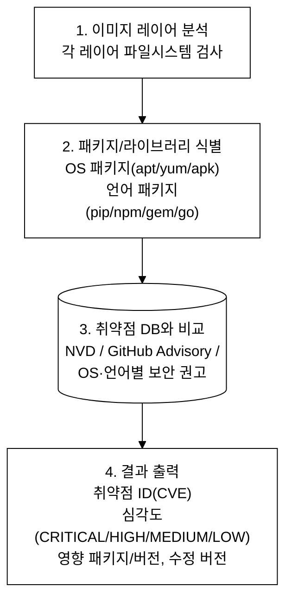
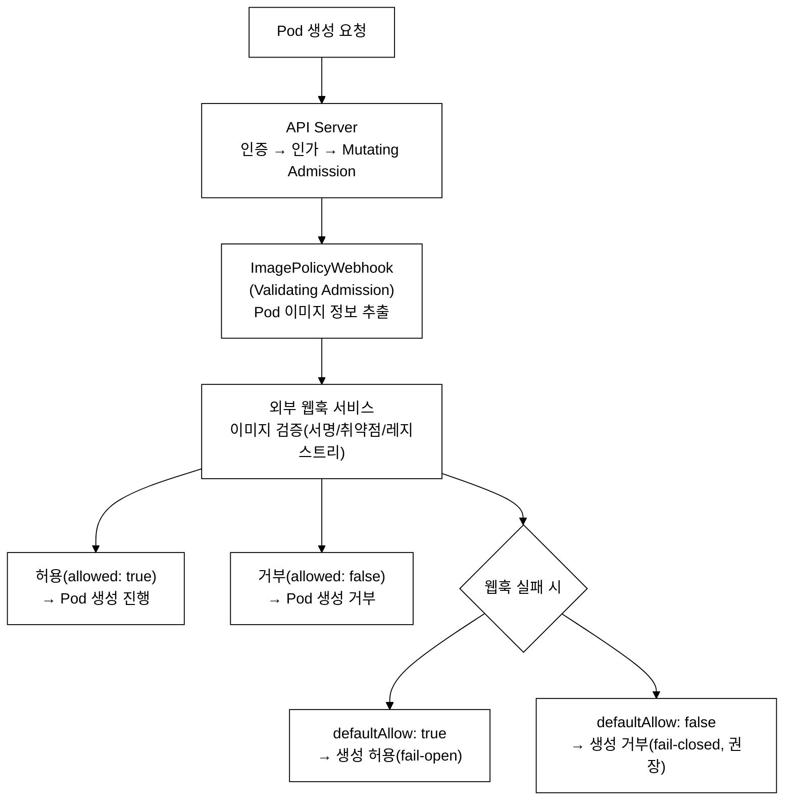
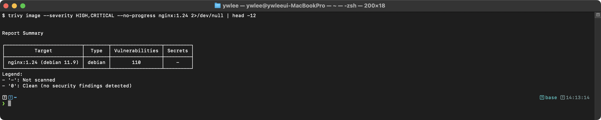
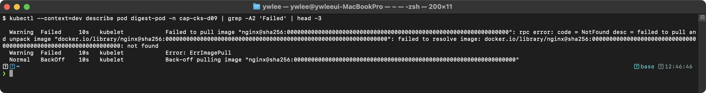
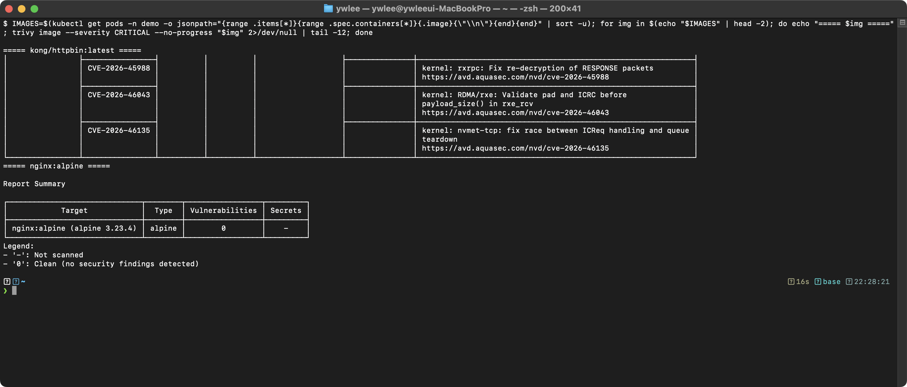
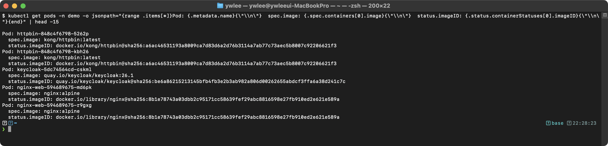
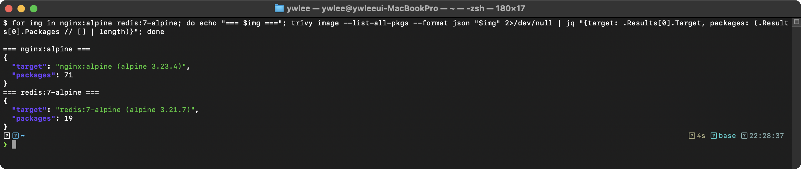

# CKS Day 9: Supply Chain Security (1/2) - Trivy, Cosign, ImagePolicyWebhook, Dockerfile 보안

> 학습 목표 | CKS 도메인: Supply Chain Security (20%) | 예상 소요 시간: 2시간

---

> **이전 Day 연결:** Day 8(컨테이너 런타임 보안)에서 seccomp·AppArmor·gVisor로 런타임 격리를 확보했다. Day 9~10은 이미지 자체의 신뢰성(공급망)을 다룬다 — 컨테이너가 실행되기 전, 이미지가 어디서 왔는지와 무엇을 담고 있는지를 검증하는 단계다.

---

## 오늘의 학습 목표

- Trivy를 사용하여 컨테이너 이미지 취약점을 스캔할 수 있다
- 이미지 서명 및 검증(Cosign)의 개념을 이해한다
- ImagePolicyWebhook Admission Controller를 설정할 수 있다
- 이미지 다이제스트 사용으로 이미지 무결성을 보장한다
- Dockerfile 보안 문제를 식별하고 수정할 수 있다
- Static Analysis 도구(kubesec, conftest)를 사용할 수 있다

---

### 등장 배경: Supply Chain 공격의 위협과 방어 계층

```
기존 방식의 한계와 공격-방어 매핑
══════════════════════════════════

[공격] 의존성 혼동(Dependency Confusion)
  - 공격자가 내부 패키지와 동일한 이름의 악성 패키지를 공개 레지스트리에
    등록하여 빌드 시스템이 악성 패키지를 자동으로 다운로드하도록 유도한다
  → [방어] Trivy로 이미지 SBOM을 분석하여 예상치 못한 패키지 존재 여부를 검출한다

[공격] 태그 변조(Tag Mutation Attack)
  - 레지스트리 접근 권한을 획득한 공격자가 기존 이미지 태그(nginx:1.25)를
    악성 이미지로 재할당한다. pull 시 변조된 이미지가 배포된다
  → [방어] 이미지 다이제스트(@sha256:...)를 사용하여 내용 기반 참조를 강제한다
  → [방어] Cosign으로 이미지 서명을 검증하여 출처를 보장한다

[공격] 베이스 이미지 취약점 악용
  - ubuntu:latest 등 풀 이미지에 포함된 수백 개의 OS 패키지 중
    알려진 CVE를 이용하여 RCE, DoS를 수행한다
  → [방어] Trivy --severity CRITICAL 스캔으로 위험 CVE를 식별하고 패치한다
  → [방어] distroless/alpine 기반 최소 이미지로 공격 표면을 축소한다

[공격] Dockerfile 취약점 (Root 실행, 과도한 패키지)
  - root 사용자로 실행되는 컨테이너에서 공격자가 호스트 파일시스템에
    접근하거나 네트워크 도구(netcat, wget)로 C2 통신을 수립한다
  → [방어] USER 지시어로 non-root 실행, 불필요한 패키지 제거

내부 동작 원리 — OCI 이미지 레이어와 다이제스트:
  - OCI(Open Container Initiative) 이미지는 매니페스트, 설정, 레이어의
    3개 구성 요소로 이루어진다. 각 구성 요소는 SHA-256 해시로 식별된다.
  - 이미지 매니페스트의 SHA-256 해시가 다이제스트(digest)이다.
    레이어 1비트라도 변경되면 매니페스트 해시가 바뀌므로 변조를 탐지한다.
  - Trivy는 각 레이어의 파일시스템을 언패킹하여 /var/lib/dpkg/status,
    /lib/apk/db/installed 등 패키지 DB 파일을 파싱한다.
    이후 NVD(National Vulnerability Database)의 CPE(Common Platform
    Enumeration) 매칭으로 해당 패키지 버전에 존재하는 CVE를 식별한다.
```

위에서 "OCI 이미지는 매니페스트·설정·레이어의 3개 구성 요소"라고 했는데, 셋이 각각 무엇인지 구체적으로 구분한다.

- **매니페스트(manifest)**: 레이어 목록과 메타데이터를 담은 JSON 문서다. "이 이미지는 어떤 레이어들과 어떤 설정으로 이루어지는가"의 목차에 해당하며, 각 레이어와 설정을 SHA-256 해시(다이제스트)로 가리킨다. **매니페스트 자체의 SHA-256 해시가 곧 이미지 다이제스트**다(§4에서 다룸).
- **설정(config)**: `ENV`·`ENTRYPOINT`·`CMD`·`USER`·`WORKDIR` 같은 실행 인자를 담은 JSON이다. "컨테이너를 어떤 사용자·명령으로 시작하는가"를 정의하며, 파일시스템 내용이 아니라 실행 메타데이터다.
- **레이어(layer)**: 실제 파일시스템 변경분을 담은 tar.gz 아카이브들이다. Dockerfile의 `RUN`/`COPY`/`ADD` 한 줄이 보통 레이어 하나가 되며, 이들을 위에서부터 겹쳐 쌓은(union) 결과가 컨테이너가 보는 루트 파일시스템이다. Trivy가 패키지 DB를 읽기 위해 언패킹하는 대상이 바로 이 레이어다.

CPE(Common Platform Enumeration)는 소프트웨어를 `name:version:platform` 형태로 표준화한 식별자다. 예를 들어 nginx 1.21은 `cpe:/a:nginx:nginx:1.21`로 표기된다(`a`는 application). Trivy는 이미지에서 추출한 각 패키지를 이런 CPE로 정규화한 뒤 NVD 데이터베이스의 CVE 항목(각 CVE는 영향받는 CPE 범위를 명시한다)과 매칭하여, 그 버전에 존재하는 취약점을 가려낸다.

---

## 1. 이미지 취약점 스캐닝 (Trivy)

### 1.1 컨테이너 이미지 취약점 분석 개요

```
이미지 취약점 스캐닝 - Software Composition Analysis(SCA)
═══════════════════════════════════════════════════════════

컨테이너 이미지는 base image, OS 패키지, 언어별 라이브러리 등 다수의
소프트웨어 컴포넌트를 포함한다. 각 컴포넌트에 공개된 취약점(CVE - Common
Vulnerabilities and Exposures)이 존재할 수 있으며, 이미지를 통해 배포된
모든 워크로드가 해당 취약점에 노출된다.

예: nginx:1.21 이미지에 포함된 OpenSSL 라이브러리에 CVE-2023-44487이 존재하면
  → 해당 이미지를 사용하는 모든 Pod가 취약점에 노출
  → CVSS 점수에 따라 원격 코드 실행(RCE), 서비스 거부(DoS) 등의 위험 존재

Trivy는 Aqua Security가 개발한 SCA(Software Composition Analysis) 도구로,
이미지 레이어를 언패킹하여 패키지 매니저 DB(dpkg, apk, rpm)와 언어별
의존성 파일(package-lock.json, go.sum 등)을 파싱한 뒤, NVD/GitHub Advisory
DB와 대조하여 알려진 CVE를 탐지한다.
```

### 1.2 Trivy 동작 원리


_그림 1. Trivy 이미지 취약점 스캔 흐름._

### 1.3 Trivy 명령어 완전 가이드

```bash
# ═══ 기본 이미지 스캔 ═══
trivy image nginx:1.21
# 모든 심각도의 취약점을 표로 출력

# ═══ 심각도 필터링 (시험에서 가장 많이 사용) ═══
trivy image --severity CRITICAL,HIGH nginx:1.21
# CRITICAL과 HIGH 취약점만 표시
# 시험에서는 보통 "CRITICAL 취약점이 있는 이미지를 찾아라"

# ═══ CI/CD용: 취약점 발견 시 실패 ═══
trivy image --exit-code 1 --severity CRITICAL nginx:1.21
# exit code 1 = CRITICAL 취약점이 있으면 실패
# exit code 0 = 취약점 없음

# ═══ 수정 가능한 취약점만 표시 ═══
trivy image --ignore-unfixed nginx:1.21
# 패치가 존재하는 취약점만 표시 (업그레이드로 해결 가능한 것)

# ═══ 출력 형식 ═══
trivy image --format json -o result.json nginx:1.21       # JSON
trivy image --format table nginx:1.21                      # 테이블 (기본)
trivy image --format template --template "@html.tpl" nginx:1.21  # HTML

# ═══ 파일시스템 스캔 ═══
trivy fs /path/to/project
# 소스코드 디렉토리의 의존성 취약점 검사

# ═══ K8s 클러스터 스캔 ═══
trivy k8s --report summary cluster
# 클러스터 내 모든 이미지의 취약점 요약

# ═══ 설정 파일 스캔 ═══
trivy config /path/to/kubernetes-manifests/
# K8s 매니페스트의 보안 설정 검사

# ═══ SBOM 생성 ═══
trivy image --format cyclonedx -o sbom.cdx.json nginx:1.21   # CycloneDX
trivy image --format spdx-json -o sbom.spdx.json nginx:1.21  # SPDX

# ═══ 특정 취약점 무시 ═══
cat > .trivyignore << 'EOF'
CVE-2023-44487
CVE-2023-39325
EOF
trivy image --ignorefile .trivyignore nginx:1.21
```

### 1.4 심각도 레벨

```
취약점 심각도 레벨
═══════════════════

레벨      | CVSS 점수  | 설명                    | 조치
──────────┼───────────┼────────────────────────┼──────────────
CRITICAL  | 9.0-10.0  | 원격 코드 실행 등        | 즉시 수정 필수
HIGH      | 7.0-8.9   | 정보 유출, 서비스 거부    | 빠른 수정 필요
MEDIUM    | 4.0-6.9   | 제한된 영향              | 계획된 업데이트
LOW       | 0.1-3.9   | 위험도 낮음              | 다음 업데이트
UNKNOWN   | -         | 심각도 미분류             | 수동 평가

CKS 시험에서:
  "CRITICAL 취약점이 있는 이미지를 사용하는 Pod를 삭제하라"
  → trivy image --severity CRITICAL <이미지>로 스캔
  → CRITICAL이 있는 이미지의 Pod를 삭제
```

위 표의 CVSS 점수는 임의 기준이 아니다. CVSS(Common Vulnerability Scoring System)는 미국 NIST와 업계가 합의해 표준화한 취약점 심각도 점수로, 0.0~10.0 범위다. 점수는 공격 난이도(Attack Complexity)·필요 권한·사용자 개입 여부·기밀성/무결성/가용성 영향 등을 정해진 공식에 대입해 산출한다. 9.0 이상(CRITICAL)은 대체로 "공격 난이도가 낮고 영향 범위가 넓다"는 뜻이며, 인증 없이 원격에서 코드를 실행할 수 있는 RCE(Remote Code Execution)가 전형적이다. 공개된 거의 모든 CVE에는 NVD가 부여한 CVSS 점수가 따라붙으므로, Trivy의 `--severity` 필터는 결국 이 CVSS 점수 구간으로 취약점을 거르는 것이다.

### 1.5 여러 이미지 일괄 스캔

```bash
# 클러스터의 모든 이미지 스캔
for img in $(kubectl get pods --all-namespaces -o \
  jsonpath='{range .items[*]}{range .spec.containers[*]}{.image}{"\n"}{end}{end}' | \
  sort -u); do
  echo "=========================================="
  echo "Scanning: $img"
  echo "=========================================="
  RESULT=$(trivy image --severity CRITICAL --exit-code 0 "$img" 2>/dev/null | \
    grep -E "Total:|CRITICAL")
  if echo "$RESULT" | grep -q "CRITICAL"; then
    echo "*** CRITICAL 취약점 발견! ***"
  else
    echo "CRITICAL 취약점 없음"
  fi
  echo ""
done
```

---

## 2. 이미지 서명 및 검증

### 2.1 이미지 서명이 필요한 이유

```
이미지 서명 - 디지털 서명 기반 공급망 보안(Supply Chain Security)
══════════════════════════════════════════════════════════════════

이미지 서명은 비대칭 암호화(asymmetric cryptography)를 활용하여
이미지의 출처(provenance)와 무결성(integrity)을 검증하는 메커니즘이다.

공급망 공격(Supply Chain Attack) 시나리오:
1. 공격자가 레지스트리에 악성 이미지를 정상 태그(nginx:1.25)로 푸시
2. 개발자가 해당 태그의 이미지를 pull하여 프로덕션에 배포
3. 악성 페이로드가 런타임에 실행 → 데이터 유출, lateral movement

디지털 서명 검증 흐름:
1. 빌드 파이프라인에서 이미지 다이제스트에 대해 개인 키(private key)로 서명 생성
2. 서명은 OCI 레지스트리에 이미지와 함께 저장 (Cosign은 서명을 별도 태그로 저장)
3. 배포 시 Admission Controller가 공개 키(public key)로 서명의 유효성을 검증
4. 서명 검증 실패 시 Admission DENY → 변조되거나 미서명 이미지의 배포를 차단
```

**왜 단순 gpg가 아니라 Cosign인가.** 디지털 서명 자체는 새로운 기술이 아니다. 전통적으로는 gpg로 아티팩트에 서명할 수 있었다. 그러나 이미지 서명 맥락에서 gpg 방식은 두 가지 한계가 있었다. 첫째, 서명용 개인 키를 CI 서버(Jenkins 등)에 상시 보관해야 한다. CI 서버는 공격 표면이 넓어 키 유출 위험이 크고, 키가 한 번 유출되면 공격자가 임의 이미지에 정상 서명을 붙일 수 있다. 둘째, "서명을 어디에 저장하고 K8s Admission Controller가 어디서 읽을지"에 대한 표준이 없었다. 서명을 이미지 메타데이터에 넣을지, 별도 서명 저장 시스템을 둘지가 제각각이라 자동 검증을 표준화하기 어려웠다.

Cosign(Sigstore 프로젝트의 서명 도구)은 OCI 레지스트리 자체를 서명 저장소로 삼아 이 둘을 해결한다. 서명을 이미지와 같은 레지스트리에 별도 태그(예: `sha256-<digest>.sig`)로 저장하므로 별도 인프라가 필요 없고, 검증 측은 이미지를 받는 같은 레지스트리에서 서명을 읽으면 된다. 나아가 keyless 서명(아래 §2.2)에서는 OIDC(인증 제공자가 발급하는 신원 토큰 표준) 인증으로 단명(short-lived) 인증서를 그때그때 발급받아 서명하므로, CI 서버에 장기 개인 키를 둘 필요 자체를 없앤다. 트레이드오프는 keyless 검증이 Fulcio(임시 인증서 발급 CA)·Rekor(서명 기록을 남기는 투명성 로그) 같은 Sigstore 인프라 가용성에 의존한다는 점이다.

### 2.2 Cosign (Sigstore 프로젝트)

```bash
# ═══ 키 쌍 생성 ═══
cosign generate-key-pair
# cosign.key (개인 키 - 서명용, 안전하게 보관!)
# cosign.pub (공개 키 - 검증용, 공유 가능)

# ═══ 이미지 서명 ═══
cosign sign --key cosign.key docker.io/myrepo/myimage:v1.0
# 개인 키로 이미지 서명 → 서명이 레지스트리에 저장됨

# ═══ 서명 검증 ═══
cosign verify --key cosign.pub docker.io/myrepo/myimage:v1.0
# 공개 키로 서명 검증
# 유효: 이미지 정보 출력
# 무효: 에러

# ═══ 키 없는 서명 (Keyless Signing, OIDC 기반) ═══
cosign sign docker.io/myrepo/myimage:v1.0
# OIDC 프로바이더(Google, GitHub)로 인증 → Fulcio CA가 임시 인증서 발급
# Rekor 투명성 로그에 기록

cosign verify \
  --certificate-identity=user@company.com \
  --certificate-oidc-issuer=https://accounts.google.com \
  docker.io/myrepo/myimage:v1.0
```

### 2.3 Docker Content Trust (DCT)

```bash
# DCT 활성화
export DOCKER_CONTENT_TRUST=1

# 서명된 이미지만 pull 가능
docker pull nginx:1.25
# 서명이 없으면 pull 실패

# DCT 비활성화
export DOCKER_CONTENT_TRUST=0
```

DCT(Docker Content Trust)는 Cosign보다 먼저 등장한 이미지 서명 방식으로, 내부적으로 Notary v1을 사용한다. 한계는 Docker Hub 중심으로 설계되어 사실상 Docker Hub에서만 매끄럽게 동작하고, 사내에서 흔히 쓰는 Private Registry(ECR·Quay·Harbor)와의 호환성이 낮다는 점이다. Cosign은 특정 레지스트리에 종속되지 않는 OCI 표준 API로 서명을 저장하므로 모든 레지스트리에서 동작한다. 이 때문에 생태계는 Cosign(Sigstore) 중심으로 이동했고, CKS도 Cosign을 기준으로 출제한다. DCT는 개념 이해용으로만 알아 두면 된다.

| 항목 | DCT (Docker Content Trust) | Cosign (Sigstore) |
|:--|:--|:--|
| 기반 | Notary v1 | OCI 레지스트리 + Sigstore |
| 레지스트리 호환 | 사실상 Docker Hub 중심 | OCI 표준 — ECR·Quay·Harbor 등 전부 |
| 키 관리 | 로컬 키 + Notary 서버 | 키 기반 또는 keyless(OIDC) |
| 서명 검증 통합 | docker pull 단계 | Admission Controller(정책 webhook)와 연계 용이 |
| CKS 비중 | 개념만 | 중심 도구 |

---

## 3. ImagePolicyWebhook Admission Controller

### 3.1 ImagePolicyWebhook 동작 원리


_그림 2. ImagePolicyWebhook 검증 흐름과 웹훅 실패 시 fail-open/fail-closed._

ImagePolicyWebhook은 Admission Controller(API Server가 인증·인가 직후, 객체를 저장(etcd 기록)하기 전에 요청을 검사·변형하는 플러그인) 중 하나다. 아래 §3.2~§3.3의 YAML 3개는 서로를 파일 경로로 참조하므로, "이 파일들을 어디에 어떤 순서로 만드는가"를 먼저 정리한다. 모든 작업은 control-plane(마스터) 노드 위에서 한다(예: `ssh staging-master`).

```
ImagePolicyWebhook 실제 구성 순서 (control-plane 노드에서)
═══════════════════════════════════════════════════════════
(1) 이미지를 검증할 webhook 서비스를 Pod/Deployment + Service로 배포한다.
    이 서비스가 §3.2의 server URL(image-policy-webhook.default.svc:8443)로 노출된다.
(2) 마스터 노드에 디렉터리를 만든다: mkdir -p /etc/kubernetes/admission-control/
(3) 그 디렉터리에 3개 파일을 둔다.
    - admission-config.yaml            (§3.2 의 AdmissionConfiguration)
    - image-policy-webhook.kubeconfig  (§3.2 의 Webhook kubeconfig)
    - webhook-ca.crt                   (webhook 서비스의 CA 인증서 — webhook 배포 시 받은 것)
    kubeConfigFile / certificate-authority 경로는 (2)에서 만든 이 디렉터리를 가리킨다.
    즉 경로는 사용자가 직접 만들어 채우는 것이지 자동 생성되지 않는다.
(4) /etc/kubernetes/manifests/kube-apiserver.yaml 을 §3.3대로 수정한다.
    이 파일은 static Pod 매니페스트라 저장하는 순간 kubelet이 API Server를 재기동한다.
```

### 3.2 ImagePolicyWebhook 설정 구성

```yaml
# ═══════════════════════════════════════════
# 1. AdmissionConfiguration
# 파일: /etc/kubernetes/admission-control/admission-config.yaml
# ═══════════════════════════════════════════
apiVersion: apiserver.config.k8s.io/v1
kind: AdmissionConfiguration
plugins:
- name: ImagePolicyWebhook
  configuration:
    imagePolicy:
      kubeConfigFile: /etc/kubernetes/admission-control/image-policy-webhook.kubeconfig
      # ↑ 웹훅 서비스 연결 정보가 담긴 kubeconfig 파일
      allowTTL: 50                     # 허용 결과 캐시 시간 (초)
      denyTTL: 50                      # 거부 결과 캐시 시간 (초)
      retryBackoff: 500                # 재시도 대기 시간 (밀리초)
      defaultAllow: false              # *** 핵심 설정 ***
      # false = fail-closed: 웹훅 실패/불능 시 이미지 거부 (보안 권장!)
      # true  = fail-open:   웹훅 실패/불능 시 이미지 허용 (위험!)
```

```yaml
# ═══════════════════════════════════════════
# 2. Webhook kubeconfig
# 파일: /etc/kubernetes/admission-control/image-policy-webhook.kubeconfig
# ═══════════════════════════════════════════
apiVersion: v1
kind: Config
clusters:
- name: image-policy-webhook
  cluster:
    server: https://image-policy-webhook.default.svc:8443/image-policy
    # ↑ 웹훅 서비스 URL
    certificate-authority: /etc/kubernetes/admission-control/webhook-ca.crt
    # ↑ 웹훅 서비스의 CA 인증서
contexts:
- name: image-policy-webhook
  context:
    cluster: image-policy-webhook
    user: api-server
current-context: image-policy-webhook
users:
- name: api-server
  user:
    client-certificate: /etc/kubernetes/pki/apiserver.crt
    # ↑ API Server의 클라이언트 인증서 (mTLS)
    client-key: /etc/kubernetes/pki/apiserver.key
```

webhook kubeconfig에서 `users`는 API Server 자신이다. `apiserver.crt`로 자신을 증명해 웹훅 서비스(서버)에 인증하는 mTLS(mutual TLS — 클라이언트와 서버가 서로의 인증서를 검증하는 양방향 TLS) 구조이며, 웹훅 서비스는 이 인증서로 요청이 API Server에서 온 것임을 확인한다. 즉 "API Server가 웹훅을 검증한다"가 아니라 "API Server가 웹훅 서비스에 자신을 증명한다"는 방향이다.

### 3.3 API Server에 적용

```yaml
# /etc/kubernetes/manifests/kube-apiserver.yaml에 추가
spec:
  containers:
  - command:
    - kube-apiserver
    # === Admission Plugin 추가 ===
    - --enable-admission-plugins=NodeRestriction,ImagePolicyWebhook
    # ↑ ImagePolicyWebhook을 추가
    - --admission-control-config-file=/etc/kubernetes/admission-control/admission-config.yaml
    # ↑ AdmissionConfiguration 파일 경로

    # === 볼륨 마운트 추가 ===
    volumeMounts:
    - name: admission-control
      mountPath: /etc/kubernetes/admission-control/
      readOnly: true                     # 읽기 전용 (보안)

  # === 볼륨 추가 ===
  volumes:
  - name: admission-control
    hostPath:
      path: /etc/kubernetes/admission-control/
      type: DirectoryOrCreate
```

```bash
# 적용 후 확인
watch crictl ps | grep kube-apiserver
kubectl get nodes  # 정상 동작 확인
```

### 3.4 ValidatingWebhookConfiguration

이미지 검증을 admission 단계에서 거는 방법은 두 가지다. §3.2~§3.3의 ImagePolicyWebhook은 API Server 기동 옵션(`--enable-admission-plugins`)으로 켜는 빌트인 플러그인이라 마스터 노드의 정적 파드 매니페스트를 수정해야 하고, 이미지 정보(`imageReview`)만 전달한다. 반면 ValidatingWebhookConfiguration은 클러스터 안에 리소스로 등록하는 범용 admission webhook으로, 마스터 노드 파일을 건드리지 않고 `kubectl apply`만으로 설정·수정할 수 있으며 Pod 객체 전체를 webhook에 전달한다. 둘을 동시에 켜면 API Server 옵션으로 켠 ImagePolicyWebhook이 먼저 평가된다. 실무·CKS 출제에서는 더 표준적이고 운영이 쉬운 ValidatingWebhookConfiguration(또는 OPA/Gatekeeper — OPA 정책엔진을 admission webhook으로 패키징한 것) 쪽을 주로 다룬다.

```yaml
# ═══════════════════════════════════════════
# ValidatingWebhookConfiguration
# ImagePolicyWebhook의 대안으로 사용 가능
# ═══════════════════════════════════════════
apiVersion: admissionregistration.k8s.io/v1
kind: ValidatingWebhookConfiguration
metadata:
  name: image-validation
webhooks:
- name: validate-image.example.com
  admissionReviewVersions: ["v1"]        # Admission Review API 버전
  sideEffects: None                      # 부수 효과 없음
  clientConfig:
    service:
      name: image-validator              # 웹훅 서비스 이름
      namespace: security                # 웹훅 서비스 네임스페이스
      path: "/validate"                  # 웹훅 엔드포인트 경로
    caBundle: <base64-encoded-ca>        # 웹훅 서비스 CA 인증서
  rules:
  - operations: ["CREATE", "UPDATE"]     # Pod 생성/수정 시 검사
    apiGroups: [""]
    apiVersions: ["v1"]
    resources: ["pods"]
  failurePolicy: Fail                    # fail-closed (보안 권장)
                                         # Ignore = fail-open
  namespaceSelector:                     # 검사할 네임스페이스 선택
    matchExpressions:
    - key: kubernetes.io/metadata.name
      operator: NotIn
      values: ["kube-system"]            # kube-system 제외
```

---

## 4. 이미지 다이제스트 사용

### 4.1 태그 vs 다이제스트

```
이미지 태그 vs 다이제스트 - 가변 참조 vs 내용 주소 지정(Content Addressable)
═══════════════════════════════════════════════════════════════════════════════

태그(tag) = 가변 포인터(mutable reference)
  - 태그는 이미지 매니페스트에 대한 심볼릭 참조로, 동일 태그가 다른 매니페스트를 가리킬 수 있다
  - nginx:1.25는 레지스트리에서 태그를 재할당하면 다른 이미지를 가리키게 된다
  - 공격자가 레지스트리 접근 권한을 획득하면 태그를 악성 이미지로 재할당할 수 있다

다이제스트(digest) = 내용 주소 지정(content-addressable identifier)
  - 이미지 매니페스트의 SHA-256 해시값으로, 내용이 1비트라도 변경되면 다이제스트가 변경된다
  - 암호학적 해시 함수의 제2역상 저항성(second preimage resistance)에 의해 변조 불가능
  - 이미지의 불변성(immutability)을 보장하는 유일한 참조 방식

nginx:1.25                              → 태그 (가변, 재할당 가능)
nginx@sha256:abc123def456...            → 다이제스트 (불변, 내용 기반)
```

다이제스트의 변조 탐지 원리를 정확히 정리하면 이렇다. 다이제스트는 레이어의 해시가 아니라 **이미지 매니페스트 자체의 SHA-256 해시**다(`nginx@sha256:6af79ae5de4072...`가 그 예이며, 이 `sha256:` 값이 곧 이 이미지의 매니페스트 다이제스트다). 매니페스트는 레이어 목록과 설정 메타데이터를 각각의 해시로 가리키고 있으므로, 변경은 다음과 같이 연쇄된다: 레이어 내용이 1비트라도 바뀌면 → 그 레이어의 해시가 바뀌고 → 매니페스트에 적힌 레이어 해시가 달라지므로 매니페스트 내용이 바뀌고 → 매니페스트의 SHA-256 해시(=다이제스트)가 바뀐다. 따라서 사용자가 매니페스트에 고정한 다이제스트와 실제로 받은 이미지의 다이제스트가 한 글자라도 다르면 변조로 판정된다. 위 예의 `nginx@sha256:abc123...`은 태그가 아니라 이 매니페스트 다이제스트를 직접 가리키는 참조다.

### 4.2 다이제스트 확인 및 사용

```bash
# ═══ 이미지 다이제스트 확인 방법 ═══

# 방법 1: docker inspect
docker inspect --format='{{index .RepoDigests 0}}' nginx:1.25
# nginx@sha256:abc123...

# 방법 2: crane (경량 이미지 도구)
crane digest nginx:1.25
# sha256:abc123...

# 방법 3: kubectl에서 실행 중인 Pod의 다이제스트 확인
kubectl get pod my-pod -o jsonpath='{.status.containerStatuses[0].imageID}'
# docker-pullable://nginx@sha256:abc123...

# 방법 4: skopeo
skopeo inspect docker://nginx:1.25 | jq .Digest
```

```yaml
# ═══════════════════════════════════════════
# 다이제스트로 이미지 지정 (권장)
# ═══════════════════════════════════════════
apiVersion: v1
kind: Pod
metadata:
  name: secure-pod
spec:
  containers:
  - name: app
    image: nginx@sha256:6af79ae5de407283dcea8b00d5c37ace95441fd58a8b1d2aa1ed93f5511bb18c
    # ↑ 다이제스트 지정: 이 해시값의 이미지만 사용
    # 태그가 변경되어도 같은 이미지를 보장
    # 공급망 공격(태그 변조)을 방지

# ═══ BAD: 태그 사용 (비권장) ═══
# - name: app
#   image: nginx:latest   # 매번 다른 이미지일 수 있음!
#   image: nginx:1.25     # 변조될 수 있음!
```

---

## 5. Dockerfile 보안

### 5.1 보안 취약 Dockerfile vs 강화된 Dockerfile

```dockerfile
# ═══════════════════════════════════════════
# BAD: 보안에 취약한 Dockerfile
# CKS에서 "이 Dockerfile의 보안 문제를 찾아 수정하라"로 출제
# ═══════════════════════════════════════════
FROM ubuntu:latest
# 문제 1: latest 태그 → 버전 고정 필요
# 문제 2: ubuntu(큰 이미지) → alpine 또는 distroless 사용

RUN apt-get update && apt-get install -y curl wget vim netcat python3
# 문제 3: 불필요한 패키지(vim, netcat, wget) → 공격 도구가 될 수 있음

ADD . /app
# 문제 4: ADD → COPY 사용 (ADD는 URL 다운로드, tar 자동 압축해제 등 예상치 못한 동작)

WORKDIR /app
RUN pip install -r requirements.txt

EXPOSE 8080
CMD ["python3", "app.py"]
# 문제 5: USER 미지정 → root로 실행됨!
# 문제 6: 멀티스테이지 빌드 미사용 → 빌드 도구가 최종 이미지에 포함
# 문제 7: HEALTHCHECK 없음
```

```dockerfile
# ═══════════════════════════════════════════
# GOOD: 보안이 강화된 Dockerfile
# ═══════════════════════════════════════════

# 1단계: 빌드 스테이지
FROM python:3.12-slim AS builder
# ↑ 특정 버전 태그 고정
# ↑ slim 이미지 (불필요한 패키지 없음)

WORKDIR /app

COPY requirements.txt .
# ↑ ADD 대신 COPY 사용

RUN pip install --no-cache-dir --user -r requirements.txt
# ↑ --no-cache-dir: 캐시 제거로 이미지 크기 줄이기

COPY . .
# ↑ 소스코드 복사 (requirements 먼저 복사하여 캐시 활용)

# 2단계: 프로덕션 스테이지
FROM gcr.io/distroless/python3-debian12:nonroot
# ↑ distroless: 셸 없음, 패키지 매니저 없음 → 공격 표면 최소화
# ↑ nonroot: 기본적으로 non-root 사용자

WORKDIR /app

COPY --from=builder /root/.local /home/nonroot/.local
COPY --from=builder /app .
# ↑ 빌드 스테이지에서 필요한 파일만 복사
# 빌드 도구, 소스코드는 최종 이미지에 포함되지 않음

USER 65532:65532
# ↑ non-root 사용자로 실행 (UID 65532 = nonroot)

EXPOSE 8080

HEALTHCHECK --interval=30s --timeout=3s \
  CMD ["python3", "-c", "import urllib.request; urllib.request.urlopen('http://localhost:8080/health')"]
# ↑ 헬스체크 추가

ENTRYPOINT ["python3", "app.py"]
# ↑ CMD 대신 ENTRYPOINT (오버라이드 방지)
```

#### 베이스 이미지 선택 trade-off — distroless가 항상 정답은 아니다

위 GOOD 예시는 distroless를 사용했다. 그러면 "모든 이미지를 distroless로 만들면 되는가?"라는 질문이 자연히 따라온다. 답은 "아니다"이며, 베이스 이미지 선택은 공격 표면과 운영 편의 사이의 트레이드오프다.

distroless(Google이 배포하는 최소 베이스 이미지)는 셸(`/bin/sh`)·패키지 매니저(`apt`/`apk`)·`ls`·`cat` 같은 기본 도구조차 없다. 공격자가 컨테이너를 탈취해도 추가 도구를 실행할 수 없으므로 공격 표면이 가장 좁다. 그러나 같은 이유로 `kubectl exec -it <pod> -- sh`가 동작하지 않는다. 셸이 없어 컨테이너에 들어가 디버깅할 수 없으므로, 장애 진단은 애플리케이션이 내보내는 로그와 K8s liveness/readiness probe(헬스체크)에 전적으로 의존해야 한다. 즉 distroless를 쓰려면 로깅·헬스체크 설계가 먼저 갖춰져 있어야 한다.

alpine은 musl libc(glibc의 경량 대체 C 표준 라이브러리) 기반이라 이미지가 매우 작지만, glibc를 가정하고 빌드된 바이너리(특히 Python wheel, Go cgo 바이너리, 일부 상용 에이전트)에서 호환성 문제가 발생할 수 있다. 또한 보안 패치 반영이 debian/ubuntu 계열보다 느린 경우가 있어, "작다 = 항상 안전하다"는 성립하지 않는다.

| 베이스 | 공격 표면 | 디버깅(exec/셸) | 주의점 | 권장 용도 |
|:--|:--|:--|:--|:--|
| ubuntu/debian | 넓음 (패키지 수백 개) | 쉬움 (도구 풍부) | 공격 표면 큼, CVE 多 | 레거시·디버깅 잦은 환경(debian-slim 권장) |
| alpine | 좁음 (작은 이미지) | 가능 (`apk add`로 도구 추가 가능) | musl libc 호환 이슈, 패치 지연 가능 | 개발/테스트, glibc 비의존 워크로드 |
| distroless | 가장 좁음 | 불가 (셸·패키지 매니저 없음) | exec 디버깅 불가, 로깅/헬스체크 사전 필수 | 프로덕션 |

선택 기준: 프로덕션은 distroless, 개발·테스트는 alpine, glibc 의존·디버깅이 잦은 레거시는 debian-slim을 기본값으로 둔다.

### 5.2 CKS에서의 Dockerfile 수정 포인트

```
Dockerfile 수정 체크리스트 (CKS 시험)
════════════════════════════════════

1. FROM ubuntu:latest → FROM ubuntu:22.04 또는 alpine, distroless
   → 태그 고정 + 최소 이미지

2. USER 미지정 → USER 1000:1000 또는 USER nonroot
   → non-root 실행

3. 불필요한 패키지 (vim, curl, wget, netcat, nmap)
   → 제거

4. ADD → COPY
   → ADD는 URL 다운로드, tar 자동 해제 등 예측 불가능한 동작

5. 멀티스테이지 빌드 미사용 → 멀티스테이지 적용
   → 빌드 도구가 최종 이미지에 포함되지 않게

6. 민감한 정보 하드코딩 (ENV PASSWORD=secret)
   → Secret이나 환경변수로 주입

7. .dockerignore 없음
   → .git, .env, 테스트 파일 등 제외

8. 루트 파일시스템에 쓰기 가능
   → 읽기 전용으로 설정 (K8s SecurityContext에서)
```

### 5.3 Dockerfile 보안 검증 명령어

```bash
# Dockerfile에서 USER 지시어 확인
grep -n "^USER" Dockerfile
```

> **예시(참조) — Dockerfile USER:** 비루트 실행을 위해 `USER 65532:65532`(nonroot) 를 지정한다. 이미지 빌드 대상이라 클러스터 무관.

USER가 없거나 `USER root`이면 보안 취약점이다.

```bash
# 빌드된 이미지의 실행 사용자 확인
docker inspect --format='{{.Config.User}}' myapp:1.0
```

> **예시(참조) — 이미지 비루트 UID:** `docker inspect`/`id` 로 이미지의 실행 UID 가 65532(nonroot) 인지 확인한다.

```bash
# ADD 지시어 사용 여부 확인 (COPY로 대체해야 한다)
grep -n "^ADD" Dockerfile
```

> **예시(참조):** 루트 실행 컨테이너 탐지 스크립트 — 위반이 없으면 출력이 비어 있다(정상).

---

## 6. Static Analysis 도구

### 6.0 등장 배경: 수작업 YAML 검토의 한계

컨테이너 이미지 스캔(§1)과 서명 검증(§2~§3)은 "이 이미지가 안전한가"를 검사하지만, 매니페스트 자체가 잘못된 경우는 잡아내지 못한다. 예를 들어 `privileged: true`이거나 CPU·메모리 제한이 없는 Pod는 취약점이 없는 이미지를 사용하더라도 런타임 단계에서 권한 상승·DoS가 가능하다.

기존에는 팀원이 PR 리뷰에서 YAML을 눈으로 확인하는 방식을 사용했다. 이 방식은 두 가지 한계가 있다. 첫째, 검토 항목이 사람마다 달라 누락이 발생한다(`securityContext` 체크를 빠뜨리는 경우 등). 둘째, CI/CD 파이프라인이 자동으로 정책 위반을 차단할 수 없어, 잘못된 매니페스트가 프로덕션까지 도달한다.

Static analysis 도구는 이 두 한계를 "정책 코드화(Policy as Code)"로 해결한다. 검사 기준을 코드로 정의하면 모든 매니페스트에 동일하게 적용되며 CI 단계에서 자동으로 실패를 반환할 수 있다.

- **kubesec**: 사전 정의된 보안 규칙(RunAsNonRoot, ReadOnlyRootFilesystem 등)을 기준으로 Pod 매니페스트에 점수를 매기는 도구다. 규칙이 고정되어 있어 별도 정책 작성 없이 바로 사용할 수 있다는 장점이 있으나, 조직 맞춤 규칙을 추가하기 어렵다는 트레이드오프가 있다.
- **conftest**: OPA(Open Policy Agent — CNCF 프로젝트인 범용 정책 엔진)를 CLI로 감싼 도구로, Rego(OPA 전용 선언형 정책 언어 — SQL과 유사하게 "이 조건을 만족하는 리소스는 거부"처럼 규칙을 기술한다)로 작성한 맞춤 정책으로 매니페스트를 검사한다. kubesec보다 표현력이 높고 K8s 매니페스트뿐 아니라 Terraform·Dockerfile 등도 검사할 수 있다. 단, Rego 언어를 배워야 한다는 진입 비용이 있다.

### 6.1 kubesec - 매니페스트 보안 점수

```bash
# 로컬 스캔
kubesec scan pod.yaml

# 온라인 API 스캔
curl -sSX POST --data-binary @pod.yaml https://v2.kubesec.io/scan | jq .

# 결과 예시:
# {
#   "score": 3,
#   "scoring": {
#     "passed": [
#       { "id": "RunAsNonRoot", "selector": ".spec.securityContext.runAsNonRoot" },
#       { "id": "ReadOnlyRootFilesystem", "selector": ".spec.containers[].securityContext.readOnlyRootFilesystem" }
#     ],
#     "advise": [
#       { "id": "LimitsCPU", "reason": "CPU 제한이 없으면 DoS 공격에 취약" },
#       { "id": "CapDropAll", "reason": "capabilities를 drop하지 않으면 권한 상승 가능" }
#     ]
#   }
# }
```

### 6.2 conftest - OPA 기반 정책 테스트

conftest는 OPA(Open Policy Agent) 정책 엔진을 CLI로 감싼 도구이며, 정책은 Rego(OPA 전용 선언형 언어)로 작성한다. Rego 규칙은 "이 조건이 모두 참이면 `deny`(거부) 메시지를 생성한다"는 선언 형식으로, 명령형 코드(if/else 순차 실행)와 달리 모든 조건이 동시에 평가된다.

```bash
# 정책 파일 작성
mkdir -p policy

cat > policy/deny.rego <<'EOF'
package main

deny[msg] {
  input.kind == "Deployment"
  not input.spec.template.spec.securityContext.runAsNonRoot
  msg := "Deployment는 runAsNonRoot: true가 필요하다"
}

deny[msg] {
  input.kind == "Pod"
  container := input.spec.containers[_]
  container.image == "nginx:latest"
  msg := "latest 태그 사용 금지"
}
EOF

# 스캔 실행
conftest test deployment.yaml --policy policy/
# FAIL - deployment.yaml - Deployment는 runAsNonRoot: true가 필요하다
```

---

## 트러블슈팅: Supply Chain Security 장애 시나리오

### 시나리오 1: Trivy 스캔이 DB 다운로드에서 실패한다

```
증상: trivy image nginx:1.25 실행 시 "failed to download vulnerability DB" 에러가 발생한다.
원인: 인터넷 연결 불가 또는 프록시 설정이 누락되었다.
```

```bash
# 진단: DB 캐시 상태 확인
trivy --cache-dir /tmp/trivy-cache image --download-db-only 2>&1
```



```bash
# 해결 1: 오프라인 DB 사용
trivy image --skip-db-update nginx:1.25

# 해결 2: 캐시 초기화 후 재시도
trivy --cache-dir /tmp/trivy-cache image --reset nginx:1.25
```

### 시나리오 2: ImagePolicyWebhook 적용 후 모든 Pod 생성이 거부된다

```
증상: defaultAllow=false 설정 후 정상 이미지로도 Pod가 생성되지 않는다.
원인 1: webhook 서비스가 실행 중이지 않거나 접근 불가하다.
원인 2: kubeconfig의 server URL 또는 인증서가 잘못되었다.
```

```bash
# 진단: API Server 로그에서 webhook 에러 확인
crictl logs $(crictl ps -a | grep kube-apiserver | head -1 | awk '{print $1}') 2>&1 | grep -i "image.*policy\|webhook" | tail -10
```

> **예시(참조) — ImagePolicyWebhook:** admission webhook 미구성/다운 시 `Failed calling webhook ... connection refused` 가 발생한다. CKS day09 본문의 webhook 구성 참고(미구성 환경이라 미실측).

```bash
# 해결: webhook 서비스 상태 확인
kubectl get svc image-policy-webhook -n default
kubectl get endpoints image-policy-webhook -n default
# endpoints가 비어 있으면 webhook Pod가 없는 것이다

# 임시 조치: defaultAllow를 true로 변경하여 클러스터 복구
vi /etc/kubernetes/admission-control/admission-config.yaml
# defaultAllow: true 로 변경 후 API Server 재시작
```

### 시나리오 3: 이미지 다이제스트로 변경 후 Pull 실패

```
증상: 다이제스트 지정 후 ErrImagePull 상태가 된다.
원인: 잘못된 다이제스트 값을 사용했거나, 해당 이미지가 레지스트리에서 삭제되었다.
```

```bash
# 진단: Pod 이벤트 확인
kubectl describe pod <pod-name> | grep -A5 "Events"
```



```bash
# 해결: 올바른 다이제스트 재확인
crane digest nginx:1.25
# 또는
skopeo inspect docker://docker.io/library/nginx:1.25 | jq -r '.Digest'
```

---

## tart-infra 실습

### 실습 환경 설정

전제: (1) tart 클러스터가 가동 중이어야 한다(꺼져 있으면 `./scripts/boot.sh`, 재부팅 직후라면 `./scripts/fix-cluster-ip-drift.sh dev`로 IP 드리프트를 복구한다). (2) 아래 실습은 모두 dev 클러스터(파괴 실습 허용)에서 수행하며 kubeconfig는 `kubeconfig/dev.yaml`이다. (3) Trivy가 로컬에 설치돼 있어야 한다(`trivy --version`으로 확인). (4) 검증 대상인 `demo` 네임스페이스의 Pod들이 떠 있어야 한다.

각 실습을 시작하기 전, 컨텍스트와 대상 리소스를 먼저 확인한다(선수 검증). 아래 두 명령의 출력이 기대대로 나오지 않으면(컨텍스트가 dev가 아니거나 demo Pod가 없으면) 실습을 진행하지 말고 환경부터 복구한다.

```bash
# 선수 검증 1: 현재 컨텍스트가 dev 인지 확인
kubectl config current-context        # → dev 가 출력되어야 함

# 선수 검증 2: demo 네임스페이스 Pod 들이 Running 인지 확인
kubectl -n demo get pods              # 모든 Pod 가 Running/Ready 여야 함
```

> 아래 실습 본문에 ` ```text ` 또는 ` ``` ` 로 표기된 "예상 출력"은 환경에 따라 CVE 번호·다이제스트·패키지 수가 달라지는 참고용 예시다. 학습 시에는 본인 dev 클러스터에서 명령을 실제 실행해 그 화면(스크린샷)을 증거로 삼는다(§4① — 출력은 실제 터미널 캡처로 남긴다). CVE 목록은 Trivy DB 갱신일에 따라 수시로 바뀌므로 숫자 자체보다 "CRITICAL 행이 출력되는가"를 기준으로 판단한다.

```bash
# dev 클러스터 접속
export KUBECONFIG=kubeconfig/dev.yaml
kubectl config current-context
# dev

# demo 네임스페이스의 Pod와 이미지 확인
kubectl get pods -n demo -o custom-columns='NAME:.metadata.name,IMAGE:.spec.containers[*].image'
# NAME                        IMAGE
# nginx-xxxx                  nginx:1.25
# httpbin-v1-xxxx             kennethreitz/httpbin
# httpbin-v2-xxxx             kennethreitz/httpbin
# postgresql-xxxx             postgres:15
# redis-xxxx                  redis:7
# rabbitmq-xxxx               rabbitmq:3-management
# keycloak-xxxx               quay.io/keycloak/keycloak:...
```

---

### 실습 1: demo 네임스페이스 이미지 취약점 스캔

demo 네임스페이스에서 사용 중인 모든 컨테이너 이미지를 Trivy로 스캔하여 CRITICAL/HIGH 취약점을 식별한다.

```bash
# demo 네임스페이스의 모든 고유 이미지 추출
IMAGES=$(kubectl get pods -n demo -o jsonpath='{range .items[*]}{range .spec.containers[*]}{.image}{"\n"}{end}{end}' | sort -u)

echo "$IMAGES"
# kennethreitz/httpbin
# nginx:1.25
# postgres:15
# quay.io/keycloak/keycloak:...
# rabbitmq:3-management
# redis:7

# 각 이미지에 대해 CRITICAL 취약점 스캔
for img in $IMAGES; do
  echo "=========================================="
  echo "Scanning: $img"
  echo "=========================================="
  trivy image --severity CRITICAL --no-progress "$img" 2>/dev/null | tail -20
  echo ""
done
```

**검증 - 기대 출력:** demo 이미지를 `--severity CRITICAL` 로 스캔해 CRITICAL CVE(Library·Vulnerability·Installed·Fixed)를 표로 보여준다(dev demo 이미지 실측, CVE 목록은 Trivy DB 갱신일에 따라 달라진다).


```bash
# CRITICAL 취약점이 있는 이미지를 사용하는 Pod 식별
for img in $IMAGES; do
  COUNT=$(trivy image --severity CRITICAL --exit-code 0 --quiet "$img" 2>/dev/null | grep -c "CRITICAL")
  if [ "$COUNT" -gt 0 ]; then
    echo "[CRITICAL] $img → 사용 중인 Pod:"
    kubectl get pods -n demo -o jsonpath="{range .items[*]}{range .spec.containers[*]}{.image}{'\t'}{end}{.metadata.name}{'\n'}{end}" | grep "$img"
  fi
done
```

**동작 원리:**
- Trivy는 이미지의 각 레이어를 분석하여 OS 패키지(dpkg, apk, rpm)와 언어별 의존성을 파싱한다
- NVD, GitHub Advisory DB 등과 대조하여 알려진 CVE를 매칭한다
- `--severity CRITICAL`은 CVSS 9.0 이상의 취약점만 필터링한다
- CKS 시험에서는 "CRITICAL 취약점이 있는 이미지를 사용하는 Pod를 삭제하라"는 문제가 빈번하게 출제된다

---

### 실습 2: 이미지 다이제스트 기반 무결성 확인

demo 네임스페이스에서 실행 중인 Pod의 이미지가 태그 기반인지 다이제스트 기반인지 확인하고, 다이제스트를 추출한다.

```bash
# 실행 중인 Pod의 이미지 다이제스트 확인
kubectl get pods -n demo -o jsonpath='{range .items[*]}
Pod: {.metadata.name}
  spec.image: {.spec.containers[0].image}
  status.imageID: {.status.containerStatuses[0].imageID}
{end}'
```

**검증 - 기대 출력:** 각 Pod 의 `spec.image`(매니페스트 참조 — 태그)와 `status.imageID`(실제 pull 된 `@sha256:` 다이제스트)를 대조한다 — 태그는 가변, 다이제스트는 불변이다(dev 실측).


```bash
# 태그 기반 이미지 사용 Pod 식별 (다이제스트 미사용 = 보안 위험)
kubectl get pods -n demo -o jsonpath='{range .items[*]}{.metadata.name}{"\t"}{.spec.containers[0].image}{"\n"}{end}' | \
  grep -v "@sha256:"
# nginx-xxxx    nginx:1.25
# redis-xxxx    redis:7
# → 모든 Pod가 태그 기반 → 태그 변조 공격에 취약
```

**동작 원리:**
- `spec.containers[].image`에는 매니페스트에 지정한 이미지 참조(태그 또는 다이제스트)가 기록된다
- `status.containerStatuses[].imageID`에는 실제 pull된 이미지의 다이제스트가 기록된다
- 태그는 레지스트리에서 재할당 가능한 가변 참조이므로, 공급망 공격 시 동일 태그로 악성 이미지를 배포할 수 있다
- 다이제스트(SHA-256)는 이미지 매니페스트의 해시값으로, 내용이 변경되면 다이제스트도 변경되어 변조를 탐지할 수 있다

---

### 실습 3: Dockerfile 보안 점검 체크리스트 적용

platform 클러스터의 Jenkins 파이프라인에서 사용할 이미지 빌드 시 적용해야 할 보안 체크리스트를 demo 네임스페이스 이미지에 대입하여 검토한다.

```bash
# platform 클러스터에서 Jenkins 확인
export KUBECONFIG=kubeconfig/platform.yaml

kubectl get pods -n jenkins -o wide
# Jenkins가 CI/CD 파이프라인에서 이미지 빌드를 수행

# dev 클러스터로 복귀
export KUBECONFIG=kubeconfig/dev.yaml

# demo 네임스페이스 이미지의 USER 설정 확인 (non-root 여부)
for img in $(kubectl get pods -n demo -o jsonpath='{range .items[*]}{.spec.containers[0].image}{"\n"}{end}' | sort -u); do
  USER_INFO=$(trivy image --format json "$img" 2>/dev/null | jq -r '.Results[0].Target // "N/A"')
  echo "Image: $img → Base: $USER_INFO"
done
```

```bash
# 이미지 레이어 수 및 크기 확인 (최소 이미지 사용 여부)
for img in $(kubectl get pods -n demo -o jsonpath='{range .items[*]}{.spec.containers[0].image}{"\n"}{end}' | sort -u); do
  echo "=== $img ==="
  trivy image --list-all-pkgs --format json "$img" 2>/dev/null | \
    jq '{target: .Results[0].Target, packages: (.Results[0].Packages // [] | length)}'
done
```

**검증 - 기대 출력:** 이미지별 base(target)와 설치 패키지 수를 JSON 으로 보여준다 — 패키지 수가 적은 최소 이미지(alpine 등)일수록 공격 표면이 작다(dev demo 이미지 실측).


**동작 원리:**
- 패키지 수가 많을수록 공격 표면(attack surface)이 넓어진다
- distroless 또는 alpine 기반 이미지는 패키지 수가 적어 취약점 노출을 최소화한다
- CKS 시험에서 Dockerfile 보안 문제를 식별하는 문제가 출제되며, latest 태그 사용, USER 미지정, 불필요한 패키지 설치, ADD 대신 COPY 사용 등의 포인트를 점검해야 한다
- Jenkins 파이프라인에 Trivy 스캔을 통합하면 CI 단계에서 취약한 이미지의 빌드를 자동 차단할 수 있다

---

### 실습 4: ImagePolicyWebhook 활성화 및 테스트 (staging 클러스터)

ImagePolicyWebhook을 staging-master에 직접 적용하고, `defaultAllow: false` 상태에서 미서명 이미지 Pod 생성 거부를 검증한다.

> **전제:** staging 클러스터가 가동 중이어야 한다(`./scripts/fix-cluster-ip-drift.sh staging` 실행 후 확인). 아래 작업은 `ssh staging-master`(~/.ssh/config 등록 별칭)로 staging control-plane 노드에 들어가서 한다.

```bash
# ─── 선수 검증: staging 클러스터 정상 여부 확인 ───
export KUBECONFIG=kubeconfig/staging.yaml
kubectl get nodes        # staging-master · staging-worker 모두 Ready 여야 함
kubectl get pods -A | grep -v Running | grep -v Completed  # 비정상 Pod 없어야 함
```

```bash
# ─── Step 1: staging-master에 설정 디렉터리 생성 ───
ssh staging-master   # ~/.ssh/config 등록 별칭(비밀번호 불필요)
sudo mkdir -p /etc/kubernetes/admission-control
```

```bash
# ─── Step 2: 자체서명 CA + 웹훅 서버 인증서 생성 ───
# (실제 웹훅 서비스가 없을 때 구성 파일 문법 검증용으로 사용한다)
sudo openssl req -newkey rsa:2048 -nodes -keyout /etc/kubernetes/admission-control/webhook-ca.key \
  -x509 -days 365 -out /etc/kubernetes/admission-control/webhook-ca.crt \
  -subj "/CN=image-policy-webhook-ca"
```

```bash
# ─── Step 3: AdmissionConfiguration 작성 ───
sudo tee /etc/kubernetes/admission-control/admission-config.yaml <<'YAML'
apiVersion: apiserver.config.k8s.io/v1
kind: AdmissionConfiguration
plugins:
- name: ImagePolicyWebhook
  configuration:
    imagePolicy:
      kubeConfigFile: /etc/kubernetes/admission-control/image-policy-webhook.kubeconfig
      allowTTL: 50
      denyTTL: 50
      retryBackoff: 500
      defaultAllow: false   # fail-closed: 웹훅 미응답 시 Pod 생성 거부
YAML
```

```bash
# ─── Step 4: Webhook kubeconfig 작성 ───
sudo tee /etc/kubernetes/admission-control/image-policy-webhook.kubeconfig <<'YAML'
apiVersion: v1
kind: Config
clusters:
- name: image-policy-webhook
  cluster:
    server: https://image-policy-webhook.default.svc:8443/image-policy
    certificate-authority: /etc/kubernetes/admission-control/webhook-ca.crt
contexts:
- name: image-policy-webhook
  context:
    cluster: image-policy-webhook
    user: api-server
current-context: image-policy-webhook
users:
- name: api-server
  user:
    client-certificate: /etc/kubernetes/pki/apiserver.crt
    client-key: /etc/kubernetes/pki/apiserver.key
YAML
```

```bash
# ─── Step 5: kube-apiserver static Pod 매니페스트 수정 ───
# 저장하는 순간 kubelet이 API Server를 자동 재기동하므로
# 원본 백업 후 수정한다
sudo cp /etc/kubernetes/manifests/kube-apiserver.yaml \
        /etc/kubernetes/manifests/kube-apiserver.yaml.bak

# --enable-admission-plugins 줄에 ImagePolicyWebhook 추가,
# --admission-control-config-file 인자와 볼륨 마운트 추가는
# §3.3의 YAML 스니펫을 참고하여 sudo vim으로 직접 편집한다
sudo vim /etc/kubernetes/manifests/kube-apiserver.yaml
```

```bash
# ─── Step 6: API Server 재기동 대기 ───
# static Pod는 kubelet이 자동 재시작한다(30~60초 소요)
until kubectl --kubeconfig kubeconfig/staging.yaml \
  get nodes 2>/dev/null | grep -q Ready; do
  echo "API Server 재기동 중..."; sleep 5
done
echo "API Server 정상 기동"
```

```bash
# ─── Step 7: 미서명 이미지 Pod 생성 거부 검증 ───
kubectl --kubeconfig kubeconfig/staging.yaml \
  run test-reject --image=nginx:latest
# 웹훅 서비스가 없는 상태이므로 defaultAllow:false 에 의해
# "forbidden: image policy webhook backend denied the request" 류 에러가 반환되어야 한다
```

**동작 원리 확인:**
- 웹훅 서비스가 응답하지 않으면 `defaultAllow: false`에 의해 API Server가 Pod 생성 요청을 거부한다.
- 이것이 §3.1 다이어그램의 fail-closed(보안 권장) 경로이다.
- 복구 시에는 `sudo cp /etc/kubernetes/manifests/kube-apiserver.yaml.bak /etc/kubernetes/manifests/kube-apiserver.yaml`로 원본을 되돌린다.

---

### 실습 5: Cosign 이미지 서명·검증 (로컬 Docker 환경)

§2.2에서 Cosign 명령어 가이드를 다루었지만, 실제로 키 쌍 생성 → 이미지 서명 → 검증 흐름을 손으로 따라가는 랩이 없었다. 이 실습은 tart 클러스터 없이 **로컬 Docker 환경에서만** 진행하므로 클러스터가 꺼져 있어도 실습 가능하다.

**전제:**
- `cosign`이 로컬에 설치돼 있어야 한다(`cosign version`으로 확인). 없으면 `brew install cosign`(macOS) 또는 [Sigstore GitHub Releases](https://github.com/sigstore/cosign/releases)에서 설치한다.
- Docker Desktop(또는 Rancher Desktop)이 실행 중이어야 한다(`docker info`로 확인).
- 퍼블릭 레지스트리(Docker Hub) 계정이 없어도 된다. 이 실습은 로컬 이미지 다이제스트에 서명하고 `--insecure-skip-verify` 없이 검증하는 것까지만 다룬다.

```bash
# ─── Step 1: 키 쌍 생성 ───
mkdir -p /tmp/cosign-lab && cd /tmp/cosign-lab
cosign generate-key-pair
# 비밀번호를 묻는 프롬프트가 나타난다.
# 실습에서는 빈 엔터(패스워드 없음)로 진행해도 된다.
# 생성 결과:
#   cosign.key  — 개인 키(서명용). 유출되면 임의 이미지에 서명 가능하므로 비공개 보관.
#   cosign.pub  — 공개 키(검증용). 배포 가능.
```

```bash
# ─── Step 2: 검증 대상 로컬 이미지 준비 ───
# 공개 이미지를 로컬로 pull 한다(레지스트리 계정 불필요).
docker pull nginx:1.25-alpine
# 로컬 이미지의 다이제스트 확인
docker inspect --format='{{index .RepoDigests 0}}' nginx:1.25-alpine
# 예: nginx@sha256:54a5c...  (이 값이 서명 대상 다이제스트다)
```

```bash
# ─── Step 3: 이미지에 서명 ───
# cosign sign은 기본적으로 레지스트리에 서명을 push한다.
# 레지스트리 계정이 없는 환경에서 구조를 이해하려면
# --registry-referrers-mode=oci-1-1 + 로컬 레지스트리를 쓰거나,
# 아래처럼 서명 페이로드만 생성하여 내부 동작을 확인할 수 있다.

# 옵션 A — 서명 페이로드(payload) 생성 (레지스트리 불필요)
DIGEST=$(docker inspect --format='{{index .RepoDigests 0}}' nginx:1.25-alpine | \
  sed 's/.*@//')
# DIGEST = sha256:54a5c... 형태

# 서명할 바이트(페이로드) 생성
cosign generate nginx@${DIGEST} > /tmp/cosign-lab/payload.json
# payload.json: {"critical":{"image":{"docker-manifest-digest":"sha256:..."},...}}

# 개인 키로 페이로드에 서명
openssl dgst -sha256 -sign /tmp/cosign-lab/cosign.key \
  -out /tmp/cosign-lab/sig.bin /tmp/cosign-lab/payload.json
# sig.bin: 이미지 다이제스트에 대한 RSA 서명 바이너리

# 공개 키로 서명 검증
openssl dgst -sha256 -verify /tmp/cosign-lab/cosign.pub \
  -signature /tmp/cosign-lab/sig.bin /tmp/cosign-lab/payload.json
# 출력: Verified OK  → 서명 유효
# 출력: Verification Failure → 내용 또는 키가 다름
```

```bash
# 옵션 B — 로컬 레지스트리로 전체 sign/verify 흐름 (Docker 실행 중일 때)
# 로컬 레지스트리를 기동한다(이미 있으면 건너뜀)
docker run -d -p 5000:5000 --name local-registry registry:2 2>/dev/null || true

# nginx 이미지를 로컬 레지스트리로 복사
docker tag nginx:1.25-alpine localhost:5000/test/nginx:1.25
docker push localhost:5000/test/nginx:1.25

# 로컬 레지스트리 이미지에 서명 (HTTP이므로 --allow-insecure-registry 필요)
COSIGN_EXPERIMENTAL=0 cosign sign \
  --key /tmp/cosign-lab/cosign.key \
  --allow-insecure-registry \
  localhost:5000/test/nginx:1.25
# 서명이 localhost:5000/test/nginx에 별도 태그(sha256-<digest>.sig)로 저장된다

# 서명 검증
cosign verify \
  --key /tmp/cosign-lab/cosign.pub \
  --allow-insecure-registry \
  localhost:5000/test/nginx:1.25
# 출력: Verification for localhost:5000/test/nginx:1.25 -- The following checks were performed on each of these signatures:
#         The cosign claims were validated
#         The signatures were verified against the specified public key
```

**동작 원리 확인:**

- `cosign generate-key-pair`는 ECDSA P-256(타원 곡선 디지털 서명 알고리즘) 키 쌍을 생성한다. RSA보다 키 크기가 작고 서명 속도가 빠른 트레이드오프가 있다.
- `cosign sign`은 이미지 다이제스트(`sha256:...`)를 서명 대상으로 삼는다. 태그가 아니라 다이제스트에 서명하므로, 태그가 변경되어 다른 이미지를 가리키더라도 서명 자체는 원본 다이제스트에 묶인다.
- 서명은 레지스트리에 `<이미지_다이제스트>.sig` 태그로 저장된다. 검증 측은 같은 레지스트리에서 이 태그를 읽어 서명을 확인하므로 별도 서명 저장 인프라가 필요 없다.
- `cosign verify`가 실패하면(`Error: no matching signatures`) 해당 이미지는 서명되지 않았거나 서명이 다른 키로 된 것이다. 이 판정을 Admission Controller(예: §3의 ImagePolicyWebhook 또는 Sigstore Policy Controller)가 자동화하면 미서명 이미지를 클러스터에서 차단할 수 있다.

**정리:** 옵션 A는 서명 원리(페이로드 → 서명 바이너리 → 검증)를 낮은 수준에서 확인하는 것이고, 옵션 B는 실제 Cosign이 레지스트리와 상호작용하는 전체 흐름을 재현한다. CKS 시험에서는 옵션 B처럼 이미 구성된 레지스트리에 `cosign sign/verify`를 실행하는 형태로 출제된다.

---

> **내일 예고:** Day 10에서는 Supply Chain Security 도메인의 시험 출제 패턴, 실전 문제 11개, tart-infra 실습을 다룬다.

---

## 자가점검

이 절의 문항에 답하면서 Day 9 핵심 개념 이해 여부를 스스로 확인한다.

<details>
<summary>Q1. Trivy에서 <code>--severity CRITICAL</code>과 <code>--exit-code 1</code>을 함께 사용하면 어떤 동작을 하는가?</summary>

CRITICAL 취약점이 하나라도 발견되면 exit code 1을 반환하고, 발견되지 않으면 exit code 0을 반환한다. CI/CD 파이프라인에서 이 옵션을 사용하면 CRITICAL 취약점이 있는 이미지의 빌드를 자동으로 실패 처리할 수 있다.

</details>

<details>
<summary>Q2. Cosign keyless 서명에서 Fulcio와 Rekor의 역할을 각각 설명하라.</summary>

- **Fulcio**: OIDC 인증 토큰을 받아 단명(short-lived) 임시 인증서를 발급하는 CA(Certificate Authority)다. 서명자가 장기 개인 키를 보관하지 않아도 되게 해준다.
- **Rekor**: 서명 기록을 남기는 투명성 로그(Transparency Log)다. 서명이 언제 누구에 의해 이루어졌는지를 변경 불가능한 로그로 기록하므로, 사후에 서명 이력을 감사(audit)할 수 있다.

</details>

<details>
<summary>Q3. ImagePolicyWebhook의 <code>defaultAllow: false</code>와 <code>defaultAllow: true</code>의 차이를 보안 관점에서 설명하라.</summary>

- **defaultAllow: false (fail-closed)**: 웹훅 서비스가 응답하지 않거나 장애가 발생했을 때 Pod 생성을 거부한다. 서비스 가용성이 낮아질 수 있지만, 웹훅이 다운된 틈을 타 미검증 이미지가 배포되는 것을 방지한다. 보안 권장 설정이다.
- **defaultAllow: true (fail-open)**: 웹훅 장애 시 Pod 생성을 허용한다. 서비스 가용성은 높지만, 웹훅이 다운된 상태에서 악성 이미지가 클러스터에 배포될 수 있다.

</details>

<details>
<summary>Q4. 이미지 태그(nginx:1.25)와 이미지 다이제스트(nginx@sha256:abc...)의 차이를 설명하고, 공급망 공격 관점에서 왜 다이제스트를 사용해야 하는지 설명하라.</summary>

- **태그**: 레지스트리에서 재할당 가능한 가변 포인터다. 동일 태그가 다른 이미지 매니페스트를 가리킬 수 있어, 레지스트리 접근 권한을 획득한 공격자가 태그를 악성 이미지로 재할당할 수 있다.
- **다이제스트**: 이미지 매니페스트의 SHA-256 해시값이다. 내용이 1비트라도 변경되면 해시가 달라지므로 변조를 탐지할 수 있다(내용 주소 지정, content-addressable). 공급망 공격에서 태그 변조를 원천 차단한다.

</details>

<details>
<summary>Q5. Dockerfile에서 <code>ADD</code> 대신 <code>COPY</code>를 사용해야 하는 이유를 설명하라.</summary>

`ADD`는 COPY의 기능(로컬 파일 복사) 외에 두 가지 부가 동작을 한다: (1) URL에서 파일을 직접 다운로드한다, (2) tar 아카이브를 자동으로 압축 해제한다. 이 추가 동작은 빌드 시점에 의도하지 않은 파일을 이미지에 포함시키거나, 외부 URL 의존성을 만들어 공급망 위험을 높인다. 단순 파일 복사에는 동작이 예측 가능한 `COPY`를 사용한다.

</details>

<details>
<summary>Q6. kubesec과 conftest의 차이를 설명하고 각각 어느 상황에 적합한지 답하라.</summary>

- **kubesec**: 사전 정의된 보안 규칙으로 매니페스트에 점수를 매기는 도구다. 별도 정책 파일 없이 바로 사용할 수 있어 빠르게 기본 보안 점검에 적합하다. 단, 조직 맞춤 규칙을 추가하기 어렵다.
- **conftest**: OPA/Rego로 작성한 맞춤 정책으로 매니페스트를 검사하는 도구다. K8s 매니페스트 외에 Terraform·Dockerfile도 검사할 수 있고, 조직 정책을 코드로 관리(Policy as Code)하는 데 적합하다. Rego 언어 학습 비용이 있다.

</details>

---

## 시험 팁

**Supply Chain Security 도메인(20%) — Day 9 핵심 출제 패턴**

1. **Trivy 스캔 + Pod 삭제**: "CRITICAL 취약점이 있는 이미지를 사용하는 Pod를 식별하고 삭제하라"가 가장 빈번한 유형이다. `trivy image --severity CRITICAL <이미지>`로 스캔 후 해당 Pod를 `kubectl delete pod`로 삭제한다.

2. **ImagePolicyWebhook 설정**: "ImagePolicyWebhook을 활성화하고 defaultAllow: false로 설정하라"는 3개 파일(admission-config.yaml · webhook.kubeconfig · kube-apiserver.yaml) 수정을 모두 포함한다. 파일 경로와 상호 참조 구조를 외워 둔다.

3. **이미지 다이제스트 교체**: "태그 참조를 다이제스트 참조로 교체하라"는 `docker inspect` 또는 `crane digest`로 다이제스트를 확인한 뒤 매니페스트를 수정한다.

4. **Dockerfile 수정**: "이 Dockerfile의 보안 문제를 수정하라"는 § 5.2 체크리스트(latest 태그·USER 미지정·ADD·불필요한 패키지·멀티스테이지)를 기준으로 점검한다.

5. **시간 절약 팁**:
   - `trivy image --format json <이미지> | jq '.Results[].Vulnerabilities[] | select(.Severity=="CRITICAL") | .VulnerabilityID'`로 CRITICAL CVE 목록만 빠르게 추출한다.
   - `kubectl get pods -A -o jsonpath='{range .items[*]}{.metadata.namespace}/{.metadata.name}: {.spec.containers[0].image}{"\n"}{end}'`로 전체 네임스페이스 이미지를 한 번에 확인한다.
   - ImagePolicyWebhook 설정 후 API Server 재기동 시간(30~60초)을 감안해 다음 문제로 먼저 넘어간다.

---

## 더 읽을거리

| 자료 | 내용 | 비고 |
|:--|:--|:--|
| [Trivy 공식 문서](https://trivy.dev/latest/docs/) | 스캔 타겟·출력 형식·CI 통합 전체 옵션 | 공식 |
| [Sigstore/Cosign GitHub](https://github.com/sigstore/cosign) | keyless 서명 흐름·OIDC 통합 예제 | 공식 |
| [OPA/Rego 공식 튜토리얼](https://www.openpolicyagent.org/docs/latest/policy-language/) | Rego 언어 문법·conftest 연계 | 공식 |
| [kubesec.io](https://kubesec.io/) | 보안 점수 규칙 목록 및 설명 | 공식 |
| [K8s ImagePolicyWebhook 문서](https://kubernetes.io/docs/reference/access-authn-authz/admission-controllers/#imagepolicywebhook) | AdmissionConfiguration 필드 전체 설명 | 공식 |
| [SLSA 프레임워크](https://slsa.dev/) | 공급망 보안 성숙도 단계(Level 0~4) 설명 | 배경 이해용 |
| [distroless 이미지 리포지터리](https://github.com/GoogleContainerTools/distroless) | 언어별 distroless 베이스 이미지 목록 | 실습 참고 |
