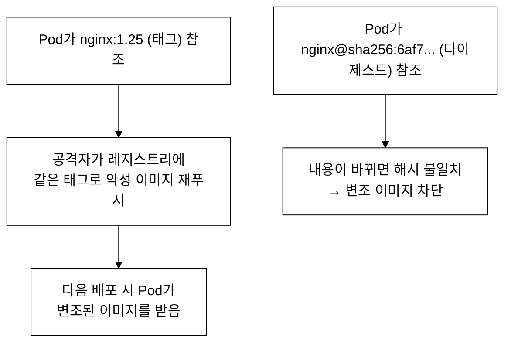
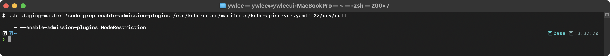
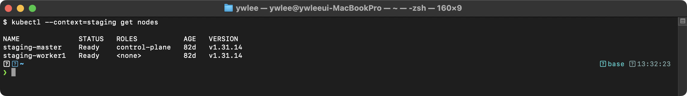
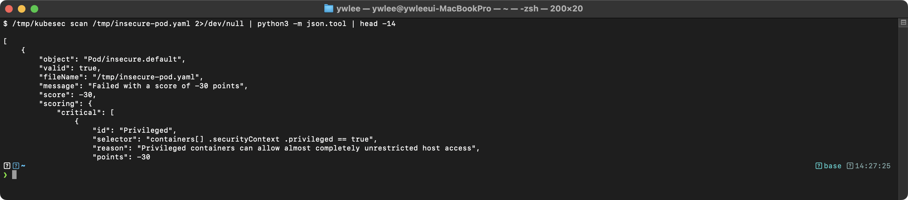
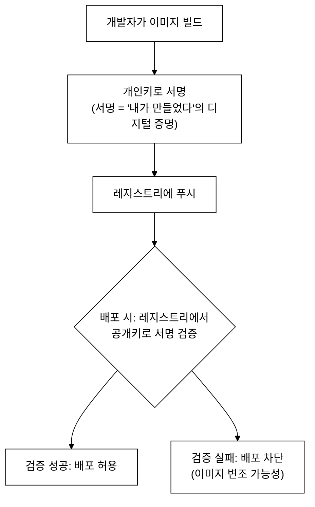
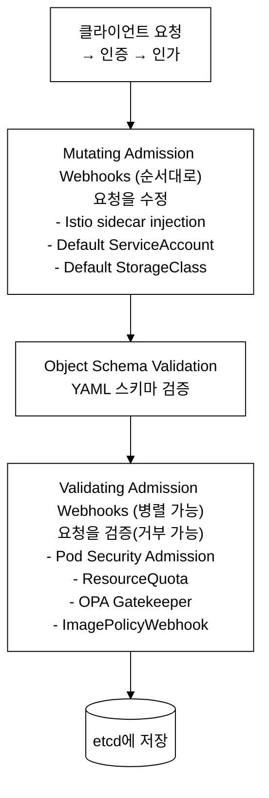

# CKS Day 10: Supply Chain Security (2/2) - 시험 패턴, 실전 문제, 심화 학습

> 학습 목표 | CKS 도메인: Supply Chain Security (20%) | 예상 소요 시간: 2시간

---

> 이 문서에서 반복 등장하는 **tart-infra**는 본 저장소가 로컬 Apple Silicon 위에 띄운 멀티클러스터 실습 환경(dev/staging/platform/prod 4개)을 가리킨다. 이 과정은 클라우드 SaaS가 아니라 로컬에 실제로 떠 있는 K8s 클러스터에서 직접 손으로 명령을 실행하며 배운다. 실습을 시작하기 전에 `./scripts/boot.sh`로 VM을 기동하고, 재부팅 직후라면 `./scripts/fix-cluster-ip-drift.sh`로 IP 드리프트를 복구해 두어야 한다(CLAUDE.md §3 참조). kubeconfig는 `~/sideproejct/IaC_apple_sillicon/kubeconfig/<클러스터>.yaml`에 있으며, 파괴 실습은 dev/staging 에서만 수행한다.

## 오늘의 학습 목표

- Supply Chain Security 도메인의 CKS 시험 출제 패턴을 분석한다
- Trivy, ImagePolicyWebhook, 이미지 다이제스트 관련 실전 문제 11개를 풀어본다
- tart-infra 환경에서 이미지 보안 실습을 수행한다
- 심화 주제를 학습하여 이해를 깊게 한다

> **전제:** 이 파일은 Day 9(Supply Chain Security 1/2)에서 다룬 Trivy 설치·기본 스캔(§1~6)을 전제한다. Day 9를 먼저 학습한 뒤 이 파일을 읽는다. 이 파일은 §7부터 시작한다.

> **구성:** 아래 §7.0은 §7의 사전 개요로, ImagePolicyWebhook의 커널/네트워크 레벨 동작 원리를 먼저 다룬다. 이후 §7 본문(출제 패턴·실전 문제)으로 이어진다.

### 7.0 내부 동작 원리: ImagePolicyWebhook의 Admission 체인

```
ImagePolicyWebhook 커널/네트워크 레벨 동작
══════════════════════════════════════════

1. kubectl apply → HTTPS 요청이 kube-apiserver에 도달한다
2. kube-apiserver의 admission chain에서 ImagePolicyWebhook 플러그인이 활성화된다
3. 플러그인은 AdmissionConfiguration에 지정된 kubeconfig를 읽어
   외부 webhook 서비스의 URL과 TLS 인증서 정보를 파악한다
4. Pod spec에서 containers[].image 필드를 추출하여 ImageReview 객체를 구성한다:
   {
     "apiVersion": "imagepolicy.k8s.io/v1alpha1",
     "kind": "ImageReview",
     "spec": {
       "containers": [{"image": "nginx:1.25"}],
       "namespace": "default"
     }
   }
5. mTLS 기반으로 webhook 서비스에 POST 요청을 전송한다
6. webhook 서비스가 이미지 정책(레지스트리 화이트리스트, 서명 검증 등)을
   평가하고 ImageReview.status.allowed = true/false로 응답한다
7. allowed=false이면 API Server가 Pod 생성을 거부한다
8. webhook 서비스가 응답하지 않는 경우:
   - defaultAllow=true (fail-open): Pod 생성을 허용한다 — 가용성 우선
   - defaultAllow=false (fail-closed): Pod 생성을 거부한다 — 보안 우선
```

---


## 7. 이 주제가 시험에서 어떻게 나오는가

### 공급망 보안(Supply Chain Security) 개요 — 왜 CKS 도메인의 20%인가

**등장 배경.** Supply Chain Security는 컨테이너 이미지가 개발 단계부터 배포까지의 경로(빌드 → 레지스트리 푸시 → 클러스터 배포)에서 변조·탈취되는 것을 방지하는 분야다. 과거 Docker 중심 시절에는 이미지 서명 체계가 표준화되어 있지 않아, 공격자가 Dockerfile을 변조하거나 레지스트리 자격증명을 탈취한 뒤 같은 태그(예: `nginx:1.25`)에 악성 내용을 덮어쓰는 image replacement(이미지 교체) 공격이 가능했다. 이미지 한 장에는 베이스 OS·라이브러리 수십~수백 개가 들어 있어, 그중 하나에 알려진 취약점(CVE)이 있으면 클러스터 전체가 위험해진다.

**무엇이 나아졌나(메커니즘).** CKS는 이 공격 체인을 단계별 방어로 끊는다. Trivy(이미지 스캔으로 알려진 CVE를 사전 탐지) → ImagePolicyWebhook·ValidatingWebhookConfiguration(배포 시점에 정책을 강제) → Cosign(이미지에 디지털 서명을 붙여 출처·무결성 검증) → SBOM(이미지에 포함된 컴포넌트 목록을 공개·추적)이 각각 빌드·배포·검증·감사 단계를 담당한다.

**트레이드오프.** 스캔·서명·웹훅 검증은 빌드와 배포 파이프라인에 지연을 더하고, 웹훅 장애 시 정책(fail-open/fail-closed)에 따라 가용성과 보안 사이의 선택을 강제한다. CKS가 이 도메인에 20% 비중을 두는 이유는, 인증·인가(RBAC)·런타임 보안과 달리 공급망은 클러스터 외부에서 들어오는 위협 표면이라 별도의 방어 계층이 필요하기 때문이다.

> 아래 용어 풀이: **CVE**(Common Vulnerabilities and Exposures)는 공개된 보안 취약점에 부여하는 표준 식별자다. **Admission Controller**는 API 요청이 인증·인가를 통과한 뒤 etcd에 저장되기 전에 요청을 수정(Mutating)하거나 검증·거부(Validating)하는 플러그인이다. **mTLS**(mutual TLS)는 서버와 클라이언트가 서로의 인증서를 검증하는 양방향 TLS다. **SBOM**(Software Bill of Materials)은 이미지에 포함된 소프트웨어 컴포넌트 목록이다.

### 7.1 출제 패턴

각 패턴은 위에서 설명한 공격 체인의 어느 단계를 막는지와 함께 이해하면 외우기 쉽다.

```
Supply Chain Security 출제 패턴 (20%)
═════════════════════════════════════

1. Trivy 이미지 스캔 (매우 빈출)
   - "여러 이미지를 스캔하고 CRITICAL 취약점이 있는 Pod를 삭제하라"
   - "특정 네임스페이스의 이미지 중 가장 적은 취약점을 가진 것을 사용하라"
   의도: Trivy 사용법과 결과 해석 능력

2. ImagePolicyWebhook 설정 (빈출, 배점 높음)
   - "ImagePolicyWebhook을 활성화하고 defaultAllow=false로 설정하라"
   - "설정 파일이 주어지고, API Server에 적용하라"
   의도: Admission Controller 설정 능력

3. Dockerfile 보안 수정 (빈출)
   - "Dockerfile의 보안 문제를 식별하고 수정하라"
   의도: 보안 모범 사례 이해도

4. 이미지 다이제스트 (가끔 출제)
   - "태그 대신 다이제스트를 사용하도록 수정하라"
   의도: 이미지 불변성 이해도

5. kubesec 정적 분석 (가끔 출제)
   - "매니페스트의 보안 점수를 높이도록 수정하라"
```

### 7.2 실전 문제 (10개 이상)

> 아래 실전 문제는 §7.1의 출제 패턴을 하나씩 손으로 풀어보는 미니랩이다. 앞 절(§7.1 개요)의 공격 체인 — 스캔·정책·서명·SBOM — 과 연결해 읽으면 "왜 이 작업을 하는가"가 드러난다.

#### 내부 동작 원리: 이미지 태그 vs 다이제스트

문제 1·4에서 다루는 이미지 다이제스트의 배경을 먼저 짚는다. 이미지 태그(`nginx:1.25`)는 **변경 가능한 참조**다. 같은 태그를 가리키는 실제 이미지 내용은 레지스트리에 재푸시하면 언제든 바뀔 수 있다. 반면 다이제스트(`nginx@sha256:...`)는 이미지 내용 전체를 SHA-256으로 해시한 값이라 내용이 1비트라도 바뀌면 해시도 달라진다 — 즉 **불변(immutable) 참조**다. 보안이 중요한 환경에서는 태그 대신 다이제스트로 이미지를 고정해, 공격자가 같은 태그에 악성 이미지를 덮어쓰는 image replacement 공격을 차단한다.


_그림 0. 태그 참조는 재푸시로 내용이 바뀌지만(image replacement), 다이제스트 참조는 내용 변경 시 해시가 달라져 차단된다._

### 문제 1. Trivy 이미지 스캔

> **사전 준비 — scan-ns 네임스페이스 및 리소스 생성.** 아래 명령을 풀이 시작 전에 반드시 실행한다. 클러스터에 scan-ns 가 없으면 kubectl get pods -n scan-ns 가 "No resources found" 를 반환하므로, 풀이의 출발점이 성립하지 않는다.
>
> ```bash
> kubectl create ns scan-ns
> kubectl run web1   -n scan-ns --image=nginx:1.19 --restart=Never
> kubectl run web2   -n scan-ns --image=nginx:1.25 --restart=Never
> kubectl run cache1 -n scan-ns --image=redis:6   --restart=Never
> kubectl run cache2 -n scan-ns --image=redis:7   --restart=Never
> kubectl wait pod -n scan-ns --all --for=condition=Ready --timeout=60s
> ```

다음 이미지 중 CRITICAL 취약점이 있는 이미지를 사용하는 Pod를 삭제하라: `nginx:1.19`, `nginx:1.25`, `redis:6`, `redis:7`

<details>
<summary>풀이</summary>

```bash
trivy image --severity CRITICAL nginx:1.19 2>/dev/null | grep -E "Total:|CRITICAL"
trivy image --severity CRITICAL nginx:1.25 2>/dev/null | grep -E "Total:|CRITICAL"
trivy image --severity CRITICAL redis:6 2>/dev/null | grep -E "Total:|CRITICAL"
trivy image --severity CRITICAL redis:7 2>/dev/null | grep -E "Total:|CRITICAL"

# CRITICAL이 있는 이미지의 Pod 찾기
kubectl get pods -n scan-ns -o jsonpath='{range .items[*]}{.metadata.name}: {.spec.containers[0].image}{"\n"}{end}'

# CRITICAL이 있는 Pod 삭제
kubectl delete pod web1 -n scan-ns     # nginx:1.19 (구버전)
kubectl delete pod cache1 -n scan-ns   # redis:6 (구버전)
```

> 위 `trivy image ...` 명령의 실제 출력(취약점 표·`Total: ... (CRITICAL: N)` 요약 줄)은 §4①에 따라 실제 터미널 스크린샷으로 제시해야 한다. 현재는 (스크린샷 필요) 상태이며, 캡처는 메인이 dev 클러스터에서 별도 수행한다. 출력 형식의 읽는 법은 "추가 심화 학습 > Trivy 스캔 결과 분석 예제"를 참조한다.

</details>

### 문제 2. ImagePolicyWebhook 설정

ImagePolicyWebhook Admission Controller를 활성화하라. 설정 파일은 `/etc/kubernetes/admission-control/`에 있다. `defaultAllow`를 `false`로 설정하라.

<details>
<summary>풀이</summary>

전제: 이 작업은 control-plane 노드에 SSH로 들어가 진행한다(예: `ssh staging-master`). API Server 매니페스트와 admission 설정 파일은 호스트의 `/etc/kubernetes/` 아래에 있다. 파괴 실습이므로 staging(또는 dev)에서만 한다.

```bash
# 0) 기존 admission-plugins 값 먼저 확인 — 여기에 추가하는 것이지 통째로 교체가 아니다
kubectl get pod kube-apiserver-staging-master -n kube-system -o yaml | grep enable-admission-plugins
# 예: --enable-admission-plugins=NodeRestriction 만 있을 수도, 없을 수도 있다(없으면 기본 세트가 적용 중)

# 설정 디렉터리가 없으면 만든다(파일명은 문제에서 주어진 admission-config.yaml 사용)
ls /etc/kubernetes/admission-control/ 2>/dev/null || sudo mkdir -p /etc/kubernetes/admission-control

# 설정 확인 및 수정
cat /etc/kubernetes/admission-control/admission-config.yaml
# defaultAllow: false 확인 (아니면 수정)

# API Server 매니페스트 수정
cp /etc/kubernetes/manifests/kube-apiserver.yaml /tmp/kube-apiserver.yaml.bak
vi /etc/kubernetes/manifests/kube-apiserver.yaml
```

> `--enable-admission-plugins`에는 **기존값에 `,`로 구분해 ImagePolicyWebhook을 덧붙인다**(예: `NodeRestriction` → `NodeRestriction,ImagePolicyWebhook`). 플러그인 나열 순서는 실행 순서에 영향을 주지 않으므로 상관없다. 플래그가 아예 없었다면 새로 추가하되, 기본으로 켜져 있던 플러그인을 끄지 않도록 주의한다.

추가할 내용:
```yaml
- --enable-admission-plugins=NodeRestriction,ImagePolicyWebhook
- --admission-control-config-file=/etc/kubernetes/admission-control/admission-config.yaml

volumeMounts:
- name: admission-control
  mountPath: /etc/kubernetes/admission-control/
  readOnly: true

volumes:
- name: admission-control
  hostPath:
    path: /etc/kubernetes/admission-control/
    type: DirectoryOrCreate
```

```bash
watch crictl ps | grep kube-apiserver
kubectl get nodes
```

</details>

**검증: ImagePolicyWebhook 적용 확인**

```bash
# API Server에 플러그인이 활성화되었는지 확인
kubectl get pod kube-apiserver-staging-master -n kube-system -o yaml | grep enable-admission-plugins
```



```bash
# API Server가 정상 동작하는지 확인
kubectl get nodes
```



### 문제 3. Dockerfile 보안 수정

다음 Dockerfile의 보안 문제를 식별하고 수정하라:

```dockerfile
FROM ubuntu:latest
RUN apt-get update && apt-get install -y curl vim netcat python3
ADD . /app
WORKDIR /app
CMD ["python3", "app.py"]
```

<details>
<summary>풀이</summary>

```dockerfile
FROM python:3.12-slim AS builder
WORKDIR /app
COPY requirements.txt .
RUN pip install --no-cache-dir --user -r requirements.txt
COPY . .

FROM gcr.io/distroless/python3-debian12:nonroot
WORKDIR /app
COPY --from=builder /root/.local /home/nonroot/.local
COPY --from=builder /app .
USER 65532:65532
EXPOSE 8080
ENTRYPOINT ["python3", "app.py"]
```

수정 사항:
1. `FROM ubuntu:latest` → 특정 버전 + distroless
2. `USER` 추가 (non-root)
3. 불필요한 패키지(vim, netcat, curl) 제거
4. `ADD` → `COPY` 변경
5. 멀티스테이지 빌드 적용

> 베이스 이미지 태그는 사용 전 실제로 존재하는지 확인한다. distroless의 `python3-debian12`는 기본적으로 root(UID 0)로 실행되고, `:nonroot` 변형은 UID 65532로 실행된다. 위 Dockerfile은 어느 쪽이든 `USER 65532:65532`를 명시하므로 non-root 실행이 보장되지만, 태그 존재 여부는 `docker manifest inspect gcr.io/distroless/python3-debian12:nonroot` 또는 [console.cloud.google.com 의 distroless 레지스트리](https://github.com/GoogleContainerTools/distroless)에서 확인한다. 검증된 안전 대안으로 `gcr.io/distroless/base-debian12:nonroot`가 있다.

</details>

### 문제 4. 이미지 다이제스트 적용

> **사전 준비 — production 네임스페이스 및 web-app Deployment 생성.** 문제 4·11 모두 production 네임스페이스의 web-app Deployment 를 전제한다. 없으면 아래 명령으로 먼저 만든다.
>
> 대상 클러스터: **dev 클러스터**에서 시험 환경 시뮬레이션용으로 `production` 네임스페이스를 생성한다. tart-infra의 prod 클러스터(CLAUDE.md §3: 읽기 위주, 변경 자제)와는 무관하다.
>
> ```bash
> export KUBECONFIG=~/sideproejct/IaC_apple_sillicon/kubeconfig/dev.yaml
> kubectl create ns production
> kubectl create deployment web-app -n production --image=nginx:latest --replicas=1
> kubectl wait deployment web-app -n production --for=condition=Available --timeout=60s
> ```

`production` 네임스페이스의 `web-app` Deployment가 `nginx:latest`를 사용하고 있다. 다이제스트로 변경하라.

준비물: 다이제스트 조회 도구가 필요하다. `which crane`으로 설치 여부를 확인하고, 없으면 `go install github.com/google/go-containerregistry/cmd/crane@latest`로 설치하거나 `docker inspect <image> | jq '.[0].RepoDigests'`로 대체할 수 있다. 아래 풀이는 도구 없이도 가능한 방법(실행 중 Pod의 `imageID` 필드 활용)을 먼저 보인다. `imageID`에는 kubelet이 실제로 pull한 이미지의 다이제스트가 들어 있다.

<details>
<summary>풀이</summary>

```bash
# 현재 실행 중인 Pod 이름 확인 (label app=web-app 인 Deployment의 Pod)
kubectl get pods -n production -l app=web-app

# 현재 이미지의 다이제스트 확인 (-l 셀렉터로 첫 Pod의 imageID 추출)
kubectl get pod -n production -l app=web-app \
  -o jsonpath='{.items[0].status.containerStatuses[0].imageID}'

# Deployment 이미지 변경
kubectl set image deployment/web-app -n production \
  nginx=nginx@sha256:6af79ae5de407283dcea8b00d5c37ace95441fd58a8b1d2aa1ed93f5511bb18c

# 확인
kubectl get deployment web-app -n production \
  -o jsonpath='{.spec.template.spec.containers[0].image}'
```

</details>

### 문제 5. kubesec 정적 분석

주어진 Pod YAML의 보안 점수를 높이기 위한 수정사항을 적용하라.

도구 소개: **kubesec**은 Kubernetes YAML의 보안 설정을 평가해 점수(score)와 권고사항을 내는 정적 분석 도구다. 설치는 `curl -sSL https://github.com/controlplaneio/kubesec/releases/download/v2.14.2/kubesec_linux_amd64.tar.gz | tar xz && sudo mv kubesec /usr/local/bin/` (버전은 릴리스 페이지에서 확인). 설치가 어려우면 웹 API `curl -sSX POST --data-binary @pod.yaml https://v2.kubesec.io/scan`로도 동일한 결과를 얻는다(설치 불필요). 아래 풀이의 두 명령은 같은 평가를 로컬 바이너리 vs 원격 API로 수행하는 차이일 뿐이며, 출력 형식(JSON)은 동일하다.

<details>
<summary>풀이</summary>

```bash
kubesec scan pod.yaml
# 또는 (설치 없이 웹 API 사용)
curl -sSX POST --data-binary @pod.yaml https://v2.kubesec.io/scan | jq .
```

보안 강화:
```yaml
apiVersion: v1
kind: Pod
metadata:
  name: secure-pod
spec:
  serviceAccountName: dedicated-sa
  automountServiceAccountToken: false
  securityContext:
    runAsNonRoot: true
    runAsUser: 1000
    seccompProfile:
      type: RuntimeDefault
  containers:
  - name: app
    image: nginx:1.25
    securityContext:
      readOnlyRootFilesystem: true
      allowPrivilegeEscalation: false
      capabilities:
        drop: ["ALL"]
    resources:
      limits:
        cpu: "200m"
        memory: "128Mi"
```

</details>

### 문제 6. Trivy 클러스터 스캔

dev 클러스터의 demo 네임스페이스에서 실행 중인 모든 이미지를 스캔하고, CRITICAL 취약점이 없는 이미지만 남겨라.

준비: dev 클러스터 접속과 demo 네임스페이스 존재를 먼저 확인한다. demo는 tart-infra dev 클러스터에 상주하는 데모 워크로드 네임스페이스다(없으면 문제의 전제 리소스를 먼저 배포해야 한다).

```bash
export KUBECONFIG=~/sideproejct/IaC_apple_sillicon/kubeconfig/dev.yaml
kubectl get ns | grep demo                 # demo 네임스페이스 존재 확인
kubectl get pods -n demo                    # 스캔 대상 Pod 목록 확인
```

<details>
<summary>풀이</summary>

```bash
# 모든 이미지 확인
kubectl get pods -n demo -o jsonpath='{range .items[*]}{.metadata.name}: {range .spec.containers[*]}{.image}{" "}{end}{"\n"}{end}'

# 각 이미지 스캔
for img in $(kubectl get pods -n demo -o jsonpath='{range .items[*]}{range .spec.containers[*]}{.image}{"\n"}{end}{end}' | sort -u); do
  echo "=== $img ==="
  COUNT=$(trivy image --severity CRITICAL --format json "$img" 2>/dev/null | jq '[.Results[].Vulnerabilities // [] | .[] | select(.Severity == "CRITICAL")] | length')
  echo "CRITICAL 취약점: $COUNT"
  if [ "$COUNT" -gt 0 ]; then
    echo "*** 삭제 대상! ***"
    # 해당 이미지를 사용하는 Pod 찾기
    kubectl get pods -n demo -o jsonpath="{range .items[*]}{range .spec.containers[*]}{.image}{'\t'}{end}{.metadata.name}{'\n'}{end}" | grep "$img"
  fi
done

# CRITICAL이 있는 Pod 삭제
kubectl delete pod <pod-name> -n demo
```

</details>

### 문제 7. SBOM 생성

nginx:1.25 이미지의 SBOM(Software Bill of Materials)을 CycloneDX 형식으로 생성하라.

개념: **SBOM**(Software Bill of Materials)은 컨테이너 이미지에 포함된 모든 소프트웨어 컴포넌트(라이브러리·패키지·버전) 목록이다. 부품 명세서에 비유하면, 완제품(이미지)에 어떤 부품(패키지)이 들어갔는지를 한눈에 보여준다. 의존성 변조(supply chain 공격)나 새로 공개된 CVE의 영향 범위를 빠르게 추적하려면 배포 시점에 SBOM을 함께 공개해야 한다. **CycloneDX**는 이 SBOM을 표준화한 형식 중 하나이며, Trivy는 이미지를 분석해 SBOM을 자동 생성할 수 있다.

<details>
<summary>풀이</summary>

```bash
trivy image --format cyclonedx -o /tmp/nginx-sbom.cdx.json nginx:1.25

# SBOM 분석
cat /tmp/nginx-sbom.cdx.json | jq '.components | length'
# 총 컴포넌트 수

cat /tmp/nginx-sbom.cdx.json | jq '.components[] | {name, version, type}' | head -30
# 각 컴포넌트 정보
```

</details>

### 문제 8. ValidatingWebhookConfiguration 작성

이미지 검증을 위한 ValidatingWebhookConfiguration을 작성하라. Pod 생성 시 `image-validator` 서비스(security 네임스페이스)를 호출하도록 설정하라.

개념 비교: 문제 2의 **ImagePolicyWebhook**과 본 문제의 **ValidatingWebhookConfiguration**은 둘 다 외부 웹훅을 호출하지만 적용 방식이 다르다.

| 구분 | ImagePolicyWebhook | ValidatingWebhookConfiguration |
|:--|:--|:--|
| 형태 | API Server 내장 admission 플러그인 | 클러스터 리소스(YAML로 동적 등록) |
| 활성화 | API Server 플래그·설정 파일 수정 + 재시작 필요 | `kubectl apply`로 즉시 등록(재시작 불필요) |
| 검증 범위 | 이미지 정책만(`ImageReview` 객체) | 임의 리소스(Pod·Deployment·NetworkPolicy 등) |
| 위치 | `imagepolicy.k8s.io/v1alpha1`(alpha, 사용 빈도 감소) | `admissionregistration.k8s.io/v1`(안정, 범용) |

최신 CKS 시험과 실무는 동적 등록이 가능하고 범용적인 ValidatingWebhookConfiguration을 더 권장한다. ImagePolicyWebhook은 API Server 설정을 직접 다루는 능력을 묻는 전통적 출제 패턴으로 남아 있다.

<details>
<summary>풀이</summary>

```yaml
apiVersion: admissionregistration.k8s.io/v1
kind: ValidatingWebhookConfiguration
metadata:
  name: image-validation
webhooks:
- name: validate-image.example.com
  admissionReviewVersions: ["v1"]
  sideEffects: None
  clientConfig:
    service:
      name: image-validator
      namespace: security
      path: "/validate"
    caBundle: <base64-encoded-ca>
  rules:
  - operations: ["CREATE", "UPDATE"]
    apiGroups: [""]
    apiVersions: ["v1"]
    resources: ["pods"]
  failurePolicy: Fail
  namespaceSelector:
    matchExpressions:
    - key: kubernetes.io/metadata.name
      operator: NotIn
      values: ["kube-system"]
```

> **caBundle 값을 채우는 법.** 위 YAML의 `caBundle: <base64-encoded-ca>` 플레이스홀더에는 webhook 서버의 CA 인증서를 base64로 인코딩한 값을 넣는다. 다음 두 가지 방법으로 추출한다.
>
> ```bash
> # 방법 1: webhook 서버가 TLS Secret을 사용하는 경우 (ca.crt 키)
> kubectl get secret -n security image-validator-tls \
>   -o jsonpath="{.data['ca\.crt']}"
>
> # 방법 2: 클러스터 CA를 webhook CA로 재사용하는 경우
> kubectl config view --raw --minify \
>   -o jsonpath="{.clusters[0].cluster.certificate-authority-data}"
> ```
>
> 두 명령 모두 이미 base64로 인코딩된 값을 반환한다. 추출한 값을 그대로 `caBundle:` 필드에 붙여넣는다(추가 인코딩 불필요).

</details>

### 문제 9. Trivy 설정 파일 스캔

K8s 매니페스트 파일을 Trivy로 스캔하여 보안 설정 문제를 찾아라.

<details>
<summary>풀이</summary>

```bash
# 매니페스트 보안 스캔
trivy config /path/to/manifests/

# 또는 특정 파일
trivy config deployment.yaml

# 결과에서 CRITICAL, HIGH 문제 확인
# - privileged container
# - runAsNonRoot missing
# - capabilities not dropped
# - readOnlyRootFilesystem missing
```

</details>

### 문제 10. 이미지 서명 검증 (개념)

Cosign을 사용하여 이미지의 서명을 검증하는 명령어를 작성하라.

<details>
<summary>풀이</summary>

**Keyless 서명 원리.** Sigstore는 Fulcio(인증서 CA)·Rekor(감사 로그)·cosign(서명 CLI)을 묶는 오픈소스 공급망 서명 생태계다. 키리스(keyless) 서명은 장기 개인키 파일 없이 서명하는 방식이다. GitHub Actions 같은 CI 환경이 빌드 시점에 OIDC(OpenID Connect) 토큰을 발급받아 Sigstore Fulcio(단기 인증서 CA)에서 수명이 수 분에 불과한 X.509 인증서를 발급받는다. 이 인증서로 이미지에 서명하고, 서명 메타데이터를 Rekor(투명성 로그, 공개 변경 불가 로그)에 기록한다. 검증 시 `--certificate-oidc-issuer`는 "어떤 OIDC 제공자(예: GitHub Actions)를 신뢰하는가"를, `--certificate-identity`는 "어떤 워크플로 ID(예: builder@company.com)로 서명했는가"를 지정한다. 단기 인증서라 장기 키 유출 위험이 없고, Rekor 로그 덕분에 사후 감사도 가능하다.

```bash
# 키 기반 검증
cosign verify --key cosign.pub docker.io/myrepo/myimage:v1.0

# Keyless 검증
cosign verify \
  --certificate-identity=builder@company.com \
  --certificate-oidc-issuer=https://token.actions.githubusercontent.com \
  docker.io/myrepo/myimage:v1.0

# 서명이 없는 경우
# Error: no matching signatures
```

</details>

### 문제 11. 복합 문제 - Supply Chain 전체 보안

다음을 모두 수행하라:
1. `web-app` Deployment의 이미지를 Trivy로 스캔
2. CRITICAL 취약점이 없는 버전으로 교체
3. 이미지를 다이제스트로 지정
4. Pod Security Restricted 준수하도록 SecurityContext 추가

<details>
<summary>풀이</summary>

```bash
# 1. 현재 이미지 확인 및 스캔
kubectl get deploy web-app -n production -o jsonpath='{.spec.template.spec.containers[0].image}'
trivy image --severity CRITICAL nginx:1.19

# 2. 취약점 없는 버전 확인
trivy image --severity CRITICAL nginx:1.25
# CRITICAL 없음

# 3. 다이제스트 확인
crane digest nginx:1.25

# 4. Deployment 수정
kubectl edit deploy web-app -n production
```

```yaml
spec:
  template:
    spec:
      securityContext:
        runAsNonRoot: true
        runAsUser: 1000
        seccompProfile:
          type: RuntimeDefault
      containers:
      - name: web
        image: nginx@sha256:6af79ae5de...  # 다이제스트
        securityContext:
          allowPrivilegeEscalation: false
          readOnlyRootFilesystem: true
          capabilities:
            drop: ["ALL"]
        volumeMounts:
        - name: tmp
          mountPath: /tmp
      volumes:
      - name: tmp
        emptyDir: {}
```

</details>

### 이 섹션의 체크리스트 (실전 문제 1~11 요약)

문제를 풀며 손에 익혀야 할 명령을 그룹별로 정리한다. 상세 버전은 문서 끝의 "전체 CKS 공급망 보안 체크리스트"에 있다.

```
문제 1~3 (스캔·정책·Dockerfile):
  □ trivy image <이미지> --severity CRITICAL → CRITICAL 있는 Pod 삭제
  □ ImagePolicyWebhook: 기존 enable-admission-plugins에 ,로 추가 + config-file + 볼륨마운트
  □ Dockerfile: 버전태그·USER non-root·ADD→COPY·불필요 패키지 제거·멀티스테이지

문제 4~6 (다이제스트·kubesec·클러스터 스캔):
  □ imageID 또는 crane digest 로 sha256 다이제스트 확보 → kubectl set image
  □ kubesec scan / 웹 API 로 score 확인 → critical 항목 제거
  □ 네임스페이스 전체 이미지 루프 스캔 → CRITICAL Pod 식별·삭제

문제 7~11 (SBOM·웹훅·서명·복합):
  □ trivy image --format cyclonedx 로 SBOM 생성
  □ ValidatingWebhookConfiguration: rules·clientConfig.service·failurePolicy
  □ cosign verify --key / keyless 로 서명 검증
  □ 복합: 스캔 → 무취약 버전 → 다이제스트 고정 → Restricted SecurityContext
```

---

## 트러블슈팅: Supply Chain 시험 문제 장애 대응

### 시나리오 1: Trivy 스캔 시 exit code 해석 혼동

```
증상: --exit-code 1 옵션을 사용했는데 스크립트가 예상대로 동작하지 않는다.
원인: exit code 0 = 해당 severity의 취약점 없음, exit code 1 = 취약점 존재이다.
      쉘 스크립트에서 $?를 잘못 해석하면 결과가 뒤바뀐다.
```

```bash
# 올바른 사용법
trivy image --severity CRITICAL --exit-code 1 nginx:1.25 > /dev/null 2>&1
if [ $? -eq 1 ]; then
  echo "CRITICAL 취약점 존재 — 삭제 대상"
else
  echo "CRITICAL 취약점 없음 — 유지"
fi
```

### 시나리오 2: Dockerfile 수정 문제에서 놓치기 쉬운 포인트

```
체크리스트:
  □ FROM: latest 태그 → 특정 버전 태그로 변경했는가
  □ USER: 지시어가 존재하고 non-root(UID != 0)인가
  □ ADD → COPY로 변경했는가
  □ 불필요한 패키지(vim, netcat, wget, curl, nmap)를 제거했는가
  □ 멀티스테이지 빌드를 적용했는가
  □ .dockerignore가 필요한가 (COPY . 사용 시)
```

### 시나리오 3: kubesec 스캔 점수가 음수인 경우

```
증상: kubesec scan pod.yaml 결과 score가 -30이다.
해석: critical 항목이 존재한다는 의미이다.
```

```bash
kubesec scan pod.yaml | jq '.[0].scoring.critical'
```



```bash
# 해결: privileged=false, runAsNonRoot=true 등을 적용한 뒤 재스캔
kubesec scan pod-fixed.yaml | jq '.[0].score'
```

> **수정 후 스크린샷:** (미캡처) — pod-fixed.yaml 에 `securityContext.runAsNonRoot: true`, `allowPrivilegeEscalation: false`, `capabilities.drop: [ALL]` 적용 후 score 가 0 이상으로 올라간 실측 화면을 메인이 별도 캡처해 삽입한다. 현재 위 이미지는 수정 전(score -30) 상태이다.

점수 0 이상이면 기본적으로 안전한 상태이다.

---

## 8. 복습 체크리스트

- [ ] Trivy의 기본 사용법과 주요 옵션을 아는가?
- [ ] `--severity`, `--exit-code`, `--ignore-unfixed` 옵션을 활용할 수 있는가?
- [ ] CRITICAL 취약점이 있는 이미지를 식별하고 해당 Pod를 삭제할 수 있는가?
- [ ] ImagePolicyWebhook의 설정 구성 요소를 아는가?
- [ ] `defaultAllow: false` (fail-closed)의 의미를 설명할 수 있는가?
- [ ] API Server에 ImagePolicyWebhook을 적용할 수 있는가?
- [ ] Dockerfile의 보안 문제를 식별하고 수정할 수 있는가?
- [ ] 멀티스테이지 빌드, distroless, non-root USER의 의미를 아는가?
- [ ] 이미지 태그 대신 다이제스트를 사용하는 이유를 설명할 수 있는가?
- [ ] Cosign 이미지 서명/검증의 개념을 이해하는가?
- [ ] kubesec으로 매니페스트 보안을 분석할 수 있는가?
- [ ] SBOM의 개념과 Trivy로 생성하는 방법을 아는가?

---

> **내일 예고:** Day 11에서는 Monitoring, Logging & Runtime Security 도메인(20%)의 Falco, Audit Log, Sysdig, 컨테이너 불변성을 학습한다.

---

## 9. tart-infra 실습 (선택 — 실제 dev 클러스터 검증)

### 실습 환경 설정

```bash
# dev 클러스터에 접속
export KUBECONFIG=~/sideproejct/IaC_apple_sillicon/kubeconfig/dev.yaml
kubectl get nodes
```

### 실습 1: 이미지 취약점 점검

```bash
# demo 네임스페이스에서 사용 중인 이미지 목록 추출
kubectl get pods -n demo -o jsonpath='{range .items[*]}{range .spec.containers[*]}{.image}{"\n"}{end}{end}' | sort -u
```

**예상 출력:** (미캡처) — 실제 출력은 메인이 dev 클러스터 demo 네임스페이스에서 캡처 후 삽입한다.

**동작 원리:** 이미지 보안 점검 순서:
1. 사용 중인 이미지 목록을 추출한다
2. `trivy image <image>` 명령으로 각 이미지의 취약점을 스캔한다
3. CRITICAL, HIGH 취약점이 있는 이미지를 패치된 버전으로 교체한다
4. `:latest` 태그는 버전이 고정되지 않아 위험하다 — 다이제스트(`@sha256:...`) 사용 권장

```bash
# Trivy로 이미지 스캔 (trivy 설치 필요)
# trivy image nginx:1.25 --severity CRITICAL,HIGH
# trivy image postgres:15 --severity CRITICAL,HIGH
```

### 실습 2: 이미지 다이제스트 확인

```bash
# 실행 중인 Pod의 이미지 다이제스트 확인
kubectl get pods -n demo -o jsonpath='{range .items[*]}{.metadata.name}{"\t"}{range .status.containerStatuses[*]}{.imageID}{"\n"}{end}{end}'
```

**동작 원리:** 이미지 태그 vs 다이제스트:
1. 태그(`nginx:1.25`): 같은 태그에 다른 이미지가 푸시될 수 있다 (변경 가능)
2. 다이제스트(`nginx@sha256:abc...`): 이미지 내용의 해시 — 불변이다
3. 보안 중요 환경에서는 다이제스트를 사용하여 이미지 무결성을 보장한다
4. `containerStatuses[].imageID`에서 실제 실행 중인 이미지의 다이제스트를 확인할 수 있다

### 실습 3: Admission Controller 확인

```bash
# API Server에 활성화된 Admission Controller 확인
kubectl get pod kube-apiserver-dev-master -n kube-system -o yaml | grep "enable-admission-plugins"
```

**예상 출력:** (미캡처) — 실제 출력은 메인이 dev 클러스터에서 `kubectl get pod kube-apiserver-dev-master -n kube-system -o yaml` 실행 후 캡처해 삽입한다.

**동작 원리:** Admission Controller의 역할:
1. API 요청이 인증/인가를 통과한 후 etcd에 저장되기 전에 실행된다
2. **Mutating**: 요청을 수정한다 (예: Istio sidecar injection, default SA 설정)
3. **Validating**: 요청을 검증한다 (예: Pod Security Admission, ResourceQuota)
4. 실행 순서: Mutating → Validating → etcd 저장
5. ImagePolicyWebhook: 외부 웹훅으로 이미지 정책을 검증하는 Admission Controller

### 실습 4: Dockerfile 보안 패턴 확인

```bash
# tart-infra 매니페스트의 이미지 사용 패턴 분석
echo "=== 보안 양호: 버전 태그 사용 ==="
kubectl get pods -n demo -o jsonpath='{range .items[*]}{range .spec.containers[*]}{.image}{"\n"}{end}{end}' | grep -v latest

echo ""
echo "=== 보안 위험: latest 태그 사용 ==="
kubectl get pods -n demo -o jsonpath='{range .items[*]}{range .spec.containers[*]}{.image}{"\n"}{end}{end}' | grep latest
```

**동작 원리:** Dockerfile 보안 모범 사례:
1. 멀티스테이지 빌드: 빌드 도구가 최종 이미지에 포함되지 않도록 한다
2. distroless/scratch 기반 이미지: 패키지 관리자, 셸이 없어 공격 표면이 최소화된다
3. `USER <non-root>`: root가 아닌 사용자로 실행한다
4. `COPY --chown=<user>`: 파일 소유권을 non-root 사용자로 설정한다
5. `.dockerignore`: 불필요한 파일(secret, .git 등)이 이미지에 포함되지 않도록 한다

---

## 추가 심화 학습: Supply Chain Security 고급 패턴

> **학습 우선순위 안내.** 이 섹션은 **필수**와 **선택** 두 단계로 나뉜다. 시험 대비 우선순위가 높은 필수 항목을 먼저 학습하고, 여력이 있을 때 선택 항목을 추가로 학습한다.
>
> - **필수(시험 직결):** Trivy 이미지 스캔 상세 · Trivy 스캔 결과 분석 · ImagePolicyWebhook 설정 상세 · Dockerfile 보안 문제 식별과 수정 · kubesec 활용
> - **선택(심화 이해):** 이미지 서명 및 검증(Cosign) · conftest · Private Registry 접근 설정 · Admission Controller 종류와 순서 · 추가 연습 문제

### Trivy 이미지 스캔 상세 사용법

```bash
# Trivy 기본 이미지 스캔
trivy image nginx:1.25

# 심각도 필터링: CRITICAL과 HIGH만 표시
trivy image nginx:1.25 --severity CRITICAL,HIGH

# JSON 형식 출력 (CI/CD 파이프라인에서 파싱용)
trivy image nginx:1.25 --format json --output result.json

# 특정 취약점 무시 (오탐 또는 수용 가능한 취약점)
trivy image nginx:1.25 --ignorefile .trivyignore

# 이미지가 아닌 파일시스템 스캔 (Dockerfile 빌드 전)
trivy fs --security-checks vuln,secret,config ./

# Kubernetes 클러스터 전체 스캔
trivy k8s --report summary cluster
```

**동작 원리:** Trivy 스캔 과정:
1. 이미지의 레이어를 분석하여 설치된 패키지 목록을 추출한다
2. 추출된 패키지를 CVE(Common Vulnerabilities and Exposures) 데이터베이스와 대조한다
3. 각 취약점에 CVSS 점수 기반으로 심각도(CRITICAL/HIGH/MEDIUM/LOW)를 부여한다
4. `--exit-code 1`을 사용하면 취약점 발견 시 CI 파이프라인을 실패시킬 수 있다

### Trivy 스캔 결과 분석 예제

**스캔 결과 읽는 법**

`nginx:1.25 (debian 12.4)` — `Total: 142 (CRITICAL: 3, HIGH: 15, MEDIUM: 89, LOW: 35)`

| Library | Vulnerability | Severity | Installed Ver | Fixed Ver |
|:--|:--|:--|:--|:--|
| libssl3 | CVE-2024-0727 | CRITICAL | 3.0.11-1 | 3.0.13-1 |
| libcurl4 | CVE-2023-38545 | HIGH | 7.88.1-10 | 7.88.1-10+deb |
| zlib1g | CVE-2023-45853 | MEDIUM | 1:1.2.13 | (패치 없음) |

각 열의 의미:
- **Library**: 취약한 패키지 이름
- **Vulnerability**: CVE 식별자(cve.mitre.org에서 상세 확인). CVE-2024-0727은 OpenSSL의 NULL 포인터 역참조로 서비스 거부(DoS)를 유발하고, CVE-2023-38545는 libcurl의 SOCKS5 프록시 버퍼 오버플로(CRITICAL급), CVE-2023-45853은 zlib의 정수 오버플로(공식 패치 미발표 시점 기준)다.
- **Fixed Ver**: 패치된 버전. 빈칸(패치 미존재)일 때 대응 전략: ① 해당 라이브러리를 포함하지 않는 베이스 이미지(distroless, scratch)로 교체한다. ② `trivy image --ignore-unfixed`로 패치 없는 항목을 출력에서 제외하고 별도 추적 티켓을 생성해 패치 발표를 모니터링한다. ③ 단기 완화책으로 해당 기능을 비활성화하거나 네트워크 접근을 제한한다.
- 심각도 대응 우선순위: CRITICAL·HIGH는 즉시 조치, MEDIUM은 계획 수립, LOW는 모니터링.

### ImagePolicyWebhook 설정 상세

```yaml
# ImagePolicyWebhook 설정 파일
# 위치: /etc/kubernetes/admission-control/image-policy.yaml
apiVersion: apiserver.config.k8s.io/v1
kind: AdmissionConfiguration
plugins:
  - name: ImagePolicyWebhook
    configuration:
      imagePolicy:
        kubeConfigFile: /etc/kubernetes/admission-control/admission-kubeconfig.yaml
        allowTTL: 50              # 허용 결과 캐시 시간 (초)
        denyTTL: 50               # 거부 결과 캐시 시간 (초)
        retryBackoff: 500         # 웹훅 재시도 간격 (밀리초)
        defaultAllow: false       # 웹훅 장애 시 기본 거부! (보안 우선)
```

```yaml
# ImagePolicyWebhook의 kubeconfig
# 위치: /etc/kubernetes/admission-control/admission-kubeconfig.yaml
apiVersion: v1
kind: Config
clusters:
  - cluster:
      certificate-authority: /etc/kubernetes/admission-control/ca.crt
      server: https://image-policy-webhook.security:8443/validate  # 외부 웹훅 URL
    name: image-policy-webhook
contexts:
  - context:
      cluster: image-policy-webhook
      user: api-server
    name: image-policy-webhook
current-context: image-policy-webhook
users:
  - name: api-server
    user:
      client-certificate: /etc/kubernetes/admission-control/client.crt
      client-key: /etc/kubernetes/admission-control/client.key
```

**동작 원리:** ImagePolicyWebhook 흐름:
1. 사용자가 Pod 생성 요청 → API Server
2. API Server가 이미지 정보를 ImagePolicyWebhook에 전송
3. 외부 웹훅 서버가 이미지 레지스트리, 서명, 취약점 정보를 확인
4. 허용/거부 응답을 API Server에 반환
5. `defaultAllow: false`로 설정하면 웹훅 장애 시에도 이미지 거부 (fail-close)

### Dockerfile 보안 문제 식별과 수정

```dockerfile
# ── 보안 취약 Dockerfile (문제점 포함) ──
FROM ubuntu:latest                 # ❌ latest 태그 사용
RUN apt-get update && apt-get install -y curl wget  # ❌ 불필요한 도구 포함
COPY . /app                        # ❌ 모든 파일 복사 (secret 포함 가능)
RUN chmod 777 /app                 # ❌ 과도한 권한
USER root                          # ❌ root 사용자로 실행
EXPOSE 80
CMD ["./app"]

# ── 보안 강화 Dockerfile (수정 후) ──
# Stage 1: 빌드 스테이지
FROM golang:1.22-alpine AS builder # ✅ 버전 태그 명시, alpine 사용
WORKDIR /build
COPY go.mod go.sum ./              # ✅ 의존성 파일만 먼저 복사
RUN go mod download
COPY . .
RUN CGO_ENABLED=0 go build -o app  # ✅ 정적 바이너리 빌드

# Stage 2: 실행 스테이지
FROM gcr.io/distroless/static:nonroot  # ✅ distroless + nonroot 기반
COPY --from=builder /build/app /app    # ✅ 빌드 결과물만 복사
USER 65534:65534                       # ✅ nonroot UID/GID (nobody)
EXPOSE 8080
ENTRYPOINT ["/app"]                    # ✅ ENTRYPOINT 사용
```

**동작 원리:** Dockerfile 보안 체크리스트:
1. `FROM`: 버전 태그 명시 + 최소 이미지(alpine/distroless/scratch) 사용
2. `COPY`: 필요한 파일만 선택적으로 복사 + `.dockerignore` 활용
3. `USER`: 반드시 non-root 사용자로 설정
4. 멀티스테이지 빌드: 빌드 도구가 최종 이미지에 포함되지 않도록
5. `RUN`: 불필요한 패키지 설치 금지, 캐시 삭제 (`apt-get clean`)

### kubesec을 활용한 YAML 정적 분석

```bash
# kubesec: Kubernetes YAML의 보안 점수를 매기는 도구

# Pod YAML 보안 점수 확인
kubesec scan pod.yaml

# 결과 예시:
# [
#   {
#     "object": "Pod/insecure-pod.default",
#     "valid": true,
#     "score": -30,         ← 음수 = 보안 취약!
#     "scoring": {
#       "critical": [
#         { "id": "Privileged",
#           "reason": "Privileged containers can allow almost completely unrestricted host access" },
#         { "id": "RunAsRoot",
#           "reason": "Running as root gives full control of host" }
#       ],
#       "advise": [
#         { "id": "ReadOnlyRootFilesystem",
#           "reason": "An immutable root filesystem prevents..." },
#         { "id": "LimitsCPU",
#           "reason": "Enforcing CPU limits prevents..." }
#       ]
#     }
#   }
# ]
```

**동작 원리:** kubesec 점수 체계:
1. `critical` (감점): 즉시 수정해야 하는 보안 문제 (privileged, runAsRoot)
2. `advise` (가점 기회): 적용하면 보안이 강화되는 설정 (readOnlyRootFilesystem)
3. 점수가 0 이상이면 기본적으로 안전, 음수이면 심각한 문제 존재
4. CI/CD 파이프라인에서 `--exit-code`와 함께 사용하여 배포 차단 가능

### 이미지 서명 및 검증 (Cosign)

```bash
# Cosign을 사용한 이미지 서명/검증 워크플로

# Step 1: 키 쌍 생성
cosign generate-key-pair
# 결과: cosign.key (개인키), cosign.pub (공개키)

# Step 2: 이미지 서명
cosign sign --key cosign.key myregistry.io/myapp:1.0

# Step 3: 이미지 서명 검증
cosign verify --key cosign.pub myregistry.io/myapp:1.0
```


_그림 1. 비대칭 키 기반 이미지 디지털 서명과 검증 흐름._

비대칭 키란 한 쌍(개인키·공개키)으로 이루어진 암호 키다. 서명의 의도는 단순하다. 개발자가 **개인키**로 이미지에 "나는 이 이미지의 빌더다"라는 서명을 붙이면, 배포 시스템(kubectl·Admission Controller)이 짝이 되는 **공개키**로 그 서명을 검증해 "이 이미지가 변조되지 않았고, 신뢰하는 빌더가 만든 것인가"를 확인한다. 개인키는 빌더만 갖고 공개키는 누구나 가질 수 있으므로, 공격자가 레지스트리에 악성 이미지를 푸시해도 올바른 개인키 서명이 없어 검증에 실패한다 — 이것이 image replacement 공격을 막는 원리다.

**동작 원리:** 이미지 서명의 필요성:
1. 레지스트리에 악의적으로 변조된 이미지가 푸시될 수 있다
2. 서명으로 이미지의 무결성(변조 없음)과 출처(누가 만들었는지)를 보장한다
3. Admission Controller와 연동하여 서명되지 않은 이미지의 배포를 차단한다
4. CKS 시험에서는 개념 이해가 중요 (실제 Cosign 설정보다 원리 질문)

### 연습 문제: Supply Chain Security 시나리오

**문제 1:** 아래 Dockerfile의 보안 문제를 5가지 이상 식별하시오.

```dockerfile
FROM node:latest
WORKDIR /app
COPY . .
RUN npm install
RUN chmod 777 /app/node_modules
USER root
EXPOSE 3000
CMD ["node", "server.js"]
```

**정답 — 주요 5가지 (필수, 문제 요구 충족):**
1. `FROM node:latest` → 태그 불명확, 최신 버전이 변경될 수 있음 → `node:20-alpine`
2. `COPY . .` → .git, .env, node_modules 등 불필요한 파일 포함 → `.dockerignore` 필요
3. `RUN npm install` → devDependencies 포함 → `RUN npm ci --only=production`
4. `chmod 777` → 모든 사용자에게 읽기·쓰기·실행 권한 부여(과도) → `chmod 755`. 755는 소유자만 쓰기 가능하고 그룹·기타 사용자는 읽기·실행만 가능하다. 불필요한 쓰기 권한을 제거하면 컨테이너 런타임이 의도 외로 파일을 수정하는 것을 막아 변조 표면이 줄어든다.
5. `USER root` → root 실행 → `USER node` (node 이미지에 내장된 non-root 유저)

**심화 항목 (추가로 적으면 가점):**
6. 멀티스테이지 빌드 미사용 → 빌드 도구가 최종 이미지에 포함됨
7. 헬스체크 미설정 → `HEALTHCHECK CMD curl -f http://localhost:3000/ || exit 1`

**문제 2:** Pod에서 이미지 다이제스트를 사용하도록 변경하시오.

```yaml
# 수정 전
spec:
  containers:
    - name: nginx
      image: nginx:1.25         # 태그 방식 (변경 가능)

# 수정 후
spec:
  containers:
    - name: nginx
      image: nginx@sha256:abc123def456...  # 다이제스트 방식 (불변)

# 다이제스트 확인 방법:
# docker inspect nginx:1.25 | jq '.[0].RepoDigests'
# 또는: crane digest nginx:1.25
```

**문제 3:** API Server에 ImagePolicyWebhook을 활성화하시오.

```bash
# Step 1: API Server 매니페스트 수정
# /etc/kubernetes/manifests/kube-apiserver.yaml

# --enable-admission-plugins에 ImagePolicyWebhook 추가:
#   --enable-admission-plugins=NodeRestriction,ImagePolicyWebhook

# --admission-control-config-file 플래그 추가:
#   --admission-control-config-file=/etc/kubernetes/admission-control/image-policy.yaml

# Step 2: 볼륨 마운트 추가
# volumes:
#   - hostPath:
#       path: /etc/kubernetes/admission-control
#     name: admission-control
# volumeMounts:
#   - mountPath: /etc/kubernetes/admission-control
#     name: admission-control
#     readOnly: true

# Step 3: API Server 재시작 확인
# crictl ps | grep kube-apiserver
```

### CKS 시험 팁: Supply Chain Security 빠른 풀이 — 전체 CKS 공급망 보안 체크리스트

아래는 §7.2의 그룹별 체크리스트를 한데 모은 최종 정리판이다.

```
Supply Chain Security 체크리스트
═══════════════════════════════

1. Trivy 스캔 문제:
   trivy image <이미지명> --severity CRITICAL,HIGH
   → 결과에서 CRITICAL 취약점 식별하고 패치된 버전으로 업데이트

2. Dockerfile 수정 문제:
   □ FROM: 버전 태그 + 최소 이미지
   □ USER: non-root
   □ COPY: 선택적 복사 + .dockerignore
   □ 멀티스테이지 빌드
   □ capabilities 제거

3. ImagePolicyWebhook 문제:
   □ admission-control-config-file 설정
   □ enable-admission-plugins에 추가
   □ 볼륨 마운트 (hostPath)
   □ defaultAllow: false (보안 우선)

4. 이미지 다이제스트 문제:
   □ 태그 → sha256 다이제스트로 변경
   □ imagePullPolicy: Always 확인
```

### Static Analysis 도구 상세: conftest

```bash
# conftest: OPA Rego로 YAML/Dockerfile/Terraform 등을 검증하는 도구

# Dockerfile 정책 검증
conftest test Dockerfile --policy policy/

# Kubernetes YAML 정책 검증
conftest test deployment.yaml --policy policy/

# 정책 파일 예시 (policy/base.rego)
# package main
#
# deny[msg] {
#   input.kind == "Deployment"
#   not input.spec.template.spec.securityContext.runAsNonRoot
#   msg := "Deployment must set runAsNonRoot to true"
# }
#
# deny[msg] {
#   input.kind == "Deployment"
#   container := input.spec.template.spec.containers[_]
#   not container.resources.limits
#   msg := sprintf("Container '%s' must have resource limits", [container.name])
# }
```

**동작 원리:** conftest vs kubesec:
1. **kubesec**: K8s YAML 전용, 기본 규칙으로 빠르게 보안 점수 확인
2. **conftest**: 범용, Rego로 커스텀 정책 작성 가능, CI/CD 연동 용이
3. CKS 시험에서는 kubesec의 출력 해석과 conftest의 기본 사용법을 이해하면 충분

### Private Registry 접근 설정

```yaml
# Private Registry 인증 Secret 생성
# kubectl create secret docker-registry my-registry-cred \
#   --docker-server=registry.example.com \
#   --docker-username=admin \
#   --docker-password=secret123 \
#   --docker-email=admin@example.com

# Pod에서 Private Registry 이미지 사용
apiVersion: v1
kind: Pod
metadata:
  name: private-image-pod
spec:
  imagePullSecrets:                          # 레지스트리 인증 정보
    - name: my-registry-cred                 # 위에서 생성한 Secret 이름
  containers:
    - name: app
      image: registry.example.com/myapp:1.0  # Private Registry 이미지
      imagePullPolicy: Always                # 항상 최신 이미지 확인
```

**동작 원리:** imagePullPolicy 옵션:
1. `Always`: 매번 레지스트리에서 이미지를 확인 (다이제스트 비교)
2. `IfNotPresent`: 로컬에 이미지가 없을 때만 다운로드 (기본값)
3. `Never`: 로컬 이미지만 사용 (다운로드 안 함)
4. `:latest` 태그를 사용하면 자동으로 `Always`가 적용된다

### Admission Controller 종류와 순서


_그림 2. Admission Controller 실행 순서(Mutating → 스키마 검증 → Validating → 저장)._

CKS 시험에서 중요한 Admission Controller:
  - NodeRestriction: kubelet이 자신의 노드/Pod만 수정 가능
  - PodSecurity: Pod Security Standards 적용
  - ImagePolicyWebhook: 이미지 정책 검증
  - EventRateLimit: API 요청 속도 제한

### 연습 문제: 추가 Supply Chain 시나리오

**문제 4:** Admission Controller에서 ImagePolicyWebhook의 `defaultAllow` 옵션의 의미를 설명하시오.

**정답:**
- `defaultAllow: true` (fail-open): 웹훅 장애 시 이미지 허용 → 가용성 우선
- `defaultAllow: false` (fail-close): 웹훅 장애 시 이미지 거부 → 보안 우선
- CKS 시험에서는 보안 우선이므로 `defaultAllow: false`가 정답인 경우가 많다

**문제 5:** 다음 Dockerfile을 보안 관점에서 개선하시오.

```dockerfile
# 수정 전
FROM python:3.11
WORKDIR /app
COPY . .
RUN pip install -r requirements.txt
EXPOSE 5000
CMD ["python", "app.py"]
```

```dockerfile
# 수정 후
FROM python:3.11-slim AS builder        # slim 이미지 사용
WORKDIR /app
COPY requirements.txt .                  # 의존성 파일만 먼저 복사
RUN pip install --no-cache-dir --user -r requirements.txt  # 캐시 제거

FROM python:3.11-slim                    # 멀티스테이지
WORKDIR /app
COPY --from=builder /root/.local /root/.local  # 의존성만 복사
COPY . .
RUN useradd -m appuser                   # non-root 유저 생성
USER appuser                             # non-root로 실행
ENV PATH=/root/.local/bin:$PATH
EXPOSE 5000
HEALTHCHECK CMD curl -f http://localhost:5000/ || exit 1  # 헬스체크 추가
CMD ["python", "app.py"]
```
