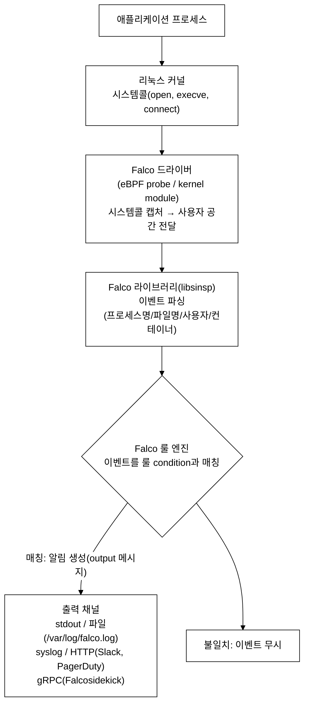
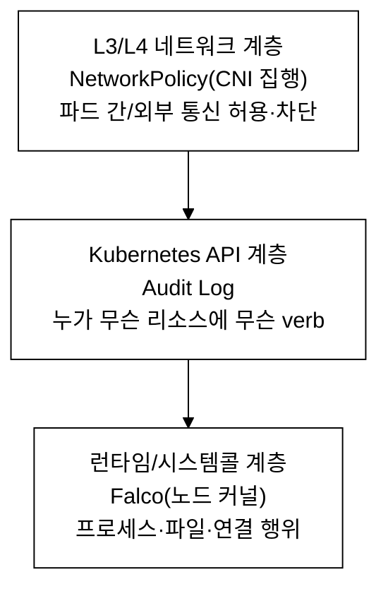
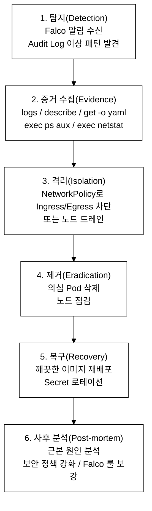
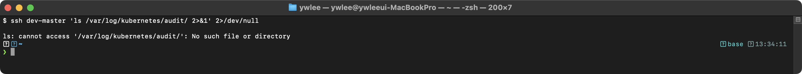
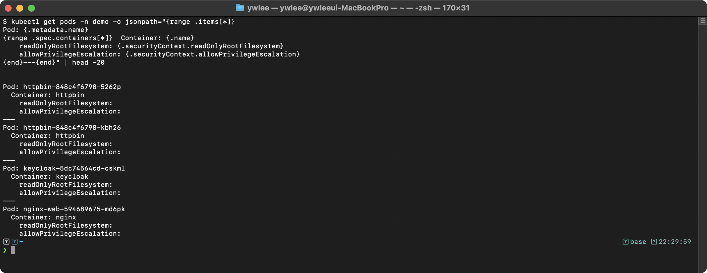
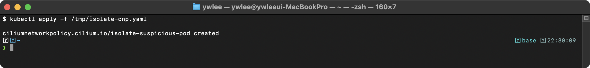

# CKS Day 11: Monitoring, Logging & Runtime Security (1/2) - Falco, Audit Log, Sysdig, 컨테이너 불변성

> 학습 목표 | CKS 도메인: Monitoring, Logging & Runtime Security (20%) | 예상 소요 시간: 2시간

---

## 오늘의 학습 목표

- Falco 규칙을 작성하여 syscall 기반 이상 행위를 탐지할 수 있다
- Kubernetes Audit Log를 분석하여 보안 이벤트를 식별할 수 있다
- 이상 행위를 탐지하고 대응 절차를 수행할 수 있다
- Sysdig로 시스템콜을 분석할 수 있다
- 컨테이너 불변성(Immutable Infrastructure)을 구현할 수 있다

---

### 등장 배경: 런타임 보안이 필요한 이유

```
기존 방식의 한계와 공격-방어 매핑
══════════════════════════════════

기존 방식: 이미지 스캔(Trivy), 정적 분석(kubesec), 정책 엔진(Gatekeeper)은
  모두 배포 전(pre-deployment) 보안이다. 런타임에 발생하는 이상 행위는
  탐지하지 못한다.

한계: 0-day 취약점, 합법적 이미지 내부의 악성 스크립트 실행, 런타임
  credential 탈취 등은 배포 전 검사로 방지할 수 없다.

[공격] 컨테이너 내 셸 실행 후 lateral movement
  - 공격자가 웹 취약점으로 RCE를 획득, 컨테이너 내에서 bash를 실행한다
  - SA 토큰(/var/run/secrets/)을 탈취하여 API Server에 접근한다
  → [방어] Falco: spawned_process + container + proc.name in (bash, sh)

[공격] 크립토마이닝 (Cryptojacking)
  - 공격자가 컨테이너에 마이닝 바이너리를 다운로드하고 실행한다
  - CPU 사용량이 급증하며 외부 마이닝 풀로 네트워크 연결이 발생한다
  → [방어] Falco: 외부 IP 연결 탐지 + 바이너리 디렉토리 쓰기 탐지
  → [방어] Prometheus: CPU 사용량 임계값 알림

[공격] Credential 파일 접근
  - /etc/shadow, SA 토큰, kubeconfig 등 민감 파일을 읽어 권한을 탈취한다
  → [방어] Falco: open_read + fd.name = /etc/shadow 탐지

내부 동작 원리 — eBPF 기반 syscall 모니터링:
  - eBPF(extended Berkeley Packet Filter)는 커널 공간에서 안전하게 실행되는
    샌드박스 프로그램이다. JIT 컴파일러가 eBPF 바이트코드를 네이티브 코드로
    변환하여 커널 내에서 실행한다.
  - Falco의 eBPF 프로브는 tracepoint(sys_enter_openat, sys_enter_execve 등)에
    attach되어 모든 syscall 이벤트를 캡처한다.
  - 캡처된 이벤트는 perf ring buffer를 통해 사용자 공간의 libsinsp
    라이브러리로 전달된다. libsinsp는 /proc 파일시스템과 CRI API를
    조회하여 프로세스명, 컨테이너명, Pod명 등의 메타데이터를 enrichment한다.
  - enrichment된 이벤트가 Falco 룰 엔진의 condition과 매칭되면 알림이 발생한다.

  커널 모듈 vs eBPF 드라이버:
    커널 모듈: 성능이 우수하지만 커널 버전 의존성이 있고 보안 위험이 있다
    eBPF: 커널 검증기(verifier)가 프로그램 안전성을 보장하므로 커널 패닉 위험이 없다
          최근 Falco의 기본 드라이버로 채택되었다
```

---

## 1. Falco 완전 정복

### 1.1 Falco 런타임 보안 아키텍처

```
Falco - eBPF/커널 모듈 기반 런타임 위협 탐지 엔진
═══════════════════════════════════════════════════

Kubernetes Audit Log는 API 수준의 이벤트만 기록하는 반면, Falco는
커널 수준(시스템콜)의 런타임 이벤트를 실시간으로 모니터링하여
이상 행위(anomaly)를 탐지하는 HIDS(Host-based Intrusion Detection System)이다.

  용어 풀이:
    IDS(Intrusion Detection System, 침입 탐지 시스템): 의심스러운 행동을
      탐지하고 알림을 발생시키는 보안 도구다. 침입을 자동으로 차단하는
      IPS(Intrusion Prevention System, 침입 방지 시스템)와 달리 IDS는
      "탐지·알림"까지만 한다. Falco는 기본적으로 IDS이며, 차단은 별도
      대응(NetworkPolicy 격리, Pod 삭제 등)으로 한다.
    HIDS(Host-based IDS): 네트워크 트래픽이 아니라 호스트(노드) 안에서
      일어나는 행위(프로세스 실행, 파일 접근, 권한 변경)를 감시하는 IDS다.
      네트워크 패킷을 보는 NIDS(Network-based IDS)와 대비된다.
    시스템콜(system call, syscall): 사용자 공간의 애플리케이션이 커널의
      기능(파일 열기 open, 프로세스 생성 execve, 네트워크 연결 connect 등)을
      요청하는 인터페이스다. 컨테이너 안에서 무슨 일이 벌어지든 결국
      시스템콜로 귀결되므로, Falco는 이 시스템콜을 커널 공간(kernel space)에서
      가로채(hook) 모든 행위를 빠짐없이 본다.

동작 메커니즘:
  - eBPF 프로브 또는 커널 모듈을 통해 시스템콜 이벤트를 커널에서 직접 캡처
  - 캡처된 이벤트를 사용자 공간의 Falco 엔진으로 전달
  - YAML 기반 규칙 엔진이 조건(condition)을 평가하여 위협 여부를 판정
  - 매칭 시 알림(stdout, syslog, gRPC, HTTP webhook)을 발생

탐지 예시:
  - execve("bash") in container → 컨테이너 내 대화형 셸 실행 탐지
  - open("/etc/shadow") → credential 파일 접근 탐지
  - execve("apt-get"|"pip") → 불변 컨테이너 원칙 위반(런타임 패키지 설치) 탐지
  - connect() to non-RFC1918 IP → 외부 IP 대상 아웃바운드 연결(C2 통신 의심) 탐지
```

### 1.2 Falco 아키텍처 상세


_그림 1. Falco 아키텍처: 시스템콜 캡처부터 룰 매칭과 알림 출력까지._

### 1.2.5 Falco 설치 및 구동

아키텍처를 이해했다면 다음 질문은 "그래서 내 클러스터에 어떻게 깔고 띄우나"이다.
Falco를 노드에 올리는 방식은 두 가지다. (1) 노드의 systemd 서비스로 설치하는
방식과 (2) Kubernetes DaemonSet으로 전 노드에 배포하는 방식이다. CKS 시험에서는
보통 노드에 이미 설치된 systemd 서비스(`systemctl ... falco`)를 다루므로, 룰
파일 위치(1.3)와 관리 명령어(1.8)를 먼저 익히는 것이 핵심이다. 학습 환경에서
전 노드에 한 번에 올릴 때는 DaemonSet 방식이 편하다.

> **전제**: dev 또는 staging 클러스터가 가동 중이어야 한다. CKS 파괴·설치
> 실습은 platform/prod가 아닌 dev/staging에서만 한다(CLAUDE.md §3·§4③).
> kubeconfig는 `kubeconfig/dev.yaml`을 쓰고,
> 노드 직접 작업은 `ssh dev-master` 별칭으로 접속한다.

```bash
# 방식 A) Helm으로 Falco DaemonSet 배포 (전 노드에 1개씩 자동 배치)
export KUBECONFIG=kubeconfig/dev.yaml
helm repo add falcosecurity https://falcosecurity.github.io/charts
helm repo update
helm install falco falcosecurity/falco \
  --namespace falco --create-namespace \
  --set driver.kind=modern_ebpf      # eBPF 드라이버 사용(커널 모듈 컴파일 불필요)

# 방식 B) 노드에 systemd 서비스로 설치 (CKS 시험 환경에 가까움)
ssh dev-master   # 노드 접속
sudo systemctl start falco
sudo systemctl enable falco
```

```bash
# 배포 확인: DaemonSet이 노드마다 1개씩 Running인지 본다
kubectl get pods -n falco -o wide
```

DaemonSet은 "노드마다 정확히 1개씩 파드를 배치"하는 워크로드 유형이다. Falco는
각 노드의 커널 시스템콜을 감시해야 하므로 모든 노드에 1개씩 떠 있어야 하며,
이 때문에 Deployment가 아니라 DaemonSet으로 배포한다.

```bash
# 로그 확인: Falco가 실제로 이벤트를 수집·평가하는지 본다
kubectl logs -n falco -l app.kubernetes.io/name=falco --tail=20   # DaemonSet 방식
sudo journalctl -u falco -f                                       # systemd 방식
```

설치·구동이 확인되어야 1.3의 설정 파일과 1.6의 커스텀 룰이 비로소 의미를 가진다.
이 상태에서 룰 파일을 수정하고 `systemctl restart falco`로 반영한다.

**트레이드오프 — Falco는 공짜가 아니다**

Falco는 모든 syscall 이벤트를 커널에서 가로채므로 CPU·메모리 오버헤드가 발생한다.
perf ring buffer 크기보다 이벤트 발생 속도가 빠르면 이벤트가 드롭되어 탐지 누락이
생긴다. 고부하 환경(초당 수만 건의 syscall)에서는 반드시 `falco_stats` 메트릭으로
드롭률을 모니터링해야 한다.

룰이 지나치게 광범위하면 정상 동작을 침해로 탐지하는 오탐(false positive)이 쌓여
알림 피로(alert fatigue)로 이어진다. 알림 피로가 심해지면 실제 침해 알림이 묻혀
운영팀이 알림을 무시하게 된다. 따라서 배포 초기에 `enabled: false`로 룰을 비활성
상태로 관측하다가 정상 동작 범위를 확인한 뒤 활성화하는 접근이 권장된다.

eBPF 드라이버는 커널 verifier가 프로그램 안전성을 검증하므로 커널 패닉 위험이 없
다. 그러나 verifier 통과 요건은 커널 버전마다 달라 구버전 커널(예: 4.x 계열)에서는
eBPF 프로브 로드 자체가 실패할 수 있다. 이 경우 커널 모듈 드라이버로 폴백해야 하며,
커널 모듈은 커널 헤더 패키지가 노드에 설치되어 있어야 컴파일된다.

### 1.3 Falco 설정 파일 구조

```
Falco 설정 파일 경로
═══════════════════

/etc/falco/falco.yaml                → 메인 설정 파일
                                        (출력 설정, 로그 레벨, 드라이버 등)

/etc/falco/falco_rules.yaml          → 기본 룰 파일
                                        *** 절대 수정하지 않는다! ***
                                        업데이트 시 덮어쓰기됨

/etc/falco/falco_rules.local.yaml    → 커스텀 룰 파일
                                        *** 여기에 추가/오버라이드! ***
                                        CKS 시험에서는 이 파일에 작성

룰 우선순위:
  - 같은 이름의 룰이 두 파일에 있으면, local.yaml의 룰이 우선
  - 기본 룰을 수정하고 싶으면 local.yaml에 같은 이름으로 재정의
```

### 1.4 Falco 룰 구성 요소 상세

```yaml
# ═══════════════════════════════════════════
# Falco 룰의 구조
# ═══════════════════════════════════════════

- rule: Shell Spawned in Container
  # ↑ 룰 이름 (고유해야 함)
  # 같은 이름이 local.yaml에 있으면 오버라이드

  desc: 컨테이너 내에서 셸 프로세스가 실행되면 탐지한다
  # ↑ 룰 설명 (사람이 읽기 위한 것)

  condition: >
    spawned_process and
    container and
    proc.name in (bash, sh, zsh, ksh, csh, dash)
  # ↑ 탐지 조건 (시스템콜 필터 표현식)
  # spawned_process = evt.type=execve and evt.dir=< (새 프로세스 생성)
  # container = 컨테이너 내부 이벤트
  # proc.name = 프로세스 이름이 셸 중 하나

  output: >
    셸이 컨테이너에서 실행됨
    (user=%user.name container_id=%container.id
    container_name=%container.name shell=%proc.name
    parent=%proc.pname cmdline=%proc.cmdline
    image=%container.image.repository:%container.image.tag
    pod=%k8s.pod.name ns=%k8s.ns.name)
  # ↑ 알림 메시지 (변수 치환 가능)
  # %user.name = 사용자 이름
  # %container.id = 컨테이너 ID
  # %proc.name = 프로세스 이름
  # %proc.pname = 부모 프로세스 이름
  # %proc.cmdline = 전체 명령어
  # %k8s.pod.name = K8s Pod 이름
  # %k8s.ns.name = K8s 네임스페이스

  priority: WARNING
  # ↑ 우선순위
  # EMERGENCY > ALERT > CRITICAL > ERROR > WARNING > NOTICE > INFORMATIONAL > DEBUG

  tags: [container, shell, mitre_execution]
  # ↑ 분류 태그 (MITRE ATT&CK 프레임워크 참조)

  enabled: true
  # ↑ 활성화 여부 (false로 비활성화 가능)
```

**주요 output 변수 빠른참조** — `output` 필드에서 `%변수명`으로 알림 메시지에
끼워 넣을 수 있는 값이다. 커스텀 룰을 작성할 때 매번 1.5절 필터 필드표로
돌아가지 않도록 자주 쓰는 것만 모았다(전체 목록은 1.5절 참조).

```
%user.name            요청 사용자 이름        %container.id     컨테이너 ID
%proc.name            실행 프로세스 이름       %container.name   컨테이너 이름
%proc.pname           부모 프로세스 이름       %container.image.repository  이미지 이름
%proc.cmdline         전체 명령어 줄          %k8s.pod.name     K8s Pod 이름
%fd.name              파일/소켓 경로          %k8s.ns.name      K8s 네임스페이스
```

(주의: `output`의 변수는 1.5절의 "필터 필드"와 동일한 필드를 가리킨다.
`condition`에서는 `proc.name`처럼 `%` 없이 쓰고, `output`에서는 `%proc.name`처럼
`%`를 붙여 치환한다.)

### 1.5 주요 매크로와 필터 필드

```
Falco 주요 매크로 (미리 정의된 조건)
═════════════════════════════════

매크로            | 의미                              | 원본 조건
──────────────────┼──────────────────────────────────┼─────────────────────
spawned_process   | 새 프로세스 실행                   | evt.type=execve and evt.dir=<
container         | 컨테이너 내부 이벤트                | container.id != host
open_write        | 파일 쓰기 모드 열기                | (evt.type=open or evt.type=openat)
                  |                                  |   and evt.is_open_write=true
open_read         | 파일 읽기 모드 열기                | (evt.type=open or evt.type=openat)
                  |                                  |   and evt.is_open_read=true
sensitive_files   | 민감한 파일 경로                   | /etc/shadow, /etc/passwd 등
shell_procs       | 셸 프로세스 목록                   | proc.name in (bash, sh, zsh, ...)
package_mgmt_procs| 패키지 매니저 프로세스               | proc.name in (apt, yum, pip, ...)

주요 필터 필드:
───────────────
proc.name          = 프로세스 이름 (bash, nginx, python 등)
proc.pname         = 부모 프로세스 이름
proc.cmdline       = 전체 명령어 줄
proc.exepath       = 실행 파일 경로
fd.name            = 파일 디스크립터 이름 (파일 경로, 소켓 주소)
fd.directory       = 파일이 속한 디렉토리
fd.snet            = 네트워크 서브넷 (CIDR 형식)
fd.ip              = 대상 IP 주소
fd.port            = 대상 포트
fd.typechar        = 파일 타입 (f=file, 4=IPv4, 6=IPv6)
container.id       = 컨테이너 ID
container.name     = 컨테이너 이름
container.image.repository = 이미지 이름
container.image.tag = 이미지 태그
user.name          = 사용자 이름
user.uid           = 사용자 UID
evt.type           = 이벤트 타입 (open, connect, execve 등)
evt.dir            = 이벤트 방향 (< = 진입, > = 종료)
k8s.pod.name       = K8s Pod 이름
k8s.ns.name        = K8s 네임스페이스
```

### 1.6 Falco 룰 작성 예제 모음 (15개 이상)

```yaml
# ═══════════════════════════════════════════
# 룰 1: 컨테이너 내 셸 실행 탐지
# ═══════════════════════════════════════════
- rule: Shell Spawned in Container
  desc: 컨테이너 내에서 셸이 실행되면 탐지
  condition: >
    spawned_process and container and
    proc.name in (bash, sh, zsh, ksh, csh, dash, ash)
  output: >
    셸 실행 (user=%user.name container=%container.name
    shell=%proc.name parent=%proc.pname cmdline=%proc.cmdline
    image=%container.image.repository pod=%k8s.pod.name ns=%k8s.ns.name)
  priority: WARNING
  tags: [container, shell, mitre_execution]

# ═══════════════════════════════════════════
# 룰 2: 민감한 파일 읽기 탐지
# ═══════════════════════════════════════════
- rule: Read Sensitive File in Container
  desc: /etc/shadow, /etc/passwd, kubeconfig 등 민감 파일 읽기
  condition: >
    open_read and container and
    (fd.name = /etc/shadow or
     fd.name = /etc/passwd or
     fd.name startswith /etc/kubernetes/ or
     fd.name startswith /root/.kube or
     fd.name startswith /var/run/secrets/kubernetes.io/)
  output: >
    민감 파일 읽기 (user=%user.name file=%fd.name
    container=%container.name image=%container.image.repository
    pod=%k8s.pod.name ns=%k8s.ns.name cmdline=%proc.cmdline)
  priority: CRITICAL
  tags: [filesystem, sensitive_file, mitre_credential_access]

# ═══════════════════════════════════════════
# 룰 3: 패키지 매니저 실행 탐지 (불변성 위반)
# ═══════════════════════════════════════════
- rule: Package Management in Container
  desc: apt, pip, npm 등 패키지 매니저 실행 (불변 컨테이너 위반)
  condition: >
    spawned_process and container and
    proc.name in (apt, apt-get, dpkg, yum, dnf, rpm,
                  apk, pip, pip3, npm, gem, composer, cargo)
  output: >
    패키지 매니저 실행 (user=%user.name pkg=%proc.name
    cmdline=%proc.cmdline container=%container.name
    image=%container.image.repository
    pod=%k8s.pod.name ns=%k8s.ns.name)
  priority: ERROR
  tags: [container, package_management, mitre_persistence]

# ═══════════════════════════════════════════
# 룰 4: 외부 네트워크 연결 탐지
# ═══════════════════════════════════════════
- rule: Unexpected Outbound Connection
  desc: 컨테이너에서 외부(비내부) IP로 네트워크 연결
  condition: >
    evt.type = connect and evt.dir = < and container and
    fd.typechar = 4 and fd.ip != "0.0.0.0" and
    not fd.snet in (10.0.0.0/8, 172.16.0.0/12, 192.168.0.0/16, 127.0.0.0/8)
  output: >
    외부 연결 (user=%user.name connection=%fd.name
    container=%container.name image=%container.image.repository
    pod=%k8s.pod.name ns=%k8s.ns.name)
  priority: WARNING
  tags: [network, container, mitre_command_and_control]

# ═══════════════════════════════════════════
# 룰 5: 바이너리 디렉토리에 파일 쓰기
# ═══════════════════════════════════════════
- rule: Write to Binary Directory in Container
  desc: /usr/bin, /bin 등에 파일 생성/수정 (백도어 설치 의심)
  condition: >
    open_write and container and
    (fd.directory = /usr/bin or fd.directory = /usr/sbin or
     fd.directory = /usr/local/bin or fd.directory = /bin or
     fd.directory = /sbin)
  output: >
    바이너리 디렉토리 쓰기 (user=%user.name file=%fd.name
    container=%container.name image=%container.image.repository
    pod=%k8s.pod.name ns=%k8s.ns.name)
  priority: ERROR
  tags: [filesystem, container, mitre_persistence]

# ═══════════════════════════════════════════
# 룰 6: /etc 디렉토리 수정 탐지
# ═══════════════════════════════════════════
- rule: Write to etc Directory in Container
  desc: /etc 설정 파일 수정 (설정 변조 의심)
  condition: >
    open_write and container and
    fd.name startswith /etc/
  output: >
    /etc 파일 수정 (user=%user.name file=%fd.name
    container=%container.name image=%container.image.repository
    pod=%k8s.pod.name ns=%k8s.ns.name cmdline=%proc.cmdline)
  priority: ERROR
  tags: [filesystem, container, mitre_persistence]

# ═══════════════════════════════════════════
# 룰 7: 리버스 셸 탐지
# ═══════════════════════════════════════════
- rule: Reverse Shell in Container
  desc: 리버스 셸 명령어 패턴 탐지
  condition: >
    spawned_process and container and
    ((proc.name = bash and proc.cmdline contains "/dev/tcp") or
     (proc.name = python and proc.cmdline contains "socket") or
     (proc.name = perl and proc.cmdline contains "socket") or
     (proc.name = nc and proc.cmdline contains "-e") or
     (proc.name = ncat and proc.cmdline contains "-e"))
  output: >
    리버스 셸 의심 (user=%user.name cmdline=%proc.cmdline
    container=%container.name image=%container.image.repository
    pod=%k8s.pod.name ns=%k8s.ns.name)
  priority: CRITICAL
  tags: [container, shell, mitre_execution, mitre_command_and_control]

# ═══════════════════════════════════════════
# 룰 8: 컨테이너 드리프트 탐지 (새 실행 파일)
# ═══════════════════════════════════════════
- rule: Container Drift Detected
  desc: 이미지에 없던 새로운 실행 파일이 실행됨
  condition: >
    spawned_process and container and
    not proc.is_exe_from_memfd and
    evt.arg.flags contains "clone_vm" = false and
    proc.is_container_healthcheck = false and
    not proc.exepath in (known_binaries)
  output: >
    컨테이너 드리프트 (user=%user.name proc=%proc.name
    exe=%proc.exepath container=%container.name
    pod=%k8s.pod.name ns=%k8s.ns.name)
  priority: ERROR
  tags: [container, mitre_execution]
  enabled: false  # known_binaries 리스트를 먼저 정의해야 조건이 컴파일됨

# 용어 풀이 — 룰 8의 커스텀 필드와 매크로:
#
#   known_binaries: Falco의 list 타입 선언이다. rule/macro와 달리 list는
#     조건식에서 in (...) 집합 연산자와 함께 쓸 수 있는 문자열 목록이다.
#     이 룰을 활성화하기 전에 아래처럼 같은 파일(falco_rules.local.yaml)
#     앞부분에 list 선언을 추가해야 한다:
#
#       - list: known_binaries
#         items: [nginx, sh, pause, python3]
#
#     items에 이미지에 원래 포함된 정상 바이너리 경로를 열거하면,
#     이 목록에 없는 새 실행 파일이 뜰 때만 룰이 트리거된다.
#
#   proc.is_exe_from_memfd: 프로세스의 실행 파일이 디스크 파일이 아니라
#     memfd_create() 시스템콜로 생성된 익명 인메모리 파일에서 실행됐는지
#     여부를 반환하는 Falco 내장 필드다. 공격자가 디스크에 흔적을 남기지
#     않고 메모리에만 페이로드를 올려 실행할 때(fileless attack) true가 된다.
#     not proc.is_exe_from_memfd는 이런 경우를 별도 처리하거나 오탐을
#     줄이기 위해 일부 환경에서 배제 조건으로 쓴다.
#
#   evt.arg.flags contains "clone_vm": clone() 시스템콜의 flags 인수에
#     CLONE_VM(주소 공간 공유)이 포함됐는지 확인한다. 스레드 생성 같은
#     정상 clone()과 새 프로세스 fork()를 구별하는 데 쓴다.

# ═══════════════════════════════════════════
# 룰 9: ServiceAccount 토큰 접근 탐지
# ═══════════════════════════════════════════
- rule: Access Service Account Token
  desc: 컨테이너에서 SA 토큰 파일 접근
  condition: >
    open_read and container and
    fd.name startswith /var/run/secrets/kubernetes.io/serviceaccount/
  output: >
    SA 토큰 접근 (user=%user.name file=%fd.name proc=%proc.name
    container=%container.name image=%container.image.repository
    pod=%k8s.pod.name ns=%k8s.ns.name)
  priority: WARNING
  tags: [kubernetes, container, mitre_credential_access]

# ═══════════════════════════════════════════
# 룰 10: 권한 상승 시도 탐지
# ═══════════════════════════════════════════
- rule: Privilege Escalation Attempt
  desc: setuid, setgid 시스템콜 또는 sudo 사용
  condition: >
    spawned_process and container and
    (proc.name in (sudo, su, doas) or
     (evt.type in (setuid, setgid) and user.uid != 0))
  output: >
    권한 상승 시도 (user=%user.name proc=%proc.name
    cmdline=%proc.cmdline container=%container.name
    pod=%k8s.pod.name ns=%k8s.ns.name)
  priority: CRITICAL
  tags: [container, mitre_privilege_escalation]
```

#### 1.6.1 룰이 실제로 트리거되는지 검증하기

룰을 `/etc/falco/falco_rules.local.yaml`에 붙여넣는 것만으로는 "이 룰이 진짜
작동하는지" 알 수 없다. 룰마다 (1) 룰을 적용하고 (2) 룰이 탐지하기로 한 행위를
일부러 발생시킨 뒤 (3) Falco 알림이 떴는지 로그에서 확인하는 절차가 필요하다.
아래는 중요 룰 5종에 대한 검증 절차다.

> **전제**: dev/staging 노드에 Falco가 가동 중이고(1.2.5), 위 룰들이
> `falco_rules.local.yaml`에 반영되어 `systemctl restart falco`로 로드된
> 상태여야 한다. 검증 대상 파드(예: `demo/nginx`)가 미리 떠 있어야 한다.
> 룰을 트리거하는 `kubectl exec`는 컨테이너 안에 일부러 의심 행위를 만드는
> 것이므로 dev/staging에서만 한다.

```bash
# 검증 공통: 다른 터미널/백그라운드에서 알림 스트림을 켜 둔다
sudo journalctl -u falco -f
```

**룰 1 (컨테이너 내 셸 실행) 검증**
```bash
# 트리거: 컨테이너 안에서 셸 실행
kubectl exec -n demo deploy/nginx -- /bin/sh -c "echo trigger"
# 확인: Shell 키워드로 필터
sudo journalctl -u falco --since "1 minute ago" | grep -i "셸 실행\|Shell"
```
알림 해석: `shell=sh parent=runc` 형태로 뜬다. `parent=runc`는 런타임(containerd)이
exec 요청을 처리하며 셸을 생성했다는 뜻으로, `kubectl exec`로 들어온 대화형 셸의
전형적 흔적이다. 정상 워크로드가 셸을 거의 띄우지 않는 환경이라면 이 알림 1건이
곧 침입 신호일 수 있다.

**룰 2 (민감 파일 읽기) 검증**
```bash
# 트리거: 컨테이너 안에서 /etc/shadow 읽기 시도
kubectl exec -n demo deploy/nginx -- cat /etc/shadow
sudo journalctl -u falco --since "1 minute ago" | grep -i "민감 파일\|Sensitive"
```
알림 해석: `file=/etc/shadow priority=CRITICAL`로 뜬다. 애플리케이션이 정상
동작에서 `/etc/shadow`를 읽을 일은 없으므로 credential 탈취 시도로 본다.

**룰 3 (패키지 매니저 실행, 불변성 위반) 검증**
```bash
# 트리거: 런타임 패키지 설치 시도
kubectl exec -n demo deploy/nginx -- apt-get update
sudo journalctl -u falco --since "1 minute ago" | grep -i "패키지 매니저\|Package"
```
알림 해석: `pkg=apt-get`로 뜬다. 불변 컨테이너 원칙(5절)상 런타임에 패키지를
설치하면 안 되므로, 이 행위 자체가 위반이자 공격자 페이로드 설치 징후다.

**룰 4 (외부 네트워크 연결) 검증**
```bash
# 트리거: 컨테이너에서 외부(공인) IP로 연결 시도
kubectl exec -n demo deploy/nginx -- /bin/sh -c "echo > /dev/tcp/1.1.1.1/443" 2>/dev/null || true
sudo journalctl -u falco --since "1 minute ago" | grep -i "외부 연결\|Outbound"
```
알림 해석: `connection=...->1.1.1.1:443`로 뜬다. RFC1918 사설 대역이 아닌
공인 IP로의 아웃바운드 연결은 C2(명령·제어) 통신이나 데이터 유출 의심 신호다.

**룰 7 (리버스 셸) 검증**
```bash
# 트리거: bash의 /dev/tcp 리다이렉션 패턴(리버스 셸 시그니처)
kubectl exec -n demo deploy/nginx -- bash -c "exec 5<>/dev/tcp/1.1.1.1/443" 2>/dev/null || true
sudo journalctl -u falco --since "1 minute ago" | grep -i "리버스 셸\|Reverse"
```
알림 해석: `cmdline`에 `/dev/tcp`가 포함되어 `priority=CRITICAL`로 뜬다.
리버스 셸은 피해 호스트가 공격자에게 먼저 접속을 맺어 방화벽 인바운드 차단을
우회하는 기법으로, 침해의 강한 신호다.

> **스크린샷(메인 별도 수행)**: 위 5개 검증의 `journalctl -u falco` 알림
> 출력은 dev/staging에 Falco를 설치한 뒤 실제 터미널 캡처로 대체한다
> (CLAUDE.md §4①, 텍스트 출력 블록 금지). 현재 dev에 Falco 미설치 시
> "(미캡처)"로 둔다.

### 1.7 기존 룰 오버라이드

```yaml
# /etc/falco/falco_rules.local.yaml
# ═══════════════════════════════════════════
# 기본 룰의 우선순위를 변경하는 방법
# 같은 이름의 룰을 재정의하면 오버라이드된다
# ═══════════════════════════════════════════

# 기본 룰 "Terminal shell in container"의 우선순위를
# WARNING → ALERT로 변경
- rule: Terminal shell in container
  desc: A shell was used as the entrypoint/exec point into a container
  condition: >
    spawned_process and container and shell_procs and
    proc.tty != 0 and container_entrypoint
  output: >
    Terminal shell in container
    (user=%user.name %container.info shell=%proc.name
    parent=%proc.pname cmdline=%proc.cmdline
    container_id=%container.id image=%container.image.repository)
  priority: ALERT              # WARNING → ALERT로 변경!
  tags: [container, shell, mitre_execution]
```

### 1.8 Falco 관리 명령어

```bash
# ═══ Falco 실행/관리 ═══

# 서비스로 실행
sudo systemctl start falco
sudo systemctl status falco
sudo systemctl restart falco

# 로그 모니터링
sudo journalctl -u falco -f

# 최근 5분 로그
sudo journalctl -u falco --since "5 minutes ago"

# 특정 키워드 필터링
sudo journalctl -u falco --since "5 minutes ago" | grep -E "Shell|Sensitive|Package"

# 룰 검증 (문법 오류 확인)
sudo falco --dry-run \
  -r /etc/falco/falco_rules.yaml \
  -r /etc/falco/falco_rules.local.yaml
```

기대 출력 (정상):


기대 출력 (문법 오류 시):


아래 명령들은 Falco DaemonSet/서비스가 가동 중인 노드에서만 동작한다. 현재
dev에 Falco가 미설치 상태이면 이 명령들은 실행해도 알림이 뜨지 않는다. 1.2.5의
설치를 먼저 끝낸 뒤 실행하고, 그 결과는 실제 터미널 스크린샷으로 대체한다
(CLAUDE.md §4①). 아래 "기대 출력"은 설치 후 재캡처 전까지의 예시이며, 실측이
아니다.

```bash
# Falco 룰 트리거 테스트 및 검증
kubectl exec -n demo deploy/nginx -- /bin/sh -c "echo test"
sudo journalctl -u falco --since "1 minute ago" | grep "Shell"
```

기대 출력 (예시 — 설치 후 재캡처 예정, 현재 dev/staging에 Falco 미설치):


---

## 2. Kubernetes Audit Log 분석

> day04에서 API Server 감사 정책 파일을 구성하는 방법을 다뤘다. 이 절은 그 로그가
> 실제로 생성된 이후 분석 단계를 다루므로, day04를 먼저 진행하지 않은 경우
> 아래 최소 개요를 읽고 진행한다.

### 2.0 Audit Log 활성화 최소 개요

Audit Log는 kube-apiserver에 두 플래그를 추가해야 활성화된다.

```bash
# /etc/kubernetes/manifests/kube-apiserver.yaml (정적 파드 매니페스트)
# 아래 두 플래그와 대응 volume mount를 추가한다
--audit-policy-file=/etc/kubernetes/audit-policy.yaml
--audit-log-path=/var/log/kubernetes/audit/audit.log
```

audit-policy.yaml의 레벨(level)은 기록 상세도를 결정한다. 네 단계가 있다.

```
None             — 해당 요청을 기록하지 않는다
Metadata         — 요청자·동작·대상 리소스만 기록 (본문 없음, 기본 권장)
Request          — Metadata + 요청 본문(requestObject)까지 기록
RequestResponse  — Request + 응답 본문(responseObject)까지 기록 (로그 크기 주의)
```

최소 정책 예시(모든 요청을 Metadata 레벨로 기록):

```yaml
apiVersion: audit.k8s.io/v1
kind: Policy
rules:
- level: Metadata
```

Secret 같은 민감 리소스는 RequestResponse 레벨로, 나머지는 Metadata로 분리하는 것이
일반적이다. 자세한 정책 설계는 [CKS day04](../daily/day04.md)를 참고한다.

### 2.1 Audit Log 필드 상세

```
Audit Log 주요 필드
═══════════════════

필드                           | 설명
──────────────────────────────┼────────────────────────────
user.username                 | 요청한 사용자 이름
user.groups                   | 사용자 그룹
verb                          | 동작 (get, create, delete 등)
objectRef.resource            | 대상 리소스 타입 (pods, secrets)
objectRef.namespace           | 대상 네임스페이스
objectRef.name                | 대상 리소스 이름
objectRef.subresource         | 하위 리소스 (exec, log, portforward)
responseStatus.code           | HTTP 응답 코드 (200, 403, 404)
requestReceivedTimestamp      | 요청 수신 시간
sourceIPs                     | 요청 출발 IP 주소
requestObject                 | 요청 본문 (Request/RequestResponse 레벨)
responseObject                | 응답 본문 (RequestResponse 레벨)
annotations                   | 추가 메타데이터
```

### 2.2 Audit Log 분석 명령어 모음

> `jq`는 JSON 스트림 프로세서다. 파이프로 넘어온 JSON 한 줄씩 `select()` 조건에
> 일치하는 항목만 골라낸다. `select(.verb == "delete")`는 "verb 필드가 delete인
> 줄만 통과"하는 필터이며, 그 뒤 `{user: .user.username, ...}` 형태로 원하는
> 필드만 추출해 새 JSON 객체로 출력한다.

```bash
# ═══ 기본 분석 ═══

# 전체 로그 실시간 모니터링
tail -f /var/log/kubernetes/audit/audit.log | jq .

# ═══ 리소스별 필터링 ═══

# Secret 관련 활동
cat /var/log/kubernetes/audit/audit.log | \
  jq 'select(.objectRef.resource == "secrets") |
  {user: .user.username, verb: .verb, name: .objectRef.name,
   ns: .objectRef.namespace, time: .requestReceivedTimestamp}'

# Pod 삭제 기록
cat /var/log/kubernetes/audit/audit.log | \
  jq 'select(.objectRef.resource == "pods" and .verb == "delete") |
  {user: .user.username, pod: .objectRef.name,
   ns: .objectRef.namespace, time: .requestReceivedTimestamp}'

# ═══ 사용자별 필터링 ═══

# 특정 사용자의 모든 활동
cat /var/log/kubernetes/audit/audit.log | \
  jq 'select(.user.username == "jane") |
  {verb: .verb, resource: .objectRef.resource, name: .objectRef.name,
   ns: .objectRef.namespace, time: .requestReceivedTimestamp}'

# 비시스템 사용자의 활동 (보안 감사)
cat /var/log/kubernetes/audit/audit.log | \
  jq 'select(.user.username | startswith("system:") | not) |
  {user: .user.username, verb: .verb,
   resource: .objectRef.resource, name: .objectRef.name}'

# ═══ 보안 이벤트 분석 ═══

# 403 Forbidden 응답 (권한 부족 → 공격 시도 의심)
cat /var/log/kubernetes/audit/audit.log | \
  jq 'select(.responseStatus.code == 403) |
  {user: .user.username, verb: .verb,
   resource: .objectRef.resource, ns: .objectRef.namespace,
   time: .requestReceivedTimestamp}'

# kubectl exec 기록 (셸 접근)
cat /var/log/kubernetes/audit/audit.log | \
  jq 'select(.objectRef.subresource == "exec") |
  {user: .user.username, pod: .objectRef.name,
   ns: .objectRef.namespace, time: .requestReceivedTimestamp}'

# RBAC 변경 기록
cat /var/log/kubernetes/audit/audit.log | \
  jq 'select(.objectRef.resource | test("roles|rolebindings|clusterroles|clusterrolebindings")) |
  {user: .user.username, verb: .verb,
   resource: .objectRef.resource, name: .objectRef.name}'

# ═══ 시간 기반 분석 ═══

# 시간별 요청 빈도 (비정상적 트래픽 탐지)
cat /var/log/kubernetes/audit/audit.log | \
  jq -r '.requestReceivedTimestamp' | cut -d'T' -f2 | cut -d':' -f1 | sort | uniq -c

# 최근 1시간 Secret 접근
cat /var/log/kubernetes/audit/audit.log | \
  jq 'select(.objectRef.resource == "secrets") |
  select(.requestReceivedTimestamp > "2024-01-01T10:00:00Z") |
  {user: .user.username, verb: .verb, secret: .objectRef.name}'
```

---

## 3. 이상 행위 탐지 및 대응

### 3.0 다층 방어 아키텍처: 왜 세 도구를 모두 쓰는가

Falco 룰 하나로 모든 공격을 막을 수는 없다. Falco는 노드 커널의 시스템콜만
보므로, 공격이 시스템콜 계층 아래(예: eBPF/커널 모듈 자체를 우회)나 위(예: API
요청 단계, 네트워크 단계)에서 일어나면 놓칠 수 있다. 그래서 서로 다른 계층을
감시하는 도구를 겹쳐 쓰는 **다층 방어(defense-in-depth)**가 표준이다. 한 계층의
우회를 다른 계층이 보완한다.

- **Falco** — 런타임/시스템콜 계층. 컨테이너 안에서 무엇을 실행했는지(셸 실행,
  파일 읽기, 외부 연결)를 본다. 노드에서 직접 동작한다.
- **Audit Log** — Kubernetes API 계층. 누가 어떤 리소스에 어떤 동작(get/create/
  delete/exec)을 요청했는지를 본다. API Server가 기록한다.
- **NetworkPolicy** — L3/L4 네트워크 계층. L3은 IP(네트워크 계층), L4는
  포트/프로토콜(전송 계층)을 뜻한다. 어떤 파드가 어떤 파드·외부와 통신할 수
  있는지를 강제하고, 격리 시 통신을 차단한다(CNI가 집행).


_그림 2. 다층 방어: 네트워크(L3/4) → API → 시스템콜 세 계층을 각각 다른 도구로 감시한다._

예를 들어 공격자가 RBAC 권한을 탈취해 `kubectl exec`로 파드에 들어오면 Audit
Log의 `exec` 기록이 남고(API 계층), 그 안에서 셸을 실행하면 Falco가 잡고(런타임
계층), 외부로 데이터를 빼내려는 연결은 NetworkPolicy로 차단된다(네트워크 계층).
세 도구 중 하나만 켜 두면 그 계층을 우회한 공격을 통째로 놓친다. 아래 매트릭스가
"어떤 행위를 어느 계층 도구로 탐지하는가"를 정리한 것이다.

### 3.1 이상 행위 유형과 탐지 방법

```
이상 행위 탐지 매트릭스
═══════════════════════

행위                        | 탐지 도구      | 우선순위
───────────────────────────┼───────────────┼─────────
컨테이너 내 셸 실행          | Falco         | WARNING
민감 파일 접근               | Falco         | CRITICAL
패키지 매니저 실행           | Falco         | ERROR
바이너리 디렉토리 쓰기       | Falco         | ERROR
외부 네트워크 연결           | Falco         | WARNING
리버스 셸 실행              | Falco         | CRITICAL
권한 상승 시도              | Falco         | CRITICAL
Secret 무단 접근            | Audit Log     | CRITICAL
kubectl exec 사용          | Audit Log     | WARNING
RBAC 변경                  | Audit Log     | ERROR
403 반복 (브루트포스)        | Audit Log     | ERROR
비정상 트래픽 패턴           | Network Policy | WARNING
CPU/메모리 급증 (크립토마이닝)| Prometheus    | ERROR
```

### 3.2 이상 행위 대응 절차


_그림 3. 인시던트 대응 6단계 흐름(탐지 → 수집 → 격리 → 제거 → 복구 → 분석)._

### 3.3 대응 예제 - NetworkPolicy로 격리

```yaml
# 의심 Pod를 네트워크에서 완전 격리
apiVersion: networking.k8s.io/v1
kind: NetworkPolicy
metadata:
  name: isolate-suspicious-pod
  namespace: demo
spec:
  podSelector:
    matchLabels:
      app: suspicious-app              # 의심 Pod의 라벨
  policyTypes:
  - Ingress
  - Egress
  # 규칙 없음 = 모든 Ingress/Egress 트래픽 차단
  # → Pod는 네트워크적으로 완전히 격리됨
  # → 증거 수집 후 Pod 삭제
```

---

## 4. Sysdig 시스템콜 분석

### 4.0 Sysdig vs. Falco — 역할 분담

Falco가 있는데 Sysdig를 따로 쓰는 이유는 두 도구가 맡는 시간축이 다르기 때문이다.

Falco는 이벤트가 발생하는 **실시간**에 룰 조건과 대조해 알림을 낸다. 탐지 자체가
목적이므로 알림 발생 이후의 상세 분석보다는 "지금 무언가 일어났다"는 신호를 빠르게
전달하는 데 최적화되어 있다.

Sysdig는 **오프라인 포렌식 분석**에 강점이 있다. `sysdig -w capture.scap` 명령으로
특정 시간대의 시스템콜 전체를 `.scap` 파일로 캡처해 저장한다. 이 파일은 나중에
`sysdig -r capture.scap "필터"` 형태로 반복 재분석할 수 있다. 보안 사고 발생 시
"그 시점에 컨테이너 안에서 무슨 프로세스가 무슨 파일을 열었는가"를 재현하는 데 쓴다.

운영 시나리오로 정리하면 다음과 같다. Falco가 "이상 행위 알림"을 발생시키면(탐지),
운영자는 그 시점의 Sysdig 캡처 파일을 열어 공격자 동선을 추적한다(포렌식). 따라서
두 도구는 경쟁이 아니라 탐지 → 분석의 협력 관계다.

CKS 시험에서는 주어진 `.scap` 파일을 `sysdig -r`로 분석해 특정 컨테이너에서 실행된
프로세스나 접근된 파일 경로를 찾는 문제 유형이 출제된다. 도구 설치 방법보다 필터
표현식 작성에 익숙해지는 것이 핵심이다.

### 4.1 Sysdig 기본 사용법

```bash
# ═══ 기본 명령어 ═══

# 모든 시스템콜 캡처 (실시간)
sysdig

# 특정 컨테이너의 시스템콜
sysdig container.name=nginx

# 특정 이벤트 타입만
sysdig evt.type=open           # 파일 열기
sysdig evt.type=connect        # 네트워크 연결
sysdig evt.type=execve         # 프로세스 실행

# ═══ 캡처 및 분석 ═══

# 캡처 파일 저장 (10초간)
sudo sysdig -w /tmp/capture.scap &
sleep 10
kill %1

# 캡처 파일 분석
sudo sysdig -r /tmp/capture.scap

# 셸 프로세스 필터링
sudo sysdig -r /tmp/capture.scap \
  "evt.type=execve and proc.name in (bash,sh,zsh)"

# 파일 접근 분석
sudo sysdig -r /tmp/capture.scap \
  "evt.type in (open,openat) and fd.name contains /etc/"

# 네트워크 연결 분석
sudo sysdig -r /tmp/capture.scap evt.type=connect

# ═══ Chisel (미리 작성된 분석 스크립트) ═══
sysdig -c topprocs_cpu         # CPU 사용량 상위 프로세스
sysdig -c topfiles_bytes       # 파일 I/O 상위
sysdig -c spy_users            # 사용자별 명령어 추적
sysdig -c topconns             # 네트워크 연결 상위
sysdig -c fileslower 1000      # 1초 이상 걸리는 파일 I/O
```

### 4.2 Sysdig 검증 명령어 기대 출력

```bash
# 컨테이너에서 실행된 프로세스 확인
sudo sysdig -r /tmp/capture.scap "evt.type=execve and container.name=nginx" -p "%proc.name %proc.cmdline"
```

기대 출력 (예시-환경/도구따라다름, dev/staging에 sysdig 미설치):


```bash
# 파일 접근 확인
sudo sysdig -r /tmp/capture.scap "evt.type in (open,openat) and container.name=nginx and fd.name contains /etc/" -p "%fd.name %proc.name"
```

기대 출력 (예시-환경/도구따라다름, dev/staging에 sysdig 미설치):


---

## 트러블슈팅: 런타임 보안 장애 시나리오

아래는 CKS 실기에서 마주칠 빈도가 높은 순으로 정렬했다. 시험에서 가장 흔한
문제는 "룰을 작성했는데 동작하지 않는다"이며, 이는 (A) 문법 오류로 아예 로드가
안 됐거나 (B) 로드는 됐지만 조건식이 안 맞아 트리거가 안 되는 두 경우로 갈린다.
먼저 이 둘을 다룬다.

### 시나리오 A: 작성한 Falco 룰이 YAML 문법 오류로 로드되지 않는다

```
증상: falco_rules.local.yaml에 룰을 추가했는데 Falco가 시작하지 않거나
      추가한 룰이 무시된다.
원인: YAML 들여쓰기(탭 사용), 콜론 뒤 공백 누락, condition 블록 스칼라(>) 오용 등.
```

```bash
# 진단: 적용 전 dry-run으로 문법만 검증 (실제 구동 없이 파싱)
sudo falco --dry-run \
  -r /etc/falco/falco_rules.yaml \
  -r /etc/falco/falco_rules.local.yaml
```


```bash
# 해결: 보고된 라인의 들여쓰기를 공백으로 통일하고 콜론 뒤 공백을 확인한 뒤 재검증
sudo falco --dry-run -r /etc/falco/falco_rules.yaml -r /etc/falco/falco_rules.local.yaml
sudo systemctl restart falco
```
핵심: 룰을 적용하기 전에 항상 `--dry-run`으로 파싱부터 통과시킨다. CKS에서 룰
작성 문제는 "문법이 맞아 로드되는 것"이 채점 전제다.

### 시나리오 B: 룰은 로드됐지만 트리거되지 않는다

```
증상: dry-run은 통과하고 Falco도 정상 구동하는데, 의심 행위를 일으켜도
      알림이 뜨지 않는다.
원인 1: condition에 container 매크로가 빠져 호스트 이벤트만 잡거나, 반대로
        container를 넣었는데 행위가 컨테이너 밖에서 발생.
원인 2: proc.name/fd.name 매칭값이 실제 값과 다름(예: sh 대신 dash가 실행됨).
원인 3: enabled: false 이거나 같은 이름의 기본 룰이 override로 비활성화됨.
```

```bash
# 진단 1: 룰이 실제로 enable 상태로 로드됐는지 확인
sudo falco --list 2>/dev/null | grep -i "shell"

# 진단 2: 의심 행위의 실제 proc.name을 sysdig로 확인 (조건값이 맞는지 대조)
sudo sysdig -p "%proc.name %container.name" "evt.type=execve and container.name=nginx"
```

```bash
# 해결: condition의 매칭값을 실제 관측값에 맞추고 enabled:true 확인 후 재시작
sudo systemctl restart falco
```
핵심: "안 뜬다"의 절반은 조건식이 실제 시스템콜 인자와 다르기 때문이다. sysdig로
실제 값을 먼저 보고 condition을 맞춘다.

### 시나리오 C: Falco 재시작 후 이벤트가 수집되지 않는다

```
증상: systemctl restart falco 후 journalctl에 이벤트가 나타나지 않는다.
원인 1: eBPF 프로브 로드 실패 (커널 헤더 미설치)
원인 2: falco_rules.local.yaml 문법 오류로 Falco가 시작 직후 종료
```

```bash
# 진단: Falco 서비스 상태 확인
sudo systemctl status falco
```


```bash
# 진단: 상세 에러 확인
sudo journalctl -u falco --no-pager | tail -20
```


```bash
# 해결: YAML 문법 검증 후 재시작
sudo falco --dry-run -r /etc/falco/falco_rules.yaml -r /etc/falco/falco_rules.local.yaml
# 에러 라인 수정 후
sudo systemctl restart falco
```

### 시나리오 D: Audit Log가 생성되지 않는다

```
증상: /var/log/kubernetes/audit/audit.log 파일이 비어 있거나 존재하지 않는다.
원인 1: --audit-policy-file 플래그가 API Server에 설정되지 않았다
원인 2: audit-policy.yaml에 catch-all 규칙이 None으로 설정되어 있다
원인 3: volume mount가 누락되었다
```

```bash
# 진단: API Server 플래그 확인
ps aux | grep kube-apiserver | grep audit
```

> **예시(참조) — apiserver audit 플래그:** `--audit-policy-file`+`--audit-log-path` 를 apiserver 매니페스트에 추가하면 감사 로그가 활성화된다. 이 클러스터는 미적용(위 디렉토리 부재 캡처 참고). 적용은 CKS day04·본문 참고.

위 출력이 없으면 audit 플래그가 설정되지 않은 것이다.

```bash
# 진단: audit 디렉토리 존재 여부 확인
ls -la /var/log/kubernetes/audit/
```



```bash
# 해결: 디렉토리 생성 + API Server 매니페스트에 volume mount 추가
sudo mkdir -p /var/log/kubernetes/audit/
```

---

## 5. 컨테이너 불변성 (Immutable Infrastructure)

### 5.0 등장 배경: 왜 불변성이 필요한가

**기존 방식의 한계.** mutable(변경 가능한) 컨테이너 환경에서는 운영 중인 컨테이너
안에 직접 들어가(`kubectl exec`) 보안 패치를 `apt install`로 적용하거나, 설정 파일을
`vi`로 수정하는 방식이 흔했다. 이 방식의 핵심 문제는 "이미지와 실제 실행 상태가
달라진다"는 점이다. 이미지는 패치 전 상태인데 컨테이너는 패치 후 상태이므로,
같은 이미지로 컨테이너를 재시작하면 패치가 사라진다. 재현 불가능한 상태가 되면
장애 원인 분석과 감사(audit)가 어려워지고, 공격자가 컨테이너 안에 심어 둔 백도어도
이미지 스캔으로는 탐지할 수 없다.

**무엇이 나아졌나.** 불변성 원칙은 "컨테이너 내부를 런타임에 변경하지 않는다"를
시스템 수준에서 강제한다. `readOnlyRootFilesystem: true`는 커널이 rootfs를 읽기
전용으로 마운트하여 파일시스템 쓰기 자체를 막는다. 패치가 필요하면 새 이미지를
빌드하고 배포한다. 이렇게 하면 이미지 = 실행 상태가 항상 일치하므로 재현성과
감사 추적이 보장된다.

**트레이드오프.** 불변성 강제는 운영 부담을 수반한다.

- **emptyDir 경로 파악 부담**: 앱이 런타임에 쓰기가 필요한 경로(임시 파일, 캐시,
  PID 파일 등)를 앱별로 모두 파악해 `spec.volumes.emptyDir` + `volumeMounts`로
  명시해야 한다. 누락된 경로가 있으면 앱이 기동 직후 `Read-only file system` 오류로
  크래시된다. nginx는 `/var/cache/nginx`, `/var/run`, `/tmp` 세 경로가 필요하다.
- **systemd/init 기반 앱 적용 불가**: PID 1이 tmpfs 없이 `/run`을 쓰는 앱(예:
  systemd 기반 컨테이너)은 `readOnlyRootFilesystem`을 적용하면 기동 자체가 실패한다.
  이런 앱은 추가적인 emptyDir 마운트로 해결하거나, 불변성 대신 Falco 모니터링으로
  보완한다.
- **패치 주기 길어짐**: 런타임 패치가 불가능하므로, 취약점이 발견될 때마다 이미지를
  다시 빌드해 배포해야 한다. CI/CD 파이프라인이 갖춰져 있지 않으면 오히려 패치 속도가
  느려질 수 있다.

```
불변성 원칙
══════════

"컨테이너는 한번 배포되면 내부를 변경하지 않는다"

용어 풀이 — Linux capability:
  전통 Unix는 권한이 "root(전부)"냐 "일반 사용자(거의 없음)"냐의 all-or-nothing
  이었다. capability는 이 root 권한을 기능 단위로 쪼갠 것이다. 예를 들어
  CAP_NET_BIND_SERVICE는 1024 이하 특권 포트 바인딩 권한만, CAP_NET_RAW는 raw
  소켓 사용 권한만 부여한다. capabilities.drop: ["ALL"]은 모든 capability를
  제거해, 설령 컨테이너가 uid 0(root)으로 떠도 커널 특권 동작을 못 하게 한다.

구현 방법:
  1. readOnlyRootFilesystem: true
     → 루트 파일시스템을 읽기 전용으로
  2. capabilities.drop: ["ALL"]
     → 시스템 수준 변경 불가
  3. allowPrivilegeEscalation: false
     → 권한 상승 불가
  4. Falco 룰로 불변성 위반 탐지
     → 패키지 설치, 바이너리 수정 등 실시간 감시

위반 탐지 Falco 룰:
  - 패키지 매니저 실행 = 불변성 위반
  - /usr/bin 등에 파일 쓰기 = 불변성 위반
  - 새 실행 파일 생성 = 불변성 위반
```

```yaml
# 불변 컨테이너 + Falco 모니터링 조합
apiVersion: v1
kind: Pod
metadata:
  name: immutable-monitored-pod
spec:
  securityContext:
    runAsNonRoot: true
    runAsUser: 1000
    seccompProfile:
      type: RuntimeDefault
  containers:
  - name: app
    image: nginx:1.25
    securityContext:
      readOnlyRootFilesystem: true
      allowPrivilegeEscalation: false
      capabilities:
        drop: ["ALL"]
    volumeMounts:
    - name: tmp
      mountPath: /tmp
    - name: cache
      mountPath: /var/cache/nginx
    - name: run
      mountPath: /var/run
  volumes:
  - name: tmp
    emptyDir: {}
  - name: cache
    emptyDir: {}
  - name: run
    emptyDir: {}
# + Falco가 런타임에서 불변성 위반을 추가 감시
```

---

---

## tart-infra 실습

### 실습 환경 설정

```bash
# dev 클러스터 접속 (demo 네임스페이스의 앱들로 런타임 보안 실습)
export KUBECONFIG=kubeconfig/dev.yaml
kubectl config current-context
# dev

# demo 네임스페이스 Pod 확인
kubectl get pods -n demo
# nginx, httpbin-v1, httpbin-v2, postgresql, redis, rabbitmq, keycloak
```

---

### 실습 1: demo 네임스페이스 Pod의 불변성(Immutability) 검증

**목표**: demo 네임스페이스의 모든 Pod이 CKS 보안 모범사례
(readOnlyRootFilesystem, capabilities.drop=ALL, allowPrivilegeEscalation=false)를
따르는지 감사하고, 각 제약이 실제로 작동하는지 손으로 시험한다. 구체적으로 (1)
세 설정값을 한눈에 추출해 누락 Pod를 찾고, (2) 루트 파일시스템 쓰기·패키지 설치를
시도해 정말 차단되는지, (3) emptyDir 마운트 경로에서만 쓰기가 허용되는지 확인한다.

> **전제**: dev 클러스터 가동 중, kubeconfig는
> `kubeconfig/dev.yaml`, demo 네임스페이스에
> 대상 Pod(nginx 등)가 배포되어 있어야 한다. 파괴적 시험이므로 dev/staging에서만
> 한다.

demo 네임스페이스의 Pod들이 불변 컨테이너 원칙을 따르는지 검증한다. readOnlyRootFilesystem, capabilities drop, allowPrivilegeEscalation 설정을 점검하고, 실제로 파일시스템 쓰기가 차단되는지 테스트한다.

```bash
# 모든 Pod의 불변성 관련 설정 점검
kubectl get pods -n demo -o jsonpath='{range .items[*]}
Pod: {.metadata.name}
{range .spec.containers[*]}  Container: {.name}
    readOnlyRootFilesystem: {.securityContext.readOnlyRootFilesystem}
    allowPrivilegeEscalation: {.securityContext.allowPrivilegeEscalation}
    capabilities.drop: {.securityContext.capabilities.drop}
{end}---{end}'
```

**검증 - 기대 출력:** jsonpath 로 demo Pod 들의 불변성 설정(readOnlyRootFilesystem·allowPrivilegeEscalation·capabilities.drop)을 감사한다. 아래 실측에서는 demo 앱들이 이 필드를 설정하지 않아 비어 있다 — 이것이 곧 hardening 대상(audit 결과)이다(dev 실측). hardening 된 Pod 라면 세 필드가 각각 `true`·`false`·`["ALL"]` 로 채워진다(day07 Restricted 준수 Pod 캡처 참고).


```bash
# nginx Pod에서 루트 파일시스템 쓰기 시도 (차단되어야 함)
kubectl exec -n demo deploy/nginx -- touch /usr/share/nginx/html/hack.html 2>&1
# touch: /usr/share/nginx/html/hack.html: Read-only file system

# emptyDir 마운트 경로에서 쓰기 시도 (허용되어야 함)
kubectl exec -n demo deploy/nginx -- touch /tmp/test.txt 2>&1
# (에러 없음 → 성공)

# 패키지 설치 시도 (불변성 위반 - 차단되어야 함)
kubectl exec -n demo deploy/nginx -- apt-get update 2>&1
# E: List directory /var/lib/apt/lists/partial is missing.
# → readOnlyRootFilesystem으로 인해 패키지 매니저 실행 불가
```

**동작 원리:**
- `readOnlyRootFilesystem: true`는 컨테이너의 rootfs를 read-only로 마운트하여 런타임 파일 변조를 차단한다
- `capabilities.drop: ["ALL"]`은 모든 Linux capability를 제거하여 시스템 수준 변경을 방지한다
- `allowPrivilegeEscalation: false`는 no_new_privs 커널 플래그를 설정하여 SUID 바이너리 실행을 차단한다
- emptyDir로 마운트된 /tmp 등의 경로에서만 쓰기가 가능하며, 이는 애플리케이션 동작에 필요한 최소한의 쓰기 경로이다
- Falco 룰과 결합하면 readOnlyRootFilesystem을 우회하는 시도(emptyDir에 악성 바이너리 드롭 등)도 탐지할 수 있다

---

### 실습 2: Kubernetes Audit Log 분석 - demo 네임스페이스 보안 이벤트

dev 클러스터의 API Server Audit Log를 분석하여 demo 네임스페이스에서 발생한 보안 관련 이벤트를 식별한다.

```bash
# dev 클러스터로 전환 (Audit Log를 분석할 클러스터와 kubeconfig를 일치시킨다)
export KUBECONFIG=kubeconfig/dev.yaml

# dev 클러스터 master에 SSH 접속하여 audit log 분석
# (audit log 경로: /var/log/kubernetes/audit/audit.log)
# ssh dev-master — ~/.ssh/config 등록 별칭, 키 기반 인증(비밀번호 불필요)
ssh dev-master

# Secret 접근 이벤트 필터링
cat /var/log/kubernetes/audit/audit.log 2>/dev/null | \
  jq 'select(.objectRef.resource == "secrets" and .objectRef.namespace == "demo") |
  {user: .user.username, verb: .verb, secret: .objectRef.name,
   time: .requestReceivedTimestamp, code: .responseStatus.code}' 2>/dev/null | head -30
```

예상 출력 (예시-환경/도구따라다름, dev/staging에 Audit Log 미설정):
```json
{
  "user": "system:serviceaccount:demo:default",
  "verb": "get",
  "secret": "postgresql-credentials",
  "time": "2026-03-20T08:15:30Z",
  "code": 200
}
{
  "user": "system:serviceaccount:demo:default",
  "verb": "get",
  "secret": "redis-credentials",
  "time": "2026-03-20T08:15:31Z",
  "code": 200
}
```

```bash
# kubectl exec 이벤트 확인 (셸 접근 기록)
cat /var/log/kubernetes/audit/audit.log 2>/dev/null | \
  jq 'select(.objectRef.subresource == "exec" and .objectRef.namespace == "demo") |
  {user: .user.username, pod: .objectRef.name,
   time: .requestReceivedTimestamp}' 2>/dev/null | head -20

# 403 Forbidden 응답 (권한 부족 → 공격 시도 의심)
cat /var/log/kubernetes/audit/audit.log 2>/dev/null | \
  jq 'select(.responseStatus.code == 403 and .objectRef.namespace == "demo") |
  {user: .user.username, verb: .verb,
   resource: .objectRef.resource, time: .requestReceivedTimestamp}' 2>/dev/null | head -10

exit  # SSH 종료
```

**동작 원리:**
- Kubernetes Audit Log는 kube-apiserver가 수신하는 모든 API 요청을 기록한다
- Audit Policy의 레벨(None/Metadata/Request/RequestResponse)에 따라 기록 상세도가 달라진다
- Secret 접근 기록은 credential 유출 시도를 추적하는 데 핵심적이며, RequestResponse 레벨로 설정하면 요청/응답 본문까지 기록된다
- kubectl exec 기록은 컨테이너에 대한 대화형 셸 접근을 추적하며, 비인가 접근 탐지에 사용된다
- 403 Forbidden 반복은 브루트포스 공격이나 권한 상승 시도의 징후일 수 있다

---

### 실습 3: 이상 행위 탐지 후 NetworkPolicy 격리 시뮬레이션

demo 네임스페이스에서 의심 Pod를 식별하고, CiliumNetworkPolicy로 네트워크를 격리하는 인시던트 대응 절차를 연습한다.

```bash
# dev 클러스터로 복귀
export KUBECONFIG=kubeconfig/dev.yaml

# 1. 증거 수집: 의심 Pod(예: nginx)의 상태 기록
kubectl logs -n demo deploy/nginx --tail=50 > /tmp/nginx-logs.txt
kubectl describe pod -n demo -l app=nginx > /tmp/nginx-describe.txt
kubectl get pod -n demo -l app=nginx -o yaml > /tmp/nginx-yaml.txt

# 2. 현재 적용된 CiliumNetworkPolicy 확인
kubectl get ciliumnetworkpolicy -n demo
# 11개의 Zero Trust 정책이 이미 적용되어 있음

# 3. 격리 정책 생성 (모든 Ingress/Egress 차단)
cat <<'EOF' | kubectl apply -f -
apiVersion: cilium.io/v2
kind: CiliumNetworkPolicy
metadata:
  name: isolate-suspicious-pod
  namespace: demo
spec:
  endpointSelector:
    matchLabels:
      quarantine: "true"
  ingressDeny:
  - fromEntities:
    - world
    - cluster
  egressDeny:
  - toEntities:
    - world
    - cluster
EOF

# 4. 의심 Pod에 quarantine 라벨 부여하여 격리
# (실제 인시던트에서만 실행 - 연습 시에는 확인만)
# kubectl label pod <pod-name> -n demo quarantine=true

# 5. 격리 정책 확인
kubectl get ciliumnetworkpolicy isolate-suspicious-pod -n demo -o yaml
```

**검증 - 기대 출력:** `ciliumnetworkpolicy.cilium.io/isolate-suspicious-pod created` — `quarantine: "true"` 라벨이 붙은 Pod 의 모든 ingress/egress 를 차단하는 격리 정책이 생성된다(dev 실측).


```bash
# 6. 정리 (실습 후 격리 정책 제거)
kubectl delete ciliumnetworkpolicy isolate-suspicious-pod -n demo
```

**동작 원리:**
- 인시던트 대응의 핵심은 탐지 → 증거 수집 → 격리 → 제거 → 복구 순서로 진행하는 것이다
- 증거 수집 단계에서 Pod의 로그, 상태, YAML을 모두 파일로 저장해야 사후 분석이 가능하다
- CiliumNetworkPolicy의 `ingressDeny`/`egressDeny`를 사용하면 명시적 거부 규칙을 생성할 수 있다
- `quarantine: "true"` 라벨을 부여하는 방식으로, 의심 Pod만 선택적으로 격리할 수 있다
- dev 클러스터에는 이미 11개의 CiliumNetworkPolicy가 Zero Trust로 적용되어 있어, 기본적으로 허용되지 않은 통신은 차단된다. 격리 정책은 이미 허용된 통신까지 완전히 차단하는 추가 조치이다

> **내일 예고:** Day 12에서는 Monitoring, Logging & Runtime Security 도메인의 시험 출제 패턴, 실전 문제 10개, tart-infra 실습을 다룬다.

---

## 자가점검

<details>
<summary>Q1. Falco 커스텀 룰을 작성하고 적용하는 3단계 절차를 순서대로 서술하라.</summary>

**정답:**
1. **룰 작성** — `/etc/falco/falco_rules.local.yaml`에 `rule/condition/output/priority` 형태로 커스텀 룰을 추가한다. 기본 룰 파일(`falco_rules.yaml`)은 수정하지 않는다.
2. **문법 검증** — `sudo falco --dry-run -r /etc/falco/falco_rules.yaml -r /etc/falco/falco_rules.local.yaml` 로 파싱 오류가 없는지 확인한다. 오류가 있으면 해당 줄의 들여쓰기·콜론 공백을 수정한다.
3. **알림 확인** — `sudo systemctl restart falco` 로 룰을 로드하고, 룰이 탐지하기로 한 행위를 일부러 발생시킨 뒤(`kubectl exec ... -- /bin/sh` 등) `sudo journalctl -u falco --since "1 minute ago"` 로 알림이 뜨는지 확인한다.
</details>

<details>
<summary>Q2. Audit Log의 레벨 4가지를 상세도 순으로 나열하고 각각의 기록 범위를 설명하라.</summary>

**정답:**
- **None** — 해당 요청을 기록하지 않는다.
- **Metadata** — 요청자(user), 동작(verb), 대상 리소스(objectRef), 응답 코드(responseStatus.code), 타임스탬프만 기록한다. 본문(body)은 기록하지 않는다.
- **Request** — Metadata에 더해 요청 본문(requestObject)을 기록한다.
- **RequestResponse** — Request에 더해 응답 본문(responseObject)까지 기록한다. 로그 크기가 가장 크다.
</details>

<details>
<summary>Q3. Falco와 Sysdig의 역할 차이를 한 문장씩 서술하고, CKS 시험에서 Sysdig가 출제되는 문제 유형을 설명하라.</summary>

**정답:**
- **Falco**: 런타임 이벤트를 실시간으로 룰과 대조해 알림을 발생시킨다(탐지).
- **Sysdig**: 특정 시간대의 syscall을 `.scap` 파일로 캡처해 사후 오프라인 포렌식 분석에 쓴다(재현·추적).
- **CKS 출제 유형**: 주어진 `.scap` 파일을 `sysdig -r capture.scap "필터"` 로 분석해 특정 컨테이너에서 실행된 프로세스 이름이나 접근한 파일 경로를 찾는 문제.
</details>

<details>
<summary>Q4. 컨테이너 불변성 구현을 위한 SecurityContext 세 필드와 각각의 커널 레벨 동작을 서술하라.</summary>

**정답:**

1. **`readOnlyRootFilesystem: true`**
   커널이 컨테이너의 rootfs를 읽기 전용(ro)으로 마운트한다. `mount` 시스템콜 수준에서
   쓰기 플래그를 제거하므로, 컨테이너 내부에서 루트 파일시스템에 파일을 생성하거나
   수정하면 `EROFS(Read-only file system)` 오류가 반환된다.

2. **`allowPrivilegeEscalation: false`**
   커널의 `no_new_privs` 비트를 설정한다(`prctl(PR_SET_NO_NEW_PRIVS, 1)`). 이 비트가
   설정되면 프로세스가 `execve()`로 새 프로그램을 실행할 때 SUID/SGID 비트가 무시되어
   실행 파일의 소유자 권한을 상속하는 권한 상승이 불가능해진다.

3. **`capabilities.drop: ["ALL"]`**
   Linux capability 비트마스크를 0으로 내린다. root(uid 0)로 떠 있더라도 커널 특권
   동작(`CAP_NET_ADMIN`, `CAP_SYS_PTRACE` 등)을 수행할 수 없다. 컨테이너가 uid 0이라도
   사실상 일반 사용자와 동등한 권한만 갖게 된다.
</details>

<details>
<summary>Q5. Falco 탐지 알림이 떴을 때 인시던트 대응 6단계 절차를 순서대로 서술하라.</summary>

**정답:**

1. **탐지(Detection)**: Falco 알림 수신 또는 Audit Log 이상 패턴 발견. 알림의 `priority`,
   `container.name`, `proc.name`, `pod`, `ns` 필드를 확인해 대상을 특정한다.

2. **증거 수집(Evidence)**: 대상 파드의 로그(`kubectl logs`), 상태(`kubectl describe pod`),
   YAML(`kubectl get pod -o yaml`), 프로세스 목록(`kubectl exec -- ps aux`), 네트워크
   연결(`kubectl exec -- netstat -an`)을 파일로 저장한다. 증거를 먼저 확보해야 제거
   후에도 사후 분석이 가능하다.

3. **격리(Isolation)**: NetworkPolicy(또는 CiliumNetworkPolicy)로 의심 파드의 Ingress/Egress를
   모두 차단하거나, 파드에 `quarantine: "true"` 라벨을 붙여 격리 정책을 적용한다.
   노드 수준 격리가 필요하면 `kubectl drain <node>` 또는 `kubectl cordon <node>`.

4. **제거(Eradication)**: 의심 파드를 삭제(`kubectl delete pod`)하고 해당 노드를 점검한다.
   백도어 바이너리나 변조된 파일이 emptyDir/hostPath 볼륨에 남아 있으면 정리한다.

5. **복구(Recovery)**: 신뢰할 수 있는 이미지로 파드를 재배포한다. 탈취된 Secret이
   있으면 교체(로테이션)하고, 영향받은 ServiceAccount의 토큰을 무효화한다.

6. **사후 분석(Post-mortem)**: 공격 경로(root cause)를 분석하고 Falco 룰을 보강하거나
   RBAC/NetworkPolicy를 강화한다. 동일 공격이 재발하지 않도록 방어 설정을 조정하고
   변경 사항을 문서화한다.
</details>

---

## 시험 팁

- **룰 파일 경로 혼동이 가장 잦다.** 커스텀 룰은 반드시 `falco_rules.local.yaml`에 작성한다. `falco_rules.yaml`을 수정하면 업데이트 시 덮어쓰기되어 사라진다. 시험 문제에서 "커스텀 룰 추가"라고 하면 `local.yaml`이 정답이다.
- **`--dry-run` 습관화.** 룰을 작성한 뒤 `systemctl restart falco` 전에 반드시 `--dry-run`으로 파싱 통과 여부를 확인한다. YAML 탭 사용이나 콜론 뒤 공백 누락이 가장 흔한 오류다.
- **`condition`의 변수와 `output`의 변수 표기법이 다르다.** `condition`에서는 `proc.name`(퍼센트 없음), `output`에서는 `%proc.name`(퍼센트 붙음)이다. 혼용하면 룰이 로드되지 않는다.
- **Audit Log 분석은 jq 필터 패턴 암기.** `select(.objectRef.resource == "secrets")`, `select(.verb == "delete")`, `select(.responseStatus.code == 403)` 세 패턴이 시험에서 반복된다. 손이 먼저 나가도록 반복 연습한다.
- **SSH 접속은 VM 별칭으로.** `ssh dev-master`, `ssh staging-master`처럼 `~/.ssh/config`에 등록된 별칭을 쓴다. IP 직접 입력이나 패스워드 인증은 이 환경에서 동작하지 않는다.

---

## 직접 해보기 (시험형 미니랩)

**제한 시간: 5분**

아래 조건을 만족하는 Falco 커스텀 룰 1개를 `/etc/falco/falco_rules.local.yaml`에
작성하고 동작을 검증하라.

조건:
1. 컨테이너 안에서 `wget` 또는 `curl` 프로세스가 실행되면 탐지한다.
2. 알림 메시지에 실행 사용자, 컨테이너 이름, 전체 명령어, Pod 이름을 포함한다.
3. 우선순위는 `WARNING`이다.
4. 룰 이름은 `Download Tool in Container`로 한다.

검증 절차:
```bash
# 1. 룰 작성 후 문법 검증
ssh dev-master
sudo falco --dry-run \
  -r /etc/falco/falco_rules.yaml \
  -r /etc/falco/falco_rules.local.yaml

# 2. 룰 적용
sudo systemctl restart falco

# 3. 알림 스트림 열기 (다른 터미널)
sudo journalctl -u falco -f

# 4. 트리거 발생
# (로컬 머신에서)
kubectl exec -n demo deploy/nginx -- /bin/sh -c "wget -q -O /dev/null http://example.com" 2>/dev/null || true

# 5. 알림 확인
sudo journalctl -u falco --since "1 minute ago" | grep -i "Download"
```

<details>
<summary>정답 룰 예시</summary>

```yaml
- rule: Download Tool in Container
  desc: 컨테이너 내에서 wget/curl이 실행되면 탐지한다 (외부 파일 다운로드 의심)
  condition: >
    spawned_process and container and
    proc.name in (wget, curl)
  output: >
    다운로드 도구 실행 (user=%user.name container=%container.name
    cmdline=%proc.cmdline pod=%k8s.pod.name ns=%k8s.ns.name)
  priority: WARNING
  tags: [container, network, mitre_command_and_control]
```
</details>

---

## 더 읽을거리

- [Falco 공식 룰 레퍼런스](https://falco.org/docs/rules/) — 조건 표현식 전체 필드 목록
- [Falco 기본 룰 소스](https://github.com/falcosecurity/rules) — `falco_rules.yaml` 원본, 오버라이드 패턴 참고
- [Kubernetes Audit 공식 문서](https://kubernetes.io/docs/tasks/debug/debug-cluster/audit/) — Policy 레벨별 예시
- [Sysdig 필터 레퍼런스](https://github.com/draios/sysdig/wiki/Sysdig-User-Guide#filtering) — `.scap` 분석 필터 문법
