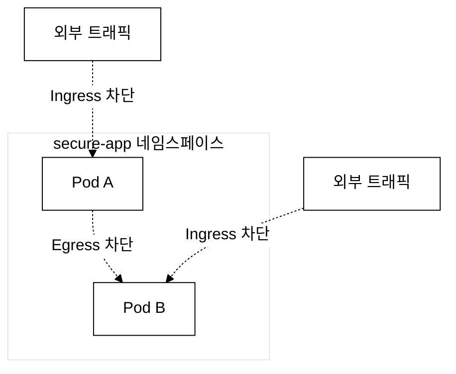
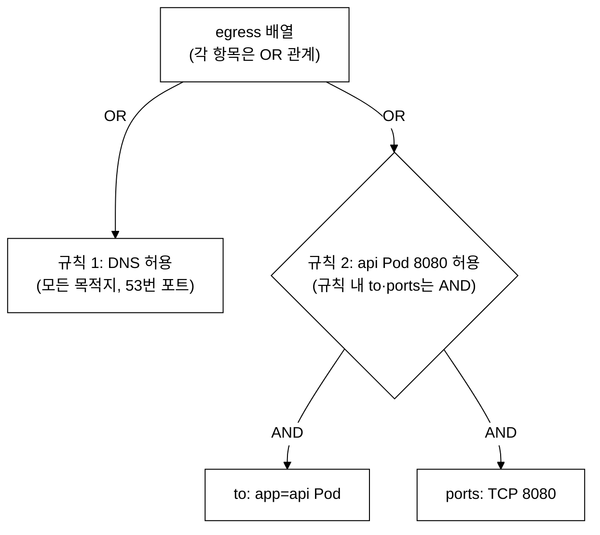
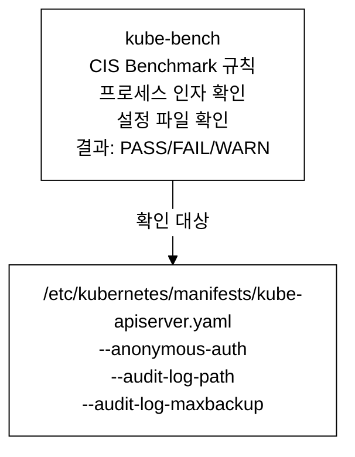
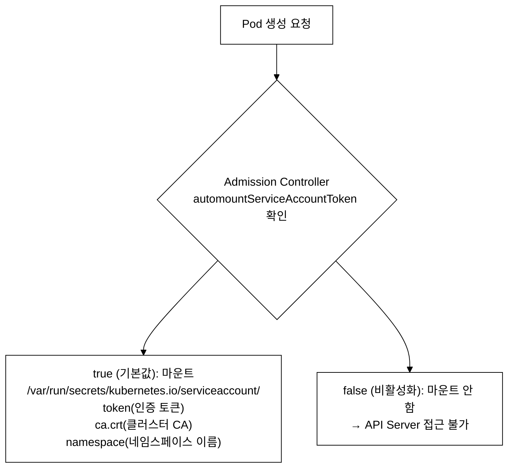
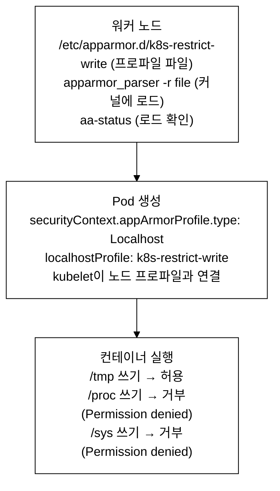
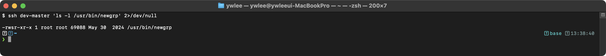
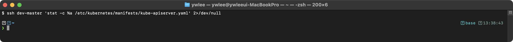
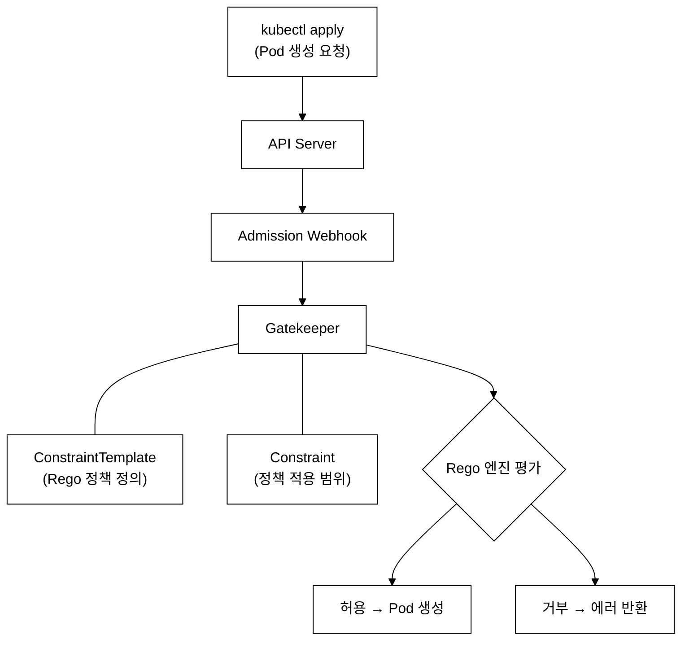
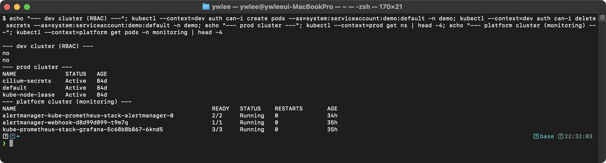

# CKS Day 13: 종합 모의시험 (1/2) - 시험 전략과 문제 1~12

> 학습 목표 | 도메인: 전 도메인 종합 모의시험 (Cluster Setup 10% · Cluster Hardening 15% · System Hardening 15% · Microservice Vulnerabilities 20% · Supply Chain 20% · Runtime Security 20%) | 예상 소요 시간: 2시간

---

> Day 12에서는 Falco 룰 작성, Kubernetes Audit Log 분석, Sysdig 시스템 콜 캡처, 인시던트 대응(증거 수집·격리·컨테이너 제거) 등 Monitoring/Logging/Runtime Security 도메인을 학습했다. Day 13은 그 내용을 포함한 6개 도메인 전체를 실전 모의시험 형태(120분, 20문제)로 점검한다.

## 오늘의 학습 목표

- CKS 실제 시험과 동일한 조건(120분)에서 모의시험을 진행한다
- 6개 도메인 중 **문제 1~12(63점)**를 오늘 풀어본다
- 각 문제에 tart-infra 클러스터 컨텍스트가 지정되어 있다
- 시간 관리와 문제 풀이 전략을 연습한다
- 실전 시험에서 자주 등장하는 패턴을 체득한다

### 등장 배경: CKS 시험 실전 대비의 핵심

```
CKS 시험의 특성과 대비 전략
════════════════════════════

CKS 시험은 실습 기반(performance-based)이다. 개념을 아는 것만으로는
부족하며, 제한 시간 내에 정확한 YAML을 작성하고 설정을 적용해야 한다.

주요 실패 원인:
  1. 시간 부족 — 120분 안에 15~20개 문제를 풀어야 한다
  2. 컨텍스트 전환 실수 — 다른 클러스터에서 작업하면 0점이다
  3. API Server 매니페스트 오류 — YAML 오타로 API Server가 죽으면
     남은 문제를 풀 수 없다
  4. volume/volumeMount 누락 — 설정 파일을 지정했으나 마운트하지 않으면
     API Server가 시작되지 않는다

합격 핵심: 쉬운 문제(NetworkPolicy, SA 토큰, seccomp, RuntimeClass)를
  먼저 풀어 확실한 점수를 확보한 뒤, 어려운 문제(kube-bench, Audit Policy,
  ImagePolicyWebhook)에 도전하는 것이 최적 전략이다.
```

### 왜 Kubernetes 보안(CKS)이 따로 필요한가

이 모의시험의 6개 도메인(NetworkPolicy·RBAC·AppArmor·seccomp·공급망·런타임 보안)을 개별 기술의 나열로 보면 외울 것만 많은 잡다한 목록처럼 느껴진다. 그러나 이들은 하나의 위협 모델에서 출발한 방어 계층들이다.

첫째, 위협의 본질. 하나의 Kubernetes 클러스터에서는 수백~수천 개 Pod이 같은 노드 커널과 같은 네트워크를 공유하며 실행된다. 한 Pod이 침해되어 권한 상승(privilege escalation)에 성공하면, 공유된 커널·네트워크·API Server를 발판으로 다른 팀의 Pod, 노드, 나아가 클러스터 전체를 장악할 수 있다. 즉 컨테이너의 격리는 VM처럼 강하지 않고, 한 곳의 침해가 전체로 번지기 쉽다.

둘째, 직전 기술의 한계. 컨테이너 시대 이전에도 보안 수단은 있었다. Docker가 제공하던 seccomp·AppArmor·capability 제한은 "컨테이너 한 개"의 syscall과 파일 접근을 막는 데는 유효했지만, 이는 노드 위 단일 컨테이너에 대한 방어일 뿐이다. 여러 노드에 걸쳐 동작하는 클러스터 차원에서 "누가 어떤 API를 호출할 수 있는가(인가)", "어떤 Pod이 어떤 Pod과 통신할 수 있는가(네트워크 격리)", "어떤 이미지를 신뢰할 수 있는가(공급망)"는 Docker만으로는 답할 수 없었다.

셋째, 무엇이 나아졌나. Kubernetes는 그 빈틈을 추가 계층으로 메운다. RBAC(Role-Based Access Control, 역할 기반 인가)는 API Server 호출 권한을 사용자·SA별로 제한하고, NetworkPolicy는 Pod 간 트래픽을 화이트리스트로 통제하며, PSA(Pod Security Admission, 5번·10번 문제에 등장)는 위험한 Pod 설정을 admission 단계에서 거부한다. 여기에 Docker가 주던 seccomp·AppArmor를 Pod 스펙으로 끌어올려 선언적으로 적용한다. 이렇게 "API 인가 + 네트워크 격리 + 워크로드 제약 + 노드 커널 방어 + 공급망 검증"이 겹겹이 쌓인다(defense in depth).

넷째, 멀티테넌트 시나리오와 트레이드오프. 예컨대 한 금융사의 여러 팀이 비용 절감을 위해 하나의 클러스터를 공유한다고 하자. A팀의 결제 Pod과 B팀의 분석 Pod이 같은 클러스터에 있을 때, B팀 Pod의 취약점이 A팀 Secret으로 번지지 않아야 한다. 이 격리 요구가 위 계층들을 강제하는 현실적 이유다. 다만 공짜는 없다. 모든 통신을 default deny로 막으면 정상 트래픽까지 끊겨 디버깅이 어려워지고, 과도한 RBAC 제한은 운영 마찰을 낳으며, AppArmor·seccomp 프로파일은 정상 동작까지 막아 컨테이너가 죽는 일이 잦다. CKS는 이 방어 계층을 "켤 줄 아는 것"뿐 아니라 "정상 동작을 깨지 않고 최소 권한으로 켜는 균형"까지 묻는 시험이다.

---

## 1. CKS 시험 구조 완전 해부

### 1.1 시험 기본 정보

| 항목 | 내용 |
|------|------|
| 시험 시간 | **120분** |
| 합격 기준 | **67%** |
| 문제 수 | **15~20문제** (변동 가능) |
| 시험 형태 | 실습 기반 (Performance-Based) |
| 시험 환경 | Linux 터미널 (브라우저 기반) |
| 참고 자료 | kubernetes.io, github.com/kubernetes, trivy.dev, falco.org, apparmor.net 등 허용 |
| 선수 조건 | **CKA 합격** (유효 기간 내) |
| 인증 유효 기간 | **2년** |
| 재시험 | 1회 무료 재시험 포함 |

### 1.2 도메인별 출제 비중

```
+--------------------------------------------------+
|          CKS 시험 도메인 비중 (2024~)              |
+--------------------------------------------------+
|                                                    |
|  Cluster Setup ................ 10%  ████          |
|  Cluster Hardening ............ 15%  ██████        |
|  System Hardening ............. 15%  ██████        |
|  Minimize Microservice Vuln ... 20%  ████████      |
|  Supply Chain Security ........ 20%  ████████      |
|  Monitoring/Logging/Runtime ... 20%  ████████      |
|                                                    |
+--------------------------------------------------+
| 합계: 100%  |  합격 기준: 67점 이상               |
+--------------------------------------------------+
```

**비중 분석:**
- 비중이 높은 도메인(20%)부터 확실히 준비하라
- Microservice Vulnerabilities, Supply Chain, Runtime Security가 각각 20%로 가장 크다
- 이 세 도메인에서 60%를 차지하므로, 여기서 점수를 잃으면 합격이 어렵다
- Cluster Setup은 10%로 가장 작지만, 난이도가 낮은 문제가 많아 반드시 만점을 받아야 한다

### 1.3 도메인별 핵심 출제 주제

```
Cluster Setup (10%)
├── NetworkPolicy (Default Deny, Ingress/Egress 제어)
├── CIS Benchmark / kube-bench
├── Ingress TLS 설정
└── 바이너리 무결성 검증 (sha512sum)

Cluster Hardening (15%)
├── RBAC (Role, ClusterRole, RoleBinding, ClusterRoleBinding)
├── ServiceAccount 토큰 관리
├── API Server 보안 플래그
├── Audit Policy (4단계 레벨)
└── kubeadm 클러스터 업그레이드

System Hardening (15%)
├── AppArmor 프로파일 (생성, 로드, Pod 적용)
├── seccomp 프로파일 (RuntimeDefault, Localhost)
├── 불필요한 서비스 비활성화
├── 커널 파라미터 (sysctl)
└── SUID 바이너리 찾기/제거

Minimize Microservice Vulnerabilities (20%)
├── Pod Security Standards (Privileged/Baseline/Restricted)
├── Pod Security Admission (enforce/audit/warn)
├── SecurityContext (runAsNonRoot, capabilities, readOnlyRootFilesystem)
├── OPA Gatekeeper (ConstraintTemplate, Constraint)
├── Secret Encryption at Rest (EncryptionConfiguration)
├── RuntimeClass (gVisor, Kata Containers)
└── Istio mTLS (PeerAuthentication)

* subresource: `Pod exec`, `Pod log`는 정확히는 pods의 하위 리소스(subresource) pods/exec, pods/log를 가리킨다. RBAC에서는 `resources: ["pods/exec"]`, `resources: ["pods/log"]`처럼 슬래시로 표기하며, Audit Policy에서도 같은 형식으로 지정한다(문제 6 참고).
* Istio mTLS: 상호 TLS(양쪽이 서로의 인증서로 신원을 검증하는 암호화 통신)를 가리키며, 실제 구현은 `PeerAuthentication` 리소스(정책 선언)와 각 Pod에 주입된 istio-proxy(Envoy) 사이드카(mTLS 실제 수행)의 조합으로 동작한다. 정책만으로 암호화가 일어나는 것이 아니라 사이드카가 트래픽을 가로채 암복호화한다.

Supply Chain Security (20%)
├── Trivy 이미지 스캔 (severity, exit-code)
├── 이미지 서명 (Cosign, Docker Content Trust)
├── ImagePolicyWebhook (AdmissionConfiguration)
├── 이미지 다이제스트 vs 태그
├── Dockerfile 보안 (multi-stage, distroless, non-root)
└── 허용된 레지스트리 제한

Monitoring/Logging/Runtime Security (20%)
├── Falco (룰 작성, 매크로, 필터, 우선순위)
├── Kubernetes Audit Log 분석 (jq 필터링)
├── Sysdig (시스템 콜 캡처)
├── 인시던트 대응 (증거 수집, 격리, 제거)
└── Immutable Container (readOnlyRootFilesystem)
```

---

## 2. 시험 전략 완벽 가이드

### 2.1 시간 배분 전략

```
시험 시작 (120분)
│
├─ [0~5분] 환경 파악 (5분)
│   ├── 클러스터 수, 컨텍스트 확인
│   ├── 문제 빠르게 전체 훑기
│   └── alias 설정: alias k=kubectl
│
├─ [5~35분] 쉬운 문제 먼저 (30분)
│   ├── NetworkPolicy Default Deny (2~3분)
│   ├── ServiceAccount 토큰 비활성화 (3~4분)
│   ├── seccomp RuntimeDefault 적용 (3~4분)
│   ├── RBAC 수정 (4~5분)
│   └── Pod SecurityContext 설정 (3~4분)
│
├─ [35~90분] 중간 난이도 문제 (55분)
│   ├── Trivy 이미지 스캔 (7~8분)
│   ├── Audit Policy 작성 (8~10분)
│   ├── AppArmor 프로파일 적용 (7~8분)
│   ├── Secret Encryption at Rest (8~10분)
│   ├── Pod Security Admission 적용 (5~7분)
│   └── Falco 룰 작성 (7~8분)
│
├─ [90~110분] 어려운 문제 (20분)
│   ├── ImagePolicyWebhook 설정 (10~12분)
│   ├── kube-bench 수정 (8~10분)
│   └── 복합 문제 (나머지 시간)
│
└─ [110~120분] 검증 (10분)
    ├── kubectl get으로 리소스 존재 확인
    ├── 미완성 문제에 부분 점수 시도
    └── 컨텍스트가 올바른지 재확인
```

### 2.2 실전 핵심 팁 20가지

```
[환경 설정]
1. alias k=kubectl 즉시 설정
2. export do="--dry-run=client -o yaml" 설정 → k create deploy x --image=nginx $do
3. kubectl completion bash 활성화 (보통 이미 설정되어 있음)
4. 매 문제마다 kubectl config use-context <context> 먼저 실행
5. 터미널 탭 여러 개 활용 (SSH 연결 시 별도 탭)

[문제 풀이]
6. 쉬운 문제부터 풀기 → 자신감 + 시간 확보
7. 한 문제에 최대 10분 → 넘으면 플래그 달고 넘어가기
8. 부분 점수 전략: 완벽하지 않아도 리소스 생성해두기
9. kubectl explain <resource>.spec 적극 활용
   (kubectl explain = 리소스의 YAML 스키마를 조회하는 명령. 필드명·타입·필수 여부를 확인할 때 쓴다.
    예: kubectl explain pod.spec.securityContext 로 SecurityContext 하위 필드를 즉시 검색 →
    runAsNonRoot 철자나 위치가 헷갈릴 때 문서를 안 열고 바로 확인 가능)
10. kubernetes.io 검색 시 키워드: "network policy yaml" 등

[YAML 작성]
11. k create 명령으로 YAML 뼈대 먼저 생성
12. k run pod --image=nginx $do > pod.yaml 로 빠르게 시작
13. apiVersion 외우기: networking.k8s.io/v1, rbac.authorization.k8s.io/v1
14. 들여쓰기 실수 방지: yaml-lint 또는 k apply --dry-run=server -f

[SSH 작업]
15. API Server 매니페스트 수정 전 반드시 백업
16. cp /etc/kubernetes/manifests/kube-apiserver.yaml /tmp/kube-apiserver.bak
17. API Server 재시작 확인: crictl ps | grep kube-apiserver (최대 2~3분 대기)
18. hostPath volume 설정 시 type: DirectoryOrCreate 사용

[검증]
19. 매 문제 풀이 후 즉시 검증 (kubectl get, kubectl describe)
20. RBAC 검증: kubectl auth can-i <verb> <resource> --as=<user> -n <ns>
```

### 2.3 시험에서 자주 하는 실수 TOP 10

```
실수 1: 컨텍스트 미전환
  → 다른 클러스터에서 작업하여 0점
  → 해결: 매 문제 첫 줄에 kubectl config use-context 실행

실수 2: 네임스페이스 누락
  → 리소스가 다른 네임스페이스에 생성됨
  → 해결: metadata.namespace 반드시 확인, -n 옵션 습관화

실수 3: API Server 매니페스트 오타
  → YAML 들여쓰기 오류로 API Server 죽음
  → 해결: 수정 전 백업, 오류 시 즉시 복원

실수 4: volumeMount 누락
  → Audit Policy, Encryption Config 등에서 volume 연결 안 함
  → 해결: --xxx-file 옵션 추가 시 반드시 volume/volumeMount도 추가

실수 5: AppArmor 프로파일 미로드
  → 프로파일 파일만 만들고 apparmor_parser 실행 안 함
  → 해결: sudo apparmor_parser -r <file> 후 aa-status로 확인

실수 6: NetworkPolicy에서 policyTypes 누락
  → Default Deny가 적용 안 됨
  → 해결: policyTypes: [Ingress, Egress] 명시적으로 작성

실수 7: seccomp/AppArmor를 잘못된 위치에 설정
  → seccompProfile은 spec.securityContext 또는 containers[].securityContext
  → appArmorProfile은 containers[].securityContext.appArmorProfile

실수 8: Pod Security Admission 라벨 오타
  → pod-security.kubernetes.io/enforce=restricted (정확한 키)
  → 해결: kubectl label ns <ns> pod-security.kubernetes.io/enforce=restricted

실수 9: EncryptionConfiguration에서 identity: {} 누락
  → 기존 암호화되지 않은 데이터 읽기 불가
  → 해결: providers 마지막에 반드시 identity: {} 추가

실수 10: Falco 룰을 기본 파일에 작성
  → /etc/falco/falco_rules.yaml이 아닌 /etc/falco/falco_rules.local.yaml에 작성
  → 이유: falco_rules.yaml은 Falco 패키지가 관리하는 기본 룰 파일이라
    패키지 업데이트 시 통째로 덮어써져 커스텀 룰이 사라진다.
    local.yaml은 업데이트가 건드리지 않으므로 커스텀 룰을 여기에 둔다
    (best practice: base 룰 + local 룰을 분리)
  → 해결: 항상 local.yaml 파일에 작성
```

### 2.4 imperative 명령어 속성표

```bash
# === 시험에서 시간을 절약하는 imperative 명령어 ===

# [RBAC]
kubectl create role <name> --verb=get,list,watch --resource=pods -n <ns>
kubectl create clusterrole <name> --verb=get,list --resource=nodes
kubectl create rolebinding <name> --role=<role> --serviceaccount=<ns>:<sa> -n <ns>
kubectl create clusterrolebinding <name> --clusterrole=<cr> --user=<user>

# [ServiceAccount]
kubectl create sa <name> -n <ns>

# [Namespace + PSA]
kubectl create ns <name>
kubectl label ns <name> pod-security.kubernetes.io/enforce=restricted

# [Pod YAML 뼈대]
kubectl run <name> --image=nginx:1.25 --dry-run=client -o yaml > pod.yaml

# [Deployment YAML 뼈대]
kubectl create deploy <name> --image=nginx --replicas=3 --dry-run=client -o yaml > deploy.yaml

# [Secret]
kubectl create secret generic <name> --from-literal=key=value -n <ns>

# [검증]
kubectl auth can-i create pods --as=system:serviceaccount:<ns>:<sa> -n <ns>
kubectl get events -n <ns> --sort-by=.metadata.creationTimestamp
```

---

## 3. tart-infra 클러스터 정보

**클러스터 구성:**

| 클러스터 | 노드 구성 | 주요 구성 |
|---------|-----------|----------|
| platform | master + 2 workers | Prometheus, Grafana, Loki, AlertManager(8 rules), Jenkins, ArgoCD |
| dev | master + 1 worker | Istio mTLS STRICT, HPA, CiliumNetworkPolicy 11개([manifests/network-policies](../../../manifests/network-policies/) 참고), demo apps |
| staging | master + 1 worker | 기본 구성 |
| prod | master + 2 workers | 프로덕션 워크로드 |

- 모든 클러스터: Cilium CNI (kubeProxyReplacement=true), kubeadm v1.31
- SSH: `admin` / `admin`

---

## 4. 모의시험 (20문제, 120분, 100점)

> **범위 안내:** 이 파일은 문제 1~12(63점)를 다룬다. 문제 13~20(Supply Chain Security·Monitoring/Logging/Runtime Security 도메인 — Falco·Trivy·ImagePolicyWebhook·Sysdig 등 37점)은 day14.md에서 이어진다. 학습 목표 체크리스트의 "12문제"는 이 분할을 반영한다.

> 타이머를 **120분**으로 설정하고 시작하라. 합격 기준: **67점 이상**

**실습 전제(시작 전 1회 확인):**
- 4개 클러스터가 가동 중이어야 한다. 꺼져 있으면 `./scripts/boot.sh` 로 기동하고, 재부팅 직후라면 `./scripts/fix-cluster-ip-drift.sh` 로 IP 드리프트를 복구한다(미복구 시 DNS·CNI가 깨져 NetworkPolicy 문제가 오작동한다).
- kubeconfig는 `kubeconfig/<클러스터>.yaml` 에 있다. 각 문제의 `kubectl config use-context <ctx>` 는 다음과 같이 KUBECONFIG를 합쳐 두면 컨텍스트 전환으로 동작한다.
  ```bash
  export KUBECONFIG=kubeconfig/platform.yaml:kubeconfig/dev.yaml:kubeconfig/staging.yaml:kubeconfig/prod.yaml
  kubectl config get-contexts   # dev/staging/prod 컨텍스트 확인
  ```
- 노드 직접 작업(kube-bench·Audit Policy·AppArmor·SUID 등)은 SSH 별칭으로 접속한다. 예: `ssh staging-master`, `ssh dev-worker`(전용 키가 배포돼 비밀번호 없이 접속). 문제 본문의 `ssh admin@staging-master` 는 설치 자동화용 표기이며, 평소에는 별칭 접속이 빠르다.
- **파괴 실습은 dev/staging 에서만 한다.** API Server 매니페스트 수정·SUID 제거·서비스 비활성화 같은 노드/컨트롤플레인 변경은 platform/prod 에서 절대 수행하지 않는다(§3 클러스터 정책). 각 문제의 컨텍스트가 dev/staging 으로 지정된 이유가 이것이다.
- 각 문제의 검증 단계 출력은 실제 화면 캡처로 대체되어야 하나(§4①), 이 문서의 검증 출력 중 일부는 클러스터 미가동·노드레벨 파괴 작업이라 "(미캡처/미실행)"로 표기되어 있다. 실제 dev/staging 가동 시 직접 실행해 결과를 확인하라.

---

### 문제 1. [Cluster Setup - 3점] Default Deny NetworkPolicy

**컨텍스트:** `kubectl config use-context dev`

**문제:**
`secure-app` 네임스페이스에 모든 Pod에 대해 Ingress와 Egress 트래픽을 모두 차단하는 default deny NetworkPolicy를 생성하라.

**요구사항:**
- 정책 이름: `default-deny-all`
- 네임스페이스: `secure-app`
- 모든 Pod 선택 (podSelector: {})
- Ingress + Egress 모두 차단

<details>
<summary>풀이</summary>

**선행 개념 - NetworkPolicy의 기본값은 "모두 허용":** Kubernetes는 별도 정책이 없으면 모든 Pod 사이의 통신을 허용한다(default allow). NetworkPolicy 리소스를 하나도 생성하지 않은 네임스페이스에서는 어떤 Pod든 다른 Pod·외부와 자유롭게 통신한다. 어떤 Pod를 선택하는 NetworkPolicy가 하나라도 생기는 순간, 그 Pod는 "선택된 정책이 명시적으로 허용한 트래픽만" 통과시키는 화이트리스트 모드로 전환된다. 즉 NetworkPolicy는 트래픽을 막는 방화벽이 아니라, "차단 모드로 전환한 뒤 필요한 통로만 뚫는" 방식이다. CNI(Container Network Interface, Pod 네트워킹을 담당하는 플러그인. 이 클러스터는 Cilium)가 이 정책을 L3/L4(IP 주소·포트 단위) 수준에서 실제로 강제한다.

**시험 출제 의도:** NetworkPolicy의 기본 개념을 이해하고 있는지 확인. 가장 기본적인 보안 정책으로, 반드시 만점을 받아야 하는 문제다.

**작동 원리:**

_그림 1. default deny 정책 적용 시 네임스페이스 내·외부 트래픽이 모두 차단된다(점선=차단)._

`podSelector: {}` = 빈 셀렉터는 "모든 Pod"를 의미한다. 빈 label selector는 매칭 조건이 없으므로 해당 네임스페이스의 전체 Pod 집합을 선택한다.

```bash
# 1. 컨텍스트 전환 (반드시!)
kubectl config use-context dev

# 2. 네임스페이스 생성 (없으면)
kubectl create ns secure-app 2>/dev/null
```

```yaml
# default-deny-all.yaml
apiVersion: networking.k8s.io/v1    # NetworkPolicy의 API 그룹
kind: NetworkPolicy
metadata:
  name: default-deny-all            # 문제에서 지정한 이름
  namespace: secure-app             # 반드시 네임스페이스 명시
spec:
  podSelector: {}                   # {} = 모든 Pod 선택
  policyTypes:                      # 이것이 없으면 default deny 안 됨!
  - Ingress                         # 들어오는 트래픽 차단
  - Egress                          # 나가는 트래픽 차단
  # ingress/egress 필드를 아예 작성하지 않으면 = 전부 차단
```

```bash
# 3. 적용
kubectl apply -f default-deny-all.yaml

# 4. 검증
kubectl get networkpolicy -n secure-app
# NAME              POD-SELECTOR   AGE
# default-deny-all  <none>         5s

kubectl describe networkpolicy default-deny-all -n secure-app
# Allowing ingress traffic: <none> (not allowing any traffic)
# Allowing egress traffic: <none> (not allowing any traffic)
```

**왜 policyTypes가 중요한가?**
- `policyTypes`를 생략하면 Kubernetes는 `ingress` 또는 `egress` 필드의 존재 여부로 판단한다
- 두 필드 모두 없으면 Ingress만 정책이 적용되고, Egress는 무제한 허용된다
- 따라서 명시적으로 `policyTypes: [Ingress, Egress]`를 적어야 양쪽 모두 차단된다

> 다음 문제 예고: 이렇게 전부 막은 뒤에는 필요한 통신만 다시 열어야 한다. 문제 2에서 egress 규칙을 추가하는데, 이때 한 규칙 안의 `to`(목적지)와 `ports`(포트)는 AND(둘 다 만족해야 통과), 서로 다른 규칙끼리는 OR(하나만 매칭돼도 통과) 관계다. 이 결합 규칙을 모르면 문제 1은 풀어도 문제 2에서 막힌다.

**채점 기준:**
- [ ] 정책 이름이 `default-deny-all`인가 (0.5점)
- [ ] `secure-app` 네임스페이스에 적용되었는가 (0.5점)
- [ ] `podSelector: {}`로 모든 Pod를 선택하는가 (1점)
- [ ] Ingress와 Egress 모두 policyTypes에 포함되었는가 (1점)

</details>

---

### 문제 2. [Cluster Setup - 5점] DNS + 특정 Pod 통신 허용 NetworkPolicy

**컨텍스트:** `kubectl config use-context dev`

**문제:**
`secure-app` 네임스페이스에서 `app=web` 라벨이 있는 Pod가:
1. DNS(UDP/TCP 53)로 통신 가능해야 한다
2. `app=api` 라벨이 있는 Pod의 포트 8080으로만 Egress 통신 가능해야 한다
3. 그 외 Egress 트래픽은 모두 차단되어야 한다

정책 이름은 `web-egress-policy`로 하라.

<details>
<summary>풀이</summary>

> 문제 1과의 연결: 문제 1이 "모든 트래픽 차단(default deny)"이었다면, 실무에서는 차단 후 필요한 통로만 다시 열어주는 것이 정석이다. 이 문제는 그 "통로 열기"의 첫 단계로, 차단 상태에서 DNS와 특정 Pod 통신만 선별 허용하는 패턴이다. 난이도가 문제 1보다 한 단계 높은 이유는 egress 규칙 안에서 to(목적지)와 ports(포트)가 어떻게 결합되는지를 정확히 알아야 하기 때문이다.

**선행 개념 - label selector와 규칙 결합의 AND/OR 규칙:** NetworkPolicy를 읽을 때 가장 헷갈리는 부분이 "어디까지가 AND이고 어디부터가 OR인가"이다. label selector는 키-값 라벨로 Pod를 골라내는 조건이다. 규칙 결합은 다음 원칙을 따른다. (1) `egress` 배열의 각 항목(`- ` 로 시작하는 규칙)은 서로 OR 관계다. 즉 여러 규칙 중 하나라도 매칭되면 통과한다. (2) 한 규칙 안의 `to`와 `ports`는 AND 관계다. 즉 목적지 조건과 포트 조건을 동시에 만족해야 통과한다. (3) `to` 배열 안에 여러 항목(`podSelector`, `namespaceSelector`, `ipBlock`)이 나열되면 그들끼리는 OR다. 단, 같은 `to` 항목 안에서 `podSelector`와 `namespaceSelector`를 한 줄에 함께 쓰면 그 둘은 AND가 된다(자주 출제되는 함정). 이 문제에서는 "DNS는 모든 곳으로, api Pod 8080은 그곳으로만"이라는 두 개의 독립된 허용이 필요하므로 OR 관계인 규칙 2개로 나눠 쓴다.

**시험 출제 의도:** NetworkPolicy의 egress 규칙에서 DNS 허용과 특정 Pod 통신을 동시에 설정하는 능력을 평가한다. 실무에서도 default deny 후 필요한 통신만 열어주는 것이 기본이다.

**핵심 개념 - egress 규칙의 AND/OR 조건:**

_그림 2. NetworkPolicy egress의 규칙 간 OR, 규칙 내 to·ports의 AND 관계._

```yaml
# web-egress-policy.yaml
apiVersion: networking.k8s.io/v1
kind: NetworkPolicy
metadata:
  name: web-egress-policy
  namespace: secure-app
spec:
  podSelector:
    matchLabels:
      app: web                      # app=web Pod에만 적용
  policyTypes:
  - Egress                          # Egress만 제어
  egress:
  # 규칙 1: DNS 허용 (kube-dns가 어디에 있든 53번 포트 허용)
  - ports:
    - protocol: UDP
      port: 53
    - protocol: TCP
      port: 53
    # to를 생략하면 모든 목적지에 대해 53번 포트 허용
  # 규칙 2: api Pod의 8080 포트로만 허용
  - to:
    - podSelector:
        matchLabels:
          app: api                   # 같은 네임스페이스의 app=api Pod
    ports:
    - protocol: TCP
      port: 8080
```

```bash
kubectl apply -f web-egress-policy.yaml

# 검증용 Pod 생성
kubectl run web --image=busybox --restart=Never -n secure-app \
  --labels="app=web" -- sleep 3600
kubectl run api --image=nginx --restart=Never -n secure-app \
  --labels="app=api" --port=8080

kubectl wait --for=condition=ready pod --all -n secure-app --timeout=60s

# DNS 테스트 (성공해야 함)
kubectl exec web -n secure-app -- nslookup kubernetes

# api Pod로 통신 (성공해야 함 - 실제로는 api Pod IP 직접 사용)
API_IP=$(kubectl get pod api -n secure-app -o jsonpath='{.status.podIP}')
kubectl exec web -n secure-app -- wget -qO- http://${API_IP}:8080 --timeout=3

# 외부 통신 (차단되어야 함)
kubectl exec web -n secure-app -- wget -qO- http://google.com --timeout=3 2>&1
# wget: download timed out
```

**주의사항 - `to` 생략 vs `to: []` vs `podSelector` 명시의 의미 차이:**
세 경우를 정확히 구분해야 한다.
- `to` 필드를 **아예 쓰지 않으면**(이 문제의 규칙 1) = 목적지 제한이 없으므로 모든 목적지에 대해 해당 `ports` 규칙을 적용한다. DNS 허용에서 kube-dns IP를 하드코딩하지 않아도 되는 이유가 이것이다.
- `to: []` (**빈 배열**) = 의미상 "to를 쓰지 않은 것"과 동일하게 "모든 목적지"로 해석되지만, 빈 배열은 "목적지를 지정하려다 비워둔 것"인지 "전부 허용 의도"인지 읽는 사람이 헷갈리므로 권장하지 않는다. 명확하게 하려면 `to` 줄 자체를 생략한다.
- `to`를 **명시하되 `podSelector`만 쓰면**(이 문제의 규칙 2) = 같은 네임스페이스 안에서 해당 라벨을 가진 Pod만 매칭된다. 다른 네임스페이스의 Pod를 허용하려면 `namespaceSelector`를 추가해야 한다.
- 앞 문장의 "`to`를 생략"(필드 자체가 없음)과 "`to: []`"(빈 배열)는 결과만 같을 뿐 표기가 다르다. 시험에서는 `to` 줄 자체를 생략하는 형태로 작성하는 것이 오해가 없다.

**채점 기준:**
- [ ] DNS(53번 포트, UDP+TCP) 허용 (2점)
- [ ] `app=api` Pod의 8080 포트로 Egress 허용 (2점)
- [ ] `podSelector`가 `app=web`을 선택 (0.5점)
- [ ] 그 외 Egress 차단 (policyTypes에 Egress 포함) (0.5점)

</details>

---

### 문제 3. [Cluster Setup - 7점] kube-bench 수정

**컨텍스트:** `kubectl config use-context staging`

**문제:**
staging 클러스터 마스터에서 kube-bench를 실행하고 다음 항목을 PASS로 수정하라:
1. `1.2.1` - `--anonymous-auth=false` 설정
2. `1.2.20` - `--audit-log-path=/var/log/kubernetes/audit/audit.log` 설정
3. `1.2.22` - `--audit-log-maxbackup=10` 설정

수정 후 kube-bench로 재검증하라.

<details>
<summary>풀이</summary>

**선행 개념 - CIS Benchmark와 kube-bench:** CIS(Center for Internet Security)는 보안 비영리 단체이고, CIS Benchmark는 이 단체가 발행하는 시스템별 보안 설정 권고 체크리스트다. "Kubernetes CIS Benchmark"는 API Server·etcd·kubelet 등의 권장 보안 플래그를 항목 번호(예: 1.2.1)로 정리한 업계 표준이며, 기업 보안 감사에서 자주 요구된다. kube-bench는 이 체크리스트를 자동으로 검사해 주는 도구로, 노드 위에서 실행되며 control-plane 프로세스의 실제 인자와 설정 파일을 읽어 각 항목을 PASS/FAIL/WARN으로 판정한다. 즉 kube-bench의 FAIL은 "해당 보안 권고가 적용되지 않았다"는 뜻이다.

**Static Pod(정적 파드):** kubelet이 etcd나 API Server를 거치지 않고 `/etc/kubernetes/manifests/` 디렉토리의 YAML 파일을 직접 읽어 실행하는 Pod다. `kubectl delete`로 삭제할 수 없고(kubelet이 즉시 재생성), 파일을 수정하면 kubelet이 변경을 감지해 컨테이너를 자동으로 재기동한다. kube-apiserver, kube-controller-manager, kube-scheduler, etcd가 이 방식으로 실행된다. CKS에서 API Server 플래그를 수정하는 작업은 결국 이 매니페스트 파일을 편집하는 것과 동일하다.

> 위험 경고: 이 문제는 FAIL을 PASS로 바꾸기 위해 API Server의 정적 파드(static Pod) 매니페스트를 직접 수정해야 한다. API Server는 모든 kubectl 요청과 etcd 접근이 거쳐 가는 관문이므로, YAML 들여쓰기 한 칸만 틀려도 API Server가 기동하지 못해 클러스터 전체가 먹통이 되고 남은 문제를 풀 수 없게 된다. 따라서 수정 전 백업(`cp ... /tmp/...bak`)은 필수이고, 플래그를 추가할 때 그 플래그가 참조하는 파일·디렉토리에 대한 volume/volumeMount도 빠짐없이 추가해야 하며, 매니페스트 변경 후 API Server가 다시 뜰 때까지 2~3분 대기하며 `crictl ps`로 상태를 확인하는 신중함이 필요하다. "플래그만 한 줄 추가하면 끝"이라고 가볍게 접근하면 안 되는 작업이다.

**시험 출제 의도:** CIS Benchmark를 이해하고, kube-bench의 FAIL 항목을 API Server 매니페스트를 수정하여 PASS로 변경할 수 있는지 평가한다. API Server Static Pod 매니페스트 수정은 CKS 시험의 핵심 기술이다.

**kube-bench 작동 원리:**

_그림 3. kube-bench가 API Server 매니페스트의 플래그를 CIS 규칙과 대조한다._

```bash
# 1. SSH 접속
ssh staging-master   # ~/.ssh/config 에 등록된 별칭으로 접속(비밀번호 불필요)

# kube-bench 설치 확인
which kube-bench || kube-bench version
# /usr/local/bin/kube-bench  또는  kube-bench version: ...
# 출력이 없으면 시험 환경과 달리 미설치 상태 — CKS 시험장에는 사전 설치되어 있다.

# 2. kube-bench 실행하여 현재 상태 확인
kube-bench run --targets master --check 1.2.1,1.2.20,1.2.22

# 결과 예시:
# [FAIL] 1.2.1 Ensure that the --anonymous-auth argument is set to false
# [FAIL] 1.2.20 Ensure that the --audit-log-path argument is set
# [FAIL] 1.2.22 Ensure that the --audit-log-maxbackup argument is set to 10 or as appropriate

# 3. 매니페스트 백업 (반드시!)
cp /etc/kubernetes/manifests/kube-apiserver.yaml /tmp/kube-apiserver.yaml.bak

# 4. 매니페스트 수정
vi /etc/kubernetes/manifests/kube-apiserver.yaml
```

**추가/수정할 내용:**
```yaml
spec:
  containers:
  - command:
    - kube-apiserver
    # ... 기존 플래그들 ...
    - --anonymous-auth=false                               # 1.2.1: 익명 인증 비활성화
    - --audit-log-path=/var/log/kubernetes/audit/audit.log  # 1.2.20: 감사 로그 경로
    - --audit-log-maxbackup=10                             # 1.2.22: 감사 로그 백업 수
    # volume mount 추가 (audit-log용)
    volumeMounts:
    - name: audit-log
      mountPath: /var/log/kubernetes/audit/
  # volumes 추가
  volumes:
  - name: audit-log
    hostPath:
      path: /var/log/kubernetes/audit/
      type: DirectoryOrCreate        # 디렉토리가 없으면 자동 생성
```

```bash
# 5. audit 로그 디렉토리 생성
mkdir -p /var/log/kubernetes/audit/

# 6. API Server 재시작 대기 (Static Pod이므로 매니페스트 변경 시 자동 재시작)
watch crictl ps | grep kube-apiserver
# CONTAINER   IMAGE   CREATED   STATE   NAME             → Running 확인

# 7. 재검증
kube-bench run --targets master --check 1.2.1,1.2.20,1.2.22
# [PASS] 1.2.1
# [PASS] 1.2.20
# [PASS] 1.2.22
```

**API Server가 죽었을 때 대처법:**
```bash
# API Server 로그 확인
crictl logs $(crictl ps -a | grep kube-apiserver | head -1 | awk '{print $1}')

# 문제가 있으면 백업에서 복원
cp /tmp/kube-apiserver.yaml.bak /etc/kubernetes/manifests/kube-apiserver.yaml

# 2~3분 대기 후 재확인
watch crictl ps | grep kube-apiserver
```

**채점 기준:**
- [ ] `--anonymous-auth=false` 설정됨 (2점)
- [ ] `--audit-log-path` 설정됨 (2점)
- [ ] `--audit-log-maxbackup=10` 설정됨 (1점)
- [ ] volume/volumeMount 올바르게 설정됨 (1점)
- [ ] API server 정상 재시작 및 kube-bench PASS (1점)

</details>

---

### 문제 4. [Cluster Hardening - 6점] RBAC 최소 권한 수정

**컨텍스트:** `kubectl config use-context prod`

> **실습 주의(§3 클러스터 정책):** 문제 4·10·11은 CKS 시험 시나리오를 그대로 재현하기 위해 예외적으로 prod 클러스터를 사용한다. 실습 후 반드시 아래 정리 명령을 실행하여 prod에 생성한 리소스를 제거한다.
> ```bash
> # 문제 4 정리
> kubectl delete role dev-team -n production --ignore-not-found
> # 문제 10 정리
> kubectl delete ns restricted-ns --ignore-not-found
> # 문제 11 정리
> kubectl delete k8sdisallowedtags deny-latest-tag --ignore-not-found
> kubectl delete constrainttemplate k8sdisallowedtags --ignore-not-found
> ```

**문제:**
`production` 네임스페이스에 `dev-team` Role이 모든 리소스에 `*` 권한을 가지고 있다. 이를 최소 권한 원칙에 따라 수정하라:
- Pod, Service: get, list, watch
- Deployment: get, list, watch, update
- ConfigMap: get, list

<details>
<summary>풀이</summary>

**시험 출제 의도:** RBAC의 최소 권한 원칙(Principle of Least Privilege)을 실제로 적용할 수 있는지 평가한다. 과도한 권한을 식별하고 적절한 수준으로 축소하는 것은 CKS의 핵심이다.

**RBAC 인가 모델:**
```
Role = 권한 정의 리소스
  rules 필드에 apiGroups, resources, verbs 조합으로 허용 동작을 선언한다.
  예: {apiGroups: [""], resources: ["pods"], verbs: ["get", "list"]}

RoleBinding = Subject-Role 바인딩 리소스
  subjects 필드의 User/Group/SA를 roleRef의 Role에 바인딩하여 인가를 부여한다.

와일드카드 * = 모든 리소스/모든 verb에 대한 무제한 인가
  최소 권한 원칙(PoLP) 위반이며, 권한 상승(privilege escalation) 경로를 제공한다.
```

```bash
kubectl config use-context prod

# 현재 Role 확인
kubectl get role dev-team -n production -o yaml
# rules:
# - apiGroups: ["*"]
#   resources: ["*"]
#   verbs: ["*"]         ← 과도한 권한!
```

```yaml
# 수정된 Role
apiVersion: rbac.authorization.k8s.io/v1
kind: Role
metadata:
  name: dev-team
  namespace: production
rules:
# Pod, Service: 읽기만 허용
- apiGroups: [""]               # core API 그룹 (Pod, Service, ConfigMap 등)
  resources: ["pods", "services"]
  verbs: ["get", "list", "watch"]
# Deployment: 읽기 + 업데이트 (삭제, 생성은 불가)
- apiGroups: ["apps"]           # apps API 그룹 (Deployment, StatefulSet 등)
  resources: ["deployments"]
  verbs: ["get", "list", "watch", "update"]
# ConfigMap: 읽기만
- apiGroups: [""]
  resources: ["configmaps"]
  verbs: ["get", "list"]
```

```bash
# 적용
kubectl apply -f dev-team-role.yaml
# 또는
kubectl edit role dev-team -n production
# → 위 내용으로 rules 섹션을 교체

# 검증 (RoleBinding에 연결된 사용자/SA 기준)
kubectl auth can-i delete pods --as=system:serviceaccount:production:dev-sa -n production
# no
kubectl auth can-i get pods --as=system:serviceaccount:production:dev-sa -n production
# yes
kubectl auth can-i update deployments --as=system:serviceaccount:production:dev-sa -n production
# yes
kubectl auth can-i create pods --as=system:serviceaccount:production:dev-sa -n production
# no
kubectl auth can-i delete deployments --as=system:serviceaccount:production:dev-sa -n production
# no
```

**apiGroups 참고:**
| apiGroup | 포함 리소스 |
|----------|-----------|
| `""` (빈 문자열) | pods, services, configmaps, secrets, namespaces, nodes |
| `apps` | deployments, statefulsets, daemonsets, replicasets |
| `rbac.authorization.k8s.io` | roles, rolebindings, clusterroles, clusterrolebindings |
| `networking.k8s.io` | networkpolicies, ingresses |

**채점 기준:**
- [ ] `*` 와일드카드가 제거됨 (2점)
- [ ] Pod/Service: get, list, watch만 허용 (1.5점)
- [ ] Deployment: get, list, watch, update만 허용 (1.5점)
- [ ] ConfigMap: get, list만 허용 (1점)

</details>

---

### 문제 5. [Cluster Hardening - 4점] ServiceAccount 토큰 비활성화

**컨텍스트:** `kubectl config use-context dev`

**문제:**
`webapp` 네임스페이스에 `backend-sa` ServiceAccount를 생성하라. 토큰 자동 마운트를 비활성화하고, 이 SA를 사용하는 `backend-pod`(nginx:1.25)를 생성하라. Pod에서도 토큰 마운트를 비활성화하라.

<details>
<summary>풀이</summary>

**선행 개념 - ServiceAccount 토큰은 API Server 인증 자격증명이다:** ServiceAccount(SA)는 Pod가 API Server에 접근할 때 쓰는 신원이다. Pod가 생성되면 그 SA의 토큰이 컨테이너의 `/var/run/secrets/kubernetes.io/serviceaccount/token` 경로에 자동 마운트된다. 이 토큰은 JWT(JSON Web Token, 서명된 인증 토큰)로, API Server에 "나는 이 SA다"라고 증명하는 자격증명이다. 문제는, 대부분의 애플리케이션 Pod는 API Server를 호출할 일이 없는데도 이 토큰을 들고 있다는 점이다. 공격자가 그런 Pod를 탈취하면 토큰까지 함께 손에 넣어, 그 SA에 부여된 RBAC 권한만큼 클러스터에 접근할 수 있다. 따라서 API를 호출하지 않는 Pod는 토큰을 아예 마운트하지 않는 것이 defense in depth(다층 방어 - 한 겹이 뚫려도 다음 겹이 막는 설계)의 기본이다. `automountServiceAccountToken: false` 필드가 존재하는 이유가 이것이다.

**시험 출제 의도:** ServiceAccount 토큰이 컨테이너에 자동 마운트되면 공격자가 이를 이용해 API Server에 접근할 수 있다. 불필요한 토큰 마운트를 비활성화하는 것은 기본적인 보안 조치이다.

**토큰 자동 마운트 동작 원리:**

_그림 4. ServiceAccount 토큰 자동 마운트 동작과 비활성화 시 효과._

```bash
kubectl config use-context dev
kubectl create ns webapp 2>/dev/null
```

```yaml
# backend.yaml
apiVersion: v1
kind: ServiceAccount
metadata:
  name: backend-sa
  namespace: webapp
automountServiceAccountToken: false   # SA 레벨에서 비활성화
---
apiVersion: v1
kind: Pod
metadata:
  name: backend-pod
  namespace: webapp
spec:
  serviceAccountName: backend-sa          # 이 SA 사용
  automountServiceAccountToken: false     # Pod 레벨에서도 비활성화 (이중 보호)
  containers:
  - name: app
    image: nginx:1.25
```

**왜 두 곳 모두에서 설정하나?**
- SA에 `automountServiceAccountToken: false` → 이 SA를 사용하는 모든 Pod에 기본 적용
- Pod에 `automountServiceAccountToken: false` → Pod 레벨 설정이 SA 레벨을 오버라이드
- Pod 레벨 설정이 우선순위가 높으므로, 확실히 하려면 Pod에서도 설정한다

```bash
kubectl apply -f backend.yaml

# 검증: 토큰 디렉토리가 없어야 한다
kubectl exec backend-pod -n webapp -- ls /var/run/secrets/kubernetes.io/serviceaccount/ 2>&1
# ls: /var/run/secrets/kubernetes.io/serviceaccount/: No such file or directory
# → 성공!

# SA 확인
kubectl get sa backend-sa -n webapp -o yaml | grep automount
# automountServiceAccountToken: false
```

**채점 기준:**
- [ ] SA에 `automountServiceAccountToken: false` (1점)
- [ ] Pod에 `automountServiceAccountToken: false` (1점)
- [ ] Pod가 `backend-sa`를 사용 (1점)
- [ ] 토큰 디렉토리가 존재하지 않음 (1점)

</details>

---

### 문제 6. [Cluster Hardening - 7점] Audit Policy 작성 및 적용

**컨텍스트:** `kubectl config use-context staging`

**문제:**
다음 요구사항에 맞는 Audit Policy를 작성하고 API Server에 적용하라:
1. Secret 리소스: RequestResponse 레벨
2. Pod, Pod exec, Pod log: Metadata 레벨
3. system:kube-scheduler, system:kube-proxy의 get/list/watch: None
4. configmaps, services: Request 레벨
5. 기본(catch-all): Metadata

파일 경로: `/etc/kubernetes/audit-policy.yaml`
로그 경로: `/var/log/kubernetes/audit/audit.log`

<details>
<summary>풀이</summary>

**시험 출제 의도:** Audit Policy의 4가지 레벨을 이해하고, 요구사항에 맞게 규칙을 작성한 후 API Server에 적용하는 전체 과정을 평가한다.

**Audit 4단계 기록 수준:**
```
None            = 해당 규칙에 매칭되는 요청에 대해 감사 이벤트를 생성하지 않음
Metadata        = 요청 메타데이터(user, verb, resource, timestamp)만 기록
Request         = 메타데이터 + 요청 본문(request body) 기록
RequestResponse = 메타데이터 + 요청 본문 + 응답 본문(response body) 모두 기록
```

레벨을 올릴수록 한 이벤트당 로그 크기가 커지고, 그만큼 디스크 사용량과 I/O 비용이 늘어난다. 대략적인 크기 감각은 다음과 같다. Metadata 이벤트는 보통 1~2KB 수준이다. Request는 요청 본문(예: 생성하려는 Pod의 전체 매니페스트)이 더해져 수~수십 KB가 된다. RequestResponse는 응답 본문(예: `kubectl get secret`이 돌려주는 Secret 전체)까지 포함하므로 수십 KB에서 큰 객체는 수백 KB까지 커진다. 그래서 모든 요청에 RequestResponse를 거는 것은 비현실적이고, "민감 리소스(Secret)는 RequestResponse로 깊게, 잡음이 많은 시스템 컴포넌트 읽기는 None으로 제외, 나머지는 Metadata로 가볍게"처럼 리소스별로 레벨을 차등 적용해 로그량과 스토리지 비용을 통제한다. 이 문제의 요구사항 자체가 그런 차등 설계의 전형이다.

**규칙 매칭 순서:**
```
요청 수신 → 첫 번째 매칭 규칙 적용 (위에서 아래로)
         → 매칭 없으면 마지막 catch-all 규칙 적용

따라서 더 구체적인 규칙을 위에, 일반적인 규칙을 아래에 배치해야 한다!
```

```bash
ssh staging-master   # ~/.ssh/config 별칭(첫 등장 주석 참조)

# 백업
cp /etc/kubernetes/manifests/kube-apiserver.yaml /tmp/kube-apiserver.yaml.bak
```

**규칙 배치 원칙 — 더 구체적인 규칙을 위에 배치한다:**
Audit Policy는 요청이 들어오면 규칙 목록을 위에서 아래로 순회하여 처음으로 매칭되는 규칙을 적용하고 나머지는 무시한다. 따라서 "user + verb + resource 세 조건을 모두 지정하는 좁은 규칙"이 "resource만 지정하는 넓은 규칙"보다 반드시 앞에 위치해야 한다. 아래에서 규칙 3(kube-scheduler/kube-proxy의 get/list/watch → None)은 kube-scheduler가 pods를 LIST할 때도 매칭되므로, 규칙 2(pods → Metadata)보다 앞에 두어야 한다. 순서가 바뀌면 규칙 2가 먼저 매칭되어 규칙 3은 절대 도달하지 않고, "kube-scheduler의 pods 읽기를 None으로" 라는 요구사항 3번이 사실상 무효화된다.

```yaml
# /etc/kubernetes/audit-policy.yaml
apiVersion: audit.k8s.io/v1
kind: Policy
rules:
  # 규칙 1: Secret은 요청+응답 본문 모두 기록 (민감 데이터 접근 추적)
  - level: RequestResponse
    resources:
    - group: ""
      resources: ["secrets"]

  # 규칙 3(먼저 배치): 시스템 컴포넌트의 읽기 요청은 기록하지 않음 (노이즈 제거)
  # ★ 중요: 이 규칙은 "user + verb + resource" 세 조건 모두를 지정하므로
  #   "resource만" 조건인 규칙 2(pods → Metadata)보다 반드시 앞에 위치해야 한다.
  #   순서가 바뀌면 kube-scheduler가 pods를 LIST할 때 규칙 2가 먼저 매칭되어
  #   이 규칙(None)은 영원히 적용되지 않는다.
  - level: None
    users:
    - "system:kube-scheduler"
    - "system:kube-proxy"
    verbs: ["get", "list", "watch"]

  # 규칙 2(이후 배치): Pod 관련 작업은 메타데이터만 기록
  # kube-scheduler/kube-proxy의 pods 읽기는 위 규칙에서 이미 None으로 처리됨
  - level: Metadata
    resources:
    - group: ""
      resources: ["pods", "pods/exec", "pods/log"]

  # 규칙 4: configmaps, services는 요청 본문까지 기록
  - level: Request
    resources:
    - group: ""
      resources: ["configmaps", "services"]

  # 규칙 5: 나머지 모든 요청 → Metadata (catch-all)
  - level: Metadata
```

**API Server 매니페스트에 추가할 내용:**
```yaml
spec:
  containers:
  - command:
    - kube-apiserver
    # ... 기존 플래그 ...
    - --audit-policy-file=/etc/kubernetes/audit-policy.yaml
    - --audit-log-path=/var/log/kubernetes/audit/audit.log
    - --audit-log-maxage=30
    - --audit-log-maxbackup=10
    - --audit-log-maxsize=100
    volumeMounts:
    # ... 기존 volumeMounts ...
    - name: audit-policy
      mountPath: /etc/kubernetes/audit-policy.yaml
      readOnly: true
    - name: audit-log
      mountPath: /var/log/kubernetes/audit/
  volumes:
  # ... 기존 volumes ...
  - name: audit-policy
    hostPath:
      path: /etc/kubernetes/audit-policy.yaml
      type: File                    # 파일이므로 File 타입
  - name: audit-log
    hostPath:
      path: /var/log/kubernetes/audit/
      type: DirectoryOrCreate       # 디렉토리이므로 DirectoryOrCreate
```

```bash
# 디렉토리 생성
mkdir -p /var/log/kubernetes/audit/

# API Server 재시작 대기
watch crictl ps | grep kube-apiserver

# 검증
tail -5 /var/log/kubernetes/audit/audit.log | jq '.level'
# "Metadata"
# "RequestResponse" (Secret 접근 시)
```

**채점 기준:**
- [ ] Secret → RequestResponse (1.5점)
- [ ] Pod/exec/log → Metadata (1점)
- [ ] 시스템 컴포넌트의 read 요청 → None (1점)
- [ ] configmaps/services → Request (1점)
- [ ] 기본 레벨 → Metadata (0.5점)
- [ ] API Server에 올바르게 적용됨 (volume/volumeMount 포함) (2점)

</details>

---

### 문제 7. [System Hardening - 6점] AppArmor 프로파일 작성 및 적용

**컨텍스트:** `kubectl config use-context dev`

**문제:**
dev 클러스터 워커 노드에 AppArmor 프로파일 `k8s-restrict-write`를 생성하라. 이 프로파일은:
1. `/proc`과 `/sys`에 대한 쓰기를 거부한다
2. `/tmp`에만 쓰기를 허용한다
3. 네트워크 접근을 허용한다

이 프로파일을 `restricted-pod` Pod에 적용하라.

<details>
<summary>풀이</summary>

**선행 개념 - AppArmor란:** AppArmor(Application Armor)는 Linux 커널의 보안 모듈로, 프로세스가 접근할 수 있는 파일 경로·네트워크·capability를 프로파일(profile)이라는 규칙 집합으로 제한한다. SecurityContext가 "누구로 실행할지(UID), 권한 상승을 막을지"를 다룬다면, AppArmor는 "그 프로세스가 어떤 파일에 어떤 동작(읽기/쓰기/실행)을 할 수 있는지"를 커널 enforcer 수준에서 강제한다. 컨테이너가 침해되어도 프로파일이 허용하지 않은 경로에 대한 syscall은 커널이 직접 거부(Permission denied)하므로, 침해 후 피해 범위(blast radius)를 좁힌다. AppArmor 프로파일은 컨테이너 런타임이 아니라 노드 커널에 로드되어야 하므로, Pod 매니페스트만으로는 적용할 수 없고 반드시 노드에서 `apparmor_parser`로 먼저 로드한 뒤 Pod가 그 프로파일 이름을 참조하는 2단계 구조다.

**시험 출제 의도:** AppArmor 프로파일을 작성하고 노드에 로드한 후, Pod에 적용하는 전체 과정을 평가한다. CKS 시험에서 AppArmor는 프로파일 문법, 로드 방법, Pod 적용 방법을 모두 알아야 한다.

**AppArmor 동작 원리:**

_그림 5. AppArmor 프로파일 로드부터 컨테이너 실행 시 파일 접근 제어까지._

**프로파일 문법 읽는 법:** 아래 프로파일에 쓰인 구문의 의미는 다음과 같다.
- `#include <tunables/global>`, `#include <abstractions/base>` = 미리 정의된 규칙 묶음을 끌어다 쓰는 지시문이다. `abstractions/base`는 거의 모든 프로그램이 필요로 하는 기본 동작(공유 라이브러리 읽기, 기본 네트워크 등)을 모아 둔 추상화로, 이를 include하지 않으면 프로세스가 라이브러리조차 못 읽어 실행이 막힌다.
- `file,`, `network,` = 끝에 콤마가 붙은 한 줄 규칙으로, 각각 "파일 접근 허용", "네트워크 접근 허용"을 뜻한다. 경로 없이 쓰면 광범위 허용이다.
- `deny <경로> w` = 해당 경로에 대한 쓰기(w)를 명시적으로 거부한다. AppArmor는 화이트리스트 모드이지만 `deny`로 블랙리스트 항목을 덧붙일 수 있다.
- `/tmp/** rw` = `/tmp` 하위 모든 경로에 읽기·쓰기 허용. `**`는 하위 디렉토리까지 재귀 매칭, `*`는 한 단계만 매칭한다.
- 평가 순서·우선순위 = 규칙은 위에서 아래로 평가되며, 더 구체적인 경로 규칙이 일반 규칙을 오버라이드한다. 따라서 `deny /** w`(전체 쓰기 금지)가 있어도 그 아래 `/tmp/** rw`가 `/tmp`에 한해 쓰기를 다시 허용하고, `deny /proc/** w`처럼 더 구체적인 거부는 그대로 유지된다.

```bash
# 1. 워커 노드에 SSH 접속
ssh dev-worker   # ~/.ssh/config 별칭(비밀번호 불필요)

# 2. AppArmor 프로파일 작성
sudo tee /etc/apparmor.d/k8s-restrict-write > /dev/null <<'EOF'
#include <tunables/global>

profile k8s-restrict-write flags=(attach_disconnected,mediate_deleted) {
  #include <abstractions/base>

  # 기본적으로 파일 읽기 허용
  file,

  # 네트워크 접근 허용
  network,

  # 기본 쓰기 거부
  deny /** w,

  # /tmp에만 쓰기 허용
  /tmp/** rw,

  # /proc, /sys 쓰기 명시적 거부
  deny /proc/** w,
  deny /sys/** w,
}
EOF

# 3. 프로파일 로드 (반드시!)
sudo apparmor_parser -r /etc/apparmor.d/k8s-restrict-write

# 4. 로드 확인
aa-status | grep k8s-restrict-write
# k8s-restrict-write (enforce)

exit  # SSH 종료
```

```yaml
# restricted-pod.yaml
apiVersion: v1
kind: Pod
metadata:
  name: restricted-pod
spec:
  nodeName: dev-worker              # AppArmor 프로파일이 로드된 노드에 스케줄링
  containers:
  - name: app
    image: nginx:1.25
    securityContext:
      appArmorProfile:              # Kubernetes v1.30+ 방식
        type: Localhost             # 노드 로컬 프로파일 사용
        localhostProfile: k8s-restrict-write  # 프로파일 이름
    volumeMounts:
    - name: tmp
      mountPath: /tmp
  volumes:
  - name: tmp
    emptyDir: {}
```

**참고 - v1.30 이전 방식 (annotation 기반):**
```yaml
metadata:
  annotations:
    container.apparmor.security.beta.kubernetes.io/app: localhost/k8s-restrict-write
```

```bash
kubectl apply -f restricted-pod.yaml

# 검증
kubectl exec restricted-pod -- touch /root/test 2>&1
# touch: /root/test: Permission denied  → 쓰기 거부 성공

kubectl exec restricted-pod -- touch /tmp/test
# (성공, 에러 없음)

kubectl exec restricted-pod -- touch /proc/test 2>&1
# touch: /proc/test: Permission denied  → /proc 쓰기 거부 성공
```

**채점 기준:**
- [ ] AppArmor 프로파일이 노드에 로드됨 (enforce 모드) (1.5점)
- [ ] `/proc`, `/sys` 쓰기 거부 (1.5점)
- [ ] `/tmp` 쓰기 허용 (1점)
- [ ] 네트워크 접근 허용 (0.5점)
- [ ] Pod에 올바르게 적용됨 (securityContext 또는 annotation) (1.5점)

</details>

---

### 문제 8. [System Hardening - 4점] seccomp RuntimeDefault + 보안 설정

**컨텍스트:** `kubectl config use-context dev`

**문제:**
`secure-ns` 네임스페이스의 `seccomp-pod` Pod에 다음을 설정하라:
- RuntimeDefault seccomp 프로파일 적용
- allowPrivilegeEscalation: false
- runAsNonRoot: true
- readOnlyRootFilesystem: true
- /tmp에 쓰기 가능하도록 emptyDir 마운트

<details>
<summary>풀이</summary>

**선행 개념 - seccomp란:** seccomp(secure computing mode)는 Linux 커널의 보안 기능으로, 프로세스가 호출할 수 있는 system call(syscall, 커널에 서비스를 요청하는 함수)을 화이트리스트 또는 블랙리스트로 제한한다. 컨테이너는 커널을 호스트와 공유하므로, 컨테이너 안의 프로세스가 위험한 syscall(예: `ptrace`, `mount`, `reboot`)을 호출하면 호스트 전체에 영향을 줄 수 있다. `RuntimeDefault` 프로파일은 컨테이너 런타임(containerd/CRI-O)이 제공하는 기본 제한 목록으로, 일반적인 컨테이너에서 쓰이지 않는 위험한 syscall 약 300개를 차단한다. `Localhost` 프로파일은 노드의 `/var/lib/kubelet/seccomp/` 에 직접 작성한 JSON 파일을 참조해 더 세밀하게 제어한다. AppArmor가 "파일 경로와 네트워크" 접근을 제어한다면, seccomp는 "syscall 호출 자체"를 제어하는 보완적 레이어다. 두 기술을 함께 쓰면 침해 후 공격자가 할 수 있는 행동이 매우 좁아진다(defense in depth).

**시험 출제 의도:** seccomp 프로파일과 SecurityContext의 주요 보안 필드를 올바르게 조합할 수 있는지 평가한다.

```yaml
# seccomp-pod.yaml
apiVersion: v1
kind: Pod
metadata:
  name: seccomp-pod
  namespace: secure-ns
spec:
  securityContext:
    runAsNonRoot: true              # root로 실행 금지
    runAsUser: 1000                 # UID 1000으로 실행
    runAsGroup: 3000                # GID 3000으로 실행
    seccompProfile:
      type: RuntimeDefault         # 기본 seccomp 프로파일 (위험한 syscall 차단)
  containers:
  - name: app
    image: nginx:1.25
    securityContext:
      allowPrivilegeEscalation: false   # 권한 상승 금지
      readOnlyRootFilesystem: true      # 루트 파일시스템 읽기 전용
      capabilities:
        drop: ["ALL"]                   # 모든 Linux capability 제거
    volumeMounts:
    - name: tmp
      mountPath: /tmp                   # /tmp만 쓰기 가능
    - name: cache
      mountPath: /var/cache/nginx       # nginx 캐시 디렉토리
    - name: run
      mountPath: /var/run               # nginx PID 파일
  volumes:
  - name: tmp
    emptyDir: {}
  - name: cache
    emptyDir: {}
  - name: run
    emptyDir: {}
```

```bash
kubectl create ns secure-ns 2>/dev/null
kubectl apply -f seccomp-pod.yaml
kubectl get pod seccomp-pod -n secure-ns
# NAME          READY   STATUS    RESTARTS   AGE
# seccomp-pod   1/1     Running   0          5s
```

**채점 기준:**
- [ ] seccompProfile.type: RuntimeDefault (1점)
- [ ] allowPrivilegeEscalation: false (1점)
- [ ] runAsNonRoot: true (0.5점)
- [ ] readOnlyRootFilesystem: true (0.5점)
- [ ] /tmp emptyDir 마운트 (1점)

</details>

---

### 문제 9. [System Hardening - 5점] 불필요한 서비스 비활성화 + SUID 찾기

**컨텍스트:** `kubectl config use-context staging`

**문제:**
staging 워커 노드에서:
1. 실행 중인 불필요한 서비스를 확인하고, `rpcbind` 서비스를 비활성화하라
2. SUID 비트가 설정된 바이너리를 `/tmp/suid-binaries.txt`에 저장하라
3. `/usr/bin/newgrp`에서 SUID 비트를 제거하라

<details>
<summary>풀이</summary>

**시험 출제 의도:** 시스템 레벨의 보안 강화 능력을 평가한다. 불필요한 서비스를 줄이면 공격 표면이 감소하고, SUID 바이너리는 권한 상승 경로가 될 수 있다.

**SUID 비트 동작 메커니즘 (커널 레벨):**
```
일반 바이너리 (SUID 미설정):
  execve() 시 프로세스의 effective UID = 호출자의 real UID로 설정

SUID 바이너리 (chmod u+s, 퍼미션 4xxx):
  execve() 시 커널의 do_execve() → prepare_binprm() 경로에서
  inode의 mode에 S_ISUID(04000) 비트가 설정되어 있는지 확인한다.
  설정되어 있으면 프로세스의 effective UID를 파일 소유자의 UID로 변경한다.
  → 파일 소유자가 root(UID 0)인 경우, 일반 사용자가 root 권한으로 실행
  → 공격자가 SUID 바이너리의 취약점(버퍼 오버플로 등)을 이용하면
    로컬 권한 상승(LPE: Local Privilege Escalation)이 가능하다

예: /usr/bin/passwd는 SUID(4755)가 설정되어 있어 일반 사용자가
    실행해도 effective UID=0으로 동작하여 /etc/shadow를 수정할 수 있다

방어: allowPrivilegeEscalation=false 설정 시 커널의 no_new_privs 플래그가
  활성화되어 execve()에서 SUID 비트를 무시한다. 이 플래그는 한번 설정되면
  해제할 수 없으며 자식 프로세스에도 상속된다.
```

```bash
ssh staging-worker   # ~/.ssh/config 에 등록된 별칭으로 접속(비밀번호 불필요). 설치 자동화 스크립트가 쓰는 'ssh admin@staging-worker' 표기와 같은 노드다.

# === 1. rpcbind 서비스 비활성화 ===

# rpcbind(portmapper)는 RPC(Remote Procedure Call) 서비스의 포트를 동적으로 등록·조회해주는 데몬으로,
# NFS·NIS 같은 구식 분산 서비스에서 사용한다. Kubernetes 노드에는 이런 서비스가 필요 없으므로
# 공격 표면(attack surface) 축소를 위해 비활성화한다.

# 현재 상태 확인
systemctl status rpcbind
# ● rpcbind.service - RPC bind portmap service
#   Active: active (running)

# 서비스 중지 + 비활성화 (재부팅 후에도 시작 안 됨)
sudo systemctl stop rpcbind
sudo systemctl disable rpcbind

# 소켓도 비활성화 (소켓 활성화 방지)
sudo systemctl stop rpcbind.socket
sudo systemctl disable rpcbind.socket

# 확인
systemctl is-active rpcbind
# inactive
systemctl is-enabled rpcbind
# disabled

# === 2. SUID 바이너리 찾기 ===

# SUID 비트가 설정된 파일 검색
find / -perm -4000 -type f 2>/dev/null > /tmp/suid-binaries.txt

# 내용 확인
cat /tmp/suid-binaries.txt
# /usr/bin/passwd
# /usr/bin/chsh
# /usr/bin/chfn
# /usr/bin/newgrp
# /usr/bin/sudo
# /usr/bin/mount
# /usr/bin/umount
# ...

# === 3. /usr/bin/newgrp의 SUID 제거 ===

# 현재 권한 확인
ls -la /usr/bin/newgrp
# -rwsr-xr-x 1 root root ... /usr/bin/newgrp
#    ^-- s = SUID 비트

# SUID 비트 제거
sudo chmod u-s /usr/bin/newgrp

# 확인
ls -la /usr/bin/newgrp
```

검증 기대 출력 (예시-환경따라다름, SUID 제거는 노드레벨 파괴 작업이라 미실행):


`-rwxr-xr-x`에서 소유자 실행 비트가 `x`(일반)이면 SUID가 제거된 것이다. `-rwsr-xr-x`에서 `s`가 보이면 SUID가 여전히 설정된 상태이다.

```bash
# 추가 검증: SUID 비트가 제거되었는지 숫자로 확인
stat -c '%a' /usr/bin/newgrp
```

기대 출력 (예시-환경따라다름, 노드레벨 SUID 변경 미실행):


`4755`가 아닌 `755`이면 SUID 비트(4000)가 제거된 것이다.

**채점 기준:**
- [ ] rpcbind 서비스 중지 및 비활성화 (2점)
- [ ] SUID 바이너리 목록이 /tmp/suid-binaries.txt에 저장됨 (1.5점)
- [ ] /usr/bin/newgrp의 SUID 비트 제거됨 (1.5점)

</details>

---

### 문제 10. [Microservice Vulnerabilities - 6점] Pod Security Admission 적용

**컨텍스트:** `kubectl config use-context prod`

**문제:**
`restricted-ns` 네임스페이스에 Restricted 레벨의 Pod Security를 enforce 모드로 적용하라. 이 네임스페이스에 Restricted를 준수하는 `compliant-pod`(nginx:1.25)를 배포하라.

<details>
<summary>풀이</summary>

**선행 개념 - PSP에서 PSA로, 왜 바뀌었나:** Kubernetes 1.21 이전에는 PodSecurityPolicy(PSP)라는 admission 플러그인이 Pod 보안을 강제했다. PSP는 클러스터 관리자가 세밀한 정책을 작성할 수 있었지만, 세 가지 치명적 한계가 있었다. 첫째, PSP는 활성화만 해도 기존 Pod 배포가 즉시 차단되어 도입이 위험했다. 둘째, 정책과 SA(ServiceAccount)를 RBAC으로 연결해야 적용되는데 그 관계가 매우 복잡하고 직관적이지 않았다. 셋째, audit과 warn(미리 경고) 모드가 없어 "적용하기 전에 영향 파악"이 불가능했다. 이 한계를 해소하기 위해 Kubernetes 1.23에서 PSA(Pod Security Admission, 파드 보안 승인)가 GA가 되었고, 1.25에서 PSP가 완전히 제거되었다. PSA(Pod Security Admission)는 admission controller(API Server에 내장된 요청 검사기)로, 네임스페이스에 라벨 한 줄만 붙이면 활성화된다. 세 가지 레벨(Privileged·Baseline·Restricted)과 세 가지 모드(enforce=거부·audit=로그만·warn=경고만)를 독립적으로 조합할 수 있어, warn/audit으로 영향을 미리 파악한 뒤 enforce로 전환하는 안전한 도입 경로를 제공한다. 트레이드오프는 PSP보다 단순한 만큼 커스텀 정책 작성이 불가능하다는 점이다. 커스텀 정책이 필요하면 OPA Gatekeeper(문제 11)를 사용한다.

**시험 출제 의도:** Pod Security Standards(PSS)와 Pod Security Admission(PSA)을 이해하고, Restricted 수준을 준수하는 Pod를 생성할 수 있는지 평가한다.

**Pod Security Standards 3가지 레벨:**
```
Privileged (특권)
  └── 제한 없음. 모든 것 허용
      사용 대상: 시스템 데몬, 인프라 Pod

Baseline (기본)
  └── 알려진 권한 상승 경로 차단
      금지: hostNetwork, hostPID, privileged 등
      사용 대상: 일반 애플리케이션

Restricted (제한) ← CKS에서 가장 많이 출제
  └── Baseline + 추가 제한
      필수: runAsNonRoot, seccomp, drop ALL capabilities
      사용 대상: 보안이 중요한 워크로드
```

```bash
kubectl config use-context prod
kubectl create ns restricted-ns

# PSA 라벨 적용
kubectl label namespace restricted-ns \
  pod-security.kubernetes.io/enforce=restricted \
  pod-security.kubernetes.io/enforce-version=latest \
  pod-security.kubernetes.io/warn=restricted \
  pod-security.kubernetes.io/audit=restricted
```

```yaml
# compliant-pod.yaml
apiVersion: v1
kind: Pod
metadata:
  name: compliant-pod
  namespace: restricted-ns
spec:
  securityContext:
    runAsNonRoot: true              # [필수] root 실행 금지
    runAsUser: 1000                 # 비root 사용자 지정
    runAsGroup: 3000
    fsGroup: 2000
    seccompProfile:
      type: RuntimeDefault          # [필수] seccomp 프로파일
  containers:
  - name: app
    image: nginx:1.25
    securityContext:
      allowPrivilegeEscalation: false  # [필수] 권한 상승 금지
      readOnlyRootFilesystem: true     # 루트 FS 읽기 전용
      capabilities:
        drop: ["ALL"]                  # [필수] 모든 capability 제거
    ports:
    - containerPort: 8080
    volumeMounts:
    - name: tmp
      mountPath: /tmp
    - name: cache
      mountPath: /var/cache/nginx
    - name: run
      mountPath: /var/run
  volumes:
  - name: tmp
    emptyDir: {}
  - name: cache
    emptyDir: {}
  - name: run
    emptyDir: {}
```

```bash
kubectl apply -f compliant-pod.yaml

# Restricted를 위반하는 Pod 테스트 (거부되어야 함)
kubectl run bad-pod --image=nginx -n restricted-ns
# Error from server (Forbidden): pods "bad-pod" is forbidden:
# violates PodSecurity "restricted:latest"
# → PSA가 정상 동작!
```

**Restricted 준수 체크리스트:**
```
[필수 조건]
✓ spec.securityContext.runAsNonRoot: true
✓ spec.securityContext.seccompProfile.type: RuntimeDefault (또는 Localhost)
✓ containers[].securityContext.allowPrivilegeEscalation: false
✓ containers[].securityContext.capabilities.drop: ["ALL"]

[금지 사항]
✗ hostNetwork: true
✗ hostPID: true
✗ hostIPC: true
✗ privileged: true
✗ procMount: Unmasked
✗ capabilities.add (NET_BIND_SERVICE 제외)
```

**채점 기준:**
- [ ] 네임스페이스에 enforce=restricted 라벨 적용 (2점)
- [ ] Pod가 Restricted 준수 (runAsNonRoot, seccomp, capabilities drop ALL) (3점)
- [ ] Pod가 Running 상태 (1점)

</details>

---

### 문제 11. [Microservice Vulnerabilities - 5점] OPA Gatekeeper ConstraintTemplate

**컨텍스트:** `kubectl config use-context prod`

**문제:**
OPA Gatekeeper를 사용하여 `latest` 태그 이미지를 금지하는 정책을 생성하라:
1. ConstraintTemplate `k8sdisallowedtags` 생성
2. Constraint `deny-latest-tag` 생성 (tags 파라미터에 "latest" 지정)
3. `default` 네임스페이스에 적용

<details>
<summary>풀이</summary>

**선행 개념 - 왜 PSA만으로는 부족한가, OPA Gatekeeper의 등장:** PSA는 3단계 레벨로만 정책을 표현한다. "이미지는 특정 레지스트리에서만 허용", "특정 라벨이 없는 Pod 거부", "요청자의 팀에 따라 다른 제약 적용" 같은 조직 고유의 커스텀 정책은 PSA로 표현할 수 없다. Kubernetes 1.21 이전에는 이를 PSP의 커스텀 제약으로 처리했지만, PSP가 제거되면서 빈자리를 OPA Gatekeeper가 채운다. OPA(Open Policy Agent, 범용 정책 엔진)는 Rego라는 선언형 정책 언어로 임의의 규칙을 표현할 수 있다. Gatekeeper는 OPA를 Kubernetes Admission Webhook으로 래핑한 프로젝트로, ConstraintTemplate(Rego 정책 정의)와 Constraint(정책 적용 범위 및 파라미터)라는 두 리소스로 분리하여 "정책 공통 로직"과 "적용 범위/파라미터"를 독립적으로 관리한다. 트레이드오프는 Rego 언어 학습 비용이 높고, Webhook이 API Server 요청 경로에 들어가므로 Gatekeeper Pod가 죽으면 Pod 생성이 차단되는 가용성 리스크가 있다는 점이다.

**선행 확인 — Gatekeeper 설치 여부:** ConstraintTemplate을 apply하기 전에 Gatekeeper가 설치되어 있는지 확인한다. CRD가 없으면 `kubectl apply -f constrainttemplate.yaml`이 즉시 실패한다.

```bash
kubectl get pods -n gatekeeper-system
# NAME                                             READY   STATUS    RESTARTS
# gatekeeper-audit-...                             1/1     Running   0
# gatekeeper-controller-manager-...               1/1     Running   0
```

CKS 시험 환경에는 Gatekeeper가 사전 설치되어 있으므로 별도 설치 없이 ConstraintTemplate을 바로 작성하면 된다. 로컬 실습 환경에 Gatekeeper가 없다면 다음 명령으로 설치한다(시험장에서는 불필요).

```bash
# 로컬 실습 전용 — 시험장 불필요
kubectl apply -f https://raw.githubusercontent.com/open-policy-agent/gatekeeper/release-3.14/deploy/gatekeeper.yaml
kubectl wait --for=condition=available deployment/gatekeeper-controller-manager -n gatekeeper-system --timeout=120s
```

**시험 출제 의도:** OPA Gatekeeper의 ConstraintTemplate과 Constraint 구조를 이해하고, Rego 정책을 올바르게 작성할 수 있는지 평가한다.

**OPA Gatekeeper 동작 원리:**

_그림 6. OPA Gatekeeper의 ConstraintTemplate·Constraint와 Rego 평가 흐름._

```yaml
# 1. ConstraintTemplate 생성
apiVersion: templates.gatekeeper.sh/v1
kind: ConstraintTemplate
metadata:
  name: k8sdisallowedtags            # 소문자만 가능
spec:
  crd:
    spec:
      names:
        kind: K8sDisallowedTags       # Constraint에서 사용할 Kind
      validation:
        openAPIV3Schema:
          type: object
          properties:
            tags:                      # 파라미터 정의
              type: array
              items:
                type: string
  targets:
    - target: admission.k8s.gatekeeper.sh
      rego: |
        package k8sdisallowedtags

        violation[{"msg": msg}] {
          container := input.review.object.spec.containers[_]
          tag := split(container.image, ":")[count(split(container.image, ":")) - 1]
          forbidden := input.parameters.tags[_]
          tag == forbidden
          msg := sprintf("container <%v> uses forbidden tag <%v>", [container.name, tag])
        }

        # 태그가 없는 경우 (기본적으로 latest로 취급)
        violation[{"msg": msg}] {
          container := input.review.object.spec.containers[_]
          not contains(container.image, ":")
          forbidden := input.parameters.tags[_]
          forbidden == "latest"
          msg := sprintf("container <%v> has no tag (defaults to latest)", [container.name])
        }
```

**위 Rego 코드 해독 — 핵심 문법 4가지:**

(1) `input.review.object` — Admission Webhook이 Gatekeeper에 전달하는 요청 객체 전체다. `input.review.object.spec.containers`는 생성 요청된 Pod의 컨테이너 목록에 해당한다. Kubernetes API Server가 Pod 생성 요청을 받으면 해당 요청의 JSON 페이로드를 그대로 `input.review.object`에 담아 Gatekeeper로 전달하므로, Rego에서 Pod 스펙의 모든 필드를 `input.review.object.spec.*` 형식으로 접근할 수 있다.

(2) `[_]` — 배열의 임의 원소를 순회하는 와일드카드다. `containers[_]`는 "컨테이너 목록에서 원소 하나를 꺼내 `container`에 바인딩하라"는 뜻이며, Rego 엔진이 배열 전체를 자동으로 반복 평가한다. `_`는 "익명 변수"로, 동일한 규칙 본문에서 두 번 이상 쓰이는 `[_]`는 각각 독립적으로 순회한다.

(3) `:=` — 로컬 변수 바인딩 연산자다. `tag := split(...)[...]`는 오른쪽 식을 평가한 결과를 `tag`라는 로컬 변수에 할당한다. Rego에서 `:=`는 단순 대입이 아니라 "이 변수는 이 값과 통일(unify)된다"는 선언이다. 한 번 바인딩된 변수는 같은 규칙 본문 안에서 재할당할 수 없다.

`split(container.image, ":")[count(split(container.image, ":")) - 1]` 표현식은 `:` 구분자로 이미지 문자열을 쪼갠 뒤 마지막 원소를 태그로 취급한다. `nginx:1.25`는 `["nginx", "1.25"]`로 split되고 `count-1=1`이므로 `"1.25"`가 태그다. `registry.io:5000/nginx:1.25`처럼 포트 번호가 포함되면 3개 토큰 `["registry.io", "5000/nginx", "1.25"]`이 되어도 마지막 원소가 `"1.25"`이므로 올바르게 동작한다. 단, `@sha256:...` digest 방식(`nginx@sha256:abc123`)을 쓰는 경우 `:`가 없거나 다르게 파싱되어 이 로직이 적용되지 않으므로, 시험 문제 조건을 먼저 확인한 뒤 태그 방식인지 digest 방식인지 판단해야 한다.

(4) `violation[{"msg": msg}]` — Gatekeeper가 인식하는 정책 위반 메시지를 반환하는 Rego 규칙 헤드(head)다. `violation`은 Gatekeeper와의 계약으로 정해진 이름이며, 이 규칙의 본문(body)이 참(true)으로 평가되면 `{"msg": msg}` 객체가 `violation` 집합에 추가된다. 집합에 원소가 하나라도 있으면 Gatekeeper는 해당 요청을 거부하고 `msg` 값을 에러 메시지로 반환한다. 본문이 거짓이면 `violation`에 아무것도 추가되지 않아 정책이 통과된다.

```yaml
# 2. Constraint 생성
apiVersion: constraints.gatekeeper.sh/v1beta1
kind: K8sDisallowedTags              # ConstraintTemplate에서 정의한 Kind
metadata:
  name: deny-latest-tag
spec:
  match:
    kinds:
    - apiGroups: [""]
      kinds: ["Pod"]
    namespaces: ["default"]           # default 네임스페이스에만 적용
  parameters:
    tags: ["latest"]                  # 금지할 태그 목록
```

```bash
kubectl apply -f constrainttemplate.yaml
kubectl apply -f constraint.yaml

# ConstraintTemplate이 생성되었는지 확인
kubectl get constrainttemplate k8sdisallowedtags

# Constraint 확인
kubectl get k8sdisallowedtags deny-latest-tag

# 테스트: latest 태그 Pod 생성 시도 (거부되어야 함)
kubectl run test-latest --image=nginx:latest -n default
# Error: admission webhook "validation.gatekeeper.sh" denied the request

# 테스트: 특정 태그 Pod 생성 (허용되어야 함)
kubectl run test-tagged --image=nginx:1.25 -n default
# pod/test-tagged created
```

**채점 기준:**
- [ ] ConstraintTemplate이 올바르게 생성됨 (Rego 정책 포함) (2점)
- [ ] Constraint가 올바르게 생성됨 (tags 파라미터, namespace 매칭) (2점)
- [ ] latest 태그 Pod가 거부됨 (1점)

</details>

---

### 문제 12. [Microservice Vulnerabilities - 5점] Secret Encryption at Rest

**컨텍스트:** `kubectl config use-context staging`

**문제:**
etcd에 저장되는 Secret을 aescbc 방식으로 암호화하라.
1. 32바이트 암호화 키를 생성하라
2. EncryptionConfiguration을 `/etc/kubernetes/encryption-config.yaml`에 작성하라
3. API Server에 적용하라
4. 기존 Secret을 재암호화하라

<details>
<summary>풀이</summary>

**시험 출제 의도:** etcd에 저장되는 Secret이 기본적으로 base64 인코딩만 되어 있어 실질적 암호화가 아님을 이해하고, EncryptionConfiguration으로 진정한 암호화를 적용하는 능력을 평가한다.

**암호화 적용 전후 비교:**
```
[암호화 전]
etcd에 저장된 Secret:
/registry/secrets/default/my-secret
  → k8s\x00\x00...{"apiVersion":"v1","data":{"password":"cGFzc3dvcmQ="}}
  → base64 디코딩만 하면 원문 노출!

[암호화 후]
/registry/secrets/default/my-secret
  → k8s:enc:aescbc:v1:key1:암호화된_바이너리_데이터
  → 암호화 키 없이는 복호화 불가능
```

```bash
ssh staging-master   # ~/.ssh/config 별칭(비밀번호 불필요)

# 1. 암호화 키 생성 (32바이트 → base64 인코딩)
ENCRYPTION_KEY=$(head -c 32 /dev/urandom | base64)
echo $ENCRYPTION_KEY
# 예: aGVsbG93b3JsZGhlbGxvd29ybGRoZWxsb3dvcmxk...
```

```yaml
# 2. /etc/kubernetes/encryption-config.yaml
apiVersion: apiserver.config.k8s.io/v1
kind: EncryptionConfiguration
resources:
  - resources:
    - secrets                     # Secret 리소스만 암호화
    providers:
    - aescbc:                     # AES-CBC 암호화 (시험에서 가장 많이 출제)
        keys:
        - name: key1              # 키 이름 (rotation 시 구분용)
          secret: <ENCRYPTION_KEY>  # 위에서 생성한 base64 키
    - identity: {}                # 마지막에 반드시! (기존 비암호화 데이터 읽기용)
```

**주의: `identity: {}`를 마지막에 넣는 이유:**
```
providers 순서:
1. aescbc (쓰기 시 사용 - 첫 번째 provider로 암호화)
2. identity (읽기 시 사용 - 기존 비암호화 데이터도 읽을 수 있음)

identity를 생략하면?
→ 기존에 암호화되지 않은 Secret을 읽지 못함!
→ 클러스터 장애 발생!
```

```bash
# 3. API Server 매니페스트 수정
cp /etc/kubernetes/manifests/kube-apiserver.yaml /tmp/kube-apiserver.yaml.bak
vi /etc/kubernetes/manifests/kube-apiserver.yaml
```

**추가할 내용:**
```yaml
spec:
  containers:
  - command:
    - kube-apiserver
    # ... 기존 플래그 ...
    - --encryption-provider-config=/etc/kubernetes/encryption-config.yaml
    volumeMounts:
    # ... 기존 mounts ...
    - name: encryption-config
      mountPath: /etc/kubernetes/encryption-config.yaml
      readOnly: true
  volumes:
  # ... 기존 volumes ...
  - name: encryption-config
    hostPath:
      path: /etc/kubernetes/encryption-config.yaml
      type: File
```

```bash
# API Server 재시작 대기
watch crictl ps | grep kube-apiserver
kubectl get nodes

# 4. 기존 Secret 재암호화 (모든 네임스페이스)
kubectl get secrets --all-namespaces -o json | kubectl replace -f -

# 검증: etcd에서 직접 확인
ETCDCTL_API=3 etcdctl \
  --cacert=/etc/kubernetes/pki/etcd/ca.crt \
  --cert=/etc/kubernetes/pki/etcd/server.crt \
  --key=/etc/kubernetes/pki/etcd/server.key \
  get /registry/secrets/default/my-secret | hexdump -C
```

검증 기대 출력 (예시-환경따라다름, EncryptionConfig 적용은 API Server 매니페스트 변경이라 미실행):


`k8s:enc:aescbc:v1:key1` 접두사가 보이면 암호화가 적용된 것이다. `k8s\x00\x00` 뒤에 평문 JSON이 보이면 암호화에 실패한 것이다.

**트러블슈팅:**
```
API Server가 재시작되지 않는 경우:
  1. crictl logs로 에러 메시지를 확인한다
  2. encryption-config.yaml의 Base64 키 길이가 44자(32바이트 × 4/3)인지 확인한다
  3. volumeMount 경로가 hostPath와 일치하는지 확인한다
  4. 문제가 지속되면 백업에서 복원한다:
     cp /tmp/kube-apiserver.yaml.bak /etc/kubernetes/manifests/kube-apiserver.yaml
```

**채점 기준:**
- [ ] EncryptionConfiguration이 올바르게 작성됨 (1점)
- [ ] aescbc 프로바이더 사용 (1점)
- [ ] identity가 마지막에 위치 (1점)
- [ ] API Server에 올바르게 적용됨 (volume/volumeMount) (1점)
- [ ] 기존 Secret 재암호화 수행 (1점)

</details>

---

---

## tart-infra 실습

### 실습 환경 설정

```bash
# 4개 클러스터 kubeconfig 확인
ls kubeconfig/
# dev.yaml  platform.yaml  prod.yaml  staging.yaml

# 모의시험과 동일하게 컨텍스트 전환 연습
export KUBECONFIG=kubeconfig/dev.yaml
kubectl config current-context
# dev

# alias 설정 (시험 시작 시 즉시 설정)
alias k=kubectl
export do="--dry-run=client -o yaml"
```

---

### 실습 1: 모의시험 환경 - dev 클러스터 보안 상태 종합 점검

모의시험 문제 풀이에 앞서 dev 클러스터의 보안 구성 요소(CiliumNetworkPolicy, Istio mTLS, SecurityContext, ServiceAccount)를 빠르게 점검하는 연습을 한다. 시험에서 클러스터 상태를 파악하는 데 5분 이내로 완료해야 한다.

```bash
export KUBECONFIG=kubeconfig/dev.yaml

# 1. NetworkPolicy/CiliumNetworkPolicy 확인 (Cluster Setup 도메인)
echo "=== NetworkPolicy ==="
k get networkpolicy -A 2>/dev/null | head -10
echo "=== CiliumNetworkPolicy ==="
k get ciliumnetworkpolicy -n demo
# 11개 Zero Trust 정책 확인

# 2. Istio mTLS 확인 (Microservice Vulnerabilities 도메인)
echo "=== PeerAuthentication ==="
k get peerauthentication -A
# istio-system   default   STRICT

# 3. Pod SecurityContext 확인 (Microservice Vulnerabilities 도메인)
echo "=== SecurityContext ==="
k get pods -n demo -o jsonpath='{range .items[*]}{.metadata.name}: runAsNonRoot={.spec.securityContext.runAsNonRoot}, readOnly={.spec.containers[0].securityContext.readOnlyRootFilesystem}{"\n"}{end}'

# 4. ServiceAccount 토큰 마운트 확인 (Cluster Hardening 도메인)
echo "=== SA Token Mount ==="
k get pods -n demo -o jsonpath='{range .items[*]}{.metadata.name}: automount={.spec.automountServiceAccountToken}{"\n"}{end}'
```

> **예시(참조) — 환경 점검 체크리스트 출력:** 이 명령은 세 가지 보안 리소스를 한 번에 조회하며, 각 항목은 클러스터 구성에 따라 달라진다.
> - **CiliumNetworkPolicy**: demo 에 zero-trust 정책을 배포한 상태라면 `default-deny-all` + `allow-*` 목록이 나온다(KCSA/04 의 `get ciliumnetworkpolicy -n demo` 실측 캡처 참조).
> - **PeerAuthentication**: Istio 가 설치돼 STRICT mTLS 가 켜진 환경에서만 `istio-system/default STRICT` 가 표시된다(본 dev 환경은 Istio 미설치 — 출력 없음).
> - **SecurityContext**: Pod 별 `runAsNonRoot`·`readOnlyRootFilesystem` 감사 결과로, hardening 여부에 따라 값이 다르다(day07·day11 의 SecurityContext 감사 실측 캡처 참조).

**동작 원리:**
- CKS 시험 시작 후 첫 5분은 클러스터 환경을 파악하는 데 사용해야 한다
- `kubectl get <resource> -A`로 클러스터 전체의 보안 리소스를 빠르게 조회한다
- jsonpath를 활용하면 필요한 필드만 추출하여 빠르게 상태를 확인할 수 있다
- tart-infra의 4개 클러스터는 각각 다른 보안 수준을 가지고 있어, 실제 시험처럼 컨텍스트별 상태 파악을 연습할 수 있다

---

### 실습 2: 멀티 클러스터 컨텍스트 전환 + RBAC 검증

시험에서 가장 빈번한 실수인 "컨텍스트 미전환"을 방지하기 위해, 4개 클러스터 간 전환을 연습하고 RBAC 권한을 검증한다.

```bash
# dev 클러스터에서 RBAC 확인
export KUBECONFIG=kubeconfig/dev.yaml
echo "--- dev cluster ---"
k auth can-i create pods --as=system:serviceaccount:demo:default -n demo
# yes 또는 no

k auth can-i delete secrets --as=system:serviceaccount:demo:default -n demo
# no (최소 권한 원칙 적용 시)

# prod 클러스터로 전환
export KUBECONFIG=kubeconfig/prod.yaml
echo "--- prod cluster ---"
k config current-context
# prod
k get ns
# default, kube-system, ...

# staging 클러스터로 전환
export KUBECONFIG=kubeconfig/staging.yaml
echo "--- staging cluster ---"
k config current-context
# staging

# platform 클러스터로 전환 (모니터링 도구 확인)
export KUBECONFIG=kubeconfig/platform.yaml
echo "--- platform cluster ---"
k get pods -n monitoring
# prometheus, grafana, alertmanager 등
```

**검증 - 기대 출력:** 컨텍스트를 전환하며 클러스터별로 RBAC 권한(`auth can-i`)·네임스페이스·상주 워크로드를 확인한다 — dev 의 default SA 권한, prod 네임스페이스, platform 의 monitoring(prometheus·grafana) 스택이 보인다. RBAC 결과는 구성에 따라 다르다(4클러스터 실측).


**동작 원리:**
- CKS 시험에서 매 문제마다 컨텍스트가 지정되며, 전환하지 않으면 0점이다
- tart-infra는 클러스터별 kubeconfig 파일이 분리되어 있어, KUBECONFIG 환경변수를 변경하여 전환한다
- `kubectl auth can-i`는 RBAC 인가를 시뮬레이션하여 특정 사용자/SA가 어떤 동작을 수행할 수 있는지 확인한다
- `--as` 플래그는 다른 사용자로 impersonation하여 권한을 테스트하며, RBAC 문제 풀이 후 검증에 필수적이다

---

### 실습 3: demo 네임스페이스 보안 강화 종합 실습

모의시험 문제 1(Default Deny), 문제 5(SA 토큰 비활성화), 문제 8(seccomp + SecurityContext), 문제 10(PSA)을 dev 클러스터의 demo 네임스페이스를 대상으로 종합 연습한다.

```bash
export KUBECONFIG=kubeconfig/dev.yaml

# 1. PSA 라벨 확인 (문제 10 유형)
k get ns demo --show-labels | grep pod-security
# pod-security.kubernetes.io/enforce=... 확인

# 2. 테스트 네임스페이스 생성하여 Restricted 적용 연습
k create ns cks-practice
k label ns cks-practice \
  pod-security.kubernetes.io/enforce=restricted \
  pod-security.kubernetes.io/warn=restricted

# 3. Restricted 준수 Pod 생성 (문제 8, 10 유형)
cat <<'EOF' | k apply -f -
apiVersion: v1
kind: Pod
metadata:
  name: secure-practice-pod
  namespace: cks-practice
spec:
  serviceAccountName: default
  automountServiceAccountToken: false
  securityContext:
    runAsNonRoot: true
    runAsUser: 1000
    runAsGroup: 3000
    seccompProfile:
      type: RuntimeDefault
  containers:
  - name: app
    image: nginx:1.25
    securityContext:
      allowPrivilegeEscalation: false
      readOnlyRootFilesystem: true
      capabilities:
        drop: ["ALL"]
    volumeMounts:
    - name: tmp
      mountPath: /tmp
    - name: cache
      mountPath: /var/cache/nginx
    - name: run
      mountPath: /var/run
  volumes:
  - name: tmp
    emptyDir: {}
  - name: cache
    emptyDir: {}
  - name: run
    emptyDir: {}
EOF

# 4. Restricted 위반 Pod 시도 (거부되어야 함)
k run bad-pod --image=nginx -n cks-practice 2>&1
# Error from server (Forbidden): pods "bad-pod" is forbidden:
# violates PodSecurity "restricted:latest"

# 5. 검증
k get pod secure-practice-pod -n cks-practice
# NAME                   READY   STATUS    RESTARTS   AGE
# secure-practice-pod    1/1     Running   0          10s

k exec secure-practice-pod -n cks-practice -- \
  ls /var/run/secrets/kubernetes.io/serviceaccount/ 2>&1
# No such file or directory → SA 토큰 마운트 비활성화 확인
```

```bash
# 정리
k delete ns cks-practice
```

**동작 원리:**
- 이 실습은 모의시험의 여러 문제 유형을 하나의 Pod에 종합적으로 적용하는 연습이다
- `automountServiceAccountToken: false`로 SA 토큰 마운트를 비활성화하면, 컨테이너에서 API Server에 접근하는 경로를 차단한다
- PSA enforce=restricted가 적용된 네임스페이스에서는 seccomp, capabilities drop, runAsNonRoot 등의 필수 요건을 충족하지 않으면 Pod 생성이 거부된다
- dev 클러스터의 demo 네임스페이스 Pod들은 이미 이러한 보안 설정이 적용되어 있으므로, 설정 패턴을 참고하여 시험에서 빠르게 작성할 수 있다

---

## 자가점검

오늘 학습한 내용을 스스로 점검한다. 각 질문에 답한 뒤 정답을 펼쳐 확인한다.

<details>
<summary>Q1. NetworkPolicy에서 <code>policyTypes: [Ingress, Egress]</code>를 생략하면 Egress 트래픽이 차단되지 않는 이유는?</summary>

Kubernetes는 `policyTypes`가 없으면 `ingress`·`egress` 필드의 존재 여부로 적용 범위를 추론한다. `ingress`·`egress` 필드를 모두 작성하지 않으면 Ingress 정책만 적용된 것으로 해석하고 Egress는 무제한 허용 상태로 둔다. 따라서 Default Deny를 완전히 적용하려면 `policyTypes`에 `Ingress`와 `Egress`를 명시적으로 선언해야 한다.

</details>

<details>
<summary>Q2. EncryptionConfiguration의 <code>providers</code> 목록에서 <code>identity: {}</code>를 마지막에 넣어야 하는 이유는?</summary>

`providers` 목록의 첫 번째 항목은 새로 쓰는(write) Secret에 적용할 암호화 방식이다. 읽기(read) 시에는 목록을 순서대로 시도해 복호화가 성공하는 provider를 사용한다. `identity`는 평문(암호화 없음)을 의미하며, 이것이 있어야 암호화 적용 이전에 etcd에 저장된 기존 Secret을 읽을 수 있다. `identity`를 생략하면 기존 비암호화 Secret 읽기가 실패해 클러스터 장애가 발생한다. 첫 번째에 두면 모든 Secret이 평문으로 저장되어 암호화 의미가 없으므로 반드시 마지막에 위치해야 한다.

</details>

<details>
<summary>Q3. Static Pod(정적 파드)를 <code>kubectl delete pod kube-apiserver-master</code>로 삭제하면 어떻게 되는가?</summary>

kubelet이 즉시 재생성한다. Static Pod는 kubelet이 `/etc/kubernetes/manifests/` 디렉토리의 YAML 파일을 주기적으로 감시하여 관리하며, API Server·etcd는 이 Pod를 직접 제어하지 않는다. `kubectl delete`는 API Server를 통해 Pod 오브젝트를 삭제하는 명령이지만, kubelet이 매니페스트 파일을 읽어 즉시 다시 생성하므로 실제 삭제가 이루어지지 않는다. 정적 파드를 제거하려면 매니페스트 파일 자체를 삭제해야 한다.

</details>

<details>
<summary>Q4. OPA Gatekeeper의 Rego에서 <code>input.review.object.spec.containers[_]</code>의 <code>[_]</code>는 무엇을 의미하는가?</summary>

배열의 임의 원소를 순회하는 와일드카드다. Rego 엔진은 `[_]`가 있으면 해당 배열의 각 원소에 대해 규칙 본문을 반복 평가한다. `_`는 익명 변수로, 값이 바인딩되어도 이후 참조할 필요가 없을 때 사용한다. 같은 규칙 본문에서 `[_]`가 여러 번 등장하면 각각 독립적인 순회를 수행한다.

</details>

<details>
<summary>Q5. <code>automountServiceAccountToken: false</code>를 ServiceAccount와 Pod 양쪽에 모두 설정하는 이유는?</summary>

Pod 레벨 설정이 SA 레벨 설정을 오버라이드하기 때문이다. SA에만 설정하면 해당 SA를 사용하는 모든 Pod에 기본 적용되지만, Pod 매니페스트에서 `automountServiceAccountToken: true`로 덮어쓸 수 있다. 반대로 Pod에만 설정하면 다른 Pod에는 영향이 없다. 두 곳 모두 `false`로 설정하면 "SA 기본값도 비활성화, Pod 선언도 비활성화"라는 이중 방어가 되어 실수로 토큰이 마운트되는 경우를 방지한다.

</details>

---

## 시험 팁

오늘 다룬 12문제에서 시험에 자주 출제되는 핵심 패턴을 정리한다.

- **문제 1·2 (NetworkPolicy):** `policyTypes`는 반드시 명시한다. 특히 Egress 차단이 필요하면 `policyTypes: [Ingress, Egress]`를 빠짐없이 작성한다. DNS 허용 규칙(`protocol: UDP/TCP, port: 53`)을 누락하면 Pod가 서비스명으로 통신할 수 없어 의도치 않은 동작이 발생한다.
- **문제 3·6·12 (API Server 매니페스트 수정):** 매니페스트 수정 전 반드시 `/tmp/*.bak`으로 백업한다. 플래그 추가 시 해당 파일을 참조하는 `volume`·`volumeMount`를 함께 추가해야 API Server가 기동한다. 수정 후 `crictl ps | grep kube-apiserver`로 Running 상태를 확인한다.
- **문제 4 (RBAC):** 와일드카드 `*`는 시험에서 항상 제거 대상이다. `apiGroups`에서 core API(pods·services·configmaps)는 `""`(빈 문자열), Deployment는 `"apps"`, RBAC 리소스는 `"rbac.authorization.k8s.io"`임을 외운다. 검증은 `kubectl auth can-i <verb> <resource> --as=<subject>`로 한다.
- **문제 5 (SA 토큰):** SA와 Pod 양쪽 모두에 `automountServiceAccountToken: false`를 설정한다. 검증은 `kubectl exec -- ls /var/run/secrets/kubernetes.io/serviceaccount/`로 디렉토리 부재를 확인한다.
- **문제 7·8 (AppArmor·seccomp):** AppArmor는 프로파일을 노드에 먼저 로드(`apparmor_parser -r`)한 후 Pod에 참조한다. `aa-status`로 로드 확인 필수. seccomp `RuntimeDefault`는 Pod spec 레벨의 `seccompProfile.type: RuntimeDefault`로 적용한다.
- **문제 10 (PSA):** Restricted 준수 필수 4항목 — `runAsNonRoot: true`, `seccompProfile.type: RuntimeDefault`, `allowPrivilegeEscalation: false`, `capabilities.drop: ["ALL"]`. 이 중 하나라도 빠지면 Pod 생성이 거부된다.
- **문제 11 (OPA Gatekeeper):** ConstraintTemplate과 Constraint는 별개 리소스다. ConstraintTemplate의 `spec.crd.spec.names.kind`와 Constraint의 `kind`가 일치해야 한다. Rego 코드는 `violation[{"msg": msg}]` 헤드를 사용한다.
- **문제 12 (Encryption at Rest):** `identity: {}`는 providers 목록의 마지막에 위치한다. 암호화 키는 `head -c 32 /dev/urandom | base64`로 생성하며 결과가 44자여야 한다. 적용 후 기존 Secret 재암호화(`kubectl get secrets --all-namespaces -o json | kubectl replace -f -`)를 잊지 않는다.

---

## 더 읽을거리

- [Kubernetes 공식 — NetworkPolicy 개념 및 예제](https://kubernetes.io/docs/concepts/services-networking/network-policies/)
- [Kubernetes 공식 — Pod Security Admission](https://kubernetes.io/docs/concepts/security/pod-security-admission/)
- [Kubernetes 공식 — Auditing](https://kubernetes.io/docs/tasks/debug/debug-cluster/audit/)
- [Kubernetes 공식 — Secrets 암호화 at rest](https://kubernetes.io/docs/tasks/administer-cluster/encrypt-data/)
- [OPA Gatekeeper 공식 문서](https://open-policy-agent.github.io/gatekeeper/website/docs/)

---

> **내일 예고:** Day 14에서는 모의시험 후반부(문제 13~20), 채점 기준, 합격 전략, 종합 치트시트, tart-infra 실습을 다룬다.
