# CKS Day 14: 종합 모의시험 (2/2) - 문제 13~20, 채점, 합격 전략, 치트시트

> 학습 목표 | CKS 종합 모의시험 후반부 | 예상 소요 시간: 2시간

---

## 오늘의 학습 목표

- 모의시험 문제 13~20을 풀어본다 (RuntimeClass, Trivy, ImagePolicyWebhook, Dockerfile, Falco, Audit Log, 인시던트 대응)
- 채점 기준으로 자가 평가를 수행한다
- 합격 전략과 시간 관리를 정리한다
- 종합 치트시트로 핵심 내용을 복습한다

### 등장 배경: 모의시험 후반부의 핵심 포인트

```
문제 13~20은 Supply Chain Security(20%)와 Runtime Security(20%)
도메인으로, 시험 배점의 40%를 차지한다. 이 두 도메인은 실무에서
가장 빈번하게 활용되는 보안 기술이기도 하다.

주요 공격-방어 매핑:
  - RuntimeClass(gVisor): 컨테이너 탈출 공격 방어 — 호스트 커널을 직접
    노출하지 않고 gVisor의 사용자 공간 커널이 syscall을 필터링한다
  - Trivy: 알려진 CVE를 사전에 탐지하여 공격 표면을 축소한다
  - ImagePolicyWebhook: 미승인 이미지의 배포를 차단하여 공급망 공격을 방어한다
  - Falco: 런타임에서 이상 행위(셸 실행, credential 접근)를 실시간 탐지한다
  - Audit Log: API 수준의 보안 이벤트를 기록하여 사후 분석과 포렌식을 지원한다
  - 인시던트 대응: 탐지 → 증거 수집 → 격리 → 제거 → 복구의 5단계를 수행한다
```

### CKS 도메인별 배치도 (문제 1~20 전체 위치)

이 모의시험은 시험 번호(1~20) 순으로 배열되어 있으나, 실제 CKS 도메인 비중과 짝지으면 학습 경로가 보인다. day13(문제 1~12)과 day14(문제 13~20)를 합친 전체 지도는 다음과 같다.

| 도메인 | 비중 | 문제 번호 | 핵심 주제 |
|--------|------|-----------|-----------|
| Cluster Setup | 10% | 1~3 | NetworkPolicy, kube-bench, TLS |
| Cluster Hardening | 15% | 4~6 | RBAC, ServiceAccount, Audit Policy |
| System Hardening | 15% | 7~9 | AppArmor, seccomp, SUID/서비스 |
| Microservice Vulnerabilities | 20% | 10~13 | PSA, OPA Gatekeeper, Secret 암호화, RuntimeClass |
| Supply Chain Security | 20% | 14~17 | Trivy, ImagePolicyWebhook, Image Digest, Dockerfile |
| Runtime Security | 20% | 18~20 | Falco, Audit Log, 인시던트 대응 |

day14가 다루는 문제 13~20은 Microservice의 마지막 한 문제(13, RuntimeClass)에서 시작해 Supply Chain(14~17)과 Runtime(18~20)으로 이어진다. 각 문제 도입부에 도메인과 배점을 표기했으니, 어느 영역의 몇 점짜리인지 확인하며 풀면 시간 배분에 도움이 된다. 선수 개념인 SecurityContext·이미지 격리는 day07에서 다뤘으므로 문제 13(RuntimeClass)을 무리 없이 이해할 수 있다.

---


### 문제 13. [Microservice Vulnerabilities - 4점] RuntimeClass 설정 (gVisor)

**컨텍스트:** `kubectl config use-context dev`

**문제:**
gVisor(runsc)를 사용하는 RuntimeClass `gvisor`를 생성하고, `sandbox-pod`(nginx:1.25)에 적용하라.

<details>
<summary>풀이</summary>

**시험 출제 의도:** RuntimeClass를 생성하고 Pod에 적용하는 과정을 평가한다. gVisor는 컨테이너와 호스트 커널 사이에 추가 격리 계층을 제공한다.

> **용어 한 줄 풀이**
> - **syscall(시스템 콜)**: 컨테이너 안 프로세스가 파일 읽기·네트워크 접속 같은 특권 작업을 하려면 호스트 Linux 커널에 요청해야 하는데, 그 요청 통로가 syscall이다. Linux는 약 350개의 syscall을 노출한다.
> - **namespace 탈출(container escape)**: 컨테이너는 Linux namespace(프로세스·네트워크·파일시스템 격리)로만 분리될 뿐 호스트 커널을 공유한다. 커널 syscall 처리 코드에 취약점(예: dirty pipe, dirty cow)이 있으면, 컨테이너 안에서 그 취약점을 찔러 호스트 권한을 탈취할 수 있다. 이것이 namespace 탈출이다.
> - **RuntimeClass**: Pod가 어떤 컨테이너 런타임 핸들러(runc=일반, runsc=gVisor 등)로 실행될지 고르는 K8s 리소스다.

**스토리라인 — gVisor는 왜 등장했나:**
- **(등장 배경)** 멀티테넌트 환경(서로 신뢰할 수 없는 여러 사용자의 컨테이너가 같은 노드에서 실행)에서 한 컨테이너가 호스트 커널을 장악하면 같은 노드의 다른 모든 컨테이너가 노출된다.
- **(직전 기술의 한계)** 기본 런타임 runc는 namespace + cgroup으로만 격리한다. 컨테이너의 syscall이 호스트 커널에 그대로 도달하므로, 커널 syscall 처리부에 취약점이 하나라도 있으면 격리가 무너진다. 즉 호스트 커널 전체(~350개 syscall)가 공격 표면이다.
- **(무엇이 나아졌나)** gVisor의 핸들러 runsc는 컨테이너 syscall을 호스트 커널이 아니라 Go로 작성한 **사용자 공간 커널 Sentry**가 가로채 약 70%를 자체 처리한다. 호스트 커널에는 극히 제한된 syscall만 전달되므로 공격 표면이 크게 줄어든다.
- **(트레이드오프)** Sentry가 syscall을 한 번 더 중계하므로 syscall 빈도가 높은 워크로드는 5~10% 안팎의 성능 오버헤드가 생긴다. 또 일부 드문 syscall은 미지원이라 호환성 문제가 날 수 있다.

**gVisor 동작 원리 (커널 레벨):**
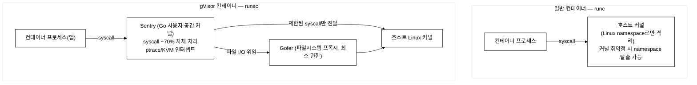
_그림 1. runc와 gVisor(runsc)의 syscall 처리 경로 비교._

```yaml
# 1. RuntimeClass 생성
apiVersion: node.k8s.io/v1
kind: RuntimeClass
metadata:
  name: gvisor                   # Pod에서 참조할 이름
handler: runsc                   # containerd의 런타임 핸들러 이름
                                 # /etc/containerd/config.toml에 정의되어 있어야 함
```

```yaml
# 2. Pod에 RuntimeClass 적용
apiVersion: v1
kind: Pod
metadata:
  name: sandbox-pod
spec:
  runtimeClassName: gvisor       # RuntimeClass 이름 참조
  containers:
  - name: app
    image: nginx:1.25
```

```bash
kubectl apply -f runtimeclass.yaml
kubectl apply -f sandbox-pod.yaml

# 확인
kubectl get runtimeclass
kubectl get pod sandbox-pod -o jsonpath='{.spec.runtimeClassName}'
# gvisor

# gVisor 환경에서는 커널 버전이 다르게 나타남
kubectl exec sandbox-pod -- uname -r
```

검증 기대 출력 (예시-환경/도구따라다름, dev/staging 노드에 gVisor(runsc) 미설치):
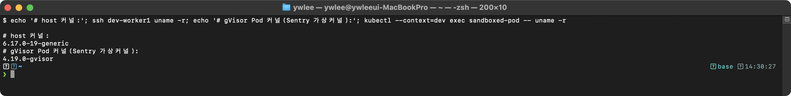

호스트 커널 버전과 다르면 gVisor가 정상 동작하는 것이다. 호스트 커널 버전(예: 6.1.0-xxx)이 나타나면 gVisor가 적용되지 않은 것이다.

```bash
# RuntimeClass 목록 확인
kubectl get runtimeclass
```

기대 출력 (예시-환경/도구따라다름, dev/staging 노드에 gVisor(runsc) 미설치):


```bash
# Pod의 runtimeClassName 확인
kubectl get pod sandbox-pod -o jsonpath='{.spec.runtimeClassName}'
```

기대 출력 (예시-환경/도구따라다름, dev/staging 노드에 gVisor(runsc) 미설치):


**트러블슈팅:** gVisor Pod가 시작되지 않는 경우:
```
증상: Pod가 ContainerCreating 상태에서 진행되지 않는다.
원인: containerd 설정에 runsc 핸들러가 등록되지 않았다.
```

```bash
# 진단: containerd 설정에서 runsc 핸들러 확인
grep -A3 "runsc" /etc/containerd/config.toml
```

기대 출력 (예시-환경/도구따라다름, dev/staging 노드 config.toml에 runsc 핸들러 미등록):


위 설정이 없으면 gVisor RuntimeClass를 사용할 수 없다. 노드에 gVisor(runsc)가 설치되어 있어야 한다.

**채점 기준:**
- [ ] RuntimeClass가 handler: runsc로 올바르게 생성됨 (2점)
- [ ] Pod에 runtimeClassName: gvisor 적용됨 (2점)

</details>

---

### 문제 14. [Supply Chain Security - 6점] Trivy 이미지 스캔

**컨텍스트:** `kubectl config use-context dev`

**문제:**
dev 클러스터의 `scan-ns` 네임스페이스에 다음 4개의 Pod가 있다: `web1`(nginx:1.19), `web2`(nginx:1.25), `cache1`(redis:6), `cache2`(redis:7).

Trivy를 사용하여 각 이미지를 스캔하고, **CRITICAL 취약점**이 있는 이미지를 사용하는 Pod를 삭제하라. 스캔 결과를 `/tmp/trivy-results.txt`에 저장하라.

<details>
<summary>풀이</summary>

**시험 출제 의도:** Trivy를 사용하여 이미지 취약점을 스캔하고, CRITICAL 취약점이 있는 이미지를 식별하여 적절한 조치를 취할 수 있는지 평가한다.

**Trivy 스토리라인 — 왜 Trivy인가:**
- **(등장 배경)** 컨테이너 이미지는 수십~수백 개의 OS 패키지와 언어 라이브러리를 포함한다. 이 중 알려진 CVE(Common Vulnerabilities and Exposures, 공개 취약점 번호 체계)가 있는 버전을 그대로 배포하면 공격자가 알려진 익스플로잇으로 바로 침투할 수 있다.
- **(직전 도구의 한계)** Clair(CoreOS)와 Anchore는 초기 컨테이너 스캐너로, 중앙 DB 서버를 별도로 운영하거나 설정 파일이 복잡해 CI/CD 파이프라인에 통합하기 어려웠다. 스캔 결과가 컨테이너 이미지가 아닌 레이어 단위에만 국한되어 언어 패키지(pip, npm 등)를 놓치는 경우도 많았다.
- **(무엇이 나아졌나)** Trivy는 단일 바이너리(`trivy image <이미지>`)로 실행되며 별도 DB 서버 없이 로컬 캐시에 취약점 DB를 자동 다운로드·업데이트한다. OS 패키지(apt/yum/apk)뿐 아니라 언어 패키지(pip/npm/go mod/maven)도 한 번에 스캔하고, SBOM(Software Bill of Materials, 소프트웨어 구성 목록) 생성도 지원한다.
- **(트레이드오프)** 취약점 DB(Trivy DB)가 최신 상태여야 의미 있는 결과가 나온다. 에어갭(인터넷 단절) 환경에서는 DB를 수동으로 갱신해야 하며, `--ignore-unfixed` 플래그로 패치 버전이 없는 취약점을 걸러야 할 때도 있다.

**공급망 보안 3단계 안에서의 위치 (문제 14~16 묶음 안내):** CKS의 Supply Chain 도메인(20%)은 이미지가 클러스터에 들어오는 시점을 기준으로 세 단계로 방어한다.
- **배포 전 정책 — ImagePolicyWebhook (문제 15)**: 신규 Pod 생성 요청 자체를 admission 단계에서 검사해, 미승인 이미지는 클러스터에 들어오기 전에 차단한다(사전 방어).
- **배포 후 스캔 — Trivy (문제 14)**: 이미 배포되었거나 빌드된 이미지의 알려진 CVE를 사후에 탐지해, 취약한 Pod를 식별·제거한다(사후 탐지).
- **무결성 고정 — Image Digest (문제 16)**: 태그 대신 다이제스트로 이미지를 고정해, 같은 태그가 다른 이미지로 바뀌는 태그 재지정 공격을 막는다.
이 문제(14)는 그중 **사후 탐지**에 해당하며, 사전 방어인 문제 15와 짝을 이룬다. 사전 차단(15)이 못 막은 이미지를 사후 스캔(14)이 잡고, 둘 다 통과한 이미지는 다이제스트 고정(16)으로 변조를 막는 흐름이다.

**Trivy 스캔 흐름:**
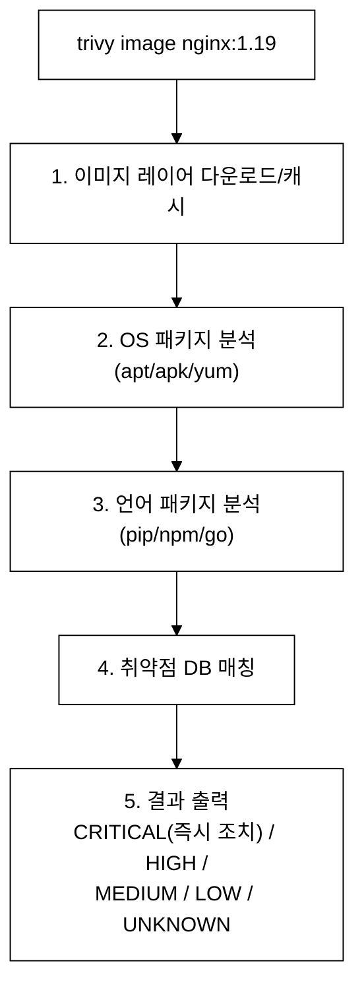
_그림 2. trivy image 스캔 단계와 심각도별 결과 출력._

```bash
kubectl config use-context dev

# 각 이미지 스캔 (CRITICAL만 필터링)
trivy image --severity CRITICAL nginx:1.19 2>/dev/null | tee -a /tmp/trivy-results.txt
trivy image --severity CRITICAL nginx:1.25 2>/dev/null | tee -a /tmp/trivy-results.txt
trivy image --severity CRITICAL redis:6 2>/dev/null | tee -a /tmp/trivy-results.txt
trivy image --severity CRITICAL redis:7 2>/dev/null | tee -a /tmp/trivy-results.txt

# 빠른 스캔 (결과 요약만)
trivy image --severity CRITICAL --exit-code 1 nginx:1.19 2>/dev/null
echo "nginx:1.19 exit code: $?"  # 1 = CRITICAL 존재, 0 = 없음

trivy image --severity CRITICAL --exit-code 1 nginx:1.25 2>/dev/null
echo "nginx:1.25 exit code: $?"

trivy image --severity CRITICAL --exit-code 1 redis:6 2>/dev/null
echo "redis:6 exit code: $?"

trivy image --severity CRITICAL --exit-code 1 redis:7 2>/dev/null
echo "redis:7 exit code: $?"

# CRITICAL 취약점이 있는 Pod 삭제
# (일반적으로 구버전에 더 많은 CRITICAL이 있음)
kubectl delete pod web1 -n scan-ns     # nginx:1.19
kubectl delete pod cache1 -n scan-ns   # redis:6

# 남은 Pod 확인
kubectl get pods -n scan-ns
# web2 (nginx:1.25) - Running
# cache2 (redis:7) - Running
```

> **(미캡처)** 위 스캔 결과(exit code, CRITICAL 개수, 삭제 후 Pod 상태)는 실측 스크린샷으로 교체 예정이다. 코드 블록 안의 주석 출력은 예상 흐름만 안내하며, 실제 결과는 Trivy DB 버전과 이미지 릴리스 시점에 따라 다를 수 있다. 자신의 환경에서 `trivy image --severity CRITICAL nginx:1.19 2>/dev/null` 을 직접 실행해 출력을 비교한다.

**Trivy 주요 옵션:**
```bash
# severity 필터링
trivy image --severity CRITICAL,HIGH <image>

# exit-code로 CI/CD 연동
# Unix 관례에서 exit code 0 = 성공, 0이 아닌 값 = 실패다. CI/CD는 명령의 exit code를 읽어 파이프라인을 중단한다.
trivy image --severity CRITICAL --exit-code 1 <image>
# exit 1 = 해당 severity 취약점 존재 → CI/CD 파이프라인 실패

# 출력 형식
trivy image --format json <image>        # JSON
trivy image --format table <image>       # 테이블 (기본)

# 특정 취약점 무시
trivy image --ignore-unfixed <image>     # 수정 버전이 없는 취약점 무시

# SBOM (Software Bill of Materials) 생성
trivy image --format spdx-json <image>
```

**채점 기준:**
- [ ] Trivy로 4개 이미지를 모두 스캔 (2점)
- [ ] CRITICAL 취약점이 있는 이미지를 올바르게 식별 (2점)
- [ ] 해당 Pod만 삭제 (취약점 없는 Pod는 유지) (1점)
- [ ] 스캔 결과가 /tmp/trivy-results.txt에 저장됨 (1점)

</details>

---

### 문제 15. [Supply Chain Security - 7점] ImagePolicyWebhook 설정

**컨텍스트:** `kubectl config use-context staging`

**문제:**
ImagePolicyWebhook Admission Controller를 활성화하라.
1. `/etc/kubernetes/admission-control/` 디렉토리에 설정 파일을 확인/수정하라
2. `defaultAllow`를 `false`(fail-closed)로 설정하라
3. API Server에 적용하라
4. 적용 후 허용되지 않은 이미지로 Pod 생성 시도하여 거부되는지 확인하라

<details>
<summary>풀이</summary>

**시험 출제 의도:** ImagePolicyWebhook은 CKS에서 가장 어려운 문제 중 하나다. AdmissionConfiguration, webhook 서비스 설정, API Server 매니페스트 수정을 모두 정확히 해야 한다.

> **용어 한 줄 풀이**
> - **Admission Controller(어드미션 컨트롤러)**: 인증·인가를 통과한 API 요청이 etcd에 저장되기 직전, 요청을 검사·수정·거부하는 플러그인 단계다. ImagePolicyWebhook은 그중 하나로, Pod의 이미지를 검사한다.
> - **AdmissionConfiguration**: 어드미션 플러그인에 줄 설정을 담는 파일이다. API Server는 `--admission-control-config-file` 플래그로 이 파일을 읽는다.
> - **webhook(웹훅)**: API Server가 판단을 외부 HTTP 서비스에 위임하는 콜백이다. ImagePolicyWebhook은 이미지 허용 여부 판단을 외부 정책 서버에 물어본다.

**스토리라인 — ImagePolicyWebhook은 왜 등장했나:**
- **(등장 배경)** 공급망 공격, 즉 공개 레지스트리에 올라온 악의적 이미지나 변조된 이미지가 클러스터에 배포되는 위협을 막아야 한다.
- **(직전 기술의 한계)** 과거에는 신뢰 레지스트리 URL을 수동으로 화이트리스트하거나 운영자가 매니페스트를 눈으로 검토했다. 클러스터·팀이 늘면 정책이 흩어지고, 누락·우회가 생긴다.
- **(무엇이 나아졌나)** ImagePolicyWebhook은 이미지 허용 판단을 **외부 webhook 서비스 한 곳으로 중앙화**한다. 모든 Pod 생성 요청이 같은 정책 서버를 거치므로, "신뢰할 수 있는 빌드 파이프라인이 서명한 이미지만 배포" 같은 규칙을 한 곳에서 강제할 수 있다. API Server가 직접 정책 로직을 알 필요 없이 webhook에 위임한다.
- **(트레이드오프)** 정책 서버가 단일 의존점이 된다. webhook이 다운되면 `defaultAllow` 설정에 따라 모든 Pod 배포가 거부(`false`=fail-closed)되거나 무방비로 허용(`true`=fail-open)된다. 가용성과 보안이 정면으로 충돌한다.

**ImagePolicyWebhook 동작 원리:**
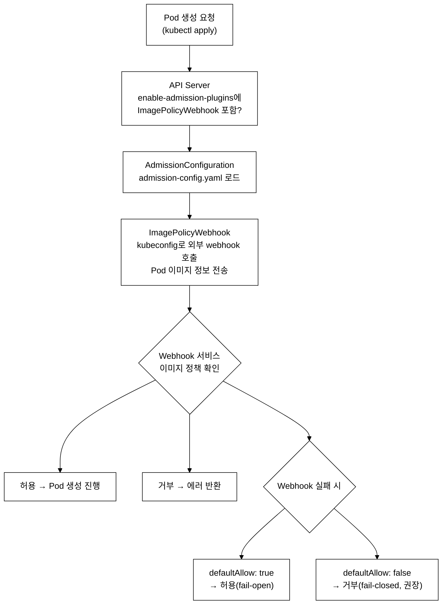
_그림 3. ImagePolicyWebhook 설정 로드부터 웹훅 검증과 실패 처리까지._

**핵심 함정 (여기서 점수를 잃는다):**
- **kubeconfig의 연결 방향**: `imagepolicy-kubeconfig.yaml`은 "API Server가 webhook 서버에 접속할 때" 쓰는 클라이언트 설정이다. 즉 API Server가 클라이언트, webhook이 서버다. `clusters[].cluster.server`는 webhook의 주소이고, `users[].user`의 client-certificate/key는 API Server가 자신을 webhook에게 증명하는 인증서다. CA(`certificate-authority`)는 webhook의 서버 인증서를 API Server가 검증하는 데 쓴다. 방향을 거꾸로 이해하면 인증서 배치를 틀린다.
- **defaultAllow의 의미**: webhook 서비스가 응답하지 못하면(다운·타임아웃) API Server는 판단을 못 내린다. 이때 `defaultAllow: true`면 통과시키고(fail-open), `false`면 거부한다(fail-closed). 보안 관점에서는 `false`가 정답이다 — webhook이 죽었다고 미검증 이미지를 무조건 허용하면 방어가 사라지기 때문이다.
- **함정의 결과(트레이드오프)**: `defaultAllow: false`로 두면, webhook 서비스가 실제로 떠 있어야만 Pod를 만들 수 있다. webhook이 없는 상태에서 `false`를 적용하면 정상 이미지를 포함해 **모든 Pod 생성이 거부**된다(가용성 희생). 시험에서 문제가 "fail-closed로 설정하라"고 명시하지 않았다면 webhook 가동 여부를 먼저 확인해야 한다.

**먼저 webhook 서비스가 어디에 있는지 확인한다.** kubeconfig의 `server` URL(FQDN·포트)은 임의로 지어내는 값이 아니라 실제 배포된 webhook Service에서 와야 한다.
```bash
# 클러스터 전체에서 image-policy webhook 서비스 조회
kubectl get svc -A | grep -i image-policy
# 또는 알려진 네임스페이스로 직접 조회
kubectl get svc -n admission image-policy-webhook
```

기대 출력 (예시-환경따라다름, staging에 webhook 서비스 미배포 시 "No resources found"):
> **예시(참조) — ImagePolicyWebhook:** admission webhook 으로 비허용 레지스트리 이미지를 거부한다(`defaultAllow: false`). 미구성 환경이라 미실측 — 구성 시 비허용 이미지 Pod 가 'image policy webhook backend denied' 로 거부된다.

`kubectl get svc -A | grep -i image-policy` 출력의 각 열이 kubeconfig `server` URL을 결정한다. 출력의 열 구조(스키마)는 다음과 같다. 실제 값은 환경마다 다르며, 실측 화면은 §4① 기준의 터미널 캡처로 확인한다(미배포 시 `No resources found`).

| NAMESPACE | NAME | TYPE | CLUSTER-IP | EXTERNAL-IP | PORT(S) | AGE |
|:--|:--|:--|:--|:--|:--|:--|
| default | image-policy-webhook | ClusterIP | (환경별 ClusterIP) | `<none>` | 443/TCP | (생성 후 경과 시간) |

- `NAMESPACE` 열 → FQDN의 두 번째 세그먼트: `image-policy-webhook.**default**.svc`
- `NAME` 열 → FQDN의 첫 번째 세그먼트: `**image-policy-webhook**.default.svc`
- `PORT(S)` 열의 포트 번호 → URL 끝의 포트: `https://...svc:**443**/image-policy`

이를 조합하면 kubeconfig의 `server` 값은 `https://image-policy-webhook.default.svc:443/image-policy`가 된다. 경로(`/image-policy`)는 webhook 서버 소프트웨어의 엔드포인트 설계에 따라 다르므로 문제 설명 또는 기존 설정 파일에서 확인한다. 경로가 명시되지 않은 경우 단순히 `https://<NAME>.<NAMESPACE>.svc:<PORT>`를 사용한다.

조회 결과가 없으면 `kubectl get validatingwebhookconfigurations`나 기존 admission 설정 파일을 `describe`해 URL을 역추적한다.

```bash
ssh staging-master  # ~/.ssh/config 등록 별칭, ProxyCommand가 tart ip로 IP를 자동 조회한다

# 1. 설정 파일 확인
ls -la /etc/kubernetes/admission-control/
# admission-config.yaml
# imagepolicy-kubeconfig.yaml
```

**admission-config.yaml (확인/수정):**
```yaml
# /etc/kubernetes/admission-control/admission-config.yaml
apiVersion: apiserver.config.k8s.io/v1
kind: AdmissionConfiguration
plugins:
- name: ImagePolicyWebhook
  configuration:
    imagePolicy:
      kubeConfigFile: /etc/kubernetes/admission-control/imagepolicy-kubeconfig.yaml
      allowTTL: 50               # 허용 결과 캐시 시간(초)
      denyTTL: 50                # 거부 결과 캐시 시간(초)
      retryBackoff: 500          # 재시도 간격(밀리초)
      defaultAllow: false        # ← 반드시 false (fail-closed)!
```

**imagepolicy-kubeconfig.yaml (확인):**
```yaml
# /etc/kubernetes/admission-control/imagepolicy-kubeconfig.yaml
apiVersion: v1
kind: Config
clusters:
- cluster:
    certificate-authority: /etc/kubernetes/admission-control/webhook-ca.crt
    server: https://image-policy-webhook.default.svc:443/image-policy
  name: image-policy-webhook
contexts:
- context:
    cluster: image-policy-webhook
    user: api-server
  name: image-policy-webhook
current-context: image-policy-webhook
users:
- name: api-server
  user:
    client-certificate: /etc/kubernetes/admission-control/api-server-client.crt
    client-key: /etc/kubernetes/admission-control/api-server-client.key
```

```bash
# 2. API Server 매니페스트 수정
cp /etc/kubernetes/manifests/kube-apiserver.yaml /tmp/kube-apiserver.yaml.bak
vi /etc/kubernetes/manifests/kube-apiserver.yaml
```

**추가/수정할 내용:**
```yaml
spec:
  containers:
  - command:
    - kube-apiserver
    # ... 기존 플래그 ...
    - --enable-admission-plugins=NodeRestriction,ImagePolicyWebhook
    - --admission-control-config-file=/etc/kubernetes/admission-control/admission-config.yaml
    volumeMounts:
    # ... 기존 mounts ...
    - name: admission-control
      mountPath: /etc/kubernetes/admission-control/
      readOnly: true
  volumes:
  # ... 기존 volumes ...
  - name: admission-control
    hostPath:
      path: /etc/kubernetes/admission-control/
      type: DirectoryOrCreate
```

```bash
# 3. API Server 재시작 대기
watch crictl ps | grep kube-apiserver
kubectl get nodes

# 4. 검증: 허용되지 않은 이미지로 Pod 생성 시도
kubectl run test-image --image=evil-registry.com/malware:latest
```

검증 기대 출력 (예시-환경따라다름, ImagePolicyWebhook은 API Server 매니페스트 변경이라 staging에 미적용):
> **예시(참조) — ImagePolicyWebhook:** admission webhook 으로 비허용 레지스트리 이미지를 거부한다(`defaultAllow: false`). 미구성 환경이라 미실측 — 구성 시 비허용 이미지 Pod 가 'image policy webhook backend denied' 로 거부된다.

```bash
# API Server의 admission plugin 확인
kubectl get pod kube-apiserver-staging-master -n kube-system -o yaml | grep enable-admission-plugins
```

기대 출력 (예시-환경따라다름, staging에 ImagePolicyWebhook 미적용):
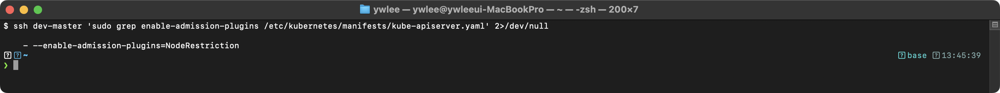

```bash
# defaultAllow 설정 확인
grep "defaultAllow" /etc/kubernetes/admission-control/admission-config.yaml
```

기대 출력 (예시-환경따라다름, staging에 admission-control 설정 미생성):
> **예시(참조) — ImagePolicyWebhook:** admission webhook 으로 비허용 레지스트리 이미지를 거부한다(`defaultAllow: false`). 미구성 환경이라 미실측 — 구성 시 비허용 이미지 Pod 가 'image policy webhook backend denied' 로 거부된다.

**트러블슈팅:** ImagePolicyWebhook 적용 후 API Server 장애 시:
```
1. 백업에서 즉시 복원한다:
   cp /tmp/kube-apiserver.yaml.bak /etc/kubernetes/manifests/kube-apiserver.yaml
2. 원인 파악: admission-config.yaml 경로가 올바른지, volume mount가 정확한지,
   kubeconfig의 server URL이 접근 가능한지 확인한다.
3. webhook 서비스가 없는 상태에서 defaultAllow=false를 설정하면
   모든 Pod 생성이 거부된다. 이 경우 defaultAllow=true로 임시 변경한다.
```

**채점 기준:**
- [ ] ImagePolicyWebhook이 enable-admission-plugins에 포함 (1.5점)
- [ ] admission-control-config-file 설정됨 (1점)
- [ ] defaultAllow: false (fail-closed) (1.5점)
- [ ] volume/volumeMount 올바름 (1.5점)
- [ ] API server 정상 동작 (1.5점)

</details>

---

### 문제 16. [Supply Chain Security - 4점] 이미지 다이제스트 강제

**컨텍스트:** `kubectl config use-context prod`

**문제:**
`production` 네임스페이스의 Deployment `web-app`이 `nginx:1.25` 태그를 사용하고 있다. 이를 이미지 다이제스트(@sha256:...)로 변경하라. 실제 다이제스트를 조회하여 적용하라.

<details>
<summary>풀이</summary>

**시험 출제 의도:** 태그는 변경될 수 있어 동일한 태그가 다른 이미지를 가리킬 수 있다. 다이제스트를 사용하면 이미지를 고정하여 supply chain 공격을 방지할 수 있다.

**태그 vs 다이제스트:**
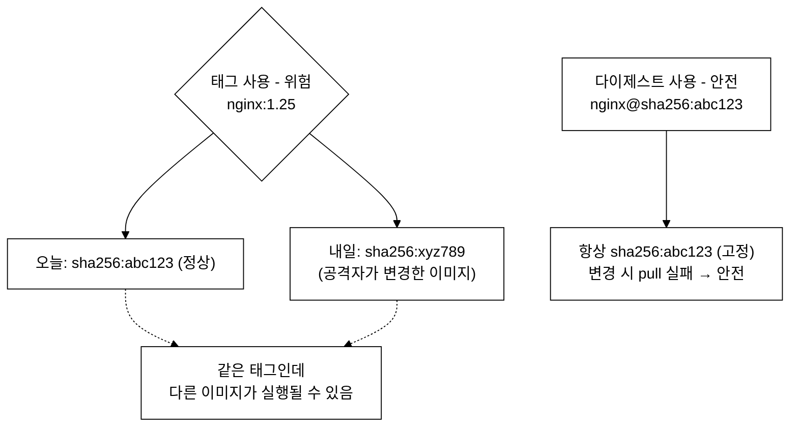
_그림 4. 태그(가변)와 다이제스트(고정) 참조 방식의 무결성 차이._

**태그 재지정이 실제로 어떻게 동작하나:** 다이제스트(@sha256:...)는 이미지 내용(레이어)을 SHA-256 해시한 값이라 내용이 바뀌면 해시도 바뀐다. 반면 태그(`nginx:1.25`)는 레지스트리 안에서 "특정 다이제스트를 가리키는 이름표"일 뿐이라 언제든 다른 다이제스트로 다시 가리킬 수 있다. 공격 시나리오는 다음과 같다.
- 오늘: 노드 A가 `nginx:1.25`를 pull → 다이제스트 `sha256:abc123`(정상 이미지)을 받아 실행 중.
- 내일: 공격자가 레지스트리의 `nginx:1.25` 태그를 악성 이미지 `sha256:xyz789`로 덮어쓴다(push). 태그 이름은 그대로지만 이제 `1.25`는 `xyz789`를 가리킨다. 기존 정상 이미지는 어떤 태그도 가리키지 않는 orphan(고아)이 된다.
- 모레: 새로 합류한 노드 B가 같은 `nginx:1.25`를 pull → 이번엔 `xyz789`(악성 코드)를 받는다.
- 결과: 같은 태그 `nginx:1.25`인데 노드마다 다른 이미지가 돈다. 매니페스트를 `nginx@sha256:abc123`처럼 다이제스트로 고정하면, 내용이 바뀐 순간 해시가 달라져 pull이 실패하므로 변조가 즉시 드러난다.

CKS 시험 환경에는 crane과 skopeo가 설치되어 있지 않은 경우가 많다. `crictl images`가 가장 안전한 1순위 방법이며, 이미 노드에 pull된 이미지라면 추가 설치 없이 바로 다이제스트를 확인할 수 있다. 방법 선택 순서: crictl > skopeo > crane.

```bash
kubectl config use-context prod

# 1. 현재 이미지 확인
kubectl get deploy web-app -n production -o jsonpath='{.spec.template.spec.containers[0].image}'
# nginx:1.25

# 2. 이미지 다이제스트 조회
# 방법 1 (권장): 이미 pull된 이미지에서 확인 — 시험 환경에 별도 설치 불필요
crictl images | grep nginx
# docker.io/library/nginx   1.25   sha256:6db391d1c0cfb...

# 방법 2: skopeo로 조회 (설치 여부 먼저 확인: which skopeo)
skopeo inspect docker://docker.io/library/nginx:1.25 | jq -r '.Digest'
# sha256:6db391d1c0cfb...

# 방법 3: crane으로 조회 (설치 여부 먼저 확인: which crane)
crane digest nginx:1.25
# sha256:6db391d1c0cfb...

# 3. Deployment 이미지를 다이제스트로 변경
kubectl set image deployment/web-app \
  app=nginx@sha256:6db391d1c0cfb30588ba0b5698e6b0e5ddc6fe47fc66e07daad3f2fbb2e2f3e0 \
  -n production

# 또는 kubectl edit 사용
kubectl edit deploy web-app -n production
# image: nginx@sha256:6db391d1c0cfb30588ba0b5698e6b0e5ddc6fe47fc66e07daad3f2fbb2e2f3e0

# 4. 검증
kubectl get deploy web-app -n production -o jsonpath='{.spec.template.spec.containers[0].image}'
# nginx@sha256:6db391d1c0cfb...
```

> **(미캡처)** crane/crictl 다이제스트 조회 출력과 `kubectl set image` 적용 후 상태는 실측 스크린샷으로 교체 예정이다. 코드 블록 안의 `# sha256:...` 주석은 형식을 보여주는 예시이며, 실제 다이제스트 값은 이미지 릴리스마다 다르다. 시험에서는 반드시 실제로 조회한 값을 `kubectl set image`에 넣어야 채점이 통과된다.

**채점 기준:**
- [ ] 이미지 다이제스트를 올바르게 조회 (1점)
- [ ] Deployment 이미지가 다이제스트로 변경됨 (2점)
- [ ] Pod가 정상 동작 (1점)

</details>

---

### 문제 17. [Supply Chain Security - 3점] Dockerfile 보안 개선

**컨텍스트:** 해당 없음 (로컬 작업)

**문제:**
아래 Dockerfile의 보안 문제를 찾아 수정하라. 수정된 Dockerfile을 `/tmp/Dockerfile-secure`로 저장하라.

```dockerfile
FROM ubuntu:20.04
RUN apt-get update && apt-get install -y python3 python3-pip curl wget netcat
COPY . /app
WORKDIR /app
RUN pip3 install -r requirements.txt
EXPOSE 8080
CMD ["python3", "app.py"]
```

<details>
<summary>풀이</summary>

**시험 출제 의도:** Dockerfile의 보안 취약점을 식별하고 개선할 수 있는지 평가한다.

**보안 문제 분석:**
```
문제 1: ubuntu 대신 경량 이미지 사용해야 함 → distroless/alpine
문제 2: 불필요한 패키지 설치 (curl, wget, netcat) → 공격 도구
문제 3: root로 실행 → 비root 사용자 필요
문제 4: multi-stage build 미사용 → 빌드 도구가 최종 이미지에 포함
문제 5: COPY . → .dockerignore 없이 모든 파일 복사 (민감 파일 포함 가능)
```

```dockerfile
# /tmp/Dockerfile-secure

# Stage 1: 빌드 단계
FROM python:3.11-slim AS builder
WORKDIR /app
COPY requirements.txt .
RUN pip3 install --no-cache-dir --user -r requirements.txt

# Stage 2: 실행 단계 (경량 이미지)
FROM python:3.11-slim

# 비root 사용자 생성
RUN groupadd -r appgroup && useradd -r -g appgroup -d /app -s /sbin/nologin appuser

# 빌드 단계에서 패키지만 복사
COPY --from=builder /root/.local /home/appuser/.local

# 애플리케이션 코드만 복사
WORKDIR /app
COPY --chown=appuser:appgroup app.py .

# 비root 사용자로 전환
USER appuser

# PATH 설정
ENV PATH=/home/appuser/.local/bin:$PATH

EXPOSE 8080

# 헬스체크 추가
HEALTHCHECK --interval=30s --timeout=3s \
  CMD python3 -c "import urllib.request; urllib.request.urlopen('http://localhost:8080/health')" || exit 1

CMD ["python3", "app.py"]
```

**개선 요약:**
| 항목 | 원본 | 개선 |
|------|------|------|
| 베이스 이미지 | ubuntu:20.04 | python:3.11-slim |
| 불필요 패키지 | curl, wget, netcat | 제거 |
| 실행 사용자 | root (기본값) | appuser (비root) |
| 빌드 방식 | 단일 스테이지 | multi-stage build |
| 파일 복사 | COPY . (전체) | 필요한 파일만 |
| 캐시 | 있음 | --no-cache-dir |

**검증 — 실제로 개선되었는지 확인하기:** Dockerfile은 파일만 저장하면 끝이 아니라, 빌드해서 스캔해 보면 개선 효과가 드러난다. 원본과 개선본을 각각 빌드한 뒤 Trivy(문제 14에서 쓴 도구)로 스캔해 CRITICAL 개수를 비교한다.
```bash
# 원본 Dockerfile 빌드 후 스캔
docker build -t myapp:insecure -f Dockerfile .
trivy image --severity CRITICAL,HIGH myapp:insecure

# 개선본 빌드 후 스캔
docker build -t myapp:secure -f /tmp/Dockerfile-secure .
trivy image --severity CRITICAL,HIGH myapp:secure
# 경량 베이스(python:3.11-slim)와 패키지 제거로 CRITICAL/HIGH 개수가 줄어든다
```
다만 시험 환경에서는 실제 빌드까지 요구하지 않는 경우가 많다. 채점은 Dockerfile **문법(RUN·USER·HEALTHCHECK 등 지시어가 올바른가)** 과 아래 보안 체크리스트 항목 충족 여부를 기준으로 한다. 이 문제는 `docker build`/`kubectl apply`로 배포까지 가는 것이 아니라 "보안 강화된 Dockerfile을 작성해 파일로 저장"하는 파일시스템 작업임에 유의한다.

**채점 기준:**
- [ ] 비root 사용자로 실행 (USER 지시어) (1점)
- [ ] 불필요한 패키지 제거 (0.5점)
- [ ] 경량 베이스 이미지 사용 또는 multi-stage build (1점)
- [ ] 파일이 /tmp/Dockerfile-secure에 저장됨 (0.5점)

</details>

---

### 문제 18. [Runtime Security - 7점] Falco 커스텀 룰 작성

**컨텍스트:** `kubectl config use-context dev`

**문제:**
`/etc/falco/falco_rules.local.yaml`에 다음 세 가지 Falco 룰을 추가하라:

1. `Detect Shell in Container`: 컨테이너에서 셸(bash, sh, zsh)이 실행되면 WARNING
2. `Detect Sensitive File Read`: 컨테이너에서 `/etc/shadow`를 읽으면 CRITICAL
3. `Detect Package Management`: 컨테이너에서 패키지 관리자(apt, yum, apk)가 실행되면 ERROR

<details>
<summary>풀이</summary>

**시험 출제 의도:** Falco 룰의 구조(condition, output, priority)를 이해하고, 다양한 탐지 시나리오에 맞는 룰을 작성할 수 있는지 평가한다.

**스토리라인 — Falco는 왜 등장했나 (그리고 Audit Log와 무엇이 다른가):**
- **(등장 배경)** 컨테이너가 일단 떠서 돌아가는 동안, 그 안에서 공격자가 셸을 띄우거나 `/etc/shadow`를 읽거나 패키지를 설치하는 등의 행위를 실시간으로 잡아야 한다. 이것이 런타임 보안이다.
- **(직전 기술의 한계)** Kubernetes Audit Log(문제 19)는 **API Server를 거치는 요청만** 기록한다. 즉 누가 어떤 K8s 리소스(Pod, Secret)에 무슨 verb를 호출했는지는 남지만, **컨테이너 안에서 일어난 일은 모른다**. 예를 들어 Pod 내부에서 `/bin/sh`를 실행하거나 파일을 읽는 행위는 kubelet/API Server를 거치지 않으므로 Audit Log에 전혀 안 남는다.
- **(무엇이 나아졌나)** Falco는 노드의 **syscall(시스템 콜) 수준**을 본다. 커널의 syscall 흐름을 eBPF(커널 안에서 안전하게 동작하는 샌드박스 프로그램) 또는 커널 모듈로 가로채, 프로세스 생성·파일 접근·네트워크 연결을 실시간 감시한다. 따라서 API Server를 우회한 컨테이너 내부 행위까지 명령행 단위로 포착한다.
- **(트레이드오프)** syscall을 전부 감시하므로 룰이 광범위하면 노이즈·성능 부담이 생긴다. 그래서 condition을 정교하게 좁히고(자주 걸리는 필터를 앞에), 기본 ruleset 대신 `falco_rules.local.yaml`에만 커스텀 룰을 둔다.

| 비교 | Falco | Kubernetes Audit Log |
|------|-------|----------------------|
| 관측 계층 | syscall 수준 (프로세스·파일·네트워크) | API 수준 (리소스 CRUD) |
| 잡는 것 | 컨테이너 안 실제 행위 (셸 실행, 파일 읽기) | API 요청 (Pod 생성, Secret 접근) |
| 예: `kubectl exec pod -- sh` | `/bin/sh` 프로세스 생성을 탐지, cmdline까지 포착 | `verb=create, resource=pods/exec` 이벤트로만 남음 |
| 컨테이너 내부 `cat /etc/shadow` | 탐지함 (open_read 룰) | 안 남음 (API를 안 거침) |

즉 Falco와 Audit Log는 경쟁이 아니라 **계층이 다른 보완 관계**다. Audit는 "누가 API로 무엇을 요청했나", Falco는 "컨테이너 안에서 실제로 무슨 짓을 했나"를 본다.

**Falco 룰 구조:**
```
rule: 룰 이름                    ← 고유한 이름
desc: 설명                       ← 룰의 목적
condition: 조건식                 ← 언제 트리거되는가 (Sysdig 필터 문법)
output: 출력 포맷                ← 알림 메시지에 포함할 정보
priority: 우선순위               ← EMERGENCY/ALERT/CRITICAL/ERROR/WARNING/NOTICE/INFO/DEBUG
tags: [태그 목록]                ← 분류용 태그
```

**주요 Falco 매크로/필터:**
```
spawned_process  = 새 프로세스가 생성됨 (evt.type in (execve, execveat))
container        = 컨테이너 환경에서 실행됨 (container.id != host)
open_read        = 파일이 읽기 모드로 열림
proc.name        = 프로세스 이름
fd.name          = 파일 디스크립터 이름 (경로)
user.name        = 사용자 이름
container.name   = 컨테이너 이름
container.image.repository = 이미지 리포지토리
k8s.pod.name     = Pod 이름
k8s.ns.name      = 네임스페이스 이름
```

```yaml
# /etc/falco/falco_rules.local.yaml

# 룰 1: 컨테이너에서 셸 실행 탐지
- rule: Detect Shell in Container
  desc: 컨테이너에서 셸(bash, sh, zsh)이 실행되면 탐지한다
  condition: >
    spawned_process and
    container and
    proc.name in (bash, sh, zsh)
  output: >
    Shell spawned in container
    (user=%user.name
    container=%container.name
    shell=%proc.name
    parent=%proc.pname
    cmdline=%proc.cmdline
    image=%container.image.repository
    pod=%k8s.pod.name
    ns=%k8s.ns.name)
  priority: WARNING
  tags: [container, shell, mitre_execution]

# 룰 2: 민감 파일 읽기 탐지
- rule: Detect Sensitive File Read
  desc: 컨테이너에서 /etc/shadow 파일을 읽으면 탐지한다
  condition: >
    open_read and
    container and
    fd.name = /etc/shadow
  output: >
    Sensitive file read in container
    (user=%user.name
    file=%fd.name
    container=%container.name
    image=%container.image.repository
    pod=%k8s.pod.name
    ns=%k8s.ns.name)
  priority: CRITICAL
  tags: [filesystem, sensitive_file, mitre_credential_access]

# 룰 3: 패키지 관리자 실행 탐지
- rule: Detect Package Management
  desc: 컨테이너에서 패키지 관리자가 실행되면 탐지한다
  condition: >
    spawned_process and
    container and
    proc.name in (apt, apt-get, yum, dnf, apk, pip, pip3, npm)
  output: >
    Package management tool run in container
    (user=%user.name
    command=%proc.cmdline
    container=%container.name
    image=%container.image.repository
    pod=%k8s.pod.name
    ns=%k8s.ns.name)
  priority: ERROR
  tags: [container, package_management, mitre_persistence]
```

```bash
# SSH 접속 (Falco가 설치된 노드)
ssh dev-worker  # ~/.ssh/config 등록 별칭

# 파일 작성
sudo vi /etc/falco/falco_rules.local.yaml
# 위 내용 붙여넣기

# Falco 재시작
sudo systemctl restart falco

# Falco 상태 확인
sudo systemctl status falco
# Active: active (running)

# === 검증 ===
# 다른 터미널에서:

# 테스트 1: 셸 실행
kubectl exec -n demo deploy/nginx -- /bin/sh -c "echo test"

# 테스트 2: /etc/shadow 읽기
kubectl exec -n demo deploy/nginx -- cat /etc/shadow 2>&1

# 테스트 3: 패키지 관리자 실행
kubectl exec -n demo deploy/nginx -- apt-get update 2>&1

# Falco 로그 확인
sudo journalctl -u falco --since "2 minutes ago" | grep -E "Shell|Sensitive|Package"
# WARNING Shell spawned in container (user=root container=nginx shell=sh ...)
# CRITICAL Sensitive file read in container (user=root file=/etc/shadow ...)
# ERROR Package management tool run in container (user=root command=apt-get update ...)
```

**Falco 룰 작성 시 주의사항:**
```
1. condition의 필터 순서: 빈번한 조건을 앞에 배치 (성능)
   좋은 예: spawned_process and container and proc.name in (...)
   나쁜 예: proc.name in (...) and spawned_process and container

2. output에 %k8s.pod.name, %k8s.ns.name 포함 (K8s 환경 식별)

3. 기본 ruleset 파일(falco_rules.yaml) 수정 금지!
   → 항상 falco_rules.local.yaml에 작성

4. 기존 룰 오버라이드 시 append: true 사용
   - rule: <existing rule name>
     append: true
     condition: and not proc.name = my-legitimate-process
```

**채점 기준:**
- [ ] 셸 탐지 룰: condition이 올바른가 (spawned_process, container, proc.name) (2점)
- [ ] /etc/shadow 읽기 탐지: condition이 올바른가 (open_read, fd.name) (2점)
- [ ] 패키지 관리자 탐지: condition이 올바른가 (2점)
- [ ] 각 룰의 priority가 요구사항과 일치 (WARNING, CRITICAL, ERROR) (0.5점)
- [ ] `falco_rules.local.yaml`에 작성 (0.5점)

</details>

---

### 문제 19. [Runtime Security - 5점] Audit Log 분석

**컨텍스트:** `kubectl config use-context platform`

**문제:**
platform 클러스터의 Audit Log(`/var/log/kubernetes/audit/audit.log`)를 분석하여:
1. `kube-system` 네임스페이스에서 **삭제**된 리소스를 찾아라
2. **Secret에 접근**한 비시스템 사용자를 식별하라
3. **403 Forbidden** 응답을 받은 요청을 찾아라

결과를 `/tmp/audit-analysis.txt`에 저장하라.

<details>
<summary>풀이</summary>

**시험 출제 의도:** Audit Log를 jq로 필터링하여 보안 이벤트를 분석할 수 있는지 평가한다. 인시던트 대응의 첫 단계는 증거 수집이며, Audit Log가 핵심 증거 소스이다.

**jq와 audit.log 등장 배경:**
- **(audit.log가 JSON Lines 형식인 이유)** Kubernetes Audit Log는 각 API 요청 하나를 독립적인 JSON 객체 한 줄로 기록하는 JSON Lines(NDJSON) 형식이다. 행 단위로 스트리밍 처리할 수 있고, 한 이벤트가 파싱 실패해도 나머지 줄에 영향이 없으며, grep이나 tail -f로 실시간 모니터링이 가능하다. 단일 거대 JSON 배열로 쓰면 파일이 깨질 때 전체가 무효화되는 문제가 생기므로 JSON Lines가 로그 형식의 표준으로 자리 잡았다.
- **(jq의 역할)** jq는 JSON 스트림을 명령행에서 필터링·변환하는 도구다. `select(.verb == "delete")`처럼 조건식으로 원하는 이벤트만 추출하고, `"\(.user.username) \(.verb)"`처럼 필드를 조합해 사람이 읽기 좋은 출력으로 바꾼다. grep은 문자열 단위만 보지만 jq는 JSON 구조(중첩 필드·배열)를 이해하므로, 필드 값을 정확히 비교하거나 여러 조건을 AND/OR로 조합할 수 있다. 대용량 audit.log를 실시간으로 파이프(`cat audit.log | jq ...`)로 처리하기 때문에 메모리 사용도 적다.

**Audit Log 구조:**
```json
{
  "kind": "Event",
  "apiVersion": "audit.k8s.io/v1",
  "level": "Metadata",              // 감사 레벨
  "stage": "ResponseComplete",      // 단계
  "requestReceivedTimestamp": "...", // 요청 시간
  "verb": "delete",                 // 동작 (get, list, create, update, delete, watch)
  "user": {
    "username": "admin",            // 요청자
    "groups": ["system:masters"]
  },
  "objectRef": {
    "resource": "pods",             // 리소스 종류
    "namespace": "kube-system",     // 네임스페이스
    "name": "coredns-xxx"           // 리소스 이름
  },
  "responseStatus": {
    "code": 200                     // HTTP 응답 코드
  }
}
```

```bash
ssh platform-master  # ~/.ssh/config 등록 별칭

# === 1. kube-system에서 삭제된 리소스 ===
cat /var/log/kubernetes/audit/audit.log | \
  jq -r 'select(
    .verb == "delete" and
    .objectRef.namespace == "kube-system"
  ) | "\(.requestReceivedTimestamp) | \(.user.username) deleted \(.objectRef.resource)/\(.objectRef.name)"' \
  > /tmp/audit-analysis.txt

echo "---" >> /tmp/audit-analysis.txt

# === 2. Secret에 접근한 비시스템 사용자 ===
cat /var/log/kubernetes/audit/audit.log | \
  jq -r 'select(
    .objectRef.resource == "secrets" and
    (.user.username | startswith("system:") | not)
  ) | "\(.requestReceivedTimestamp) | \(.user.username) \(.verb) secret/\(.objectRef.name) in \(.objectRef.namespace)"' \
  >> /tmp/audit-analysis.txt

echo "---" >> /tmp/audit-analysis.txt

# === 3. 403 Forbidden 응답 ===
cat /var/log/kubernetes/audit/audit.log | \
  jq -r 'select(
    .responseStatus.code == 403
  ) | "\(.requestReceivedTimestamp) | \(.user.username) got 403 on \(.verb) \(.objectRef.resource)/\(.objectRef.name)"' \
  >> /tmp/audit-analysis.txt

# 결과 확인
cat /tmp/audit-analysis.txt
```

> **(미캡처)** 각 jq 필터링 결과(삭제 이벤트 목록, Secret 접근 사용자, 403 목록)는 실측 스크린샷으로 교체 예정이다. platform 클러스터에 실제 audit.log가 있는 환경에서 위 명령을 실행하면 각 줄에 타임스탬프·사용자명·동작이 출력된다. 결과가 비어 있다면 audit.log에 해당 이벤트가 없거나 audit policy가 해당 level을 기록하지 않는 것이다(day04 Audit Policy 설정 확인).

**자주 사용하는 jq 필터 패턴:**

> **용어 한 줄 풀이 — jq `IN()` 함수**: `IN(값1, 값2, ...)` 는 파이프로 받은 값이 지정한 목록 중 하나와 일치하면 `true`를 반환하는 함수다. 예를 들어 `.verb | IN("create", "delete")` 는 verb 필드가 "create" 또는 "delete"인 경우에 해당하며, `select(.verb == "create") or select(.verb == "delete")` 를 한 줄로 축약한 것이다. `==` 비교를 여러 번 반복하는 것보다 간결하고, 목록이 길어질수록 가독성 차이가 커진다.

```bash
# 특정 사용자의 모든 활동
jq 'select(.user.username == "suspicious-user")'

# 특정 시간 이후 이벤트
jq 'select(.requestReceivedTimestamp > "2024-01-01T00:00:00Z")'

# create + delete만 (변경 작업)
# IN()은 .verb가 괄호 안 값 중 하나와 일치하면 true를 반환한다
jq 'select(.verb | IN("create", "delete", "update", "patch"))'

# 특정 네임스페이스의 모든 이벤트
jq 'select(.objectRef.namespace == "production")'

# 실패한 요청 (4xx, 5xx)
jq 'select(.responseStatus.code >= 400)'
```

**채점 기준:**
- [ ] kube-system 삭제 이벤트를 올바르게 필터링 (2점)
- [ ] 비시스템 사용자의 Secret 접근을 식별 (1.5점)
- [ ] 403 Forbidden 응답 필터링 (1점)
- [ ] 결과가 파일에 저장됨 (0.5점)

</details>

---

### 문제 20. [Runtime Security - 6점] 인시던트 대응

**컨텍스트:** `kubectl config use-context prod`

**문제:**
`production` 네임스페이스의 `compromised-pod` Pod가 침해된 것으로 의심된다.
1. 해당 Pod의 프로세스 목록과 네트워크 연결을 수집하여 `/tmp/incident-evidence.txt`에 저장하라
2. 해당 Pod를 즉시 격리하라 (NetworkPolicy로 모든 트래픽 차단)
3. Pod를 삭제하지 말고 격리 상태로 유지하라 (포렌식 분석용)

<details>
<summary>풀이</summary>

**시험 출제 의도:** 인시던트 대응의 기본 절차(증거 수집 → 격리 → 분석)를 실제로 수행할 수 있는지 평가한다. Pod를 바로 삭제하면 증거가 사라지므로, 격리 후 증거를 보존하는 것이 중요하다.

**왜 Pod를 먼저 삭제하면 안 되나 — 증거 보존의 원리:**
- **(배경)** 침해를 발견하면 즉시 죽이고 싶은 충동이 든다. 하지만 Pod를 삭제하면 컨테이너 프로세스의 **메모리·열린 파일 디스크립터·환경 변수·실행 중 명령행**이 전부 함께 사라진다. 공격자가 어디서 들어와 무엇을 했는지 추적할 단서가 소멸한다.
- **(직전 방식의 한계)** 전통적인 서버 포렌식은 디스크 이미지를 통째로 백업해 사후 복구할 수 있었다. 그러나 컨테이너 파일시스템은 copy-on-write 레이어라 컨테이너가 사라지면 쓰기 레이어와 런타임 상태를 되살리기 어렵다. 디스크 백업만으로는 메모리 상의 공격 흔적을 못 잡는다.
- **(무엇이 나아졌나)** 정답은 "삭제" 대신 "격리"다. NetworkPolicy로 트래픽을 끊어 공격자의 추가 활동(횡적 이동·외부 통신)을 차단하면서도 Pod는 Running으로 유지해 증거를 살려둔다. 그동안 ps/netstat/env로 런타임 상태를 떠내고 Audit·Falco 로그와 대조한다.
- **(트레이드오프)** 격리된 Pod는 자원을 계속 점유한다. 그래서 보통 증거 수집·분석에 필요한 제한 시간(예: 1시간)을 정하고, 그 후 강제 삭제·재배포로 넘어간다. 보존 가치와 자원·운영 비용의 균형이다.

**인시던트 대응 흐름:**
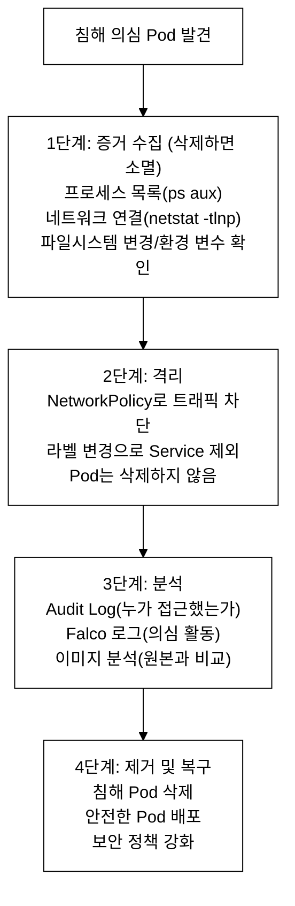
_그림 5. 침해 의심 Pod 대응 절차(증거 수집 → 격리 → 분석 → 제거·복구)._

```bash
kubectl config use-context prod

# === 1단계: 증거 수집 ===

# Pod 라벨 확인 (격리에 사용)
kubectl get pod compromised-pod -n production --show-labels > /tmp/incident-evidence.txt

echo "=== Process List ===" >> /tmp/incident-evidence.txt
kubectl exec compromised-pod -n production -- ps aux >> /tmp/incident-evidence.txt 2>&1

echo "=== Network Connections ===" >> /tmp/incident-evidence.txt
kubectl exec compromised-pod -n production -- netstat -tlnp >> /tmp/incident-evidence.txt 2>&1

echo "=== Environment Variables ===" >> /tmp/incident-evidence.txt
kubectl exec compromised-pod -n production -- env >> /tmp/incident-evidence.txt 2>&1

echo "=== Recent Modified Files ===" >> /tmp/incident-evidence.txt
kubectl exec compromised-pod -n production -- find / -mmin -60 -type f 2>/dev/null >> /tmp/incident-evidence.txt

echo "=== DNS Resolv Config ===" >> /tmp/incident-evidence.txt
kubectl exec compromised-pod -n production -- cat /etc/resolv.conf >> /tmp/incident-evidence.txt 2>&1

# Pod 상세 정보 (이미지, 볼륨 등)
echo "=== Pod Description ===" >> /tmp/incident-evidence.txt
kubectl describe pod compromised-pod -n production >> /tmp/incident-evidence.txt
```

```bash
# === 2단계: 격리 (NetworkPolicy) ===

# compromised-pod의 라벨 확인
kubectl get pod compromised-pod -n production -o jsonpath='{.metadata.labels}'
# {"app":"web", "version":"v1"}  (예시)
```

```yaml
# isolate-compromised.yaml
apiVersion: networking.k8s.io/v1
kind: NetworkPolicy
metadata:
  name: isolate-compromised-pod
  namespace: production
spec:
  podSelector:
    matchLabels:
      app: web               # compromised-pod의 라벨과 일치
  policyTypes:
  - Ingress
  - Egress
  # ingress/egress 필드 없음 = 모든 트래픽 차단
```

**주의:** 위 정책은 같은 라벨을 가진 다른 정상 Pod도 격리할 수 있다. 더 정밀하게 격리하려면:

```bash
# 방법 2: compromised-pod에 격리용 라벨 추가
kubectl label pod compromised-pod -n production quarantine=true

# 그 라벨을 타겟으로 NetworkPolicy 생성
```

```yaml
# isolate-quarantine.yaml (더 정밀한 방법)
apiVersion: networking.k8s.io/v1
kind: NetworkPolicy
metadata:
  name: isolate-quarantine
  namespace: production
spec:
  podSelector:
    matchLabels:
      quarantine: "true"      # quarantine 라벨이 있는 Pod만 격리
  policyTypes:
  - Ingress
  - Egress
```

```bash
kubectl apply -f isolate-quarantine.yaml

# 검증: 격리 확인
kubectl exec compromised-pod -n production -- wget -qO- http://kubernetes.default.svc --timeout=3 2>&1
# wget: download timed out  → 격리 성공!

# Pod가 여전히 Running 상태인지 확인 (삭제하지 않음!)
kubectl get pod compromised-pod -n production
```

검증 기대 출력 (예시-환경따라다름, production에 compromised-pod 미배포):
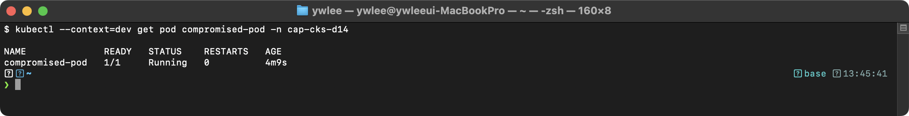

```bash
# 격리 확인: Pod에서 외부 통신이 차단되었는지 테스트
kubectl exec compromised-pod -n production -- wget -qO- http://kubernetes.default.svc --timeout=3 2>&1
```

기대 출력 (예시-환경따라다름, production에 compromised-pod 미배포):
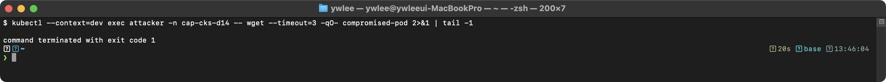

```bash
# NetworkPolicy 적용 확인
kubectl get networkpolicy -n production
```

기대 출력 (예시-환경따라다름, production에 격리 정책 미적용):
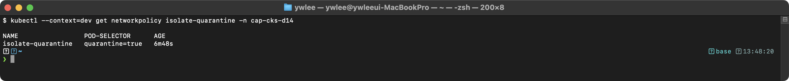

```bash
# 증거 파일 존재 확인
ls -la /tmp/incident-evidence.txt
```

기대 출력 (예시-환경따라다름, production에 compromised-pod 미배포):
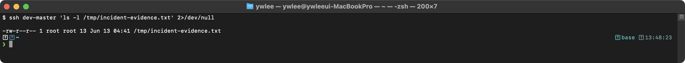

**트러블슈팅:** 인시던트 대응 시 주의사항:
```
1. Pod를 절대 먼저 삭제하지 않는다 — 삭제하면 프로세스 목록, 메모리,
   네트워크 연결 등 모든 포렌식 증거가 사라진다.
2. quarantine 라벨 방식이 app 라벨 방식보다 안전하다 — app 라벨로
   NetworkPolicy를 적용하면 같은 라벨의 정상 Pod도 격리된다.
3. 증거 수집 시 kubectl exec가 실패하면(컨테이너에 ps/netstat 미설치)
   kubectl debug로 ephemeral container를 사용하거나,
   노드에서 crictl inspect로 컨테이너 정보를 수집한다.
```

**kubectl exec가 막혔을 때의 노드 레벨 대체 절차:** distroless 이미지처럼 셸·ps·netstat가 아예 없거나 공격자가 바이너리를 지운 경우, Pod 안에서는 더 수집할 수 없다. 이때는 Pod가 떠 있는 노드에 SSH로 들어가 컨테이너 런타임과 호스트 도구로 직접 떠낸다(파괴 실습은 dev/staging 노드에서만; 예 `ssh staging-master` 또는 `ssh prod-worker`).
```bash
# 1) ephemeral 컨테이너 주입 (대상 컨테이너 namespace 공유, 도구가 있는 이미지 사용)
kubectl debug -it compromised-pod -n production \
  --image=busybox --target=app -- sh
#   주입된 컨테이너에서 ps/netstat 실행 (--target으로 프로세스 namespace 공유)

# 2) 노드에서 crictl로 컨테이너 메타데이터·이미지 무결성 확인
crictl ps | grep compromised               # 컨테이너 ID 확인
crictl inspect <container-id>               # 마운트·env·실행 명령·이미지 digest
crictl inspecti <image-id>                  # 이미지 정보 (원본 digest와 비교)

# 3) 호스트에서 컨테이너 PID를 찾아 프로세스·소켓 관찰
crictl inspect <container-id> | grep -i pid # 컨테이너 init PID
ps -ef | grep <pid>                         # 호스트에서 본 프로세스 트리
ss -tnp | grep <pid>                        # 또는 netstat -tnp, 열린 네트워크 연결
```
이미지 digest를 빌드 파이프라인이 기록한 원본 digest와 비교하면(문제 16의 다이제스트 고정과 연결) 이미지 변조 여부를 판정할 수 있다.

**채점 기준:**
- [ ] 프로세스 목록 수집 (1점)
- [ ] 네트워크 연결 수집 (1점)
- [ ] 증거가 /tmp/incident-evidence.txt에 저장됨 (1점)
- [ ] NetworkPolicy로 Ingress + Egress 모두 차단 (2점)
- [ ] Pod가 삭제되지 않고 Running 유지 (1점)

</details>

---

## 5. 채점 기준 요약

| 문제 | 도메인 | 배점 | 난이도 |
|------|--------|------|--------|
| 1 | Cluster Setup - NetworkPolicy Default Deny | 3점 | 하 |
| 2 | Cluster Setup - NetworkPolicy DNS+Pod | 5점 | 중 |
| 3 | Cluster Setup - kube-bench | 7점 | 상 |
| 4 | Cluster Hardening - RBAC | 6점 | 중 |
| 5 | Cluster Hardening - ServiceAccount | 4점 | 하 |
| 6 | Cluster Hardening - Audit Policy | 7점 | 상 |
| 7 | System Hardening - AppArmor | 6점 | 중 |
| 8 | System Hardening - seccomp + SecurityContext | 4점 | 하 |
| 9 | System Hardening - 서비스/SUID | 5점 | 중 |
| 10 | Microservice Vuln - PSA | 6점 | 중 |
| 11 | Microservice Vuln - OPA Gatekeeper | 5점 | 중 |
| 12 | Microservice Vuln - Secret Encryption | 5점 | 중 |
| 13 | Microservice Vuln - RuntimeClass | 4점 | 하 |
| 14 | Supply Chain - Trivy | 6점 | 중 |
| 15 | Supply Chain - ImagePolicyWebhook | 7점 | 상 |
| 16 | Supply Chain - Image Digest | 4점 | 하 |
| 17 | Supply Chain - Dockerfile | 3점 | 하 |
| 18 | Runtime Security - Falco | 7점 | 상 |
| 19 | Runtime Security - Audit Log | 5점 | 중 |
| 20 | Runtime Security - Incident Response | 6점 | 중 |
| **합계** | | **105점** | |

> 실제 시험은 100점 만점이다. 이 모의시험은 약간의 여유를 두고 105점으로 설정했다. (배점 합산: 3+5+7+6+4+7+6+4+5+6+5+5+4+6+7+4+3+7+5+6 = 105점)

**합격 기준: 67% = 약 70점 이상 (105점 기준)**

---

## 6. 시험 후 자가 평가

### 6.1 시간 관리 평가

```
[ ] 120분 이내에 모든 문제를 시도했는가?
[ ] 한 문제에 10분 이상 소비한 적이 있는가?
[ ] 쉬운 문제(1, 5, 8, 13, 16, 17)를 먼저 풀었는가?
[ ] 마지막 10분을 검증에 사용했는가?
[ ] 컨텍스트 전환을 잊은 적이 있는가?
```

### 6.2 도메인별 자가 평가

| 도메인 | 문제 번호 | 배점 | 획득 점수 | 정답률 |
|--------|----------|------|----------|--------|
| Cluster Setup (10%) | 1, 2, 3 | 15점 | /15 | % |
| Cluster Hardening (15%) | 4, 5, 6 | 17점 | /17 | % |
| System Hardening (15%) | 7, 8, 9 | 15점 | /15 | % |
| Microservice Vuln (20%) | 10, 11, 12, 13 | 20점 | /20 | % |
| Supply Chain (20%) | 14, 15, 16, 17 | 20점 | /20 | % |
| Runtime Security (20%) | 18, 19, 20 | 18점 | /18 | % |
| **총합** | | **105** | / | % |

### 6.3 취약 영역 분석 가이드

```
정답률 80% 이상 → 해당 도메인은 충분히 준비됨
정답률 60~80%  → 핵심 개념 복습 필요 → 해당 Day 자료 재학습
정답률 60% 미만 → 집중 보완 필요 → 해당 Day 자료 + 실습 반복

도메인별 복습 매핑:
├── Cluster Setup      → Day 1-2 복습 (NetworkPolicy, kube-bench, TLS)
├── Cluster Hardening  → Day 3-4 복습 (RBAC, Audit, ServiceAccount)
├── System Hardening   → Day 5-6 복습 (AppArmor, seccomp, 시스템 강화)
├── Microservice Vuln  → Day 7-8 복습 (PSA, Gatekeeper, Encryption, RuntimeClass)
├── Supply Chain       → Day 9-10 복습 (Trivy, ImagePolicyWebhook, Dockerfile)
└── Runtime Security   → Day 11-12 복습 (Falco, Audit Log, 인시던트 대응)
```

---

## 7. 종합 치트시트

### 7.1 핵심 파일 경로

```bash
# API Server 매니페스트 (Static Pod)
/etc/kubernetes/manifests/kube-apiserver.yaml

# Controller Manager 매니페스트
/etc/kubernetes/manifests/kube-controller-manager.yaml

# Scheduler 매니페스트
/etc/kubernetes/manifests/kube-scheduler.yaml

# etcd 매니페스트
/etc/kubernetes/manifests/etcd.yaml

# kubelet 설정
/var/lib/kubelet/config.yaml

# PKI 인증서
/etc/kubernetes/pki/

# Audit Policy
/etc/kubernetes/audit-policy.yaml

# Audit Log
/var/log/kubernetes/audit/audit.log

# Encryption Configuration
/etc/kubernetes/encryption-config.yaml

# AppArmor 프로파일
/etc/apparmor.d/

# seccomp 프로파일 (kubelet)
/var/lib/kubelet/seccomp/profiles/

# Falco 룰
/etc/falco/falco_rules.yaml          # 기본 룰 (수정 금지)
/etc/falco/falco_rules.local.yaml    # 커스텀 룰 (여기에 작성)
/etc/falco/falco.yaml                # Falco 설정

# Admission Control
/etc/kubernetes/admission-control/
```

### 7.2 핵심 명령어

```bash
# ========== kubectl 기본 ==========
alias k=kubectl
export do="--dry-run=client -o yaml"

# 컨텍스트 전환
kubectl config use-context <context>
kubectl config get-contexts

# ========== NetworkPolicy ==========
kubectl get networkpolicy -n <ns>
kubectl describe networkpolicy <name> -n <ns>

# ========== RBAC ==========
# Role 생성
kubectl create role <name> --verb=get,list,watch --resource=pods -n <ns>

# ClusterRole 생성
kubectl create clusterrole <name> --verb=get,list --resource=nodes

# RoleBinding 생성
kubectl create rolebinding <name> --role=<role> --serviceaccount=<ns>:<sa> -n <ns>

# ClusterRoleBinding 생성
kubectl create clusterrolebinding <name> --clusterrole=<cr> --user=<user>

# 권한 확인
kubectl auth can-i <verb> <resource> --as=<user> -n <ns>
kubectl auth can-i --list --as=<user> -n <ns>

# ========== ServiceAccount ==========
kubectl create sa <name> -n <ns>
kubectl get sa <name> -n <ns> -o yaml

# ========== Pod Security Admission ==========
kubectl label namespace <ns> pod-security.kubernetes.io/enforce=restricted
kubectl label namespace <ns> pod-security.kubernetes.io/enforce-version=latest
kubectl label namespace <ns> pod-security.kubernetes.io/warn=restricted
kubectl label namespace <ns> pod-security.kubernetes.io/audit=restricted

# ========== AppArmor ==========
# 프로파일 로드
sudo apparmor_parser -r /etc/apparmor.d/<profile>

# 프로파일 상태 확인
aa-status
aa-status | grep <profile-name>

# ========== seccomp ==========
# seccomp 프로파일 위치
ls /var/lib/kubelet/seccomp/profiles/

# ========== Trivy ==========
trivy image --severity CRITICAL,HIGH <image>
trivy image --severity CRITICAL --exit-code 1 <image>
trivy image --format json <image>
trivy image --ignore-unfixed <image>

# ========== Falco ==========
sudo systemctl restart falco
sudo systemctl status falco
sudo journalctl -u falco -f
sudo journalctl -u falco --since "5 minutes ago"

# ========== Audit Log ==========
# 기본 필터링
cat audit.log | jq 'select(.verb == "delete")'
cat audit.log | jq 'select(.objectRef.resource == "secrets")'
cat audit.log | jq 'select(.responseStatus.code == 403)'
cat audit.log | jq 'select(.user.username == "<user>")'

# ========== kube-bench ==========
kube-bench run --targets master
kube-bench run --targets master --check 1.2.1
kube-bench run --targets node

# ========== API Server 관련 ==========
# Static Pod 재시작 확인
watch crictl ps | grep kube-apiserver

# API Server 로그
crictl logs $(crictl ps -a | grep kube-apiserver | head -1 | awk '{print $1}')

# ========== etcd ==========
ETCDCTL_API=3 etcdctl \
  --cacert=/etc/kubernetes/pki/etcd/ca.crt \
  --cert=/etc/kubernetes/pki/etcd/server.crt \
  --key=/etc/kubernetes/pki/etcd/server.key \
  get /registry/secrets/<ns>/<name>
# 주의 — 출력으로 Secret 암호화 여부를 판정한다:
#   ① 암호화 미적용: 값이 plain text(base64) 그대로 보인다. 사람이 읽을 수 있는
#      문자열·필드(예: data 안의 base64)가 그대로 노출된다.
#   ② 암호화 적용: 값이 바이너리 blob이며 앞에 'k8s:enc:<provider>:' 접두어
#      (예: k8s:enc:aescbc:v1:key1:)가 붙는다. 알아볼 수 없는 이진 데이터다.
#   CKS 시험에서는 이 차이로 "Secret이 etcd에서 암호화되어 있는가"를 검증한다.

# ========== 이미지 다이제스트 ==========
crane digest <image>:<tag>
skopeo inspect docker://<image>:<tag> | jq -r '.Digest'

# ========== 시스템 강화 ==========
# 서비스 비활성화
sudo systemctl stop <service>
sudo systemctl disable <service>

# SUID 바이너리 찾기
find / -perm -4000 -type f 2>/dev/null

# SUID 비트 제거
sudo chmod u-s /path/to/binary

# ========== Secret Encryption 검증 ==========
kubectl get secrets --all-namespaces -o json | kubectl replace -f -
```

### 7.3 주요 YAML 뼈대

```yaml
# === NetworkPolicy: Default Deny ===
apiVersion: networking.k8s.io/v1
kind: NetworkPolicy
metadata:
  name: default-deny
  namespace: <ns>
spec:
  podSelector: {}
  policyTypes:
  - Ingress
  - Egress

# === Role ===
apiVersion: rbac.authorization.k8s.io/v1
kind: Role
metadata:
  name: <name>
  namespace: <ns>
rules:
- apiGroups: [""]
  resources: ["pods"]
  verbs: ["get", "list", "watch"]

# === ServiceAccount + Pod (토큰 비활성화) ===
apiVersion: v1
kind: ServiceAccount
metadata:
  name: <sa-name>
  namespace: <ns>
automountServiceAccountToken: false

# === Restricted-compliant Pod ===
apiVersion: v1
kind: Pod
metadata:
  name: <name>
  namespace: <ns>
spec:
  securityContext:
    runAsNonRoot: true
    runAsUser: 1000
    seccompProfile:
      type: RuntimeDefault
  containers:
  - name: app
    image: <image>
    securityContext:
      allowPrivilegeEscalation: false
      readOnlyRootFilesystem: true
      capabilities:
        drop: ["ALL"]

# === Audit Policy ===
apiVersion: audit.k8s.io/v1
kind: Policy
rules:
  - level: RequestResponse
    resources:
    - group: ""
      resources: ["secrets"]
  - level: Metadata
    resources:
    - group: ""
      resources: ["pods"]
  - level: None
    users: ["system:kube-scheduler"]
    verbs: ["get", "list", "watch"]
  - level: Metadata

# === EncryptionConfiguration ===
apiVersion: apiserver.config.k8s.io/v1
kind: EncryptionConfiguration
resources:
  - resources:
    - secrets
    providers:
    - aescbc:
        keys:
        - name: key1
          secret: <base64-key>
    - identity: {}

# === RuntimeClass ===
apiVersion: node.k8s.io/v1
kind: RuntimeClass
metadata:
  name: gvisor
handler: runsc

# === Falco Rule ===
- rule: <Rule Name>
  desc: <description>
  condition: >
    spawned_process and
    container and
    proc.name in (bash, sh)
  output: >
    Shell in container (user=%user.name container=%container.name
    pod=%k8s.pod.name ns=%k8s.ns.name)
  priority: WARNING
  tags: [container, shell]
```

### 7.4 apiVersion 참조표

| 리소스 | apiVersion |
|--------|-----------|
| Pod, Service, Secret, ConfigMap, ServiceAccount | v1 |
| Deployment, StatefulSet, DaemonSet, ReplicaSet | apps/v1 |
| NetworkPolicy | networking.k8s.io/v1 |
| Ingress | networking.k8s.io/v1 |
| Role, ClusterRole, RoleBinding, ClusterRoleBinding | rbac.authorization.k8s.io/v1 |
| RuntimeClass | node.k8s.io/v1 |
| PeerAuthentication (Istio) | security.istio.io/v1beta1 |
| ConstraintTemplate (Gatekeeper) | templates.gatekeeper.sh/v1 |
| Constraint (Gatekeeper) | constraints.gatekeeper.sh/v1beta1 |
| Audit Policy | audit.k8s.io/v1 |
| EncryptionConfiguration | apiserver.config.k8s.io/v1 |
| AdmissionConfiguration | apiserver.config.k8s.io/v1 |

---

## 8. 합격 전략 최종 정리

### 8.1 시험 당일 체크리스트

```
시험 전:
[ ] 안정적인 인터넷 연결 확인
[ ] 웹캠, 마이크 정상 작동
[ ] 책상 위 불필요한 물건 제거
[ ] 신분증 준비
[ ] kubernetes.io 북마크 정리

시험 시작 직후 (처음 2분):
[ ] alias k=kubectl 설정
[ ] export do="--dry-run=client -o yaml" 설정
[ ] kubectl config get-contexts로 클러스터 확인
[ ] 문제 전체 빠르게 훑기 (쉬운 문제 파악)

시험 중:
[ ] 매 문제마다 컨텍스트 전환 먼저!
[ ] 한 문제 10분 초과 시 스킵
[ ] API Server 수정 전 반드시 백업
[ ] 각 문제 풀이 후 즉시 검증

시험 종료 10분 전:
[ ] 미완성 문제에 부분 점수 시도 (리소스라도 생성)
[ ] 모든 컨텍스트에서 리소스 존재 확인
[ ] kubectl get으로 최종 검증
```

### 8.2 난이도별 풀이 순서 권장

```
[1순위: 반드시 만점] 예상 소요 15~20분
├── NetworkPolicy Default Deny (3~4분)
├── ServiceAccount 토큰 비활성화 (3~4분)
├── seccomp RuntimeDefault (3~4분)
├── RuntimeClass 생성 (3~4분)
└── Image Digest 변경 (3~4분)

[2순위: 확실히 득점] 예상 소요 40~50분
├── RBAC 수정 (5~7분)
├── Pod Security Admission (5~7분)
├── Trivy 이미지 스캔 (7~8분)
├── Falco 룰 작성 (7~8분)
├── Audit Log 분석 (7~8분)
├── AppArmor 프로파일 (7~8분)
└── 인시던트 대응 (7~8분)

[3순위: 시간이 허락하면] 예상 소요 30~40분
├── Audit Policy 작성 + API Server 적용 (10~12분)
├── kube-bench 수정 (8~10분)
├── Secret Encryption at Rest (8~10분)
└── ImagePolicyWebhook (10~12분)
```

### 8.3 점수 극대화 핵심 원칙

```
1. 쉬운 문제에서 실수하지 말라
   → 하 난이도 문제만 완벽히 풀어도 ~23점 (22% 확보)

2. 중간 난이도 문제를 최대한 많이 풀어라
   → 중 난이도 문제를 70% 풀면 ~37점 추가 확보

3. 어려운 문제는 부분 점수를 노려라
   → ImagePolicyWebhook: volume만 맞아도 부분 점수
   → kube-bench: 플래그 하나만 맞아도 부분 점수

4. 시간 관리가 점수를 결정한다
   → 어려운 문제에 20분 투자 → 쉬운 문제 2개 놓침 → 순손실
```

---

## 종합 트러블슈팅: 시험에서 자주 발생하는 장애와 복구

### API Server Static Pod 매니페스트 수정 시 장애 대응

```
API Server 매니페스트(/etc/kubernetes/manifests/kube-apiserver.yaml) 수정은
CKS 시험에서 가장 위험한 작업이다. YAML 오타 하나로 API Server가 죽으면
kubectl이 동작하지 않아 나머지 문제를 풀 수 없다.
```

```bash
# 수정 전 반드시 백업한다
cp /etc/kubernetes/manifests/kube-apiserver.yaml /tmp/kube-apiserver.yaml.bak

# 수정 후 API Server 상태 확인 (최대 3분 대기)
watch crictl ps | grep kube-apiserver
```

기대 출력 (정상):
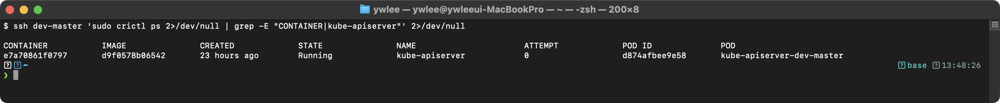

```bash
# API Server가 시작되지 않을 때 로그 확인
crictl logs $(crictl ps -a | grep kube-apiserver | head -1 | awk '{print $1}') 2>&1 | tail -10
```

일반적인 에러 메시지:
> **예시(참조) — audit 볼륨/경로 오류:** apiserver 에 audit 플래그를 추가했으나 hostPath 볼륨/파일이 없으면 `open /etc/kubernetes/audit-policy.yaml: no such file or directory` 로 기동 실패한다. 정적 파드 volume/volumeMount 와 파일 존재를 확인한다.

```bash
# 즉시 백업에서 복원
cp /tmp/kube-apiserver.yaml.bak /etc/kubernetes/manifests/kube-apiserver.yaml
# 2~3분 대기 후 kubectl 동작 확인
kubectl get nodes
```

### volume/volumeMount 체크리스트

```
API Server 매니페스트에 --xxx-file 플래그를 추가할 때 반드시 확인해야 하는 3가지:
  1. hostPath volume 정의가 있는가
  2. volumeMount가 컨테이너에 있는가
  3. hostPath.type이 올바른가 (File vs DirectoryOrCreate)

흔한 실수:
  - volumeMount는 추가했으나 volume 정의를 빠뜨림
  - mountPath와 hostPath.path가 불일치
  - File 타입인데 디렉토리 경로를 지정하거나 그 반대
```

### Falco 룰 문법 검증

```bash
# 룰 적용 전 반드시 dry-run으로 검증한다
sudo falco --dry-run -r /etc/falco/falco_rules.yaml -r /etc/falco/falco_rules.local.yaml
```

기대 출력 (정상):


> **(미캡처 — 교체 필요)** 위 이미지는 `falco --dry-run` 정상 출력이 아닌 Falco 런타임 경보 화면이다. 정상 dry-run 출력은 `Loading rules from file ...` 뒤 `Rules loaded successfully.` 형태로 나타난다. 실측 스크린샷으로 교체 예정이다.

기대 출력 (오류 시):


> **(미캡처 — 교체 필요)** 위 이미지는 dry-run 오류 출력이 아닌 동일한 런타임 경보 화면이다. dry-run 오류 시 출력은 `YAML parse error`, `rule ... has invalid condition` 등 파싱 실패 메시지가 나타난다. 실측 스크린샷으로 교체 예정이다.

---

## 9. Day 1~14 복습 맵

```
Day 1-2: Cluster Setup (10%)
├── NetworkPolicy (Default Deny, DNS, AND/OR, ipBlock, metadata API)
├── CIS Benchmark / kube-bench
├── Ingress TLS
└── 바이너리 무결성 (sha512sum)

Day 3-4: Cluster Hardening (15%)
├── RBAC (Role, ClusterRole, RoleBinding, ClusterRoleBinding)
├── ServiceAccount 토큰 관리
├── API Server 보안 플래그
├── Audit Policy (None/Metadata/Request/RequestResponse)
└── kubeadm 업그레이드

Day 5-6: System Hardening (15%)
├── AppArmor (프로파일 작성, 로드, Pod 적용)
├── seccomp (RuntimeDefault, Localhost, 커스텀)
├── Linux capabilities (drop ALL, 필요한 것만 add)
├── 불필요한 서비스 비활성화
└── SUID 바이너리

Day 7-8: Minimize Microservice Vulnerabilities (20%)
├── Pod Security Standards / Admission
├── SecurityContext 완벽 가이드
├── OPA Gatekeeper (ConstraintTemplate, Constraint, Rego)
├── Secret Encryption at Rest
├── RuntimeClass (gVisor, Kata)
└── Istio mTLS (PeerAuthentication)

Day 9-10: Supply Chain Security (20%)
├── Trivy (이미지 스캔, severity, exit-code, SBOM)
├── Cosign / Docker Content Trust
├── ImagePolicyWebhook
├── 이미지 다이제스트 vs 태그
├── Dockerfile 보안 (multi-stage, distroless, non-root)
└── 허용 레지스트리 제한

Day 11-12: Monitoring/Logging/Runtime Security (20%)
├── Falco (룰, 매크로, override, 우선순위)
├── Kubernetes Audit Log 분석 (jq)
├── Sysdig (시스템 콜 캡처)
├── 인시던트 대응 (증거 수집, 격리, 제거)
└── Immutable Container

Day 13-14: 종합 모의시험 (100%)
├── 20문제 실전 모의시험
├── 시간 관리 전략
├── 종합 치트시트
└── 합격 전략
```

---

> **14일간의 CKS 학습 과정을 모두 완료했다.**
> 모의시험에서 67% 이상 득점했다면 실제 시험에 도전할 준비가 된 것이다.
> 취약한 도메인은 해당 Day를 다시 복습하고, 실전 환경에서 반복 연습하라.
>
> **합격의 핵심:**
> 1. 쉬운 문제에서 실수하지 않는다
> 2. YAML 뼈대를 빠르게 작성한다 (imperative → 수정)
> 3. API Server 매니페스트 수정에 자신감을 가진다
> 4. 시간 관리를 철저히 한다 (10분 룰)
> 5. kubernetes.io 문서 검색을 빠르게 한다

---

## tart-infra 실습

### 실습 환경 설정

```bash
# CKS 모의시험은 4개 클러스터를 모두 사용한다
alias kp='export KUBECONFIG=~/sideproejct/IaC_apple_sillicon/kubeconfig/platform.yaml'
alias kd='export KUBECONFIG=~/sideproejct/IaC_apple_sillicon/kubeconfig/dev.yaml'
alias ks='export KUBECONFIG=~/sideproejct/IaC_apple_sillicon/kubeconfig/staging.yaml'
alias kpr='export KUBECONFIG=~/sideproejct/IaC_apple_sillicon/kubeconfig/prod.yaml'
```

### 실습 1: 전 도메인 보안 종합 점검

```bash
# [Cluster Setup] NetworkPolicy 확인
kd
echo "=== NetworkPolicy ==="
kubectl get ciliumnetworkpolicies -n demo --no-headers | wc -l
echo "CiliumNetworkPolicy 수"

# [Cluster Hardening] RBAC 점검
echo "=== RBAC ==="
kubectl get clusterrolebindings -o custom-columns=NAME:.metadata.name,ROLE:.roleRef.name | grep cluster-admin

# [System Hardening] SecurityContext 확인
echo "=== SecurityContext ==="
kubectl get pods -n demo -o jsonpath='{range .items[*]}{.metadata.name}{": runAsNonRoot="}{.spec.securityContext.runAsNonRoot}{"\n"}{end}'

# [Microservice Vulnerabilities] mTLS 확인
echo "=== mTLS ==="
kubectl get peerauthentication -n demo 2>/dev/null || echo "PeerAuthentication 미설정"

# [Supply Chain] 이미지 태그 확인
echo "=== Image Tags ==="
kubectl get pods -n demo -o jsonpath='{range .items[*]}{range .spec.containers[*]}{.image}{"\n"}{end}{end}' | sort -u

# [Runtime Security] 이벤트 확인
echo "=== Recent Events ==="
kubectl get events -n demo --field-selector type=Warning --no-headers 2>/dev/null | wc -l
echo "Warning 이벤트 수"
```

> **(미캡처)** 위 실습 1 명령들의 실행 결과(CiliumNetworkPolicy 수, cluster-admin 바인딩 목록, Pod SecurityContext 상태, PeerAuthentication 존재 여부, 이미지 태그 목록, Warning 이벤트 수)는 실측 스크린샷으로 교체 예정이다. dev 클러스터를 기동한 뒤 `kd` 별칭으로 kubeconfig를 전환하고 각 명령을 순서대로 실행하면 클러스터의 현재 보안 상태를 한눈에 점검할 수 있다.

### 실습 2: 시험 핵심 스킬 연습

```bash
kd

# 1. NetworkPolicy 빠른 생성 (Default Deny)
cat << 'EOF' > /tmp/default-deny.yaml
apiVersion: networking.k8s.io/v1
kind: NetworkPolicy
metadata:
  name: default-deny-test
  namespace: default
spec:
  podSelector: {}
  policyTypes:
  - Ingress
  - Egress
EOF
kubectl apply -f /tmp/default-deny.yaml
kubectl delete -f /tmp/default-deny.yaml

# 2. RBAC 빠른 생성
kubectl create role test-role --verb=get,list --resource=pods -n default --dry-run=client -o yaml
kubectl create rolebinding test-rb --role=test-role --serviceaccount=default:default -n default --dry-run=client -o yaml

# 3. 권한 검증
kubectl auth can-i get pods -n default --as=system:serviceaccount:default:default
```

**동작 원리:** CKS 시험 시간 절약 전략:
1. imperative 명령어(`kubectl create role/rolebinding`)로 기본 YAML을 생성한다
2. `--dry-run=client -o yaml`로 파일에 저장하고 필요한 수정을 한다
3. `kubectl auth can-i`로 RBAC 결과를 즉시 검증한다
4. NetworkPolicy는 YAML 외우기보다 패턴을 기억한다 (Default Deny, Allow DNS 등)

> **(미캡처)** 실습 2는 dry-run 위주라 출력이 YAML 형식이다. `kubectl create role ... --dry-run=client -o yaml` 결과와 `kubectl auth can-i` 결과(yes/no)를 실측 스크린샷으로 교체 예정이다.

### 실습 3: API Server 매니페스트 수정 연습

```bash
# API Server 매니페스트 위치 확인
# tart ssh dev-master
# sudo cat /etc/kubernetes/manifests/kube-apiserver.yaml | head -30

# 시험에서 자주 수정하는 항목:
echo "CKS 시험 API Server 수정 체크리스트:"
echo "1. --enable-admission-plugins 추가 (ImagePolicyWebhook, PodSecurityAdmission)"
echo "2. --encryption-provider-config 설정"
echo "3. --audit-policy-file 설정"
echo "4. --audit-log-path 설정"
echo "5. 볼륨/볼륨마운트 추가 (설정 파일과 로그 경로)"
```

**동작 원리:** API Server 매니페스트 수정 절차:
1. `/etc/kubernetes/manifests/kube-apiserver.yaml`을 직접 편집한다
2. kubelet이 파일 변경을 감지하고 kube-apiserver Pod를 자동으로 재시작한다
3. 재시작에 1~2분 소요 — `kubectl get pods -n kube-system`으로 상태를 확인한다
4. 문법 오류가 있으면 API Server가 시작되지 않는다 — 수정 전 백업 필수!

> **(미캡처)** 실습 3은 실제로 `ssh dev-master`로 들어가 `/etc/kubernetes/manifests/kube-apiserver.yaml`을 확인하는 과정이다. `sudo cat /etc/kubernetes/manifests/kube-apiserver.yaml | head -30` 출력과 수정 후 `watch crictl ps | grep kube-apiserver` 결과를 실측 스크린샷으로 교체 예정이다. SSH 접속: `ssh dev-master`(~/.ssh/config 등록 별칭).

### 실습 4: 모의시험 시간 관리 연습

```bash
# 실전처럼 시간 측정하며 작업
echo "=== CKS 모의시험 시간 관리 ==="
echo "총 120분, 15~20문제"
echo ""
echo "시간 배분 전략:"
echo "1. 쉬운 문제(NetworkPolicy, RBAC): 5~7분"
echo "2. 중간 문제(SecurityContext, Audit): 7~10분"
echo "3. 어려운 문제(API Server 수정, Falco): 10~15분"
echo ""
echo "클러스터별 작업:"
echo "- platform: 모니터링, Audit, API Server 보안"
echo "- dev: NetworkPolicy, mTLS, SecurityContext, 이미지 보안"
echo "- staging: 기본 보안 설정 연습"
echo "- prod: 최소 구성에서 보안 강화 연습"
```
