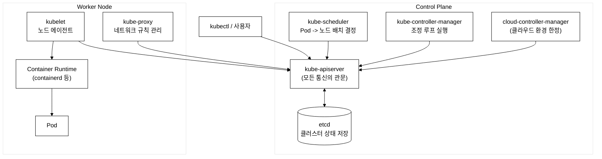
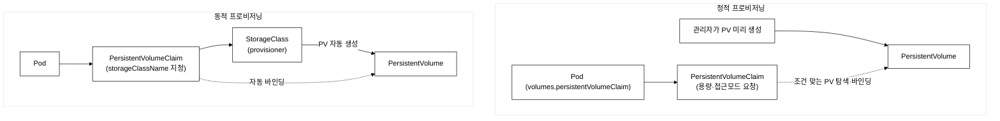
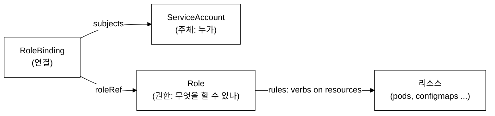
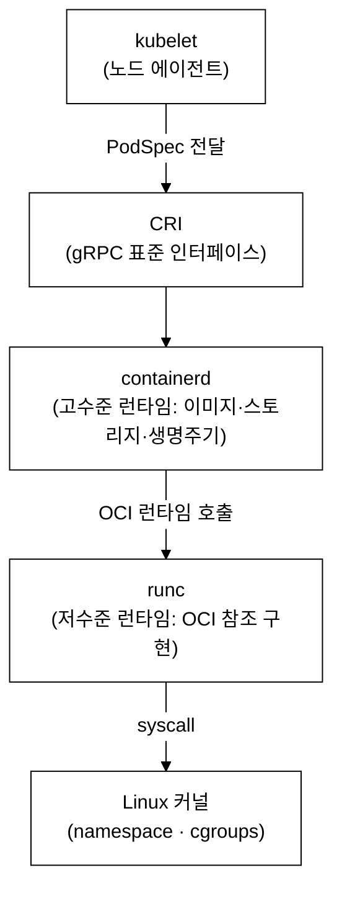
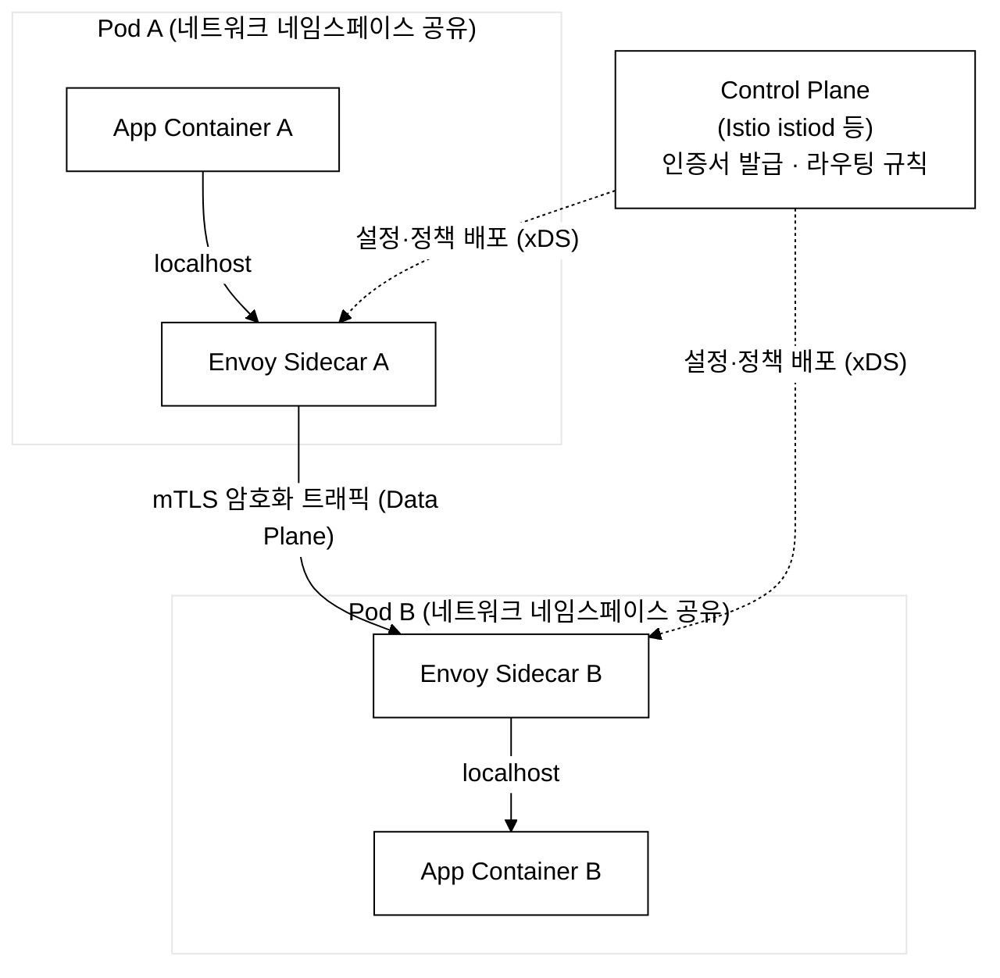

# KCNA 핵심 개념 정리

> 학습 목표: KCNA 5개 도메인의 핵심 개념을 등장 배경·내부 동작·실습 검증과 함께 이해한다.
> 도메인 비중: Kubernetes Fundamentals 46% / Container Orchestration 22% / Cloud Native Architecture 16% / Cloud Native Observability 8% / Cloud Native Application Delivery 8%
> 예상 소요: 6~8시간 (통독 기준, 실습 검증 포함 시 더 길어짐)

> KCNA(Kubernetes and Cloud Native Associate) 시험의 모든 도메인을 체계적으로 정리한 문서이다. 각 기술의 등장 배경, 해결하려는 문제, 실습 검증 방법을 포함한다.

---

## 1. Kubernetes Fundamentals (46%)

### 1.0 Kubernetes가 등장한 배경

#### 기존 배포 방식의 한계

**물리 서버 시대**: 하나의 물리 서버에 여러 애플리케이션을 실행하면, 특정 애플리케이션이 리소스를 독점하여 다른 애플리케이션의 성능이 저하되는 문제가 발생한다. 이를 해결하기 위해 서버를 분리하면 하드웨어 비용이 증가하고 유휴 리소스가 낭비된다.

**가상 머신(VM) 시대**: VMware, KVM 등의 하이퍼바이저를 통해 하나의 물리 서버를 여러 VM으로 분할하여 격리성을 확보한다. 그러나 각 VM이 게스트 OS를 포함하므로 수 GB의 오버헤드가 발생하고, 부팅에 수 분이 소요되며, VM 이미지의 크기가 커서 배포 속도가 느리다.

**컨테이너 시대**: Linux 커널의 namespace와 cgroups를 활용하여 프로세스 수준의 격리를 구현한다. 게스트 OS가 불필요하므로 수 MB 수준의 이미지 크기, 초 단위의 시작 시간, 높은 리소스 효율성을 달성한다. Docker(2013)가 컨테이너 기술을 대중화하면서 컨테이너 기반 배포가 표준이 된다.

#### 컨테이너 오케스트레이션의 필요성

컨테이너 수가 수십~수천 개로 증가하면 다음 문제가 발생한다:
- 어떤 노드에 어떤 컨테이너를 배치할 것인가 (스케줄링)
- 컨테이너가 비정상 종료되었을 때 자동으로 재시작하는 방법 (자동 복구)
- 동적으로 생성/삭제되는 컨테이너를 다른 컨테이너가 어떻게 발견하는가 (서비스 디스커버리)
- 트래픽 증가 시 컨테이너를 자동으로 확장하는 방법 (오토스케일링)
- 무중단 배포와 롤백 (배포 관리)

이 문제들을 수동으로 해결하는 것은 운영 비용이 급격히 증가하므로, 자동화된 오케스트레이션 플랫폼이 필수적이다.

#### 경쟁 솔루션 대비 Kubernetes의 차별점

| 항목 | Docker Swarm | Apache Mesos | Kubernetes |
|------|-------------|-------------|------------|
| 설계 철학 | Docker 생태계 통합, 단순성 | 범용 데이터센터 리소스 관리 | 선언적 API, 컨테이너 오케스트레이션 전용 |
| 학습 곡선 | 낮음 | 높음 | 중간~높음 |
| 확장성 | 수백 노드 | 수만 노드 | 수천 노드 (5,000+) |
| 생태계 | 제한적 | 제한적 | CNCF 중심의 대규모 생태계 |
| 자동 복구 | 기본적 | Marathon 의존 | 내장 (liveness/readiness probe, 재스케줄링) |
| 선언적 API | 제한적 | 없음 | 핵심 설계 원칙 |
| 커뮤니티 | 소규모 | 감소 추세 | 오픈소스 역사상 최대 규모 |
| 현재 상태 | 사실상 중단 | Apache 보관(attic) | 산업 표준 |

**Docker Swarm**은 Docker CLI와 통합되어 진입 장벽이 낮지만, 복잡한 배포 전략(카나리, 블루/그린)이나 커스텀 스케줄링 정책을 지원하지 않는다. **Apache Mesos**는 대규모 클러스터 관리에 강점이 있으나, 컨테이너 오케스트레이션을 위해 Marathon이라는 별도 프레임워크를 필요로 하며, K8s 대비 생태계가 협소하다.

Kubernetes는 Google이 15년간 운영한 Borg/Omega 시스템의 설계 경험을 반영하였으며, 선언적 API와 컨트롤러 패턴을 핵심 아키텍처로 채택하여 확장성과 자동화 수준이 높다. 2015년 CNCF에 기부된 이후 모든 주요 클라우드 제공업체(AWS EKS, GCP GKE, Azure AKS)가 관리형 서비스를 제공하면서 사실상 표준(de facto standard)이 되었다.

### 1.1 Kubernetes 아키텍처

K8s 클러스터는 크게 **Control Plane(컨트롤 플레인)**과 **Worker Node(워커 노드)**로 구성된다. 전체 구성과 컴포넌트 간 통신 방향을 먼저 그림으로 정리한다. 핵심은 모든 통신이 kube-apiserver를 중심으로 이루어지고, etcd에 직접 접근하는 컴포넌트는 apiserver 하나뿐이라는 점이다.



_그림 1. K8s 클러스터 아키텍처. kube-apiserver가 모든 컴포넌트 통신의 중심이며, etcd와 직접 통신하는 것은 apiserver뿐이다. scheduler·controller-manager·kubelet·kube-proxy는 모두 apiserver를 경유하여 상태를 읽고 쓴다._

#### 1.1.1 Control Plane 구성 요소

Control Plane은 클러스터 전체의 의사결정을 담당하며, 일반적으로 고가용성을 위해 여러 노드에 걸쳐 실행된다.

**kube-apiserver**
- K8s 클러스터의 프론트엔드 역할을 하는 핵심 구성 요소이다.
- 모든 내부/외부 통신은 API 서버를 통해 이루어진다.
- RESTful API를 노출하며, kubectl 명령어도 이 API를 호출하는 것이다.
- 인증(Authentication), 인가(Authorization), 어드미션 컨트롤(Admission Control)을 순차적으로 수행한다.
  - 인증: 요청자의 신원을 확인한다 (인증서, 토큰, OIDC 등).
  - 인가: 해당 요청이 허용되는지 확인한다 (RBAC, ABAC, Webhook 등).
  - 어드미션 컨트롤: 요청의 유효성을 검사하거나 수정한다 (Mutating/Validating Webhook).
- 수평 확장(horizontal scaling)이 가능하므로, 여러 인스턴스를 동시에 실행하여 부하를 분산할 수 있다.
- etcd와 직접 통신하는 유일한 컴포넌트이다. 다른 모든 컴포넌트는 API 서버를 경유하여 etcd에 접근한다.

실습 검증 - API 서버 접근 확인:
```bash
# API 서버 엔드포인트 확인
kubectl cluster-info

# API 서버와의 통신을 verbose 모드로 확인 (HTTP 요청/응답 확인)
kubectl get nodes -v=6

# API 리소스 목록 조회
kubectl api-resources --namespaced=true | head -20
```

기대 출력:
> **예시(참조) — $ kubectl cluster-info:** KCNA 개념/실습 기대 출력. 실측은 KCNA daily(day01~07) 및 본 캡처 참고.

**etcd**

_등장 배경:_ Kubernetes 는 클러스터 전체 상태를 한 곳에 일관되게 저장할 분산 저장소가 필요했다. 후보였던 **ZooKeeper**(주키퍼)·**Consul**(콘술)은 합의·헬스체크 기능은 충분했으나, ZooKeeper 는 znode 계층 모델과 비직관적 클라이언트 API·JVM 운영 부담이 있었고 Consul 은 서비스 디스커버리 기능까지 묶인 무거운 도구였다. etcd 는 ⓐ 단순한 HTTP/gRPC 키-값 API, ⓑ Go 로 작성된 **단일 바이너리** 배포 용이성, ⓒ Google 의 **Borg**(쿠버네티스의 전신 클러스터 관리 시스템) 운영 경험을 반영한 watch/lease 모델로 이 요구에 맞았다. 합의 알고리즘도 이해·구현이 까다로운 **Paxos**(팍소스) 대신, 동일한 안전성을 제공하면서 리더 선출·로그 복제로 분해해 이해하기 쉬운 **Raft**(래프트)를 채택했다.

- 분산 키-값(Key-Value) 저장소이다.
- 클러스터의 모든 상태 정보(desired state, current state)를 저장한다.
- Raft 합의 알고리즘을 사용하여 데이터 일관성을 보장한다. Raft는 리더 선출, 로그 복제, 안전성의 세 가지 하위 문제를 분리하여 해결하는 합의 프로토콜이다.
- 클러스터 데이터의 단일 진실 소스(Single Source of Truth)이다.
- 고가용성 환경에서는 일반적으로 3개 또는 5개(홀수)의 etcd 노드를 운영한다. 홀수로 구성하는 이유는 Raft 합의에서 과반수(quorum)를 확보하기 위함이다. 예를 들어 3노드 클러스터는 1노드 장애를 허용하고, 5노드는 2노드 장애를 허용한다.
- etcd의 데이터 백업은 클러스터 복구에 매우 중요하므로 정기적으로 스냅샷을 생성해야 한다.

실습 검증 - etcd 상태 확인:
```bash
# etcd Pod 상태 확인 (kubeadm 기반 클러스터)
kubectl get pods -n kube-system -l component=etcd

# etcd 엔드포인트 확인
kubectl -n kube-system describe pod etcd-<node-name> | grep listen-client-urls
```

기대 출력:
> **참조 — etcd 분산 KV 저장소 개념:** $ kubectl get pods -n kube-system -l component ...

**kube-scheduler**

_등장 배경:_ 서버를 수동으로 지정하던 방식에서는 관리자가 각 노드의 현재 부하를 직접 모니터링하고 어디에 배치할지 일일이 결정해야 했다. 노드가 수십~수백 대로 늘면 이 수동 배치는 불가능해진다. kube-scheduler 는 이 결정을 자동화한 컴포넌트로, Borg 의 셀 스케줄러 경험을 기반으로 **필터링(Filtering)→스코어링(Scoring)** 2단계 알고리즘을 채택했다.

- 새로 생성된 Pod를 적절한 워커 노드에 배치(스케줄링)하는 역할을 한다.
- Pod가 아직 노드에 할당되지 않은 상태(Pending)일 때 동작한다.
- 스케줄링 결정 시 고려하는 요소는 다음과 같다:
  - 리소스 요구사항(CPU, 메모리)과 노드의 가용 리소스
  - 하드웨어/소프트웨어/정책 제약 조건
  - 어피니티(Affinity)와 안티-어피니티(Anti-Affinity) 규칙
  - 테인트(Taint)와 톨러레이션(Toleration)
  - 데이터 지역성(Data Locality)
- 스케줄링은 2단계로 진행된다:
  1. **필터링(Filtering)**: 조건에 맞지 않는 노드를 제외한다. 리소스 부족, taint 미허용, nodeSelector 불일치 등이 필터링 조건이다.
  2. **스코어링(Scoring)**: 남은 후보 노드에 점수를 매겨 최적의 노드를 선택한다. 리소스 분산 정도, 어피니티 일치 수준 등이 점수 기준이다.

**kube-controller-manager**
- 클러스터의 상태를 지속적으로 감시하고, 현재 상태(current state)를 원하는 상태(desired state)로 맞추는 컨트롤 루프를 실행한다.
- 이 패턴을 "Reconciliation Loop(조정 루프)"라 한다. 이 패턴이 K8s 자동화의 핵심이다. 관리자가 "3개의 Pod를 유지하라"고 선언하면, 컨트롤러가 현재 Pod 수를 확인하고 부족하면 생성, 초과하면 삭제한다.
- 논리적으로는 개별 프로세스이지만, 복잡성을 줄이기 위해 하나의 바이너리로 컴파일되어 단일 프로세스로 실행된다.
- 주요 컨트롤러는 다음과 같다:
  - **Node Controller**: 노드의 상태를 모니터링하고, 노드가 다운되면 알림을 생성한다. `--node-monitor-grace-period`(기본 40초) 내에 heartbeat가 없으면 노드를 NotReady로 전환한다.
  - **Replication Controller**: 각 ReplicationController 오브젝트에 대해 올바른 수의 Pod가 유지되도록 보장한다.
  - **Endpoints Controller**: 서비스와 Pod를 연결하는 Endpoints 오브젝트를 관리한다.
  - **Service Account & Token Controller**: 새 네임스페이스에 대한 기본 계정과 API 접근 토큰을 생성한다.
  - **Job Controller**: Job 오브젝트를 감시하고 해당 작업을 수행할 Pod를 생성한다.
  - **Deployment Controller**: Deployment의 상태를 관리하고 ReplicaSet을 생성/갱신한다.

실습 검증 - 컨트롤러 동작 확인:
```bash
# 컨트롤 플레인 컴포넌트 상태 확인
kubectl get pods -n kube-system -l tier=control-plane

# 컨트롤러 매니저 로그에서 reconciliation 동작 확인
kubectl logs -n kube-system kube-controller-manager-<node-name> --tail=20
```

기대 출력:


**cloud-controller-manager**
- 클라우드 제공업체(AWS, GCP, Azure 등)에 특화된 제어 로직을 실행한다.
- K8s 핵심 코드와 클라우드 제공업체의 코드를 분리하여 독립적으로 발전할 수 있게 한다. 기존에는 클라우드 제공업체의 코드가 K8s 핵심 코드에 직접 포함(in-tree)되어 있어, 릴리스 주기가 결합되고 버그 수정이 K8s 전체 릴리스를 기다려야 하는 문제가 있었다. cloud-controller-manager의 분리(out-of-tree)로 이 의존성이 제거되었다.
- 온프레미스 환경에서는 이 컴포넌트가 없을 수 있다.
- 주요 컨트롤러는 다음과 같다:
  - **Node Controller**: 클라우드에서 노드가 삭제된 후 응답이 없으면 해당 노드를 제거한다.
  - **Route Controller**: 클라우드 인프라에서 네트워크 경로를 설정한다.
  - **Service Controller**: 클라우드 로드밸런서를 생성, 갱신, 삭제한다.

#### 1.1.2 Worker Node 구성 요소

Worker Node는 실제 애플리케이션 워크로드(Pod)가 실행되는 곳이다.

**kubelet**
- 각 워커 노드에서 실행되는 에이전트이다.
- API 서버로부터 PodSpec을 수신하고, 해당 명세에 따라 컨테이너가 정상적으로 실행 중인지 확인한다.
- 컨테이너 런타임(containerd 등)과 CRI(Container Runtime Interface)를 통해 통신하여 컨테이너의 생명주기를 관리한다.
- 노드의 상태를 주기적으로(기본 10초) API 서버에 보고한다.
- K8s가 생성하지 않은 컨테이너는 관리하지 않는다.
- 컨테이너의 Probe를 실행하여 상태를 확인한다:
  - **Liveness Probe**: 컨테이너가 살아 있는지 확인한다. 실패 시 컨테이너를 재시작한다.
  - **Readiness Probe**: 컨테이너가 트래픽을 처리할 준비가 되었는지 확인한다. 실패 시 서비스 엔드포인트에서 제거한다.
  - **Startup Probe**: 컨테이너가 시작되었는지 확인한다. 이 probe가 성공할 때까지 liveness/readiness probe를 실행하지 않는다. 시작이 느린 애플리케이션에 사용한다.

실습 검증 - 노드 및 kubelet 상태:
```bash
# 노드 목록 및 상태 확인
kubectl get nodes -o wide

# 특정 노드의 상세 정보 (kubelet 버전, OS, 컨테이너 런타임 확인)
kubectl describe node <node-name> | grep -A 5 "System Info"

# 노드의 할당 가능 리소스 확인
kubectl describe node <node-name> | grep -A 6 "Allocatable"
```

기대 출력:


**kube-proxy**
- 각 워커 노드에서 실행되는 네트워크 프록시이다.
- K8s 서비스(Service) 개념의 구현체이다.
- 노드의 네트워크 규칙(iptables 또는 IPVS)을 관리하여, 클러스터 내부 또는 외부에서 Pod로의 네트워크 통신을 가능하게 한다.
- 서비스의 ClusterIP로 들어오는 트래픽을 적절한 Pod로 로드밸런싱한다.
- 운영 모드:
  - **iptables 모드(기본값)**: 커널의 netfilter를 활용한다. 서비스 수가 수천 개를 초과하면 규칙 수가 급증하여 성능이 저하될 수 있다.
  - **IPVS 모드**: 커널 레벨 L4 로드밸런서를 사용한다. iptables 대비 대규모 클러스터에서 성능이 우수하며, round-robin, least-connection 등 다양한 로드밸런싱 알고리즘을 지원한다.
  - **nftables 모드**: K8s v1.29부터 알파로 도입된 모드이다. iptables의 후속 기술인 nftables를 사용한다.

실습 검증 - kube-proxy 모드 확인:
```bash
# kube-proxy Pod 확인
kubectl get pods -n kube-system -l k8s-app=kube-proxy

# kube-proxy 설정 확인 (모드 확인)
kubectl get configmap kube-proxy -n kube-system -o yaml | grep mode
```

기대 출력:
> **예시(참조) — $ kubectl get pods -n kube-system -l k8s-app=k:** KCNA 개념/실습 기대 출력. 실측은 KCNA daily(day01~07) 및 본 캡처 참고.

**주의 — 이 저장소의 클러스터에는 kube-proxy Pod가 없다.** 위 `kubectl get pods -n kube-system -l k8s-app=kube-proxy`를 이 저장소의 dev/staging tart 클러스터(CLAUDE.md §3)에서 실행하면 결과가 비어 있다. 이 클러스터는 Cilium이 kube-proxy를 대체(kube-proxy replacement)하기 때문이다. Cilium은 iptables/IPVS 규칙 대신 eBPF(커널에 검증된 작은 프로그램을 적재해 패킷 처리 경로에서 직접 실행하는 기술)로 Service의 ClusterIP→Pod 부하분산을 커널에서 처리하므로, 별도의 kube-proxy DaemonSet이 필요 없다. 따라서 이 환경에서 네트워크 규칙 구현 주체를 확인하려면 `kubectl get pods -n kube-system -l k8s-app=cilium`으로 Cilium을 조회한다(서비스 메시 맥락의 Cilium은 §3.4 참조). 관리형 클러스터나 kubeadm 기본 설치에서는 kube-proxy가 DaemonSet으로 존재하므로 위 명령에 결과가 나온다.

**Container Runtime**
- 실제로 컨테이너를 실행하는 소프트웨어이다.
- K8s는 CRI(Container Runtime Interface)를 통해 컨테이너 런타임과 통신한다. CRI 도입 이전에는 K8s 코드에 Docker 호출 로직이 직접 내장(dockershim)되어 있었으며, 새로운 런타임을 추가하려면 K8s 핵심 코드를 수정해야 했다. CRI는 이 결합을 제거하여 런타임 교체를 가능하게 한 표준 인터페이스이다.
- 지원되는 런타임은 다음과 같다:
  - **containerd**: Docker에서 분리된 고성능 런타임으로, 현재 가장 널리 사용된다.
  - **CRI-O**: Red Hat이 주도하는 경량 런타임으로, K8s 전용으로 설계되었다.
- K8s v1.24부터 dockershim이 제거되었으므로, Docker를 직접 컨테이너 런타임으로 사용할 수 없다. 단, Docker로 빌드한 이미지는 OCI 표준을 따르므로 어떤 런타임에서든 실행 가능하다.

#### 1.1.3 스케줄링 제약: Taint/Toleration과 Affinity

앞의 §1.1.1 kube-scheduler 설명에서 스케줄링이 고려하는 요소로 Taint/Toleration과 Affinity를 열거했다. 이 둘은 KCNA에서 독립 문항으로 자주 출제되므로 별도로 정리한다.

**등장 배경.** 초기에는 `nodeSelector`(Pod spec에 `nodeSelector: {disktype: ssd}`처럼 라벨을 지정해 해당 라벨을 가진 노드에만 배치하는 방식)만으로 노드를 선택했다. 그러나 nodeSelector는 "이 라벨을 가진 노드에만 간다"는 단순 일치(AND)만 가능하다. "되도록 같은 노드에 두 Pod를 모으되 안 되면 다른 노드라도 허용"(소프트 제약), "이 Pod끼리는 절대 같은 노드에 두지 말 것"(분산 배치), "이 노드는 특정 워크로드 전용으로 비워둘 것"(전용 노드) 같은 요구는 표현할 수 없다. Affinity와 Taint/Toleration은 이 한계를 보완하기 위해 도입되었다.

**Taint(테인트)와 Toleration(톨러레이션)** — "노드가 Pod를 밀어내는" 메커니즘이다. 노드에 taint를 걸면, 그 taint를 견디는(tolerate) toleration을 가진 Pod만 그 노드에 배치된다. 즉 노드 입장에서 "허락된 Pod만 받겠다"고 선언하는 방식이다(Affinity는 반대로 Pod가 노드를 고른다).

taint의 효과(effect)는 세 가지이다:

| 효과 | 의미 |
|:--|:--|
| `NoSchedule` | toleration이 없는 Pod는 이 노드에 **새로 스케줄되지 않는다**. 이미 실행 중인 Pod는 유지된다. |
| `PreferNoSchedule` | 되도록 스케줄하지 않으려 시도하지만, 다른 노드가 없으면 배치한다(소프트 제약). |
| `NoExecute` | toleration이 없는 Pod는 스케줄되지 않을 뿐 아니라, **이미 실행 중이어도 퇴거(eviction)된다**. |

대표 사례로, 컨트롤 플레인 노드에는 `node-role.kubernetes.io/control-plane:NoSchedule` taint가 기본으로 걸려 일반 워크로드가 올라가지 않는다. DaemonSet(§1.2)이 마스터 노드에도 Pod를 올리려면 이 taint를 견디는 toleration을 명시해야 한다.

**Affinity / Anti-Affinity(어피니티 / 안티-어피니티)** — "Pod가 노드 또는 다른 Pod를 기준으로 끌리거나(affinity) 밀어내는(anti-affinity)" 메커니즘이다. 세 종류가 있다.
- **nodeAffinity**: 노드의 라벨을 기준으로 Pod가 갈 노드를 고른다. nodeSelector의 확장판으로, `In`/`NotIn`/`Exists` 같은 연산자와 소프트 제약을 지원한다.
- **podAffinity**: 특정 라벨을 가진 Pod가 있는 노드(또는 영역)에 함께 배치한다. 예: 캐시 Pod를 웹 Pod와 같은 노드에 모아 네트워크 지연을 줄인다.
- **podAntiAffinity**: 특정 라벨을 가진 Pod가 있는 곳을 피해 배치한다. 예: 같은 Deployment의 replica를 서로 다른 노드에 분산하여 단일 노드 장애에 대비한다.

제약 강도는 두 가지로 구분한다. `requiredDuringSchedulingIgnoredDuringExecution`은 반드시 만족해야 하는 하드 제약(만족하는 노드가 없으면 Pod가 Pending에 머문다)이고, `preferredDuringSchedulingIgnoredDuringExecution`은 가급적 만족시키는 소프트 제약이다. 이름의 `IgnoredDuringExecution`은 "스케줄된 뒤 노드 라벨이 바뀌어도 이미 실행 중인 Pod는 쫓아내지 않는다"는 의미이다(이 점이 NoExecute taint와의 차이다).

**트레이드오프.** Affinity 규칙(특히 podAffinity/podAntiAffinity)은 스케줄러가 후보 노드마다 기존 Pod 분포를 평가해야 하므로, 노드·Pod 수가 많은 대규모 클러스터에서 스케줄링 지연이 늘 수 있다. 단순 배치에는 nodeSelector나 taint로 충분하며, Affinity는 복잡한 토폴로지 요구가 있을 때 선택한다.

실습 검증 - Taint와 nodeAffinity용 라벨:
```bash
# 노드에 taint 추가 (이 노드는 toleration 없는 Pod를 새로 받지 않음)
kubectl taint nodes <node-name> dedicated=gpu:NoSchedule

# 노드의 taint 확인
kubectl describe node <node-name> | grep -i taint

# nodeAffinity/nodeSelector용 라벨 부여
kubectl label nodes <node-name> disktype=ssd

# 라벨 확인
kubectl get nodes --show-labels | grep disktype

# taint 제거 (키 뒤에 - 추가)
kubectl taint nodes <node-name> dedicated:NoSchedule-
```

기대 출력:
> **예시(참조) — $ kubectl describe node ... | grep -i taint:** KCNA 개념/실습 기대 출력. 실측은 KCNA daily(day01~07) 및 본 캡처 참고.

### 1.2 핵심 오브젝트(Workload Resources)

#### Pod
- K8s에서 배포 가능한 가장 작은 단위이다.
- 하나 이상의 컨테이너를 포함하며, 같은 Pod 내 컨테이너는 네트워크 네임스페이스(IP, 포트)와 스토리지를 공유한다.
- 일반적으로 Pod를 직접 생성하지 않고, Deployment 등의 상위 리소스를 통해 관리한다. 직접 생성한 Pod는 노드 장애 시 재스케줄링되지 않기 때문이다.
- Pod 내 컨테이너는 localhost로 서로 통신 가능하다.
- Pod의 생명주기 상태(Phase)는 Pending, Running, Succeeded, Failed, Unknown이 있다.
- 멀티컨테이너 Pod 패턴은 다음과 같다:
  - **Sidecar**: 메인 컨테이너를 보조하는 기능을 제공한다 (로그 수집기, 프록시 등). K8s v1.28부터 네이티브 sidecar 컨테이너(restartPolicy: Always인 init container)를 지원한다.
  - **Ambassador**: 메인 컨테이너의 네트워크 연결을 대리(proxy)한다. 예를 들어 메인 컨테이너는 localhost:5432로 DB에 접근하고, ambassador 컨테이너가 실제 DB 엔드포인트로 트래픽을 라우팅한다.
  - **Adapter**: 메인 컨테이너의 출력을 표준화한다. 예를 들어 다양한 형식의 로그를 공통 JSON 형식으로 변환한다.
- **Init Container**: 앱 컨테이너가 시작되기 전에 실행되며 순차적으로 완료되어야 한다. 초기화 작업(DB 스키마 설정, 설정 파일 다운로드 등)에 사용된다.

실습 검증 - Pod 관리:
```bash
# Pod 생성
kubectl run nginx-test --image=nginx:1.25 --port=80

# Pod 상태 확인
kubectl get pod nginx-test -o wide

# Pod 상세 정보 (이벤트, 컨테이너 상태 확인)
kubectl describe pod nginx-test

# Pod 내부에서 명령어 실행
kubectl exec -it nginx-test -- cat /etc/nginx/nginx.conf

# Pod 로그 확인
kubectl logs nginx-test

# Pod 삭제
kubectl delete pod nginx-test
```

기대 출력:
> **예시(참조) — $ kubectl get pod nginx-test -o wide:** KCNA 개념/실습 기대 출력. 실측은 KCNA daily(day01~07) 및 본 캡처 참고.

#### ReplicaSet
- 지정된 수의 Pod 복제본(replica)이 항상 실행되도록 보장하는 리소스이다.
- 셀렉터(selector)를 사용하여 관리할 Pod를 식별한다.
- 직접 사용하기보다 Deployment를 통해 간접적으로 사용하는 것이 권장된다. ReplicaSet은 롤링 업데이트/롤백 기능을 자체적으로 제공하지 않기 때문이다.
- ReplicationController의 후속 버전이며, 집합 기반(set-based) 셀렉터를 지원한다.

#### Deployment
- 상태 비저장(Stateless) 애플리케이션을 배포하고 관리하는 데 가장 많이 사용되는 리소스이다.
- 내부적으로 ReplicaSet을 생성하고 관리한다. 업데이트 시 새로운 ReplicaSet을 생성하고 이전 ReplicaSet의 replica 수를 점진적으로 0으로 줄인다.
- 롤링 업데이트(Rolling Update)와 롤백(Rollback) 기능을 제공한다.
- 배포 전략은 다음과 같다:
  - **RollingUpdate(기본값)**: 점진적으로 새 버전의 Pod를 생성하고 이전 버전을 제거한다. `maxSurge`(최대 초과 Pod 수, 기본 25%)와 `maxUnavailable`(최대 사용 불가 Pod 수, 기본 25%)을 설정할 수 있다.
  - **Recreate**: 기존 Pod를 모두 제거한 후 새 Pod를 생성한다. 일시적인 다운타임이 발생하지만, 동시에 두 버전이 존재하지 않는다. 두 버전이 공존하면 안 되는 경우(DB 스키마 비호환 등)에 사용한다.
- `kubectl rollout` 명령어를 통해 롤아웃 상태 확인, 일시중지, 재개, 이력 조회, 롤백이 가능하다.

실습 검증 - Deployment 롤링 업데이트와 롤백:
```bash
# Deployment 생성
kubectl create deployment nginx-deploy --image=nginx:1.24 --replicas=3

# 롤아웃 상태 확인
kubectl rollout status deployment nginx-deploy

# 현재 ReplicaSet 확인
kubectl get replicaset -l app=nginx-deploy

# 이미지를 업데이트하여 롤링 업데이트 트리거
kubectl set image deployment/nginx-deploy nginx=nginx:1.25

# 롤링 업데이트 진행 상태 실시간 확인
kubectl rollout status deployment nginx-deploy

# 업데이트 후 ReplicaSet 확인 (새 RS 생성, 이전 RS의 replica=0)
kubectl get replicaset -l app=nginx-deploy

# 롤아웃 이력 조회
kubectl rollout history deployment nginx-deploy

# 이전 버전으로 롤백
kubectl rollout undo deployment nginx-deploy

# 롤백 후 이미지 버전 확인
kubectl describe deployment nginx-deploy | grep Image

# 정리
kubectl delete deployment nginx-deploy
```

기대 출력:
> **예시(참조) — $ kubectl rollout status deployment nginx-depl:** KCNA 개념/실습 기대 출력. 실측은 KCNA daily(day01~07) 및 본 캡처 참고.

#### DaemonSet
- 모든(또는 특정) 노드에 Pod 하나씩을 실행하도록 보장하는 리소스이다.
- 노드가 클러스터에 추가되면 자동으로 해당 노드에 Pod를 배치하고, 노드가 제거되면 해당 Pod도 삭제된다.
- 기존에 노드별 에이전트를 systemd 서비스로 직접 관리하던 방식의 한계를 해결한다. DaemonSet은 K8s의 선언적 관리(버전 관리, 롤링 업데이트, 상태 모니터링)를 에이전트 수준에도 적용한다.
- 주요 사용 사례는 다음과 같다:
  - 클러스터 스토리지 데몬 (예: glusterd, ceph)
  - 로그 수집 데몬 (예: fluentd, filebeat)
  - 노드 모니터링 데몬 (예: Prometheus Node Exporter)
  - 네트워크 플러그인 (예: calico-node, kube-proxy)
- tolerations를 설정하면 마스터 노드에도 Pod를 배치할 수 있다.

실습 검증 - DaemonSet 확인:
```bash
# 클러스터에 존재하는 DaemonSet 조회 (kube-system에 기본 DaemonSet이 있다)
kubectl get daemonset -n kube-system

# 특정 DaemonSet의 상세 정보
kubectl describe daemonset kube-proxy -n kube-system
```

기대 출력:
> **예시(참조) — $ kubectl get daemonset -n kube-system:** KCNA 개념/실습 기대 출력. 실측은 KCNA daily(day01~07) 및 본 캡처 참고.

#### StatefulSet
- 상태 유지(Stateful) 애플리케이션을 관리하는 리소스이다.
- 기존 Deployment로는 해결할 수 없는 문제가 있다. 데이터베이스나 분산 시스템은 각 인스턴스가 고유한 네트워크 식별자와 전용 스토리지를 필요로 하며, 시작/종료 순서가 중요하다. Deployment는 Pod 이름이 임의 해시이고 스토리지가 공유되며 순서가 보장되지 않으므로, 이러한 요구사항을 충족하지 못한다.
- StatefulSet은 다음의 특성을 보장한다:
  - **안정적이고 고유한 네트워크 식별자**: Pod 이름이 순서에 따라 고정된다 (예: web-0, web-1, web-2). Pod가 재시작되어도 같은 이름을 유지한다.
  - **안정적이고 지속적인 스토리지**: 각 Pod에 고유한 PersistentVolume이 연결된다. Pod가 삭제/재생성되어도 같은 PV에 바인딩된다.
  - **순서 보장**: Pod의 생성, 삭제, 스케일링이 순서대로 이루어진다 (0번부터 순차적으로 생성, 역순으로 삭제).
- Headless Service(ClusterIP가 None인 서비스)와 함께 사용해야 한다. 이를 통해 각 Pod에 `<pod-name>.<service-name>.<namespace>.svc.cluster.local` 형식의 고유 DNS가 부여된다.
- 주요 사용 사례: 데이터베이스(MySQL, PostgreSQL), 분산 시스템(Kafka, ZooKeeper, Elasticsearch)

실습 검증 - StatefulSet 개념 확인:
```bash
# 클러스터에 존재하는 StatefulSet 조회
kubectl get statefulset --all-namespaces

# StatefulSet의 Pod 이름 패턴 확인 (고유한 순차 이름)
kubectl get pods -l app=<statefulset-app-label>
```

기대 출력:
> **예시(참조) — StatefulSet의 Pod는 순차적 이름을 가진다:** KCNA 개념/실습 기대 출력. 실측은 KCNA daily(day01~07) 및 본 캡처 참고.

#### Job
- 하나 이상의 Pod를 생성하여 지정된 수의 Pod가 성공적으로 종료될 때까지 실행하는 리소스이다.
- 기존에는 배치 작업을 crontab이나 외부 스케줄러로 관리했다. 이 방식은 작업 실패 시 재시도 로직을 별도로 구현해야 하고, 리소스 할당/해제를 수동으로 관리해야 한다. Job은 이를 K8s 수준에서 자동화한다.
- Pod가 실패하면 새로운 Pod를 생성하여 재시도한다.
- `completions` 필드로 성공적으로 완료해야 하는 Pod 수를 지정한다.
- `parallelism` 필드로 동시에 실행할 수 있는 Pod 수를 지정한다.
- `backoffLimit` 필드로 최대 재시도 횟수를 지정한다.
- `activeDeadlineSeconds`로 Job의 최대 실행 시간을 제한할 수 있다.
- 주요 사용 사례: 배치 처리, 데이터 마이그레이션, 일회성 작업

실습 검증 - Job 생성 및 확인:
```bash
# Job 생성 (완료까지 실행 후 종료)
kubectl create job test-job --image=busybox -- echo "Hello from Job"

# Job 상태 확인
kubectl get job test-job

# Job이 생성한 Pod 확인
kubectl get pods -l job-name=test-job

# Job의 Pod 로그 확인
kubectl logs job/test-job

# 정리
kubectl delete job test-job
```

기대 출력:
> **예시(참조) — $ kubectl get job test-job:** KCNA 개념/실습 기대 출력. 실측은 KCNA daily(day01~07) 및 본 캡처 참고.

#### CronJob
- Job을 Cron 스케줄에 따라 주기적으로 생성하는 리소스이다.
- Cron 표현식 형식: `분 시 일 월 요일` (예: `*/5 * * * *`는 5분마다).
- `concurrencyPolicy` 설정은 다음과 같다:
  - **Allow(기본값)**: 동시 실행을 허용한다.
  - **Forbid**: 이전 Job이 아직 실행 중이면 새 Job을 건너뛴다.
  - **Replace**: 이전 Job을 취소하고 새 Job으로 대체한다.
- `successfulJobsHistoryLimit`와 `failedJobsHistoryLimit`로 보관할 Job 이력 수를 지정한다.
- 주요 사용 사례: 정기 백업, 리포트 생성, 이메일 발송

실습 검증 - CronJob 확인:
```bash
# CronJob 생성 (매분 실행)
kubectl create cronjob test-cron --image=busybox --schedule="*/1 * * * *" -- echo "Cron executed"

# CronJob 상태 확인
kubectl get cronjob test-cron

# CronJob이 생성한 Job 목록 확인
kubectl get jobs -l job-name -w

# 정리
kubectl delete cronjob test-cron
```

기대 출력:
> **예시(참조) — $ kubectl get cronjob test-cron:** KCNA 개념/실습 기대 출력. 실측은 KCNA daily(day01~07) 및 본 캡처 참고.

### 1.3 Service (서비스)

Service는 Pod 집합에 대한 안정적인 네트워크 엔드포인트를 제공하는 추상화 계층이다. Pod는 생성과 삭제가 빈번하여 IP가 자주 변경되지만, Service는 고정된 IP와 DNS 이름을 제공한다.

기존에 마이크로서비스 간 통신은 IP를 직접 지정하거나 외부 서비스 디스커버리(Consul, Eureka 등)를 사용해야 했다. K8s Service는 이를 플랫폼 수준에서 해결한다.

#### ClusterIP (기본 유형)
- 클러스터 내부에서만 접근 가능한 가상 IP를 할당한다.
- 외부에서는 접근할 수 없으며, 내부 서비스 간 통신에 사용된다.
- DNS 형식: `<서비스명>.<네임스페이스>.svc.cluster.local`
- 예를 들어 `my-service.default.svc.cluster.local`로 접근 가능하다.
- 같은 네임스페이스 내에서는 서비스명만으로도 접근 가능하다.

#### NodePort
- ClusterIP의 기능에 추가로, 모든 노드의 특정 포트(기본 30000-32767)를 통해 외부에서 접근 가능하게 한다.
- `<노드IP>:<NodePort>`로 접근할 수 있다.
- 내부적으로 ClusterIP 서비스를 자동으로 생성한다.
- 프로덕션 환경보다는 개발/테스트 환경에서 주로 사용된다. 노드 IP가 직접 노출되고, 포트 범위가 제한적이며, 노드 장애 시 해당 노드를 통한 접근이 불가하기 때문이다.

#### LoadBalancer
- NodePort의 기능에 추가로, 클라우드 제공업체의 외부 로드밸런서를 자동으로 프로비저닝한다.
- 외부 트래픽을 서비스로 라우팅하는 가장 일반적인 방법이다.
- 내부적으로 NodePort와 ClusterIP를 자동으로 생성한다.
- 각 서비스마다 로드밸런서가 하나씩 생성되므로 비용이 발생할 수 있다. 이 비용 문제를 해결하기 위해 Ingress를 사용하여 하나의 로드밸런서로 여러 서비스를 라우팅하는 방법이 일반적이다.
- `externalTrafficPolicy`를 `Local`로 설정하면 클라이언트의 소스 IP를 보존할 수 있다.

#### ExternalName
- 서비스를 외부 DNS 이름에 매핑하는 특수한 서비스 유형이다.
- ClusterIP를 할당하지 않으며, CNAME 레코드를 반환한다.
- 클러스터 외부의 서비스(예: 외부 데이터베이스)를 클러스터 내부 서비스처럼 사용할 수 있게 해준다.
- 프록시나 포워딩 없이 DNS 수준에서 동작한다.
- 예시: 외부 DB를 `my-database.default.svc.cluster.local`이라는 내부 이름으로 접근 가능하게 할 수 있다.

#### Headless Service
- `spec.clusterIP: None`으로 설정하는 특수한 형태이다.
- 로드밸런싱이나 프록시 없이 개별 Pod의 IP를 직접 반환한다.
- StatefulSet과 함께 사용하여 각 Pod에 고유한 DNS를 부여할 때 주로 사용된다.
- DNS 조회 시 해당 서비스에 연결된 모든 Pod의 IP가 반환된다.

실습 검증 - Service 생성 및 확인:
```bash
# Deployment 생성
kubectl create deployment svc-test --image=nginx:1.25 --replicas=2

# ClusterIP 서비스 노출
kubectl expose deployment svc-test --port=80 --target-port=80 --type=ClusterIP

# 서비스 목록 확인
kubectl get svc svc-test

# 서비스 엔드포인트(연결된 Pod IP) 확인
kubectl get endpoints svc-test

# 서비스 DNS 해석 확인 (임시 Pod에서 nslookup 실행)
kubectl run dns-test --image=busybox:1.36 --rm -it --restart=Never -- nslookup svc-test.default.svc.cluster.local

# 정리
kubectl delete svc svc-test
kubectl delete deployment svc-test
```

아래 기대 출력의 IP 값은 예시이며 클러스터마다 다르다. `nslookup` 결과의 `Server` 줄에 표시되는 IP는 이 클러스터의 CoreDNS 서비스(kube-dns) IP이고, `svc-test`의 `Address`는 위에서 `kubectl get svc`로 확인한 ClusterIP와 같아야 한다. 자신의 환경에서 실제 DNS 서버 IP는 다음으로 확인한다: `kubectl get service kube-dns -n kube-system`. 즉 `Server`가 그 IP로, `svc-test`의 주소가 자신의 ClusterIP로 나오면 정상이다.

기대 출력:
> **예시(참조) — $ kubectl get svc svc-test:** KCNA 개념/실습 기대 출력. 실측은 KCNA daily(day01~07) 및 본 캡처 참고.

### 1.4 설정과 스토리지

#### ConfigMap
- 비기밀(non-confidential) 설정 데이터를 키-값 쌍으로 저장하는 리소스이다.
- 기존에는 설정값을 컨테이너 이미지에 포함하거나 환경별로 다른 이미지를 빌드해야 했다. ConfigMap은 설정과 이미지를 분리하여, 동일한 이미지를 환경(dev/staging/prod)에 따라 다른 설정으로 실행할 수 있게 한다.
- Pod에서 사용하는 방법은 다음과 같다:
  - 환경 변수로 주입
  - 커맨드라인 인자로 전달
  - 볼륨으로 마운트하여 설정 파일로 사용
- ConfigMap이 변경되면 볼륨으로 마운트된 경우 자동으로 업데이트되지만(kubelet의 sync 주기에 따라 최대 1분 소요), 환경 변수로 주입된 경우에는 Pod를 재시작해야 반영된다.
- 최대 크기는 1MiB이다.

실습 검증 - ConfigMap:
```bash
# ConfigMap 생성 (리터럴 값)
kubectl create configmap app-config --from-literal=APP_ENV=production --from-literal=LOG_LEVEL=info

# ConfigMap 내용 확인
kubectl get configmap app-config -o yaml

# ConfigMap 삭제
kubectl delete configmap app-config
```

기대 출력:
> **예시(참조) — $ kubectl get configmap app-config -o yaml:** KCNA 개념/실습 기대 출력. 실측은 KCNA daily(day01~07) 및 본 캡처 참고.

#### Secret
- 비밀번호, 토큰, SSH 키 등 민감한 데이터를 저장하는 리소스이다.
- ConfigMap과 사용법은 유사하지만, 데이터가 Base64로 인코딩되어 저장된다.
- Base64 인코딩은 암호화가 아니므로(단순 인코딩으로 `echo <value> | base64 -d`로 복원 가능), 진정한 보안을 위해서는 다음 방법을 사용해야 한다:
  - etcd의 EncryptionConfiguration을 설정하여 저장 시 암호화(encryption at rest)를 적용한다.
  - 외부 비밀 관리 도구(HashiCorp Vault, AWS Secrets Manager 등)를 사용한다.
  - External Secrets Operator 등을 통해 외부 저장소와 동기화한다.
- 주요 Secret 유형은 다음과 같다:
  - `Opaque` (기본값): 임의의 키-값 데이터
  - `kubernetes.io/dockerconfigjson`: Docker 레지스트리 인증 정보
  - `kubernetes.io/tls`: TLS 인증서와 키
  - `kubernetes.io/basic-auth`: 기본 인증 자격 증명
  - `kubernetes.io/service-account-token`: 서비스 어카운트 토큰

실습 검증 - Secret:
```bash
# Secret 생성
kubectl create secret generic db-secret --from-literal=username=admin --from-literal=password=s3cret

# Secret 확인 (값은 Base64로 인코딩되어 표시)
kubectl get secret db-secret -o yaml

# Secret 값 디코딩
kubectl get secret db-secret -o jsonpath='{.data.password}' | base64 -d

# Secret 삭제
kubectl delete secret db-secret
```

기대 출력:
> **예시(참조) — $ kubectl get secret db-secret -o yaml:** KCNA 개념/실습 기대 출력. 실측은 KCNA daily(day01~07) 및 본 캡처 참고.

**Pod에서 ConfigMap/Secret 사용하기 (주입 방식 3가지).** 위에서 만든 ConfigMap/Secret을 실제 Pod에 연결하는 방법은 세 가지이다. ⓐ `envFrom`으로 ConfigMap/Secret의 모든 키를 환경 변수로 한 번에 주입, ⓑ `env` + `valueFrom`으로 특정 키 하나만 환경 변수로 주입, ⓒ `volumeMounts`로 각 키를 파일로 마운트(파일 1개 = 키 1개). 아래는 위 `app-config`(ConfigMap)와 `db-secret`(Secret)을 모두 사용하는 최소 예제이다.

```yaml
apiVersion: v1
kind: Pod
metadata:
  name: config-demo
spec:
  containers:
  - name: app
    image: busybox:1.36
    command: ["sh", "-c", "sleep 3600"]
    envFrom:                         # (ⓐ) ConfigMap의 모든 키를 환경 변수로
    - configMapRef:
        name: app-config
    env:
    - name: DB_PASSWORD              # (ⓑ) Secret의 특정 키 하나만 환경 변수로
      valueFrom:
        secretKeyRef:
          name: db-secret
          key: password
    volumeMounts:
    - name: config-vol               # (ⓒ) ConfigMap을 파일로 마운트
      mountPath: /etc/app-config
      readOnly: true
  volumes:
  - name: config-vol
    configMap:
      name: app-config
```

마운트 후 컨테이너 안에서 `/etc/app-config/APP_ENV` 파일을 읽으면 `production`이 나온다. 즉 ConfigMap의 키 하나가 파일 하나로 대응된다. 적용 전 `kubectl apply -f config-demo.yaml --dry-run=server`로 스키마 유효성을 검증한 뒤 적용한다.

#### Volume (볼륨)
- Pod 내 컨테이너가 데이터를 저장하고 공유하는 데 사용하는 디렉토리이다.
- 컨테이너의 파일시스템은 임시적이므로, 컨테이너가 재시작되면 데이터가 사라진다. Volume은 이 문제를 해결한다.
- 주요 볼륨 유형은 다음과 같다:
  - **emptyDir**: Pod가 생성될 때 빈 디렉토리로 시작하며, Pod가 삭제되면 함께 삭제된다. 같은 Pod 내 컨테이너 간 데이터 공유에 사용된다.
  - **hostPath**: 호스트 노드의 파일시스템을 Pod에 마운트한다. 보안상 주의가 필요하며, Pod가 다른 노드로 재스케줄링되면 데이터에 접근할 수 없다.
  - **nfs**: NFS 서버의 디렉토리를 마운트한다.
  - **configMap, secret**: ConfigMap이나 Secret 데이터를 파일로 마운트한다.

#### PersistentVolume (PV)
- 클러스터 관리자가 프로비저닝한 스토리지 리소스이다.
- Pod의 생명주기와 독립적으로 존재하는 클러스터 수준의 리소스이다.
- 기존 Volume 유형(emptyDir, hostPath)은 Pod의 생명주기에 종속되거나 특정 노드에 묶인다는 한계가 있다. PV/PVC 모델은 스토리지 프로비저닝(관리자)과 스토리지 사용(개발자)을 분리하여, 개발자가 스토리지의 구현 세부사항을 몰라도 사용할 수 있게 한다.
- 접근 모드(Access Mode)는 다음과 같다:
  - **ReadWriteOnce (RWO)**: 하나의 노드에서 읽기/쓰기 가능
  - **ReadOnlyMany (ROX)**: 여러 노드에서 읽기 가능
  - **ReadWriteMany (RWX)**: 여러 노드에서 읽기/쓰기 가능
  - **ReadWriteOncePod (RWOP)**: 하나의 Pod에서만 읽기/쓰기 가능
- 회수 정책(Reclaim Policy)은 다음과 같다:
  - **Retain**: PVC가 삭제되어도 PV와 데이터를 보존한다. 관리자가 수동으로 정리해야 한다.
  - **Delete**: PVC가 삭제되면 PV와 외부 스토리지 자원도 함께 삭제된다.
  - **Recycle** (deprecated): PV의 데이터를 삭제(rm -rf)하고 재사용 가능 상태로 만든다.

#### PersistentVolumeClaim (PVC)
- 사용자(개발자)가 스토리지를 요청하는 리소스이다.
- PVC는 적절한 PV에 바인딩된다. 요청한 용량, 접근 모드, StorageClass 등이 일치하는 PV가 자동으로 선택된다.
- PV와 PVC의 관계는 1:1이다. 하나의 PV는 하나의 PVC에만 바인딩될 수 있다.

#### StorageClass
- 동적 프로비저닝(Dynamic Provisioning)을 가능하게 하는 리소스이다.
- 기존의 정적 프로비저닝에서는 관리자가 PV를 미리 생성해 두어야 했으며, 개발자의 요청(PVC)과 사전 생성된 PV의 스펙이 일치하지 않으면 바인딩이 실패한다. StorageClass는 PVC 생성 시점에 PV를 자동으로 생성하여 이 문제를 해결한다.
- 프로비저너(Provisioner)를 지정하여 어떤 스토리지 백엔드를 사용할지 정의한다.
- 클라우드 환경에서는 각 클라우드 제공업체의 프로비저너를 사용한다 (예: `kubernetes.io/aws-ebs`, `kubernetes.io/gce-pd`). CSI(Container Storage Interface) 드라이버를 사용하는 것이 현재 표준이다.
- `volumeBindingMode`를 `WaitForFirstConsumer`로 설정하면 PVC를 사용하는 Pod가 스케줄링될 때까지 바인딩을 지연시킬 수 있다. 이는 Pod가 스케줄링되는 노드와 동일한 가용 영역(AZ)에 볼륨을 생성하기 위함이다.

실습 검증 - PV/PVC/StorageClass:
```bash
# StorageClass 목록 확인
kubectl get storageclass

# PV 및 PVC 상태 확인
kubectl get pv
kubectl get pvc --all-namespaces

# 특정 PVC의 바인딩 상태 확인
kubectl describe pvc <pvc-name>
```

기대 출력:
> **예시(참조) — $ kubectl get storageclass:** KCNA 개념/실습 기대 출력. 실측은 KCNA daily(day01~07) 및 본 캡처 참고.

**주의 — 로컬 tart 클러스터에는 클라우드 StorageClass가 없다.** 위 `kubectl get storageclass` 결과는 클러스터마다 다르다. AWS EKS/GCP GKE 같은 관리형 클러스터에는 기본 StorageClass(예: `gp2`, `standard`)가 있어 동적 프로비저닝이 즉시 동작하지만, 이 저장소의 dev/staging tart 클러스터(CLAUDE.md §3)에는 클라우드 블록 스토리지 provisioner가 없으므로 기본 StorageClass가 없을 수 있다. 이 상태에서 아래 `standard` 같은 StorageClass를 참조하는 PVC를 만들면 바인딩될 PV가 없어 `kubectl get pvc`가 계속 `Pending`에 머문다. 로컬에서 동적 프로비저닝을 실습하려면 ⓐ local-path-provisioner(노드 로컬 디스크 경로를 PV로 자동 발급하는 경량 provisioner. `kubectl apply -f https://raw.githubusercontent.com/rancher/local-path-provisioner/master/deploy/local-path-storage.yaml`로 설치)를 설치해 `local-path` StorageClass를 쓰거나, ⓑ 정적 프로비저닝으로 hostPath PV를 미리 만들어 두고 같은 용량·접근모드의 PVC를 바인딩한다. PVC가 `Pending`이면 `kubectl describe pvc <이름>`의 Events에서 "no persistent volumes available" 또는 "storageclass not found" 원인을 확인한다.

**PV → PVC → Pod 바인딩 흐름(정적 vs 동적).** 오브젝트가 연결되는 순서는 정적 프로비저닝과 동적 프로비저닝이 다르다. 정적은 관리자가 PV를 미리 만들어 두고 PVC가 맞는 PV를 찾아 바인딩하며, 동적은 PVC 생성 시 StorageClass가 PV를 즉석에서 만들어 바인딩한다.



_그림 2. PV/PVC 바인딩. 정적 프로비저닝은 관리자가 만든 PV에 PVC가 바인딩되고, 동적 프로비저닝은 PVC가 참조한 StorageClass가 PV를 즉석에서 생성한다. 두 경우 모두 Pod는 PVC만 참조하며 PV의 구현 세부사항을 알 필요가 없다._

동적 프로비저닝 PVC의 최소 예제는 다음과 같다. `storageClassName`에 클러스터에 존재하는 StorageClass 이름을 넣으면(`kubectl get storageclass`로 확인), PVC를 만드는 순간 해당 provisioner가 PV를 생성하여 바인딩한다.

```yaml
apiVersion: v1
kind: PersistentVolumeClaim
metadata:
  name: data-pvc
spec:
  storageClassName: standard        # kubectl get storageclass 로 확인한 이름
  accessModes:
  - ReadWriteOnce
  resources:
    requests:
      storage: 1Gi
```

이 PVC를 Pod에서 쓰려면 `spec.volumes`에 `persistentVolumeClaim.claimName: data-pvc`로 참조하고, 컨테이너의 `volumeMounts`로 마운트한다. 적용 전 `kubectl apply -f data-pvc.yaml --dry-run=server`로 검증한다.

#### 리소스 요청과 제한 (Resource Requests and Limits)

리소스 요청(requests)과 제한(limits)은 컨테이너가 쓸 CPU·메모리를 명시하는 필드이다. 이 두 값은 뒤에 나오는 여러 절(§1.5 ResourceQuota, §3.5 HPA·VPA, §4.5 Cost Management)의 전제이므로 여기서 한 번 정리한다. 명시하지 않으면 스케줄러는 그 컨테이너의 자원 소요를 0으로 가정하고, 한 노드에 Pod가 과밀 배치되어 노드 전체가 메모리 부족(OOM)에 빠질 수 있다.

- **requests(요청)**: 컨테이너가 보장받는 최소 자원량이다. **스케줄링의 기준**으로 쓰인다. kube-scheduler(§1.1.1)는 노드의 할당 가능 자원에서 이미 배치된 Pod들의 requests 합을 뺀 여유분이 새 Pod의 requests를 수용할 수 있는 노드에만 배치한다. 즉 requests는 "이 Pod가 자리 잡는 데 필요하다고 선언한 최소 몫"이다.
- **limits(제한)**: 컨테이너가 쓸 수 있는 **상한**이다. 런타임에 cgroups(§2.1)로 커널 수준에서 강제된다. requests가 스케줄링 시점의 약속이라면, limits는 실행 중 초과를 막는 천장이다.

CPU와 메모리는 단위와 초과 시 동작이 다르다.

- **CPU**: `1` = 1코어, `500m` = 0.5코어(`m`은 milli, 1000분의 1). CPU는 압축 가능한(compressible) 자원이라, limits를 초과하면 종료되지 않고 **CPU throttling**(커널이 해당 cgroup의 CPU 할당 시간을 강제로 줄여 느려짐)만 발생한다.
- **메모리**: `64Mi`(메비바이트=2^20바이트), `1Gi`(기비바이트=2^30바이트). 메모리는 압축 불가능(non-compressible)한 자원이라, limits를 초과하면 커널의 OOM Killer가 그 컨테이너 프로세스를 강제 종료하고 컨테이너 상태가 **OOMKilled**가 된다(`kubectl describe pod`의 Last State에서 확인).

최소 예제는 다음과 같다. requests와 limits를 함께 지정하는 것이 일반적이다.

```yaml
apiVersion: v1
kind: Pod
metadata:
  name: resource-demo
spec:
  containers:
  - name: app
    image: nginx:1.25
    resources:
      requests:                # 스케줄링 기준 (보장 최소량)
        cpu: "100m"            # 0.1 코어
        memory: "64Mi"
      limits:                  # 런타임 상한 (초과 시 throttling/OOMKilled)
        cpu: "500m"
        memory: "128Mi"
```

requests와 limits의 설정 방식에 따라 Pod의 QoS(Quality of Service) 등급이 결정되며, 노드 자원이 부족해 Pod를 퇴거(eviction)할 때 이 등급이 순서를 정한다. 모든 컨테이너에 requests=limits로 같은 값을 주면 `Guaranteed`, 일부만 지정하면 `Burstable`, 아무것도 지정하지 않으면 `BestEffort`이며, 자원 압박 시 `BestEffort` → `Burstable` → `Guaranteed` 순으로 먼저 퇴거된다. HPA(§3.5)가 사용률을 계산할 때 분모로 쓰는 값이 바로 이 requests이므로, HPA를 쓰려면 requests 지정이 필수다.

### 1.5 네임스페이스, 라벨, 셀렉터, 어노테이션

#### Namespace (네임스페이스)
- 하나의 물리적 클러스터를 여러 가상 클러스터로 나누는 방법이다.
- 리소스 이름의 범위를 제공하며, 같은 네임스페이스 내에서는 이름이 유일해야 한다.
- 멀티 테넌트 환경에서 팀/프로젝트/환경 간 리소스 격리에 사용된다. 그러나 네임스페이스는 네트워크 격리를 자체적으로 제공하지 않는다. 네트워크 수준의 격리를 위해서는 NetworkPolicy를 추가로 적용해야 한다.
- K8s가 기본으로 생성하는 네임스페이스는 다음과 같다:
  - **default**: 네임스페이스를 지정하지 않을 때 사용되는 기본 네임스페이스
  - **kube-system**: K8s 시스템 컴포넌트가 실행되는 네임스페이스
  - **kube-public**: 모든 사용자(인증 없이도)가 읽을 수 있는 공개 네임스페이스
  - **kube-node-lease**: 노드의 하트비트(heartbeat)와 관련된 Lease 오브젝트가 저장되는 네임스페이스. Lease(리스)는 "이 노드가 아직 살아 있다"는 신호를 담는 약 4KB 크기의 작은 오브젝트로, 각 kubelet이 주기적으로 자기 Lease의 갱신 시각만 바꿔 쓴다. 컨트롤 플레인은 이 갱신이 일정 시간 끊기면 노드를 NotReady로 판단한다. 과거에는 노드 상태 전체를 매번 Node 오브젝트에 갱신해 etcd 쓰기 부하가 컸으나, 가벼운 Lease만 갱신하도록 분리하여 대규모 클러스터의 부하를 줄였다.
- ResourceQuota와 LimitRange를 사용하여 네임스페이스별 리소스 사용량을 제한할 수 있다.
- 네임스페이스는 클러스터 수준 리소스(Node, PV, Namespace 자체 등)에는 적용되지 않는다.

실습 검증 - Namespace:
```bash
# 네임스페이스 목록 확인
kubectl get namespaces

# 특정 네임스페이스의 리소스 확인
kubectl get all -n kube-system

# 네임스페이스 생성 및 삭제
kubectl create namespace test-ns
kubectl get namespace test-ns
kubectl delete namespace test-ns
```

기대 출력:


#### Label (라벨)
- 오브젝트에 부착하는 키-값 쌍의 메타데이터이다.
- 오브젝트를 식별하고 그룹화하는 데 사용된다.
- 예시: `app: nginx`, `env: production`, `tier: frontend`
- 라벨은 생성 후에도 언제든지 추가, 수정, 삭제가 가능하다.
- 하나의 오브젝트에 여러 라벨을 부착할 수 있다.
- 라벨 키의 형식: `<prefix>/<name>`. prefix는 선택사항이며, DNS 서브도메인이어야 한다. `kubernetes.io/`와 `k8s.io/` prefix는 K8s 핵심 컴포넌트용으로 예약되어 있다.

#### Selector (셀렉터)
- 라벨을 기반으로 오브젝트를 선택(필터링)하는 메커니즘이다.
- 두 가지 유형이 있다:
  - **동등성 기반(Equality-based)**: `=`, `==`, `!=` 연산자를 사용한다. 예: `env=production`
  - **집합 기반(Set-based)**: `in`, `notin`, `exists` 연산자를 사용한다. 예: `env in (production, staging)`
- Service와 Deployment는 셀렉터를 사용하여 관리할 Pod를 선택한다.

#### Annotation (어노테이션)
- 오브젝트에 부착하는 키-값 쌍의 메타데이터이지만, 라벨과 달리 오브젝트를 식별하거나 선택하는 데 사용되지 않는다.
- 주로 도구나 라이브러리가 사용하는 비식별(non-identifying) 정보를 저장한다.
- 예시: 빌드/릴리스 정보, Git 커밋 해시, 담당자 연락처, Ingress 설정 등
- 라벨과 달리 구조화되지 않은 큰 데이터도 저장할 수 있다 (최대 256KB).

실습 검증 - Label과 Selector:
```bash
# Pod에 라벨 추가
kubectl run label-test --image=nginx:1.25
kubectl label pod label-test env=production tier=frontend

# 라벨 확인
kubectl get pod label-test --show-labels

# 라벨 셀렉터로 Pod 필터링
kubectl get pods -l env=production
kubectl get pods -l 'env in (production,staging)'

# 라벨 삭제 (키 뒤에 - 추가)
kubectl label pod label-test tier-

# 정리
kubectl delete pod label-test
```

기대 출력:
> **예시(참조) — $ kubectl get pod label-test --show-labels:** KCNA 개념/실습 기대 출력. 실측은 KCNA daily(day01~07) 및 본 캡처 참고.

### 1.6 kubectl 기본 명령어 정리

kubectl은 K8s 클러스터와 통신하기 위한 커맨드라인 도구이다. `~/.kube/config` 파일(kubeconfig)에 정의된 클러스터, 사용자, 컨텍스트 정보를 사용하여 API 서버와 통신한다.

#### 시험 환경 셋업 (실기 연계)

KCNA는 객관식 이론 시험이지만, 후속 실기(CKA·CKAD·CKS)는 120분 안에 15~20문제를 푸는 속도전이다. 실기에서는 타이핑을 줄이는 셋업을 시험 시작 직후 셸에 입력해 두는 것이 표준이다. 개념을 손에 익히는 단계부터 이 습관을 들인다.

```bash
# kubectl 을 k 로 단축
alias k=kubectl

# 명령형으로 만든 리소스의 YAML 스켈레톤을 출력만 (실제 생성 X)
export do='--dry-run=client -o yaml'

# 즉시 강제 삭제 (graceful 대기 생략)
export now='--force --grace-period=0'

# 자동완성 (bash 기준; zsh 는 bash 를 zsh 로 교체)
source <(kubectl completion bash)
complete -o default -F __start_kubectl k
```

이 셋업을 쓰면 매니페스트를 손으로 처음부터 작성하지 않고 명령형으로 뼈대를 뽑아 수정하는 패턴을 쓸 수 있다. 예:

```bash
# Pod YAML 스켈레톤 생성 후 편집
k run nginx --image=nginx:1.25 $do > pod.yaml

# Deployment YAML 스켈레톤 생성
k create deployment web --image=nginx:1.25 --replicas=3 $do > deploy.yaml
```

`$do`는 위에서 `--dry-run=client -o yaml`로 정의했으므로, 위 명령은 실제 리소스를 만들지 않고 YAML만 파일로 떨어뜨린다. 그 파일을 고쳐 `k apply -f`로 적용한다.

#### 선언적 vs 명령적 방식

K8s 리소스를 관리하는 두 가지 접근 방식이 있다:

- **명령적(Imperative)**: `kubectl create`, `kubectl run`, `kubectl expose` 등으로 직접 명령을 실행한다. 빠르지만 재현성이 낮다. 실기 시험은 속도전이므로 단순 리소스 생성은 명령형을 우선한다.
- **선언적(Declarative)**: `kubectl apply -f <file>` 로 YAML 매니페스트를 적용한다. Git으로 버전 관리할 수 있어 재현성이 높다. 프로덕션 환경에서 권장된다.

#### 주요 명령어

| 명령어 | 설명 |
|--------|------|
| `kubectl get <리소스>` | 리소스 목록을 조회한다 |
| `kubectl get <리소스> -o wide` | 추가 정보(노드, IP 등)를 포함하여 조회한다 |
| `kubectl get <리소스> -o yaml` | YAML 형식으로 상세 정보를 조회한다 |
| `kubectl get <리소스> -o json` | JSON 형식으로 상세 정보를 조회한다 |
| `kubectl get <리소스> --sort-by=.metadata.creationTimestamp` | 생성 시간순 정렬 조회 |
| `kubectl describe <리소스> <이름>` | 리소스의 상세 정보와 이벤트를 조회한다 |
| `kubectl create -f <파일>` | YAML 파일로 리소스를 생성한다 (이미 존재하면 오류) |
| `kubectl apply -f <파일>` | YAML 파일로 리소스를 생성하거나 갱신한다 (선언적 방식) |
| `kubectl delete <리소스> <이름>` | 리소스를 삭제한다 |
| `kubectl delete -f <파일>` | YAML 파일에 정의된 리소스를 삭제한다 |
| `kubectl logs <Pod>` | Pod의 로그를 조회한다 |
| `kubectl logs <Pod> -c <컨테이너>` | 멀티컨테이너 Pod에서 특정 컨테이너의 로그를 조회한다 |
| `kubectl logs <Pod> -f` | 로그를 실시간으로 스트리밍한다 |
| `kubectl logs <Pod> --previous` | 이전에 종료된 컨테이너의 로그를 조회한다 |
| `kubectl exec -it <Pod> -- <명령어>` | Pod 내 컨테이너에서 명령어를 실행한다 |
| `kubectl run <이름> --image=<이미지>` | 간단한 Pod를 생성한다 |
| `kubectl run <이름> --image=<이미지> --dry-run=client -o yaml` | 실제 생성 없이 YAML 매니페스트를 출력한다 |
| `kubectl scale deployment <이름> --replicas=<수>` | Deployment의 복제본 수를 조정한다 |
| `kubectl rollout status deployment <이름>` | Deployment 롤아웃 상태를 확인한다 |
| `kubectl rollout undo deployment <이름>` | 이전 버전으로 롤백한다 |
| `kubectl rollout history deployment <이름>` | 롤아웃 이력을 조회한다 |
| `kubectl top nodes` | 노드의 리소스 사용량을 조회한다 (metrics-server 필요) |
| `kubectl top pods` | Pod의 리소스 사용량을 조회한다 |
| `kubectl explain <리소스>` | 리소스의 필드 문서를 조회한다 |
| `kubectl explain <리소스>.spec` | 특정 필드의 하위 필드 문서를 조회한다 |
| `kubectl config view` | kubeconfig 설정을 조회한다 |
| `kubectl config use-context <이름>` | 현재 사용 컨텍스트를 변경한다 |
| `kubectl config get-contexts` | 사용 가능한 컨텍스트 목록을 조회한다 |
| `kubectl api-resources` | 사용 가능한 API 리소스 목록을 조회한다 |
| `kubectl api-versions` | 사용 가능한 API 버전 목록을 조회한다 |
| `kubectl port-forward <Pod> <로컬포트>:<Pod포트>` | 로컬 포트를 Pod 포트로 포워딩한다 |
| `kubectl label <리소스> <이름> <키>=<값>` | 리소스에 라벨을 추가한다 |
| `kubectl annotate <리소스> <이름> <키>=<값>` | 리소스에 어노테이션을 추가한다 |
| `kubectl edit <리소스> <이름>` | 리소스를 편집기에서 직접 수정한다 |
| `kubectl patch <리소스> <이름> -p '<JSON>'` | 리소스를 부분적으로 수정한다 |
| `kubectl drain <노드>` | 노드의 Pod를 안전하게 퇴거시킨다 |
| `kubectl cordon <노드>` | 노드를 스케줄링 불가 상태로 설정한다 |
| `kubectl uncordon <노드>` | 노드를 스케줄링 가능 상태로 복원한다 |
| `kubectl taint nodes <노드> <키>=<값>:<효과>` | 노드에 테인트를 추가한다 |
| `kubectl diff -f <파일>` | 현재 상태와 YAML 파일의 차이를 확인한다 |
| `kubectl wait --for=condition=Ready pod/<이름>` | 특정 조건이 충족될 때까지 대기한다 |

### 1.7 RBAC (역할 기반 접근 제어)

RBAC(Role-Based Access Control)은 K8s에서 사용자 및 서비스 어카운트의 권한을 관리하는 메커니즘이다.

기존 ABAC(Attribute-Based Access Control) 방식은 정책을 JSON 파일로 정의하고, 변경 시 API 서버를 재시작해야 하는 운영 부담이 있었다. RBAC은 K8s API를 통해 동적으로 권한을 관리할 수 있어 이 문제를 해결한다.

- **Role**: 특정 네임스페이스 내에서의 권한을 정의한다. `rules` 필드에 apiGroups, resources, verbs를 지정한다.
- **ClusterRole**: 클러스터 전체에 적용되는 권한을 정의한다. 네임스페이스 범위가 아닌 리소스(Node, PV 등)에 대한 권한은 ClusterRole로만 정의할 수 있다.
- **RoleBinding**: Role을 사용자/그룹/서비스어카운트에 바인딩한다.
- **ClusterRoleBinding**: ClusterRole을 사용자/그룹/서비스어카운트에 바인딩한다.
- K8s의 인가 방식에는 RBAC 외에도 ABAC, Webhook, Node 방식이 있다.
- 최소 권한 원칙(Principle of Least Privilege)을 따라, 필요한 최소한의 권한만 부여해야 한다.

실습 검증 - RBAC:
```bash
# 현재 사용자의 권한 확인
kubectl auth can-i create deployments
kubectl auth can-i delete pods --namespace=kube-system

# 특정 서비스어카운트의 권한 확인
kubectl auth can-i list pods --as=system:serviceaccount:default:default

# 클러스터 내 ClusterRole 목록 확인
kubectl get clusterroles | head -10

# 특정 ClusterRole의 상세 규칙 확인
kubectl describe clusterrole admin
```

기대 출력:
> **예시(참조) — $ kubectl auth can-i create deployments:** KCNA 개념/실습 기대 출력. 실측은 KCNA daily(day01~07) 및 본 캡처 참고.

**RBAC 오브젝트 관계.** RBAC은 "권한의 정의(Role)"와 "권한의 부여(RoleBinding)"를 분리한다. Role은 어떤 리소스에 어떤 동사(verb)를 허용할지만 정의하고, 누가 그 권한을 갖는지는 모른다. RoleBinding이 그 Role을 특정 주체(서비스어카운트·사용자·그룹)에 연결한다. 이 분리 덕분에 하나의 Role을 여러 주체에 재사용할 수 있다.



_그림 3. RBAC 관계. RoleBinding이 ServiceAccount(주체)와 Role(권한 정의)을 잇는다. Role은 네임스페이스 범위, ClusterRole은 클러스터 범위라는 점만 다르고 구조는 같다._

특정 서비스어카운트에 Pod 읽기 권한만 부여하는 최소 구성은 다음과 같다. 명령형으로 빠르게 만들 수 있다.

```bash
# 1) 서비스어카운트 생성
kubectl create serviceaccount pod-reader-sa

# 2) Role 생성 (default 네임스페이스의 pods 에 대해 get/list/watch 만 허용)
kubectl create role pod-reader --verb=get,list,watch --resource=pods

# 3) RoleBinding 으로 Role 을 서비스어카운트에 연결
kubectl create rolebinding read-pods --role=pod-reader --serviceaccount=default:pod-reader-sa

# 4) 부여 결과 검증 (yes 가 나와야 정상)
kubectl auth can-i list pods --as=system:serviceaccount:default:pod-reader-sa
kubectl auth can-i delete pods --as=system:serviceaccount:default:pod-reader-sa   # no 가 나와야 정상
```

위 명령형과 동등한 선언형 YAML은 다음과 같다. `kubectl apply -f rbac.yaml --dry-run=server`로 검증한다.

```yaml
apiVersion: rbac.authorization.k8s.io/v1
kind: Role
metadata:
  name: pod-reader
  namespace: default
rules:
- apiGroups: [""]            # "" 는 core API 그룹 (pods, services 등)
  resources: ["pods"]
  verbs: ["get", "list", "watch"]
---
apiVersion: rbac.authorization.k8s.io/v1
kind: RoleBinding
metadata:
  name: read-pods
  namespace: default
subjects:
- kind: ServiceAccount
  name: pod-reader-sa
  namespace: default
roleRef:
  kind: Role
  name: pod-reader
  apiGroup: rbac.authorization.k8s.io
```

### 1.8 Ingress

- 클러스터 외부에서 내부 서비스로의 HTTP/HTTPS 라우팅 규칙을 정의하는 리소스이다.
- LoadBalancer 서비스 유형은 서비스당 하나의 로드밸런서를 생성하므로, 서비스가 많아지면 비용이 급증한다. Ingress는 하나의 로드밸런서(Ingress Controller)로 여러 서비스에 대한 라우팅(호스트 기반, 경로 기반)을 가능하게 하여 비용을 절감한다.
- Ingress 리소스만으로는 동작하지 않으며, Ingress Controller가 필요하다.
- 주요 Ingress Controller: NGINX Ingress Controller, Traefik, HAProxy, AWS ALB Ingress Controller
- TLS 종료(TLS Termination)를 Ingress에서 처리할 수 있다.
- K8s v1.19부터 `networking.k8s.io/v1` API가 GA되었으며, `pathType` 필드(Exact, Prefix, ImplementationSpecific)가 필수이다.
- **Gateway API**: Ingress의 후속 API로, 더 풍부한 라우팅 기능과 역할 기반 리소스 모델(GatewayClass, Gateway, HTTPRoute)을 제공한다. Ingress 대비 TCP/UDP 라우팅, 트래픽 분할, 헤더 기반 라우팅 등 고급 기능을 지원한다.

실습 검증 - Ingress:
```bash
# Ingress Controller 설치 여부 확인
kubectl get pods -n ingress-nginx

# Ingress 리소스 조회
kubectl get ingress --all-namespaces

# Ingress 상세 정보 (라우팅 규칙 확인)
kubectl describe ingress <ingress-name>
```

기대 출력:
> **예시(참조) — $ kubectl get ingress:** KCNA 개념/실습 기대 출력. 실측은 KCNA daily(day01~07) 및 본 캡처 참고.

**Ingress 리소스 작성 예제(호스트 + 경로 기반 라우팅).** Ingress는 "어떤 호스트의 어떤 경로로 들어온 요청을 어느 Service로 보낼지"를 규칙으로 적는다. 아래는 `shop.example.com`의 `/api` 경로는 `api-svc`로, 그 외(`/`)는 `web-svc`로 보내는 최소 예제이다. `pathType: Prefix`는 경로 접두사 일치(`/api`로 시작하는 모든 경로)를 의미한다.

```yaml
apiVersion: networking.k8s.io/v1
kind: Ingress
metadata:
  name: shop-ingress
spec:
  ingressClassName: nginx          # 사용할 Ingress Controller 지정
  rules:
  - host: shop.example.com
    http:
      paths:
      - path: /api
        pathType: Prefix
        backend:
          service:
            name: api-svc
            port:
              number: 80
      - path: /
        pathType: Prefix
        backend:
          service:
            name: web-svc
            port:
              number: 80
```

`pathType`은 `Exact`(정확히 일치), `Prefix`(경로 세그먼트 단위 접두사 일치), `ImplementationSpecific`(컨트롤러 구현에 위임) 중 하나이며 v1 API에서 필수 필드이다. 적용 전 `kubectl apply -f shop-ingress.yaml --dry-run=server`로 검증한다.

### 1.9 NetworkPolicy

- Pod 간 또는 Pod와 외부 간의 네트워크 트래픽을 제어하는 리소스이다.
- 기본적으로 K8s의 모든 Pod는 다른 모든 Pod와 통신이 가능하다 (Flat Network, 즉 네트워크 수준의 차단막이 없어 클러스터 내 모든 Pod가 서로의 IP로 직접 패킷을 보낼 수 있는 평면 구조). 이는 보안 관점에서 위험하다. 구체적인 사고 경로는 다음과 같다. 외부에 노출된 프론트엔드 Pod에 원격 코드 실행 취약점이 있어 공격자가 침투했다고 하자. Flat Network에서는 이 침해된 Pod가 같은 클러스터의 결제 서비스 Pod나 데이터베이스 Pod로 곧장 TCP 연결을 맺을 수 있다. 즉 침해 범위가 외부 노출 지점 하나에서 내부 자산 전체로 즉시 확산된다(lateral movement, 측면 이동). NetworkPolicy는 "프론트엔드 Pod는 DB Pod에 접근 불가, 백엔드 Pod만 DB 포트 5432로 접근 허용"처럼 허용 경로를 명시적으로 좁혀 이 측면 이동을 차단하기 위해 등장했다.
- NetworkPolicy를 통해 인그레스(수신)와 이그레스(송신) 규칙을 정의하여 트래픽을 제한할 수 있다.
- NetworkPolicy가 동작하려면 CNI 플러그인이 이를 지원해야 한다 (Calico, Cilium 등).
- Flannel은 NetworkPolicy를 지원하지 않는다.
- 기본 정책 패턴:
  - **모든 인그레스 거부**: `podSelector: {}`에 `policyTypes: ["Ingress"]`만 설정하고 `ingress` 필드를 비워두면 해당 네임스페이스의 모든 Pod로의 인바운드 트래픽이 차단된다.
  - **특정 포트/소스만 허용**: 필요한 트래픽만 명시적으로 허용하는 화이트리스트 방식을 적용한다.

실습 검증 - NetworkPolicy:
```bash
# 클러스터 내 NetworkPolicy 확인
kubectl get networkpolicy --all-namespaces

# CNI 플러그인 확인 (NetworkPolicy 지원 여부 판단)
kubectl get pods -n kube-system -l k8s-app=calico-node
kubectl get pods -n kube-system -l k8s-app=cilium
```

기대 출력:
> **예시(참조) — $ kubectl get networkpolicy --all-namespaces:** KCNA 개념/실습 기대 출력. 실측은 KCNA daily(day01~07) 및 본 캡처 참고.

---

## 2. Container Orchestration (22%)

### 2.1 컨테이너 기본 개념

#### 컨테이너란?

기존 애플리케이션 배포에서는 "내 로컬에서는 동작하는데 서버에서는 안 된다"는 환경 불일치 문제가 빈번했다. 라이브러리 버전 차이, OS 설정 차이, 의존성 충돌 등이 원인이다. 컨테이너는 애플리케이션과 그 의존성(라이브러리, 바이너리, 설정 파일)을 하나의 패키지로 묶어 격리된 환경에서 실행하여 이 문제를 해결한다.

- 가상 머신(VM)과 달리 호스트 OS의 커널을 공유하므로 가볍고 빠르다.
- Linux 커널의 namespace와 cgroups 기술을 기반으로 동작한다.
  - **namespace**: 프로세스, 네트워크, 파일시스템 등의 격리를 제공한다. 각 컨테이너는 독립된 PID 트리, 네트워크 스택, 마운트 포인트를 가진다. 주요 namespace는 PID(프로세스 ID 트리), NET(네트워크 스택), MNT(마운트 포인트), UTS(UNIX Timesharing System namespace로, 호스트명과 도메인명을 격리하여 컨테이너가 호스트와 다른 hostname을 갖게 한다), IPC(프로세스 간 통신 자원), USER(사용자/그룹 ID 매핑)이다.
  - **cgroups(Control Groups)**: CPU, 메모리, I/O 등의 리소스 사용량을 제한하고 모니터링한다. K8s의 resource requests/limits가 cgroups를 통해 구현된다.

#### 컨테이너 vs 가상 머신

| 항목 | 컨테이너 | 가상 머신 |
|------|----------|----------|
| 격리 수준 | 프로세스 수준 (커널 공유) | 하드웨어 수준 (커널 분리) |
| OS | 호스트 커널 공유 | 게스트 OS 포함 |
| 크기 | 수 MB ~ 수백 MB | 수 GB |
| 시작 시간 | 초 단위 (밀리초~초) | 분 단위 |
| 리소스 효율성 | 높음 (오버헤드 적음) | 낮음 (하이퍼바이저 + 게스트 OS 오버헤드) |
| 보안 격리 | 상대적으로 약함 (커널 공유로 인한 공격 표면) | 강함 (하드웨어 수준 격리) |
| 집적도 | 높음 (하나의 호스트에 수백 개 가능) | 낮음 (하나의 호스트에 수십 개) |

보안 격리가 약한 컨테이너의 단점을 보완하기 위해 gVisor(구글), Kata Containers, Firecracker(AWS) 등의 경량 VM 기반 컨테이너 런타임이 개발되었다. 이들은 커널을 공유하지 않으면서도 VM보다 가벼운 격리를 제공한다.

### 2.2 OCI (Open Container Initiative) 표준

기존에는 Docker가 사실상 유일한 컨테이너 런타임이었으며, 컨테이너 이미지 형식과 런타임 동작이 Docker의 구현에 종속되어 있었다. 이는 벤더 종속(vendor lock-in) 문제를 야기했다. OCI는 이 문제를 해결하기 위해 설립되었다.

- Linux Foundation 산하 프로젝트로, 컨테이너 형식과 런타임에 대한 개방형 산업 표준을 정의한다.
- 세 가지 주요 사양이 있다:
  - **Runtime Specification (runtime-spec)**: 컨테이너 런타임이 컨테이너를 어떻게 실행해야 하는지를 정의한다. 파일시스템 번들의 구조, 생명주기 동작(create, start, kill, delete) 등을 명세한다.
  - **Image Specification (image-spec)**: 컨테이너 이미지의 형식과 구조를 정의한다. 레이어 구조, 매니페스트, 인덱스 등을 명세한다.
  - **Distribution Specification (distribution-spec)**: 컨테이너 이미지의 배포 방식(레지스트리 API)을 정의한다.
- OCI 표준 덕분에 Docker로 빌드한 이미지를 containerd, CRI-O 등 다른 런타임에서도 실행할 수 있다.

### 2.3 CRI (Container Runtime Interface)

기존에는 K8s 코드에 Docker 호출 로직이 직접 내장(dockershim)되어 있었다. 새로운 컨테이너 런타임(rkt 등)을 지원하려면 K8s 핵심 코드를 수정해야 했으며, 이는 유지보수 부담과 릴리스 주기 결합 문제를 야기했다.

_왜 Docker 가 직접 런타임이 될 수 없었나(dockershim 제거, v1.24):_ Docker 는 컨테이너 실행만 하는 도구가 아니라 CLI·이미지 빌드(BuildKit)·Swarm 오케스트레이션 등을 포함한 복합 툴체인이고, CRI 가 정의되기 전에 만들어져 CRI 를 직접 구현하지 않는다. 그래서 kubelet 은 Docker API 를 CRI 로 번역하는 **dockershim**(변환 레이어)을 끼워야 했다. 이 shim 은 K8s 코어 안에 있어 ⓐ 버그 책임 경계가 모호하고 ⓑ Docker 버전 업그레이드마다 연동을 맞춰야 하는 부담이었다. CRI 를 네이티브로 구현한 containerd·CRI-O 가 성숙하자 K8s 는 v1.24 에서 dockershim 을 제거했다. 단, Docker 가 빌드한 이미지는 **OCI 표준(§2.2)** 을 따르므로 containerd 에서 그대로 실행된다 — "Docker 지원 중단"이 "Docker 이미지 사용 불가"를 뜻하지 않는다는 점이 시험 빈출 함정이다.

- K8s가 컨테이너 런타임과 통신하기 위한 표준 인터페이스(API)이다.
- CRI를 도입함으로써 K8s는 특정 컨테이너 런타임에 종속되지 않게 되었다. CRI만 구현하면 어떤 런타임이든 K8s와 연동할 수 있다.
- gRPC 기반의 API를 사용하며, 두 가지 서비스를 정의한다:
  - **RuntimeService**: Pod 샌드박스 및 컨테이너의 생명주기를 관리한다 (생성, 시작, 중지, 삭제).
  - **ImageService**: 컨테이너 이미지를 관리한다 (가져오기, 조회, 삭제).

### 2.4 containerd

- Docker에서 분리된 고수준 컨테이너 런타임이다.
- CNCF 졸업(graduated) 프로젝트이다.
- Docker Engine에서 컨테이너 관리 기능만 추출하여 독립 프로젝트로 분리한 것이다. Docker Engine은 빌드, 네트워크, 볼륨 등 다양한 기능을 포함하지만, K8s 환경에서는 컨테이너 실행 기능만 필요하다. containerd는 이 핵심 기능만을 제공하여 오버헤드를 줄인다.
- K8s에서 가장 널리 사용되는 컨테이너 런타임이다.
- 컨테이너의 전체 생명주기를 관리한다: 이미지 전송, 스토리지, 컨테이너 실행, 네트워킹.
- 낮은 수준의 컨테이너 실행(실제 namespace/cgroups 호출)은 직접 하지 않고 저수준 런타임에 위임한다. 이 저수준 런타임의 기본값이 runc이며, runc 자체는 바로 다음 절 §2.5에서 설명한다.
- containerd가 위임하는 저수준 런타임은 runc 하나로 고정된 것이 아니다. containerd는 OCI Runtime Specification(§2.2)을 구현한 런타임이면 무엇이든 호출할 수 있도록 설계되었다. 따라서 더 강한 격리가 필요하면 RuntimeClass 설정으로 runc를 gVisor(syscall을 사용자 공간에서 가로채는 런타임)나 Kata Containers(컨테이너를 경량 VM 안에서 실행하는 런타임)로 교체할 수 있다. 즉 보안 요구 수준에 따라 격리 강도를 바꿀 수 있다는 유연성이 containerd의 강점이다.
- Docker 엔진 자체도 내부적으로 containerd를 사용한다.

실습 검증 - 컨테이너 런타임 확인:
```bash
# 각 노드의 컨테이너 런타임 확인
kubectl get nodes -o wide

# 특정 노드의 런타임 상세 정보
kubectl describe node <node-name> | grep "Container Runtime"
```

기대 출력:


### 2.5 runc

- OCI Runtime Specification의 참조 구현체로, 저수준 컨테이너 런타임이다.
- 실제로 Linux 커널의 namespace, cgroups 등을 호출하여 컨테이너 프로세스를 생성한다.
- containerd와 CRI-O 모두 기본적으로 runc를 사용하여 컨테이너를 생성하고 실행한다.
- Go 언어로 작성되었으며 CLI 도구로 사용할 수 있다.
- 컨테이너 런타임의 계층 구조: kubelet → CRI → containerd(고수준) → runc(저수준) → Linux 커널(namespace, cgroups)

이 계층 구조를 그림으로 정리하면 다음과 같다. 위 계층일수록 추상화 수준이 높고(무엇을 실행할지), 아래 계층일수록 실제 커널 호출에 가깝다(어떻게 격리할지).



_그림 4. 컨테이너 런타임 계층. kubelet은 CRI를 통해 containerd에 컨테이너 실행을 요청하고, containerd는 OCI 표준을 구현한 runc에 위임하며, runc가 실제로 커널의 namespace·cgroups를 호출하여 컨테이너 프로세스를 만든다._

### 2.6 컨테이너 이미지

#### 이미지 빌드

기존에는 서버에 직접 패키지를 설치하고 설정하는 방식이었으며, 이 과정이 문서화되지 않거나 환경마다 달라지는 문제가 있었다("snowflake server"). Dockerfile은 이미지 빌드 과정을 코드로 정의하여 재현 가능한 빌드를 보장한다.

- **Dockerfile**: 컨테이너 이미지를 빌드하기 위한 명세 파일이다.
- 주요 명령어:
  - `FROM`: 베이스 이미지를 지정한다. 모든 Dockerfile은 FROM으로 시작한다.
  - `RUN`: 이미지 빌드 시 명령어를 실행한다. 각 RUN 명령은 새로운 레이어를 생성하므로, 여러 명령을 `&&`로 연결하여 레이어 수를 줄이는 것이 권장된다.
  - `COPY` / `ADD`: 파일을 이미지에 복사한다. ADD는 URL 다운로드와 tar 자동 해제를 지원하지만, 명시성을 위해 COPY를 사용하는 것이 권장된다.
  - `WORKDIR`: 작업 디렉토리를 설정한다.
  - `EXPOSE`: 컨테이너가 수신할 포트를 문서화한다 (실제 포트 매핑은 `docker run -p`로 수행).
  - `ENV`: 환경 변수를 설정한다.
  - `CMD`: 컨테이너 시작 시 실행할 기본 명령어를 지정한다. `docker run` 시 인자로 덮어쓸 수 있다.
  - `ENTRYPOINT`: 컨테이너 시작 시 실행할 명령어를 고정한다. CMD는 ENTRYPOINT의 인자로 전달된다.
  - `USER`: 컨테이너 실행 사용자를 설정한다. 보안을 위해 root가 아닌 사용자로 실행하는 것이 권장된다.
- **멀티스테이지 빌드**: 빌드 단계와 실행 단계를 분리하여 최종 이미지 크기를 줄이는 기법이다. 빌드 도구(컴파일러 등)가 최종 이미지에 포함되지 않으므로 이미지 크기를 크게 줄일 수 있다.
- Docker 외에 Buildah, Kaniko, BuildKit 등의 빌드 도구도 있다. Kaniko는 Docker 데몬 없이 컨테이너 내부에서 이미지를 빌드할 수 있어 CI/CD 환경에서 유용하다.

#### 컨테이너 레지스트리

- 컨테이너 이미지를 저장하고 배포하는 서비스이다.
- 주요 레지스트리는 다음과 같다:
  - **Docker Hub**: 가장 대표적인 공용 레지스트리. 무료 계정은 pull rate limit이 있다.
  - **GitHub Container Registry (ghcr.io)**: GitHub에서 제공하는 레지스트리
  - **AWS ECR, GCP Artifact Registry, Azure ACR**: 클라우드 제공업체의 관리형 레지스트리
  - **Harbor**: CNCF 졸업 프로젝트인 오픈소스 프라이빗 레지스트리. 취약점 스캐닝, 이미지 서명, RBAC 등을 제공한다.
- 이미지 태그는 특정 버전을 식별하는 데 사용되며, `latest`는 기본 태그이지만 프로덕션에서는 명시적 버전 태그를 사용하는 것이 권장된다. `latest` 태그는 실제로 "최신"을 보장하지 않으며, 어떤 버전이 배포되었는지 추적이 불가능하다.
- **이미지 다이제스트(digest)**: SHA256 해시로 이미지를 고유하게 식별하며, 태그보다 안전하다. 태그는 다른 이미지를 가리키도록 변경될 수 있지만, 다이제스트는 이미지 내용에 대한 불변 식별자이다.

### 2.7 오케스트레이션의 필요성과 한계

오케스트레이션이 *왜* 필요한지(스케줄링·자동복구·서비스디스커버리·스케일링)는 이미 §1.0 "컨테이너 오케스트레이션의 필요성"에서 다루었다. 여기서는 같은 항목을 한 번 더 정리하되, Container Orchestration 도메인(22%)에서 추가로 출제되는 두 가지 — ⓐ 오케스트레이터 선택 기준과 ⓑ K8s 오케스트레이션의 한계(공짜가 아니라는 점) — 를 덧붙인다.

컨테이너 오케스트레이션이 필요한 이유는 다음과 같다:

- **스케줄링**: 수많은 컨테이너를 여러 노드에 효율적으로 배치해야 한다. 리소스 가용성, 제약 조건 등을 고려하여 최적의 노드를 선택한다. 수동으로 수행하면 노드 수가 증가할수록 관리 비용이 비선형적으로 증가한다.
- **자동 복구(Self-healing)**: 컨테이너나 노드가 실패하면 자동으로 감지하고 복구한다.
  - 컨테이너가 비정상 종료되면 자동으로 재시작한다.
  - Liveness Probe 실패 시 컨테이너를 재시작한다.
  - Readiness Probe 실패 시 서비스 엔드포인트에서 제거한다.
  - 노드가 다운되면 해당 노드의 Pod를 다른 노드에 재스케줄링한다.
- **서비스 디스커버리(Service Discovery)**: 동적으로 생성/삭제되는 컨테이너를 안정적으로 찾을 수 있어야 한다.
  - K8s는 DNS 기반 서비스 디스커버리를 제공한다 (CoreDNS).
  - 환경 변수를 통한 서비스 디스커버리도 지원한다.
- **로드밸런싱**: 트래픽을 여러 컨테이너에 분산한다.
- **스케일링**: 부하에 따라 컨테이너 수를 자동으로 조정한다.
- **롤링 업데이트와 롤백**: 무중단 배포와 문제 발생 시 이전 버전으로의 신속한 복원을 지원한다.
- **설정 관리**: 애플리케이션 설정을 코드와 분리하여 관리한다 (ConfigMap, Secret).

#### 오케스트레이터 선택 기준

오케스트레이터가 항상 K8s여야 하는 것은 아니다. 다음 조건에 따라 선택이 달라진다.

| 조건 | 적합한 선택 | 근거 |
|:--|:--|:--|
| 컨테이너 수가 적고(수 개) 단일 호스트 | Docker Compose / 오케스트레이터 없음 | 스케줄러·etcd 등 제어 평면 오버헤드가 이득보다 큼 |
| Docker 생태계에 머물며 단순 클러스터링만 | Docker Swarm | 학습 곡선이 낮음. 단 사실상 개발 중단(§2.8) |
| 컨테이너 외에 VM·바이너리도 함께 스케줄링 | HashiCorp Nomad | 단일 바이너리, 비컨테이너 워크로드 지원 |
| 대규모 멀티클러스터·풍부한 생태계·표준화 | Kubernetes | CNCF 생태계, 모든 클라우드의 관리형 서비스 |
| 온프레미스에서 직접 운영 | Kubernetes(자체 운영) 또는 관리형 디스트로(예: k3s) | 클라우드 LB·CSI 없으면 MetalLB·local-path 등 보완 필요 |

#### K8s 오케스트레이션의 한계(트레이드오프)

K8s는 표준이 되었지만 비용이 없는 것은 아니다.

- **학습 곡선**: API 오브젝트(Pod·Service·Deployment·RBAC·NetworkPolicy …)와 선언적 모델, 네트워킹·스토리지 추상화를 익히는 데 시간이 든다. 소규모 팀에는 진입 장벽이 높다.
- **소규모 서비스의 오버헤드**: 컨테이너 한두 개를 돌리는 데도 컨트롤 플레인(apiserver·etcd·controller-manager·scheduler)과 노드 에이전트(kubelet·CNI)가 상주해야 하므로, 워크로드 대비 제어 평면 자원 비중이 커진다.
- **운영 복잡성**: 업그레이드, etcd 백업/복구, 인증서 갱신, IP/네트워크 디버깅 등 운영 부담이 상당하다(이 저장소 CLAUDE.md §3의 IP 드리프트 복구 절차가 그 예다). 이 때문에 관리형 서비스(EKS·GKE·AKS)나 경량 디스트로(k3s)로 운영 부담을 떠넘기는 선택이 흔하다.

즉 "컨테이너를 쓰면 무조건 K8s"가 아니라, 규모·운영 역량·생태계 요구를 따져 오케스트레이터를 선택하는 것이 옳다.

### 2.8 K8s 외 오케스트레이션 도구

- **Docker Swarm**: Docker 내장 오케스트레이션 도구이다. Docker CLI에 통합되어 학습 곡선이 낮지만, 기능이 제한적이다. Docker사가 K8s를 공식 지원하기 시작하면서 사실상 개발이 중단되었다.
- **Apache Mesos**: 대규모 데이터센터의 리소스를 관리하는 프레임워크이다. Marathon 프레임워크와 함께 컨테이너 오케스트레이션이 가능하다. Twitter, Apple 등에서 대규모로 사용되었으나, K8s의 성장으로 커뮤니티가 축소되어 2021년 Apache Attic으로 이동했다.
- **Nomad (HashiCorp)**: 컨테이너뿐 아니라 VM, 바이너리 등 다양한 워크로드를 관리할 수 있는 오케스트레이터이다. 단일 바이너리로 배포되어 운영이 간단하다는 장점이 있으며, HashiCorp 생태계(Consul, Vault)와 통합이 용이하다.

---

## 3. Cloud Native Architecture (16%)

### 3.1 CNCF (Cloud Native Computing Foundation)

- Linux Foundation 산하 재단으로, 클라우드 네이티브 컴퓨팅 기술의 채택을 촉진하기 위해 2015년에 설립되었다.
- 오픈소스 프로젝트를 호스팅하고 커뮤니티를 지원한다.
- **Cloud Native의 정의 (CNCF)**: 클라우드 네이티브 기술은 퍼블릭, 프라이빗, 하이브리드 클라우드 환경에서 확장 가능한 애플리케이션을 빌드하고 실행할 수 있게 한다. 컨테이너, 서비스 메시, 마이크로서비스, 불변 인프라, 선언적 API가 이 접근 방식의 대표적 예이다.

#### CNCF Landscape

CNCF Landscape는 클라우드 네이티브 생태계의 전체 지도를 시각화한 것이다. 수백 개의 프로젝트와 제품을 카테고리별로 분류한다. 각 카테고리의 존재 이유와 해결하려는 문제는 다음과 같다:

| 카테고리 | 해결하는 문제 | 대표 프로젝트/도구 |
|----------|--------------|-------------------|
| **App Definition & Development** | 애플리케이션 정의, 빌드, 패키징, 테스트의 표준화 | Helm, Backstage, Buildpacks |
| **Orchestration & Management** | 컨테이너 스케줄링, 서비스 디스커버리, 서비스 메시, API 관리 | Kubernetes, Istio, CoreDNS, Envoy |
| **Runtime** | 컨테이너 실행, 스토리지, 네트워킹의 기반 인프라 | containerd, CRI-O, Rook, CNI |
| **Provisioning** | 인프라 프로비저닝, 자동화, 보안, 이미지 빌드 | Terraform, Ansible, Vault, Harbor |
| **Observability & Analysis** | 분산 시스템의 상태 파악, 모니터링, 로깅, 트레이싱 | Prometheus, Grafana, Jaeger, Fluentd |
| **Serverless** | 이벤트 기반 실행, 인프라 관리 부담 제거 | Knative, OpenFaaS |
| **Platform** | 개발자 경험(DX) 향상, 셀프서비스 플랫폼 구축 | Backstage |

각 카테고리는 독립적으로 존재하는 것이 아니라 서로 연동되어 전체 클라우드 네이티브 스택을 구성한다.

**Observability & Analysis 카테고리 안에서의 역할 분담**: 위 표의 대표 도구들은 관측성의 세 축(메트릭·로그·트레이스, §4.1의 Three Pillars)을 각각 나눠 담당한다. Prometheus는 메트릭 수집(§4.2)만 담당하고 로그나 트레이스는 다루지 않는다. 로그는 Loki/Fluentd(§4.3)가, 트레이스는 Jaeger(§4.4)가 담당한다. Grafana는 이들 데이터 소스를 한 화면에 시각화하는 역할이다. 즉 "Prometheus 하나로 모든 관측성이 해결된다"는 오해를 하지 않도록, 도구별 담당 축을 구분해 기억해야 한다.

#### 프로젝트 성숙도 단계

CNCF 프로젝트는 세 단계의 성숙도를 가진다:

**Sandbox (샌드박스)**
- 초기 단계의 프로젝트로, 아직 실험적이다.
- CNCF 기술 감독 위원회(TOC)의 승인이 필요하다.
- 아직 널리 채택되지 않았으며, 프로덕션 사용은 권장되지 않을 수 있다.
- CNCF에 합류하여 커뮤니티 지원과 거버넌스를 받는 단계이다.

**Incubating (인큐베이팅)**
- 성장 중인 프로젝트로, 커뮤니티와 채택이 늘어나고 있다.
- 프로덕션에서 사용되는 사례가 있으며, 건강한 커뮤니티가 형성되어 있다.
- 코드 품질, 거버넌스, 보안 관행에 대한 기준을 충족해야 한다.
- 예시: Karpenter, OpenTelemetry, Crossplane

**Graduated (졸업)**
- 성숙한 프로젝트로, 광범위하게 채택되었으며 프로덕션에서 검증되었다.
- 독립적인 보안 감사(security audit)를 완료해야 한다.
- 최소 2명 이상의 조직에서 온 커미터가 있어야 한다.
- 주요 졸업 프로젝트:
  - **오케스트레이션**: Kubernetes
  - **모니터링**: Prometheus
  - **프록시/메시**: Envoy, Linkerd, Istio, Cilium
  - **런타임**: containerd, CRI-O
  - **스토리지**: etcd, Rook, Longhorn
  - **로깅/관측**: Fluentd, Fluent Bit, Jaeger, OpenTelemetry
  - **패키징/배포**: Helm, Argo, Flux
  - **DNS**: CoreDNS
  - **레지스트리**: Harbor
  - **보안**: Falco, OPA, TUF, Notary

### 3.2 마이크로서비스 vs 모놀리식

#### 모놀리식(Monolithic) 아키텍처

전통적인 소프트웨어 아키텍처로, 모든 기능이 하나의 코드베이스, 하나의 프로세스로 실행되는 구조이다.

- 장점:
  - 개발과 배포가 간단하다. 하나의 아티팩트만 빌드하고 배포하면 된다.
  - 로컬 함수 호출이므로 네트워크 지연이 없다.
  - 디버깅과 테스트가 비교적 단순하다. 단일 프로세스이므로 스택 트레이스로 전체 호출 경로를 추적할 수 있다.
  - 트랜잭션 관리가 단순하다 (ACID 트랜잭션을 직접 사용 가능).
- 단점:
  - 코드베이스가 커지면 이해하고 유지보수하기 어려워진다. 수백만 줄의 코드에서 변경의 영향 범위를 파악하기 어렵다.
  - 일부 기능만 변경해도 전체를 재배포해야 한다. 릴리스 주기가 길어진다.
  - 기술 스택 변경이 어렵다 (기술 종속). 전체 애플리케이션이 하나의 언어/프레임워크에 묶인다.
  - 한 부분의 장애가 전체 시스템에 영향을 미칠 수 있다 (메모리 누수, 무한 루프 등).
  - 특정 기능만 독립적으로 스케일링하기 어렵다. CPU 집중 기능과 메모리 집중 기능을 다르게 스케일링할 수 없다.

#### 마이크로서비스(Microservices) 아키텍처

모놀리식의 한계를 극복하기 위해 등장한 아키텍처이다. 애플리케이션을 작고 독립적인 서비스 단위로 분리하는 구조이다.

- 각 서비스는 특정 비즈니스 기능(bounded context)을 담당하며, 독립적으로 개발, 배포, 확장 가능하다.
- 서비스 간 통신은 API(REST, gRPC 등)를 통해 이루어진다.
- 장점:
  - 독립적 배포가 가능하여 빠른 릴리스 주기를 갖는다.
  - 서비스별로 최적의 기술 스택을 선택할 수 있다 (폴리글랏). 예: 추천 서비스는 Python/ML, 결제 서비스는 Java/Spring.
  - 특정 서비스만 독립적으로 스케일링 가능하다.
  - 장애가 격리되어 전체 시스템에 미치는 영향이 줄어든다 (서킷 브레이커 패턴 적용 시).
  - 팀별 독립적 개발이 가능하다 (Conway's Law에 부합. Conway's Law는 "조직이 설계하는 시스템 구조는 그 조직의 커뮤니케이션 구조를 닮는다"는 법칙으로, 팀 경계와 서비스 경계를 일치시키면 팀 간 조율 오버헤드가 줄어든다는 의미이다).
- 단점:
  - 분산 시스템의 복잡성이 증가한다 (네트워크 장애, 부분 실패, 최종 일관성).
  - 네트워크 통신으로 인한 지연(latency)이 발생한다.
  - 분산 트랜잭션 관리가 어렵다 (Saga 패턴, 이벤트 소싱 등 필요).
  - 서비스 간 의존성 관리가 필요하다 (API 버전 관리, 하위 호환성).
  - 운영 및 모니터링이 복잡해진다 (분산 트레이싱, 로그 집계 필요).

컨테이너와 K8s는 마이크로서비스 아키텍처의 실현을 가속화했다. 각 마이크로서비스를 독립된 컨테이너로 패키징하고, K8s가 배포/스케일링/서비스 디스커버리를 자동화하기 때문이다.

### 3.3 서버리스 (Serverless)

#### 등장 배경

기존 서버 기반 운영에서는 트래픽과 무관하게 서버가 항상 실행되어야 한다. 이로 인해 다음 문제가 발생한다:
- **비용 비효율**: 야간이나 비수기에 트래픽이 거의 없어도 서버 비용이 지속적으로 발생한다.
- **운영 부담**: OS 패치, 스케일링 정책 설정, 용량 계획(capacity planning) 등 인프라 관리 업무가 개발 시간을 잠식한다.
- **스케일링 지연**: 트래픽 급증 시 서버 추가에 수 분이 소요되어 대응이 느리다.

서버리스는 이 문제들을 event-driven 실행 모델로 해결한다.

- 개발자가 서버 인프라를 관리하지 않고 코드만 작성하여 실행하는 모델이다.
- 실제로 서버가 없는 것이 아니라, 서버의 관리를 클라우드 제공업체가 대신 수행하는 것이다.
- 두 가지 형태가 있다:
  - **FaaS (Function as a Service)**: 이벤트에 응답하여 함수를 실행한다. AWS Lambda, Google Cloud Functions, Azure Functions 등이 대표적이다. 함수는 HTTP 요청, 메시지 큐 이벤트, DB 변경, 파일 업로드 등 다양한 이벤트에 의해 트리거된다.
  - **BaaS (Backend as a Service)**: 데이터베이스, 인증 등 백엔드 기능을 관리형 서비스로 제공한다. Firebase, AWS Cognito 등이 해당된다.
- 특징:
  - 사용한 만큼만 비용을 지불한다 (요청 수, 실행 시간 기반). 트래픽이 없으면 비용이 0이다.
  - 자동으로 스케일링된다 (0에서 수천 인스턴스까지).
  - **콜드 스타트(Cold Start)** 문제가 있을 수 있다. 유휴 상태의 함수가 처음 호출될 때 런타임 초기화에 수백 밀리초~수 초가 소요된다.
  - 실행 시간 제한이 있다 (AWS Lambda: 최대 15분).
  - 벤더 종속 위험이 있다 (각 클라우드 제공업체의 고유 API/런타임 사용).
- K8s 기반 서버리스 플랫폼: **Knative**, **OpenFaaS**, **Kubeless**
- **Knative**: Google이 주도하는 K8s 기반 서버리스 플랫폼으로, Serving(서빙)과 Eventing(이벤팅) 컴포넌트로 구성된다. Scale-to-zero가 가능하다. 클라우드 벤더에 종속되지 않으면서 서버리스 기능을 구현할 수 있다는 것이 핵심 가치이다.

### 3.4 서비스 메시 (Service Mesh)

#### 등장 배경

마이크로서비스 아키텍처에서 서비스 간 통신의 안정성과 보안을 확보하는 것은 핵심 과제이다.

**기존 방식(라이브러리 레벨 통신 제어)**:
Netflix OSS(Hystrix, Ribbon, Eureka), Spring Cloud 등의 라이브러리를 각 서비스에 포함시켜 서킷 브레이커, 로드밸런싱, 서비스 디스커버리를 구현했다. 이 방식의 한계는 다음과 같다:
- **언어 종속**: 라이브러리가 특정 언어(주로 Java)에 국한된다. 폴리글랏 환경에서는 각 언어별로 동일한 기능의 라이브러리를 구현/유지해야 한다.
- **업그레이드 부담**: 라이브러리 버전 업그레이드 시 모든 서비스를 재빌드/재배포해야 한다. 수십~수백 개의 서비스가 있으면 이 작업의 비용이 막대하다.
- **책임 혼재**: 비즈니스 로직과 인프라 관심사(retry, timeout, mTLS)가 같은 코드베이스에 혼재한다.
- **일관성 부족**: 팀마다 다른 라이브러리 버전이나 설정을 사용하여 동작이 불일치한다.

서비스 메시는 이러한 통신 관심사를 애플리케이션 코드에서 분리하여 인프라 레벨(사이드카 프록시)로 옮긴다.

- 마이크로서비스 간의 통신을 관리하는 인프라 계층이다.
- 애플리케이션 코드를 수정하지 않고 사이드카 프록시를 통해 트래픽을 제어한다.
- 주요 기능:
  - **트래픽 관리**: 로드밸런싱, 라우팅, 카나리 배포, A/B 테스트, 트래픽 미러링
  - **보안**: 서비스 간 mTLS(상호 TLS) 암호화, 인증/인가 (자동 인증서 발급/갱신)
  - **관측성(Observability)**: 분산 트레이싱, 메트릭 수집, 액세스 로깅 (애플리케이션 코드 수정 없이)
  - **회복탄력성(Resiliency)**: 재시도(Retry), 타임아웃, 서킷 브레이커(Circuit Breaker), 속도 제한(Rate Limiting)
- 아키텍처:
  - **Data Plane**: 각 서비스 옆에 배치된 사이드카 프록시(Envoy 등)가 실제 트래픽을 처리한다. 모든 인바운드/아웃바운드 트래픽이 프록시를 경유한다.
  - **Control Plane**: 프록시의 설정과 정책을 관리한다. 인증서 발급, 라우팅 규칙 배포 등을 담당한다.

사이드카 프록시의 위치를 그림으로 정리하면 다음과 같다. 핵심은 사이드카(Envoy)가 별도 Pod가 아니라 애플리케이션 컨테이너와 **같은 Pod 안에서 같은 네트워크 네임스페이스를 공유**한다는 점이다(§1.2 Pod에서 본 "한 Pod 내 컨테이너는 IP와 포트를 공유"하는 성질을 그대로 이용한다). 따라서 앱 컨테이너가 내보내는 모든 트래픽이 같은 네임스페이스의 프록시를 먼저 거치도록 가로채진다.



_그림 5. 서비스 메시의 Data Plane(사이드카 간 트래픽)과 Control Plane(설정 배포). 앱 컨테이너와 Envoy는 같은 Pod 안에서 네트워크 네임스페이스를 공유하므로 앱은 localhost로 자기 사이드카에 닿고, 실제 서비스 간 통신은 사이드카끼리 mTLS로 주고받는다._
- 주요 서비스 메시:
  - **Istio**: Google, IBM, Lyft가 개발한 가장 유명한 서비스 메시이다. Envoy를 사이드카 프록시로 사용한다. 풍부한 기능을 제공하지만 리소스 오버헤드와 복잡성이 높다. **Ambient mode**(사이드카 없는 메시)가 개발 중이다.
  - **Linkerd**: CNCF 졸업 프로젝트이며, 경량 서비스 메시이다. Rust로 작성된 자체 프록시(linkerd2-proxy)를 사용하여 Envoy 대비 낮은 리소스 사용량과 지연을 제공한다.
  - **Cilium Service Mesh**: eBPF 기반으로 사이드카 프록시 없이 커널 레벨에서 메시 기능을 구현한다. 사이드카 방식 대비 지연과 리소스 오버헤드가 적다.
  - **Consul Connect**: HashiCorp의 서비스 디스커버리 도구인 Consul에 메시 기능을 추가한 것이다.

### 3.5 Autoscaling (자동 스케일링)

수동 스케일링에서는 운영자가 트래픽 패턴을 예측하여 사전에 용량을 설정해야 한다. 이 방식은 과잉 프로비저닝(비용 낭비)이나 과소 프로비저닝(서비스 장애)의 위험이 있다. 자동 스케일링은 실시간 메트릭을 기반으로 리소스를 동적으로 조정하여 이 문제를 해결한다.

#### HPA (Horizontal Pod Autoscaler)
- Pod의 수를 자동으로 조정하여 수평 확장/축소를 수행한다.
- CPU 사용률, 메모리 사용률, 또는 커스텀 메트릭을 기반으로 동작한다.
- `metrics-server`가 설치되어 있어야 한다.
- 설정 항목: `minReplicas`, `maxReplicas`, `targetCPUUtilizationPercentage` 또는 `metrics` 배열
- 기본적으로 15초마다 메트릭을 확인한다.
- 스케일다운 안정화 기간(default 5분)이 있어, 메트릭이 일시적으로 낮아져도 즉시 축소하지 않는다.
- HPA v2에서는 여러 메트릭을 동시에 기반으로 스케일링할 수 있으며, 커스텀 메트릭(요청 수, 큐 길이 등)도 지원한다.

실습 검증 - HPA:
```bash
# Deployment 생성 (리소스 요청 설정 필수)
kubectl create deployment hpa-test --image=nginx:1.25

# HPA 생성
kubectl autoscale deployment hpa-test --min=1 --max=5 --cpu-percent=50

# HPA 상태 확인
kubectl get hpa hpa-test

# HPA 상세 정보
kubectl describe hpa hpa-test

# 정리
kubectl delete hpa hpa-test
kubectl delete deployment hpa-test
```

위 실습을 그대로 따라 하면 HPA가 `TARGETS` 열에 `<unknown>/50%`로 표시되어 스케일링이 동작하지 않는다. HPA는 사용률(현재 사용량 ÷ requests)을 계산하는데, `kubectl create deployment hpa-test --image=nginx:1.25`로 만든 Deployment에는 CPU requests가 없어 분모가 정의되지 않기 때문이다(이것이 위 주석 "리소스 요청 설정 필수"의 의미이다). 따라서 `kubectl autoscale` 전에 다음 명령으로 requests를 먼저 지정해야 한다(아래 §3.5 직전에 추가한 '리소스 요청과 제한' 절 참조).

```bash
# HPA 동작에 필요한 CPU requests 를 먼저 지정 (이 단계가 빠지면 TARGETS 가 <unknown> 이 된다)
kubectl set resources deployment hpa-test --requests=cpu=100m,memory=64Mi
```

requests를 지정하고 부하를 주면(예: `kubectl run -it load --rm --image=busybox -- /bin/sh -c "while true; do wget -q -O- http://hpa-test; done"`) `kubectl get hpa hpa-test`의 `TARGETS`가 실제 사용률로 채워지고 `REPLICAS`가 증가한다. metrics-server가 없으면 `<unknown>`이 그대로 유지되므로, 먼저 `kubectl get deployment metrics-server -n kube-system`으로 설치 여부를 확인한다.

기대 출력:
> **예시(참조) — $ kubectl get hpa hpa-test:** KCNA 개념/실습 기대 출력. 실측은 KCNA daily(day01~07) 및 본 캡처 참고.

#### VPA (Vertical Pod Autoscaler)
- Pod의 리소스 요청(requests)과 제한(limits)을 자동으로 조정한다.
- 리소스 요청/제한 값을 적절하게 설정하는 것은 경험이 필요한 작업이다. 너무 높게 설정하면 리소스가 낭비되고, 너무 낮게 설정하면 OOMKilled나 CPU throttling이 발생한다. VPA는 실제 사용 패턴을 분석하여 최적의 값을 권장한다.
- 세 가지 구성 요소가 있다:
  - **Recommender**: 리소스 사용 패턴을 분석하고 권장 값을 계산한다.
  - **Updater**: Pod의 리소스를 업데이트하기 위해 Pod를 재시작한다.
  - **Admission Controller**: 새로 생성되는 Pod에 권장 리소스 값을 적용한다.
- HPA와 동시에 같은 메트릭(CPU/메모리)에 대해 사용하면 충돌이 발생할 수 있으므로 주의해야 한다. HPA가 replica 수를 조정하는 동시에 VPA가 리소스 값을 변경하면 예측 불가능한 동작이 발생한다.
- 업데이트 모드: Auto, Recreate, Initial, Off

#### Cluster Autoscaler
- 클러스터의 노드 수를 자동으로 조정한다.
- 리소스 부족으로 스케줄링할 수 없는 Pending Pod가 있으면 노드를 추가한다.
- 노드의 리소스 사용률이 낮으면 노드를 제거한다 (해당 노드의 Pod는 다른 노드로 이동).
- 클라우드 제공업체의 Auto Scaling Group(ASG), Managed Instance Group(MIG) 등과 연동된다.
- K8s의 공식 프로젝트이며, 주요 클라우드 제공업체를 지원한다.
- **Karpenter**: AWS에서 개발한 차세대 노드 프로비저너로, Cluster Autoscaler 대비 다음과 같은 차별점이 있다:
  - Auto Scaling Group에 의존하지 않고 직접 인스턴스를 프로비저닝한다.
  - Pod의 리소스 요구사항에 최적화된 인스턴스 타입을 자동 선택한다.
  - 더 빠른 스케일링 속도를 제공한다 (분 단위 → 초 단위).
  - CNCF 인큐베이팅 프로젝트이다.

### 3.6 Cloud Native 설계 원칙

- **불변 인프라(Immutable Infrastructure)**: 배포된 인프라를 수정하지 않고, 변경이 필요하면 새로 빌드하여 교체한다. 기존 "mutable infrastructure"에서는 서버에 직접 패치를 적용하여 환경 드리프트(configuration drift)가 발생하고, 동일한 설정의 서버를 재현하기 어렵다. 컨테이너 이미지가 불변 인프라의 대표적 구현이다.

- **선언적 설정(Declarative Configuration)**: "어떻게(How)"가 아닌 "무엇을(What)" 원하는지를 기술한다. 기존 명령적(imperative) 방식은 실행 순서에 의존하고 멱등성(idempotency)을 보장하기 어렵다. K8s의 YAML 매니페스트가 대표적이며, 원하는 상태를 선언하면 시스템이 자동으로 해당 상태를 달성한다.

- **자동화(Automation)**: 빌드, 테스트, 배포, 스케일링 등 가능한 모든 것을 자동화한다. 수동 작업은 인적 오류의 원인이 된다.

- **12-Factor App**: Heroku에서 제시한 클라우드 네이티브 애플리케이션 설계 방법론으로, 다음 12가지 원칙을 다룬다:
  1. **Codebase**: 하나의 코드베이스, 여러 배포
  2. **Dependencies**: 의존성을 명시적으로 선언하고 격리
  3. **Config**: 설정을 환경 변수로 외부화 (K8s의 ConfigMap/Secret에 해당)
  4. **Backing Services**: 백엔드 서비스(DB, 캐시 등)를 부착 가능한 리소스로 취급
  5. **Build, Release, Run**: 빌드/릴리스/실행 단계를 엄격히 분리
  6. **Processes**: 무상태(stateless) 프로세스로 실행
  7. **Port Binding**: 포트 바인딩을 통해 서비스를 노출
  8. **Concurrency**: 프로세스 모델을 통한 수평 확장
  9. **Disposability**: 빠른 시작과 정상 종료(graceful shutdown)
  10. **Dev/Prod Parity**: 개발/스테이징/프로덕션 환경의 일치
  11. **Logs**: 로그를 이벤트 스트림으로 취급
  12. **Admin Processes**: 관리 작업을 일회성 프로세스로 실행

---

## 4. Cloud Native Observability (8%)

관측성(Observability)은 시스템의 외부 출력을 관찰하여 내부 상태를 이해할 수 있는 능력이다.

#### 기존 모니터링의 한계와 관측성의 등장

전통적인 모니터링은 "알려진 문제"에 대한 대시보드와 경보를 설정하는 방식이다. 모놀리식 시스템에서는 이 방식이 효과적이었다. 그러나 마이크로서비스/분산 시스템에서는 다음 문제가 발생한다:
- 하나의 요청이 수십 개의 서비스를 경유하므로, 특정 서비스의 메트릭만으로는 전체 문제를 파악하기 어렵다.
- 서비스 간 상호작용에서 발생하는 "알 수 없는 문제(unknown unknowns)"에 대응할 수 없다.
- 분산 시스템의 장애는 비결정적(non-deterministic)이어서 재현이 어렵다.

관측성은 메트릭, 로그, 트레이스의 세 축을 결합하여 "미리 예상하지 못한 질문"에도 답할 수 있는 능력을 제공한다.

### 4.1 세 기둥 (Three Pillars of Observability)

#### 메트릭 (Metrics)
- 시간에 따른 수치 데이터를 측정한 것이다.
- CPU 사용률, 메모리 사용량, 요청 수, 응답 시간, 에러율 등이 대표적이다.
- 집계와 통계적 분석에 적합하다. "지난 1시간 동안 95번째 백분위수 응답 시간"과 같은 질문에 답한다.
- 저장 비용이 상대적으로 낮다. 고정 크기의 수치 데이터이므로 압축 효율이 높다.
- 대시보드와 경고(Alert)에 활용된다.
- **RED Method**: Rate(초당 요청 수), Error(에러 비율), Duration(요청 처리 시간). 서비스 수준 메트릭에 적합하다.
- **USE Method**: Utilization(사용률), Saturation(포화도), Errors(에러). 인프라 리소스 메트릭에 적합하다.

#### 로그 (Logs)
- 시스템에서 발생하는 개별 이벤트를 시간순으로 기록한 것이다.
- 구조화된(structured) 로그(JSON 형식 등)와 비구조화된(unstructured) 로그(자유 텍스트)가 있다. 구조화된 로그가 검색과 분석에 유리하다.
- 특정 이벤트의 상세한 컨텍스트를 파악하는 데 유용하다. "왜 이 요청이 실패했는가"와 같은 질문에 답한다.
- 저장 비용이 상대적으로 높을 수 있다. 텍스트 데이터이므로 볼륨이 크다.
- 디버깅과 감사(audit)에 주로 사용된다.

#### 트레이스 (Traces / Distributed Tracing)
- 분산 시스템에서 하나의 요청이 여러 서비스를 거치는 경로를 추적한 것이다.
- 각 서비스에서의 처리 시간(span)과 서비스 간 호출 관계를 시각화한다.
- 성능 병목 지점 식별과 서비스 간 의존 관계 파악에 유용하다. "이 요청이 느린 이유가 어떤 서비스 때문인가"에 답한다.
- 일반적으로 모든 요청이 아닌 일부만 샘플링하여 추적한다. 전체 요청을 추적하면 오버헤드가 과도하다.
- 각 서비스는 trace context(trace ID, span ID)를 전파해야 한다.

### 4.2 모니터링: Prometheus & Grafana

#### Prometheus

기존 모니터링 도구(Nagios, Zabbix 등)는 호스트 기반의 정적 설정에 의존한다. 컨테이너/K8s 환경에서는 모니터링 대상이 동적으로 생성/삭제되므로, 서비스 디스커버리 기반의 모니터링이 필요하다.

- CNCF 졸업 프로젝트이며, K8s 생태계의 사실상 표준 모니터링 시스템이다. SoundCloud에서 2012년에 개발을 시작했다.
- 주요 특징:
  - **Pull 기반 메트릭 수집**: 타겟의 `/metrics` 엔드포인트를 주기적으로 스크래핑(scraping)한다. Push 방식(StatsD, Graphite 등)과 달리, 모니터링 대상이 다운되면 스크래핑 실패로 즉시 감지할 수 있다.
  - **다차원 데이터 모델**: 메트릭 이름과 라벨(key-value)로 시계열 데이터를 구분한다. 예: `http_requests_total{method="GET", status="200"}`.
  - **PromQL**: Prometheus 전용 쿼리 언어로, 강력한 데이터 조회와 집계가 가능하다. 예: `rate(http_requests_total[5m])`.
  - **자체 시계열 데이터베이스(TSDB)**: 내장 스토리지에 시계열 데이터를 효율적으로 저장한다. 로컬 디스크 기반이므로 장기 보관에는 Thanos나 Cortex 같은 원격 스토리지 솔루션이 필요하다.
  - **Alertmanager**: 알림 규칙에 따라 이메일, Slack, PagerDuty 등으로 경고를 전송한다.
  - **서비스 디스커버리**: K8s의 서비스, Pod, 노드 등을 자동으로 검색하여 모니터링 대상으로 등록한다.
- 메트릭 유형:
  - **Counter**: 단조 증가하는 누적 값 (예: 총 요청 수). 감소하지 않으며, 재시작 시 0으로 리셋된다.
  - **Gauge**: 증가/감소 가능한 현재 값 (예: 현재 메모리 사용량, 현재 온도).
  - **Histogram**: 관측값을 미리 정의된 버킷(bucket) 경계에 누적 분류한 분포 (예: 응답 시간 분포). 백분위수 계산에 사용된다.
  - **Summary**: 클라이언트 측에서 계산한 분위수 요약.
  - **Histogram과 Summary의 차이**: Histogram은 버킷 경계가 사전에 정의되어 원시 버킷 카운트를 서버(Prometheus)로 보내므로, PromQL의 `histogram_quantile()`로 여러 인스턴스의 데이터를 합쳐 재집계할 수 있다(분산 환경의 전체 분위수 산출 가능). 반면 Summary는 클라이언트가 자기 분위수를 직접 계산해 보내므로 정확하지만, 서로 다른 인스턴스의 분위수를 합산할 수 없어 분산 환경에서 전체 분위수를 구할 수 없다. 분산 집계가 필요하면 Histogram을, 단일 인스턴스의 정확한 분위수가 필요하면 Summary를 선택한다.
- Pushgateway를 통해 Push 방식도 지원한다 (단기 실행 작업에 적합). 이유는 Prometheus의 기본 동작이 Pull(대상의 `/metrics`를 주기적으로 긁어가는 방식)이기 때문이다. 배치 Job(§1.2 Job)은 수 초~수십 초 만에 실행을 마치고 종료되어 사라지므로, 다음 스크래핑 주기(보통 15초~1분)가 돌아오기 전에 이미 죽어 있어 Prometheus가 메트릭을 한 번도 못 가져올 수 있다. 그래서 Job이 끝나기 직전에 자신의 결과 메트릭을 Pushgateway에 PUSH해 두고, Prometheus는 항상 떠 있는 Pushgateway를 PULL하는 간접 경로를 쓴다. 즉 "수명이 짧아 Pull 타이밍을 못 맞추는 작업"의 메트릭을 보존하기 위한 우회 장치이다.

실습 검증 - Prometheus 메트릭:
```bash
# Prometheus가 설치된 경우, K8s 메트릭 확인
kubectl top nodes
kubectl top pods --all-namespaces --sort-by=cpu | head -10

# metrics-server 설치 여부 확인
kubectl get deployment metrics-server -n kube-system

# API 서버의 메트릭 확인 (프록시를 통해)
kubectl get --raw /metrics | head -20
```

기대 출력:


#### Grafana
- 오픈소스 데이터 시각화 및 대시보드 도구이다.
- Prometheus, Loki, Elasticsearch, InfluxDB 등 다양한 데이터 소스를 지원한다.
- 풍부한 시각화 옵션(그래프, 게이지, 히트맵, 테이블 등)을 제공한다.
- 대시보드를 JSON으로 내보내고 가져올 수 있으며, Grafana.com에서 커뮤니티 대시보드를 다운로드할 수 있다.
- 경고(Alert) 기능도 내장되어 있다.
- Grafana Labs는 Grafana 외에도 Loki(로그), Tempo(트레이싱), Mimir(장기 메트릭 저장) 등 관측성 스택을 제공한다.

### 4.3 로깅: Fluentd, Loki, EFK

#### Fluentd
- CNCF 졸업 프로젝트이며, 오픈소스 데이터 수집기(로그 수집기)이다.
- 기존에는 각 애플리케이션이 로그를 파일에 직접 기록하고, 수집/전달은 별도 스크립트나 rsyslog로 처리했다. 로그 형식과 수집 방식이 애플리케이션마다 달라 통합 관리가 어려웠다. Fluentd는 다양한 소스에서 로그를 수집하고, 필터링/변환하여 다양한 목적지로 전송하는 **통합 로깅 계층(Unified Logging Layer)**을 제공한다.
- 500개 이상의 플러그인을 지원하여 입력, 출력, 필터를 유연하게 구성할 수 있다.
- K8s 환경에서는 DaemonSet으로 배포하여 각 노드의 로그를 수집하는 것이 일반적이다.
- **Fluent Bit**: Fluentd의 경량 버전으로, C로 작성되어 메모리 사용량이 수 MB 수준이다. 에지/IoT 환경에 적합하다. CNCF 졸업 프로젝트이다. 최근에는 K8s 환경에서도 Fluentd 대신 Fluent Bit를 사용하는 경우가 증가하고 있다.

#### Loki
- Grafana Labs에서 개발한 로그 집계 시스템이다.
- 기존 로그 시스템(Elasticsearch 등)은 로그 내용을 전문 인덱싱(full-text indexing)하므로 저장 비용과 리소스 사용량이 높다. Loki는 로그 내용을 인덱싱하지 않고 라벨만 인덱싱하므로 비용 효율적이다.
- Grafana와 네이티브 통합되어 로그를 검색하고 시각화할 수 있다.
- LogQL이라는 쿼리 언어를 사용한다. PromQL과 유사한 문법이다.
- Promtail이라는 에이전트를 통해 로그를 수집한다.

#### EFK Stack
- **Elasticsearch + Fluentd + Kibana**의 조합이다.
- Elasticsearch: 로그를 저장하고 검색하는 분산 검색 엔진이다. 전문 인덱싱을 통해 강력한 검색 기능을 제공하지만, 리소스 사용량이 높다.
- Fluentd: 로그를 수집하고 Elasticsearch로 전송한다.
- Kibana: Elasticsearch에 저장된 로그를 시각화하고 분석하는 대시보드 도구이다.
- ELK Stack(Elasticsearch + Logstash + Kibana)에서 Logstash 대신 Fluentd를 사용한 것이다. Fluentd가 K8s 환경에서 DaemonSet으로 배포하기 용이하고 플러그인 생태계가 풍부하기 때문이다.

### 4.4 트레이싱: Jaeger, OpenTelemetry

#### Jaeger
- CNCF 졸업 프로젝트이며, 분산 트레이싱 시스템이다.
- Uber에서 내부적으로 수천 개의 마이크로서비스 간 요청 경로를 추적하기 위해 개발하여 오픈소스로 공개되었다.
- 주요 기능:
  - 분산 트랜잭션 모니터링
  - 성능 및 지연 최적화
  - 서비스 의존성 분석
  - 근본 원인 분석(Root Cause Analysis)
- 구성 요소: Agent, Collector, Query, UI, Storage(Cassandra, Elasticsearch 등)
- OpenTelemetry와 호환되어 OTel SDK로 생성한 트레이스를 Jaeger에 저장/조회할 수 있다.

#### OpenTelemetry (OTel)

기존에는 관측성 데이터의 생성/수집 방법이 벤더마다 달랐다. OpenTracing(트레이싱 표준 API)과 OpenCensus(메트릭+트레이싱 라이브러리)가 각각 존재하여, 개발자가 어떤 표준을 사용할지 혼란이 있었다. 두 프로젝트가 2019년에 합병하여 OpenTelemetry가 탄생했다.

- CNCF 졸업 프로젝트이며, 관측성 데이터(메트릭, 로그, 트레이스)를 생성하고 수집하기 위한 통합 프레임워크이다.
- 벤더 중립적(vendor-neutral)이므로, 백엔드를 자유롭게 선택할 수 있다 (Jaeger, Prometheus, Datadog 등). 백엔드를 교체해도 계측 코드를 변경할 필요가 없다.
- 주요 구성 요소:
  - **API**: 텔레메트리 데이터를 생성하기 위한 인터페이스. 언어별로 제공된다.
  - **SDK**: API의 구현체로, 데이터를 처리하고 내보내는 기능을 제공한다.
  - **Collector**: 텔레메트리 데이터를 수신, 처리, 내보내는 에이전트이다. 수신기(Receiver), 처리기(Processor), 내보내기(Exporter)로 구성된다.
  - **Instrumentation Libraries**: 다양한 언어(Java, Python, Go, JavaScript 등)용 라이브러리를 제공한다. 자동 계측(auto-instrumentation)으로 코드 수정 없이 트레이스를 생성할 수 있다.
- 클라우드 네이티브 관측성의 사실상 표준으로 자리 잡고 있다.

### 4.5 Cost Management (비용 관리)

- 클라우드 네이티브 환경에서 비용을 효율적으로 관리하는 것은 중요한 과제이다. 리소스 요청(requests)과 제한(limits)을 적절히 설정하지 않으면 과잉 프로비저닝으로 비용이 낭비된다.
- 비용 관리의 핵심 과제:
  - **리소스 최적화**: 요청(requests)과 제한(limits)을 실제 사용량에 맞게 조정한다.
  - **유휴 리소스 식별**: 사용되지 않는 노드, PV, 로드밸런서 등을 식별하여 제거한다.
  - **비용 할당**: 팀/프로젝트/환경별로 비용을 정확히 분배한다.
- **Kubecost**: K8s 비용을 모니터링하고 최적화하는 오픈소스 도구이다. 네임스페이스, 레이블 등을 기준으로 비용을 할당하고, 리소스 최적화 권장 사항을 제공한다.
- **FinOps(Financial Operations)**: 클라우드 비용의 가시성, 최적화, 거버넌스를 위한 운영 모델이다. 엔지니어링, 재무, 비즈니스 팀이 협력하여 클라우드 비용을 최적화한다.

---

## 5. Cloud Native Application Delivery (8%)

### 5.1 GitOps

#### 등장 배경: 기존 push-based CI/CD의 한계

전통적인 CI/CD 파이프라인은 push-based 모델이다. CI 시스템(Jenkins 등)이 빌드 완료 후 `kubectl apply` 또는 `helm upgrade` 명령으로 클러스터에 직접 배포한다. 이 방식의 한계는 다음과 같다:

- **Credentials 관리 문제**: CI 시스템이 클러스터 접근 권한(kubeconfig)을 보유해야 한다. CI 시스템이 침해되면 클러스터도 위험에 노출된다. 여러 클러스터를 관리하면 credential 수가 급증한다.
- **Configuration Drift**: 누군가가 `kubectl edit`으로 직접 클러스터의 리소스를 수정하면, Git의 선언적 정의와 실제 클러스터 상태가 불일치(drift)한다. 이 불일치를 감지하는 메커니즘이 없다. 구체적 피해 시나리오는 다음과 같다. 어느 새벽 트래픽 급증에 대응해 운영자가 `kubectl scale deployment web --replicas=5`로 Pod 수를 급히 5개로 늘렸다. 그러나 Git의 매니페스트에는 `replicas: 3`이 그대로 남아 있다. 3주 후 무관한 기능을 배포하며 같은 Deployment를 `kubectl apply`하면, Git의 선언값 3이 다시 적용되어 Pod가 5개에서 3개로 조용히 줄어든다. 사람은 "이번 배포는 그 기능만 바꿨다"고 믿으므로 용량 축소를 인지하지 못하고, 다음 트래픽 피크에서 처리 능력 부족으로 장애가 발생한다. drift를 감지·차단하는 메커니즘이 없으면 이런 사고를 사전에 막을 수 없다.
- **감사 추적 부재**: 누가 언제 무엇을 변경했는지 추적이 어렵다. CI 로그에는 "배포 성공"만 기록되지, 실제 변경 내용은 Git에 남지 않을 수 있다.
- **롤백 복잡성**: 이전 버전으로 롤백하려면 CI 파이프라인을 역방향으로 실행하거나, 이전 배포 아티팩트를 수동으로 찾아야 한다.

GitOps는 pull-based 모델로 이 문제들을 해결한다. 클러스터 내부의 에이전트(ArgoCD, Flux)가 Git 저장소를 감시하고, 변경이 발생하면 클러스터를 Git의 상태와 동기화한다.

- Git 저장소를 단일 진실 소스(Single Source of Truth)로 사용하여 인프라와 애플리케이션을 관리하는 방법론이다.
- **핵심 원칙:**
  1. **선언적 설정**: 모든 시스템 상태를 선언적으로 기술한다.
  2. **Git을 단일 진실 소스로**: 원하는 상태(desired state)는 Git에 저장된다. 모든 변경은 Git commit/PR을 통해서만 이루어진다.
  3. **자동 적용**: 승인된 변경 사항은 자동으로 시스템에 적용된다.
  4. **지속적 조정(Reconciliation)**: 에이전트가 실제 상태를 지속적으로 감시하고, 원하는 상태와 차이가 있으면 자동으로 수정한다. 누군가 `kubectl edit`으로 직접 변경해도, 에이전트가 이를 감지하고 Git의 상태로 되돌린다.
- 장점:
  - 모든 변경 이력이 Git에 남으므로 감사(audit) 추적이 용이하다.
  - Pull Request 기반 리뷰로 변경 사항을 검토할 수 있다.
  - 롤백이 간단하다 (Git revert → 에이전트가 자동 적용).
  - CI 시스템이 클러스터 접근 권한을 가질 필요가 없다 (보안 향상).
  - Configuration drift가 자동으로 수정된다.

#### ArgoCD
- K8s를 위한 선언적 GitOps 지속적 배포 도구이다.
- CNCF 졸업 프로젝트(Argo 프로젝트의 일부)이다.
- 주요 기능:
  - Git 저장소의 K8s 매니페스트를 감시하고 클러스터에 자동 동기화한다.
  - 웹 UI를 제공하여 애플리케이션 상태를 시각적으로 확인할 수 있다.
  - Helm, Kustomize, Jsonnet, 일반 YAML 등 다양한 매니페스트 형식을 지원한다.
  - 멀티 클러스터 배포를 지원한다.
  - SSO(Single Sign-On) 통합을 지원한다.
  - RBAC을 통한 접근 제어가 가능하다.
  - 자동 동기화(Auto-Sync)와 수동 동기화(Manual Sync)를 선택할 수 있다.
  - Health 상태 검사와 동기화 상태(Synced, OutOfSync, Unknown)를 제공한다.

실습 검증 - ArgoCD (설치된 경우):
```bash
# ArgoCD 설치 여부 확인
kubectl get pods -n argocd

# ArgoCD Application 목록 확인
kubectl get applications -n argocd

# 특정 Application의 동기화 상태 확인
kubectl get application <app-name> -n argocd -o yaml | grep -A 5 "status:"
```

기대 출력:
> **예시(참조) — $ kubectl get pods -n argocd:** KCNA 개념/실습 기대 출력. 실측은 KCNA daily(day01~07) 및 본 캡처 참고.

#### Flux
- K8s를 위한 GitOps 도구이다.
- CNCF 졸업 프로젝트이다.
- ArgoCD가 중앙 집중식(웹 UI, Application CRD)인 반면, Flux는 분산형 접근 방식을 취한다. 각 기능이 독립적인 컨트롤러로 분리되어 있다.
- 주요 기능:
  - Git 저장소의 변경 사항을 감시하고 클러스터에 자동 적용한다.
  - Helm Controller, Kustomize Controller 등 여러 컨트롤러로 구성된다.
  - Image Automation Controller를 통해 새로운 이미지가 레지스트리에 푸시되면 자동으로 매니페스트를 업데이트한다.
  - 멀티 테넌시(Multi-tenancy)를 지원한다.
  - Notification Controller를 통해 Slack, Teams 등으로 알림을 전송한다.

**ArgoCD vs Flux 선택 기준.** 중앙 웹 UI로 여러 애플리케이션의 동기화 상태를 한눈에 보고 싶거나, 운영팀이 GUI로 수동 동기화·롤백을 다루는 환경이면 ArgoCD가 적합하다. 반면 별도 UI 없이 Git push만으로 흐르는 경량 컨트롤러 기반 GitOps를 원하거나, 기능별 컨트롤러를 조합해 멀티테넌시·이미지 자동 업데이트를 구성하려는 환경이면 Flux가 적합하다.

### 5.2 CI/CD 파이프라인

#### CI (Continuous Integration, 지속적 통합)

기존에는 개발자들이 독립적으로 장기간 개발한 뒤 한꺼번에 병합하는 방식이었다. 이로 인해 병합 충돌이 빈번하고 심각하며("merge hell"), 통합 문제를 뒤늦게 발견하여 수정 비용이 높았다.

- 개발자가 코드 변경을 자주(하루에 여러 번) 메인 브랜치에 병합하는 관행이다.
- 병합할 때마다 자동으로 빌드와 테스트를 수행한다.
- 코드 품질 문제를 조기에 발견하고 해결할 수 있다.
- 주요 CI 도구: Jenkins, GitHub Actions, GitLab CI, CircleCI, Travis CI, Tekton

#### CD (Continuous Delivery / Deployment, 지속적 전달/배포)
- **Continuous Delivery**: 소프트웨어를 언제든지 프로덕션에 배포할 수 있는 상태로 유지하는 것이다. 프로덕션 배포는 수동 승인이 필요할 수 있다.
- **Continuous Deployment**: 모든 변경 사항이 자동으로 프로덕션에 배포되는 것이다. 수동 승인 없이 완전 자동화된다.
- 배포 전략:
  - **롤링 업데이트(Rolling Update)**: 점진적으로 새 버전을 배포한다. K8s Deployment의 기본 전략이다.
  - **블루/그린(Blue/Green)**: 두 환경(Blue=현재, Green=새 버전)을 준비하고, 트래픽을 한 번에 전환한다. 즉시 롤백이 가능하지만, 두 배의 인프라 리소스가 필요하다.
  - **카나리(Canary)**: 일부 트래픽(예: 5%)만 새 버전으로 보내어 테스트한 후 점진적으로 확대한다. 위험이 적지만 구현이 복잡하다. K8s의 Deployment 리소스만으로는 "전체 트래픽의 5%만 새 버전으로"와 같은 비율 기반 트래픽 분할을 직접 표현할 수 없다(Deployment는 replica 수만 조절할 뿐 트래픽 가중치를 모른다). 따라서 트래픽 가중치를 제어하는 별도 계층이 필요하며, Istio(서비스 메시, §3.4)의 VirtualService로 가중치를 지정하거나, Flagger(메트릭을 보고 카나리 비율을 자동으로 올리고 실패 시 롤백하는 컨트롤러)로 자동화한다. 이 도구들의 설치와 실습은 이 KCNA 개념 문서의 범위를 벗어나며, 상위 실기 과정(`../certification/istio/`)에서 다룬다. KCNA 시험에서는 "카나리=점진적 트래픽 이전, 구현에 서비스 메시/전용 도구 필요" 수준의 개념만 알면 된다.
  - **A/B 테스트**: 사용자 그룹(지역, 디바이스 등)에 따라 다른 버전을 제공한다.

#### Tekton
- K8s 네이티브 CI/CD 파이프라인 프레임워크이다.
- CD Foundation(Linux Foundation 산하) 프로젝트이다.
- 기존 CI/CD 도구(Jenkins 등)는 K8s 위에서 실행되지만 K8s 네이티브하지 않다. Tekton은 CI/CD 파이프라인의 각 단계를 K8s 커스텀 리소스(CRD)로 정의하여, K8s의 선언적 관리/스케줄링/확장 기능을 CI/CD에도 적용한다.
- 주요 개념: Task(단위 작업), TaskRun(Task 실행), Pipeline(Task의 조합), PipelineRun(Pipeline 실행), Workspace(작업 간 데이터 공유)

### 5.3 Helm

기존에 K8s 애플리케이션을 배포하려면 Deployment, Service, ConfigMap, Ingress 등 여러 YAML 파일을 개별 관리해야 했다. 환경(dev/staging/prod)별로 설정이 다르면 중복 YAML이 급증한다. Helm은 K8s 애플리케이션의 패키지 매니저로서 이 문제를 해결한다.

- K8s의 패키지 매니저이다.
- CNCF 졸업 프로젝트이다.
- 주요 개념:
  - **Chart**: K8s 리소스를 정의하는 패키지이다. 여러 K8s 매니페스트를 하나로 묶은 것이다.
  - **Release**: Chart의 인스턴스이다. 같은 Chart를 여러 번 설치하면 각각 별도의 Release가 된다.
  - **Repository**: Chart를 저장하고 공유하는 장소이다.
  - **Values**: Chart의 기본 설정을 오버라이드하는 사용자 정의 값이다. 환경별로 다른 values 파일을 적용하여 동일한 Chart로 다양한 환경에 배포한다.
- Chart 구조:
  ```
  mychart/
    Chart.yaml        # Chart의 메타데이터 (이름, 버전 등)
    values.yaml       # 기본 설정 값
    templates/         # K8s 매니페스트 템플릿 (Go template 문법)
      deployment.yaml
      service.yaml
      _helpers.tpl     # 템플릿 헬퍼 함수
    charts/            # 의존성 차트
  ```
- Helm v2에서는 클러스터에 Tiller라는 서버 컴포넌트가 필요했다. Tiller는 cluster-admin 권한으로 실행되어 보안 위험이 있었다. Helm v3에서는 Tiller가 제거되어 보안이 향상되었으며, 3-way 전략적 병합 패치(3-way strategic merge patch)를 사용한다.
- 주요 명령어: `helm install`, `helm upgrade`, `helm rollback`, `helm uninstall`, `helm list`, `helm repo add`, `helm search`, `helm template`

실습 검증 - Helm:
```bash
# Helm 버전 확인
helm version

# 설치된 릴리스 목록 확인
helm list --all-namespaces

# Helm 저장소 목록 확인
helm repo list

# Chart 검색
helm search hub nginx
```

기대 출력:


### 5.4 Kustomize

Helm은 Go 템플릿을 사용하므로 복잡한 차트에서는 템플릿 문법이 가독성을 저해할 수 있다. 또한 YAML의 유효성이 렌더링 후에야 검증된다. Kustomize는 템플릿 없이 YAML 패치 방식으로 커스터마이징하여 이 문제를 해결한다.

- K8s 매니페스트를 템플릿 없이 커스터마이징하는 도구이다.
- kubectl에 내장되어 있어 별도 설치 없이 `kubectl apply -k` 명령으로 사용할 수 있다.
- 기본 매니페스트(base)에 환경별 오버레이(overlay)를 적용하는 방식으로 동작한다.
- 주요 기능:
  - **패치(Patches)**: Strategic Merge Patch 또는 JSON Patch를 통해 리소스를 부분 수정한다.
  - **네임 프리픽스/서픽스**: 리소스 이름에 접두사/접미사를 추가한다.
  - **라벨/어노테이션 추가**: 모든 리소스에 공통 라벨이나 어노테이션을 추가한다.
  - **ConfigMap/Secret 생성**: 파일이나 리터럴에서 자동으로 생성하며, 내용이 변경되면 이름에 해시 서픽스가 추가되어 롤링 업데이트를 트리거한다.
  - **이미지 태그 변경**: 이미지 이름이나 태그를 변경한다.
- `kustomization.yaml` 파일로 설정을 관리한다.
- Helm과 달리 Go 템플릿을 사용하지 않으므로, YAML의 유효성을 항상 보장한다.

**최소 base/overlay 예제.** Kustomize는 공통 매니페스트를 담은 `base/`와, 환경별 차이만 패치로 담은 `overlay/`로 디렉터리를 나눈다. `kubectl kustomize <overlay 경로>`는 base를 읽어 overlay의 패치를 적용한 최종 YAML을 출력(파일 변경 없음)하고, `kubectl apply -k <overlay 경로>`는 그 결과를 클러스터에 적용한다. 디렉터리 안에 `kustomization.yaml`이 반드시 있어야 한다.

```
myapp/
  base/
    kustomization.yaml
    deployment.yaml
  overlay/prod/
    kustomization.yaml
    replica-patch.yaml
```

`base/kustomization.yaml`은 묶을 리소스를 나열한다.

```yaml
# base/kustomization.yaml
apiVersion: kustomize.config.k8s.io/v1beta1
kind: Kustomization
resources:
- deployment.yaml          # nginx:1.25, replicas: 1 (예시)
```

`overlay/prod/kustomization.yaml`은 base를 참조하고 prod 전용 패치를 얹는다.

```yaml
# overlay/prod/kustomization.yaml
apiVersion: kustomize.config.k8s.io/v1beta1
kind: Kustomization
resources:
- ../../base                # base 를 그대로 가져옴
namePrefix: prod-           # 모든 리소스 이름 앞에 prod- 부여
patches:
- path: replica-patch.yaml  # 아래 패치를 적용
```

`overlay/prod/replica-patch.yaml`은 base의 Deployment 중 replicas만 덮어쓴다(이름·종류로 대상을 식별하므로 전체 spec을 다시 쓸 필요가 없다).

```yaml
# overlay/prod/replica-patch.yaml
apiVersion: apps/v1
kind: Deployment
metadata:
  name: myapp                # base 의 Deployment 이름과 일치시켜 대상 지정
spec:
  replicas: 3                # prod 에서는 3 으로 (base 는 1)
```

이 구조에서 `kubectl kustomize overlay/prod`를 실행하면 base의 Deployment에 `prod-` 접두사가 붙고 `replicas: 3`으로 바뀐 최종 YAML이 출력된다. base를 고치지 않고 환경별 차이만 overlay에 담으므로 중복 YAML 없이 dev/staging/prod를 관리할 수 있다.

실습 검증 - Kustomize:
```bash
# kustomize로 빌드 결과 미리 확인 (dry-run)
kubectl kustomize <directory>

# kustomize로 리소스 적용
kubectl apply -k <directory>
```

### 5.5 IaC (Infrastructure as Code)

#### 등장 배경

기존 인프라 관리는 관리자가 콘솔(GUI)에서 수동으로 클릭하거나, 문서화되지 않은 스크립트를 실행하는 방식이었다. 이로 인해 다음 문제가 발생한다:
- **재현 불가**: 동일한 환경을 다시 구축하려면 수동 작업을 반복해야 하며, 미묘한 차이가 발생한다.
- **변경 추적 불가**: 누가 언제 무엇을 변경했는지 기록이 없다.
- **리뷰 불가**: 인프라 변경에 대한 코드 리뷰가 불가능하다.
- **확장 불가**: 환경이 추가될 때마다 수동 작업이 반복된다.

IaC는 인프라를 코드로 정의하여 버전 관리, 재현성, 일관성, 자동화를 가능하게 한다.

- 인프라를 코드로 정의하고 관리하는 방법론이다.
- 주요 도구:
  - **Terraform (HashiCorp)**: 멀티 클라우드 IaC 도구로 가장 널리 사용된다. HCL(HashiCorp Configuration Language)을 사용하며, 선언적 방식으로 인프라를 정의한다. State 파일로 현재 인프라 상태를 추적한다. **OpenTofu**는 HashiCorp의 라이선스 변경(BSL) 이후 Terraform의 오픈소스 포크로 생성된 Linux Foundation 프로젝트이다.
  - **Pulumi**: 일반 프로그래밍 언어(TypeScript, Python, Go 등)로 인프라를 정의할 수 있다. HCL 같은 별도 DSL을 학습할 필요가 없다는 것이 장점이다.
  - **AWS CloudFormation**: AWS 전용 IaC 서비스이다. JSON/YAML 형식으로 AWS 리소스를 정의한다.
  - **Ansible (Red Hat)**: 에이전트리스(agentless) 설정 관리 도구로, SSH를 통해 원격 서버를 설정한다. YAML로 플레이북을 작성한다. 절차적(imperative) 방식에 가깝지만, 멱등성(idempotency)을 추구한다. 서버 프로비저닝보다는 설정 관리(configuration management)에 강점이 있다.
  - **Crossplane**: K8s를 기반으로 클라우드 인프라를 관리하는 CNCF 졸업 프로젝트이다. K8s CRD를 통해 클라우드 리소스를 선언적으로 관리한다. K8s 사용자에게 익숙한 `kubectl apply` 워크플로우로 클라우드 리소스를 관리할 수 있다는 것이 핵심 가치이다.

---

## 부록: 시험 정보 요약

| 항목 | 내용 |
|------|------|
| 시험 이름 | Kubernetes and Cloud Native Associate (KCNA) |
| 출제 기관 | CNCF / Linux Foundation |
| 문항 수 | 60문항 (객관식) |
| 합격 기준 | 75% 이상 |
| 시험 시간 | 90분 |
| 시험 형식 | 온라인 감독(proctored) 시험 |
| 유효 기간 | 3년 |
| 시험 언어 | 영어, 일본어, 중국어 등 |
| 비용 | USD $250 (1회 재시험 포함) |
| 선수 조건 | 없음 |

KCNA는 K8s 및 클라우드 네이티브 생태계에 대한 기초 지식을 평가하는 자격증이다. CKA, CKAD, CKS와 같은 상위 자격증을 준비하기 위한 첫 단계로 적합하다. 시험은 이론 기반(객관식)이므로 실습 환경이 제공되지 않지만, 개념을 깊이 이해하기 위해서는 실제 클러스터에서 kubectl 명령어를 통한 검증이 효과적이다.
