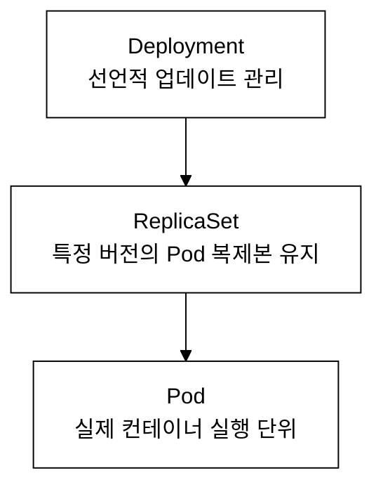
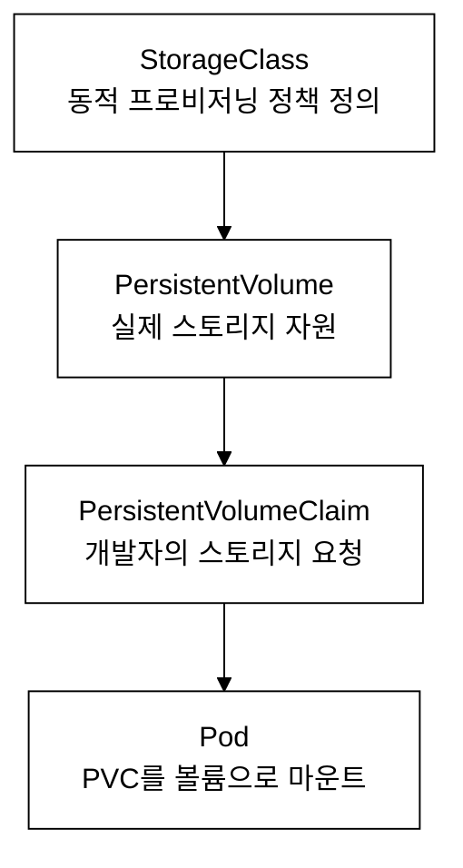
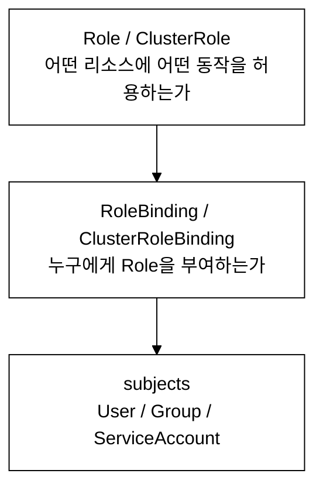

# KCNA 실전 예제 모음

> 이 문서는 KCNA 시험 준비를 위한 실전 YAML 예제와 kubectl 명령어를 종합적으로 정리한 것이다. 각 리소스의 등장 배경, YAML 필드의 존재 이유, 리소스 간 관계, 실무 트러블슈팅 팁을 포함한다.

---

## 목차

- [1. Pod](#1-pod)
- [2. Deployment](#2-deployment)
- [3. Service](#3-service)
- [4. ConfigMap](#4-configmap)
- [5. Secret](#5-secret)
- [6. PersistentVolume & PersistentVolumeClaim](#6-persistentvolume--persistentvolumeclaim)
- [7. StatefulSet](#7-statefulset)
- [8. DaemonSet](#8-daemonset)
- [9. Job & CronJob](#9-job--cronjob)
- [10. HPA (Horizontal Pod Autoscaler)](#10-hpa-horizontal-pod-autoscaler)
- [11. Ingress](#11-ingress)
- [12. NetworkPolicy](#12-networkpolicy)
- [13. RBAC](#13-rbac)
- [14. ResourceQuota & LimitRange](#14-resourcequota--limitrange)
- [15. Helm](#15-helm)
- [16. Kustomize](#16-kustomize)
- [17. GitOps 도구 (ArgoCD / Flux)](#17-gitops-도구-argocd--flux)
- [18. 모니터링 (Prometheus / Grafana)](#18-모니터링-prometheus--grafana)
- [19. kubectl 명령어 종합 정리](#19-kubectl-명령어-종합-정리)
- [부록: YAML 작성 팁](#부록-yaml-작성-팁)

---

## 실습 전 환경 설정

이 문서의 모든 kubectl 명령은 dev 클러스터를 기준으로 한다. 실습 시작 전 아래 설정을 터미널에 적용한다.

```bash
alias k=kubectl
export do='--dry-run=client -o yaml'
export KUBECONFIG=~/sideproejct/IaC_apple_sillicon/kubeconfig/dev.yaml
```

`alias k=kubectl`과 `export do`는 시험형 명령 단축 습관을 기르기 위한 설정이다. `KUBECONFIG`를 명시하지 않으면 기본 `~/.kube/config`를 참조하므로 의도와 다른 클러스터에 명령이 실행될 수 있다. 노드 SSH 접속은 `ssh dev-master` 별칭을 사용한다(`~/.ssh/config`에 등록, `tart ip`로 IP를 실시간 조회하는 ProxyCommand 방식).

---

## 1. Pod

### 1.1 등장 배경

컨테이너 기술 이전에는 애플리케이션을 VM 단위로 배포했다. VM은 OS 전체를 포함하므로 리소스 낭비가 심했다. Docker가 등장하면서 프로세스 수준의 격리가 가능해졌으나, 단일 컨테이너만으로는 로그 수집, 프록시 등 보조 기능을 함께 배치하기 어려웠다. Kubernetes는 Pod라는 추상 단위를 도입하여 하나 이상의 컨테이너를 동일 네트워크 네임스페이스와 스토리지를 공유하는 단위로 묶었다. Pod 내 컨테이너들은 localhost로 통신하며, 동일한 IP 주소를 공유한다.

### 1.2 Pod의 라이프사이클

Pod는 다음 Phase를 순서대로 거친다:
- **Pending**: 스케줄러가 노드를 배정하기 전 상태이다. 이미지 풀링 중에도 이 상태가 유지된다.
- **Running**: 최소 하나의 컨테이너가 실행 중인 상태이다.
- **Succeeded**: 모든 컨테이너가 정상 종료(exit code 0)한 상태이다.
- **Failed**: 최소 하나의 컨테이너가 비정상 종료한 상태이다.
- **Unknown**: 노드와 통신이 안 되는 상태이다.

### 1.3 기본 Pod YAML

```yaml
apiVersion: v1
kind: Pod
metadata:
  name: nginx-pod
  labels:
    app: nginx
    env: dev
  annotations:
    description: "기본 Nginx Pod 예제"
spec:
  containers:
  - name: nginx
    image: nginx:1.25
    ports:
    - containerPort: 80
    resources:
      requests:
        cpu: "100m"
        memory: "128Mi"
      limits:
        cpu: "250m"
        memory: "256Mi"
    livenessProbe:
      httpGet:
        path: /
        port: 80
      initialDelaySeconds: 10
      periodSeconds: 5
    readinessProbe:
      httpGet:
        path: /
        port: 80
      initialDelaySeconds: 5
      periodSeconds: 3
  restartPolicy: Always
```

**필드별 설명 및 기본값:**

> **QoS 클래스(Quality of Service Class)**: Pod의 리소스 부족 상황에서 우선순위를 결정하는 분류 기준이다. `requests`와 `limits` 설정 여부에 따라 Guaranteed(최우선 보호) / Burstable / BestEffort(가장 먼저 퇴거)로 나뉜다. 자세한 내용은 부록 §6을 참고한다.

| 필드 | 설명 | 생략 시 기본값 |
|------|------|----------------|
| `apiVersion` | API 그룹과 버전. Pod는 core 그룹이므로 `v1`이다 | 필수 |
| `metadata.labels` | 키-값 쌍으로 리소스를 분류한다. Service의 selector가 이 라벨을 참조한다 | 없음 |
| `metadata.annotations` | 라벨과 달리 selector로 사용 불가. 메타 정보 저장 용도이다 | 없음 |
| `spec.containers[].resources.requests` | 스케줄러가 노드 배정 시 참조하는 최소 요구량이다 | 제한 없음 (QoS: BestEffort) |
| `spec.containers[].resources.limits` | 초과 시 CPU는 스로틀링, 메모리는 OOMKill이 발생한다 | 제한 없음 |
| `spec.containers[].livenessProbe` | 실패 시 kubelet이 컨테이너를 재시작한다 | 없음 (항상 정상 간주) |
| `spec.containers[].readinessProbe` | 실패 시 Service의 Endpoints에서 제외된다 | 없음 (항상 Ready 간주) |
| `spec.restartPolicy` | 컨테이너 재시작 정책이다 | `Always` |
| `spec.containers[].ports[].containerPort` | 문서화 목적이며, 실제 포트 개방과는 무관하다 | 없음 |

**검증:**

> **실습 전제**: 클러스터가 가동 중이어야 한다. kubeconfig 경로는 `~/sideproejct/IaC_apple_sillicon/kubeconfig/dev.yaml`, SSH 접속은 `ssh dev-master` 별칭을 사용한다. 아래 예제는 `default` 네임스페이스를 기준으로 한다. IP 주소(예: `10.244.1.15`)는 클러스터·노드 환경마다 달라지므로 참고용 예시이다.

```bash
kubectl apply -f nginx-pod.yaml
kubectl get pod nginx-pod -n default -o wide
```

> **예시(참조) — NAME        READY   STATUS    RESTARTS   AGE  :** KCNA 개념/실습 기대 출력. 실측은 KCNA daily(day01~07) 및 본 캡처 참고.

```bash
kubectl describe pod nginx-pod
```

> **예시(참조) — Name:         nginx-pod:** KCNA 개념/실습 기대 출력. 실측은 KCNA daily(day01~07) 및 본 캡처 참고.

**트러블슈팅 팁:**
- `STATUS`가 `ImagePullBackOff`이면 이미지 이름/태그 오류 또는 레지스트리 인증 문제이다. `kubectl describe pod`의 Events 섹션을 확인한다.
- `STATUS`가 `CrashLoopBackOff`이면 컨테이너가 반복 비정상 종료하는 것이다. `kubectl logs <pod> --previous`로 이전 로그를 확인한다.
- `STATUS`가 `Pending`으로 지속되면 노드 리소스 부족 또는 스케줄링 조건 불일치이다. `kubectl describe pod`에서 Events의 FailedScheduling 메시지를 확인한다.

### 1.4 멀티컨테이너 Pod (Sidecar 패턴)

멀티컨테이너 패턴은 단일 책임 원칙을 유지하면서 보조 기능을 제공하기 위해 등장했다. 이전에는 애플리케이션 내부에 로깅, 프록시 로직을 직접 구현해야 했으며, 이는 코드 결합도를 높이고 재사용성을 떨어뜨렸다.

주요 패턴:
- **Sidecar**: 메인 컨테이너를 보조한다 (로그 수집, 프록시).
- **Ambassador**: 외부 서비스 접근을 프록시한다.
- **Adapter**: 메인 컨테이너의 출력을 표준 형식으로 변환한다.

```yaml
apiVersion: v1
kind: Pod
metadata:
  name: multi-container-pod
  labels:
    app: web-with-logging
spec:
  containers:
  # 메인 애플리케이션 컨테이너
  - name: app
    image: nginx:1.25
    ports:
    - containerPort: 80
    volumeMounts:
    - name: shared-logs
      mountPath: /var/log/nginx

  # 사이드카: 로그 수집 컨테이너
  - name: log-collector
    image: busybox:1.36
    command: ["sh", "-c", "tail -f /var/log/nginx/access.log"]
    volumeMounts:
    - name: shared-logs
      mountPath: /var/log/nginx

  volumes:
  - name: shared-logs
    emptyDir: {}
```

`emptyDir` 볼륨은 Pod가 노드에 배정될 때 생성되고, Pod가 삭제되면 함께 삭제된다. `medium: Memory`를 지정하면 tmpfs(RAM 기반)를 사용할 수 있다.

**검증:**

```bash
kubectl apply -f multi-container-pod.yaml
kubectl get pod multi-container-pod
```

> **예시(참조) — NAME                  READY   STATUS    RESTAR:** KCNA 개념/실습 기대 출력. 실측은 KCNA daily(day01~07) 및 본 캡처 참고.

`READY` 컬럼의 `2/2`는 Pod 내 2개 컨테이너가 모두 Ready 상태임을 의미한다.

```bash
# 사이드카 컨테이너 로그 확인
kubectl logs multi-container-pod -c log-collector

# 메인 컨테이너에 접속하여 로그 파일 확인
kubectl exec multi-container-pod -c app -- ls /var/log/nginx
```

> **예시(참조) — access.log:** KCNA 개념/실습 기대 출력. 실측은 KCNA daily(day01~07) 및 본 캡처 참고.

### 1.5 Init Container가 포함된 Pod

Init Container는 메인 컨테이너 시작 전 선행 조건을 충족시키기 위해 도입되었다. DB 마이그레이션, 설정 파일 다운로드, 의존 서비스 대기 등의 작업을 메인 컨테이너와 분리하여 관심사 분리를 달성한다. Init Container는 정의된 순서대로 하나씩 실행되며, 각각 성공(exit code 0)해야 다음 Init Container가 실행된다.

```yaml
apiVersion: v1
kind: Pod
metadata:
  name: init-container-pod
spec:
  initContainers:
  - name: init-db-check
    image: busybox:1.36
    command: ['sh', '-c', 'until nslookup my-database-service; do echo "DB 서비스 대기 중..."; sleep 2; done']
  - name: init-config
    image: busybox:1.36
    command: ['sh', '-c', 'echo "설정 초기화 완료" > /work-dir/config.txt']
    volumeMounts:
    - name: config-volume
      mountPath: /work-dir

  containers:
  - name: app
    image: nginx:1.25
    ports:
    - containerPort: 80
    volumeMounts:
    - name: config-volume
      mountPath: /usr/share/nginx/html

  volumes:
  - name: config-volume
    emptyDir: {}
```

**검증:**

```bash
kubectl apply -f init-container-pod.yaml
kubectl get pod init-container-pod
```

Init Container 실행 중일 때의 출력:

> **예시(참조) — NAME                 READY   STATUS     RESTAR:** KCNA 개념/실습 기대 출력. 실측은 KCNA daily(day01~07) 및 본 캡처 참고.

`Init:0/2`는 2개의 Init Container 중 0개가 완료되었음을 의미한다. 모든 Init Container가 완료되면 `STATUS`가 `Running`으로 변경된다.

```bash
# Init Container 로그 확인
kubectl logs init-container-pod -c init-db-check
```

**트러블슈팅 팁:**
- `Init:CrashLoopBackOff` 상태이면 Init Container가 실패하여 반복 재시작 중인 것이다. 해당 Init Container의 로그를 확인한다.
- `my-database-service`가 존재하지 않으면 `init-db-check`가 무한 대기한다. 의존 서비스의 Service 리소스가 먼저 생성되어야 한다.

---

## 2. Deployment

### 2.1 등장 배경

초기 Kubernetes에서 Pod를 직접 관리하면 Pod가 삭제되거나 노드 장애가 발생했을 때 자동 복구가 되지 않았다. ReplicationController가 도입되었으나 라벨 셀렉터가 등호 기반만 지원하는 등 제한이 있었다. ReplicaSet이 이를 개선했으나 Pod 템플릿이 변경(예: 이미지 업데이트)되면 운영자가 수동으로 새 ReplicaSet을 생성하고 replica 수를 조절해야 했다. 이 과정에서 신구 버전의 동시 실행 구간을 제어하거나 업데이트 실패 시 이전 ReplicaSet으로 되돌리는 작업이 복잡했다.

Deployment는 ReplicaSet 위에 선언적 업데이트, 롤백, 롤아웃 이력 관리를 추가한 상위 추상화이다. 이미지 변경 등 업데이트 시 새 ReplicaSet을 자동으로 생성하고 구 ReplicaSet의 replica 수를 점진적으로 0으로 줄여 신구 교체를 자동화한다. `revisionHistoryLimit`(기본값 10)으로 이전 ReplicaSet을 보존해 언제든 특정 리비전으로 롤백할 수 있다. 트레이드오프로는 Deployment가 ReplicaSet을 추가로 관리하므로, 특정 시점에는 구버전 ReplicaSet이 클러스터에 replica 0인 상태로 잔류한다.

### 2.2 Deployment → ReplicaSet → Pod 관계



_그림 1. Deployment, ReplicaSet, Pod 계층 관계._

- Deployment가 생성되면 내부적으로 ReplicaSet이 생성된다.
- 이미지 변경 등 업데이트 시 새 ReplicaSet이 생성되고, 기존 ReplicaSet의 replica 수는 점차 0으로 줄어든다.
- 롤백 시 이전 ReplicaSet의 replica 수를 다시 늘린다.
- `spec.revisionHistoryLimit` (기본값: 10)만큼 이전 ReplicaSet을 보존한다.

### 2.3 기본 Deployment YAML

```yaml
apiVersion: apps/v1
kind: Deployment
metadata:
  name: nginx-deployment
  labels:
    app: nginx
spec:
  replicas: 3
  selector:
    matchLabels:
      app: nginx
  strategy:
    type: RollingUpdate
    rollingUpdate:
      maxSurge: 1          # 추가로 생성 가능한 Pod 수
      maxUnavailable: 0    # 사용 불가능한 Pod 수 (0이면 무중단)
  template:
    metadata:
      labels:
        app: nginx
        version: v1
    spec:
      containers:
      - name: nginx
        image: nginx:1.25
        ports:
        - containerPort: 80
        resources:
          requests:
            cpu: "100m"
            memory: "128Mi"
          limits:
            cpu: "500m"
            memory: "256Mi"
        env:
        - name: NGINX_ENV
          value: "production"
```

**필드별 설명 및 기본값:**

| 필드 | 설명 | 생략 시 기본값 |
|------|------|----------------|
| `spec.replicas` | 유지할 Pod 복제본 수 | `1` |
| `spec.selector.matchLabels` | 관리 대상 Pod를 식별하는 라벨이다. `template.metadata.labels`와 일치해야 한다 | 필수 |
| `spec.strategy.type` | `RollingUpdate` 또는 `Recreate` | `RollingUpdate` |
| `spec.strategy.rollingUpdate.maxSurge` | 업데이트 중 초과 생성 가능한 Pod 수 또는 비율 | `25%` |
| `spec.strategy.rollingUpdate.maxUnavailable` | 업데이트 중 사용 불가 Pod 수 또는 비율 | `25%` |
| `spec.revisionHistoryLimit` | 보존할 이전 ReplicaSet 수 | `10` |
| `spec.progressDeadlineSeconds` | 업데이트 진행이 정체되었다고 판단하는 시간 | `600` (10분) |
| `spec.minReadySeconds` | Pod가 Ready 후 Available로 간주될 때까지의 대기 시간 | `0` |

**검증:**

```bash
kubectl apply -f nginx-deployment.yaml
kubectl get deployment nginx-deployment
```

> **예시(참조) — NAME               READY   UP-TO-DATE   AVAILA:** KCNA 개념/실습 기대 출력. 실측은 KCNA daily(day01~07) 및 본 캡처 참고.

```bash
# ReplicaSet 확인 — Deployment가 내부적으로 생성한 ReplicaSet을 확인한다
kubectl get replicaset -l app=nginx
```

> **예시(참조) — NAME                          DESIRED   CURREN:** KCNA 개념/실습 기대 출력. 실측은 KCNA daily(day01~07) 및 본 캡처 참고.

```bash
# Pod 확인 — ReplicaSet이 생성한 Pod들을 확인한다
kubectl get pods -l app=nginx -o wide
```

> **예시(참조) — NAME                                READY   ST:** KCNA 개념/실습 기대 출력. 실측은 KCNA daily(day01~07) 및 본 캡처 참고.

```bash
# 롤아웃 상태 확인
kubectl rollout status deployment nginx-deployment
```

> **예시(참조) — deployment "nginx-deployment" successfully rol:** KCNA 개념/실습 기대 출력. 실측은 KCNA daily(day01~07) 및 본 캡처 참고.

### 2.4 Recreate 전략 Deployment

RollingUpdate 전략은 구버전과 신버전이 동시에 실행되는 구간이 존재한다. DB 스키마 비호환 등 양립 불가능한 버전 전환 시에는 Recreate 전략을 사용한다. Recreate는 기존 Pod를 모두 종료한 후 새 Pod를 생성하므로 다운타임이 발생한다.

```yaml
apiVersion: apps/v1
kind: Deployment
metadata:
  name: app-recreate
spec:
  replicas: 3
  selector:
    matchLabels:
      app: myapp
  strategy:
    type: Recreate    # 기존 Pod를 모두 종료 후 새 Pod 생성
  template:
    metadata:
      labels:
        app: myapp
    spec:
      containers:
      - name: myapp
        image: myapp:2.0
        ports:
        - containerPort: 8080
```

**검증:**

```bash
kubectl apply -f app-recreate.yaml
kubectl rollout status deployment app-recreate
```

> **예시(참조) — Waiting for deployment "app-recreate" rollout :** KCNA 개념/실습 기대 출력. 실측은 KCNA daily(day01~07) 및 본 캡처 참고.

**트러블슈팅 팁:**
- `kubectl rollout status`가 오래 걸리면 `kubectl describe deployment`에서 Conditions를 확인한다. `Progressing` 조건이 `False`이면 `progressDeadlineSeconds`를 초과한 것이다.
- `AVAILABLE`이 `READY`보다 작으면 `minReadySeconds` 대기 중이거나 readinessProbe 실패 상태이다.

---

## 3. Service

### 3.1 등장 배경

Pod는 생성/삭제될 때마다 IP가 변경된다. Deployment가 롤링 업데이트를 수행하면 Pod IP가 계속 바뀌므로, 클라이언트가 Pod IP를 직접 참조하면 연결이 끊어진다. 이를 해결하기 위해 kube-proxy를 통한 iptables 규칙이 사용되었으나, Pod 목록이 바뀔 때마다 iptables를 수동 갱신해야 하는 문제가 있었다.

Service는 라벨 셀렉터로 Pod 집합을 추상화하고, 고정 ClusterIP와 DNS 이름(예: `nginx-clusterip.default.svc.cluster.local`)을 제공하여 이 문제를 해결한다. 핵심 개선점은 **동적 Endpoints 갱신**이다. Service는 내부적으로 Endpoints(또는 EndpointSlice) 리소스를 유지하며, Pod가 추가되거나 삭제될 때 Ready 상태인 Pod의 IP 목록을 자동으로 갱신한다. 클라이언트는 Service의 ClusterIP나 DNS 이름만 참조하면 되므로 Pod IP 변화를 신경 쓸 필요가 없다. 트레이드오프로는 ClusterIP는 클러스터 내부에서만 유효하며, 외부 노출을 위해서는 NodePort/LoadBalancer/Ingress를 추가로 구성해야 한다.

### 3.2 ClusterIP Service

```yaml
apiVersion: v1
kind: Service
metadata:
  name: nginx-clusterip
spec:
  type: ClusterIP      # 기본값이므로 생략 가능
  selector:
    app: nginx
  ports:
  - protocol: TCP
    port: 80            # 서비스 포트 (클러스터 내부에서 접근하는 포트)
    targetPort: 80      # Pod의 컨테이너 포트
```

**필드별 설명:**

| 필드 | 설명 | 생략 시 기본값 |
|------|------|----------------|
| `spec.type` | Service 유형 | `ClusterIP` |
| `spec.selector` | 대상 Pod를 선택하는 라벨이다. 생략하면 Endpoints를 수동 생성해야 한다 | 없음 |
| `spec.ports[].port` | Service가 노출하는 포트이다 | 필수 |
| `spec.ports[].targetPort` | 트래픽이 전달될 Pod의 포트이다 | `port`와 동일 |
| `spec.ports[].protocol` | 프로토콜이다 | `TCP` |
| `spec.sessionAffinity` | `None` 또는 `ClientIP`이다 | `None` |

클러스터 내부에서 `nginx-clusterip:80` 또는 `nginx-clusterip.default.svc.cluster.local:80`으로 접근 가능하다.

**검증:**

```bash
kubectl apply -f nginx-clusterip.yaml
kubectl get svc nginx-clusterip
```

> **예시(참조) — NAME              TYPE        CLUSTER-IP      :** KCNA 개념/실습 기대 출력. 실측은 KCNA daily(day01~07) 및 본 캡처 참고.

```bash
# Endpoints 확인 — selector와 일치하는 Ready Pod의 IP 목록이다
kubectl get endpoints nginx-clusterip
```

> **예시(참조) — NAME              ENDPOINTS                   :** KCNA 개념/실습 기대 출력. 실측은 KCNA daily(day01~07) 및 본 캡처 참고.

```bash
# 클러스터 내부에서 서비스 접근 테스트
kubectl run curl-test --image=curlimages/curl --rm -it --restart=Never -- curl -s nginx-clusterip:80
```

### 3.3 NodePort Service

```yaml
apiVersion: v1
kind: Service
metadata:
  name: nginx-nodeport
spec:
  type: NodePort
  selector:
    app: nginx
  ports:
  - protocol: TCP
    port: 80            # 서비스 포트
    targetPort: 80      # Pod의 컨테이너 포트
    nodePort: 30080     # 노드의 외부 포트 (30000-32767, 생략 시 자동 할당)
```

외부에서 `<노드IP>:30080`으로 접근 가능하다. NodePort는 모든 노드에서 동일한 포트를 개방한다.

**검증:**

```bash
kubectl apply -f nginx-nodeport.yaml
kubectl get svc nginx-nodeport
```

> **예시(참조) — NAME             TYPE       CLUSTER-IP     EXT:** KCNA 개념/실습 기대 출력. 실측은 KCNA daily(day01~07) 및 본 캡처 참고.

### 3.4 LoadBalancer Service

```yaml
apiVersion: v1
kind: Service
metadata:
  name: nginx-loadbalancer
spec:
  type: LoadBalancer
  selector:
    app: nginx
  ports:
  - protocol: TCP
    port: 80
    targetPort: 80
  externalTrafficPolicy: Local  # 클라이언트 소스 IP 보존
```

**`externalTrafficPolicy` 설명:**
- `Cluster` (기본값): 트래픽이 모든 노드의 Pod로 분산된다. 추가 홉이 발생하며 소스 IP가 SNAT된다.
- `Local`: 트래픽을 수신한 노드의 Pod에만 전달한다. 소스 IP가 보존되지만, 해당 노드에 Pod가 없으면 트래픽이 드롭된다.

**검증:**

```bash
kubectl apply -f nginx-loadbalancer.yaml
kubectl get svc nginx-loadbalancer
```

> **예시(참조) — NAME                 TYPE           CLUSTER-IP:** KCNA 개념/실습 기대 출력. 실측은 KCNA daily(day01~07) 및 본 캡처 참고.

온프레미스 환경에서는 `EXTERNAL-IP`가 `<pending>` 상태로 유지된다. MetalLB 같은 로드밸런서 구현체를 설치해야 한다.

### 3.5 ExternalName Service

```yaml
apiVersion: v1
kind: Service
metadata:
  name: external-db
spec:
  type: ExternalName
  externalName: database.example.com    # 외부 DNS 이름
```

클러스터 내부에서 `external-db`를 쿼리하면 coreDNS가 `database.example.com`을 응답으로 돌려줘, 클라이언트의 실제 DNS 쿼리가 외부 DNS 서버로 전달된다. 이는 DNS 레벨 CNAME과 유사한 효과를 제공하지만, ExternalName Service 자체는 실제 DNS 리소스 레코드(예: CNAME RR)를 생성하지 않는다. selector가 없으므로 Endpoints도 생성되지 않는다. 외부 서비스의 실제 주소를 클러스터 내부 DNS 별칭으로 추상화할 때 사용한다.

### 3.6 Headless Service (StatefulSet용)

```yaml
apiVersion: v1
kind: Service
metadata:
  name: nginx-headless
spec:
  clusterIP: None       # Headless Service
  selector:
    app: nginx
  ports:
  - port: 80
    targetPort: 80
```

`clusterIP: None`을 설정하면 kube-proxy가 로드밸런싱을 수행하지 않는다. DNS 쿼리 시 Service IP 대신 개별 Pod IP 목록이 반환된다. StatefulSet과 함께 사용하면 각 Pod에 `<pod-name>.<service-name>.<namespace>.svc.cluster.local` 형태의 고유 DNS가 부여된다.

**검증:**

```bash
kubectl apply -f nginx-headless.yaml
# DNS 조회로 개별 Pod IP 확인
kubectl run dns-test --image=busybox:1.36 --rm -it --restart=Never -- nslookup nginx-headless
```

> **예시(참조) — Name:      nginx-headless.default.svc.cluster.:** KCNA 개념/실습 기대 출력. 실측은 KCNA daily(day01~07) 및 본 캡처 참고.

---

## 4. ConfigMap

### 4.1 등장 배경

애플리케이션 설정을 컨테이너 이미지에 포함시키면, 설정 변경 시마다 이미지를 다시 빌드해야 한다. 환경 변수를 Pod spec에 직접 넣으면 Deployment YAML이 환경별로 분기되어 관리 복잡도가 증가한다. ConfigMap은 설정 데이터를 별도 리소스로 분리하여 이미지와 설정의 결합을 제거한다.

### 4.2 kubectl로 ConfigMap 생성

```bash
# 리터럴 값으로 생성
kubectl create configmap app-config \
  --from-literal=DB_HOST=mysql-service \
  --from-literal=DB_PORT=3306 \
  --from-literal=LOG_LEVEL=info

# 파일로 생성
kubectl create configmap nginx-config \
  --from-file=nginx.conf

# 디렉토리의 모든 파일로 생성
kubectl create configmap app-configs \
  --from-file=config/

# ConfigMap 조회
kubectl get configmap app-config -o yaml
kubectl describe configmap app-config
```

**검증:**

```bash
kubectl get configmap app-config -o yaml
```

> **예시(참조) — apiVersion: v1:** KCNA 개념/실습 기대 출력. 실측은 KCNA daily(day01~07) 및 본 캡처 참고.

### 4.3 YAML로 ConfigMap 정의

```yaml
apiVersion: v1
kind: ConfigMap
metadata:
  name: app-config
data:
  DB_HOST: "mysql-service"
  DB_PORT: "3306"
  LOG_LEVEL: "info"
  app.properties: |
    server.port=8080
    spring.datasource.url=jdbc:mysql://mysql-service:3306/mydb
    logging.level.root=INFO
```

`data` 필드의 값은 항상 문자열이다. 숫자도 따옴표로 감싸야 한다. `|`(리터럴 블록 스칼라)를 사용하면 여러 줄의 설정 파일을 하나의 키에 저장할 수 있다.

### 4.4 Pod에서 ConfigMap을 환경 변수로 사용

```yaml
apiVersion: v1
kind: Pod
metadata:
  name: app-with-config-env
spec:
  containers:
  - name: app
    image: myapp:1.0
    env:
    # 개별 키를 환경 변수로 매핑
    - name: DATABASE_HOST
      valueFrom:
        configMapKeyRef:
          name: app-config
          key: DB_HOST
    - name: DATABASE_PORT
      valueFrom:
        configMapKeyRef:
          name: app-config
          key: DB_PORT
    # ConfigMap의 모든 키를 환경 변수로 한번에 로드
    envFrom:
    - configMapRef:
        name: app-config
```

**검증:**

```bash
kubectl apply -f app-with-config-env.yaml
kubectl exec app-with-config-env -- env | grep -E "DATABASE_HOST|DATABASE_PORT|DB_HOST|LOG_LEVEL"
```

> **예시(참조) — DATABASE_HOST=mysql-service:** KCNA 개념/실습 기대 출력. 실측은 KCNA daily(day01~07) 및 본 캡처 참고.

환경 변수로 주입된 ConfigMap은 Pod 재시작 없이는 갱신되지 않는다.

### 4.5 Pod에서 ConfigMap을 볼륨으로 마운트

```yaml
apiVersion: v1
kind: Pod
metadata:
  name: app-with-config-volume
spec:
  containers:
  - name: app
    image: myapp:1.0
    volumeMounts:
    - name: config-volume
      mountPath: /etc/config    # 이 디렉토리에 ConfigMap의 각 키가 파일로 생성된다
      readOnly: true
  volumes:
  - name: config-volume
    configMap:
      name: app-config
      items:                    # 특정 키만 마운트 (생략 시 모든 키 마운트)
      - key: app.properties
        path: application.properties   # 파일명 지정
```

볼륨으로 마운트된 ConfigMap은 kubelet이 주기적으로(기본 약 60초) 갱신한다.

> ⚠️ **자동 갱신 주의사항**: ConfigMap/Secret을 볼륨으로 마운트한 경우, kubelet이 약 60초(`--sync-frequency` 설정 가능) 간격으로 변경을 감지해 자동으로 파일을 업데이트한다. 단, `subPath`를 사용한 마운트(예: 특정 키 하나만 선택해 특정 경로에 직접 마운트)는 자동 갱신이 되지 않으므로 ConfigMap 변경 후 Pod를 재시작해야 반영된다. 환경 변수로 주입된 ConfigMap 역시 Pod 재시작 없이는 갱신되지 않는다.

**검증:**

```bash
kubectl apply -f app-with-config-volume.yaml
kubectl exec app-with-config-volume -- cat /etc/config/application.properties
```

> **예시(참조) — server.port=8080:** KCNA 개념/실습 기대 출력. 실측은 KCNA daily(day01~07) 및 본 캡처 참고.

---

## 5. Secret

### 5.1 등장 배경

ConfigMap은 평문 데이터를 저장한다. 비밀번호, API 키, TLS 인증서 같은 민감 정보를 ConfigMap에 넣으면 `kubectl get configmap -o yaml`로 누구나 평문 조회가 가능하다. Secret은 etcd에 base64 인코딩(기본) 또는 암호화(EncryptionConfiguration 설정 시)하여 저장하며, RBAC으로 접근 제어를 분리할 수 있다. 단, base64는 인코딩이지 암호화가 아니므로 etcd 암호화를 별도로 설정해야 실제 보안이 확보된다.

### 5.2 kubectl로 Secret 생성

```bash
# 리터럴 값으로 생성
kubectl create secret generic db-credentials \
  --from-literal=username=admin \
  --from-literal=password='S3cur3P@ss!'

# 파일로 생성
kubectl create secret generic tls-certs \
  --from-file=tls.crt=server.crt \
  --from-file=tls.key=server.key

# Docker 레지스트리 인증 Secret 생성
kubectl create secret docker-registry my-registry-secret \
  --docker-server=registry.example.com \
  --docker-username=user \
  --docker-password=password \
  --docker-email=user@example.com

# Secret 조회
kubectl get secret db-credentials -o yaml
# Base64 디코딩
kubectl get secret db-credentials -o jsonpath='{.data.password}' | base64 -d
```

**검증:**

```bash
kubectl get secret db-credentials
```

> **예시(참조) — NAME             TYPE     DATA   AGE:** KCNA 개념/실습 기대 출력. 실측은 KCNA daily(day01~07) 및 본 캡처 참고.

```bash
kubectl get secret db-credentials -o jsonpath='{.data.username}' | base64 -d
```

> **예시(참조) — admin:** KCNA 개념/실습 기대 출력. 실측은 KCNA daily(day01~07) 및 본 캡처 참고.

### 5.3 YAML로 Secret 정의

```yaml
apiVersion: v1
kind: Secret
metadata:
  name: db-credentials
type: Opaque
data:
  # 값은 Base64로 인코딩해야 한다
  # echo -n 'admin' | base64 => YWRtaW4=
  username: YWRtaW4=
  # echo -n 'S3cur3P@ss!' | base64 => UzNjdXIzUEBzcyE=
  password: UzNjdXIzUEBzcyE=
---
# stringData를 사용하면 평문으로 작성 가능 (K8s가 자동으로 Base64 인코딩)
apiVersion: v1
kind: Secret
metadata:
  name: db-credentials-plain
type: Opaque
stringData:
  username: admin
  password: "S3cur3P@ss!"
```

**Secret 타입:**

| type | 용도 |
|------|------|
| `Opaque` | 범용 (기본값) |
| `kubernetes.io/tls` | TLS 인증서 (`tls.crt`, `tls.key` 키 필수) |
| `kubernetes.io/dockerconfigjson` | Docker 레지스트리 인증 |
| `kubernetes.io/service-account-token` | ServiceAccount 토큰 (자동 생성) |
| `kubernetes.io/basic-auth` | 기본 인증 (`username`, `password` 키) |

### 5.4 Pod에서 Secret 사용

```yaml
apiVersion: v1
kind: Pod
metadata:
  name: app-with-secret
spec:
  containers:
  - name: app
    image: myapp:1.0
    # 환경 변수로 Secret 사용
    env:
    - name: DB_USERNAME
      valueFrom:
        secretKeyRef:
          name: db-credentials
          key: username
    - name: DB_PASSWORD
      valueFrom:
        secretKeyRef:
          name: db-credentials
          key: password
    # 볼륨으로 Secret 마운트
    volumeMounts:
    - name: secret-volume
      mountPath: /etc/secrets
      readOnly: true
  # Docker 레지스트리 Secret 사용
  imagePullSecrets:
  - name: my-registry-secret
  volumes:
  - name: secret-volume
    secret:
      secretName: db-credentials
      defaultMode: 0400    # 파일 권한 설정
```

**검증:**

```bash
kubectl apply -f app-with-secret.yaml
kubectl exec app-with-secret -- env | grep DB_
```

> **예시(참조) — DB_USERNAME=admin:** KCNA 개념/실습 기대 출력. 실측은 KCNA daily(day01~07) 및 본 캡처 참고.

```bash
kubectl exec app-with-secret -- ls -la /etc/secrets/
```

> **예시(참조) — total 0:** KCNA 개념/실습 기대 출력. 실측은 KCNA daily(day01~07) 및 본 캡처 참고.

Secret 볼륨의 파일은 심볼릭 링크로 관리되며, 업데이트 시 원자적으로 교체된다.

---

## 6. PersistentVolume & PersistentVolumeClaim

### 6.1 등장 배경

Pod는 기본적으로 임시(ephemeral) 스토리지를 사용한다. Pod가 삭제되면 데이터가 함께 사라진다. 초기에는 Pod spec에 직접 NFS 서버 주소, iSCSI 타겟 IQN 등 스토리지 인프라 상세를 기술했다. 이 방식은 개발자가 스토리지 인프라 세부사항을 직접 알아야 하고, 스토리지 서버가 변경되면 모든 Pod YAML을 수정해야 하는 관리 부담이 있었다.

PersistentVolume(PV)과 PersistentVolumeClaim(PVC) 모델은 스토리지 프로비저닝(관리자 역할)과 소비(개발자 역할)를 분리하여 이 문제를 해결한다. 관리자는 NFS·iSCSI·클라우드 디스크 등 인프라 상세를 PV에 캡슐화하고, 개발자는 PVC로 필요한 용량과 접근 모드만 요청하면 된다. StorageClass의 도입으로 동적 프로비저닝이 가능해져 PVC 생성 시 PV가 자동으로 만들어지므로 관리자가 PV를 미리 생성할 필요도 없어졌다. 트레이드오프로는 PV/PVC/StorageClass 세 레이어가 추가되어 초기 설정 복잡도가 증가한다.

### 6.2 PV → PVC → Pod 관계



_그림 2. StorageClass, PV, PVC, Pod 계층 관계._

PVC가 생성되면 컨트롤러가 조건(용량, accessModes, storageClassName)에 맞는 PV를 찾아 바인딩한다. 적합한 PV가 없고 StorageClass가 지정되어 있으면 동적으로 PV를 생성한다.

### 6.3 PersistentVolume (PV)

```yaml
apiVersion: v1
kind: PersistentVolume
metadata:
  name: my-pv
  labels:
    type: local
spec:
  capacity:
    storage: 10Gi
  accessModes:
  - ReadWriteOnce              # 하나의 노드에서 읽기/쓰기
  persistentVolumeReclaimPolicy: Retain   # PVC 삭제 시 PV 보존
  storageClassName: manual
  hostPath:
    path: /data/my-pv          # 노드의 로컬 경로 (테스트 용도)
---
# NFS PV 예제
apiVersion: v1
kind: PersistentVolume
metadata:
  name: nfs-pv
spec:
  capacity:
    storage: 50Gi
  accessModes:
  - ReadWriteMany              # 여러 노드에서 읽기/쓰기
  persistentVolumeReclaimPolicy: Retain
  storageClassName: nfs
  nfs:
    server: 192.168.1.100
    path: /exports/data
```

**accessModes:**

| 모드 | 약어 | 설명 |
|------|------|------|
| `ReadWriteOnce` | RWO | 단일 노드에서 읽기/쓰기 가능 |
| `ReadOnlyMany` | ROX | 여러 노드에서 읽기만 가능 |
| `ReadWriteMany` | RWX | 여러 노드에서 읽기/쓰기 가능 |
| `ReadWriteOncePod` | RWOP | 단일 Pod에서만 읽기/쓰기 가능 (K8s 1.27+) |

**persistentVolumeReclaimPolicy:**

| 정책 | 설명 |
|------|------|
| `Retain` | PVC 삭제 후 PV와 데이터를 보존한다. 수동 정리 필요 |
| `Delete` | PVC 삭제 시 PV와 실제 스토리지를 함께 삭제한다 |
| `Recycle` | 데이터를 삭제(`rm -rf /volume/*`)하고 PV를 재사용한다 (deprecated) |

### 6.4 PersistentVolumeClaim (PVC)

```yaml
apiVersion: v1
kind: PersistentVolumeClaim
metadata:
  name: my-pvc
spec:
  accessModes:
  - ReadWriteOnce
  resources:
    requests:
      storage: 5Gi             # 요청 용량 (PV의 용량 이하)
  storageClassName: manual     # PV의 storageClassName과 일치해야 한다
```

**검증:**

```bash
kubectl apply -f my-pv.yaml
kubectl apply -f my-pvc.yaml
kubectl get pv
```

> **예시(참조) — NAME    CAPACITY   ACCESS MODES   RECLAIM POLI:** KCNA 개념/실습 기대 출력. 실측은 KCNA daily(day01~07) 및 본 캡처 참고.

```bash
kubectl get pvc
```

> **예시(참조) — NAME     STATUS   VOLUME   CAPACITY   ACCESS M:** KCNA 개념/실습 기대 출력. 실측은 KCNA daily(day01~07) 및 본 캡처 참고.

STATUS가 `Bound`이면 PV와 PVC가 정상 바인딩된 것이다. `Pending`이면 조건에 맞는 PV가 없거나 StorageClass 프로비저너가 동작하지 않는 것이다.

### 6.5 Pod에서 PVC 사용

```yaml
apiVersion: v1
kind: Pod
metadata:
  name: app-with-pvc
spec:
  containers:
  - name: app
    image: myapp:1.0
    volumeMounts:
    - name: data-volume
      mountPath: /app/data
  volumes:
  - name: data-volume
    persistentVolumeClaim:
      claimName: my-pvc
```

**검증:**

```bash
kubectl apply -f app-with-pvc.yaml
kubectl exec app-with-pvc -- df -h /app/data
```

> **예시(참조) — Filesystem      Size  Used Avail Use% Mounted :** KCNA 개념/실습 기대 출력. 실측은 KCNA daily(day01~07) 및 본 캡처 참고.

### 6.6 StorageClass (동적 프로비저닝)

```yaml
apiVersion: storage.k8s.io/v1
kind: StorageClass
metadata:
  name: fast-ssd
provisioner: kubernetes.io/aws-ebs   # AWS EBS 프로비저너
parameters:
  type: gp3
  fsType: ext4
reclaimPolicy: Delete
volumeBindingMode: WaitForFirstConsumer   # Pod 스케줄링 시 바인딩
allowVolumeExpansion: true                # 볼륨 확장 허용
---
# 동적 프로비저닝을 사용하는 PVC
apiVersion: v1
kind: PersistentVolumeClaim
metadata:
  name: dynamic-pvc
spec:
  accessModes:
  - ReadWriteOnce
  resources:
    requests:
      storage: 20Gi
  storageClassName: fast-ssd    # StorageClass를 지정하면 PV가 자동 생성된다
```

**volumeBindingMode:**
- `Immediate` (기본값): PVC 생성 즉시 PV를 프로비저닝하고 바인딩한다. Pod 스케줄링 전에 볼륨이 생성되므로, 볼륨이 생성된 가용 영역(AZ, Availability Zone)과 Pod가 배정될 노드의 AZ가 달라 스케줄링 실패가 발생할 수 있다. 단일 존(AZ) 환경이나 로컬 스토리지가 아닌 경우에는 문제가 없다.
- `WaitForFirstConsumer`: Pod가 먼저 스케줄링될 노드가 결정된 후, 그 노드와 동일한 AZ에 볼륨을 프로비저닝한다. 멀티 AZ 클러스터에서 스토리지 네트워크 지연을 최소화하고 스케줄링 실패를 방지한다. AWS EBS, GCE PD 같은 존 한정 스토리지를 사용할 때 권장된다.

**검증:**

```bash
kubectl apply -f fast-ssd-sc.yaml
kubectl apply -f dynamic-pvc.yaml
kubectl get sc
```

> **예시(참조) — NAME       PROVISIONER              RECLAIMPOL:** KCNA 개념/실습 기대 출력. 실측은 KCNA daily(day01~07) 및 본 캡처 참고.

---

## 7. StatefulSet

### 7.1 등장 배경

Deployment는 Pod에 고유 ID를 부여하지 않는다. Pod 이름은 랜덤 해시이며, 순서가 보장되지 않는다. MySQL, PostgreSQL, Kafka 같은 상태 유지(stateful) 애플리케이션은 고유한 네트워크 식별자, 안정적인 스토리지, 순서 보장이 필요하다. StatefulSet은 이러한 요구사항을 충족한다. 트레이드오프로는 롤링 업데이트 시 Pod를 0번부터 순서대로 교체하므로 Deployment의 롤링 업데이트보다 속도가 느리고, `volumeClaimTemplates`로 생성된 PVC는 StatefulSet을 삭제해도 자동으로 삭제되지 않아 수동 정리가 필요하다(`kubectl delete pvc -l app=<이름>`).

### 7.2 StatefulSet의 특성

- Pod 이름이 순차적이고 고정적이다 (`mysql-0`, `mysql-1`, `mysql-2`).
- 생성은 0번부터 순서대로, 삭제는 역순으로 진행된다.
- `volumeClaimTemplates`로 각 Pod에 독립적인 PVC가 생성된다.
- Headless Service와 함께 사용하면 각 Pod에 고유 DNS가 부여된다.
- Pod가 재생성되어도 동일한 이름과 PVC를 유지한다.

```yaml
apiVersion: apps/v1
kind: StatefulSet
metadata:
  name: mysql
spec:
  serviceName: mysql-headless    # Headless Service 이름
  replicas: 3
  selector:
    matchLabels:
      app: mysql
  template:
    metadata:
      labels:
        app: mysql
    spec:
      containers:
      - name: mysql
        image: mysql:8.0
        ports:
        - containerPort: 3306
        env:
        - name: MYSQL_ROOT_PASSWORD
          valueFrom:
            secretKeyRef:
              name: mysql-secret
              key: root-password
        volumeMounts:
        - name: data
          mountPath: /var/lib/mysql
  volumeClaimTemplates:          # 각 Pod에 독립적인 PVC가 생성된다
  - metadata:
      name: data
    spec:
      accessModes: ["ReadWriteOnce"]
      storageClassName: fast-ssd
      resources:
        requests:
          storage: 10Gi
```

**검증:**

```bash
kubectl apply -f mysql-statefulset.yaml
kubectl get statefulset mysql
```

> **예시(참조) — NAME    READY   AGE:** KCNA 개념/실습 기대 출력. 실측은 KCNA daily(day01~07) 및 본 캡처 참고.

```bash
kubectl get pods -l app=mysql
```

> **예시(참조) — NAME      READY   STATUS    RESTARTS   AGE:** KCNA 개념/실습 기대 출력. 실측은 KCNA daily(day01~07) 및 본 캡처 참고.

Pod가 순서대로 생성되었음을 AGE로 확인할 수 있다.

```bash
kubectl get pvc -l app=mysql
```

> **예시(참조) — NAME           STATUS   VOLUME                :** KCNA 개념/실습 기대 출력. 실측은 KCNA daily(day01~07) 및 본 캡처 참고.

DNS 접근: `mysql-0.mysql-headless.default.svc.cluster.local`로 개별 Pod에 접근 가능하다.

**트러블슈팅 팁:**
- StatefulSet 삭제 시 PVC는 자동 삭제되지 않는다. 데이터 보존을 위한 안전장치이다. 수동으로 `kubectl delete pvc -l app=mysql`을 실행해야 한다.
- Pod가 `Pending` 상태이면 PVC 바인딩 실패 가능성이 높다. `kubectl describe pvc`로 이벤트를 확인한다.

---

## 8. DaemonSet

### 8.1 등장 배경

로그 수집(Fluentd), 모니터링 에이전트(node-exporter), 네트워크 플러그인(Calico, Cilium) 등은 모든 노드에 정확히 하나의 Pod가 실행되어야 한다. Deployment로는 특정 노드에 Pod가 배치되지 않을 수 있고, replica 수를 노드 수에 맞춰 수동 관리해야 한다. DaemonSet은 노드가 추가되면 자동으로 Pod를 배포하고, 노드가 제거되면 Pod를 정리한다. 트레이드오프로는 모든 노드에 강제 배포하므로 `resources.requests`를 설정하지 않으면 노드 전체에 BestEffort Pod가 산포되어 노드 과부하 위험이 있다. 반드시 적절한 requests/limits를 설정해야 한다.

```yaml
apiVersion: apps/v1
kind: DaemonSet
metadata:
  name: fluentd
  namespace: kube-system
  labels:
    app: fluentd
spec:
  selector:
    matchLabels:
      app: fluentd
  template:
    metadata:
      labels:
        app: fluentd
    spec:
      tolerations:
      - key: node-role.kubernetes.io/control-plane
        effect: NoSchedule       # 마스터 노드에도 배포 허용
      containers:
      - name: fluentd
        image: fluentd:v1.16
        resources:
          limits:
            cpu: "200m"
            memory: "200Mi"
          requests:
            cpu: "100m"
            memory: "100Mi"
        volumeMounts:
        - name: varlog
          mountPath: /var/log
        - name: containers
          mountPath: /var/log/pods    # containerd 런타임은 /var/log/pods에 로그를 기록한다. docker 런타임은 /var/lib/docker/containers를 사용한다.
          readOnly: true
      volumes:
      - name: varlog
        hostPath:
          path: /var/log
      - name: containers
        hostPath:
          path: /var/log/pods    # containerd 환경 기준. docker 런타임은 /var/lib/docker/containers로 변경한다.
```

`tolerations` 필드가 없으면 control-plane 노드의 taint(`node-role.kubernetes.io/control-plane:NoSchedule`)로 인해 해당 노드에는 Pod가 배포되지 않는다.

**검증:**

```bash
kubectl get daemonset -n kube-system fluentd
```

> **예시(참조) — NAME      DESIRED   CURRENT   READY   UP-TO-DA:** KCNA 개념/실습 기대 출력. 실측은 KCNA daily(day01~07) 및 본 캡처 참고.

`DESIRED`는 클러스터 내 노드 수와 일치해야 한다. `READY`가 `DESIRED`보다 작으면 일부 노드에서 Pod가 정상 실행되지 않는 것이다.

```bash
kubectl get pods -n kube-system -l app=fluentd -o wide
```

> **예시(참조) — NAME            READY   STATUS    RESTARTS   A:** KCNA 개념/실습 기대 출력. 실측은 KCNA daily(day01~07) 및 본 캡처 참고.

---

## 9. Job & CronJob

### 9.1 등장 배경

Deployment/DaemonSet은 항상 실행 상태를 유지하는 장기 실행(long-running) 워크로드를 위한 것이다. 데이터 마이그레이션, 배치 처리, 일회성 작업은 완료되면 종료되어야 한다. Job은 지정된 횟수의 성공적 완료를 보장하며, CronJob은 Job을 정해진 스케줄에 따라 반복 생성한다. 트레이드오프로는 완료된 Job과 Pod가 자동으로 삭제되지 않아 클러스터에 잔류하므로 `ttlSecondsAfterFinished`를 설정하거나 수동 정리가 필요하다. CronJob의 경우 클러스터가 스케줄 시각에 다운되어 있으면 `startingDeadlineSeconds`를 초과한 실행이 누락(skipped)된다는 점도 주의가 필요하다.

### 9.2 Job

```yaml
apiVersion: batch/v1
kind: Job
metadata:
  name: data-migration
spec:
  completions: 5          # 5개 Pod가 성공적으로 완료되어야 한다
  parallelism: 2           # 동시에 2개 Pod를 실행한다
  backoffLimit: 3          # 최대 3번 재시도한다
  activeDeadlineSeconds: 600  # 최대 10분 실행
  template:
    spec:
      containers:
      - name: migration
        image: myapp:migrate
        command: ["python", "migrate.py"]
        env:
        - name: DB_HOST
          value: "mysql-service"
      restartPolicy: Never    # Job에서는 Never 또는 OnFailure만 허용된다
```

**필드별 설명:**

| 필드 | 설명 | 생략 시 기본값 |
|------|------|----------------|
| `completions` | 성공 완료해야 할 Pod 수 | `1` |
| `parallelism` | 동시 실행 Pod 수 | `1` |
| `backoffLimit` | 실패 시 재시도 횟수 | `6` |
| `activeDeadlineSeconds` | 전체 Job의 실행 제한 시간(초) | 없음 (무제한) |
| `ttlSecondsAfterFinished` | 완료 후 자동 삭제까지 대기 시간(초) | 없음 (자동 삭제 안 함) |

`restartPolicy: Never`이면 실패한 Pod는 재시작되지 않고 새 Pod가 생성된다. `OnFailure`이면 동일 Pod 내에서 컨테이너가 재시작된다.

**검증:**

```bash
kubectl apply -f data-migration.yaml
kubectl get job data-migration
```

> **예시(참조) — NAME             COMPLETIONS   DURATION   AGE:** KCNA 개념/실습 기대 출력. 실측은 KCNA daily(day01~07) 및 본 캡처 참고.

```bash
kubectl get pods -l job-name=data-migration
```

> **예시(참조) — NAME                     READY   STATUS      R:** KCNA 개념/실습 기대 출력. 실측은 KCNA daily(day01~07) 및 본 캡처 참고.

### 9.3 CronJob

```yaml
apiVersion: batch/v1
kind: CronJob
metadata:
  name: daily-backup
spec:
  schedule: "0 2 * * *"         # 매일 새벽 2시에 실행
  concurrencyPolicy: Forbid     # 이전 Job이 실행 중이면 건너뛴다
  successfulJobsHistoryLimit: 3 # 성공한 Job 이력 3개 유지
  failedJobsHistoryLimit: 1     # 실패한 Job 이력 1개 유지
  startingDeadlineSeconds: 300  # 스케줄 후 5분 내에 시작 못하면 건너뛴다
  jobTemplate:
    spec:
      template:
        spec:
          containers:
          - name: backup
            image: myapp:backup
            command: ["/bin/sh", "-c", "pg_dump mydb > /backup/dump_$(date +%Y%m%d).sql"]
            volumeMounts:
            - name: backup-storage
              mountPath: /backup
          volumes:
          - name: backup-storage
            persistentVolumeClaim:
              claimName: backup-pvc
          restartPolicy: OnFailure
```

**concurrencyPolicy 옵션:**

| 정책 | 설명 |
|------|------|
| `Allow` | 동시 실행 허용 (기본값) |
| `Forbid` | 이전 Job 실행 중이면 새 Job 생성을 건너뛴다 |
| `Replace` | 이전 Job을 취소하고 새 Job을 생성한다 |

**검증:**

```bash
kubectl get cronjob daily-backup
```

> **예시(참조) — NAME           SCHEDULE    SUSPEND   ACTIVE   :** KCNA 개념/실습 기대 출력. 실측은 KCNA daily(day01~07) 및 본 캡처 참고.

```bash
# 수동 트리거로 테스트
kubectl create job --from=cronjob/daily-backup daily-backup-manual
kubectl get jobs -l job-name=daily-backup-manual
```

---

## 10. HPA (Horizontal Pod Autoscaler)

### 10.1 등장 배경

고정된 replica 수로 운영하면 트래픽 급증 시 성능 저하, 트래픽 감소 시 리소스 낭비가 발생한다. 수동 스케일링은 운영자의 개입이 필요하며 대응 속도가 느리다. HPA는 메트릭(CPU, 메모리, 커스텀 메트릭)을 기준으로 Pod 수를 자동 조절한다. HPA 컨트롤러는 기본 15초 간격으로 메트릭을 수집하고 `desiredReplicas = ceil(currentReplicas * (currentMetricValue / desiredMetricValue))` 공식으로 목표 replica 수를 계산한다. 트레이드오프로는 HPA는 Pod 수만 조절하므로, 개별 Pod의 CPU/메모리 할당량 자체를 늘리는 VPA(Vertical Pod Autoscaler)나 노드 수를 조절하는 Cluster Autoscaler(CA)와는 역할이 다르다.

> **HPA vs VPA vs Cluster Autoscaler 비교**: 세 스케일링 전략은 서로 다른 계층을 다루며 KCNA 시험에서 구분 문제가 출제된다.
>
> | 전략 | 대상 | 조절 단위 | 언제 사용하나 |
> |------|------|-----------|--------------|
> | HPA (Horizontal Pod Autoscaler) | Deployment/StatefulSet 등 | Pod 수(replica) | 트래픽 급증에 대응하여 인스턴스를 늘릴 때 |
> | VPA (Vertical Pod Autoscaler) | 개별 Pod | Pod의 CPU/메모리 requests/limits | 단일 Pod가 처리하는 작업량이 늘어 더 많은 자원이 필요할 때. Pod 재시작이 필요하므로 장기 실행 워크로드에 주의 |
> | CA (Cluster Autoscaler) | 클러스터 노드 | 노드 수 | Pending Pod가 발생해 노드를 추가해야 할 때. HPA와 연계하여 HPA가 늘린 Pod를 수용할 노드를 CA가 확보하는 형태로 조합된다 |

### 10.2 전제 조건

HPA가 동작하려면:
1. **metrics-server**가 설치되어 있어야 한다.
2. 대상 Pod에 **`resources.requests`**가 설정되어 있어야 한다 (CPU/메모리 Utilization 메트릭 사용 시).

```bash
# metrics-server 설치 확인
kubectl get deployment metrics-server -n kube-system
```

> **예시(참조) — NAME             READY   UP-TO-DATE   AVAILABL:** KCNA 개념/실습 기대 출력. 실측은 KCNA daily(day01~07) 및 본 캡처 참고.

### 10.3 kubectl로 HPA 생성

> **CPU Utilization % 의미**: HPA의 CPU 사용률은 Pod에 설정된 `resources.requests.cpu` 대비 현재 실제 사용량의 백분율이다. 예를 들어 `requests.cpu: 100m`이고 실제 사용량이 70m이면 70%이다. `requests.cpu`가 설정되지 않으면 HPA가 메트릭을 계산할 수 없어 `<unknown>` 상태가 된다.

```bash
# CPU 사용률 70%를 기준으로 자동 스케일링 (최소 2, 최대 10)
kubectl autoscale deployment nginx-deployment \
  --min=2 \
  --max=10 \
  --cpu-percent=70

# HPA 상태 확인
kubectl get hpa
kubectl describe hpa nginx-deployment
```

**검증:**

```bash
kubectl get hpa
```

> **예시(참조) — NAME               REFERENCE                  :** KCNA 개념/실습 기대 출력. 실측은 KCNA daily(day01~07) 및 본 캡처 참고.

`TARGETS`의 `25%/70%`는 현재 CPU 사용률 25%, 목표 70%를 의미한다.

### 10.4 HPA YAML (v2 API)

```yaml
apiVersion: autoscaling/v2
kind: HorizontalPodAutoscaler
metadata:
  name: nginx-hpa
spec:
  scaleTargetRef:
    apiVersion: apps/v1
    kind: Deployment
    name: nginx-deployment
  minReplicas: 2
  maxReplicas: 10
  metrics:
  - type: Resource
    resource:
      name: cpu
      target:
        type: Utilization
        averageUtilization: 70    # 평균 CPU 사용률 70%
  - type: Resource
    resource:
      name: memory
      target:
        type: Utilization
        averageUtilization: 80    # 평균 메모리 사용률 80%
  behavior:
    scaleDown:
      stabilizationWindowSeconds: 300  # 스케일다운 안정화 기간 (5분)
      policies:
      - type: Percent
        value: 10
        periodSeconds: 60              # 1분마다 최대 10% 축소
    scaleUp:
      stabilizationWindowSeconds: 0
      policies:
      - type: Percent
        value: 100
        periodSeconds: 15              # 15초마다 최대 100% 확장
```

**behavior 필드 설명:**
- `stabilizationWindowSeconds`: 메트릭 변동에 의한 빈번한 스케일링(flapping)을 방지한다. 이 기간 내 모든 권장값 중 가장 보수적인 값을 선택한다.
- scaleDown 기본 안정화 기간은 300초, scaleUp은 0초이다. 이는 확장은 빠르게, 축소는 신중하게 하기 위함이다.

**검증:**

```bash
kubectl apply -f nginx-hpa.yaml
kubectl describe hpa nginx-hpa
```


**트러블슈팅 팁:**
- `TARGETS`에 `<unknown>/70%`가 표시되면 metrics-server가 미설치이거나 Pod에 `resources.requests`가 미설정된 것이다.
- `ScalingActive` 조건이 `False`이면 메트릭 수집에 실패한 것이다.

---

## 11. Ingress

### 11.1 등장 배경

Service의 NodePort는 포트 번호 관리가 번거롭고, LoadBalancer는 서비스마다 외부 IP와 L4(TCP/UDP) 로드밸런서가 각각 할당되어 비용과 관리 복잡도가 증가한다. 예를 들어 10개의 서비스를 외부에 노출하면 10개의 외부 IP와 로드밸런서 과금이 발생한다.

Ingress는 이 문제를 L7(HTTP/HTTPS) 레이어에서 해결한다. 하나의 외부 IP와 로드밸런서를 공유하면서, HTTP 호스트 이름(`app.example.com`, `api.example.com`)이나 URL 경로(`/api`, `/web`)를 기준으로 요청을 적절한 Service로 라우팅한다. 이는 L4 LoadBalancer가 TCP 포트 기반으로만 구별하는 것과 달리, HTTP 헤더와 경로 정보를 활용한다는 점에서 기술적으로 다르다.

Ingress 리소스 자체는 라우팅 규칙 선언일 뿐이며, 실제 동작은 Ingress Controller(nginx-ingress, traefik, AWS ALB Ingress Controller 등)가 수행한다. 트레이드오프로는 HTTP/HTTPS 이외의 프로토콜(gRPC, TCP 등)은 Ingress로 처리하기 어렵고 별도 설정이 필요하다.

### 11.2 Ingress YAML

```yaml
apiVersion: networking.k8s.io/v1
kind: Ingress
metadata:
  name: app-ingress
  annotations:
    nginx.ingress.kubernetes.io/rewrite-target: /
    nginx.ingress.kubernetes.io/ssl-redirect: "true"
spec:
  ingressClassName: nginx
  tls:
  - hosts:
    - app.example.com
    secretName: tls-secret
  rules:
  - host: app.example.com
    http:
      paths:
      - path: /api
        pathType: Prefix
        backend:
          service:
            name: api-service
            port:
              number: 8080
      - path: /
        pathType: Prefix
        backend:
          service:
            name: frontend-service
            port:
              number: 80
```

**pathType 옵션:**

| 유형 | 설명 |
|------|------|
| `Prefix` | URL 경로 접두사 매칭이다. `/api`는 `/api`, `/api/v1`, `/api/users`에 모두 매칭된다 |
| `Exact` | 정확한 URL 경로만 매칭된다 |
| `ImplementationSpecific` | Ingress Controller 구현에 따른다 |

**검증:**

```bash
kubectl apply -f app-ingress.yaml
kubectl get ingress app-ingress
```

> **예시(참조) — NAME          CLASS   HOSTS             ADDRES:** KCNA 개념/실습 기대 출력. 실측은 KCNA daily(day01~07) 및 본 캡처 참고.

```bash
kubectl describe ingress app-ingress
```

> **예시(참조) — Name:             app-ingress:** KCNA 개념/실습 기대 출력. 실측은 KCNA daily(day01~07) 및 본 캡처 참고.

**트러블슈팅 팁:**
- `ADDRESS`가 비어 있으면 Ingress Controller가 설치되지 않았거나 정상 동작하지 않는 것이다.
- `kubectl get pods -n ingress-nginx`로 Ingress Controller Pod 상태를 확인한다.
- TLS Secret이 존재하지 않으면 HTTPS 접근 시 인증서 오류가 발생한다.

---

## 12. NetworkPolicy

### 12.1 등장 배경

기본적으로 Kubernetes 클러스터 내 모든 Pod는 서로 통신할 수 있다. 이는 마이크로서비스 환경에서 보안 위험이다. 예를 들어 frontend Pod가 침해되면 database Pod에 직접 접근이 가능하다. NetworkPolicy는 Pod 간 네트워크 트래픽을 제한하여 최소 권한 원칙을 적용한다. NetworkPolicy가 동작하려면 CNI 플러그인(Calico, Cilium 등)이 NetworkPolicy를 지원해야 한다. Flannel은 지원하지 않는다. 트레이드오프로는 NetworkPolicy는 L3/L4 계층만 제어하며 HTTP 경로·헤더 같은 L7 제어가 필요하면 Istio 같은 서비스 메시가 필요하다. 또한 NetworkPolicy가 실제로 적용되는지 여부는 `kubectl describe`만으로는 확인할 수 없으며, 아래 검증 단계처럼 실제 트래픽 테스트로 확인해야 한다.

### 12.2 NetworkPolicy YAML

```yaml
apiVersion: networking.k8s.io/v1
kind: NetworkPolicy
metadata:
  name: allow-frontend-to-backend
  namespace: default
spec:
  podSelector:
    matchLabels:
      app: backend         # 이 정책이 적용되는 Pod
  policyTypes:
  - Ingress
  - Egress
  ingress:
  - from:
    - podSelector:
        matchLabels:
          app: frontend    # frontend Pod에서만 수신 허용
    ports:
    - protocol: TCP
      port: 8080
  egress:
  - to:
    - podSelector:
        matchLabels:
          app: database    # database Pod로만 송신 허용
    ports:
    - protocol: TCP
      port: 3306
```

**동작 원리:**
- `podSelector`에 매칭되는 Pod에 정책이 적용된다. `podSelector: {}`이면 네임스페이스의 모든 Pod가 대상이다.
- `policyTypes`에 `Ingress`가 포함되면, `ingress` 규칙에 명시된 트래픽만 허용되고 나머지 인바운드 트래픽은 차단된다. 이것이 **implicit deny(묵시적 거부)** 원칙이다. 즉 NetworkPolicy가 적용된 Pod에서는 "명시적으로 허용되지 않은 모든 트래픽은 기본적으로 거부"된다.
- `policyTypes`에 `Egress`가 포함되면, `egress` 규칙에 명시된 트래픽만 허용되고 나머지 아웃바운드 트래픽은 차단된다.
- NetworkPolicy가 하나도 없는 Pod는 모든 트래픽이 허용된다. 첫 번째 NetworkPolicy가 적용되는 순간부터 implicit deny가 발효된다.
- NetworkPolicy는 L3(IP)/L4(포트·프로토콜) 계층에서 동작한다. HTTP 경로나 메서드 같은 L7 정보는 제어할 수 없으며, 이를 위해서는 서비스 메시(Istio 등)를 사용해야 한다.

**검증:**

```bash
kubectl apply -f allow-frontend-to-backend.yaml
kubectl get networkpolicy
```

> **예시(참조) — NAME                         POD-SELECTOR   AG:** KCNA 개념/실습 기대 출력. 실측은 KCNA daily(day01~07) 및 본 캡처 참고.

```bash
kubectl describe networkpolicy allow-frontend-to-backend
```

> **예시(참조) — Name:         allow-frontend-to-backend:** KCNA 개념/실습 기대 출력. 실측은 KCNA daily(day01~07) 및 본 캡처 참고.

**트래픽 차단 동작 검증:** NetworkPolicy는 `kubectl describe`로 정책 선언을 확인할 수 있지만, CNI가 실제로 정책을 집행하는지는 트래픽 테스트로 검증해야 한다. 아래 두 테스트 Pod를 생성하여 backend Pod에 대한 허용/거부를 직접 확인한다.

```bash
# 허용 테스트: app=frontend 라벨을 가진 Pod에서 backend로 접근 (허용 예상)
kubectl run frontend-test --image=busybox --labels=app=frontend --rm -it --restart=Never \
  -- wget -qO- http://backend:8080

# 거부 테스트: 라벨이 없는 Pod에서 backend로 접근 (Connection refused/timeout 예상)
kubectl run stranger-test --image=busybox --rm -it --restart=Never \
  -- wget -qO- http://backend:8080
```

`frontend-test`에서는 응답이 오고, `stranger-test`에서는 연결이 거부되거나 타임아웃이 발생하면 NetworkPolicy가 정상 적용된 것이다. 연결이 모두 허용된다면 CNI가 NetworkPolicy를 지원하지 않는 것이다.

### 12.3 NetworkPolicy vs RBAC 비교

NetworkPolicy와 RBAC은 둘 다 "최소 권한 원칙"을 구현하지만 제어하는 대상이 다르다.

| 기술 | 제어 계층 | 역할 | 예시 |
|------|-----------|------|------|
| NetworkPolicy | Pod 간 네트워크 통신 (L3/L4) | 파드 A에서 파드 B로의 패킷 흐름을 제어 | frontend Pod에서 database Pod로의 TCP 3306 허용/거부 |
| RBAC | Kubernetes API 리소스 조작 (인가) | 사용자 또는 ServiceAccount가 리소스를 get/create/delete 할 수 있는가 결정 | developer1 사용자가 dev 네임스페이스의 Pod를 list할 수 있는가 |

두 기술은 상호 보완적이다. NetworkPolicy로 컨테이너 간 네트워크를 격리하고, RBAC으로 사람과 자동화 계정의 API 접근을 통제한다.

---

## 13. RBAC

### 13.1 등장 배경

초기 Kubernetes는 ABAC(Attribute-Based Access Control, 속성 기반 접근 제어)을 사용했다. ABAC는 정책을 JSON 파일로 정의하고 API 서버 시작 시 `--authorization-policy-file` 인자로 전달하는 방식이었다. 정책을 변경하려면 파일을 수정한 후 API 서버를 재시작해야 했고, 이는 프로덕션 클러스터에서 수십 초의 다운타임을 초래했다.

RBAC(Role-Based Access Control, 역할 기반 접근 제어)은 권한 정책을 Kubernetes 리소스(Role, ClusterRole, RoleBinding, ClusterRoleBinding)로 표현하여 동적으로 관리할 수 있다. API 서버 재시작 없이 `kubectl apply`로 즉시 적용된다. Kubernetes 1.8부터 기본 인가 방식이 되었다. 트레이드오프로는 Role/ClusterRole이 별도 리소스로 분리되므로 권한 설계 시 네임스페이스 스코프와 클러스터 스코프를 명확히 구분해야 하고, 잘못 설계하면 과도한 권한(ClusterRole + ClusterRoleBinding) 부여로 보안 위험이 발생한다.

### 13.2 RBAC 구조

> **Kubernetes의 User 모델**: Kubernetes에는 User 리소스가 없다. 사용자 인증(Authentication)은 kubeconfig의 인증서 CN(Common Name) 필드로 결정되며, 이 CN 값이 RoleBinding의 `subjects[].name`에 매핑된다. 즉 `kubectl config`에서 설정하는 user는 Kubernetes 오브젝트가 아니라 kubeconfig 파일의 클라이언트 인증서 CN이다. ServiceAccount는 이와 달리 클러스터 내부 Pod가 API 서버에 인증할 때 사용하는 K8s 내장 리소스이며 `kubectl get serviceaccount`로 조회 가능하다.



_그림 3. RBAC 구성 요소 간 관계._

- **Role**: 네임스페이스 스코프 권한이다.
- **ClusterRole**: 클러스터 스코프 권한이다. 네임스페이스 없는 리소스(Node, PV 등)에 대한 권한 정의에 사용한다.
- **RoleBinding**: Role을 특정 네임스페이스 내 사용자에게 바인딩한다.
- **ClusterRoleBinding**: ClusterRole을 클러스터 전체에서 사용자에게 바인딩한다.

### 13.3 RBAC YAML

```yaml
# Role: 네임스페이스 내 권한 정의
apiVersion: rbac.authorization.k8s.io/v1
kind: Role
metadata:
  namespace: dev
  name: pod-reader
rules:
- apiGroups: [""]         # "" = core API group
  resources: ["pods"]
  verbs: ["get", "watch", "list"]
- apiGroups: [""]
  resources: ["pods/log"]
  verbs: ["get"]
---
# RoleBinding: Role을 사용자에게 바인딩
apiVersion: rbac.authorization.k8s.io/v1
kind: RoleBinding
metadata:
  name: read-pods
  namespace: dev
subjects:
- kind: User
  name: developer1
  apiGroup: rbac.authorization.k8s.io
- kind: ServiceAccount
  name: ci-bot
  namespace: dev
roleRef:
  kind: Role
  name: pod-reader
  apiGroup: rbac.authorization.k8s.io
```

**apiGroups 설명:**

`apiGroups` 필드는 대상 리소스가 속한 Kubernetes API 그룹을 지정한다.

| apiGroups 값 | 의미 | 해당 리소스 예시 |
|---|---|---|
| `""` (빈 문자열) | 코어 API 그룹 (core group) | Pod, Service, ConfigMap, Secret, PV, PVC, Namespace, Node |
| `"apps"` | apps 그룹 | Deployment, StatefulSet, DaemonSet, ReplicaSet |
| `"batch"` | batch 그룹 | Job, CronJob |
| `"rbac.authorization.k8s.io"` | RBAC 그룹 | Role, ClusterRole, RoleBinding, ClusterRoleBinding |
| `"networking.k8s.io"` | 네트워킹 그룹 | Ingress, NetworkPolicy |

각 리소스가 어떤 그룹에 속하는지는 `kubectl api-resources` 명령으로 확인할 수 있다. `APIVERSION` 컬럼에 `/`가 없으면 코어 그룹(`""`), `apps/v1`처럼 `/`가 있으면 그 앞부분이 `apiGroups` 값이다.

`resources` 필드에서 `pods/log`처럼 `/`를 사용하는 것은 서브리소스를 의미한다. `pods`는 Pod 자체를, `pods/log`는 Pod의 로그 조회 엔드포인트를 별도로 제어한다.

**주요 verbs:**

| verb | 설명 |
|------|------|
| `get` | 개별 리소스 조회 |
| `list` | 리소스 목록 조회 |
| `watch` | 리소스 변경 감시 |
| `create` | 리소스 생성 |
| `update` | 리소스 전체 수정 |
| `patch` | 리소스 부분 수정 |
| `delete` | 리소스 삭제 |
| `deletecollection` | 리소스 일괄 삭제 |

**검증:**

```bash
kubectl apply -f rbac.yaml
kubectl get role -n dev
```

> **예시(참조) — NAME         CREATED AT:** KCNA 개념/실습 기대 출력. 실측은 KCNA daily(day01~07) 및 본 캡처 참고.

```bash
kubectl get rolebinding -n dev
```

> **예시(참조) — NAME        ROLE              AGE:** KCNA 개념/실습 기대 출력. 실측은 KCNA daily(day01~07) 및 본 캡처 참고.

```bash
# 특정 사용자의 권한 테스트
kubectl auth can-i get pods --namespace=dev --as=developer1
```

> **예시(참조) — yes:** KCNA 개념/실습 기대 출력. 실측은 KCNA daily(day01~07) 및 본 캡처 참고.

```bash
kubectl auth can-i delete pods --namespace=dev --as=developer1
```

> **예시(참조) — no:** KCNA 개념/실습 기대 출력. 실측은 KCNA daily(day01~07) 및 본 캡처 참고.

---

## 14. ResourceQuota & LimitRange

### 14.1 등장 배경

멀티 테넌트 클러스터에서 하나의 팀이 리소스를 과도하게 사용하면 다른 팀에 영향을 미친다. ResourceQuota는 네임스페이스 수준에서 전체 리소스 사용량을 제한하고, LimitRange는 개별 Pod/Container 수준에서 기본값과 허용 범위를 설정한다. 트레이드오프로는 ResourceQuota가 활성화된 네임스페이스에서 모든 Pod에 requests/limits를 명시해야 하므로, 이를 강제하면 기존에 requests를 생략한 레거시 매니페스트가 배포 거부된다. LimitRange의 default로 자동 주입이 가능하지만, 자동 주입된 값이 실제 워크로드에 부합하지 않을 경우 OOMKill이 발생할 수 있다.

### 14.2 ResourceQuota & LimitRange YAML

```yaml
# ResourceQuota: 네임스페이스의 전체 리소스 한도
apiVersion: v1
kind: ResourceQuota
metadata:
  name: dev-quota
  namespace: dev
spec:
  hard:
    requests.cpu: "4"
    requests.memory: "8Gi"
    limits.cpu: "8"
    limits.memory: "16Gi"
    pods: "20"
    services: "10"
    persistentvolumeclaims: "5"
---
# LimitRange: 개별 Pod/Container의 기본값과 범위 설정
apiVersion: v1
kind: LimitRange
metadata:
  name: dev-limits
  namespace: dev
spec:
  limits:
  - type: Container
    default:              # limits 기본값
      cpu: "500m"
      memory: "256Mi"
    defaultRequest:       # requests 기본값
      cpu: "100m"
      memory: "128Mi"
    min:
      cpu: "50m"
      memory: "64Mi"
    max:
      cpu: "2"
      memory: "2Gi"
```

ResourceQuota가 설정된 네임스페이스에서 Pod를 생성할 때, Pod에 `resources.requests`/`limits`가 명시되지 않으면 생성이 거부된다 (LimitRange의 default가 없는 경우). LimitRange의 default가 설정되어 있으면 자동으로 주입된다.

**검증:**

```bash
kubectl apply -f dev-quota.yaml
kubectl get resourcequota -n dev
```

> **예시(참조) — NAME        AGE   REQUEST                     :** KCNA 개념/실습 기대 출력. 실측은 KCNA daily(day01~07) 및 본 캡처 참고.

```bash
kubectl get limitrange -n dev
```

> **예시(참조) — NAME         CREATED AT:** KCNA 개념/실습 기대 출력. 실측은 KCNA daily(day01~07) 및 본 캡처 참고.

```bash
kubectl describe limitrange dev-limits -n dev
```

> **예시(참조) — Name:       dev-limits:** KCNA 개념/실습 기대 출력. 실측은 KCNA daily(day01~07) 및 본 캡처 참고.

---

## 15. Helm

### 15.1 등장 배경

Kubernetes 매니페스트는 YAML 파일로 구성되지만, 환경(dev/staging/prod)마다 이미지 태그, replica 수, 리소스 설정이 다르다. 단순 YAML 파일로는 이러한 변수화가 불가능하며, 여러 리소스를 하나의 애플리케이션 단위로 배포/롤백/버전 관리하기 어렵다. Helm은 Kubernetes의 패키지 매니저로, 템플릿 엔진과 릴리스 관리를 제공한다.

### 15.2 Helm 아키텍처 개요

- **Chart**: Kubernetes 리소스 템플릿의 패키지이다. `Chart.yaml`(메타데이터), `values.yaml`(기본값), `templates/`(매니페스트 템플릿)로 구성된다.
- **Release**: Chart가 클러스터에 설치된 인스턴스이다. 동일한 Chart를 여러 번 설치하면 각각 별도의 Release가 된다.
- **Repository**: Chart를 저장하고 배포하는 HTTP 서버이다.
- **Helm은 v3부터 Tiller(서버 컴포넌트)가 제거되었다.** Release 정보는 Secret으로 클러스터에 저장된다.

### 15.3 Helm 기본 구조

```
mychart/
  Chart.yaml          # Chart 메타데이터
  values.yaml         # 기본 설정 값
  charts/             # 의존성 차트
  templates/          # K8s 매니페스트 템플릿
    deployment.yaml
    service.yaml
    ingress.yaml
    hpa.yaml
    serviceaccount.yaml
    _helpers.tpl      # 템플릿 헬퍼 함수
    NOTES.txt         # 설치 후 출력할 안내 메시지
    tests/            # 테스트 템플릿
      test-connection.yaml
```

### 15.4 Chart.yaml 예제

```yaml
apiVersion: v2
name: myapp
description: My Application Helm Chart
type: application
version: 0.1.0        # Chart 버전
appVersion: "1.0.0"   # 애플리케이션 버전
dependencies:
- name: mysql
  version: "9.0.0"
  repository: "https://charts.bitnami.com/bitnami"
  condition: mysql.enabled
```

| 필드 | 설명 |
|------|------|
| `apiVersion` | `v2`는 Helm 3 전용이다 |
| `type` | `application`(기본) 또는 `library`(재사용 템플릿 전용)이다 |
| `version` | Chart 자체의 SemVer 버전이다 |
| `appVersion` | Chart가 배포하는 애플리케이션의 버전이다. Chart 버전과 독립적이다 |

### 15.5 values.yaml 예제

```yaml
replicaCount: 3

image:
  repository: myapp
  tag: "1.0.0"
  pullPolicy: IfNotPresent

service:
  type: ClusterIP
  port: 80

resources:
  requests:
    cpu: 100m
    memory: 128Mi
  limits:
    cpu: 500m
    memory: 256Mi

autoscaling:
  enabled: true
  minReplicas: 2
  maxReplicas: 10
  targetCPUUtilizationPercentage: 70

mysql:
  enabled: true
```

### 15.6 templates/deployment.yaml 예제

```yaml
apiVersion: apps/v1
kind: Deployment
metadata:
  name: {{ include "myapp.fullname" . }}
  labels:
    {{- include "myapp.labels" . | nindent 4 }}
spec:
  replicas: {{ .Values.replicaCount }}
  selector:
    matchLabels:
      {{- include "myapp.selectorLabels" . | nindent 6 }}
  template:
    metadata:
      labels:
        {{- include "myapp.selectorLabels" . | nindent 8 }}
    spec:
      containers:
      - name: {{ .Chart.Name }}
        image: "{{ .Values.image.repository }}:{{ .Values.image.tag }}"
        imagePullPolicy: {{ .Values.image.pullPolicy }}
        ports:
        - containerPort: 80
        resources:
          {{- toYaml .Values.resources | nindent 12 }}
```

**템플릿 문법 요점:**
- `{{ .Values.xxx }}`: `values.yaml` 또는 `--set`으로 전달된 값을 참조한다.
- `{{ .Chart.Name }}`: `Chart.yaml`의 필드를 참조한다.
- `{{ include "myapp.fullname" . }}`: `_helpers.tpl`에 정의된 named template을 호출한다.
- `{{- ... }}`: 좌측 공백을 제거한다.
- `| nindent N`: 결과를 N칸 들여쓰기한다.
- `toYaml`: Go 객체를 YAML 문자열로 변환한다.

### 15.7 Helm 주요 명령어

```bash
# 레포지토리 관리
helm repo add bitnami https://charts.bitnami.com/bitnami
helm repo update
helm repo list
helm search repo nginx
helm search hub wordpress        # Artifact Hub에서 검색

# Chart 설치
helm install my-release bitnami/nginx
helm install my-release bitnami/nginx --namespace web --create-namespace
helm install my-release bitnami/nginx -f custom-values.yaml
helm install my-release bitnami/nginx --set replicaCount=3,service.type=NodePort

# 설치된 릴리스 관리
helm list                         # 설치된 릴리스 목록
helm list --all-namespaces       # 모든 네임스페이스의 릴리스

# 업그레이드
helm upgrade my-release bitnami/nginx --set replicaCount=5
helm upgrade my-release bitnami/nginx -f new-values.yaml
helm upgrade --install my-release bitnami/nginx   # 없으면 설치, 있으면 업그레이드

# 롤백
helm rollback my-release 1       # 리비전 1로 롤백
helm history my-release          # 릴리스 이력 조회

# 삭제
helm uninstall my-release
helm uninstall my-release --keep-history   # 이력 보존

# 디버깅/확인
helm template my-release bitnami/nginx     # 렌더링된 매니페스트 확인 (설치 없이)
helm get values my-release                 # 현재 설정 값 확인
helm get manifest my-release               # 실제 적용된 매니페스트 확인
helm show values bitnami/nginx             # Chart의 기본 values.yaml 확인
helm show chart bitnami/nginx              # Chart 정보 확인

# Chart 생성
helm create mychart                        # 새 Chart 스캐폴딩 생성
helm package mychart                       # Chart를 .tgz로 패키징
helm lint mychart                          # Chart 유효성 검사
```

**설치 후 검증:**

```bash
helm install my-nginx bitnami/nginx --namespace web --create-namespace
helm list -n web
```

> **예시(참조) — NAME       NAMESPACE   REVISION   UPDATED     :** KCNA 개념/실습 기대 출력. 실측은 KCNA daily(day01~07) 및 본 캡처 참고.

```bash
kubectl get all -n web
```

> **예시(참조) — NAME                            READY   STATUS:** KCNA 개념/실습 기대 출력. 실측은 KCNA daily(day01~07) 및 본 캡처 참고.

**트러블슈팅 팁:**
- `helm install` 실패 시 `helm status <release>`로 상태를 확인한다.
- `helm template`로 렌더링된 매니페스트를 확인하여 YAML 오류를 사전 감지한다.
- `helm lint`로 Chart 구조 검증을 수행한다.

---

## 16. Kustomize

### 16.1 등장 배경

Helm은 템플릿 기반이라 학습 비용이 있고, 간단한 환경별 차이만 있을 때는 과하다. Kustomize는 원본 YAML을 수정하지 않고 overlay(패치)를 적용하여 환경별 구성을 관리한다. kubectl에 내장되어(`kubectl apply -k`) 별도 도구 설치가 필요 없다. Kubernetes 1.14부터 kubectl에 통합되었다.

### 16.2 기본 구조

```
kustomize-example/
  base/
    kustomization.yaml
    deployment.yaml
    service.yaml
  overlays/
    dev/
      kustomization.yaml
      replica-patch.yaml
    prod/
      kustomization.yaml
      replica-patch.yaml
```

base는 공통 매니페스트를 정의하고, overlays는 환경별 차이를 패치로 적용한다.

### 16.3 base/kustomization.yaml

```yaml
apiVersion: kustomize.config.k8s.io/v1beta1
kind: Kustomization

resources:
- deployment.yaml
- service.yaml

commonLabels:
  app: myapp
```

### 16.4 overlays/prod/kustomization.yaml

```yaml
apiVersion: kustomize.config.k8s.io/v1beta1
kind: Kustomization

resources:
- ../../base

namePrefix: prod-
nameSuffix: -v1

commonLabels:
  env: production

patches:
- path: replica-patch.yaml

images:
- name: myapp
  newTag: "2.0.0"

configMapGenerator:
- name: app-config
  literals:
  - LOG_LEVEL=warn
  - DB_HOST=prod-mysql
```

**주요 기능:**

| 기능 | 설명 |
|------|------|
| `namePrefix`/`nameSuffix` | 모든 리소스 이름에 접두사/접미사 추가 |
| `commonLabels` | 모든 리소스에 라벨 추가 (selector 포함) |
| `commonAnnotations` | 모든 리소스에 어노테이션 추가 |
| `images` | 이미지 태그/이름 변경 (YAML 수정 없이) |
| `patches` | Strategic Merge Patch 또는 JSON Patch 적용 |
| `configMapGenerator` | ConfigMap 자동 생성 (이름에 해시 접미사 추가) |
| `secretGenerator` | Secret 자동 생성 |

### 16.5 Kustomize 명령어

```bash
# 빌드 (렌더링된 매니페스트 확인)
kubectl kustomize overlays/prod/
kustomize build overlays/prod/

# 적용
kubectl apply -k overlays/prod/

# 삭제
kubectl delete -k overlays/prod/
```

**검증:**

```bash
kubectl kustomize overlays/prod/
```

> **예시(참조) — apiVersion: v1:** KCNA 개념/실습 기대 출력. 실측은 KCNA daily(day01~07) 및 본 캡처 참고.

ConfigMap 이름에 `abc123` 같은 해시가 추가된다. 이는 ConfigMap 내용이 변경될 때 Deployment가 자동으로 롤링 업데이트를 수행하도록 하기 위함이다.

```bash
kubectl apply -k overlays/prod/
kubectl get all -l env=production
```

> **예시(참조) — NAME                                  READY   :** KCNA 개념/실습 기대 출력. 실측은 KCNA daily(day01~07) 및 본 캡처 참고.

### 16.6 Helm vs Kustomize 비교

두 도구 모두 환경별 Kubernetes 구성을 관리하지만 철학이 다르다.

| 특성 | Helm | Kustomize |
|------|------|-----------|
| 방식 | Go 템플릿 엔진 — 원본 YAML에 변수(`{{ .Values.xxx }}`)를 심어 렌더링 | 패치 오버레이 — 원본 base YAML을 수정하지 않고 overlay로 차이점만 덮어씀 |
| 학습 곡선 | 높음 (Go 템플릿 문법, Chart 구조 이해 필요) | 낮음 (kustomization.yaml만 이해하면 됨) |
| 별도 설치 | 필요 (`helm` CLI 설치) | 불필요 (kubectl에 내장: `kubectl apply -k`) |
| 재사용성 | ArtifactHub에 공개 Chart가 풍부해 서드파티 소프트웨어 배포에 강점 | 조직 내 base를 팀 간 재사용하는 데 적합 |
| 버전 관리 | Chart 버전과 릴리스 이력 관리(`helm rollback`) | 버전 관리 기능 없음 (Git으로 별도 관리) |
| 언제 쓰나 | 복잡한 애플리케이션 배포, 오픈소스 Chart 활용, 릴리스 버전 관리가 필요할 때 | 간단한 환경별(dev/staging/prod) 구성 차이 관리, 기존 YAML을 최소한으로 변경하고 싶을 때 |

실무에서는 두 도구를 함께 사용하기도 한다. Helm으로 서드파티 Chart를 설치하고, Kustomize로 그 결과 YAML에 조직 정책 패치를 적용하는 방식이다.

---

## 17. GitOps 도구 (ArgoCD / Flux)

### 17.1 등장 배경

기존 CI/CD 파이프라인에서 `kubectl apply`를 직접 실행하는 push 모델은 CI 서버에 클러스터 접근 권한을 부여해야 하고, 클러스터 상태와 Git 레포지토리 상태의 불일치(drift)를 감지하기 어렵다. GitOps는 Git 레포지토리를 단일 진실의 원천(Single Source of Truth)으로 삼고, 전용 컨트롤러가 클러스터 상태를 Git과 자동 동기화하는 pull 모델이다. CNCF graduated 프로젝트인 Argo와 Flux가 대표적이다. 트레이드오프로는 Git이 단일 장애점이 되며, 민감 정보(Secret)를 Git에 평문으로 저장할 수 없어 Sealed Secrets 또는 ExternalSecrets Operator 같은 외부 시크릿 관리 솔루션이 반드시 필요하다.

### 17.2 ArgoCD 아키텍처 개요

- **API Server**: Web UI, CLI, gRPC API를 제공한다.
- **Repo Server**: Git 레포지토리에서 매니페스트를 가져와 렌더링한다.
- **Application Controller**: 클러스터 상태와 Git 상태를 비교하고 동기화한다.
- **ApplicationSet Controller**: 여러 Application을 템플릿으로 생성한다 (멀티 클러스터/테넌트 관리).

### 17.2-a ArgoCD Application YAML

ArgoCD의 핵심 리소스는 `Application` CRD이다. 아래는 Git 레포지토리의 Kustomize 오버레이를 `dev` 네임스페이스에 자동 동기화하는 예제이다.

```yaml
apiVersion: argoproj.io/v1alpha1
kind: Application
metadata:
  name: myapp-dev
  namespace: argocd          # ArgoCD 자체 네임스페이스에 Application을 생성한다
spec:
  project: default
  source:
    repoURL: https://github.com/myorg/myapp-manifests.git
    targetRevision: HEAD      # 브랜치, 태그, 커밋 SHA 지정 가능
    path: overlays/dev        # 레포지토리 내 매니페스트 경로 (Kustomize 오버레이)
  destination:
    server: https://kubernetes.default.svc   # 로컬 클러스터
    namespace: dev
  syncPolicy:
    automated:
      prune: true             # Git에서 삭제된 리소스를 클러스터에서도 삭제한다
      selfHeal: true          # 클러스터 상태가 Git과 달라지면 자동으로 재동기화한다
    syncOptions:
    - CreateNamespace=true    # 대상 네임스페이스가 없으면 자동 생성한다
```

**주요 필드:**

| 필드 | 설명 |
|------|------|
| `spec.source.repoURL` | 매니페스트가 저장된 Git 레포지토리 URL이다 |
| `spec.source.targetRevision` | 동기화할 브랜치/태그/커밋이다. `HEAD`는 기본 브랜치 최신 커밋이다 |
| `spec.source.path` | 레포지토리 내 Kustomize/Helm Chart/일반 YAML 디렉토리 경로이다 |
| `spec.destination.server` | 배포 대상 클러스터 API 서버 URL이다. `https://kubernetes.default.svc`는 ArgoCD가 실행 중인 로컬 클러스터이다 |
| `spec.syncPolicy.automated.prune` | `true`이면 Git에서 삭제된 리소스를 클러스터에서도 제거한다 |
| `spec.syncPolicy.automated.selfHeal` | `true`이면 클러스터 상태가 Git과 차이(drift)가 생길 때 자동 복구한다 |

### 17.2-b Flux GitRepository + Kustomization YAML

Flux는 소스 관리와 클러스터 적용을 별도 CRD로 분리한다. `GitRepository`가 Git 레포지토리를 감시하고, `Kustomization`이 해당 소스를 클러스터에 적용한다.

```yaml
# GitRepository: Flux가 감시할 Git 레포지토리 정의
apiVersion: source.toolkit.fluxcd.io/v1
kind: GitRepository
metadata:
  name: myapp-source
  namespace: flux-system
spec:
  interval: 1m               # 1분마다 레포지토리 변경을 폴링한다
  url: https://github.com/myorg/myapp-manifests.git
  ref:
    branch: main
---
# Kustomization: GitRepository 소스를 클러스터에 적용
apiVersion: kustomize.toolkit.fluxcd.io/v1
kind: Kustomization
metadata:
  name: myapp-dev
  namespace: flux-system
spec:
  interval: 5m               # 5분마다 클러스터 상태와 Git 상태를 비교해 재적용한다
  sourceRef:
    kind: GitRepository
    name: myapp-source
  path: ./overlays/dev       # GitRepository 내 Kustomize 오버레이 경로
  prune: true                # Git에서 삭제된 리소스를 클러스터에서도 삭제한다
  targetNamespace: dev
```

### 17.3 ArgoCD 상태 확인 명령어

```bash
# ArgoCD CLI로 애플리케이션 목록 확인
argocd app list
```

> **예시(참조) — NAME       CLUSTER                         NAM:** KCNA 개념/실습 기대 출력. 실측은 KCNA daily(day01~07) 및 본 캡처 참고.

```bash
# 애플리케이션 상태 상세 확인
argocd app get myapp
```

> **예시(참조) — Name:               myapp:** KCNA 개념/실습 기대 출력. 실측은 KCNA daily(day01~07) 및 본 캡처 참고.

```bash
# 동기화 실행
argocd app sync myapp

# 히스토리 확인
argocd app history myapp
```

### 17.4 Flux 상태 확인 명령어

```bash
# Flux 컴포넌트 상태 확인
flux check
```

> **예시(참조) — source-controller: deployment ready:** KCNA 개념/실습 기대 출력. 실측은 KCNA daily(day01~07) 및 본 캡처 참고.

```bash
# GitRepository 소스 확인
flux get sources git
```

> **예시(참조) — NAME       REVISION     SUSPENDED  READY  MESS:** KCNA 개념/실습 기대 출력. 실측은 KCNA daily(day01~07) 및 본 캡처 참고.

```bash
# Kustomization 상태 확인
flux get kustomizations
```

> **예시(참조) — NAME       REVISION     SUSPENDED  READY  MESS:** KCNA 개념/실습 기대 출력. 실측은 KCNA daily(day01~07) 및 본 캡처 참고.

---

## 18. 모니터링 (Prometheus / Grafana)

### 18.1 등장 배경

분산 시스템에서는 수십~수천 개의 Pod가 동적으로 생성/삭제된다. 전통적인 서버 모니터링(Nagios, Zabbix)은 정적 호스트 목록 기반이어서 동적 환경에 적합하지 않다. Prometheus는 pull 기반 메트릭 수집, 서비스 디스커버리, 강력한 쿼리 언어(PromQL)를 제공하는 CNCF graduated 프로젝트이다. Grafana는 Prometheus를 포함한 다양한 데이터 소스를 시각화하는 CNCF graduated 프로젝트이다. 트레이드오프로는 Prometheus의 기본 로컬 TSDB(시계열 데이터베이스, Time Series Database)는 단일 노드 스토리지 용량에 한계가 있고 고가용성(HA)을 기본 지원하지 않으므로, 대규모 클러스터나 장기 보존 메트릭이 필요한 경우 Thanos 또는 Cortex 같은 외부 저장소와 연동해야 한다.

### 18.2 Prometheus 아키텍처 개요

- **Prometheus Server**: TSDB(시계열 데이터베이스)에 메트릭을 저장하고 PromQL 쿼리를 처리한다.
- **Alertmanager**: 알림 규칙에 의해 발생한 알림을 그룹화, 억제, 라우팅한다.
- **Exporters**: 애플리케이션/인프라 메트릭을 Prometheus 형식으로 노출한다 (node-exporter, kube-state-metrics 등).
- **Service Discovery**: Kubernetes API를 통해 모니터링 대상을 자동 탐지한다.

### 18.3 Prometheus 쿼리 확인

```bash
# Prometheus가 정상 동작하는지 확인
kubectl get pods -n monitoring -l app=prometheus
```

> **예시(참조) — NAME                                     READY:** KCNA 개념/실습 기대 출력. 실측은 KCNA daily(day01~07) 및 본 캡처 참고.

```bash
# 포트 포워딩으로 Prometheus UI 접근
kubectl port-forward -n monitoring svc/prometheus-server 9090:80
```

**PromQL(Prometheus Query Language) 주요 함수:**

| 함수 | 의미 | 예시 |
|------|------|------|
| `rate(메트릭[5m])` | 지정한 기간(5분) 동안의 초당 평균 증가율을 계산한다. 카운터(counter) 타입 메트릭에 사용한다 | `rate(http_requests_total[5m])` → 초당 HTTP 요청 수 |
| `increase(메트릭[1h])` | 지정한 기간(1시간) 동안의 절댓값 증가량을 계산한다 | `increase(kube_pod_container_status_restarts_total[1h])` → 1시간 내 재시작 횟수 |
| `sum(메트릭) by (레이블)` | 레이블 기준으로 합산한다 | `sum(...) by (namespace)` → 네임스페이스별 합계 |
| `avg by (레이블) (메트릭)` | 레이블 기준으로 평균을 계산한다 | `avg by (instance) (rate(...))` → 인스턴스별 평균 |

PromQL 예제 쿼리:

> **예시(참조) — 노드별 CPU 사용률:** KCNA 개념/실습 기대 출력. 실측은 KCNA daily(day01~07) 및 본 캡처 참고.

### 18.4 Grafana 대시보드 확인

```bash
# Grafana Pod 상태 확인
kubectl get pods -n monitoring -l app.kubernetes.io/name=grafana
```

> **예시(참조) — NAME                       READY   STATUS    R:** KCNA 개념/실습 기대 출력. 실측은 KCNA daily(day01~07) 및 본 캡처 참고.

```bash
# 포트 포워딩으로 Grafana UI 접근
kubectl port-forward -n monitoring svc/grafana 3000:80
```

Grafana API로 대시보드 목록 확인:

```bash
curl -s http://localhost:3000/api/dashboards/home -H "Authorization: Bearer <api-key>"
```

주요 사전 구축 대시보드:
- **Kubernetes / Compute Resources / Cluster**: 클러스터 전체 CPU/메모리 사용 현황
- **Kubernetes / Compute Resources / Namespace (Pods)**: 네임스페이스별 Pod 리소스 사용
- **Node Exporter Full**: 노드 수준의 상세 시스템 메트릭

---

## 19. kubectl 명령어 종합 정리

### 19.1 리소스 생성/관리

```bash
# Pod 생성 (명령적 방식)
kubectl run nginx --image=nginx:1.25
kubectl run nginx --image=nginx:1.25 --port=80
kubectl run nginx --image=nginx:1.25 --dry-run=client -o yaml > pod.yaml  # YAML 생성만

# Deployment 생성 (명령적 방식)
kubectl create deployment nginx-deploy --image=nginx:1.25 --replicas=3

# Service 생성 (명령적 방식)
kubectl expose deployment nginx-deploy --port=80 --target-port=80 --type=ClusterIP
kubectl expose deployment nginx-deploy --port=80 --type=NodePort

# 선언적 방식 (권장)
kubectl apply -f deployment.yaml
kubectl apply -f ./manifests/                  # 디렉토리의 모든 YAML 적용
kubectl apply -f https://example.com/app.yaml  # URL에서 적용
```

명령적 방식(`kubectl create/run`)은 빠른 테스트에 유용하지만, 선언적 방식(`kubectl apply`)이 권장된다. 선언적 방식은 현재 상태와 원하는 상태의 차이만 적용하므로 멱등성이 보장된다.

### 19.2 리소스 조회

```bash
# 기본 조회
kubectl get pods
kubectl get pods -o wide                        # 노드, IP 등 추가 정보
kubectl get pods -o yaml                        # YAML 형식
kubectl get pods -o json                        # JSON 형식
kubectl get pods --all-namespaces               # 모든 네임스페이스 (-A 약어)
kubectl get pods -n kube-system                 # 특정 네임스페이스
kubectl get pods -l app=nginx                   # 라벨 셀렉터
kubectl get pods -l 'env in (dev,staging)'      # 집합 기반 셀렉터
kubectl get pods --field-selector status.phase=Running  # 필드 셀렉터
kubectl get pods --sort-by=.metadata.creationTimestamp  # 정렬
kubectl get pods -w                             # 변경 사항 실시간 감시

# 여러 리소스 동시 조회
kubectl get pods,svc,deploy
kubectl get all                                 # 주요 리소스 모두 조회

# 상세 정보
kubectl describe pod nginx-pod
kubectl describe node worker-1
kubectl describe deployment nginx-deploy

# 커스텀 컬럼 출력
kubectl get pods -o custom-columns='NAME:.metadata.name,STATUS:.status.phase,NODE:.spec.nodeName'

# jsonpath로 특정 값 추출
kubectl get pod nginx -o jsonpath='{.status.podIP}'
kubectl get nodes -o jsonpath='{.items[*].status.addresses[?(@.type=="InternalIP")].address}'
```

### 19.3 스케일링 & 롤아웃

```bash
# 스케일링
kubectl scale deployment nginx-deploy --replicas=5

# 롤아웃 관련
kubectl rollout status deployment nginx-deploy
kubectl rollout history deployment nginx-deploy
kubectl rollout history deployment nginx-deploy --revision=2   # 특정 리비전 상세
kubectl rollout undo deployment nginx-deploy                    # 이전 버전으로 롤백
kubectl rollout undo deployment nginx-deploy --to-revision=1   # 특정 리비전으로 롤백
kubectl rollout pause deployment nginx-deploy                   # 롤아웃 일시중지
kubectl rollout resume deployment nginx-deploy                  # 롤아웃 재개
kubectl rollout restart deployment nginx-deploy                 # 재시작 (이미지 변경 없이 Pod 재생성)

# 이미지 업데이트
kubectl set image deployment/nginx-deploy nginx=nginx:1.26
```

**롤아웃 검증:**

```bash
kubectl set image deployment/nginx-deploy nginx=nginx:1.26
kubectl rollout status deployment nginx-deploy
```

> **예시(참조) — Waiting for deployment "nginx-deploy" rollout :** KCNA 개념/실습 기대 출력. 실측은 KCNA daily(day01~07) 및 본 캡처 참고.

```bash
kubectl rollout history deployment nginx-deploy
```

> **예시(참조) — REVISION  CHANGE-CAUSE:** KCNA 개념/실습 기대 출력. 실측은 KCNA daily(day01~07) 및 본 캡처 참고.

### 19.4 디버깅

```bash
# 로그 확인
kubectl logs nginx-pod
kubectl logs nginx-pod -c sidecar-container     # 특정 컨테이너 로그
kubectl logs nginx-pod -f                        # 실시간 로그 스트리밍
kubectl logs nginx-pod --previous                # 이전 컨테이너 로그 (재시작된 경우)
kubectl logs nginx-pod --since=1h                # 최근 1시간 로그
kubectl logs nginx-pod --tail=100                # 마지막 100줄
kubectl logs -l app=nginx --all-containers       # 라벨로 여러 Pod 로그

# 컨테이너 내부 명령 실행
kubectl exec nginx-pod -- ls /etc/nginx
kubectl exec -it nginx-pod -- /bin/bash          # 인터랙티브 쉘
kubectl exec -it nginx-pod -c sidecar -- /bin/sh # 특정 컨테이너 쉘

# 포트 포워딩
kubectl port-forward pod/nginx-pod 8080:80
kubectl port-forward svc/nginx-service 8080:80
kubectl port-forward deployment/nginx-deploy 8080:80

# 리소스 사용량 확인 (metrics-server 필요)
kubectl top nodes
kubectl top pods
kubectl top pods --containers                    # 컨테이너별 사용량
kubectl top pods --sort-by=cpu
kubectl top pods --sort-by=memory

# 이벤트 확인
kubectl get events --sort-by='.lastTimestamp'
kubectl get events -n kube-system

# 리소스 문서 조회
kubectl explain pod
kubectl explain pod.spec
kubectl explain pod.spec.containers
kubectl explain pod.spec.containers.resources
kubectl explain deployment.spec.strategy
```

**디버깅 검증 예제:**

```bash
kubectl top nodes
```


```bash
kubectl get events --sort-by='.lastTimestamp' --field-selector reason=FailedScheduling
```

> **예시(참조) — LAST SEEN   TYPE      REASON             OBJEC:** KCNA 개념/실습 기대 출력. 실측은 KCNA daily(day01~07) 및 본 캡처 참고.

### 19.5 삭제

```bash
kubectl delete pod nginx-pod
kubectl delete pod nginx-pod --grace-period=0 --force   # 강제 삭제
kubectl delete -f deployment.yaml
kubectl delete deployment nginx-deploy
kubectl delete pods -l app=nginx                          # 라벨로 삭제
kubectl delete all -l app=nginx                           # 관련 리소스 모두 삭제
kubectl delete namespace dev                              # 네임스페이스와 내부 리소스 모두 삭제
```

`--grace-period=0 --force`는 Pod가 Terminating 상태에서 멈출 때 사용한다. 정상 종료 시그널(SIGTERM)을 기다리지 않고 즉시 삭제하므로 데이터 손실 위험이 있다.

### 19.6 기타 유용한 명령어

```bash
# 라벨 관리
kubectl label pod nginx-pod env=production
kubectl label pod nginx-pod env-                          # 라벨 제거 (키 뒤에 - 추가)
kubectl label pod nginx-pod env=staging --overwrite       # 라벨 변경

# 어노테이션 관리
kubectl annotate pod nginx-pod description="test pod"
kubectl annotate pod nginx-pod description-               # 어노테이션 제거

# Taint & Toleration
kubectl taint nodes node1 key=value:NoSchedule            # Taint 추가
kubectl taint nodes node1 key=value:NoSchedule-           # Taint 제거

# 노드 관리
kubectl cordon node1                                       # 스케줄링 불가 설정
kubectl uncordon node1                                     # 스케줄링 가능 복원
kubectl drain node1 --ignore-daemonsets --delete-emptydir-data  # Pod 퇴거

# 컨텍스트/클러스터 관리
kubectl config view
kubectl config get-contexts
kubectl config use-context my-cluster
kubectl config set-context --current --namespace=dev       # 기본 네임스페이스 변경

# API 리소스 정보
kubectl api-resources                                      # 사용 가능한 API 리소스
kubectl api-versions                                       # 사용 가능한 API 버전

# 리소스 수정
kubectl edit deployment nginx-deploy                       # 에디터에서 직접 수정
kubectl patch deployment nginx-deploy -p '{"spec":{"replicas":5}}'  # 패치
```

**Taint 효과 종류:**

| 효과 | 설명 |
|------|------|
| `NoSchedule` | 새 Pod가 해당 노드에 스케줄링되지 않는다. 기존 Pod는 유지된다 |
| `PreferNoSchedule` | 가능하면 스케줄링하지 않지만, 다른 노드가 없으면 허용한다 |
| `NoExecute` | 새 Pod 스케줄링을 거부하고, 기존 Pod도 퇴거(evict)한다 |

---

## 부록: YAML 작성 팁

1. **들여쓰기**: YAML은 탭이 아닌 스페이스(보통 2칸)를 사용해야 한다. 탭을 사용하면 파싱 오류가 발생한다.
2. **`---`**: 하나의 파일에 여러 리소스를 정의할 때 구분자로 사용한다.
3. **`dry-run`**: 실제 적용 전에 `--dry-run=client -o yaml`로 YAML을 생성하고 확인하는 것이 좋다.
4. **`kubectl explain`**: 각 필드의 의미와 사용법을 빠르게 확인할 수 있다. `--recursive` 옵션으로 전체 필드 트리를 확인할 수 있다.
5. **`kubectl diff`**: `kubectl diff -f deployment.yaml`로 현재 상태와 변경될 내용의 차이를 확인할 수 있다.
6. **QoS 클래스**: resources 설정에 따라 Pod의 QoS 클래스가 결정된다.
   - **Guaranteed**: 모든 컨테이너에 requests와 limits가 동일하게 설정된 경우이다. OOMKill 우선순위가 가장 낮다.
   - **Burstable**: requests와 limits가 다르게 설정된 경우이다.
   - **BestEffort**: requests/limits가 설정되지 않은 경우이다. OOMKill 우선순위가 가장 높다.
7. **라벨 설계**: 라벨은 `app`, `version`, `env`, `tier`, `team` 등 표준화된 키를 사용한다. Kubernetes 공식 권장 라벨(`app.kubernetes.io/name`, `app.kubernetes.io/version` 등)을 활용하면 도구 간 호환성이 향상된다.
