# KCNA 실습 가이드 — tart-infra 활용

> 이 문서는 tart-infra 환경의 4개 Kubernetes 클러스터(platform / dev / staging / prod)를 활용하여 KCNA 시험의 5개 도메인을 실습하는 종합 가이드이다.
> 실제 클러스터에서 직접 명령어를 실행하며 개념을 체득하는 것이 목표이다.
> 모든 실습은 tart-infra의 실제 인프라 구성을 기반으로 하며, 각 Lab마다 학습 목표, 단계별 명령어, 기대 출력 설명, 확인 문제, 관련 KCNA 시험 주제를 포함한다.
> 모든 실습에는 검증 명령어와 기대 출력(`text` 블록)을 포함하여 결과를 스스로 확인할 수 있도록 구성하였다.

---

## 인프라 개요

### 등장 배경: 멀티 클러스터 실습 환경의 필요성

전통적인 Kubernetes 학습 환경은 단일 클러스터(minikube, kind)에서 동작한다. 이 방식은 네트워크 격리, 멀티 클러스터 운영, 환경별(dev/staging/prod) 분리 전략 등 프로덕션 환경의 핵심 패턴을 체험할 수 없다는 한계가 있다. tart-infra는 Apple Silicon 기반 가상화 프레임워크(tart)를 활용하여 로컬 환경에서 4개의 독립적인 Kubernetes 클러스터를 운영한다. 각 클러스터는 서로 다른 Pod CIDR을 사용하여 네트워크가 분리되어 있으며, CNCF 생태계의 핵심 프로젝트(Prometheus, Grafana, Cilium, ArgoCD 등)가 사전 설치되어 있다.

### 클러스터 구성

| 클러스터 | 용도 | Pod CIDR |
|----------|------|----------|
| platform | 플랫폼 서비스 (모니터링, CI/CD) | 10.10.0.0/16 |
| dev | 개발 환경 (데모 앱 배포) | 10.20.0.0/16 |
| staging | 스테이징 환경 | 10.30.0.0/16 |
| prod | 프로덕션 환경 | 10.40.0.0/16 |

각 클러스터에 서로 다른 Pod CIDR을 할당하는 이유는, 향후 멀티 클러스터 서비스 메시(Istio multi-cluster)나 클러스터 간 통신(Submariner 등)을 구성할 때 IP 충돌을 방지하기 위함이다. /16 서브넷은 최대 65,534개의 Pod IP를 제공하며, 단일 노드 학습 환경에서는 충분한 크기이다.

### SSH 접속 방법

tart-infra는 재부팅마다 VM IP가 재할당되므로 IP 주소를 직접 사용하는 방식은 접속에 실패할 수 있다. 공식 접속 방법은 `~/.ssh/config`에 등록된 **VM 이름 별칭**을 사용하는 것이다.

```bash
# 권장 방식 — VM 이름 별칭 사용 (비밀번호 없음)
ssh dev-master       # dev 클러스터 마스터 노드
ssh dev-worker1      # dev 클러스터 워커 1
ssh platform-master  # platform 클러스터 마스터 노드
```

VM 이름 별칭이 설정되어 있지 않으면 다음 명령으로 설정한다:

```bash
./scripts/setup-ssh-keys.sh dev
```

이 스크립트는 `~/.ssh/config`에 ProxyCommand(`tart ip`로 실시간 IP 조회)를 추가하여 재부팅 후 IP가 바뀌어도 접속이 유지된다. 문서 전반에서 `ssh admin@<node-ip>` + `비밀번호: admin` 형식이 나오면 해당 VM의 별칭으로 대체한다. 예를 들어 dev 클러스터 노드는 `ssh dev-master`이다.

### 데모 앱 구성 (dev 클러스터, demo 네임스페이스)

| 앱 | 이미지 | 레플리카 | 서비스 타입 | 포트 |
|----|--------|----------|-------------|------|
| nginx-web | nginx:alpine | 3 | NodePort 30080 | 80 |
| httpbin v1 | kong/httpbin:latest | 2 | ClusterIP | 80 |
| httpbin v2 | kong/httpbin:latest | 1 | — | 80 |
| redis | redis:7-alpine | 1 | ClusterIP | 6379 |
| postgres | postgres:16-alpine | 1 | ClusterIP | 5432 |
| rabbitmq | rabbitmq:3-management-alpine | 1 | ClusterIP | 5672/15672 |
| keycloak | quay.io/keycloak/keycloak:latest | 1 | NodePort 30880 | 8080 |

이 데모 앱 구성은 실제 마이크로서비스 아키텍처의 주요 패턴을 반영한다. nginx-web은 API Gateway 역할, httpbin은 백엔드 API 서비스, redis는 캐시 계층, postgres는 영속 데이터 저장소, rabbitmq는 비동기 메시지 브로커, keycloak은 인증/인가 서버이다. 이러한 구성은 Cloud Native 애플리케이션의 전형적인 토폴로지를 나타낸다.

### 리소스 설정 (nginx-web 기준)

| 항목 | 값 |
|------|-----|
| requests.cpu | 50m |
| requests.memory | 64Mi |
| limits.cpu | 200m |
| limits.memory | 128Mi |

리소스 요청(requests)과 제한(limits)의 설정 근거는 다음과 같다. nginx:alpine 이미지는 유휴 상태에서 약 2~5m CPU, 8~12Mi 메모리를 소비한다. requests를 50m/64Mi로 설정하면 스케줄러가 노드에 해당 리소스를 예약하여 최소 성능을 보장한다. limits를 200m/128Mi로 설정하면 트래픽 급증 시 CPU는 스로틀링(throttling)되고, 메모리 초과 시 OOMKill이 발생하여 다른 Pod에 영향을 주는 것을 방지한다.

### HPA 설정

| 대상 | min → max | CPU 임계치 |
|------|-----------|-----------|
| nginx-web | 3 → 10 | 50% |
| httpbin | 2 → 6 | — |
| redis | 1 → 4 | — |
| postgres | 1 → 4 | — |
| rabbitmq | 1 → 3 | — |

HPA(Horizontal Pod Autoscaler)는 kube-controller-manager 내부의 HPA 컨트롤러가 기본 15초 간격으로 metrics-server에서 메트릭을 조회하여 동작한다. 내부적으로 `desiredReplicas = ceil[currentReplicas * (currentMetricValue / desiredMetricValue)]` 공식으로 필요한 레플리카 수를 계산한다. nginx-web의 경우 CPU 임계치 50%에서 현재 사용률이 80%이면, `ceil[3 * (80/50)] = ceil[4.8] = 5`개로 스케일아웃된다.

### PDB 설정

| 대상 | minAvailable |
|------|-------------|
| nginx-web | 2 |
| httpbin | 1 |
| redis | 1 |
| postgres | 1 |
| rabbitmq | 1 |
| keycloak | 1 |

PDB는 `kubectl drain`이나 클러스터 업그레이드 같은 자발적 중단(voluntary disruption) 상황에서 최소 가용 Pod 수를 보장한다. nginx-web의 경우 minAvailable=2이므로, 3개의 레플리카 중 최대 1개만 동시에 중단 가능하다. redis/postgres처럼 minAvailable=1이고 레플리카가 1개인 경우 ALLOWED DISRUPTIONS=0이 되어, 해당 Pod가 있는 노드를 drain하면 새로운 Pod가 다른 노드에서 시작될 때까지 drain이 차단된다.

### 모니터링 접근 정보

| 서비스 | 포트 | 인증 |
|--------|------|------|
| Grafana | :30300 | admin / admin |
| AlertManager | :30903 | — |
| Prometheus | — | 7일 보관, 10Gi |
| ArgoCD | :30800 | — |
| Jenkins | :30900 | admin / admin |
| Hubble UI | :31235 | — |

### KCNA 도메인별 실습 매핑

| 도메인 | 비중 | 실습 |
|--------|------|------|
| Kubernetes Fundamentals | 46% | 실습 1 ~ 4 |
| Container Orchestration | 22% | 실습 5 |
| Cloud Native Architecture | 16% | 실습 6 |
| Cloud Native Observability | 8% | 실습 7 |
| Cloud Native Application Delivery | 8% | 실습 8 |

KCNA 시험은 총 60문항, 90분으로 구성된다. 합격 기준은 75%(45/60)이다. Kubernetes Fundamentals가 46%를 차지하므로 실습 1~4에 가장 많은 시간을 투자하는 것이 효율적이다.

---

## 사전 준비

> **실습 전 필수 확인 사항**
> - tart-infra 클러스터 4개(platform, dev, staging, prod)가 모두 가동 중이어야 한다. `./scripts/boot.sh` 로 기동하고 재부팅 후에는 `./scripts/fix-cluster-ip-drift.sh` 를 실행한다.
> - kubeconfig 경로: `kubeconfig/` (예: `kubeconfig/dev.yaml`)
> - 노드 SSH 접속은 `ssh dev-master` 또는 `ssh staging-master` 형식의 VM 이름 별칭을 사용한다(비밀번호 없음, `~/.ssh/config` 관리 블록).
> - demo 네임스페이스의 선행 리소스가 없으면 실습 전에 `kubectl --context=dev get all -n demo` 로 확인하고, 리소스가 없다면 tart-infra의 데모 앱 매니페스트를 먼저 배포한다.
> - CKS 보안 파괴 실습이 포함된 경우 dev 또는 staging 클러스터에서만 수행한다. platform/prod는 건드리지 않는다.

### kubeconfig 설정

tart-infra의 4개 클러스터에 접근하기 위해 kubeconfig를 설정한다. kubeconfig는 `~/.kube/config` 파일에 저장되며, 클러스터(cluster), 사용자(user), 컨텍스트(context) 세 가지 정보를 포함한다. 컨텍스트는 클러스터와 사용자의 조합을 정의하여, `kubectl config use-context` 명령으로 대상 클러스터를 전환할 수 있게 한다.

```bash
# 1. 현재 설정된 컨텍스트 목록 확인
kubectl config get-contexts
```

**검증 — 기대 출력:**

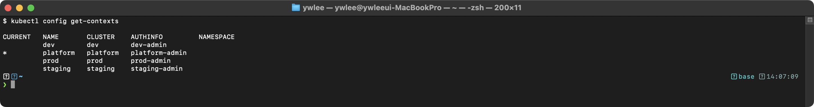

4개의 컨텍스트(platform, dev, staging, prod)가 모두 표시되어야 한다. `*` 표시는 현재 활성 컨텍스트를 나타낸다.

**트러블슈팅:** 컨텍스트가 표시되지 않는 경우, `KUBECONFIG` 환경변수가 올바른 파일을 가리키는지 확인한다.

```bash
echo $KUBECONFIG
# 출력이 없으면 기본 경로 ~/.kube/config를 사용한다.
# 여러 kubeconfig를 병합하려면:
# export KUBECONFIG=~/.kube/config:~/.kube/config-dev:~/.kube/config-staging
```

```bash
# 2. dev 클러스터로 전환 (데모 앱이 배포된 클러스터)
kubectl config use-context dev

# 3. 전환 확인
kubectl config current-context
```

**검증 — 기대 출력:**

> **예시(참조) — dev:** KCNA 개념/실습 기대 출력. 실측은 KCNA daily(day01~07) 및 본 캡처 참고.

```bash
# 4. 각 클러스터 노드 상태 확인
for ctx in platform dev staging prod; do
  echo "========================================="
  echo "클러스터: $ctx"
  echo "========================================="
  kubectl --context=$ctx get nodes -o wide
  echo ""
done
```

**검증 — 기대 출력:**

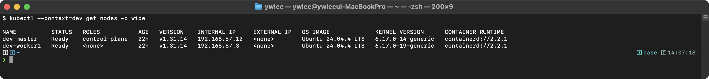

각 클러스터마다 노드 목록이 출력된다. 확인해야 할 핵심 항목은 다음과 같다:
- `STATUS`: 반드시 `Ready`여야 한다. `NotReady`이면 kubelet이 정상 동작하지 않는 것이다.
- `CONTAINER-RUNTIME`: `containerd://1.7.x` 형식으로 표시된다. Kubernetes 1.24부터 dockershim이 제거되어 containerd 또는 CRI-O만 지원한다.
- `ROLES`: `control-plane`이 표시된다. tart-infra는 단일 노드 클러스터이므로 하나의 노드가 control-plane과 worker 역할을 모두 수행한다.

**트러블슈팅 — 노드가 NotReady인 경우:**

```bash
# kubelet 상태 확인 (SSH 접속 필요)
# VM 이름 별칭 사용 (미설정 시: ./scripts/setup-ssh-keys.sh dev)
ssh dev-master
sudo systemctl status kubelet
sudo journalctl -u kubelet --tail=50

# 일반적인 원인:
# 1. containerd가 정지된 경우: sudo systemctl restart containerd
# 2. kubelet 인증서 만료: sudo kubeadm certs check-expiration
# 3. 디스크 용량 부족: df -h
```

### 필수 도구 확인

```bash
# kubectl 버전
kubectl version --client
```

**검증 — 기대 출력:**

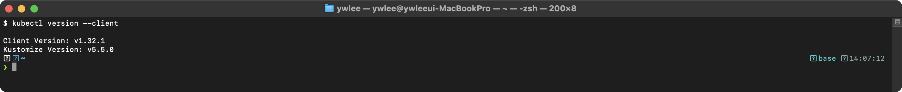

```bash
# helm 버전
helm version
```

**검증 — 기대 출력:**

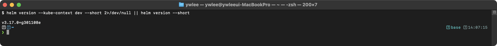

Helm v3은 Helm v2에 존재하던 Tiller(서버 측 컴포넌트)를 제거하여 보안을 강화하였다. Helm v2의 Tiller는 클러스터 내부에서 cluster-admin 권한으로 동작하여 보안 취약점이 되었기 때문이다.

```bash
# 접근 가능한 서비스 URL 확인
NODE_IP=$(kubectl --context=dev get nodes -o jsonpath='{.items[0].status.addresses[?(@.type=="InternalIP")].address}')
echo "============================================="
echo "서비스 접근 정보"
echo "============================================="
echo "Grafana:       http://$NODE_IP:30300  (admin/admin)"
echo "ArgoCD:        http://$NODE_IP:30800"
echo "Jenkins:       http://$NODE_IP:30900  (admin/admin)"
echo "AlertManager:  http://$NODE_IP:30903"
echo "Hubble UI:     http://$NODE_IP:31235"
echo "nginx-web:     http://$NODE_IP:30080"
echo "Keycloak:      http://$NODE_IP:30880"
```

**검증 — 기대 출력:**

> **참조 — Grafana 대시보드(platform):** ============================================= ...

### 데모 네임스페이스 확인

```bash
# demo 네임스페이스 존재 확인
kubectl --context=dev get namespace demo
```

**검증 — 기대 출력:**

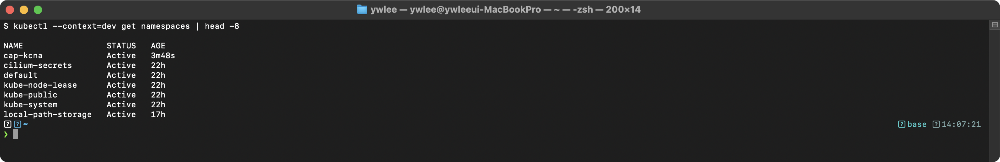

```bash
# demo 네임스페이스의 모든 리소스 확인
kubectl --context=dev get all -n demo
```

**검증 — 기대 출력:**

> **예시(참조) — NAME                              READY   STAT:** KCNA 개념/실습 기대 출력. 실측은 KCNA daily(day01~07) 및 본 캡처 참고.

Deployment, ReplicaSet, Pod, Service 등이 모두 표시된다. nginx-web 3개, httpbin 관련 Pod 3개(v1 2개 + v2 1개), redis 1개, postgres 1개, rabbitmq 1개, keycloak 1개가 확인되어야 한다.

**트러블슈팅 — Pod가 Running이 아닌 경우:**

```bash
# Pod 상태 상세 확인
kubectl --context=dev describe pod <pod-name> -n demo

# 일반적인 문제와 해결 방법:
# ImagePullBackOff: 이미지를 다운로드할 수 없는 경우
#   → 이미지 이름/태그 확인, 레지스트리 접근 가능 여부 확인
# CrashLoopBackOff: 컨테이너가 반복적으로 시작 후 종료되는 경우
#   → kubectl logs <pod-name> -n demo 으로 로그 확인
# Pending: 스케줄링 대기 상태
#   → kubectl describe pod 에서 Events 섹션의 스케줄링 실패 이유 확인
# OOMKilled: 메모리 제한 초과
#   → limits.memory 증가 또는 메모리 누수 확인
```

---

## 실습 1: Kubernetes 아키텍처 이해 (Fundamentals 46%)

> Kubernetes 클러스터의 Control Plane과 Worker Node 구성 요소를 직접 확인하고, 각 컴포넌트의 역할을 이해한다.

### 등장 배경: 왜 Kubernetes가 이런 아키텍처를 선택하였는가

Kubernetes 이전의 컨테이너 오케스트레이션 도구(Docker Swarm, Apache Mesos)는 각각 한계가 있었다. Docker Swarm은 단순하지만 대규모 환경에서 확장성과 기능이 부족하였고, Mesos는 범용 리소스 관리자로서 컨테이너 전용 기능이 제한적이었다.

Google은 내부적으로 15년간 운영한 Borg 시스템의 경험을 바탕으로 Kubernetes를 설계하였다. Borg에서 검증된 핵심 아이디어는 다음과 같다:
- **선언적 상태 관리**: 관리자가 "원하는 상태(desired state)"를 선언하면, 시스템이 현재 상태를 원하는 상태로 자동 수렴(reconciliation)시킨다.
- **단일 진실 소스(Single Source of Truth)**: 모든 클러스터 상태를 하나의 분산 저장소(etcd)에 보관한다.
- **Control Plane / Data Plane 분리**: 관리 로직(Control Plane)과 실제 워크로드 실행(Data Plane / Worker Node)을 분리하여 장애 격리와 확장성을 확보한다.

이 아키텍처의 핵심 원리는 Reconciliation Loop(조정 루프)이다. 각 컨트롤러가 자신이 담당하는 리소스의 현재 상태를 관찰(Observe)하고, 원하는 상태와 비교(Diff)하고, 차이를 해소하기 위해 행동(Act)한다. 이 루프가 지속적으로 반복되므로, 장애가 발생하여도 시스템이 자동으로 복구된다.

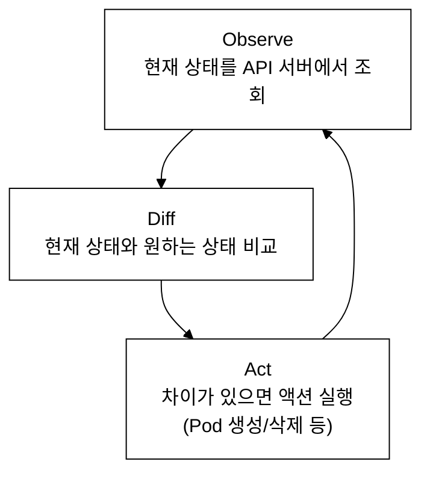
_그림 1. Reconciliation Loop(조정 루프): 관찰 → 비교 → 행동을 무한 반복한다._

---

### Lab 1.1: 4개 클러스터의 Control Plane 구성 확인

**학습 목표:**
- Kubernetes Control Plane의 4대 핵심 컴포넌트(API Server, etcd, Scheduler, Controller Manager)를 식별한다.
- 4개 클러스터(platform, dev, staging, prod)의 Control Plane이 동일한 구조인지 비교한다.
- 각 컴포넌트가 Static Pod로 실행되는 원리를 이해한다.
- 컴포넌트 간 통신 흐름을 파악한다.

**내부 동작 원리 — Control Plane 컴포넌트 간 통신:**

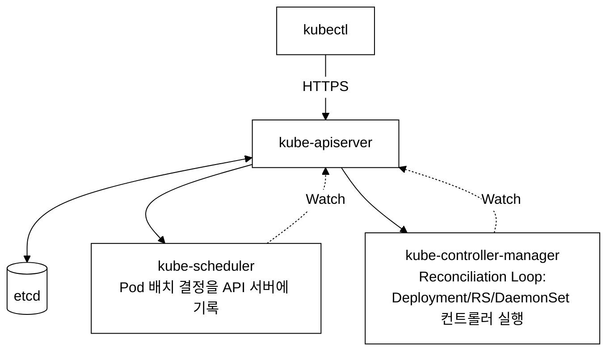
_그림 2. Control Plane 컴포넌트 통신: 모든 통신은 API 서버를 경유하고, etcd 에 직접 접근하는 컴포넌트는 API 서버뿐이며 Scheduler·Controller Manager 는 API 서버를 Watch 한다._

**Step 1: kube-system 네임스페이스의 Control Plane Pod 확인**

```bash
# 각 클러스터의 kube-system Pod 확인
for ctx in platform dev staging prod; do
  echo "========================================="
  echo "클러스터: $ctx — Control Plane Pods"
  echo "========================================="
  kubectl --context=$ctx get pods -n kube-system \
    -l tier=control-plane \
    -o custom-columns='NAME:.metadata.name,STATUS:.status.phase,NODE:.spec.nodeName'
  echo ""
done
```

**검증 — 기대 출력:**

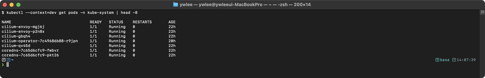

각 클러스터에서 다음 4개의 Control Plane Pod가 표시된다:
- `kube-apiserver-<node>` — API Server: 모든 컴포넌트의 중앙 통신 허브이다. RESTful API를 제공하며, 인증/인가/Admission Control을 수행한다.
- `etcd-<node>` — etcd: 분산 키-값 저장소이다. 클러스터의 모든 상태 데이터(Pod, Service, ConfigMap 등)를 저장한다. Raft 합의 알고리즘을 사용하여 데이터 일관성을 보장한다.
- `kube-scheduler-<node>` — Scheduler: 새로 생성된 Pod를 적절한 노드에 배치한다. Filtering(조건 불만족 노드 제거) → Scoring(점수 기반 순위 매기기) 두 단계로 동작한다.
- `kube-controller-manager-<node>` — Controller Manager: 다수의 컨트롤러(ReplicaSet, Deployment, DaemonSet, Job, Node Controller 등)를 단일 프로세스에서 실행한다. 각 컨트롤러는 독립적인 Reconciliation Loop를 수행한다.

**Step 2: API Server 상세 정보 확인**

```bash
# dev 클러스터의 API Server Pod 상세 확인
kubectl --context=dev describe pod -n kube-system \
  $(kubectl --context=dev get pods -n kube-system -l component=kube-apiserver -o name)
```

**검증 — 기대 출력에서 확인할 핵심 항목:**


핵심 인자 설명:
- `--etcd-servers`: API Server가 접속하는 etcd 주소이다. HTTPS(2379 포트)로 통신하며, TLS 인증서로 상호 인증한다.
- `--service-cluster-ip-range`: Service에 할당되는 가상 IP 범위이다. 기본값은 10.96.0.0/12로, 최대 1,048,576개의 Service IP를 제공한다.
- `--advertise-address`: 다른 컴포넌트가 API Server에 접속할 때 사용하는 IP이다.
- `--secure-port`: API Server가 수신 대기하는 HTTPS 포트이다. 기본값은 6443이다.
- `Priority Class: system-node-critical`: 이 Pod는 노드에서 가장 높은 우선순위를 가진다. 리소스 부족 시에도 축출(eviction)되지 않는다.

**Step 3: API Server의 주요 설정 인자 확인**

```bash
# API Server의 실행 인자만 추출
kubectl --context=dev get pod -n kube-system \
  -l component=kube-apiserver \
  -o jsonpath='{.items[0].spec.containers[0].command}' | tr ',' '\n'
```

**검증 — 기대 출력:**

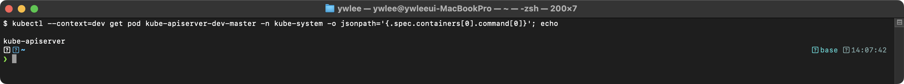

`--authorization-mode=Node,RBAC`는 두 가지 인가 방식을 사용함을 의미한다. Node 인가는 kubelet이 자신의 노드에 스케줄된 Pod 정보에만 접근할 수 있도록 제한하고, RBAC은 Role/ClusterRole 기반 접근 제어를 수행한다.

`--enable-admission-plugins=NodeRestriction`은 kubelet이 자신의 노드에 속하지 않는 Node 또는 Pod 객체를 수정하지 못하도록 방지하는 Admission Controller이다.

**Step 4: Controller Manager 확인**

```bash
# Controller Manager Pod 확인
kubectl --context=dev describe pod -n kube-system \
  $(kubectl --context=dev get pods -n kube-system -l component=kube-controller-manager -o name)
```

**검증 — 기대 출력에서 확인할 핵심 인자:**

> **예시(참조) — Command::** KCNA 개념/실습 기대 출력. 실측은 KCNA daily(day01~07) 및 본 캡처 참고.

`--cluster-cidr=10.20.0.0/16`은 dev 클러스터의 Pod CIDR이다. Controller Manager의 Node IPAM Controller가 이 범위에서 각 노드에 Pod CIDR 서브넷을 할당한다.

`--leader-elect=true`는 고가용성(HA) 환경에서 여러 Controller Manager 인스턴스 중 하나만 리더로 동작하도록 하는 설정이다. 단일 노드에서는 인스턴스가 하나이므로 항상 리더이다.

**Step 5: 4개 클러스터의 Pod CIDR 비교**

```bash
# 각 클러스터의 Pod CIDR 확인
for ctx in platform dev staging prod; do
  echo "=== $ctx ==="
  kubectl --context=$ctx get pod -n kube-system \
    -l component=kube-controller-manager \
    -o jsonpath='{.items[0].spec.containers[0].command}' | tr ',' '\n' | grep cluster-cidr
  echo ""
done
```

**검증 — 기대 출력:**

> **예시(참조) — === platform ===:** KCNA 개념/실습 기대 출력. 실측은 KCNA daily(day01~07) 및 본 캡처 참고.

각 클러스터마다 서로 다른 Pod CIDR이 할당되어 있다. 이 분리가 중요한 이유는 다음과 같다:
1. 멀티 클러스터 네트워킹(Istio multi-cluster, Submariner)을 구성할 때 IP 충돌을 방지한다.
2. 네트워크 문제 디버깅 시 Pod IP를 보고 어느 클러스터에서 왔는지 즉시 식별할 수 있다.
3. 방화벽 규칙이나 라우팅 테이블을 클러스터별로 분리할 수 있다.

**Step 6: Static Pod 매니페스트 확인 (SSH 접속 필요)**

```bash
# SSH로 노드에 접속 (VM 이름 별칭 사용, ~/.ssh/config 등록 별칭)
# 미설정 시: ./scripts/setup-ssh-keys.sh dev
ssh dev-master

# Static Pod 매니페스트 디렉토리 확인
ls -la /etc/kubernetes/manifests/
```

**검증 — 기대 출력:**

> **참조 — etcd 분산 KV 저장소 개념:** total 32 ...

Static Pod는 kubelet이 직접 관리하는 Pod이다. `/etc/kubernetes/manifests/` 디렉토리에 YAML 파일을 넣으면 kubelet이 자동으로 해당 Pod를 실행한다. 이 방식의 특징은 다음과 같다:
- API 서버 없이도 kubelet이 직접 Pod를 시작한다. API 서버 자체가 Static Pod이므로, 이 방식이 아니면 API 서버를 시작할 수 없는 부트스트랩(bootstrap) 문제가 발생한다.
- Static Pod는 API 서버에 Mirror Pod로 등록되어 `kubectl get pods`로 조회할 수 있지만, API를 통해 삭제할 수 없다.
- 매니페스트 파일을 수정하면 kubelet이 변경을 감지하여 Pod를 자동 재시작한다.

```bash
# Static Pod 매니페스트 내용 일부 확인 (etcd.yaml)
sudo head -30 /etc/kubernetes/manifests/etcd.yaml
```

**검증 — 기대 출력:**

> **참조 — etcd 분산 KV 저장소 개념:** apiVersion: v1 ...

```bash
# SSH 세션 종료
exit
```

**검증 명령어 — 전체 Control Plane 상태 한번에 확인:**

```bash
# 전체 Control Plane 건강 상태 확인
kubectl --context=dev get componentstatuses 2>/dev/null || \
  echo "componentstatuses는 Kubernetes 1.19+에서 더 이상 사용되지 않는다."
echo ""
echo "=== 대안: Control Plane Pod 상태 ==="
kubectl --context=dev get pods -n kube-system -l tier=control-plane \
  -o custom-columns='COMPONENT:.metadata.labels.component,STATUS:.status.phase,RESTARTS:.status.containerStatuses[0].restartCount'
```

**검증 — 기대 출력:**

> **참조 — componentstatuses(1.19+ deprecated → Pod 상태로 확인):** componentstatuses는 Kubernetes 1.19+에서 더 이상 사용되 ...

모든 컴포넌트가 Running이고 RESTARTS가 0이면 정상이다. RESTARTS가 높으면 해당 컴포넌트의 로그를 확인해야 한다.

**확인 문제:**
1. Control Plane의 4대 컴포넌트는 무엇인가? 각각의 역할을 한 줄로 설명하라.
2. Static Pod와 일반 Pod의 차이점은 무엇인가? Static Pod를 API로 삭제하면 어떻게 되는가?
3. 4개 클러스터의 Pod CIDR이 서로 다른 이유는 무엇인가?
4. API Server가 사용하는 기본 포트 번호는 무엇인가? 이 포트가 HTTPS인 이유는?
5. etcd에 직접 접근하는 유일한 컴포넌트는 무엇인가? 이 설계의 이점은?
6. Controller Manager의 `--leader-elect=true` 설정이 필요한 이유는?

**관련 KCNA 시험 주제:** Kubernetes Fundamentals — Kubernetes Architecture, Control Plane Components

---

### Lab 1.2: Worker Node 구성 요소 확인

**학습 목표:**
- Worker Node의 3대 핵심 컴포넌트(kubelet, kube-proxy, Container Runtime)를 확인한다.
- kubelet의 역할과 설정을 파악한다.
- Container Runtime Interface(CRI)의 개념과 등장 배경을 이해한다.

**등장 배경 — CRI의 필요성:**

Kubernetes 초기에는 Docker가 유일한 컨테이너 런타임이었다. 그러나 Docker는 이미지 빌드, 컨테이너 실행, 네트워킹, 볼륨 관리 등 많은 기능을 하나의 데몬(dockerd)에 포함하고 있었다. Kubernetes는 이 중 컨테이너 실행 기능만 필요하였으므로, Docker의 나머지 기능은 불필요한 오버헤드였다.

이 문제를 해결하기 위해 Kubernetes 1.5에서 CRI(Container Runtime Interface)가 도입되었다. CRI는 kubelet과 컨테이너 런타임 간의 표준 gRPC 인터페이스로, 다음 두 가지 서비스를 정의한다:
- **RuntimeService**: 컨테이너/샌드박스의 생성, 시작, 중지, 삭제
- **ImageService**: 이미지 풀(pull), 목록 조회, 삭제

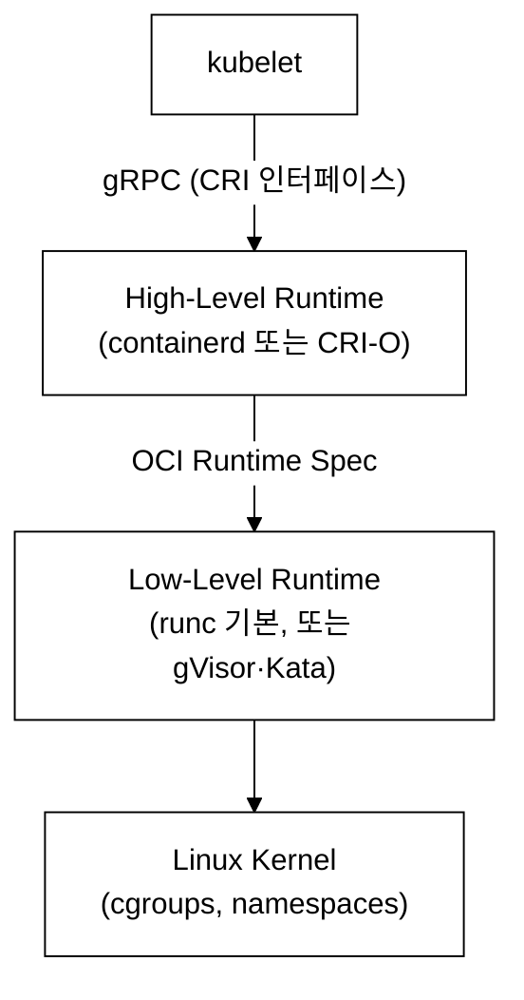
_그림 3. CRI 아키텍처: kubelet → 고수준 런타임 → 저수준 런타임 → 커널로 이어지는 계층._

계층별 역할 구분:
- **containerd(High-Level Runtime)**: 이미지 pull, Pod 샌드박스 생성, 컨테이너 생명주기 관리를 담당한다. kubelet과는 CRI(gRPC)로 통신하고, 하위 런타임과는 OCI(Open Container Initiative) Runtime Spec으로 통신한다.
- **runc(Low-Level Runtime)**: OCI Runtime Spec을 구현한 참조 구현체이다. Linux 커널의 cgroup(리소스 제한)과 namespace(격리)를 직접 조작하여 실제 컨테이너 프로세스를 생성한다. gVisor나 Kata Containers 같은 대안 Low-Level Runtime으로 교체하면 보안 격리 수준을 높일 수 있다.
- **CRI**: 두 계층 사이의 표준 인터페이스이다. 이 덕분에 kubelet 코드를 변경하지 않고도 High-Level Runtime을 containerd에서 CRI-O로 교체할 수 있다.

**Step 1: Worker Node 목록 확인**

```bash
# 모든 노드 목록과 역할 확인
kubectl --context=dev get nodes -o wide
```

**검증 — 기대 출력:**


`CONTAINER-RUNTIME` 열에서 `containerd`가 사용되고 있음을 확인한다. Kubernetes 1.24에서 dockershim이 제거된 이후, containerd 또는 CRI-O만 공식 지원된다.

**Step 2: 노드의 상세 정보 확인**

```bash
# 노드 상세 정보 확인
kubectl --context=dev describe node $(kubectl --context=dev get nodes -o jsonpath='{.items[0].metadata.name}')
```

**검증 — 기대 출력에서 확인할 핵심 항목:**

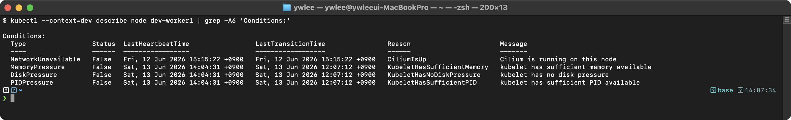

Conditions 설명:
- `MemoryPressure=False`: 노드의 가용 메모리가 충분하다. True가 되면 kubelet이 Pod를 축출(evict)하기 시작한다.
- `DiskPressure=False`: 디스크 용량이 충분하다. 기본 임계치는 사용률 85%이다.
- `PIDPressure=False`: 프로세스 ID가 충분하다. 컨테이너가 매우 많은 프로세스를 fork하면 발생할 수 있다.
- `Ready=True`: 노드가 정상 동작 중이다. kubelet이 node-status-update-frequency(기본 10초) 간격으로 상태를 보고한다.

Capacity vs Allocatable 차이:
- `Capacity`: 노드의 물리적 리소스 총량이다.
- `Allocatable`: Pod에 실제 할당 가능한 리소스이다. system-reserved(OS용)와 kube-reserved(Kubernetes 시스템용)를 뺀 값이다.

**Step 3: 노드의 리소스 사용량 확인**

```bash
# 노드 리소스 사용량 (Metrics Server 필요)
kubectl --context=dev top nodes
```

**검증 — 기대 출력:**

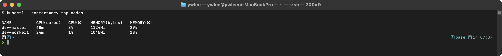

`kubectl top` 명령은 metrics-server가 설치되어 있어야 동작한다. metrics-server는 각 노드의 kubelet에서 cAdvisor 메트릭을 수집하여 API로 제공한다.

**트러블슈팅 — kubectl top이 동작하지 않는 경우:**

```bash
# metrics-server Pod 확인
kubectl --context=dev get pods -n kube-system -l k8s-app=metrics-server

# metrics-server가 없으면 다음 오류가 발생한다:
# error: Metrics API not available

# metrics-server 로그 확인
kubectl --context=dev logs -n kube-system deployment/metrics-server --tail=20
```

**Step 4: kubelet 프로세스 확인 (SSH 접속)**

```bash
# VM 이름 별칭으로 접속 (미설정 시: ./scripts/setup-ssh-keys.sh dev)
ssh dev-master

# kubelet 상태 확인
sudo systemctl status kubelet
```

**검증 — 기대 출력:**

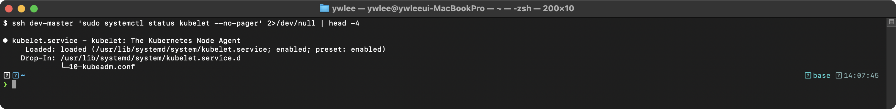

```bash
# kubelet 설정 확인
sudo cat /var/lib/kubelet/config.yaml | head -30
```

**검증 — 기대 출력:**

> **예시(참조) — apiVersion: kubelet.config.k8s.io/v1beta1:** KCNA 개념/실습 기대 출력. 실측은 KCNA daily(day01~07) 및 본 캡처 참고.

핵심 설정 설명:
- `cgroupDriver: systemd`: cgroup 드라이버를 systemd로 설정한다. kubelet과 containerd가 동일한 cgroup 드라이버를 사용해야 한다. 불일치 시 Pod가 시작되지 않는다.
- `clusterDNS: 10.96.0.10`: CoreDNS의 Service ClusterIP이다. Pod의 `/etc/resolv.conf`에 이 값이 nameserver로 설정된다.
- `containerRuntimeEndpoint`: kubelet이 containerd와 통신하는 Unix 소켓 경로이다. CRI gRPC 인터페이스로 통신한다.

**Step 5: kube-proxy 확인**

> **tart-infra 주의사항**: tart-infra 환경은 Cilium이 `KubeProxyReplacement=true` 모드로 동작한다. 이 경우 kube-proxy DaemonSet이 존재하지 않으며, `kubectl get daemonset kube-proxy -n kube-system` 명령을 실행하면 `Error from server (NotFound)`가 반환된다. kube-proxy 대신 Cilium이 서비스 트래픽 라우팅을 eBPF로 직접 처리한다. kube-proxy가 없는 경우에는 아래의 대안 확인 명령으로 Cilium의 KubeProxyReplacement 상태를 확인하여 학습 목표를 대신한다.
>
> **대안 확인 명령 (Cilium KubeProxyReplacement 상태):**
> ```bash
> # Cilium이 kube-proxy 역할을 대체하는지 확인
> CILIUM_POD=$(kubectl --context=dev get pods -n kube-system -l k8s-app=cilium -o jsonpath='{.items[0].metadata.name}')
> kubectl --context=dev exec -n kube-system $CILIUM_POD -- cilium status | grep KubeProxy
> ```

```bash
# SSH 세션을 종료하고 kubectl로 확인
exit

# 이 dev 클러스터의 1차 검증: Cilium KubeProxyReplacement 상태(위 Step 5의 대안 명령)
CILIUM_POD=$(kubectl --context=dev get pods -n kube-system -l k8s-app=cilium -o jsonpath='{.items[0].metadata.name}')
kubectl --context=dev exec -n kube-system $CILIUM_POD -- cilium status | grep KubeProxy
```

**검증 — 기대 출력:** `KubeProxyReplacement: True [...]`처럼 표시되면 Cilium이 kube-proxy 역할을 eBPF로 대체하고 있다는 뜻이다.

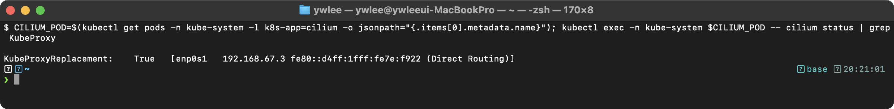

> **참고 — 일반 kubeadm 클러스터의 kube-proxy:** 아래 명령은 kube-proxy를 사용하는 *일반* 클러스터에서의 확인 방법이다. **이 dev 클러스터에서는 kube-proxy DaemonSet/ConfigMap이 없으므로 `Error from server (NotFound)` 또는 `No resources found`가 정상**이다. KCNA 시험 대비 개념 학습용으로만 참고한다.
> ```bash
> # (일반 클러스터) kube-proxy DaemonSet / Pod / 모드 확인 — 이 dev 클러스터에서는 NotFound가 정상
> kubectl get daemonset kube-proxy -n kube-system
> kubectl get pods -n kube-system -l k8s-app=kube-proxy -o wide
> kubectl get configmap kube-proxy -n kube-system -o yaml | grep mode   # mode: "" 는 기본 iptables 모드
> ```

kube-proxy가 (일반 클러스터에서) DaemonSet으로 실행되는 이유: 모든 노드에서 Service의 트래픽을 Pod로 라우팅해야 하므로, 모든 노드에 하나씩 실행되어야 한다. DaemonSet은 새 노드가 추가될 때 자동으로 해당 노드에 Pod를 생성한다. kube-proxy의 세 가지 모드를 비교하면 다음과 같다:

```
kube-proxy 프록시 모드 비교
====================================

  userspace 모드 (레거시, 거의 사용 안 함)
  - kube-proxy 프로세스가 직접 트래픽을 포워딩한다.
  - 모든 패킷이 사용자 공간을 거치므로 성능이 낮다.

  iptables 모드 (기본값)
  - iptables 규칙으로 트래픽을 라우팅한다.
  - 커널 공간에서 동작하므로 userspace보다 빠르다.
  - Service/Endpoint 수가 많아지면 iptables 규칙이 선형 증가하여 성능 저하가 발생한다.
  - Service 5,000개 이상에서 규칙 업데이트에 수 초 소요될 수 있다.

  IPVS 모드 (대규모 클러스터 권장)
  - Linux IPVS(IP Virtual Server)를 사용한다.
  - 해시 테이블 기반이므로 O(1) 시간 복잡도로 라우팅한다.
  - Service 수가 증가해도 성능이 일정하다.
  - 다양한 로드밸런싱 알고리즘 지원 (rr, lc, dh, sh, sed, nq).
```

**Step 7: Container Runtime 확인 (SSH 접속)**

```bash
# VM 이름 별칭으로 접속 (미설정 시: ./scripts/setup-ssh-keys.sh dev)
ssh dev-master

# containerd 상태
sudo systemctl status containerd
```

**검증 — 기대 출력:**

(미캡처)

```bash
# containerd 버전
containerd --version
```

**검증 — 기대 출력:**

> **예시(참조) — containerd containerd.io 1.7.x abc1234567:** KCNA 개념/실습 기대 출력. 실측은 KCNA daily(day01~07) 및 본 캡처 참고.

```bash
# crictl로 실행 중인 컨테이너 목록
sudo crictl ps
```

**검증 — 기대 출력:**

> **예시(참조) — CONTAINER           IMAGE               CREATE:** KCNA 개념/실습 기대 출력. 실측은 KCNA daily(day01~07) 및 본 캡처 참고.

```bash
# crictl로 이미지 목록
sudo crictl images
```

**검증 — 기대 출력:**

> **참조 — etcd 분산 KV 저장소 개념:** IMAGE                                      TAG ...

```bash
# SSH 세션 종료
exit
```

**검증 명령어 — crictl과 kubectl의 비교:**

```bash
# crictl은 노드 수준에서 컨테이너를 관리하는 도구이다.
# kubectl은 클러스터 수준에서 Pod를 관리하는 도구이다.
# 같은 컨테이너를 다른 추상화 수준에서 조회할 수 있다.

# kubectl로 Pod 조회 (클러스터 수준)
kubectl --context=dev get pods -n demo -l app=nginx-web

# crictl로 동일한 컨테이너 조회 (노드 수준, SSH 필요)
# ssh node
# sudo crictl ps --name nginx-web
```

**확인 문제:**
1. Worker Node의 3대 컴포넌트는 무엇이며, 각각의 역할은 무엇인가?
2. kubelet과 Container Runtime은 어떤 인터페이스를 통해 통신하는가? 이 인터페이스의 두 가지 서비스는?
3. kube-proxy가 DaemonSet으로 실행되는 이유는 무엇인가?
4. containerd와 Docker의 관계는 무엇인가? Kubernetes에서 Docker 지원이 중단된 이유는?
5. kube-proxy의 iptables 모드와 IPVS 모드의 성능 차이는 무엇인가?
6. kubelet의 cgroupDriver가 containerd와 동일해야 하는 이유는?

**관련 KCNA 시험 주제:** Kubernetes Fundamentals — Node Components, Container Runtime Interface (CRI)

---

### Lab 1.3: etcd 데이터 조회

**학습 목표:**
- etcd가 Kubernetes 클러스터의 모든 상태를 저장하는 유일한 저장소임을 이해한다.
- etcdctl을 사용하여 실제 저장된 데이터를 조회한다.
- etcd의 키 구조와 내부 동작 원리를 파악한다.

**등장 배경 — etcd의 선택 이유:**

Kubernetes가 상태 저장소로 etcd를 선택한 이유는 다음과 같다:
1. **강한 일관성(Strong Consistency)**: Raft 합의 알고리즘을 사용하여 모든 노드가 동일한 데이터를 가진다. 분산 시스템에서 일관성은 CAP 정리에서 가장 중요한 속성이다.
2. **Watch API**: 키의 변경을 실시간으로 감지할 수 있는 Watch 기능을 제공한다. Kubernetes의 모든 컨트롤러는 이 Watch API를 통해 리소스 변경을 감지한다.
3. **키-값 저장소**: 구조화된 키 경로(예: `/registry/pods/demo/nginx-web-xxx`)를 사용하여 계층적 데이터를 효율적으로 저장한다.
4. **MVCC(Multi-Version Concurrency Control)**: 각 키의 모든 버전(revision)을 보관하여 이전 상태를 조회하거나 트랜잭션을 지원한다.


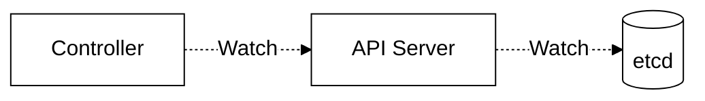
_그림 4. Watch 메커니즘: Controller 가 API Server 를, API Server 가 etcd 를 Watch 하여 변경 발생 시 즉시 이벤트를 수신한다._

**Step 1: etcd Pod 확인**

```bash
# etcd Pod 확인
kubectl --context=dev get pods -n kube-system -l component=etcd
```

**검증 — 기대 출력:**

> **참조 — etcd 분산 KV 저장소 개념:** NAME              READY   STATUS    RESTARTS   ...

**Step 2: etcd Pod 내부에서 etcdctl 실행**

```bash
# etcd Pod 이름 가져오기
ETCD_POD=$(kubectl --context=dev get pods -n kube-system -l component=etcd -o jsonpath='{.items[0].metadata.name}')

# etcd에 저장된 키 목록 조회 (상위 레벨)
kubectl --context=dev exec -n kube-system $ETCD_POD -- \
  etcdctl get / --prefix --keys-only --limit=20 \
  --cacert=/etc/kubernetes/pki/etcd/ca.crt \
  --cert=/etc/kubernetes/pki/etcd/server.crt \
  --key=/etc/kubernetes/pki/etcd/server.key
```

**검증 — 기대 출력:**

> **참조 — etcd 분산 KV 저장소 개념:** /registry/apiextensions.k8s.io/customresourced ...

키 구조 패턴은 `/registry/<resource-type>/<namespace>/<name>` 형식이다. 클러스터 범위 리소스(Node, Namespace, ClusterRole 등)는 namespace 부분이 생략된다.

**Step 3: 특정 리소스의 etcd 데이터 조회**

```bash
# demo 네임스페이스의 nginx-web 서비스 데이터 조회
kubectl --context=dev exec -n kube-system $ETCD_POD -- \
  etcdctl get /registry/services/specs/demo/nginx-web \
  --cacert=/etc/kubernetes/pki/etcd/ca.crt \
  --cert=/etc/kubernetes/pki/etcd/server.crt \
  --key=/etc/kubernetes/pki/etcd/server.key
```

**검증 — 기대 출력:**

> **예시(참조) — /registry/services/specs/demo/nginx-web:** KCNA 개념/실습 기대 출력. 실측은 KCNA daily(day01~07) 및 본 캡처 참고.

etcd는 protobuf 형식으로 데이터를 저장하므로 직접 읽기는 어렵다. 이 설계의 이유는 JSON보다 protobuf가 직렬화/역직렬화 성능이 우수하고 저장 공간을 적게 차지하기 때문이다.

**Step 4: etcd 상태 확인**

```bash
# etcd 클러스터 상태
kubectl --context=dev exec -n kube-system $ETCD_POD -- \
  etcdctl endpoint status --write-out=table \
  --cacert=/etc/kubernetes/pki/etcd/ca.crt \
  --cert=/etc/kubernetes/pki/etcd/server.crt \
  --key=/etc/kubernetes/pki/etcd/server.key
```

**검증 — 기대 출력:**

> **예시(참조) — +----------------+------------------+---------:** KCNA 개념/실습 기대 출력. 실측은 KCNA daily(day01~07) 및 본 캡처 참고.

출력 필드 설명:
- `DB SIZE`: etcd 데이터베이스의 현재 크기이다. 기본 한도는 2GB이며, `--quota-backend-bytes`로 조정 가능하다. DB 크기가 한도에 도달하면 etcd가 읽기 전용 모드로 전환되어 클러스터가 사실상 중단된다.
- `IS LEADER`: Raft 리더 여부이다. 단일 노드 클러스터에서는 항상 true이다.
- `RAFT TERM`: 리더 선출 횟수이다. 리더가 변경될 때마다 1씩 증가한다.
- `RAFT INDEX` / `RAFT APPLIED INDEX`: 두 값이 동일하면 모든 로그 항목이 적용된 상태이다. 차이가 크면 etcd가 부하를 받고 있는 것이다.

**Step 5: etcd 멤버 확인**

```bash
# etcd 멤버 목록
kubectl --context=dev exec -n kube-system $ETCD_POD -- \
  etcdctl member list --write-out=table \
  --cacert=/etc/kubernetes/pki/etcd/ca.crt \
  --cert=/etc/kubernetes/pki/etcd/server.crt \
  --key=/etc/kubernetes/pki/etcd/server.key
```

**검증 — 기대 출력:**

> **예시(참조) — +------------------+---------+----------+-----:** KCNA 개념/실습 기대 출력. 실측은 KCNA daily(day01~07) 및 본 캡처 참고.

단일 노드 클러스터에서는 멤버가 하나이다. 프로덕션 환경에서는 etcd를 3개 또는 5개 노드로 구성하여 고가용성을 확보한다. 포트 번호의 의미는 다음과 같다:
- 2379: 클라이언트 통신용 (API Server가 접속하는 포트)
- 2380: 피어 통신용 (etcd 노드 간 Raft 합의를 위한 포트)

**Step 6: Namespace별 키 수 확인**

```bash
# demo 네임스페이스의 Pod 키 수 조회
kubectl --context=dev exec -n kube-system $ETCD_POD -- \
  etcdctl get /registry/pods/demo --prefix --keys-only \
  --cacert=/etc/kubernetes/pki/etcd/ca.crt \
  --cert=/etc/kubernetes/pki/etcd/server.crt \
  --key=/etc/kubernetes/pki/etcd/server.key | grep -c "/"
```

**검증 — 기대 출력:**

> **예시(참조) — 10:** KCNA 개념/실습 기대 출력. 실측은 KCNA daily(day01~07) 및 본 캡처 참고.

demo 네임스페이스에 존재하는 Pod 수에 해당하는 숫자가 출력된다 (nginx-web 3 + httpbin v1 2 + httpbin v2 1 + redis 1 + postgres 1 + rabbitmq 1 + keycloak 1 = 약 10개).

**검증 명령어 — etcd 데이터 무결성 확인:**

```bash
# etcd 스냅샷 상태 확인 (백업 전 점검)
kubectl --context=dev exec -n kube-system $ETCD_POD -- \
  etcdctl endpoint health \
  --cacert=/etc/kubernetes/pki/etcd/ca.crt \
  --cert=/etc/kubernetes/pki/etcd/server.crt \
  --key=/etc/kubernetes/pki/etcd/server.key
```

**검증 — 기대 출력:**

> **예시(참조) — 127.0.0.1:2379 is healthy: successfully commit:** KCNA 개념/실습 기대 출력. 실측은 KCNA daily(day01~07) 및 본 캡처 참고.

응답 시간이 100ms 이상이면 etcd에 성능 문제가 있는 것이다. 일반적인 원인은 디스크 I/O 병목, 네트워크 지연, DB 크기 초과 등이다.

**트러블슈팅 — etcd 성능 문제 진단:**

```bash
# etcd Pod의 리소스 사용량 확인
kubectl --context=dev top pod -n kube-system -l component=etcd

# etcd 디스크 I/O 확인 (SSH 접속 필요)
# ssh node
# sudo iostat -x 1 5

# etcd 디스크 동기화 지연 확인
# etcd 로그에서 "slow fdatasync" 또는 "took too long" 메시지를 확인한다.
kubectl --context=dev logs -n kube-system $ETCD_POD --tail=50 | grep -i "slow\|took too long"
```

**확인 문제:**
1. etcd는 어떤 유형의 데이터베이스인가? (관계형 / 키-값 / 문서형)
2. etcd에 저장되는 데이터의 키 구조 패턴은 무엇인가?
3. etcd가 손상되면 Kubernetes 클러스터에 어떤 일이 발생하는가? 실행 중인 컨테이너는 계속 동작하는가?
4. etcd 백업이 중요한 이유는 무엇인가? 백업 파일은 어디에 저장해야 하는가?
5. etcd의 Watch API가 Kubernetes에서 어떤 역할을 하는가?
6. etcd의 DB SIZE 한도에 도달하면 어떤 일이 발생하는가?

**관련 KCNA 시험 주제:** Kubernetes Fundamentals — etcd, Cluster State Management

---

### Lab 1.4: kube-scheduler 동작 관찰

**학습 목표:**
- kube-scheduler가 Pod를 특정 노드에 배치하는 과정을 이해한다.
- Pending 상태의 Pod를 통해 스케줄링 실패 시나리오를 관찰한다.
- 스케줄링에 영향을 주는 요소(리소스, nodeSelector, taint/toleration)를 파악한다.

**내부 동작 원리 — 스케줄링 프로세스:**

kube-scheduler는 새로 생성된 Pod(nodeName이 비어 있는 Pod)를 감시하다가, 적합한 노드를 선택하여 API 서버에 바인딩(binding)을 기록한다. 이 과정은 두 단계로 구성된다:

```
Scheduler 동작 과정
====================================

  1단계: Filtering (필터링)
  ────────────────────────
  모든 노드를 대상으로 조건을 검사하여 부적합한 노드를 제거한다.

  필터 플러그인 (주요):
  - NodeResourcesFit: 노드에 충분한 CPU/메모리가 있는가?
  - NodeAffinity: Pod의 nodeAffinity 조건을 만족하는가?
  - TaintToleration: 노드의 Taint를 Pod가 용인(tolerate)하는가?
  - PodTopologySpread: 토폴로지 분산 제약을 만족하는가?

  예: 4개 노드 중 3개는 리소스 부족 → 1개 노드만 남음

  2단계: Scoring (점수 매기기)
  ────────────────────────
  필터링을 통과한 노드에 점수를 매겨 가장 높은 점수의 노드를 선택한다.

  스코어 플러그인 (주요):
  - NodeResourcesBalancedAllocation: 리소스 사용이 균형 잡힌 노드에 높은 점수
  - ImageLocality: Pod 이미지가 이미 캐시된 노드에 높은 점수
  - InterPodAffinity: Pod 간 친화성 규칙을 만족하는 노드에 높은 점수

  예: 남은 1개 노드에 점수 80 → 해당 노드 선택
```

**Step 1: Scheduler Pod 확인**

```bash
# Scheduler Pod 확인
kubectl --context=dev get pods -n kube-system -l component=kube-scheduler
```

**검증 — 기대 출력:**

> **예시(참조) — NAME                         READY   STATUS   :** KCNA 개념/실습 기대 출력. 실측은 KCNA daily(day01~07) 및 본 캡처 참고.

**Step 2: 스케줄링 이벤트 관찰**

```bash
# 테스트 Pod 생성
kubectl --context=dev run scheduler-test --image=nginx:alpine -n demo

# Pod의 이벤트에서 스케줄링 결정 확인
kubectl --context=dev describe pod scheduler-test -n demo | grep -A 10 "Events:"
```

**검증 — 기대 출력:**

> **예시(참조) — Events::** KCNA 개념/실습 기대 출력. 실측은 KCNA daily(day01~07) 및 본 캡처 참고.

이벤트 순서에서 스케줄링 과정을 확인할 수 있다:
1. `Scheduled`: kube-scheduler가 Pod를 dev-node에 배치 결정을 내렸다.
2. `Pulling`: kubelet이 이미지를 다운로드하기 시작하였다.
3. `Pulled`: 이미지 다운로드가 완료되었다.
4. `Created`: containerd가 컨테이너를 생성하였다.
5. `Started`: 컨테이너가 시작되었다.

**Step 3: 리소스 부족으로 인한 스케줄링 실패 시뮬레이션**

```bash
# 과도한 리소스를 요청하는 Pod 생성
kubectl --context=dev apply -n demo -f - <<EOF
apiVersion: v1
kind: Pod
metadata:
  name: unschedulable-pod
  namespace: demo
spec:
  containers:
    - name: test
      image: nginx:alpine
      resources:
        requests:
          cpu: "100"
          memory: "1000Gi"
EOF

# Pod 상태 확인
kubectl --context=dev get pod unschedulable-pod -n demo
```

**검증 — 기대 출력:**

> **예시(참조) — NAME                READY   STATUS    RESTARTS:** KCNA 개념/실습 기대 출력. 실측은 KCNA daily(day01~07) 및 본 캡처 참고.

Pod가 `Pending` 상태로 유지된다.

```bash
# Pending 사유 확인
kubectl --context=dev describe pod unschedulable-pod -n demo | grep -A 5 "Events:"
```

**검증 — 기대 출력:**

> **예시(참조) — Events::** KCNA 개념/실습 기대 출력. 실측은 KCNA daily(day01~07) 및 본 캡처 참고.

`FailedScheduling` 이벤트의 메시지를 분석하면:
- `0/1 nodes are available`: 총 1개 노드 중 0개가 사용 가능하다.
- `1 Insufficient cpu`: 1개 노드가 CPU 부족으로 필터링되었다.
- `1 Insufficient memory`: 1개 노드가 메모리 부족으로 필터링되었다.
- `No preemption victims found`: 선점(preemption)할 수 있는 Pod도 없다.

**Step 4: 정리**

```bash
# 테스트 Pod 삭제
kubectl --context=dev delete pod scheduler-test unschedulable-pod -n demo --ignore-not-found
```

**검증 — 기대 출력:**

> **예시(참조) — pod "scheduler-test" deleted:** KCNA 개념/실습 기대 출력. 실측은 KCNA daily(day01~07) 및 본 캡처 참고.

**Step 5: Scheduler 로그 확인**

```bash
# Scheduler 로그에서 스케줄링 결정 확인
SCHEDULER_POD=$(kubectl --context=dev get pods -n kube-system -l component=kube-scheduler -o jsonpath='{.items[0].metadata.name}')
kubectl --context=dev logs $SCHEDULER_POD -n kube-system --tail=20
```

**검증 — 기대 출력:**

> **예시(참조) — I0330 10:00:15.123456       1 schedule_one.go::** KCNA 개념/실습 기대 출력. 실측은 KCNA daily(day01~07) 및 본 캡처 참고.

**Step 6: 노드 Allocatable 리소스 확인**

```bash
# 각 노드의 할당 가능 리소스 확인
kubectl --context=dev get nodes -o custom-columns=\
'NAME:.metadata.name,CPU_ALLOC:.status.allocatable.cpu,MEM_ALLOC:.status.allocatable.memory,PODS_ALLOC:.status.allocatable.pods'
```

**검증 — 기대 출력:**

> **예시(참조) — NAME       CPU_ALLOC   MEM_ALLOC    PODS_ALLOC:** KCNA 개념/실습 기대 출력. 실측은 KCNA daily(day01~07) 및 본 캡처 참고.

스케줄러는 이 Allocatable 리소스에서 이미 할당된(Requests) 양을 뺀 나머지를 기준으로 Pod를 배치한다. 100CPU/1000Gi 메모리를 요청한 Pod는 Allocatable(4CPU/~8Gi)을 초과하므로 스케줄링이 불가능하다.

**트러블슈팅 — Pod가 Pending인 경우 체크리스트:**

```bash
# 1. 리소스 부족 확인
kubectl --context=dev describe pod <pod-name> -n demo | grep -A 3 "Events:"

# 2. 노드 리소스 현황 확인
kubectl --context=dev describe nodes | grep -A 10 "Allocated resources:"

# 3. Taint/Toleration 불일치 확인
kubectl --context=dev get nodes -o custom-columns='NAME:.metadata.name,TAINTS:.spec.taints'

# 4. nodeSelector/nodeAffinity 불일치 확인
kubectl --context=dev get pod <pod-name> -n demo -o jsonpath='{.spec.nodeSelector}'

# 5. PVC가 Bound 상태인지 확인 (볼륨 마운트가 있는 경우)
kubectl --context=dev get pvc -n demo
```

**확인 문제:**
1. kube-scheduler는 Pod를 노드에 배치할 때 어떤 두 단계(Filtering, Scoring)를 거치는가? 각 단계의 역할을 설명하라.
2. Pod가 Pending 상태인 경우 가장 먼저 확인해야 할 것은 무엇인가?
3. nodeSelector와 nodeAffinity의 차이점은 무엇인가? nodeAffinity의 추가 기능은?
4. taint와 toleration의 관계를 설명하라. toleration이 있으면 해당 노드에 반드시 배치되는가?
5. 선점(Preemption)이란 무엇인가? PriorityClass와 어떤 관계인가?
6. Pod Topology Spread Constraints의 목적은 무엇인가?

**관련 KCNA 시험 주제:** Kubernetes Fundamentals — Scheduling, Pod Lifecycle

---

## 실습 2: 워크로드 리소스 탐색 (Fundamentals)

> Deployment, ReplicaSet, Pod의 계층 구조를 이해하고, 다양한 워크로드 리소스의 특성을 파악한다.

### 등장 배경: 워크로드 리소스 추상화의 필요성

Kubernetes 초기(v1.0)에는 ReplicationController가 유일한 워크로드 관리 리소스였다. ReplicationController는 Pod의 수를 유지하는 기본 기능만 제공하였으며, 레이블 셀렉터가 등호 기반(equality-based)만 지원하는 한계가 있었다. 이를 개선하기 위해 다음과 같은 리소스가 순차적으로 도입되었다:

1. **ReplicaSet** (v1.2): Set-based 셀렉터(`in`, `notin`, `exists`)를 지원하는 ReplicationController의 후속 버전이다.
2. **Deployment** (v1.2): ReplicaSet을 관리하면서 롤링 업데이트, 롤백, 스케일링 등 선언적 배포 관리를 제공하는 상위 추상화이다.
3. **DaemonSet** (v1.2): 모든 노드에 Pod를 하나씩 실행한다. 로그 수집기, 모니터링 에이전트, CNI 플러그인 등에 사용된다.
4. **StatefulSet** (v1.5): 상태가 있는(stateful) 워크로드를 위한 리소스이다. 고정된 네트워크 ID, 순서 보장, 영구 스토리지를 제공한다.
5. **Job / CronJob** (v1.2 / v1.8): 일회성/주기적 배치 작업을 실행한다.

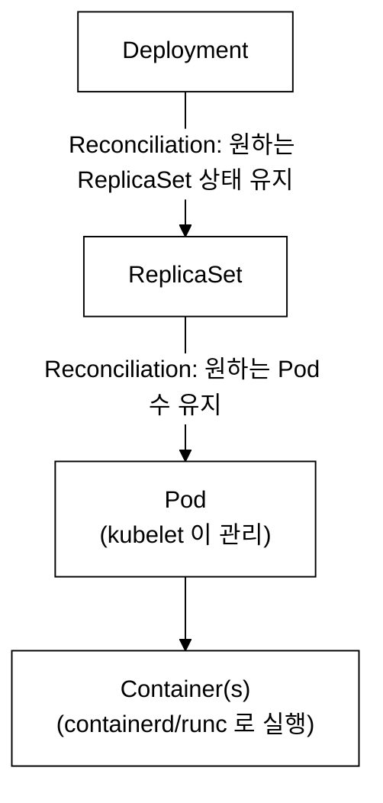
_그림 5. 워크로드 리소스 계층: Deployment → ReplicaSet → Pod → Container. ownerReferences 로 소유 관계가 기록되고, 상위 리소스 삭제 시 Garbage Collector 가 하위를 cascade delete 한다._

---

### Lab 2.1: Deployment → ReplicaSet → Pod 계층 분석 (nginx-web)

**학습 목표:**
- Deployment가 ReplicaSet을 생성하고, ReplicaSet이 Pod를 생성하는 계층 구조를 이해한다.
- ownerReferences를 통해 리소스 간 소유 관계를 확인한다.
- nginx-web Deployment의 실제 구조를 분석한다.
- Garbage Collection의 cascade 삭제 메커니즘을 이해한다.

**Step 1: nginx-web Deployment 확인**

```bash
# Deployment 목록 확인
kubectl --context=dev get deployments -n demo
```

**검증 — 기대 출력:**

> **예시(참조) — NAME         READY   UP-TO-DATE   AVAILABLE   :** KCNA 개념/실습 기대 출력. 실측은 KCNA daily(day01~07) 및 본 캡처 참고.

각 열의 의미:
- `READY`: 현재 Ready 상태인 Pod 수 / 원하는(DESIRED) Pod 수. 3/3이면 모든 레플리카가 정상이다. DESIRED → CURRENT → READY 순서로 상태가 전이된다. DESIRED는 spec에 선언된 수, CURRENT는 실제로 존재하는 Pod 수, READY는 readinessProbe를 통과한 수를 의미하며, 롤링 업데이트 중에는 세 값이 잠시 달라질 수 있다.
- `UP-TO-DATE`: 최신 Pod 템플릿으로 생성된 Pod 수이다. 롤링 업데이트 중에는 이 값이 READY보다 작을 수 있다.
- `AVAILABLE`: minReadySeconds를 충족하여 서비스에 투입 가능한 Pod 수이다.

**Step 2: Deployment의 상세 YAML 확인**

```bash
# nginx-web Deployment YAML 확인 (핵심 필드만)
kubectl --context=dev get deployment nginx-web -n demo \
  -o jsonpath='{
    "replicas": {.spec.replicas},
    "selector": {.spec.selector.matchLabels},
    "image": {.spec.template.spec.containers[0].image},
    "requests.cpu": {.spec.template.spec.containers[0].resources.requests.cpu},
    "requests.memory": {.spec.template.spec.containers[0].resources.requests.memory},
    "limits.cpu": {.spec.template.spec.containers[0].resources.limits.cpu},
    "limits.memory": {.spec.template.spec.containers[0].resources.limits.memory}
  }'
echo ""
```

**검증 — 기대 출력:**

> **예시(참조) — replicas: 3, selector: {"app":"nginx-web"}, im:** KCNA 개념/실습 기대 출력. 실측은 KCNA daily(day01~07) 및 본 캡처 참고.

**Step 3: ReplicaSet 확인**

```bash
# nginx-web의 ReplicaSet 확인
kubectl --context=dev get replicasets -n demo -l app=nginx-web
```

**검증 — 기대 출력:**

> **예시(참조) — NAME                    DESIRED   CURRENT   RE:** KCNA 개념/실습 기대 출력. 실측은 KCNA daily(day01~07) 및 본 캡처 참고.

Deployment가 ReplicaSet을 하나 생성하였고, ReplicaSet이 3개의 Pod를 유지한다. ReplicaSet 이름은 `<deployment-name>-<pod-template-hash>` 형식이다. pod-template-hash는 Deployment의 `.spec.template` 전체를 FNV 해시로 변환한 값이다. Pod 템플릿(이미지, 환경변수, 리소스 등)이 변경되면 해시가 달라져 새로운 ReplicaSet이 생성되므로, 여러 버전의 ReplicaSet이 공존할 때 각 ReplicaSet을 고유하게 식별하는 역할을 한다. 롤링 업데이트 도중 구버전 ReplicaSet과 신버전 ReplicaSet이 동시에 존재하는 것도 이 덕분이다.

**Step 4: ReplicaSet의 ownerReferences 확인**

```bash
# ReplicaSet의 소유자 확인
kubectl --context=dev get replicaset -n demo -l app=nginx-web \
  -o jsonpath='{.items[0].metadata.ownerReferences[0].kind}: {.items[0].metadata.ownerReferences[0].name}'
echo ""
```

**검증 — 기대 출력:**

> **예시(참조) — Deployment: nginx-web:** KCNA 개념/실습 기대 출력. 실측은 KCNA daily(day01~07) 및 본 캡처 참고.

ownerReferences — 리소스가 어떤 상위 리소스에 의해 소유되는지를 기록하는 메타데이터 필드이다. Kubernetes의 Garbage Collector(kube-controller-manager 내부)가 이 필드를 순회하며 cascade delete(연쇄 삭제)를 수행한다. Deployment를 삭제하면, Garbage Collector가 ownerReferences를 따라가 해당 ReplicaSet을 자동 삭제하고, ReplicaSet이 삭제되면 다시 ownerReferences를 따라 각 Pod를 자동 삭제한다. 이 cascade delete는 기본적으로 background 모드로 수행되므로 삭제 명령 직후 하위 리소스가 잠시 남아있을 수 있다.

**Step 5: Pod 확인**

```bash
# nginx-web Pod 목록 확인
kubectl --context=dev get pods -n demo -l app=nginx-web -o wide
```

**검증 — 기대 출력:**

> **예시(참조) — NAME                        READY   STATUS    :** KCNA 개념/실습 기대 출력. 실측은 KCNA daily(day01~07) 및 본 캡처 참고.

3개의 Pod가 Running 상태이며, 각각 다른 IP를 가진다. IP는 10.20.x.x 범위 (dev 클러스터의 Pod CIDR)에 속한다.

**Step 6: Pod의 ownerReferences 확인**

```bash
# Pod의 소유자 확인
POD_NAME=$(kubectl --context=dev get pods -n demo -l app=nginx-web -o jsonpath='{.items[0].metadata.name}')
kubectl --context=dev get pod $POD_NAME -n demo \
  -o jsonpath='{.metadata.ownerReferences[0].kind}: {.metadata.ownerReferences[0].name}'
echo ""
```

**검증 — 기대 출력:**

> **예시(참조) — ReplicaSet: nginx-web-7d8f5c4b6:** KCNA 개념/실습 기대 출력. 실측은 KCNA daily(day01~07) 및 본 캡처 참고.

Pod는 ReplicaSet에 의해 소유된다. 전체 소유 계층을 시각화하면:

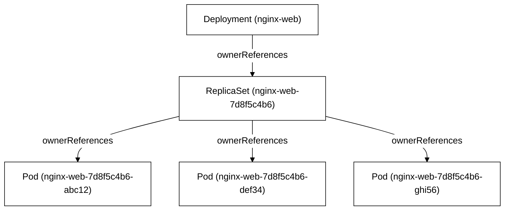
_그림 6. ownerReferences 로 형성된 소유 계층: Deployment 가 ReplicaSet 을, ReplicaSet 이 각 Pod 를 소유한다._

**Step 7: 전체 계층 한번에 확인**

```bash
# Deployment → ReplicaSet → Pod 전체 계층 시각화
echo "=== Deployment ==="
kubectl --context=dev get deployment nginx-web -n demo -o custom-columns='NAME:.metadata.name,REPLICAS:.spec.replicas,IMAGE:.spec.template.spec.containers[0].image'
echo ""
echo "=== ReplicaSet ==="
kubectl --context=dev get rs -n demo -l app=nginx-web -o custom-columns='NAME:.metadata.name,DESIRED:.spec.replicas,CURRENT:.status.replicas,READY:.status.readyReplicas'
echo ""
echo "=== Pods ==="
kubectl --context=dev get pods -n demo -l app=nginx-web -o custom-columns='NAME:.metadata.name,STATUS:.status.phase,IP:.status.podIP,NODE:.spec.nodeName'
```

**검증 — 기대 출력:**

> **예시(참조) — === Deployment ===:** KCNA 개념/실습 기대 출력. 실측은 KCNA daily(day01~07) 및 본 캡처 참고.

**검증 명령어 — ReplicaSet의 자가 복구 테스트:**

```bash
# ReplicaSet을 직접 삭제하면 Deployment가 자동으로 새 ReplicaSet을 생성하는지 확인
RS_NAME=$(kubectl --context=dev get rs -n demo -l app=nginx-web -o jsonpath='{.items[0].metadata.name}')
echo "삭제 전 RS: $RS_NAME"

# ReplicaSet 삭제 (Deployment는 유지됨)
kubectl --context=dev delete rs $RS_NAME -n demo

# 즉시 확인 — Deployment가 새 ReplicaSet을 생성한다
kubectl --context=dev get rs -n demo -l app=nginx-web
```

**검증 — 기대 출력:**

> **예시(참조) — 삭제 전 RS: nginx-web-7d8f5c4b6:** KCNA 개념/실습 기대 출력. 실측은 KCNA daily(day01~07) 및 본 캡처 참고.

Deployment 컨트롤러가 즉시 새 ReplicaSet을 생성하여 원하는 상태를 복구한다. 이것이 Reconciliation Loop의 핵심 동작이다.

**확인 문제:**
1. Deployment를 삭제하면 ReplicaSet과 Pod는 어떻게 되는가? 이 동작을 수행하는 메커니즘은?
2. ReplicaSet을 직접 삭제하면 Deployment는 어떻게 반응하는가?
3. ownerReferences의 역할은 무엇인가? Garbage Collector와 어떤 관계인가?
4. Deployment가 관리하는 Pod의 수를 변경하려면 어떤 명령을 사용하는가?
5. pod-template-hash의 역할은 무엇인가?
6. `kubectl delete pod`와 `kubectl delete deployment`의 결과 차이는?

**관련 KCNA 시험 주제:** Kubernetes Fundamentals — Workload Resources, Deployment, ReplicaSet

**다음 단계 — Pod 내부를 들여다봐야 하는 이유:**

Deployment → ReplicaSet → Pod 계층을 확인하였다. 그런데 Pod가 "Running"이라고 해서 항상 정상은 아니다. Pod는 Running이지만 트래픽을 받지 못하거나(readinessProbe 실패), 메모리 부족으로 반복 종료(OOMKilled)되거나, 스케줄러에 의해 Pending 상태가 길어지는 경우가 실무에서 자주 발생한다. 이를 진단하려면 Pod의 라이프사이클(Phase: Pending → Running → Succeeded/Failed), 리소스 설정(requests/limits), QoS 클래스를 이해해야 한다. Lab 2.2에서 이 내용을 다룬다.

---

### Lab 2.2: Pod 상세 분석 (labels, annotations, resources, containers)

**학습 목표:**
- Pod의 메타데이터(labels, annotations)를 확인하고 그 용도를 이해한다.
- 컨테이너의 리소스 요청(requests)과 제한(limits)의 차이를 이해한다.
- Pod의 생명주기(Phase)와 QoS(Quality of Service) 클래스를 파악한다.

**내부 동작 원리 — requests와 limits의 커널 수준 동작:**

```
리소스 관리의 커널 수준 메커니즘
====================================

  CPU:
  - requests → cgroup의 cpu.shares에 매핑된다.
    50m → shares = 51 (1024 * 50/1000)
    다른 Pod가 CPU를 사용하지 않으면 requests 이상을 사용할 수 있다.
  - limits → cgroup의 cpu.cfs_quota_us에 매핑된다.
    200m → quota = 20000us (period 100000us 기준)
    CPU limits를 초과하면 스로틀링(throttling)된다 (지연 발생, 프로세스 종료 안 됨).

  Memory:
  - requests → 스케줄러가 노드 선택 시 참고하는 값이다.
    실제 cgroup 설정에는 반영되지 않는다.
  - limits → cgroup의 memory.limit_in_bytes에 매핑된다.
    128Mi → 134217728 bytes
    메모리 limits를 초과하면 OOM Killer가 프로세스를 종료한다 (OOMKilled).

  QoS 클래스 결정 규칙:
  - Guaranteed: 모든 컨테이너에 requests = limits가 설정된 경우
  - Burstable: requests가 설정되었지만 limits와 다른 경우
  - BestEffort: requests와 limits가 모두 설정되지 않은 경우

  리소스 부족 시 축출 우선순위: BestEffort → Burstable → Guaranteed
```

**Step 1: Pod의 Labels 확인**

```bash
# demo 네임스페이스의 모든 Pod와 Labels 확인
kubectl --context=dev get pods -n demo --show-labels
```

**검증 — 기대 출력:**

> **예시(참조) — NAME                          READY   STATUS  :** KCNA 개념/실습 기대 출력. 실측은 KCNA daily(day01~07) 및 본 캡처 참고.

**Step 2: Label Selector로 필터링**

```bash
# app=httpbin인 모든 Pod (v1 + v2)
kubectl --context=dev get pods -n demo -l app=httpbin
```

**검증 — 기대 출력:**

> **예시(참조) — NAME                          READY   STATUS  :** KCNA 개념/실습 기대 출력. 실측은 KCNA daily(day01~07) 및 본 캡처 참고.

```bash
# version=v1인 httpbin Pod만 (equality-based selector)
kubectl --context=dev get pods -n demo -l app=httpbin,version=v1
```

**검증 — 기대 출력:**

> **예시(참조) — NAME                          READY   STATUS  :** KCNA 개념/실습 기대 출력. 실측은 KCNA daily(day01~07) 및 본 캡처 참고.

```bash
# version=v2인 httpbin Pod만
kubectl --context=dev get pods -n demo -l app=httpbin,version=v2
```

**검증 — 기대 출력:**

> **예시(참조) — NAME                          READY   STATUS  :** KCNA 개념/실습 기대 출력. 실측은 KCNA daily(day01~07) 및 본 캡처 참고.

```bash
# Set-based selector 예시: version이 v1 또는 v2인 Pod
kubectl --context=dev get pods -n demo -l 'app=httpbin,version in (v1, v2)'
```

**검증 — 기대 출력:**

> **예시(참조) — NAME                          READY   STATUS  :** KCNA 개념/실습 기대 출력. 실측은 KCNA daily(day01~07) 및 본 캡처 참고.

**Step 3: Pod의 리소스 설정 확인**

```bash
# nginx-web Pod의 리소스 요청/제한 확인
kubectl --context=dev get pods -n demo -l app=nginx-web \
  -o custom-columns='NAME:.metadata.name,CPU_REQ:.spec.containers[0].resources.requests.cpu,MEM_REQ:.spec.containers[0].resources.requests.memory,CPU_LIM:.spec.containers[0].resources.limits.cpu,MEM_LIM:.spec.containers[0].resources.limits.memory'
```

**검증 — 기대 출력:**

> **예시(참조) — NAME                        CPU_REQ   MEM_REQ :** KCNA 개념/실습 기대 출력. 실측은 KCNA daily(day01~07) 및 본 캡처 참고.

**Step 4: 실제 리소스 사용량 vs 요청/제한 비교**

```bash
# 실제 사용량 확인
kubectl --context=dev top pods -n demo -l app=nginx-web
```

**검증 — 기대 출력:**

> **예시(참조) — NAME                        CPU(cores)   MEMOR:** KCNA 개념/실습 기대 출력. 실측은 KCNA daily(day01~07) 및 본 캡처 참고.

실제 사용량이 requests(50m CPU, 64Mi 메모리)보다 훨씬 낮다. 이것은 정상이다.

```
리소스 사용량 비교 분석
====================================

  CPU:
  실제 사용: ~2m    requests: 50m    limits: 200m
  |====|................................................|
  2m   50m                                            200m

  → 유휴 상태에서 nginx는 매우 적은 CPU를 사용한다.
  → 트래픽이 증가하면 50m까지 보장되고, 최대 200m까지 사용 가능하다.
  → 200m을 초과하면 스로틀링(throttling)이 발생한다.

  Memory:
  실제 사용: ~10Mi   requests: 64Mi   limits: 128Mi
  |========|................................|
  10Mi     64Mi                          128Mi

  → requests는 스케줄러가 노드에 예약하는 양이다.
  → 128Mi를 초과하면 OOM Killer가 컨테이너를 종료한다.
```

**Step 5: Pod의 QoS 클래스 확인**

```bash
# Pod의 QoS 클래스 확인
kubectl --context=dev get pods -n demo -l app=nginx-web \
  -o custom-columns='NAME:.metadata.name,QOS:.status.qosClass'
```

**검증 — 기대 출력:**

> **예시(참조) — NAME                        QOS:** KCNA 개념/실습 기대 출력. 실측은 KCNA daily(day01~07) 및 본 캡처 참고.

nginx-web은 requests와 limits가 다르므로 `Burstable` 클래스이다. 노드의 리소스가 부족할 때 BestEffort Pod가 먼저 축출되고, 그 다음 Burstable, 마지막으로 Guaranteed Pod가 축출된다.

**Step 6: Pod의 Phase(상태) 확인**

```bash
# Pod의 Phase 확인
kubectl --context=dev get pods -n demo -o custom-columns='NAME:.metadata.name,PHASE:.status.phase'
```

**검증 — 기대 출력:**

> **예시(참조) — NAME                          PHASE:** KCNA 개념/실습 기대 출력. 실측은 KCNA daily(day01~07) 및 본 캡처 참고.

Pod Phase 설명:
- `Pending`: 스케줄링 대기 또는 이미지 다운로드 중이다.
- `Running`: 최소 하나의 컨테이너가 실행 중이다.
- `Succeeded`: 모든 컨테이너가 성공적으로 종료하였다 (Job에서 주로 나타남).
- `Failed`: 하나 이상의 컨테이너가 실패(exit code != 0)하였다.
- `Unknown`: 노드와 통신이 불가하여 상태를 확인할 수 없다.

**Step 7: Labels vs Annotations 비교**

```bash
# Pod의 Annotations 확인
POD_NAME=$(kubectl --context=dev get pods -n demo -l app=nginx-web -o jsonpath='{.items[0].metadata.name}')
kubectl --context=dev get pod $POD_NAME -n demo -o jsonpath='{.metadata.annotations}' | python3 -m json.tool 2>/dev/null || echo "No annotations or invalid JSON"
```

```
Labels vs Annotations 비교
====================================

  Labels:
  - selector로 리소스를 선택/필터링하는 데 사용한다.
  - Service가 Pod를 찾을 때 사용한다.
  - kubectl get pods -l app=web 으로 필터링 가능하다.
  - 키/값 길이 제한: 키 최대 63자, 값 최대 63자.
  - 예: app=nginx-web, version=v1, tier=frontend

  Annotations:
  - 비-식별(non-identifying) 메타데이터를 저장한다.
  - selector로 선택할 수 없다.
  - 도구, 라이브러리, 클라이언트가 참조하는 정보를 저장한다.
  - 값 길이 제한: 최대 256KB.
  - 예: prometheus.io/scrape="true", description="프론트엔드 서버"
```

**확인 문제:**
1. requests와 limits의 차이점은 무엇인가? CPU limits를 초과하면 어떻게 되는가?
2. limits.memory를 초과하면 컨테이너에 어떤 일이 발생하는가? (OOMKilled)
3. Label과 Annotation의 차이점 3가지를 설명하라.
4. Pod Phase 중 `Pending`의 가능한 원인 3가지를 나열하라.
5. QoS 클래스 3가지를 나열하고 축출 우선순위를 설명하라.
6. Set-based 셀렉터와 Equality-based 셀렉터의 차이는?

**관련 KCNA 시험 주제:** Kubernetes Fundamentals — Pod Lifecycle, Labels and Selectors, Resource Management

---

### Lab 2.3: DaemonSet 확인 (Cilium)

**학습 목표:**
- DaemonSet이 모든 노드에 Pod를 하나씩 실행하는 원리를 이해한다.
- tart-infra에서 Cilium이 DaemonSet으로 배포된 이유를 파악한다.
- DaemonSet의 업데이트 전략을 확인한다.

**등장 배경 — DaemonSet이 필요한 이유:**

일부 워크로드는 클러스터의 모든 노드(또는 특정 노드)에 반드시 하나씩 실행되어야 한다. 이러한 워크로드를 Deployment로 관리하면 Pod가 특정 노드에 집중 배치될 수 있고, 새 노드 추가 시 수동으로 레플리카 수를 조정해야 한다. DaemonSet은 이 문제를 해결한다:

- **CNI 플러그인** (Cilium, Calico): 각 노드의 네트워크를 설정해야 하므로 모든 노드에 필요하다.
- **로그 수집기** (Fluentd, Fluent Bit): 각 노드의 컨테이너 로그를 수집한다.
- **모니터링 에이전트** (Node Exporter, Datadog Agent): 각 노드의 시스템 메트릭을 수집한다.
- **kube-proxy**: Service 트래픽을 라우팅하는 규칙을 각 노드에 설정한다.
- **스토리지 드라이버** (CSI 노드 플러그인): 각 노드에서 볼륨을 마운트한다.

DaemonSet의 핵심 동작은 DaemonSet 컨트롤러가 노드 목록을 Watch하면서, 새 노드가 추가되면 자동으로 Pod를 생성하고, 노드가 제거되면 해당 Pod를 삭제하는 것이다.

**Step 1: DaemonSet 목록 확인**

```bash
# 모든 네임스페이스의 DaemonSet 확인
kubectl --context=dev get daemonsets --all-namespaces
```

**검증 — 기대 출력:**

> **예시(참조) — NAMESPACE     NAME          DESIRED   CURRENT :** KCNA 개념/실습 기대 출력. 실측은 KCNA daily(day01~07) 및 본 캡처 참고.

각 열의 의미:
- `DESIRED`: DaemonSet이 실행되어야 하는 노드 수이다. NODE SELECTOR 조건에 맞는 노드 수와 동일하다.
- `CURRENT`: 실제로 Pod가 생성된 노드 수이다.
- `READY`: Ready 상태인 Pod 수이다.
- `UP-TO-DATE`: 최신 DaemonSet 템플릿으로 실행 중인 Pod 수이다.
- `AVAILABLE`: 사용 가능한 Pod 수이다.

모든 값이 동일해야 정상이다. 차이가 있으면 업데이트가 진행 중이거나 노드에 문제가 있는 것이다.

**Step 2: Cilium DaemonSet 상세 확인**

```bash
# Cilium DaemonSet 상세
kubectl --context=dev describe daemonset cilium -n kube-system | head -40
```

**검증 — 기대 출력에서 확인할 핵심 항목:**

> **예시(참조) — Name:           cilium:** KCNA 개념/실습 기대 출력. 실측은 KCNA daily(day01~07) 및 본 캡처 참고.

**Step 3: Cilium Pod가 모든 노드에 실행되는지 확인**

```bash
# Cilium Pod와 실행 노드 확인
kubectl --context=dev get pods -n kube-system -l k8s-app=cilium -o wide
```

**검증 — 기대 출력:**

> **예시(참조) — NAME           READY   STATUS    RESTARTS   AG:** KCNA 개념/실습 기대 출력. 실측은 KCNA daily(day01~07) 및 본 캡처 참고.

**Step 4: Cilium 상태 확인**

```bash
# Cilium 에이전트 상태 확인
CILIUM_POD=$(kubectl --context=dev get pods -n kube-system -l k8s-app=cilium -o jsonpath='{.items[0].metadata.name}')
kubectl --context=dev exec -n kube-system $CILIUM_POD -- cilium status --brief
```

**검증 — 기대 출력:**

> **예시(참조) — KVStore:                 Ok   Disabled:** KCNA 개념/실습 기대 출력. 실측은 KCNA daily(day01~07) 및 본 캡처 참고.

Cilium이 CNCF Graduated 프로젝트로서 제공하는 핵심 기능:
- **CNI**: Pod 네트워킹 (IP 할당, 라우팅)
- **NetworkPolicy**: L3/L4/L7 수준의 네트워크 정책 강제
- **eBPF**: 커널 수준에서 고성능 패킷 처리
- **KubeProxyReplacement**: kube-proxy를 대체하여 eBPF로 서비스 라우팅 수행

**Step 5: DaemonSet의 업데이트 전략 확인**

```bash
# DaemonSet의 updateStrategy 확인
kubectl --context=dev get daemonset cilium -n kube-system \
  -o jsonpath='{.spec.updateStrategy}' | python3 -m json.tool
```

**검증 — 기대 출력:**

> **예시(참조) — {:** KCNA 개념/실습 기대 출력. 실측은 KCNA daily(day01~07) 및 본 캡처 참고.

DaemonSet은 Deployment와 달리 두 가지 업데이트 전략만 지원한다:
- `RollingUpdate` (기본값): 노드별로 순차적으로 Pod를 교체한다. maxUnavailable로 동시 업데이트 노드 수를 제어한다.
- `OnDelete`: 관리자가 수동으로 Pod를 삭제해야 새 버전 Pod가 생성된다. 수동 제어가 필요한 중요 인프라(CNI, 스토리지 드라이버)에서 사용한다.

**트레이드오프 — DaemonSet의 주의점:**

DaemonSet은 편리하지만 몇 가지 제약이 있다. 새 노드가 클러스터에 추가될 때, DaemonSet Pod(특히 CNI 플러그인)가 완전히 기동되기 전까지 해당 노드에는 Pod 네트워크 인터페이스가 없다. 이 시간 동안 다른 Pod가 해당 노드에 스케줄링되면 CNI 미초기화로 인해 Pod가 ContainerCreating 상태에서 멈출 수 있다. 따라서 CNI DaemonSet Pod가 Ready 상태가 되기 전에 애플리케이션 Pod가 스케줄링되지 않도록 initContainer나 PodReadinessGate 등의 조율이 필요한 경우가 있다.

**확인 문제:**
1. DaemonSet과 Deployment의 차이점은 무엇인가? 각각 어떤 워크로드에 적합한가?
2. CNI 플러그인(Cilium)이 DaemonSet으로 배포되는 이유는 무엇인가?
3. DaemonSet에서 특정 노드에만 Pod를 실행하려면 어떤 설정을 사용하는가?
4. DaemonSet의 DESIRED 수는 어떻게 결정되는가?
5. DaemonSet의 OnDelete 업데이트 전략은 어떤 상황에서 사용하는가?
6. Cilium의 KubeProxyReplacement 기능은 무엇인가?

**관련 KCNA 시험 주제:** Kubernetes Fundamentals — DaemonSet, Container Networking Interface (CNI)

---

### Lab 2.4: Job 생성 및 실행 (k6 부하 테스트 Job)

**학습 목표:**
- Job이 일회성 작업을 실행하고 완료되면 종료하는 워크로드 유형임을 이해한다.
- k6를 사용하여 nginx-web에 부하를 생성하는 Job을 실행한다.
- Job의 completions, parallelism, backoffLimit 설정을 이해한다.

**등장 배경 — Job이 필요한 이유:**

Deployment는 Pod가 종료되면 자동으로 재시작한다. 그러나 데이터 마이그레이션, 배치 처리, 보고서 생성 같은 일회성 작업은 성공적으로 완료된 후 Pod가 종료되어야 한다. Job은 이러한 "실행 후 완료" 워크로드를 관리한다.

Job의 동작 원리:
1. Job 컨트롤러가 Pod를 생성한다.
2. Pod가 성공(exit code 0)으로 종료하면 Job이 완료 상태가 된다.
3. Pod가 실패(exit code != 0)하면 backoffLimit까지 재시도한다.
4. completions 수만큼 성공적으로 완료된 Pod가 생기면 Job이 완료된다.

```
Job 설정 조합
====================================

  Non-Parallel Job (기본):
  completions=1, parallelism=1
  → 1개 Pod 실행, 1번 성공하면 완료

  Fixed Completion Count:
  completions=5, parallelism=3
  → 최대 3개 Pod 동시 실행, 총 5번 성공하면 완료

  Work Queue:
  completions 생략, parallelism=N
  → N개 Pod 동시 실행, 아무 Pod가 성공하면 나머지 종료
```

**Step 1: 간단한 Job 생성**

```bash
# 기본 Job 생성
kubectl --context=dev apply -n demo -f - <<EOF
apiVersion: batch/v1
kind: Job
metadata:
  name: hello-job
  namespace: demo
spec:
  template:
    spec:
      containers:
        - name: hello
          image: busybox:1.36
          command: ["sh", "-c", "echo 'Hello from Kubernetes Job!' && date && sleep 5"]
      restartPolicy: Never
  backoffLimit: 4
EOF

# Job 상태 확인
kubectl --context=dev get jobs -n demo
```

**검증 — 기대 출력 (생성 직후):**

> **예시(참조) — NAME        COMPLETIONS   DURATION   AGE:** KCNA 개념/실습 기대 출력. 실측은 KCNA daily(day01~07) 및 본 캡처 참고.

**검증 — 기대 출력 (완료 후):**

> **예시(참조) — NAME        COMPLETIONS   DURATION   AGE:** KCNA 개념/실습 기대 출력. 실측은 KCNA daily(day01~07) 및 본 캡처 참고.

`restartPolicy: Never`는 Job에서 필수 설정이다. `Always`는 Job에서 사용할 수 없다(Deployment 전용). Job에서 사용 가능한 값은 `Never`(Pod를 재생성)와 `OnFailure`(동일 Pod 내에서 컨테이너를 재시작)이다.

**Step 2: Job 로그 확인**

```bash
# Job의 Pod 로그 확인
kubectl --context=dev logs job/hello-job -n demo
```

**검증 — 기대 출력:**

> **예시(참조) — Hello from Kubernetes Job!:** KCNA 개념/실습 기대 출력. 실측은 KCNA daily(day01~07) 및 본 캡처 참고.

**Step 3: k6 부하 테스트 Job 생성**

```bash
# nginx-web에 대한 k6 부하 테스트 Job
kubectl --context=dev apply -n demo -f - <<EOF
apiVersion: batch/v1
kind: Job
metadata:
  name: k6-load-test
  namespace: demo
spec:
  template:
    spec:
      containers:
        - name: k6
          image: grafana/k6:latest
          command:
            - k6
            - run
            - --vus=10
            - --duration=30s
            - "-"
          stdin: true
          env:
            - name: K6_SCRIPT
              value: |
                import http from 'k6/http';
                import { check, sleep } from 'k6';
                export default function () {
                  const res = http.get('http://nginx-web.demo.svc.cluster.local');
                  check(res, { 'status is 200': (r) => r.status === 200 });
                  sleep(0.1);
                }
      restartPolicy: Never
  backoffLimit: 2
EOF

# Job 진행 상태 관찰
kubectl --context=dev get job k6-load-test -n demo -w
```

**검증 — 기대 출력:**

> **예시(참조) — NAME           COMPLETIONS   DURATION   AGE:** KCNA 개념/실습 기대 출력. 실측은 KCNA daily(day01~07) 및 본 캡처 참고.

Job이 30초간 실행된 후 완료된다.

**Step 4: 부하 테스트 결과 확인**

```bash
# k6 결과 로그
kubectl --context=dev logs job/k6-load-test -n demo --tail=30
```

**검증 — 기대 출력:**

> **예시(참조) — /\      |‾‾| /‾‾/   /‾‾/:** KCNA 개념/실습 기대 출력. 실측은 KCNA daily(day01~07) 및 본 캡처 참고.

k6는 CNCF 생태계에서 Grafana Labs가 개발한 오픈소스 부하 테스트 도구이다. JavaScript로 테스트 스크립트를 작성하며, Kubernetes Job으로 실행하여 클러스터 내부에서 부하를 생성할 수 있다.

**Step 5: parallelism을 사용한 병렬 Job**

```bash
# 병렬로 실행되는 Job (3개 Pod 동시 실행, 총 5회 완료)
kubectl --context=dev apply -n demo -f - <<EOF
apiVersion: batch/v1
kind: Job
metadata:
  name: parallel-job
  namespace: demo
spec:
  completions: 5
  parallelism: 3
  template:
    spec:
      containers:
        - name: worker
          image: busybox:1.36
          command: ["sh", "-c", "echo Worker \$(hostname) started && sleep 10 && echo Done"]
      restartPolicy: Never
EOF

# 병렬 실행 관찰
kubectl --context=dev get pods -n demo -l job-name=parallel-job -w
```

**검증 — 기대 출력:**

> **예시(참조) — NAME                  READY   STATUS          :** KCNA 개념/실습 기대 출력. 실측은 KCNA daily(day01~07) 및 본 캡처 참고.

처음에 3개의 Pod가 동시에 생성(parallelism=3)되고, 완료되면 나머지 2개가 실행되어 총 5개(completions=5)가 완료된다.

**Step 6: 정리**

```bash
# 생성한 Job 삭제
kubectl --context=dev delete job hello-job k6-load-test parallel-job -n demo --ignore-not-found
```

**검증 — 기대 출력:**

> **예시(참조) — job.batch "hello-job" deleted:** KCNA 개념/실습 기대 출력. 실측은 KCNA daily(day01~07) 및 본 캡처 참고.

**트레이드오프 — Job의 주의점:**

Job은 완료 후 Pod를 즉시 삭제하지 않는다. `ttlSecondsAfterFinished`를 설정하지 않으면 완료된 Pod(Succeeded/Failed 상태)가 클러스터에 계속 축적된다. 배치 Job이 대량으로 반복 실행되는 환경에서는 수백 개의 완료된 Pod가 etcd와 API 서버에 부하를 주게 된다. 반드시 `ttlSecondsAfterFinished: 3600`(완료 후 1시간 뒤 자동 삭제)처럼 값을 명시하거나, CronJob의 `successfulJobsHistoryLimit`/`failedJobsHistoryLimit`으로 보관 개수를 제한해야 한다.

**확인 문제:**
1. Job의 `restartPolicy`로 사용 가능한 값은 무엇인가? `Always`는 사용 가능한가?
2. `completions`과 `parallelism`의 차이점을 설명하라.
3. `backoffLimit`이 초과되면 Job은 어떤 상태가 되는가?
4. Job과 Deployment의 주요 차이점은 무엇인가?
5. Job이 완료된 후 Pod는 자동 삭제되는가? `ttlSecondsAfterFinished` 설정의 역할은?

**관련 KCNA 시험 주제:** Kubernetes Fundamentals — Job, Batch Processing

---

### Lab 2.5: CronJob 생성 실습

**학습 목표:**
- CronJob이 스케줄에 따라 Job을 자동 생성하는 원리를 이해한다.
- Cron 표현식을 읽고 작성할 수 있다.
- CronJob의 동시성 정책(concurrencyPolicy)을 이해한다.

**등장 배경:**

주기적으로 반복되는 작업(데이터베이스 백업, 로그 정리, 헬스 체크, 보고서 생성)을 수동으로 관리하는 것은 비효율적이다. 전통적인 리눅스 시스템에서는 crontab을 사용하였으나, 컨테이너 환경에서는 컨테이너가 언제든 재생성될 수 있으므로 crontab 설정이 유실된다. CronJob은 Kubernetes 수준에서 주기적 작업을 선언적으로 관리한다.

CronJob의 계층 구조: CronJob → Job → Pod

```
Cron 표현식 형식
====================================

  ┌───────────── 분 (0 - 59)
  │ ┌───────────── 시 (0 - 23)
  │ │ ┌───────────── 일 (1 - 31)
  │ │ │ ┌───────────── 월 (1 - 12)
  │ │ │ │ ┌───────────── 요일 (0 - 6, 0=일요일)
  │ │ │ │ │
  * * * * *

  예시:
  */2 * * * *    → 매 2분마다
  0 2 * * *      → 매일 오전 2시
  0 */6 * * *    → 매 6시간마다
  0 0 * * 0      → 매주 일요일 자정
  0 0 1 * *      → 매월 1일 자정
```

**Step 1: CronJob 생성**

```bash
# 매 2분마다 nginx-web 헬스 체크를 수행하는 CronJob
kubectl --context=dev apply -n demo -f - <<EOF
apiVersion: batch/v1
kind: CronJob
metadata:
  name: nginx-health-check
  namespace: demo
spec:
  schedule: "*/2 * * * *"
  concurrencyPolicy: Forbid
  successfulJobsHistoryLimit: 3
  failedJobsHistoryLimit: 1
  jobTemplate:
    spec:
      template:
        spec:
          containers:
            - name: health-checker
              image: curlimages/curl:latest
              command:
                - sh
                - -c
                - |
                  echo "=== Health Check: \$(date) ==="
                  STATUS=\$(curl -s -o /dev/null -w "%{http_code}" http://nginx-web.demo.svc.cluster.local)
                  if [ "\$STATUS" = "200" ]; then
                    echo "nginx-web: OK (HTTP \$STATUS)"
                  else
                    echo "nginx-web: FAIL (HTTP \$STATUS)"
                    exit 1
                  fi
          restartPolicy: OnFailure
EOF

# CronJob 확인
kubectl --context=dev get cronjobs -n demo
```

**검증 — 기대 출력:**

> **예시(참조) — NAME                 SCHEDULE      SUSPEND   A:** KCNA 개념/실습 기대 출력. 실측은 KCNA daily(day01~07) 및 본 캡처 참고.

concurrencyPolicy 설정 설명:
- `Allow` (기본값): 이전 Job이 아직 실행 중이어도 새 Job을 생성한다. 병렬 실행을 허용한다.
- `Forbid`: 이전 Job이 아직 실행 중이면 새 Job 생성을 건너뛴다. 중복 실행을 방지한다.
- `Replace`: 이전 Job이 아직 실행 중이면 취소하고 새 Job으로 교체한다.

**Step 2: CronJob이 생성한 Job 관찰**

```bash
# 2분 후 Job이 생성되는지 확인
kubectl --context=dev get jobs -n demo --sort-by=.metadata.creationTimestamp --tail=5
```

**검증 — 기대 출력:**

> **예시(참조) — NAME                              COMPLETIONS :** KCNA 개념/실습 기대 출력. 실측은 KCNA daily(day01~07) 및 본 캡처 참고.

**Step 3: CronJob이 생성한 Job의 로그 확인**

```bash
# 가장 최근 Job의 로그 확인
LATEST_JOB=$(kubectl --context=dev get jobs -n demo --sort-by=.metadata.creationTimestamp -o jsonpath='{.items[-1].metadata.name}' 2>/dev/null)
if [ -n "$LATEST_JOB" ]; then
  kubectl --context=dev logs job/$LATEST_JOB -n demo
fi
```

**검증 — 기대 출력:**

> **예시(참조) — === Health Check: Mon Mar 30 10:02:00 UTC 2026:** KCNA 개념/실습 기대 출력. 실측은 KCNA daily(day01~07) 및 본 캡처 참고.

**Step 4: DB 백업 CronJob 생성**

```bash
# postgres 백업을 시뮬레이션하는 CronJob
kubectl --context=dev apply -n demo -f - <<EOF
apiVersion: batch/v1
kind: CronJob
metadata:
  name: postgres-backup
  namespace: demo
spec:
  schedule: "0 2 * * *"
  concurrencyPolicy: Replace
  jobTemplate:
    spec:
      template:
        spec:
          containers:
            - name: backup
              image: postgres:16-alpine
              command:
                - sh
                - -c
                - |
                  echo "Starting PostgreSQL backup at \$(date)"
                  PGPASSWORD=demo123 pg_dump -h postgres.demo.svc.cluster.local \
                    -U demo -d demo > /dev/null 2>&1 && \
                    echo "Backup completed successfully" || \
                    echo "Backup failed"
          restartPolicy: OnFailure
EOF

# CronJob 확인
kubectl --context=dev get cronjobs -n demo
```

**검증 — 기대 출력:**

> **예시(참조) — NAME                 SCHEDULE      SUSPEND   A:** KCNA 개념/실습 기대 출력. 실측은 KCNA daily(day01~07) 및 본 캡처 참고.

postgres-backup CronJob은 매일 오전 2시(0 2 * * *)에 실행되도록 설정된다. concurrencyPolicy=Replace는 이전 백업 Job이 아직 실행 중이면 취소하고 새 백업을 시작한다.

**Step 5: 정리**

```bash
# CronJob 삭제
kubectl --context=dev delete cronjob nginx-health-check postgres-backup -n demo --ignore-not-found
```

**검증 — 기대 출력:**

> **예시(참조) — cronjob.batch "nginx-health-check" deleted:** KCNA 개념/실습 기대 출력. 실측은 KCNA daily(day01~07) 및 본 캡처 참고.

**확인 문제:**
1. Cron 표현식 `*/5 * * * *`의 의미는 무엇인가?
2. `concurrencyPolicy`의 세 가지 옵션(Allow, Forbid, Replace)의 차이를 설명하라.
3. `successfulJobsHistoryLimit`의 역할은 무엇인가?
4. CronJob이 생성한 Job이 실패하면 어떻게 되는가?
5. CronJob을 일시 중지하려면 어떤 필드를 설정하는가?

**관련 KCNA 시험 주제:** Kubernetes Fundamentals — CronJob, Job Scheduling

---

## 실습 3: Service와 네트워킹 (Fundamentals)

> Kubernetes Service의 타입별 특성을 이해하고, 클러스터 내부/외부 네트워킹을 실습한다.

### 등장 배경: Service가 필요한 이유

Pod의 IP는 임시적(ephemeral)이다. Pod가 재시작되거나 재스케줄링되면 새로운 IP가 할당된다. 마이크로서비스 환경에서 수십~수백 개의 Pod가 서로 통신해야 하는데, Pod IP를 직접 사용하면 다음과 같은 문제가 발생한다:

1. **IP 변경 문제**: Pod가 재시작될 때마다 다른 서비스의 설정을 업데이트해야 한다.
2. **로드밸런싱 부재**: 동일한 서비스의 여러 레플리카에 트래픽을 분배할 메커니즘이 없다.
3. **서비스 디스커버리 부재**: 새로 생성된 Pod의 IP를 다른 서비스가 어떻게 알 수 있는가?

Service는 이 세 가지 문제를 모두 해결한다:
- 고정된 가상 IP(ClusterIP)와 DNS 이름을 제공한다.
- label selector에 매칭되는 Pod로 트래픽을 자동 분배(라운드 로빈)한다.
- Pod가 추가/삭제될 때 Endpoint를 자동 업데이트한다.

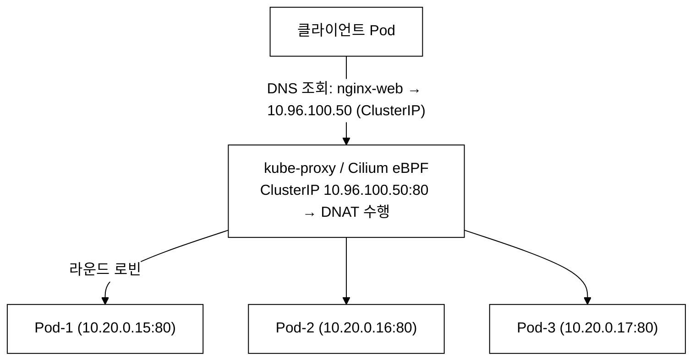
_그림 7. Service 동작 원리: DNS 가 ClusterIP 를 반환하고, kube-proxy/Cilium eBPF 가 DNAT 로 목적지를 실제 Pod IP 로 변환해 라운드 로빈 분배한다(규칙은 iptables/IPVS 또는 eBPF 로 구현)._

---

### Lab 3.1: ClusterIP vs NodePort 비교 (httpbin vs nginx)

**학습 목표:**
- ClusterIP와 NodePort Service의 차이를 실습으로 체감한다.
- nginx-web(NodePort 30080)과 httpbin(ClusterIP)의 접근 방식 차이를 확인한다.
- Service의 selector가 Pod를 어떻게 선택하는지 이해한다.

**Step 1: Service 목록 확인**

```bash
# demo 네임스페이스의 Service 목록
kubectl --context=dev get svc -n demo
```

**검증 — 기대 출력:**

> **예시(참조) — NAME         TYPE        CLUSTER-IP      EXTER:** KCNA 개념/실습 기대 출력. 실측은 KCNA daily(day01~07) 및 본 캡처 참고.

Service 타입별 접근 범위:
- `ClusterIP` (기본값): 클러스터 내부에서만 접근 가능한 가상 IP이다. httpbin, redis, postgres, rabbitmq가 이 타입이다.
- `NodePort`: ClusterIP에 추가로, 모든 노드의 특정 포트를 통해 외부에서 접근 가능하다. 기본 포트 범위는 30000-32767이며, 이 범위는 API Server의 `--service-node-port-range` 인자로 변경할 수 있다. nginx-web(30080), keycloak(30880)이 이 타입이다.
- `LoadBalancer`: NodePort에 추가로, 클라우드 제공자의 로드밸런서를 자동 프로비저닝한다. tart-infra에서는 사용하지 않는다.
- `ExternalName`: DNS CNAME 레코드를 반환한다. 외부 서비스를 클러스터 내부 DNS 이름으로 매핑한다.

**Step 2: NodePort Service 상세 확인**

```bash
# nginx-web NodePort Service 상세
kubectl --context=dev describe svc nginx-web -n demo
```

**검증 — 기대 출력:**

> **예시(참조) — Name:                     nginx-web:** KCNA 개념/실습 기대 출력. 실측은 KCNA daily(day01~07) 및 본 캡처 참고.

핵심 필드 설명:
- `Selector: app=nginx-web`: app=nginx-web 레이블을 가진 Pod로 트래픽을 라우팅한다.
- `IP: 10.96.100.50`: Service의 고정 ClusterIP이다.
- `Port: 80/TCP`: Service가 수신하는 포트이다.
- `TargetPort: 80/TCP`: 트래픽을 전달할 Pod의 포트이다. Port와 TargetPort는 다를 수 있다.
- `NodePort: 30080/TCP`: 외부에서 접근할 수 있는 노드 포트이다.
- `Endpoints: 10.20.0.15:80,10.20.0.16:80,10.20.0.17:80`: selector에 매칭되는 Ready 상태 Pod의 IP 목록이다.

**Step 3: ClusterIP Service 상세 확인**

```bash
# httpbin ClusterIP Service 상세
kubectl --context=dev describe svc httpbin -n demo
```

**검증 — 기대 출력:**

> **예시(참조) — Name:              httpbin:** KCNA 개념/실습 기대 출력. 실측은 KCNA daily(day01~07) 및 본 캡처 참고.

ClusterIP Service에는 NodePort가 없다. 외부에서 직접 접근할 수 없다.

**Step 4: NodePort로 외부 접근 테스트**

```bash
# NodePort를 통한 nginx-web 접근 (클러스터 외부에서)
NODE_IP=$(kubectl --context=dev get nodes -o jsonpath='{.items[0].status.addresses[?(@.type=="InternalIP")].address}')
curl -s http://$NODE_IP:30080 | head -5
```

**검증 — 기대 출력:**

> **예시(참조) — <!DOCTYPE html>:** KCNA 개념/실습 기대 출력. 실측은 KCNA daily(day01~07) 및 본 캡처 참고.

**Step 5: ClusterIP로는 외부 접근 불가 확인**

```bash
# ClusterIP로는 클러스터 외부에서 접근 불가
CLUSTER_IP=$(kubectl --context=dev get svc httpbin -n demo -o jsonpath='{.spec.clusterIP}')
curl -s --connect-timeout 3 http://$CLUSTER_IP:80 2>/dev/null || echo "접근 불가 — ClusterIP는 클러스터 내부에서만 접근 가능하다"
```

**검증 — 기대 출력:**

> **예시(참조) — 접근 불가 — ClusterIP는 클러스터 내부에서만 접근 가능하다:** KCNA 개념/실습 기대 출력. 실측은 KCNA daily(day01~07) 및 본 캡처 참고.

**Step 6: 클러스터 내부에서 ClusterIP 접근 테스트**

```bash
# 임시 Pod를 생성하여 클러스터 내부에서 httpbin 접근
kubectl --context=dev run curl-test --rm -it --image=curlimages/curl -n demo \
  -- curl -s http://httpbin.demo.svc.cluster.local/get | head -10
```

**검증 — 기대 출력:**

> **예시(참조) — {:** KCNA 개념/실습 기대 출력. 실측은 KCNA daily(day01~07) 및 본 캡처 참고.

클러스터 내부에서는 Service 이름(`httpbin`)이나 FQDN(`httpbin.demo.svc.cluster.local`)으로 접근할 수 있다.

**확인 문제:**
1. ClusterIP, NodePort, LoadBalancer의 접근 범위를 각각 설명하라.
2. NodePort의 기본 포트 범위는 무엇인가? (30000-32767)
3. Service의 selector와 Pod의 labels는 어떤 관계인가?
4. Service가 없어도 Pod에 직접 접근할 수 있는가? 그렇다면 왜 Service를 사용하는가?
5. ExternalTrafficPolicy=Local과 Cluster의 차이는?
6. Headless Service(ClusterIP: None)는 어떤 용도로 사용하는가?

**관련 KCNA 시험 주제:** Kubernetes Fundamentals — Service Types, Networking

---

### Lab 3.2: Service Endpoint 확인

**학습 목표:**
- Service와 Endpoint의 관계를 이해한다.
- Endpoint가 Pod의 IP 목록임을 확인한다.
- Pod가 추가/삭제될 때 Endpoint가 자동 업데이트됨을 관찰한다.

**내부 동작 원리:**

Endpoint Controller(kube-controller-manager의 일부)는 Service의 selector에 매칭되는 Pod를 지속적으로 감시한다. Pod가 생성/삭제되거나 readinessProbe 상태가 변경되면, Endpoint 목록을 자동으로 업데이트한다.

Kubernetes 1.21부터 EndpointSlice가 기본으로 사용된다. EndpointSlice는 기존 Endpoints 리소스를 대체하여, 대규모 Service(수천 개의 Pod)에서의 성능 문제를 해결한다. Endpoints는 단일 객체에 모든 Pod IP를 저장하므로 크기가 커질 수 있지만, EndpointSlice는 최대 100개의 엔드포인트를 슬라이스 단위로 분할하여 저장한다.

**Step 1: Endpoints 리소스 확인**

```bash
# nginx-web Service의 Endpoints 확인
kubectl --context=dev get endpoints nginx-web -n demo
```

**검증 — 기대 출력:**

> **예시(참조) — NAME        ENDPOINTS                         :** KCNA 개념/실습 기대 출력. 실측은 KCNA daily(day01~07) 및 본 캡처 참고.

3개의 Pod IP:Port가 표시된다 (레플리카 3개).

**Step 2: Endpoints와 Pod IP 대조**

```bash
# Pod IP 확인
echo "=== Pod IPs ==="
kubectl --context=dev get pods -n demo -l app=nginx-web -o custom-columns='NAME:.metadata.name,IP:.status.podIP'

echo ""
echo "=== Service Endpoints ==="
kubectl --context=dev get endpoints nginx-web -n demo
```

**검증 — 기대 출력:**

> **예시(참조) — === Pod IPs ===:** KCNA 개념/실습 기대 출력. 실측은 KCNA daily(day01~07) 및 본 캡처 참고.

Pod의 IP와 Endpoints의 IP가 정확히 일치한다.

**Step 3: Pod 삭제 후 Endpoint 변화 관찰**

```bash
# Pod 하나 삭제하고 Endpoint 변화 확인
POD_NAME=$(kubectl --context=dev get pods -n demo -l app=nginx-web -o jsonpath='{.items[0].metadata.name}')
echo "삭제할 Pod: $POD_NAME"

# 삭제 전 Endpoints
echo "=== 삭제 전 ==="
kubectl --context=dev get endpoints nginx-web -n demo

# Pod 삭제
kubectl --context=dev delete pod $POD_NAME -n demo

# 잠시 대기 후 Endpoints 확인
sleep 5
echo "=== 삭제 후 ==="
kubectl --context=dev get endpoints nginx-web -n demo
```

**검증 — 기대 출력:**

> **예시(참조) — 삭제할 Pod: nginx-web-7d8f5c4b6-abc12:** KCNA 개념/실습 기대 출력. 실측은 KCNA daily(day01~07) 및 본 캡처 참고.

삭제된 Pod의 IP(10.20.0.15)가 Endpoints에서 제거되고, 새로 생성된 Pod의 IP(10.20.0.25)가 추가되었다. 이 과정은 자동이다.

**Step 4: EndpointSlice 확인**

```bash
# EndpointSlice 확인 (Kubernetes 1.21+ 기본)
kubectl --context=dev get endpointslices -n demo -l kubernetes.io/service-name=nginx-web
```

**검증 — 기대 출력:**

> **예시(참조) — NAME              ADDRESSTYPE   PORTS   ENDPOI:** KCNA 개념/실습 기대 출력. 실측은 KCNA daily(day01~07) 및 본 캡처 참고.

**트레이드오프 — Endpoints의 한계와 EndpointSlice:**

기존 Endpoints 리소스는 하나의 etcd 객체에 Service에 속하는 모든 Pod IP를 저장한다. Service Pod 수가 수백~수천 개로 늘어나면 이 단일 객체의 크기가 etcd의 단일 객체 크기 제한(기본 1.5MB)에 근접하여 업데이트 자체가 불가능해질 수 있다. 또한 Pod가 하나 추가/삭제될 때마다 전체 Endpoints 객체를 갱신해야 하므로 kube-proxy가 그 전체를 다시 수신·처리하는 비효율이 발생한다. 이 문제를 해결하기 위해 Kubernetes 1.17에서 EndpointSlice가 도입되었고, 1.21부터 기본 활성화되었다. EndpointSlice는 최대 100개 엔드포인트 단위로 슬라이스를 분할하여, Pod 변경 시 해당 슬라이스만 갱신하므로 대규모 Service에서도 업데이트 비용이 일정하게 유지된다.

**확인 문제:**
1. Endpoint는 누가 관리하는가? (사용자 / Endpoint Controller)
2. Service의 selector에 매칭되지만 Ready 상태가 아닌 Pod는 Endpoint에 포함되는가?
3. EndpointSlice와 Endpoints의 차이점은 무엇인가?
4. Headless Service(ClusterIP: None)의 Endpoint는 어떻게 동작하는가?

**관련 KCNA 시험 주제:** Kubernetes Fundamentals — Service Discovery, Endpoints

---

### Lab 3.3: DNS 해석 테스트 (busybox Pod에서 nslookup)

**학습 목표:**
- Kubernetes 클러스터 내부 DNS(CoreDNS)의 동작 원리를 이해한다.
- Service FQDN 형식을 파악한다.
- 다른 네임스페이스의 Service에 접근하는 방법을 학습한다.

**내부 동작 원리 — CoreDNS:**

CoreDNS는 CNCF Graduated 프로젝트로, Kubernetes 1.13부터 기본 클러스터 DNS 서버이다. CoreDNS는 플러그인 기반 아키텍처로, Corefile이라는 설정 파일에서 플러그인 체인을 정의한다.

Service DNS 해석 흐름:
1. Pod 내부의 애플리케이션이 `nginx-web`으로 DNS 조회를 요청한다.
2. Pod의 `/etc/resolv.conf`에 설정된 nameserver(CoreDNS의 ClusterIP)로 쿼리가 전달된다.
3. `search` 도메인 목록에 따라 `nginx-web.demo.svc.cluster.local`로 확장된다.
4. CoreDNS가 Service의 ClusterIP를 응답한다.

```
DNS FQDN 형식
====================================

  Service FQDN:
  <service-name>.<namespace>.svc.<cluster-domain>

  예: nginx-web.demo.svc.cluster.local

  같은 네임스페이스에서의 축약:
  nginx-web                          ← 서비스 이름만
  nginx-web.demo                     ← 네임스페이스 포함
  nginx-web.demo.svc                 ← svc 포함
  nginx-web.demo.svc.cluster.local   ← 전체 FQDN

  Pod DNS 레코드 (Headless Service에서):
  <pod-name>.<service-name>.<namespace>.svc.<cluster-domain>
  예: postgres-0.postgres-headless.demo.svc.cluster.local
```

**Step 1: CoreDNS Pod 확인**

```bash
# CoreDNS Pod 확인
kubectl --context=dev get pods -n kube-system -l k8s-app=kube-dns
```

**검증 — 기대 출력:**

> **예시(참조) — NAME                       READY   STATUS    R:** KCNA 개념/실습 기대 출력. 실측은 KCNA daily(day01~07) 및 본 캡처 참고.

CoreDNS는 기본적으로 2개의 레플리카로 배포된다. 고가용성을 위해 2개 이상을 유지한다.

**Step 2: DNS 테스트 Pod 생성**

```bash
# busybox Pod를 생성하여 DNS 조회 테스트
kubectl --context=dev run dns-test --rm -it --image=busybox:1.36 -n demo \
  -- nslookup nginx-web.demo.svc.cluster.local
```

**검증 — 기대 출력:**

> **예시(참조) — Server:         10.96.0.10:** KCNA 개념/실습 기대 출력. 실측은 KCNA daily(day01~07) 및 본 캡처 참고.

`Server: 10.96.0.10`은 CoreDNS의 ClusterIP이다. `Address: 10.96.100.50`은 nginx-web Service의 ClusterIP이다.

**Step 3: 다양한 DNS 이름 형식 테스트**

```bash
# 같은 네임스페이스 — 짧은 이름
kubectl --context=dev run dns-test1 --rm -it --image=busybox:1.36 -n demo \
  -- nslookup nginx-web

# 네임스페이스 포함
kubectl --context=dev run dns-test2 --rm -it --image=busybox:1.36 -n demo \
  -- nslookup nginx-web.demo

# 전체 FQDN
kubectl --context=dev run dns-test3 --rm -it --image=busybox:1.36 -n demo \
  -- nslookup nginx-web.demo.svc.cluster.local
```

**검증 — 기대 출력 (세 가지 모두 동일):**

> **예시(참조) — Server:         10.96.0.10:** KCNA 개념/실습 기대 출력. 실측은 KCNA daily(day01~07) 및 본 캡처 참고.

세 가지 형식 모두 동일한 ClusterIP로 해석된다.

**Step 4: Pod의 DNS 설정 확인**

```bash
# Pod 내부의 DNS 설정 확인
kubectl --context=dev run dns-test4 --rm -it --image=busybox:1.36 -n demo \
  -- cat /etc/resolv.conf
```

**검증 — 기대 출력:**

> **예시(참조) — nameserver 10.96.0.10:** KCNA 개념/실습 기대 출력. 실측은 KCNA daily(day01~07) 및 본 캡처 참고.

핵심 설정 설명:
- `nameserver 10.96.0.10`: DNS 서버(CoreDNS)의 ClusterIP이다.
- `search demo.svc.cluster.local svc.cluster.local cluster.local`: 짧은 이름이 입력되면 이 도메인들을 순서대로 붙여 시도한다. `nginx-web`을 입력하면 `nginx-web.demo.svc.cluster.local`로 먼저 시도한다.
- `ndots:5`: 이름에 점(.)이 5개 미만이면 search 도메인을 붙여 시도한다. 이 설정 때문에 외부 도메인(예: google.com)도 먼저 클러스터 DNS로 조회되어 불필요한 DNS 쿼리가 발생할 수 있다.

**트러블슈팅 — DNS 해석 실패 시 체크리스트:**

```bash
# 1. CoreDNS Pod 상태 확인
kubectl --context=dev get pods -n kube-system -l k8s-app=kube-dns

# 2. CoreDNS 로그 확인
kubectl --context=dev logs -n kube-system -l k8s-app=kube-dns --tail=20

# 3. Service가 존재하는지 확인
kubectl --context=dev get svc -n demo

# 4. Pod의 resolv.conf 확인
kubectl --context=dev exec <pod-name> -n demo -- cat /etc/resolv.conf

# 5. CoreDNS ConfigMap 확인
kubectl --context=dev get configmap coredns -n kube-system -o yaml
```

**확인 문제:**
1. Kubernetes DNS FQDN의 전체 형식은 무엇인가?
2. 같은 네임스페이스에서 Service에 접근할 때 최소한의 DNS 이름은 무엇인가?
3. `ndots:5` 설정의 의미와 성능 영향은 무엇인가?
4. CoreDNS는 어떤 네임스페이스에서 실행되며, CNCF 프로젝트인가?

**관련 KCNA 시험 주제:** Kubernetes Fundamentals — DNS, Service Discovery

---

### Lab 3.4: NetworkPolicy로 트래픽 제어

**학습 목표:**
- Kubernetes NetworkPolicy의 동작 원리를 이해한다.
- CNI 플러그인(Cilium)과 NetworkPolicy의 관계를 파악한다.
- default-deny 정책의 의미와 적용 방법을 학습한다.

**등장 배경 — NetworkPolicy가 필요한 이유:**

Kubernetes는 기본적으로 모든 Pod 간 통신을 허용한다(flat network). 이는 개발 편의성을 높이지만, 프로덕션 환경에서는 심각한 보안 위험이 된다. 예를 들어, 공격자가 프론트엔드 Pod를 장악하면 같은 클러스터 내 데이터베이스 Pod에 직접 접근할 수 있다. NetworkPolicy는 Pod 수준의 방화벽 규칙을 정의하여 이 문제를 해결한다.

NetworkPolicy는 Kubernetes API 리소스이지만, 실제 네트워크 규칙 적용은 CNI 플러그인이 담당한다. Calico, Cilium, Weave Net 등이 NetworkPolicy를 지원하며, flannel은 NetworkPolicy를 지원하지 않는다. tart-infra 환경에서는 Cilium이 CNI로 사용되어 L3/L4 뿐 아니라 L7(HTTP, gRPC) 수준의 정책까지 적용할 수 있다.

```
NetworkPolicy 동작 원리
====================================

1. 사용자가 NetworkPolicy 리소스를 생성한다.
2. CNI 플러그인(Cilium)이 NetworkPolicy를 감시(watch)한다.
3. Cilium Agent가 eBPF 프로그램을 생성/업데이트한다.
4. eBPF 프로그램이 커널 레벨에서 패킷을 필터링한다.

  [Pod A] --패킷--> [eBPF 필터] --허용/거부--> [Pod B]

전통적 방식 (iptables 기반 - Calico):
  NetworkPolicy → iptables 규칙 → netfilter hook → 패킷 처리
  - iptables는 규칙 수가 선형적으로 증가하며, 규칙이 수천 개가 되면 매 패킷마다 전체 규칙 목록을 순회하여 성능이 저하된다.
  - 규칙 업데이트 시 전체 iptables 체인을 잠금(lock)하고 재작성해야 하므로, 대규모 클러스터에서 업데이트 지연이 발생한다.

Cilium 방식 (eBPF 기반):
  NetworkPolicy → eBPF bytecode 컴파일 → XDP/TC hook에 적재 → 패킷 처리
  - eBPF(extended Berkeley Packet Filter) — 커널 소스를 수정하거나 모듈을 삽입하지 않고, 커널 내부의 안전한 샌드박스에서 사용자 정의 프로그램을 실행하는 리눅스 커널 기술이다. 패킷이 userspace를 거치지 않으므로 컨텍스트 스위치 비용이 없다.
  - XDP(eXpress Data Path) — 네트워크 드라이버가 패킷을 수신한 직후, 커널 네트워크 스택이 개입하기 전 단계에서 eBPF 프로그램이 실행된다. 가장 빠른 처리가 가능하다.
  - TC(Traffic Control) hook — 커널 네트워킹 스택의 tc(traffic control) 계층에서 실행된다. XDP보다 늦지만, ingress/egress 양방향 처리와 더 많은 컨텍스트(예: Pod 메타데이터)에 접근할 수 있다. Cilium은 두 위치 모두에서 정책을 적용할 수 있어 유연하다.
```

**Step 1: 기본 통신 확인 (NetworkPolicy 없이)**

```bash
# demo 네임스페이스의 Pod 간 기본 통신 확인
kubectl --context=dev run netpol-test --rm -it --image=busybox:1.36 -n demo \
  -- wget -qO- --timeout=3 http://nginx-web.demo.svc.cluster.local
```

**검증 — 기대 출력:**

> **예시(참조) — <!DOCTYPE html>:** KCNA 개념/실습 기대 출력. 실측은 KCNA daily(day01~07) 및 본 캡처 참고.

NetworkPolicy가 없으므로 모든 Pod에서 nginx-web에 접근 가능하다.

**Step 2: default-deny Ingress 정책 적용**

```bash
# default-deny ingress 정책 생성
kubectl --context=dev apply -n demo -f - <<EOF
apiVersion: networking.k8s.io/v1
kind: NetworkPolicy
metadata:
  name: default-deny-ingress
  namespace: demo
spec:
  podSelector: {}
  policyTypes:
    - Ingress
EOF

# 정책 확인
kubectl --context=dev get networkpolicy -n demo
```

**검증 — 기대 출력:**

> **예시(참조) — NAME                   POD-SELECTOR   AGE:** KCNA 개념/실습 기대 출력. 실측은 KCNA daily(day01~07) 및 본 캡처 참고.

`podSelector: {}`는 네임스페이스 내 모든 Pod를 선택한다. `policyTypes: [Ingress]`만 지정하고 ingress 규칙을 정의하지 않았으므로, 모든 인바운드 트래픽이 거부된다.

**Step 3: 통신 차단 확인**

```bash
# default-deny 적용 후 통신 시도
kubectl --context=dev run netpol-test2 --rm -it --image=busybox:1.36 -n demo \
  -- wget -qO- --timeout=3 http://nginx-web.demo.svc.cluster.local
```

**검증 — 기대 출력:**

> **예시(참조) — wget: download timed out:** KCNA 개념/실습 기대 출력. 실측은 KCNA daily(day01~07) 및 본 캡처 참고.

default-deny 정책에 의해 모든 인바운드 트래픽이 차단되었다.

**Step 4: 특정 Pod만 허용하는 정책 추가**

```bash
# nginx-web에 대한 접근을 특정 레이블의 Pod만 허용
kubectl --context=dev apply -n demo -f - <<EOF
apiVersion: networking.k8s.io/v1
kind: NetworkPolicy
metadata:
  name: allow-to-nginx
  namespace: demo
spec:
  podSelector:
    matchLabels:
      app: nginx-web
  policyTypes:
    - Ingress
  ingress:
    - from:
        - podSelector:
            matchLabels:
              role: frontend
      ports:
        - protocol: TCP
          port: 80
EOF

# 허용된 레이블이 없는 Pod로 접근 시도
kubectl --context=dev run netpol-blocked --rm -it --image=busybox:1.36 -n demo \
  -- wget -qO- --timeout=3 http://nginx-web.demo.svc.cluster.local

# 허용된 레이블이 있는 Pod로 접근 시도
kubectl --context=dev run netpol-allowed --rm -it --image=busybox:1.36 -n demo \
  --labels="role=frontend" \
  -- wget -qO- --timeout=3 http://nginx-web.demo.svc.cluster.local
```

**검증 — 기대 출력:**

> **예시(참조) — netpol-blocked (레이블 없음)::** KCNA 개념/실습 기대 출력. 실측은 KCNA daily(day01~07) 및 본 캡처 참고.

**Step 5: Cilium에서 정책 적용 상태 확인**

```bash
# Cilium이 인식한 NetworkPolicy 확인
kubectl --context=dev exec -n kube-system ds/cilium -- cilium policy get 2>/dev/null | head -30

# Cilium Endpoint 상태 확인
kubectl --context=dev exec -n kube-system ds/cilium -- cilium endpoint list 2>/dev/null | head -10
```

**검증 — 기대 출력:**

> **예시(참조) — Revision: 5:** KCNA 개념/실습 기대 출력. 실측은 KCNA daily(day01~07) 및 본 캡처 참고.

**Step 6: 정리**

```bash
kubectl --context=dev delete networkpolicy default-deny-ingress allow-to-nginx -n demo --ignore-not-found
```

**트러블슈팅 — NetworkPolicy가 동작하지 않을 때:**

```bash
# 1. CNI 플러그인이 NetworkPolicy를 지원하는지 확인
kubectl --context=dev get ds -n kube-system | grep cilium

# 2. NetworkPolicy의 podSelector가 올바른지 확인
kubectl --context=dev get pods -n demo --show-labels

# 3. Cilium 에이전트 로그 확인
kubectl --context=dev logs -n kube-system -l k8s-app=cilium --tail=20
```

**확인 문제:**
1. NetworkPolicy가 없을 때 Kubernetes의 기본 네트워크 정책은 무엇인가?
2. default-deny 정책의 `podSelector: {}`는 무엇을 의미하는가?
3. CNI 플러그인이 NetworkPolicy를 지원하지 않으면 어떻게 되는가?
4. Cilium이 iptables 대신 eBPF를 사용하는 장점은 무엇인가?

**관련 KCNA 시험 주제:** Kubernetes Fundamentals — NetworkPolicy, CNI, Security

---

## 실습 4: 설정과 스토리지 (Fundamentals)

> ConfigMap, Secret, PVC를 활용하여 설정 외부화와 데이터 영속성을 실습한다.

### Lab 4.1: ConfigMap 생성 및 Pod에 마운트

**등장 배경 — 설정 외부화(Externalized Configuration):**

12-Factor App의 Factor III(Config)에 따르면, 설정은 코드와 분리하여 환경 변수에 저장해야 한다. 컨테이너 이미지에 설정을 하드코딩하면 환경(dev/staging/prod)마다 별도 이미지를 빌드해야 하고, 설정 변경 시 이미지를 재빌드해야 하는 문제가 발생한다. ConfigMap은 이 원칙을 Kubernetes에서 구현하는 핵심 메커니즘이다.

ConfigMap의 두 가지 주입 방식의 내부 동작 차이:
- **환경 변수 주입**: Pod 시작 시 kubelet이 ConfigMap을 읽어 컨테이너의 환경 변수로 설정한다. 이후 ConfigMap이 변경되어도 기존 Pod에는 반영되지 않는다. 반영하려면 Pod를 재시작해야 한다.
- **볼륨 마운트**: kubelet이 ConfigMap을 tmpfs 파일시스템에 마운트한다. ConfigMap이 변경되면 kubelet이 주기적으로(기본 60초) 파일을 업데이트한다. 단, 애플리케이션이 파일 변경을 감지(inotify 등)해야 실제로 반영된다.

**Step 1: 리터럴로 ConfigMap 생성**

```bash
# 리터럴로 ConfigMap 생성
kubectl --context=dev create configmap app-config -n demo \
  --from-literal=APP_ENV=development \
  --from-literal=LOG_LEVEL=info \
  --from-literal=DB_HOST=postgres.demo.svc.cluster.local \
  --from-literal=REDIS_HOST=redis.demo.svc.cluster.local \
  --from-literal=RABBITMQ_HOST=rabbitmq.demo.svc.cluster.local

# ConfigMap 확인
kubectl --context=dev get configmap app-config -n demo -o yaml
```

**검증 — 기대 출력:**

> **예시(참조) — apiVersion: v1:** KCNA 개념/실습 기대 출력. 실측은 KCNA daily(day01~07) 및 본 캡처 참고.

**Step 2: ConfigMap을 환경변수로 사용**

```bash
# ConfigMap을 환경변수로 사용하는 Pod 생성
kubectl --context=dev apply -n demo -f - <<EOF
apiVersion: v1
kind: Pod
metadata:
  name: config-env-pod
  namespace: demo
spec:
  containers:
    - name: app
      image: busybox:1.36
      command: ["sh", "-c", "env | sort && sleep 3600"]
      envFrom:
        - configMapRef:
            name: app-config
EOF

# Pod가 Ready 상태가 될 때까지 대기
kubectl --context=dev wait --for=condition=Ready pod/config-env-pod -n demo --timeout=30s

# 환경변수 확인
kubectl --context=dev exec config-env-pod -n demo -- env | grep -E "(APP_ENV|LOG_LEVEL|DB_HOST|REDIS_HOST|RABBITMQ_HOST)"
```

**검증 — 기대 출력:**

> **예시(참조) — APP_ENV=development:** KCNA 개념/실습 기대 출력. 실측은 KCNA daily(day01~07) 및 본 캡처 참고.

**Step 3: ConfigMap을 볼륨으로 마운트**

```bash
# ConfigMap을 파일로 마운트하는 Pod
kubectl --context=dev apply -n demo -f - <<EOF
apiVersion: v1
kind: Pod
metadata:
  name: config-volume-pod
  namespace: demo
spec:
  containers:
    - name: app
      image: busybox:1.36
      command: ["sh", "-c", "sleep 3600"]
      volumeMounts:
        - name: config
          mountPath: /etc/app-config
          readOnly: true
  volumes:
    - name: config
      configMap:
        name: app-config
EOF

# Pod Ready 대기
kubectl --context=dev wait --for=condition=Ready pod/config-volume-pod -n demo --timeout=30s

# 마운트된 파일 확인
kubectl --context=dev exec config-volume-pod -n demo -- ls -la /etc/app-config/
```

**검증 — 기대 출력:**

> **예시(참조) — total 0:** KCNA 개념/실습 기대 출력. 실측은 KCNA daily(day01~07) 및 본 캡처 참고.

```bash
# 파일 내용 확인
kubectl --context=dev exec config-volume-pod -n demo -- cat /etc/app-config/DB_HOST
```

**검증 — 기대 출력:**

> **예시(참조) — postgres.demo.svc.cluster.local:** KCNA 개념/실습 기대 출력. 실측은 KCNA daily(day01~07) 및 본 캡처 참고.

ConfigMap이 볼륨으로 마운트될 때 심볼릭 링크 구조를 사용하는 이유는 업데이트 원자성(Atomicity)을 보장하기 위함이다. 만약 각 키를 파일로 직접 덮어쓰면, 애플리케이션이 업데이트 도중 파일을 읽을 때 일부 키는 새 값, 일부 키는 구 값이 섞인 불일치 상태를 보게 된다. 대신 새 타임스탬프 디렉토리에 전체 키-값을 먼저 기록한 뒤, `..data` 심볼릭 링크를 `rename(2)` 시스템 콜로 원자적으로 교체하면 애플리케이션은 항상 완전한 데이터 세트(구버전 전체 또는 신버전 전체)를 읽게 된다. 이 재마운트는 kubelet이 configmap sync 주기(기본 60초)마다 수행한다. 단, 애플리케이션이 파일 변경을 감지하는 메커니즘(inotify 등)을 구현하지 않으면 업데이트된 파일을 자동으로 재읽지 않는다.

**Step 4: 정리**

```bash
kubectl --context=dev delete pod config-env-pod config-volume-pod -n demo --ignore-not-found
kubectl --context=dev delete configmap app-config -n demo --ignore-not-found
```

**확인 문제:**
1. ConfigMap을 Pod에 전달하는 두 가지 방법은 무엇인가?
2. ConfigMap을 볼륨으로 마운트했을 때, ConfigMap을 업데이트하면 Pod에 자동 반영되는가? 환경변수 방식은?
3. ConfigMap에 민감한 데이터(비밀번호)를 저장하면 안 되는 이유는 무엇인가?
4. ConfigMap의 최대 크기는 얼마인가?

**관련 KCNA 시험 주제:** Kubernetes Fundamentals — ConfigMap, Configuration Management

---

### Lab 4.2: Secret 확인 및 보안 이해

**학습 목표:**
- Secret의 저장 방식과 base64 인코딩의 한계를 이해한다.
- etcd 암호화(Encryption at Rest)의 필요성을 파악한다.
- Secret을 Pod에 주입하는 방법을 실습한다.

**등장 배경 — Secret이 필요한 이유:**

컨테이너 이미지에 비밀번호, API 키, TLS 인증서 등을 직접 포함하면, 이미지를 pull할 수 있는 모든 사용자가 민감 정보에 접근할 수 있다. 환경 변수로 전달하면 `docker inspect`로 노출된다. Secret은 민감 데이터를 Kubernetes API에서 별도로 관리하여 RBAC으로 접근 제어하는 메커니즘이다.

중요한 오해: Secret의 data 필드는 base64 인코딩일 뿐 암호화가 아니다. base64는 누구나 디코딩할 수 있으므로 보안을 제공하지 않는다. 실제 보안은 etcd 암호화(EncryptionConfiguration)와 RBAC을 통해 확보해야 한다.

```
Secret 보안 계층
====================================

[약함]  base64 인코딩 ← 기본값, 보안 아님
  ↓
[중간]  RBAC으로 Secret 접근 제한
  ↓
[강함]  etcd Encryption at Rest (EncryptionConfiguration)
  ↓
[최강]  외부 시크릿 관리자 (Vault, AWS Secrets Manager)
        + CSI Secret Store Driver
```

**Step 1: 데모 앱의 Secret 확인**

```bash
# demo 네임스페이스의 Secret 목록 확인
kubectl --context=dev get secrets -n demo

# postgres Secret 상세 확인
kubectl --context=dev get secret postgres-secret -n demo -o yaml 2>/dev/null || \
  echo "postgres-secret이 없으면 다른 Secret을 확인한다"
kubectl --context=dev get secrets -n demo -o name
```

**검증 — 기대 출력:**

> **예시(참조) — NAME                  TYPE                    :** KCNA 개념/실습 기대 출력. 실측은 KCNA daily(day01~07) 및 본 캡처 참고.

**Step 2: Secret 생성 및 base64 확인**

```bash
# Secret 생성
kubectl --context=dev create secret generic test-secret -n demo \
  --from-literal=username=admin \
  --from-literal=password='S3cur3P@ss!'

# base64로 인코딩된 값 확인
kubectl --context=dev get secret test-secret -n demo -o jsonpath='{.data.username}' | base64 -d
echo ""
kubectl --context=dev get secret test-secret -n demo -o jsonpath='{.data.password}' | base64 -d
echo ""
```

**검증 — 기대 출력:**

> **예시(참조) — admin:** KCNA 개념/실습 기대 출력. 실측은 KCNA daily(day01~07) 및 본 캡처 참고.

base64 디코딩만으로 원본 값을 복원할 수 있다. 이것이 Secret이 자체적으로 안전하지 않은 이유이다.

**Step 3: Secret을 Pod에 마운트**

```bash
# Secret을 환경변수와 볼륨 양쪽으로 사용하는 Pod
kubectl --context=dev apply -n demo -f - <<EOF
apiVersion: v1
kind: Pod
metadata:
  name: secret-test-pod
  namespace: demo
spec:
  containers:
    - name: app
      image: busybox:1.36
      command: ["sh", "-c", "echo ENV_USER=\$DB_USER; echo FILE_PASS=\$(cat /etc/secrets/password); sleep 3600"]
      env:
        - name: DB_USER
          valueFrom:
            secretKeyRef:
              name: test-secret
              key: username
      volumeMounts:
        - name: secret-volume
          mountPath: /etc/secrets
          readOnly: true
  volumes:
    - name: secret-volume
      secret:
        secretName: test-secret
EOF

kubectl --context=dev wait --for=condition=Ready pod/secret-test-pod -n demo --timeout=30s
kubectl --context=dev logs secret-test-pod -n demo
```

**검증 — 기대 출력:**

> **예시(참조) — ENV_USER=admin:** KCNA 개념/실습 기대 출력. 실측은 KCNA daily(day01~07) 및 본 캡처 참고.

**Step 4: etcd 암호화 상태 확인**

etcd 암호화(Encryption at Rest) 설정 확인은 API Server 로그를 통해 안전하게 수행한다. 노드 IP를 직접 사용하는 SSH 방식은 멀티 control-plane 구성에서 연결 대상이 모호해질 수 있으므로 권장하지 않는다.

```bash
# 방법 1 (권장): API Server 로그에서 encryption 설정 여부 확인
kubectl --context=dev logs -n kube-system \
  -l component=kube-apiserver --tail=100 2>/dev/null | grep -i "encryption" | head -5 || \
  echo "로그에 encryption 관련 항목 없음"

# 방법 2: API Server Pod의 실행 인자에서 직접 확인
kubectl --context=dev get pod -n kube-system \
  -l component=kube-apiserver \
  -o jsonpath='{.items[0].spec.containers[0].command}' | tr ',' '\n' | grep encryption
```

**검증 — 기대 출력:**

> **예시(참조) — EncryptionConfiguration이 설정된 경우::** KCNA 개념/실습 기대 출력. 실측은 KCNA daily(day01~07) 및 본 캡처 참고.

tart-infra 환경은 기본적으로 etcd 암호화를 설정하지 않는다. 따라서 Secret은 etcd에 base64 인코딩된 평문으로 저장된다. 실제 보안이 필요한 환경에서는 `EncryptionConfiguration`(API Server 기동 시 `--encryption-provider-config` 플래그로 지정하는 설정 파일로, etcd 저장 전 AES-CBC·AES-GCM·secretbox 등으로 데이터를 암호화한다)과 `--encryption-provider-config` 인자를 추가하여 etcd 저장소 수준의 암호화를 활성화해야 한다.

**Step 5: 정리**

```bash
kubectl --context=dev delete pod secret-test-pod -n demo --ignore-not-found
kubectl --context=dev delete secret test-secret -n demo --ignore-not-found
```

**트러블슈팅 — Secret 관련 문제:**

```bash
# 1. Secret이 Pod에 주입되지 않을 때
kubectl --context=dev describe pod <pod-name> -n demo | grep -A5 "Events"
# "secret not found" 에러 → Secret이 같은 네임스페이스에 존재하는지 확인

# 2. Secret 키 이름이 틀렸을 때
kubectl --context=dev get secret <secret-name> -n demo -o jsonpath='{.data}' | python3 -m json.tool
```

**확인 문제:**
1. Secret의 base64 인코딩은 암호화인가?
2. etcd에서 Secret을 암호화하려면 어떤 설정이 필요한가?
3. Secret을 Pod에 전달하는 두 가지 방법은 무엇인가?
4. Secret의 type 종류(Opaque, kubernetes.io/tls 등)와 차이점은 무엇인가?

**관련 KCNA 시험 주제:** Kubernetes Fundamentals — Secrets, Security

---

### Lab 4.3: PVC 확인 — 영속 스토리지

**학습 목표:**
- PersistentVolume(PV)과 PersistentVolumeClaim(PVC)의 관계를 이해한다.
- StorageClass와 Dynamic Provisioning의 동작 원리를 파악한다.
- Access Mode(RWO, RWX, ROX)의 차이를 학습한다.

**등장 배경 — 컨테이너 스토리지의 문제:**

컨테이너는 기본적으로 임시(ephemeral) 파일시스템을 사용한다. 컨테이너가 재시작되면 기존 데이터가 사라진다. 데이터베이스(postgres, redis), 메시지 큐(rabbitmq) 같은 스테이트풀 워크로드에서는 치명적인 문제이다. PV/PVC 시스템은 스토리지를 Pod 라이프사이클과 분리하여 데이터 영속성을 보장한다.

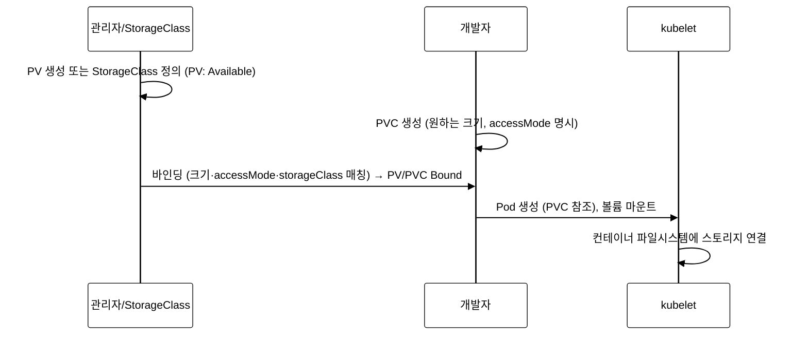
_그림 8. PV/PVC 바인딩 흐름: 관리자가 PV 를 준비하고 개발자가 PVC 를 생성하면 매칭 조건이 맞을 때 바인딩되며, Pod 가 PVC 를 참조하면 kubelet 이 볼륨을 마운트한다._

**Step 1: StorageClass 확인**

```bash
# StorageClass 목록 확인
kubectl --context=dev get storageclass
```

**검증 — 기대 출력:**

> **예시(참조) — NAME                 PROVISIONER             R:** KCNA 개념/실습 기대 출력. 실측은 KCNA daily(day01~07) 및 본 캡처 참고.

`WaitForFirstConsumer`는 PVC가 생성될 때 즉시 바인딩하지 않고, Pod가 스케줄링될 때까지 대기하는 모드이다. 이는 Pod가 스케줄링되는 노드에 볼륨을 생성하여 데이터 지역성(data locality)을 보장한다.

**Step 2: PVC 목록 및 상태 확인**

```bash
# PVC 목록 확인
kubectl --context=dev get pvc -n demo

# PV 목록 확인
kubectl --context=dev get pv
```

**검증 — 기대 출력:**

> **예시(참조) — NAME                STATUS   VOLUME           :** KCNA 개념/실습 기대 출력. 실측은 KCNA daily(day01~07) 및 본 캡처 참고.

`RWO`(ReadWriteOnce)는 단일 노드에서만 읽기/쓰기가 가능한 모드이다. `Bound` 상태는 PVC와 PV가 성공적으로 바인딩되었음을 의미한다.

**Step 3: PVC를 사용하는 Pod 생성**

```bash
# PVC 생성
kubectl --context=dev apply -n demo -f - <<EOF
apiVersion: v1
kind: PersistentVolumeClaim
metadata:
  name: test-pvc
  namespace: demo
spec:
  accessModes:
    - ReadWriteOnce
  resources:
    requests:
      storage: 100Mi
  storageClassName: local-path
EOF

# PVC 상태 확인
kubectl --context=dev get pvc test-pvc -n demo
```

**검증 — 기대 출력:**

> **예시(참조) — NAME       STATUS    VOLUME   CAPACITY   ACCES:** KCNA 개념/실습 기대 출력. 실측은 KCNA daily(day01~07) 및 본 캡처 참고.

`WaitForFirstConsumer` 모드이므로 PVC는 Pod가 생성될 때까지 Pending 상태이다.

```bash
# PVC를 사용하는 Pod 생성
kubectl --context=dev apply -n demo -f - <<EOF
apiVersion: v1
kind: Pod
metadata:
  name: pvc-test-pod
  namespace: demo
spec:
  containers:
    - name: writer
      image: busybox:1.36
      command: ["sh", "-c", "echo 'persistent data' > /data/test.txt && cat /data/test.txt && sleep 3600"]
      volumeMounts:
        - name: data
          mountPath: /data
  volumes:
    - name: data
      persistentVolumeClaim:
        claimName: test-pvc
EOF

kubectl --context=dev wait --for=condition=Ready pod/pvc-test-pod -n demo --timeout=60s

# PVC가 Bound 상태가 되었는지 확인
kubectl --context=dev get pvc test-pvc -n demo
```

**검증 — 기대 출력:**

> **예시(참조) — NAME       STATUS   VOLUME                    :** KCNA 개념/실습 기대 출력. 실측은 KCNA daily(day01~07) 및 본 캡처 참고.

**Step 4: 데이터 영속성 검증**

```bash
# Pod 삭제 후 데이터가 유지되는지 확인
kubectl --context=dev delete pod pvc-test-pod -n demo

# 같은 PVC를 사용하는 새 Pod 생성
kubectl --context=dev apply -n demo -f - <<EOF
apiVersion: v1
kind: Pod
metadata:
  name: pvc-test-pod2
  namespace: demo
spec:
  containers:
    - name: reader
      image: busybox:1.36
      command: ["sh", "-c", "cat /data/test.txt && sleep 3600"]
      volumeMounts:
        - name: data
          mountPath: /data
  volumes:
    - name: data
      persistentVolumeClaim:
        claimName: test-pvc
EOF

kubectl --context=dev wait --for=condition=Ready pod/pvc-test-pod2 -n demo --timeout=60s
kubectl --context=dev logs pvc-test-pod2 -n demo
```

**검증 — 기대 출력:**

> **예시(참조) — persistent data:** KCNA 개념/실습 기대 출력. 실측은 KCNA daily(day01~07) 및 본 캡처 참고.

Pod가 삭제되고 새로 생성되어도 PVC에 저장된 데이터는 유지된다.

**Step 5: 정리**

```bash
kubectl --context=dev delete pod pvc-test-pod2 -n demo --ignore-not-found
kubectl --context=dev delete pvc test-pvc -n demo --ignore-not-found
```

**트러블슈팅 — PVC 관련 문제:**

```bash
# PVC가 Pending에서 벗어나지 않을 때
kubectl --context=dev describe pvc <pvc-name> -n demo | grep -A5 "Events"
# "no persistent volumes available" → StorageClass 확인
# "waiting for first consumer" → WaitForFirstConsumer 모드, Pod 생성 필요

# PV의 ReclaimPolicy 확인
kubectl --context=dev get pv -o custom-columns=NAME:.metadata.name,RECLAIM:.spec.persistentVolumeReclaimPolicy
```

**확인 문제:**
1. PVC가 Pending 상태인 원인 두 가지는 무엇인가?
2. ReclaimPolicy의 Delete와 Retain의 차이점은 무엇인가?
3. ReadWriteOnce(RWO)와 ReadWriteMany(RWX)의 차이점은 무엇인가?
4. Dynamic Provisioning에서 StorageClass의 역할은 무엇인가?

**관련 KCNA 시험 주제:** Kubernetes Fundamentals — PV, PVC, StorageClass

---

## 실습 5: 컨테이너 오케스트레이션 (Container Orchestration)

> 컨테이너 런타임, 자동 복구, 롤링 업데이트, 스케줄링을 실습한다.

**실습 1~4에서 실습 5로 넘어가는 이유:**

실습 1~4에서는 Kubernetes의 구조(Control Plane, Worker Node), 워크로드 리소스(Deployment, ReplicaSet, Pod, Job), 네트워킹(Service, NetworkPolicy, DNS), 설정/스토리지(ConfigMap, Secret, PVC)를 학습하였다. 이는 클러스터가 "무엇으로 구성되어 있고 어떤 리소스를 사용하는가"에 관한 내용이다.

이제 실습 5에서는 "컨테이너가 실제로 어떻게 생성·실행·삭제되는가"를 다룬다. containerd가 OCI 스펙에 따라 컨테이너를 생성하는 내부 동작, Pod가 장애를 겪었을 때 자동 복구되는 메커니즘, 무중단 롤링 업데이트가 진행되는 과정 등이 여기에 해당한다. 실습 1~4의 개념 위에서 실제 오케스트레이션 동작을 관찰하는 것이 목표이다.

### Lab 5.1: containerd/CRI 확인

**학습 목표:**
- Container Runtime Interface(CRI)의 개념과 필요성을 이해한다.
- crictl 도구를 사용하여 컨테이너 런타임을 직접 조회한다.
- containerd와 Docker의 아키텍처 차이를 파악한다.

**등장 배경 — Docker에서 CRI로의 전환:**

초기 Kubernetes는 Docker만 지원하였다. 이로 인해 kubelet 코드에 Docker 전용 로직이 하드코딩되어 있었고, 다른 런타임을 사용할 수 없었다. Kubernetes 1.5에서 CRI(Container Runtime Interface)가 도입되어 런타임을 플러그인으로 교체할 수 있게 되었다. Kubernetes 1.24에서 dockershim이 제거되면서, Docker를 직접 런타임으로 사용하는 것이 더 이상 불가능해졌다.

```
CRI 아키텍처 변천
====================================

[Kubernetes 1.0~1.4] Docker 하드코딩
  kubelet → Docker Engine → containerd → runc → 컨테이너

[Kubernetes 1.5~1.23] CRI + dockershim
  kubelet → CRI → dockershim → Docker Engine → containerd → runc

[Kubernetes 1.24+] CRI 직접 연결 (현재)
  kubelet → CRI(gRPC) → containerd → runc → 컨테이너
  kubelet → CRI(gRPC) → CRI-O → runc → 컨테이너

Docker 경유 시 불필요한 계층이 추가되어 오버헤드가 발생하였다.
containerd 직접 연결은 레이턴시와 리소스 사용량을 줄인다.
```

**Step 1: 노드의 컨테이너 런타임 확인**

```bash
# 노드의 런타임 정보 확인
kubectl --context=dev get nodes -o wide
```

**검증 — 기대 출력:**


`CONTAINER-RUNTIME` 열에서 `containerd://1.7.x`를 확인할 수 있다.

**Step 2: crictl로 컨테이너 목록 조회**

```bash
# SSH로 노드에 접속하여 crictl 실행
ssh admin@$(kubectl --context=dev get nodes -o jsonpath='{.items[0].status.addresses[0].address}') \
  "sudo crictl ps --name nginx-web | head -5"
```

**검증 — 기대 출력:**

> **예시(참조) — CONTAINER           IMAGE               CREATE:** KCNA 개념/실습 기대 출력. 실측은 KCNA daily(day01~07) 및 본 캡처 참고.

**Step 3: crictl로 이미지 목록 조회**

```bash
ssh admin@$(kubectl --context=dev get nodes -o jsonpath='{.items[0].status.addresses[0].address}') \
  "sudo crictl images | head -10"
```

**검증 — 기대 출력:**

> **예시(참조) — IMAGE                                TAG      :** KCNA 개념/실습 기대 출력. 실측은 KCNA daily(day01~07) 및 본 캡처 참고.

`pause` 이미지는 Pod의 인프라 컨테이너로, Pod의 네트워크 네임스페이스를 유지하는 역할을 한다.

**Step 4: CRI 소켓 확인**

```bash
ssh admin@$(kubectl --context=dev get nodes -o jsonpath='{.items[0].status.addresses[0].address}') \
  "sudo crictl info | head -20"
```

**검증 — 기대 출력:**

> **예시(참조) — {:** KCNA 개념/실습 기대 출력. 실측은 KCNA daily(day01~07) 및 본 캡처 참고.

`RuntimeReady`와 `NetworkReady`가 모두 `true`이면 컨테이너 런타임과 CNI가 정상 동작 중이다.

**트러블슈팅 — 런타임 관련 문제:**

```bash
# containerd 서비스 상태 확인 (VM 이름 별칭 사용)
ssh dev-master "sudo systemctl status containerd"

# containerd 로그 확인
ssh dev-master "sudo journalctl -u containerd --since '10 minutes ago' | tail -20"

# CRI 소켓 존재 확인
ssh dev-master "ls -la /run/containerd/containerd.sock"
```

**확인 문제:**
1. CRI가 도입된 이유는 무엇인가?
2. dockershim이 Kubernetes 1.24에서 제거된 영향은 무엇인가?
3. crictl과 docker CLI의 차이점은 무엇인가?
4. pause 컨테이너의 역할은 무엇인가?

**관련 KCNA 시험 주제:** Container Orchestration — CRI, containerd, Container Runtime

---

### Lab 5.2: 자동 복구(Self-Healing) 관찰

**학습 목표:**
- Kubernetes의 자동 복구(Self-Healing) 메커니즘을 이해한다.
- Reconciliation Loop의 동작 원리를 파악한다.
- Liveness Probe와 Readiness Probe의 차이를 실습한다.

**등장 배경 — 수동 복구의 한계:**

전통적인 서버 관리에서는 프로세스가 죽으면 운영자가 수동으로 재시작하거나, systemd 같은 프로세스 관리자가 단일 노드 수준에서 재시작하였다. 클러스터 수준에서의 자동 복구(다른 노드로의 재배치, 원하는 레플리카 수 유지 등)는 Kubernetes의 Reconciliation Loop가 제공하는 핵심 기능이다.

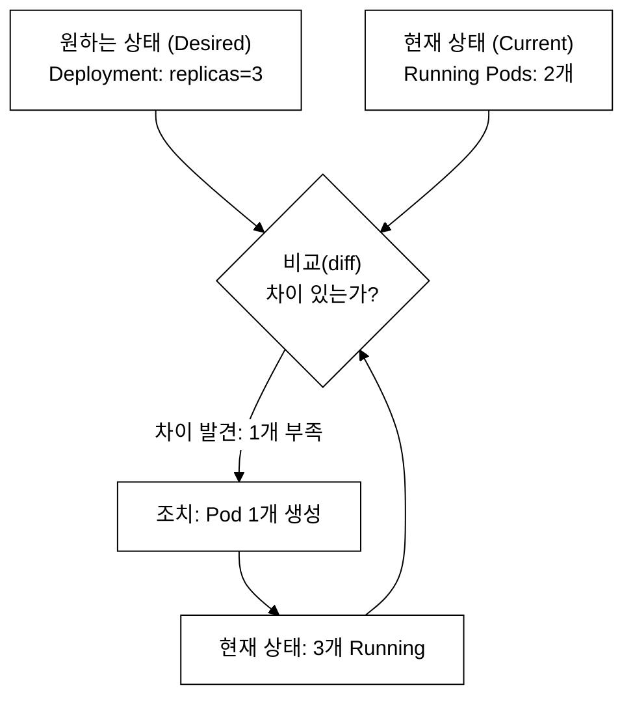
_그림 9. Reconciliation Loop: 원하는 상태와 현재 상태를 비교해 차이가 있으면 조치하고 다시 비교하는 무한 루프. kube-controller-manager 의 각 컨트롤러(Deployment·ReplicaSet·Node·Job)가 수행한다._

**Step 1: Pod 강제 삭제 후 자동 복구 관찰**

```bash
# 현재 nginx-web Pod 수 확인
kubectl --context=dev get pods -n demo -l app=nginx-web
echo "---"

# Pod 하나 강제 삭제
POD_NAME=$(kubectl --context=dev get pods -n demo -l app=nginx-web -o jsonpath='{.items[0].metadata.name}')
echo "삭제 대상: $POD_NAME"
kubectl --context=dev delete pod $POD_NAME -n demo

# 즉시 Pod 수 확인
sleep 2
kubectl --context=dev get pods -n demo -l app=nginx-web
```

**검증 — 기대 출력:**

> **예시(참조) — NAME                         READY   STATUS   :** KCNA 개념/실습 기대 출력. 실측은 KCNA daily(day01~07) 및 본 캡처 참고.

ReplicaSet Controller가 Pod 수가 3개 미만임을 감지하고 즉시 새 Pod를 생성하였다.

**Step 2: Liveness Probe 실패 시 자동 재시작**

```bash
# livenessProbe가 실패하도록 설계된 Pod 생성
kubectl --context=dev apply -n demo -f - <<EOF
apiVersion: v1
kind: Pod
metadata:
  name: liveness-test
  namespace: demo
spec:
  containers:
    - name: app
      image: busybox:1.36
      command: ["sh", "-c", "touch /tmp/healthy && sleep 20 && rm /tmp/healthy && sleep 600"]
      livenessProbe:
        exec:
          command: ["cat", "/tmp/healthy"]
        initialDelaySeconds: 5
        periodSeconds: 5
        failureThreshold: 3
EOF

# 30초 후 상태 확인 (재시작 발생)
sleep 35
kubectl --context=dev get pod liveness-test -n demo
```

**검증 — 기대 출력:**

> **예시(참조) — NAME            READY   STATUS    RESTARTS    :** KCNA 개념/실습 기대 출력. 실측은 KCNA daily(day01~07) 및 본 캡처 참고.

`RESTARTS`가 1 이상이면 livenessProbe 실패로 kubelet이 컨테이너를 재시작한 것이다. 20초 후 `/tmp/healthy` 파일이 삭제되고, failureThreshold=3 * periodSeconds=5 = 15초 후 재시작된다.

**세 가지 Probe 비교 — Liveness, Readiness, Startup:**

| Probe | 실패 시 동작 | 주요 용도 |
|-------|------------|---------|
| Liveness Probe | kubelet이 컨테이너를 재시작 | 데드락, 응답 불능 상태를 감지하여 자동 복구 |
| Readiness Probe | Service Endpoint에서 제거 (재시작 없음) | 초기화 완료 전 또는 일시적 부하 과부하 시 트래픽 차단 |
| Startup Probe | 통과 전까지 Liveness/Readiness 비활성화 | Java, Spring Boot처럼 초기 구동 시간이 긴 애플리케이션에서 Liveness가 너무 일찍 실패하는 것을 방지 |

Startup Probe가 없는 경우, 구동 시간이 긴 애플리케이션에서 `initialDelaySeconds`를 넉넉하게 잡아야 하는데 정확한 값을 예측하기 어렵다. Startup Probe를 사용하면 애플리케이션이 시작 완료 신호를 보낼 때까지 `failureThreshold * periodSeconds` 시간 동안 대기하므로 더 유연하다.

**Step 3: Readiness Probe 확인**

```bash
# readinessProbe가 실패하는 Pod 생성
kubectl --context=dev apply -n demo -f - <<EOF
apiVersion: v1
kind: Pod
metadata:
  name: readiness-test
  namespace: demo
  labels:
    app: readiness-test
spec:
  containers:
    - name: app
      image: busybox:1.36
      command: ["sh", "-c", "sleep 600"]
      readinessProbe:
        exec:
          command: ["cat", "/tmp/ready"]
        initialDelaySeconds: 5
        periodSeconds: 5
---
apiVersion: v1
kind: Service
metadata:
  name: readiness-svc
  namespace: demo
spec:
  selector:
    app: readiness-test
  ports:
    - port: 80
EOF

sleep 10
# Pod는 Running이지만 Ready가 아님
kubectl --context=dev get pod readiness-test -n demo
# Endpoints에 포함되지 않음
kubectl --context=dev get endpoints readiness-svc -n demo
```

**검증 — 기대 출력:**

> **예시(참조) — NAME             READY   STATUS    RESTARTS   :** KCNA 개념/실습 기대 출력. 실측은 KCNA daily(day01~07) 및 본 캡처 참고.

Readiness Probe가 실패하면 Pod는 Running이지만 READY=0/1이다. Service의 Endpoints에 포함되지 않아 트래픽이 전달되지 않는다. Liveness Probe와 달리 컨테이너를 재시작하지 않는다.

**Step 4: 정리**

```bash
kubectl --context=dev delete pod liveness-test readiness-test -n demo --ignore-not-found
kubectl --context=dev delete svc readiness-svc -n demo --ignore-not-found
```

**확인 문제:**
1. Liveness Probe가 실패하면 무엇이 발생하는가?
2. Readiness Probe가 실패하면 무엇이 발생하는가?
3. Startup Probe는 어떤 상황에서 사용하는가?
4. Reconciliation Loop에서 "원하는 상태"는 어디에 저장되는가?

**관련 KCNA 시험 주제:** Container Orchestration — Self-Healing, Probes, Reconciliation

---

### Lab 5.3: Rolling Update 실습

**학습 목표:**
- Rolling Update의 동작 원리(maxSurge, maxUnavailable)를 이해한다.
- ReplicaSet 히스토리를 확인하고 롤백을 수행한다.
- Recreate 전략과의 차이를 파악한다.

**등장 배경 — 무중단 배포의 필요성:**

전통적인 배포 방식에서는 기존 버전을 모두 중단하고 새 버전을 시작하였다(Big Bang Deploy). 이 방식은 배포 중 다운타임이 발생한다. Rolling Update는 기존 Pod를 점진적으로 교체하여 무중단 배포를 구현한다.

```
Rolling Update 내부 동작
====================================

maxSurge=1, maxUnavailable=0, replicas=3 인 경우:

Step 1: 새 ReplicaSet 생성, 1개 Pod 추가 (총 4개)
  [old-1: Running] [old-2: Running] [old-3: Running] [new-1: Creating]

Step 2: new-1 Ready → old-1 제거 (총 3개)
  [old-2: Running] [old-3: Running] [new-1: Running]

Step 3: new-2 추가 (총 4개)
  [old-2: Running] [old-3: Running] [new-1: Running] [new-2: Creating]

Step 4: new-2 Ready → old-2 제거 (총 3개)
  [old-3: Running] [new-1: Running] [new-2: Running]

Step 5: new-3 추가 (총 4개)
  [old-3: Running] [new-1: Running] [new-2: Running] [new-3: Creating]

Step 6: new-3 Ready → old-3 제거 (총 3개, 완료)
  [new-1: Running] [new-2: Running] [new-3: Running]
```

**Step 1: 현재 이미지 버전 및 ReplicaSet 확인**

```bash
# 현재 이미지 확인
kubectl --context=dev get deployment nginx-web -n demo -o jsonpath='{.spec.template.spec.containers[0].image}'
echo ""

# ReplicaSet 확인
kubectl --context=dev get replicasets -n demo -l app=nginx-web
```

**검증 — 기대 출력:**

> **예시(참조) — nginx:alpine:** KCNA 개념/실습 기대 출력. 실측은 KCNA daily(day01~07) 및 본 캡처 참고.

**Step 2: Rolling Update 실행**

```bash
# 이미지 업데이트
kubectl --context=dev set image deployment/nginx-web nginx-web=nginx:1.25-alpine -n demo

# 롤아웃 상태 추적
kubectl --context=dev rollout status deployment/nginx-web -n demo
```

**검증 — 기대 출력:**

> **예시(참조) — Waiting for deployment "nginx-web" rollout to :** KCNA 개념/실습 기대 출력. 실측은 KCNA daily(day01~07) 및 본 캡처 참고.

**Step 3: ReplicaSet 히스토리 확인**

```bash
# ReplicaSet 목록 — 이전 RS가 replicas=0으로 유지됨
kubectl --context=dev get replicasets -n demo -l app=nginx-web

# 롤아웃 히스토리
kubectl --context=dev rollout history deployment/nginx-web -n demo
```

**검증 — 기대 출력:**

> **예시(참조) — NAME                         DESIRED   CURRENT:** KCNA 개념/실습 기대 출력. 실측은 KCNA daily(day01~07) 및 본 캡처 참고.

이전 ReplicaSet(replicas=0)이 삭제되지 않고 유지되는 이유는, 롤백 시 이 ReplicaSet을 다시 스케일업하기 위함이다. `revisionHistoryLimit`(기본값 10)으로 보관할 최대 ReplicaSet 수를 제어한다.

**Step 4: 롤백 실행**

```bash
# 이전 버전으로 롤백
kubectl --context=dev rollout undo deployment/nginx-web -n demo
kubectl --context=dev rollout status deployment/nginx-web -n demo

# 이미지 확인
kubectl --context=dev get deployment nginx-web -n demo -o jsonpath='{.spec.template.spec.containers[0].image}'
echo ""
```

**검증 — 기대 출력:**

> **예시(참조) — deployment.apps/nginx-web rolled back:** KCNA 개념/실습 기대 출력. 실측은 KCNA daily(day01~07) 및 본 캡처 참고.

**트러블슈팅 — Rolling Update 문제:**

```bash
# 롤아웃이 멈춘 경우
kubectl --context=dev rollout status deployment/nginx-web -n demo --timeout=60s
# 타임아웃 발생 시:
kubectl --context=dev get pods -n demo -l app=nginx-web
kubectl --context=dev describe pod <문제-pod> -n demo | tail -20
# ImagePullBackOff → 이미지 이름/태그 확인
# CrashLoopBackOff → 컨테이너 로그 확인
# 긴급 롤백: kubectl --context=dev rollout undo deployment/nginx-web -n demo
```

**확인 문제:**
1. maxSurge=1, maxUnavailable=0일 때 롤링 업데이트 중 최대 Pod 수는?
2. Recreate 전략은 어떤 상황에서 사용하는가?
3. 롤백 시 이전 ReplicaSet을 재사용하는가, 새로 생성하는가?
4. `revisionHistoryLimit`의 기본값과 역할은 무엇인가?

**관련 KCNA 시험 주제:** Container Orchestration — Rolling Update, Deployment Strategy

---

### Lab 5.4: 스케줄링 확인

**학습 목표:**
- kube-scheduler의 Filtering → Scoring 2단계 과정을 이해한다.
- nodeSelector, Taint/Toleration, NodeAffinity의 차이를 파악한다.
- PodTopologySpreadConstraints의 목적을 학습한다.

**등장 배경 — 스케줄링의 복잡성:**

단일 노드 클러스터에서는 모든 Pod가 같은 노드에 배치되므로 스케줄링이 단순하다. 멀티 노드 환경에서는 리소스 균형, 데이터 지역성, 고가용성(Pod를 여러 노드/존에 분산), 하드웨어 요구사항(GPU 노드) 등 복합적인 조건을 고려해야 한다.

```
kube-scheduler 동작 흐름
====================================

1. Filtering (필터링): 조건을 충족하지 못하는 노드를 제거
   - NodeResourcesFit: 리소스(CPU/메모리) 충분한지
   - NodeAffinity: nodeSelector/nodeAffinity 조건 충족하는지
   - TaintToleration: Taint를 Toleration하는지
   - PodTopologySpread: 분산 조건 충족하는지

2. Scoring (점수 매기기): 남은 노드에 점수 부여
   - NodeResourcesBalancedAllocation: 리소스 균형
   - ImageLocality: 이미지가 이미 있는 노드 선호
   - InterPodAffinity: Pod 간 친화성/반친화성

3. 최고 점수 노드에 Pod 배치 (Binding)
```

**Step 1: 노드 레이블과 Taint 확인**

```bash
# 노드 레이블 확인
kubectl --context=dev get nodes --show-labels

# 노드 Taint 확인
kubectl --context=dev describe nodes | grep -A3 "Taints:"
```

**검증 — 기대 출력:**

> **예시(참조) — NAME   STATUS   ROLES           AGE   VERSION :** KCNA 개념/실습 기대 출력. 실측은 KCNA daily(day01~07) 및 본 캡처 참고.

tart-infra 환경은 단일 노드이므로 control-plane Taint가 제거되어 있다(워크로드도 control-plane에서 실행).

**Step 2: nodeSelector를 사용한 스케줄링**

```bash
# nodeSelector가 없는 Pod — 정상 스케줄링
kubectl --context=dev apply -n demo -f - <<EOF
apiVersion: v1
kind: Pod
metadata:
  name: sched-test-ok
  namespace: demo
spec:
  containers:
    - name: app
      image: busybox:1.36
      command: ["sleep", "3600"]
  nodeSelector:
    kubernetes.io/hostname: dev
EOF

# 존재하지 않는 레이블을 지정한 Pod — Pending
kubectl --context=dev apply -n demo -f - <<EOF
apiVersion: v1
kind: Pod
metadata:
  name: sched-test-fail
  namespace: demo
spec:
  containers:
    - name: app
      image: busybox:1.36
      command: ["sleep", "3600"]
  nodeSelector:
    gpu: "true"
EOF

sleep 5
kubectl --context=dev get pods -n demo sched-test-ok sched-test-fail
```

**검증 — 기대 출력:**

> **예시(참조) — NAME              READY   STATUS    RESTARTS  :** KCNA 개념/실습 기대 출력. 실측은 KCNA daily(day01~07) 및 본 캡처 참고.

```bash
# Pending 원인 확인
kubectl --context=dev describe pod sched-test-fail -n demo | grep -A3 "Events:"
```

**검증 — 기대 출력:**

> **예시(참조) — Events::** KCNA 개념/실습 기대 출력. 실측은 KCNA daily(day01~07) 및 본 캡처 참고.

**Step 3: 정리**

```bash
kubectl --context=dev delete pod sched-test-ok sched-test-fail -n demo --ignore-not-found
```

**확인 문제:**
1. kube-scheduler의 두 단계(Filtering, Scoring)는 각각 무엇을 수행하는가?
2. Taint `NoSchedule`과 `NoExecute`의 차이점은 무엇인가?
3. nodeSelector와 nodeAffinity의 차이점은 무엇인가?
4. Pod가 Pending 상태인 경우, 스케줄링 실패 원인을 확인하는 방법은?

**관련 KCNA 시험 주제:** Container Orchestration — Scheduling, Taint/Toleration

---

## 실습 6: Cloud Native Architecture

> CNCF 프로젝트, 마이크로서비스, 서비스 메시, 오토스케일링, PDB를 실습한다.

실습 5에서 컨테이너 런타임(containerd/CRI), 자동 복구, 롤링 업데이트, 스케줄링의 내부 동작을 확인하였다. 이제 실습 6에서는 "이 클러스터 위에서 클라우드 네이티브 애플리케이션을 어떻게 구성하고 운영하는가"로 시야를 넓힌다. CNCF 생태계, 마이크로서비스 아키텍처 패턴, 오토스케일링(HPA), 고가용성(PDB) 등이 여기에 해당한다.

### Lab 6.1: CNCF 프로젝트 매핑

**학습 목표:**
- CNCF 프로젝트의 성숙도 단계(Sandbox → Incubating → Graduated)를 이해한다.
- tart-infra 환경에 설치된 CNCF 프로젝트를 식별한다.
- CNCF Landscape의 구조를 파악한다.

**등장 배경 — CNCF의 역할:**

Cloud Native Computing Foundation(CNCF)은 Linux Foundation 산하의 재단으로, 클라우드 네이티브 기술의 발전을 촉진한다. 2015년 Kubernetes를 첫 프로젝트로 시작하여, 현재 180+ 프로젝트를 호스팅한다. CNCF의 성숙도 단계는 프로젝트의 안정성과 프로덕션 준비 정도를 나타내는 지표이다.

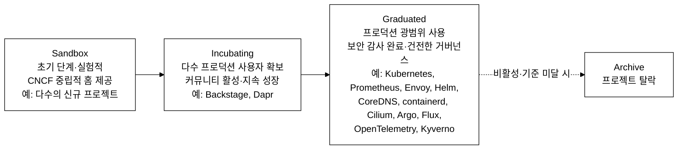
_그림 6-1. CNCF 프로젝트 성숙도 단계 — Sandbox → Incubating → Graduated, 탈락 시 Archive (상태 기준일 2026-06-15)._

**Step 1: tart-infra에 설치된 CNCF 프로젝트 확인**

```bash
# 각 클러스터의 네임스페이스를 확인하여 CNCF 프로젝트 식별
echo "=== platform 클러스터 ==="
kubectl --context=platform get namespaces

echo "=== dev 클러스터 ==="
kubectl --context=dev get namespaces
```

**검증 — 기대 출력:**


**Step 2: CNCF 프로젝트 매핑 표 작성**

```bash
# 설치된 주요 컴포넌트와 CNCF 성숙도 매핑
echo "=== CNCF 프로젝트 매핑 ==="
echo "Kubernetes     | Graduated | 컨테이너 오케스트레이션"
echo "Prometheus     | Graduated | 메트릭 모니터링"
echo "CoreDNS        | Graduated | 클러스터 DNS"
echo "containerd     | Graduated | 컨테이너 런타임"
echo "Cilium         | Graduated | CNI + 네트워크 정책"
echo "Helm           | Graduated | 패키지 관리"
echo "Argo (ArgoCD)  | Graduated | GitOps CD"
echo "Grafana        | (CNCF 외) | 시각화 대시보드"
echo "Jenkins        | (CNCF 외) | CI 도구"

# Prometheus가 실행 중인지 확인
kubectl --context=platform get pods -n monitoring -l app.kubernetes.io/name=prometheus 2>/dev/null | head -5
```

**검증 — 기대 출력:**

> **참조 — Prometheus/Grafana 모니터링(platform 상주, daily day07 참조):** === CNCF 프로젝트 매핑 === ...

**확인 문제:**
1. CNCF의 세 가지 성숙도 단계는 무엇인가?
2. Graduated 프로젝트가 되기 위한 필수 조건은 무엇인가?
3. tart-infra에서 사용 중인 CNCF Graduated 프로젝트 5개를 나열하라.
4. Grafana와 Jenkins가 CNCF 프로젝트가 아닌 이유는 무엇인가?

**관련 KCNA 시험 주제:** Cloud Native Architecture — CNCF Projects, Maturity Levels

---

### Lab 6.2: 마이크로서비스 토폴로지 분석

**학습 목표:**
- 마이크로서비스 아키텍처의 핵심 패턴을 tart-infra 환경에서 식별한다.
- API Gateway, Database per Service, Event-Driven 패턴을 이해한다.
- 모놀리식과 마이크로서비스의 트레이드오프를 파악한다.

**등장 배경 — 모놀리식의 한계:**

모놀리식 아키텍처에서는 전체 애플리케이션이 하나의 프로세스로 실행된다. 작은 변경에도 전체를 재빌드/재배포해야 하며, 한 컴포넌트의 장애가 전체 서비스에 영향을 준다. 마이크로서비스는 각 서비스를 독립적으로 개발, 배포, 확장할 수 있도록 분리하는 아키텍처 스타일이다.

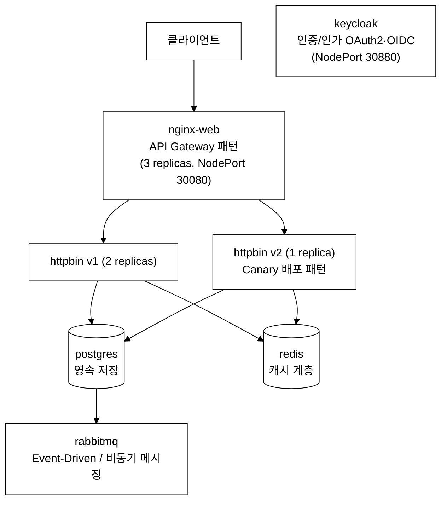
_그림 10. tart-infra demo 앱 마이크로서비스 토폴로지: API Gateway(nginx) 뒤에 Canary 배포된 httpbin v1/v2, 서비스별 DB(postgres·redis, Database per Service + Polyglot Persistence), 비동기 메시징(rabbitmq), 별도 인증(keycloak)._

**Step 1: 서비스 간 관계 확인**

```bash
# 모든 서비스와 엔드포인트 확인
kubectl --context=dev get svc,endpoints -n demo
```

**검증 — 기대 출력:**

> **예시(참조) — NAME                 TYPE        CLUSTER-IP   :** KCNA 개념/실습 기대 출력. 실측은 KCNA daily(day01~07) 및 본 캡처 참고.

**Step 2: 각 서비스의 역할과 패턴 식별**

```bash
# 각 Deployment의 레플리카 수와 리소스 설정 확인
kubectl --context=dev get deployments -n demo -o custom-columns=\
NAME:.metadata.name,\
REPLICAS:.spec.replicas,\
IMAGE:.spec.template.spec.containers[0].image,\
CPU_REQ:.spec.template.spec.containers[0].resources.requests.cpu,\
MEM_REQ:.spec.template.spec.containers[0].resources.requests.memory
```

**검증 — 기대 출력:**

> **예시(참조) — NAME        REPLICAS   IMAGE                  :** KCNA 개념/실습 기대 출력. 실측은 KCNA daily(day01~07) 및 본 캡처 참고.

마이크로서비스별로 적절한 리소스가 할당되어 있다. nginx-web은 트래픽을 처리하므로 3 replicas, postgres/rabbitmq은 상태를 유지하므로 1 replica이다.

**확인 문제:**
1. API Gateway 패턴의 장점 두 가지는 무엇인가?
2. Database per Service 패턴에서 데이터 일관성은 어떻게 보장하는가?
3. Event-Driven Architecture에서 RabbitMQ의 역할은 무엇인가?
4. 모놀리식 대비 마이크로서비스의 단점 두 가지는 무엇인가?

**관련 KCNA 시험 주제:** Cloud Native Architecture — Microservices, Design Patterns

---

### Lab 6.3: HPA 오토스케일링 실습

**학습 목표:**
- HPA의 내부 동작 원리(metrics-server, 계산 공식)를 이해한다.
- 스케일아웃/스케일인 과정을 직접 관찰한다.
- 안정화 기간(stabilization window)의 목적을 파악한다.

**등장 배경 — 수동 스케일링의 한계:**

수동 스케일링에서는 운영자가 트래픽 패턴을 예측하여 미리 Pod 수를 조정해야 한다. 예측이 틀리면 과소 프로비저닝(서비스 지연)이나 과대 프로비저닝(리소스 낭비)이 발생한다. HPA는 실시간 메트릭을 기반으로 자동 스케일링을 수행한다.

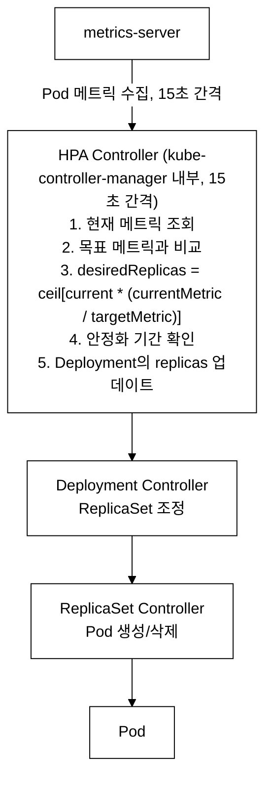
_그림 11. HPA 동작: metrics-server 가 수집한 메트릭을 HPA Controller 가 15초 간격으로 평가해 목표 레플리카를 계산하고, Deployment → ReplicaSet 컨트롤러를 거쳐 Pod 수가 조정된다._

**Step 1: HPA 상태 확인**

```bash
# HPA 목록 확인
kubectl --context=dev get hpa -n demo
```

**검증 — 기대 출력:**

> **예시(참조) — NAME        REFERENCE              TARGETS   M:** KCNA 개념/실습 기대 출력. 실측은 KCNA daily(day01~07) 및 본 캡처 참고.

`TARGETS` 열의 `12%/50%`는 현재 CPU 사용률 12%, 목표 50%를 의미한다.

**Step 2: HPA 상세 정보 확인**

```bash
# HPA 상세 확인
kubectl --context=dev describe hpa nginx-web -n demo
```

**검증 — 기대 출력:**

(미캡처)

**Step 3: 부하 생성으로 스케일아웃 유도**

```bash
# 부하 생성 (별도 터미널에서 실행)
kubectl --context=dev run load-generator --rm -it --image=busybox:1.36 -n demo \
  -- sh -c "while true; do wget -qO- http://nginx-web.demo.svc.cluster.local > /dev/null; done" &

# 30초 후 HPA 상태 확인
sleep 30
kubectl --context=dev get hpa nginx-web -n demo

# 부하 중단
kubectl --context=dev delete pod load-generator -n demo --ignore-not-found 2>/dev/null
```

**검증 — 기대 출력 (부하 적용 후):**

> **예시(참조) — NAME        REFERENCE              TARGETS    :** KCNA 개념/실습 기대 출력. 실측은 KCNA daily(day01~07) 및 본 캡처 참고.

CPU 사용률이 68%로 목표(50%)를 초과하여, HPA가 `ceil[3 * (68/50)] = ceil[4.08] = 5`개로 스케일아웃하였다.

**Step 4: 스케일인 관찰**

```bash
# 부하 중단 후 5분 이상 대기 (안정화 기간)
# 기본 scaleDown 안정화 기간은 300초(5분)
sleep 300
kubectl --context=dev get hpa nginx-web -n demo
```

**검증 — 기대 출력:**

> **예시(참조) — NAME        REFERENCE              TARGETS   M:** KCNA 개념/실습 기대 출력. 실측은 KCNA daily(day01~07) 및 본 캡처 참고.

안정화 기간 후 원래 minReplicas(3)로 스케일인되었다. 스케일인에 5분의 안정화 기간을 두는 이유는 트래픽이 일시적으로 감소했다가 다시 증가하는 경우(flapping)를 방지하기 위함이다.

**확인 문제:**
1. HPA가 메트릭을 조회하는 기본 주기는 얼마인가?
2. metrics-server가 없으면 HPA는 어떻게 되는가?
3. 스케일인 안정화 기간의 기본값과 목적은 무엇인가?
4. HPA와 VPA(Vertical Pod Autoscaler)의 차이점은 무엇인가?

**관련 KCNA 시험 주제:** Cloud Native Architecture — Autoscaling, HPA

---

### Lab 6.4: PDB 실습

**학습 목표:**
- PDB의 ALLOWED DISRUPTIONS 계산 방법을 이해한다.
- `kubectl drain` 시 PDB가 적용되는 과정을 관찰한다.
- minAvailable과 maxUnavailable의 차이를 실습한다.

**Step 1: PDB 상태 확인**

```bash
# PDB 목록 확인
kubectl --context=dev get pdb -n demo
```

**검증 — 기대 출력:**

> **예시(참조) — NAME        MIN AVAILABLE   MAX UNAVAILABLE   :** KCNA 개념/실습 기대 출력. 실측은 KCNA daily(day01~07) 및 본 캡처 참고.

`ALLOWED DISRUPTIONS` 계산:
- nginx-web: replicas=3, minAvailable=2 → 3-2=1 (1개까지 동시 중단 가능)
- redis: replicas=1, minAvailable=1 → 1-1=0 (0개, 즉 drain 차단)

**Step 2: PDB 상세 정보 확인**

```bash
# nginx-web PDB 상세 확인
kubectl --context=dev describe pdb nginx-web -n demo
```

**검증 — 기대 출력:**

> **예시(참조) — Name:           nginx-web:** KCNA 개념/실습 기대 출력. 실측은 KCNA daily(day01~07) 및 본 캡처 참고.

`Current=3`(현재 healthy Pod), `Desired healthy=2`(최소 유지 필요), `Allowed disruptions=3-2=1`.

**확인 문제:**
1. `minAvailable`과 `maxUnavailable` 중 어느 것이 더 유연한가?
2. ALLOWED DISRUPTIONS=0인 PDB가 있는 노드를 drain하면 어떻게 되는가?
3. PDB는 `kubectl delete pod`에 적용되는가?
4. 롤링 업데이트 중에 PDB는 어떻게 동작하는가?

**관련 KCNA 시험 주제:** Cloud Native Architecture — PDB, High Availability

---

## 실습 7: Cloud Native Observability

> Grafana, Prometheus, Loki, AlertManager, Hubble을 활용하여 관측성을 실습한다.

실습 6에서 CNCF 생태계와 클라우드 네이티브 아키텍처(마이크로서비스, HPA, PDB)를 학습하였다. 이제 실습 7에서는 "실행 중인 시스템을 어떻게 관찰하고 이상 징후를 감지하는가"를 다룬다. **이 실습은 platform 클러스터에서 진행한다.** Prometheus와 Grafana는 platform 클러스터에 상주하므로 모든 명령에 `--context=platform`을 사용한다. dev 클러스터 메트릭은 Prometheus가 원격 스크레이프(remote scrape)를 통해 수집한다.

### Lab 7.1: Grafana 대시보드 탐색

**학습 목표:**
- Grafana의 Data Source, Dashboard, Panel 구조를 이해한다.
- Prometheus와 Grafana의 연동 방식을 파악한다.
- 변수(Variables)를 사용한 동적 대시보드의 개념을 학습한다.

**등장 배경 — 메트릭 시각화의 필요성:**

Prometheus는 메트릭을 수집하고 저장하지만, 자체 UI(Expression Browser)는 단순하여 운영 모니터링에 적합하지 않다. Grafana는 다양한 데이터 소스(Prometheus, Loki, InfluxDB 등)를 연결하여 풍부한 시각화를 제공한다. Grafana는 CNCF 프로젝트가 아니지만, 클라우드 네이티브 관측성 스택의 사실상 표준 시각화 도구이다.

**Step 1: Grafana 접속 확인**

```bash
# Grafana Pod 상태 확인
kubectl --context=platform get pods -n monitoring -l app.kubernetes.io/name=grafana

# Grafana 서비스 포트 확인
kubectl --context=platform get svc -n monitoring -l app.kubernetes.io/name=grafana
```

**검증 — 기대 출력:**

> **예시(참조) — NAME                                     READY:** KCNA 개념/실습 기대 출력. 실측은 KCNA daily(day01~07) 및 본 캡처 참고.

브라우저에서 `http://<platform-ip>:30300`으로 접속하고 `admin/admin`으로 로그인한다.

**Step 2: Data Source 확인**

```bash
# Grafana API로 Data Source 목록 조회
PLATFORM_IP=$(kubectl --context=platform get nodes -o jsonpath='{.items[0].status.addresses[0].address}')
curl -s -u admin:admin http://$PLATFORM_IP:30300/api/datasources 2>/dev/null | python3 -m json.tool | head -20
```

**검증 — 기대 출력:**

> **참조 — Prometheus/Grafana 모니터링(platform 상주, daily day07 참조):** [ ...

**Step 3: Dashboard 목록 확인**

```bash
# Grafana API로 Dashboard 검색
curl -s -u admin:admin "http://$PLATFORM_IP:30300/api/search?type=dash-db" 2>/dev/null | \
  python3 -c "import sys,json; [print(d['title']) for d in json.load(sys.stdin)[:10]]"
```

**검증 — 기대 출력:**

> **참조 — etcd 분산 KV 저장소 개념:** Kubernetes / Compute Resources / Cluster ...

**확인 문제:**
1. Grafana의 Data Source, Dashboard, Panel의 관계는 무엇인가?
2. Grafana에서 Prometheus를 Data Source로 연결하는 방식(proxy vs direct)의 차이점은?
3. Dashboard 변수(Variables)의 용도는 무엇인가?
4. Grafana의 Alert과 Prometheus의 AlertManager의 관계는 무엇인가?

**관련 KCNA 시험 주제:** Cloud Native Observability — Grafana, Visualization

---

### Lab 7.2: PromQL 쿼리 실습

**학습 목표:**
- PromQL의 기본 함수(rate, sum, avg, topk)를 실습한다.
- histogram_quantile을 이용한 지연시간 분석을 이해한다.
- Instant Vector와 Range Vector의 차이를 파악한다.

**등장 배경 — 메트릭 질의 언어의 필요성:**

Prometheus는 시계열 데이터를 TSDB에 저장한다. 저장된 메트릭을 유의미한 정보로 변환하려면 질의 언어가 필요하다. PromQL은 Prometheus에 특화된 함수형 질의 언어로, 시계열 데이터의 필터링, 집계, 수학 연산을 지원한다.

```
PromQL 데이터 타입
====================================

Instant Vector: 특정 시점의 값 (가장 최근 샘플)
  예: container_cpu_usage_seconds_total{pod="nginx-web-abc12"}
  결과: {pod="nginx-web-abc12"} => 150.23 @1711785600

Range Vector: 시간 범위의 값 (여러 샘플)
  예: container_cpu_usage_seconds_total{pod="nginx-web-abc12"}[5m]
  결과: {pod="nginx-web-abc12"} => 145.0 @t1, 147.0 @t2, 150.23 @t3

Scalar: 단일 숫자 값
  예: 3.14

rate()는 Range Vector를 받아 Instant Vector를 반환한다:
  rate(counter[5m]) = (마지막값 - 처음값) / 시간간격
  → 초당 증가율(per-second rate)
```

**Step 1: Prometheus 접속 및 기본 쿼리**

```bash
# Prometheus Pod 확인
kubectl --context=platform get pods -n monitoring -l app.kubernetes.io/name=prometheus

# Prometheus API로 쿼리 실행 — 컨테이너 CPU 사용률
PLATFORM_IP=$(kubectl --context=platform get nodes -o jsonpath='{.items[0].status.addresses[0].address}')
PROM_PORT=$(kubectl --context=platform get svc -n monitoring -l app.kubernetes.io/name=prometheus -o jsonpath='{.items[0].spec.ports[0].nodePort}' 2>/dev/null || echo "9090")

# rate() 함수로 CPU 사용률 계산
curl -s "http://$PLATFORM_IP:$PROM_PORT/api/v1/query?query=rate(container_cpu_usage_seconds_total{namespace=\"demo\",container!=\"\"}[5m])" 2>/dev/null | \
  python3 -c "import sys,json; data=json.load(sys.stdin); [print(f'{r[\"metric\"].get(\"pod\",\"?\")}: {float(r[\"value\"][1]):.4f}') for r in data.get('data',{}).get('result',[])[:5]]" 2>/dev/null || \
  echo "Prometheus 접근 불가 — NodePort 설정을 확인하라"
```

**검증 — 기대 출력:**

> **예시(참조) — nginx-web-7d8f5c4b6-abc12: 0.0023:** KCNA 개념/실습 기대 출력. 실측은 KCNA daily(day01~07) 및 본 캡처 참고.

**Step 2: 유용한 PromQL 쿼리 패턴**

```bash
# 네임스페이스별 CPU 사용률 합계
echo "sum(rate(container_cpu_usage_seconds_total{namespace='demo'}[5m])) by (pod)"

# 메모리 사용량 상위 5개 Pod
echo "topk(5, container_memory_working_set_bytes{namespace='demo', container!=''})"

# 노드의 전체 CPU 사용률
echo "100 - (avg(rate(node_cpu_seconds_total{mode='idle'}[5m])) * 100)"

# HTTP 요청 지연시간 95번째 백분위수 (histogram)
echo "histogram_quantile(0.95, rate(http_request_duration_seconds_bucket[5m]))"
```

**확인 문제:**
1. `rate()`와 `irate()`의 차이점은 무엇인가?
2. Counter 메트릭에 `rate()`를 적용하지 않으면 어떤 문제가 발생하는가?
3. `sum() by (label)`의 동작을 설명하라.
4. `histogram_quantile()`은 어떤 메트릭 타입에서 사용하는가?

**관련 KCNA 시험 주제:** Cloud Native Observability — Prometheus, PromQL

---

### Lab 7.3: Loki LogQL 실습

**학습 목표:**
- Loki의 아키텍처와 레이블 기반 로그 인덱싱을 이해한다.
- LogQL의 레이블 셀렉터와 파이프라인 필터를 실습한다.
- Grafana에서 로그를 조회하는 방법을 학습한다.

**등장 배경 — 로그 관리의 어려움:**

전통적인 로그 관리는 각 서버에 SSH로 접속하여 로그 파일을 확인하는 방식이었다. 컨테이너 환경에서는 Pod가 동적으로 생성/삭제되므로, 중앙 집중식 로그 시스템이 필수이다. ELK(Elasticsearch-Logstash-Kibana) 스택은 강력하지만 Elasticsearch의 전문 검색 인덱스로 인해 리소스 소모가 크다. Loki는 로그 본문을 인덱싱하지 않고 레이블만 인덱싱하여, 훨씬 적은 리소스로 로그를 관리한다.

```
Loki vs Elasticsearch 비교
====================================

Elasticsearch:
  - 로그 본문 전체를 인덱싱 (inverted index)
  - 강력한 전문 검색 가능
  - 높은 메모리/디스크 요구량
  - 인덱스 관리 복잡

Loki:
  - 레이블만 인덱싱, 본문은 압축 저장
  - 레이블 기반 필터 후 grep 방식 검색
  - 매우 낮은 리소스 요구량
  - Prometheus와 동일한 레이블 체계 → 메트릭-로그 상관 분석 용이
```

**Step 1: Loki 상태 확인**

```bash
# Loki Pod 확인
kubectl --context=platform get pods -n monitoring -l app.kubernetes.io/name=loki 2>/dev/null || \
  kubectl --context=platform get pods -n monitoring | grep loki
```

**검증 — 기대 출력:**

> **예시(참조) — NAME                    READY   STATUS    REST:** KCNA 개념/실습 기대 출력. 실측은 KCNA daily(day01~07) 및 본 캡처 참고.

**Step 2: LogQL 쿼리 실습**

```bash
# Loki에 LogQL 쿼리 (Grafana API를 통해)
PLATFORM_IP=$(kubectl --context=platform get nodes -o jsonpath='{.items[0].status.addresses[0].address}')

# demo 네임스페이스의 nginx-web 로그 조회
curl -s -u admin:admin \
  "http://$PLATFORM_IP:30300/api/datasources/proxy/2/loki/api/v1/query_range?query={namespace=\"demo\",container=\"nginx-web\"}&limit=5" 2>/dev/null | \
  python3 -c "import sys,json; data=json.load(sys.stdin); print(json.dumps(data.get('data',{}).get('result',[])[:2], indent=2))" 2>/dev/null || \
  echo "LogQL 쿼리를 Grafana Explore에서 직접 실행하라"
```

**Step 3: LogQL 쿼리 패턴**

```bash
# 기본 레이블 셀렉터
echo '{namespace="demo", container="nginx-web"}'

# 파이프라인 필터 — 에러 로그만
echo '{namespace="demo"} |= "error"'

# 정규식 필터
echo '{namespace="demo"} |~ "5[0-9]{2}"'

# JSON 파싱 후 필터
echo '{namespace="demo"} | json | status >= 400'

# 로그 집계 — 초당 에러 로그 수
echo 'rate({namespace="demo"} |= "error" [5m])'
```

**확인 문제:**
1. Loki가 Elasticsearch보다 리소스를 적게 사용하는 이유는 무엇인가?
2. LogQL에서 `|=`와 `|~`의 차이점은 무엇인가?
3. Promtail(또는 Grafana Alloy)의 역할은 무엇인가?
4. Loki에서 레이블 카디널리티가 높으면 어떤 문제가 발생하는가?

**관련 KCNA 시험 주제:** Cloud Native Observability — Logging, Loki

---

### Lab 7.4: AlertManager 확인

**학습 목표:**
- AlertManager의 Grouping, Inhibition, Silencing 메커니즘을 이해한다.
- 알림 라우팅(Routing Tree)의 동작 원리를 파악한다.
- Prometheus Alert Rule과 AlertManager의 관계를 학습한다.

**등장 배경 — 알림 관리의 복잡성:**

모니터링 시스템에서 알림(alert)은 필수이지만, 관리하지 않으면 "알림 피로(alert fatigue)"가 발생한다. 예를 들어, 노드 장애 시 해당 노드의 모든 Pod에 대해 개별 알림이 발생하면 수십~수백 개의 알림이 동시에 전달된다. AlertManager는 이 문제를 Grouping(묶기), Inhibition(억제), Silencing(무음)으로 해결한다.

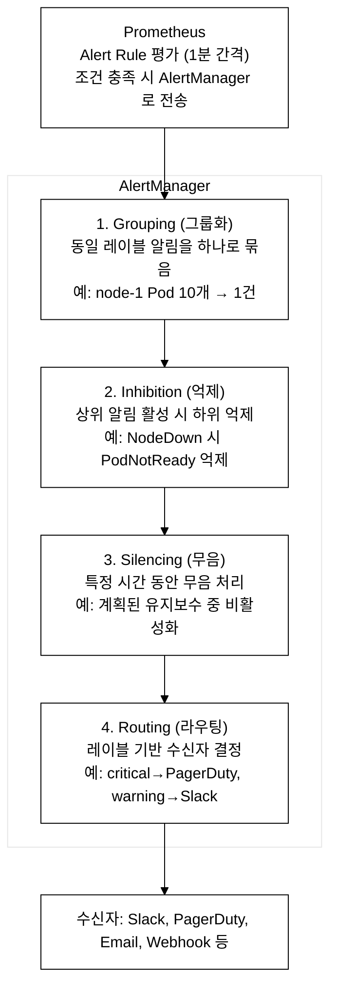
_그림 12. AlertManager 처리 파이프라인: Grouping → Inhibition → Silencing → Routing 단계를 거쳐 알림 피로를 줄인 뒤 수신자에게 전달한다._

**Step 1: AlertManager 상태 확인**

```bash
# AlertManager Pod 확인
kubectl --context=platform get pods -n monitoring -l app.kubernetes.io/name=alertmanager

# AlertManager 서비스 확인
kubectl --context=platform get svc -n monitoring -l app.kubernetes.io/name=alertmanager
```

**검증 — 기대 출력:**

> **예시(참조) — NAME                                         R:** KCNA 개념/실습 기대 출력. 실측은 KCNA daily(day01~07) 및 본 캡처 참고.

**Step 2: 현재 활성 알림 확인**

```bash
# AlertManager API로 활성 알림 조회
PLATFORM_IP=$(kubectl --context=platform get nodes -o jsonpath='{.items[0].status.addresses[0].address}')
curl -s "http://$PLATFORM_IP:30903/api/v2/alerts?active=true" 2>/dev/null | \
  python3 -c "import sys,json; alerts=json.load(sys.stdin); [print(f'{a[\"labels\"][\"alertname\"]}: {a[\"labels\"].get(\"severity\",\"?\")}: {a[\"annotations\"].get(\"summary\",\"?\")}') for a in alerts[:5]]" 2>/dev/null || \
  echo "AlertManager에 직접 접속하여 확인하라: http://<platform-ip>:30903"
```

**검증 — 기대 출력:**

> **예시(참조) — Watchdog: none: This is a Watchdog alert to en:** KCNA 개념/실습 기대 출력. 실측은 KCNA daily(day01~07) 및 본 캡처 참고.

`Watchdog` 알림은 AlertManager가 정상 동작하는지 확인하기 위해 항상 활성화된 알림이다. 이 알림이 사라지면 AlertManager에 문제가 있음을 의미한다.

**Step 3: Prometheus Alert Rule 확인**

```bash
# 정의된 Alert Rule 확인
kubectl --context=platform get prometheusrules -n monitoring -o name | head -5
```

**검증 — 기대 출력:**

> **예시(참조) — prometheusrule.monitoring.coreos.com/kube-prom:** KCNA 개념/실습 기대 출력. 실측은 KCNA daily(day01~07) 및 본 캡처 참고.

**확인 문제:**
1. AlertManager의 Grouping이 해결하는 문제는 무엇인가?
2. Inhibition과 Silencing의 차이점은 무엇인가?
3. Watchdog 알림의 목적은 무엇인가?
4. Prometheus Alert Rule에서 `for` 필드의 역할은 무엇인가?

**관련 KCNA 시험 주제:** Cloud Native Observability — AlertManager, Alerting

---

### Lab 7.5: Hubble 네트워크 관찰

**학습 목표:**
- Hubble의 아키텍처(Agent, Relay, UI)를 이해한다.
- eBPF 기반 네트워크 관찰의 장점을 파악한다.
- CiliumNetworkPolicy와 표준 NetworkPolicy의 차이를 학습한다.

**등장 배경 — 네트워크 관측성의 어려움:**

전통적인 네트워크 모니터링은 패킷 캡처(tcpdump), netflow, 방화벽 로그 등을 사용한다. Kubernetes 환경에서는 Pod가 동적으로 생성/삭제되고, Service에 의해 트래픽이 분산되므로, 기존 도구로는 서비스 간 통신 흐름을 파악하기 어렵다. Hubble은 Cilium의 eBPF 데이터 경로에서 네트워크 흐름 데이터를 수집하여 서비스 맵, DNS 쿼리, HTTP 요청/응답을 관찰한다.

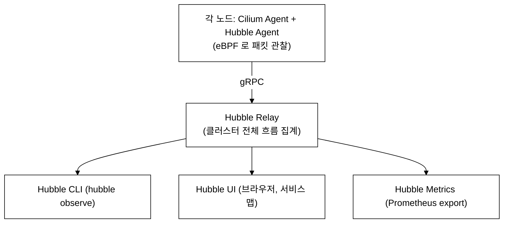
_그림 13. Hubble 아키텍처: 노드별 Hubble Agent 가 eBPF 로 관찰한 흐름을 Relay 가 집계하고 CLI·UI·Metrics 로 노출한다._

**Step 1: Hubble 컴포넌트 확인**

```bash
# Hubble Relay 확인
kubectl --context=dev get pods -n kube-system -l k8s-app=hubble-relay 2>/dev/null || \
  kubectl --context=dev get pods -n kube-system | grep hubble

# Hubble UI 확인
kubectl --context=dev get svc -n kube-system -l k8s-app=hubble-ui 2>/dev/null || \
  kubectl --context=dev get svc -n kube-system | grep hubble
```

**검증 — 기대 출력:**

> **예시(참조) — NAME                            READY   STATUS:** KCNA 개념/실습 기대 출력. 실측은 KCNA daily(day01~07) 및 본 캡처 참고.

**Step 2: Hubble CLI로 네트워크 흐름 관찰**

```bash
# Hubble CLI로 demo 네임스페이스의 최근 흐름 확인
kubectl --context=dev exec -n kube-system deploy/hubble-relay -- \
  hubble observe --namespace demo --last 10 2>/dev/null || \
  echo "Hubble observe 명령이 실패하면, Cilium Agent에서 직접 확인한다"
```

**검증 — 기대 출력:**

> **예시(참조) — TIMESTAMP             SOURCE                  :** KCNA 개념/실습 기대 출력. 실측은 KCNA daily(day01~07) 및 본 캡처 참고.

**Step 3: CiliumNetworkPolicy vs NetworkPolicy 비교**

```bash
# 표준 NetworkPolicy는 L3/L4만 제어
echo "=== 표준 NetworkPolicy: L3/L4 제어 ==="
echo "podSelector, namespaceSelector, ipBlock"
echo "TCP/UDP 포트 제어"

# CiliumNetworkPolicy는 L7까지 제어 가능
echo ""
echo "=== CiliumNetworkPolicy: L3/L4 + L7 제어 ==="
echo "HTTP method, path, header 기반 제어"
echo "DNS FQDN 기반 제어"
echo "Kafka topic 기반 제어"
```

**검증 — 기대 출력:**

> **예시(참조) — === 표준 NetworkPolicy: L3/L4 제어 ===:** KCNA 개념/실습 기대 출력. 실측은 KCNA daily(day01~07) 및 본 캡처 참고.

**확인 문제:**
1. Hubble이 eBPF를 활용하는 장점은 무엇인가?
2. Hubble Relay의 역할은 무엇인가?
3. CiliumNetworkPolicy가 표준 NetworkPolicy보다 강력한 이유는 무엇인가?
4. Hubble UI에서 서비스 맵(Service Map)은 어떤 정보를 보여주는가?

**관련 KCNA 시험 주제:** Cloud Native Observability — Network Observability, eBPF

---

## 실습 8: Cloud Native Application Delivery

> ArgoCD, GitOps, Helm, Jenkins를 활용하여 애플리케이션 전달을 실습한다.

실습 7에서 Prometheus/Grafana로 메트릭을 수집하고 시각화하는 관측성 기반을 구축하였다. 실습 8에서는 "검증된 애플리케이션을 어떻게 안전하고 반복 가능하게 클러스터에 배포하는가"를 다룬다. GitOps(ArgoCD), Helm 패키지 관리, CI/CD(Jenkins)가 여기에 해당한다.

### Lab 8.1: ArgoCD 상태 확인

**학습 목표:**
- ArgoCD의 핵심 개념(Application, Sync Status, Health Status)을 이해한다.
- auto-sync와 selfHeal의 차이를 파악한다.
- Declarative GitOps 방식의 장점을 학습한다.

**등장 배경 — Push-based CD의 한계:**

전통적인 CI/CD 파이프라인은 Push-based 모델이다. Jenkins 같은 CI 서버가 빌드 완료 후 `kubectl apply`로 클러스터에 직접 배포한다. 이 방식의 문제점: (1) CI 서버에 클러스터 접근 권한(kubeconfig)이 필요하여 보안 위험이 있다, (2) 누군가 `kubectl edit`으로 직접 변경하면 Git과 실제 상태가 불일치(drift)된다, (3) 클러스터 상태가 어떤 Git 커밋에 해당하는지 추적이 어렵다.

ArgoCD는 Pull-based 모델로 이 문제를 해결한다. ArgoCD가 Git 저장소를 주기적으로 감시(3분 간격)하고, Git의 원하는 상태와 클러스터의 현재 상태를 비교하여 차이가 있으면 동기화한다.

```
Push-based vs Pull-based CD
====================================

Push-based (전통적):
  Developer → Git Push → CI Server → kubectl apply → Cluster
  문제: CI Server에 클러스터 권한 필요, drift 감지 불가

Pull-based (GitOps / ArgoCD):
  Developer → Git Push → Git Repository
                              ↑ (감시)
  ArgoCD ←── 비교 ──→ Cluster
    │
    └── 차이 발견 시 동기화 (auto-sync)
    └── 수동 변경 감지 시 복구 (selfHeal)
```

**Step 1: ArgoCD Pod 확인**

```bash
# ArgoCD 컴포넌트 확인
kubectl --context=platform get pods -n argocd
```

**검증 — 기대 출력:**

> **예시(참조) — NAME                                          :** KCNA 개념/실습 기대 출력. 실측은 KCNA daily(day01~07) 및 본 캡처 참고.

각 컴포넌트의 역할:
- `application-controller`: Git과 클러스터 상태 비교, 동기화 수행
- `repo-server`: Git 저장소에서 매니페스트 가져오기(Helm/Kustomize 렌더링)
- `server`: API 서버 + Web UI
- `dex-server`: SSO 인증 (OIDC)
- `applicationset-controller`: ApplicationSet(다중 앱 자동 생성)

**Step 2: ArgoCD Application 확인**

```bash
# ArgoCD Application 목록
kubectl --context=platform get applications -n argocd 2>/dev/null || \
  echo "ArgoCD Application이 없으면, ArgoCD가 관리하는 앱이 없는 상태이다"
```

**검증 — 기대 출력:**

> **예시(참조) — NAME        SYNC STATUS   HEALTH STATUS   PROJ:** KCNA 개념/실습 기대 출력. 실측은 KCNA daily(day01~07) 및 본 캡처 참고.

- `Sync Status: Synced` — Git의 원하는 상태와 클러스터가 일치한다
- `Health Status: Healthy` — 모든 리소스가 정상 동작 중이다

**Step 3: ArgoCD UI 접속 정보 확인**

```bash
# ArgoCD 서비스 확인
kubectl --context=platform get svc -n argocd argocd-server

# 초기 admin 비밀번호 확인
kubectl --context=platform get secret argocd-initial-admin-secret -n argocd \
  -o jsonpath='{.data.password}' 2>/dev/null | base64 -d
echo ""
```

**검증 — 기대 출력:**

> **예시(참조) — NAME            TYPE       CLUSTER-IP      POR:** KCNA 개념/실습 기대 출력. 실측은 KCNA daily(day01~07) 및 본 캡처 참고.

**확인 문제:**
1. ArgoCD에서 Sync Status가 "OutOfSync"이면 무엇을 의미하는가?
2. auto-sync와 selfHeal의 차이점은 무엇인가?
3. ArgoCD의 Application Controller가 Git과 클러스터를 비교하는 기본 주기는?
4. GitOps의 핵심 원칙 4가지는 무엇인가?

**관련 KCNA 시험 주제:** Cloud Native Application Delivery — GitOps, ArgoCD

---

### Lab 8.2: GitOps 흐름 이해

**학습 목표:**
- Single Source of Truth 원칙을 이해한다.
- Pull-based CD의 보안 이점을 파악한다.
- Git revert를 통한 롤백 방식을 학습한다.

**GitOps 4원칙 (OpenGitOps):**

```
GitOps 4원칙
====================================

1. Declarative (선언적)
   시스템의 원하는 상태를 선언적으로 정의한다.
   → Kubernetes YAML, Helm Chart, Kustomize

2. Versioned and Immutable (버전 관리 + 불변)
   원하는 상태가 버전 관리 시스템에 저장된다.
   → Git repository (변경 이력, 감사 추적)

3. Pulled Automatically (자동 풀)
   에이전트가 원하는 상태를 자동으로 가져와 적용한다.
   → ArgoCD, Flux가 Git을 감시

4. Continuously Reconciled (지속적 조정)
   에이전트가 실제 상태와 원하는 상태의 차이를 지속적으로 수정한다.
   → drift 감지, self-healing
```

**Step 1: Git revert를 통한 롤백 시뮬레이션**

```bash
# GitOps에서의 롤백은 Git revert로 수행한다
# (실제 Git 저장소 대신 ArgoCD CLI로 시뮬레이션)

# ArgoCD Application의 히스토리 확인
kubectl --context=platform get applications -n argocd -o yaml 2>/dev/null | \
  grep -A5 "history:" | head -15 || \
  echo "Application 히스토리를 확인하려면: argocd app history <app-name>"
```

**검증 — 기대 출력:**

> **예시(참조) — history::** KCNA 개념/실습 기대 출력. 실측은 KCNA daily(day01~07) 및 본 캡처 참고.

**Step 2: GitOps 흐름 정리**

```bash
echo "=== GitOps 배포 흐름 ==="
echo "1. 개발자가 코드 변경 → Git push"
echo "2. CI(Jenkins)가 테스트, 빌드, 이미지 push"
echo "3. CI가 GitOps 저장소의 이미지 태그를 업데이트"
echo "4. ArgoCD가 GitOps 저장소 변경 감지"
echo "5. ArgoCD가 클러스터에 새 매니페스트 적용"
echo ""
echo "=== GitOps 롤백 흐름 ==="
echo "1. git revert <문제-커밋>"
echo "2. ArgoCD가 revert된 상태를 감지"
echo "3. ArgoCD가 이전 상태로 자동 동기화"
echo "→ 전통적 롤백(kubectl rollout undo)보다 감사 추적이 확실하다"
```

**확인 문제:**
1. GitOps에서 "Single Source of Truth"는 무엇인가?
2. Pull-based CD가 Push-based CD보다 보안에 유리한 이유는?
3. GitOps 환경에서 롤백은 어떻게 수행하는가?
4. ArgoCD와 Flux의 공통점과 차이점은 무엇인가?

**관련 KCNA 시험 주제:** Cloud Native Application Delivery — GitOps, Pull-based CD

---

### Lab 8.3: Helm Release 관리

**학습 목표:**
- Helm의 핵심 개념(Chart, Release, Repository)을 이해한다.
- Helm values를 이용한 환경별 설정 분리를 실습한다.
- Helm history와 rollback을 학습한다.

**등장 배경 — YAML 관리의 어려움:**

Kubernetes 리소스는 YAML로 정의한다. 마이크로서비스가 늘어나면 수백~수천 개의 YAML 파일이 생기고, 환경(dev/staging/prod)별로 약간씩 다른 설정이 필요하다. Helm은 이 문제를 "Chart"라는 패키지 단위로 YAML 템플릿을 관리하고, "values"로 환경별 설정을 주입하여 해결한다.

```
Helm 핵심 개념
====================================

Chart: 패키지 (템플릿 + 기본값)
  mychart/
  ├── Chart.yaml       # 메타데이터 (이름, 버전)
  ├── values.yaml      # 기본 설정값
  └── templates/       # Go 템플릿 YAML 파일
      ├── deployment.yaml
      ├── service.yaml
      └── _helpers.tpl

Release: Chart를 특정 값으로 설치한 인스턴스
  helm install my-release mychart -f prod-values.yaml

Repository: Chart를 저장하는 HTTP 서버
  helm repo add bitnami https://charts.bitnami.com/bitnami
```

**Step 1: Helm Release 목록 확인**

```bash
# 모든 네임스페이스의 Helm Release 확인
helm --kube-context=platform list -A 2>/dev/null || \
  echo "Helm이 설치되어 있지 않으면 kubectl로 확인한다"

# kubectl로 Helm Release 확인 (Secret에 저장됨)
kubectl --context=platform get secrets -A -l owner=helm | head -10
```

**검증 — 기대 출력:**

> **예시(참조) — NAME                    NAMESPACE    REVISION :** KCNA 개념/실습 기대 출력. 실측은 KCNA daily(day01~07) 및 본 캡처 참고.

**Step 2: Release 상세 정보 확인**

```bash
# 특정 Release의 values 확인
helm --kube-context=platform get values kube-prometheus -n monitoring 2>/dev/null | head -20 || \
  echo "helm get values 명령을 사용하라"
```

**검증 — 기대 출력:**

> **예시(참조) — USER-SUPPLIED VALUES::** KCNA 개념/실습 기대 출력. 실측은 KCNA daily(day01~07) 및 본 캡처 참고.

**Step 3: Helm Release 히스토리 확인**

```bash
# Release 히스토리
helm --kube-context=platform history kube-prometheus -n monitoring 2>/dev/null || \
  echo "helm history 명령을 사용하라"
```

**검증 — 기대 출력:**

> **예시(참조) — REVISION    UPDATED                     STATUS:** KCNA 개념/실습 기대 출력. 실측은 KCNA daily(day01~07) 및 본 캡처 참고.

Helm은 각 Release의 전체 매니페스트를 Secret(또는 ConfigMap)에 저장한다. `helm rollback <release> <revision>`으로 이전 버전으로 롤백할 수 있다.

**확인 문제:**
1. Helm Chart, Release, Repository의 관계를 설명하라.
2. `helm upgrade`와 `helm install`의 차이점은 무엇인가?
3. Helm Release 정보는 Kubernetes 어디에 저장되는가?
4. `helm template`과 `helm install`의 차이점은 무엇인가?

**관련 KCNA 시험 주제:** Cloud Native Application Delivery — Helm, Package Management

---

### Lab 8.4: Jenkins 파이프라인 확인

**학습 목표:**
- CI/CD 파이프라인의 단계(Build, Test, Scan, Push, Deploy)를 이해한다.
- Jenkins와 ArgoCD의 역할 분담(CI vs CD)을 파악한다.
- Jenkinsfile(Pipeline as Code)의 개념을 학습한다.

**등장 배경 — CI/CD 분리의 필요성:**

초기에는 Jenkins가 CI(빌드/테스트)와 CD(배포)를 모두 담당하였다. 이 방식은 Jenkins에 클러스터 접근 권한이 필요하고, 배포 상태를 Git에서 추적할 수 없다는 문제가 있다. GitOps 패러다임에서는 CI(Jenkins)와 CD(ArgoCD)를 분리하여, Jenkins는 이미지 빌드까지만 수행하고, ArgoCD가 배포를 담당한다.

```
CI/CD 파이프라인 (Jenkins + ArgoCD)
====================================

[Jenkins - CI 단계]
  1. Checkout: Git에서 소스 코드 가져오기
  2. Build: 컨테이너 이미지 빌드
  3. Test: 단위 테스트, 통합 테스트
  4. Scan: 이미지 보안 스캔 (Trivy 등)
  5. Push: 컨테이너 레지스트리에 이미지 push

[Jenkins → GitOps 저장소 연결]
  6. GitOps 저장소의 이미지 태그 업데이트
     (예: values.yaml의 image.tag를 새 버전으로 변경)

[ArgoCD - CD 단계]
  7. ArgoCD가 GitOps 저장소 변경 감지
  8. ArgoCD가 클러스터에 새 매니페스트 적용
```

**Step 1: Jenkins 상태 확인**

```bash
# Jenkins Pod 확인
kubectl --context=platform get pods -n jenkins

# Jenkins 서비스 확인
kubectl --context=platform get svc -n jenkins
```

**검증 — 기대 출력:**

> **예시(참조) — NAME                          READY   STATUS  :** KCNA 개념/실습 기대 출력. 실측은 KCNA daily(day01~07) 및 본 캡처 참고.

포트 8080은 Jenkins Web UI, 포트 50000은 Jenkins Agent(JNLP)가 Controller에 연결하는 포트이다.

**Step 2: Jenkins Pipeline 구조 확인**

```bash
# Jenkins API로 Job 목록 확인
PLATFORM_IP=$(kubectl --context=platform get nodes -o jsonpath='{.items[0].status.addresses[0].address}')
curl -s -u admin:admin "http://$PLATFORM_IP:30900/api/json?tree=jobs[name,color]" 2>/dev/null | \
  python3 -c "import sys,json; data=json.load(sys.stdin); [print(f'{j[\"name\"]}: {j[\"color\"]}') for j in data.get('jobs',[])]" 2>/dev/null || \
  echo "Jenkins에 접속하여 확인하라: http://<platform-ip>:30900 (admin/admin)"
```

**검증 — 기대 출력:**

> **예시(참조) — demo-app-pipeline: blue:** KCNA 개념/실습 기대 출력. 실측은 KCNA daily(day01~07) 및 본 캡처 참고.

`blue`는 마지막 빌드가 성공했음을 의미한다. `red`는 실패, `notbuilt`는 빌드가 실행된 적 없음을 의미한다.

**Step 3: Jenkinsfile 예시 분석**

```bash
# Jenkinsfile(Pipeline as Code) 구조 예시
cat <<'EXAMPLE'
pipeline {
    agent {
        kubernetes {
            yaml """
            apiVersion: v1
            kind: Pod
            spec:
              containers:
                - name: docker
                  image: docker:24-dind
                  securityContext:
                    privileged: true
            """
        }
    }
    stages {
        stage('Checkout')  { steps { checkout scm } }
        stage('Build')     { steps { sh 'docker build -t myapp:${BUILD_NUMBER} .' } }
        stage('Test')      { steps { sh 'docker run myapp:${BUILD_NUMBER} npm test' } }
        stage('Scan')      { steps { sh 'trivy image myapp:${BUILD_NUMBER}' } }
        stage('Push')      { steps { sh 'docker push registry/myapp:${BUILD_NUMBER}' } }
        stage('Update GitOps') {
            steps {
                sh """
                    git clone https://github.com/example/gitops-repo.git
                    cd gitops-repo
                    sed -i 's/tag: .*/tag: ${BUILD_NUMBER}/' values.yaml
                    git commit -am "Update image tag to ${BUILD_NUMBER}"
                    git push
                """
            }
        }
    }
}
EXAMPLE
```

**확인 문제:**
1. Jenkins가 CI만 담당하고 CD는 ArgoCD에 맡기는 이유는 무엇인가?
2. Jenkinsfile(Pipeline as Code)의 장점은 무엇인가?
3. Jenkins Kubernetes Plugin의 역할은 무엇인가?
4. CI 파이프라인에서 이미지 보안 스캔(Trivy 등)의 목적은 무엇인가?

**관련 KCNA 시험 주제:** Cloud Native Application Delivery — CI/CD, Pipeline

---

## 종합 시나리오: 전체 배포 흐름

> Deployment + Service + HPA + PDB + NetworkPolicy를 결합한 프로덕션 배포 시나리오를 실습한다.

**학습 목표:**
- 프로덕션 배포에 필요한 리소스를 종합적으로 구성한다.
- 각 리소스의 역할과 상호작용을 이해한다.
- 전체 배포 검증 절차를 수행한다.

**Step 1: 종합 매니페스트 배포**

```bash
kubectl --context=dev apply -n demo -f - <<EOF
---
apiVersion: apps/v1
kind: Deployment
metadata:
  name: webapp
  namespace: demo
spec:
  replicas: 3
  selector:
    matchLabels:
      app: webapp
  strategy:
    type: RollingUpdate
    rollingUpdate:
      maxSurge: 1
      maxUnavailable: 0
  template:
    metadata:
      labels:
        app: webapp
        version: v1
    spec:
      containers:
        - name: webapp
          image: nginx:alpine
          ports:
            - containerPort: 80
          resources:
            requests:
              cpu: 50m
              memory: 64Mi
            limits:
              cpu: 200m
              memory: 128Mi
          readinessProbe:
            httpGet:
              path: /
              port: 80
            initialDelaySeconds: 5
            periodSeconds: 10
          livenessProbe:
            httpGet:
              path: /
              port: 80
            initialDelaySeconds: 10
            periodSeconds: 15
---
apiVersion: v1
kind: Service
metadata:
  name: webapp
  namespace: demo
spec:
  selector:
    app: webapp
  ports:
    - port: 80
      targetPort: 80
  type: ClusterIP
---
apiVersion: autoscaling/v2
kind: HorizontalPodAutoscaler
metadata:
  name: webapp
  namespace: demo
spec:
  scaleTargetRef:
    apiVersion: apps/v1
    kind: Deployment
    name: webapp
  minReplicas: 3
  maxReplicas: 10
  metrics:
    - type: Resource
      resource:
        name: cpu
        target:
          type: Utilization
          averageUtilization: 50
---
apiVersion: policy/v1
kind: PodDisruptionBudget
metadata:
  name: webapp
  namespace: demo
spec:
  minAvailable: 2
  selector:
    matchLabels:
      app: webapp
---
apiVersion: networking.k8s.io/v1
kind: NetworkPolicy
metadata:
  name: webapp-ingress
  namespace: demo
spec:
  podSelector:
    matchLabels:
      app: webapp
  policyTypes:
    - Ingress
  ingress:
    - from:
        - podSelector:
            matchLabels:
              role: frontend
      ports:
        - protocol: TCP
          port: 80
EOF
```

**Step 2: 전체 리소스 검증**

```bash
echo "=== Deployment ==="
kubectl --context=dev get deployment webapp -n demo

echo ""
echo "=== Pods ==="
kubectl --context=dev get pods -n demo -l app=webapp

echo ""
echo "=== Service ==="
kubectl --context=dev get svc webapp -n demo

echo ""
echo "=== HPA ==="
kubectl --context=dev get hpa webapp -n demo

echo ""
echo "=== PDB ==="
kubectl --context=dev get pdb webapp -n demo

echo ""
echo "=== NetworkPolicy ==="
kubectl --context=dev get networkpolicy webapp-ingress -n demo
```

**검증 — 기대 출력:**

> **예시(참조) — === Deployment ===:** KCNA 개념/실습 기대 출력. 실측은 KCNA daily(day01~07) 및 본 캡처 참고.

**Step 3: 정리**

```bash
kubectl --context=dev delete deployment,svc,hpa,pdb,networkpolicy -n demo -l app=webapp --ignore-not-found
kubectl --context=dev delete networkpolicy webapp-ingress -n demo --ignore-not-found
```

**확인 문제:**
1. 이 종합 시나리오에서 각 리소스의 역할을 요약하라.
2. HPA의 TARGETS가 `<unknown>/50%`인 이유는 무엇인가?
3. PDB의 ALLOWED DISRUPTIONS=1인 이유를 계산하라.
4. NetworkPolicy 없이 배포하면 어떤 보안 위험이 있는가?

**관련 KCNA 시험 주제:** 전체 도메인 종합
