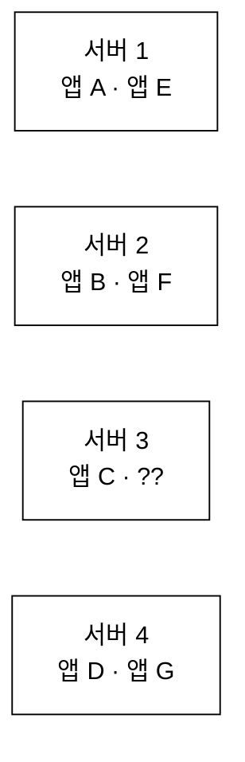
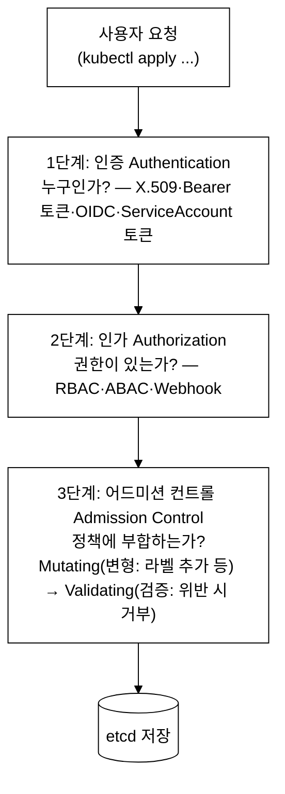
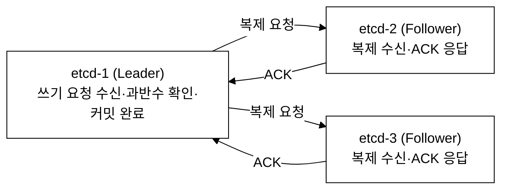
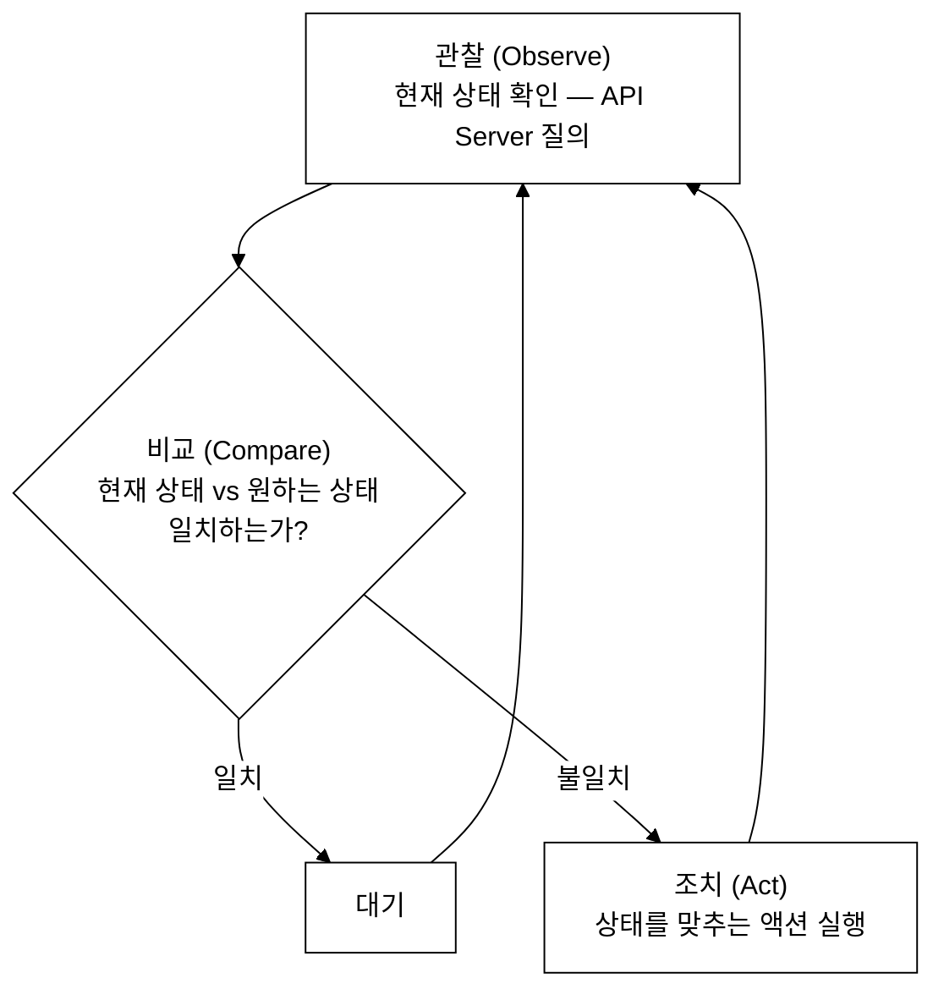
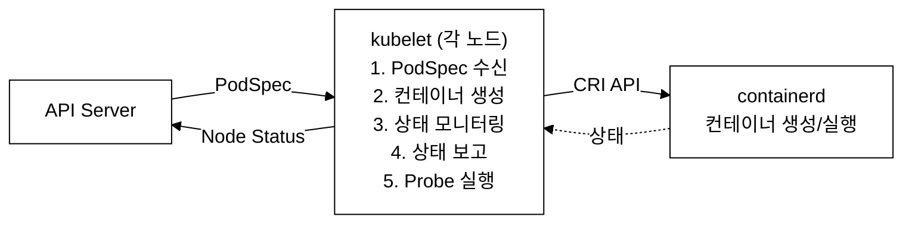
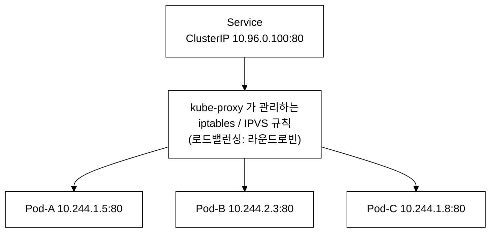
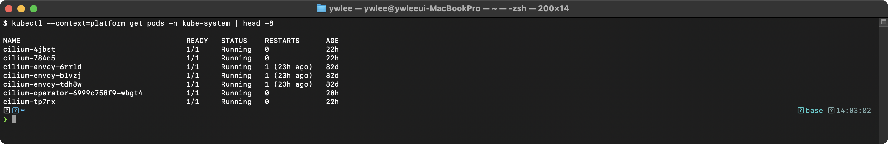
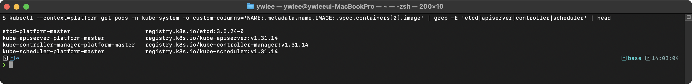
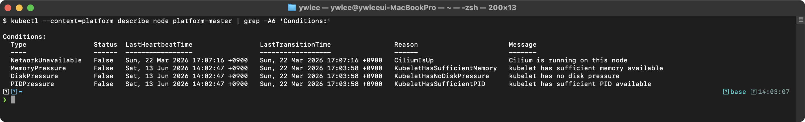
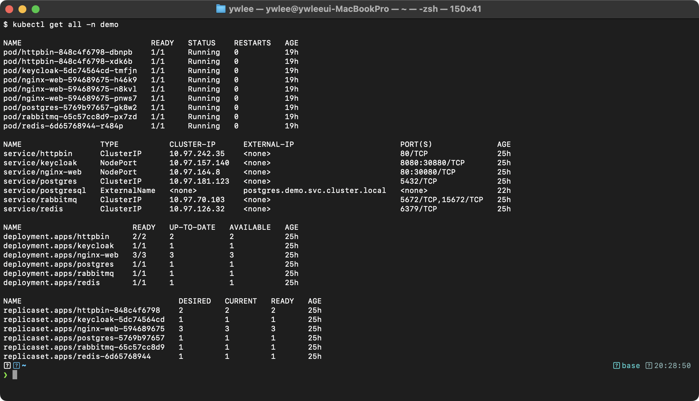

# KCNA Day 1: K8s 아키텍처 - Control Plane & Worker Node 구성요소

> 학습 목표: Control Plane과 Worker Node의 핵심 구성요소를 완벽히 이해한다.
> 예상 소요 시간: 60분 (개념 40분 + YAML 분석 20분)
> 시험 도메인: Kubernetes Fundamentals (46%) - Part 1
> 난이도: ★★★★★ (KCNA 시험의 핵심 중 핵심)

---

## 오늘의 학습 목표

- Control Plane 4대 구성요소(API Server, etcd, Scheduler, Controller Manager)의 역할을 설명할 수 있다
- Worker Node 3대 구성요소(kubelet, kube-proxy, Container Runtime)의 역할을 설명할 수 있다
- 각 컴포넌트의 Static Pod YAML을 읽고 각 필드의 의미를 설명할 수 있다
- Kubernetes가 "선언적(Declarative)" 시스템인 이유를 설명할 수 있다

---

## 1. Kubernetes란 무엇인가?

### 1.1 시스템 구성요소 개요

Kubernetes는 분산 시스템 아키텍처에 기반한 컨테이너 오케스트레이션 플랫폼이다. 클러스터는 크게 **Control Plane**(제어부)과 **Worker Node**(데이터부)로 분리되며, 각 구성요소는 단일 책임 원칙(Single Responsibility Principle)에 따라 설계되었다.

```
Kubernetes 핵심 구성요소 매핑
=============================================

구성요소                      아키텍처 역할
-----------------------------------------
Control Plane             =    클러스터 제어부 (의사결정 계층)
Worker Node               =    워크로드 실행부 (데이터 계층)
Container                 =    Linux namespace/cgroups 기반 프로세스 격리 단위
Pod                       =    공유 네트워크/스토리지를 갖는 컨테이너 그룹 (최소 스케줄링 단위)
API Server                =    RESTful API 게이트웨이 (클러스터 통신 허브)
etcd                      =    Raft 기반 분산 키-값 저장소 (SSOT)
Scheduler                 =    필터링/스코어링 기반 Pod 배치 엔진
Controller Manager         =    Reconciliation Loop 기반 상태 수렴 컨트롤러
kubelet                   =    노드 레벨 에이전트 (CRI 클라이언트)
kube-proxy                =    iptables/IPVS 기반 L4 로드밸런서
Container Runtime          =    OCI 호환 컨테이너 실행 엔진
```

각 구성요소의 역할과 상호 의존 관계를 이해하는 것이 Kubernetes 아키텍처 학습의 핵심이다.

### 1.2 Kubernetes의 정의

**Kubernetes(쿠버네티스)**는 Google이 내부에서 사용하던 **Borg** 시스템을 기반으로 2014년에 오픈소스로 공개한 **컨테이너 오케스트레이션(Container Orchestration) 플랫폼**이다.

> **컨테이너 오케스트레이션(Container Orchestration)**이란?
> 여러 대의 서버에서 실행되는 수많은 컨테이너를 자동으로 배포, 관리, 확장, 복구하는 기술이다. Kubernetes는 스케줄링, 헬스체크, 자동 복구, 수평 확장 등의 기능을 통해 분산 환경의 컨테이너 라이프사이클을 자동으로 관리한다.

### 1.2.1 등장 배경

Kubernetes 이전에는 컨테이너 오케스트레이션에 표준이 없었다. Docker Swarm, Apache Mesos, Cloud Foundry 등 여러 도구가 경쟁했으나, 각각 명확한 한계가 있었다.

**Docker Swarm** (2015년 Docker Inc. 주도 출시): Docker 엔진에 내장된 네이티브 클러스터링 솔루션이다. Docker CLI와 동일한 문법을 그대로 사용할 수 있어 진입 장벽이 낮았으나, Docker 이미지·Docker 런타임에만 종속되어 특정 벤더에 묶이는 락인(vendor lock-in) 문제가 있었다. 수천 노드 규모로 성장하면 스케줄링 성능이 급격히 저하되었고, 오브젝트 모델(Service, Stack)이 단순해 세밀한 스케줄링 정책(Affinity, Taint 등)을 표현하기 어려웠다.

**Apache Mesos** (2009년 UC 버클리에서 시작, 트위터·에어비앤비 등이 도입): 컨테이너 전용이 아니라 CPU·메모리 자원 자체를 추상화하는 범용 클러스터 리소스 관리자다. Mesos 위에서 컨테이너를 오케스트레이션하려면 **Marathon**(메소스 위에서 동작하는 컨테이너 스케줄링 프레임워크)을 별도로 설치·운영해야 했다. 즉, Mesos + Marathon + 각종 프레임워크를 조합해야 했고, 이 복잡한 스택을 운영할 전문가가 필요해 학습 곡선과 운영 부담이 높았다.

**Cloud Foundry** (2011년 VMware·Pivotal 주도): PaaS(Platform as a Service) 계열로, 컨테이너보다 상위 수준의 "앱 배포 플랫폼"에 가까웠다. 특정 빌드팩(buildpack) 방식으로 앱을 패키징해야 했고, 하위 인프라(네트워크, 스토리지)를 직접 제어하기 어려웠다.

```
기존 방식의 한계 요약
============================================================

베어메탈/VM 수동 운영:
  - 서버마다 SSH 접속하여 수동 배포
  - 장애 시 수동 복구, 스케일 아웃 수동 진행
  - 환경 불일치(snowflake server) 문제 빈발

Docker Swarm:
  - Docker 런타임에만 종속(벤더 락인), 표준 인터페이스 없음
  - 대규모 클러스터에서 스케줄링 성능/안정성 부족
  - 세밀한 선언적 오브젝트 모델(Affinity, RBAC 등) 미흡

Apache Mesos + Marathon:
  - 범용 리소스 스케줄러로 컨테이너 전용이 아님
  - Marathon 프레임워크를 별도 설치·운영해야 했음
  - 학습 곡선이 가파르고 운영 복잡도가 높음

Cloud Foundry:
  - PaaS 모델로 하위 인프라 직접 제어 불가
  - 특정 빌드팩 방식에 의존하는 앱 패키징

Kubernetes가 해결한 문제:
  - 선언적(Declarative) 상태 관리로 운영 자동화
  - Reconciliation Loop로 자동 복구(Self-healing)
  - 표준 인터페이스(CRI, CNI, CSI)로 플러그인 생태계 확보
  - CNCF 거버넌스 하에 벤더 중립적 발전
  - Google Borg/Omega 10년 운영 경험이 반영된 설계
```

### 1.3 왜 Kubernetes가 필요한가?

컨테이너 하나를 실행하는 것은 간단하다. 하지만 수백, 수천 개의 컨테이너를 여러 서버에서 운영해야 한다면?



_그림. 수백~수천 개 컨테이너를 여러 서버에 흩어 운영할 때 수작업으로는 풀기 어려운 문제들이 생긴다._

이때 떠오르는 질문들:

- 앱 C 가 죽으면 누가 재시작하나?
- 서버 3 이 다운되면 앱 C 는 어디서 실행하나?
- 트래픽이 급증하면 앱 A 를 몇 개로 늘려야 하나?
- 앱 B 를 새 버전으로 교체할 때 다운타임 없이 어떻게 하나?
- 앱 A 에서 앱 F 로 통신하려면 IP 주소를 어떻게 알아내나?

→ Kubernetes 가 이 모든 것을 자동으로 해결한다.

이 문제들을 명령적 방식(쉘 스크립트·수동 절차)으로 해결하려 하면 즉각적인 한계에 부딪힌다. 예를 들어, 앱 C가 죽으면 재시작하는 쉘 스크립트를 작성했다고 하자. `if ! pgrep app-c; then docker run app-c; fi` 수준의 루프는 서버 3이 동시에 다운되는 순간 **레이스 컨디션**이 발생하여 중복 실행이나 무한 재시작 폭풍을 낳는다. 노드가 10대로 늘어나면 스크립트는 10배 복잡해지고, 각 노드의 환경 차이(패키지 버전, 마운트 경로)가 누적되어 **스노우플레이크 서버** 문제(서버마다 상태가 조금씩 달라 동일 명령이 다른 결과를 낸다)가 생긴다. 이 한계가 "어떻게(How)를 일일이 지시하지 않고 원하는 최종 상태(What)만 선언하는" 접근 방식을 강제한다.

### 1.4 선언적(Declarative) vs 명령적(Imperative) 방식

1.3에서 확인한 문제들(Pod 자동 재시작, 노드 장애 대응, 무중단 배포, 자동 스케일링)을 사람이 일일이 명령으로 처리하려면 클러스터 규모가 커질수록 감당할 수 없다. 이를 자동화하려면 사용자가 **원하는 최종 상태(Desired State)**만 기술하고, 시스템이 **현재 상태(Current State)**를 감시하며 자동으로 맞추는 선언적 방식이 필수다. Kubernetes는 이 선언적 접근 방식을 핵심 설계 원칙으로 채택했기 때문에 수천 개 컨테이너 환경에서도 운영 자동화가 가능하다.

Kubernetes의 가장 중요한 철학은 **선언적(Declarative) 접근 방식**이다.

> **선언적(Declarative)**이란?
> "무엇을(What)" 원하는지만 기술하는 방식이다. "어떻게(How)" 할지는 시스템이 알아서 결정한다.
>
> **명령적(Imperative)**이란?
> "어떻게(How)" 해야 하는지 단계별로 지시하는 방식이다.

```
선언적 vs 명령적 패러다임 비교
==================================================

명령적 방식 (Imperative) - 절차적 제어:
사용자가 실행 순서와 구체적 동작을 하나하나 지시한다.
  kubectl run nginx --image=nginx
  kubectl scale deployment nginx --replicas=3
  kubectl expose deployment nginx --port=80

선언적 방식 (Declarative) - 상태 기반 수렴:
사용자가 최종 상태(Desired State)를 정의하면,
시스템의 Reconciliation Loop가 현재 상태(Current State)를
목표 상태로 자동 수렴시킨다.
  kubectl apply -f deployment.yaml
=> Controller Manager가 Desired State와 Current State의 차이(drift)를 감지하고 자동 보정한다.
```

Kubernetes에서는 YAML 파일로 **"원하는 상태(Desired State)"**를 기술하면, 시스템이 자동으로 **"현재 상태(Current State)"**를 원하는 상태와 일치시킨다.

```yaml
# 선언적 방식 예시: "nginx 3개를 실행해줘"
apiVersion: apps/v1
kind: Deployment
metadata:
  name: nginx-web
spec:
  replicas: 3          # 원하는 상태: nginx가 3개 실행되어야 한다
  selector:
    matchLabels:
      app: nginx
  template:
    metadata:
      labels:
        app: nginx
    spec:
      containers:
      - name: nginx
        image: nginx:1.25
```

---

## 2. Kubernetes 클러스터 전체 아키텍처

### 2.1 클러스터(Cluster)란?

> **클러스터(Cluster)**란?
> Kubernetes를 실행하는 서버(노드)들의 집합이다. 최소 1대의 Control Plane 노드와 1대 이상의 Worker Node로 구성된다.

```
+==============================================================+
|                    Kubernetes 클러스터                          |
|                                                              |
|  +------------------------+     +-------------------------+  |
|  |    Control Plane 노드   |     |     Worker Node #1      |  |
|  |   (마스터 노드)          |     |                         |  |
|  |                        |     |  +-------+ +--------+   |  |
|  |  +---------+           |     |  |Pod    | |Pod     |   |  |
|  |  |API      |           |     |  |+-----+| |+------+|   |  |
|  |  |Server   |<---------+-----+->||nginx || ||redis ||   |  |
|  |  +---------+           |     |  |+-----+| |+------+|   |  |
|  |       |                |     |  +-------+ +--------+   |  |
|  |  +---------+           |     |                         |  |
|  |  |etcd     |           |     |  kubelet  kube-proxy    |  |
|  |  |(DB)     |           |     |  containerd             |  |
|  |  +---------+           |     +-------------------------+  |
|  |       |                |                                  |
|  |  +---------+           |     +-------------------------+  |
|  |  |Scheduler|           |     |     Worker Node #2      |  |
|  |  +---------+           |     |                         |  |
|  |       |                |     |  +-------+ +--------+   |  |
|  |  +---------+           |     |  |Pod    | |Pod     |   |  |
|  |  |Controller|          |     |  |+-----+| |+------+|   |  |
|  |  |Manager  |          |     |  ||app  || ||mysql ||   |  |
|  |  +---------+           |     |  |+-----+| |+------+|   |  |
|  |                        |     |  +-------+ +--------+   |  |
|  |  +----------+          |     |                         |  |
|  |  |Cloud     |          |     |  kubelet  kube-proxy    |  |
|  |  |Controller|          |     |  containerd             |  |
|  |  |Manager   |          |     +-------------------------+  |
|  |  +----------+          |                                  |
|  +------------------------+                                  |
+==============================================================+
```

### 2.2 Control Plane vs Worker Node 비교

K8s는 **제어 계층(누가 결정하는가)**과 **실행 계층(어디서 실행하는가)**을 물리적으로 분리해 독립적 확장을 가능케 한다. 제어 계층은 의사결정만 담당하고 실제 컨테이너를 실행하지 않으므로, 워크로드가 수천 개로 늘어도 Control Plane 노드를 교체할 필요 없이 Worker Node만 추가하면 된다.

| 구분 | Control Plane | Worker Node |
|------|--------------|-------------|
| **역할** | 클러스터 관리/제어 | 실제 워크로드(앱) 실행 |
| **역할 계층** | 제어 계층 (Decision-making) — 클러스터 상태 관리 | 실행 계층 (Execution) — 실제 워크로드 실행 |
| **구성요소** | API Server, etcd, Scheduler, Controller Manager | kubelet, kube-proxy, Container Runtime |
| **Pod 실행** | 시스템 Pod만 (보통) | 사용자 앱 Pod |
| **수량** | 보통 1~3대 (HA 구성) | 필요에 따라 수십~수천 대 |
| **장애 영향** | 클러스터 관리 불가 (기존 Pod는 유지) | 해당 노드의 Pod만 영향 |

---

## 3. Control Plane 구성요소 상세

### 3.1 kube-apiserver - 클러스터의 관문

> **kube-apiserver**란?
> Kubernetes 클러스터의 **중앙 API 게이트웨이**이다. 외부(kubectl, 대시보드)와 내부(kubelet, scheduler) 모든 통신이 이 API Server를 거쳐야 한다. 모든 컴포넌트 간 통신을 중재하는 **허브-앤-스포크(Hub-and-Spoke) 아키텍처**의 중심점이다.

#### 핵심 역할

1. **RESTful API 제공**: 모든 K8s 오브젝트를 CRUD(생성/조회/수정/삭제) 할 수 있는 HTTP API를 제공
2. **인증/인가/어드미션 컨트롤**: 요청이 유효한지 3단계로 검증
3. **etcd와의 유일한 통신**: **etcd에 직접 접근하는 유일한 컴포넌트** (시험 빈출!)
4. **수평 확장(Horizontal Scaling)**: 여러 인스턴스를 실행하여 부하 분산 가능
5. **Watch 메커니즘**: 변경 사항을 실시간으로 다른 컴포넌트에 통지

#### 요청 처리 흐름 (3단계)



_그림. API Server 요청 처리 3단계. 인증(누구인가)→인가(권한이 있는가)→어드미션(정책 부합 여부, Mutating 후 Validating)을 통과해야 etcd 에 저장된다._

#### kube-apiserver Static Pod YAML 상세 분석

> **Static Pod(정적 파드)**란?
> 일반 Pod와 달리 API Server 없이 kubelet이 로컬 디렉터리(`/etc/kubernetes/manifests/`)의 매니페스트 파일을 직접 읽어 생성·관리하는 Pod이다. API Server, etcd, Scheduler, Controller Manager 자체가 Static Pod로 실행되므로, 이들이 아직 동작하지 않는 클러스터 부트스트랩 단계에서도 kubelet이 홀로 Control Plane 구성요소를 띄울 수 있다.

Control Plane 노드의 `/etc/kubernetes/manifests/kube-apiserver.yaml`에 위치한다.

```yaml
# kube-apiserver Static Pod 매니페스트
# 파일 위치: /etc/kubernetes/manifests/kube-apiserver.yaml
# kubelet이 이 파일을 감시하여 자동으로 Pod를 생성한다

apiVersion: v1                    # API 버전. 핵심 리소스는 v1을 사용
kind: Pod                        # 리소스 종류. Static Pod이므로 Pod를 직접 정의
metadata:
  name: kube-apiserver           # Pod 이름
  namespace: kube-system          # 시스템 컴포넌트는 kube-system 네임스페이스에 배치
  labels:
    component: kube-apiserver     # 컴포넌트 식별용 라벨
    tier: control-plane           # Control Plane 계층임을 표시
  annotations:
    kubeadm.kubernetes.io/kube-apiserver.advertise-address.endpoint: 192.168.64.2:6443
spec:
  containers:
  - name: kube-apiserver
    image: registry.k8s.io/kube-apiserver:v1.29.0    # 공식 K8s 이미지
    command:
    - kube-apiserver
    # === 주요 플래그 설명 ===
    - --advertise-address=192.168.64.2          # 다른 컴포넌트에 알리는 API Server 주소
    - --etcd-servers=https://192.168.64.2:2379  # etcd 서버 주소 (etcd와 통신)
    - --service-cluster-ip-range=10.96.0.0/12   # Service에 할당되는 ClusterIP 대역
    - --service-account-key-file=/etc/kubernetes/pki/sa.pub
    - --tls-cert-file=/etc/kubernetes/pki/apiserver.crt       # TLS 인증서
    - --tls-private-key-file=/etc/kubernetes/pki/apiserver.key # TLS 개인키
    - --client-ca-file=/etc/kubernetes/pki/ca.crt             # 클라이언트 CA
    - --authorization-mode=Node,RBAC            # 인가 모드: Node 인가 + RBAC
    - --enable-admission-plugins=NodeRestriction # 어드미션 플러그인
    - --secure-port=6443                        # HTTPS 포트 (기본 6443)
    - --allow-privileged=true                   # 특권 컨테이너 허용
    ports:
    - containerPort: 6443                       # API Server 포트
      name: https
      protocol: TCP
    # 리소스 제한 설정
    resources:
      requests:
        cpu: 250m                               # 최소 CPU 요청량
    # Liveness Probe: API Server 생존 확인
    livenessProbe:
      httpGet:
        host: 192.168.64.2
        path: /livez                            # 생존 확인 엔드포인트
        port: 6443
        scheme: HTTPS
      initialDelaySeconds: 10
      timeoutSeconds: 15
    # Readiness Probe: API Server 준비 확인
    readinessProbe:
      httpGet:
        host: 192.168.64.2
        path: /readyz                           # 준비 확인 엔드포인트
        port: 6443
        scheme: HTTPS
    # 볼륨 마운트 (인증서, 설정 파일)
    volumeMounts:
    - mountPath: /etc/kubernetes/pki            # PKI 인증서 디렉토리
      name: k8s-certs
      readOnly: true
    - mountPath: /etc/ssl/certs                 # 시스템 CA 인증서
      name: ca-certs
      readOnly: true
    - mountPath: /etc/kubernetes/audit          # 감사 로그 설정
      name: audit
      readOnly: true
  # 호스트 네트워크 사용 (Pod 네트워크가 아닌 노드 네트워크)
  hostNetwork: true
  # 이 Pod의 우선순위 (시스템 컴포넌트는 최고 우선순위)
  priorityClassName: system-node-critical
  volumes:
  - hostPath:
      path: /etc/kubernetes/pki
      type: DirectoryOrCreate
    name: k8s-certs
  - hostPath:
      path: /etc/ssl/certs
      type: DirectoryOrCreate
    name: ca-certs
```

> **YAML 필드 설명:**
> - `apiVersion`: 이 리소스가 사용하는 API 그룹과 버전. `v1`은 핵심(core) API 그룹
> - `kind`: 리소스 종류. Pod, Deployment, Service 등이 있다
> - `metadata`: 이름, 네임스페이스, 라벨 등 메타 정보
> - `spec`: 원하는 상태(desired state)를 기술하는 핵심 섹션
> - `hostNetwork: true`: Pod가 노드의 네트워크를 직접 사용 (6443 포트를 노드에서 직접 리스닝)
> - `priorityClassName: system-node-critical`: 리소스 부족 시에도 이 Pod는 절대 축출(evict)하지 않음

**시험 포인트:**
- "모든 컴포넌트가 통신하는 중심점" = API Server
- "etcd에 직접 접근하는 유일한 컴포넌트" = API Server
- RESTful API를 노출한다 (HTTP 기반)
- 기본 포트는 **6443** (HTTPS)
- 인증(Authentication) -> 인가(Authorization) -> 어드미션 컨트롤(Admission Control) 순서

#### 트레이드오프

API Server가 모든 컴포넌트 통신의 허브 역할을 하는 설계는 일관성·보안·단순성 측면에서 유리하지만, **단일 장애점(Single Point of Failure)** 우려가 따른다. API Server가 다운되면 새 Pod 생성·스케일링·kubectl 명령이 모두 불가해진다(기존 실행 중인 Pod는 kubelet이 독립적으로 유지하므로 즉각 중단되지는 않는다). 이 문제를 완화하기 위해 프로덕션 환경에서는 API Server를 **3대 이상의 Control Plane 노드에 복수 인스턴스로 배치(HA 구성)**하고, 앞단에 로드밸런서(예: HAProxy, AWS ELB)를 두어 단일 진입점을 유지한다. HA 구성 비용(VM 3배, 로드밸런서 운영)이 트레이드오프다.

---

> **API Server가 etcd의 유일한 클라이언트인 이유:** 상태 일관성 보장과 보안 집중을 위해서다. 만약 Scheduler나 kubelet이 etcd에 직접 쓴다면 여러 컴포넌트가 동시에 쓰기를 시도할 때 데이터 충돌이 발생할 수 있다. API Server는 인증·인가 검증을 마친 요청만 etcd 쓰기로 직렬화하므로 보안과 일관성을 동시에 확보한다. 다음 섹션의 etcd는 이 직렬화된 요청을 Raft 합의 알고리즘으로 분산 저장한다.

### 3.2 etcd - 클러스터의 뇌

#### 등장 배경

Kubernetes 초기 설계 당시 분산 클러스터 상태를 저장하는 선택지는 ZooKeeper와 Consul이 대표적이었다. ZooKeeper는 Java 기반 무거운 런타임을 요구하고, 데이터 접근 API가 파일시스템 경로 계층(znode)으로만 노출되어 K8s 오브젝트를 저장하기에 직관성이 낮았다. 운영 측면에서도 ZooKeeper 앙상블 자체를 별도 팀이 관리해야 하는 복잡도가 있었다. Consul은 서비스 디스커버리·헬스체크 기능이 통합된 반면, K8s가 필요한 단순 키-값 CRUD와 Watch 알림 기능만 독립적으로 사용하기에는 과도한 구성이 따랐다.

Google은 내부 Borg 시스템을 운영하며 분산 상태 저장에 단순성과 신뢰성이 가장 중요하다는 경험을 쌓았다. 이 경험을 반영해 CoreOS 팀이 2013년 Go 언어 기반 단일 바이너리로 배포·운영이 간단한 etcd를 개발했다. 단순한 HTTP REST(이후 gRPC) 키-값 API와 Watch 이벤트 스트림이 K8s의 Watch 메커니즘과 정확히 맞아떨어졌다.

합의 알고리즘으로는 Paxos 대신 Raft를 채택했다. Paxos는 분산 합의의 이론적 토대이지만, 명세가 불완전하고 구현 변형이 많아 "Paxos 구현은 모두 Paxos와 다르다"는 비판이 있다. Raft는 Leader 선출·로그 복제·안전성 보장을 명확히 분리한 설계로, 구현 정확성을 검증하기 쉽고 장애 시나리오를 직관적으로 추론할 수 있다.

> **etcd**란?
> Kubernetes 클러스터의 모든 상태 정보를 저장하는 **Raft 합의 알고리즘 기반 분산 키-값(Key-Value) 저장소**이다. 클러스터의 **단일 진실 소스(Single Source of Truth, SSOT)**로서 모든 오브젝트의 Desired State와 Current State(어떤 Pod가 어디에서 실행 중인지, 어떤 설정이 적용되어 있는지 등)를 `/registry/` 프리픽스 하위에 직렬화하여 저장한다.

#### 핵심 특성

| 특성 | 설명 |
|------|------|
| **분산 저장소** | 여러 노드에 데이터를 분산 저장하여 고가용성 보장 |
| **키-값 저장** | `/registry/pods/default/nginx-pod` 같은 키로 데이터 저장 |
| **Raft 합의 알고리즘** | 노드 간 데이터 일관성을 보장하는 합의 메커니즘 |
| **단일 진실 소스 (SSOT)** | 클러스터의 유일한 상태 저장소 |
| **Watch 기능** | 데이터 변경을 실시간으로 감지하여 통지 |
| **홀수 노드 운영** | 3, 5, 7개 등 홀수 노드로 구성 (과반수 투표 때문) |

#### Raft 합의 알고리즘 동작 원리

> **Raft 합의 알고리즘**이란?
> 여러 대의 서버가 동일한 데이터를 유지하도록 보장하는 방법이다. 투표를 통해 하나의 **리더(Leader)**를 선출하고, 리더가 모든 쓰기 요청을 처리한다.



_그림. 3노드 etcd 의 Raft 동작. Leader 만 쓰기를 받아 Follower 에 복제하고, 과반수 ACK 가 모이면 커밋한다._

**쓰기 과정:** ① 클라이언트(API Server)가 Leader 에 쓰기 요청 → ② Leader 가 Follower 에 복제 요청 → ③ 과반수(2/3) 응답 시 커밋 완료 → ④ 나머지 Follower 에 커밋 통지.

**장애 허용(Fault Tolerance):** 과반수 = ⌊N/2⌋ + 1, 장애 허용 = N − 과반수. 짝수 노드는 한 단계 아래 홀수 노드와 장애 허용 수가 같으면서 VM 만 1대 더 쓰므로 **홀수가 효율적**이다.

| 노드 수 | 과반수 | 장애 허용 | 비고 |
|:---:|:---:|:---:|:---|
| 3 | 2 | 1 | 권장 최소 구성 |
| 4 | 3 | 1 | 3노드와 동일한 장애 허용, VM 낭비 |
| 5 | 3 | 2 | 권장(고가용성) |
| 6 | 4 | 2 | 5노드와 동일한 장애 허용, VM 낭비 |
| 7 | 4 | 3 | 대형 클러스터 |

**Leader 장애 시나리오:** Leader 가 다운되면 Follower 들이 election timeout(150~300ms 무작위) 후 새 Leader 선거를 시작한다. 과반수(quorum)가 있어야 선거가 성립하므로, 3노드 중 2노드가 다운되면 남은 1노드는 과반수(2)를 못 채워 Leader 선출 불가 → 쓰기 불능(read-only)이 된다. 1노드만 다운되면 남은 2노드가 과반수를 충족해 새 Leader 를 선출하고 정상 운영을 재개한다.

#### etcd Static Pod YAML 상세 분석

```yaml
# etcd Static Pod 매니페스트
# 파일 위치: /etc/kubernetes/manifests/etcd.yaml

apiVersion: v1
kind: Pod
metadata:
  name: etcd
  namespace: kube-system
  labels:
    component: etcd
    tier: control-plane
spec:
  containers:
  - name: etcd
    image: registry.k8s.io/etcd:3.5.10-0         # etcd 이미지 (K8s와 별도 버전)
    command:
    - etcd
    # === 주요 플래그 설명 ===
    - --name=master                               # 이 etcd 멤버의 이름
    - --data-dir=/var/lib/etcd                    # 데이터 저장 디렉토리 (매우 중요!)
    - --listen-client-urls=https://192.168.64.2:2379,https://127.0.0.1:2379
                                                   # 클라이언트(API Server) 요청 수신 포트
    - --advertise-client-urls=https://192.168.64.2:2379
                                                   # 다른 멤버에 알리는 클라이언트 URL
    - --listen-peer-urls=https://192.168.64.2:2380
                                                   # 다른 etcd 멤버와 통신하는 피어 포트
    - --initial-advertise-peer-urls=https://192.168.64.2:2380
    - --initial-cluster=master=https://192.168.64.2:2380
    - --cert-file=/etc/kubernetes/pki/etcd/server.crt
    - --key-file=/etc/kubernetes/pki/etcd/server.key
    - --trusted-ca-file=/etc/kubernetes/pki/etcd/ca.crt
    - --snapshot-count=10000                      # 10000 트랜잭션마다 스냅샷 저장
    ports:
    - containerPort: 2379                         # 클라이언트 포트
      name: client
    - containerPort: 2380                         # 피어(멤버 간) 포트
      name: peer
    livenessProbe:
      httpGet:
        host: 192.168.64.2
        path: /health?exclude=NOSPACE             # 헬스체크 엔드포인트
        port: 2379
        scheme: HTTPS
      initialDelaySeconds: 10
      periodSeconds: 10
      timeoutSeconds: 15
    resources:
      requests:
        cpu: 100m
        memory: 100Mi
    volumeMounts:
    - mountPath: /var/lib/etcd                    # etcd 데이터 디렉토리
      name: etcd-data
    - mountPath: /etc/kubernetes/pki/etcd         # etcd 인증서
      name: etcd-certs
  hostNetwork: true
  priorityClassName: system-node-critical
  volumes:
  - hostPath:
      path: /var/lib/etcd                         # 호스트의 실제 데이터 경로
      type: DirectoryOrCreate
    name: etcd-data
  - hostPath:
      path: /etc/kubernetes/pki/etcd
      type: DirectoryOrCreate
    name: etcd-certs
```

> **중요 포트 정리:**
> - **2379**: 클라이언트(API Server) 통신 포트
> - **2380**: etcd 멤버 간 피어(peer) 통신 포트

**시험 포인트:**
- "클러스터 상태를 저장하는 곳" = etcd
- "분산 키-값 저장소" = etcd
- "Raft 합의 알고리즘" = etcd
- 홀수 개 노드 운영 (3, 5, 7...)
- **정기적인 스냅샷 백업이 운영에서 매우 중요** (데이터 유실 방지)
- API Server만 etcd에 직접 접근 가능

---

### 3.3 kube-scheduler - Pod 배치 담당

컨테이너 오케스트레이터가 없던 시절에는 관리자가 각 서버의 현재 CPU·메모리 사용률을 직접 모니터링하고, 어떤 서버에 어떤 앱을 배치할지 수동으로 결정했다. 서버가 수십 대를 넘어서면 이 결정 자체가 풀타임 업무가 되고, 사람의 판단이 최적이 아닌 경우도 많았다. Kubernetes Scheduler는 이 배치 결정을 자동화한 컴포넌트로, Google Borg의 Cell Scheduler 경험을 기반으로 Filtering-Scoring 2단계 알고리즘을 채택했다.

> **kube-scheduler**란?
> 새로 생성된 Pod를 어떤 Worker Node에서 실행할지 결정하는 컴포넌트이다. Filtering(제약 조건 기반 후보 노드 필터링)과 Scoring(가중치 기반 최적 노드 선정) 2단계 알고리즘을 통해 Pod의 리소스 요구사항, Affinity/Anti-Affinity 규칙, Taint/Toleration 등을 종합적으로 평가하여 최적의 노드를 결정한다.

#### 2단계 스케줄링 과정

```
새로운 Pod 생성 (아직 노드 미할당, Pending 상태)
                |
                v
+====================================+
| 1단계: 필터링 (Filtering)           |
|                                    |
| "이 Pod를 실행할 수 없는 노드 제외"  |
|                                    |
| 체크 항목:                          |
| - 노드에 충분한 CPU/메모리가 있는가? |
| - Node Selector 조건 충족?         |
| - Taints/Tolerations 매칭?         |
| - 노드 Affinity 규칙 충족?          |
| - PV가 해당 노드에서 접근 가능?      |
|                                    |
| 예: 5개 노드 중 3개 필터링 통과      |
+====================================+
                |
                v
+====================================+
| 2단계: 스코어링 (Scoring)           |
|                                    |
| "남은 노드에 점수를 매겨 최적 선택"  |
|                                    |
| 스코어링 기준:                      |
| - 리소스 균형 배분 (Balanced)       |
| - Pod Affinity/Anti-Affinity      |
| - 이미지가 이미 존재하는 노드 가점  |
| - 선호 노드(Preferred Affinity)    |
|                                    |
| 예: Node-A=80점, Node-B=95점,     |
|     Node-C=70점 → Node-B 선택     |
+====================================+
                |
                v
      Pod를 Node-B에 배치 (Binding)
```

#### 스케줄링 관련 YAML 예제

```yaml
# Node Selector 예제: 특정 라벨이 있는 노드에만 배치
apiVersion: v1
kind: Pod
metadata:
  name: gpu-pod
spec:
  nodeSelector:                    # 노드 라벨 기반 선택 (단순)
    gpu-type: nvidia-a100          # gpu-type=nvidia-a100 라벨이 있는 노드에만 배치
  containers:
  - name: ml-training
    image: tensorflow/tensorflow:latest-gpu
    resources:
      limits:
        nvidia.com/gpu: 1          # GPU 1개 요청
---
# Node Affinity 예제: 더 세밀한 노드 선택
apiVersion: v1
kind: Pod
metadata:
  name: web-app
spec:
  affinity:
    nodeAffinity:
      # 반드시 충족해야 하는 조건 (Hard)
      requiredDuringSchedulingIgnoredDuringExecution:
        nodeSelectorTerms:
        - matchExpressions:
          - key: zone                           # zone 라벨 기준
            operator: In                        # 포함 여부
            values:
            - ap-northeast-2a                   # 서울 리전 a 존
            - ap-northeast-2c                   # 서울 리전 c 존
      # 가능하면 충족하는 조건 (Soft)
      preferredDuringSchedulingIgnoredDuringExecution:
      - weight: 80                              # 가중치 (1~100)
        preference:
          matchExpressions:
          - key: disk-type
            operator: In
            values:
            - ssd                               # SSD 디스크 노드 선호
  containers:
  - name: web
    image: nginx:1.25
---
# Taint와 Toleration 예제
# 1. 노드에 Taint 설정: kubectl taint nodes node1 gpu=true:NoSchedule
# 2. Pod에 Toleration 설정:
apiVersion: v1
kind: Pod
metadata:
  name: gpu-workload
spec:
  tolerations:                     # Taint를 "참을 수 있는" 설정
  - key: "gpu"
    operator: "Equal"
    value: "true"
    effect: "NoSchedule"           # NoSchedule Taint를 허용
  containers:
  - name: compute
    image: nvidia/cuda:12.0-runtime
```

> **Taint와 Toleration 메커니즘:**
> - **Taint(오염)**: 노드에 설정하는 스케줄링 제약 조건이다. `key=value:effect` 형식으로 정의하며, effect는 `NoSchedule`(배치 거부), `PreferNoSchedule`(배치 회피), `NoExecute`(기존 Pod 퇴거)의 3가지가 있다.
> - **Toleration(관용)**: Pod에 설정하는 Taint 허용 규칙이다. Pod의 Toleration이 노드의 Taint와 매칭되어야 해당 노드에 스케줄링될 수 있다.

**시험 포인트:**
- "Pod를 노드에 배치" = Scheduler
- 필터링(Filtering) -> 스코어링(Scoring) 2단계 과정
- Scheduler는 Pod를 직접 실행하지 않고, **nodeName 필드만 설정** (실제 실행은 kubelet)
- nodeSelector: 단순한 라벨 기반 선택
- nodeAffinity: 더 표현력 있는 선택 규칙

> **Scheduler → Controller Manager 역할 경계:** Scheduler는 `nodeName`을 API Server에 기록하는 순간 역할이 끝난다. 그 이후 Pod 생존 여부를 감시하고 재생성하는 것은 Controller Manager의 일이다. "Scheduler가 Pod를 만드는 것 아닌가?"라는 혼동이 흔하다. Scheduler는 **어디에 배치할지 결정**하고, kubelet이 **실제로 실행**하며, Controller Manager가 **상태를 유지**한다.

---

### 3.4 kube-controller-manager - 상태 유지 관리자

Scheduler는 단발로 Pod를 배치(nodeName 설정)하는 것만 담당하고, 배치 이후의 상태 변화(Pod 죽음, 노드 다운, 설정 변경)를 감시하거나 자동 복구하지 않는다. 예를 들어 `replicas=3` Deployment에서 Pod 1개가 예기치 않게 종료되어도 Scheduler는 아무것도 하지 않는다. "원하는 상태(Desired State) = 현재 상태(Current State)"를 지속적으로 감시하고 자동 보정하는 역할은 Controller Manager가 담당한다.

> **kube-controller-manager**란?
> 클러스터의 **"현재 상태(Current State)"를 "원하는 상태(Desired State)"로 계속 수렴시키는** 역할을 한다. 제어 이론(Control Theory)의 **피드백 루프(Feedback Loop)** 원리를 구현한 것으로, Observe(관찰) -> Compare(비교) -> Act(동작)의 Reconciliation Loop를 무한 반복하며 상태 드리프트(State Drift)를 자동 보정한다.

#### 컨트롤 루프(Reconciliation Loop) 개념



_그림. 컨트롤 루프(Reconciliation Loop)는 관찰→비교→조치를 무한 반복하며 상태 드리프트를 자동 보정한다. 예: Desired `replicas=3` 인데 Current 가 Pod 2개면 1개를 추가 생성한다._

#### 주요 컨트롤러 목록

| 컨트롤러 | 역할 | 감시 대상 |
|----------|------|----------|
| **Node Controller** | 노드 상태 모니터링, 응답 없는 노드 감지 | Node |
| **Replication Controller** | 올바른 수의 Pod 유지 | ReplicaSet |
| **Deployment Controller** | Deployment의 ReplicaSet 관리 | Deployment |
| **Endpoints Controller** | Service와 Pod IP를 연결 | Endpoints |
| **ServiceAccount Controller** | 네임스페이스에 기본 ServiceAccount 생성 | Namespace |
| **Job Controller** | Job 완료까지 Pod 관리 | Job |
| **CronJob Controller** | 스케줄에 따라 Job 생성 | CronJob |
| **StatefulSet Controller** | StatefulSet의 순서/고유성 보장 | StatefulSet |
| **DaemonSet Controller** | 모든 노드에 Pod 하나씩 유지 | DaemonSet |

이들은 논리적으로 개별 프로세스이지만, 복잡도를 줄이기 위해 **하나의 바이너리(kube-controller-manager)**로 컴파일되어 실행된다.

#### 트레이드오프

Reconciliation Loop는 **이벤트 기반이 아닌 주기적 폴링** 방식으로 동작하므로, 상태 변화가 실제 조치로 반영되기까지 수 초의 **Eventual Consistency(최종 일관성)** 지연이 존재한다. 예를 들어 Pod가 갑자기 죽어도 Controller Manager가 다음 폴링 주기에서 감지하므로 즉각 재생성이 시작되지 않을 수 있다. 이 지연 허용 범위는 시스템 설계상 의도적인 트레이드오프로, 이벤트 기반 시스템의 이벤트 유실 위험 없이 **수렴성(convergence)을 보장**한다는 장점과 교환된다. 수천 개 오브젝트가 동시에 상태를 변경할 때 API Server 과부하를 막기 위해 **rate limiting**과 **exponential backoff**도 적용된다.

**시험 포인트:**
- "desired state와 current state를 맞추는 역할" = Controller Manager
- "컨트롤 루프(reconciliation loop)" = Controller Manager의 동작 방식
- 여러 컨트롤러가 하나의 프로세스로 실행된다

---

### 3.5 cloud-controller-manager

> **cloud-controller-manager**란?
> AWS, GCP, Azure 같은 클라우드 제공업체에 특화된 제어 로직을 실행하는 컴포넌트이다. 온프레미스(자체 서버) 환경에서는 없을 수 있다.

| 컨트롤러 | 역할 |
|----------|------|
| **Node Controller** | 클라우드에서 노드 정보(IP, 리전 등) 동기화 |
| **Route Controller** | 클라우드 네트워크에서 라우팅 설정 |
| **Service Controller** | LoadBalancer 타입 Service 생성 시 클라우드 LB 프로비저닝 |

---

## 4. Worker Node 구성요소 상세

### 4.1 kubelet - 노드의 에이전트

> **kubelet**이란?
> 각 Worker Node에서 실행되는 **노드 레벨 에이전트 프로세스**이다. API Server의 Watch 메커니즘을 통해 해당 노드에 할당된 PodSpec(Pod를 정의하는 YAML의 `spec` 필드 전체 — 컨테이너 이미지·리소스 요청·볼륨 등이 포함된 구조체)을 수신하고, CRI(Container Runtime Interface) gRPC API를 호출하여 containerd 등의 런타임에 컨테이너 생성/삭제를 위임한다. (gRPC: Google이 개발한 HTTP/2 기반 고성능 RPC 프레임워크. 바이너리 직렬화(Protocol Buffers)로 REST보다 처리 속도가 빠르며, kubelet과 컨테이너 런타임 간 표준 통신에 사용된다.)

#### kubelet의 핵심 역할



_그림. kubelet 은 API Server 에서 PodSpec 을 받아 CRI API 로 containerd 에 컨테이너 생성을 위임하고, 노드·Pod 상태를 다시 API Server 에 보고한다._

1. **PodSpec 수신**: API Server로부터 이 노드에서 실행해야 할 Pod 목록을 받는다
2. **컨테이너 실행**: CRI(Container Runtime Interface)를 통해 containerd에게 컨테이너 실행을 요청
3. **상태 모니터링**: 컨테이너가 정상 실행 중인지 지속 확인
4. **상태 보고**: 노드 상태(CPU, 메모리, 디스크 등)를 주기적으로 API Server에 보고
5. **Probe 실행**: Liveness, Readiness, Startup Probe를 실행하여 앱 상태 확인

#### Probe(프로브) 상세 설명

> **Probe(프로브)**란?
> 컨테이너의 정상 동작 여부를 주기적으로 확인하는 헬스체크 메커니즘이다. kubelet이 설정된 주기(periodSeconds)마다 HTTP GET, TCP Socket, 또는 exec 방식으로 컨테이너 상태를 진단한다.

```yaml
# Probe 예제가 포함된 Pod YAML
apiVersion: v1
kind: Pod
metadata:
  name: web-server
  namespace: default
spec:
  containers:
  - name: nginx
    image: nginx:1.25
    ports:
    - containerPort: 80

    # === Liveness Probe (생존 검사) ===
    # "컨테이너가 살아있는가?" → 실패 시 컨테이너 재시작
    # 프로세스 생존 여부 확인 → 실패 시 restartPolicy에 따라 컨테이너 재시작
    livenessProbe:
      httpGet:                    # HTTP GET 방식으로 확인
        path: /healthz            # 이 경로에 요청
        port: 80                  # 이 포트로 요청
      initialDelaySeconds: 15     # 컨테이너 시작 후 15초 대기 후 첫 검사
      periodSeconds: 10           # 10초마다 검사 반복
      timeoutSeconds: 3           # 3초 내 응답 없으면 실패
      failureThreshold: 3         # 3번 연속 실패 시 컨테이너 재시작

    # === Readiness Probe (준비 검사) ===
    # "트래픽을 받을 준비가 되었는가?" → 실패 시 Service에서 제거
    # 트래픽 수신 가능 여부 확인 → 실패 시 Endpoints 오브젝트에서 Pod IP 제거
    readinessProbe:
      httpGet:
        path: /ready
        port: 80
      initialDelaySeconds: 5
      periodSeconds: 5
      successThreshold: 1         # 1번 성공하면 Ready
      failureThreshold: 3         # 3번 실패하면 NotReady → Service 엔드포인트에서 제거

    # === Startup Probe (시작 검사) ===
    # "앱이 시작되었는가?" → 성공할 때까지 Liveness/Readiness 비활성화
    # 애플리케이션 초기화 완료 여부 확인 → 성공 전까지 Liveness/Readiness Probe 비활성화
    startupProbe:
      httpGet:
        path: /startup
        port: 80
      initialDelaySeconds: 0
      periodSeconds: 5
      failureThreshold: 30        # 최대 150초(5*30) 동안 시작 대기
```

| Probe | 실패 시 동작 | 사용 시나리오 |
|-------|-------------|-------------|
| **Liveness** | 컨테이너 **재시작** | 데드락, 무한루프 감지 |
| **Readiness** | Service 엔드포인트에서 **제거** | 초기화 중, DB 연결 대기 |
| **Startup** | Liveness/Readiness **비활성화** 유지 | 시작 시간이 긴 앱 |

**시험 포인트:**
- "각 노드에서 실행되는 에이전트" = kubelet
- kubelet은 **etcd에 직접 접근하지 않는다** (API Server를 통해서만)
- Probe를 실행하는 주체 = kubelet
- **K8s가 생성하지 않은 컨테이너는 관리하지 않는다** (docker run 등으로 직접 만든 컨테이너)
- kubelet은 Static Pod를 관리한다 (`/etc/kubernetes/manifests/` 디렉토리 감시)

---

### 4.2 kube-proxy - 네트워크 규칙 관리

> **CNI(Container Network Interface)**란?
> 컨테이너 런타임과 네트워크 플러그인 간의 표준 인터페이스 명세다. Flannel, Calico, Cilium 등의 네트워크 플러그인이 이 명세를 구현한다. Pod 간 직접 통신(Pod-to-Pod 라우팅)은 CNI 플러그인이 담당하며, kube-proxy는 Service VIP 라우팅만 담당한다.

> **kube-proxy**란?
> 각 Worker Node에서 실행되는 **L4 네트워크 프록시**이다. Kubernetes Service 오브젝트의 변경을 Watch하여 iptables 규칙 또는 IPVS 가상 서버 테이블을 동적으로 갱신한다. Service의 Virtual IP(ClusterIP)로 들어오는 패킷을 DNAT(Destination NAT)를 통해 백엔드 Pod의 실제 IP로 전달하며, 라운드로빈 등의 로드밸런싱 알고리즘을 적용한다.



_그림. Service 의 ClusterIP 로 들어온 패킷을 kube-proxy 가 갱신한 iptables/IPVS 규칙이 DNAT 로 백엔드 Pod 들에 라운드로빈 분산한다._

#### kube-proxy 등장 배경 및 모드 변천

Kubernetes 초기(v1.0 이전)에는 Service IP 라우팅을 사용자 공간(userspace)에서 처리하는 진짜 프록시 프로세스가 필요했다. 패킷이 커널 → 사용자 공간 → 커널을 두 번 오가는 컨텍스트 스위치 오버헤드가 있었고, 이 방식은 수십 개 서비스 수준에서도 레이턴시가 높았다.

이를 개선하기 위해 **iptables 모드**가 기본값이 되었다(v1.2, 2016년). iptables는 커널 내부의 넷필터(netfilter) 프레임워크 위에서 동작하므로 사용자 공간 왕복 없이 패킷을 처리한다. 그러나 iptables 규칙은 **선형 체인(chain)** 구조여서, Service 수가 N개이면 규칙 탐색이 O(N) 복잡도를 가진다. 서비스가 수백 개를 넘어 수천 개에 이르면 규칙 갱신·탐색 시간이 수십 초로 늘어나고 클러스터 전체 트래픽 지연으로 이어진다.

> **IPVS(IP Virtual Server)**란?
> Linux 커널 내장 로드밸런싱 모듈이다. 해시 테이블 기반으로 Service-to-Pod 매핑을 관리하므로 규칙 탐색이 O(1) 복잡도를 가진다. 수천 개 Service에서도 탐색 시간이 일정하게 유지된다.

이 한계를 극복하기 위해 **IPVS 모드**가 도입되었다(v1.9 베타, v1.11 GA). IPVS는 해시 테이블 기반이라 O(1) 탐색을 보장하며 라운드로빈 외에도 최소 연결(lc), 소스 해시(sh) 등 더 다양한 로드밸런싱 알고리즘을 지원한다. 최근에는 **Cilium eBPF**가 kube-proxy 자체를 대체하는 방식(`kubeProxyReplacement=true`)으로 더 낮은 오버헤드를 실현한다. 이 저장소의 클러스터는 Cilium이 kube-proxy를 대체하고 있어 kube-proxy DaemonSet이 존재하지 않는다.

#### kube-proxy 운영 모드

| 모드 | 설명 | 성능 |
|------|------|------|
| **iptables** (기본) | Linux iptables 규칙으로 트래픽 라우팅 | 중간 (대규모 서비스에서 O(N) 느려짐) |
| **IPVS** | Linux IPVS 커널 모듈 사용, 해시 테이블 O(1) | 높음 (수천 서비스도 효율적) |
| **userspace** | 사용자 공간에서 프록시 (레거시) | 낮음 (거의 사용 안 함) |

#### 트레이드오프

kube-proxy는 Service 추상화를 구현하는 현실적인 방법이지만, 모든 노드에서 iptables/IPVS 규칙을 동기적으로 갱신하므로 Service 생성·삭제 시점에 **규칙 전파 지연**이 발생할 수 있다. 특히 iptables 모드에서 클러스터 규모가 커지면 갱신 자체가 초 단위 지연을 만든다. IPVS로 전환하면 이 지연을 크게 줄일 수 있으나 커널 모듈(`ip_vs`, `ip_vs_rr` 등)을 노드에 미리 로드해야 하는 운영 부담이 생긴다.

**시험 포인트:**
- "Service의 네트워크 규칙을 관리" = kube-proxy
- iptables 규칙 또는 IPVS 규칙을 설정한다
- **DaemonSet**으로 모든 노드에 배포된다
- kube-proxy가 없어도 Pod 간 직접 통신은 가능 (CNI가 담당)
- Cilium 같은 CNI가 kube-proxy 기능을 대체할 수 있다

---

### 4.3 Container Runtime - 컨테이너 실행 엔진

#### CRI 도입 배경과 dockershim 제거 이유

Kubernetes 초기(v1.0, 2015년)에는 컨테이너 런타임이 Docker 하나뿐이었다. 당시 kubelet은 Docker Engine API를 직접 호출했으며, 런타임 교체 가능성을 고려한 추상 계층이 없었다. 그러나 Docker는 컨테이너 실행 엔진이 아니라 CLI·Swarm 오케스트레이터·BuildKit 이미지 빌더·Compose 등 복합 툴체인이다. K8s는 이 중 컨테이너 실행 부분만 필요했는데, Docker Engine 전체를 의존성으로 끌고 다녀야 했다.

더 구체적인 문제는 **dockershim**이었다. Docker Engine API와 K8s가 내부적으로 필요한 런타임 호출 형식이 달라, kubelet과 Docker 사이에 변환 레이어(shim)를 유지해야 했다. dockershim은 K8s 코어 코드베이스 내부에 존재하여, Docker Engine이 새 버전을 낼 때마다 K8s 팀이 shim을 직접 수정·테스트·릴리스해야 하는 유지보수 부담이 있었다. Docker와 K8s 릴리스 주기가 달라 버전 불일치 버그도 자주 발생했다.

이 문제를 해결하기 위해 Kubernetes v1.5(2016년)에서 **CRI(Container Runtime Interface)**를 도입했다. CRI는 kubelet과 런타임 간의 gRPC 기반 표준 인터페이스로, 이 명세를 구현하는 어떤 런타임이든 K8s에 연결할 수 있다. containerd와 CRI-O가 이 명세를 직접 구현했다. 이미 CRI를 직접 구현한 런타임이 성숙하자, kubelet 코드베이스 안의 dockershim 유지보수 비용을 더 이상 정당화하기 어려워졌다. 결국 **v1.24(2022년)에 dockershim이 제거**되었고, Docker Engine은 더 이상 K8s 런타임으로 직접 사용할 수 없게 되었다.

한 가지 중요한 사실: dockershim이 제거되어도 **Docker로 빌드한 이미지는 계속 사용 가능**하다. Docker 이미지는 OCI 이미지 명세를 따르므로, containerd나 CRI-O 같은 CRI 호환 런타임이 그대로 실행할 수 있다.

> **OCI(Open Container Initiative)**란?
> Linux Foundation 산하 컨테이너 표준화 단체(2015년 설립)가 정의한 명세 집합이다. **이미지 명세(Image Spec)**와 **런타임 명세(Runtime Spec)** 두 가지로 구성된다. 이미지 명세를 따르면 Docker로 빌드한 이미지를 containerd·CRI-O 등 어떤 런타임에서도 실행할 수 있다. runc는 Runtime Spec의 참조 구현체다.

> **Container Runtime(컨테이너 런타임)**이란?
> 실제로 컨테이너를 생성하고 실행하는 소프트웨어이다. kubelet이 CRI(Container Runtime Interface) gRPC 호출을 통해 고수준 런타임(containerd)에 요청을 전달하면, 고수준 런타임이 OCI 스펙에 따라 저수준 런타임(runc)을 호출하여 Linux namespace(프로세스/네트워크/파일시스템 격리)와 cgroups(CPU/메모리/I/O 리소스 제한)를 설정한 컨테이너 프로세스를 생성한다.

#### 런타임 계층 구조

```
kubelet
   |
   | CRI (Container Runtime Interface) - 표준 API
   |
   v
containerd (고수준 런타임)
   |  - 이미지 관리 (pull, push)
   |  - 컨테이너 생명주기
   |  - 스토리지, 네트워킹
   |
   v
runc (저수준 런타임, OCI 참조 구현)
   |  - 실제 커널 호출
   |  - namespace 생성 (격리)
   |  - cgroups 설정 (리소스 제한)
   |
   v
Linux Kernel
```

#### 주요 런타임 비교

| 런타임 | 수준 | 설명 | CNCF |
|--------|------|------|------|
| **containerd** | 고수준 | Docker에서 분리, 가장 널리 사용 | 졸업 |
| **CRI-O** | 고수준 | Red Hat 주도, K8s 전용 경량 런타임 | 인큐베이팅 |
| **runc** | 저수준 | OCI 참조 구현체, containerd/CRI-O 내부에서 사용 | - |
| **gVisor (runsc)** | 저수준 | Google, 보안 강화 런타임 (커널 샌드박스) | - |
| **Kata Containers** | 저수준 | 경량 VM 기반 런타임 (강한 격리) | - |

**시험 포인트:**
- **K8s v1.24부터 dockershim 제거** -> Docker를 직접 런타임으로 사용 불가 (매우 빈출!)
- Docker로 빌드한 이미지는 **OCI 표준**을 따르므로 어떤 런타임에서든 실행 가능
- containerd = **CNCF 졸업 프로젝트**
- CRI = K8s와 런타임 간의 표준 인터페이스 (gRPC 기반)

---

## 실습

> **선행 조건 (모든 실습 공통)**
> - Kubernetes 클러스터(v1.25+)가 정상 가동 중이어야 한다.
> - `kubectl`이 로컬에 설치되어 있어야 한다(`kubectl version --client`로 확인).
> - 클러스터에 접근 가능한 kubeconfig 파일이 있어야 한다.
> - 클러스터가 없다면 아래 명령으로 로컬 클러스터를 먼저 설치·생성한다.
>   ```bash
>   # macOS (Homebrew)
>   brew install minikube   # Minikube 설치
>   brew install kind       # kind(Kubernetes in Docker) 설치
>
>   # Apple Silicon(M1/M2/M3)에서는 minikube --driver=docker 또는 kind를 권장한다.
>   # (VirtualBox 드라이버는 ARM64 미지원)
>   minikube start --driver=docker   # Minikube 단일 노드 클러스터 기동
>   # 또는
>   kind create cluster               # kind 단일 노드 클러스터 기동
>   ```
>
> **이론 검증 실습(1~3)**: kubeadm, minikube, kind 등 어떤 K8s 클러스터에서든 실행 가능하다.
>
> **[\[심화\] tart 특화 실습(4번 이후)**: 이 저장소의 tart 멀티클러스터 환경 사용자만 진행한다.
> - kubeconfig 경로: `kubeconfig/<클러스터명>.yaml`
> - SSH 노드 접속: `ssh platform-master`, `ssh dev-master`, `ssh staging-master` (별칭 방식)
> - 클러스터 기동: `./scripts/boot.sh` 실행 후 `./scripts/fix-cluster-ip-drift.sh [클러스터]`로 IP 드리프트 복구
> - platform 클러스터는 읽기 전용으로만 사용. 파괴 실습은 dev/staging에서만 진행.

### 이론 검증 실습 — 모든 K8s 클러스터에서 실행 가능

#### 실습 환경 설정

```bash
# 자신의 클러스터 kubeconfig를 설정한다
# tart 환경: export KUBECONFIG=kubeconfig/platform.yaml
# minikube: export KUBECONFIG=~/.kube/config  (기본값)
# kind: export KUBECONFIG=~/.kube/config

# 클러스터 연결 확인
kubectl cluster-info
kubectl get nodes
```

### 실습 1: Control Plane 구성요소 확인

kube-system 네임스페이스에서 Static Pod로 실행 중인 Control Plane 구성요소를 직접 확인한다.

```bash
# Control Plane 구성요소 Pod 확인
kubectl get pods -n kube-system -l tier=control-plane
```

검증:



```bash
# 각 구성요소의 이미지 버전 확인
kubectl get pods -n kube-system -l tier=control-plane -o custom-columns=NAME:.metadata.name,IMAGE:.spec.containers[0].image
```

검증:



**동작 원리:** Control Plane의 4대 구성요소(etcd, kube-apiserver, kube-controller-manager, kube-scheduler)는 kubelet이 Static Pod 매니페스트(`/etc/kubernetes/manifests/`)를 직접 읽어 실행한다. Deployment가 아닌 Static Pod이므로 `kubectl delete`로 삭제해도 kubelet이 자동으로 재생성한다.

### 실습 2: Worker Node 구성요소 확인

```bash
# kube-proxy DaemonSet 확인 (모든 노드에서 실행)
kubectl get daemonset kube-proxy -n kube-system
```

검증:

> **예시(참조) — kube-proxy DaemonSet:** 일반 클러스터엔 kube-proxy DaemonSet 이 있으나, 이 저장소는 Cilium 이 kube-proxy 를 대체(`kubeProxyReplacement=true`)해 kube-proxy DaemonSet 이 없다(CKA day02·day10 의 Cilium DaemonSet 실측 참고).

```bash
# kube-proxy Pod 확인 (노드별 하나씩)
kubectl get pods -n kube-system -l k8s-app=kube-proxy -o wide
```

검증:

> **예시(참조) — kube-proxy Pod:** 동일하게 Cilium 대체로 kube-proxy Pod 가 존재하지 않는다. Service 라우팅은 Cilium eBPF 가 담당한다.

```bash
# kubelet 상태 확인 (노드 Conditions)
kubectl get nodes -o wide
kubectl describe node | grep -A5 "Conditions:"
```

검증:



**동작 원리:** kube-proxy는 DaemonSet으로 모든 노드에 하나씩 배포되어 iptables/IPVS 규칙을 관리한다. kubelet은 시스템 데몬(systemd)으로 실행되므로 Pod 목록에 나타나지 않는다.

### 실습 3: API Server 통신 흐름 확인 (모든 K8s 클러스터 공통)

```bash
# API Server 엔드포인트 확인 — 어떤 클러스터에서든 실행 가능
kubectl cluster-info

# kube-system 네임스페이스의 Control Plane 계층 Pod 조회
# tier=control-plane 라벨로 필터링 — kubeadm 기반 클러스터이면 공통 동작
kubectl get pods -n kube-system -l tier=control-plane

# kubectl이 API Server에 GET 요청 → API Server가 etcd에서 조회 → 결과 반환
# 이 명령 자체가 API Server를 통한 통신 흐름을 실증한다
kubectl get pods --all-namespaces --show-labels | head -20
```

**동작 원리:** 모든 kubectl 명령은 API Server를 거친다. `kubectl get`은 API Server에 RESTful GET 요청을 보내고, API Server만이 etcd에 직접 접근하여 오브젝트 상태를 조회한다. 이것이 "API Server = 유일한 etcd 클라이언트" 원칙이다.

### [심화] tart 특화 실습: 멀티 클러스터 환경 확인

> **(선택사항: tart 실습 환경 사용자만 진행)** tart 클러스터가 기동 중이어야 한다. `ssh dev-master`로 접속 가능 여부를 먼저 확인한다.

```bash
# dev 클러스터로 전환하여 멀티 클러스터 환경 확인
export KUBECONFIG=kubeconfig/dev.yaml

# API Server 엔드포인트 확인
kubectl cluster-info

# demo 네임스페이스의 워크로드를 통해 선언적 시스템 확인
kubectl get all -n demo
# (동작) kubectl이 API Server에 GET 요청 → API Server가 etcd에서 조회 → 결과 반환
```



nginx-web·httpbin 등 데모 스택의 Deployment·ReplicaSet·Pod·Service가 함께 표시된다. Deployment가 ReplicaSet을, ReplicaSet이 Pod를 만드는 선언적 시스템 구조를 한 화면에서 확인할 수 있다.

---

## [직접 해보기] 미니랩 — 시험형 과제

> Day 2로 넘어가기 전, 다음 과제를 **5분 이내**에 명령만으로 풀어본다. 실기 시험의 속도 감각을 키우는 것이 목표다. 클러스터가 없으면 `minikube start` 또는 `kind create cluster`로 먼저 기동한다.

### 과제 1: Control Plane Pod 이름과 이미지 버전 확인 (목표 시간 2분)

**문제:** kube-system 네임스페이스에서 Control Plane 계층의 Pod 이름과 각 Pod의 첫 번째 컨테이너 이미지를 한 번의 명령으로 출력하라.

```bash
# 풀이 예시 (imperative 우선)
kubectl get pods -n kube-system -l tier=control-plane \
  -o custom-columns=NAME:.metadata.name,IMAGE:.spec.containers[0].image
```

**확인 포인트:** etcd, kube-apiserver, kube-controller-manager, kube-scheduler Pod가 모두 나타나고, 이미지 버전(`v1.2x.x` 또는 `3.5.x-0`)이 표시되면 정답이다.

### 과제 2: etcd Pod의 데이터 디렉터리 확인 (목표 시간 2분)

**문제:** etcd Pod에 설정된 `--data-dir` 플래그 값을 kubectl 명령으로 찾아라.

```bash
# 풀이 예시
kubectl get pod etcd-<노드이름> -n kube-system \
  -o jsonpath='{.spec.containers[0].command}' | tr ' ' '\n' | grep data-dir
```

**확인 포인트:** `/var/lib/etcd`가 출력되면 정답이다. 이 경로가 볼륨으로 호스트에 마운트되어 있다는 사실까지 기억한다.

### 과제 3: API Server의 인가 모드 확인 (목표 시간 1분)

**문제:** kube-apiserver가 사용 중인 `--authorization-mode` 값을 찾아라.

```bash
# 풀이 예시
kubectl get pod kube-apiserver-<노드이름> -n kube-system \
  -o jsonpath='{.spec.containers[0].command}' | tr ' ' '\n' | grep authorization-mode
```

**확인 포인트:** `Node,RBAC`가 출력되면 정답이다. Node 인가는 kubelet이 자신의 노드·Pod 정보만 읽을 수 있도록 제한하는 인가 모드다.

---

## 트러블슈팅

### 장애 시나리오 1: API Server 장애

```
증상: kubectl 명령이 응답하지 않는다
  $ kubectl get pods
  The connection to the server was refused

원인 분석:
  1. API Server Pod가 CrashLoopBackOff 상태이다
  2. 인증서 만료 또는 손상이 발생했다
  3. etcd에 연결할 수 없다

디버깅 순서:
  1. API Server Static Pod 상태 확인
     $ crictl ps | grep kube-apiserver
  2. API Server 로그 확인
     $ crictl logs <container-id>
     또는 $ journalctl -u kubelet | grep apiserver
  3. 인증서 확인
     $ openssl x509 -in /etc/kubernetes/pki/apiserver.crt -noout -dates
  4. etcd 연결 확인
     $ curl --cacert /etc/kubernetes/pki/etcd/ca.crt \
       --cert /etc/kubernetes/pki/etcd/healthcheck-client.crt \
       --key /etc/kubernetes/pki/etcd/healthcheck-client.key \
       https://127.0.0.1:2379/health

핵심: API Server가 다운되어도 기존에 실행 중인 Pod는 계속 동작한다.
     kubelet이 독립적으로 컨테이너를 유지하기 때문이다.
     다만 새 Pod 생성, 스케일링, kubectl 명령은 불가하다.
```

### 장애 시나리오 2: Scheduler 장애

```
증상: 새 Pod가 Pending 상태에서 진행되지 않는다
  $ kubectl get pods
  NAME      READY   STATUS    RESTARTS   AGE
  my-pod    0/1     Pending   0          5m

원인 분석:
  1. Scheduler Pod가 정상 동작하지 않는다
  2. 모든 노드가 리소스 부족이다
  3. Taint/Toleration 또는 nodeSelector 불일치이다

디버깅 순서:
  1. Pod 이벤트 확인
     $ kubectl describe pod my-pod
     → Events 섹션에서 FailedScheduling 메시지 확인
  2. Scheduler 상태 확인
     $ kubectl get pods -n kube-system -l component=kube-scheduler
  3. 노드 리소스 확인
     $ kubectl describe nodes | grep -A5 "Allocated resources"
```

### 장애 시나리오 3: etcd 장애

```
증상: API Server가 간헐적으로 응답하지 않거나 데이터 불일치 발생

원인 분석:
  1. etcd 디스크 I/O 지연 (가장 빈번)
  2. etcd 멤버 간 네트워크 단절
  3. 데이터 디렉토리(/var/lib/etcd) 용량 부족

디버깅 순서:
  1. etcd 멤버 상태 확인
     $ kubectl get pods -n kube-system -l component=etcd
  2. etcd 로그에서 "took too long" 경고 확인
     → 디스크 성능이 부족하다는 의미이다
  3. etcd 데이터 디렉토리 용량 확인
  4. 스냅샷 백업 확인 (--snapshot-count 설정)

핵심: etcd는 SSD 사용을 강력히 권장한다.
     HDD 환경에서 etcd 성능 저하는 클러스터 전체 불안정으로 이어진다.
```

---

## 복습 체크리스트

- [ ] Control Plane 4대 구성요소를 모두 나열하고 각 역할을 설명할 수 있다
- [ ] "etcd에 직접 접근하는 유일한 컴포넌트는 API Server"를 기억한다
- [ ] Worker Node 3대 구성요소를 모두 나열하고 각 역할을 설명할 수 있다
- [ ] kubelet은 etcd에 직접 접근하지 않는다는 것을 이해한다
- [ ] kube-scheduler의 2단계(필터링 -> 스코어링) 과정을 설명할 수 있다
- [ ] kube-controller-manager가 "desired state = current state"를 유지하는 역할임을 이해한다
- [ ] K8s v1.24부터 dockershim이 제거되었지만, Docker 이미지는 OCI 표준으로 계속 사용 가능함을 안다
- [ ] API Server의 인증 → 인가 → 어드미션 컨트롤 순서를 기억한다
- [ ] Liveness Probe = 재시작, Readiness Probe = 엔드포인트 제거를 구분한다
- [ ] Taint/Toleration, nodeSelector, nodeAffinity의 기본 개념을 안다

---

## 내일 학습 예고

> Day 2에서는 K8s 아키텍처의 통신 흐름, Static Pod 개념, 주요 포트 번호를 학습하고 20문제 모의시험으로 실전 연습을 진행한다.

---

## 자가점검

아래 질문에 답하고 `<details>`를 열어 정답을 확인한다.

1. Control Plane의 4대 구성요소 이름을 모두 말하라.
2. etcd에 직접 접근하는 유일한 컴포넌트는 무엇인가?
3. kube-scheduler의 2단계 알고리즘 이름은?
4. Liveness Probe가 실패하면 어떤 일이 발생하는가?
5. kube-proxy iptables 모드의 성능 문제는 무엇인가?
6. Static Pod란 무엇이며 어디에 매니페스트가 위치하는가?
7. Reconciliation Loop의 3단계 동작을 순서대로 말하라.

<details>
<summary>정답 보기</summary>

1. **kube-apiserver, etcd, kube-scheduler, kube-controller-manager**
2. **kube-apiserver**. 다른 모든 컴포넌트는 API Server를 통해 간접 접근한다.
3. **Filtering(필터링) → Scoring(스코어링)**. 필터링으로 조건 미충족 노드를 제거하고, 스코어링으로 남은 노드에 점수를 매겨 최적 노드를 선택한다.
4. **컨테이너를 재시작**한다. `restartPolicy`에 따라 즉시 또는 지수 백오프 후 재시작한다.
5. iptables 체인은 **선형 탐색(O(N))** 구조이므로, Service 수가 늘어날수록 규칙 탐색·갱신 시간이 선형 증가한다. 수천 개 Service 환경에서는 초 단위 지연이 발생한다.
6. **API Server 없이 kubelet이 직접 `/etc/kubernetes/manifests/` 디렉터리를 감시하며 생성·관리하는 Pod**. Control Plane 구성요소(etcd, kube-apiserver, kube-scheduler, kube-controller-manager)가 이 방식으로 실행된다.
7. **Observe(현재 상태 관찰) → Compare(Desired State와 비교) → Act(차이를 좁히는 조치 실행)**. 이 루프를 무한 반복하며 상태 드리프트를 자동 보정한다.

</details>

---

## 시험 팁

KCNA 객관식에서 Day 1 내용은 **Kubernetes Fundamentals(46%)** 도메인의 핵심이다. 다음 암기 포인트를 반드시 숙지한다.

1. **"etcd에 직접 접근하는 유일한 컴포넌트"** = kube-apiserver. 선택지에 kubelet, scheduler, controller-manager가 함께 나와도 정답은 API Server다.
2. **API Server 기본 포트** = 6443(HTTPS). 8080(HTTP 비암호화, v1.20 이후 기본 비활성)과 혼동 주의.
3. **Scheduler의 역할** = `nodeName` 필드 설정만. 실제 컨테이너 실행은 kubelet이 한다.
4. **kube-proxy 배포 방식** = DaemonSet. Deployment가 아님.
5. **K8s v1.24 dockershim 제거** = Docker 런타임 직접 사용 불가. 그러나 Docker 이미지(OCI 표준)는 계속 사용 가능.
6. **Liveness vs Readiness Probe** = Liveness 실패 → 컨테이너 재시작 / Readiness 실패 → Service 엔드포인트에서 제거(재시작 아님).
7. **etcd 홀수 노드 원칙** = 짝수 노드는 홀수 노드와 장애 허용 수가 같으면서 VM만 더 필요하므로 비효율. 3/5/7 중 선택.

---

## 더 읽을거리

- [Kubernetes 공식 문서 — 클러스터 아키텍처](https://kubernetes.io/docs/concepts/architecture/)
- [Kubernetes 공식 문서 — kube-apiserver](https://kubernetes.io/docs/reference/command-line-tools-reference/kube-apiserver/)
- [Kubernetes 공식 문서 — etcd](https://kubernetes.io/docs/tasks/administer-cluster/configure-upgrade-etcd/)
- [Kubernetes 공식 문서 — kube-scheduler](https://kubernetes.io/docs/concepts/scheduling-eviction/kube-scheduler/)
- [Kubernetes 공식 문서 — 컨트롤러](https://kubernetes.io/docs/concepts/architecture/controller/)
- [Kubernetes 공식 문서 — kubelet](https://kubernetes.io/docs/reference/command-line-tools-reference/kubelet/)
- [Kubernetes 공식 문서 — kube-proxy](https://kubernetes.io/docs/reference/command-line-tools-reference/kube-proxy/)
- [etcd 공식 문서 — Raft 합의 알고리즘](https://etcd.io/docs/v3.5/learning/design-learner/)
- [OCI 공식 명세 — Image Spec & Runtime Spec](https://opencontainers.org/)
