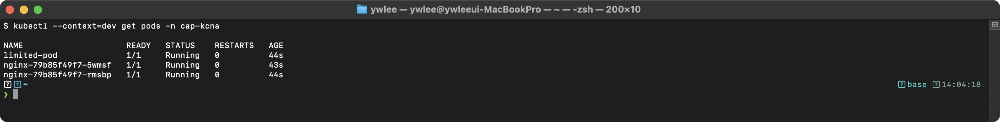
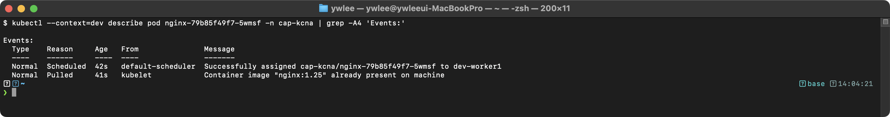
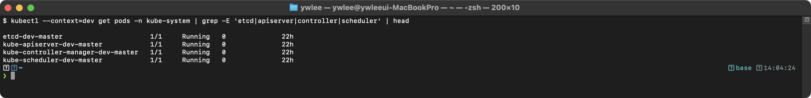
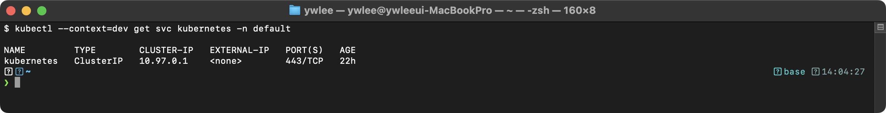

# KCNA Day 2: K8s 아키텍처 - 통신 흐름, Static Pod, 실전 문제

> **이전 학습**: Day 1에서 K8s 컴포넌트 개요(API Server·etcd·Scheduler·kubelet·Controller Manager)를 학습했다. Day 2는 그 컴포넌트들이 실제로 어떤 순서로 통신하는지 흐름을 추적한다.

> 학습 목표: K8s 클러스터 내부의 통신 흐름과 Static Pod 개념을 이해하고, 실전 모의 문제로 아키텍처 지식을 점검한다.
> 예상 소요 시간: 60분 (개념 20분 + 문제 40분)
> 시험 도메인: Kubernetes Fundamentals (46%) - Part 2
> 난이도: ★★★★★ (KCNA 시험의 핵심 중 핵심)

---

## 오늘의 학습 목표

- Pod 생성 과정의 전체 흐름을 단계별로 설명할 수 있다
- Static Pod의 개념과 일반 Pod와의 차이를 이해한다
- 주요 컴포넌트의 포트 번호를 암기한다
- 20문제 모의시험을 통해 K8s 아키텍처 지식을 점검한다

---

## 1. Pod 생성 과정 (통신 흐름)

### 1.0 등장 배경

기존 컨테이너 관리 방식에서는 사용자가 "어떤 서버에, 어떤 순서로" 컨테이너를 배치할지 직접 결정해야 했다. Docker Swarm은 단순한 스케줄링만 제공했고, 수동 운영에서는 서버 장애 시 복구까지 사람이 개입해야 했다. Kubernetes는 이 문제를 해결하기 위해 Watch 기반 비동기 이벤트 아키텍처를 채택했다. 모든 컴포넌트가 API Server를 허브로 삼아 Watch 이벤트를 구독하고, 자기 책임 범위 내에서 독립적으로 동작하는 구조이다. 이 설계 덕분에 각 컴포넌트의 장애가 다른 컴포넌트로 전파되지 않는다.

**etcd란?** etcd는 CNCF(Cloud Native Computing Foundation) 졸업 프로젝트인 분산 key-value 데이터베이스로, K8s의 모든 오브젝트(Pod, Service, ConfigMap 등)의 desired state(원하는 상태)를 저장한다. 고가용성을 위해 Raft 합의 알고리즘으로 다중 노드 간 데이터 일관성을 보장한다. API Server만이 etcd에 직접 접근하며, 다른 모든 컴포넌트는 API Server를 통해 간접적으로 상태를 읽고 쓴다.

**Watch란?** Watch는 API Server와 클라이언트(Scheduler, kubelet, Controller Manager 등) 간의 지속적 구독-알림 메커니즘이다. polling(주기적으로 "변경 있나요?" 라고 묻는 방식)과 달리, Watch는 etcd의 변경 이벤트를 gRPC streaming(TCP 위에서 동작하는 양방향 스트리밍 프로토콜로, HTTP/2를 전송 계층으로 사용한다)으로 실시간 전달한다. 예를 들어, Scheduler는 API Server에 "nodeName이 비어 있는 새 Pod가 생기면 알려달라"고 구독한다. 변경이 발생하면 API Server가 구독자에게 이벤트를 push하므로, 컴포넌트들은 불필요한 폴링 없이 API Server를 허브로 느슨한 결합을 유지한다.

**K8s 전체를 관통하는 Watch-Reconcile 루프 철학**: K8s의 모든 컴포넌트는 동일한 패턴으로 동작한다. (1) Watch: API Server의 변경을 구독하여 실시간으로 감지한다. (2) Reconcile: 변경 감지 시 자기 책임 범위 내에서 동작한다(Scheduler는 노드 바인딩, kubelet은 컨테이너 생성, Controller Manager는 desired state 복구). (3) Report: 완료 후 상태를 다시 API Server에 보고한다. 이 반복이 Pod 생성·업데이트·삭제뿐 아니라 K8s 클러스터 자기 치유의 기초이다.

### 1.1 전체 흐름 다이어그램

```
Pod 생성 과정 (kubectl apply -f pod.yaml)
============================================================

사용자
  |
  | 1. kubectl apply -f pod.yaml
  v
+------------------+
| kube-apiserver   |  2. 인증 → 인가 → 어드미션 컨트롤
| (API Server)     |  3. Pod 오브젝트를 etcd에 저장
+--------+---------+     (이 시점에 nodeName은 비어있음)
         |
         | 4. Watch 이벤트: "새 Pod 생성됨 (nodeName 없음)"
         v
+------------------+
| kube-scheduler   |  5. 필터링 → 스코어링으로 최적 노드 선택
|                  |  6. API Server에 바인딩 결과 전송
+--------+---------+     (Pod의 nodeName에 선택된 노드 할당)
         |
         | 7. Watch 이벤트: "Pod가 이 노드에 할당됨"
         v
+------------------+
| kubelet          |  8. Pod spec에 따라 컨테이너 생성 지시
| (Worker Node)    |  9. CRI를 통해 containerd에 요청
+--------+---------+
         |
         | 10. containerd → runc → Linux Kernel
         v
+------------------+
| containerd/runc  |  11. namespace + cgroups 설정
| (Container       |  12. 컨테이너 프로세스 생성
|  Runtime)        |  13. 상태를 kubelet에 보고
+------------------+

핵심 포인트:
- 모든 통신은 API Server를 통해 이루어진다
- Scheduler와 kubelet은 Watch 메커니즘으로 변경을 감지한다
- etcd에 직접 접근하는 것은 API Server뿐이다
```

### 1.2 각 단계 상세

```
단계별 상세 설명
============================================================

단계 1-3: API Server 처리
  - kubectl이 YAML을 API Server에 전송 (HTTPS)
  - API Server가 요청을 처리: 인증 → 인가 → 어드미션 컨트롤
    * 어드미션 컨트롤(Admission Control)은 API Server의 마지막 검증 단계이다.
      Pod spec의 이미지 없음·SecurityContext 부재·ResourceQuota 초과 등을 확인하고,
      필요 시 기본값(예: imagePullPolicy=IfNotPresent)을 주입하거나 요청을 거부한다.
      ValidatingAdmissionWebhook(검증 전용)과 MutatingAdmissionWebhook(값 변환)으로 확장 가능하다.
  - 검증 통과 시 Pod 오브젝트를 etcd에 저장
  - 이 시점에 Pod의 nodeName 필드는 비어있음 (Pending 상태)

단계 4-6: Scheduler 배치
  - Scheduler가 Watch를 통해 nodeName이 없는 Pod를 감지
  - 필터링(Filtering): 조건에 맞지 않는 노드 제외
    → 리소스 부족(CPU/메모리 요청량 초과)
    → nodeSelector: Pod YAML의 nodeSelector 라벨과 노드 라벨 불일치
      (nodeSelector는 특정 라벨이 있는 노드에만 배치하는 단순 조건이다)
    → Taint/Toleration 불일치: 노드의 Taint(오염 표시)에 Pod의 toleration(허용 선언)이 없으면 제외
      (예: 특수 GPU 노드는 Taint로 표시해 일반 Pod 배치를 막는다)
    → NodeAffinity: nodeSelector보다 세밀한 노드 선택 정책 (AND/OR/NotIn 등 지원)
    → PVC(PersistentVolumeClaim, 영구볼륨청구) 미바인딩: Pod가 요구하는 스토리지가 미연결이면 제외
    이 세부 주제는 CKA 스케줄링에서 깊이 다룬다.
  - 스코어링(Scoring): 남은 노드에 점수 부여
    → 리소스 균형, 이미지 캐시 존재 여부 등
  - 최고 점수 노드를 선택하여 Pod의 nodeName에 할당

단계 7-9: kubelet 실행
  - kubelet이 Watch를 통해 자기 노드에 할당된 Pod를 감지
  - Pod spec을 읽고 컨테이너 생성을 준비
  - CRI(Container Runtime Interface)를 통해 containerd에 요청
    * K8s는 벤더 종속을 피하기 위해 플러그인 인터페이스를 표준화했다:
      - CRI: kubelet과 컨테이너 런타임 간 통신 표준. 구현체: containerd, CRI-O
      - CNI(Container Network Interface): K8s와 네트워크 플러그인 간 표준. 구현체: Cilium, Calico, Flannel
      - CSI(Container Storage Interface): K8s와 스토리지 드라이버 간 표준. 구현체: AWS EBS, Longhorn
    * (CNI는 Day 3 Service 섹션에서, CSI는 CKA 과정에서 다룬다. Day 2는 CRI에만 집중한다.)
    * containerd는 CRI를 구현하는 고수준 런타임이고, runc는 실제 Linux namespace·cgroups를 설정하는 저수준 런타임이다.

단계 10-13: Container Runtime 실행
  - containerd가 이미지를 pull (이미 캐시되어 있으면 생략)
  - runc가 Linux namespace와 cgroups를 설정
  - 컨테이너 프로세스를 생성하고 실행
  - kubelet이 Pod 상태를 API Server에 보고 → etcd 업데이트
```

---

## 2. Static Pod

### 2.1 Static Pod 개념

**등장 배경 — 클러스터 부팅의 닭-달걀 문제**

일반 Pod는 API Server → Scheduler → kubelet 순서로 생성된다. 그런데 API Server 자신도 Pod로 실행되어야 한다면, API Server가 없는 부팅 초기에는 누가 API Server Pod를 생성할 수 있는가? Scheduler는 API Server가 없으면 동작하지 않는다. etcd도 Pod라면 같은 문제가 생긴다.

kubeadm 이전 방식에서는 Control Plane 컴포넌트를 별도의 데몬(systemd 서비스)으로 각 노드에 수동 설치했다. 이 방식은 버전 관리, 설정 변경, 장애 복구를 모두 수작업으로 해야 했고, K8s 자체의 선언적 관리 원칙(YAML로 desired state를 선언)과도 어긋났다.

Static Pod는 이 부트스트랩 문제를 해결한다. kubelet은 클러스터와 무관하게 systemd 서비스로 노드에서 먼저 기동된다. kubelet이 `/etc/kubernetes/manifests/` 디렉토리를 감시하여 YAML 파일만으로 Pod를 직접 생성한다. 따라서 kubeadm init은 API Server·etcd·Scheduler·Controller Manager의 YAML을 이 디렉토리에 배치하는 것만으로 Control Plane 전체를 띄운다. 이 설계 덕분에 Control Plane 컴포넌트 자체도 K8s의 선언적 관리 원칙 아래 놓인다.

**트레이드오프**: Static Pod는 Scheduler가 관여하지 않으므로 특정 노드에 고정된다. HA(고가용성) 구성에서는 각 Control Plane 노드마다 동일한 YAML 파일을 복제해야 하며, YAML 변경 시 해당 노드에 직접 SSH로 접속해야 한다.

> **Static Pod**란?
> API Server를 거치지 않고 **kubelet이 직접 관리**하는 특수한 Pod이다. 특정 노드의 `/etc/kubernetes/manifests/` 디렉토리에 YAML 파일을 배치하면 kubelet이 자동으로 Pod를 생성한다.

```
Static Pod vs 일반 Pod
============================================================

일반 Pod:
사용자 → API Server → etcd → Scheduler → kubelet → 컨테이너

Static Pod:
kubelet이 /etc/kubernetes/manifests/ 디렉토리를 감시
  → YAML 파일 발견 시 자동으로 Pod 생성
  → API Server에 "미러 Pod"를 등록 (조회만 가능, 수정 불가)

핵심 포인트:
- kubelet이 직접 관리 (Scheduler 관여 없음)
- /etc/kubernetes/manifests/ 경로 (시험 빈출!)
- Control Plane 컴포넌트가 Static Pod로 실행됨:
  → kube-apiserver
  → etcd
  → kube-scheduler
  → kube-controller-manager
- kubeadm으로 설치 시 위 컴포넌트는 Static Pod이다
```

### 2.2 Static Pod 위치 확인

```bash
# Static Pod YAML 파일 위치
ls /etc/kubernetes/manifests/

# 예상 출력:
# etcd.yaml
# kube-apiserver.yaml
# kube-controller-manager.yaml
# kube-scheduler.yaml
```

### 2.3 Static Pod 특징

| 항목 | Static Pod | 일반 Pod |
|------|-----------|---------|
| **생성 방법** | /etc/kubernetes/manifests/에 YAML 배치 | kubectl apply 또는 API 호출 |
| **관리 주체** | kubelet | API Server + Scheduler + Controller |
| **Scheduler** | 관여 안 함 | 필터링 + 스코어링 |
| **API Server** | 미러 Pod 등록 (읽기 전용) | 완전한 관리 |
| **삭제 방법** | YAML 파일 제거 | kubectl delete |
| **사용 사례** | Control Plane 컴포넌트 | 일반 워크로드 |

**미러 Pod(Mirror Pod)란?** kubelet은 Static Pod를 생성하면서 동시에 API Server에 같은 이름의 Pod 오브젝트를 등록한다. 이것이 미러 Pod이다. 이름 형식은 `<pod-name>-<node-name>`으로 붙는다(예: `kube-apiserver-dev-master`). 미러 Pod 덕분에 `kubectl get pods -n kube-system`으로 Static Pod를 조회할 수 있다. 그러나 미러 Pod는 읽기 전용 반영이므로, `kubectl edit` 또는 `kubectl delete`로 수정·삭제를 시도해도 API Server의 복사본만 변경될 뿐이다. kubelet은 `/etc/kubernetes/manifests/` YAML 파일이 남아 있는 한 삭제된 미러 Pod를 즉시 재생성한다. Static Pod의 실질적 변경은 해당 노드에 SSH 접속한 후 YAML 파일 자체를 수정해야 한다. 완전 제거는 YAML 파일을 `rm`으로 삭제해야 한다.

### 2.4 Probe — 컨테이너 생존/준비 상태 감지

> (이하는 §1.2 단계 8~13: kubelet이 컨테이너를 생성한 뒤 어떻게 애플리케이션 레벨 상태를 주기적으로 감시하는지 보충 설명한다. Static Pod와 일반 Pod 모두 동일한 Probe 메커니즘이 적용된다.)

**등장 배경 — OS 수준 프로세스 감시의 한계**

컨테이너가 실행 중이더라도 애플리케이션이 정상 동작한다는 보장은 없다. 이전에는 kubelet이 컨테이너 프로세스의 OS 종료 코드(exit code)만 감시했다. 프로세스는 살아 있지만 데드락·메모리 고갈·초기화 미완료 상태에서는 OS 수준 모니터링으로 감지가 불가능했다. 트래픽은 계속 들어오지만 응답은 실패하는 상태가 지속될 수 있었다.

Kubernetes는 이를 해결하기 위해 애플리케이션 레벨 상태를 주기적으로 점검하는 세 종류의 Probe를 kubelet에 내장했다.

**세 종류 Probe 비교**

| Probe | 목적 | 실패 시 동작 | 설정 시 주의 |
|:--|:--|:--|:--|
| **Liveness Probe** | "컨테이너가 살아있는가?" 데드락·무한루프 감지 | kubelet이 컨테이너를 **재시작** | 실패 임계값(failureThreshold)을 낮게 설정하면 불필요한 재시작 루프 유발 |
| **Readiness Probe** | "트래픽을 받을 준비가 됐는가?" | Service **Endpoints에서 제거** (재시작 아님, Pod는 Running 유지) | 시작 직후 DB 연결 완료 전 트래픽 차단에 사용 |
| **Startup Probe** | "초기화가 완료됐는가?" 느린 시작 앱 보호 | failureThreshold 초과 시 컨테이너 **재시작** | Startup Probe가 성공하기 전까지 Liveness/Readiness Probe를 비활성화한다 |

**Probe 방식**: HTTP GET (지정 경로에 2xx/3xx이면 성공), TCP Socket (포트 연결 성공 여부), Exec (임의 명령 exit code 0이면 성공).

**트레이드오프**: Probe 주기(periodSeconds)를 너무 짧게, 실패 임계값(failureThreshold)을 너무 낮게 설정하면 일시적 부하 상황에서 재시작 루프(CrashLoopBackOff)가 유발된다. Liveness·Readiness를 동일 엔드포인트로 설정하면 서비스에서 제거되는 것과 재시작이 동시에 발생해 가용성이 오히려 낮아진다.

> 시험 포인트: Liveness 실패 → **재시작**, Readiness 실패 → **엔드포인트 제거**(재시작 없음). Startup Probe는 느린 앱의 초기화 완료를 대기하는 역할이다.

---

## 3. 주요 포트 번호 (시험 빈출!)

K8s 네트워크는 계층적으로 구성된다. (1) Pod IP: 각 Pod가 고유한 IP를 갖는다. (2) ClusterIP: Service 리소스가 클러스터 내부에서 접근 가능한 가상 IP(Virtual IP)를 제공한다. (3) NodePort: 외부에서 노드의 특정 포트 번호로 Service에 접근할 수 있도록 노드 포트를 개방한다. 이 day02는 컴포넌트 포트 번호 암기를 목표로 하며, Service의 상세 개념(ClusterIP·NodePort·LoadBalancer 동작 원리)은 day03에서 다룬다.

```
K8s 주요 포트 번호 (반드시 암기!)
============================================================

Control Plane 포트:
  API Server:         6443/TCP  (HTTPS)
  etcd:               2379/TCP  (클라이언트 요청)
                      2380/TCP  (피어 통신)
  Scheduler:          10259/TCP (HTTPS)
  Controller Manager: 10257/TCP (HTTPS)

Worker Node 포트:
  kubelet:            10250/TCP (HTTPS API)
  NodePort 범위:      30000-32767/TCP

네트워크 플러그인:
  CoreDNS:            53/TCP, 53/UDP (DNS)

가장 중요한 암기 포인트:
  - API Server = 6443
  - etcd = 2379 / 2380
  - NodePort = 30000-32767
```

방화벽 정책 작성 시 또는 클러스터 컴포넌트 헬스 점검 시 해당 포트를 직접 `curl`/`nc`로 확인해야 하므로 시험에 자주 출제된다. 예를 들어 Scheduler(10259)나 Controller Manager(10257)가 응답하는지 확인하려면 `curl -k https://localhost:10259/healthz`처럼 포트 번호를 직접 지정해야 한다.

---

## 4. 컴포넌트 간 통신 정리

```
컴포넌트 통신 매트릭스
============================================================

모든 컴포넌트 → API Server (6443)
  - kubelet → API Server: Pod 상태 보고, Watch
  - Scheduler → API Server: Pod 바인딩 결과 전송
  - Controller Manager → API Server: 리소스 상태 관리
  - kube-proxy → API Server: Service/Endpoints Watch

API Server → etcd (2379)
  - API Server만 etcd에 직접 접근 (유일!)

kubelet → Container Runtime (CRI)
  - kubelet → containerd: Unix Domain Socket 통신
  - containerd → runc: 컨테이너 프로세스 생성

kube-proxy → iptables/IPVS
  - Service의 ClusterIP를 Pod IP로 변환하는 규칙 설정

시험 포인트:
  - 모든 것은 API Server를 경유한다 (Hub-and-Spoke 모델: 중앙 허브 하나를 거쳐 모든 노드가 통신하는 별형 구조)
  - etcd에 직접 접근하는 것은 API Server뿐이다
  - kubelet은 API Server의 Watch를 통해 작업을 받는다
```

### Cloud-Controller-Manager (CCM)

**등장 배경 — K8s 코어와 클라우드 코드 분리**

초기 Kubernetes는 AWS·GCP·Azure 등 클라우드 제공자 특화 코드(노드 라이프사이클 관리, LoadBalancer 프로비저닝 등)를 `kube-controller-manager` 바이너리에 직접 내장했다. 이 구조에서는 AWS가 새 기능을 추가하려면 K8s 릴리스 주기에 맞춰 코어 코드를 수정해야 했다. 클라우드 제공자마다 K8s 릴리스와 무관하게 자체 속도로 개발·배포하려면 코어에서 분리가 필요했다.

Cloud-Controller-Manager(CCM)는 클라우드 특화 제어 루프를 독립 바이너리로 분리한 컴포넌트이다. CCM은 세 가지 컨트롤러를 담당한다:
- **Node Controller**: 클라우드 VM 인스턴스가 삭제되면 K8s 노드 오브젝트를 제거한다.
- **Route Controller**: 클라우드 네트워크에서 Pod CIDR 라우팅을 설정한다.
- **Service Controller**: `type: LoadBalancer` Service 생성 시 클라우드 LB(AWS ALB, GCP LB 등)를 프로비저닝한다.

**트레이드오프**: CCM이 없는 온프레미스 또는 베어메탈 클러스터에서는 `type: LoadBalancer` Service가 `<pending>` 상태로 남는다. 이 경우 MetalLB 등 별도 솔루션이 필요하다. tart 기반 로컬 클러스터도 CCM 없이 동작하므로 LoadBalancer 타입은 사용하지 않는다.

> 시험 포인트: CCM은 클라우드 제공자 코드를 K8s 코어에서 분리하기 위해 등장했다. `type: LoadBalancer` Service 처리는 CCM의 역할이다.

---

## 5. 시험 출제 패턴 분석

Day 1~2의 핵심 출제 패턴:

1. **"etcd에 직접 접근하는 컴포넌트"** → API Server만!
2. **"Scheduler의 2단계"** → 필터링 → 스코어링
3. **"Static Pod 경로"** → /etc/kubernetes/manifests/
4. **"API Server 포트"** → 6443
5. **"etcd 포트"** → 2379 (클라이언트), 2380 (피어)
6. **"NodePort 범위"** → 30000-32767
7. **"Pod 생성 순서"** → API Server → etcd → Scheduler → kubelet → containerd
8. **"인증 순서"** → 인증 → 인가 → 어드미션 컨트롤

---

## 6. KCNA 실전 모의 문제 (20문제)

### 문제 1.
Kubernetes 클러스터에서 etcd와 직접 통신하는 유일한 컴포넌트는?

A) kubelet
B) kube-scheduler
C) kube-apiserver
D) kube-controller-manager

<details><summary>정답 확인</summary>

**정답: C) kube-apiserver**

kube-apiserver는 etcd와 직접 통신하는 유일한 컴포넌트이다. 다른 모든 컴포넌트(kubelet, scheduler, controller-manager)는 API Server를 경유하여 etcd의 데이터에 접근한다. 이것은 보안과 데이터 일관성을 위한 아키텍처 설계이다.
</details>

---

### 문제 2.
kube-scheduler가 Pod를 노드에 배치할 때 수행하는 2단계 과정의 올바른 순서는?

A) 스코어링 → 필터링
B) 필터링 → 스코어링
C) 할당 → 검증
D) 검증 → 필터링

<details><summary>정답 확인</summary>

**정답: B) 필터링 → 스코어링**

Scheduler는 먼저 **필터링(Filtering)** 단계에서 조건에 맞지 않는 노드를 제외하고, **스코어링(Scoring)** 단계에서 남은 노드에 점수를 매겨 최적의 노드를 선택한다. 필터링이 항상 먼저이다.
</details>

---

### 문제 3.
etcd의 고가용성 환경에서 합의를 위해 사용하는 알고리즘은?

A) Paxos
B) Raft
C) PBFT
D) ZAB

<details><summary>정답 확인</summary>

**정답: B) Raft**

etcd는 **Raft** 합의 알고리즘을 사용한다. Raft의 핵심 아이디어: 분산 시스템에서 여러 노드 간 데이터 일관성을 보장하려면, 모든 쓰기 요청마다 "과반수(quorum) 동의"를 받아야 한다. 예를 들어 etcd 노드가 3개이면 quorum은 2이므로, 1개 노드 장애가 발생해도 나머지 2개가 합의하여 데이터를 안전하게 유지한다. 노드가 2개이면 quorum이 2인데 1개 장애 시 합의 불가이므로 HA가 성립하지 않는다. 따라서 etcd HA 환경은 홀수(3, 5, 7개)로 운영한다. Raft는 리더(Leader) 선출과 로그 복제를 통해 동작하며, Paxos는 더 오래된 합의 알고리즘, ZAB는 ZooKeeper가 사용하는 유사 알고리즘이다.
</details>

---

### 문제 4.
Static Pod에 대한 설명으로 올바른 것은?

A) API Server를 통해 생성되고 Scheduler가 배치한다
B) kubelet이 /etc/kubernetes/manifests/ 디렉토리를 감시하여 직접 관리한다
C) kubectl delete로만 삭제할 수 있다
D) Worker Node에서만 실행 가능하다

<details><summary>정답 확인</summary>

**정답: B) kubelet이 /etc/kubernetes/manifests/ 디렉토리를 감시하여 직접 관리한다**

**왜 정답인가:** Static Pod는 kubelet이 직접 관리하는 Pod로, 해당 디렉토리에 YAML 파일을 배치하면 자동으로 생성된다. Control Plane 컴포넌트(API Server, etcd, Scheduler, Controller Manager)가 Static Pod로 실행된다.

**왜 오답인가:**
- A) Static Pod는 Scheduler가 관여하지 않는다.
- C) YAML 파일을 디렉토리에서 제거해야 삭제된다.
- D) Control Plane 노드에서도 실행된다 (오히려 주로 Control Plane에서 사용).
</details>

---

### 문제 5.
kubeadm으로 설치한 클러스터에서 Static Pod로 실행되는 컴포넌트가 아닌 것은?

A) kube-apiserver
B) etcd
C) kubelet
D) kube-scheduler

<details><summary>정답 확인</summary>

**정답: C) kubelet**

**왜 정답인가:** kubelet은 K8s 클러스터를 부팅하는 초기 에이전트이므로 **systemd 서비스**로 실행된다. kubelet이 Static Pod를 관리하는 주체이므로, kubelet 자체가 Static Pod일 수는 없다(Static Pod를 생성하는 주체가 자기 자신을 Static Pod로 등록할 수 없다). 반면 API Server·etcd·Scheduler·Controller Manager는 kubeadm이 `/etc/kubernetes/manifests/`에 Static Pod YAML로 배포한다. 이 설계는 Control Plane 자체를 K8s의 선언적 관리 원칙(YAML = desired state)으로 관리한다는 의미이다. kube-apiserver, etcd, kube-scheduler, kube-controller-manager는 모두 Static Pod로 실행된다.
</details>

---

### 문제 6.
kube-apiserver의 기본 포트 번호는?

A) 8080
B) 6443
C) 443
D) 2379

<details><summary>정답 확인</summary>

**정답: B) 6443**

kube-apiserver는 기본적으로 **6443** 포트에서 HTTPS 요청을 수신한다. 2379는 etcd 클라이언트 포트이다. 443은 일반 HTTPS 포트이지만 API Server의 기본 포트는 아니다.
</details>

---

### 문제 7.
API Server의 요청 처리 순서로 올바른 것은?

A) 인가 → 인증 → 어드미션 컨트롤
B) 어드미션 컨트롤 → 인증 → 인가
C) 인증 → 인가 → 어드미션 컨트롤
D) 인증 → 어드미션 컨트롤 → 인가

<details><summary>정답 확인</summary>

**정답: C) 인증 → 인가 → 어드미션 컨트롤**

API Server는 모든 요청을 3단계로 처리한다:
1. **인증(Authentication)**: "누구인가?" - 요청자 신원 확인
2. **인가(Authorization)**: "권한이 있는가?" - RBAC 등으로 권한 확인
3. **어드미션 컨트롤(Admission Control)**: "정책에 부합하는가?" - 리소스 검증/변환
</details>

---

### 문제 8.
Pod 생성 과정에서 Scheduler의 역할은?

A) 컨테이너 이미지를 다운로드한다
B) Pod를 etcd에 저장한다
C) Pod에 최적의 노드를 할당한다
D) Pod의 네트워크를 설정한다

<details><summary>정답 확인</summary>

**정답: C) Pod에 최적의 노드를 할당한다**

**왜 정답인가:** Scheduler는 nodeName이 없는 Pending Pod를 Watch로 감지하고, 필터링과 스코어링을 통해 최적의 노드를 선택하여 Pod의 nodeName 필드에 할당한다.

**왜 오답인가:**
- A) 이미지 다운로드는 containerd(Container Runtime)의 역할이다.
- B) etcd 저장은 API Server의 역할이다.
- D) 네트워크 설정은 CNI 플러그인과 kube-proxy의 역할이다.
</details>

---

### 문제 9.
Controller Manager의 핵심 동작 원리는?

A) 이벤트 드리븐 아키텍처로 일회성 작업을 수행한다
B) Reconciliation Loop로 desired state와 current state를 일치시킨다
C) 사용자 요청을 직접 처리하여 Pod를 생성한다
D) etcd에 직접 접근하여 데이터를 관리한다

<details><summary>정답 확인</summary>

**정답: B) Reconciliation Loop로 desired state와 current state를 일치시킨다**

Controller Manager는 여러 컨트롤러(Deployment Controller, ReplicaSet Controller, Node Controller 등)를 실행하며, 각 컨트롤러는 **Reconciliation Loop(조정 루프)**를 통해 리소스의 현재 상태(current state)를 원하는 상태(desired state)와 지속적으로 일치시킨다.
</details>

---

### 문제 10.
kubelet의 역할이 아닌 것은?

A) Pod의 컨테이너를 실행하고 관리한다
B) 노드의 상태를 API Server에 보고한다
C) Pod를 어떤 노드에 배치할지 결정한다
D) Liveness/Readiness Probe를 수행한다

<details><summary>정답 확인</summary>

**정답: C) Pod를 어떤 노드에 배치할지 결정한다**

Pod 배치는 **kube-scheduler**의 역할이다. kubelet은 자기 노드에 할당된 Pod를 실행하고 관리하며, 상태를 보고하고, Probe를 수행한다.
</details>

---

### 문제 11.
kube-proxy의 역할로 올바른 것은?

A) Pod 간 네트워크 연결을 설정한다
B) Service의 ClusterIP로 들어오는 트래픽을 Pod로 전달하는 규칙을 관리한다
C) 컨테이너 이미지를 레지스트리에서 다운로드한다
D) DNS 서비스를 제공한다

<details><summary>정답 확인</summary>

**정답: B) Service의 ClusterIP로 들어오는 트래픽을 Pod로 전달하는 규칙을 관리한다**

kube-proxy는 iptables 또는 IPVS 규칙을 관리하여 Service의 Virtual IP(ClusterIP)로 들어오는 트래픽을 실제 Pod IP로 전달(DNAT)한다. DNS는 CoreDNS, 네트워크 연결은 CNI 플러그인의 역할이다.
</details>

---

### 문제 12.
etcd가 데이터 일관성을 보장하기 위해 필요한 최소 노드 수는?

A) 1개
B) 2개
C) 3개
D) 5개

<details><summary>정답 확인</summary>

**정답: C) 3개**

etcd는 Raft 합의 알고리즘을 사용하므로 과반수(quorum)가 동의해야 한다. 고가용성을 위한 최소 노드 수는 **3개**(과반수 = 2)이다. 1개는 HA가 아니고, 2개는 과반수 확보 불가(1개 장애 시 동작 불가), 홀수 운영이 권장된다.
</details>

---

### 문제 13.
Kubernetes에서 "선언적(Declarative)" 방식의 의미는?

A) 명령어를 하나씩 순서대로 실행한다
B) 원하는 최종 상태를 기술하면 시스템이 자동으로 맞춘다
C) 수동으로 설정을 변경한다
D) 이벤트 기반으로 동작한다

<details><summary>정답 확인</summary>

**정답: B) 원하는 최종 상태를 기술하면 시스템이 자동으로 맞춘다**

선언적(Declarative) 방식은 "무엇을(What)" 원하는지만 기술하고, "어떻게(How)"는 시스템이 결정하는 방식이다. YAML 매니페스트로 desired state를 선언하면 Controller Manager의 Reconciliation Loop가 current state를 자동으로 맞춘다.
</details>

---

### 문제 14.
다음 중 Liveness Probe가 실패했을 때의 동작은?

A) Pod를 Service 엔드포인트에서 제거한다
B) kubelet이 컨테이너를 재시작한다
C) Pod를 다른 노드로 이동한다
D) 알림만 발생하고 아무 동작도 하지 않는다

<details><summary>정답 확인</summary>

**정답: B) kubelet이 컨테이너를 재시작한다**

- **Liveness Probe 실패** → kubelet이 컨테이너를 **재시작**
- **Readiness Probe 실패** → Service의 **엔드포인트에서 제거** (트래픽 차단)
- **Startup Probe 실패** → 컨테이너 재시작 (앱 시작 완료 확인용)
</details>

---

### 문제 15.
etcd의 클라이언트 통신 포트와 피어 통신 포트는?

A) 2379 / 2380
B) 6443 / 6444
C) 8080 / 8443
D) 10250 / 10257

<details><summary>정답 확인</summary>

**정답: A) 2379 / 2380**

- **2379**: etcd 클라이언트 통신 포트 (API Server가 접근)
- **2380**: etcd 피어(peer) 통신 포트 (etcd 클러스터 내부 통신)
- 6443은 API Server, 10250은 kubelet, 10257은 Controller Manager 포트이다.
</details>

---

### 문제 16.
K8s v1.24부터 적용된 중요한 변경 사항은?

A) etcd가 제거되었다
B) dockershim이 제거되었다
C) kubelet이 제거되었다
D) kube-proxy가 제거되었다

<details><summary>정답 확인</summary>

**정답: B) dockershim이 제거되었다**

K8s v1.24부터 **dockershim이 제거**되어 Docker를 직접 컨테이너 런타임으로 사용할 수 없다. dockershim은 kubelet이 Docker 데몬과 통신하기 위해 K8s 코어에 내장해 둔 임시 어댑터였다. 이를 유지하는 비용과 보안 위험(Docker 데몬이 root 권한으로 동작)이 커지면서 결국 제거되었다. 이 변경이 Pod 생성 흐름(1.2의 단계 9: CRI)과 직결된다. kubelet은 이제 CRI를 직접 구현하는 containerd 또는 CRI-O하고만 통신한다. 하지만 Docker로 빌드한 이미지는 **OCI(Open Container Initiative) 표준**을 따르므로 containerd, CRI-O 등 어떤 CRI 호환 런타임에서든 그대로 실행 가능하다.
</details>

---

### 문제 17.
CRI(Container Runtime Interface)에 대한 설명으로 올바른 것은?

A) 컨테이너 네트워크를 설정하는 인터페이스이다
B) kubelet과 컨테이너 런타임 간의 표준 통신 인터페이스이다
C) 스토리지 플러그인을 위한 인터페이스이다
D) DNS 서비스를 위한 인터페이스이다

<details><summary>정답 확인</summary>

**정답: B) kubelet과 컨테이너 런타임 간의 표준 통신 인터페이스이다**

- **CRI** (Container Runtime Interface): kubelet ↔ 런타임 (containerd, CRI-O)
- **CNI** (Container Network Interface): K8s ↔ 네트워크 플러그인 (Calico, Cilium)
- **CSI** (Container Storage Interface): K8s ↔ 스토리지 플러그인
</details>

---

### 문제 18.
Cloud-Controller-Manager의 역할은?

A) 컨테이너를 실행한다
B) 클러스터 내부 DNS를 관리한다
C) 클라우드 제공자의 API와 통합하여 노드, 로드밸런서 등을 관리한다
D) etcd의 데이터를 백업한다

<details><summary>정답 확인</summary>

**정답: C) 클라우드 제공자의 API와 통합하여 노드, 로드밸런서 등을 관리한다**

Cloud-Controller-Manager는 K8s 핵심 코드와 클라우드 특정 코드를 분리하기 위한 컴포넌트이다. LoadBalancer Service 생성 시 클라우드 LB 프로비저닝, 노드 장애 시 클라우드 인스턴스 상태 확인 등을 담당한다.
</details>

---

### 문제 19.
Pod가 Pending 상태에 머물 수 있는 원인이 아닌 것은?

A) 스케줄링할 수 있는 노드가 없다
B) 이미지를 다운로드하고 있다
C) Pod가 성공적으로 완료되었다
D) PVC가 바인딩되지 않았다

<details><summary>정답 확인</summary>

**정답: C) Pod가 성공적으로 완료되었다**

Pod가 성공적으로 완료되면 **Succeeded** 상태가 된다. Pending 상태의 원인에는 리소스 부족, 이미지 pull 중, PVC 미바인딩, 노드 부족 등이 있다.

Pod 상태(Phase):
- **Pending**: 스케줄링 대기 또는 이미지 다운로드 중
- **Running**: 최소 하나의 컨테이너가 실행 중
- **Succeeded**: 모든 컨테이너가 성공적으로 종료
- **Failed**: 하나 이상의 컨테이너가 실패로 종료
- **Unknown**: 노드와 통신 불가
</details>

---

### 문제 20.
Readiness Probe가 실패한 Pod에 대한 동작은?

A) kubelet이 Pod를 재시작한다
B) Pod가 삭제된다
C) Service 엔드포인트에서 제거되어 트래픽을 받지 않는다
D) 노드에서 퇴거(evict)된다

<details><summary>정답 확인</summary>

**정답: C) Service 엔드포인트에서 제거되어 트래픽을 받지 않는다**

**Readiness Probe 실패** → Pod는 계속 실행되지만 Service의 Endpoints 목록에서 제거되어 트래픽을 받지 않는다. Probe가 다시 성공하면 Endpoints에 복귀한다.

비교:
- **Liveness Probe 실패** → 컨테이너 재시작
- **Readiness Probe 실패** → 엔드포인트 제거 (재시작 아님!)
</details>

---

## 7. 트러블슈팅

### Static Pod 장애

```
증상: Control Plane Static Pod가 CrashLoopBackOff 상태이다

디버깅 순서:
  0. Control Plane 노드에 SSH 접속 (crictl은 노드 내부에서만 동작한다)
     $ ssh dev-master    # ~/.ssh/config에 등록된 VM 별칭으로 접속
     ※ crictl: 노드에서 컨테이너 상태를 직접 조회하는 CRI 클라이언트 도구.
       containerd·CRI-O 전용이며 kubectl 없이 노드 로컬에서만 동작한다.
  1. 실행 중인 컨테이너 목록에서 container-id 조회
     $ crictl ps --name kube-apiserver
     → 출력된 CONTAINER ID 값을 아래 단계에서 사용한다
  1-b. Static Pod 로그 확인
     $ crictl logs <container-id>
  2. Static Pod 매니페스트 문법 검증
     $ cat /etc/kubernetes/manifests/kube-apiserver.yaml | python3 -c "import yaml,sys; yaml.safe_load(sys.stdin)"
  3. 매니페스트 수정 후 kubelet이 자동으로 Pod를 재생성하는지 확인
     → kubelet은 /etc/kubernetes/manifests/ 디렉토리를 주기적으로 폴링한다
     → 파일 변경 감지 시 Pod를 삭제 후 재생성한다

주의: kubectl delete pod <name>은 API Server의 미러 Pod만 삭제한다.
     /etc/kubernetes/manifests/ 의 YAML 파일이 남아 있으면 kubelet이
     다시 YAML을 감지하여 Pod를 재생성한다. Static Pod를 완전히 제거하려면
     노드에 SSH로 접속한 후 YAML 파일 자체를 rm으로 삭제해야 한다.
```

### Pod가 Pending에서 진행되지 않을 때

```
디버깅 순서:
  1. kubectl describe pod <pod-name>으로 Events 확인
  2. 흔한 원인:
     - "Insufficient cpu/memory" → 노드 리소스 부족
     - "didn't match Pod's node affinity/selector" → 라벨 불일치
     - "had taint ... that the pod didn't tolerate" → Taint 불일치
     - "persistentvolumeclaim ... not found" → PVC 미존재
  3. 노드 할당 가능 리소스 확인
     $ kubectl describe nodes | grep -A10 "Allocated resources"
```

---

## 8. 복습 체크리스트

- [ ] Pod 생성 과정을 순서대로 설명할 수 있다 (API Server → etcd → Scheduler → kubelet → containerd)
- [ ] 모든 컴포넌트 간 통신이 API Server를 경유함을 이해한다
- [ ] Static Pod의 개념과 /etc/kubernetes/manifests/ 경로를 기억한다
- [ ] Control Plane 컴포넌트(API Server, etcd, Scheduler, Controller Manager)가 Static Pod로 실행됨을 안다
- [ ] kubelet은 systemd 서비스이며 Static Pod가 아님을 구분한다
- [ ] 주요 포트 번호를 암기한다: API Server=6443, etcd=2379/2380, NodePort=30000-32767
- [ ] Liveness Probe=재시작, Readiness Probe=엔드포인트 제거를 구분한다
- [ ] API Server의 요청 처리 순서: 인증 → 인가 → 어드미션 컨트롤
- [ ] etcd는 Raft 합의 알고리즘을 사용하며 홀수 노드 운영이 권장됨을 안다
- [ ] K8s v1.24부터 dockershim 제거, OCI 이미지는 계속 사용 가능함을 기억한다

---

## 9. 내일 학습 예고

> Day 3에서는 K8s 핵심 오브젝트 Part 1을 학습한다. Pod, Deployment, Service, DaemonSet, StatefulSet, Job/CronJob의 개념과 YAML 구조를 심도 있게 분석한다.

---

## tart-infra 실습

> **실습 전제 조건**
> - dev 클러스터가 가동 중이어야 한다. 가동: `./scripts/boot.sh` → IP 드리프트 복구: `./scripts/fix-cluster-ip-drift.sh dev`
> - kubeconfig 경로: `kubeconfig/dev.yaml`
> - 노드 SSH: `ssh dev-master`, `ssh dev-worker1` (비밀번호 없이 접속 가능, `~/.ssh/config` 설정 전제)
> - 실습 네임스페이스 미리 생성: `kubectl --kubeconfig kubeconfig/dev.yaml create ns demo`
> - CLAUDE.md §4① 준수: 명령 출력은 실제 터미널 스크린샷 이미지로 제공해야 한다. 아래 텍스트 블록은 실측값이나 이미지 미캡처 상태이다. 클러스터 기동 후 각 명령을 직접 실행하여 결과를 확인한다.

### 실습 환경 설정

```bash
# dev 클러스터에 접속
export KUBECONFIG=kubeconfig/dev.yaml
kubectl get nodes
```

### 실습 1: Pod 생성 과정 관찰

```bash
# Pod를 생성하고 이벤트를 통해 생성 과정을 관찰한다
kubectl run nginx-test --image=nginx:1.25 -n demo
```

검증:

```bash
# Pod 상태 확인
kubectl get pod nginx-test -n demo
```



```bash
# Pod 이벤트를 통해 생성 흐름의 각 단계를 확인한다
kubectl describe pod nginx-test -n demo | tail -20
```



```bash
# 실습 후 정리
kubectl delete pod nginx-test -n demo
```

**동작 원리:** Pod 생성 흐름:
1. kubectl이 API Server(6443)에 YAML을 전송한다
2. API Server가 인증/인가/어드미션 후 etcd(2379)에 저장한다
3. Scheduler가 Watch로 감지 → 필터링 → 스코어링 → 노드 할당
4. 해당 노드의 kubelet(10250)이 감지 → CRI → containerd → runc
5. `kubectl describe pod`로 Events 섹션에서 이 과정을 확인할 수 있다

### 실습 2: Static Pod (Control Plane 컴포넌트) 확인

```bash
# Control Plane 노드의 Static Pod 확인
kubectl get pods -n kube-system --field-selector=status.phase=Running | grep -E "(etcd|apiserver|controller|scheduler)"
```

검증:



**동작 원리:** Static Pod 특징:
1. Pod 이름에 노드 이름이 붙어있다 (예: `etcd-dev-master`)
2. `/etc/kubernetes/manifests/` 디렉토리의 YAML 파일로 관리된다
3. kubelet이 직접 관리하므로 Scheduler가 관여하지 않는다
4. API Server에 미러 Pod가 등록되어 kubectl로 조회 가능하지만, 수정은 YAML 파일을 편집해야 한다

노드 직접 확인 (SSH 접속 후):

```bash
# dev-master 노드에 접속 (~/.ssh/config 등록 별칭, 비밀번호 불필요)
ssh dev-master

# staticPodPath 디렉토리에 실제 YAML 파일이 있는지 확인한다
ls /etc/kubernetes/manifests/

# kubelet이 감시하는 staticPodPath 경로가 어디로 설정됐는지 확인한다
grep staticPodPath /var/lib/kubelet/config.yaml
```

### 실습 3: 컴포넌트 포트 확인

```bash
# API Server 포트 확인
kubectl get svc kubernetes -n default
```

검증:



**동작 원리:** 포트 매핑:
1. kubernetes Service는 API Server(6443)에 대한 ClusterIP Service이다
2. 클러스터 내부에서는 `kubernetes.default.svc.cluster.local:443`으로 API Server에 접근한다
3. 외부에서는 `<Master-IP>:6443`으로 직접 접근한다
4. kubelet(10250), etcd(2379/2380) 등 다른 컴포넌트도 각자의 포트에서 동작한다

---

## ✅ 자가점검

<details>
<summary>1. `kubectl run`으로 Pod를 만들 때 컴포넌트 처리 순서는?</summary>

kubectl → **API Server**(인증·인가·admission·검증) → **etcd 저장** → **Scheduler**가 노드 선택(spec.nodeName 기록) → 해당 노드의 **kubelet**이 감지해 CRI로 컨테이너 생성. 스케줄러는 직접 만들지 않고 "노드 배정"만 한다는 점이 핵심이다.
</details>

<details>
<summary>2. Static Pod와 일반 Pod의 관리 주체 차이는?</summary>

Static Pod는 **kubelet이 직접** `staticPodPath`(`/etc/kubernetes/manifests`)의 매니페스트를 보고 관리한다(API Server 없이도 동작). API Server에는 읽기 전용 **미러 Pod**만 보인다. control-plane 컴포넌트(apiserver·etcd 등)가 Static Pod로 떠 있다.
</details>

<details>
<summary>3. etcd가 Raft로 보장하는 것은?</summary>

분산 환경에서 **합의(consensus)** 와 데이터 일관성을 보장한다. 리더를 선출하고 로그를 복제하며, 과반수(quorum)가 살아 있어야 쓰기가 가능하다. 그래서 etcd 멤버는 보통 홀수(3·5)로 구성한다.
</details>

<details>
<summary>4. Liveness·Readiness·Startup Probe의 역할 차이는?</summary>

**Liveness**=실패 시 컨테이너 **재시작**, **Readiness**=실패 시 Service **엔드포인트에서 제외**(재시작 안 함), **Startup**=느린 시작 앱이 뜰 때까지 다른 probe를 **유예**. 셋을 혼동하면 오답이다.
</details>

<details>
<summary>5. dockershim 제거(v1.24) 후에도 기존 이미지를 계속 쓸 수 있는 이유는?</summary>

이미지가 **OCI 표준**을 따르기 때문이다. Docker로 빌드한 이미지도 OCI 이미지라 containerd/CRI-O가 그대로 실행한다. 제거된 것은 "Docker Engine을 CRI로 끼워 맞추던 shim"일 뿐, 이미지 호환성은 영향받지 않는다.
</details>

## 시험 팁

- Pod 생성 흐름 **API Server→etcd→Scheduler→kubelet**. 스케줄러는 "배정"만.
- Static Pod=**kubelet 직접 관리**(미러 Pod만 API에 노출).
- Probe 3종: **Liveness=재시작 / Readiness=엔드포인트 제외 / Startup=유예**.
- dockershim 제거해도 **OCI 이미지는 계속 사용**.

## 더 읽을거리

- [Kubernetes 공식 문서 — 컴포넌트 개요](https://kubernetes.io/docs/concepts/overview/components/) : API Server·etcd·Scheduler·Controller Manager·kubelet·kube-proxy 각각의 역할과 통신 구조를 공식 언어로 확인한다.
- [etcd 공식 문서 — Raft 합의 알고리즘](https://etcd.io/docs/v3.5/learning/design-raft/) : etcd가 어떻게 Raft를 구현하는지, 리더 선출과 로그 복제 메커니즘을 원문으로 읽는다.
- [Kubernetes 블로그 — dockershim 제거 안내](https://kubernetes.io/blog/2022/02/17/dockershim-faq/) : v1.24에서 dockershim을 제거한 배경, OCI 이미지 호환성, 마이그레이션 경로를 설명한다.
- [Kubernetes 공식 문서 — Configure Liveness, Readiness and Startup Probes](https://kubernetes.io/docs/tasks/configure-pod-container/configure-liveness-readiness-startup-probes/) : 세 Probe의 설정 옵션(initialDelaySeconds, periodSeconds, failureThreshold)과 실제 YAML 예제를 확인한다.
- [Kubernetes 공식 문서 — Cloud Controller Manager](https://kubernetes.io/docs/concepts/architecture/cloud-controller/) : CCM이 K8s 코어에서 분리된 이유와 Node·Route·Service 컨트롤러의 역할을 설명한다.
