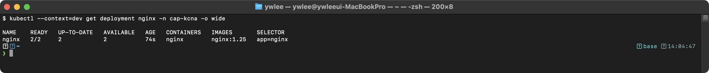
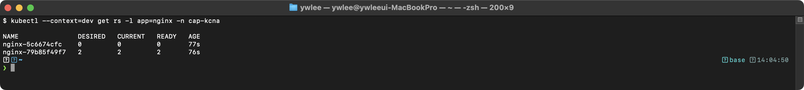
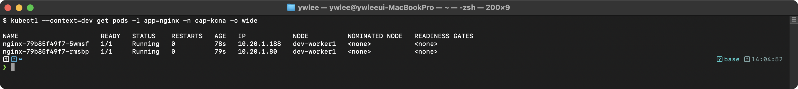
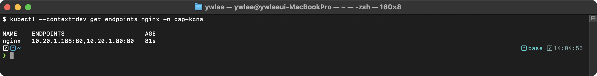

# KCNA Day 3: 핵심 오브젝트 Part 1 - Pod, Deployment, Service, DaemonSet, StatefulSet, Job/CronJob

> 학습 목표: K8s 핵심 워크로드 리소스(Pod, Deployment, Service, DaemonSet, StatefulSet, Job, CronJob)를 완벽히 이해한다.
> 예상 소요 시간: 60분 (개념 40분 + YAML 분석 20분)
> 시험 도메인: Kubernetes Fundamentals (46%) - Part 3
> 난이도: ★★★★★ (KCNA 시험의 핵심 중 핵심)

---

## 오늘의 학습 목표

- Pod, Deployment, Service의 관계를 완벽히 설명할 수 있다
- DaemonSet, StatefulSet, Job, CronJob의 차이와 사용 사례를 이해한다
- 각 오브젝트의 YAML 구조를 읽고 필드의 의미를 설명할 수 있다
- 배포 전략(RollingUpdate vs Recreate)의 차이를 이해한다

> **Day 2 연결**: 이 문서는 Day 2(K8s 아키텍처 및 컴포넌트)에서 다룬 kube-apiserver, kubelet, etcd 개념을 전제한다. Pod가 kube-scheduler에 의해 노드에 배치되고 kubelet이 실행하는 흐름을 이미 이해한 상태에서 읽는다. Day 2의 컨트롤 플레인이 "클러스터를 원하는 상태로 유지하는 두뇌"라면, Day 3의 워크로드 오브젝트는 "그 두뇌가 실제로 조율하는 대상"이다.

---

## 1. Kubernetes 오브젝트 개요

### 1.0 등장 배경

컨테이너 하나를 실행하는 것은 `docker run` 한 줄이면 된다. 그러나 프로덕션 환경에서는 단일 컨테이너가 아니라 수십~수백 개의 서로 연관된 컨테이너를 조율해야 한다. 기존 Docker Compose는 단일 호스트에서만 동작했고, 장애 자동 복구, 스케일링, 롤백 등의 기능이 없었다. Kubernetes는 이를 해결하기 위해 모든 인프라 구성요소를 선언적 오브젝트(Object)로 추상화했다. 사용자는 YAML로 원하는 상태를 선언하고, Controller가 현재 상태를 자동으로 수렴시키는 구조이다. 이 추상화 덕분에 Pod, Deployment, Service, PV 등 다양한 리소스를 일관된 방식(kubectl apply -f)으로 관리할 수 있다.

### 1.1 오브젝트란 무엇인가?

> **Kubernetes 오브젝트**란?
> 클러스터의 **원하는 상태(Desired State)**를 표현하는 영구 엔티티(entity)이다. 오브젝트를 생성하면 K8s 시스템이 해당 오브젝트가 존재하도록 지속적으로 작업한다.

모든 K8s 오브젝트는 두 가지 핵심 정보를 포함한다:

- **spec (원하는 상태)**: 사용자가 기술하는 "이렇게 되었으면 좋겠다"
- **status (현재 상태)**: K8s 시스템이 관리하는 "현재 이렇다"

### 1.2 오브젝트 분류

```
Kubernetes 오브젝트 분류
============================================================

워크로드 리소스 (앱 실행)
├── Pod              - 가장 작은 배포 단위
├── Deployment       - 상태 비저장(Stateless) 앱 관리
├── ReplicaSet       - Pod 복제본 관리 (보통 직접 사용 안 함)
├── StatefulSet      - 상태 유지(Stateful) 앱 관리
├── DaemonSet        - 모든 노드에 Pod 하나씩
├── Job              - 일회성 작업
└── CronJob          - 주기적 작업

서비스/네트워킹 리소스
├── Service          - 안정적 네트워크 엔드포인트
├── Ingress          - HTTP/HTTPS 라우팅
├── NetworkPolicy    - 네트워크 접근 제어
└── Endpoints        - Service와 Pod IP 매핑

설정/스토리지 리소스
├── ConfigMap        - 비기밀 설정 데이터
├── Secret           - 민감한 데이터 (비밀번호 등)
├── PersistentVolume (PV)        - 클러스터 수준 스토리지
├── PersistentVolumeClaim (PVC)  - PV 요청
└── StorageClass     - 동적 PV 프로비저닝 정의

클러스터 리소스
├── Namespace        - 가상 클러스터 분리
├── Node             - 워커 노드
├── ServiceAccount   - Pod의 API 인증 계정
├── Role / ClusterRole           - 권한 정의
├── RoleBinding / ClusterRoleBinding  - 권한 바인딩
└── ResourceQuota    - 네임스페이스 리소스 제한
```

### 1.3 워크로드 리소스 계층 구조

```
Deployment (배포 관리)
  |
  +---> ReplicaSet (복제본 관리, Deployment가 자동 생성)
          |
          +---> Pod (가장 작은 단위)
                  |
                  +---> Container(s) (실제 실행되는 프로세스)
                  |
                  +---> Volume(s) (데이터 저장 공간, 선택)

각 리소스의 제어 관계:
- Deployment = 상위 컨트롤러 (롤링 업데이트/롤백 전략 관리, ReplicaSet 생명주기 제어)
- ReplicaSet = 중간 컨트롤러 (Desired replicas 수 유지, Pod 생성/삭제 수행)
- Pod = 최소 스케줄링 단위 (공유 네트워크/볼륨을 가진 컨테이너 그룹)
- Container = 실행 프로세스 (Linux namespace/cgroups로 격리된 프로세스)
```

---

## 2. Pod - 가장 작은 배포 단위

### 2.0 등장 배경

컨테이너 오케스트레이션 초기에는 컨테이너를 개별 단위로 스케줄링했다. 그러나 실제 운영 환경에서는 하나의 서비스가 **여러 컨테이너의 긴밀한 협력**으로 동작한다. 예를 들어 nginx 웹 서버와 Fluentd 로그 수집기를 별개 컨테이너로 스케줄링하면, 두 컨테이너가 서로 다른 노드에 배치될 수 있어 `/var/log/nginx` 디렉터리를 공유할 방법이 없다. 또한 컨테이너 간 localhost 통신이 불가능해 nginx가 로컬 소켓으로 Fluentd에 직접 로그를 전달하는 사이드카(Sidecar) 패턴을 구현할 수 없었다. 더 나아가 두 컨테이너의 네트워크 인터페이스가 다르면 포트 바인딩 충돌을 감지하거나 방지할 수단도 없었다.

Pod는 이 문제를 해결하기 위해 **"함께 배포해야 하는 컨테이너 묶음"을 하나의 스케줄링 단위**로 추상화한다. Pod 내 컨테이너는 동일한 Linux Network Namespace와 IPC Namespace를 공유하므로 localhost로 상호 통신하고 볼륨을 공유할 수 있다. 스케줄러는 Pod 단위로 노드를 결정하므로 사이드카 컨테이너는 항상 메인 컨테이너와 같은 노드에 배치된다는 것이 보장된다.

**트레이드오프**: Pod는 원자적 단위이므로 Pod 내 컨테이너 일부만 스케일 아웃하거나 다른 노드로 이동하는 것이 불가능하다. 서로 다른 스케일링 요건을 가진 컨테이너를 같은 Pod에 묶으면 리소스 낭비가 발생한다. 따라서 Pod에 묶는 컨테이너는 "반드시 함께 실행되어야 하고, 동일한 수명 주기를 공유하는" 경우로 제한해야 한다.

### 2.1 Pod 개념

> **Pod(파드)**란?
> Kubernetes에서 생성, 스케줄링, 관리할 수 있는 **가장 작은 배포 단위**이다. 하나 이상의 컨테이너를 포함하며, 같은 Pod 내 컨테이너는 네트워크와 스토리지를 공유한다.

```
Pod 내부 구조
============================================================

+------------------------------------------+
|              Pod (고유 IP: 10.244.1.5)    |
|                                          |
|  +---------------+  +---------------+    |
|  | Container 1   |  | Container 2   |    |
|  | (nginx)       |  | (log-agent)   |    |
|  | Port: 80      |  | Port: 9090    |    |
|  +-------+-------+  +-------+-------+    |
|          |                   |            |
|          +---localhost-------+            |
|          (같은 네트워크 네임스페이스 공유)   |
|                                          |
|  +------------------------------------+  |
|  |         Shared Volume              |  |
|  |     (두 컨테이너가 공유하는 저장소)   |  |
|  +------------------------------------+  |
+------------------------------------------+

핵심 포인트:
- Pod 내 컨테이너는 같은 IP를 공유한다
- 컨테이너 간 localhost로 통신 가능하다
- 볼륨을 공유하여 파일을 교환할 수 있다
- 각 컨테이너는 서로 다른 포트를 사용해야 한다
```

> **기술 원리:** Pod 내 컨테이너들은 동일한 Linux Network Namespace를 공유하므로 같은 IP 주소를 갖고 localhost(127.0.0.1)로 상호 통신할 수 있다. 또한 공유 Volume을 통해 파일시스템 레벨의 데이터 교환이 가능하다. 단, 같은 Network Namespace 내에서 동일 포트 바인딩은 불가하므로 각 컨테이너는 서로 다른 포트를 사용해야 한다.

### 2.2 Pod YAML 상세 분석

```yaml
# Pod 매니페스트 상세 분석
apiVersion: v1                 # API 버전
kind: Pod                      # 리소스 종류: Pod
metadata:                      # 메타데이터 섹션
  name: web-server             # Pod의 고유 이름 (네임스페이스 내 유일)
  namespace: default           # 소속 네임스페이스 (생략 시 default)
  labels:                      # 라벨: 오브젝트 식별 및 선택에 사용
    app: web                   # key=app, value=web
    environment: dev           # key=environment, value=dev
spec:                          # 원하는 상태(Desired State) 기술
  containers:
  - name: nginx                # 컨테이너 이름 (Pod 내 유일)
    image: nginx:1.25          # 컨테이너 이미지
    ports:
    - containerPort: 80        # 컨테이너가 수신하는 포트
    env:
    - name: APP_ENV            # 환경 변수 이름
      value: "production"      # 직접 값 지정
    resources:
      requests:                # 최소 보장 리소스 (스케줄링 기준)
        cpu: "100m"            # 100밀리코어 = 0.1 CPU 코어
        memory: "128Mi"        # 128 메비바이트
      limits:                  # 최대 사용 가능 리소스
        cpu: "500m"            # 500밀리코어 = 0.5 CPU 코어
        memory: "256Mi"        # 256 메비바이트
    livenessProbe:
      httpGet:
        path: /healthz
        port: 80
      initialDelaySeconds: 10
      periodSeconds: 10
    readinessProbe:
      httpGet:
        path: /ready
        port: 80
      initialDelaySeconds: 5
      periodSeconds: 5
  initContainers:
  - name: init-db-check        # 앱 컨테이너 시작 전 실행
    image: busybox:1.36
    command: ['sh', '-c', 'until nc -z db-service 5432; do echo waiting for db; sleep 2; done']
  restartPolicy: Always        # 재시작 정책: Always(기본), OnFailure, Never
```

> **리소스 단위 설명:**
> - CPU: `1` = 1코어, `100m` = 0.1코어 (m = 밀리코어, 1000m = 1코어)
> - 메모리: `128Mi` = 128 메비바이트 (Mi = 2^20 바이트), `1Gi` = 1 기비바이트
> - requests: 스케줄러가 노드를 선택할 때 사용하는 최소 보장 리소스
> - limits: 이 값을 초과하면 CPU는 쓰로틀링, 메모리는 OOMKill

> **livenessProbe vs readinessProbe 핵심 차이:**
> - **livenessProbe**: 실패 시 kubelet이 컨테이너를 **재시작**한다. "앱이 살아있는가?"를 확인한다. 데드락(deadlock)에 빠진 프로세스처럼 응답은 없지만 죽지 않은 상태를 복구하는 데 사용한다.
> - **readinessProbe**: 실패 시 해당 Pod를 Service의 **Endpoints에서 제거**한다(컨테이너는 재시작하지 않음). 트래픽이 차단될 뿐이다. DB 연결 완료, 캐시 워밍업처럼 "트래픽을 받을 준비가 됐는가?"를 확인한다. readinessProbe가 다시 성공하면 Endpoints에 자동으로 재등록된다.

### 2.3 Pod 생명주기 상태 (Phase)

```
Pod 생명주기
============================================================

  +----------+     +----------+     +-----------+
  | Pending  |---->| Running  |---->| Succeeded |
  +----------+     +----+-----+     +-----------+
       |                |
       |                +---------->+-----------+
       |                            |  Failed   |
       +--------------------------->+-----------+
       |
       +--------------------------->+-----------+
                                    |  Unknown  |
                                    +-----------+
```

| Phase | 설명 | 원인 예시 |
|-------|------|----------|
| **Pending** | 스케줄링 대기 또는 이미지 다운로드 중 | 리소스 부족, 이미지 pull 중 |
| **Running** | 최소 하나의 컨테이너가 실행 중 | 정상 동작 |
| **Succeeded** | 모든 컨테이너가 성공적으로 종료 (종료 코드 0) | Job 완료 |
| **Failed** | 하나 이상의 컨테이너가 실패로 종료 (종료 코드 != 0) | 앱 크래시 |
| **Unknown** | 노드와 통신 불가로 상태 확인 불가 | 네트워크 단절, 노드 장애 |

### 2.4 멀티컨테이너 Pod 패턴 (시험 빈출!)

> 하나의 Pod에 여러 컨테이너를 넣는 이유는? **밀접하게 관련된 작업을 함께 수행**하기 위해서이다.

```
멀티컨테이너 패턴 비교
============================================================

1. Sidecar 패턴 (가장 일반적)
역할: 메인 앱을 보조하는 부가 기능 제공
예시: 로그 수집기, 모니터링 에이전트, Istio 프록시

2. Ambassador 패턴
역할: 메인 앱의 네트워크 연결을 대리(proxy)
예시: DB 프록시, API 게이트웨이 프록시

3. Adapter 패턴
역할: 메인 앱의 출력을 표준 형식으로 변환
예시: 로그 형식 변환, 메트릭 형식 변환
```

각 패턴의 구체적인 구현 방식은 다음과 같다.

**Sidecar 패턴 YAML 예시** — 앱과 로그 수집기가 공유 볼륨으로 로그를 교환한다:

```yaml
apiVersion: v1
kind: Pod
metadata:
  name: app-with-sidecar
spec:
  containers:
  - name: app                      # 메인 앱 컨테이너
    image: nginx:1.25
    ports:
    - containerPort: 80
    volumeMounts:
    - name: shared-logs
      mountPath: /var/log/nginx    # 앱이 이 경로에 로그 기록
  - name: log-agent                # Sidecar: 로그 수집기
    image: busybox:1.36
    command: ['sh', '-c', 'tail -f /logs/access.log']
    volumeMounts:
    - name: shared-logs
      mountPath: /logs             # 같은 볼륨을 다른 경로로 마운트
  volumes:
  - name: shared-logs
    emptyDir: {}                   # Pod 생애 동안 유지되는 임시 볼륨
```

두 컨테이너는 같은 `shared-logs` 볼륨을 공유하므로 앱이 쓴 로그를 log-agent가 읽을 수 있다. 네트워크는 localhost로 공유되므로 log-agent가 80포트로 앱에 직접 접근하는 것도 가능하다.

**Ambassador 패턴 YAML 예시** — 앱이 localhost로 DB에 연결하면 프록시가 실제 DB로 중계한다:

```yaml
apiVersion: v1
kind: Pod
metadata:
  name: app-with-ambassador
spec:
  containers:
  - name: app
    image: my-app:1.0
    env:
    - name: DB_HOST
      value: "localhost"           # 앱은 항상 localhost로 DB에 접속
    - name: DB_PORT
      value: "5432"
  - name: db-proxy                 # Ambassador: 실제 DB 연결을 대리
    image: haproxy:2.8
    ports:
    - containerPort: 5432          # 같은 네트워크 네임스페이스 내 포트 수신
```

앱은 DB 위치를 모르고 항상 `localhost:5432`로 연결한다. 프록시가 환경(개발/스테이징/프로덕션)에 따라 실제 DB 주소를 결정한다. 앱 코드 변경 없이 DB 엔드포인트를 교체할 수 있다.

**Adapter 패턴 YAML 예시** — 앱의 고유 형식 메트릭을 Prometheus 형식으로 변환한다:

```yaml
apiVersion: v1
kind: Pod
metadata:
  name: app-with-adapter
spec:
  containers:
  - name: legacy-app               # 독자적인 메트릭 형식을 가진 레거시 앱
    image: legacy-app:2.0
    ports:
    - containerPort: 8080          # /metrics 엔드포인트가 독자 형식 반환
  - name: metrics-adapter          # Adapter: 형식 변환
    image: prometheus-adapter:1.0
    ports:
    - containerPort: 9090          # Prometheus가 여기서 표준 형식으로 수집
    env:
    - name: SOURCE_URL
      value: "http://localhost:8080/metrics"
```

### 2.5 Init Container (초기화 컨테이너)

> **Init Container**란?
> 앱 컨테이너가 시작되기 **전에** 순차적으로 실행되는 특수 컨테이너이다. 모든 Init Container가 성공적으로 완료되어야 앱 컨테이너가 시작된다.

```yaml
# Init Container 사용 예제
apiVersion: v1
kind: Pod
metadata:
  name: app-with-init
spec:
  initContainers:
  - name: wait-for-db
    image: busybox:1.36
    command: ['sh', '-c', 'until nc -z postgres-svc 5432; do echo "Waiting for DB..."; sleep 2; done']
  - name: download-config
    image: busybox:1.36
    command: ['wget', '-O', '/config/app.conf', 'http://config-server/app.conf']
    volumeMounts:
    - name: config
      mountPath: /config
  containers:
  - name: app
    image: my-app:1.0
    volumeMounts:
    - name: config
      mountPath: /config
  volumes:
  - name: config
    emptyDir: {}
```

---

## 3. Deployment - 상태 비저장 앱 관리

### 3.1 Deployment 개념

**ReplicaSet의 한계와 Deployment의 등장**: ReplicaSet만 사용하면 이미지 버전을 바꿀 때 기존 Pod를 직접 삭제하고 새 이미지로 재생성해야 했으며, 이전 버전으로 되돌리려면 이전 버전의 ReplicaSet YAML을 별도로 보관하고 수동으로 재적용해야 했다. Deployment는 ReplicaSet의 라이프사이클 자체를 관리하여 RollingUpdate와 `rollout undo`를 선언적으로 제공한다. 즉 Deployment는 "어떤 이미지 버전으로, 몇 개를, 어떤 전략으로 배포하는가"를 기술하면 그 아래 ReplicaSet과 Pod는 자동으로 조율된다.

> **Deployment**란?
> **상태 비저장(Stateless) 애플리케이션**을 배포하고 관리하는 가장 일반적인 K8s 리소스이다. 내부적으로 ReplicaSet을 생성하여 Pod 복제본 수를 관리하며, 롤링 업데이트와 롤백 기능을 제공한다.

### 3.2 Deployment YAML 상세 분석

```yaml
apiVersion: apps/v1            # API 그룹: apps, 버전: v1
kind: Deployment               # 리소스 종류: Deployment
metadata:
  name: nginx-web              # Deployment 이름
  namespace: demo
spec:
  replicas: 3                  # 항상 3개의 Pod를 유지
  selector:                    # 이 Deployment가 관리할 Pod를 선택하는 기준
    matchLabels:
      app: nginx-web           # 반드시 template.metadata.labels와 일치해야 함!
  strategy:
    type: RollingUpdate        # 전략 유형: RollingUpdate (기본) 또는 Recreate
    rollingUpdate:
      maxSurge: 1              # 업데이트 중 추가로 생성할 수 있는 최대 Pod 수
      maxUnavailable: 0        # 업데이트 중 사용 불가능한 최대 Pod 수
  revisionHistoryLimit: 10     # 롤백을 위해 보관할 ReplicaSet 수 (기본 10)
  template:                    # Pod 정의
    metadata:
      labels:
        app: nginx-web         # 반드시 selector.matchLabels와 일치!
    spec:
      containers:
      - name: nginx
        image: nginx:1.25.3
        ports:
        - containerPort: 80
        resources:
          requests:
            cpu: 50m
            memory: 64Mi
          limits:
            cpu: 200m
            memory: 128Mi
```

### 3.2.5 RollingUpdate 메커니즘 — maxSurge와 maxUnavailable

§3.2의 YAML에는 `maxSurge: 1`과 `maxUnavailable: 0`이 나온다. 이 두 값이 어떤 원리로 무중단 업데이트를 제어하는지 먼저 이해해야 §3.3의 다이어그램이 의미를 갖는다.

RollingUpdate는 **기존 Pod를 한꺼번에 교체하지 않고, 새 버전 Pod를 점진적으로 추가하면서 기존 버전을 순차적으로 제거**하는 방식이다. 이 과정에서 두 가지 제약을 동시에 만족해야 한다.

| 파라미터 | 의미 | replicas=3, 값=1일 때 |
|---------|------|----------------------|
| `maxSurge` | replicas를 초과해 동시에 존재할 수 있는 최대 Pod 추가 수 | 최대 4개(3+1)까지 허용 |
| `maxUnavailable` | 업데이트 중 서비스 불가능한 최대 Pod 수 | 0이면 항상 최소 3개가 Ready 상태여야 함 |

`maxUnavailable: 0`이면 K8s는 새 Pod가 Ready 상태로 확인될 때까지 기존 Pod를 제거하지 않는다. 새 Pod가 실패하면 롤아웃이 멈추고 이전 버전이 계속 트래픽을 처리한다. 이것이 무중단(zero-downtime) 배포의 핵심 보장이다.

`maxSurge: 0, maxUnavailable: 1`로 설정하면 Pod 수를 replicas 이상으로 늘리지 않고 기존 Pod를 먼저 제거 후 교체한다. 리소스 여유가 없을 때 사용하지만 짧은 용량 감소가 발생한다.

### 3.3 배포 전략 비교

```
RollingUpdate vs Recreate
============================================================

RollingUpdate (기본값) - 무중단 배포
---------------------------------------------
시작:  [v1] [v1] [v1]          ← 3개 Pod v1
단계1: [v1] [v1] [v1] [v2]    ← v2 1개 추가 (maxSurge=1)
단계2: [v1] [v1] [v2] [v2]    ← v1 1개 제거, v2 1개 추가
단계3: [v1] [v2] [v2] [v2]    ← v1 1개 제거, v2 1개 추가
단계4: [v2] [v2] [v2]         ← 완료! 다운타임 없음

Recreate - 일시적 다운타임 발생
---------------------------------------------
시작:  [v1] [v1] [v1]          ← 3개 Pod v1
단계1: [ ] [ ] [ ]              ← 모든 v1 삭제 (다운타임!)
단계2: [v2] [v2] [v2]          ← 3개 Pod v2 생성

언제 Recreate를 사용하는가?
- 두 버전이 동시에 실행되면 안 되는 경우 (DB 스키마 변경 등)
- 리소스 제약이 심해 추가 Pod를 만들 수 없는 경우
```

### 3.4 롤백 동작 원리

```
Deployment 롤백 원리 (ReplicaSet 보관)
============================================================

초기 배포 (nginx:1.24):
  Deployment → ReplicaSet-A (replicas: 3) → Pod-1, Pod-2, Pod-3

업데이트 (nginx:1.25):
  Deployment → ReplicaSet-A (replicas: 0, 보관)  ← 이전 버전
             → ReplicaSet-B (replicas: 3) → Pod-4, Pod-5, Pod-6  ← 현재

롤백 실행 (kubectl rollout undo):
  Deployment → ReplicaSet-A (replicas: 3) → Pod-7, Pod-8, Pod-9  ← 복원!
             → ReplicaSet-B (replicas: 0, 보관)

핵심: Deployment는 이전 ReplicaSet을 삭제하지 않고 보관한다!
      revisionHistoryLimit으로 보관 수를 설정한다.
```

---

## 4. Service - 안정적인 네트워크 엔드포인트

### 4.0 등장 배경

Docker 단독 운용 시대에는 컨테이너 IP가 재시작마다 바뀌어도 크게 문제가 없었다. 단일 호스트에서 실행되는 컨테이너는 Docker 내부 브리지 네트워크를 통해 컨테이너명으로 서로를 찾을 수 있었기 때문이다(`--link` 플래그 또는 Docker Compose의 서비스명 DNS). 그러나 Kubernetes처럼 Pod가 여러 노드에 분산되면 상황이 달라진다. 클라이언트 Pod가 특정 백엔드 Pod의 IP(`10.244.1.5`)를 하드코딩해 직접 접근하면, 백엔드 Pod가 재시작되거나 재스케줄되어 IP가 `10.244.1.8`로 바뀌는 순간 연결이 끊긴다. Deployment가 Pod를 자동 복구하는 장점이 오히려 예측 불가능한 IP 변동을 가져오는 역설이다.

이 문제를 해결하는 핵심 메커니즘이 **kube-proxy + iptables/IPVS를 이용한 ClusterIP NAT**이다. Service가 생성되면 kube-apiserver는 etcd에 안정적인 가상 IP(ClusterIP, 예: `10.97.30.40`)를 할당한다. kube-proxy(각 노드에서 실행)는 이 ClusterIP로 향하는 트래픽을 iptables NAT 규칙(또는 IPVS 가상 서버 규칙)으로 가로채 실제 Pod IP로 DNAT(목적지 주소 변환)한다. 클라이언트는 ClusterIP라는 단일 안정 주소만 알면 되고, 뒷단 Pod가 바뀌어도 kube-proxy가 자동으로 iptables 규칙을 갱신해 올바른 Pod로 트래픽을 전달한다.

**트레이드오프**: iptables 규칙 기반 구현은 Pod 수가 수천 개를 넘으면 규칙 수가 선형 증가해 매 패킷마다 순차 검색하는 비용이 커진다. 이를 개선하기 위해 IPVS 모드(해시 테이블 O(1) 조회)와 Cilium 같은 eBPF 기반 kube-proxy 대체재가 등장했다. 이 내용은 Day 8 네트워킹 심화에서 다룬다.

### 4.1 Label과 Selector — Service가 Pod를 찾는 원리

Service가 Pod를 선택하는 방식을 이해하지 못하면, ClusterIP나 Endpoints가 왜 비어 있는지 디버깅할 수 없다. 먼저 이 핵심 메커니즘을 정리한다.

**Pod는 `metadata.labels`로 라벨(key=value 쌍)을 붙인다.** 라벨은 단순한 태그이며, 오브젝트의 동작 자체를 바꾸지 않는다.

```yaml
# Pod 라벨 예시
metadata:
  labels:
    app: backend   # key=app, value=backend
    tier: api      # key=tier, value=api
```

**Service는 `spec.selector` 필드로 라벨 조건을 지정한다.** K8s는 해당 조건을 만족하는 Pod를 찾아 Endpoints 오브젝트에 자동으로 등록한다.

```yaml
# Service selector 예시
spec:
  selector:
    app: backend   # 이 key=value 쌍이 Pod labels와 정확히 일치해야 한다
```

이 일치는 **정확(exact match)해야 한다.** `app: backend`와 `app: Backend`는 다른 라벨이다. Pod 라벨이 추가되거나 제거되면 Endpoints도 즉시(수초 내) 갱신된다. Deployment의 `selector.matchLabels`도 같은 원리로 자신이 관리할 Pod를 결정한다.

> 트러블슈팅 핵심: Endpoints가 `<none>`이면 가장 먼저 Service selector와 Pod labels의 불일치를 확인한다.

### 4.2 Service가 필요한 이유

> **Service**란?
> Pod 집합에 대한 **안정적인 네트워크 엔드포인트(IP와 DNS)**를 제공하는 리소스이다. Pod는 재시작될 때마다 IP가 변하지만, Service의 IP(ClusterIP)는 변하지 않는다.

예를 들어 nginx Pod의 IP가 `10.244.1.5`인 상태에서 프론트엔드 Pod가 이 IP를 하드코딩해 요청을 보내다가, nginx Pod가 노드 장애로 재스케줄되어 `10.244.1.8`이 되면 프론트엔드는 즉시 연결 실패(Connection refused)를 겪는다. Deployment가 자동으로 Pod를 복구해 주더라도 IP가 바뀌었으므로 클라이언트 쪽에서는 구 IP로 접근을 계속 시도한다. Service의 ClusterIP는 오브젝트가 삭제되기 전까지 변하지 않으며, kube-proxy가 ClusterIP를 현재 Ready 상태인 Pod IP로 자동 매핑하므로 클라이언트는 ClusterIP만 알면 된다.

### 4.3 Service 유형별 YAML과 동작

```yaml
# 1. ClusterIP Service (기본값) - 클러스터 내부만 접근 가능
apiVersion: v1
kind: Service
metadata:
  name: backend-svc
spec:
  type: ClusterIP
  selector:
    app: backend
  ports:
  - port: 80
    targetPort: 8080

---
# 2. NodePort Service - 외부에서 노드IP:포트로 접근 가능
apiVersion: v1
kind: Service
metadata:
  name: nginx-web
spec:
  type: NodePort
  selector:
    app: nginx-web
  ports:
  - port: 80
    targetPort: 80
    nodePort: 30080            # 외부 접근 포트 (30000-32767 범위)

---
# 3. LoadBalancer Service - 클라우드 LB를 자동 생성
apiVersion: v1
kind: Service
metadata:
  name: web-public
spec:
  type: LoadBalancer
  selector:
    app: web
  ports:
  - port: 443
    targetPort: 8443

---
# 4. ExternalName Service - 외부 서비스를 CNAME으로 매핑
apiVersion: v1
kind: Service
metadata:
  name: external-db
spec:
  type: ExternalName
  externalName: database.example.com

---
# 5. Headless Service - 개별 Pod DNS 제공 (StatefulSet용)
apiVersion: v1
kind: Service
metadata:
  name: mysql-headless
spec:
  clusterIP: None              # 핵심! ClusterIP를 할당하지 않음
  selector:
    app: mysql
  ports:
  - port: 3306
    targetPort: 3306
```

### 4.4 Service 유형 비교표

| 유형 | 접근 범위 | 포트 범위 | 사용 시나리오 |
|------|----------|----------|-------------|
| **ClusterIP** (기본) | 클러스터 내부만 | 1-65535 | 내부 서비스 간 통신 |
| **NodePort** | 외부 (노드IP:포트) | 30000-32767 | 개발/테스트 |
| **LoadBalancer** | 외부 (LB IP) | 1-65535 | 프로덕션 외부 노출 |
| **ExternalName** | CNAME 리다이렉션 | - | 외부 서비스 매핑 |
| **Headless** | 개별 Pod DNS | - | StatefulSet |

### 4.5 Service DNS 체계

`<서비스명>.<네임스페이스>.svc.cluster.local`이라는 긴 형식을 처음 보면 "왜 이렇게 긴가?"라는 의문이 생긴다. 이 도메인은 클러스터 내부 CoreDNS(K8s의 기본 DNS 서버, `kube-system` 네임스페이스에서 실행)가 관리하는 **클러스터 전용 내부 도메인**이다. 인터넷의 공개 DNS에는 등록되지 않으며, 클러스터 외부에서는 해석되지 않는다.

`svc.cluster.local`은 K8s Service 오브젝트임을 나타내는 고정 접미사이다. 네임스페이스가 포함되어 있어 이름이 같아도 네임스페이스가 다른 Service를 구별할 수 있다. **실제 접근 시에는 단축형을 사용해도 된다**: 같은 네임스페이스 내에서는 서비스명(`nginx-web`)만으로 충분하고, 다른 네임스페이스에서는 `nginx-web.demo`처럼 서비스명+네임스페이스 형식으로 단축 가능하다. 명시적 FQDN은 네임스페이스에 관계없이 항상 동작한다.

```
Service DNS 형식
============================================================

전체 FQDN: <서비스명>.<네임스페이스>.svc.cluster.local

예시: nginx-web.demo.svc.cluster.local

단축 형태 (같은 네임스페이스 내): nginx-web
단축 형태 (다른 네임스페이스): nginx-web.demo

Headless Service의 Pod DNS:
<Pod명>.<서비스명>.<네임스페이스>.svc.cluster.local
예: mysql-0.mysql-headless.database.svc.cluster.local
```

---

## 5. DaemonSet - 모든 노드에 하나씩

### 5.0 등장 배경

DaemonSet 이전에는 모든 노드에 로그 에이전트나 모니터링 에이전트를 배포하려면 Ansible·Chef 같은 구성 관리 도구로 각 노드에 직접 systemd unit 파일을 설치하거나, Static Pod 매니페스트를 모든 노드의 `/etc/kubernetes/manifests/`에 수동으로 복사해야 했다. 이 방식의 근본적인 한계는 **자동화의 부재**다. 클러스터에 새 노드가 추가되면 관리자가 직접 그 노드에 접속해 에이전트를 설치해야 했고, 그 시간 동안 해당 노드의 로그와 메트릭이 수집되지 않는 모니터링 공백이 발생했다.

DaemonSet은 이 문제를 Kubernetes Controller 루프로 해결한다. kube-controller-manager의 DaemonSet 컨트롤러가 클러스터의 노드 목록을 지속적으로 감시하다가, 새 노드가 추가되면 자동으로 해당 노드에 Pod를 생성한다. 노드가 제거되면 Pod도 자동 정리된다. 관리자의 수동 개입 없이 "항상 모든 노드에 에이전트가 실행된다"는 불변조건이 유지된다.

**트레이드오프**: 노드마다 반드시 하나씩 실행되므로 클러스터 규모가 클수록 리소스 소비가 노드 수에 비례해 선형으로 증가한다. 워커 노드 100개짜리 클러스터라면 DaemonSet 하나당 100개의 Pod가 상시 실행된다. 따라서 DaemonSet에 올리는 에이전트는 `resources.requests`를 최소화(예: CPU 50m, 메모리 100Mi)하는 것이 중요하다.

### 5.1 DaemonSet 개념

> **DaemonSet**이란?
> 모든(또는 특정) 노드에 **Pod를 정확히 하나씩** 실행하도록 보장하는 리소스이다. 새 노드가 추가되면 자동으로 Pod가 배치되고, 노드가 제거되면 Pod가 삭제된다.

### 5.2 DaemonSet YAML 예제

K8s의 control-plane 노드에는 기본적으로 `node-role.kubernetes.io/control-plane:NoSchedule`이라는 **taint(오염 표시)**가 설정되어 있다. Taint는 "이 노드에 일반 Pod를 올리지 말라"는 표시이다. DaemonSet도 기본적으로는 이 taint가 있는 노드를 건너뛴다.

그러나 Fluentd 같은 시스템 에이전트는 **모든 노드**의 로그를 수집해야 하므로 control-plane 노드도 포함되어야 한다. `tolerations` 필드는 특정 taint를 무시하고 해당 노드에도 Pod를 배치하도록 허용한다(tolerate = 참아낸다, 즉 taint를 극복한다). 이 설정이 없으면 DaemonSet Pod가 control-plane 노드에 생성되지 않아 그 노드의 로그가 수집되지 않는다.

```yaml
apiVersion: apps/v1
kind: DaemonSet                # Deployment가 아닌 DaemonSet
metadata:
  name: fluentd-agent
  namespace: kube-system
spec:
  selector:
    matchLabels:
      app: fluentd
  template:
    metadata:
      labels:
        app: fluentd
    spec:
      tolerations:
      - key: node-role.kubernetes.io/control-plane
        effect: NoSchedule       # Control Plane 노드에도 배치 허용
      containers:
      - name: fluentd
        image: fluent/fluentd:v1.16
        resources:
          requests:
            cpu: 50m
            memory: 100Mi
        volumeMounts:
        - name: varlog
          mountPath: /var/log
      volumes:
      - name: varlog
        hostPath:
          path: /var/log
  # DaemonSet은 replicas 필드가 없다! (노드 수만큼 자동)
```

**DaemonSet 사용 사례:**
- **로그 수집**: Fluentd, Fluent Bit, Filebeat
- **모니터링**: Prometheus Node Exporter, Datadog Agent
- **네트워크**: Cilium, Calico, kube-proxy
- **스토리지**: Ceph, GlusterFS 에이전트

#### Taint/Toleration 기본 구조

위 YAML의 `tolerations` 필드를 처음 보면 낯설 수 있다. Taint(오염 표시)와 Toleration(내성)의 기본 구조를 간단히 정리한다.

**Taint**는 노드에 붙이는 표시다(`kubectl taint nodes <노드명> key=value:effect`). effect에는 세 가지가 있다:
- `NoSchedule`: taint를 견디지 못하는 Pod는 이 노드에 스케줄되지 않는다(기존 Pod는 유지).
- `PreferNoSchedule`: 가능하면 피하지만 다른 노드가 없으면 스케줄된다(소프트 제약).
- `NoExecute`: 새 Pod 스케줄 차단 + 이미 실행 중인 Pod도 퇴출(evict)한다.

**Toleration**은 Pod가 특정 Taint를 무시하도록 허용하는 설정이다. `operator: Exists`는 `value` 없이 `key`만 일치하면 통과한다. `operator: Equal`(기본)은 `key`와 `value` 모두 일치해야 한다. Taint/Toleration의 스케줄링 심화(nodeAffinity, taints per node 전략)는 Day 6 이후 스케줄링 섹션에서 자세히 다룬다.

---

## 6. StatefulSet - 상태 유지 앱 관리

### 6.0 등장 배경 — Stateless vs Stateful

"Deployment로 DB를 배포하면 안 되나?"라는 질문이 StatefulSet의 필요성을 이해하는 출발점이다.

**Deployment의 Pod는 동일하고 교체 가능하다(interchangeable).** 웹 서버 3개 중 하나가 죽으면 같은 이미지로 새 Pod를 만들어 대체하면 된다. Pod 이름이 `nginx-abc123`에서 `nginx-xyz789`로 바뀌어도 아무 문제 없다. 상태(데이터)가 없기 때문이다.

**그러나 MySQL 클러스터는 다르다.** MySQL Group Replication에서 각 노드는 `mysql-0`(primary), `mysql-1`(replica), `mysql-2`(replica)처럼 **고유한 역할과 이름**을 갖는다. `mysql-1`이 `mysql-abc`로 이름이 바뀌거나 Pod가 재생성될 때 다른 PV(디스크)에 연결되면, 리플리케이션 설정이 깨지고 데이터 불일치가 발생한다.

Stateful 애플리케이션은 **3가지 고유성**을 요구한다:
1. **고유한 네트워크 ID**: 재시작해도 동일한 DNS 이름(`mysql-0.mysql-headless.database.svc.cluster.local`)
2. **고유한 영구 스토리지**: 각 Pod가 자신만의 PV에 연결 (재생성해도 같은 데이터)
3. **순서 보장**: `mysql-0`이 Ready가 된 후에야 `mysql-1` 시작 (Primary 먼저 기동)

Deployment는 이 세 조건을 모두 만족시키지 못한다. StatefulSet은 이를 해결하기 위해 K8s 1.5(2016년)에 안정화됐다.

**트레이드오프**: 고유성 보장 때문에 Pod 생성/삭제가 순차적이다. 스케일 업/다운이 Deployment보다 느리며, 삭제 시 PVC는 자동 삭제되지 않아 수동 정리가 필요하다(데이터 안전 우선).

### 6.1 StatefulSet 개념

> **StatefulSet**이란?
> 데이터베이스, 메시지 큐 같은 **상태를 유지해야 하는(Stateful) 애플리케이션**을 관리하는 리소스이다. Deployment와 달리 Pod의 이름, 네트워크 ID, 스토리지가 고유하고 안정적이다.

### 6.2 Deployment vs StatefulSet 비교

| 특성 | Deployment | StatefulSet |
|------|-----------|-------------|
| **Pod 이름** | 랜덤 (nginx-abc123) | 순서 번호 (mysql-0, mysql-1, mysql-2) |
| **네트워크 ID** | 변경 가능 | **안정적** (재시작해도 동일 DNS) |
| **스토리지** | 공유 가능 | **각 Pod마다 고유 PV** |
| **생성 순서** | 동시 | **0번부터 순차적** |
| **삭제 순서** | 동시 | **역순** (2 → 1 → 0) |
| **Headless Service** | 선택 | **필수** |
| **사용 사례** | 웹 서버, API 서버 | DB, Kafka, ZooKeeper |

### 6.3 StatefulSet YAML 예제

```yaml
apiVersion: apps/v1
kind: StatefulSet
metadata:
  name: mysql
  namespace: database
spec:
  serviceName: mysql-headless   # 필수! Headless Service 이름
  replicas: 3
  selector:
    matchLabels:
      app: mysql
  template:
    metadata:
      labels:
        app: mysql
    spec:
      containers:
      - name: mysql
        image: mysql:8.0
        ports:
        - containerPort: 3306
        volumeMounts:
        - name: mysql-data
          mountPath: /var/lib/mysql
  volumeClaimTemplates:
  - metadata:
      name: mysql-data
    spec:
      accessModes: ["ReadWriteOnce"]
      storageClassName: standard
      resources:
        requests:
          storage: 10Gi
  # 결과:
  # mysql-0 → PVC: mysql-data-mysql-0 → PV (10Gi)
  # mysql-1 → PVC: mysql-data-mysql-1 → PV (10Gi)
  # mysql-2 → PVC: mysql-data-mysql-2 → PV (10Gi)
```

---

## 7. Job & CronJob

### 7.0 등장 배경

**Deployment로 배치 작업을 실행하면 무엇이 문제인가?** Deployment의 Pod는 기본 `restartPolicy: Always`라, 작업이 완료(exit 0)되어도 kubelet이 즉시 재시작한다. DB 마이그레이션 스크립트를 Deployment로 배포하면 스크립트가 성공적으로 끝난 뒤에도 Pod가 계속 재실행되어 마이그레이션이 반복 적용되는 무한 루프에 빠진다. 심지어 멱등(idempotent)하지 않은 마이그레이션이라면 데이터를 망칠 수 있다.

**CronJob 이전의 방식**: 주기적 배치 작업은 클러스터 외부의 서버(Jenkins, cron 서버 등)에서 `cron` + `kubectl create job` 명령을 실행하는 방식으로 처리했다. 이 방식에는 세 가지 결함이 있었다. ① 클러스터 외부에 의존성이 생겨 cron 서버가 다운되면 배치도 멈춘다. ② `kubectl` 접근을 위한 kubeconfig·ServiceAccount 자격증명을 cron 서버에서 관리해야 했다. ③ Job 실패 시 재시도 로직을 직접 구현해야 했다.

**Job과 CronJob은 이 문제를 클러스터 네이티브로 해결한다.** Job은 "성공 완료(completions)를 N회 달성하면 끝"이라는 종료 조건을 갖고, 실패 시 `backoffLimit`만큼 재시도한다. CronJob은 클러스터 내부에서 스케줄을 관리하므로 외부 cron 서버 의존성이 없다.

**트레이드오프**: CronJob은 클러스터의 시계(kube-controller-manager 시간 기준)에 최대 수십 밀리초의 오차가 발생할 수 있다. `startingDeadlineSeconds`를 설정하지 않은 상태에서 컨트롤러가 100회 이상 스케줄을 놓치면 CronJob이 비활성화된다. 또한 `concurrencyPolicy`가 Forbid일 때 이전 Job이 오래 걸리면 다음 스케줄이 계속 건너뛰어지는 missed schedule 상황이 발생한다.

### 7.1 Job - 일회성 작업

> **Job**이란?
> 지정된 수의 Pod가 **성공적으로 완료될 때까지** 실행하는 리소스이다. 배치 처리, 데이터 마이그레이션 등 일회성 작업에 사용한다.

```yaml
apiVersion: batch/v1
kind: Job
metadata:
  name: db-migration
spec:
  completions: 1                # 성공 완료해야 하는 Pod 수
  parallelism: 1                # 동시 실행할 Pod 수
  backoffLimit: 3               # 최대 재시도 횟수
  activeDeadlineSeconds: 300    # 최대 실행 시간 (초)
  ttlSecondsAfterFinished: 100  # 완료 후 100초 뒤 자동 삭제
  template:
    spec:
      containers:
      - name: migration
        image: my-app/migration:1.0
        command: ["python", "migrate.py"]
      restartPolicy: Never      # Job에서는 Never 또는 OnFailure만 허용!
                                # Always는 사용 불가! (시험 빈출!)
```

**restartPolicy Never vs OnFailure 차이**: `restartPolicy: OnFailure`는 컨테이너가 실패(exit 0이 아님)했을 때 **같은 Pod를 재시작**한다(Pod 수는 늘어나지 않음). `restartPolicy: Never`는 실패 시 **새 Pod를 생성**하고 실패한 Pod는 Completed/Failed 상태로 남긴다(backoffLimit 횟수까지 반복). Never를 사용하면 Pod 수가 늘어날 수 있으므로 `ttlSecondsAfterFinished`와 함께 사용해 완료된 Pod를 자동 정리하는 것이 좋다.

### 7.2 CronJob - 주기적 작업

> **CronJob**이란?
> Unix cron과 동일한 스케줄 형식으로 **주기적으로 Job을 생성**하는 리소스이다.

```yaml
apiVersion: batch/v1
kind: CronJob
metadata:
  name: db-backup
spec:
  schedule: "0 2 * * *"         # cron 형식: 매일 02:00에 실행
  concurrencyPolicy: Forbid     # 이전 Job 실행 중이면 새 Job 건너뜀
  successfulJobsHistoryLimit: 3
  failedJobsHistoryLimit: 1
  jobTemplate:
    spec:
      template:
        spec:
          containers:
          - name: backup
            image: postgres:15
            command: ["pg_dump", "-h", "postgres-svc", "-U", "admin", "mydb"]
          restartPolicy: OnFailure
```

**Cron 스케줄 형식:**
```
┌───────── 분 (0-59)
│ ┌─────── 시 (0-23)
│ │ ┌───── 일 (1-31)
│ │ │ ┌─── 월 (1-12)
│ │ │ │ ┌─ 요일 (0-6, 일=0)
│ │ │ │ │
* * * * *

예시:
"0 2 * * *"       매일 02:00
"*/5 * * * *"     5분마다
"0 0 1 * *"       매월 1일 00:00
"0 9 * * 1-5"     평일 09:00
```

주기적으로 Job을 생성하다 보면 이전 Job이 아직 실행 중인데 새 Job의 시작 시간이 되는 **overlap(겹침)** 상황이 발생할 수 있다. 예를 들어 매 5분마다 DB 백업을 수행하는데, 한 번의 백업이 데이터가 많아 8분이 걸린다면 5분 시점에 새 Job이 시작될 때 이전 Job이 아직 실행 중이다. `concurrencyPolicy`는 이 상황을 어떻게 처리할지 결정한다.

**concurrencyPolicy 옵션:**
| 정책 | 동작 |
|------|------|
| **Allow** (기본) | 이전 Job과 동시 실행 허용 |
| **Forbid** | 이전 Job 실행 중이면 새 Job 건너뜀 |
| **Replace** | 이전 Job 취소하고 새 Job으로 대체 |

---

## tart-infra 실습

### 실습 환경 설정

```bash
# dev 클러스터 접속 (다양한 워크로드 오브젝트 확인용)
export KUBECONFIG=kubeconfig/dev.yaml

# demo 네임스페이스의 전체 리소스 확인
kubectl get all -n demo
```

### 실습 1: Pod, Deployment, Service 관계 분석

demo 네임스페이스의 `nginx-web`(저장소 demo 스택, `manifests/demo/nginx-app.yaml`)을 통해 Deployment → ReplicaSet → Pod 계층 구조와 Service 연결을 확인한다.

```bash
# Deployment 확인
kubectl get deployment -n demo nginx-web -o wide
```

검증:



```bash
# Deployment가 관리하는 ReplicaSet 확인
kubectl get replicaset -n demo -l app=nginx-web
```

검증:



```bash
# ReplicaSet이 관리하는 Pod 확인
kubectl get pods -n demo -l app=nginx-web -o wide
```

검증:



```bash
# Service와 Endpoints 매핑 확인
kubectl get svc -n demo nginx-web
kubectl get endpoints -n demo nginx-web
```

검증:



**동작 원리:** Deployment가 ReplicaSet을 생성하고, ReplicaSet이 Pod를 관리한다. Service는 Label Selector(`app=nginx-web`)로 Pod를 찾아 Endpoints에 등록한다. Pod IP가 변경되어도 Service의 ClusterIP는 고정이므로 안정적인 접근이 가능하다.

### 실습 2: DaemonSet과 StatefulSet 비교

```bash
# platform 클러스터에서 DaemonSet 확인 (모든 노드에 하나씩)
export KUBECONFIG=kubeconfig/platform.yaml
kubectl get daemonset -A

# dev 클러스터에서 StatefulSet 확인 (순서 보장, 고유 이름)
export KUBECONFIG=kubeconfig/dev.yaml
kubectl get statefulset -n demo

# StatefulSet Pod 이름 패턴 확인 (pod-0, pod-1 순서)
kubectl get pods -n demo -l app=postgresql

# 예상 출력:
# NAME             READY   STATUS    RESTARTS   AGE
# postgresql-0     1/1     Running   0          7d
```

**동작 원리:** DaemonSet은 replicas 필드 없이 모든 노드에 Pod를 하나씩 배치한다. StatefulSet은 Pod에 순서가 있는 고유 이름(pod-0, pod-1)을 부여하고, PVC도 각 Pod별로 독립 생성된다. 이것이 PostgreSQL 같은 상태 유지 앱에 StatefulSet을 사용하는 이유이다.

### 실습 3: Service 유형 비교

```bash
# ClusterIP vs NodePort 서비스 확인
kubectl get svc -n demo -o wide

# NodePort 범위(30000-32767) 확인
kubectl get svc -n demo -o custom-columns=NAME:.metadata.name,TYPE:.spec.type,CLUSTER-IP:.spec.clusterIP,PORT:.spec.ports[0].port,NODEPORT:.spec.ports[0].nodePort

# Service DNS 형식 확인 (서비스명.네임스페이스.svc.cluster.local)
kubectl run dns-test --image=busybox --rm -it --restart=Never -n demo -- nslookup nginx.demo.svc.cluster.local
```

**동작 원리:** ClusterIP는 클러스터 내부에서만 접근 가능한 가상 IP를 할당한다. NodePort는 모든 노드의 지정 포트(30000-32767)로 외부 트래픽을 받아 ClusterIP로 전달한다. DNS 조회 결과는 CoreDNS가 `<서비스명>.<네임스페이스>.svc.cluster.local` 형식으로 반환한다.

---

## 트러블슈팅

### Pod가 CrashLoopBackOff 상태일 때

```
디버깅 순서:
  1. Pod 로그 확인
     $ kubectl logs <pod-name> -n <namespace>
     $ kubectl logs <pod-name> -n <namespace> --previous  # 이전 크래시 로그
  2. Pod 이벤트 확인
     $ kubectl describe pod <pod-name> -n <namespace>
  3. 흔한 원인:
     - 앱 코드 오류 (Exit Code 1)
     - 설정 파일 누락 (ConfigMap/Secret 마운트 오류)
     - DB 연결 실패 (Init Container 미사용)
     - 메모리 부족 (OOMKilled, Exit Code 137)
     - 잘못된 command/args 지정
  4. Exit Code 해석:
     - 0: 정상 종료
     - 1: 일반 에러
     - 137: OOMKilled (128 + SIGKILL=9)
     - 143: SIGTERM (128 + SIGTERM=15)
```

### Service Endpoints가 비어 있을 때

```
증상: Service에 접근해도 응답이 없다
  $ kubectl get endpoints <svc-name> -n <namespace>
  → ENDPOINTS 컬럼이 <none>으로 표시된다

원인 분석:
  1. Service의 selector와 Pod의 labels가 불일치한다
     $ kubectl get svc <svc-name> -n <namespace> -o yaml | grep -A3 selector
     $ kubectl get pods -n <namespace> --show-labels
  2. Pod가 Ready 상태가 아니다 (Readiness Probe 실패)
  3. Pod가 존재하지 않는다

핵심: Service는 Label Selector로 Pod를 선택한다.
     라벨이 한 글자라도 다르면 연결되지 않는다.
```

---

## 복습 체크리스트

- [ ] Pod가 K8s의 가장 작은 배포 단위임을 기억한다 (Container가 아님!)
- [ ] Pod 생명주기 5가지 Phase: Pending, Running, Succeeded, Failed, Unknown
- [ ] 멀티컨테이너 Pod 패턴 3가지: Sidecar(보조), Ambassador(네트워크 대리), Adapter(출력 변환)
- [ ] Init Container: 앱 컨테이너 전에 순차 실행, 모두 성공해야 앱 시작
- [ ] Deployment → ReplicaSet → Pod 계층 구조를 이해한다
- [ ] 배포 전략: RollingUpdate(기본, 무중단) vs Recreate(다운타임)
- [ ] maxSurge와 maxUnavailable의 의미를 설명할 수 있다
- [ ] 5가지 Service 유형(ClusterIP, NodePort, LoadBalancer, ExternalName, Headless)
- [ ] NodePort 범위: 30000-32767
- [ ] Service DNS: `<서비스명>.<네임스페이스>.svc.cluster.local`
- [ ] DaemonSet = 모든 노드에 하나씩 (replicas 필드 없음)
- [ ] StatefulSet = 순서, 고유 이름, 고유 스토리지, Headless Service 필수
- [ ] Job의 restartPolicy: Never 또는 OnFailure만 (Always 불가!)
- [ ] CronJob concurrencyPolicy: Allow(기본), Forbid, Replace

---

## 직접 해보기 (시험형 미니랩)

KCNA는 객관식이지만, 손으로 직접 오브젝트를 만들어 보면 YAML 구조와 필드 관계가 훨씬 빠르게 체화된다. 아래 미니랩을 **시간을 재면서** 수행한다.

### 미니랩 A — 5분 안에 ClusterIP Service 생성

목표: `dev` 클러스터의 `demo` 네임스페이스에서 `app=nginx-web` 라벨을 가진 Pod에 대한 ClusterIP Service를 생성하고 Endpoints가 등록되는지 확인한다.

```bash
# 1. dev 클러스터 kubeconfig 설정
export KUBECONFIG=kubeconfig/dev.yaml

# 2. demo 네임스페이스의 nginx Pod 확인 (라벨 확인)
kubectl get pods -n demo --show-labels

# 3. ClusterIP Service 생성 (명령형, imperative 우선)
kubectl expose deployment nginx-web -n demo --name=nginx-lab --port=80 --target-port=80 --type=ClusterIP

# 4. Endpoints 등록 확인 (ENDPOINTS가 <none>이 아닌지 확인)
kubectl get endpoints nginx-lab -n demo

# 5. 정리
kubectl delete svc nginx-lab -n demo
```

완료 기준: `kubectl get endpoints nginx-lab -n demo` 결과의 ENDPOINTS 컬럼에 Pod IP:80이 하나 이상 등록됨.

### 미니랩 B — 5분 안에 Job 실행하고 완료 확인

목표: `dev` 클러스터에 `echo "hello"` 를 실행하는 일회성 Job을 만들고 `Completed` 상태를 확인한 뒤 정리한다.

```bash
# 1. Job 생성 (명령형, --restart=Never은 restartPolicy: Never와 동일)
kubectl create job hello-job -n demo --image=busybox -- echo "hello"

# 2. Job 상태 확인
kubectl get job hello-job -n demo

# 3. Pod 상태 확인 (Completed 상태여야 함)
kubectl get pods -n demo -l job-name=hello-job

# 4. 로그 확인
kubectl logs -n demo -l job-name=hello-job

# 5. 정리
kubectl delete job hello-job -n demo
```

완료 기준: Pod 상태가 `Completed`, Job의 `COMPLETIONS` 컬럼이 `1/1`.

---

## 자가점검

<details>
<summary>Q1: Pod, ReplicaSet, Deployment의 계층 관계를 설명하라. Deployment를 직접 삭제하면 ReplicaSet과 Pod는 어떻게 되는가?</summary>

Deployment → ReplicaSet → Pod 순서로 계층이 구성된다. Deployment는 ReplicaSet의 라이프사이클을 관리하고, ReplicaSet은 지정된 수의 Pod를 유지한다. Deployment를 삭제하면 그것이 소유(ownerReference)하는 ReplicaSet이 삭제되고, ReplicaSet이 삭제되면 그것이 소유하는 Pod도 함께 삭제된다. 반대로 ReplicaSet을 직접 삭제해도 Deployment 컨트롤러가 즉시 새 ReplicaSet을 생성한다.

</details>

<details>
<summary>Q2: Service의 5가지 유형(ClusterIP, NodePort, LoadBalancer, ExternalName, Headless)의 접근 범위와 주요 사용 사례를 설명하라.</summary>

- **ClusterIP**: 클러스터 내부에서만 접근 가능한 가상 IP. 서비스 간 내부 통신에 사용.
- **NodePort**: 모든 노드의 특정 포트(30000-32767)로 외부에서 접근 가능. 개발/테스트 용도.
- **LoadBalancer**: 클라우드 로드밸런서를 자동 프로비저닝. 프로덕션 외부 노출.
- **ExternalName**: 외부 도메인을 CNAME으로 매핑. 클러스터 외부 서비스를 K8s DNS로 추상화.
- **Headless** (clusterIP: None): 로드밸런서 IP 없이 개별 Pod의 DNS 레코드를 직접 반환. StatefulSet에서 Pod별 고유 접근이 필요할 때 필수.

</details>

<details>
<summary>Q3: DaemonSet과 Deployment의 차이점 3가지를 설명하라. DaemonSet에 replicas 필드가 없는 이유는?</summary>

① DaemonSet은 모든(또는 지정된) 노드에 Pod를 정확히 하나씩 배치하고, Deployment는 지정된 replicas 수를 클러스터 내 임의 노드에 배포한다. ② 새 노드가 추가되면 DaemonSet은 자동으로 그 노드에 Pod를 생성하지만, Deployment는 스케줄러가 기존 replica 수를 유지한다. ③ DaemonSet은 rollingUpdate 전략이 있지만 Recreate는 없다.

`replicas` 필드가 없는 이유: DaemonSet의 원칙이 "노드 당 하나"이므로 Pod 수가 노드 수에 의해 자동 결정된다. 관리자가 임의로 개수를 지정하는 개념 자체가 없다.

</details>

<details>
<summary>Q4: Job의 restartPolicy에 Always를 사용할 수 없는 이유를 설명하라. Never와 OnFailure의 동작 차이는?</summary>

Job의 목적은 "작업이 성공적으로 완료되면 끝"이다. `restartPolicy: Always`는 컨테이너가 종료될 때마다(성공이든 실패든) 재시작하므로, 작업이 완료(exit 0)된 후에도 무한 재시작되어 Job이 영원히 끝나지 않는다. K8s는 이를 방지하기 위해 Job의 `restartPolicy`로 `Never`와 `OnFailure`만 허용한다.

`OnFailure`: 실패 시 **같은 Pod를 재시작**한다. Pod 수가 늘지 않는다. `Never`: 실패 시 **새 Pod를 생성**하고 실패한 Pod는 Failed 상태로 남는다. `backoffLimit` 횟수까지 새 Pod가 생성되므로 Pod 수가 늘어날 수 있다.

</details>

<details>
<summary>Q5: StatefulSet이 Deployment 대신 사용되어야 하는 세 가지 조건을 설명하라. volumeClaimTemplates의 역할은?</summary>

StatefulSet이 필요한 세 조건: ① **고유한 네트워크 ID** — 재시작해도 동일한 DNS 이름이 필요한 경우(예: mysql-0.mysql-headless.database.svc.cluster.local). ② **고유한 영구 스토리지** — 각 Pod가 자신만의 PV에 연결되어야 하고 Pod 재생성 시에도 같은 데이터를 바라봐야 하는 경우. ③ **순서 보장** — Pod 생성 시 0번부터 순차적으로 시작해야 하는 경우(Primary 먼저 기동하는 DB 클러스터 등).

`volumeClaimTemplates`: StatefulSet이 각 Pod용 PVC를 자동 생성하는 템플릿이다. `mysql-0`에는 `mysql-data-mysql-0` PVC, `mysql-1`에는 `mysql-data-mysql-1` PVC가 생성된다. StatefulSet을 삭제해도 PVC는 자동 삭제되지 않아 데이터가 보존된다.

</details>

---

## 시험 팁

KCNA 시험에서 Day 3 주제는 **객관식 문제의 핵심**이다. 다음 패턴을 암기한다.

1. **Job의 restartPolicy**: Job과 CronJob은 `restartPolicy: Never` 또는 `OnFailure`만 허용한다. `Always`는 사용 불가. 시험에서 "Job YAML에서 올바른 restartPolicy는?"이 빈출된다.

2. **StatefulSet vs Deployment 선택 기준**: "DB/Kafka/ZooKeeper처럼 Pod마다 고유 스토리지와 안정적 네트워크 ID가 필요하면 StatefulSet, 그 외 Stateless 앱은 Deployment" 기준을 명확히 기억한다. Headless Service는 StatefulSet의 필수 요소다.

3. **Service 유형 매칭**: NodePort의 포트 범위(30000-32767)를 암기한다. LoadBalancer는 클라우드 환경에서 외부 IP를 자동 할당한다. ExternalName은 CNAME으로 외부 서비스를 매핑한다. Headless는 `clusterIP: None`이 핵심 필드다.

4. **DaemonSet = replicas 없음**: DaemonSet에는 `replicas` 필드가 없다. Pod 수는 노드 수에 의해 결정된다. "모든 노드에 에이전트가 필요하면 DaemonSet"이라는 패턴을 기억한다.

5. **Deployment 롤백 원리**: `kubectl rollout undo deployment/<이름>`은 이전 ReplicaSet으로 복원한다. `revisionHistoryLimit`(기본 10)이 보관하는 이전 ReplicaSet 수를 결정한다.

---

## 더 읽을거리

- [Kubernetes 공식 문서: Workloads](https://kubernetes.io/docs/concepts/workloads/) — Pod, Deployment, StatefulSet, DaemonSet, Job, CronJob 공식 레퍼런스
- [Kubernetes 공식 문서: Service](https://kubernetes.io/docs/concepts/services-networking/service/) — Service 유형별 상세 동작 및 headless 서비스
- [K8s 공식 블로그: Kubernetes Job vs CronJob](https://kubernetes.io/docs/concepts/workloads/controllers/job/) — completions, parallelism, backoffLimit 상세
- [KCNA 시험 도메인 가이드](https://training.linuxfoundation.org/certification/kubernetes-cloud-native-associate/) — Linux Foundation 공식 시험 범위 및 도메인 비중

---

## 내일 학습 예고

> Day 4에서는 핵심 오브젝트 Part 2를 학습한다. ConfigMap/Secret, Namespace, Label/Selector/Annotation, RBAC, Ingress, PV/PVC의 개념과 YAML 구조를 다루고, 20문제 모의시험으로 점검한다.
