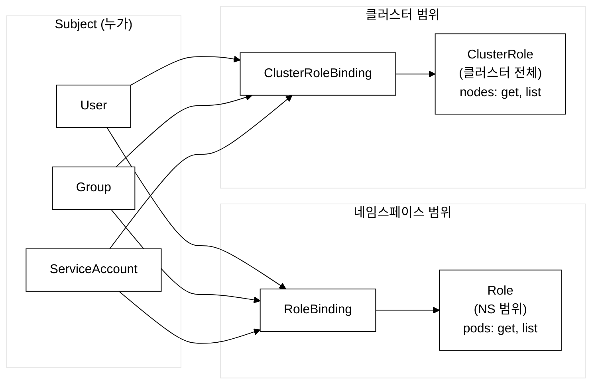
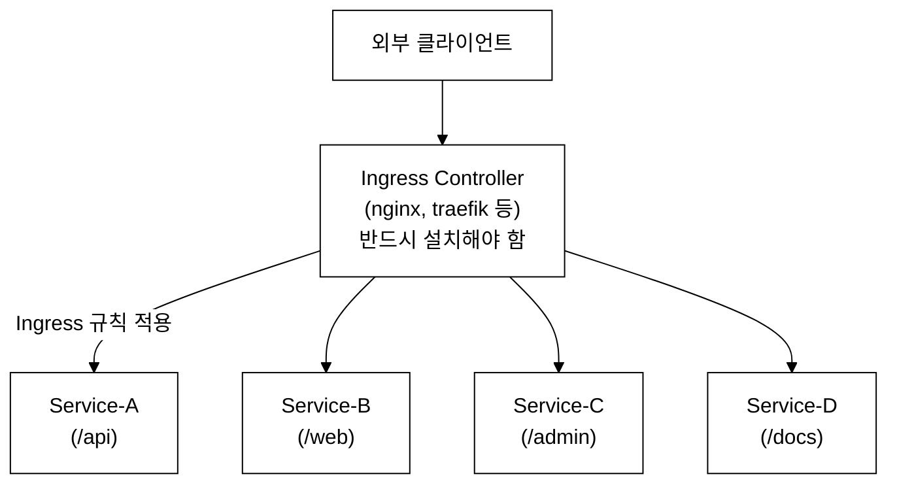
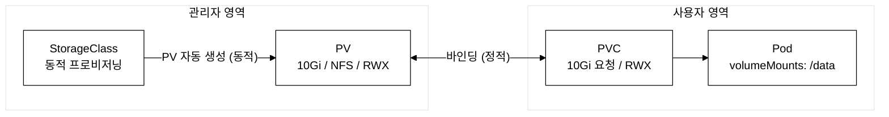
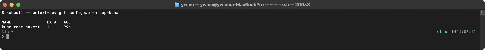
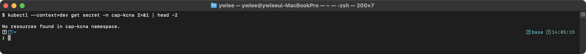

# KCNA Day 4: 핵심 오브젝트 Part 2 - ConfigMap, Secret, Namespace, RBAC, Ingress, PV/PVC

> 학습 목표: K8s 설정, 보안, 네트워킹, 스토리지 관련 핵심 오브젝트를 이해하고 YAML 구조를 분석한다.
> 예상 소요 시간: 60분 (개념 40분 + YAML 분석 20분)
> 시험 도메인: Kubernetes Fundamentals (46%) - Part 4
> 난이도: ★★★★★ (KCNA 시험의 핵심 중 핵심)

---

## 오늘의 학습 목표

- ConfigMap과 Secret의 차이를 설명하고 YAML을 작성할 수 있다
- Namespace의 역할과 기본 네임스페이스 4가지를 안다
- Label, Selector, Annotation의 차이를 설명할 수 있다
- RBAC(Role, ClusterRole, RoleBinding, ClusterRoleBinding)을 이해한다
- Ingress의 동작 원리와 Ingress Controller의 필요성을 안다
- PV, PVC, StorageClass의 관계를 설명할 수 있다

**선수 학습:** Day03에서 Service(ClusterIP/NodePort/LoadBalancer)와 CNI(Container Network Interface) 개념을 학습했다. Day04는 그 위에서 더 세밀한 접근 제어(RBAC), HTTP 라우팅(Ingress), 설정 외부화(ConfigMap/Secret), 스토리지 추상화(PV/PVC)를 다룬다.

---

## 0. 등장 배경

초기 Docker 기반 배포에서는 애플리케이션 설정을 컨테이너 이미지에 직접 포함시키거나, 환경 변수를 docker run -e로 전달했다. 이 방식은 환경별(dev/staging/prod) 이미지를 따로 빌드해야 하는 문제가 있었고, 비밀번호 같은 민감 정보를 이미지에 하드코딩하면 보안 사고로 이어졌다. Kubernetes는 ConfigMap과 Secret을 통해 설정과 코드를 분리하고, RBAC으로 API 접근 권한을 세분화하며, PV/PVC로 스토리지를 Pod 라이프사이클과 독립적으로 관리하는 추상화를 제공한다. 이는 12-Factor App의 "Config" 원칙(Heroku가 제창한 클라우드 네이티브 앱 설계 12가지 원칙 중 하나로, 설정을 코드와 분리해 환경 변수로 외부화함으로써 동일 코드가 dev/staging/prod에서 다르게 동작하도록 한다)을 Kubernetes 네이티브로 구현한 것이다.

---

## 1. ConfigMap - 비기밀 설정 데이터

### 1.1 ConfigMap 개념

> **ConfigMap**이란?
> 컨테이너에 전달할 **비기밀(non-confidential) 설정 데이터**를 키-값 쌍으로 저장하는 K8s 오브젝트이다. 환경 변수, 설정 파일, 명령줄 인자 등을 컨테이너 이미지와 분리하여 관리한다.

### 1.2 ConfigMap 등장 배경

이전에는 컨테이너 이미지에 설정을 하드코딩하거나 `docker run -e APP_ENV=prod`처럼 환경 변수로만 전달했다. 환경 변수는 프로세스 시작 시 한 번만 읽히므로 실행 중에 설정을 변경하려면 컨테이너를 재시작해야 했다. 파일 형태의 ConfigMap(예: `nginx.conf`)은 kubelet이 주기적으로 볼륨을 동기화하므로, NGINX처럼 설정 파일을 읽어 동작하는 프로세스에서 컨테이너 재시작 없이 설정을 주입·갱신할 수 있다. 환경 변수 방식과 파일 마운트 방식이 공존하는 이유는 이 두 사용 패턴의 차이 때문이다 — 환경 변수는 단순 키-값 전달에 적합하고, 파일 마운트는 nginx.conf·application.yml처럼 구조화된 설정 파일 주입에 적합하다.

### 1.3 ConfigMap YAML 예제

```yaml
# ConfigMap 생성
apiVersion: v1
kind: ConfigMap
metadata:
  name: app-config
  namespace: demo
data:
  # 단순 키-값
  DATABASE_HOST: "postgres-svc"
  DATABASE_PORT: "5432"
  LOG_LEVEL: "info"

  # 파일 형태 데이터
  nginx.conf: |
    server {
      listen 80;
      server_name localhost;
      location / {
        root /usr/share/nginx/html;
        index index.html;
      }
    }
```

### 1.4 ConfigMap 사용 방법

```yaml
# Pod에서 ConfigMap 사용
apiVersion: v1
kind: Pod
metadata:
  name: app
spec:
  containers:
  - name: app
    image: my-app:1.0
    # 방법 1: 환경 변수로 주입
    envFrom:
    - configMapRef:
        name: app-config           # ConfigMap의 모든 키를 환경 변수로
    # 방법 2: 특정 키만 환경 변수로
    env:
    - name: DB_HOST
      valueFrom:
        configMapKeyRef:
          name: app-config
          key: DATABASE_HOST
    # 방법 3: 볼륨으로 마운트 (파일)
    volumeMounts:
    - name: config-volume
      mountPath: /etc/nginx/conf.d
  volumes:
  - name: config-volume
    configMap:
      name: app-config
      items:
      - key: nginx.conf
        path: default.conf         # /etc/nginx/conf.d/default.conf로 마운트
```

> **주의:** 볼륨으로 마운트된 ConfigMap은 kubelet이 변경을 감지할 때까지 대기 시간이 존재한다(아래 1.5 참조). 또한 애플리케이션이 설정 파일을 캐시 중이면 파일이 갱신되더라도 프로세스가 이를 인식하지 못한다. 이 경우 애플리케이션 측에서 SIGHUP 같은 설정 재로드 신호를 처리하는 로직을 별도로 구현해야 한다.

### 1.5 ConfigMap 변경 반영 (시험 빈출!)

```
ConfigMap 변경 시 반영 방식
============================================================

볼륨 마운트: 자동 반영 — 단, kubelet의 sync-frequency(기본 60초)와
             configMapAndSecretChangeDetectionStrategy 설정에 따라
             변경 후 최대 약 1분(10초~60초)의 지연이 발생한다.
환경 변수:   Pod 재시작 필요 (프로세스 시작 시 한 번 읽힘, 이후 변경 무시)

핵심:
- 볼륨 = 자동 반영 (약 1분 지연, 즉시 반영 아님!)
- 환경 변수 = Pod 재시작 필요
```

---

## 2. Secret - 기밀 데이터

### 2.1 Secret 개념

> **Secret**이란?
> 비밀번호, API 키, TLS 인증서 등 **기밀(confidential) 데이터**를 저장하는 K8s 오브젝트이다. ConfigMap과 유사하지만 데이터가 **Base64 인코딩**되어 저장된다.

### 2.2 Secret YAML 예제

**Base64 인코딩 배경:** Secret의 `data` 필드에는 Base64로 인코딩된 값을 직접 입력한다. Base64(텍스트·바이너리 데이터를 ASCII 문자열로 변환하는 인코딩 방식)는 누구나 디코딩할 수 있으므로 암호화가 아니다. 평문을 그대로 쓰고 싶다면 `stringData` 필드를 사용하면 되고, K8s API 서버가 저장 시 자동으로 Base64 인코딩해서 etcd에 기록한다. 즉 `data`(인코딩된 값 직접 입력)와 `stringData`(평문 입력, 자동 인코딩)는 동일한 결과물을 만드는 두 가지 쓰기 방식이다.

```yaml
apiVersion: v1
kind: Secret
metadata:
  name: db-credentials
  namespace: demo
type: Opaque                       # 범용 Secret 타입
data:
  # Base64 인코딩된 값
  username: YWRtaW4=               # echo -n 'admin' | base64
  password: cGFzc3dvcmQxMjM=       # echo -n 'password123' | base64

---
# stringData로 평문 입력 가능 (저장 시 자동 Base64 인코딩)
apiVersion: v1
kind: Secret
metadata:
  name: db-credentials-plain
type: Opaque
stringData:
  username: admin
  password: password123
```

> **검증:** `echo YWRtaW4= | base64 -d` 를 실행하면 `admin` 이 출력된다. 반대로 `echo -n 'admin' | base64` 를 실행하면 `YWRtaW4=` 가 나온다. 이처럼 누구나 양방향 변환이 가능하므로 Base64 인코딩은 암호화가 아니다.

### 2.3 Secret 유형

| 유형 | 설명 | 사용 사례 |
|------|------|----------|
| **Opaque** (기본) | 범용 키-값 데이터 | DB 비밀번호, API 키 |
| **kubernetes.io/tls** | TLS 인증서와 키 | HTTPS 인증서 |
| **kubernetes.io/dockerconfigjson** | 도커 레지스트리 인증 정보 | 프라이빗 레지스트리 |
| **kubernetes.io/service-account-token** | ServiceAccount 토큰 | API 인증 |

### 2.4 Secret 보안 주의사항 (시험 빈출!)

```
Secret 보안 특성
============================================================

1. Base64 인코딩 ≠ 암호화!
   - Base64는 누구나 디코딩 가능 (echo 'YWRtaW4=' | base64 -d → admin)
   - 진정한 암호화를 위해서는 별도 설정 필요

2. etcd에서의 암호화:
   - 기본: 평문(Base64)으로 저장
   - EncryptionConfiguration으로 AES-256 암호화 가능
   - 외부 시크릿 관리: HashiCorp Vault, AWS Secrets Manager

3. 구현 제약: Secret 크기 제한은 최대 1MiB (etcd 저장소 제약)
   - 1MiB를 초과하면 API 서버가 저장을 거부한다

시험 포인트:
- "Secret은 암호화인가?" → 아니다! Base64 인코딩일 뿐이다!
```

### 2.5 Secret 보안 강화의 트레이드오프

Base64 인코딩이 암호화가 아니라는 점을 인식한 팀이 선택할 수 있는 보안 강화 방법은 두 가지다 — EncryptionConfiguration과 외부 Vault 연동. 그러나 각각 운영 비용이 따른다.

**EncryptionConfiguration(at-rest 암호화):** kube-apiserver에 `--encryption-provider-config` 플래그를 추가하고 AES-256(aescbc, aesgcm) 또는 KMS 프로바이더를 지정하면 etcd에 저장되는 Secret이 실제로 암호화된다. 그러나 다음 비용이 발생한다:
- 모든 컨트롤 플레인 노드의 apiserver를 재시작해야 하며, HA 구성에서는 순서를 지켜야 한다.
- 암호화 키 자체를 안전하게 관리해야 한다(키를 apiserver 로컬 파일에 두면 노드 침해 시 키도 노출된다).
- 키 로테이션 시 기존 Secret을 모두 재암호화해야 하므로(`kubectl get secret --all-namespaces -o json | kubectl replace -f -`) 클러스터 규모가 크면 상당한 시간이 걸린다.
- 잘못 구성하면 apiserver가 기동하지 않아 클러스터 전체가 멈춘다.

**외부 Vault 연동(HashiCorp Vault, AWS Secrets Manager 등):** Secret 값 자체를 etcd에 저장하지 않고 외부 Vault에 두고 Pod가 직접 조회하는 방식이다. 보안성은 높지만:
- Vault 클러스터 자체의 가용성과 운영을 별도로 책임져야 한다(추가 인프라).
- Vault Agent Injector 또는 CSI Secrets Store Driver 등의 추가 컴포넌트가 필요하다.
- 네트워크 장애 시 Vault에 의존하는 Pod가 기동 불가 상태가 될 수 있다.

요약: Secret 보안 강화는 공짜가 아니다. 규정 준수(PCI-DSS, HIPAA 등)가 요구된다면 EncryptionConfiguration 또는 외부 Vault를 반드시 적용해야 하지만, 운영 복잡도와 장애 위험이 증가한다는 트레이드오프를 명확히 인식하고 선택해야 한다.

---

## 3. Namespace - 가상 클러스터 분리

### 3.1 Namespace 개념

> **Namespace(네임스페이스)**란?
> 하나의 물리 클러스터를 여러 **가상 클러스터**로 논리 분리하는 메커니즘이다. 팀별, 환경별(dev/staging/prod), 프로젝트별로 리소스를 격리한다.

### 3.2 기본 Namespace (시험 빈출!)

```
K8s 기본 네임스페이스 (4개)
============================================================

1. default        - 네임스페이스 미지정 시 사용하는 기본 공간
2. kube-system    - K8s 시스템 컴포넌트용 (CoreDNS, kube-proxy 등)
3. kube-public    - 모든 사용자(인증 안 된 포함)가 읽을 수 있는 공간
4. kube-node-lease - 노드 하트비트용 Lease 오브젝트 저장

시험 포인트:
- 기본 NS는 4개: default, kube-system, kube-public, kube-node-lease
- "kube-apps"는 존재하지 않는다!
```

### 3.3 Namespace 범위 리소스 vs 클러스터 범위 리소스

| 범위 | 리소스 예시 |
|------|-----------|
| **Namespace 범위** | Pod, Deployment, Service, ConfigMap, Secret, Role, RoleBinding |
| **클러스터 범위** | Node, PersistentVolume, Namespace, ClusterRole, ClusterRoleBinding, StorageClass |

### 3.4 Namespace 격리의 한계 — 트레이드오프 (시험 빈출!)

Namespace는 **논리 격리**이지 네트워크 격리나 리소스 격리가 아니다. 기본 상태에서는 서로 다른 Namespace에 속한 Pod도 IP를 알면 직접 통신할 수 있다. "dev 네임스페이스와 prod 네임스페이스를 나눴으니 격리됐다"는 착각은 실제 보안 사고로 이어진다. 진정한 격리를 위해서는 다음을 별도로 적용해야 한다:

- **네트워크 격리**: NetworkPolicy(네트워크 정책 오브젝트)로 Namespace 간 트래픽을 명시적으로 차단한다.
- **리소스 격리**: ResourceQuota(네임스페이스 단위 CPU/메모리 총량 제한)와 LimitRange(Pod·컨테이너 단위 상한/하한)를 적용하지 않으면 한 Namespace의 워크로드가 클러스터 전체 리소스를 독점할 수 있다.

요약: "Namespace를 만들었다 = 격리됐다"가 아니라 "Namespace + NetworkPolicy + ResourceQuota = 완전한 논리 격리"이다.

---

## 4. Label, Selector, Annotation

**Namespace에서 Label로 이어지는 이유:** Namespace는 물리 클러스터를 여러 가상 클러스터로 나누는 논리 격리 단위이지만, 같은 Namespace 내에서는 모든 Pod·Service가 서로 보인다. 프로덕션 환경에서는 같은 Namespace 안에 서로 다른 팀의 워크로드, dev/prod 구분, v1/v2 버전 등이 공존하는 경우가 많다. Namespace만으로는 이들을 유연하게 선택·필터링할 수 없으므로, 추가적인 메타데이터가 필요하다. 그것이 Label이다. Deployment가 관리할 Pod를 선택하고, Service가 트래픽을 전달할 Pod를 찾고, NetworkPolicy가 대상 Pod를 지정하는 모든 동작이 Label Selector를 통해 이루어진다.

### 4.1 Label과 Annotation 비교 (시험 빈출!)

**크기 제약의 배경:** Label의 키와 값에는 각각 63자 제한이 있다. 이는 Selector 연산 성능을 보장하기 위한 설계적 제약으로, etcd에 인덱싱된 Label을 빠르게 필터링하려면 값의 길이를 제한해야 한다. 반면 Annotation은 빌드 정보, 변경 담당자, 외부 도구 설정 같은 메타데이터를 저장하되 시스템이 필터링 대상으로 쓰지 않으므로 값 크기 제한이 256KB로 훨씬 크다. 요약하면 "Selector로 쓰는가(Label) vs 단순 메타데이터로만 쓰는가(Annotation)"가 둘의 설계 기준이다.

```
Label vs Annotation
============================================================

Label (라벨):
  - 오브젝트를 식별하고 선택(select)하는 데 사용
  - Selector로 필터링/그룹화 가능
  - 키: 63자 제한, 값: 63자 제한
  - 예: app=nginx, environment=prod, tier=frontend

Annotation (어노테이션):
  - 비식별 메타데이터를 저장
  - Selector로 선택 불가
  - 값 크기 제한이 더 넉넉 (256KB)
  - 예: 빌드 정보, 변경 이유, 외부 도구 설정

핵심: Label = Selector 가능, Annotation = Selector 불가
```

### 4.2 Selector 유형

```yaml
# 1. Equality-based Selector (등호 기반)
selector:
  matchLabels:
    app: nginx                    # app=nginx인 오브젝트 선택

# 2. Set-based Selector (집합 기반)
selector:
  matchExpressions:
  - key: environment
    operator: In                  # In, NotIn, Exists, DoesNotExist
    values:
    - production
    - staging
```

---

## 5. RBAC - 역할 기반 접근 제어

### 5.1 RBAC 개념

> **RBAC(Role-Based Access Control)**이란?
> 사용자/서비스의 K8s API 접근 권한을 **역할(Role)** 기반으로 관리하는 인가(Authorization) 메커니즘이다.

**등장 배경:** K8s API 서버는 모든 요청(pod get, deployment create 등)에 대해 인증(Authentication — 누구인가) → 인가(Authorization — 무엇을 할 수 있는가) 순으로 검사한다. 초기 K8s에는 ABAC(Attribute-Based Access Control, 속성 기반 접근 제어)가 있었으나, 권한 규칙을 JSON 파일로 직접 작성해 API 서버를 재시작해야 반영되는 구조였다. 운영 중인 클러스터에서 동적 권한 변경이 불가능해 불편했고, 권한 관리가 중앙화되지 않아 감사(audit)도 어려웠다. RBAC은 역할(Role)과 바인딩(RoleBinding)을 K8s 오브젝트로 표현하여 `kubectl apply`만으로 즉시 반영되고, 누가 어떤 Role을 갖는지가 API 오브젝트로 명시되어 감사·자동화가 용이하다.

**API 그룹 개념:** RBAC Role의 `apiGroups` 필드는 K8s API가 기능별로 그룹화된 구조를 반영한다. `""` (빈 문자열)은 core API 그룹으로 Pod·Service·ConfigMap·Secret 등이 속한다. `"apps"`는 Deployment·StatefulSet·DaemonSet, `"rbac.authorization.k8s.io"`는 Role·RoleBinding, `"networking.k8s.io"`는 Ingress 등이 속한다. `verbs`는 해당 리소스에 허용할 HTTP 동작을 의미한다.

### 5.2 RBAC 4대 리소스



_그림 1. RBAC Subject-Role-Binding 관계. RoleBinding은 NS 범위, ClusterRoleBinding은 클러스터 전체 범위._

- **Role**: 네임스페이스 내 권한 정의
- **ClusterRole**: 클러스터 전체 권한 정의
- **RoleBinding**: Role을 Subject에 연결 (NS 범위)
- **ClusterRoleBinding**: ClusterRole을 Subject에 연결 (클러스터 범위)

### 5.3 RBAC YAML 예제

```yaml
# 1. Role: demo 네임스페이스에서 Pod 조회 권한
apiVersion: rbac.authorization.k8s.io/v1
kind: Role
metadata:
  name: pod-reader
  namespace: demo
rules:
- apiGroups: [""]                  # 핵심 API 그룹 (Pod, Service 등)
  resources: ["pods"]              # 대상 리소스
  verbs: ["get", "list", "watch"]  # 허용 동작

---
# 2. RoleBinding: dev-user에게 pod-reader Role 부여
apiVersion: rbac.authorization.k8s.io/v1
kind: RoleBinding
metadata:
  name: read-pods
  namespace: demo
subjects:
- kind: User
  name: dev-user
  apiGroup: rbac.authorization.k8s.io
roleRef:
  kind: Role
  name: pod-reader
  apiGroup: rbac.authorization.k8s.io

---
# 3. ClusterRole: 클러스터 전체 노드 조회 권한
apiVersion: rbac.authorization.k8s.io/v1
kind: ClusterRole
metadata:
  name: node-reader
rules:
- apiGroups: [""]
  resources: ["nodes"]
  verbs: ["get", "list", "watch"]
```

### 5.4 ServiceAccount — Pod가 API Server에 인증하는 방법

RBAC Subject 목록에 User, Group과 함께 **ServiceAccount(SA)**가 포함된다. ServiceAccount(서비스 어카운트)는 사람 사용자(User)가 아니라 **Pod 내부에서 실행되는 프로세스**가 K8s API Server에 인증할 때 사용하는 자격증명 오브젝트이다.

예를 들어 CI/CD 파이프라인 컨테이너가 Deployment를 배포하거나, 모니터링 에이전트가 Pod 목록을 조회하는 경우, 해당 Pod가 API Server에 "나는 누구이며 무엇을 할 수 있는가"를 증명해야 한다. 이때 사람의 kubeconfig 대신 ServiceAccount 토큰을 사용한다.

**기본 ServiceAccount:** 모든 Namespace에는 `default`라는 SA가 자동 생성된다. 네임스페이스 생성 직후 `kubectl get sa -n <ns>`를 실행하면 `default` SA가 이미 존재하는 것을 확인할 수 있다. Pod 스펙에 `serviceAccountName`을 명시하지 않으면 자동으로 `default` SA가 할당된다.

**Pod에 SA 연결:** Pod 스펙의 `spec.serviceAccountName` 필드에 SA 이름을 지정한다. 지정된 SA의 토큰이 Pod 내부의 `/var/run/secrets/kubernetes.io/serviceaccount/token` 경로에 자동 마운트된다. 파드 내 프로세스는 이 토큰을 HTTP Authorization 헤더에 실어 API Server에 요청한다.

**SA와 Secret의 관계:** K8s 1.24 이전에는 SA 생성 시 자동으로 장기 토큰 Secret(`kubernetes.io/service-account-token` 타입)이 만들어졌다. 1.24 이후부터는 자동 생성이 중단되고, 대신 kubelet이 단기(만료 시간 있는) 토큰을 동적으로 발급한다. 따라서 최신 클러스터에서 `kubectl get secret -n demo`를 실행하면 SA 토큰 Secret이 보이지 않는 것이 정상이다(실습 2에서 확인 가능).

**권한 확인 — kubectl auth can-i:** 위 RoleBinding을 적용한 후 실제 권한을 확인하는 가장 빠른 방법은 `kubectl auth can-i` 명령이다. 이 명령은 추상적인 YAML 구조를 실측으로 검증해 주므로 시험 디버깅과 운영 트러블슈팅 모두에서 필수적이다.

```bash
# dev-user가 demo 네임스페이스에서 pods를 get할 수 있는지 확인
kubectl auth can-i get pods -n demo --as=dev-user
# → yes (pod-reader Role이 부여된 경우)

# dev-user가 demo 네임스페이스에서 deployments를 create할 수 있는지 확인
kubectl auth can-i create deployments -n demo --as=dev-user
# → no (pod-reader Role에는 deployments create 권한이 없음)
```

**RBAC verbs 목록:**

| Verb | 설명 | HTTP 메서드 |
|------|------|-----------|
| get | 단일 리소스 조회 | GET |
| list | 리소스 목록 조회 | GET |
| watch | 변경 감시 | GET (watch) |
| create | 리소스 생성 | POST |
| update | 리소스 수정 | PUT |
| patch | 리소스 부분 수정 | PATCH |
| delete | 리소스 삭제 | DELETE |

### 5.5 RBAC 운영 트레이드오프

RBAC은 ABAC 대비 동적 권한 변경과 감사가 편리하지만, 운영 규모가 커질수록 다음과 같은 복잡도가 누적된다.

**최소 권한 원칙(Principle of Least Privilege) 적용의 부담:** 팀별·서비스별·환경별로 필요한 권한이 다를 때 이를 Role 단위로 세분화하면 Role 개수가 팀·서비스 수에 비례해 증가한다. 수십 개의 Namespace와 수백 개의 서비스가 공존하는 클러스터에서는 Role·RoleBinding·ClusterRole·ClusterRoleBinding 오브젝트 수가 수천 개에 달한다. 이 상태에서 "특정 사용자가 실제로 어떤 권한을 가지는가"를 파악하는 것은 직관적이지 않다(여러 RoleBinding이 누적 적용되기 때문이다).

**RBAC 감사의 어려움:** `kubectl auth can-i`는 단일 동작에 대한 yes/no만 반환한다. 특정 사용자가 가진 모든 권한을 한 번에 열거하는 내장 명령은 없으므로(rakkess, rbac-tool 같은 외부 도구 필요), 감사(audit) 담당자가 "이 계정은 어떤 리소스에 어떤 동작이 가능한가"를 파악하는 데 별도 스크립팅이나 도구가 필요하다.

**ClusterRoleBinding의 범위 오남용:** 편의상 ClusterRoleBinding을 남용하면 특정 서비스가 클러스터 전체 리소스에 접근 가능해지는 과도한 권한이 부여된다. `cluster-admin` ClusterRole을 Pod의 ServiceAccount에 바인딩하면 그 Pod가 클러스터 내 모든 것을 제어할 수 있는 상태가 된다 — 이는 컨테이너 탈출(container escape) 공격 시 폭발 반경(blast radius)이 클러스터 전체로 확대되는 심각한 위험이다.

요약: RBAC은 ABAC보다 운영이 편리하지만 무계획적으로 확장하면 관리 복잡도와 보안 감사 난이도가 함께 올라간다. Role 설계 초기부터 네이밍 컨벤션, 네임스페이스별 Role 분리, ClusterRole 최소화 원칙을 수립해야 한다.

---

## 6. Ingress - HTTP/HTTPS 라우팅

### 6.1 Ingress 개념

> **Ingress**란?
> 클러스터 외부에서 내부 Service로의 **HTTP/HTTPS 트래픽을 라우팅**하는 규칙을 정의하는 API 오브젝트이다. 하나의 외부 IP로 여러 Service에 접근할 수 있게 한다.

**트래픽 흐름:** Ingress는 Pod에 직접 접근하지 않고, Service를 통해 트래픽을 전달한다. 외부 클라이언트 → Ingress Controller → Service → Pod 순서로 흐른다. Ingress는 이 경로의 라우팅 규칙(호스트·경로 기반)을 정의하는 API 오브젝트이고, 실제 트래픽 처리는 Ingress Controller가 수행한다.

**등장 배경:** 외부 클라이언트가 K8s 내부 Service에 접근하는 이전 방식은 NodePort(각 Service마다 별도 포트 30000-32767 범위 사용)나 LoadBalancer(각 Service마다 별도 외부 IP 할당)였다. Service가 수십 개로 늘어나면 NodePort는 포트 관리가 복잡해지고, LoadBalancer는 클라우드 비용이 Service 수만큼 선형으로 증가한다. Ingress는 하나의 외부 IP(Ingress Controller)로 여러 Service를 통합하면서, 호스트 기반(`app.com` vs `api.com`) 또는 경로 기반(`/api`, `/web`)으로 라우팅하는 L7(HTTP/HTTPS 레이어) 규칙을 한 곳에서 관리한다. 단, Ingress는 HTTP/HTTPS(L7)만 처리하며 TCP/UDP(L4) 라우팅은 지원하지 않는다.

### 6.2 Ingress Controller 필수! (시험 빈출!)



_그림 2. Ingress 트래픽 흐름. 외부 → Ingress Controller → Service → Pod 순서로 전달된다. Ingress Controller가 없으면 Ingress 리소스는 etcd에 규칙만 저장될 뿐 트래픽이 실제로 라우팅되지 않는다._

### 6.3 Ingress YAML 예제

```yaml
apiVersion: networking.k8s.io/v1
kind: Ingress
metadata:
  name: web-ingress
  namespace: demo
  annotations:
    nginx.ingress.kubernetes.io/rewrite-target: /
spec:
  ingressClassName: nginx          # 사용할 Ingress Controller
  rules:
  - host: app.example.com          # 호스트 기반 라우팅
    http:
      paths:
      - path: /api                 # 경로 기반 라우팅
        pathType: Prefix
        backend:
          service:
            name: api-service
            port:
              number: 80
      - path: /web
        pathType: Prefix
        backend:
          service:
            name: web-service
            port:
              number: 80
  tls:                             # HTTPS 설정
  - hosts:
    - app.example.com
    secretName: tls-secret         # TLS 인증서 Secret
```

> **실습 주의:** Ingress Controller가 설치되어 있지 않으면 위 Ingress 리소스는 etcd에 규칙만 저장될 뿐 실제 트래픽 라우팅은 일어나지 않는다. 이 저장소의 tart 클러스터에 Ingress Controller가 설치되어 있는지 먼저 확인한다.
> ```bash
> # Ingress Controller 존재 여부 확인
> kubectl --kubeconfig kubeconfig/dev.yaml get ingressclass
> kubectl --kubeconfig kubeconfig/dev.yaml get pod -n ingress-nginx
> ```
> 위 명령에서 결과가 없거나 `No resources found`라면 Ingress는 동작하지 않는다. KCNA 시험 범위에서는 "Ingress Controller가 반드시 필요하다"는 원칙만 기억하면 된다.

---

## 7. PersistentVolume & PersistentVolumeClaim

### 7.1 PV/PVC 개념

> **PersistentVolume(PV)**란?
> 클러스터 관리자가 프로비저닝한 **클러스터 수준의 스토리지 리소스**이다. 노드처럼 클러스터에 존재하는 리소스이다.

> **PersistentVolumeClaim(PVC)**란?
> 사용자(Pod)가 스토리지를 **요청(claim)** 하는 오브젝트이다. PVC가 생성되면 조건에 맞는 PV에 바인딩된다.

**PV와 PVC가 분리된 이유:** 초기 K8s에서는 Pod 스펙에 NFS 서버 IP, EBS 볼륨 ID 등의 스토리지 세부 정보를 직접 기재했다. 이 방식은 Pod 개발자가 인프라 세부 사항(NFS 서버 IP, 스토리지 타입)을 알아야 했고, Pod가 다른 클러스터·클라우드로 이동하면 스펙 전체를 수정해야 했다. PV/PVC의 핵심은 책임 분리다 — 클러스터 관리자는 PV를 통해 실제 스토리지를 추상화하고, 사용자(개발자)는 PVC를 통해 "10Gi, 다중 노드 읽기/쓰기 필요"처럼 요구사항만 기술하면 된다. K8s가 조건에 맞는 PV를 자동으로 바인딩하므로 Pod는 스토리지의 물리적 위치나 타입을 몰라도 된다.



_그림 3. PV/PVC 관계. 정적 프로비저닝은 관리자가 PV를 미리 생성하고 PVC가 조건 일치 시 바인딩된다. 동적 프로비저닝은 StorageClass가 PVC 생성 시점에 PV를 자동 생성한다._

### 7.2 PV/PVC YAML 예제

```yaml
# PersistentVolume
apiVersion: v1
kind: PersistentVolume
metadata:
  name: nfs-pv
spec:
  capacity:
    storage: 10Gi                  # 스토리지 크기
  accessModes:
  - ReadWriteMany                  # 접근 모드
  persistentVolumeReclaimPolicy: Retain  # 회수 정책
  nfs:
    server: 192.168.64.10
    path: /data/shared

---
# PersistentVolumeClaim
apiVersion: v1
kind: PersistentVolumeClaim
metadata:
  name: app-data
  namespace: demo
spec:
  accessModes:
  - ReadWriteMany
  resources:
    requests:
      storage: 10Gi
  storageClassName: ""             # 빈 문자열 = 정적 바인딩

---
# StorageClass (동적 프로비저닝)
apiVersion: storage.k8s.io/v1
kind: StorageClass
metadata:
  name: fast-ssd
provisioner: kubernetes.io/aws-ebs
parameters:
  type: gp3
  fsType: ext4
volumeBindingMode: WaitForFirstConsumer  # Pod 스케줄링 시까지 바인딩 지연
reclaimPolicy: Delete
```

### 7.3 접근 모드 (Access Modes)

| 모드 | 약어 | 설명 |
|------|------|------|
| **ReadWriteOnce** | RWO | 단일 노드에서 읽기/쓰기 |
| **ReadOnlyMany** | ROX | 여러 노드에서 읽기 전용 |
| **ReadWriteMany** | RWX | 여러 노드에서 읽기/쓰기 |
| **ReadWriteOncePod** | RWOP | 단일 Pod에서만 읽기/쓰기 (K8s 1.22+) |

> **주의:** 접근 모드 지원 여부는 스토리지 백엔드에 따라 다르다. AWS EBS는 단일 노드 쓰기(RWO)만 지원하고 RWX를 지원하지 않는다. NFS는 RWX(다중 노드 동시 읽기/쓰기)를 지원한다. CephFS, Azure Files 등도 RWX를 지원한다. StorageClass를 선택할 때 필요한 접근 모드를 먼저 파악하고, 선택한 스토리지 백엔드가 해당 모드를 지원하는지 확인해야 한다.

### 7.4 회수 정책 (Reclaim Policy) - 시험 빈출!

```
PV 회수 정책 (PVC 삭제 시 PV 처리 방식)
============================================================

Retain (보존):
  PVC 삭제 → PV 보존 (Released 상태)
  데이터 보존, 관리자가 수동으로 정리
  프로덕션에서 가장 안전

Delete (삭제):
  PVC 삭제 → PV 삭제 + 외부 스토리지도 삭제
  클라우드 환경(AWS EBS, GCE PD)의 기본값

Recycle (재사용):
  PVC 삭제 → PV의 데이터만 삭제 (rm -rf /data/*)
  ⚠️ Deprecated! 사용하지 않음
```

**선택 가이드:** 프로덕션(중요 데이터)에서는 Retain을 사용해 실수로 PVC가 삭제되더라도 데이터가 보존되도록 한다. 개발/테스트 환경에서는 Delete를 사용해 PVC 삭제 시 스토리지가 자동 정리되도록 하는 것이 관리 편의상 유리하다. Recycle은 `rm -rf /data/*`로 데이터만 지우는 방식인데 느리고 안전하지 않아 deprecated 되었으며, 동적 프로비저닝 환경에서는 StorageClass의 `reclaimPolicy`가 이 역할을 대체한다.

### 7.5 동적 프로비저닝의 트레이드오프 — 편의성과 데이터 손실 위험

StorageClass를 사용한 동적 프로비저닝(PVC 생성 → StorageClass가 자동으로 PV 생성 → 바인딩)은 관리자가 PV를 수동으로 미리 생성해야 하는 정적 프로비저닝의 불편함을 해소한다. 그러나 다음 트레이드오프를 반드시 인식해야 한다.

**reclaimPolicy 기본값이 Delete이다:** 클라우드 환경(AWS EBS, GCE PD 등)의 StorageClass는 `reclaimPolicy: Delete`가 기본값이다. 이는 PVC가 삭제되면 PV와 그 안의 클라우드 볼륨(EBS 볼륨 등)이 **영구 삭제**됨을 의미한다. `kubectl delete pvc`를 잘못 실행하거나 Namespace를 통째로 삭제하면 데이터가 복구 불가능하게 사라진다.

**프로덕션 대응:** 중요 데이터를 다루는 StorageClass에는 `reclaimPolicy: Retain`을 명시적으로 설정해야 한다. `Retain`으로 설정하면 PVC 삭제 후에도 PV는 `Released` 상태로 보존되며, 관리자가 데이터를 확인한 뒤 수동으로 정리한다.

```yaml
# 프로덕션용 StorageClass — reclaimPolicy를 Retain으로 명시
apiVersion: storage.k8s.io/v1
kind: StorageClass
metadata:
  name: safe-ssd
provisioner: kubernetes.io/aws-ebs
parameters:
  type: gp3
reclaimPolicy: Retain          # Delete(기본)가 아닌 Retain으로 변경
volumeBindingMode: WaitForFirstConsumer
```

요약: 동적 프로비저닝은 편리하지만 기본 reclaimPolicy가 Delete이므로 프로덕션에서는 반드시 `Retain`으로 변경한다. 클라우드 볼륨 과금도 PVC 삭제 전까지 계속 발생하므로 사용하지 않는 PVC를 방치하지 않는다.

### 7.6 volumeBindingMode (시험 빈출!)

| 모드 | 설명 |
|------|------|
| **Immediate** (기본) | PVC 생성 즉시 PV에 바인딩 |
| **WaitForFirstConsumer** | PVC를 사용하는 Pod가 스케줄링될 때까지 바인딩 지연 |

**WaitForFirstConsumer의 장점:** Pod와 동일한 존(zone)/노드에 PV가 생성되어 데이터 접근성 보장

---

## 8. KCNA 실전 모의 문제 (15문제)

### 문제 1.
Secret의 데이터 저장 방식에 대한 설명으로 올바른 것은?

A) AES-256으로 암호화되어 etcd에 저장된다
B) Base64로 인코딩되어 저장되며, 이것만으로는 암호화가 아니다
C) SHA-256 해시로 저장된다
D) RSA로 암호화되어 저장된다

<details><summary>정답 확인</summary>

**정답: B) Base64로 인코딩되어 저장되며, 이것만으로는 암호화가 아니다**

Secret은 기본적으로 **Base64 인코딩**만 적용된다. 진정한 암호화를 위해서는 EncryptionConfiguration 또는 외부 Vault를 사용해야 한다.
</details>

---

### 문제 2.
ConfigMap이 변경되었을 때 Pod에 반영되는 방식으로 올바른 것은?

A) 환경 변수와 볼륨 마운트 모두 자동으로 즉시 반영된다
B) 볼륨 마운트는 자동 반영되지만, 환경 변수는 Pod 재시작이 필요하다
C) 환경 변수는 자동 반영되지만, 볼륨 마운트는 Pod 재시작이 필요하다
D) 둘 다 Pod 재시작이 필요하다

<details><summary>정답 확인</summary>

**정답: B) 볼륨 마운트는 자동 반영되지만, 환경 변수는 Pod 재시작이 필요하다**

볼륨으로 마운트된 ConfigMap은 kubelet의 sync 주기에 따라 자동 업데이트된다. 환경 변수로 주입된 값은 Pod 재시작이 필요하다.
</details>

---

### 문제 3.
다음 중 K8s 기본 네임스페이스가 아닌 것은?

A) default
B) kube-system
C) kube-apps
D) kube-node-lease

<details><summary>정답 확인</summary>

**정답: C) kube-apps**

기본 네임스페이스는 **default, kube-system, kube-public, kube-node-lease** 4가지이다. kube-apps는 존재하지 않는다.
</details>

---

### 문제 4.
Label과 Annotation의 차이로 올바른 것은?

A) Label은 크기 제한이 없고, Annotation은 63자 제한이 있다
B) Label은 셀렉터로 오브젝트를 선택할 수 있지만, Annotation은 할 수 없다
C) Annotation은 오브젝트를 그룹화하는 데 사용된다
D) Label과 Annotation은 동일한 기능을 한다

<details><summary>정답 확인</summary>

**정답: B) Label은 셀렉터로 오브젝트를 선택할 수 있지만, Annotation은 할 수 없다**

**Label**은 셀렉터로 선택 가능 (키/값 63자 제한). **Annotation**은 비식별 메타데이터로 셀렉터 불가 (크기 제한 넉넉).
</details>

---

### 문제 5.
RBAC에서 클러스터 전체에 적용되는 권한을 정의하는 리소스는?

A) Role
B) ClusterRole
C) RoleBinding
D) ServiceAccount

<details><summary>정답 확인</summary>

**정답: B) ClusterRole**

**ClusterRole**은 클러스터 전체 범위의 권한을 정의한다. **Role**은 특정 네임스페이스 내에서만 적용된다.
</details>

---

### 문제 6.
Ingress에 대한 설명으로 올바른 것은?

A) Ingress 리소스만 생성하면 자동으로 동작한다
B) TCP/UDP 트래픽을 모두 라우팅할 수 있다
C) Ingress Controller가 반드시 설치되어 있어야 동작한다
D) 각 서비스마다 별도의 IP가 할당된다

<details><summary>정답 확인</summary>

**정답: C) Ingress Controller가 반드시 설치되어 있어야 동작한다**

Ingress 리소스만으로는 동작하지 않으며, NGINX Ingress Controller 등의 **Ingress Controller**가 필요하다. Ingress는 주로 HTTP/HTTPS(L7)를 처리한다.
</details>

---

### 문제 7.
PersistentVolume의 회수 정책(Reclaim Policy) 중 PVC 삭제 시 PV와 데이터를 보존하는 정책은?

A) Delete
B) Retain
C) Recycle
D) Archive

<details><summary>정답 확인</summary>

**정답: B) Retain**

**Retain**은 PVC 삭제 시 PV와 데이터를 보존한다. **Delete**는 PV와 외부 스토리지를 삭제하고, **Recycle**은 deprecated, **Archive**는 존재하지 않는 정책이다.
</details>

---

### 문제 8.
StorageClass의 volumeBindingMode를 WaitForFirstConsumer로 설정하면?

A) PVC 생성 즉시 PV에 바인딩된다
B) PVC를 사용하는 Pod가 스케줄링될 때까지 바인딩을 지연한다
C) PV를 수동으로 생성해야 바인딩된다
D) 바인딩이 불가능하다

<details><summary>정답 확인</summary>

**정답: B) PVC를 사용하는 Pod가 스케줄링될 때까지 바인딩을 지연한다**

**WaitForFirstConsumer**는 Pod 스케줄링 시까지 PV 바인딩을 지연하여 Pod와 동일한 존에 PV가 생성되도록 한다.
</details>

---

### 문제 9.
다음 중 클러스터 수준 리소스(Namespace에 속하지 않는 리소스)가 아닌 것은?

A) Node
B) PersistentVolume
C) Deployment
D) Namespace

<details><summary>정답 확인</summary>

**정답: C) Deployment**

**Deployment**는 네임스페이스에 속하는 리소스이다. Node, PersistentVolume, Namespace, ClusterRole 등은 클러스터 수준 리소스이다.
</details>

---

### 문제 10.
kubectl 명령어 중 리소스의 필드 문서를 조회하는 명령어는?

A) kubectl describe
B) kubectl get -o yaml
C) kubectl explain
D) kubectl inspect

<details><summary>정답 확인</summary>

**정답: C) kubectl explain**

`kubectl explain`은 API 리소스의 필드에 대한 문서를 조회한다. 예: `kubectl explain pod.spec.containers`

이 명령은 kubectl 일반 도구이지만, 오늘 학습한 오브젝트(ConfigMap·Secret·Role·Ingress·PVC)의 YAML 필드 구조를 확인할 때 직접 사용한다. 예: `kubectl explain secret.data`, `kubectl explain role.rules` — 시험 중 YAML 필드가 기억나지 않을 때 공식 문서 대신 이 명령으로 빠르게 조회할 수 있다.
</details>

---

### 문제 11.
Secret에 대한 설명으로 올바르지 않은 것은?

A) Secret은 볼륨으로 마운트할 수 있다
B) Secret은 환경 변수로 주입할 수 있다
C) Secret의 최대 크기는 10MiB이다
D) Secret의 데이터는 Base64로 인코딩된다

<details><summary>정답 확인</summary>

**정답: C) Secret의 최대 크기는 10MiB이다**

Secret의 최대 크기는 **1MiB**이다. 10MiB가 아니다.
</details>

---

### 문제 12.
NetworkPolicy가 없는 네임스페이스에서 Pod 간 통신은?

A) 모든 통신이 차단된다
B) 같은 네임스페이스만 허용된다
C) 모든 통신이 허용된다
D) Ingress만 허용된다

<details><summary>정답 확인</summary>

**정답: C) 모든 통신이 허용된다**

NetworkPolicy가 없으면 기본적으로 모든 Ingress/Egress 트래픽이 허용된다. NetworkPolicy를 적용하면 명시적으로 허용하지 않은 트래픽은 차단된다.

**추가 학습:** NetworkPolicy(네트워크 정책)는 Pod 간·Pod와 외부 간 트래픽 흐름을 제어하는 Kubernetes API이다. 핵심 원칙은 두 가지다 — ① NetworkPolicy가 없으면 모든 트래픽 허용(기본값), ② NetworkPolicy가 존재하면 해당 Pod에 대해 명시적으로 허용한 규칙만 통과하고 나머지는 차단된다. NetworkPolicy의 자세한 동작 메커니즘과 YAML 작성법은 Day 03(네트워킹)을 참조한다.
</details>

---

### 문제 13.
NetworkPolicy가 동작하기 위해 필요한 것은?

A) kube-proxy만 있으면 된다
B) NetworkPolicy를 지원하는 CNI 플러그인이 필요하다
C) Ingress Controller가 필요하다
D) Service Mesh가 필요하다

<details><summary>정답 확인</summary>

**정답: B) NetworkPolicy를 지원하는 CNI 플러그인이 필요하다**

Calico, Cilium, Weave 등이 NetworkPolicy를 지원한다. **Flannel**은 지원하지 않는다.
</details>

---

### 문제 14.
Pod의 restartPolicy 기본값은?

A) Never
B) OnFailure
C) Always
D) Unless-Stopped

<details><summary>정답 확인</summary>

**정답: C) Always**

일반 Pod의 restartPolicy 기본값은 **Always**이다. Job에서는 Never 또는 OnFailure만 사용 가능하다.

**추가 학습:** `restartPolicy`는 Pod 스펙의 최상위 필드로, 컨테이너가 종료(정상 종료 또는 오류 종료)되었을 때 kubelet의 동작을 정의한다. 세 가지 값이 있다 — `Always`(항상 재시작, 일반 Pod의 기본값), `OnFailure`(비정상 종료 시에만 재시작, 종료 코드가 0이 아닐 때), `Never`(재시작하지 않음). Deployment·DaemonSet·StatefulSet 등 컨트롤러가 관리하는 Pod는 `Always`만 허용된다. Job은 작업이 완료되면 종료되어야 하므로 `Never` 또는 `OnFailure`만 허용된다. 자세한 내용은 Day 05(워크로드)를 참조한다.
</details>

---

### 문제 15.
PVC에서 요청할 수 있는 접근 모드(Access Mode)가 아닌 것은?

A) ReadWriteOnce (RWO)
B) ReadOnlyMany (ROX)
C) ReadWriteMany (RWX)
D) ReadWriteAll (RWA)

<details><summary>정답 확인</summary>

**정답: D) ReadWriteAll (RWA)**

K8s의 접근 모드는 RWO, ROX, RWX, RWOP 4가지이다. RWA는 존재하지 않는다.
</details>

---

## 트러블슈팅

### RBAC 권한 부족

```
증상: kubectl 명령 실행 시 forbidden 에러 발생
  $ kubectl get pods -n production
  Error from server (Forbidden): pods is forbidden: User "dev-user"
  cannot list resource "pods" in API group "" in the namespace "production"

디버깅 순서:
  1. 현재 사용자의 권한 확인
     $ kubectl auth can-i list pods -n production
     → no
  2. 사용자에게 부여된 RoleBinding 확인
     $ kubectl get rolebinding -n production -o wide
  3. 해당 Role의 rules 확인
     $ kubectl describe role <role-name> -n production
  4. 필요한 권한이 없으면 RoleBinding 추가
     → Role에 해당 namespace의 pods get/list 권한이 있는지 확인한다

핵심: Role은 NS 범위, ClusterRole은 클러스터 범위이다.
     다른 NS의 리소스에 접근하려면 해당 NS에 RoleBinding이 필요하다.
```

### PVC가 Pending 상태일 때

```
증상: PVC가 Bound 되지 않고 Pending 상태로 남는다
  $ kubectl get pvc -n demo
  NAME      STATUS    VOLUME   CAPACITY   ACCESS MODES   STORAGECLASS   AGE
  my-data   Pending                                      fast-ssd       5m

원인 분석:
  1. 조건에 맞는 PV가 없다 (정적 프로비저닝)
  2. StorageClass가 존재하지 않거나 provisioner가 동작하지 않는다
  3. WaitForFirstConsumer 모드에서 아직 Pod가 스케줄링되지 않았다
  4. 접근 모드(RWO/RWX) 또는 용량 불일치이다

디버깅 순서:
  1. PVC 이벤트 확인
     $ kubectl describe pvc my-data -n demo
  2. StorageClass 존재 여부 확인
     $ kubectl get storageclass
  3. PV 목록 및 상태 확인
     $ kubectl get pv
```

---

## 복습 체크리스트

- [ ] ConfigMap = 비기밀 설정, Secret = 기밀 데이터 (Base64 인코딩)
- [ ] ConfigMap 변경: 볼륨=자동 반영, 환경 변수=Pod 재시작 필요
- [ ] Secret은 Base64 인코딩이며 암호화가 아니다! (EncryptionConfiguration 필요)
- [ ] Secret 최대 크기: 1MiB
- [ ] 기본 NS 4개: default, kube-system, kube-public, kube-node-lease
- [ ] Label = Selector 가능, Annotation = Selector 불가
- [ ] RBAC 4대 리소스: Role, ClusterRole, RoleBinding, ClusterRoleBinding
- [ ] Role = NS 범위, ClusterRole = 클러스터 범위
- [ ] Ingress는 Ingress Controller가 반드시 필요하다!
- [ ] PV Reclaim: Retain(보존), Delete(삭제), Recycle(deprecated)
- [ ] WaitForFirstConsumer = Pod 스케줄링 시까지 PV 바인딩 지연
- [ ] NetworkPolicy 없으면 모든 통신 허용, CNI 지원 필요 (Flannel 미지원)
- [ ] restartPolicy 기본값 = Always, Job은 Never/OnFailure만

---

## 내일 학습 예고

> Day 5에서는 컨테이너 오케스트레이션과 Cloud Native Architecture를 학습한다. 컨테이너 기술(namespace, cgroups, OCI), CNCF 생태계, 마이크로서비스, 서비스 메시, 오토스케일링을 다룬다.

---

## tart-infra 실습

### 실습 환경 설정

```bash
# dev 클러스터에 접속 (ssh dev-master 로 노드 직접 접근도 가능, ~/.ssh/config 등록 별칭)
export KUBECONFIG=kubeconfig/dev.yaml
kubectl get nodes
```

```bash
# demo 네임스페이스 존재 여부 확인 — 없으면 생성
kubectl get ns demo 2>/dev/null || kubectl create namespace demo
```

### 실습 1: ConfigMap과 Secret 확인

```bash
# ConfigMap 확인
kubectl get cm -n demo --no-headers
```

검증:



```bash
# Secret 확인 (Base64 인코딩 확인)
kubectl get secret -n demo --no-headers
```

검증:



```bash
# Secret 데이터가 Base64 인코딩임을 직접 확인한다
# (실제 Secret이 있는 경우)
kubectl get secret -n demo -o jsonpath='{.items[0].data}' 2>/dev/null
# Base64 디코딩 예시: echo "YWRtaW4=" | base64 -d → admin
```

**동작 원리:** ConfigMap vs Secret:
1. ConfigMap: 비기밀 설정 (DB 호스트, 로그 레벨 등)
2. Secret: 기밀 데이터 (비밀번호, API 키 등) - Base64 인코딩
3. 둘 다 환경 변수 또는 볼륨으로 Pod에 주입 가능
4. 볼륨 마운트 시 자동 갱신, 환경 변수는 Pod 재시작 필요

### 실습 2: RBAC 확인

```bash
# ClusterRole 확인
kubectl get clusterrole --no-headers | head -10

# RoleBinding 확인
kubectl get rolebinding -n demo --no-headers 2>/dev/null

# ServiceAccount 확인
kubectl get sa -n demo --no-headers
```

**RBAC 생성·검증 단계별 실습 (시험형, 5분 목표):**

```bash
# 1단계: pod-reader Role 생성 (명령형 — 시험 속도전 기준)
kubectl create role pod-reader \
  --verb=get,list,watch \
  --resource=pods \
  -n demo

# 2단계: dev-user에게 pod-reader 바인딩
kubectl create rolebinding read-pods \
  --role=pod-reader \
  --user=dev-user \
  -n demo

# 3단계: 권한 검증 — dev-user가 pod를 get할 수 있는가?
kubectl auth can-i get pods -n demo --as=dev-user
# 기대 출력: yes

# 4단계: 권한 검증 — dev-user가 deployment를 create할 수 있는가?
kubectl auth can-i create deployments -n demo --as=dev-user
# 기대 출력: no  (pod-reader Role에는 deployments 권한이 없음)
```

검증:

> (미캡처 — 추후 실측 캡처 예정: RBAC Role·RoleBinding 생성 및 auth can-i 결과)

**동작 원리:** RBAC 구조:
1. Role(NS 범위) / ClusterRole(클러스터 범위) = 권한 정의
2. RoleBinding / ClusterRoleBinding = 권한을 Subject에 연결
3. Subject = User, Group, ServiceAccount
4. API Server가 인증(Authentication) -> 인가(RBAC Authorization) -> 어드미션 컨트롤(Admission Control, 요청 객체를 검증·변환하는 플러그인 체인) 순서로 처리

### 실습 3: PV/PVC 확인

```bash
# PersistentVolume 확인 (클러스터 수준)
kubectl get pv --no-headers

# PersistentVolumeClaim 확인 (네임스페이스 수준)
kubectl get pvc -n demo --no-headers 2>/dev/null

# StorageClass 확인
kubectl get storageclass --no-headers
```

**동작 원리:** 스토리지 계층:
1. PV = 실제 스토리지 리소스 (클러스터 수준)
2. PVC = 스토리지 사용 요청 (네임스페이스 수준)
3. StorageClass = 동적 PV 프로비저닝 정책
4. volumeBindingMode: WaitForFirstConsumer = Pod 스케줄링까지 바인딩 지연
