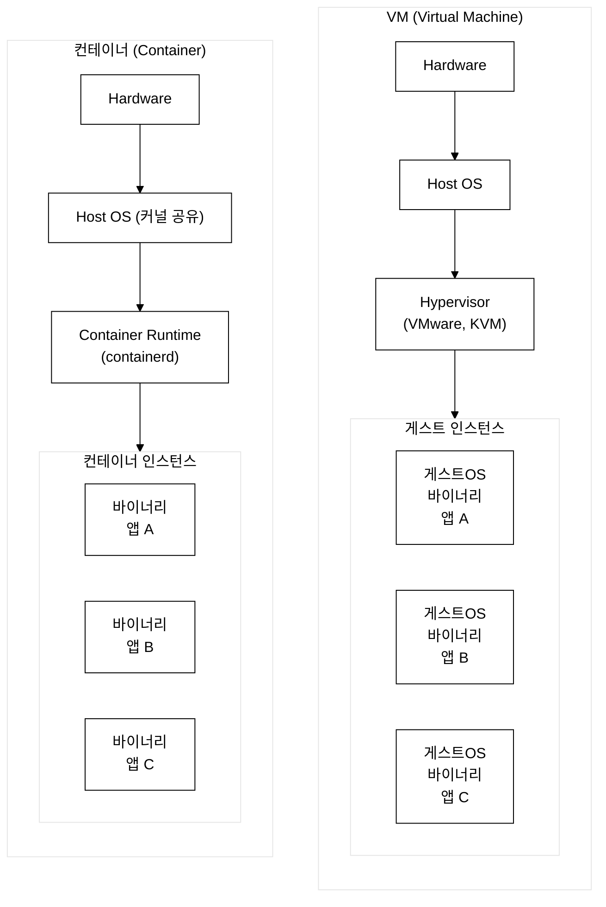
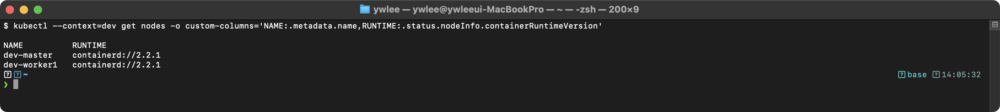
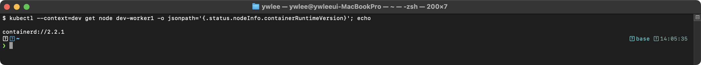
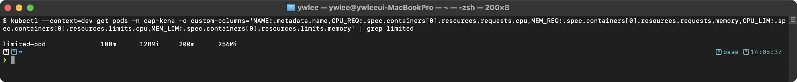
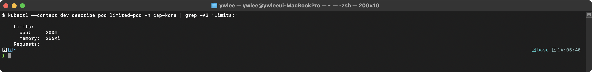

# KCNA Day 5: 컨테이너 오케스트레이션 & 컨테이너 기술

> 학습 목표: 컨테이너 핵심 기술(namespace, cgroups, OCI)과 오케스트레이션 개념을 이해한다.
> 예상 소요 시간: 60분 (개념 40분 + 문제 20분)
> 시험 도메인: Container Orchestration (22%) - Part 1
> 난이도: ★★★★☆

---

## 오늘의 학습 목표

- Linux namespace와 cgroups의 차이를 명확히 구분한다
- 컨테이너와 VM의 차이를 설명할 수 있다
- OCI(Open Container Initiative) 3가지 사양을 안다
- CRI, CNI, CSI 인터페이스를 구분한다
- Dockerfile 지시어(CMD vs ENTRYPOINT)를 이해한다
- 컨테이너 이미지 관련 개념(Tag, Digest, 멀티스테이지 빌드)을 안다

---

## 1. 컨테이너 핵심 기술

### 1.0 등장 배경

VM 기반 가상화는 하이퍼바이저 위에 게스트 OS 전체를 올려야 하므로 오버헤드가 컸다. 수 GB 크기의 이미지, 분 단위 시작 시간, 높은 메모리 소비가 문제였다. 2008년 Linux에 cgroups가 도입되고, 2013년 Docker가 namespace+cgroups를 사용자 친화적으로 패키징하면서 컨테이너 기술이 폭발적으로 성장했다.

그러나 Docker 독점 생태계가 형성되면서 구체적인 비용이 발생했다. Docker 이전에는 각 팀이 서로 다른 VM 추상화 API를 사용했고, 그 결과 이미지 호환성이 플랫폼마다 깨졌다. AWS AMI는 Azure에서 실행되지 않았고, 온프레미스 VM 이미지는 클라우드에서 재빌드해야 했다. Docker가 이 문제를 해결했지만, 이번에는 Docker 자체가 단일 구현체로 고착되면서 새로운 종속성이 생겼다. 표준화 요구가 커지자 2015년 OCI(Open Container Initiative)가 설립되어 Runtime/Image/Distribution 표준을 정의했다. OCI 표준 덕분에 한 번 빌드한 이미지는 OCI를 준수하는 모든 클라우드·온프레미스 환경에서 재빌드 없이 실행 가능해졌다. Kubernetes는 v1.24에서 dockershim을 제거하고 CRI 표준 인터페이스로 전환하여, containerd/CRI-O 등 OCI 호환 런타임이면 무엇이든 사용 가능한 구조를 확립했다.

### 1.1 Linux namespace와 cgroups (시험 빈출!)

```
namespace vs cgroups (절대 혼동 금지!)
============================================================

namespace (네임스페이스) = 격리 (Isolation)
  프로세스가 볼 수 있는 시스템 리소스의 범위를 제한
  종류:
  - PID namespace: 프로세스 ID 격리
  - Network namespace: 네트워크 인터페이스/IP 격리
  - Mount namespace: 파일 시스템 마운트 격리
  - UTS namespace: 호스트명 격리
  - IPC namespace: 프로세스 간 통신 격리
  - User namespace: 사용자/그룹 ID 격리
  - Cgroup namespace(v2): 프로세스가 접근할 수 있는 cgroup 계층의 루트를 지정 (cgroup v2 이상에서만 지원)

cgroups (Control Groups) = 리소스 제한 (Resource Limitation)
  프로세스 그룹의 리소스 사용량을 제한하고 모니터링
  제한 대상:
  - CPU: 사용 가능한 CPU 시간 제한
  - Memory: 메모리 사용량 제한 (초과 시 OOMKill)
  - I/O: 디스크 I/O 대역폭 제한
  - Network: 네트워크 대역폭 제한

핵심 암기:
  namespace = "무엇을 볼 수 있는가?" (격리)
  cgroups = "얼마나 사용할 수 있는가?" (제한)
```

### 1.2 컨테이너 vs VM



_그림 1. VM과 컨테이너의 계층 구조 비교. VM은 게스트 OS를 각 인스턴스마다 포함하고, 컨테이너는 호스트 OS 커널을 공유한다._

| 항목 | 컨테이너 | VM |
|------|---------|-----|
| **크기** | 수 MB ~ 수백 MB | 수 GB |
| **시작 시간** | 초 단위 | 분 단위 |
| **커널** | **호스트 커널 공유** | 게스트 OS 별도 커널 |
| **격리 수준** | 프로세스 수준 (약함) | 하드웨어 수준 (**강함**) |
| **밀도** | 높음 (수십~수백 개) | 낮음 (수~수십 개) |
| **오버헤드** | 매우 적음 | 큼 (게스트 OS) |

**배포 밀도 시나리오:** 1GB 메모리를 가진 호스트에 Java 웹 앱 10개를 배포한다고 가정한다. VM 방식은 각 VM이 게스트 OS + JVM 런타임 오버헤드로 최소 2GB를 요구하므로 10개 배포에 20GB가 필요해 물리적으로 불가능하다. 컨테이너 방식은 게스트 OS가 없어 각 앱이 128MB 수준으로 동작하므로 10개를 1.28GB 안에 수용할 수 있다. 이것이 대규모 마이크로서비스 아키텍처에서 컨테이너가 VM을 대체한 실질적 이유다.

**시험 포인트:**
- 컨테이너는 호스트 **커널을 공유**한다!
- 보안 격리는 **VM이 더 강하다** (하드웨어 수준)
- 컨테이너가 더 **가볍고 빠르다**

---

## 2. OCI (Open Container Initiative)

### 2.1 OCI 3가지 사양

> **OCI**란?
> Linux Foundation 하위 프로젝트로, 컨테이너 포맷과 런타임에 대한 **개방형 표준**을 정의한다.

| 사양 | 설명 |
|------|------|
| **Runtime Specification** | 컨테이너 실행 방법 정의 (runc가 참조 구현체) |
| **Image Specification** | 컨테이너 이미지 포맷 정의 |
| **Distribution Specification** | 이미지 배포(레지스트리) API 정의 |

```
OCI 핵심 포인트:
- Runtime Spec + Image Spec + Distribution Spec = 3가지 (시험!)
- "Orchestration Specification"은 OCI에 없다!
- Docker 이미지 = OCI 이미지 표준 호환
- dockershim 제거(v1.24) 후에도 Docker 이미지는 OCI로 계속 사용 가능
```

---

## 3. 컨테이너 런타임 계층

### 3.1 런타임 비교

**런타임 계층 분리 배경:** Docker 시절에는 docker daemon이 이미지 pull부터 네트워크 설정, 컨테이너 실행까지 모든 책임을 단일 프로세스에서 담당했다. 이 구조에서는 실행 엔진을 교체하거나 보안 샌드박스를 추가하는 것이 불가능했다. OCI는 이 책임을 두 계층으로 나누기로 결정했다. 고수준 런타임(containerd, CRI-O)은 이미지 관리·네트워크 연결·저장소 처리만 담당하고, 저수준 런타임(runc, gVisor, Kata Containers)은 오직 Linux namespace와 cgroups 조작만 수행한다. 이 분리 덕분에 containerd를 그대로 유지하면서 저수준 런타임만 gVisor로 교체하면 커널 샌드박스 보안을 추가할 수 있고, Kata Containers로 교체하면 경량 VM 수준의 격리를 얻을 수 있다. 즉, 보안 요구사항이 달라져도 상위 이미지 관리 로직을 재작성할 필요가 없다.

```
런타임 계층 구조
============================================================

kubelet
   |
   | CRI (Container Runtime Interface)
   |
   v
containerd (고수준 런타임, CNCF 졸업)
   |  - 이미지 관리 (pull, push)
   |  - 컨테이너 생명주기
   |
   v
runc (저수준 런타임, OCI 참조 구현체)
   |  - Linux namespace 생성
   |  - cgroups 설정
   |
   v
Linux Kernel
```

| 런타임 | 수준 | 설명 | CNCF |
|--------|------|------|------|
| **containerd** | 고수준 | Docker에서 분리, 가장 널리 사용 | **졸업** |
| **CRI-O** | 고수준 | Red Hat 주도, K8s 전용 경량 | **졸업(2023)** |
| **runc** | 저수준 | OCI 참조 구현체 | - |
| **gVisor** | 저수준 | Google, 커널 샌드박스 보안 강화 | - |
| **Kata Containers** | 저수준 | 경량 VM 기반 (강한 격리) | - |

---

## 4. CRI, CNI, CSI 인터페이스

K8s는 Docker의 monolithic(단일 구현) 설계를 거부하고, 런타임·네트워킹·스토리지를 표준 인터페이스로 분리했다. Docker 시절에는 네트워크가 docker0 브릿지 고정, 스토리지가 로컬 디스크만 가능했다. K8s는 다양한 네트워크 플러그인(Calico, Cilium, Flannel)과 스토리지 드라이버(AWS EBS, Ceph, NFS)를 선택 가능하게 하기 위해 인터페이스를 표준화했다. 덕분에 kubelet 코드를 변경할 필요 없이, 플러그인만 교체해 containerd→gVisor 전환, kube-proxy→Cilium 전환, 로컬 디스크→AWS EBS 전환이 가능하다. 이를 "pluggable 아키텍처"라고 부른다.

```
K8s 표준 인터페이스 3종
============================================================

CRI (Container Runtime Interface):
  kubelet ↔ 컨테이너 런타임 (containerd, CRI-O)
  목적: 런타임 교체 가능

CNI (Container Network Interface):
  K8s ↔ 네트워크 플러그인 (Calico, Cilium, Flannel)
  목적: 네트워크 플러그인 교체 가능

CSI (Container Storage Interface):
  K8s ↔ 스토리지 플러그인 (AWS EBS, Ceph, NFS)
  목적: 스토리지 드라이버 교체 가능
```

---

## 5. Dockerfile 핵심

### 5.1 CMD vs ENTRYPOINT (시험 빈출!)

**등장 배경:** 초기 Dockerfile에는 CMD만 존재했다. CMD만 있을 때 컨테이너 이미지를 여러 방식으로 실행하려면 항상 전체 명령을 인자로 넘겨야 했다. 예를 들어 `python app.py`를 기본으로 쓰되 `python -m pytest`로도 실행하려면, CMD를 통째로 덮어써야 해서 실행 파일(`python`) 자체가 매번 반복되고 오타 위험이 생겼다. ENTRYPOINT는 고정 실행 파일을 보장하고 CMD를 기본 인자로 분리해 재사용성을 높인다. 트레이드오프: ENTRYPOINT를 설정하면 `--entrypoint` 플래그 없이는 실행 파일을 바꿀 수 없어 유연성이 줄어든다.

```
CMD vs ENTRYPOINT
============================================================

CMD:
  - 컨테이너 시작 시 실행할 기본 명령어
  - docker run 인자로 덮어쓸 수 있음
  - K8s에서 spec.containers[].args에 매핑

ENTRYPOINT:
  - 컨테이너가 항상 실행할 고정 명령어
  - --entrypoint 플래그로만 변경 가능
  - K8s에서 spec.containers[].command에 매핑

K8s 매핑:
  Dockerfile ENTRYPOINT → K8s command
  Dockerfile CMD        → K8s args

주의: Dockerfile에 CMD와 ENTRYPOINT를 모두 정의한 상태에서
K8s spec에 command와 args를 지정하면, Dockerfile의 CMD는
무시되고 K8s의 command/args만 적용된다.
```

### 5.2 멀티스테이지 빌드

**이미지 크기 배경:** golang:1.21 이미지는 Go 컴파일러, 표준 라이브러리, 빌드 도구(gcc 호환 레이어), 디버깅 유틸리티를 모두 포함해 약 800MB에 달한다. 반면 alpine:3.18은 musl libc와 busybox만 있는 최소 OS로 약 7MB다. 멀티스테이지 빌드는 이 두 이미지를 단계적으로 활용해 빌드 도구 없이 실행 바이너리만 담은 최종 이미지를 만든다.

```
멀티스테이지 빌드 (Multi-stage Build)
============================================================

목적: 빌드 도구를 최종 이미지에서 제외하여 크기 감소

# Stage 1: 빌드
FROM golang:1.21 AS builder
WORKDIR /app
COPY . .
RUN go build -o myapp

# Stage 2: 실행 (빌드 도구 없음!)
FROM alpine:3.18
COPY --from=builder /app/myapp /usr/local/bin/
CMD ["myapp"]

결과: 800MB(Go SDK 포함) → 15MB(바이너리만)
```

---

## 6. 컨테이너 이미지 관련 개념

### 6.1 Tag vs Digest

```
Tag vs Digest
============================================================

Tag (태그):
  nginx:1.25
  - 사람이 읽기 쉬운 식별자
  - 동일 태그에 다른 이미지를 push 가능 (변경 가능!)
  - :latest는 자동 업데이트 위험

Digest (다이제스트):
  nginx@sha256:abc123...
  - SHA-256 해시로 이미지를 고유 식별
  - 불변(immutable)! 안전한 참조 방식
  - 프로덕션 환경에서 권장

Digest 권장 이유:
  태그는 같은 이름으로 다른 이미지를 덮어쓸 수 있어, 어제 배포한 이미지와
  오늘 배포한 이미지가 같다고 보장할 수 없다. 그 결과 두 가지 실질적 문제가 생긴다:
- (1) 무중단 배포 시 "이미지를 v1.2로 고정"해야 하는 경우, 태그 nginx:1.25는
  보안패치 적용 시 동일 태그로 새 바이너리가 push되어 배포 일관성이 깨진다.
- (2) 보안 감사에서 "어느 파드가 정확히 어느 바이너리를 실행했나?"를 추적할 때
  태그는 과거 기록이 불명확하지만, Digest는 SHA-256으로 바이너리를 고유 식별하는
  불변 증명서 역할을 한다.

시험 포인트:
- Tag = 변경 가능
- Digest = 불변 (SHA-256 해시)
- 프로덕션에서는 Digest 사용 권장
```

### 6.2 컨테이너 레지스트리

| 레지스트리 | 설명 | CNCF |
|-----------|------|------|
| **Docker Hub** | 가장 유명한 공개 레지스트리 | - |
| **Harbor** | 오픈소스 프라이빗 레지스트리 | **졸업** |
| **Quay** | Red Hat의 레지스트리 | - |
| **GCR/ECR/ACR** | 클라우드 제공업체 레지스트리 | - |

---

## 7. 컨테이너 오케스트레이션 개요

### 7.1 오케스트레이션이란?

```
컨테이너 오케스트레이션이 제공하는 기능
============================================================

1. 스케줄링: Pod를 최적의 노드에 배치
2. 자동 복구 (Self-healing): 장애 시 자동 재시작/재배치
3. 수평 확장 (Horizontal Scaling): 트래픽에 따라 Pod 수 조절
4. 서비스 디스커버리: Service/DNS로 Pod 검색
5. 로드밸런싱: 트래픽을 여러 Pod에 분배
6. 롤링 업데이트: 무중단 배포
7. 설정 관리: ConfigMap/Secret으로 설정 외부화

오케스트레이션이 아닌 것:
- 소스 코드 컴파일 (CI 도구의 역할)
- 코드 테스트 (CI 도구의 역할)
```

### 7.2 K8s 서비스 디스커버리

> **CoreDNS**란?
> K8s의 기본 DNS 서버이며, CNCF **졸업** 프로젝트이다. 이전의 kube-dns를 대체하였다. Pod가 Service 이름으로 접근하면 CoreDNS가 해당 Service의 ClusterIP를 반환한다.

앞 절(§4)에서 CNI 인터페이스를 소개했으므로, dev 클러스터의 실제 CNI 구현체인 Cilium/Hubble을 미리 살펴본다. CNI 심화는 [certification/cilium/](../../../certification/cilium/) 참조.

**kube-proxy란?** 모든 노드에서 실행되는 네트워크 프록시로, Linux 커널의 iptables 또는 IPVS 규칙을 조작해 Service의 ClusterIP를 실제 Pod IP로 변환한다. Service 개수가 증가할수록 각 노드의 커널에 동기화해야 할 iptables 규칙 수가 선형으로 늘어나 수천 개 서비스 환경에서 메모리·CPU 부하가 커진다(scale 문제).

**eBPF(extended Berkeley Packet Filter)란?** Linux 커널에 내장된 샌드박스 가상 머신으로, 커널 소스 코드를 수정하거나 커널 모듈을 적재하지 않고도 커널 공간에서 사용자 정의 프로그램을 안전하게 실행할 수 있다. Cilium은 eBPF를 사용해 (1) kube-proxy 없이 Service 로드밸런싱을 커널 공간에서 직접 고속 처리하고, (2) Hubble 컴포넌트를 통해 패킷 단위 옵저버빌리티를 제공한다. iptables 규칙 수에 의존하지 않으므로 대규모 클러스터에서 kube-proxy보다 성능이 안정적이다.

---

## 8. KCNA 실전 모의 문제 (12문제)

### 문제 1.
리소스 사용량(CPU, 메모리)을 제한하는 Linux 커널 기능은?

A) namespace
B) cgroups
C) seccomp
D) AppArmor

<details><summary>정답 확인</summary>

**정답: B) cgroups**

**cgroups(Control Groups)**는 CPU, 메모리, I/O 등의 리소스 사용량을 제한한다. **namespace**는 프로세스 격리를 제공한다.
</details>

---

### 문제 2.
컨테이너와 VM을 비교한 설명으로 올바른 것은?

A) 컨테이너는 VM보다 보안 격리가 강하다
B) 컨테이너는 호스트 OS의 커널을 공유하므로 VM보다 가볍다
C) VM은 컨테이너보다 시작 시간이 빠르다
D) 컨테이너는 각각 독립된 게스트 OS를 포함한다

<details><summary>정답 확인</summary>

**정답: B) 컨테이너는 호스트 OS의 커널을 공유하므로 VM보다 가볍다**

컨테이너는 호스트 커널을 공유하여 수 MB 크기, 초 단위 시작이다. VM은 게스트 OS를 포함하여 수 GB 크기이다. 보안 격리는 VM이 더 강하다.
</details>

---

### 문제 3.
OCI(Open Container Initiative)가 정의하는 사양이 아닌 것은?

A) Runtime Specification
B) Image Specification
C) Distribution Specification
D) Orchestration Specification

<details><summary>정답 확인</summary>

**정답: D) Orchestration Specification**

OCI는 **Runtime Spec, Image Spec, Distribution Spec** 3가지만 정의한다. Orchestration은 OCI의 범위가 아니다.
</details>

---

### 문제 4.
runc에 대한 설명으로 올바른 것은?

A) 고수준 컨테이너 런타임으로, 이미지 관리를 담당한다
B) OCI Runtime Specification의 참조 구현체로, 저수준 컨테이너 런타임이다
C) K8s의 패키지 매니저이다
D) 컨테이너 네트워크 플러그인이다

<details><summary>정답 확인</summary>

**정답: B) OCI Runtime Specification의 참조 구현체로, 저수준 컨테이너 런타임이다**

**runc**는 Linux namespace, cgroups를 호출하여 컨테이너 프로세스를 생성하는 저수준 런타임이다.
</details>

---

### 문제 5.
CMD와 ENTRYPOINT의 차이로 올바른 것은?

A) CMD는 고정이고 ENTRYPOINT는 덮어쓰기 가능하다
B) CMD는 덮어쓰기 가능하고 ENTRYPOINT는 고정이다
C) 둘은 동일한 기능을 한다
D) CMD는 빌드 시, ENTRYPOINT는 런타임에 실행된다

<details><summary>정답 확인</summary>

**정답: B) CMD는 덮어쓰기 가능하고 ENTRYPOINT는 고정이다**

K8s에서 CMD는 `args`, ENTRYPOINT는 `command`에 매핑된다.
</details>

---

### 문제 6.
K8s의 서비스 디스커버리를 담당하는 기본 DNS 서버는?

A) kube-dns
B) CoreDNS
C) PowerDNS
D) BIND

<details><summary>정답 확인</summary>

**정답: B) CoreDNS**

**CoreDNS**는 K8s의 기본 DNS 서버이며, CNCF 졸업 프로젝트이다.
</details>

---

### 문제 7.
멀티스테이지 빌드의 주된 목적은?

A) 빌드 속도 향상
B) 빌드와 실행 분리로 최종 이미지 크기 감소
C) 여러 OS 지원
D) 보안 취약점 자동 수정

<details><summary>정답 확인</summary>

**정답: B) 빌드와 실행 분리로 최종 이미지 크기 감소**

멀티스테이지 빌드는 빌드 도구를 최종 이미지에서 제외하여 크기를 대폭 줄인다.
</details>

---

### 문제 8.
컨테이너 이미지의 특정 버전을 SHA256 해시로 고유하게 식별하는 것은?

A) Tag
B) Digest
C) Label
D) Version

<details><summary>정답 확인</summary>

**정답: B) Digest**

이미지 **다이제스트(Digest)**는 SHA256 해시로 이미지를 고유하게 식별한다. 태그는 변경 가능하지만 다이제스트는 불변이다.
</details>

---

### 문제 9.
CNCF 졸업 프로젝트인 오픈소스 프라이빗 컨테이너 레지스트리는?

A) Docker Hub
B) Quay
C) Harbor
D) Nexus

<details><summary>정답 확인</summary>

**정답: C) Harbor**

**Harbor**는 CNCF 졸업 프로젝트인 오픈소스 프라이빗 레지스트리이다.
</details>

---

### 문제 10.
CRI(Container Runtime Interface)에 대한 설명으로 올바른 것은?

A) 컨테이너 네트워크를 설정하는 인터페이스이다
B) kubelet과 컨테이너 런타임 간의 표준 통신 인터페이스이다
C) 스토리지 플러그인을 위한 인터페이스이다
D) DNS 서비스를 위한 인터페이스이다

<details><summary>정답 확인</summary>

**정답: B) kubelet과 컨테이너 런타임 간의 표준 통신 인터페이스이다**

CRI = kubelet ↔ 런타임, CNI = 네트워크, CSI = 스토리지
</details>

---

### 문제 11.
컨테이너 오케스트레이션이 제공하는 기능이 아닌 것은?

A) 자동 복구 (Self-healing)
B) 서비스 디스커버리
C) 소스 코드 컴파일
D) 로드밸런싱

<details><summary>정답 확인</summary>

**정답: C) 소스 코드 컴파일**

소스 코드 컴파일은 CI 도구의 역할이다. 오케스트레이션은 자동 복구, 서비스 디스커버리, 로드밸런싱, 스케줄링 등을 제공한다.
</details>

---

### 문제 12.
K8s v1.24부터 적용된 중요한 변경 사항은?

A) etcd가 제거되었다
B) dockershim이 제거되었다
C) kubelet이 제거되었다
D) kube-proxy가 제거되었다

<details><summary>정답 확인</summary>

**정답: B) dockershim이 제거되었다**

K8s v1.24부터 dockershim이 제거되어 Docker를 직접 런타임으로 사용할 수 없다. Docker 이미지는 OCI 표준이므로 containerd 등에서 계속 사용 가능하다.
</details>

---

## tart-infra 실습

### 실습 환경 설정

```bash
# dev 클러스터 접속 (컨테이너 런타임 및 리소스 제한 확인용)
export KUBECONFIG=kubeconfig/dev.yaml

# 노드 정보 확인
kubectl get nodes -o wide
```

### 실습 1: 컨테이너 런타임(CRI) 확인

클러스터에서 사용 중인 컨테이너 런타임을 확인하고 CRI 인터페이스를 이해한다.

```bash
# 노드의 컨테이너 런타임 확인
kubectl get nodes -o custom-columns=NAME:.metadata.name,RUNTIME:.status.nodeInfo.containerRuntimeVersion
```

검증:



```bash
# kubelet이 사용하는 CRI 엔드포인트 확인
kubectl get node -o jsonpath='{.items[0].status.nodeInfo.containerRuntimeVersion}'
```

검증:



**동작 원리:** K8s v1.24부터 dockershim이 제거되어 containerd가 기본 런타임이다. kubelet은 CRI(Container Runtime Interface, gRPC 기반)를 통해 containerd에 컨테이너 생성/삭제를 요청한다. containerd는 내부적으로 OCI 호환 저수준 런타임(runc)을 호출한다.

### 실습 2: cgroups를 통한 리소스 제한 확인

**사전 준비 (실습 전 반드시 실행):**

```bash
# dev 클러스터 kubeconfig 설정
export KUBECONFIG=kubeconfig/dev.yaml

# demo 네임스페이스 생성(이미 있으면 건너뜀) 및 리소스 제한이 설정된 Pod 2개 배포
kubectl get ns demo >/dev/null 2>&1 || kubectl create namespace demo
kubectl run -n demo nginx --image=nginx --limits=cpu=200m,memory=256Mi --requests=cpu=100m,memory=128Mi
kubectl run -n demo httpbin --image=kennethreitz/httpbin --limits=cpu=200m,memory=256Mi --requests=cpu=100m,memory=128Mi

# Pod가 Running 상태인지 확인한 후 아래 실습을 진행한다
kubectl get pods -n demo
```

Pod의 resources.requests/limits 설정이 cgroups로 어떻게 반영되는지 확인한다.

```bash
# demo 네임스페이스의 Pod 리소스 설정 확인
kubectl get pods -n demo -o custom-columns=NAME:.metadata.name,CPU_REQ:.spec.containers[0].resources.requests.cpu,MEM_REQ:.spec.containers[0].resources.requests.memory,CPU_LIM:.spec.containers[0].resources.limits.cpu,MEM_LIM:.spec.containers[0].resources.limits.memory
```

검증:



```bash
# 특정 Pod의 상세 리소스 확인
# 주의: kubectl run 은 run=<name> 라벨을 붙인다(데모 스택의 app=nginx-web 과 다름). 따라서 run= 으로 선택한다.
kubectl describe pod -n demo -l run=nginx | grep -A6 "Limits\|Requests"
```

검증:



**동작 원리:** K8s의 resources.requests는 스케줄러가 Pod 배치 시 참고하는 최소 보장 리소스이고, limits는 cgroups를 통해 커널 수준에서 강제하는 최대 제한이다. 메모리 limits 초과 시 OOMKill이 발생하며, CPU limits 초과 시 스로틀링(throttling)된다.

### 실습 3: CNI 네트워크 플러그인 확인

**정상 동작 기준:** Cilium은 DaemonSet으로 배포되므로 각 노드에 1개씩 Pod가 실행된다. 아래 명령으로 실행 중인 Cilium Pod 수가 클러스터 노드 수 이상이면 CNI가 정상이다.

```bash
# Cilium Pod 수 확인 (노드 수 이상이면 정상)
kubectl get pods -n kube-system -l k8s-app=cilium --no-headers | wc -l

# dev 클러스터의 CNI 확인 (Cilium 사용)
kubectl get pods -n kube-system -l k8s-app=cilium

# Pod 네트워크 대역 확인 (CNI가 할당)
kubectl get pods -n demo -o custom-columns=NAME:.metadata.name,IP:.status.podIP

# 예상 출력:
# NAME              IP
# nginx-xxx         10.244.1.x
# httpbin-xxx       10.244.1.y
```

**동작 원리:** CNI(Container Network Interface)는 Pod 생성 시 네트워크 인터페이스와 IP를 할당하는 표준 인터페이스이다. dev 클러스터는 Cilium CNI를 사용하며, eBPF 기반으로 kube-proxy 없이도 서비스 로드밸런싱과 네트워크 정책을 처리할 수 있다.

---

## 트러블슈팅

> 이 섹션은 day05 전체 실습의 트러블슈팅을 통합 관리한다. 실습 2(cgroups 리소스 제한)와 실습 3(CNI)에서 문제가 발생하면 아래 항목을 참조한다.

### OOMKilled (메모리 초과)

```
증상: Pod가 반복적으로 재시작되며 OOMKilled 상태가 표시된다
  $ kubectl describe pod my-app -n demo
  → Last State: Terminated, Reason: OOMKilled, Exit Code: 137

원인: 컨테이너가 memory limits를 초과하여 커널이 프로세스를 강제 종료했다.
     cgroups의 memory.limit_in_bytes 값을 넘으면 Linux 커널이 OOM Killer를 호출한다.

해결:
  1. 애플리케이션의 실제 메모리 사용량을 측정한다
     $ kubectl top pod my-app -n demo  (metrics-server 필요)
  2. resources.limits.memory를 적절히 늘린다
  3. 메모리 누수가 있는지 앱 코드를 점검한다
  4. JVM 기반 앱의 경우 -Xmx 설정과 limits를 맞춘다
```

### ImagePullBackOff

```
증상: Pod가 이미지를 받지 못해 시작되지 않는다
  $ kubectl get pods -n demo
  NAME      READY   STATUS             RESTARTS   AGE
  my-app    0/1     ImagePullBackOff   0          5m

원인:
  1. 이미지 이름/태그 오타이다
  2. 프라이빗 레지스트리 인증 정보가 없다
  3. 네트워크 문제로 레지스트리에 접근할 수 없다

디버깅 순서:
  1. Pod 이벤트에서 상세 에러 확인
     $ kubectl describe pod my-app -n demo | tail -10
  2. 이미지 이름이 정확한지 확인한다
  3. 프라이빗 레지스트리인 경우 imagePullSecrets 설정을 확인한다
     $ kubectl get pod my-app -n demo -o jsonpath='{.spec.imagePullSecrets}'
```

---

## 복습 체크리스트

- [ ] namespace = 격리 / cgroups = 리소스 제한 (절대 혼동 금지!)
- [ ] 컨테이너 vs VM: 커널 공유, 수 MB, 초 단위, 보안은 VM이 강함
- [ ] OCI 3 사양: Runtime / Image / Distribution (Orchestration 없음!)
- [ ] CRI = 런타임, CNI = 네트워크, CSI = 스토리지
- [ ] containerd = 고수준(졸업), runc = 저수준(OCI 참조)
- [ ] CRI-O = K8s 전용 경량 런타임(졸업, 2023)
- [ ] CMD = 덮어쓰기 가능 / ENTRYPOINT = 고정
- [ ] K8s에서 CMD → args, ENTRYPOINT → command
- [ ] 멀티스테이지 빌드 = 이미지 크기 감소
- [ ] Tag = 변경 가능, Digest = 불변(SHA256)
- [ ] Harbor = CNCF 졸업 프라이빗 레지스트리
- [ ] CoreDNS = K8s 기본 DNS (CNCF 졸업)
- [ ] dockershim 제거 = v1.24 (OCI 이미지는 계속 사용)

---

## ✅ 자가점검

<details>
<summary>1. OCI(Open Container Initiative) 표준은 무엇을 규정하나?</summary>

컨테이너의 **이미지 포맷(image-spec)**, **런타임 동작(runtime-spec)**, **배포(distribution-spec)** 를 표준화한다. 덕분에 한 빌더로 만든 이미지를 여러 런타임(containerd/CRI-O 등)이 동일하게 실행한다. dockershim 제거 후에도 Docker로 빌드한 OCI 이미지는 계속 쓸 수 있는 이유다.
</details>

<details>
<summary>2. 컨테이너 이미지의 레이어 구조와 장점은?</summary>

이미지는 읽기 전용 **레이어의 스택**이다(각 Dockerfile 명령이 레이어 생성). 공통 베이스 레이어는 이미지 간 **공유·캐시**되어 저장·전송이 효율적이다. 실행 시 맨 위에 쓰기 가능한 컨테이너 레이어가 추가된다(copy-on-write).
</details>

<details>
<summary>3. CRI(Container Runtime Interface)란?</summary>

kubelet과 컨테이너 런타임 사이의 **gRPC 표준 인터페이스**다. kubelet이 containerd·CRI-O 같은 CRI 구현체와 통신해 Pod/컨테이너를 관리한다. dockershim(v1.24 제거)은 Docker를 CRI에 끼워 맞추던 shim이었다.
</details>

<details>
<summary>4. 컨테이너 격리의 두 커널 기능 namespace와 cgroup의 역할 차이는?</summary>

**namespace**=무엇을 볼 수 있는지 격리(PID·net·mount·user 등 — "시야"). **cgroup**=얼마나 쓸 수 있는지 제한(CPU·메모리 — "자원 한도"). 둘이 합쳐져 컨테이너 격리를 만든다.
</details>

<details>
<summary>5. containerd와 Docker(Engine)의 관계는?</summary>

containerd는 Docker에서 분리돼 나온 **핵심 런타임**(이미지 풀·컨테이너 실행)이다. Docker Engine은 containerd 위에 빌드·네트워킹·CLI 등을 얹은 상위 도구다. K8s는 containerd/CRI-O를 CRI로 직접 쓰고 Docker Engine은 필요 없다.
</details>

## 시험 팁

- **OCI**=이미지·런타임·배포 표준. dockershim 제거(v1.24)해도 **OCI 이미지는 계속 사용**.
- **CRI**=kubelet↔런타임 gRPC 표준. 구현체 containerd/CRI-O.
- **namespace=시야 격리 / cgroup=자원 한도** — 자주 묻는 구분.

## 더 읽을거리

- [OCI](https://opencontainers.org/) · [containerd](https://containerd.io/) · [CRI-O](https://cri-o.io/)
- [Kubernetes 공식 — Container Runtimes](https://kubernetes.io/docs/setup/production-environment/container-runtimes/)
- [dockershim 제거 FAQ](https://kubernetes.io/blog/2022/02/17/dockershim-faq/)

---

## 내일 학습 예고

> Day 6에서는 Cloud Native Architecture를 학습한다. CNCF 생태계, 마이크로서비스 vs 모놀리식, 서비스 메시, 오토스케일링(HPA/VPA), 서버리스, 12-Factor App을 다룬다.
