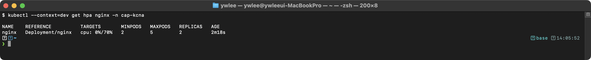
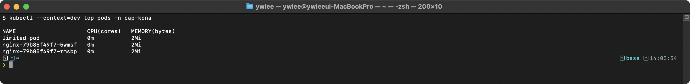
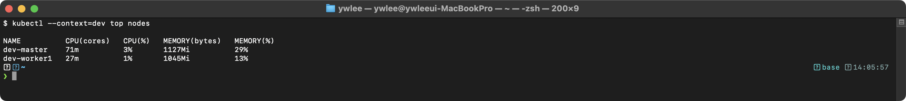

# KCNA Day 6: Cloud Native Architecture - CNCF, 마이크로서비스, 서비스 메시, 오토스케일링

> 학습 목표: CNCF 생태계, 클라우드 네이티브 설계 원칙, 서비스 메시, 오토스케일링을 이해한다.
> 예상 소요 시간: 60분 (개념 40분 + 문제 20분)
> 시험 도메인: Cloud Native Architecture (16%)
> 난이도: ★★★★☆

---

## 오늘의 학습 목표

> Day 5에서 K8s 네트워킹(Service, Ingress, NetworkPolicy)을 다뤘다. Day 6은 그 위에 올라서는 Cloud Native 설계 철학과 생태계를 학습한다. 이 내용은 KCNA 시험 도메인 "Cloud Native Architecture(16%)"에서 직접 출제된다.

| 번호 | 목표 | 해당 섹션 |
|:---:|:---|:---|
| 1 | CNCF 프로젝트 성숙도(Sandbox/Incubating/Graduated)를 안다 | §1 |
| 2 | Cloud Native의 핵심 5대 요소를 나열할 수 있다 | §2.1 |
| 3 | 마이크로서비스와 모놀리식 아키텍처의 차이를 설명한다 | §3.1 |
| 4 | 서비스 메시(Istio, Linkerd)의 Control/Data Plane을 이해한다 | §4 |
| 5 | HPA, VPA, Cluster Autoscaler를 구분한다 | §5 |
| 6 | 12-Factor App의 핵심 원칙을 안다 | §3.2 |

---

## 0. 등장 배경

전통적인 애플리케이션은 모놀리식 아키텍처로 개발되었다. 하나의 큰 코드베이스를 하나의 프로세스로 배포했고, 스케일링은 서버 전체를 복제하는 수직 확장(Scale-up)에 의존했다. 이 방식은 배포 시 전체 앱을 재시작해야 하고, 하나의 모듈 장애가 전체 시스템 다운으로 이어지며, 특정 모듈만 독립적으로 확장할 수 없는 한계가 있었다. Cloud Native는 이러한 한계를 해결하기 위해 등장했다. 컨테이너로 앱을 패키징하고, 마이크로서비스로 분리하며, Kubernetes로 오케스트레이션하고, 서비스 메시로 통신을 관리하는 일련의 기술 스택이다. CNCF는 이 생태계를 벤더 중립적으로 관리하는 거버넌스 기관이다.

---

## 1. CNCF (Cloud Native Computing Foundation)

### 1.1 CNCF 프로젝트 성숙도 (시험 빈출!)

```
CNCF 프로젝트 성숙도 단계
============================================================

Sandbox (샌드박스) → 초기 실험 단계
  - 개념 증명 수준
  - 프로덕션 사용 권장하지 않음
  - 최소 2명의 TOC(Technical Oversight Committee, CNCF 기술 감독 위원회) 스폰서 필요
    (TOC: CNCF 내 기술 방향과 프로젝트 진입을 심의하는 위원회이다)

     ↓

Incubating (인큐베이팅) → 성장 단계
  - 실제 환경에서 사용되기 시작
  - 활발한 커뮤니티
  - 프로덕션 사용 일부 가능

     ↓

Graduated (졸업) → 성숙 단계
  - 프로덕션 준비 완료
  - 보안 감사(Security Audit) 완료 필수!
  - 대규모 프로덕션 환경에서 검증됨

시험 포인트:
- Graduated 필수 조건 = 보안 감사(Security Audit) 완료
- 순서: Sandbox → Incubating → Graduated
```

**보안 감사(Security Audit)**: CNCF가 외부 보안 전문 기관에 의뢰하여 프로젝트의 소스 코드와 설계를 독립적으로 검토하는 프로세스이다. 취약점 발굴과 권고사항 이행이 포함되며, 일반 사용자도 보고서를 공개 열람할 수 있다. Graduated 단계에서 이 절차가 필수인 이유는 대규모 프로덕션에서 쓰이는 프로젝트일수록 외부 감사가 신뢰성의 기반이 되기 때문이다.

### 1.2 주요 CNCF 졸업 프로젝트

| 프로젝트 | 카테고리 | 핵심 한 줄 |
|----------|---------|-----------|
| Kubernetes | 오케스트레이션 | 컨테이너 오케스트레이션 플랫폼 |
| Prometheus | 모니터링 | Pull 기반 메트릭 수집 |
| Envoy | 프록시 | Istio의 사이드카, L7 프록시 |
| CoreDNS | DNS | K8s 기본 DNS 서버 |
| containerd | 런타임 | 고수준 컨테이너 런타임 |
| etcd | 저장소 | 분산 키-값 저장소, Raft |
| Fluentd | 로깅 | 통합 로깅 계층 |
| Fluent Bit | 로깅 | Fluentd 경량 버전 |
| Helm | 패키지 | K8s 패키지 매니저 |
| Harbor | 레지스트리 | 프라이빗 컨테이너 레지스트리 |
| Jaeger | 트레이싱 | 분산 트레이싱 (Uber) |
| Linkerd | 서비스 메시 | 경량 서비스 메시 |
| ArgoCD | CI/CD | GitOps CD |
| Flux | CI/CD | GitOps CD |
| Cilium | 네트워킹 | eBPF 기반 CNI |
| Falco | 보안 | 런타임 보안 모니터링 |
| Istio | 서비스 메시 | 가장 유명한 서비스 메시 |

**용어 풀이**:
- **CNI(Container Network Interface)**: K8s가 Pod 네트워크를 구성할 때 호출하는 표준 플러그인 인터페이스이다. Cilium, Calico, Flannel 등이 CNI를 구현한다. "CNI 플러그인 = Pod에 IP를 부여하고 노드 간 라우팅을 설정하는 구성요소"로 이해하면 된다.
- **eBPF(extended Berkeley Packet Filter)**: Linux 커널 내에서 샌드박스 프로그램을 실행하는 기술이다. 커널 소스를 수정하거나 모듈을 로드하지 않고도 네트워크·보안·관측성 기능을 커널 레벨에서 고성능으로 구현할 수 있다. Cilium은 eBPF를 활용해 iptables 없이 L3/L4 네트워크 정책을 처리한다.
- **Raft**: 분산 시스템에서 여러 노드 간 데이터 일관성을 보장하는 합의(Consensus) 알고리즘이다. etcd가 Raft를 사용하여 K8s 클러스터 상태를 복수 노드에 안전하게 복제한다.

### 1.3 주요 CNCF 인큐베이팅 프로젝트

| 프로젝트 | 카테고리 |
|----------|---------|
| OpenTelemetry | 관측성 통합 프레임워크 |
| CRI-O | K8s 전용 컨테이너 런타임 |
| Crossplane | K8s 기반 클라우드 인프라 관리 |
| Knative | 서버리스 플랫폼 |

### 직접 해보기 — CNCF 성숙도 확인 (5분)

> **시나리오**: "tart dev 클러스터에 설치된 CNCF 프로젝트들의 성숙도 단계를 명령어로 확인하라."

```bash
export KUBECONFIG=~/sideproejct/IaC_apple_sillicon/kubeconfig/dev.yaml
# Cilium(Graduated) Pod 수 확인
kubectl get pods -n kube-system -l k8s-app=cilium --no-headers | wc -l
# CoreDNS(Graduated) 버전 확인
kubectl get deployment -n kube-system coredns -o jsonpath='{.spec.template.spec.containers[0].image}'
```

셀프 채점 기준:
- Cilium Pod가 노드 수만큼 Running 상태이면 정상이다.
- CoreDNS 이미지 태그로 버전을 확인한다.
- "이 프로젝트가 Graduated인 이유가 보안 감사 때문이다"를 한 줄로 설명할 수 있으면 합격이다.

---

## 2. Cloud Native 핵심 개념

### 2.1 Cloud Native 5대 요소

```
Cloud Native 정의 (CNCF)
============================================================

CNCF가 정의하는 Cloud Native의 핵심 요소:

1. 컨테이너 (Containers)
   - 앱과 의존성을 패키징하는 표준 단위

2. 서비스 메시 (Service Mesh)
   - 서비스 간 통신을 관리하는 인프라 계층

3. 마이크로서비스 (Microservices)
   - 독립적으로 배포/확장 가능한 작은 서비스들

4. 불변 인프라 (Immutable Infrastructure)
   - 수정하지 않고 교체하는 인프라 관리 방식

5. 선언적 API (Declarative APIs)
   - "무엇을" 원하는지 선언 (K8s YAML)

핵심: "모놀리식 아키텍처"는 Cloud Native가 아니다!
```

### 2.2 불변 인프라 (Immutable Infrastructure)

**등장 배경**: 전통적 서버 운영에서는 운영팀이 서버에 직접 SSH 접속하여 패키지를 설치하고 설정 파일을 수정하는 방식(Mutable Infrastructure)을 사용했다. 이를 반복하면 각 서버의 실제 상태가 문서와 달라지고, 서버마다 미묘한 차이가 생기는 "눈송이 서버(Snowflake Server)" 문제가 발생했다. "이 서버에서는 되는데 저 서버에서는 안 된다"는 상황이 반복됐다. 장애 발생 시 환경을 재현하기 어려워 원인 분석도 힘들었다.

**무엇이 나아졌나**: 불변 인프라는 배포된 인프라를 수정하지 않는다. 변경이 필요하면 새 이미지를 빌드하여 교체한다. 모든 변경은 소스 코드(Dockerfile, YAML)에 기록되며, 동일한 이미지를 어느 서버에 배포해도 동일한 상태가 보장된다.

**트레이드오프**: 사소한 설정 변경에도 이미지 빌드·배포 파이프라인을 거쳐야 하므로 즉각적인 핫픽스가 어렵다. CI/CD 파이프라인이 성숙해야 효과가 크다. 또한 상태(State)가 있는 데이터(DB)는 불변 원칙을 그대로 적용하기 어려워 별도 전략이 필요하다.

```
불변 인프라 원칙
============================================================

전통적 방식 (Mutable):
  서버 설치 → 패치 적용 → 설정 변경 → 업데이트
  문제: 환경 불일치(snowflake server), 재현 불가

불변 인프라 (Immutable):
  이미지 빌드 → 배포 → 변경 필요 시 새 이미지로 교체
  장점: 일관성, 재현 가능, 롤백 용이

예시:
  - 컨테이너 이미지 = 불변
  - kubectl 직접 수정 금지 → YAML 변경 후 apply
  - 서버에 SSH 접속하여 수정 금지
```

---

## 3. 마이크로서비스 vs 모놀리식

### 3.1 비교

```
마이크로서비스 vs 모놀리식 비교
============================================================

모놀리식 아키텍처 (Monolithic):
  +-------------------------------------+
  |         하나의 배포 단위               |
  |  [사용자 모듈] [주문 모듈] [결제 모듈] |
  |  [재고 모듈] [알림 모듈] [인증 모듈]  |
  +-------------------------------------+
  장점: 단일 배포, 간단한 트랜잭션, 낮은 지연
  단점: 전체 배포, 단일 장애점, 전체 스케일링

마이크로서비스 아키텍처 (Microservices):
  [사용자] [주문] [결제] [재고] [알림] [인증]
     ↕       ↕       ↕       ↕       ↕       ↕
  독립 배포 / 독립 확장 / 독립 기술 스택
  장점: 독립 배포, 장애 격리, 서비스별 스케일링
  단점: 분산 복잡성, 네트워크 지연, 분산 트랜잭션
```

### 직접 해보기 — 마이크로서비스 vs 모놀리식 판단 (3분)

> **시나리오**: "다음 중 마이크로서비스 아키텍처의 특성에 해당하는 것을 고르고, 그 이유를 한 문장으로 설명하라."
>
> 보기: (A) 하나의 WAR 파일로 배포한다 (B) 결제 서비스만 독립적으로 스케일링한다 (C) 단일 데이터베이스를 모든 모듈이 공유한다 (D) 장애가 나면 전체 시스템이 다운된다

정답: (B). 독립 스케일링은 마이크로서비스의 핵심 장점이다. (A)(C)(D)는 모놀리식 특성이다.

---

### 3.2 12-Factor App

**등장 배경**: 2011년 Heroku의 Adam Wiggins가 PaaS 플랫폼에서 수천 개의 앱을 운영하며 겪은 패턴을 정리해 발표했다. 그 이전 SaaS 배포는 팀마다 다른 방식으로 설정을 관리하고, 로그를 로컬 파일에 쓰고, 상태(세션)를 앱 메모리에 저장했다. 같은 코드를 개발 환경과 프로덕션에 배포해도 동작이 달라지는 "works on my machine" 문제가 반복됐다. Heroku는 이 고통들의 공통 원인을 분석하여 12가지 원칙으로 표준화했다.

**K8s 매핑 핵심 3가지**: KCNA 시험에서 직접 묻는 Factor와 K8s 구현체의 연결은 다음과 같다.
- **Factor III Config(설정 외부화)**: 설정을 코드에 하드코딩하지 않고 환경 변수로 외부화한다 → K8s ConfigMap/Secret이 이 원칙의 구현체이다.
- **Factor VI Processes(무상태)**: 앱 프로세스는 상태를 자신의 메모리에 저장하지 않는다 → K8s Deployment(Stateless 워크로드)가 기본 구현이며, 상태가 필요하면 StatefulSet이 별도 예외로 존재한다.
- **Factor XI Logs(로그 스트림)**: 로그를 파일에 쓰지 않고 stdout/stderr로 출력한다 → K8s는 `kubectl logs`로 컨테이너 stdout을 수집하며, Fluentd/Fluent Bit이 이를 중앙 저장소로 전달한다.

12-Factor App은 마이크로서비스 아키텍처를 실제로 구현하고 운영할 때 따라야 할 설계 원칙이다. §3.1에서 마이크로서비스의 장단점을 파악했다면, 이제 마이크로서비스를 클라우드 환경에서 올바르게 개발하기 위한 구체적 가이드라인을 학습한다.

> **12-Factor App**이란?
> 클라우드 환경에 적합한 SaaS(Software as a Service) 앱을 개발하기 위한 방법론이다.

```
12-Factor App 핵심 원칙 (KCNA에서 자주 나오는 것들)
============================================================

1. Codebase: 하나의 코드베이스, 여러 배포
2. Dependencies: 명시적 의존성 선언
3. Config: 설정을 환경 변수로 외부화 (ConfigMap!)
4. Backing Services: 부착된 리소스로 취급 (DB, 캐시)
5. Build, Release, Run: 빌드와 실행을 엄격히 분리
6. Processes: 무상태(Stateless) 프로세스로 실행
7. Port Binding: 포트 바인딩으로 서비스 노출
8. Concurrency: 프로세스 모델로 수평 확장 (HPA!)
9. Disposability: 빠른 시작과 우아한 종료
10. Dev/Prod Parity: 개발/프로덕션 환경 일치
11. Logs: 이벤트 스트림으로 로그 처리 (stdout)
12. Admin Processes: 관리 작업을 일회성 프로세스로 실행
```

### 직접 해보기 — 12-Factor Config 원칙 확인 (5분)

> **시나리오**: "dev 클러스터의 demo 네임스페이스에 배포된 Pod가 ConfigMap을 환경 변수로 주입받는지 확인하라. Factor III(Config 외부화) 원칙을 구현한 리소스를 찾아라."

**사전 배포 단계**: demo 네임스페이스에 ConfigMap과 이를 환경변수로 주입하는 Pod가 없으면 아래 명령으로 먼저 생성한다.

```bash
export KUBECONFIG=~/sideproejct/IaC_apple_sillicon/kubeconfig/dev.yaml
kubectl create namespace demo --dry-run=client -o yaml | kubectl apply -f -
kubectl create configmap demo-config -n demo \
  --from-literal=DB_HOST=postgres.demo.svc.cluster.local \
  --from-literal=APP_ENV=development \
  --dry-run=client -o yaml | kubectl apply -f -
kubectl run demo-app --image=nginx:alpine -n demo \
  --env="DB_HOST=$(kubectl get configmap demo-config -n demo -o jsonpath='{.data.DB_HOST}')" \
  --dry-run=client -o yaml | kubectl apply -f -
```

```bash
export KUBECONFIG=~/sideproejct/IaC_apple_sillicon/kubeconfig/dev.yaml
# demo 네임스페이스의 ConfigMap 목록 확인
kubectl get configmap -n demo
# 특정 ConfigMap의 데이터 키 확인
kubectl get configmap -n demo -o jsonpath='{range .items[*]}{.metadata.name}{": "}{.data}{"\n"}{end}'
# Pod의 환경변수 주입 확인 (첫 번째 Pod)
kubectl get pods -n demo -o name | head -1 | xargs -I{} kubectl exec {} -n demo -- env | grep -v ^PATH
```

셀프 채점 기준:
- ConfigMap이 존재하고, Pod의 환경변수에 ConfigMap 값이 주입되어 있으면 Factor III 구현이다.
- "Factor III가 없으면 이미지 안에 DB 주소가 하드코딩된다"고 설명할 수 있으면 합격이다.

---

## 4. 서비스 메시 (Service Mesh)

### 4.1 서비스 메시 개념

**등장 배경**: 마이크로서비스 아키텍처에서는 수십~수백 개의 서비스가 서로 HTTP/gRPC로 통신한다. 서비스 A가 서비스 B를 호출할 때 네트워크 장애가 발생하면 어떻게 할 것인가? 초기에는 각 개발팀이 자신의 서비스 코드 안에 재시도(retry), 회로 차단(circuit breaker), 타임아웃 로직을 직접 구현했다. Netflix의 Hystrix 라이브러리가 대표적이다. 이 방식의 한계는 언어마다 별도 라이브러리가 필요하고(Java는 Hystrix, Go는 별도), 정책이 서비스마다 제각각이며, 트래픽 흐름을 관찰(observability)하려면 또 별도 계측(instrumentation) 코드를 심어야 한다는 점이었다.

**무엇이 나아졌나**: 서비스 메시는 이 로직을 애플리케이션에서 꺼내 인프라 계층(사이드카 프록시)으로 이동시킨다. 개발팀은 비즈니스 로직에만 집중하고, 재시도/회로차단/mTLS/분산 추적은 메시가 자동으로 처리한다. 어떤 언어로 작성된 서비스든 동일한 정책이 균일하게 적용된다.

**트레이드오프**: 각 Pod마다 사이드카 프록시 컨테이너가 추가되므로 CPU·메모리 오버헤드가 발생한다. 네트워크 홉(hop)이 늘어나 latency가 소폭 증가한다. 서비스 메시 자체의 운영 복잡도(Control Plane 관리, 인증서 순환)가 추가된다.

**사이드카 프록시(Sidecar Proxy)**: 주 애플리케이션 컨테이너와 동일한 Pod 안에서 실행되며, Pod의 모든 인바운드·아웃바운드 네트워크 트래픽을 가로채는 프록시 프로세스이다. 애플리케이션은 자신이 프록시를 통해 통신한다는 사실을 모른다.

**mTLS(mutual TLS)**: 클라이언트와 서버가 각자의 인증서로 서로를 검증하는 양방향 TLS 인증이다. 일반 TLS는 서버만 인증서를 제시하지만, mTLS는 클라이언트도 인증서를 제시하므로 서비스 간 신원 확인과 트래픽 암호화를 동시에 달성한다.

> **서비스 메시**란?
> 마이크로서비스 간 **네트워크 통신을 관리, 보호, 관찰**하는 전용 인프라 계층이다. 애플리케이션 코드 변경 없이 트래픽 관리, mTLS 보안, 관측성을 제공한다.

### 4.2 Control Plane vs Data Plane (시험 빈출!)

**왜 Control Plane과 Data Plane으로 나뉘는가**: 설정 배포(Control)와 트래픽 처리(Data)를 분리하면 각각을 독립적으로 확장하고 변경할 수 있다. 트래픽이 폭증해도 Control Plane은 변경할 필요가 없고, 정책을 바꿔도 Data Plane 프록시를 재시작할 필요가 없다. 이 분리 원칙은 SDN(Software Defined Networking)에서도 동일하게 적용된다.

**xDS API**: Envoy Discovery Service의 약자로, Control Plane이 Data Plane(Envoy 프록시)에게 설정을 동적으로 배포하는 프로토콜이다. xDS는 엔드포인트(EDS), 클러스터(CDS), 라우트(RDS), 리스너(LDS) 등 여러 Discovery Service의 총칭이다. istiod는 xDS API를 통해 각 Envoy 사이드카에 라우팅 규칙, 인증서, 정책을 실시간으로 전달한다.

```
서비스 메시 아키텍처
============================================================

Control Plane (제어부):
  +------------------+
  | istiod (Istio)   |  ← 설정/정책 관리
  | 또는              |     인증서 발급
  | linkerd-control  |     서비스 디스커버리
  +--------+---------+
           |
           | 설정 전파 (xDS API)
           |
Data Plane (데이터부):
  +--------v---------+     +---------+---------+
  | Pod A            |     | Pod B             |
  | +------+ +-----+ |     | +------+ +-----+  |
  | | App  | |Proxy| |<--->| | App  | |Proxy|  |
  | +------+ +-----+ |     | +------+ +-----+  |
  +------------------+     +-------------------+
     사이드카 프록시가          사이드카 프록시가
     모든 트래픽을 가로챔       모든 트래픽을 가로챔

핵심:
  Control Plane = 설정/정책 관리 (두뇌)
  Data Plane = 사이드카 프록시가 트래픽 처리 (실행)
```

### 4.3 Istio vs Linkerd

**Istio 컴포넌트 통합 이력**: Istio 1.5 이전에는 Pilot(서비스 디스커버리·트래픽 관리), Citadel(인증서 발급·관리), Galley(설정 검증·변환) 컴포넌트가 각각 분리된 Pod로 실행됐다. 1.5부터 이 세 컴포넌트가 istiod 단일 바이너리로 통합됐다. 분산 배포 시 컴포넌트 간 gRPC 통신 오버헤드와 개별 장애 지점이 문제였기 때문이다.

**설계 철학의 차이**: Istio는 "하나의 메시 플랫폼으로 모든 기능을 제공한다"는 방향으로 설계됐다. 트래픽 관리, mTLS, 정책, 관측성, 외부 CA 연동 등 복잡한 요구사항을 하나의 컨트롤 플레인(istiod)으로 처리한다. 반면 Linkerd는 "필요한 기능만 넣고 나머지는 빼서 운영 부담을 줄인다"는 방향이다. 사이드카도 범용 Envoy 대신 Rust로 만든 전용 프록시(linkerd2-proxy)를 써서 메모리 사용량을 줄였다. 따라서 "기능이 중요하면 Istio, 단순함·경량이 중요하면 Linkerd"라고 이해하면 된다.

| 항목 | Istio | Linkerd |
|------|-------|---------|
| **Data Plane** | **Envoy** (CNCF 졸업) | linkerd2-proxy (Rust) |
| **복잡성** | 높음 (기능 풍부) | 낮음 (경량) |
| **리소스** | 더 많은 리소스 | 더 적은 리소스 |
| **기능** | 매우 풍부 | 핵심에 집중 |
| **CNCF** | **졸업** | **졸업** |

**시험 포인트:**
- Istio의 사이드카 프록시 = **Envoy**
- Envoy = CNCF **졸업** 프로젝트
- Control Plane = 설정, Data Plane = 트래픽

**주의 — Istio Ambient Mode**: Istio 1.22+에서 Ambient Mode(사이드카 없이 ztunnel 노드 프록시를 사용하는 방식)가 GA(정식 출시)됐다. 기존 사이드카 모델은 Pod마다 Envoy 컨테이너를 주입했지만, Ambient Mode는 노드 단위의 ztunnel 프록시가 트래픽을 처리하여 사이드카의 오버헤드를 제거한다. KCNA 현행 시험은 사이드카 모델을 기준으로 출제되지만, 2024+ 버전 시험에서 Ambient Mode 개념이 포함될 수 있으므로 "Istio = 반드시 사이드카"라는 고정관념은 피한다.

### 직접 해보기 — 서비스 메시 사이드카 확인 (5분)

> **시나리오**: "dev 클러스터의 demo 네임스페이스에서 istio-injection이 활성화되어 있는지 확인하고, Pod에 사이드카(istio-proxy)가 주입되었는지 검증하라."

```bash
export KUBECONFIG=~/sideproejct/IaC_apple_sillicon/kubeconfig/dev.yaml
# 네임스페이스 레이블 확인
kubectl get namespace demo --show-labels
# Pod별 컨테이너 목록 확인 (istio-proxy가 있으면 사이드카 주입됨)
kubectl get pods -n demo -o jsonpath='{range .items[*]}{.metadata.name}{"\t"}{range .spec.containers[*]}{.name}{" "}{end}{"\n"}{end}'
# istiod(Control Plane) 상태 확인
kubectl get pods -n istio-system -l app=istiod
```

셀프 채점 기준:
- `istio-injection=enabled` 레이블이 있으면 해당 네임스페이스의 Pod에 사이드카가 자동 주입된다.
- Pod 컨테이너 목록에 `istio-proxy`가 보이면 Data Plane(Envoy)이 동작 중이다.
- "istiod가 없으면 사이드카가 설정을 받지 못해 트래픽 정책이 적용되지 않는다"를 설명할 수 있으면 합격이다.

---

## 5. 오토스케일링

§4에서 서비스 메시로 트래픽을 관리하는 방법을 배웠다. 이제 트래픽 폭증에 대응하기 위해 컴퓨팅 자원 자체를 자동으로 조절하는 오토스케일링을 다룬다.

**등장 배경**: 클러스터 부하가 몰릴 때 운영자가 직접 `kubectl scale` 명령을 실행하던 방식의 한계(야간 트래픽 폭증 대응 불가, 수동 튜닝 지연)에서 오토스케일러가 등장했다. Pod 수(HPA), Pod 리소스(VPA), 노드 수(Cluster Autoscaler)의 세 층위를 자동으로 조절하여 운영자의 개입 없이 부하를 처리한다.

### 5.1 3가지 오토스케일러

**resources.requests와 limits**: K8s에서 컨테이너 리소스를 정의하는 두 가지 값이다.
- `requests`: 스케줄러가 Pod를 노드에 배치할 때 기준으로 삼는 최소 보장 리소스이다. "이 컨테이너는 최소 이만큼은 필요하다"는 선언이며, 노드의 할당 가능 리소스(Allocatable)에서 차감된다.
- `limits`: 컨테이너가 사용할 수 있는 최대 리소스이다. CPU는 초과 시 throttling(강제 속도 제한)이 걸리고, 메모리는 초과 시 OOMKill(프로세스 강제 종료)이 발생한다.
- HPA는 `현재 CPU 사용량 / requests 값 × 100`으로 사용률(%)을 계산하므로, requests가 없으면 사용률 계산 자체가 불가능하다.

```
K8s 오토스케일링 3종류
============================================================

1. HPA (Horizontal Pod Autoscaler) = Pod 수 조절
   CPU/메모리 사용률 → Pod 수를 늘리거나 줄임
   필수 조건: metrics-server + resources.requests 설정

2. VPA (Vertical Pod Autoscaler) = 리소스 조절
   Pod의 requests/limits를 자동으로 조절
   Pod 재시작이 필요할 수 있음

3. Cluster Autoscaler = 노드 수 조절
   Pending Pod 발생 → 클라우드에 노드 추가
   노드 활용도 낮음 → 노드 제거

핵심:
  HPA = Pod 수 (수평)
  VPA = 리소스 (수직)
  Cluster Autoscaler = 노드 수
```

**VPA와 HPA 동시 사용 제약 (시험 함정!)**: VPA(CPU 기반)와 HPA(CPU 기반)를 동일 Deployment에 동시 적용하면 두 컨트롤러가 `replicas`와 `requests` 값을 서로 덮어쓰는 충돌이 발생한다. HPA는 CPU 사용률에 따라 Pod 수를 늘리고, VPA는 CPU requests를 올리는데, VPA가 requests를 높이면 HPA의 사용률 계산값이 낮아져 스케일 인이 트리거되는 피드백 루프가 생길 수 있다. VPA는 HPA가 없는 경우, 또는 HPA가 CPU/메모리가 아닌 custom metrics(예: 큐 길이, RPS)를 기준으로 스케일링하는 경우에만 함께 사용한다.

### 5.2 VPA YAML 예제 (참고)

VPA(Vertical Pod Autoscaler)는 K8s 코어에 포함되지 않으므로 별도 설치가 필요하다. 아래는 VPA 리소스의 기본 구조이다.

```yaml
apiVersion: autoscaling.k8s.io/v1
kind: VerticalPodAutoscaler
metadata:
  name: web-vpa
  namespace: demo
spec:
  targetRef:
    apiVersion: apps/v1
    kind: Deployment
    name: web-app
  updatePolicy:
    updateMode: "Auto"       # Auto: Pod 재시작으로 requests 자동 조정
                             # Off: 권고값만 계산(실제 변경 없음, 모니터링용)
  resourcePolicy:
    containerPolicies:
    - containerName: "*"
      minAllowed:
        cpu: 100m
        memory: 128Mi
      maxAllowed:
        cpu: "2"
        memory: 2Gi
```

`updateMode: "Auto"`는 VPA가 권고한 requests 값으로 Pod를 재시작하여 실제 적용한다. `updateMode: "Off"`는 `kubectl describe vpa`의 `Recommendation` 항목에 권고값만 표시하며 Pod를 건드리지 않는다. 운영 초기에는 `Off`로 며칠간 권고값을 관찰한 뒤 `Auto`로 전환하는 것이 안전하다.

**Cluster Autoscaler 동작 조건**: Cluster Autoscaler는 클라우드 프로바이더(AWS EKS, GCP GKE 등)의 노드 그룹 API를 직접 호출하므로 로컬 tart 환경에서는 동작하지 않는다. 개념만 이해한다.

동작 흐름: Pending Pod 발생(노드 리소스 부족) → Cluster Autoscaler가 Pending Pod 감지 → 클라우드 API로 노드 추가 요청 → 노드 프로비저닝 완료 → Pod 스케줄링. 반대로 노드 활용률이 오랫동안 낮으면(기본 10분) 노드를 드레인(drain) 후 삭제한다.

시험 포인트: Cluster Autoscaler는 Pending Pod가 있어야 스케일 아웃이 트리거된다. CPU 사용률이 높아도 Pending Pod가 없으면 노드를 추가하지 않는다(HPA와의 차이).

### 5.3 HPA YAML 예제

```yaml
apiVersion: autoscaling/v2
kind: HorizontalPodAutoscaler
metadata:
  name: web-hpa
  namespace: demo
spec:
  scaleTargetRef:
    apiVersion: apps/v1
    kind: Deployment
    name: web-app
  minReplicas: 2                   # 최소 Pod 수
  maxReplicas: 10                  # 최대 Pod 수
  metrics:
  - type: Resource
    resource:
      name: cpu
      target:
        type: Utilization
        averageUtilization: 70     # CPU 70% 초과 시 스케일 아웃
```

### 직접 해보기 — HPA 생성 및 스케일 아웃 트리거 (10분)

> **시나리오**: "dev 클러스터 demo 네임스페이스에 nginx Deployment를 생성하고, CPU 50% 초과 시 Pod 수를 최대 5개까지 늘리는 HPA를 설정하라. metrics-server가 동작하는지 먼저 검증하라."

```bash
export KUBECONFIG=~/sideproejct/IaC_apple_sillicon/kubeconfig/dev.yaml

# 0. metrics-server 동작 확인 (HPA 필수 조건)
kubectl top nodes

# 1. nginx Deployment 생성 (resources.requests 필수!)
kubectl create deployment nginx-hpa --image=nginx:alpine -n demo --dry-run=client -o yaml \
  | kubectl set resources -f - --requests=cpu=100m --limits=cpu=200m --dry-run=client -o yaml \
  | kubectl apply -f -

# 2. HPA 생성
kubectl autoscale deployment nginx-hpa --cpu-percent=50 --min=1 --max=5 -n demo

# 3. HPA 상태 확인 (TARGETS 컬럼이 숫자%로 표시되면 정상)
kubectl get hpa nginx-hpa -n demo

# 4. 부하 생성 (별도 터미널에서)
kubectl run load-gen --image=busybox -n demo --rm -it --restart=Never \
  -- sh -c "while true; do wget -q -O- http://nginx-hpa.demo.svc.cluster.local; done"

# 5. 스케일 아웃 확인 (약 1-2분 후)
kubectl get hpa nginx-hpa -n demo -w

# 6. 정리
kubectl delete deployment nginx-hpa -n demo
kubectl delete hpa nginx-hpa -n demo
```

셀프 채점 기준:
- `kubectl top nodes`가 숫자를 반환하면 metrics-server가 동작 중이다.
- HPA TARGETS 컬럼에 `<unknown>` 대신 퍼센트(%)가 표시되면 resources.requests 설정이 올바르다.
- 부하 생성 후 REPLICAS가 1에서 증가하면 HPA 스케일 아웃이 성공이다.
- "HPA가 VPA와 함께 동일 Deployment에 쓰이면 안 되는 이유"를 한 줄로 설명할 수 있으면 합격이다.

### 5.4 서버리스 & Knative

> **서버리스(Serverless)**란?
> 서버 관리 없이 코드만 배포하여 실행하는 컴퓨팅 모델이다. 요청이 없으면 리소스를 0으로 줄일 수 있다.

> **Knative**란?
> K8s 기반 **서버리스 플랫폼**으로, CNCF **인큐베이팅** 프로젝트이다. Scale-to-Zero(요청 없으면 Pod 0개)를 지원한다.

**KCNA 시험 함정 — HPA vs Knative Scale-to-Zero**:
HPA는 `minReplicas` 파라미터가 최소 1 이상이어야 하므로 요청이 없어도 Pod가 최소 1개 남는다. 비용이 지속적으로 발생한다. Knative는 요청이 전혀 없으면 Pod를 0개로 줄여 리소스를 완전히 반납한다(Scale-to-Zero). 다음 요청이 들어오면 Pod를 다시 기동한다(콜드 스타트 지연 발생). 따라서 HPA는 "항상 켜져 있는 서비스"에, Knative는 "간헐적으로 요청이 오는 서버리스 워크로드"에 적합하다.

---

## 6. KCNA 실전 모의 문제 (12문제)

> 각 문제에는 `[영역]` 태그가 표시된다. 도메인 비중: Cloud Native Architecture 16% | Cloud Native Observability 8% | Cloud Native Application Delivery 8% | Kubernetes Fundamentals 46% | CNCF Projects 22%.

### 문제 1. `[Cloud Native Architecture - CNCF 생태계]`
CNCF 프로젝트의 성숙도 단계를 올바른 순서대로 나열한 것은?

A) Incubating → Sandbox → Graduated
B) Sandbox → Graduated → Incubating
C) Sandbox → Incubating → Graduated
D) Graduated → Incubating → Sandbox

<details><summary>정답 확인</summary>

**정답: C) Sandbox → Incubating → Graduated**

Sandbox(초기) → Incubating(성장) → Graduated(성숙). Graduated는 보안 감사 완료 필수이다.
</details>

---

### 문제 2. `[Cloud Native Architecture - CNCF 생태계]`
CNCF 프로젝트가 Graduated에 도달하기 위해 반드시 완료해야 하는 것은?

A) 100만 다운로드 달성
B) 보안 감사(Security Audit) 완료
C) 3년 이상 운영
D) 5개 이상 클라우드 제공업체 지원

<details><summary>정답 확인</summary>

**정답: B) 보안 감사(Security Audit) 완료**

CNCF Graduated 프로젝트가 되려면 독립적인 보안 감사를 통과해야 한다.
</details>

---

### 문제 3. `[Cloud Native Architecture - 핵심 개념]`
Cloud Native의 핵심 개념에 해당하지 않는 것은?

A) 컨테이너
B) 마이크로서비스
C) 모놀리식 아키텍처
D) 선언적 API

<details><summary>정답 확인</summary>

**정답: C) 모놀리식 아키텍처**

Cloud Native 핵심: 컨테이너, 서비스 메시, 마이크로서비스, 불변 인프라, 선언적 API. 모놀리식은 Cloud Native와 대비되는 전통적 아키텍처이다.
</details>

---

### 문제 4. `[Cloud Native Architecture - 서비스 메시]`
Istio 서비스 메시에서 사이드카 프록시로 사용되는 것은?

A) HAProxy
B) NGINX
C) Envoy
D) Traefik

<details><summary>정답 확인</summary>

**정답: C) Envoy**

Istio는 **Envoy**를 사이드카 프록시(Data Plane)로 사용한다. Envoy는 CNCF 졸업 프로젝트이다.
</details>

---

### 문제 5. `[Kubernetes Fundamentals - 오토스케일링]`
VPA(Vertical Pod Autoscaler)가 조정하는 것은?

A) Pod의 수
B) Pod의 리소스 requests와 limits
C) 노드의 수
D) Service의 엔드포인트 수

<details><summary>정답 확인</summary>

**정답: B) Pod의 리소스 requests와 limits**

HPA = Pod 수, VPA = 리소스, Cluster Autoscaler = 노드 수.
</details>

---

### 문제 6. `[Cloud Native Architecture - 불변 인프라]`
불변 인프라(Immutable Infrastructure)의 핵심 원칙은?

A) SSH로 서버에 접속하여 직접 수정한다
B) 변경이 필요하면 새로 빌드하여 교체한다
C) 설정 파일을 수동으로 편집한다
D) 운영 중인 서버에 패치를 적용한다

<details><summary>정답 확인</summary>

**정답: B) 변경이 필요하면 새로 빌드하여 교체한다**

불변 인프라는 배포된 인프라를 수정하지 않고 새로 빌드하여 교체하는 원칙이다.
</details>

---

### 문제 7. `[Kubernetes Fundamentals - 오토스케일링]`
HPA(Horizontal Pod Autoscaler)가 동작하기 위해 반드시 필요한 것은?

A) Ingress Controller와 NetworkPolicy
B) metrics-server와 Pod의 resources.requests 설정
C) VPA와 Cluster Autoscaler
D) Prometheus와 Grafana

<details><summary>정답 확인</summary>

**정답: B) metrics-server와 Pod의 resources.requests 설정**

HPA 필수: (1) metrics-server 설치 (2) Pod에 resources.requests 설정.
</details>

---

### 문제 8. `[Cloud Native Architecture - 서비스 메시]`
서비스 메시에서 Control Plane과 Data Plane의 역할로 올바른 것은?

A) Control Plane이 트래픽을 직접 처리한다
B) Control Plane이 설정/정책을 관리하고, Data Plane(사이드카 프록시)이 트래픽을 처리한다
C) 둘 다 트래픽을 처리한다
D) 둘 다 설정만 관리한다

<details><summary>정답 확인</summary>

**정답: B) Control Plane이 설정/정책을 관리하고, Data Plane(사이드카 프록시)이 트래픽을 처리한다**

Control Plane = 설정, Data Plane = 트래픽 처리.
</details>

---

### 문제 9. `[Cloud Native Architecture - 마이크로서비스]`
마이크로서비스 아키텍처의 단점이 아닌 것은?

A) 분산 트랜잭션 복잡성
B) 네트워크 지연
C) 독립적인 배포
D) 서비스 디스커버리 필요

<details><summary>정답 확인</summary>

**정답: C) 독립적인 배포**

독립적인 배포는 마이크로서비스의 **장점**이다. 분산 트랜잭션, 네트워크 지연, 서비스 디스커버리 필요성은 단점이다.
</details>

---

### 문제 10. `[Cloud Native Architecture - 12-Factor App]`
12-Factor App에서 설정(Config)을 관리하는 올바른 방법은?

A) 소스 코드에 하드코딩한다
B) 환경 변수로 외부화한다
C) 컨테이너 이미지에 포함한다
D) 데이터베이스에 저장한다

<details><summary>정답 확인</summary>

**정답: B) 환경 변수로 외부화한다**

12-Factor App의 Config 원칙: 설정은 코드와 분리하여 환경 변수로 관리한다. K8s의 ConfigMap이 이 원칙을 구현한다.
</details>

---

### 문제 11. `[Cloud Native Architecture - 서버리스]`
Knative에 대한 설명으로 올바른 것은?

A) 컨테이너 런타임이다
B) K8s 기반 서버리스 플랫폼으로, Scale-to-Zero를 지원한다
C) 분산 데이터베이스이다
D) CI 도구이다

<details><summary>정답 확인</summary>

**정답: B) K8s 기반 서버리스 플랫폼으로, Scale-to-Zero를 지원한다**

Knative는 CNCF 인큐베이팅 프로젝트이며 서버리스 워크로드를 K8s에서 실행한다.
</details>

---

### 문제 12. `[CNCF Projects - 보안]`
Falco에 대한 설명으로 올바른 것은?

A) 컨테이너 네트워크 플러그인이다
B) CNCF 졸업 프로젝트인 런타임 보안 모니터링 도구이다
C) K8s 패키지 매니저이다
D) 서비스 메시 도구이다

<details><summary>정답 확인</summary>

**정답: B) CNCF 졸업 프로젝트인 런타임 보안 모니터링 도구이다**

Falco는 컨테이너 런타임에서 비정상적인 활동(셸 접속, 파일 변경 등)을 실시간으로 감지하는 보안 도구이다.
</details>

---

### 분야별 정답률 자가 진단

문제를 풀고 아래 체크박스로 취약 영역을 파악한다.

- [ ] Cloud Native Architecture (문제 1,2,3,6,8,9,10,11): __/8점
- [ ] Kubernetes Fundamentals - 오토스케일링 (문제 5,7): __/2점
- [ ] CNCF Projects (문제 4,12): __/2점

6점 미만인 영역은 해당 섹션을 재학습한 뒤 다시 풀어본다.

---

## tart-infra 실습

**실습 전제조건**:
- 로컬 tart 클러스터가 가동 중이어야 한다. 가동 방법: `./scripts/boot.sh`
- 재부팅 후에는 반드시 IP 드리프트 복구를 먼저 실행한다: `./scripts/fix-cluster-ip-drift.sh dev`
- kubeconfig 경로: `~/sideproejct/IaC_apple_sillicon/kubeconfig/`
- 노드 SSH 접속: `ssh dev-master`, `ssh dev-worker1` (비밀번호 불필요, 전용 키 사전 배포)
- 실습 1·2는 platform/dev 클러스터를 사용하며 **읽기 전용**이다. 파괴 실습은 dev/staging에서만 수행한다.
- 아래 실습에서 `demo` 네임스페이스가 없는 경우 다음 명령으로 미리 생성한다:

```bash
kubectl --kubeconfig ~/sideproejct/IaC_apple_sillicon/kubeconfig/dev.yaml \
  create namespace demo --dry-run=client -o yaml | kubectl apply -f -
```

### 실습 환경 설정

```bash
# dev 클러스터 접속 (서비스 메시, 오토스케일링 확인용)
export KUBECONFIG=~/sideproejct/IaC_apple_sillicon/kubeconfig/dev.yaml

# 클러스터 상태 확인
kubectl get nodes
```

### 실습 1: CNCF 졸업 프로젝트 확인

tart-infra에 설치된 CNCF 프로젝트들의 성숙도 단계를 직접 확인한다.

```bash
# platform 클러스터의 CNCF 프로젝트 확인
export KUBECONFIG=~/sideproejct/IaC_apple_sillicon/kubeconfig/platform.yaml

# Prometheus (Graduated) - 모니터링
kubectl get pods -n monitoring -l app.kubernetes.io/name=prometheus

# Grafana (Graduated가 아님, 주의!) - 대시보드
kubectl get svc -n monitoring | grep grafana
# → Grafana는 CNCF 프로젝트가 아닌 독립 오픈소스 (시험 주의!)
# → tart-infra의 platform 클러스터에는 Prometheus 메트릭을 시각화하기 위해 Grafana가 설치되어 있다.
#    그러나 Grafana는 CNCF에 기증된 프로젝트가 아니므로 "CNCF 졸업 프로젝트" 문제에서 오답이 된다.

# ArgoCD (Graduated) - GitOps CD
kubectl get pods -n argocd

# dev 클러스터의 CNCF 프로젝트 확인
export KUBECONFIG=~/sideproejct/IaC_apple_sillicon/kubeconfig/dev.yaml

# Cilium (Graduated) - CNI/서비스 메시
kubectl get pods -n kube-system -l k8s-app=cilium

# Istio (Graduated) - 서비스 메시
kubectl get pods -n istio-system
```

**동작 원리:** CNCF Graduated 프로젝트는 보안 감사를 완료하고 대규모 프로덕션에서 검증된 프로젝트이다. tart-infra에서 사용 중인 Prometheus, ArgoCD, Cilium, Istio 모두 Graduated 단계이다.

### 실습 2: 서비스 메시(Istio) Control Plane / Data Plane 확인

```bash
export KUBECONFIG=~/sideproejct/IaC_apple_sillicon/kubeconfig/dev.yaml

# Control Plane: istiod (Pilot+Citadel+Galley 통합)
kubectl get pods -n istio-system -l app=istiod

# Data Plane: Envoy sidecar 주입 확인
kubectl get pods -n demo -o jsonpath='{range .items[*]}{.metadata.name}{"\t"}{range .spec.containers[*]}{.name}{" "}{end}{"\n"}{end}'

# 예상 출력 (sidecar 주입된 경우):
# nginx-xxx    nginx istio-proxy
# httpbin-xxx  httpbin istio-proxy
```

**동작 원리:** 서비스 메시는 Control Plane(istiod: 설정 배포, 인증서 관리)과 Data Plane(Envoy 사이드카: 실제 트래픽 처리)으로 구성된다. 각 Pod에 istio-proxy(Envoy) 컨테이너가 자동 주입되어 트래픽 관리, mTLS, 관측성을 앱 코드 수정 없이 제공한다.

### 실습 3: HPA(Horizontal Pod Autoscaler) 확인

```bash
# HPA 상태 확인
kubectl get hpa -n demo
```

검증:



```bash
# metrics-server 동작 확인 (HPA 필수 조건!)
kubectl top pods -n demo
```

검증:



```bash
kubectl top nodes
```

검증:



**동작 원리:** HPA는 metrics-server로부터 CPU/메모리 사용률을 수집하여 Pod 수를 자동 조절한다. `resources.requests`가 설정되어 있어야 사용률(%)을 계산할 수 있다. HPA = Pod 수 조절, VPA = Pod 리소스 조절, Cluster Autoscaler = 노드 수 조절이다.

---

## 트러블슈팅

### HPA가 동작하지 않을 때

```
증상: HPA의 TARGETS 컬럼에 <unknown>이 표시된다
  $ kubectl get hpa -n demo
  NAME    REFERENCE          TARGETS         MINPODS   MAXPODS   REPLICAS
  nginx   Deployment/nginx   <unknown>/80%   1         5         1

원인 분석:
  1. metrics-server가 설치되어 있지 않거나 동작하지 않는다
     $ kubectl get pods -n kube-system -l k8s-app=metrics-server
  2. Pod에 resources.requests가 설정되어 있지 않다
     → HPA는 사용률(%)을 계산하기 위해 requests 값이 필요하다
  3. metrics-server가 kubelet의 메트릭을 가져올 수 없다
     → TLS 인증서 문제 또는 네트워크 문제

해결:
  1. metrics-server 상태 확인 및 설치
  2. Deployment의 Pod template에 resources.requests 설정 추가
  3. kubectl top pods로 메트릭 수집이 되는지 확인
```

### 사이드카 프록시 주입이 되지 않을 때

```
증상: Pod에 istio-proxy 사이드카가 없다
  $ kubectl get pod my-app -n demo -o jsonpath='{.spec.containers[*].name}'
  → my-app   (istio-proxy가 없다)

원인 분석:
  1. 네임스페이스에 istio-injection 라벨이 없다
     $ kubectl get namespace demo --show-labels
     → istio-injection=enabled 라벨이 필요하다
  2. Pod에 sidecar.istio.io/inject: "false" 어노테이션이 있다
  3. istiod가 동작하지 않는다

해결:
  $ kubectl label namespace demo istio-injection=enabled
  → 이후 생성되는 Pod에만 적용된다. 기존 Pod는 재시작해야 한다.
```

---

## 복습 체크리스트

- [ ] CNCF 성숙도: Sandbox → Incubating → Graduated
- [ ] Graduated 조건: 보안 감사(Security Audit) 완료
- [ ] Cloud Native 5요소: 컨테이너, 서비스 메시, 마이크로서비스, 불변 인프라, 선언적 API
- [ ] 마이크로서비스 장점: 독립 배포, 장애 격리, 서비스별 스케일링
- [ ] 마이크로서비스 단점: 분산 복잡성, 네트워크 지연, 분산 트랜잭션
- [ ] 서비스 메시: Control Plane(설정) + Data Plane(트래픽)
- [ ] Istio = Envoy(프록시), Linkerd = linkerd2-proxy(Rust), 둘 다 졸업
- [ ] HPA = Pod 수, VPA = 리소스, Cluster Autoscaler = 노드 수
- [ ] HPA 필수: metrics-server + resources.requests
- [ ] 12-Factor App: 설정 외부화, 무상태, 개발=프로덕션 일치
- [ ] Knative = Scale-to-Zero 서버리스 (CNCF 인큐베이팅)
- [ ] 불변 인프라 = 수정 대신 교체

---

## 내일 학습 예고

> Day 7에서는 Cloud Native Observability를 학습한다. 관측성의 3대 축(Metrics, Logs, Traces)과 Prometheus, Grafana, Loki, Jaeger, OpenTelemetry를 다룬다.
