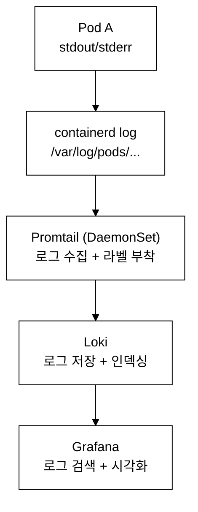
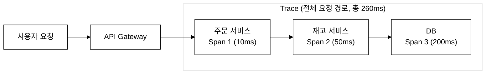
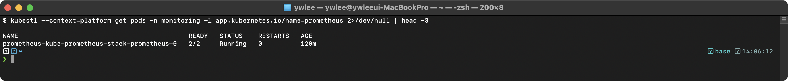
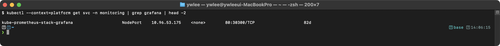
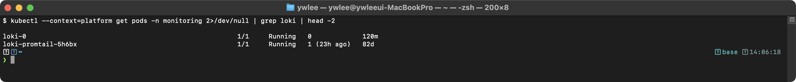

# KCNA Day 7: 관측성(Observability) - Prometheus, Grafana, 로깅, 트레이싱

> 학습 목표: 관측성의 3대 축과 주요 도구(Prometheus, Grafana, Loki, Jaeger, OpenTelemetry)를 이해한다.
> 예상 소요 시간: 60분 (개념 40분 + 심화 학습 20분)
> 시험 도메인: Cloud Native Observability (8%)
> 난이도: ★★★★☆

---

> **Day 6 연결:** Day 6에서는 HPA/VPA로 워크로드를 자동 스케일하고 스케줄러가 Pod을 노드에 배치하는 원리를 학습했다. Day 7에서는 "그 클러스터가 실제로 어떻게 동작하는지 측정하고 진단하는" 관측성(Observability) 도구로 시각을 전환한다.

## 오늘의 학습 목표

- 관측성의 3대 축(Metrics, Logs, Traces)을 설명할 수 있다
- Prometheus의 Pull 기반 메트릭 수집 방식과 4가지 메트릭 유형을 이해한다
- Grafana, Loki, Jaeger, OpenTelemetry의 역할을 구분한다
- 비용 관리(ResourceQuota, LimitRange)를 이해한다

---

## 0. 등장 배경

모놀리식 애플리케이션에서는 하나의 프로세스에서 모든 로직이 실행되었으므로, 로그 파일 하나를 grep하면 문제를 찾을 수 있었다. 그러나 마이크로서비스 아키텍처에서는 하나의 사용자 요청이 수십 개의 서비스를 거친다. 어떤 서비스에서 지연이 발생하는지, 어떤 서비스가 에러를 반환하는지 파악하려면 개별 서비스의 로그만으로는 부족하다. 이 문제를 해결하기 위해 관측성(Observability)이라는 개념이 등장했다. 메트릭(숫자)으로 전체 시스템 상태를 모니터링하고, 로그(텍스트)로 개별 이벤트를 추적하며, 트레이스(경로)로 서비스 간 호출 관계를 가시화한다. Prometheus(2012, SoundCloud), Fluentd(2011, Treasure Data), Jaeger(2016, Uber)는 각각 이 세 가지 축을 담당하며, OpenTelemetry는 이들을 하나의 표준으로 통합하려는 프로젝트이다.

더욱이 Kubernetes 환경에서는 Pod이 자동으로 생성되고 소멸하며(ephemeral — 일시적·비영구적), 동일한 애플리케이션 인스턴스라도 재스케줄링으로 노드와 IP가 바뀐다. 로깅과 모니터링도 K8s 메타데이터(라벨, 네임스페이스, Pod 이름)를 함께 기록해야 의미 있는 추적이 가능하다(예: Promtail이 Pod 라벨을 로그에 자동으로 부착). 따라서 관측성 도구는 K8s API와 통합되어 동적으로 변하는 타겟을 자동으로 검색할 수 있어야 한다.

---

## 1. 관측성(Observability)의 3대 축

### 1.1 관측성이란?

> **관측성(Observability)**이란?
> 시스템의 **외부 출력**(메트릭, 로그, 트레이스)을 관찰하여 **내부 상태**를 이해하는 능력이다. 단순히 "무엇이 잘못되었는가?"뿐 아니라 "왜 잘못되었는가?"를 파악할 수 있어야 한다.

> **기술 원리:** 관측성은 제어 이론에서 유래한 개념으로, 시스템의 외부 출력(Metrics, Logs, Traces)만으로 내부 상태를 추론할 수 있는 시스템의 속성이다. Metrics는 시계열 수치 데이터(Prometheus), Logs는 이산 이벤트 기록(Fluentd/Loki), Traces는 분산 요청의 인과 관계 경로(Jaeger/OpenTelemetry)를 제공한다.

> **모니터링(Monitoring) vs 관측성(Observability):**
> - **모니터링**: "알려진 문제"를 감시한다. "CPU가 90% 이상이면 알림"
> - **관측성**: "알려지지 않은 문제"도 진단할 수 있다. "왜 이 요청이 느린지 추적"

### 1.2 3대 축 상세 (시험 빈출!)

```
관측성의 3대 축 (Three Pillars of Observability)
============================================================

1. Metrics (메트릭)                    도구: Prometheus
   - 시간에 따른 수치 데이터
   - "현재 CPU 사용률이 85%이다"
   - 대시보드, 알림(Alert)에 사용
   - 집계/요약 데이터 (고효율)

2. Logs (로그)                         도구: Fluentd, Loki
   - 개별 이벤트의 시간순 기록
   - "2024-01-15 10:23:45 ERROR: DB connection failed"
   - 디버깅, 감사 추적에 사용
   - 상세한 컨텍스트 정보 포함

3. Traces (트레이스)                   도구: Jaeger, Zipkin
   - 분산 요청의 경로 추적
   - "사용자 요청 → API(50ms) → DB(200ms) → 캐시(5ms)"
   - 서비스 간 의존성 시각화
   - 성능 병목 구간 식별

매우 중요한 시험 포인트:
- "Three Pillars" = Metrics, Logs, Traces
- Prometheus, Grafana, Jaeger는 "도구"이지 "축"이 아니다!
```

| 축 | 특성 | 질문에 대한 답 | 주요 도구 |
|----|------|-------------|----------|
| **Metrics** | 수치, 시계열, 집계 | "지금 어떤 상태인가?" | Prometheus, Datadog |
| **Logs** | 텍스트, 이벤트, 상세 | "무엇이 일어났는가?" | Fluentd, Loki, EFK |
| **Traces** | 경로, 분산, 인과관계 | "어디서 느려졌는가?" | Jaeger, Zipkin, Tempo |

> **Tempo**: Grafana Labs가 개발한 분산 트레이싱 백엔드로, 오브젝트 스토리지(S3 등)에 트레이스 데이터를 저장하여 비용 효율을 강조한다. OpenTelemetry는 벤더 중립 프로토콜(OTLP)을 사용하므로 Jaeger·Zipkin·Tempo 모두를 동일한 방식으로 지원한다.

---

## 2. Prometheus - 메트릭 모니터링

### 2.1 Prometheus 개요

> **Prometheus**란?
> CNCF **졸업** 프로젝트로, Kubernetes 생태계의 사실상 표준 모니터링 시스템이다. SoundCloud에서 2012년에 개발되었으며, Google의 Borgmon 시스템에서 영감을 받았다.

### 2.2 Prometheus 핵심 특징

```
Prometheus 아키텍처
============================================================

  서비스 디스커버리          Prometheus Server
  (K8s API 등)               +------------------+
  +------------+             |                  |
  | 타겟 자동   |----------->| TSDB             |  시계열 DB
  | 검색        |             | (Time Series DB) |
  +------------+             |                  |
                             | Scraper          |  Pull 방식
                      +----->| (스크래퍼)        |<------+
                      |      |                  |       |
  +----------+        |      | Rule Engine      |       |
  | 타겟 A   |--------+      | (규칙 엔진)      |       |
  | /metrics |               +---+-----------+--+       |
  +----------+                   |           |          |
                                 v           v          |
  +----------+           +-----------+ +-----------+    |
  | 타겟 B   |-----------| AlertMgr  | | PromQL    |    |
  | /metrics |           | (알림)    | | (쿼리)    |    |
  +----------+           +-----+-----+ +-----+-----+   |
                               |             |          |
  +----------+                 v             v          |
  | 타겟 C   |--------+  [Slack,Email]  [Grafana]      |
  | /metrics |        |                                |
  +----------+        +--------------------------------+

핵심 포인트:
1. Pull 기반: Prometheus가 타겟의 /metrics를 주기적으로 가져옴
2. 자체 TSDB: 시계열 데이터를 자체 저장
3. PromQL: 강력한 쿼리 언어
4. AlertManager: 알림 전송 (Slack, Email, PagerDuty 등)
5. 서비스 디스커버리: K8s API로 타겟 자동 검색
```

### 2.3 Pull vs Push 방식 (시험 빈출!)

```
Pull 방식 (Prometheus):
Prometheus ----HTTP GET----> 타겟의 /metrics 엔드포인트
              주기적으로        (타겟이 메트릭 노출)

장점:
- Prometheus가 타겟의 상태를 능동적으로 확인 가능
- 타겟이 다운되면 즉시 감지 (스크래핑 실패)
- 중앙 관리 용이

Push 방식 (Pushgateway 사용 시):
타겟 ----HTTP POST----> Pushgateway ----Pull----> Prometheus

사용 사례:
- 단기 실행 작업(Job, CronJob)이 완료 전 메트릭 전송
- 방화벽으로 Pull 불가능한 환경

시험 포인트:
- Prometheus는 기본적으로 "Pull 기반"이다! (Push 아님!)
- Pushgateway를 통해 Push도 가능하지만 예외적 사용
```

### 2.4 Prometheus 메트릭 유형 (4가지)

| 유형 | 설명 | 증가/감소 | 예시 |
|------|------|----------|------|
| **Counter** | 누적 값, 리셋 시에만 0으로 | **증가만** | HTTP 요청 총 수, 에러 총 수 |
| **Gauge** | 현재 값, 임의 변동 | **증가/감소** | CPU 사용률, 메모리 사용량, 온도 |
| **Histogram** | 값의 분포를 버킷에 기록. `le` 라벨(less than or equal — 버킷 상한값을 나타내는 Prometheus 예약 라벨. 예: `le="0.1"`, `le="0.5"`, `le="1.0"`)으로 각 버킷의 경계를 표시 | - | 응답 시간 분포 (0.1s, 0.5s, 1s) |
| **Summary** | 클라이언트에서 계산된 백분위수 | - | p50, p90, p99 응답 시간 |

> **Histogram vs Summary 차이:** Histogram과 Summary는 모두 값의 분포(예: 응답 시간)를 기록한다. 차이는 백분위수(percentile — 전체 값을 크기 순으로 정렬했을 때 하위 N%에 해당하는 값. 예: p95 = 상위 5% 이하의 경계값)의 계산 위치에 있다. Histogram은 Prometheus 서버 측에서 집계 후 계산하므로 여러 인스턴스 간 합산이 가능하다. Summary는 각 클라이언트 SDK가 이미 계산해서 보내므로 Prometheus는 값을 그대로 저장만 하며, 인스턴스 간 백분위수 합산이 불가능하다. 따라서 분산 시스템에서는 Histogram을 권장한다.

```
Counter vs Gauge 동작 특성
============================================================

Counter (카운터) = 단조 증가(monotonically increasing) 누적값
  - 값이 0에서 시작하여 증가만 가능 (프로세스 재시작 시 리셋)
  - rate() 또는 increase() 함수로 변화율을 계산하여 사용
  - 예: http_requests_total = 15234 → rate()로 초당 요청 수 산출

Gauge (게이지) = 순간 스냅샷(point-in-time) 값
  - 임의 시점의 측정값으로 증가/감소 모두 가능
  - 직접 값을 사용하거나 delta(), deriv() 등으로 변화 추세 분석
  - 예: node_memory_usage_bytes = 4294967296 (현재 메모리 사용량)
```

### 2.5 Prometheus 관련 YAML (ServiceMonitor)

**왜 ServiceMonitor인가 — 기존 static_configs 방식의 한계:**

Prometheus는 원래 `prometheus.yml`의 `static_configs`에 스크래핑 대상 IP와 포트를 직접 나열했다. 서비스가 10개 미만인 단순 환경에서는 문제없지만, Kubernetes처럼 Pod이 수시로 생성·소멸하고 IP가 바뀌는 환경에서는 사람이 일일이 파일을 수정할 수 없다. 이 문제를 해결하기 위해 **Prometheus Operator**(CRD 기반 Prometheus 관리 도구)가 **ServiceMonitor**라는 Custom Resource(사용자 정의 리소스 — K8s API를 확장하는 개발자 정의 오브젝트)를 도입했다. ServiceMonitor를 선언하면 Operator가 K8s Service를 자동으로 감시하며 `prometheus.yml`을 동적으로 갱신한다. 이 패턴을 **Operator 패턴**이라 부른다 — 운영 노하우를 CRD + 컨트롤러 코드로 캡슐화하여 자동화하는 방식이다. ServiceMonitor는 CNCF 졸업 프로젝트인 **kube-prometheus-stack**(Helm 차트로 배포)에 포함된다.

```yaml
# ServiceMonitor: Prometheus Operator가 사용하는 CRD
# 어떤 Service의 메트릭을 스크래핑할지 선언적으로 정의
apiVersion: monitoring.coreos.com/v1
kind: ServiceMonitor
metadata:
  name: nginx-monitor
  namespace: monitoring
  labels:
    release: prometheus            # Prometheus가 이 라벨로 선택
spec:
  selector:
    matchLabels:
      app: nginx-web               # 이 라벨의 Service를 대상으로
  namespaceSelector:
    matchNames:
    - demo                         # demo 네임스페이스의 Service
  endpoints:
  - port: http                     # Service의 포트 이름
    interval: 30s                  # 30초마다 스크래핑
    path: /metrics                 # 메트릭 엔드포인트 경로

---
# PrometheusRule: 알림 규칙 정의
apiVersion: monitoring.coreos.com/v1
kind: PrometheusRule
metadata:
  name: pod-alerts
  namespace: monitoring
spec:
  groups:
  - name: pod.rules
    rules:
    - alert: PodCrashLooping       # 알림 이름
      expr: rate(kube_pod_container_status_restarts_total[5m]) > 0
      for: 5m                     # 5분 이상 지속 시 발생
      labels:
        severity: warning
      annotations:
        summary: "Pod {{ $labels.pod }}가 반복적으로 재시작 중"
        description: "네임스페이스 {{ $labels.namespace }}의 Pod {{ $labels.pod }}가 5분간 재시작 반복"
```

### 2.6 직접 해보기 — Prometheus PromQL 미니랩 (10분)

> 목표: ServiceMonitor 적용 여부를 확인하고 PromQL로 메트릭을 직접 조회한다.

**Step 1.** platform 클러스터에서 ServiceMonitor 목록을 확인한다.

```bash
export KUBECONFIG=~/sideproejct/IaC_apple_sillicon/kubeconfig/platform.yaml
kubectl get servicemonitor -n monitoring
```

**Step 2.** Prometheus UI에 접속해 `up` 메트릭을 조회한다. `up == 1`이면 해당 타겟이 스크래핑 성공 상태이다.

```bash
PLATFORM_IP=$(kubectl get node platform-worker1 -o jsonpath='{.status.addresses[0].address}')
echo "Prometheus UI: http://${PLATFORM_IP}:30090"
```

브라우저에서 `http://<PLATFORM_IP>:30090/graph`로 접속한 뒤 `up` 을 입력하고 Execute를 누른다.

**Step 3.** 아래 PromQL 쿼리를 각각 실행하고 반환 값 유형을 관찰한다.
- `rate(container_cpu_usage_seconds_total[5m])` — Container CPU 사용률(Counter → rate 변환)
- `container_memory_usage_bytes` — 현재 컨테이너 메모리 사용량(Gauge)
- `sum(rate(container_cpu_usage_seconds_total[5m])) by (namespace)` — 네임스페이스별 CPU 집계

**체크포인트:**
- [ ] `up` 결과에서 `job="prometheus"` 타겟이 1인가?
- [ ] `rate()` 적용 후 값이 Counter의 절대값보다 훨씬 작은 소수인가?
- [ ] `by (namespace)` 결과에서 네임스페이스별로 시계열이 분리되는가?

---

## 3. Grafana - 데이터 시각화

### 3.1 Grafana 개요

> **Grafana**란?
> 오픈소스 데이터 시각화 및 대시보드 도구이다. Prometheus뿐 아니라 다양한 데이터 소스의 데이터를 시각화할 수 있다.

**Grafana 핵심 특징:**

| 특징 | 설명 |
|------|------|
| **다중 데이터 소스** | Prometheus, Loki, Elasticsearch, InfluxDB, MySQL 등 |
| **대시보드** | JSON으로 정의, 내보내기/가져오기 가능 |
| **알림** | Grafana 자체 알림 기능 (Slack, Email 등) |
| **플러그인** | 커뮤니티 플러그인으로 기능 확장 |
| **프로비저닝(Grafana Provisioning)** | Grafana가 기동 시 ConfigMap·파일에서 데이터 소스·대시보드를 자동으로 읽어 등록하는 기능. 코드로 대시보드를 관리(Dashboard as Code)할 수 있다. |

### 3.2 Grafana-Prometheus 연결 방법

Grafana는 Prometheus에서 메트릭을 가져와 시각화하며, 이를 위해 Prometheus를 **데이터 소스(Data Source)**로 등록해야 한다. 등록 절차는 다음과 같다.

1. Grafana 웹 UI에 접속한다(기본 포트 3000, tart platform 클러스터는 NodePort 30300).
2. 좌측 메뉴 `Connections → Data Sources → Add data source`를 선택한다.
3. `Prometheus`를 선택하고 URL 필드에 Prometheus 서버 주소를 입력한다.  
   - 클러스터 내부에서는 `http://prometheus-operated:9090` (Service DNS 이름 사용)  
   - 외부에서는 NodePort 또는 포트포워딩 주소 사용
4. `Save & test`를 클릭하여 연결을 확인한다.

데이터 소스 등록 후 `Dashboards → New → Add visualization`에서 PromQL 쿼리를 입력하면 시계열 그래프가 생성된다. kube-prometheus-stack을 사용하면 Grafana 프로비저닝(Grafana Provisioning — §3.1 참조. ConfigMap으로 데이터 소스·대시보드 자동 주입)이 자동으로 설정되므로 별도 수동 등록 없이 처음부터 Prometheus가 연결된 상태로 기동된다.

---

## 4. 로깅: Fluentd, Loki, EFK

### 4.1 Fluentd

> **Fluentd**란?
> CNCF **졸업** 프로젝트인 오픈소스 **통합 로깅 계층(Unified Logging Layer)** 데이터 수집기이다. 다양한 소스에서 로그를 수집하여 다양한 목적지로 전달한다.

```
Fluentd 동작 원리
============================================================

소스(Input)              Fluentd                목적지(Output)
+----------+           +-----------+           +------------+
| 앱 로그   |---------->|           |---------->| Elasticsearch|
+----------+           | 파싱      |           +------------+
| 시스템 로그 |--------->| 필터링    |---------->| S3          |
+----------+           | 버퍼링    |           +------------+
| K8s 로그  |---------->| 라우팅    |---------->| Loki        |
+----------+           |           |           +------------+
                       +-----------+

K8s 배포 방식: DaemonSet (각 노드에 하나씩)
500+ 플러그인 지원
```

**Fluent Bit:**
- Fluentd의 **경량 버전** (C로 작성, 더 작은 메모리 사용)
- CNCF **졸업** 프로젝트
- Edge/IoT 환경이나 리소스 제약 환경에 적합
- Fluentd와 조합하여 사용 가능 (Fluent Bit → Fluentd → 저장소)

Fluentd는 Ruby로 작성되어 프로세스 기동 시 약 40MB의 메모리를 소비하고 풍부한 플러그인 생태계를 제공한다. 반면 Fluent Bit은 C로 작성되어 메모리 사용량이 약 1MB 수준으로, Fluentd 대비 10~20배 적다. 이 차이 때문에 CPU·메모리 자원이 극도로 제한된 IoT 기기나 엣지 노드에서는 Fluent Bit을 선택한다. 대규모 클러스터에서 자주 쓰는 패턴은 **각 노드에 Fluent Bit(DaemonSet)을 띄워 로그를 수집하고, 중앙 Fluentd에서 파싱·변환·라우팅을 거쳐 최종 저장소(S3, Elasticsearch, Loki 등)로 전달**하는 2단 구성이다.

### 4.2 Loki

> **Loki**란?
> Grafana Labs에서 개발한 로그 집계 시스템으로, "**Prometheus의 로그 버전**"이라 불린다. 로그 내용을 전문 인덱싱하지 않고 **라벨만 인덱싱**하여 비용 효율적이다.

```
Loki vs Elasticsearch 비교
============================================================

Elasticsearch (전문 인덱싱):
  모든 로그 텍스트를 인덱싱
  → 빠른 전문 검색 가능
  → 인덱싱 비용 높음, 스토리지 많이 사용
  → 복잡한 운영

Loki (라벨 인덱싱):
  라벨(app=nginx, env=prod)만 인덱싱
  로그 내용은 압축 저장만
  → 라벨 기반 필터 후 로그 검색 (LogQL)
  → 인덱싱 비용 낮음, 스토리지 적게 사용
  → 운영 간단
```

**Loki 핵심:**
- **LogQL** 쿼리 언어: PromQL과 유사한 문법
- **Promtail** 에이전트: 로그 수집 (DaemonSet으로 배포)
- Grafana에서 직접 조회 가능 (데이터 소스로 추가)
- 비용 효율적 (인덱싱 최소화)

> **"라벨만 인덱싱"이 실제로 의미하는 것:** Elasticsearch처럼 전문 인덱싱(full-text indexing — 로그의 모든 단어를 역색인(inverted index)으로 미리 구축하여 어떤 단어든 빠르게 검색 가능)을 하지 않는다는 뜻이다. 따라서 `app=nginx`, `namespace=prod` 같은 라벨 필터는 인덱스를 이용하여 빠르게 처리되지만, 로그 본문에서 `ERROR` 문자열을 검색할 때는 라벨로 걸러낸 후 남은 로그 덩어리를 순차 스캔해야 한다. 라벨 카디널리티(label cardinality — 라벨이 가질 수 있는 고유 값의 수)를 낮게 유지하면 필터 후 남는 데이터가 줄어 본문 검색도 빠르게 처리된다. 결과적으로 스토리지 비용과 운영 복잡도는 낮지만, 로그 본문 전문 검색 속도는 Elasticsearch보다 느리다는 트레이드오프가 있다.

### 4.3 직접 해보기 — Loki LogQL 미니랩 (8분)

> 목표: Promtail DaemonSet이 모든 노드에서 동작하는지 확인하고, Grafana에서 LogQL로 로그를 조회한다.

**Step 1.** Promtail DaemonSet 상태를 확인한다. DESIRED 수가 노드 수와 일치해야 한다.

```bash
export KUBECONFIG=~/sideproejct/IaC_apple_sillicon/kubeconfig/platform.yaml
kubectl get daemonset -n monitoring | grep promtail
```

**Step 2.** Grafana에서 Loki 데이터 소스가 등록됐는지 확인한다.

```bash
PLATFORM_IP=$(kubectl get node platform-worker1 -o jsonpath='{.status.addresses[0].address}')
echo "Grafana: http://${PLATFORM_IP}:30300"
```

Grafana 접속 후 `Connections → Data Sources`에서 Loki가 목록에 있는지 확인한다. 기본 계정은 `admin/admin`이다.

**Step 3.** Grafana Explore 화면에서 Loki 데이터 소스를 선택하고 아래 LogQL 쿼리를 실행한다.
- `{namespace="monitoring"}` — monitoring 네임스페이스 전체 로그
- `{namespace="monitoring"} |= "error"` — error 문자열이 포함된 로그만 필터

**체크포인트:**
- [ ] Promtail DESIRED == READY 인가?
- [ ] LogQL `{namespace="monitoring"}` 에 로그가 반환되는가?
- [ ] `|=` 파이프 연산자로 필터링 시 결과가 줄어드는가?

### 4.4 EFK Stack

**등장 배경 — Loki와의 선택 기준:**

EFK(Elasticsearch + Fluentd + Kibana) 스택은 Loki보다 약 5년 앞선 2010년대 초반에 이미 엔터프라이즈 환경에서 표준 로그 파이프라인으로 자리잡았다. Elasticsearch의 역색인(inverted index) 기반 전문 검색은 "로그 본문에서 어떤 문자열이든 밀리초 단위로 찾아야 하는" 규정 준수(compliance) 감사·보안 분석 환경에 최적화되어 있다.

그러나 이 강점은 높은 인덱싱 비용과 복잡한 클러스터 운영이라는 트레이드오프를 동반한다. Elasticsearch는 데이터 규모에 따라 샤드(shard — Elasticsearch가 인덱스를 물리적으로 분할한 단위, 수평 확장의 기본 단위) 수와 복제본을 조정해야 하며, 인덱싱 부하가 급증하면 GC 압력으로 클러스터 전체가 느려지는 장애 모드가 있다.

Loki는 이 운영 복잡도를 줄이기 위해 2018년 Grafana Labs가 설계했다. 전문 인덱싱을 포기하는 대신 스토리지 비용과 운영 부담을 크게 낮췄다.

**선택 기준 요약:**

| 기준 | EFK(Elasticsearch 기반) | Loki |
|------|------------------------|------|
| 로그 본문 전문 검색 | 빠름(역색인) | 느림(라벨 필터 후 순차 스캔) |
| 스토리지 비용 | 높음 | 낮음 |
| 운영 복잡도 | 높음(샤드·복제본 관리) | 낮음 |
| Grafana 통합 | 가능(플러그인) | 네이티브 통합 |
| 적합 환경 | 규정 준수 로그 분석, SIEM | 인프라 모니터링, 비용 민감 환경 |

```
EFK Stack 구성
============================================================

E = Elasticsearch  (저장/검색)
  - 분산 검색 엔진
  - RESTful API
  - 전문(full-text) 인덱싱

F = Fluentd  (수집)
  - 로그 수집/변환/전달
  - DaemonSet 배포
  - CNCF 졸업

K = Kibana  (시각화)
  - Elasticsearch 전용 대시보드
  - 로그 검색/분석 UI
  - 시각화 차트
```

---

## 5. 트레이싱: Jaeger, OpenTelemetry

### 5.1 Jaeger

> **Jaeger**란?
> CNCF **졸업** 프로젝트인 분산 트레이싱 시스템이다. Uber에서 개발하여 오픈소스로 공개했다.

```
분산 트레이싱 개념
============================================================

사용자 요청이 여러 서비스를 거치는 경로를 추적:

사용자 → [API Gateway] → [User Service] → [DB]
              |
              +------→ [Order Service] → [Payment Service]
                              |
                              +------→ [Inventory Service]

Trace (트레이스): 하나의 요청이 거치는 전체 경로
  └── Span (스팬): 트레이스 내의 개별 작업 단위
        - API Gateway: 5ms
        - User Service: 20ms
        - Order Service: 50ms
        - Payment Service: 200ms  ← 병목 발견!
        - Inventory Service: 10ms

총 응답 시간: 285ms, 병목: Payment Service (200ms)
```

### 5.2 OpenTelemetry (OTel) - 시험 빈출!

**등장 배경 — OpenTracing과 OpenCensus의 분열:**

분산 트레이싱이 주목받기 시작하면서 두 개의 표준 후보가 경쟁했다. **OpenTracing**은 Jaeger를 기반으로 한 벤더 중립 트레이싱 API 표준(CNCF 샌드박스)이었고, **OpenCensus**는 Google 주도의 메트릭·트레이스 통합 라이브러리였다. 애플리케이션 개발자는 두 표준 모두를 고려해야 했고, 라이브러리·벤더는 양쪽을 각각 지원해야 하는 부담이 생겼다. 2019년 CNCF는 이 혼란을 끝내기 위해 두 프로젝트를 통합하여 **OpenTelemetry**를 발표했다. 트레이드오프: 단일 표준으로 수렴한 대신 SDK 설정이 더 복잡해졌고(Receiver·Processor·Exporter 파이프라인 구성 필요), 초기에는 언어별 SDK 성숙도가 달라 채택 속도가 고르지 않았다.

> **OpenTelemetry**란?
> 메트릭, 로그, 트레이스를 위한 **통합 관측성 프레임워크**이다. OpenTracing + OpenCensus가 합병하여 탄생했다. CNCF **인큐베이팅** 프로젝트이다.

```
OpenTelemetry 구성
============================================================

애플리케이션
+---------------------+
| OTel SDK            |  ← 앱에 통합
| (계측 라이브러리)     |
+--------+------------+
         |
         v (OTLP 프로토콜)
+---------------------+
| OTel Collector      |  ← 수집/처리/전달
| - Receiver          |     다양한 소스에서 수신
| - Processor         |     변환, 필터링, 배치
| - Exporter          |     백엔드로 전달
+--------+------------+
         |
    +----+----+----+
    |         |    |
    v         v    v
[Jaeger] [Prometheus] [Datadog]  ← 벤더 중립적!
(트레이스)  (메트릭)   (통합)       어떤 백엔드든 선택 가능
```

**OpenTelemetry 핵심 포인트:**
- **벤더 중립적(Vendor-neutral)**: 어떤 백엔드든 자유롭게 선택 가능
- 메트릭 + 로그 + 트레이스 = **통합 프레임워크**
- OTLP(OpenTelemetry Protocol): 표준 데이터 전송 프로토콜
- 클라우드 네이티브 관측성의 **미래 표준**

### 5.3 직접 해보기 — Jaeger/OTel 설치 확인 미니랩 (5분)

> 목표: platform 클러스터에서 Jaeger 설치 여부를 확인하고, 미설치 시 All-in-One 설치 명령을 파악한다.

**Step 1.** platform 클러스터에서 Jaeger 관련 파드를 조회한다.

```bash
export KUBECONFIG=~/sideproejct/IaC_apple_sillicon/kubeconfig/platform.yaml
kubectl get pods -n monitoring | grep jaeger
kubectl get pods -n tracing 2>/dev/null | grep jaeger
```

결과가 비어 있으면 Jaeger는 현재 미설치 상태이다 **(미설치, 미캡처)**.

**Step 2 (참고 — dev 클러스터에서 실습할 경우).** Jaeger All-in-One을 dev 클러스터에 설치하려면 아래 명령을 사용한다. platform에는 실행하지 않는다(§3 읽기 전용).

```bash
export KUBECONFIG=~/sideproejct/IaC_apple_sillicon/kubeconfig/dev.yaml
kubectl create namespace tracing
kubectl apply -f https://github.com/jaegertracing/jaeger-operator/releases/download/v1.52.0/jaeger-operator.yaml -n tracing
```

**Step 3.** OTel Collector가 배포되어 있는지 확인한다.

```bash
export KUBECONFIG=~/sideproejct/IaC_apple_sillicon/kubeconfig/platform.yaml
kubectl get pods -A | grep otel
```

결과가 없으면 **(미설치, 미캡처)** 로 처리한다.

**체크포인트:**
- [ ] Jaeger / OTel Collector 설치 여부를 `kubectl get pods` 로 직접 확인했는가?
- [ ] Trace, Span, TraceID의 차이를 말할 수 있는가?
- [ ] OTLP(OpenTelemetry Protocol — OTel 표준 데이터 전송 프로토콜)가 벤더 중립인 이유를 설명할 수 있는가?

---

## 6. 비용 관리 (Cost Management)

### 6.0 등장 배경 — ResourceQuota·LimitRange가 왜 필요한가

Kubernetes가 보급되기 전에는 팀마다 전용 서버를 할당받는 것이 일반적이었다. 한 팀이 서버를 독점해도 다른 팀에 영향이 없었다. Kubernetes 클러스터가 여러 팀이 공유하는 형태(멀티테넌시 — 단일 클러스터를 여러 팀·프로젝트가 네임스페이스로 분리해 공유하는 방식)가 되자 새로운 문제가 나타났다.

**문제 사례 1 — CPU 독점:** `dev` 팀이 의도치 않게 CPU requests를 1000코어로 설정한 Pod을 수백 개 띄우면, 스케줄러는 그 Pod들에 노드 자원을 모두 할당하고 `qa` 팀의 Pod은 **Pending** 상태에 갇힌다.

**문제 사례 2 — OOMKill 연쇄:** 컨테이너에 `limits`를 설정하지 않으면 메모리 사용이 무제한으로 증가한다. 한 컨테이너가 노드 전체 메모리를 소진하면 Linux OOM Killer가 다른 컨테이너를 강제 종료(OOMKilled)하고 이 패닉이 같은 노드의 여러 Pod으로 연쇄된다.

**기존 대책의 한계:** 클러스터 어드민이 Pod 단위로 YAML을 검토해서 직접 `requests/limits`를 강제하는 방식은 수백 개 배포가 일어나는 환경에서 운영 불가능이다.

**해결:** Kubernetes는 네임스페이스 단위로 자원 총량을 제어하는 **ResourceQuota**(리소스쿼터)와 컨테이너가 명시적 `requests/limits` 없이 생성될 때 기본값을 자동으로 주입하는 **LimitRange**(리밋레인지)를 도입했다. 어드민은 오브젝트 한 개만 선언하면 해당 네임스페이스의 모든 배포에 자동 적용된다.

**트레이드오프:** ResourceQuota가 설정된 네임스페이스에서는 `requests/limits`가 없는 Pod 생성 요청이 즉시 거부된다(LimitRange가 없다면). 이를 처음 경험하는 팀은 "왜 Pod이 생성 안 되지?"라는 혼란을 겪으므로, 어드민은 LimitRange로 기본값을 함께 설정해야 한다.

### 6.1 K8s 비용 최적화

| 전략 | 설명 |
|------|------|
| **리소스 requests/limits 최적화** | 과도한 할당 방지, 적절한 값 설정 |
| **Kubecost** | K8s 비용 모니터링/최적화 오픈소스 |
| **FinOps** | 클라우드 비용 가시성/최적화/거버넌스 운영 모델 |
| **Spot/Preemptible 인스턴스** | 저렴한 비정규 인스턴스 활용 |
| **ResourceQuota** | 네임스페이스별 리소스 총량 제한 |
| **LimitRange** | Pod/컨테이너별 기본 리소스 설정 |

```yaml
# ResourceQuota 예제: 네임스페이스 리소스 제한
apiVersion: v1
kind: ResourceQuota
metadata:
  name: compute-quota
  namespace: dev
spec:
  hard:
    requests.cpu: "10"           # CPU 요청 총합 최대 10코어
    requests.memory: 20Gi        # 메모리 요청 총합 최대 20Gi
    limits.cpu: "20"             # CPU 제한 총합 최대 20코어
    limits.memory: 40Gi          # 메모리 제한 총합 최대 40Gi
    pods: "50"                   # Pod 최대 50개
    services: "20"               # Service 최대 20개
    persistentvolumeclaims: "10" # PVC 최대 10개

---
# LimitRange 예제: Pod/컨테이너 기본 리소스
apiVersion: v1
kind: LimitRange
metadata:
  name: default-limits
  namespace: dev
spec:
  limits:
  - type: Container
    default:                     # limits 기본값
      cpu: "500m"
      memory: "256Mi"
    defaultRequest:              # requests 기본값
      cpu: "100m"
      memory: "128Mi"
    max:                         # 최대값
      cpu: "2"
      memory: "2Gi"
    min:                         # 최소값
      cpu: "50m"
      memory: "64Mi"
```

---

## 7. 심화 학습: 관측성 도구 상세

### 7.1 Prometheus 메트릭 4가지 유형 상세

```
Prometheus 메트릭 유형 (4가지 데이터 모델)
═══════════════════════════════════════════

1. Counter (카운터) — 단조 증가(monotonically increasing) 누적값
   특성: 프로세스 재시작 시에만 0으로 리셋, 그 외 증가만 가능
   예시: http_requests_total = 총 HTTP 요청 수
         node_cpu_seconds_total = CPU 사용 누적 시간(초)
   PromQL: rate(http_requests_total[5m]) = 5분 윈도우 기준 초당 변화율

2. Gauge (게이지) — 순간 스냅샷(point-in-time) 측정값
   특성: 증가/감소 모두 가능, 특정 시점의 상태를 나타냄
   예시: node_memory_MemAvailable_bytes = 현재 가용 메모리 바이트
         kube_pod_status_ready = 현재 Ready 상태 Pod 수
   PromQL: node_memory_MemAvailable_bytes = 직접 사용 또는 delta()로 변화량 계산

3. Histogram (히스토그램) — 관측값의 버킷별 분포
   특성: 사전 정의된 버킷 경계(le)에 따라 관측값 누적 카운트 기록
   예시: http_request_duration_seconds_bucket{le="0.5"} = 0.5초 이하 요청 수
   PromQL: histogram_quantile(0.95, rate(http_request_duration_seconds_bucket[5m]))
           = P95 지연 시간 (서버 측 집계 가능)

4. Summary (서머리) — 클라이언트 측 사전 계산 분위수
   특성: 클라이언트 SDK가 슬라이딩 윈도우로 분위수를 직접 계산
   예시: go_gc_duration_seconds{quantile="0.5"} = GC 시간 중앙값
   제약: 서버(Prometheus) 측에서 다중 인스턴스 집계 불가 → Histogram 권장
```

### 7.2 PromQL 기본 문법 (KCNA 이해 수준)

```
PromQL 핵심 함수 (집계 연산자)
═════════════════════════════

rate(): Counter 메트릭(누적값)에 대해 지정된 시간 구간 동안의 초당 변화율을 계산 (Counter 전용)
  수식: (마지막 값 - 첫 값) / 구간(초), 프로세스 재시작으로 인한 카운터 리셋 자동 보정
  예: rate(http_requests_total[5m]) — 지난 5분 동안 매초 평균 몇 개의 요청이 들어왔는지 계산
      (5분간 총 300개 요청 = 300개 ÷ 300초 = 초당 1개)
  [5m]은 "Range Vector" — 시계열의 '일정 기간 동안의 값 범위'를 의미한다. rate()처럼 변화량을 계산하는 함수는 반드시 Range Vector([시간])를 인수로 받는다.

sum(): 모든 시계열의 값을 합산하는 집계 연산자
  sum(rate(http_requests_total[5m])) = 전체 인스턴스의 초당 요청 합계

avg(): 모든 시계열의 산술 평균 집계
  avg(node_cpu_utilization) = 전체 노드 평균 CPU 사용률

max() / min(): 최대값/최소값 집계
  max(node_memory_usage_bytes) = 메모리 사용량이 가장 높은 노드

by(): 라벨 기준 그룹화 (GROUP BY 절과 유사)
  sum(rate(http_requests_total[5m])) by (method)
  = HTTP 메서드(GET, POST, DELETE)별 초당 요청 수 분리 집계

topk(): 값 기준 상위 N개 시계열 선택
  topk(5, rate(http_requests_total[5m])) = 요청률 상위 5개 인스턴스
```

**PromQL 쿼리 결과 형태 — `sum(rate(http_requests_total[5m])) by (method)` 예시:**

| 시계열 라벨(metric) | 값(value) | 설명 |
|---|---|---|
| `{method="GET"}` | 125.3 | 최근 5분간 GET 요청 초당 평균 125.3건 |
| `{method="POST"}` | 42.1 | 최근 5분간 POST 요청 초당 평균 42.1건 |
| `{method="DELETE"}` | 0.8 | 최근 5분간 DELETE 요청 초당 평균 0.8건 |

`by (method)` 를 쓰면 다른 라벨(pod, namespace 등)은 제거되고 method 라벨만 남아 Grafana 시계열 차트에서 라인별로 분리된다. Grafana 화면 캡처는 실측 후 `images/day07-promql.png` 예정 **(미캡처)**.

### 7.3 로그 수집 아키텍처 (Loki + Promtail)


_그림 1. Loki 로그 수집 흐름(Pod 표준출력 → Promtail → Loki → Grafana)._

**Loki 특징 요약 — Prometheus 로그 버전의 구체적 의미:**

Loki는 Prometheus의 데이터 모델(라벨 기반 식별)을 로그에 그대로 적용한다. Prometheus가 `{job="nginx", instance="10.0.0.1:9090"}` 라벨로 메트릭 시계열을 구분하듯, Loki는 동일한 라벨 집합으로 로그 스트림을 식별한다. 이 일관성 덕분에 Grafana 대시보드 한 화면에서 메트릭과 로그를 같은 라벨 필터로 조회할 수 있다.

세 가지 핵심 특성:
- **라벨 인덱싱**: `namespace`, `app`, `pod`, `container` 같은 Kubernetes 메타데이터 라벨만 인덱싱한다. 라벨 카디널리티(label cardinality — 라벨이 가질 수 있는 고유 값의 수)를 낮게 유지할수록 성능이 유지된다. 예를 들어 요청별 고유 ID를 라벨로 쓰면 카디널리티가 폭발하여 Loki가 느려진다.
- **LogQL 문법**: `{namespace="monitoring"} |= "error" | json | line_format "{{.message}}"` 형태로 PromQL과 유사한 파이프라인 문법을 사용한다. `{}` 안은 라벨 필터(인덱스 활용), `|=`, `|~`는 본문 필터(순차 스캔).
- **Promtail 에이전트**: DaemonSet으로 각 노드에 배포되어 `/var/log/pods/` 아래의 컨테이너 로그 파일을 읽고, Pod 라벨을 자동으로 부착하여 Loki로 전송한다. 애플리케이션 코드 변경 없이 K8s 메타데이터가 로그에 자동으로 붙는다.

### 7.4 분산 트레이싱 (OpenTelemetry + Jaeger)

분산 시스템에서 단일 요청이 다수의 마이크로서비스를 거치는 전체 호출 경로를 인과 관계(causality)와 타이밍 정보를 포함하여 기록하는 관측 기법이다.

> **platform 클러스터 설치 현황:** `kubectl get pods -n monitoring | grep jaeger` 결과 파드 없음 — **(미설치, 미캡처)**. 실습은 §5.3 직접 해보기에서 dev 클러스터 설치 절차를 안내한다.


_그림 2. 분산 트레이싱: 단일 요청이 여러 서비스를 거치며 각 구간이 Span 으로 기록되고 전체가 하나의 Trace 로 묶인다._

**분산 트레이싱 핵심 용어 정의:**

| 용어 | 정의 | 예시 |
|------|------|------|
| **Trace(트레이스)** | 하나의 사용자 요청이 분산 시스템을 통과하는 전체 경로. 여러 Span의 집합. | 주문 API 요청 1건이 API Gateway → 주문 서비스 → 결제 서비스를 거치는 전체 흐름 |
| **Span(스팬)** | Trace 안에서 하나의 서비스 또는 함수 호출이 수행한 개별 작업 단위. 시작 시각·종료 시각·작업 이름·태그를 포함한다. | "결제 서비스의 DB 조회" 작업이 200ms 소요된 것 |
| **TraceID** | 하나의 Trace 전체를 식별하는 전역 고유 ID. 모든 서비스가 요청에 이 ID를 HTTP 헤더(`traceparent`)로 전파하여 관련 Span을 하나의 Trace로 묶는다. | `4bf92f3577b34da6a3ce929d0e0e4736` (128-bit hex) |
| **SpanID** | 개별 Span을 식별하는 ID. 부모 SpanID를 참조하여 Span 간 인과 관계 트리를 구성한다. | `00f067aa0ba902b7` (64-bit hex) |
| **ParentSpanID** | 현재 Span을 호출한 상위 Span의 ID. 루트 Span은 ParentSpanID가 없다. | API Gateway의 SpanID가 주문 서비스 Span의 ParentSpanID |

Jaeger·Zipkin·Tempo는 모두 이 W3C TraceContext 표준(`traceparent` 헤더)을 지원하며, OpenTelemetry SDK가 각 서비스 호출 시 자동으로 TraceID/SpanID를 생성하고 헤더로 전파한다.

---

## 8. 트러블슈팅

### Prometheus 스크래핑 실패

```
증상: 특정 타겟이 Prometheus에서 "down" 상태이다

디버깅 순서:
  1. Prometheus UI에서 Targets 페이지 확인
     → http://<prometheus-ip>:9090/targets
  2. ServiceMonitor의 selector가 올바른 Service를 지정하는지 확인
     $ kubectl get servicemonitor -n monitoring -o yaml
  3. 타겟 Pod의 /metrics 엔드포인트가 정상인지 직접 확인
     $ kubectl port-forward <pod-name> 9090:9090 -n <namespace>
     $ curl http://localhost:9090/metrics
  4. 네트워크 정책(NetworkPolicy)이 Prometheus에서 타겟으로의 접근을 차단하는지 확인

핵심: Pull 기반의 장점은 타겟이 다운되면 즉시 감지할 수 있다는 것이다.
     스크래핑 실패 자체가 타겟 장애의 신호이다.
```

### 로그 수집 누락

```
증상: Grafana에서 특정 Pod의 로그가 검색되지 않는다

원인 분석:
  1. Promtail/Fluent Bit DaemonSet이 해당 노드에서 동작하지 않는다
  2. Pod가 stdout/stderr가 아닌 파일에 로그를 기록하고 있다
     → Kubernetes는 stdout/stderr만 /var/log/pods/에 수집한다
  3. Loki에 라벨 카디널리티 문제가 있다

디버깅:
  $ kubectl get daemonset -n monitoring | grep promtail
  $ kubectl logs <promtail-pod> -n monitoring | grep error
```

---

## ✅ 9. 자가점검

아래 질문에 답한 뒤 정답을 펼쳐 확인한다.

<details>
<summary>Q1. 관측성의 3대 축(Three Pillars)을 각각 담당하는 CNCF 도구를 하나씩 말하라.</summary>

**정답:** Metrics → Prometheus / Logs → Fluentd 또는 Loki / Traces → Jaeger. 주의: "Three Pillars"는 Prometheus·Grafana·Jaeger가 아니라 Metrics·Logs·Traces이다. 도구명을 축으로 답하면 오답이다.

</details>

<details>
<summary>Q2. Prometheus는 Pull 방식인가 Push 방식인가? Pushgateway는 언제 쓰는가?</summary>

**정답:** 기본은 Pull 방식 — Prometheus가 타겟의 `/metrics`를 주기적으로 HTTP GET으로 가져온다. Pushgateway는 단기 실행 Job/CronJob처럼 완료 전 메트릭을 전송해야 하거나 방화벽으로 Pull이 불가능한 환경에서 예외적으로 사용한다.

</details>

<details>
<summary>Q3. Counter와 Gauge의 차이를 설명하고, Counter에 rate() 함수를 쓰는 이유를 말하라.</summary>

**정답:** Counter는 단조 증가 누적값(리셋 시에만 0)이고, Gauge는 순간 스냅샷(증감 모두 가능)이다. Counter 자체는 "지금까지 얼마나 쌓였나"만 알려주므로 `rate()`로 단위 시간당 변화율로 변환해야 "초당 몇 건인가"를 알 수 있다.

</details>

<details>
<summary>Q4. Loki가 Elasticsearch보다 저렴한 이유를 인덱싱 관점에서 설명하라.</summary>

**정답:** Elasticsearch는 로그 본문의 모든 단어를 역색인(full-text indexing)으로 미리 구축하여 스토리지와 CPU를 많이 소모한다. Loki는 라벨(app, namespace 등)만 인덱싱하고 본문은 압축 저장만 한다. 라벨 필터로 대상을 좁힌 뒤 본문을 순차 스캔하므로 인덱싱 비용이 낮다. 단, 로그 본문 전문 검색 속도는 Elasticsearch보다 느리다.

</details>

<details>
<summary>Q5. OpenTelemetry가 OpenTracing+OpenCensus를 대체한 이유와 OTLP의 역할을 설명하라.</summary>

**정답:** OpenTracing(CNCF, 트레이스 API)과 OpenCensus(Google, 메트릭+트레이스 라이브러리)가 경쟁하면서 라이브러리·벤더가 양쪽을 모두 지원해야 하는 비용이 발생했다. 2019년 CNCF가 두 프로젝트를 통합하여 OpenTelemetry를 발표했다. OTLP(OpenTelemetry Protocol)는 OTel SDK에서 Collector, Collector에서 백엔드(Jaeger, Prometheus, Datadog 등)로 데이터를 전송하는 표준 프로토콜로, 벤더 중립적인 데이터 전송을 보장한다.

</details>

<details>
<summary>Q6. ResourceQuota와 LimitRange의 차이를 설명하고, 둘을 같이 사용해야 하는 이유를 말하라.</summary>

**정답:** ResourceQuota는 네임스페이스 전체의 자원 총량(CPU·메모리·Pod 수 등)을 제한한다. LimitRange는 개별 컨테이너/Pod에 `requests/limits` 기본값과 최대/최소를 설정한다. ResourceQuota만 있고 LimitRange가 없으면 `requests/limits`를 명시하지 않은 Pod 생성이 즉시 거부된다. LimitRange로 기본값을 주입하면 개발자가 매번 명시하지 않아도 ResourceQuota 검사를 통과하므로 둘을 함께 사용한다.

</details>

**복습 체크리스트:**

- [ ] 관측성 3대 축: Metrics, Logs, Traces (도구명이 아님!)
- [ ] Prometheus = Pull 기반 메트릭 수집 (Push가 아님!)
- [ ] Prometheus 메트릭 유형 4가지: Counter(증가만), Gauge(증감), Histogram(분포), Summary(백분위)
- [ ] Fluentd = CNCF 졸업, 통합 로깅 계층, DaemonSet 배포
- [ ] Fluent Bit = Fluentd 경량 버전, CNCF 졸업
- [ ] Loki = "Prometheus의 로그 버전", 라벨만 인덱싱, LogQL
- [ ] Jaeger = CNCF 졸업, 분산 트레이싱, Uber 개발
- [ ] OpenTelemetry = 벤더 중립적, 관측성 통합 프레임워크, CNCF 졸업(2026-05-11 Graduated)
- [ ] EFK Stack = Elasticsearch + Fluentd + Kibana
- [ ] ResourceQuota = 네임스페이스별 리소스 총량 제한
- [ ] LimitRange = Pod/컨테이너별 기본 리소스 설정

---

## 시험 팁

- KCNA 시험에서 "Three Pillars of Observability"는 **Metrics, Logs, Traces** 세 단어를 정확히 쓸 것. Prometheus, Grafana 등 도구명으로 답하면 오답 처리된다.
- Prometheus가 **Pull 기반**이라는 점은 반복 출제된다. "Prometheus pushes metrics"라는 선택지는 오답이다.
- Fluentd와 Fluent Bit 모두 **CNCF 졸업** 프로젝트이다. 인큐베이팅으로 헷갈리지 않는다.
- **OpenTelemetry는 2026-05-11 CNCF 졸업(Graduated).** 오래된 자료는 "인큐베이팅"이라 적지만 졸업했다(검토일 2026-06-15 기준). Jaeger, Prometheus도 졸업.
- EFK Stack: **E**lasticsearch + **F**luentd + **K**ibana — Kibana는 Grafana가 아니다.
- ResourceQuota는 **네임스페이스** 단위 제한, LimitRange는 **컨테이너/Pod** 단위 기본값 주입 — 적용 범위가 다르다.
- PromQL에서 Counter 메트릭을 그냥 쓰면 누적값만 나온다. **rate() 또는 increase()** 로 변화율을 뽑아야 의미 있다.

---

## 더 읽을거리

- [Prometheus 공식 문서 — 데이터 모델](https://prometheus.io/docs/concepts/data_model/): Histogram의 `le` 라벨과 버킷 경계 설정 방법을 상세히 설명한다.
- [Loki 공식 문서 — LogQL](https://grafana.com/docs/loki/latest/query/): 라벨 필터(`{}`)와 파이프라인 연산자(`|=`, `|~`)를 포함한 전체 쿼리 문법.
- [OpenTelemetry 공식 문서 — Collector](https://opentelemetry.io/docs/collector/): Receiver·Processor·Exporter 파이프라인 구성 상세.
- [CNCF Observability Whitepaper](https://github.com/cncf/tag-observability/blob/main/whitepaper.md): 관측성 3대 축의 이론적 배경과 클라우드 네이티브 맥락 정리.
- [Grafana Labs — Loki vs Elasticsearch 비교](https://grafana.com/blog/2023/12/11/the-concise-guide-to-loki/): 라벨 인덱싱 방식의 비용 트레이드오프를 수치로 비교한다.

---

## 10. 내일 학습 예고

> Day 8에서는 Cloud Native Application Delivery를 학습한다. GitOps의 핵심 4대 원칙과 ArgoCD/Flux의 차이, Helm과 Kustomize 비교, CI/CD 파이프라인과 배포 전략(롤링, 블루/그린, 카나리)을 다룬다.

---

## tart-infra 실습

### 실습 환경 설정

```bash
# platform 클러스터에 접속 (모니터링 + GitOps 도구가 설치된 환경)
export KUBECONFIG=~/sideproejct/IaC_apple_sillicon/kubeconfig/platform.yaml
kubectl get nodes
```

**예상 출력:** (미캡처 — 실제 터미널 캡처본은 `images/day07-nodes.png` 예정)

### 실습 1: 관측성(Observability) 3대 축 확인

```bash
# Prometheus (메트릭) 확인
kubectl get pods -n monitoring -l app.kubernetes.io/name=prometheus 2>/dev/null || kubectl get pods -n monitoring 2>/dev/null | grep prometheus
```

검증:



```bash
# Grafana (시각화) 확인 - NodePort 30300
kubectl get svc -n monitoring 2>/dev/null | grep grafana
```

검증:



```bash
# Loki (로그) 확인
kubectl get pods -n monitoring 2>/dev/null | grep loki
```

검증:



```bash
# AlertManager (알림) 확인 - NodePort 30903
kubectl get svc -n monitoring 2>/dev/null | grep alertmanager
```

검증:

> **개념(참조) — # platform 실측 (grep alertmanager 결과 중 헤드리스 서비스 행. :** 관측성(Observability) 개념 설명. 실측 모니터링 스택(Prometheus/Grafana/Loki)은 platform 클러스터 캡처 참고.

**동작 원리:** 관측성 3대 축:
1. **Metrics** (Prometheus): 시계열 데이터를 Pull 방식으로 수집. Counter(증가만)/Gauge(증감)/Histogram/Summary 타입
2. **Logs** (Loki): 로그 데이터를 라벨 기반으로 인덱싱. LogQL로 쿼리
3. **Traces** (Jaeger/OpenTelemetry): 분산 트레이싱 — 요청이 여러 서비스를 거치는 경로 추적
4. Grafana가 이 세 가지를 하나의 대시보드에서 통합 시각화한다

```bash
# Grafana 접근 URL
PLATFORM_IP=$(kubectl get node platform-worker1 -o jsonpath='{.status.addresses[0].address}')
echo "Grafana: http://${PLATFORM_IP}:30300"
echo "AlertManager: http://${PLATFORM_IP}:30903"
```

### 실습 2: Prometheus 메트릭 수집 확인

```bash
# ServiceMonitor 확인 (어떤 Service를 스크래핑하는지)
kubectl get servicemonitor -n monitoring 2>/dev/null

# PrometheusRule 확인 (알림 규칙)
kubectl get prometheusrule -n monitoring 2>/dev/null
```

**동작 원리:** Prometheus 동작 방식:
1. **Pull 기반**: Prometheus가 타겟의 /metrics 엔드포인트를 주기적으로 스크래핑
2. **ServiceMonitor**: 어떤 Service를 스크래핑할지 CRD로 선언적 정의
3. **PrometheusRule**: 알림 규칙을 CRD로 정의 (Alert → AlertManager → Slack/Email)
4. **PromQL**: rate(), sum(), avg() 등으로 메트릭 분석
