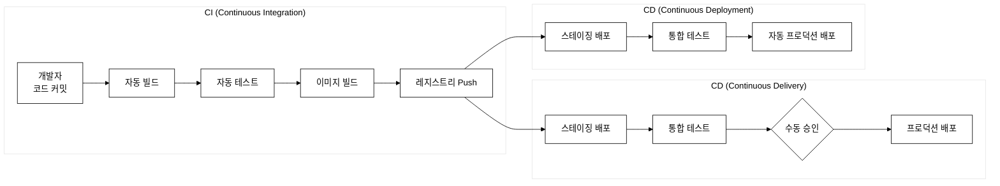
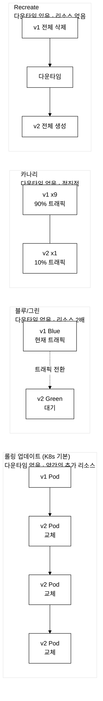
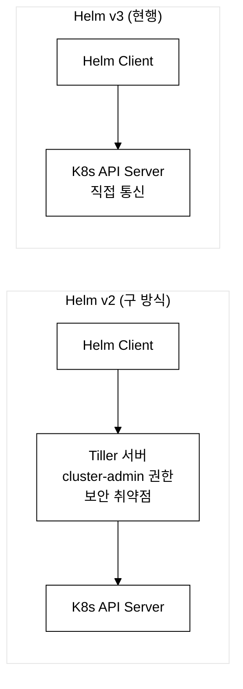

# KCNA Day 8: Cloud Native Application Delivery - GitOps, Helm, Kustomize, CI/CD

> 학습 목표: GitOps, Helm, Kustomize, CI/CD 파이프라인, 배포 전략을 이해한다.
> 예상 소요 시간: 60분 (개념 40분 + 문제 20분)
> 시험 도메인: Cloud Native Application Delivery (8%)
> 난이도: ★★★★☆

---

## 오늘의 학습 목표

- GitOps의 핵심 4대 원칙을 설명할 수 있다
- ArgoCD와 Flux의 차이를 구분한다
- Helm과 Kustomize의 차이를 설명할 수 있다
- CI/CD 파이프라인과 배포 전략(롤링, 블루/그린, 카나리)을 이해한다
- IaC 도구(Terraform, Crossplane)를 안다

> **전 시간(Day 7)** 에서는 이미 배포된 애플리케이션을 관측(Observability)하는 방법 — Prometheus·Grafana·Loki 스택의 동작 원리를 다뤘다. 오늘 Day 8은 그 전 단계인 "애플리케이션을 어떻게 안전하고 반복 가능하게 배포하는가"를 다룬다. KCNA 시험 도메인으로는 **Cloud Native Application Delivery (8%)** 에 해당한다. Day 7의 Prometheus 메트릭 수집이 배포 후 관측을 담당한다면, Day 8의 ArgoCD·Helm·Kustomize는 배포 자체의 신뢰성과 이력 관리를 담당한다.

---

## 0. 등장 배경

기존 CD(Continuous Delivery) 방식에서는 CI 서버(Jenkins 등)가 kubectl apply를 직접 실행하여 클러스터에 배포했다(Push 모델). 이 방식은 CI 서버에 클러스터 admin 권한을 부여해야 하는 보안 문제가 있었고, 누가 언제 무엇을 배포했는지 추적이 어려웠다. 또한 kubectl로 직접 수정하면 코드와 실제 상태가 불일치(drift)하는 문제가 발생했다. GitOps는 이 문제를 해결하기 위해 Git을 단일 진실 소스로 삼고, 클러스터 내부의 에이전트(ArgoCD, Flux)가 Git 상태를 주기적으로 확인하여 자동 동기화하는 Pull 모델을 채택했다. 이로써 모든 변경 이력이 Git 커밋으로 남고, kubectl 직접 수정은 에이전트가 자동으로 되돌리며, CI 서버에 클러스터 권한을 줄 필요가 없어졌다.

---

## 1. GitOps (시험 빈출!)

### 1.1 GitOps 개념

> **GitOps**란?
> Git 저장소를 **단일 진실 소스(Single Source of Truth)**로 사용하여 인프라와 애플리케이션을 관리하는 방법론이다. Git에 커밋된 선언적 설정이 자동으로 클러스터에 적용된다.

### 1.2 GitOps 4대 원칙

```
GitOps 4대 원칙
============================================================

1. 선언적 설정 (Declarative)
   모든 시스템 상태를 선언적으로 기술
   → K8s YAML, Helm Chart, Kustomize

2. Git = 단일 진실 소스 (Single Source of Truth)
   원하는 상태는 Git에 저장
   → Git 저장소가 "정답"이다

3. 자동 적용 (Automated Application)
   승인된 변경 사항은 자동으로 시스템에 적용
   → PR 승인 → 자동 배포

4. 지속적 조정 (Continuous Reconciliation)
   에이전트가 실제 상태를 감시하고 차이 자동 수정
   → 누군가 kubectl로 직접 변경해도 Git 상태로 되돌림

   [Reconciliation Loop 메커니즘]
   ArgoCD 에이전트는 기본 3초 간격으로 etcd watch API를 통해
   Git 저장소의 매니페스트(desired state)와 클러스터의 실제
   상태(current state)를 비교한다. 차이(diff)가 감지되면
   kubectl apply 동작으로 클러스터를 Git 상태로 수렴시킨다.
```

### 1.3 GitOps 동작 흐름


_그림 1. GitOps Pull 모델 동작 흐름 — 에이전트가 Git을 주기적으로 감시하고 클러스터 상태를 Git 상태로 수렴시킨다._

**장점:**
- 모든 변경 이력 Git에 기록 (감사 추적)
- PR 기반 리뷰 (변경 승인 프로세스)
- 롤백 = git revert (간단!)
- 개발자 친화적 워크플로우

---

### 1.4 GitOps 트레이드오프

GitOps는 Push 모델의 보안·추적 문제를 해결하지만 새로운 제약을 도입한다.

**1) 시크릿 관리 문제**
Git은 공개 또는 사내 저장소이므로 DB 패스워드·API 키 같은 민감 정보를 평문으로 올릴 수 없다. GitOps 파이프라인에서 시크릿을 관리하려면 추가 도구가 필요하다.
- **Sealed Secrets**(Bitnami): `kubeseal` CLI로 Secret을 공개키 암호화한 `SealedSecret` CRD로 변환. 암호화된 리소스만 Git에 커밋되고, 클러스터 내 컨트롤러가 개인키로 복호화하여 실제 Secret을 생성한다.
- **External Secrets Operator**: AWS Secrets Manager·Vault 같은 외부 시크릿 저장소와 연동. Git에는 "어떤 외부 키를 참조한다"는 메타데이터만 저장하고 실제 값은 런타임에 가져온다.

**2) Git 저장소 단일 장애점(SPOF)**
Git 저장소가 다운되거나 접근 불가 상태가 되면 ArgoCD/Flux의 동기화가 중단된다. GitHub·GitLab 장애 시 클러스터가 자동 배포를 할 수 없는 구조다. 기업 환경에서는 셀프호스팅 Git 서버를 이중화하거나 GitLab의 HA 구성으로 완화한다.

**3) 에이전트 자체의 K8s 의존성**
ArgoCD와 Flux는 K8s 위에서 동작하는 컨트롤러다. 클러스터 자체가 심각하게 손상되면(etcd 장애, 모든 노드 다운 등) GitOps 에이전트도 함께 중단된다. 즉, "클러스터가 죽으면 GitOps로 클러스터를 복구할 수 없다"는 구조적 한계가 있다. 클러스터 부트스트랩(kubeadm init·reinstall)은 여전히 Ansible·Terraform 같은 클러스터 외부 도구가 담당해야 한다.

**4) 초기 설치 복잡도**
ArgoCD 자체를 클러스터에 설치하고 Git 저장소 접근 권한(SSH 키 또는 Token)·Application CRD·프로젝트 정책을 구성하는 초기 설정이 필요하다. GitOps로 ArgoCD 자신을 관리하는 "App of Apps" 패턴이 있지만, 닭-달걀 문제(ArgoCD 없이는 GitOps 배포 불가 → ArgoCD를 먼저 수동 설치해야 함)를 피할 수 없다.

---

## 2. ArgoCD & Flux

### 2.1 ArgoCD

> **ArgoCD**란?
> K8s용 **선언적 GitOps CD(Continuous Delivery) 도구**이다. CNCF **졸업** 프로젝트(Argo 프로젝트의 일부)이다.

**CRD(Custom Resource Definition)**: K8s가 기본 제공하는 Deployment·Pod처럼 취급할 사용자 정의 리소스를 등록하는 방식이다(Day 3에서 다룬 K8s 확장 메커니즘 — 기본 제공 리소스 외에 사용자가 새 리소스 종류를 K8s API에 추가할 수 있게 한다). ArgoCD는 `Application`이라는 CRD를 통해 "어느 Git 저장소의 어느 경로를 어느 클러스터에 배포할지"를 선언적으로 기술한다.

```yaml
# ArgoCD Application CRD 예제
apiVersion: argoproj.io/v1alpha1
kind: Application
metadata:
  name: nginx-app
  namespace: argocd
spec:
  project: default

  source:
    repoURL: https://github.com/org/k8s-manifests.git
    targetRevision: main
    path: apps/nginx

  destination:
    server: https://kubernetes.default.svc
    namespace: demo

  syncPolicy:
    automated:
      prune: true                    # Git에서 삭제된 리소스 자동 삭제
      selfHeal: true                 # 수동 변경 시 Git 상태로 자동 복원
    syncOptions:
    - CreateNamespace=true
```

**주요 syncPolicy 옵션 해설:**
- `prune: true` — Git에서 파일을 삭제하면 클러스터에서도 해당 K8s 리소스를 자동 삭제한다. false이면 Git 삭제 후에도 클러스터에 리소스가 남는다.
- `selfHeal: true` — 운영자가 `kubectl edit`로 직접 클러스터를 수정해도 ArgoCD가 §1.2의 Reconciliation Loop에서 이를 감지하고 Git 상태로 자동 복원한다. GitOps 원칙 4번(지속적 조정)을 강제 적용하는 옵션이다.

### 2.2 ArgoCD vs Flux 비교

| 항목 | ArgoCD | Flux |
|------|--------|------|
| **UI** | **풍부한 웹 UI** | CLI 중심 (UI는 별도) |
| **아키텍처** | 단일 서버 | **모듈형 컨트롤러** |
| **이미지 자동 업데이트** | 별도 도구 필요 | **내장** |
| **멀티 클러스터** | 지원 | 지원 |
| **CNCF** | **졸업** | **졸업** |

**시험 포인트:**
- ArgoCD와 Flux 모두 **CNCF 졸업** 프로젝트
- 둘 다 GitOps 기반 **CD 도구** (CI 도구가 아님!)
- ArgoCD = 풍부한 웹 UI가 강점
- Flux = 모듈형 컨트롤러, 이미지 자동 업데이트 내장

**Flux의 모듈형 컨트롤러 구조 상세:**
Flux는 단일 컴포넌트가 아니라 역할별로 분리된 컨트롤러 집합으로 동작한다.
- `image-reflector-controller` + `image-automation-controller`: 컨테이너 레지스트리를 주기적으로 스캔하여 새 이미지 태그를 감지하고, 정책(semver, regex 등)에 따라 Git 저장소의 매니페스트를 자동 커밋한다. ArgoCD에서는 동일 기능을 위해 별도 도구(예: Argo Image Updater)가 필요하다.
- `helm-controller`: HelmRelease CRD를 감시하여 Helm Chart를 GitOps 방식으로 배포한다.
- `kustomize-controller`: Kustomization CRD를 감시하여 Kustomize 오버레이를 자동 적용한다.
이처럼 기능을 컨트롤러 단위로 분리하면 필요한 컨트롤러만 활성화하여 클러스터 자원 사용을 최적화할 수 있다.

---

## 3. CI/CD 파이프라인

### 3.1 CI/CD 개념



_그림 2. CI/CD 파이프라인 흐름 — Continuous Delivery는 수동 승인 게이트가 있고, Continuous Deployment는 승인 없이 완전 자동이다._

**핵심:**
- Continuous Delivery = 수동 승인 가능
- Continuous Deployment = 완전 자동

**GitOps 방식에서 CI와 CD의 분리(이 과정의 핵심 구조):**

전통적 CD에서는 CI 서버(Jenkins 등)가 kubectl apply를 직접 실행하여 클러스터에 배포했다(Push 모델). GitOps에서는 배포의 책임이 클러스터 내부 에이전트로 이동한다(Pull 모델). 구체적 흐름은 다음과 같다:

1. **CI 서버(Jenkins)**: 코드 컴파일·테스트·이미지 빌드 후 컨테이너 레지스트리에 push
2. **CI 서버(Jenkins)**: Git 저장소의 배포 매니페스트에서 이미지 태그(`image: myapp:v1.2.3`)를 새 버전으로 업데이트하는 커밋 생성
3. **ArgoCD**: Git 변경을 감지(watch)
4. **ArgoCD**: `kubectl apply`로 K8s 클러스터에 배포(Auto-Sync 활성화 시 자동, 비활성화 시 수동 승인)

결과적으로 CI 서버는 클러스터 접근 권한이 없어도 되고, 배포 결정권은 클러스터 내부 에이전트(ArgoCD)에 있다. tart-infra의 Jenkins(CI) + ArgoCD(CD) 구조가 이 패턴을 따른다.

### 3.2 CI 도구 비교

| 도구 | 특징 |
|------|------|
| **Jenkins** | 가장 오래된 오픈소스 CI, 풍부한 플러그인 |
| **GitHub Actions** | GitHub 내장, YAML 워크플로우 |
| **GitLab CI** | GitLab 내장 |
| **Tekton** | **K8s 네이티브** CI/CD, CRD(Task, Pipeline, PipelineRun)로 파이프라인 정의, CNCF 인큐베이팅 |

**Tekton 추가 설명:** Tekton은 파이프라인 자체를 K8s CRD로 정의하므로 K8s 환경에서 파이프라인 상태를 `kubectl get pipelineruns`으로 조회하는 등 K8s 리소스와 일관성 있게 관리할 수 있다. tart-infra는 Jenkins를 사용하지만, K8s 전용으로 파이프라인을 구성한다면 Tekton이 적합하다.

---

## 4. 배포 전략 (시험 빈출!)

### 4.1 전략 비교



_그림 3. 4가지 배포 전략 비교 — 롤링은 K8s 기본값, 블루/그린은 즉시 롤백, 카나리는 점진적 검증, Recreate는 v1/v2 공존 불가 시 사용한다._

**롤링 업데이트 maxSurge/maxUnavailable 상세:**

- `maxSurge`: 업데이트 중 desired 수를 초과하여 동시에 추가 생성할 수 있는 Pod 수(또는 비율). 예: replicas=4, maxSurge=25% → 최대 1개 추가 생성 허용 → 최대 5개 동시 실행.
- `maxUnavailable`: 업데이트 중 동시에 중단(unavailable) 허용 Pod 수(또는 비율). 예: replicas=4, maxUnavailable=25% → 최대 1개 동시 중단 허용 → 최소 3개 유지.
두 값을 조절하여 업데이트 속도(빠를수록 리소스 부하)와 가용성(낮을수록 안전)을 균형잡는다.

**Recreate 전략:** 모든 v1 Pod를 한 번에 삭제 후 v2를 새로 생성한다. v1과 v2가 절대 공존하지 않아 DB 스키마 변경처럼 두 버전이 동시에 실행되면 안 되는 상황에 사용한다. 삭제 후 재생성 완료까지 다운타임이 발생하는 것이 단점이다.

| 전략 | 다운타임 | 리소스 | 롤백 속도 | 사용 시나리오 |
|------|---------|--------|----------|-------------|
| **롤링 업데이트** | 없음 | 약간 추가 | 중간 | 일반적 배포 (K8s 기본) |
| **블루/그린** | 없음 | **2배** | **즉시** | 중요 배포, 즉시 롤백 필요 |
| **카나리** | 없음 | 약간 추가 | 빠름 | 새 버전 점진적 검증 |
| **Recreate** | **있음** | 없음 | 빠름 | 개발 환경, v1/v2 공존 불가 시 |

---

## 5. Helm - K8s 패키지 매니저

### 5.0 등장 배경

**Helm이 없던 시절의 문제 — plain YAML 복붙 관리의 한계**

K8s 초기에는 Deployment·Service·ConfigMap YAML 파일을 직접 작성하여 `kubectl apply`로 배포했다. 단순한 앱에서는 이 방법이 충분했지만, dev/staging/prod 환경이 생기면서 세 가지 고통이 누적됐다.

1. **환경별 값 하드코딩 — 복붙 + 수작업 수정**: `image: myapp:v1.2.3`, `replicas: 2`, `resources.limits.memory: 256Mi` 같은 값이 환경마다 달라야 한다. 해결책은 파일 복사 후 `sed`로 수정하거나 수동 편집이었다. 파일이 수십 개로 늘면 환경 간 불일치(dev에만 특정 ConfigMap이 없음 등)가 사람 실수로 발생한다.

2. **다중 YAML 배포 순서 관리 불가**: Deployment가 참조하는 ConfigMap이 먼저 존재해야 하고, Service가 Deployment 뒤에 와야 한다. `kubectl apply -f manifests/` 처럼 디렉터리 단위로 적용하면 K8s가 순서를 보장하지 않아 일시적으로 파드가 ConfigMap을 찾지 못하는 문제가 생긴다. 배포 실패 시 무엇을 어떤 순서로 정리해야 하는지 기록이 없었다.

3. **롤백 추적 불가**: `kubectl apply`는 현재 상태를 덮어쓸 뿐, "이 앱의 v2 배포 전 상태"를 원자적으로 되돌리는 수단이 없다. Git revert로 YAML을 되돌려도, 실제 클러스터에 어떤 상태가 적용됐는지 단일 진실 소스가 없었다.

Helm은 이 문제를 해결하기 위해 등장했다. **Chart(템플릿 패키지)**로 관련 YAML을 하나로 묶고, **Values(설정 파일)**로 환경별 값을 분리하며, **Release(설치 기록)**로 버전 이력을 클러스터에 저장한다. `helm rollback`은 이 Release 이력을 이용해 원자적 롤백을 제공한다.

### 5.1 Helm 핵심 개념

> **Helm**이란?
> K8s의 **패키지 매니저**로, CNCF **졸업** 프로젝트이다.

```
Helm 핵심 용어
============================================================

Chart: K8s 리소스를 정의하는 패키지 (Go 템플릿 기반)
Release: Chart를 클러스터에 설치한 인스턴스
Repository: Chart를 저장하고 배포하는 레지스트리
Values: Chart 템플릿에 주입되는 매개변수 값
```

### 5.2 Chart 디렉토리 구조

```
mychart/
├── Chart.yaml          # Chart 메타데이터 (이름, 버전)
├── values.yaml         # 기본 설정 값
├── charts/             # 의존성 Chart
├── templates/          # K8s 매니페스트 템플릿
│   ├── deployment.yaml
│   ├── service.yaml
│   ├── _helpers.tpl    # 템플릿 헬퍼 함수
│   └── NOTES.txt       # 설치 후 메시지
└── .helmignore
```

**values.yaml과 템플릿 연동 예시:**

`values.yaml` — Chart의 기본 설정 값을 선언한다. `helm install -f custom.yaml`로 재정의할 수 있다.

```yaml
# values.yaml
replicaCount: 2
image:
  repository: nginx
  tag: latest
service:
  port: 80
```

`templates/deployment.yaml` — Go 템플릿 문법으로 values.yaml의 값을 참조한다.

```yaml
# templates/deployment.yaml (일부 발췌)
spec:
  replicas: {{ .Values.replicaCount }}
  template:
    spec:
      containers:
        - image: {{ .Values.image.repository }}:{{ .Values.image.tag }}
```

렌더링 확인 및 설치:

```bash
# 실제 클러스터에 적용하기 전 렌더링 결과 확인 (kubectl apply 없이 YAML만 출력)
helm template my-release ./mychart

# Chart 설치 (values.yaml 기본값 사용)
helm install my-release ./mychart

# 커스텀 values 파일로 오버라이드
helm install my-release ./mychart -f custom-values.yaml

# 업그레이드 (image.tag만 변경)
helm upgrade my-release ./mychart --set image.tag=v2.0
```

### 5.3 Helm v3 핵심 변경 (시험 빈출!)



_그림 4. Helm v2 vs v3 아키텍처 — v3에서 Tiller가 제거되어 클라이언트가 K8s API Server에 직접 통신한다. 시험 매우 빈출._

**Tiller 보안 위험 상세:**
Tiller는 모든 네임스페이스에 접근할 수 있는 cluster-admin 권한으로 동작했다. 따라서 Tiller에 네트워크 접근이 가능한 일반 사용자는 Tiller를 경유해 cluster-admin 권한을 간접 획득할 수 있었다(privilege escalation). Tiller 자체를 보호하려면 별도 TLS 설정·ServiceAccount RBAC 설정이 필요해 운영 복잡도가 높았다.

**v3 핵심 변경:**
1. Tiller 제거 (보안 문제 — 위 Tiller 설명 참조)
2. 3-way 병합 전략
3. Release가 네임스페이스 범위로 변경

**v3의 3-way 병합 전략(3-way strategic merge):**
Helm v3는 `helm upgrade` 실행 시 다음 세 상태를 비교하여 최종 적용 YAML을 결정한다:
1. **이전 차트 상태(last-applied)**: 직전 `helm install/upgrade`가 적용했던 YAML
2. **새 차트 상태(desired)**: 현재 `values.yaml` + 새 Chart 템플릿 렌더링 결과
3. **클러스터 실제 상태(live)**: `kubectl get`으로 조회한 현재 K8s 오브젝트

세 상태를 병합(strategic merge)하여 운영자가 `kubectl edit`로 직접 변경한 필드는 보존하면서, Chart가 관리하는 필드만 새 값으로 업데이트한다. v2에서는 2-way 병합(last-applied vs desired)만 했기 때문에 `kubectl edit` 변경을 덮어쓰는 문제가 있었다.

**3-way 병합 구체 예시:**

시나리오: Chart의 `values.yaml`에 `replicas: 4`, `image: myapp:v1`로 설정하고 `helm install`을 했다. 이후 운영자가 `kubectl edit deployment myapp`으로 `replicas`를 3→5로 변경했다(Chart를 수정하지 않고). 그 다음 Chart의 `image` 태그만 v2로 바꾸어 `helm upgrade`를 실행한다.

| 필드 | last-applied (Chart v1) | desired (Chart v2) | live (클러스터) | 3-way 병합 결과 |
|------|------------------------|-------------------|----------------|----------------|
| `replicas` | 4 | 4 (변경 없음) | 5 (kubectl edit) | **5 보존** — last-applied와 desired가 동일하므로 live 값 보존 |
| `image` | myapp:v1 | myapp:v2 (변경됨) | myapp:v1 | **myapp:v2 적용** — desired가 last-applied와 달라졌으므로 새 값 사용 |

v2(2-way 병합)에서는 live를 무시하고 desired를 그대로 적용했기 때문에 `replicas`가 5→4로 되돌려지는 문제가 있었다.

---

## 6. Kustomize

### 6.0 등장 배경

**Helm 템플릿 방식의 한계와 Kustomize의 해법**

Helm은 §5.0의 복붙 문제를 해결했지만, 새로운 비용을 도입했다.

1. **Go 템플릿 학습 비용**: `{{ if .Values.ingress.enabled }}`, `{{- range .Values.env }}` 같은 Go 템플릿 문법은 K8s YAML과 무관한 별도 언어다. Chart 작성자는 Go 템플릿 문법과 Helm 내장 함수(`toYaml`, `include`, `tpl` 등)를 모두 익혀야 한다. 단순한 환경별 이미지 태그 변경을 위해 불필요한 학습 부담이 생긴다.

2. **파일 자체의 YAML 문법 불성립**: `templates/deployment.yaml`은 `{{ .Values.image }}` 같은 Go 템플릿 구문 때문에 파일 자체가 유효한 YAML이 아니다. `kubectl apply -f templates/deployment.yaml`을 직접 실행하면 YAML 파싱 오류가 난다. 디버깅 시 `helm template` 렌더링 단계를 거쳐야 실제 K8s가 받는 YAML을 볼 수 있어 디버깅 경로가 길어진다.

Kustomize는 이 두 문제를 "템플릿을 쓰지 않는다"는 원칙으로 해결한다. base 파일은 항상 유효한 K8s YAML이다(`kubectl apply -f base/` 가 그대로 동작). 환경별 차이는 patch(변경 조각)로만 표현한다. `kubectl apply -k overlays/dev/` 한 줄이면 dev 오버레이 전체를 적용할 수 있고, kubectl 1.14부터 내장되어 별도 설치가 필요 없다.

**Kustomize의 트레이드오프**: 조건 분기(`if`)·반복(`range`)·의존성 패키지 관리 같은 Helm의 고급 기능을 지원하지 않는다. 여러 환경에 걸쳐 복잡한 조건부 리소스 생성이 필요하다면 Kustomize만으로는 한계가 있어 Helm을 쓰거나 둘을 함께 사용(Flux의 `helm-controller` + `kustomize-controller` 혼용)하는 것이 일반적이다.

**Helm 대비 Kustomize의 위치:** Helm은 Go 템플릿으로 YAML을 생성하므로 템플릿 파일 자체는 유효한 YAML이 아니다(`{{ .Values.image }}` 같은 템플릿 구문 포함). 이에 비해 Kustomize는 이미 유효한 base YAML에 patch(변경 조각)만 덧붙이는 방식을 사용하므로, base 파일은 항상 `kubectl apply`로 직접 검증할 수 있다. 예를 들어 `base/deployment.yaml`의 `image` 필드만 `dev/kustomization.yaml`에서 `patchesJson6902`(JSON Patch RFC 6902 기반 덧씌우기)로 오버라이드하면, dev/prod 환경 차이를 별도 템플릿 없이 관리할 수 있다.

### 6.1 Kustomize 개념

> **Kustomize**란?
> K8s 매니페스트를 **템플릿 없이** 커스터마이징하는 도구이다. **kubectl에 내장**되어 있어 `kubectl apply -k`로 사용 가능하다.

### 6.2 Helm vs Kustomize 비교

| 항목 | Helm | Kustomize |
|------|------|-----------|
| **방식** | Go 템플릿으로 생성 | 패치(Patch)로 수정 — strategic merge patch(필드별 병합) 또는 json6902 patch(RFC 6902 기반 경로 지정) 방식으로 base YAML의 특정 필드만 오버라이드 |
| **설치** | 별도 설치 필요 | **kubectl 내장** |
| **YAML 유효성** | 템플릿(Go 문법 포함)이므로 파일 자체는 유효한 YAML이 아님 | base YAML은 항상 유효한 K8s 매니페스트(patch 적용 전후 모두 문법 오류 없음) |
| **구조** | Chart (templates + values) | base + overlays |
| **복잡한 앱** | 적합 | 단순 오버레이에 적합 |

```
Kustomize 구조
============================================================

kustomize/
├── base/                       # 기본 매니페스트
│   ├── kustomization.yaml
│   ├── deployment.yaml
│   └── service.yaml
├── overlays/
│   ├── dev/                    # 개발 환경
│   │   └── kustomization.yaml
│   ├── staging/                # 스테이징 환경
│   │   └── kustomization.yaml
│   └── prod/                   # 프로덕션 환경
│       └── kustomization.yaml

사용:
$ kubectl apply -k overlays/dev/
$ kubectl apply -k overlays/prod/
```

**kustomization.yaml 실제 파일 예시:**

`base/kustomization.yaml` — 공통 리소스를 등록한다. overlay가 이 목록을 상속한다.

```yaml
# base/kustomization.yaml
apiVersion: kustomize.config.k8s.io/v1beta1
kind: Kustomization
resources:
  - deployment.yaml
  - service.yaml
```

`overlays/dev/kustomization.yaml` — base를 참조하고 dev 환경에 맞는 이미지 태그로 오버라이드한다.

```yaml
# overlays/dev/kustomization.yaml
apiVersion: kustomize.config.k8s.io/v1beta1
kind: Kustomization
bases:
  - ../../base
images:
  - name: myapp
    newTag: dev-latest
```

`overlays/dev/` 적용 예:

```bash
# dev 오버레이 적용 — base 리소스에 이미지 태그 오버라이드가 합쳐진 결과가 클러스터에 적용된다
kubectl apply -k overlays/dev/

# 실제 클러스터에 적용하기 전에 렌더링 결과를 확인한다
kubectl kustomize overlays/dev/
```

**patchesStrategicMerge 예시** (특정 필드만 부분 패치):

```yaml
# overlays/prod/kustomization.yaml
apiVersion: kustomize.config.k8s.io/v1beta1
kind: Kustomization
bases:
  - ../../base
patchesStrategicMerge:
  - replica-patch.yaml   # replicas: 5 로 오버라이드
```

`patchesStrategicMerge`는 패치 파일의 apiVersion/kind/name이 base 리소스와 일치하면 해당 필드만 병합하는 방식이다(JSON Patch RFC 6902를 경로 기반으로 지정하는 `patchesJson6902`와 달리, 필드 이름 기반으로 직관적이다).

---

## 7. IaC (Infrastructure as Code)

§1~6에서는 K8s 클러스터 위에서 애플리케이션(컨테이너 이미지 → Pod)을 GitOps 방식으로 배포하는 흐름을 다뤘다. 그런데 클러스터 자체를 올려두는 클라우드 인프라(VPC, 로드밸런서, RDS 등)도 동일한 선언형·버전 관리 원칙으로 관리할 수 있다. IaC(Infrastructure as Code)는 인프라를 코드 파일로 정의하고 Git으로 버전 관리하며 자동 적용하는 방법론이다. Terraform은 HCL(HashiCorp Configuration Language) 파일로, Crossplane은 K8s CRD YAML로 인프라를 기술한다. 즉 GitOps의 "Git을 단일 진실 소스로, 선언형으로, 자동 동기화" 원칙이 K8s 애플리케이션을 넘어 클라우드 인프라 전체로 확장된 것이 IaC + GitOps 통합이다.

### 7.1 IaC 도구 비교

| 도구 | 특징 | 언어 | CNCF |
|------|------|------|------|
| **Terraform** | 멀티 클라우드 IaC | **HCL** | - |
| **Pulumi** | 프로그래밍 언어로 인프라 정의 | Python, Go, TS | - |
| **Crossplane** | K8s 기반 클라우드 인프라 관리 | K8s CRD/YAML | **인큐베이팅** |
| **Ansible** | 에이전트리스 설정 관리 | **YAML** (Playbook) | - |

**Terraform 동작 3단계 (KCNA 출제 포인트):**

Terraform은 `terraform plan` → `terraform apply` 두 단계 명령과 state 파일로 동작한다.

1. **`terraform plan` — 변경 예측**: HCL 코드로 선언한 "원하는 상태"와 state 파일에 기록된 "현재 상태"를 비교하여 실제 인프라에 무슨 변경이 일어날지 출력한다. 실제 클라우드 리소스는 건드리지 않는다(dry-run과 유사).
2. **`terraform apply` — 실제 적용**: `plan` 결과를 검토·승인한 뒤 실행하면 AWS·GCP·Azure 등 클라우드 API를 호출하여 리소스를 생성·변경·삭제한다. 완료 후 state 파일을 갱신한다.
3. **state 파일 — 현재 인프라 상태 기록**: `terraform.tfstate` 파일은 Terraform이 마지막으로 적용한 인프라 상태를 JSON으로 저장한다. 다음 `plan` 실행 시 이 파일을 "현재 상태"의 기준으로 삼는다. state 파일이 없거나 손상되면 Terraform이 이미 존재하는 리소스를 새로 만들려는 충돌이 발생할 수 있다. 팀 협업에서는 S3·Terraform Cloud 같은 원격 backend에 state를 저장하여 동시 수정 충돌을 막는다.

**Terraform vs Crossplane 핵심 차이**: Terraform은 K8s **외부**에서 CLI 명령으로 클라우드 인프라를 관리하는 도구다. Crossplane은 K8s **내부**의 CRD와 컨트롤러로 동일한 클라우드 인프라 API를 제공한다. `kubectl apply -f rdsinstance.yaml` 한 줄이 Terraform의 `terraform apply`에 해당하며, K8s Reconciliation Loop가 state 동기화를 담당한다. GitOps 파이프라인(ArgoCD)과 통합하면 인프라 자원도 K8s 오브젝트와 동일한 방식으로 GitOps 관리가 가능하다.

```yaml
# Crossplane 예제: K8s CRD로 AWS RDS 정의
apiVersion: database.aws.crossplane.io/v1beta1
kind: RDSInstance
metadata:
  name: my-database
spec:
  forProvider:
    dbInstanceClass: db.t3.medium
    engine: postgres
    engineVersion: "15"
    masterUsername: admin
    allocatedStorage: 20
  # K8s 리소스처럼 선언적으로 클라우드 인프라 관리!
```

---

## 8. KCNA 실전 모의 문제 (12문제)

### 문제 1.
GitOps의 핵심 원칙이 아닌 것은?

A) 모든 시스템 상태를 선언적으로 기술한다
B) Git을 단일 진실 소스(Single Source of Truth)로 사용한다
C) 변경 사항은 수동으로 서버에 SSH 접속하여 적용한다
D) 에이전트가 실제 상태를 감시하고 차이를 자동 수정한다

<details><summary>정답 확인</summary>

**정답: C) 변경 사항은 수동으로 서버에 SSH 접속하여 적용한다**

GitOps에서 변경은 Git에 커밋되고 에이전트가 **자동으로 적용**한다. SSH 수동 접속은 GitOps 원칙에 위배된다.
</details>

---

### 문제 2.
Helm에 대한 설명으로 올바르지 않은 것은?

A) Kubernetes의 패키지 매니저이다
B) Chart는 여러 K8s 매니페스트를 하나의 패키지로 묶은 것이다
C) Helm v3에서는 클러스터 내에 Tiller를 반드시 설치해야 한다
D) helm install, helm upgrade, helm rollback 명령어를 지원한다

<details><summary>정답 확인</summary>

**정답: C) Helm v3에서는 클러스터 내에 Tiller를 반드시 설치해야 한다**

Helm **v3에서 Tiller가 제거**되었다. 보안 문제(클러스터 admin 권한)로 v3부터 클라이언트만으로 동작한다.
</details>

---

### 문제 3.
ArgoCD와 Flux에 대한 설명으로 올바른 것은?

A) 둘 다 CI(Continuous Integration) 도구이다
B) 둘 다 GitOps 원칙에 따라 Git 저장소의 변경을 K8s 클러스터에 자동 동기화하는 CD 도구이다
C) 둘 다 컨테이너 이미지를 빌드하는 도구이다
D) 둘 다 서비스 메시 도구이다

<details><summary>정답 확인</summary>

**정답: B) 둘 다 GitOps 원칙에 따라 Git 저장소의 변경을 K8s 클러스터에 자동 동기화하는 CD 도구이다**

ArgoCD와 Flux는 모두 CNCF 졸업 프로젝트이며 GitOps 기반 **CD 도구**이다. CI 도구가 아님에 주의!
</details>

---

### 문제 4.
배포 전략 중 일부 트래픽만 새 버전으로 보내어 테스트한 후 점진적으로 확대하는 방식은?

A) 롤링 업데이트
B) 블루/그린
C) 카나리
D) Recreate

<details><summary>정답 확인</summary>

**정답: C) 카나리**

카나리 배포는 소량의 트래픽만 새 버전으로 보내어 안정성을 확인한 후 점진적으로 비율을 늘린다.
</details>

---

### 문제 5.
Kustomize에 대한 설명으로 올바른 것은?

A) Go 템플릿을 사용하여 K8s 매니페스트를 생성한다
B) 별도 설치가 필요하며 kubectl과 호환되지 않는다
C) base와 overlay 구조로 템플릿 없이 매니페스트를 커스터마이징한다
D) Helm Chart만 관리할 수 있다

<details><summary>정답 확인</summary>

**정답: C) base와 overlay 구조로 템플릿 없이 매니페스트를 커스터마이징한다**

Kustomize는 kubectl에 내장되어 있으며 `kubectl apply -k`로 사용 가능하다.
</details>

---

### 문제 6.
CI(Continuous Integration)와 CD(Continuous Delivery)의 차이로 올바른 것은?

A) CI는 코드를 자동 배포하고, CD는 코드를 테스트한다
B) CI는 코드 변경의 자동 빌드/테스트이고, CD는 소프트웨어를 언제든 배포 가능한 상태로 유지하는 것이다
C) CI와 CD는 동일한 개념이다
D) CI는 서버리스 환경에서만 동작한다

<details><summary>정답 확인</summary>

**정답: B) CI는 코드 변경의 자동 빌드/테스트이고, CD는 소프트웨어를 언제든 배포 가능한 상태로 유지하는 것이다**
</details>

---

### 문제 7.
Continuous Delivery와 Continuous Deployment의 차이로 올바른 것은?

A) 둘은 동일한 개념이다
B) Continuous Delivery는 수동 승인 후 배포, Continuous Deployment는 자동 배포
C) Continuous Deployment는 테스트를 건너뛴다
D) Continuous Delivery는 CI를 포함하지 않는다

<details><summary>정답 확인</summary>

**정답: B) Continuous Delivery는 수동 승인 후 배포, Continuous Deployment는 자동 배포**
</details>

---

### 문제 8.
Tekton에 대한 설명으로 올바른 것은?

A) GitOps 도구이다
B) K8s 네이티브 CI/CD 파이프라인 프레임워크이며, CRD로 파이프라인을 정의한다
C) 컨테이너 레지스트리이다
D) 서비스 메시 도구이다

<details><summary>정답 확인</summary>

**정답: B) K8s 네이티브 CI/CD 파이프라인 프레임워크이며, CRD로 파이프라인을 정의한다**
</details>

---

### 문제 9.
Terraform에 대한 설명으로 올바른 것은?

A) K8s 전용 배포 도구이다
B) 에이전트 기반 설정 관리 도구이다
C) 멀티 클라우드 IaC 도구로, HCL 언어를 사용하여 선언적으로 인프라를 정의한다
D) 컨테이너 빌드 도구이다

<details><summary>정답 확인</summary>

**정답: C) 멀티 클라우드 IaC 도구로, HCL 언어를 사용하여 선언적으로 인프라를 정의한다**
</details>

---

### 문제 10.
배포 전략 중 두 개의 동일 환경을 유지하고 트래픽을 한 번에 전환하는 방식은?

A) 롤링 업데이트
B) 블루/그린
C) 카나리
D) Recreate

<details><summary>정답 확인</summary>

**정답: B) 블루/그린**

블루/그린 배포는 두 환경을 유지하고 트래픽을 한 번에 전환한다. 즉시 롤백 가능하지만 리소스 2배 필요.
</details>

---

### 문제 11.
Helm v3의 핵심 변경 사항은?

A) Chart 형식이 JSON으로 변경되었다
B) Tiller 컴포넌트가 제거되었다
C) K8s 1.20 이상에서만 동작한다
D) Go 대신 Python으로 재작성되었다

<details><summary>정답 확인</summary>

**정답: B) Tiller 컴포넌트가 제거되었다**

Helm v3에서 Tiller가 보안 문제(cluster-admin 권한)로 제거되었다.
</details>

---

### 문제 12.
Crossplane에 대한 설명으로 올바른 것은?

A) K8s 패키지 매니저이다
B) K8s CRD를 사용하여 클라우드 인프라를 선언적으로 관리하는 CNCF 인큐베이팅 프로젝트이다
C) 컨테이너 런타임이다
D) 서비스 메시 도구이다

<details><summary>정답 확인</summary>

**정답: B) K8s CRD를 사용하여 클라우드 인프라를 선언적으로 관리하는 CNCF 인큐베이팅 프로젝트이다**
</details>

---

## tart-infra 실습: 개념을 실제 클러스터에서 검증한다

§1~6에서 배운 GitOps 원칙·CI/CD 파이프라인·배포 전략·패키지 관리를 이제 실제 platform/dev 클러스터에서 확인한다. Jenkins(CI) + ArgoCD(CD) 파이프라인이 어떻게 분리·협력하는지 직접 확인하는 것이 목표다.

**실습 전제 조건:**
- tart 클러스터 4개(platform, dev, staging, prod)가 가동 중이어야 한다. `./scripts/boot.sh`로 기동 후 `./scripts/fix-cluster-ip-drift.sh platform`과 `./scripts/fix-cluster-ip-drift.sh dev`를 실행하여 IP 드리프트를 복구한다.
- kubeconfig 경로: `kubeconfig/` (platform.yaml, dev.yaml)
- 노드 SSH 접속 별칭: `ssh platform-master`, `ssh dev-master` (비밀번호 없이 접속 가능, `~/.ssh/config` 관리 블록 등록 상태)
- 실습 1·2는 platform/dev 클러스터를 **읽기 전용**으로 사용한다. 배포 변경 실습은 dev에서만 수행한다.

### 실습 환경 설정

```bash
# platform 클러스터 접속 (ArgoCD, Jenkins 확인용)
export KUBECONFIG=kubeconfig/platform.yaml

# 클러스터 상태 확인
kubectl get nodes
```

### 실습 1: ArgoCD로 GitOps 4대 원칙 확인

ArgoCD의 실제 동작을 통해 GitOps 원칙을 확인한다.

```bash
# ArgoCD 구성요소 확인
kubectl get pods -n argocd
```

검증: (미캡처: 스크린샷 캡처 필요 — `scripts/capture-shot.sh` 로 platform 클러스터에서 실행 후 이미지를 `images/day08-argocd-pods.png`로 저장하여 삽입)

```bash
# ArgoCD Application CRD 목록 확인 (선언적 설정)
kubectl get applications -n argocd
```

검증: (미캡처 — platform 클러스터에서 직접 실행. 현재 등록된 Application 오브젝트가 없으면 `No resources found in argocd namespace.`가 출력된다)

```bash
# Application의 Sync 상태 확인 (지속적 조정)
kubectl get applications -n argocd -o custom-columns=NAME:.metadata.name,SYNC:.status.sync.status,HEALTH:.status.health.status
```

검증: (미캡처 — Application 오브젝트가 없으면 헤더 행(`NAME   SYNC   HEALTH`)만 출력된다)

**동작 원리:** ArgoCD는 GitOps 4대 원칙을 구현한다. (1) Application CRD로 선언적 설정, (2) Git 저장소를 Single Source of Truth로 참조, (3) Sync로 자동 적용, (4) Reconciliation Loop로 클러스터 상태를 주기적으로 Git과 비교하여 차이를 감지/수정한다.

### 실습 2: Helm Release 확인

```bash
# dev 클러스터로 전환
export KUBECONFIG=kubeconfig/dev.yaml

# 설치된 Helm Release 목록 확인
helm list -A

# 예상 출력:
# NAME        NAMESPACE     REVISION  STATUS    CHART              APP VERSION
# cilium      kube-system   1         deployed  cilium-1.x.x       1.x.x
# istio-base  istio-system  1         deployed  base-1.x.x         1.x.x

# 특정 Release의 Values 확인 (Chart + Values = 커스터마이즈)
helm get values cilium -n kube-system

# Helm 용어 확인: Chart(패키지), Release(인스턴스), Repository(저장소)
```

**동작 원리:** Helm은 K8s 패키지 매니저이다. Chart(YAML 템플릿 패키지)에 Values(사용자 설정)를 적용하여 Release(클러스터에 설치된 인스턴스)를 생성한다. v3부터 Tiller가 제거되어 클라이언트가 직접 K8s API에 접근한다.

### 실습 3: CI/CD 파이프라인과 배포 전략

```bash
# platform 클러스터의 Jenkins 확인
export KUBECONFIG=kubeconfig/platform.yaml
kubectl get pods -n jenkins

# Jenkins 웹 UI: http://localhost:30900
# ArgoCD 웹 UI: http://localhost:30800
# CI(Jenkins: 빌드/테스트) → CD(ArgoCD: 배포) 파이프라인 구조 확인

# dev 클러스터 데모 스택(nginx-web)의 배포 전략 확인
export KUBECONFIG=kubeconfig/dev.yaml
kubectl get deployment nginx-web -n demo -o jsonpath='{.spec.strategy}' | python3 -m json.tool

# 예상 출력:
# {
#     "type": "RollingUpdate",
#     "rollingUpdate": {
#         "maxSurge": "25%",
#         "maxUnavailable": "25%"
#     }
# }
```

**동작 원리:** tart-infra는 CI(Jenkins)와 CD(ArgoCD)를 분리한 구조이다. Jenkins가 코드 빌드/테스트/이미지 푸시를 담당하고, ArgoCD가 Git에 업데이트된 매니페스트를 감지하여 클러스터에 자동 배포한다. RollingUpdate는 K8s 기본 배포 전략으로, maxSurge(초과 허용 Pod)와 maxUnavailable(동시 중단 허용 Pod)로 무중단 배포를 제어한다.

위 jsonpath 출력에서 `maxSurge: 25%`이고 `replicas=4`라면, 25% × 4 = 1개(소수점 올림)를 초과 생성 허용하므로 업데이트 중 최대 5개 Pod가 동시 실행된다. `maxUnavailable: 25%`이면 최대 1개 Pod 중단을 허용하므로 최소 3개는 항상 서비스 가능한 상태로 유지된다.

---

### 직접 해보기 (시험형 미니랩)

실제 클러스터에서 스스로 명령을 구성하고 실행하여 결과를 검증한다. 정답은 details 블록 안에 있다.

**문제 1 — RollingUpdate 전략 설정 (목표: 5분)**

dev 클러스터의 `demo` 네임스페이스에 `nginx` Deployment를 생성하라(데모 스택의 `nginx-web`과는 별개의 실습용 Deployment이며, 끝나면 정리한다). 조건:
- image: `nginx:1.25`
- replicas: 4
- 배포 전략: RollingUpdate, `maxSurge=1`, `maxUnavailable=0`

<details><summary>정답 명령</summary>

```bash
export KUBECONFIG=kubeconfig/dev.yaml
kubectl create namespace demo --dry-run=client -o yaml | kubectl apply -f -
kubectl create deployment nginx --image=nginx:1.25 --replicas=4 -n demo --dry-run=client -o yaml > /tmp/nginx-deploy.yaml
```

생성된 `/tmp/nginx-deploy.yaml`을 편집하여 `spec.strategy` 블록을 추가한다:

```yaml
spec:
  strategy:
    type: RollingUpdate
    rollingUpdate:
      maxSurge: 1
      maxUnavailable: 0
```

```bash
kubectl apply -f /tmp/nginx-deploy.yaml
kubectl rollout status deployment/nginx -n demo
kubectl get deployment nginx -n demo -o jsonpath='{.spec.strategy}'

# 정리(실습용 Deployment 제거 — 데모 스택 nginx-web 은 건드리지 않는다)
kubectl delete deployment nginx -n demo --ignore-not-found
```

검증: `maxSurge:1`, `maxUnavailable:0` 이 출력되면 정상.
</details>

**문제 2 — ArgoCD Application YAML 작성 후 Sync 확인 (목표: 10분)**

platform 클러스터의 `argocd` 네임스페이스에 아래 조건의 `Application` 오브젝트를 YAML로 작성하고 `kubectl apply`하라. 조건:
- name: `test-app`
- source: `https://github.com/argoproj/argocd-example-apps.git`, path: `guestbook`, revision: `HEAD`
- destination: `https://kubernetes.default.svc`, namespace: `guestbook`
- syncPolicy: automated, prune: true, selfHeal: true

Sync 상태를 `kubectl get applications -n argocd` 로 확인하라.

<details><summary>정답 명령</summary>

```bash
export KUBECONFIG=kubeconfig/platform.yaml
```

아래 내용으로 `/tmp/test-app.yaml` 파일을 생성한다:

```yaml
apiVersion: argoproj.io/v1alpha1
kind: Application
metadata:
  name: test-app
  namespace: argocd
spec:
  project: default
  source:
    repoURL: https://github.com/argoproj/argocd-example-apps.git
    targetRevision: HEAD
    path: guestbook
  destination:
    server: https://kubernetes.default.svc
    namespace: guestbook
  syncPolicy:
    automated:
      prune: true
      selfHeal: true
    syncOptions:
    - CreateNamespace=true
```

```bash
kubectl apply -f /tmp/test-app.yaml
kubectl get applications -n argocd
# SYNC 컬럼이 Synced, HEALTH 컬럼이 Healthy 로 바뀌면 정상
# 실습 후 정리
kubectl delete -f /tmp/test-app.yaml
```
</details>

---

## 트러블슈팅

### ArgoCD Application이 OutOfSync 상태일 때

```
증상: ArgoCD Application의 Sync 상태가 OutOfSync이다
  $ kubectl get applications -n argocd
  NAME       SYNC STATUS   HEALTH STATUS
  demo-app   OutOfSync     Healthy

원인 분석:
  1. Git 저장소의 매니페스트와 클러스터의 실제 상태가 불일치한다
  2. 누군가 kubectl로 직접 클러스터를 수정했다
  3. Git에 새로운 커밋이 있지만 아직 동기화되지 않았다

디버깅 순서:
  1. ArgoCD UI에서 Diff 확인 → 어떤 리소스가 불일치하는지 시각적으로 확인
  2. 수동 동기화 실행
     $ argocd app sync demo-app
  3. selfHeal: true 설정이 되어 있는지 확인
     → selfHeal이 true이면 자동으로 Git 상태로 복원한다
  4. 자동 동기화 실패 시 로그 확인
     $ kubectl logs -n argocd -l app.kubernetes.io/name=argocd-application-controller

핵심: GitOps에서 kubectl로 직접 수정하면 ArgoCD가 해당 변경을 되돌린다.
     모든 변경은 Git을 통해야 한다.
```

### Helm 업그레이드 실패

```
증상: helm upgrade가 실패하고 Release가 failed 상태이다
  $ helm list -A
  NAME     NAMESPACE    REVISION  STATUS  ...
  my-app   demo         3         failed  ...

디버깅 순서:
  1. 실패 원인 확인
     $ helm history my-app -n demo
  2. 이전 버전으로 롤백
     $ helm rollback my-app 2 -n demo
  3. 렌더링된 매니페스트 확인 (문법 오류 검증)
     $ helm template my-app ./chart -f values.yaml
  4. dry-run으로 업그레이드 시뮬레이션
     $ helm upgrade my-app ./chart -f values.yaml --dry-run
```

---

## 복습 체크리스트

- [ ] GitOps 4대 원칙: 선언적, Git=진실, 자동 적용, 지속적 조정
- [ ] ArgoCD, Flux = CD 도구 (CI가 아님!), 둘 다 CNCF 졸업
- [ ] ArgoCD = 풍부한 웹 UI, Flux = 모듈형 + 이미지 자동 업데이트
- [ ] Helm v3: Tiller 제거! (보안 문제)
- [ ] Helm 용어: Chart(패키지), Release(인스턴스), Repository(저장소), Values(설정)
- [ ] Kustomize: 템플릿 없이 base + overlay, kubectl 내장
- [ ] 배포 전략: 롤링(K8s 기본), 블루/그린(트래픽 전환, 2배 리소스), 카나리(점진적)
- [ ] CI = 빌드/테스트, CD Delivery = 수동 승인 가능, CD Deployment = 자동
- [ ] Tekton = K8s 네이티브 CI/CD, CRD 사용
- [ ] Terraform = HCL, 멀티 클라우드 IaC
- [ ] Crossplane = K8s CRD로 클라우드 인프라, CNCF 인큐베이팅

---

## ✅ 자가점검

<details>
<summary>1. GitOps의 Pull 모델은 기존 Push 모델과 무엇이 다른가?</summary>

Push 모델은 CI 서버(Jenkins 등)가 `kubectl apply`로 클러스터에 직접 배포한다(CI에 클러스터 admin 권한 필요). Pull 모델은 클러스터 내부 에이전트(ArgoCD/Flux)가 Git을 주기적으로 감시해 스스로 동기화한다. CI에 클러스터 권한이 불필요하고, 모든 변경이 Git 이력으로 남으며, 수동 변경은 자동 복원된다.
</details>

<details>
<summary>2. ArgoCD와 Flux의 차이는?</summary>

둘 다 CNCF Graduated **CD 도구**(CI 아님)다. ArgoCD는 **풍부한 웹 UI**가 강점, Flux는 **모듈형 컨트롤러 + 이미지 자동 업데이트 내장**이 강점. ArgoCD는 `Application` CRD로 배포를 선언한다.
</details>

<details>
<summary>3. Helm과 Kustomize의 핵심 차이는?</summary>

**Helm**=템플릿 엔진(`{{ .Values }}`)+패키지(Chart)+릴리스 관리(롤백). **Kustomize**=템플릿 없이 base + overlay로 YAML을 패치(오버레이)한다. kubectl 내장(`-k`). 복잡한 패키징·배포는 Helm, 환경별 단순 변형은 Kustomize.
</details>

<details>
<summary>4. Blue/Green과 Canary 배포의 차이는?</summary>

**Blue/Green**=신버전(green)을 전부 띄운 뒤 트래픽을 **한 번에 전환**(빠른 롤백, 자원 2배). **Canary**=트래픽을 **소수%만 점진 전환**하며 관찰(위험 분산, 전환 느림). Canary는 Service selector 비율 또는 Istio weight로 구현한다.
</details>

<details>
<summary>5. Continuous Delivery와 Continuous Deployment의 차이는?</summary>

**Delivery**=프로덕션 배포 전에 **수동 승인 게이트**가 있다. **Deployment**=승인 없이 테스트 통과 시 **완전 자동** 배포. 둘 다 CI까지는 자동이고, 프로덕션 반영의 자동화 정도가 다르다.
</details>

## 시험 팁

- GitOps=**Pull 모델**(에이전트가 Git 감시·자동 동기화). ArgoCD·Flux는 **CD 도구**(CI 아님), 둘 다 Graduated.
- **Helm**(템플릿/릴리스) vs **Kustomize**(overlay 패치) 구분.
- **Delivery=수동승인 / Deployment=완전자동**. Blue/Green=일괄전환, Canary=점진전환.

## 더 읽을거리

- [Argo CD](https://argo-cd.readthedocs.io/) · [Flux](https://fluxcd.io/) · [Helm](https://helm.sh/docs/) · [Kustomize](https://kustomize.io/)
- [OpenGitOps 원칙](https://opengitops.dev/) — GitOps 4대 원칙.

---

## 내일 학습 예고

> Day 9에서는 전체 도메인을 포괄하는 50문제 모의시험을 실시하여 실전 감각을 익히고 취약 도메인을 파악한다.
