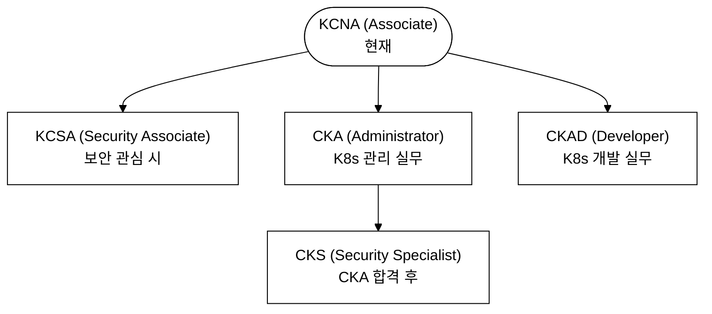

# KCNA Day 10: 최종 정리 & 시험 전략

> 도메인: 전체 (최종 정리) | 예상 소요 시간: 90~120분

이전 학습: Day 9 모의시험 50문에서 오답이 많은 도메인을 이 파일의 해당 암기 카드로 집중 복습한다. Day 1~9의 전 도메인이 이 파일 하나에 압축되어 있으므로 시험 당일 최종 점검용으로도 활용한다.

## 학습 목표

- 5개 도메인 핵심 암기 카드로 빠른 복습 완료
- CNCF Graduated / Incubating 프로젝트 마스터 리스트 확인
- 시험 당일 전략(시간 관리, 문제 풀이 기법) 숙지
- 최종 20문 빠른 점검으로 약점 확인
- 시험 환경 체크리스트 준비

---

## 0. 등장 배경

KCNA 시험은 CKA/CKAD/CKS 같은 실습 기반 시험과 달리 개념 이해를 평가하는 객관식 시험이다. Cloud Native 생태계가 급격히 확장되면서, Kubernetes 뿐만 아니라 CNCF 프로젝트 분류, 관측성 아키텍처, GitOps 원칙, 컨테이너 런타임 표준 등 넓은 범위의 지식이 요구된다. 이 시험은 "실무에서 Kubernetes를 운영할 수 있는가?"보다 "Cloud Native 전체 맥락에서 각 기술의 역할과 관계를 이해하는가?"를 측정한다. 따라서 개별 도구의 사용법보다 아키텍처 원칙(선언적, Reconciliation, Hub-and-Spoke(API Server가 모든 컴포넌트의 중심 허브 역할을 하고 나머지 컴포넌트가 스포크로 연결되는 아키텍처 패턴 — etcd 접근·인증·인가가 모두 API Server를 통과한다), Pull 기반)과 CNCF 생태계 분류를 정확히 파악하는 것이 합격의 핵심이다.

---

## 1. 도메인별 핵심 암기 카드

> **이 섹션을 읽기 전 선수 개념 확인**
>
> - **Raft**: 분산 합의 알고리즘. 여러 서버가 동일한 상태를 유지하도록 리더 선출 + 로그 복제로 동기화를 보장한다. etcd가 클러스터 상태를 안전하게 저장하기 위해 이 알고리즘을 사용한다(→ Day 1 Control Plane 참조).
> - **Linux Namespace**: 프로세스가 보는 시스템 자원의 범위를 격리하는 커널 기능. PID·NET·MNT 등 6종이 존재하며, 컨테이너가 서로 독립된 프로세스 공간을 갖는 기반이다(→ Day 5 Container Orchestration 참조).
> - **sidecar proxy**: 애플리케이션 컨테이너와 같은 Pod 내에 주입되어 인바운드·아웃바운드 트래픽을 가로채는 보조 컨테이너. Service Mesh의 Data Plane이 이 패턴으로 구현된다(→ Day 6 참조).
> - **eBPF**: 커널 소스 코드 수정 없이 커널 내부에서 사용자 정의 프로그램을 안전하게 실행하는 Linux 기술. Cilium이 이를 활용해 iptables 없이 L3~L7 네트워크 정책을 커널 수준에서 처리한다.

### 1-1. Kubernetes Fundamentals (46 %)

**[등장 배경]** 초기 컨테이너 운영은 각 호스트에서 Docker를 직접 실행하고, 네트워크는 호스트 iptables를 수동으로 관리했다. 서비스가 수십 개로 늘어나면 노드 장애 시 수동 재배치, iptables 규칙 폭증, 설정 일관성 유지 불가 문제가 발생했다. Kubernetes는 이를 해결하기 위해 선언적(desired state) + 자동 조정(Reconciliation) 모델을 채택했다. 트레이드오프: Control Plane 컴포넌트들이 추가되므로 운영 복잡도가 높아지고, etcd 장애가 곧 클러스터 전체 장애로 이어진다.

| # | 항목 | 암기 포인트 |
|---|------|------------|
| 1 | Control Plane 구성 | API Server, etcd, Scheduler, Controller Manager |
| 2 | API Server 역할 | 유일한 etcd 접근 컴포넌트, 인증/인가/Admission Control |
| 3 | etcd 특성 | key-value store, Raft 합의(분산 노드 간 리더 선출 + 로그 복제로 일관성을 보장하는 알고리즘), --snapshot-count로 스냅샷 |
| 4 | Scheduler 프로세스 | Filtering → Scoring → Binding |
| 5 | Controller Manager | Desired State ↔ Current State 루프 (Reconciliation) |
| 6 | kubelet | Node 에이전트, Pod spec 수신 → Container Runtime 호출 |
| 7 | kube-proxy | Service → Endpoint 매핑, iptables / IPVS 모드 |
| 8 | Pod 특성 | 최소 배포 단위, 같은 Network Namespace 공유 |
| 9 | Deployment | ReplicaSet 관리, Rolling Update / Rollback |
| 10 | Service 타입 | ClusterIP(내부) → NodePort(외부) → LoadBalancer(클라우드) |
| 11 | DaemonSet | 모든(또는 선택) 노드에 정확히 1개 Pod |
| 12 | StatefulSet | 고정 이름(pod-0), 순차 시작/종료, headless Service 필요 |
| 13 | ConfigMap vs Secret | ConfigMap=평문, Secret=base64(암호화 아님) |
| 14 | Namespace 기본 4개 | default, kube-system, kube-public, kube-node-lease |
| 15 | RBAC 4대 리소스 | Role, ClusterRole, RoleBinding, ClusterRoleBinding |
| 16 | Ingress | L7 라우팅, Ingress Controller 별도 설치 필요 |
| 17 | PV 회수 정책 | PVC 삭제 후 적용 — Retain(PV 보존, 수동 회수), Delete(PV+외부 스토리지 삭제), Recycle(deprecated) |
| 18 | StorageClass | Dynamic Provisioning, volumeBindingMode: WaitForFirstConsumer |
| 19 | Label vs Annotation | Label=선택용(selector), Annotation=메타데이터 저장 |
| 20 | Job vs CronJob | Job=1회 배치, CronJob=스케줄 반복 |

### 1-2. Container Orchestration (22 %)

**[등장 배경]** Docker 이전에는 애플리케이션을 VM에 통째로 올려 OS 전체를 복제했다. 수백 MB~수 GB에 달하는 VM 이미지 빌드·배포 시간이 길었고, 하이퍼바이저 오버헤드로 밀도도 낮았다. Linux Namespace + cgroups 조합으로 프로세스 격리와 자원 제한이 가능해지자 컨테이너가 VM의 효율적 대안으로 떠올랐다. 단, 컨테이너는 호스트 커널을 공유하므로 커널 취약점이 전체 호스트에 영향을 줄 수 있다는 트레이드오프가 있다. OCI 표준이 나오기 전까지는 런타임마다 이미지 포맷과 실행 방식이 달라 도구 간 호환이 불가능했고, CRI(Container Runtime Interface)가 없던 시절 kubelet은 Docker에 직접 의존해 런타임 교체가 불가능했다.

| # | 항목 | 암기 포인트 |
|---|------|------------|
| 1 | Container vs VM | Container: OS 커널 공유, 프로세스 격리 / VM: 하이퍼바이저, 전체 OS |
| 2 | Linux Namespace | 프로세스가 보는 커널 자원 범위를 격리하는 기능 — PID(프로세스), NET(네트워크), MNT(파일시스템), UTS(호스트명), IPC(프로세스간 통신), USER(UID) 총 6종 |
| 3 | Linux cgroups | CPU, Memory, I/O 등 자원 제한 담당 |
| 4 | OCI 3대 Spec | Runtime Spec, Image Spec, Distribution Spec |
| 5 | CRI | Container Runtime Interface - kubelet ↔ Runtime 통신 |
| 6 | CNI | Container Network Interface - Pod 네트워크 플러그인 |
| 7 | CSI | Container Storage Interface - 스토리지 플러그인 |
| 8 | Dockerfile CMD vs ENTRYPOINT | ENTRYPOINT=고정 명령, CMD=기본 인자(덮어쓰기 가능) |
| 9 | Multi-stage Build | 빌드 환경과 실행 환경 분리 → 이미지 크기 감소 |
| 10 | Tag vs Digest | Tag=mutable(latest 변경 가능), Digest(sha256)=immutable |
| 11 | Container Registry | Harbor(private), Docker Hub(public), ECR/GCR/ACR |
| 12 | CoreDNS | K8s 기본 DNS, Service 이름 → ClusterIP 해석 |
| 13 | Image Layers | Union filesystem(OverlayFS) — Dockerfile 명령 1개당 레이어 1개, 실행 시 최상단에 읽기-쓰기 레이어 추가 |

### 1-3. Cloud Native Architecture (16 %)

**[등장 배경]** 모놀리식(Monolithic) 아키텍처는 단일 코드베이스에 모든 기능이 결합되어 있어, 일부 기능을 수정해도 전체를 재배포해야 했다. 장애 격리가 불가능해 DB 연결 오류 하나가 전체 서비스 다운으로 이어졌다. Microservices로 전환하면 서비스별 독립 배포와 장애 격리가 가능해지지만, 서비스 간 네트워크 통신 관리·분산 트랜잭션·분산 디버깅이라는 새로운 복잡성이 생긴다. Service Mesh는 이 복잡성을 애플리케이션 코드 밖(sidecar proxy: 애플리케이션 옆에 붙어 트래픽을 가로채는 보조 컨테이너)으로 분리해 처리하지만, sidecar가 추가되므로 CPU·메모리 오버헤드가 발생한다. Cilium은 기존 kube-proxy의 iptables 방식(규칙 수가 서비스 수에 비례해 증가, 커널 모드 전환 비용)을 eBPF로 대체해 커널 내 L3~L7 필터링과 관측을 동시에 수행한다.

| # | 항목 | 암기 포인트 |
|---|------|------------|
| 1 | CNCF 성숙도 | Sandbox → Incubating → Graduated |
| 2 | Graduated 조건 | 프로덕션 검증, 보안 감사, 거버넌스 완비 |
| 3 | Cloud Native 5요소 | 컨테이너화, 동적 오케스트레이션, 마이크로서비스, 선언적 API, 자동화 |
| 4 | Immutable Infra | 서버 수정 X → 새 이미지로 교체 (Pets vs Cattle) |
| 5 | Microservices 장점 | 독립 배포, 기술 이기종, 장애 격리 |
| 6 | Microservices 단점 | 네트워크 복잡성, 분산 트랜잭션, 디버깅 어려움 |
| 7 | 12-Factor App | 코드베이스·의존성·설정·백엔드 서비스·빌드-릴리스-실행·프로세스·포트 바인딩·동시성·폐기 용이성·dev/prod 동일성·로그·관리자 프로세스, 총 12개 원칙 |
| 8 | Service Mesh 구조 | Data Plane(sidecar proxy: 앱 컨테이너 옆에 주입되어 인바운드·아웃바운드 트래픽을 가로채는 보조 컨테이너) + Control Plane |
| 9 | Istio vs Linkerd | Istio=Envoy 기반/기능 풍부, Linkerd=경량/Rust proxy |
| 10 | HPA | CPU/Memory 기반 Pod 수 자동 조절 |
| 11 | VPA | Pod 리소스 request/limit 자동 조절 |
| 12 | Cluster Autoscaler | 노드 수 자동 조절 (Pending Pod 발생 시 확장) |

### 1-4. Cloud Native Observability (8 %)

**[등장 배경]** 모놀리식 환경에서는 단일 프로세스의 로그 파일 하나를 보면 장애 원인을 파악할 수 있었다. Microservices로 분산되면 요청 하나가 수십 개 서비스를 통과하므로, 어느 서비스에서 지연이 발생했는지 단일 로그만으로는 추적이 불가능하다. 이를 해결하기 위해 수치(Metrics) + 이벤트(Logs) + 요청 흐름(Traces)의 세 축이 필요해졌다. OpenTelemetry(벤더 중립 관측 프레임워크: 특정 벤더에 종속되지 않고 다양한 백엔드로 데이터를 전송할 수 있는 표준 계측 라이브러리·에이전트 모음)가 등장하기 전에는 Jaeger SDK, Prometheus 클라이언트 등을 각각 직접 연동해야 했고, 벤더를 바꾸면 코드를 다시 작성해야 했다. 트레이드오프: 관측 인프라 자체도 자원을 소비하므로 scrape 주기·로그 보존 기간·샘플링 비율 조정이 필요하다.

| # | 항목 | 암기 포인트 |
|---|------|------------|
| 1 | 3 Pillars | Metrics(수치), Logs(이벤트), Traces(요청 흐름) |
| 2 | Prometheus 방식 | Pull-based scraping, /metrics 엔드포인트 |
| 3 | Metric 4타입 | Counter(증가), Gauge(변동), Histogram(분포), Summary(분위수) |
| 4 | PromQL 핵심 | rate(), increase(), histogram_quantile() |
| 5 | Grafana 역할 | 시각화 대시보드, 다중 데이터소스 지원 |
| 6 | Loki 특징 | 로그 내용 인덱싱 안함, Label만 인덱싱 → 저비용 |
| 7 | Jaeger / Zipkin | 분산 트레이싱 도구, Span → Trace 구성 |
| 8 | OpenTelemetry | 벤더 중립 관측 프레임워크, Metrics+Logs+Traces 통합 |
| 9 | Fluentd vs Fluent Bit | Fluentd=풍부한 플러그인, Fluent Bit=경량/엣지 |
| 10 | ResourceQuota | Namespace 단위 총 리소스 제한 |
| 11 | LimitRange | Pod/Container 단위 기본값 및 최대/최소 설정 |

### 1-5. Application Delivery (8 %)

**[등장 배경]** 전통적 배포는 운영자가 수동으로 서버에 SSH 접속해 패키지를 올리고, 설정 파일을 수정하는 방식이었다. 이 방식은 "누가 언제 무엇을 바꿨는지" 추적이 불가능하고, 여러 환경(dev/staging/prod) 간 설정 일관성 유지가 어렵다. GitOps는 Git을 Single Source of Truth로 삼아 선언적 상태를 버전 관리하고, ArgoCD·Flux 같은 Pull 모델 도구가 Git과 클러스터 상태의 차이를 자동으로 조정(Reconciliation)한다. Helm v2에서는 서버 측 컴포넌트 Tiller가 클러스터 내에 상주해 ClusterAdmin 권한을 보유했는데, 이는 보안 취약점이었다. v3에서 Tiller를 제거해 클라이언트가 직접 API Server에 요청하도록 개선했지만, 릴리스 상태가 클러스터 Secret으로 저장되므로 해당 Namespace의 RBAC 관리가 더 중요해졌다.

| # | 항목 | 암기 포인트 |
|---|------|------------|
| 1 | GitOps 4원칙 | 선언적, 버전 관리, 자동 적용, 지속적 조정(Reconciliation) |
| 2 | ArgoCD | Pull 모델, Web UI, ApplicationSet, K8s CRD 기반 |
| 3 | Flux | Pull 모델, CLI 중심, Kustomize Controller 내장 |
| 4 | CI vs CD | CI=빌드+테스트 자동화, CD=배포 자동화 |
| 5 | Rolling Update | 점진적 교체, maxSurge/maxUnavailable |
| 6 | Blue-Green | 두 환경 전환, 즉시 롤백 가능, 2배 리소스 |
| 7 | Canary | 소수 트래픽 먼저 전환, 검증 후 전체 적용 |
| 8 | Helm 3요소 | Chart(패키지), Release(인스턴스), Repository(저장소) |
| 9 | Helm v3 변경 | Tiller 제거 → 클라이언트만으로 동작 |
| 10 | Kustomize | base + overlay 구조, 패치 기반 커스터마이징 |
| 11 | IaC 도구 | Terraform(HCL 파일 기반), Crossplane(K8s CRD/Operator 기반 — `kubectl apply`로 클라우드 리소스를 선언적으로 프로비저닝. Terraform이 별도 상태 파일·HCL을 사용하는 것과 달리 Crossplane은 K8s API를 그대로 활용) |

---

## 2. CNCF 프로젝트 마스터 리스트

**[등장 배경]** Cloud Native 생태계가 확산되면서 벤더마다 호환되지 않는 솔루션이 난립했다. CNCF(Cloud Native Computing Foundation)는 표준 채택·프로젝트 중립 거버넌스를 통해 생태계를 정리하는 역할을 한다. Sandbox(실험 단계, 프로덕션 미보장) → Incubating(성장 단계, 일부 프로덕션 사례) → Graduated(프로덕션 검증 완료, 보안 감사 통과, 거버넌스 완비) 3단계로 성숙도를 분류한다. 시험에서는 특정 프로젝트가 어느 단계에 속하는지, 어느 카테고리(런타임·관측·보안 등)인지를 묻는다.

**Graduated 3대 조건 상세:** ① **프로덕션 검증** — 다수의 독립적인 조직이 프로덕션 환경에서 사용하고 있음을 공개 증거로 제시해야 한다. ② **보안 감사** — CNCF가 제3자 보안 회사에 의뢰한 공개 감사 보고서를 제출해야 하며, 발견된 취약점은 수정하고 보고서를 공개한다. ③ **거버넌스 완비** — TOC(Technical Oversight Committee) 투표(2/3 이상 찬성)를 통과해야 하며, 공개 로드맵·기여 가이드라인·행동 강령이 갖춰져야 한다. Incubating과의 실질적 차이는 이 보안 감사와 TOC 투표 통과 여부로, 시험에서 "프로덕션 신뢰도가 검증된 프로젝트"를 고르는 문제에서 Graduated가 정답이 된다.

### 2-1. Graduated 프로젝트 (시험 빈출)

| 카테고리 | 프로젝트 | 한줄 설명 |
|----------|---------|-----------|
| 오케스트레이션 | **Kubernetes** | 컨테이너 오케스트레이션 표준 |
| 컨테이너 런타임 | **containerd** | 산업 표준 컨테이너 런타임 |
| 모니터링 | **Prometheus** | Pull 기반 메트릭 수집 및 알림 |
| 서비스 메시 | **Linkerd** | 경량 서비스 메시 |
| 서비스 메시 | **Istio** | Envoy 기반 서비스 메시 (Graduated 2023) |
| 서비스 프록시 | **Envoy** | L4/L7 고성능 프록시 |
| 네트워크 | **Cilium** | eBPF(커널 소스 수정 없이 커널 내 사용자 정의 프로그램을 안전하게 실행하는 Linux 기술) 기반 네트워킹/보안/관측 |
| CI/CD | **Argo** | GitOps CD, Workflows, Events, Rollouts |
| CI/CD | **Flux** | GitOps 지속적 배포 도구 |
| 패키지 관리 | **Helm** | K8s 패키지 매니저 |
| 로깅 | **Fluentd** | 통합 로그 수집기 |
| 트레이싱 | **Jaeger** | 분산 트레이싱 시스템 |
| 관측 | **OpenTelemetry** | 벤더 중립 관측 프레임워크 |
| 보안 | **Falco** | 런타임 보안 위협 탐지 |
| 보안 | **OPA** | 범용 정책 엔진 (Rego 언어) |
| 보안 | **TUF** | 소프트웨어 업데이트 보안 프레임워크 |
| 레지스트리 | **Harbor** | 엔터프라이즈 컨테이너 레지스트리 |
| 스토리지 | **Rook** | K8s 스토리지 오케스트레이션 (Ceph) |
| 스토리지 | **Longhorn** | 경량 분산 블록 스토리지 |
| DNS | **CoreDNS** | K8s 기본 DNS 서버 |
| API Gateway | **Emissary-ingress** | K8s 네이티브 API Gateway |
| Key/Value | **etcd** | 분산 key-value 저장소 |

> **시험 출제 참고 — 비(非) CNCF 프로젝트**
>
> | 카테고리 | 프로젝트 | 설명 |
> |----------|---------|------|
> | 시각화 | **Grafana** | 다중 데이터소스 대시보드. CNCF Graduated 프로젝트가 아니므로 "CNCF Graduated 프로젝트를 고르시오" 문제의 정답이 될 수 없다. 단, Prometheus·Loki와 함께 관측성 스택 구성 요소로 출제된다. |

### 2-2. 주요 Incubating 프로젝트

> **주의**: 아래 목록은 KCNA 시험 출제 당시 기준이다. 프로젝트 성숙도는 갱신되므로 응시 전 cncf.io/projects 에서 최신 단계를 확인한다.

| 카테고리 | 프로젝트 | 한줄 설명 |
|----------|---------|-----------|
| 스케줄링 | **Volcano** | 배치 작업 스케줄러 (Incubating) |
| 빌드 | **Buildpacks** | 소스코드 → OCI 이미지 자동 빌드 (Incubating) |
| 네트워크 | **Calico** (참조) | BGP 기반 네트워크 정책 (CNCF 외) |
| 보안 | **cert-manager** | X.509 인증서(TLS/mTLS에 사용되는 공개 키 기반 디지털 인증서 표준) 자동 발급·갱신 관리 |
| 보안 | **Kyverno** | K8s 네이티브 정책 엔진 |
| 런타임 | **CRI-O** | K8s 전용 경량 컨테이너 런타임 |
| Serverless | **Knative** | K8s 서버리스 프레임워크 |
| 관측 | **Thanos** | Prometheus 장기 저장 / 고가용성 |
| 관측 | **Cortex** | 멀티테넌트 Prometheus |
| GitOps | **Backstage** | 개발자 포털 / 서비스 카탈로그 |
| 빌드 | **Tekton** | K8s 네이티브 CI/CD 파이프라인 |

> **시험 팁:** Graduated 프로젝트 이름과 카테고리를 정확히 매칭할 수 있어야 한다. "다음 중 CNCF Graduated 프로젝트는?" 형태 빈출.

---

## 3. 시험 당일 전략

### 3-1. 시험 개요 재확인

| 항목 | 내용 |
|------|------|
| 시험 코드 | KCNA (Kubernetes and Cloud Native Associate) |
| 문항 수 | 60문항 (객관식 + 일부 복수선택) |
| 시간 | 90분 |
| 합격 점수 | 75% (45/60) |
| 시험 방식 | 온라인 감독 (PSI) |
| 유효 기간 | 3년 |
| 재시험 | 1회 무료 재응시 포함 |

### 3-2. 시간 관리 전략

```
총 90분 / 60문항 = 문항당 약 1.5분

[Phase 1] 빠른 1차 풀이 (50분)
├── 확실한 문제 → 즉시 답 선택 (30초 이내)
├── 애매한 문제 → 최선 답 선택 + Flag 표시
└── 모르는 문제 → 아무 답이나 선택 + Flag 표시

[Phase 2] Flag 문제 재검토 (25분)
├── Flag 문제 순서대로 재확인
├── 2개로 좁혀진 문제 → 신중하게 선택
└── 완전 모르는 문제 → 소거법 적용

[Phase 3] 최종 점검 (15분)
├── 전체 답안 누락 확인
├── 복수선택 문항 개수 확인
└── 변경 시 확실한 근거가 있을 때만
```

### 3-3. 문제 풀이 기법

**소거법 우선 전략:**

```
4지선다 기준:
- 명백한 오답 1개 제거 → 33% 확률
- 명백한 오답 2개 제거 → 50% 확률
- 3개 제거 → 정답
```

**키워드 매칭 전략:**

| 문제 키워드 | 정답 방향 |
|-------------|-----------|
| "Pull-based monitoring" | Prometheus |
| "sidecar proxy" | Service Mesh (Istio, Linkerd) |
| "desired state" | Controller, Reconciliation |
| "eBPF" | Cilium, Falco |
| "immutable" | Container image digest, Immutable Infrastructure |
| "declarative" | YAML manifest, GitOps |
| "vendor-neutral observability" | OpenTelemetry |
| "lightweight runtime" | containerd, CRI-O |
| "policy engine" | OPA (Rego), Kyverno |
| "runtime security" | Falco |
| "certificate management" | cert-manager |
| "package manager" | Helm |
| "overlay customization" | Kustomize |
| "graduated project" | 목록 암기 필수 |

**오답 함정 패턴:**

| 함정 유형 | 예시 | 올바른 판단 |
|-----------|------|-------------|
| 비슷한 이름 | "Prometheus는 Push 방식이다" | X - Pull 방식 |
| 범위 혼동 | "Role은 클러스터 전체에 적용된다" | X - Namespace 범위 (ClusterRole이 전체) |
| 버전 혼동 | "Helm v3는 Tiller를 사용한다" | X - v2에서 사용, v3에서 제거 |
| 기능 뒤바꿈 | "Namespace는 자원을 제한한다" | X - ResourceQuota가 제한 (Namespace는 격리) |
| 과장 표현 | "Secret은 데이터를 암호화한다" | X - base64 인코딩일 뿐 (EncryptionConfiguration 별도) |
| 절대적 표현 | "항상", "반드시", "유일하게" | 주의 - 대부분 오답 |

### 3-4. 도메인별 출제 비중 & 목표

```
도메인                    비중    문항수(추정)  목표정답
─────────────────────────────────────────────────
Kubernetes Fundamentals   46%     ~28문항      24개 이상
Container Orchestration   22%     ~13문항      10개 이상
Cloud Native Architecture 16%     ~10문항       8개 이상
Cloud Native Observability 8%      ~5문항       4개 이상
Application Delivery       8%      ~4문항       3개 이상
─────────────────────────────────────────────────
합계                     100%      60문항      49개 (82%)
```

> 합격선 75%(45개)보다 여유 있게 49개(82%)를 목표로 한다.

---

## 4. 최종 20문 빠른 점검

아래 문제를 3초 이내에 답할 수 있으면 해당 개념은 충분히 암기된 것이다.

| # | 질문 | 정답 | 개념 확인 명령 |
|---|------|------|--------------|
| 1 | etcd에 직접 접근하는 유일한 컴포넌트는? | API Server | `kubectl explain pod.spec` (API Server 경유 확인) |
| 2 | Scheduler의 3단계 프로세스는? | Filtering → Scoring → Binding | `kubectl get events --field-selector reason=Scheduled` |
| 3 | kube-proxy의 두 가지 모드는? | iptables, IPVS | `kubectl -n kube-system describe cm kube-proxy \| grep mode` |
| 4 | StatefulSet에 필요한 Service 타입은? | Headless Service (clusterIP: None) | `kubectl explain statefulset.spec.serviceName` |
| 5 | Secret의 인코딩 방식은? | base64 (암호화 아님) | `kubectl explain secret.data` |
| 6 | 기본 Namespace 4개를 나열하라 | default, kube-system, kube-public, kube-node-lease | `kubectl get ns` |
| 7 | ClusterRole과 Role의 차이는? | ClusterRole=클러스터 범위, Role=Namespace 범위 | `kubectl explain role.rules` |
| 8 | PV 회수 정책 3가지는? | Retain, Delete, Recycle(deprecated) — PVC 삭제 후 적용됨 | `kubectl explain pv.spec.persistentVolumeReclaimPolicy` |
| 9 | Container 격리를 담당하는 Linux 기술은? | Namespace(격리) + cgroups(자원제한) | `kubectl explain pod.spec.containers.resources` |
| 10 | OCI 3대 스펙은? | Runtime Spec, Image Spec, Distribution Spec | (개념 문항, 검증 명령 없음) |
| 11 | CRI / CNI / CSI 각각 무엇의 약자? | Container Runtime / Network / Storage Interface | `kubectl explain node.status.nodeInfo.containerRuntimeVersion` |
| 12 | CNCF 프로젝트 성숙도 3단계는? | Sandbox → Incubating → Graduated | (개념 문항, cncf.io/projects 확인) |
| 13 | Prometheus의 메트릭 수집 방식은? | Pull-based (HTTP scraping) | `kubectl -n monitoring get servicemonitor` (platform 클러스터) |
| 14 | Observability 3 Pillars는? | Metrics, Logs, Traces | (개념 문항) |
| 15 | OpenTelemetry의 핵심 특징은? | 벤더 중립 관측 프레임워크 (Metrics+Logs+Traces) | `kubectl explain opentelemetrycollector` (otel-operator 설치 시) |
| 16 | GitOps의 Single Source of Truth는? | Git Repository | (개념 문항) |
| 17 | Helm v3에서 제거된 서버 측 컴포넌트는? | Tiller | `helm version` (서버 정보 없음 확인) |
| 18 | Kustomize의 구조 패턴은? | base + overlay | `kubectl kustomize --help` |
| 19 | Blue-Green 배포의 단점은? | 2배 리소스 필요 | (개념 문항) |
| 20 | Canary 배포의 핵심 원리는? | 소수 트래픽으로 먼저 검증 후 전체 적용 | (개념 문항) |

**자가 채점:**
- 18-20개 정답: 시험 준비 완료
- 15-17개 정답: 틀린 영역 Day 자료 재학습
- 15개 미만: 해당 도메인 처음부터 재학습

---

## 5. 시험 환경 체크리스트

### 5-1. 시험 전날

```
[ ] PSI 계정 로그인 확인 및 시험 예약 재확인
[ ] 시스템 요구사항 확인 (PSI Secure Browser 설치)
    - Windows 10+ 또는 macOS 12+
    - 웹캠, 마이크 필수
    - 안정적 인터넷 연결 (최소 1 Mbps)
[ ] 여권 또는 정부 발행 영문 신분증 준비
    - 이름이 시험 등록 이름과 정확히 일치해야 함
[ ] 조용한 시험 공간 확보
    - 책상 위 정리 (모니터, 키보드, 마우스만)
    - 문 닫기 가능한 개인 공간
[ ] PSI 호환성 테스트 실행
    - https://syscheck.bridge.psiexams.com/
[ ] 충전기 연결 확인 (노트북 사용 시)
```

### 5-2. 시험 당일

```
[ ] 시험 시작 30분 전 PSI Secure Browser 실행
[ ] 신분증 웹캠으로 촬영
[ ] 방 360도 촬영 (감독관 요청 시)
[ ] 책상 위/아래 촬영
[ ] 감독관 채팅 연결 확인
[ ] 시험 시작 후 바로 문제 풀기 (튜토리얼은 빠르게 넘기기)
```

### 5-3. 주의사항

```
[ ] 시험 중 금지 행위:
    - 입으로 문제 읽기 (lip movement 감지)
    - 시선 이동 과다 (화면 밖 응시)
    - 다른 앱/탭 열기 (PSI Browser가 차단)
    - 메모 작성 (외부 메모 금지, 시험 내 메모 기능 없음)
    - 이어폰/헤드폰 착용
[ ] 문제 수 확인: 60문항 모두 답안 선택했는지 최종 확인
[ ] 복수선택 문항: "Select TWO" 등 지시문 주의
```

---

## 6. 도메인별 최다빈출 키워드 정리

### 6-1. Fundamentals 최다빈출

```
1. API Server        → 모든 통신의 중심, 유일한 etcd 접근점
2. etcd              → Raft 합의, 클러스터 상태 저장
3. Pod               → 최소 단위, sidecar 패턴
4. Deployment        → ReplicaSet 관리, rollout/rollback
5. Service           → ClusterIP < NodePort < LoadBalancer
6. RBAC              → 최소 권한 원칙, ServiceAccount
7. ConfigMap/Secret  → 설정 분리, Secret≠암호화
8. PV/PVC            → StorageClass, Dynamic Provisioning
9. Namespace         → 리소스 격리(제한 아님), 4개 기본
10. Ingress          → L7 라우팅, Controller 필수
```

### 6-2. Orchestration 최다빈출

```
1. Container vs VM   → 커널 공유 vs 하이퍼바이저
2. OCI               → 3대 Spec (Runtime, Image, Distribution)
3. CRI/CNI/CSI       → 플러그인 인터페이스 삼총사
4. containerd        → 산업 표준 런타임 (Graduated)
5. Image Layers      → Union filesystem(여러 읽기 전용 레이어를 하나의 디렉터리로 합쳐 보여주는 파일시스템, OverlayFS 가 대표적) — Dockerfile 명령어 1개당 레이어 1개가 추가되며, 컨테이너 실행 시 최상단에 읽기-쓰기 레이어 1개가 추가된다
```

### 6-3. Architecture 최다빈출

```
1. CNCF 성숙도       → Sandbox → Incubating → Graduated
2. Microservices     → 독립 배포, API 통신, 장애 격리
3. Service Mesh      → Sidecar proxy, Data Plane + Control Plane
4. Autoscaling       → HPA(Pod수), VPA(리소스), CA(노드수)
5. 12-Factor App     → 클라우드 네이티브 앱 설계 원칙
```

### 6-4. Observability 최다빈출

```
1. Prometheus        → Pull-based, 4 metric types
2. 3 Pillars         → Metrics, Logs, Traces
3. OpenTelemetry     → 벤더 중립, CNCF Graduated
4. Grafana           → 시각화, 다중 데이터소스
5. Loki              → Label 인덱싱만, 저비용 로그 시스템
```

### 6-5. Delivery 최다빈출

```
1. GitOps            → Git = Single Source of Truth
2. ArgoCD/Flux       → Pull 모델 CD 도구 (둘 다 Graduated)
3. Helm              → Chart/Release/Repository, v3 Tiller 제거
4. 배포 전략          → Rolling / Blue-Green / Canary
5. Kustomize         → base + overlay, 패치 기반
```

---

## 7. 헷갈리기 쉬운 비교 정리

### 7-1. 자주 혼동되는 쌍

| 비교 대상 | A | B | 핵심 차이 |
|-----------|---|---|-----------|
| Role vs ClusterRole | Namespace 범위 | 클러스터 범위 | 적용 범위 |
| ConfigMap vs Secret | 평문 저장 | base64 인코딩 | 민감도 수준 |
| DaemonSet vs Deployment | 노드당 1개 | replicas로 지정 | 배포 패턴 |
| HPA vs VPA | Pod 수 조절 | Pod 리소스 조절 | 스케일 방향 |
| Ingress vs Service | L7(HTTP 경로) | L4(IP:Port) | OSI 계층 |
| Helm vs Kustomize | 템플릿 엔진 | 패치/오버레이 | 커스터마이징 방식 |
| ArgoCD vs Flux | Web UI, ApplicationSet | CLI 중심, Kustomize 내장 | UX 차이 |
| Prometheus vs Loki | 메트릭 수집 | 로그 수집 | 데이터 유형 |
| Namespace vs cgroups | 프로세스 격리 | 자원 제한 | 격리 대상 |
| PV vs PVC | 관리자가 생성 | 사용자가 요청 | 생성 주체 |
| Jaeger vs Prometheus | 트레이스 | 메트릭 | 관측 유형 |
| OPA vs Kyverno | Rego 언어, 범용 | K8s YAML, K8s 전용 | 정책 표현 |

### 7-2. "~는 ~가 아니다" 필수 암기

```
1. Secret은 암호화가 아니다 (base64 인코딩)
2. Namespace는 자원 제한이 아니다 (ResourceQuota가 제한)
3. [iptables 모드] kube-proxy는 실제 트래픽을 프록시하지 않는다 — 커널 netfilter(iptables) 규칙을 생성·관리할 뿐이며, 트래픽은 커널이 규칙에 따라 직접 처리한다. kube-proxy 프로세스 자체는 데이터 경로에 없다.
3a. [IPVS 모드] kube-proxy는 IPVS(IP Virtual Server) 규칙을 커널에 심고, 커널의 넷필터 IPVS 모듈이 L4 로드밸런싱을 직접 수행한다. iptables 모드보다 서비스 수가 늘어도 규칙 조회가 O(1)로 처리된다. 두 모드 모두 kube-proxy 프로세스가 실제 패킷을 릴레이하지 않는다는 점은 동일하다.
4. Ingress는 자체적으로 동작하지 않는다 (Controller 필요)
5. Pod는 영구적이지 않다 (ephemeral, 언제든 재생성)
6. Label은 메타데이터 저장용이 아니다 (Annotation이 저장용)
7. Helm v3는 서버 컴포넌트가 없다 (Tiller 제거됨)
8. CNCF Sandbox는 프로덕션 검증을 의미하지 않는다 (실험 단계)
9. Loki는 로그 내용을 인덱싱하지 않는다 (Label만 인덱싱)
10. Prometheus는 장기 저장에 적합하지 않다 (Thanos/Cortex 필요)
```

---

## 8. 시험에서 자주 나오는 트러블슈팅 시나리오

앞 섹션 7의 개념 비교를 바탕으로, KCNA 시험은 상태 이름(Pending·CrashLoopBackOff 등)과 원인을 연결하는 객관식 형태로도 출제된다. 아래 시나리오별 "실측 검증" 명령은 dev 클러스터(`kubectl --kubeconfig ~/sideproejct/IaC_apple_sillicon/kubeconfig/dev.yaml`)에서 직접 실행해 결과를 확인한다.

시험 문제에서 장애 시나리오를 설명하고 원인 또는 해결 방법을 묻는 패턴이 자주 출제된다.

> **실습 전제**: dev 또는 staging 클러스터 가동 상태, kubeconfig 경로 `~/sideproejct/IaC_apple_sillicon/kubeconfig/dev.yaml`, 클러스터 접근은 `kubectl --kubeconfig ~/sideproejct/IaC_apple_sillicon/kubeconfig/dev.yaml` 또는 `ssh dev-master`. 파괴 실습은 dev/staging에서만 수행한다.

```
시나리오 1: Pod가 Pending 상태
  → Scheduler가 적합한 노드를 찾지 못했다
  → 원인: 리소스 부족, Taint 불일치, nodeSelector 불일치, PVC 미바인딩
  → 실측 검증: kubectl describe pod <name> -n <ns> | grep -A 5 Events

시나리오 2: Pod가 CrashLoopBackOff 상태
  → 컨테이너가 시작 후 즉시 종료되고 반복 재시작된다
  → 원인: 앱 코드 오류, 설정 누락, 메모리 초과(OOMKilled), 잘못된 command
  → 실측 검증: kubectl logs <name> -n <ns> --previous

시나리오 3: Service에 접근해도 응답 없음
  → Endpoints가 비어 있다
  → 원인: Service selector와 Pod labels 불일치, Pod가 Ready 상태가 아님
  → 실측 검증: kubectl get endpoints <svc-name> -n <ns>

시나리오 4: kubectl 명령이 Forbidden
  → RBAC 권한 부족이다
  → 원인: 사용자에게 해당 리소스에 대한 Role/RoleBinding이 없다
  → 실측 검증: kubectl auth can-i <verb> <resource> --as <user> -n <ns>

시나리오 5: 이미지를 가져올 수 없음 (ImagePullBackOff)
  → 원인: 이미지 이름/태그 오타, 프라이빗 레지스트리 인증 실패, 네트워크 문제
  → 실측 검증: kubectl describe pod <name> -n <ns> | grep -A 5 Events

시나리오 6: Deployment 업데이트 후 롤백 필요
  → kubectl rollout undo deployment/<name>
  → Deployment가 이전 ReplicaSet을 보관하고 있으므로 가능하다
  → 실측 검증: kubectl rollout history deployment/<name>

시나리오 7: HPA가 동작하지 않음 (TARGETS: <unknown>)
  → metrics-server 미설치 또는 Pod에 resources.requests 미설정
  → 실측 검증: kubectl describe hpa <name> -n <ns>

시나리오 8: Ingress가 동작하지 않음
  → Ingress Controller가 설치되어 있지 않다
  → Ingress 리소스만으로는 아무 동작도 하지 않는다
  → 실측 검증: kubectl get pods -n ingress-nginx (또는 해당 Controller Namespace)
```

---

## 9. 합격 후 다음 단계

### 9-1. 인증 로드맵


_그림 1. KCNA 이후 인증 로드맵(CKS 는 CKA 합격이 선수조건)._

### 9-2. 추천 학습 경로

| 순서 | 인증 | 특징 | 준비 기간 |
|------|------|------|-----------|
| 1 | KCNA | 이론 중심, 객관식 | 2-3주 |
| 2 | CKA | 실습 중심, 터미널 시험 | 4-6주 |
| 3 | CKAD | 앱 개발 중심, 터미널 시험 | 3-4주 |
| 4 | CKS | 보안 중심, CKA 필수 선수 | 4-6주 |
| 5 | KCSA | 보안 이론, 객관식 | 2-3주 |

### 9-3. tart-infra 실습 확장

KCNA 합격 후 CKA 실습 환경을 구축할 때는 이 저장소에 이미 있는 스크립트를 재사용한다. 무분별한 VM 증식을 피하고, 기존 dev/staging 클러스터를 초기화해서 사용하는 것이 원칙이다.

```bash
# 저장소 루트로 이동
cd ~/sideproejct/IaC_apple_sillicon

# dev 클러스터를 초기화해 fresh 상태로 재생성 (VM째 삭제 후 재구축)
./scripts/reset-cluster.sh dev

# 재생성 후 IP 드리프트 복구 (재부팅마다 실행 필요)
./scripts/fix-cluster-ip-drift.sh dev

# CKA 실습 시나리오 연습 (kubeconfig 명시)
kubectl --kubeconfig kubeconfig/dev.yaml run nginx --image=nginx --dry-run=client -o yaml > pod.yaml
kubectl --kubeconfig kubeconfig/dev.yaml create deployment web --image=nginx --replicas=3
kubectl --kubeconfig kubeconfig/dev.yaml expose deployment web --port=80 --type=NodePort
```

---

## 10. 학습 완료 자가 평가

### 10-1. 도메인별 준비도 체크

각 항목에 대해 스스로 점수를 매겨본다 (1-5점).

```
Kubernetes Fundamentals (46%)
[ ] Control Plane 4대 컴포넌트 역할 설명 가능     ___/5
[ ] Worker Node 컴포넌트 역할 설명 가능            ___/5
[ ] 핵심 오브젝트 10개 이상 YAML 구조 이해          ___/5
[ ] RBAC, Namespace, Label 개념 정확히 구분         ___/5
[ ] PV/PVC/StorageClass 관계 설명 가능             ___/5

Container Orchestration (22%)
[ ] Container vs VM 차이 5가지 이상 설명 가능       ___/5
[ ] Linux Namespace vs cgroups 구분 가능           ___/5
[ ] OCI, CRI, CNI, CSI 설명 가능                   ___/5

Cloud Native Architecture (16%)
[ ] CNCF 성숙도 3단계와 Graduated 프로젝트 10개     ___/5
[ ] Service Mesh 구조와 대표 도구 설명 가능          ___/5
[ ] HPA/VPA/Cluster Autoscaler 차이 설명 가능       ___/5

Cloud Native Observability (8%)
[ ] 3 Pillars 각각 대표 도구 연결 가능              ___/5
[ ] Prometheus Pull 방식과 4 metric types           ___/5

Application Delivery (8%)
[ ] GitOps 4원칙 나열 가능                         ___/5
[ ] Helm vs Kustomize 차이 설명 가능               ___/5
[ ] 3대 배포 전략 비교 설명 가능                     ___/5
```

### 10-2. 최종 판정

```
총점 80점 만점 기준:
- 70점 이상 (88%+) : 시험 응시 권장 → 합격 확률 높음
- 55점 이상 (69%+) : 약점 도메인 보충 후 응시
- 55점 미만         : Day 1부터 재학습 권장
```

---

## 11. Day 1-10 전체 커리큘럼 요약

| Day | 주제 | 도메인 | 핵심 키워드 |
|-----|------|--------|------------|
| 1 | K8s 아키텍처 - Control Plane & Worker Node | Fundamentals | API Server, etcd, Scheduler, kubelet |
| 2 | K8s 아키텍처 - 통신 흐름 & Static Pod | Fundamentals | kubectl → API Server → kubelet 흐름 |
| 3 | 핵심 오브젝트 Part 1 | Fundamentals | Pod, Deployment, Service, DaemonSet, StatefulSet, Job |
| 4 | 핵심 오브젝트 Part 2 | Fundamentals | ConfigMap, Secret, RBAC, Ingress, PV/PVC |
| 5 | 컨테이너 오케스트레이션 & 컨테이너 기술 | Orchestration | Namespace, cgroups, OCI, CRI/CNI/CSI |
| 6 | 클라우드 네이티브 아키텍처 | Architecture | CNCF, Microservices, Service Mesh, Autoscaling |
| 7 | 클라우드 네이티브 관측성 | Observability | Prometheus, 3 Pillars, OpenTelemetry |
| 8 | 애플리케이션 전달 | Delivery | GitOps, ArgoCD, Helm, Kustomize, 배포 전략 |
| 9 | 모의시험 50문 | 전체 | 도메인별 비중 반영, 오답 분석 |
| 10 | 최종 정리 & 시험 전략 | 전체 | 암기 카드, CNCF 리스트, 시험 전략 |

---

**KCNA 10일 학습 과정을 모두 완료했다. 시험에서 좋은 결과를 거두기 바란다.**
