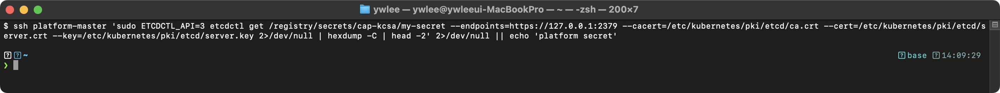
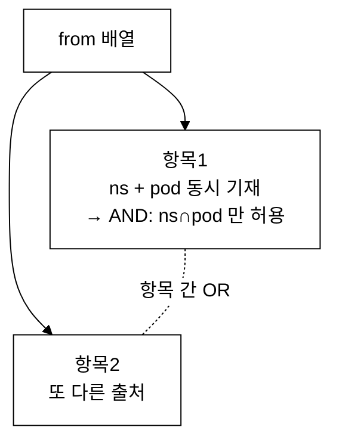

# KCSA 핵심 개념 정리

> KCSA(Kubernetes and Cloud Native Security Associate) 시험의 모든 도메인을 다루는 핵심 개념 정리이다.

> 학습 목표: KCSA 6개 도메인의 핵심 개념·용어·설정을 객관식 대비 수준으로 이해한다 | 총 비중: 100%(6개 도메인 합) | 예상 소요: 4~6시간

## 오늘의 학습 목표 (체크리스트)

- [ ] 클라우드 네이티브 보안 4C(Cloud/Cluster/Container/Code)와 심층 방어 모델을 설명한다.
- [ ] API Server의 3단계 요청 처리(인증 → 인가 → Admission Control)와 각 단계의 역할을 구분한다.
- [ ] etcd가 Raft 합의로 무엇을 보장하는지, 왜 보안 우선순위가 가장 높은지 설명한다.
- [ ] Pod Security Standards 3레벨(Privileged/Baseline/Restricted)과 PSA 3모드(enforce/audit/warn)를 구분한다.
- [ ] RBAC 리소스 4종과 NetworkPolicy의 from/to 결합 규칙(항목 간 OR, 항목 내 AND)을 설명한다.
- [ ] seccomp·AppArmor·SELinux가 각각 무엇을 어떻게 제한하는지, DAC과의 차이를 설명한다.
- [ ] OPA/Gatekeeper와 Kyverno의 정책 모델 차이를 구분한다.
- [ ] Audit Logging의 레벨·단계와 민감 리소스 처리 원칙을 설명한다.

---

## 1. Overview of Cloud Native Security (14%)

### 1.1 클라우드 네이티브 보안의 4C

클라우드 네이티브 보안은 4개의 계층(Layer)으로 구성되며, 각 계층은 바깥에서 안쪽으로 보호 범위를 좁혀가는 심층 방어(Defense in Depth) 모델이다.

심층 방어(Defense in Depth)란 보안을 단일 통제 하나에만 의존하지 않고 여러 겹의 방어선을 쌓는 설계 방식이다. 마치 양파 껍질처럼 한 겹이 뚫려도 다음 겹이 공격을 막거나 최소한 피해를 늦춘다. 단일 방화벽이나 단일 인증 하나에 모든 것을 거는 구조는 그 하나가 무너지면 전체가 노출되지만, 여러 겹이면 공격자가 모든 겹을 차례로 돌파해야 하므로 침해 난이도와 탐지 가능성이 함께 높아진다. 4C는 이 원리를 클라우드 네이티브 환경에 적용해, 각 계층이 독립적으로 작동하는 방어선이 되도록 나눈 것이다. 예를 들어 클라우드 IAM 자격 증명이 유출되어 Cloud 계층이 뚫려도 Cluster 계층의 RBAC이 그 주체의 권한을 제한하고, RBAC마저 우회당해도 Container 계층의 seccomp이 위험한 시스템 콜을 차단하며, 그것도 무력화되면 Code 계층의 입력 검증이 마지막 방어선이 된다. 이렇게 각 겹이 다른 종류의 위협에 대응하므로, 한 가지 우회 기법으로 전체를 뚫기 어렵게 만드는 것이 4C 모델의 목적이다.

| 계층 | 설명 | 주요 보안 영역 |
|------|------|---------------|
| **Cloud** | 인프라스트럭처 계층. 클라우드 제공자 또는 데이터센터의 물리적/논리적 보안이다. | IAM, 네트워크 방화벽, 암호화, 감사 로그 |
| **Cluster** | Kubernetes 클러스터 자체의 보안이다. | API Server 인증/인가, etcd 암호화, RBAC, NetworkPolicy |
| **Container** | 컨테이너 이미지 및 런타임 보안이다. | 이미지 스캐닝, 최소 권한 실행, 읽기 전용 파일시스템, seccomp/AppArmor |
| **Code** | 애플리케이션 코드 레벨의 보안이다. | 의존성 스캐닝, 시크릿 관리, TLS 통신, 입력 검증 |

핵심 원칙: 바깥 계층이 뚫려도 안쪽 계층이 추가 방어를 제공해야 한다. 하나의 계층에만 의존하는 것은 단일 실패 지점(Single Point of Failure)을 만드는 것이다.

#### 각 계층별 공격 시나리오와 방어 기법

**Cloud 계층 공격 시나리오**:
- **공격**: 클라우드 IAM 키가 Git 리포지토리에 노출되어 공격자가 인프라 전체에 접근한다. EC2 Instance Metadata Service(IMDS)를 통해 임시 자격 증명을 탈취하여 S3 버킷, RDS 등 내부 리소스에 접근한다.
- **방어**: IAM 최소 권한 원칙 적용, IMDSv2 강제(hop limit 1 설정), VPC 서브넷 분리, 클라우드 감사 로그(CloudTrail, Cloud Audit Logs) 활성화, 보안 그룹에서 불필요한 인바운드 포트를 차단한다.

**Cluster 계층 공격 시나리오**:
- **공격**: API Server가 인터넷에 노출(`0.0.0.0:6443`)되어 있고 익명 인증이 활성화되어 있으면, 공격자가 인증 없이 클러스터 리소스를 열람하거나 수정한다. etcd가 암호화 없이 운용되면 Secret 데이터가 평문으로 유출된다.
- **방어**: API Server를 프라이빗 네트워크에 배치, `--anonymous-auth=false` 설정, RBAC 및 NodeRestriction Admission Plugin 활성화, etcd Encryption at Rest 설정, API Server 감사 로그 활성화이다.

**Container 계층 공격 시나리오**:
- **공격**: 취약한 베이스 이미지(예: 패치되지 않은 OpenSSL)를 사용하여 RCE(Remote Code Execution) 취약점이 악용된다. 특권 컨테이너(`privileged: true`)에서 호스트 파일시스템에 접근하여 컨테이너 탈출(container escape)이 발생한다.
- **방어**: 이미지 스캐닝(Trivy, Grype)을 CI/CD 파이프라인에 통합, distroless/minimal 베이스 이미지 사용, `readOnlyRootFilesystem: true`, `runAsNonRoot: true`, seccomp/AppArmor 프로파일 적용이다.

**Code 계층 공격 시나리오**:
- **공격**: 애플리케이션이 사용자 입력을 검증하지 않아 SQL Injection이 발생한다. 하드코딩된 API 키가 소스코드에 포함되어 Git 히스토리를 통해 유출된다. 악성 의존성(dependency confusion)이 주입된다.
- **방어**: 입력 검증 및 파라미터화된 쿼리 사용, 시크릿을 환경 변수 또는 Secret 볼륨으로 주입, 의존성 스캐닝(Dependabot, Snyk), SAST/DAST 도구를 CI/CD에 통합한다.

### 1.2 CNCF Security TAG (Technical Advisory Group)

CNCF Security TAG는 클라우드 네이티브 생태계의 보안 관련 가이드라인, 도구, 모범 사례를 제공하는 기술 자문 그룹이다.

- **역할**: 보안 관련 프로젝트 평가, 보안 백서 발행, 보안 감사 지원이다.
- **주요 산출물**:
  - Cloud Native Security Whitepaper: 클라우드 네이티브 환경에서의 보안 원칙과 모범 사례를 정의한 문서이다.
  - Supply Chain Security Paper: 소프트웨어 공급망 보안에 대한 가이드이다.
  - 보안 관련 CNCF 프로젝트 리뷰 및 평가를 수행한다.
- **관련 프로젝트**(괄호는 한 줄 역할): Falco(런타임 위협 탐지 — syscall 기반 비정상 행위 탐지), OPA(Open Policy Agent, 범용 정책 엔진 — Admission 정책 평가), TUF(The Update Framework, 소프트웨어 업데이트 무결성 보장), Notary(컨테이너 이미지 서명·검증), SPIFFE/SPIRE(워크로드에 암호학적 신원을 발급하는 표준과 구현체) 등이 있다. 각 프로젝트의 상세는 본문 해당 섹션(Falco는 5.2, OPA는 5.4, 이미지 서명은 4.3, SPIFFE는 5.3)에서 다룬다.

### 1.3 공격 표면(Attack Surface)

Kubernetes 환경의 주요 공격 표면은 다음과 같다.

| 공격 표면 | 위험 요소 | 완화 방법 |
|----------|----------|----------|
| API Server | 인증되지 않은 접근, 과도한 권한 | 강력한 인증, RBAC, Admission Control |
| etcd | 평문 데이터 저장, 무단 접근 | TLS 통신, 암호화, 접근 제한 |
| kubelet | 익명 접근, 명령 실행 | 인증 활성화, authorization mode webhook |
| 컨테이너 런타임 | 컨테이너 탈출, 권한 상승 | seccomp, AppArmor, 비특권 실행 |
| 네트워크 | Pod 간 무제한 통신, 스니핑 | NetworkPolicy, mTLS, CNI 보안 |
| 이미지 레지스트리 | 변조된 이미지, 취약한 이미지 | 이미지 서명, 스캐닝, Admission webhook |
| 공급망 | 악성 의존성, 빌드 파이프라인 침해 | SBOM, Cosign, SLSA 프레임워크 |

### 1.4 위협 모델링(Threat Modeling)

위협 모델링은 시스템의 잠재적 위협을 체계적으로 식별하고 대응 방안을 수립하는 프로세스이다.

- **목적**: 보안 위협을 사전에 파악하여 설계 단계에서 대응책을 마련하는 것이다.
- **프로세스**:
  1. 자산 식별: 보호해야 할 데이터와 시스템을 파악한다.
  2. 아키텍처 분석: 데이터 흐름도(DFD)를 작성하고 신뢰 경계(Trust Boundary)를 정의한다.
  3. 위협 식별: STRIDE 등의 프레임워크를 사용하여 위협을 분류한다.
  4. 위험 평가: 각 위협의 가능성과 영향도를 평가한다.
  5. 대응책 수립: 위험을 완화하기 위한 보안 통제를 설계한다.

---

## 2. Kubernetes Cluster Component Security (22%)

### 2.1 API Server 보안

API Server는 Kubernetes의 중앙 관리 지점이며, 모든 요청은 다음 3단계를 거쳐 처리된다.

#### 2.1.1 인증(Authentication)

API Server에 접근하는 주체의 신원을 확인하는 단계이다. Kubernetes는 여러 인증 방법을 지원한다.

| 인증 방법 | 설명 | 사용 시나리오 |
|----------|------|-------------|
| **X.509 클라이언트 인증서** | TLS 인증서 기반 인증이다. `--client-ca-file` 플래그로 CA를 지정한다. | 관리자, 컴포넌트 간 통신 |
| **Bearer Token** | 정적 토큰 파일 또는 Bootstrap Token을 사용한다. | 서비스 간 통신, 부트스트랩 |
| **ServiceAccount Token** | Pod에 자동 마운트되는 JWT 토큰이다. API 1.22+에서는 Bound ServiceAccount Token을 사용한다. | Pod 내 API 접근 |
| **OIDC (OpenID Connect)** | 외부 ID 제공자(Google, Azure AD 등)를 통한 인증이다. | 사용자 인증, SSO |
| **Webhook Token** | 외부 인증 서비스로 토큰을 검증한다. | 커스텀 인증 |
| **Authenticating Proxy** | 프록시 서버가 인증을 수행하고 헤더로 사용자 정보를 전달한다. | 기업 인증 시스템 통합 |

중요 보안 설정:
- `--anonymous-auth=false`: 익명 인증을 비활성화한다.
- `--token-auth-file` 사용은 피해야 한다(정적 토큰은 위험하다).
- `--oidc-issuer-url`을 활용한 OIDC 통합을 권장한다.

#### 2.1.2 인가(Authorization)

인증된 주체가 특정 리소스에 대해 수행할 수 있는 작업을 결정하는 단계이다.

| 인가 모드 | 설명 |
|----------|------|
| **RBAC** | Role-Based Access Control. 역할 기반으로 권한을 부여하는 가장 권장되는 방식이다. |
| **ABAC** | Attribute-Based Access Control. 속성 기반 접근 제어이다. 정책 파일 기반이므로 변경 시 API Server 재시작이 필요하다. |
| **Node** | kubelet의 API 접근을 제한하는 특수 인가 모드이다. NodeRestriction admission plugin과 함께 사용한다. |
| **Webhook** | 외부 서비스에 인가 결정을 위임한다. |
| **AlwaysAllow / AlwaysDeny** | 테스트 용도이다. 프로덕션에서는 절대 사용하지 않아야 한다. |

권장 설정: `--authorization-mode=Node,RBAC` 이다.

#### 2.1.3 Admission Control

**등장 배경**: 초기 Kubernetes의 요청 처리에는 인증(누구인가)과 인가(무엇을 할 수 있는가)만 있었다. 그런데 인증과 인가를 통과한 사용자라도 보안상 위험한 설정을 그대로 배포할 수 있다는 문제가 있었다. 예를 들어 `nginx:latest`처럼 가변 태그를 쓰면 어떤 버전이 배포될지 통제할 수 없고, `privileged: true` 특권 컨테이너는 호스트 커널에 직접 접근할 수 있으며, 리소스 제한 없는 Pod는 노드 자원을 고갈시킬 수 있다. "이 사용자는 Pod를 만들 권한이 있다"까지만 검사하는 RBAC으로는 "그 Pod가 안전한 형태인가"를 막을 수 없었다. 이 빈틈을 메우기 위해 인가 이후 etcd 저장 직전에 요청의 내용 자체를 검사·수정하는 정책 적용 지점이 필요해졌고, 그것이 Admission Control이다.

**진화 과정과 트레이드오프**: 처음에는 API Server에 컴파일되어 들어가는 내장 Admission Controller(아래 표)만 존재해 조직 고유의 정책을 넣을 수 없었다. 이후 Admission Webhook(1.9 GA)이 도입되어 외부에 검증/변환 로직을 둔 HTTP 서버를 호출하는 방식으로 임의의 커스텀 정책을 삽입할 수 있게 되었다. 다만 외부 Webhook은 매 요청마다 네트워크 호출이 발생해 지연 시간이 늘고, Webhook 서버가 죽으면 클러스터 전체 요청이 막힐 위험(`failurePolicy` 설정 필요)이 있다. 이 비용을 줄이기 위해 ValidatingAdmissionPolicy(1.28+, 1.30 GA)가 추가되어, CEL(Common Expression Language, 선언적 조건 표현 언어로 JavaScript나 Python의 if 조건식과 유사한 문법을 가진다) 표현식으로 정의한 정책을 외부 호출 없이 API Server 내부에서 직접 평가한다. 지연이 없고 운영 부담이 적은 대신, 표현 가능한 정책의 복잡도가 Webhook보다 제한적이라는 트레이드오프가 있다.

인증과 인가를 통과한 요청이 etcd에 저장되기 전에 추가 검증 및 변환을 수행하는 단계이다.

두 가지 유형이 있다:
- **Mutating Admission Webhook**: 요청을 수정할 수 있다(예: 기본값 주입, 사이드카 추가).
- **Validating Admission Webhook**: 요청을 검증하여 승인 또는 거부한다(예: 정책 위반 차단).

주요 내장 Admission Controller:

| 컨트롤러 | 역할 |
|---------|------|
| `NamespaceLifecycle` | 삭제 중인 네임스페이스에 새 오브젝트 생성을 방지한다. |
| `LimitRanger` | Pod/Container에 리소스 기본값과 제한을 적용한다. |
| `ServiceAccount` | Pod에 ServiceAccount를 자동 할당한다. |
| `NodeRestriction` | kubelet이 자신의 노드와 해당 Pod만 수정할 수 있도록 제한한다. |
| `PodSecurity` | Pod Security Standards를 적용한다(PSP의 후속이다). |
| `ResourceQuota` | 네임스페이스의 리소스 사용량을 제한한다. |
| `ValidatingAdmissionPolicy` | CEL 표현식을 사용하여 인라인 검증 정책을 정의한다(1.28+). |

#### Admission Control 파이프라인 상세 처리 순서

API Server가 요청을 수신한 후 etcd에 저장하기까지의 전체 처리 흐름은 다음과 같다:

```
1. HTTP 요청 수신 (TLS 종료)
2. 인증(Authentication)
   - 설정된 인증 모듈을 순서대로 시도한다.
   - 하나라도 성공하면 인증 통과이다. 모두 실패하면 401 Unauthorized를 반환한다.
3. 인가(Authorization)
   - --authorization-mode에 설정된 모듈을 순서대로 평가한다.
   - Allow/Deny 결정이 내려지면 평가를 중단한다.
   - 모두 NoOpinion이면 기본 거부이다.
4. Mutating Admission Webhooks (순서대로 실행)
   - 각 webhook이 요청 오브젝트를 수정할 수 있다.
   - webhook 간 실행 순서는 알파벳순이 아니라 설정된 순서이다.
   - 하나라도 거부하면 요청 전체가 실패한다.
   - reinvocationPolicy: IfNeeded 설정 시, 이전 webhook의 수정으로 인해
     다른 webhook을 다시 호출할 수 있다.
5. Object Schema Validation
   - Kubernetes API 스키마에 따라 오브젝트 유효성을 검증한다.
   - 필수 필드 누락, 잘못된 필드 유형 등을 검사한다.
6. Validating Admission Webhooks (병렬 실행 가능)
   - 오브젝트를 수정하지 않고 승인/거부만 결정한다.
   - failurePolicy: Ignore 설정 시 webhook 장애가 요청을 차단하지 않는다.
   - failurePolicy: Fail(기본값) 설정 시 webhook 장애가 요청을 거부한다.
7. etcd 저장
```

이 순서가 중요한 이유: Mutating webhook이 먼저 실행되므로, Validating webhook은 Mutating webhook이 수정한 최종 오브젝트를 검증한다. 따라서 Mutating webhook에서 주입한 사이드카 컨테이너도 Validating webhook의 정책 검증 대상이 된다.

`reinvocationPolicy: IfNeeded`가 필요한 구체적 상황은 다음과 같다. Mutating webhook들은 순서대로 한 번씩만 실행되는데, 뒤에 실행된 webhook이 오브젝트를 또 바꾸면 앞서 실행된 webhook의 결과 전제가 깨질 수 있다. 예를 들어 webhook A가 모든 Pod에 사이드카 컨테이너를 1개 주입하고, 그 뒤 webhook B가 "모든 컨테이너에 기본 리소스 제한을 추가"한다고 하자. A가 사이드카를 주입하기 전에 B가 이미 실행되어 버렸다면, A가 새로 넣은 사이드카에는 B의 리소스 제한이 적용되지 않는다. `reinvocationPolicy: IfNeeded`를 설정하면, 한 라운드에서 오브젝트가 변경된 경우 변경에 영향받을 수 있는 webhook들을 **한 번 더** 호출해 이런 누락을 보정한다. 다만 재호출은 최대 1회 추가로만 일어나며(무한 반복 금지), webhook은 이미 자신이 적용한 변경을 다시 봐도 같은 결과를 내도록 멱등하게(idempotent) 작성해야 한다. 즉 무한 루프 위험은 설계상 차단되어 있고, 책임은 webhook이 멱등성을 지키는 데 있다.

#### Admission Webhook 설정 후 정책 위반 리소스 생성 시도 검증

OPA Gatekeeper 또는 Kyverno 등으로 Validating Admission Webhook을 설정한 후, 정책 위반 리소스를 생성 시도하여 차단 동작을 확인할 수 있다.

예시: `latest` 태그 이미지 사용을 금지하는 정책이 설정된 상태에서 위반 Pod를 생성한다.

```bash
kubectl run test-violation --image=nginx:latest -n default
```

> **예시(참조) — Error from server (Forbidden): admission webho:** KCSA 보안 개념/점검 기대 출력(설정/도구/환경 의존). 재현 가능 핵심은 KCSA daily 및 본 캡처 참고.

정책을 준수하는 리소스는 정상 생성된다:

```bash
kubectl run test-compliant --image=nginx:1.25.3 -n default
```

> **예시(참조) — pod/test-compliant created:** KCSA 보안 개념/점검 기대 출력(설정/도구/환경 의존). 재현 가능 핵심은 KCSA daily 및 본 캡처 참고.

### 2.2 etcd 보안

etcd는 Kubernetes의 모든 클러스터 상태를 저장하는 핵심 데이터 저장소이다. 가장 민감한 컴포넌트 중 하나이다.

#### 등장 배경 — 왜 별도의 분산 KV 저장소인가

**등장 배경과 직전 방식의 한계**: Kubernetes의 모든 상태(어떤 Pod·Service·Secret·ConfigMap이 있고 각각 어떤 스펙인가)는 어딘가에 저장되어야 한다. 만약 이 상태를 단일 노드의 로컬 파일이나 단일 데이터베이스에 두면, 그 노드 하나가 죽는 순간 클러스터 전체의 상태를 잃고 컨트롤 플레인이 마비된다. 즉 상태 저장소가 단일 장애 지점(SPOF, Single Point Of Failure)이 된다. 고가용성 컨트롤 플레인을 만들려면 상태 저장소 자체가 여러 노드에 복제되어 일부가 죽어도 살아남아야 하는데, 단순 복제만으로는 "어느 복제본이 최신인가", "동시에 두 노드가 같은 키를 다르게 쓰면 누가 이기는가" 같은 일관성 문제가 풀리지 않는다.

**무엇이 어떻게 나아졌나(메커니즘)**: etcd는 이 문제를 Raft 합의 알고리즘(consensus algorithm, 여러 노드가 단일 값에 합의하도록 하는 분산 알고리즘)으로 해결한다. etcd 클러스터는 보통 홀수 개(3 또는 5)의 멤버로 구성되며, 그중 하나가 리더(leader)로 선출된다. 모든 쓰기는 리더를 거쳐 과반수(quorum, 예: 3대 중 2대)가 로그에 기록을 확정해야 비로소 커밋된다. 과반수가 동의한 기록만 확정되므로, 일부 노드가 죽거나 네트워크가 끊겨도 과반수만 살아 있으면 클러스터는 일관된 상태로 계속 동작한다. 이 덕분에 API Server가 여러 대여도 모두 같은 etcd를 바라보며 동일한 클러스터 상태를 공유할 수 있다. K8s가 일반 RDBMS 대신 etcd를 택한 이유는 ⓐ 키-값(KV) 모델이 K8s 오브젝트(키=리소스 경로, 값=오브젝트 JSON) 저장에 잘 맞고, ⓑ 변경을 실시간으로 구독하는 watch 기능이 있어 컨트롤러가 상태 변화를 즉시 감지할 수 있으며, ⓒ Raft로 강한 일관성을 보장하기 때문이다.

**왜 보안이 최우선인가(트레이드오프)**: etcd는 Secret을 포함한 모든 오브젝트를 담는다. 따라서 etcd에 직접 접근하면 RBAC·인증 같은 API Server 단계의 모든 통제를 우회해 클러스터의 모든 비밀을 평문으로 읽거나 임의 오브젝트를 주입할 수 있다. 또 etcd가 손상되면 클러스터 상태 전체가 손실되므로, 가용성 측면에서도 여전히 핵심 자산이다. 이 때문에 etcd는 ⓐ 전송 구간 TLS, ⓐ 클라이언트 인증서 기반 접근 제한, ⓐ 저장 데이터 암호화(Encryption at Rest), ⓐ 네트워크 격리를 모두 적용해야 하는 가장 보호 우선순위가 높은 컴포넌트가 된다. 분산 합의로 가용성을 얻은 대신, "모든 비밀이 한곳에 모인다"는 집중 위험을 보안 통제로 상쇄해야 하는 것이 트레이드오프다.

#### 보안 설정 항목

| 설정 | 설명 | 구성 방법 |
|------|------|----------|
| **TLS 통신** | 클라이언트-서버 및 피어 간 TLS 암호화이다. | `--cert-file`, `--key-file`, `--peer-cert-file`, `--peer-key-file` |
| **클라이언트 인증** | API Server만 etcd에 접근할 수 있도록 클라이언트 인증서를 요구한다. | `--client-cert-auth=true`, `--trusted-ca-file` |
| **암호화 at rest** | etcd에 저장되는 데이터를 암호화한다. | API Server의 `--encryption-provider-config` 플래그 |
| **접근 제한** | etcd 포트(2379, 2380)에 대한 네트워크 접근을 제한한다. | 방화벽 규칙, 별도 네트워크 세그먼트 |
| **백업 암호화** | etcd 스냅샷 백업을 암호화하여 저장한다. | 백업 시 GPG/KMS 암호화 |

#### Encryption at Rest

API Server의 `--encryption-provider-config` 플래그로 EncryptionConfiguration을 지정하면 etcd에 저장되는 리소스를 암호화할 수 있다.

지원되는 암호화 프로바이더:

| 프로바이더 | 설명 |
|----------|------|
| `aescbc` | AES-CBC 암호화이다. 패딩 오라클 공격에 취약할 수 있다. |
| `aesgcm` | AES-GCM 암호화이다. 키 로테이션 시 주의가 필요하다. |
| `kms` (v1/v2) | 외부 KMS(Key Management Service)를 사용한다. 프로덕션에서 가장 권장되는 방식이다. |
| `secretbox` | XSalsa20 + Poly1305 암호화이다. 가장 빠르고 안전한 로컬 암호화이다. |
| `identity` | 암호화하지 않는다(평문). 기본값이다. |

EncryptionConfiguration 예시:

```yaml
apiVersion: apiserver.config.k8s.io/v1
kind: EncryptionConfiguration
resources:
  - resources:
      - secrets
    providers:
      - aescbc:
          keys:
            - name: key1
              secret: <BASE64_ENCODED_32_BYTE_KEY>
      - identity: {}   # 기존 암호화되지 않은 데이터 읽기용 fallback
```

`providers` 배열에서 첫 번째 프로바이더가 쓰기에 사용되고, 나머지는 읽기 시 복호화 시도에 사용된다. `identity: {}`를 마지막에 두면 암호화 설정 전에 저장된 평문 데이터도 읽을 수 있다.

#### Secret 암호화 설정 후 etcd 직접 조회로 암호화 확인

전제: 실습은 staging 클러스터의 control-plane 노드에서 수행한다(파괴 실습은 dev/staging에서만, CLAUDE.md §3). 먼저 `./scripts/boot.sh`와 `./scripts/fix-cluster-ip-drift.sh staging`으로 클러스터를 정상화한 뒤 `ssh staging-master`로 노드에 접속한다. `etcdctl` 명령의 인증서 경로(`/etc/kubernetes/pki/etcd/`)와 `etcd` 정적 Pod는 control-plane 노드에 있으므로, `kubectl` 호스트가 아니라 노드 안에서 실행해야 한다. 암호화를 적용하려면 `--encryption-provider-config`로 API Server를 재구성한 상태여야 한다(EncryptionConfiguration 위 예시 참조).

암호화 설정이 정상 동작하는지 etcd에서 직접 Secret 데이터를 조회하여 확인할 수 있다. 핵심은 두 출력의 차이를 눈으로 비교하는 것이다: 암호화 전에는 `mykey`/`mydata`가 hexdump의 ASCII 칼럼에 평문으로 읽히고, 암호화 후에는 `k8s:enc:aescbc:v1:key1` 접두사 뒤가 무작위 바이트로 바뀌어 읽히지 않는다.

> 실제 터미널 캡처는 staging 클러스터 가동 시 `scripts/capture-shot.sh`로 추가한다(현재 미캡처). CLAUDE.md §4①에 따라 출력은 지어내지 않으며, 아래 ```text 블록은 출력 형태를 설명하기 위한 예시이다.

먼저 테스트용 Secret을 생성한다:

```bash
kubectl create secret generic test-encryption \
  --from-literal=mykey=mydata -n default
```

etcd에서 해당 Secret을 직접 조회한다:

```bash
ETCDCTL_API=3 etcdctl \
  --endpoints=https://127.0.0.1:2379 \
  --cacert=/etc/kubernetes/pki/etcd/ca.crt \
  --cert=/etc/kubernetes/pki/etcd/server.crt \
  --key=/etc/kubernetes/pki/etcd/server.key \
  get /registry/secrets/default/test-encryption | hexdump -C
```

hexdump의 출력은 두 가지로 갈린다. 암호화가 적용되지 않은 경우(identity 프로바이더)에는 `mykey`와 `mydata`가 평문 ASCII로 그대로 노출되어, etcd 데이터 파일을 읽을 수 있는 누구나 Secret 내용을 복원할 수 있다. 반대로 암호화가 적용된 경우(aescbc 프로바이더)에는 값의 앞에 `k8s:enc:aescbc:v1:key1` 접두사가 보이고 그 뒤는 암호화된 랜덤 바이트라서 키 없이는 해독할 수 없다. 접두사의 의미는 "이 값은 aescbc 알고리즘으로, key1이라는 키를 써서 암호화했다"는 메타데이터이며, kube-apiserver가 복호화 시 어떤 키를 적용할지 판단하는 근거가 된다.



위 캡처는 한 상태만 보여준다. 암호화 적용 전(평문 노출)과 적용 후(`k8s:enc` 접두사 + 암호문)를 같은 클러스터에서 직접 hexdump로 비교 캡처하는 절차는 [04-tart-infra-practice.md](04-tart-infra-practice.md)를 참조한다.

기존에 암호화 없이 저장된 Secret을 일괄 암호화하려면 모든 Secret을 다시 쓴다:

```bash
kubectl get secrets --all-namespaces -o json | kubectl replace -f -
```

### 2.3 kubelet 보안

kubelet은 모든 노드(master·worker 포함)에서 실행되는 노드 에이전트(node agent, 노드를 클러스터에 대신해 다루는 상주 프로세스)이다. 앞 2.1·2.2절의 kube-apiserver와 etcd가 클러스터의 "두뇌"였다면, kubelet은 그 두뇌의 지시를 받아 실제로 손발을 움직이는 노드 측 실행자에 해당한다. kube-apiserver에 자기 노드에 배정된 Pod 명세(PodSpec)를 주기적으로 물어보고, 그 명세대로 컨테이너 런타임(containerd 등)에 컨테이너 생성·삭제를 위임하며, 컨테이너의 헬스체크(liveness·readiness probe)와 상태를 다시 kube-apiserver에 보고한다. 즉 Pod의 라이프사이클(생성→실행→종료) 관리가 kubelet을 거쳐 이뤄진다.

공격자가 kubelet을 노리는 이유는 kubelet API가 그 노드에서 실행 중인 모든 컨테이너에 접근할 수 있는 로컬 관리 인터페이스이기 때문이다. kubelet API에 도달하면 노드 위 임의 컨테이너 안에서 명령을 실행(`exec`)하거나 로그·환경 변수·마운트된 Secret을 읽어낼 수 있어, kube-apiserver의 RBAC을 우회해 노드 단위로 침투하는 경로가 된다. 그래서 kubelet은 인증·인가를 켜고 불필요한 포트를 닫는 것이 핵심이며, 아래 표의 설정들이 그 통제 항목이다.

| 설정 | 권장 값 | 설명 |
|------|---------|------|
| `--anonymous-auth` | `false` | 익명 인증을 비활성화하여 인증되지 않은 접근을 차단한다. |
| `--authorization-mode` | `Webhook` | API Server에 인가를 위임한다. `AlwaysAllow`는 절대 사용하지 않는다. |
| `--read-only-port` | `0` | 읽기 전용 포트(기본 10255)를 비활성화한다. 인증 없이 정보를 노출할 수 있다. |
| `--protect-kernel-defaults` | `true` | kubelet이 커널 파라미터를 변경하지 못하도록 한다. |
| `--rotate-certificates` | `true` | 인증서 자동 로테이션을 활성화한다. |
| `--event-qps` | 적절한 값 | 이벤트 생성 속도를 제한하여 DoS를 방지한다. |
| `--tls-cert-file`, `--tls-private-key-file` | 인증서 경로 | kubelet의 HTTPS 서빙에 TLS 인증서를 사용한다. |

kubelet API는 기본적으로 10250 포트(HTTPS)와 10255 포트(HTTP, 읽기 전용)를 사용한다. 10255 포트는 반드시 비활성화해야 한다.

10255 읽기 전용 포트가 위험한 이유는 **인증·인가 없이** 평문 HTTP로 노드 정보를 노출하기 때문이다. 누구든 이 포트에 도달하면 `GET /pods`로 그 노드에서 실행 중인 모든 Pod의 스펙(네임스페이스, 컨테이너 이미지, 환경 변수, 마운트된 볼륨 등)을, `GET /stats/summary`로 노드와 각 Pod의 메모리·CPU 사용량을 그대로 받아볼 수 있다. 공격자는 클러스터에 정식 권한이 없어도 이 정보만으로 어느 노드에 인증 서버나 데이터베이스 같은 중요 Pod가 떠 있는지, 어떤 이미지 버전(따라서 어떤 알려진 취약점)을 쓰는지, 어떤 Secret 볼륨이 붙어 있는지를 파악해 표적 공격을 설계할 수 있다. 따라서 `--read-only-port=0`으로 이 포트를 완전히 닫고, 정보가 필요하면 인증·인가가 적용되는 10250 HTTPS 포트로만 접근하도록 해야 한다.

### 2.4 kube-proxy 보안

kube-proxy는 각 노드에서 Service의 가상 IP(ClusterIP, 실제 네트워크 카드에 없는 논리 주소)를 그 Service 뒤의 실제 Pod IP로 중개하는 네트워크 규칙 관리자이다. 클라이언트 Pod가 Service의 VIP로 패킷을 보내면, kube-proxy가 노드 커널에 심어둔 iptables(또는 IPVS) 규칙이 그 패킷의 목적지를 살아 있는 백엔드 Pod 중 하나의 IP로 DNAT(목적지 주소 변환)해 전달한다. kube-proxy 자체는 데이터 패킷을 일일이 들고 나르지 않고, kube-apiserver의 Endpoint 변화를 감시해 커널 규칙을 갱신하는 "규칙 작성자"로만 동작한다.

이 컴포넌트가 보안 대상인 이유는 트래픽의 목적지를 결정하는 규칙을 다루기 때문이다. 노드에서 kube-proxy의 규칙(또는 그 입력인 ConfigMap·Endpoint)을 조작할 수 있는 공격자는 특정 Service로 가는 트래픽을 공격자가 통제하는 Pod로 돌려(트래픽 하이재킹), 자격 증명·요청 본문을 가로채거나 위조 응답을 돌려줄 수 있다. 따라서 설정 접근 통제와 메트릭 엔드포인트 노출 제한이 핵심이다.

- **모드**: iptables(기본), IPVS, nftables 중 하나를 사용한다.
- **보안 고려사항**:
  - kube-proxy의 설정 파일(ConfigMap)에 대한 접근을 RBAC으로 제한해야 한다.
  - `--metrics-bind-address`를 `127.0.0.1`로 설정하여 메트릭 엔드포인트를 localhost로 제한한다.
  - kube-proxy가 호스트 네트워크를 사용하므로 노드 레벨 방화벽 규칙과의 상호작용을 이해해야 한다.

### 2.5 CoreDNS 보안

CoreDNS는 클러스터 내부 DNS 서버로, Pod가 다른 Service를 이름으로 찾을 때(서비스 디스커버리) 그 이름을 IP로 변환해 주는 컴포넌트이다. 2.4절의 kube-proxy가 "VIP→Pod IP" 변환을 담당했다면, CoreDNS는 그 앞 단계인 "Service 이름→VIP" 변환을 담당한다. 예를 들어 Pod가 `my-svc.my-ns.svc.cluster.local`을 조회하면 CoreDNS가 해당 Service의 ClusterIP를 응답하고, Pod는 그 IP로 접속을 시작한다. CoreDNS는 kube-apiserver를 감시해 Service·Endpoint 변화를 DNS 레코드에 반영한다.

CoreDNS가 보안 대상인 이유는 이름 해석이 거의 모든 클러스터 내부 통신의 출발점이기 때문이다. 공격자가 DNS 응답을 위조(DNS 스푸핑)하면, 정상 Service 이름에 대해 공격자 Pod의 IP를 돌려주어 트래픽 전체를 가로챌 수 있고, 이는 한 Service가 아니라 그 이름을 쓰는 모든 클라이언트에 동시에 영향을 준다. 따라서 응답 무결성과 조회 범위 제한이 통제 핵심이다.

- **DNS 스푸핑 방지**: DNS 응답의 무결성을 보장하기 위해 DNSSEC을 고려할 수 있다.
- **접근 제어**: NetworkPolicy를 사용하여 DNS 쿼리를 허용된 Pod로 제한할 수 있다.
- **로깅**: CoreDNS 로그 플러그인을 활성화하여 DNS 쿼리를 감사할 수 있다.
- **DNS 기반 서비스 디스커버리 제한**: 필요한 네임스페이스/서비스만 DNS 조회가 가능하도록 구성할 수 있다.

### 2.6 Control Plane TLS 통신

Kubernetes 컨트롤 플레인의 모든 컴포넌트 간 통신은 TLS로 암호화되어야 한다.

| 통신 경로 | TLS 요구사항 |
|----------|-------------|
| API Server <-> etcd | 상호 TLS(mTLS) 인증이다. etcd는 API Server의 클라이언트 인증서를 검증한다. |
| API Server <-> kubelet | API Server가 kubelet에 접속할 때 kubelet의 서버 인증서를 검증한다. |
| API Server <-> kube-scheduler | kube-scheduler가 API Server에 접속할 때 TLS를 사용한다. |
| API Server <-> kube-controller-manager | controller-manager가 API Server에 접속할 때 TLS를 사용한다. |
| kubectl <-> API Server | 사용자가 kubeconfig의 CA 인증서로 API Server를 검증한다. |

인증서 관리:
- Kubernetes는 자체 CA(Certificate Authority)를 사용하여 인증서를 관리한다.
- `kubeadm`으로 설치 시 `/etc/kubernetes/pki/` 디렉토리에 인증서가 저장된다.
- 인증서의 기본 유효 기간은 1년이며, CA 인증서는 10년이다.
- `kubeadm certs renew all` 명령으로 인증서를 갱신할 수 있다.

---

## 3. Kubernetes Security Fundamentals (22%)

### 3.1 Pod Security Standards (PSS)

Pod Security Standards는 Pod의 보안 수준을 3가지 레벨로 정의한 표준이다. PodSecurityPolicy(PSP)의 후속이며, PSP는 1.25에서 제거되었다.

#### PSP deprecated 이유와 PSS 등장 배경

PodSecurityPolicy(PSP)는 Kubernetes 초기부터 Pod 보안 정책을 적용하는 유일한 내장 메커니즘이었으나, 다음과 같은 구조적 한계로 인해 deprecated(1.21)되고 제거(1.25)되었다:

1. **복잡한 바인딩 모델**: PSP는 RBAC의 `use` verb를 통해 활성화되는데, Pod를 생성하는 주체(사용자 또는 ServiceAccount)에 바인딩된다. 문제는 "Pod를 실제로 만드는 주체"가 경로에 따라 달라진다는 점이다. 사용자가 `kubectl run`으로 Pod를 직접 생성하면 그 사용자 본인의 권한(어떤 PSP를 `use`할 수 있는가)이 검사된다. 그러나 같은 사용자가 Deployment 매니페스트로 배포하면, 검사 대상은 둘로 갈린다. Deployment 리소스를 만드는 것은 사용자 권한으로 검사되지만, 그 Deployment가 ReplicaSet을 거쳐 실제 Pod를 찍어낼 때는 사용자가 아니라 **Deployment(ReplicaSet) Controller의 ServiceAccount**(`system:serviceaccount:kube-system:replicaset-controller`)가 Pod를 생성한다. 따라서 검사되는 권한은 이 컨트롤러 SA의 것이 되어, 사용자가 직접 만들 때와 **다른 PSP가 선택될 수 있다**. 결과적으로 동일한 Pod 스펙이라도 직접 생성하면 거부되고 Deployment로 감싸면 통과하는(또는 그 반대의) 모순이 발생해, 운영자가 어떤 PSP가 적용될지 예측하기 어려웠다.
2. **정책 우선순위 불투명**: 여러 PSP가 존재할 때 어떤 PSP가 선택되는지의 규칙이 복잡했다. Mutating(수정을 수행하는) PSP보다 Non-mutating PSP가 우선 선택되며, 이름의 알파벳순으로 결정되는 등 직관적이지 않았다.
3. **Fail-open 동작**: PSP admission plugin이 활성화되었더라도 Pod에 적용 가능한 PSP가 없으면 Pod 생성이 허용되지 않는 것이 아니라, PSP 자체가 적용되지 않아 실질적으로 무방비 상태가 되는 경우가 발생했다.
4. **Dry-run 미지원**: PSP를 적용하기 전에 기존 워크로드에 미치는 영향을 사전 평가할 방법이 없었다. 프로덕션 환경에서 PSP를 도입하면 예기치 않은 워크로드 장애가 발생할 위험이 있었다.
5. **커뮤니티 유지보수 부담**: PSP의 설계적 결함을 수정하려면 호환성을 깨뜨리는 대규모 변경이 필요했고, 새로운 표준을 설계하는 것이 합리적이라는 결론에 도달했다.

Pod Security Standards(PSS)와 Pod Security Admission(PSA)은 이러한 문제를 해결하기 위해 설계되었다. 네임스페이스 레이블 기반으로 동작하여 바인딩 모델이 단순하고, `warn`/`audit` 모드로 사전 영향 평가가 가능하며, 3가지 명확한 레벨(Privileged/Baseline/Restricted)로 정책 선택이 직관적이다. 특히 PSA는 "누가 Pod를 생성하는가"(사용자인지 컨트롤러 SA인지)를 따지지 않고 **Pod가 속할 네임스페이스의 레이블**만으로 적용 레벨이 결정된다. 따라서 위에서 본 "직접 생성 vs Deployment 경유"에 따라 정책이 달라지는 모호함이 원천적으로 사라진다. 같은 네임스페이스에 들어오는 Pod는 생성 경로와 무관하게 동일한 기준으로 검사된다.

#### Privileged (특권)

제한 없는 정책이다. 모든 권한 상승이 허용된다. 시스템 및 인프라 수준의 워크로드에 사용한다.

- 모든 securityContext 설정이 허용된다.
- hostNetwork, hostPID, hostIPC 사용이 허용된다.
- 특권 컨테이너 실행이 허용된다.
- 호스트 경로 볼륨 마운트가 허용된다.

#### Baseline (기준)

최소한의 제한으로 알려진 권한 상승을 방지하는 정책이다. 대부분의 일반 워크로드에 적합하다.

주요 제한 사항:
- `hostNetwork`, `hostPID`, `hostIPC`: 사용 금지이다.
- `privileged`: 특권 컨테이너 금지이다.
- `hostPort`: 사용 금지이다 (또는 알려진 범위로 제한).
- `capabilities`: `NET_RAW`를 포함한 위험한 capability 추가 금지이다. `ALL` drop 후 특정 capability만 추가 가능하다.
- `/proc` mount type: `Default`만 허용이다. `Unmasked`는 금지이다.
- `seccomp` 프로파일: 명시적으로 `Unconfined`로 설정하는 것이 금지이다.
- `sysctls`: 안전한 sysctl만 허용이다.

#### Restricted (제한)

현재 Pod 하드닝 모범 사례를 따르는 가장 엄격한 정책이다. 보안에 민감한 워크로드에 사용한다.

Baseline의 모든 제한에 추가로:
- `runAsNonRoot`: `true`여야 한다. root로 실행 금지이다.
- `runAsUser`: UID 0(root) 사용 금지이다.
- `seccompProfile.type`: `RuntimeDefault` 또는 `Localhost`여야 한다. 반드시 설정해야 한다.
- `allowPrivilegeEscalation`: `false`여야 한다.
- `capabilities`: 모든 capability를 drop해야 한다(`ALL` drop 필수). `add`로 다시 허용되는 capability는 `NET_BIND_SERVICE` **하나뿐**이다. 단, 이는 "필요하면 이것만 예외로 추가할 수 있다"는 의미이지 모든 Restricted Pod가 반드시 추가해야 한다는 뜻이 아니다. `NET_BIND_SERVICE`는 1024 이하의 low port(예: 80, 443)에 바인딩할 때 필요한 capability인데, 대부분의 워크로드는 8080처럼 1024 이상의 비특권 포트를 쓰거나 앞단의 Service/Ingress가 80/443을 처리하므로 이것조차 drop한 상태가 더 안전하다. 즉 `NET_BIND_SERVICE`는 low port 바인딩이 꼭 필요한 컨테이너에 한해 선택적으로 add하는 항목이다.
- 볼륨 유형: `configMap`, `csi`, `downwardAPI`, `emptyDir`, `ephemeral`, `persistentVolumeClaim`, `projected`, `secret`만 허용이다.

### 3.2 Pod Security Admission (PSA)

Pod Security Admission은 네임스페이스 레벨에서 Pod Security Standards를 적용하는 내장 Admission Controller이다.

#### 동작 모드

| 모드 | 동작 | 레이블 형식 |
|------|------|------------|
| **enforce** | 위반하는 Pod 생성을 거부한다. | `pod-security.kubernetes.io/enforce: <level>` |
| **audit** | 위반 사항을 감사 로그에 기록하지만 허용한다. | `pod-security.kubernetes.io/audit: <level>` |
| **warn** | 사용자에게 경고 메시지를 표시하지만 허용한다. | `pod-security.kubernetes.io/warn: <level>` |

세 모드(enforce/audit/warn)는 서로 배타적이지 않고 **한 네임스페이스에 동시에 설정할 수 있으며**, 각각 독립적으로 레벨을 지정할 수 있다. 예를 들어 `enforce=baseline`으로 최소선을 강제하면서 동시에 `warn=restricted`/`audit=restricted`로 더 엄격한 기준 위반을 경고·감사만 하는 구성이 가능하다. 이렇게 하면 "지금은 baseline까지만 막되, restricted로 올렸을 때 어떤 워크로드가 걸릴지"를 차단 없이 미리 파악할 수 있다. 그래서 실무에서는 먼저 warn/audit로 영향을 관찰한 뒤 enforce를 단계적으로 끌어올린다. 아래 실습의 `kubectl label`이 enforce/warn/audit 레이블을 한 번에 붙이는 것이 이 동시 적용의 예다.

각 모드에 대해 버전을 지정할 수도 있다:
- `pod-security.kubernetes.io/enforce-version: v1.30`
- `latest`를 사용하면 항상 최신 버전의 정책을 적용한다.

권장 전략:
1. 먼저 `warn`과 `audit` 모드로 현재 워크로드의 위반 사항을 파악한다.
2. 워크로드를 수정한 후 `enforce` 모드를 활성화한다.
3. 점진적으로 `baseline` -> `restricted`로 레벨을 올린다.

#### PSA 적용 및 검증 실습

네임스페이스에 Restricted 레벨을 enforce 모드로 적용한다:

```bash
kubectl label namespace secure-ns \
  pod-security.kubernetes.io/enforce=restricted \
  pod-security.kubernetes.io/enforce-version=latest \
  pod-security.kubernetes.io/warn=restricted \
  pod-security.kubernetes.io/audit=restricted
```

위반하는 Pod 생성을 시도한다(root 실행, seccomp 미설정):

```bash
kubectl run psa-test --image=nginx:1.25 -n secure-ns
```

> **예시(참조) — Error from server (Forbidden): pods "psa-test":** KCSA 보안 개념/점검 기대 출력(설정/도구/환경 의존). 재현 가능 핵심은 KCSA daily 및 본 캡처 참고.

Restricted 레벨을 준수하는 Pod 스펙:

```yaml
apiVersion: v1
kind: Pod
metadata:
  name: psa-compliant
  namespace: secure-ns
spec:
  securityContext:
    runAsNonRoot: true
    seccompProfile:
      type: RuntimeDefault
  containers:
    - name: app
      image: nginx:1.25
      securityContext:
        allowPrivilegeEscalation: false
        capabilities:
          drop: ["ALL"]
        runAsNonRoot: true
        seccompProfile:
          type: RuntimeDefault
```

### 3.3 RBAC (Role-Based Access Control)

RBAC는 Kubernetes에서 가장 권장되는 인가 방식이다. 역할(Role)과 바인딩(Binding)의 조합으로 권한을 관리한다.

**등장 배경(왜 ABAC이 아니라 RBAC인가)**: Kubernetes 초기의 인가 방식은 ABAC(Attribute-Based Access Control, 속성 기반 접근 제어)이었다. ABAC은 "사용자=alice, 리소스=pods, 동작=get을 허용" 같은 규칙을 JSON 정책 **파일**에 적어 두는 방식인데, 이 파일은 API Server가 기동 시점에 한 번 읽어들인다. 따라서 권한을 한 줄 바꾸려 해도 파일을 수정한 뒤 **API Server를 재시작**해야 반영되었고, 운영 중인 클러스터에서 이는 큰 부담이었다. 또 정책이 클러스터 외부의 파일에 있어 `kubectl`로 조회·감사하기도 어려웠다. RBAC은 이 한계를 해결한다. Role/ClusterRole, RoleBinding/ClusterRoleBinding을 클러스터 안의 **일반 리소스**로 정의하므로, `kubectl apply` 한 번으로 재시작 없이 즉시 권한이 바뀌고, `kubectl get/describe`로 현재 권한 구조를 그대로 조회·감사할 수 있다. "역할을 정의하고(Role) 그 역할을 주체에 연결한다(Binding)"는 모델이 직관적이라 운영자가 권한 구조를 파악하기도 쉽다. 그 대신 ABAC처럼 임의의 속성(요청 시각, IP 등)으로 세밀하게 분기하는 표현력은 떨어진다는 트레이드오프가 있어, 그런 요구는 Webhook 인가나 Admission 정책으로 보완한다.

#### RBAC 리소스

| 리소스 | 범위 | 설명 |
|--------|------|------|
| **Role** | 네임스페이스 | 특정 네임스페이스 내의 리소스에 대한 권한을 정의한다. |
| **ClusterRole** | 클러스터 전체 | 클러스터 전체 리소스 또는 비-네임스페이스 리소스에 대한 권한을 정의한다. |
| **RoleBinding** | 네임스페이스 | Role 또는 ClusterRole을 사용자/그룹/SA에 바인딩한다(네임스페이스 범위). |
| **ClusterRoleBinding** | 클러스터 전체 | ClusterRole을 사용자/그룹/SA에 바인딩한다(클러스터 전체 범위). |

#### 주요 동사(Verbs)

| 동사 | 설명 |
|------|------|
| `get` | 단일 리소스 조회이다. |
| `list` | 리소스 목록 조회이다. |
| `watch` | 리소스 변경 감시이다. |
| `create` | 리소스 생성이다. |
| `update` | 리소스 전체 업데이트이다. |
| `patch` | 리소스 부분 업데이트이다. |
| `delete` | 단일 리소스 삭제이다. |
| `deletecollection` | 리소스 컬렉션 삭제이다. |
| `impersonate` | 다른 사용자로 가장하는 것이다. |
| `bind` | RoleBinding/ClusterRoleBinding 생성이다. |
| `escalate` | Role/ClusterRole의 권한을 상승시키는 것이다. |

#### RBAC 보안 모범 사례

- **최소 권한 원칙(Least Privilege)**: 필요한 최소한의 권한만 부여한다.
- **와일드카드(`*`) 사용 금지**: `verbs: ["*"]`나 `resources: ["*"]`는 사용하지 않는다.
- **ClusterRoleBinding 최소화**: 클러스터 전체 권한은 정말 필요한 경우에만 부여한다.
- **`system:masters` 그룹 사용 금지**: 이 그룹은 RBAC 평가 자체를 건너뛰는 내장 슈퍼유저 그룹으로, 어떤 Role/RoleBinding도 거치지 않고 모든 동작이 무조건 허용된다. 평상시 운영에 이 그룹을 쓰면 안 되는 이유는, RBAC을 우회하므로 어떤 권한으로 무엇을 했는지 RBAC 관점에서 제한·추적할 수 없고(권한 회수도 RoleBinding 삭제로는 불가능), 사실상 무제한 cluster-admin이 상시 노출되기 때문이다. 따라서 평상시에는 필요한 권한만 담은 일반 admin Role을 부여해 감사 로그에 "누가 어떤 권한으로" 동작했는지 남게 한다. `system:masters`는 RBAC 설정이 잘못되어 클러스터가 스스로 잠겨버린(아무도 로그인/조작 불가) 긴급 복구 상황처럼, 정상 경로가 막혔을 때 마지막 수단으로만 쓴다. kubeadm이 생성하는 `/etc/kubernetes/admin.conf`의 인증서가 이 그룹에 속하므로 사실상 비상용 마스터 키에 해당한다.
- **정기적인 RBAC 감사**: `kubectl auth can-i --list --as=<user>` 명령으로 권한을 검토한다.
- **ServiceAccount 분리**: 각 워크로드별로 별도의 ServiceAccount를 사용한다.

#### RBAC 설정 후 `kubectl auth can-i`로 권한 확인

RBAC 설정이 의도대로 동작하는지 `kubectl auth can-i` 명령으로 검증할 수 있다.

특정 사용자의 전체 권한 목록을 조회한다:

```bash
kubectl auth can-i --list --as=system:serviceaccount:dev:app-sa -n dev
```

> **예시(참조) — Resources                                     :** KCSA 보안 개념/점검 기대 출력(설정/도구/환경 의존). 재현 가능 핵심은 KCSA daily 및 본 캡처 참고.

특정 동작의 허용 여부를 확인한다:

```bash
# Pod 삭제 권한이 있는지 확인
kubectl auth can-i delete pods --as=system:serviceaccount:dev:app-sa -n dev
```

> **예시(참조) — no:** KCSA 보안 개념/점검 기대 출력(설정/도구/환경 의존). 재현 가능 핵심은 KCSA daily 및 본 캡처 참고.

```bash
# Secret 조회 권한이 있는지 확인
kubectl auth can-i get secrets --as=system:serviceaccount:dev:app-sa -n dev
```

> **예시(참조) — yes:** KCSA 보안 개념/점검 기대 출력(설정/도구/환경 의존). 재현 가능 핵심은 KCSA daily 및 본 캡처 참고.

```bash
# 다른 네임스페이스의 리소스 접근 확인 (네임스페이스 격리 검증)
kubectl auth can-i get secrets --as=system:serviceaccount:dev:app-sa -n production
```

> **예시(참조) — no:** KCSA 보안 개념/점검 기대 출력(설정/도구/환경 의존). 재현 가능 핵심은 KCSA daily 및 본 캡처 참고.

```bash
# 클러스터 전체 노드 목록 조회 권한 확인
kubectl auth can-i list nodes --as=system:serviceaccount:dev:app-sa
```

> **예시(참조) — no:** KCSA 보안 개념/점검 기대 출력(설정/도구/환경 의존). 재현 가능 핵심은 KCSA daily 및 본 캡처 참고.

위험한 RBAC 설정을 탐지하기 위한 점검:

```bash
# 와일드카드 권한을 가진 ClusterRoleBinding 조회
kubectl get clusterrolebindings -o json | \
  jq -r '.items[] | select(.roleRef.name != "cluster-admin") |
  .metadata.name + " -> " + .roleRef.name'

# 특정 ClusterRole의 규칙 확인
kubectl describe clusterrole <role-name>
```

### 3.4 ServiceAccount 및 Token 관리

#### ServiceAccount

- 모든 네임스페이스에는 `default` ServiceAccount가 자동으로 생성된다.
- Pod에 별도의 ServiceAccount를 지정하지 않으면 `default`가 사용된다.
- 1.24+에서는 ServiceAccount에 자동으로 Secret이 생성되지 않는다. Bound ServiceAccount Token을 사용한다.

#### Bound ServiceAccount Token

**등장 배경**: 1.24 이전에는 ServiceAccount를 만들면 만료 없는(long-lived) Secret 토큰이 자동으로 함께 생성되었다. 이 토큰은 한 번 유출되면 만료가 없어 폐기하려면 Secret을 수동으로 삭제하고 다시 발급해야 했고, 토큰이 어떤 Pod에서 쓰이는지 추적할 수단도 없어 유출 영향 범위를 좁히기 어려웠다. 이 한계를 풀기 위해 1.22에서 TokenRequest API 기반의 Bound ServiceAccount Token이 도입되어, 토큰에 만료 시간과 사용 대상(Pod)을 묶어 유출 시 노출 창을 자동으로 좁혔다.

Kubernetes 1.22+에서 도입된 Bound ServiceAccount Token의 특징이다:
- **시간 제한**: 토큰에 만료 시간이 있다(기본 1시간, 최대 48시간).
- **대상 제한(Audience Bound)**: 특정 대상(audience)에만 유효하다.
- **오브젝트 바인딩**: 특정 Pod에 바인딩되어 Pod 삭제 시 무효화된다.
- TokenRequest API를 통해 발급되며, projected volume으로 Pod에 마운트된다.

#### automountServiceAccountToken

```
automountServiceAccountToken: false
```

- ServiceAccount 토큰이 Pod에 자동 마운트되는 것을 비활성화하는 설정이다.
- API Server에 접근할 필요가 없는 Pod에는 반드시 `false`로 설정해야 한다.
- ServiceAccount 레벨 또는 Pod 레벨에서 설정할 수 있다.
- Pod 레벨 설정이 ServiceAccount 레벨 설정보다 우선한다.

### 3.5 NetworkPolicy

NetworkPolicy는 Pod 간의 네트워크 트래픽을 제어하는 Kubernetes 리소스이다. 기본적으로 Kubernetes 클러스터 내의 모든 Pod는 서로 자유롭게 통신할 수 있으며, NetworkPolicy를 통해 이를 제한한다.

#### 핵심 개념

- **기본 동작**: NetworkPolicy가 없으면 모든 트래픽이 허용된다.
- **Pod 선택**: `podSelector`로 정책이 적용될 Pod를 선택한다.
- **방향**: `ingress`(들어오는 트래픽), `egress`(나가는 트래픽) 규칙을 정의한다.
- **셀렉터 유형**: `podSelector`, `namespaceSelector`, `ipBlock`으로 트래픽 소스/목적지를 지정한다.
- **CNI 지원 필요**: Calico, Cilium, Weave Net 등 NetworkPolicy를 지원하는 CNI 플러그인이 필요하다. Flannel은 지원하지 않는다.

#### 규칙 동작 방식

이 부분이 NetworkPolicy 작성에서 가장 실수가 잦은 지점이다. 규칙을 외우기 전에 직관부터 잡는다. `from`(또는 `to`)은 **배열**이고, 각 배열 항목(`-`로 시작하는 한 덩어리)은 "이 조건들 중 **하나라도** 맞으면 허용"으로 합쳐진다(OR). 반면 **한 항목 안에** `podSelector`와 `namespaceSelector`를 같이 적으면 "이 조건들을 **모두** 만족해야 허용"이 된다(AND). 즉 "줄(배열 항목)을 나누면 OR, 한 줄 안에 묶으면 AND"로 기억하면 된다. 왜 이런 규칙인가 하면, 배열은 본래 여러 출처를 열거하는 자료구조이므로 "A 출처 또는 B 출처"로 읽는 것이 자연스럽고, 한 항목 안의 여러 셀렉터는 "이 출처를 이렇게 좁힌다"는 추가 조건이므로 누적(AND)으로 읽는 것이 자연스럽기 때문이다.

- 같은 NetworkPolicy 내의 여러 `from`/`to` **항목**은 OR 관계이다.
- 같은 `from`/`to` **항목 내**의 여러 셀렉터는 AND 관계이다.
  - `podSelector`와 `namespaceSelector`가 **같은 항목**에 있으면(AND): 해당 namespaceSelector가 가리키는 네임스페이스의, 그중에서도 podSelector에 맞는 Pod만 허용이다. 예: `from: [{podSelector: app=client, namespaceSelector: team=A}]` = "team=A 네임스페이스에 있으면서 app=client인 Pod만".
  - `podSelector`와 `namespaceSelector`가 **별도 항목**으로 나뉘면(OR): 두 조건이 독립적으로 평가된다. 예: `from: [{podSelector: app=client}, {namespaceSelector: team=A}]` = "현재 네임스페이스의 app=client Pod **또는** team=A 네임스페이스의 모든 Pod". 의도와 달리 team=A의 모든 Pod를 열어버리는 흔한 실수가 여기서 나온다.



_그림. NetworkPolicy `from`/`to`의 결합 규칙. 한 항목 내 셀렉터는 AND(교집합), 항목끼리는 OR(합집합)이다._

#### Default Deny 정책

보안 모범 사례로, 모든 네임스페이스에 Default Deny 정책을 적용한 후 필요한 트래픽만 명시적으로 허용하는 화이트리스트 방식을 권장한다.

Default Deny 정책 예시:

```yaml
apiVersion: networking.k8s.io/v1
kind: NetworkPolicy
metadata:
  name: default-deny-all
  namespace: production
spec:
  podSelector: {}     # 네임스페이스의 모든 Pod에 적용
  policyTypes:
    - Ingress
    - Egress
```

특정 통신만 허용하는 정책 추가:

```yaml
apiVersion: networking.k8s.io/v1
kind: NetworkPolicy
metadata:
  name: allow-frontend-to-backend
  namespace: production
spec:
  podSelector:
    matchLabels:
      app: backend
  policyTypes:
    - Ingress
  ingress:
    - from:
        - podSelector:
            matchLabels:
              app: frontend
      ports:
        - protocol: TCP
          port: 8080
```

#### NetworkPolicy 적용 후 실제 통신 차단 테스트

Default Deny 정책을 적용한 후 실제 통신이 차단되는지 확인한다.

먼저 테스트 환경을 구성한다:

```bash
# 테스트 네임스페이스 생성
kubectl create namespace netpol-test

# 서버 Pod 배포
kubectl run server --image=nginx:1.25 --port=80 -n netpol-test \
  --labels="app=server"
kubectl expose pod server --port=80 -n netpol-test

# 클라이언트 Pod 배포
kubectl run client --image=busybox:1.36 -n netpol-test \
  --labels="app=client" -- sleep 3600
```

Default Deny 적용 전 통신이 가능함을 확인한다:

```bash
kubectl exec -n netpol-test client -- wget -qO- --timeout=3 http://server
```

> **예시(참조) — <!DOCTYPE html>:** KCSA 보안 개념/점검 기대 출력(설정/도구/환경 의존). 재현 가능 핵심은 KCSA daily 및 본 캡처 참고.

Default Deny 정책을 적용한다:

```bash
kubectl apply -f - <<EOF
apiVersion: networking.k8s.io/v1
kind: NetworkPolicy
metadata:
  name: default-deny-all
  namespace: netpol-test
spec:
  podSelector: {}
  policyTypes:
    - Ingress
    - Egress
EOF
```

통신이 차단되었는지 확인한다:

```bash
kubectl exec -n netpol-test client -- wget -qO- --timeout=3 http://server
```

> **예시(참조) — wget: download timed out:** KCSA 보안 개념/점검 기대 출력(설정/도구/환경 의존). 재현 가능 핵심은 KCSA daily 및 본 캡처 참고.

필요한 통신만 허용하는 정책을 추가한다:

```bash
kubectl apply -f - <<EOF
apiVersion: networking.k8s.io/v1
kind: NetworkPolicy
metadata:
  name: allow-client-to-server
  namespace: netpol-test
spec:
  podSelector:
    matchLabels:
      app: server
  policyTypes:
    - Ingress
  ingress:
    - from:
        - podSelector:
            matchLabels:
              app: client
      ports:
        - protocol: TCP
          port: 80
---
apiVersion: networking.k8s.io/v1
kind: NetworkPolicy
metadata:
  name: allow-client-egress
  namespace: netpol-test
spec:
  podSelector:
    matchLabels:
      app: client
  policyTypes:
    - Egress
  egress:
    - to:
        - podSelector:
            matchLabels:
              app: server
      ports:
        - protocol: TCP
          port: 80
    - to:                          # DNS 조회 허용
        - namespaceSelector: {}
      ports:
        - protocol: UDP
          port: 53
EOF
```

허용된 통신이 복구되었는지 확인한다:

```bash
kubectl exec -n netpol-test client -- wget -qO- --timeout=3 http://server
```

> **예시(참조) — <!DOCTYPE html>:** KCSA 보안 개념/점검 기대 출력(설정/도구/환경 의존). 재현 가능 핵심은 KCSA daily 및 본 캡처 참고.

허용되지 않은 다른 목적지로의 통신은 여전히 차단된다:

```bash
kubectl exec -n netpol-test client -- wget -qO- --timeout=3 http://kubernetes.default.svc
```

> **예시(참조) — wget: download timed out:** KCSA 보안 개념/점검 기대 출력(설정/도구/환경 의존). 재현 가능 핵심은 KCSA daily 및 본 캡처 참고.

### 3.6 Secret 관리

#### Kubernetes Secret

- Secret은 기본적으로 Base64 인코딩되어 저장된다. 이것은 암호화가 아니다.
- `etcd`에 평문(또는 Base64 인코딩)으로 저장되므로 반드시 Encryption at Rest를 설정해야 한다.
- Secret은 환경 변수 또는 볼륨 마운트로 Pod에 전달할 수 있다.
- 볼륨 마운트 방식이 환경 변수보다 안전하다(환경 변수는 로그에 노출될 수 있다).

#### Secret 유형

| 유형 | 설명 |
|------|------|
| `Opaque` | 기본 유형이다. 임의의 키-값 쌍을 저장한다. |
| `kubernetes.io/tls` | TLS 인증서와 키를 저장한다. |
| `kubernetes.io/dockerconfigjson` | Docker 레지스트리 인증 정보를 저장한다. |
| `kubernetes.io/service-account-token` | ServiceAccount 토큰을 저장한다. |
| `kubernetes.io/basic-auth` | 기본 인증 정보를 저장한다. |
| `kubernetes.io/ssh-auth` | SSH 인증 정보를 저장한다. |

#### 외부 시크릿 관리 솔루션

| 솔루션 | 설명 |
|--------|------|
| **HashiCorp Vault** | 가장 널리 사용되는 외부 시크릿 관리 도구이다. CSI 드라이버 또는 Agent Injector를 통해 통합한다. |
| **AWS Secrets Manager / SSM** | AWS 환경에서 사용한다. |
| **Azure Key Vault** | Azure 환경에서 사용한다. |
| **GCP Secret Manager** | GCP 환경에서 사용한다. |
| **External Secrets Operator** | 외부 시크릿 저장소를 Kubernetes Secret으로 동기화하는 오퍼레이터이다. |
| **Sealed Secrets** | 암호화된 Secret을 Git에 안전하게 저장할 수 있게 한다. |

---

## 4. Kubernetes Threat Model (16%)

### 4.1 STRIDE 위협 모델

STRIDE는 Microsoft에서 개발한 위협 분류 프레임워크이다. 각 카테고리는 특정 유형의 위협을 나타낸다.

| 위협 유형 | 설명 | Kubernetes 예시 | 대응 방법 |
|----------|------|----------------|----------|
| **Spoofing (위장)** | 다른 사용자나 시스템으로 가장하는 행위이다. | 도난된 ServiceAccount 토큰으로 API 접근, 위조된 kubelet 인증서 | 강력한 인증, 토큰 만료 설정, mTLS |
| **Tampering (변조)** | 데이터나 코드를 무단으로 수정하는 행위이다. | etcd 데이터 변조, 컨테이너 이미지 변조, ConfigMap/Secret 수정 | 암호화, 이미지 서명, RBAC, Admission Control |
| **Repudiation (부인)** | 수행한 행위를 부인하는 것이다. | 감사 로그 없이 리소스를 삭제한 행위를 부인 | Audit Logging, 불변 로그 저장소 |
| **Information Disclosure (정보 노출)** | 민감한 정보가 인가되지 않은 주체에게 노출되는 것이다. | Secret이 로그에 노출, etcd 평문 데이터 유출, 환경 변수를 통한 시크릿 노출 | Encryption at Rest, RBAC, Secret 볼륨 마운트 |
| **Denial of Service (서비스 거부)** | 시스템의 가용성을 저해하는 행위이다. | 리소스 제한 없는 Pod가 노드 리소스 고갈, API Server 과부하 | ResourceQuota, LimitRange, Rate Limiting |
| **Elevation of Privilege (권한 상승)** | 부여된 것 이상의 권한을 획득하는 행위이다. | 컨테이너 탈출, 특권 컨테이너 악용, RBAC 에스컬레이션 | Pod Security Standards, seccomp, AppArmor, 최소 권한 |

#### STRIDE 위협 유형별 Kubernetes 환경 구체적 예시

**Spoofing (위장) 상세**:
- **시나리오 1**: 공격자가 노드에 접근하여 `/var/run/secrets/kubernetes.io/serviceaccount/token` 파일에서 ServiceAccount 토큰을 탈취한다. 이 토큰으로 API Server에 인증하여 해당 ServiceAccount의 권한으로 클러스터 리소스를 조작한다. `automountServiceAccountToken: false`가 설정되지 않은 모든 Pod가 공격 대상이 된다.
- **시나리오 2**: 공격자가 자체 서명 인증서로 kubelet을 위장하여 API Server에 등록을 시도한다. NodeRestriction admission plugin이 없으면 다른 노드의 Pod 정보에 접근할 수 있다.
- **대응**: Bound ServiceAccount Token 사용(만료 시간 설정), `automountServiceAccountToken: false` 기본 적용, NodeRestriction admission plugin 활성화, OIDC 기반 인증 도입이다.

**Tampering (변조) 상세**:
- **시나리오 1**: 공격자가 CI/CD 파이프라인에 침투하여 컨테이너 이미지의 빌드 과정에 악성 코드를 삽입한다. 이미지 태그는 동일하게 유지되므로 배포 시 발견이 어렵다.
- **시나리오 2**: etcd에 직접 접근 가능한 공격자가 RBAC 정책의 ClusterRoleBinding을 수정하여 자신에게 cluster-admin 권한을 부여한다.
- **대응**: Cosign/Notary를 사용한 이미지 서명 및 Admission webhook에서의 서명 검증, etcd mTLS 필수 적용 및 네트워크 세그먼테이션, 이미지 다이제스트(@sha256:) 기반 배포이다.

**Repudiation (부인) 상세**:
- **시나리오**: 내부자가 프로덕션 네임스페이스에서 Secret을 조회한 후 감사 로그가 없어 해당 행위의 추적이 불가능하다. 또는 감사 로그가 있더라도 공격자가 로그 저장소에 접근하여 자신의 활동 기록을 삭제한다.
- **대응**: Kubernetes Audit Logging 활성화, 감사 로그를 외부 불변 저장소(예: S3 Object Lock, Loki with immutable storage)로 전송, Secret 접근에 대해 최소 Metadata 레벨의 감사 로그를 기록한다.

**Information Disclosure (정보 노출) 상세**:
- **시나리오 1**: 애플리케이션이 시크릿을 환경 변수로 주입받고, 에러 발생 시 환경 변수를 포함한 스택 트레이스를 로그에 출력한다. 이 로그가 중앙 로그 수집 시스템에 저장되어 로그 접근 권한이 있는 모든 사용자에게 시크릿이 노출된다.
- **시나리오 2**: Pod가 클라우드 인스턴스의 메타데이터 서비스(169.254.169.254)에 접근하여 임시 IAM 자격 증명을 획득한다. 이 자격 증명으로 S3 버킷의 데이터를 유출한다.
- **대응**: 시크릿은 볼륨 마운트 방식으로 전달, NetworkPolicy로 메타데이터 서비스 접근 차단, etcd Encryption at Rest 적용, RBAC으로 Secret 접근 최소화이다.

**Denial of Service (서비스 거부) 상세**:
- **시나리오 1**: 리소스 제한(limits)이 설정되지 않은 Pod가 메모리 누수로 인해 노드의 전체 메모리를 소진한다. OOM Killer가 동일 노드의 다른 Pod를 종료시켜 연쇄적인 서비스 장애가 발생한다.
- **시나리오 2**: 공격자가 대량의 Kubernetes API 요청(list all pods across all namespaces 반복)을 전송하여 API Server의 메모리와 CPU를 고갈시킨다.
- **대응**: ResourceQuota와 LimitRange를 모든 네임스페이스에 적용, API Server에 `--max-requests-inflight`와 `--max-mutating-requests-inflight` 설정, Priority and Fairness(APF) 활성화이다.

**Elevation of Privilege (권한 상승) 상세**:
- **시나리오 1**: `hostPath` 볼륨으로 호스트의 `/` 디렉토리를 마운트한 Pod에서 호스트 파일시스템의 `/etc/shadow`를 읽거나, 호스트의 kubelet 인증서를 탈취하여 노드 수준의 권한을 획득한다.
- **시나리오 2**: `privileged: true`로 실행 중인 컨테이너에서 `nsenter`를 사용하여 호스트의 PID namespace에 진입하고, 호스트의 모든 프로세스에 접근한다.
- **시나리오 3**: RBAC에서 `pods/exec` 권한을 가진 사용자가 높은 권한의 ServiceAccount를 사용하는 Pod에 exec하여 해당 ServiceAccount의 토큰을 탈취한다.
- **대응**: Pod Security Standards Restricted 레벨 적용, `hostPath` 볼륨 금지, `privileged: true` 금지, `pods/exec` 권한을 최소한의 사용자에게만 부여, seccomp/AppArmor 프로파일 적용이다.

### 4.2 MITRE ATT&CK for Containers

MITRE ATT&CK는 실제 공격에서 관찰된 전술(Tactics)과 기술(Techniques)을 체계적으로 정리한 프레임워크이다. Containers 매트릭스는 컨테이너 환경에 특화된 공격 기법을 분류한다.

#### 주요 전술(Tactics)

| 전술 | 설명 | Kubernetes 관련 기술 예시 |
|------|------|------------------------|
| **Initial Access (초기 접근)** | 클러스터에 최초 진입하는 방법이다. | 노출된 API Server, 취약한 애플리케이션, 유효한 자격 증명 |
| **Execution (실행)** | 악성 코드를 실행하는 방법이다. | `kubectl exec`, 새 컨테이너 생성, 크론잡 악용 |
| **Persistence (지속성)** | 접근을 유지하는 방법이다. | 백도어 컨테이너, 악성 Admission Webhook, 쿠버네티스 크론잡 |
| **Privilege Escalation (권한 상승)** | 더 높은 권한을 획득하는 방법이다. | 특권 컨테이너, hostPath 마운트, ServiceAccount 토큰 탈취 |
| **Defense Evasion (방어 회피)** | 탐지를 피하는 방법이다. | Pod 로그 삭제, 네임스페이스 변경, 이미지 변조 |
| **Credential Access (자격 증명 접근)** | 자격 증명을 탈취하는 방법이다. | Secret 접근, SA 토큰 탈취, 클라우드 메타데이터 API |
| **Discovery (탐색)** | 환경을 파악하는 방법이다. | API Server 탐색, 네트워크 스캔, 클라우드 메타데이터 |
| **Lateral Movement (횡적 이동)** | 다른 시스템으로 이동하는 방법이다. | NetworkPolicy가 없을 때 다른 네임스페이스 Pod로의 직접 접근, 허용되지 않은 내부 Service 호출, 탈취한 SA 토큰으로 인접 워크로드 장악 |
| **Impact (영향)** | 시스템에 피해를 주는 방법이다. | 데이터 파괴, 크립토마이닝, 서비스 거부 |

전통 LAN의 횡적 이동에서 자주 거론되는 ARP 스푸핑(같은 브로드캐스트 도메인에서 MAC 주소를 위조해 트래픽을 가로채는 L2 공격)은 Kubernetes 클러스터 내부에서는 현실성이 낮다. Pod 간 통신은 대부분 CNI가 라우팅하는 L3(IP) 경로를 따르고, 각 Pod는 자신만의 네트워크 네임스페이스로 격리되어 동일 L2 세그먼트를 공유하지 않는 경우가 많기 때문이다. 클라우드 네이티브 환경에서 실제로 빈번한 횡적 이동은 위 표처럼 NetworkPolicy 부재로 인한 Pod 간 자유 통신, 노출된 내부 Service 호출, 탈취한 ServiceAccount 토큰으로 인접 워크로드를 장악하는 방식이다.

### 4.3 공급망 보안

소프트웨어 공급망 보안은 코드 작성부터 배포까지의 전체 과정을 보호하는 것이다.

#### SBOM (Software Bill of Materials)

SBOM은 소프트웨어에 포함된 모든 컴포넌트, 라이브러리, 의존성의 목록이다. 식품의 성분표에 비유할 수 있다. 이것이 Kubernetes 보안 자격증에서 다뤄지는 이유는 **공급망 보안**과 직결되기 때문이다. 컨테이너 이미지는 베이스 이미지, OS 패키지, 언어별 라이브러리 등 수많은 외부 구성 요소가 쌓인 결과물인데, SBOM이 없으면 그 이미지 안에 정확히 무엇이 들어 있는지 사후에 알기 어렵다. 클러스터에 수백 개 이미지가 떠 있는 상황에서 새 취약점이 터졌을 때 "우리 클러스터의 어떤 이미지가 영향을 받는가"를 즉시 답하지 못하면 대응이 며칠씩 늦어진다.

실제 워크플로는 다음과 같다. CI/CD 파이프라인에서 이미지를 빌드할 때 그 시점의 구성을 SBOM으로 함께 생성하고, 이미지를 레지스트리에 푸시할 때 SBOM도 OCI 아티팩트로 같이 저장한 뒤 Cosign 등으로 서명(attestation)한다. 이후 클러스터의 Admission 단계에서 "서명되고 SBOM이 첨부된, 신뢰할 수 있는 이미지만 배포 허용"으로 강제하면 출처 불명 이미지를 막을 수 있다. 새 CVE가 공개되면 저장해 둔 SBOM 전체를 검색해 영향 범위를 즉시 산출하고, 동시에 이미지 스캐너(Trivy, Grype)가 SBOM 또는 이미지를 스캔해 패치 대상을 식별한다. 즉 SBOM은 단독 산출물이 아니라 "생성 → 서명/저장 → Admission 검증 → 사후 취약점 조회"로 이어지는 공급망 보안 파이프라인의 한 부품이다.

##### SBOM 등장 배경: 소프트웨어 구성 투명성 부재 문제

소프트웨어 공급망 공격이 증가하면서 SBOM의 필요성이 부각되었다. 대표적 사례는 다음과 같다:

- **Log4Shell (CVE-2021-44228, 2021)**: Apache Log4j2의 원격 코드 실행 취약점이 공개되었을 때, 대부분의 조직이 자사 소프트웨어에 Log4j2가 포함되어 있는지 즉시 파악할 수 없었다. 수천 개의 애플리케이션이 직접 또는 전이 의존성(transitive dependency)으로 Log4j2를 사용하고 있었으나, 이를 식별하는 데 수일에서 수주가 소요되었다.
- **SolarWinds 공격 (2020)**: 빌드 파이프라인이 침해되어 정상적인 소프트웨어 업데이트에 악성 코드가 삽입되었다. 소프트웨어 구성 요소에 대한 투명한 목록이 없었기 때문에 영향 범위 파악이 지연되었다.
- **event-stream 사건 (2018)**: npm 패키지 event-stream의 유지보수 권한을 인수한 공격자가 악성 의존성(flatmap-stream)을 추가하여 암호화폐 지갑을 탈취하는 코드를 배포했다.

SBOM이 존재하면 새로운 CVE가 발표되었을 때 즉시 영향받는 소프트웨어를 식별할 수 있다. 미국 대통령 행정명령(Executive Order 14028, 2021)에서도 연방 정부 소프트웨어 공급자에게 SBOM 제출을 요구하고 있다.

- **목적**: 소프트웨어 구성 요소의 투명성을 확보하여 취약점 관리를 용이하게 한다.
- **형식**: SPDX(Linux Foundation), CycloneDX(OWASP) 두 가지 주요 표준이 있다.
- **도구**: Syft, Trivy, SPDX 도구 등이 SBOM 생성을 지원한다.
- **활용**: 새로운 CVE가 발표되면 SBOM을 검색하여 영향받는 소프트웨어를 신속하게 파악할 수 있다.

SBOM 생성 예시(Syft):

전제 조건: `syft`와 `grype`는 이 저장소 클러스터·호스트에 기본 설치되어 있지 않으므로 별도 설치가 필요하다(`brew install syft grype`, 또는 각 프로젝트 GitHub Releases의 바이너리). 별도 도구 설치 없이 동등한 SBOM 생성·취약점 검사를 하려면 이미 이미지 스캐닝에 쓰는 Trivy로 대체할 수 있다(`trivy image --format cyclonedx ...`로 SBOM 생성, `trivy image ...`로 취약점 검사).

```bash
# 컨테이너 이미지의 SBOM 생성 (CycloneDX 형식)
syft packages registry.example.com/app:v1.2.3 -o cyclonedx-json > sbom.json

# SBOM에서 특정 패키지 검색
cat sbom.json | jq '.components[] | select(.name == "log4j-core")'
```

> **예시(참조) — {:** KCSA 보안 개념/점검 기대 출력(설정/도구/환경 의존). 재현 가능 핵심은 KCSA daily 및 본 캡처 참고.

SBOM을 기반으로 취약점을 검사한다:

```bash
grype sbom:sbom.json
```

> **참조 — 취약점/CVE 개념:** NAME        INSTALLED  FIXED-IN  TYPE   VULNER ...

#### 이미지 서명 (Image Signing)

컨테이너 이미지의 무결성과 출처를 검증하기 위해 이미지 서명을 사용한다.

| 도구 | 설명 |
|------|------|
| **Cosign** | Sigstore 프로젝트의 일부이다. OCI 레지스트리에 서명을 저장하며, 키리스(keyless) 서명을 지원한다. |
| **Notary (v2)** | CNCF 프로젝트이다. OCI 아티팩트 서명 표준을 구현한다. |

#### SLSA (Supply Chain Levels for Software Artifacts)

SLSA(발음: "살사")는 소프트웨어 공급망의 무결성을 보장하기 위한 프레임워크이다. 4개의 레벨로 구성된다. 본문에 자주 나오는 용어를 먼저 풀이한다. provenance(출처 증명)는 "이 아티팩트가 어떤 소스 코드·빌드 환경·빌드 명령으로 만들어졌는지"를 기록한 빌드 출처 메타데이터이다. hermetic build(밀폐 빌드)는 빌드 도중 외부 네트워크 접근을 차단해 선언되지 않은 의존성이 끼어들지 못하게 하는 빌드이다. reproducible build(재현 가능 빌드)는 동일한 입력(소스·의존성)이면 누가 언제 돌려도 항상 바이트 단위로 동일한 결과물을 내는 빌드이다.

##### SLSA 레벨별 요구사항과 구현 방법

> 이 표는 SLSA v0.1 기준 Level 1~4 명칭을 사용한다. SLSA v1.0에서는 빌드 추적 레벨이 Build L0~L3(4단계)으로 재정의되었으므로, 최신 문서·시험 자료를 볼 때는 v0.1의 Level 1~4가 v1.0의 Build L1~L3 등에 대응한다는 점에 유의한다(괄호의 Build L 표기는 대략적 대응 관계이다).

| 레벨 | 요구사항 | 구현 방법 |
|------|---------|----------|
| **Level 1 (Build L1)** | 빌드 프로세스가 문서화되어 있다. 출처 증명(provenance)이 존재한다. | CI/CD 파이프라인에서 빌드 스크립트를 버전 관리한다. GitHub Actions, GitLab CI 등에서 빌드 로그를 자동 생성한다. provenance 메타데이터를 생성한다. |
| **Level 2 (Build L2)** | 빌드 서비스에 의해 서명된 출처 증명이 생성된다. 버전 관리 시스템을 사용한다. | 호스팅된 빌드 서비스(GitHub Actions, Cloud Build)를 사용한다. SLSA GitHub Generator를 통해 서명된 provenance를 자동 생성한다. Sigstore를 사용하여 provenance에 서명한다. |
| **Level 3 (Build L3)** | 빌드 환경이 격리되어 있다(hermetic build). 빌드 플랫폼이 provenance의 정확성을 보장한다. | 빌드 시 외부 네트워크 접근을 차단한다. 모든 의존성을 사전에 선언하고 고정된 버전(lock file)을 사용한다. 빌드 워커가 테넌트 간 격리된다. |
| **Level 4 (Build L4)** | 모든 변경에 대해 2인 검토(two-person review)가 수행된다. 빌드가 재현 가능하다(reproducible). | 코드 리뷰 필수화(branch protection rules), 의존성 업데이트에 대한 자동 리뷰 프로세스, Bazel 등 재현 가능한 빌드 도구를 사용한다. |

SLSA provenance 검증 예시(Cosign):

```bash
# SLSA provenance가 첨부된 이미지의 서명 검증
cosign verify-attestation \
  --type slsaprovenance \
  --certificate-identity-regexp '.*' \
  --certificate-oidc-issuer-regexp '.*' \
  registry.example.com/app:v1.2.3

# 특정 빌드 서비스에서 빌드되었는지 검증
slsa-verifier verify-image \
  registry.example.com/app:v1.2.3 \
  --source-uri github.com/org/repo \
  --builder-id https://github.com/slsa-framework/slsa-github-generator
```

#### 이미지 스캐닝

컨테이너 이미지의 알려진 취약점(CVE)을 탐지하는 프로세스이다.

| 도구 | 설명 |
|------|------|
| **Trivy** | Aqua Security에서 개발한 오픈소스 취약점 스캐너이다. 이미지, 파일시스템, Git 리포지토리 등을 스캔한다. |
| **Grype** | Anchore에서 개발한 취약점 스캐너이다. |
| **Clair** | CoreOS(현 Red Hat)에서 개발한 정적 분석 도구이다. |
| **Snyk** | 상용 보안 도구이다. 컨테이너 이미지 및 코드 스캐닝을 지원한다. |

---

## 5. Platform Security (16%)

### 5.1 노드 하드닝

Kubernetes 노드의 운영체제를 보안 강화하는 프로세스이다.

#### OS 최소 설치

- **최소 설치 원칙**: 불필요한 패키지, 서비스, 데몬을 제거하여 공격 표면을 줄인다.
- **컨테이너 최적화 OS**: Bottlerocket(AWS), Container-Optimized OS(GCP), Flatcar Container Linux, Talos Linux 등 컨테이너 실행에 최적화된 불변 OS를 사용할 수 있다.
- **불변 인프라**: 노드를 업데이트하는 대신 새 노드를 생성하고 기존 노드를 교체한다.

#### 노드 보안 설정

| 설정 영역 | 권장 사항 |
|----------|----------|
| **SSH** | 불필요한 경우 비활성화하거나 키 기반 인증만 허용한다. root 로그인을 금지한다. |
| **방화벽** | 필요한 포트만 개방한다(API Server: 6443, kubelet: 10250 등). |
| **커널 보안** | sysctl 파라미터를 적절히 설정한다. 불필요한 커널 모듈을 비활성화한다. |
| **파일시스템** | 중요 디렉토리의 권한을 제한한다. `/etc/kubernetes/`, `/var/lib/kubelet/` 등의 접근을 제한한다. |
| **시간 동기화** | NTP를 설정하여 인증서 유효성 검증과 감사 로그의 시간 정확성을 보장한다. |
| **자동 업데이트** | 보안 패치를 자동으로 적용하거나 정기적으로 업데이트한다. |

### 5.2 런타임 보안

#### Falco

Falco는 CNCF 졸업(Graduated) 프로젝트로, 런타임 보안 위협을 탐지하는 오픈소스 도구이다.

**등장 배경과 데이터 소스의 진화(왜 커널 모듈에서 eBPF로 옮겨갔나)**: 런타임 보안 도구는 컨테이너가 실행 중에 무슨 시스템 콜을 호출하는지 커널 수준에서 들여다봐야 한다. Falco는 초창기(2016년경 ~ 2019년)에 이 정보를 얻는 유일한 수단으로 **커널 모듈**을 썼다. 커널 모듈은 커널과 같은 ring 0 권한에서 동작하므로, 모듈의 버그 하나가 노드 전체를 크래시(커널 패닉)시킬 수 있었다. 보안을 강화하려고 깐 모니터링 도구가 오히려 프로덕션 노드를 다운시키는 사고가 실제로 보고되었다. 게다가 커널 내부 API는 버전마다 달라서, 노드의 커널이 업그레이드될 때마다 모듈을 그 커널에 맞게 재컴파일(또는 DKMS로 자동 빌드)해야 했고, 클러스터의 노드마다 커널 버전이 제각각이면 배포가 매우 번거로웠다. 이 한계 때문에 2019년 Falco에 **eBPF 드라이버**가 도입되었다. eBPF는 검증기(verifier)가 코드의 안전성을 사전 검사하므로 패닉 위험이 없고, BTF/CO-RE 덕분에 커널 버전이 달라도 하나의 바이너리로 동작해 재컴파일이 필요 없다. 이후 Falco의 기본 데이터 소스는 커널 모듈에서 eBPF(modern eBPF probe 포함)로 사실상 이동했다. 자세한 syscall 모니터링 구현 방식 비교는 아래 "5.2 런타임 보안 > syscall 모니터링 원리"에서 다룬다.

- **동작 원리**: 커널의 시스템 콜을 모니터링하여 규칙 기반으로 비정상 행위를 탐지한다.
- **데이터 소스**: 시스템 콜(eBPF 또는 커널 모듈), Kubernetes Audit Log, CloudTrail 등이다.
- **탐지 예시**:
  - 컨테이너 내에서 쉘 실행 (`Terminal shell in container`)
  - 민감한 파일 읽기 (`/etc/shadow`, `/etc/passwd`)
  - 예상치 못한 네트워크 연결
  - 바이너리 변경 또는 새로운 프로세스 실행
  - 네임스페이스 변경 시도
- **규칙 구성**: YAML 형식의 규칙 파일로 조건과 출력을 정의한다.
- **출력**: stdout, syslog, HTTP webhook, gRPC 등으로 알림을 전송한다.

#### Runtime Security에서의 syscall 모니터링 원리

런타임 보안 도구는 컨테이너 내부의 프로세스가 커널에 요청하는 시스템 콜(syscall)을 가로채어 비정상 행위를 탐지한다. syscall 모니터링의 주요 구현 방식은 다음과 같다:

##### eBPF (extended Berkeley Packet Filter)

eBPF는 Linux 커널 4.x 이후 도입된 기술로, 사용자 공간 프로그램이 커널 내부의 특정 이벤트 지점(hook point)에 바이트코드를 삽입하여 실행할 수 있게 한다.

**동작 방식**:
1. 사용자 공간에서 eBPF 프로그램을 작성하고 컴파일한다.
2. eBPF 검증기(verifier)가 프로그램의 안전성을 검사한다(무한 루프, 메모리 범위 초과 등).
3. 검증을 통과한 프로그램이 JIT 컴파일되어 커널 내부에서 실행된다.
4. tracepoint, kprobe, LSM hook 등의 이벤트 지점에서 syscall 정보를 수집한다.
5. 수집된 데이터는 eBPF map을 통해 사용자 공간으로 전달된다.

**장점**:
- 커널 모듈을 로드하지 않으므로 커널 패닉의 위험이 없다.
- 검증기가 안전성을 보장한다.
- 커널 버전 업그레이드 시에도 호환성이 유지된다(CO-RE: Compile Once - Run Everywhere).
- 성능 오버헤드가 낮다.

**사용 도구**: Falco(eBPF 드라이버), Tetragon(Cilium), Tracee(Aqua Security)이다.

##### 커널 모듈 방식

기존의 커널 모듈 방식은 Falco의 초기 구현에서 사용되었으며, syscall 테이블에 직접 개입하여 모니터링한다.

**기존 커널 모듈 방식의 안정성/보안 문제와 eBPF 등장 배경**:

커널 모듈은 커널과 동일한 권한 수준(ring 0)에서 실행되므로 다음과 같은 문제가 있었다:
1. **커널 패닉 위험**: 모듈의 버그가 전체 시스템 크래시를 유발할 수 있다. 프로덕션 환경에서 보안 모니터링 도구가 오히려 시스템 장애의 원인이 되는 역설적 상황이 발생했다.
2. **커널 버전 의존성**: 커널 내부 API가 변경되면 모듈을 다시 컴파일해야 한다. 노드마다 커널 버전이 다르면 각각에 맞는 모듈을 빌드해야 한다.
3. **보안 위험**: 커널 모듈은 커널 메모리 전체에 접근할 수 있으므로, 악성 커널 모듈이 로드되면 루트킷으로 동작할 수 있다.
4. **배포 복잡성**: 커널 헤더가 필요하고, DKMS(Dynamic Kernel Module Support) 등의 빌드 인프라가 필요하다.

eBPF는 이러한 문제를 해결한다. 검증기가 프로그램의 안전성을 보장하고, BTF(BPF Type Format)와 CO-RE를 통해 커널 버전 독립적인 배포가 가능하며, 제한된 범위 내에서만 커널 데이터에 접근할 수 있다.

##### ptrace

ptrace는 한 프로세스가 다른 프로세스의 실행을 관찰하고 제어할 수 있게 하는 POSIX 시스템 콜이다.

**특징**:
- 주로 디버거(gdb, strace)에서 사용한다.
- 대상 프로세스를 중지시키고 레지스터/메모리를 읽는 방식이므로 성능 오버헤드가 매우 크다.
- 프로덕션 런타임 보안 모니터링에는 부적합하나, 분석 및 디버깅 용도로 사용된다.
- `seccomp`은 ptrace의 SECCOMP_SET_MODE_FILTER를 기반으로 동작한다.

##### 비교 요약

| 방식 | 성능 오버헤드 | 안전성 | 커널 버전 의존성 | 프로덕션 적합성 |
|------|-------------|--------|----------------|---------------|
| eBPF | 낮음 | 높음 (검증기) | 낮음 (CO-RE) | 높음 |
| 커널 모듈 | 낮음 | 낮음 (패닉 위험) | 높음 | 중간 |
| ptrace | 매우 높음 | 높음 | 낮음 | 낮음 (디버깅용) |

#### seccomp (Secure Computing Mode)

seccomp은 Linux 커널의 보안 기능으로, 프로세스가 사용할 수 있는 시스템 콜을 제한한다.

**등장 배경과 이전 방식의 한계**: 컨테이너는 호스트 커널을 공유한다. 그런데 Linux 커널은 300개가 넘는 시스템 콜(syscall, 프로세스가 커널에 파일 열기·프로세스 생성·네트워크 등을 요청하는 진입점)을 노출하며, 컨테이너 런타임은 기본적으로 이 중 대부분을 컨테이너 프로세스에 그대로 열어 둔다. 일반 웹 애플리케이션은 그중 극히 일부(read/write/socket 등)만 쓰는데, 나머지 수백 개가 열려 있으면 그만큼 커널 공격 표면이 넓어진다. 컨테이너 탈출(container escape)이나 권한 상승 취약점의 상당수는 워크로드가 평소 쓰지도 않는 위험한 syscall(예: 커널 모듈 적재, 마운트 네임스페이스 조작)을 악용한다. "쓰지 않는 syscall은 애초에 막자"는 것이 seccomp의 발상이다. seccomp 이전에는 capability 제거 정도로만 권한을 줄일 수 있었는데, capability는 syscall보다 거친 단위라 세밀한 차단이 어려웠다. seccomp은 syscall 단위로 허용/차단을 거르므로 훨씬 정밀하다. 트레이드오프는, 너무 좁게 막으면 애플리케이션이나 그 의존 라이브러리가 필요로 하는 syscall까지 막혀 런타임에 `EPERM`(권한 거부)으로 죽을 수 있어, 차단 목록을 워크로드에 맞춰 검증해야 한다는 점이다.

`RuntimeDefault` 프로파일이 차단하는 대표 syscall과 그 이유를 예로 들면 다음과 같다. `mount`/`umount2`(파일시스템 마운트 조작 — 컨테이너 격리 우회 위험), `reboot`(호스트 재부팅), `kexec_load`(다른 커널 적재), `init_module`/`finit_module`(커널 모듈 적재 — 커널 코드 주입 통로)이 대표적으로 차단된다. 정상적인 애플리케이션은 이런 syscall을 쓸 일이 없으므로, 막아도 동작에 지장이 없으면서 공격 경로만 줄인다.

- **프로파일 유형**:
  - `RuntimeDefault`: 컨테이너 런타임이 제공하는 기본 프로파일이다. 대부분의 워크로드에 적합하다.
  - `Localhost`: 노드의 로컬 파일시스템에 저장된 커스텀 프로파일이다. 프로파일 JSON 파일은 kubelet의 seccomp 루트 디렉터리(`--root-dir` 하위의 `seccomp/`, 기본 `/var/lib/kubelet/seccomp/`) 아래에 둔다. Pod 스펙에서는 `seccompProfile.type: Localhost`와 함께 `seccompProfile.localhostProfile: profiles/my-profile.json`처럼 그 디렉터리 기준 상대 경로로 연결한다. 프로파일 JSON은 `defaultAction`(미지정 syscall의 기본 동작, 예: `SCMP_ACT_ERRNO`)과 `syscalls`(개별 syscall 이름 목록 + 적용할 동작)로 구성된다.
  - `Unconfined`: seccomp을 적용하지 않는다. 보안 위험이 있다.
- **동작 모드**:
  - `SCMP_ACT_ALLOW`: 해당 시스템 콜을 허용한다.
  - `SCMP_ACT_ERRNO`: 해당 시스템 콜을 거부하고 에러를 반환한다.
  - `SCMP_ACT_LOG`: 해당 시스템 콜을 로그에 기록하고 허용한다.
  - `SCMP_ACT_KILL`: 해당 시스템 콜을 사용하면 프로세스를 종료한다.
- Pod Security Standards의 Restricted 레벨에서는 seccomp 프로파일 설정이 필수이다.

#### AppArmor

AppArmor는 Linux의 MAC(Mandatory Access Control) 보안 모듈로, 프로세스의 파일, 네트워크, capability 접근을 프로파일 기반으로 제한한다.

**등장 배경과 이전 방식의 한계**: 전통적인 Unix 권한 모델은 DAC(Discretionary Access Control, 임의 접근 제어)이다. DAC에서는 파일 소유자가 자기 파일의 접근 권한(rwx)을 마음대로 정하고, root(UID 0)는 그 권한을 사실상 무시하고 무엇이든 할 수 있다. 문제는 ⓐ 프로세스가 일단 root로 돌면 DAC이 거의 통제력을 잃고, ⓑ 권한이 "누가 소유하느냐"에 묶여 있어 "이 프로그램은 이 파일들만 건드릴 수 있다"는 식의 프로그램별 최소 권한을 강제하기 어렵다는 점이다. 웹 서버가 취약점으로 장악되면, 그 프로세스가 가진 권한 범위 전체(예: root면 시스템 전체)가 공격자 손에 들어간다. MAC은 이 한계를 보완한다. 시스템 차원의 정책이 DAC 위에 한 겹 더 얹혀, 소유자나 root라도 정책이 허용하지 않은 자원에는 접근하지 못하게 강제한다. AppArmor는 이 MAC을 "프로그램 경로별 프로파일"로 구현해, 예컨대 `/usr/sbin/nginx`는 특정 디렉터리 읽기와 특정 포트 바인딩만 허용하도록 묶는다. 그러면 nginx가 탈취되어도 프로파일 밖의 파일 쓰기나 시스템 콜이 차단된다. 트레이드오프는 프로파일을 워크로드별로 작성·유지해야 하고, complain 모드로 충분히 관찰하지 않고 enforce로 올리면 정상 동작까지 막아 장애를 낼 수 있다는 점이다.

- **프로파일 모드**:
  - `enforce`: 정책을 강제 적용한다. 위반 시 차단하고 로그를 기록한다.
  - `complain`: 위반을 로그에 기록하지만 차단하지는 않는다(테스트용).
  - `unconfined`: AppArmor를 적용하지 않는다.
- Kubernetes 1.30+에서는 `securityContext.appArmorProfile`을 통해 Pod 스펙에서 직접 AppArmor 프로파일을 지정할 수 있다.
- 이전 버전에서는 어노테이션(`container.apparmor.security.beta.kubernetes.io/<container-name>`)을 사용했다.

#### SELinux

SELinux는 Linux의 MAC 보안 모듈로, 레이블 기반으로 접근을 제어한다.

- **컨텍스트**: 사용자(User), 역할(Role), 유형(Type), 레벨(Level)로 구성된다.
- **Pod에서의 사용**: `securityContext.seLinuxOptions`에서 `level`, `role`, `type`, `user`를 설정한다.
- **모드**: Enforcing(강제), Permissive(기록만), Disabled(비활성화)가 있다.
- AppArmor와 SELinux는 상호 배타적이다. 하나의 시스템에서는 둘 중 하나만 사용한다.

**AppArmor와 SELinux의 선택 기준(배포판 의존성)**: 둘 다 DAC의 한계를 보완하는 MAC 모듈이라는 목적은 같지만, 모델과 배포판 기본값이 다르다. SELinux는 모든 객체(파일·프로세스·포트 등)에 보안 레이블(컨텍스트)을 붙이고 "어떤 타입이 어떤 타입에 접근 가능한가"를 정책으로 정의하는 레이블 기반(type enforcement) 모델로, 표현력이 크지만 정책이 복잡하다. AppArmor는 프로그램의 파일 경로(path)를 기준으로 프로파일을 정의해 상대적으로 작성·이해가 쉽다. 실무에서 선택은 대개 사용 배포판이 무엇을 기본 탑재하느냐로 갈린다. RHEL/CentOS/Fedora 계열은 SELinux를 기본으로 쓰고, Ubuntu/Debian/SUSE 계열은 AppArmor를 기본으로 쓴다. 즉 보안 강도의 절대 우열로 고르기보다, 노드 OS가 이미 활성화·지원하는 모듈을 그대로 쓰는 것이 운영상 합리적이다.

### 5.3 네트워크 보안

#### CNI (Container Network Interface)

CNI 플러그인은 Kubernetes Pod의 네트워크를 관리한다. 보안 기능은 플러그인마다 다르다.

| CNI 플러그인 | NetworkPolicy 지원 | 추가 보안 기능 |
|-------------|-------------------|--------------|
| **Calico** | 지원 | 호스트 엔드포인트 정책, DNS 정책, 글로벌 NetworkPolicy |
| **Cilium** | 지원 | eBPF 기반, L7 정책, 투명 암호화(WireGuard/IPsec) |
| **Weave Net** | 지원 | 네트워크 암호화 |
| **Flannel** | 미지원 | 기본 오버레이 네트워크만 제공한다. |
| **AWS VPC CNI** | 부분 지원 | VPC 네이티브 네트워킹이다. |

#### 서비스 메시

서비스 메시는 마이크로서비스 간의 통신을 관리하는 인프라 계층이다.

| 기능 | 설명 |
|------|------|
| **mTLS** | 서비스 간 상호 TLS 인증을 제공한다. 통신을 자동으로 암호화한다. |
| **트래픽 정책** | 세밀한 트래픽 라우팅과 접근 제어를 제공한다. |
| **관찰가능성** | 서비스 간 통신의 메트릭, 트레이스, 로그를 수집한다. |

주요 서비스 메시 프로젝트:

| 프로젝트 | 설명 |
|---------|------|
| **Istio** | 가장 널리 사용되는 서비스 메시이다. Envoy 프록시를 사이드카로 사용한다. |
| **Linkerd** | CNCF 졸업 프로젝트이다. 경량 서비스 메시이다. |
| **Cilium Service Mesh** | eBPF 기반으로 사이드카 없이 서비스 메시 기능을 제공한다. |

#### mTLS (Mutual TLS)

mTLS는 클라이언트와 서버가 서로의 인증서를 검증하는 양방향 TLS 인증이다.

- **일반 TLS**: 클라이언트가 서버의 인증서만 검증한다.
- **mTLS**: 클라이언트와 서버가 서로의 인증서를 검증한다. 양쪽 모두 신뢰할 수 있는 CA에서 발급된 인증서를 가져야 한다.
- **Kubernetes에서의 활용**: 서비스 메시(Istio, Linkerd)를 통해 Pod 간 mTLS를 자동으로 적용할 수 있다.

#### Zero Trust 네트워크 모델

##### 기존 Perimeter-based 보안의 한계

전통적인 네트워크 보안은 perimeter(경계) 기반 모델이다. Perimeter-based란 회사 건물의 정문 경비처럼 방화벽으로 네트워크의 바깥(외부, 위험)과 안(내부, 신뢰)을 가르고, 일단 안으로 들어온 트래픽은 신뢰하는 방식이다. 외부-내부 사이에 방화벽으로 격리한 완충 구역을 DMZ(DeMilitarized Zone, 비무장지대)라 부른다. Kubernetes처럼 클러스터 내 모든 Pod가 기본적으로 서로 통신 가능한 환경에서는 이런 "안쪽은 안전하다"는 전제 자체가 무의미하다. 이 모델의 핵심 한계는 다음과 같다:

1. **Lateral Movement 취약성**: Lateral Movement(횡적 이동)란 공격자가 처음 침해한 거점(예: Pod 하나) 자체를 목적지로 삼지 않고, 거기서 출발해 같은 네트워크의 다른 워크로드로 옮겨 다니며 클러스터 전체로 침투를 확산하는 공격 방식이다. 공격자가 경계를 한 번 돌파하면 내부 네트워크에서 자유롭게 이동할 수 있다. Kubernetes 클러스터에서 하나의 Pod가 침해되면 기본적으로 모든 Pod와 통신이 가능하므로, 공격자가 클러스터 전체로 확산할 수 있다.
2. **내부자 위협**: 내부 네트워크를 무조건 신뢰하므로 악의적인 내부자나 침해된 내부 시스템에 대한 방어가 부재하다.
3. **클라우드/하이브리드 환경 부적합**: 마이크로서비스 아키텍처에서는 서비스가 여러 클러스터, 클라우드, 온프레미스에 분산되어 있어 명확한 경계를 정의할 수 없다.

##### Zero Trust 원칙

Zero Trust 모델은 "아무것도 신뢰하지 않고, 항상 검증한다(Never trust, always verify)"는 원칙을 따른다.

| 원칙 | Kubernetes 구현 |
|------|----------------|
| **신원 검증 (Verify identity)** | SPIFFE/SPIRE로 각 워크로드에 암호학적 신원(SVID)을 부여한다. ServiceAccount + OIDC로 워크로드를 식별한다. |
| **최소 접근 (Least access)** | RBAC으로 API 접근을 최소화한다. NetworkPolicy로 Pod 간 통신을 제한한다. |
| **명시적 인가 (Explicit authorization)** | 서비스 메시의 AuthorizationPolicy로 서비스 간 접근을 명시적으로 허용한다. |
| **암호화 통신 (Encrypt in transit)** | 서비스 메시 mTLS로 Pod 간 통신을 자동 암호화한다. Cilium WireGuard로 노드 간 통신을 암호화한다. |
| **지속적 모니터링 (Continuous monitoring)** | Falco로 런타임 이상 행위를 탐지한다. Audit Log로 API 접근을 기록한다. |

Kubernetes 환경에서 Zero Trust를 구현하는 전형적 구성:

```
1. 모든 네임스페이스에 Default Deny NetworkPolicy를 적용한다.
2. SPIFFE/SPIRE 또는 서비스 메시로 워크로드 신원을 발급한다.
3. 서비스 메시 mTLS를 Strict 모드로 설정한다.
4. AuthorizationPolicy로 서비스 간 접근을 명시적으로 허용한다.
5. Falco + Audit Log로 모든 접근을 모니터링한다.
```

##### SPIFFE / SPIRE — 워크로드 신원 표준

앞의 Zero Trust 원칙 표에서 "신원 검증"의 구현체로 SPIFFE/SPIRE를 들었다(1.2절 CNCF 프로젝트 목록에서도 한 줄 언급했다). 여기서 그 동작을 정리한다.

**등장 배경**: 전통적인 서비스 간 인증은 API 키나 공유 비밀(shared secret)을 설정 파일·환경 변수에 박아 두는 방식이었다. 이 방식은 ⓐ 비밀이 유출되면 그 워크로드를 사칭할 수 있고, ⓑ 비밀을 안전하게 배포·로테이션하는 별도 체계가 필요하며, ⓒ 어떤 워크로드가 어떤 비밀을 가졌는지 중앙에서 추적하기 어렵다는 한계가 있었다. 워크로드 자체에 "위조 불가능한 신원"을 부여하고, 그 신원을 짧은 수명의 인증서로 자동 발급·갱신하면 이 문제들이 사라진다.

**SPIFFE(Secure Production Identity Framework For Everyone)**는 워크로드 신원을 표현하는 표준(스펙)이다. 핵심 구성요소는 다음과 같다.

| 용어 | 설명 |
|------|------|
| **SPIFFE ID** | 워크로드의 고유 식별자이다. `spiffe://<trust-domain>/<path>` 형식의 URI이다. 예: `spiffe://example.org/ns/prod/sa/payment`. trust domain은 신뢰 경계(보통 클러스터·조직)를 나타낸다. |
| **SVID(SPIFFE Verifiable Identity Document)** | SPIFFE ID를 담은 검증 가능한 신원 문서이다. X.509 인증서(X509-SVID) 또는 JWT(JWT-SVID) 형태이다. 워크로드는 이 SVID를 제시해 자신의 신원을 증명하고, mTLS 핸드셰이크에 사용한다. |
| **Trust Domain** | SPIFFE ID의 네임스페이스이자 신뢰 루트(root CA)의 경계이다. 같은 trust domain 안의 워크로드끼리는 공통 루트로 서로의 SVID를 검증한다. |

**SPIRE(SPIFFE Runtime Environment)**는 SPIFFE를 구현한 런타임이다. 두 가지 구성요소로 동작한다.

- **SPIRE Server**: trust domain의 루트 CA 역할을 하며, 등록된 워크로드에 SVID를 발급한다. 어떤 워크로드에 어떤 SPIFFE ID를 줄지는 등록 항목(registration entry)으로 정의한다.
- **SPIRE Agent**: 각 노드에서 실행되며, 워크로드 API를 통해 로컬 워크로드에 SVID를 전달한다. 발급 전에 노드/워크로드를 검증하는 과정을 **attestation(증명)**이라 한다. 노드 단계에서는 노드의 신원(예: 클라우드 인스턴스 ID, k8s 노드)을, 워크로드 단계에서는 프로세스 속성(예: Pod의 ServiceAccount, UID)을 확인해 사칭을 막는다.

기존 비밀 배포 방식과 비교한 개선점은 ⓐ 정적 비밀이 없고(인증서는 짧은 수명으로 자동 로테이션), ⓑ attestation으로 신원을 런타임에 동적으로 증명하며, ⓒ SPIFFE ID라는 통일된 신원 체계로 멀티클러스터·멀티클라우드에서도 동일하게 식별된다는 점이다. 트레이드오프는 SPIRE Server/Agent라는 별도 인프라를 운영해야 하고, attestation 정책을 정확히 설계하지 않으면 신원 위조 여지가 남는다는 점이다. 서비스 메시(Istio 등)는 내부적으로 유사한 신원 발급 메커니즘을 자체 내장하거나 SPIFFE와 연동해 mTLS를 자동화한다.

### 5.4 OPA (Open Policy Agent) 및 정책 엔진

#### 기존 Admission Controller의 커스텀 정책 한계와 OPA 등장 배경

Kubernetes 내장 Admission Controller(PodSecurity, LimitRanger 등)는 사전에 정의된 정책만 적용할 수 있다. 조직마다 다른 커스텀 보안 요구사항을 구현하려면 다음과 같은 한계에 직면했다:

1. **커스텀 Admission Webhook 개발 부담**: 커스텀 정책을 적용하려면 Webhook 서버를 Go/Python 등으로 직접 구현하고, HTTP 서버를 운용하며, TLS 인증서를 관리해야 한다. 정책 하나를 추가할 때마다 코드를 수정하고 재배포해야 한다.
2. **정책의 코드화 어려움**: 보안 팀이 정의한 정책을 개발자가 코드로 구현해야 하므로, 정책의 의도와 구현 사이에 괴리가 발생한다. 정책 변경의 반복 주기가 길어진다.
3. **정책 일관성 부재**: 여러 Webhook이 독립적으로 운용되면 정책 간 충돌, 중복, 누락이 발생할 수 있다.

OPA(Open Policy Agent)는 이러한 문제를 해결하기 위해 설계된 범용 정책 엔진이다. Rego라는 선언적 정책 언어로 정책을 정의하고, Gatekeeper가 Kubernetes Admission Webhook으로 OPA를 통합한다.

**OPA/Gatekeeper의 구조**:
- **ConstraintTemplate**: 정책의 스키마와 Rego 로직을 정의한다.
- **Constraint**: ConstraintTemplate의 인스턴스이다. 어떤 리소스에 어떤 파라미터로 정책을 적용할지 지정한다.
- **Gatekeeper**: OPA를 Kubernetes Validating Admission Webhook으로 통합하는 컨트롤러이다.

ConstraintTemplate과 Constraint의 관계는 "클래스(템플릿)와 인스턴스(제약)"로 이해하면 된다. 템플릿은 정책의 종류(예: "금지 태그를 검사한다")와 Rego 로직을 한 번 정의하고, 제약은 그 템플릿을 실제 대상·파라미터(예: "Pod에 대해 `latest` 태그 금지")에 맞춰 적용한다. 아래는 `latest` 태그 사용을 금지하는 최소 예시다.

ConstraintTemplate(정책의 종류와 Rego 로직 정의):

```yaml
apiVersion: templates.gatekeeper.sh/v1
kind: ConstraintTemplate
metadata:
  name: k8sdisallowedtags
spec:
  crd:
    spec:
      names:
        kind: K8sDisallowedTags
      validation:
        openAPIV3Schema:
          type: object
          properties:
            tags:
              type: array
              items:
                type: string
  targets:
    - target: admission.k8s.gatekeeper.sh
      rego: |
        package k8sdisallowedtags
        violation[{"msg": msg}] {
          container := input.review.object.spec.containers[_]
          tag := split(container.image, ":")[1]
          input.parameters.tags[_] == tag
          msg := sprintf("금지된 이미지 태그: %v", [tag])
        }
```

Constraint(템플릿을 Pod 대상으로, `latest` 태그 금지 파라미터로 인스턴스화):

```yaml
apiVersion: constraints.gatekeeper.sh/v1beta1
kind: K8sDisallowedTags
metadata:
  name: disallow-latest-tag
spec:
  match:
    kinds:
      - apiGroups: [""]
        kinds: ["Pod"]
  parameters:
    tags: ["latest"]
```

적용된 Constraint의 상태와 위반 내역을 확인한다:

```bash
# 클러스터에 적용된 Constraint 목록 조회 (dev 클러스터)
kubectl --kubeconfig kubeconfig/dev.yaml \
  get constraint

# 특정 Constraint의 상세와 위반(violations) 확인
kubectl --kubeconfig kubeconfig/dev.yaml \
  describe k8sdisallowedtags disallow-latest-tag
```

`describe` 출력의 `Status.Total Violations`와 `Status.Violations` 항목에서, 현재 클러스터에 이 정책을 위반하는 기존 리소스가 몇 개인지(audit 결과) 확인할 수 있다. enforce 동작은 Admission 단계에서 신규 생성을 차단하고, audit는 기존 리소스의 위반을 주기적으로 집계해 status에 기록한다.

**대안 정책 엔진**:
- **Kyverno**: YAML 기반 정책 정의로 Rego 학습 비용 없이 정책을 작성할 수 있다. Mutating과 Validating을 모두 지원한다.
- **ValidatingAdmissionPolicy (Kubernetes 1.28+)**: 2.1.3절 Admission Control 진화 과정에서 소개한 내장 CEL 정책과 같은 메커니즘이다(앞에서는 내장 Admission Controller로, 여기서는 OPA/Kyverno의 대안 정책 엔진 관점으로 다룬다). CEL(Common Expression Language, 선언적 조건 표현 언어로 JavaScript나 Python의 if 조건식과 유사한 문법) 기반으로 Kubernetes 내장 정책을 정의한다. 외부 Webhook 없이 API Server 내에서 직접 실행되므로 지연 시간이 없다.

Kyverno로 같은 "`latest` 태그 금지" 정책을 작성하면 Rego 없이 선언적 YAML 한 장으로 끝난다. 아래는 최소 ClusterPolicy 예시다.

```yaml
apiVersion: kyverno.io/v1
kind: ClusterPolicy
metadata:
  name: disallow-latest-tag
spec:
  validationFailureAction: Enforce   # Audit로 두면 차단 없이 기록만 한다
  rules:
    - name: require-image-tag
      match:
        any:
          - resources:
              kinds: ["Pod"]
      validate:
        message: "이미지에 latest 태그 또는 태그 누락을 허용하지 않는다."
        pattern:
          spec:
            containers:
              - image: "!*:latest & *:*"
```

```bash
# 적용된 Kyverno 정책 조회 (dev 클러스터)
kubectl --kubeconfig kubeconfig/dev.yaml \
  get clusterpolicy

# 정책 적용 결과(위반 리소스) 조회
kubectl --kubeconfig kubeconfig/dev.yaml \
  get policyreport -A
```

Gatekeeper(ConstraintTemplate + Constraint 2단 구조, Rego)와 Kyverno(단일 ClusterPolicy, YAML 패턴)는 같은 정책을 표현 방식만 달리한다. KCSA 시험에서는 "Gatekeeper는 ConstraintTemplate/Constraint 두 리소스로 나뉘고 Rego를 쓴다", "Kyverno는 YAML 선언형이며 mutate/validate/generate를 지원한다"는 구분을 묻는 경우가 많다.

---

## 6. Compliance and Security Frameworks (10%)

### 6.1 CIS Benchmarks

CIS(Center for Internet Security) Benchmarks는 시스템 보안 구성을 위한 업계 표준 가이드라인이다.

#### CIS Kubernetes Benchmark

Kubernetes 클러스터의 보안 구성을 점검하기 위한 체크리스트이다.

주요 점검 영역:
- **Control Plane Components**: API Server, Controller Manager, Scheduler, etcd 설정이다.
- **Worker Node**: kubelet, kube-proxy 설정이다.
- **Policies**: RBAC, Pod Security, NetworkPolicy 구성이다.
- **Managed Services**: EKS, AKS, GKE에 대한 별도 벤치마크가 있다.

#### kube-bench

kube-bench는 CIS Kubernetes Benchmark를 자동으로 점검하는 오픈소스 도구이다.

- **동작**: 각 노드에서 실행하여 CIS 벤치마크 항목을 자동 점검한다.
- **결과**: PASS, FAIL, WARN, INFO 등으로 분류하여 리포트를 생성한다.
- **실행 방법**: Pod(DaemonSet), Job, 또는 직접 바이너리로 실행할 수 있다.
- **점검 범위**: Master 노드와 Worker 노드를 각각 점검한다.

kube-bench 실행 및 결과 확인:

```bash
# Job으로 kube-bench 실행 (master 노드 점검)
kubectl apply -f https://raw.githubusercontent.com/aquasecurity/kube-bench/main/job-master.yaml

# 결과 확인
kubectl logs job/kube-bench
```


### 6.2 보안 프레임워크

#### NIST (National Institute of Standards and Technology)

미국 국립표준기술연구소의 사이버보안 프레임워크이다.

| NIST CSF 기능 | 설명 | Kubernetes 적용 |
|--------------|------|----------------|
| **Identify (식별)** | 자산, 위험, 취약점을 식별한다. | 클러스터 인벤토리, RBAC 감사 |
| **Protect (보호)** | 보안 통제를 구현한다. | NetworkPolicy, PSA, RBAC, 암호화 |
| **Detect (탐지)** | 보안 이벤트를 탐지한다. | Falco, Audit Log, 모니터링 |
| **Respond (대응)** | 보안 사고에 대응한다. | Incident Response 계획, 격리 |
| **Recover (복구)** | 정상 운영으로 복구한다. | 백업/복원, Disaster Recovery |

#### SOC 2 (Service Organization Controls 2)

SOC 2는 서비스 조직의 보안, 가용성, 처리 무결성, 기밀성, 프라이버시에 대한 감사 표준이다.

- **Trust Service Criteria**: 보안(필수), 가용성, 처리 무결성, 기밀성, 프라이버시(선택)로 구성된다.
- **Kubernetes 관련**: 접근 제어(RBAC), 변경 관리(GitOps), 모니터링, 감사 로그가 핵심이다.
- **Type I**: 특정 시점에서의 통제 설계를 평가한다.
- **Type II**: 일정 기간(보통 6-12개월) 동안의 통제 운영 효과를 평가한다.

#### PCI DSS (Payment Card Industry Data Security Standard)

PCI DSS는 신용카드 데이터를 처리하는 조직을 위한 보안 표준이다.

- **핵심 요구사항**: 방화벽 구성, 데이터 암호화, 접근 제어, 정기 테스트, 보안 정책이다.
- **Kubernetes 관련**:
  - 카드 데이터를 처리하는 Pod의 네트워크 세그멘테이션(NetworkPolicy)이 필요하다.
  - Secret 암호화(Encryption at Rest)가 필요하다.
  - 감사 로그(Audit Log)의 보존과 보호가 필요하다.
  - 취약점 스캐닝(이미지 스캐닝)이 필요하다.

### 6.3 Audit Logging

Kubernetes Audit Logging은 API Server에 대한 모든 요청을 기록하는 기능이다.

#### Audit 레벨

| 레벨 | 설명 |
|------|------|
| **None** | 이 규칙에 해당하는 이벤트를 기록하지 않는다. |
| **Metadata** | 요청의 메타데이터(사용자, 타임스탬프, 리소스, 동사 등)만 기록한다. 요청/응답 본문은 기록하지 않는다. |
| **Request** | 메타데이터와 요청 본문을 기록한다. 응답 본문은 기록하지 않는다. |
| **RequestResponse** | 메타데이터, 요청 본문, 응답 본문을 모두 기록한다. 가장 상세하지만 저장 공간을 많이 사용한다. |

#### Audit 단계(Stage)

| 단계 | 설명 |
|------|------|
| `RequestReceived` | 요청이 수신된 시점이다. |
| `ResponseStarted` | 응답 헤더가 전송된 시점이다(long-running 요청만). |
| `ResponseComplete` | 응답이 완료된 시점이다. |
| `Panic` | 패닉이 발생한 시점이다. |

#### Audit 백엔드

| 백엔드 | 설명 |
|--------|------|
| **Log** | 파일에 기록한다. `--audit-log-path`, `--audit-log-maxage`, `--audit-log-maxbackup`, `--audit-log-maxsize` 플래그로 구성한다. |
| **Webhook** | 외부 HTTP 서비스로 이벤트를 전송한다. `--audit-webhook-config-file` 플래그로 구성한다. |

#### Audit 정책 설계 모범 사례

레벨과 단계를 어떻게 조합하느냐의 핵심 원칙은 "추적성은 확보하되 비밀은 로그로 새어 나가지 않게 한다"이다. 감사 로그는 보통 평문 파일이나 외부 수집 시스템에 장기 보관되므로, 로그 자체가 새로운 정보 노출 경로가 될 수 있다. Secret을 `Request`나 `RequestResponse` 레벨로 기록하면 요청/응답 본문에 담긴 **복호화된 비밀 데이터(DB 비밀번호, 토큰 등)가 그대로 로그 파일에 남는다**. 그래서 Secret 같은 민감 리소스는 `Metadata` 레벨로 낮춰, "누가(user) 언제(timestamp) 어떤 동작(verb: get/list)을 어떤 Secret에 했는가"라는 메타데이터만 남긴다. 이렇게 하면 "어제 오후 누가 db-credentials를 조회했나" 같은 추적은 가능하면서도, 실제 비밀 값은 로그에 찍히지 않는다. 반대로 본문이 민감하지 않은 변경 요청(Deployment 생성 등)은 `Request`/`RequestResponse`로 상세히 남겨 사후 감사·포렌식에 활용한다.

- 모든 요청에 `RequestResponse`를 적용하면 로그 양이 과도해진다.
- 민감한 리소스(Secret, ConfigMap)에는 `Metadata`만 기록하여 데이터 노출을 방지한다.
- 읽기 전용 요청(get, list, watch)은 `Metadata` 레벨로 기록한다.
- 변경 요청(create, update, delete)은 `Request` 또는 `RequestResponse` 레벨로 기록한다.
- 헬스 체크 등 노이즈가 많은 요청은 `None`으로 제외한다.

Audit 정책 예시:

```yaml
apiVersion: audit.k8s.io/v1
kind: Policy
rules:
  # 헬스 체크와 같은 노이즈 제외
  - level: None
    nonResourceURLs:
      - /healthz*
      - /livez*
      - /readyz*
    users:
      - system:apiserver
      - system:kube-scheduler
      - system:kube-controller-manager

  # Secret은 메타데이터만 기록 (본문에 민감 데이터 포함)
  - level: Metadata
    resources:
      - group: ""
        resources: ["secrets"]

  # 변경 요청은 Request 레벨로 기록
  - level: Request
    verbs: ["create", "update", "patch", "delete"]
    resources:
      - group: ""
        resources: ["pods", "services", "configmaps"]
      - group: "apps"
        resources: ["deployments", "statefulsets", "daemonsets"]

  # 읽기 요청은 Metadata 레벨로 기록
  - level: Metadata
    verbs: ["get", "list", "watch"]

  # 기타 모든 요청
  - level: Metadata
```

Audit 로그 확인:

```bash
# Audit 로그 파일에서 Secret 접근 이벤트 조회
cat /var/log/kubernetes/audit/audit.log | \
  jq 'select(.objectRef.resource == "secrets") |
  {timestamp: .requestReceivedTimestamp,
   user: .user.username,
   verb: .verb,
   namespace: .objectRef.namespace,
   name: .objectRef.name}'
```

> **예시(참조) — {:** KCSA 보안 개념/점검 기대 출력(설정/도구/환경 의존). 재현 가능 핵심은 KCSA daily 및 본 캡처 참고.

---

## ✅ 자가점검

각 문항의 답을 떠올린 뒤 토글을 열어 확인한다. 시험 직전 빠른 복습용이다.

<details>
<summary>1. 4C 보안 모델의 4개 계층을 바깥쪽부터 안쪽 순으로 나열하라.</summary>

Cloud → Cluster → Container → Code. 바깥 계층이 뚫려도 안쪽 계층이 추가 방어를 제공하는 심층 방어 모델이다(1.1절).
</details>

<details>
<summary>2. API Server가 요청을 처리하는 3단계는 무엇이며 순서는?</summary>

인증(Authentication, 누구인가) → 인가(Authorization, 무엇을 할 수 있는가) → Admission Control(요청 내용이 정책에 맞는가). Admission은 다시 Mutating(수정) → 스키마 검증 → Validating(승인/거부) 순으로 처리된 뒤 etcd에 저장된다(2.1절).
</details>

<details>
<summary>3. Mutating webhook과 Validating webhook 중 먼저 실행되는 것은? 그 이유는?</summary>

Mutating이 먼저다. Validating은 Mutating이 수정한 최종 오브젝트를 검증해야 하므로(예: 주입된 사이드카도 정책 검증 대상이 되도록), Mutating 이후에 실행된다(2.1.3절).
</details>

<details>
<summary>4. etcd Encryption at Rest의 providers 배열에서 쓰기에 사용되는 프로바이더는?</summary>

배열의 **첫 번째** 프로바이더가 쓰기(암호화)에 사용되고, 나머지는 읽기(복호화) 시도에만 사용된다. `identity: {}`를 마지막에 두면 암호화 적용 전에 저장된 평문 데이터도 읽을 수 있다(2.2절).
</details>

<details>
<summary>5. PSP가 제거되고 PSS/PSA로 대체된 핵심 이유 한 가지는?</summary>

PSP는 "누가 Pod를 생성하는가"(사용자 vs 컨트롤러 SA)에 따라 적용 정책이 달라지는 바인딩 모델의 모호함이 있었다. PSA는 Pod가 속할 **네임스페이스 레이블**만으로 레벨이 결정되므로 생성 경로와 무관하게 일관된다(3.1절).
</details>

<details>
<summary>6. Restricted 레벨에서 drop("ALL") 후 유일하게 add 가능한 capability는?</summary>

`NET_BIND_SERVICE`(1024 이하 low port 바인딩용) 하나뿐이다. 단 필수는 아니며, low port가 필요한 컨테이너에 한해 선택적으로 add한다(3.1절).
</details>

<details>
<summary>7. PSA의 enforce/audit/warn 세 모드는 한 네임스페이스에 동시 적용 가능한가?</summary>

가능하다. 서로 배타적이지 않으며 각각 독립적으로 레벨을 지정한다. 예: `enforce=baseline` + `warn=restricted` + `audit=restricted`로 강제선과 관찰선을 분리할 수 있다(3.2절).
</details>

<details>
<summary>8. NetworkPolicy에서 from 배열의 한 항목 안에 podSelector와 namespaceSelector를 함께 쓰면 AND인가 OR인가?</summary>

AND(교집합)이다. "해당 네임스페이스의, 그중 해당 Pod만" 허용한다. 별도 항목(`-`로 분리)으로 나누면 OR(합집합)이 되어 의도보다 넓게 열리는 흔한 실수가 생긴다(3.5절).
</details>

<details>
<summary>9. kubelet의 10255 읽기 전용 포트가 위험한 이유와 권장 설정은?</summary>

인증·인가 없이 평문 HTTP로 Pod 스펙·노드 메트릭을 노출하기 때문이다. `--read-only-port=0`으로 비활성화하고 인증되는 10250 HTTPS만 사용한다(2.3절).
</details>

<details>
<summary>10. seccomp의 RuntimeDefault가 차단하는 대표 syscall과 그 이유 하나는?</summary>

`mount`/`init_module`/`reboot`/`kexec_load` 등. 정상 앱은 쓰지 않으면서 컨테이너 격리 우회·커널 코드 주입·호스트 제어에 악용될 수 있는 syscall이라 차단해도 동작에 지장 없이 공격 표면만 줄인다(5.2절).
</details>

<details>
<summary>11. AppArmor/SELinux 같은 MAC이 전통 Unix DAC의 어떤 한계를 보완하는가?</summary>

DAC은 root가 권한 검사를 사실상 무시할 수 있고 "프로그램별 최소 권한" 강제가 어렵다. MAC은 시스템 정책을 DAC 위에 얹어, 소유자·root라도 정책이 허용하지 않은 자원에 접근하지 못하게 강제한다(5.2절).
</details>

<details>
<summary>12. OPA/Gatekeeper와 Kyverno의 정책 모델 차이는?</summary>

Gatekeeper는 ConstraintTemplate(Rego 로직·스키마) + Constraint(인스턴스) 2단 구조이고, Kyverno는 단일 ClusterPolicy YAML로 mutate/validate/generate를 선언형으로 작성한다. Kyverno는 Rego 학습 비용이 없다(5.4절).
</details>

<details>
<summary>13. SPIFFE ID의 형식과 SVID가 무엇인지 설명하라.</summary>

SPIFFE ID는 `spiffe://<trust-domain>/<path>` 형식의 워크로드 식별자다. SVID(SPIFFE Verifiable Identity Document)는 그 ID를 담은 검증 가능한 신원 문서(X.509 또는 JWT)로, mTLS 등에서 신원 증명에 쓴다(5.3절).
</details>

<details>
<summary>14. Audit Logging에서 Secret을 RequestResponse 레벨로 기록하면 안 되는 이유는?</summary>

요청/응답 본문에 복호화된 비밀 값이 그대로 로그에 남기 때문이다. Secret 같은 민감 리소스는 Metadata 레벨로 낮춰 누가·언제·무엇을 했는지만 남긴다(6.3절).
</details>

<details>
<summary>15. RBAC에서 system:masters 그룹을 평상시 쓰면 안 되는 이유는?</summary>

이 그룹은 RBAC 평가 자체를 건너뛰는 내장 슈퍼유저라, 권한을 제한·추적·회수할 수 없다(RoleBinding 삭제로도 회수 불가). 긴급 복구 등 정상 경로가 막혔을 때의 마지막 수단으로만 쓴다(3.3절).
</details>

## 시험 팁

- **PSA vs PSP**: PSP는 1.25에서 제거됨. PSA는 네임스페이스 레이블 기반·3모드(enforce/audit/warn)·3레벨(Privileged/Baseline/Restricted). "PSP의 후속은?" → Pod Security Admission.
- **PSS 레벨 구분 포인트**: Baseline은 알려진 권한 상승만 차단(privileged/hostNetwork 등 금지), Restricted는 거기에 runAsNonRoot·seccompProfile 필수·drop ALL까지 강제. seccomp 필수 여부가 Baseline/Restricted를 가르는 대표 포인트다.
- **etcd 암호화 프로바이더 우선순위**: providers 배열의 **첫 항목이 암호화(쓰기)** 담당. 마이그레이션 시 `identity`를 마지막에 둬 기존 평문 fallback. 프로덕션 권장은 `kms`(v2).
- **인가 모드 권장값**: `--authorization-mode=Node,RBAC`. AlwaysAllow/AlwaysDeny는 프로덕션 금지.
- **NetworkPolicy 함정**: "항목 나누면 OR, 한 항목에 묶으면 AND"를 외운다. 기본 동작은 "정책 없으면 전부 허용"이며, Flannel은 NetworkPolicy 미지원.
- **Admission 처리 순서**: Mutating → 스키마 검증 → Validating → etcd. ValidatingAdmissionPolicy(CEL)는 외부 webhook 없이 API Server 내부 평가라 지연이 없다.
- **kubelet 하드닝 4종 세트**: `--anonymous-auth=false`, `--authorization-mode=Webhook`, `--read-only-port=0`, `--protect-kernel-defaults=true`.

## 더 읽을거리 (참고 자료)

- [Kubernetes 공식 보안 문서](https://kubernetes.io/docs/concepts/security/)
- [CNCF Security TAG](https://github.com/cncf/tag-security)
- [CIS Kubernetes Benchmark](https://www.cisecurity.org/benchmark/kubernetes)
- [MITRE ATT&CK Containers](https://attack.mitre.org/matrices/enterprise/containers/)
- [KCSA 시험 개요](https://training.linuxfoundation.org/certification/kubernetes-and-cloud-native-security-associate-kcsa/)
- [SLSA 프레임워크](https://slsa.dev/)
- [Sigstore / Cosign](https://www.sigstore.dev/)
- [OPA Gatekeeper](https://open-policy-agent.github.io/gatekeeper/)
- [Falco 공식 문서](https://falco.org/docs/)
- [SPIFFE/SPIRE](https://spiffe.io/)
