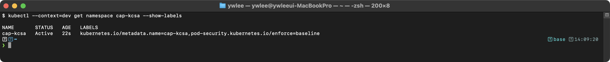

# KCSA 실전 보안 예제 모음

> **학습 목표**: RBAC·NetworkPolicy·PSA·암호화·감사·seccomp·AppArmor·OPA Gatekeeper·ServiceAccount·Falco 각 보안 기법의 YAML 예제와 검증 명령을 실습할 수 있다. | **도메인**: KCSA 전 도메인 (examples 실전편) — Cluster Setup 16%, Cluster Hardening 22%, System Hardening 16%, Minimizing Microservice Vulnerabilities 20%, Supply Chain Security 16%, Monitoring/Logging/Runtime Security 10% | **예상 소요**: 3~4시간

> Kubernetes 보안 설정을 위한 실전 YAML 예제 모음이다. 모든 예제는 프로덕션 환경에서 활용할 수 있도록 작성되었다. 각 예제에는 필드별 설명, 보안 관점의 방어 효과, 검증 명령어와 기대 출력을 포함한다.

---

## 1. RBAC (Role-Based Access Control)

### 1.1 등장 배경

Kubernetes 초기에는 ABAC(Attribute-Based Access Control)만 지원했다. ABAC는 정책을 JSON 파일로 관리하며, 변경 시 API Server 재시작이 필요했다. 이 구조의 핵심 한계는 정책 변경이 **비원자적(non-atomic)**이라는 점이다. 즉, 정책 파일을 수정하고 API Server를 재시작하는 동안 일부 요청은 이전 정책으로, 일부는 새 정책으로 평가되어 권한 불일치가 발생했다. 재시작 시간이 길면 클러스터 전체 API 서비스가 잠시 중단되는 문제도 있었다.

RBAC은 Role과 RoleBinding을 별도의 Kubernetes 오브젝트로 분리하여 이 문제를 개선했다. 정책 변경을 API Server 재시작 없이 `kubectl apply` 한 번으로 반영할 수 있으며, etcd에 저장된 오브젝트로 관리되므로 버전 관리와 감사 추적이 가능하다.

단, RBAC도 트레이드오프가 있다. `roleRef`(어떤 Role을 바인딩했는지)는 생성 후 **변경 불가(immutable)**이다. 이는 기존 바인딩을 몰래 권한이 높은 Role로 교체하는 공격을 원천 차단하는 설계이지만, roleRef를 변경하려면 바인딩을 삭제하고 재생성해야 하는 운영 불편이 따른다.

이로 인해 운영 환경에서 동적인 권한 관리가 불가능했다. RBAC 없이 운영하면 다음과 같은 공격 시나리오가 발생한다:

- **권한 과잉 부여**: 모든 ServiceAccount가 cluster-admin 수준의 권한을 가져, 하나의 Pod가 탈취되면 전체 클러스터를 제어할 수 있다.
- **횡적 이동(Lateral Movement)**: 공격자가 하나의 네임스페이스에서 다른 네임스페이스의 Secret을 읽어 DB 인증 정보를 탈취한다.
- **권한 상승(Privilege Escalation)**: 일반 사용자가 ClusterRoleBinding을 생성하여 스스로 cluster-admin 권한을 획득한다.

### 1.2 Role - 네임스페이스 범위 권한

특정 네임스페이스 내에서 Pod 조회와 로그 확인만 허용하는 Role이다.

```yaml
apiVersion: rbac.authorization.k8s.io/v1
kind: Role
metadata:
  namespace: production
  name: pod-reader
rules:
  # Pod 읽기 권한
  # apiGroups: [""] 은 core API 그룹을 의미한다. 생략하면 규칙이 어떤 리소스에도 매칭되지 않는다.
  - apiGroups: [""]
    # resources: 대상 리소스 종류이다. 복수형을 사용한다.
    resources: ["pods"]
    # verbs: 허용할 동작이다. get=단일조회, list=목록조회, watch=변경감시이다.
    # create, update, patch, delete를 생략하면 읽기 전용이 된다.
    verbs: ["get", "list", "watch"]
  # Pod 로그 조회 권한
  # pods/log는 서브리소스이다. pods와 별도로 명시해야 한다.
  - apiGroups: [""]
    resources: ["pods/log"]
    verbs: ["get"]
```

**필드별 상세 설명:**

| 필드 | 역할 | 생략 시 동작 |
|------|------|-------------|
| `apiGroups` | 리소스가 속한 API 그룹 | 필수 필드이므로 생략 불가 |
| `resources` | 대상 리소스 종류 | 필수 필드이므로 생략 불가 |
| `verbs` | 허용할 HTTP 동작 | 필수 필드이므로 생략 불가 |
| `resourceNames` | 특정 이름의 리소스만 대상으로 제한 | 생략 시 해당 종류의 모든 리소스에 적용 |

**보안 관점:** `get`과 `list`만 부여하고 `create`, `delete`를 제외함으로써, 이 Role을 가진 주체는 Pod를 조회만 할 수 있고 삭제하거나 생성할 수 없다. 이를 통해 최소 권한 원칙(Principle of Least Privilege)을 구현한다.

Deployment와 Service를 관리할 수 있는 Role이다.

```yaml
apiVersion: rbac.authorization.k8s.io/v1
kind: Role
metadata:
  namespace: development
  name: app-manager
rules:
  - apiGroups: ["apps"]
    resources: ["deployments", "replicasets"]
    verbs: ["get", "list", "watch", "create", "update", "patch", "delete"]
  - apiGroups: [""]
    resources: ["services", "configmaps"]
    verbs: ["get", "list", "watch", "create", "update", "patch"]
  # Secret은 읽기만 허용한다.
  # Secret에 대해 create/update/delete를 허용하면 공격자가 임의의 Secret을 생성하거나
  # 기존 인증 정보를 변조할 수 있으므로 읽기 권한만 부여한다.
  - apiGroups: [""]
    resources: ["secrets"]
    verbs: ["get", "list"]
```

**흔한 실수와 트러블슈팅:**

- `apiGroups`를 `[""]`로 설정했는데 `deployments`를 대상으로 지정하면 매칭되지 않는다. Deployment는 `apps` 그룹에 속하기 때문이다.
- `resourceNames`를 사용할 때 `list` verb는 동작하지 않는다. `list`는 컬렉션 단위 요청이므로 개별 리소스 이름 필터와 호환되지 않는다.
- Secret에 대해 `watch` 권한을 부여하면 Secret이 변경될 때마다 전체 내용이 전달된다. 감사 목적이 아니면 `watch`를 제외하는 것이 안전하다.

### 1.3 ClusterRole - 클러스터 전체 범위 권한

노드와 PersistentVolume을 읽을 수 있는 ClusterRole이다. 이 리소스들은 네임스페이스에 속하지 않으므로 ClusterRole이 필요하다.

```yaml
apiVersion: rbac.authorization.k8s.io/v1
kind: ClusterRole
metadata:
  # ClusterRole은 네임스페이스 필드가 없다. 클러스터 전체에서 유효하다.
  name: node-viewer
rules:
  - apiGroups: [""]
    resources: ["nodes"]
    verbs: ["get", "list", "watch"]
  - apiGroups: [""]
    resources: ["persistentvolumes"]
    verbs: ["get", "list", "watch"]
  - apiGroups: ["storage.k8s.io"]
    resources: ["storageclasses"]
    verbs: ["get", "list", "watch"]
```

**보안 관점:** 노드 정보에는 kubelet 버전, OS 이미지, 커널 버전 등 공격자에게 유용한 정보가 포함된다. 노드 정보를 무분별하게 노출하면 공격자가 알려진 취약점(CVE)을 대상으로 공격을 시도할 수 있다. 따라서 노드 읽기 권한도 필요한 주체에게만 부여한다.

보안 감사를 위한 읽기 전용 ClusterRole이다.

```yaml
apiVersion: rbac.authorization.k8s.io/v1
kind: ClusterRole
metadata:
  name: security-auditor
rules:
  # 모든 리소스 읽기 (Secret 제외)
  # Secret을 제외하는 이유: 감사 목적에서 Secret의 메타데이터는 필요하지만
  # 실제 데이터(data 필드)가 노출되면 인증 정보가 유출된다.
  - apiGroups: [""]
    resources: ["pods", "services", "configmaps", "serviceaccounts", "namespaces", "endpoints"]
    verbs: ["get", "list", "watch"]
  - apiGroups: ["apps"]
    resources: ["deployments", "daemonsets", "statefulsets", "replicasets"]
    verbs: ["get", "list", "watch"]
  - apiGroups: ["networking.k8s.io"]
    resources: ["networkpolicies"]
    verbs: ["get", "list", "watch"]
  - apiGroups: ["rbac.authorization.k8s.io"]
    resources: ["roles", "rolebindings", "clusterroles", "clusterrolebindings"]
    verbs: ["get", "list", "watch"]
  # Pod Security 관련
  - apiGroups: ["policy"]
    resources: ["podsecuritypolicies"]
    verbs: ["get", "list", "watch"]
```

### 1.4 RoleBinding - 네임스페이스 범위 바인딩

사용자 `jane`에게 `production` 네임스페이스의 `pod-reader` Role을 바인딩하는 예제이다.

```yaml
apiVersion: rbac.authorization.k8s.io/v1
kind: RoleBinding
metadata:
  name: read-pods-binding
  namespace: production
subjects:
  # kind: User는 X.509 인증서의 CN(Common Name) 또는 OIDC 토큰의 sub 클레임과 매칭된다.
  - kind: User
    name: jane
    # apiGroup은 필수이다. 생략하면 core 그룹("")으로 해석되어 바인딩이 동작하지 않는다.
    apiGroup: rbac.authorization.k8s.io
roleRef:
  # roleRef는 생성 후 변경할 수 없다. 변경하려면 RoleBinding을 삭제하고 재생성해야 한다.
  kind: Role
  name: pod-reader
  apiGroup: rbac.authorization.k8s.io
```

**보안 관점:** `roleRef`가 immutable인 이유는, 변경 가능하면 공격자가 기존 바인딩의 roleRef를 cluster-admin으로 변경하여 권한을 상승시킬 수 있기 때문이다.

ServiceAccount에 Role을 바인딩하는 예제이다.

```yaml
apiVersion: rbac.authorization.k8s.io/v1
kind: RoleBinding
metadata:
  name: app-manager-binding
  namespace: development
subjects:
  # ServiceAccount에 바인딩할 때는 namespace를 명시한다.
  # 생략하면 RoleBinding의 네임스페이스가 적용되지만, 명시적으로 지정하는 것이 안전하다.
  - kind: ServiceAccount
    name: ci-deployer
    namespace: development
roleRef:
  kind: Role
  name: app-manager
  apiGroup: rbac.authorization.k8s.io
```

ClusterRole을 RoleBinding으로 특정 네임스페이스에만 바인딩하는 예제이다. ClusterRole의 권한을 네임스페이스 범위로 제한할 때 유용하다.

```yaml
apiVersion: rbac.authorization.k8s.io/v1
kind: RoleBinding
metadata:
  name: auditor-dev-binding
  namespace: development
subjects:
  - kind: Group
    name: security-team
    apiGroup: rbac.authorization.k8s.io
roleRef:
  # ClusterRole이지만 RoleBinding이므로 development 네임스페이스에서만 유효하다.
  # 이 패턴은 공통 ClusterRole을 정의하고 네임스페이스별로 선택 적용할 때 사용한다.
  kind: ClusterRole
  name: security-auditor
  apiGroup: rbac.authorization.k8s.io
```

### 1.5 ClusterRoleBinding - 클러스터 전체 범위 바인딩

그룹에 ClusterRole을 바인딩하는 예제이다. 클러스터 전체에서 유효하다.

```yaml
apiVersion: rbac.authorization.k8s.io/v1
kind: ClusterRoleBinding
metadata:
  name: node-viewer-binding
subjects:
  # kind: Group은 X.509 인증서의 O(Organization) 또는 OIDC 토큰의 groups 클레임과 매칭된다.
  - kind: Group
    name: ops-team
    apiGroup: rbac.authorization.k8s.io
roleRef:
  kind: ClusterRole
  name: node-viewer
  apiGroup: rbac.authorization.k8s.io
```

여러 주체에 동시에 바인딩하는 예제이다.

```yaml
apiVersion: rbac.authorization.k8s.io/v1
kind: ClusterRoleBinding
metadata:
  name: security-audit-binding
subjects:
  - kind: User
    name: alice
    apiGroup: rbac.authorization.k8s.io
  - kind: Group
    name: security-team
    apiGroup: rbac.authorization.k8s.io
  - kind: ServiceAccount
    name: audit-bot
    namespace: security
roleRef:
  kind: ClusterRole
  name: security-auditor
  apiGroup: rbac.authorization.k8s.io
```

### 1.6 RBAC 실습 검증

RBAC 리소스를 적용한 후 다음 명령어로 권한을 검증한다.

```bash
# 1) Role, RoleBinding 적용
kubectl apply -f pod-reader-role.yaml
kubectl apply -f read-pods-binding.yaml

# 2) jane 사용자가 production 네임스페이스에서 Pod을 조회할 수 있는지 확인
kubectl auth can-i get pods --namespace=production --as=jane
```

> **예시(참조) — yes:** KCSA 보안 개념/점검 기대 출력(설정/도구/환경 의존). 재현 가능 핵심은 KCSA daily 및 본 캡처 참고.

```bash
# 3) jane 사용자가 Pod을 삭제할 수 없는지 확인
kubectl auth can-i delete pods --namespace=production --as=jane
```

> **예시(참조) — no:** KCSA 보안 개념/점검 기대 출력(설정/도구/환경 의존). 재현 가능 핵심은 KCSA daily 및 본 캡처 참고.

```bash
# 4) jane 사용자가 다른 네임스페이스에서 Pod을 조회할 수 없는지 확인
kubectl auth can-i get pods --namespace=kube-system --as=jane
```

> **예시(참조) — no:** KCSA 보안 개념/점검 기대 출력(설정/도구/환경 의존). 재현 가능 핵심은 KCSA daily 및 본 캡처 참고.

```bash
# 5) ServiceAccount 권한 확인
kubectl auth can-i create deployments --namespace=development \
  --as=system:serviceaccount:development:ci-deployer
```

> **예시(참조) — yes:** KCSA 보안 개념/점검 기대 출력(설정/도구/환경 의존). 재현 가능 핵심은 KCSA daily 및 본 캡처 참고.

```bash
# 6) ServiceAccount가 Secret 삭제 불가 확인
kubectl auth can-i delete secrets --namespace=development \
  --as=system:serviceaccount:development:ci-deployer
```

> **예시(참조) — no:** KCSA 보안 개념/점검 기대 출력(설정/도구/환경 의존). 재현 가능 핵심은 KCSA daily 및 본 캡처 참고.

```bash
# 7) 특정 사용자의 모든 권한 목록 확인
kubectl auth can-i --list --namespace=production --as=jane
```

> **예시(참조) — Resources                                     :** KCSA 보안 개념/점검 기대 출력(설정/도구/환경 의존). 재현 가능 핵심은 KCSA daily 및 본 캡처 참고.

**트러블슈팅:**

```bash
# "forbidden" 오류 발생 시 바인딩 상태 확인
kubectl get rolebindings -n production -o wide
kubectl describe rolebinding read-pods-binding -n production

# subjects의 name과 실제 사용자/SA 이름이 일치하는지 확인한다.
# 대소문자가 다르면 매칭되지 않는다.
```

---

## 2. NetworkPolicy

### 2.0 사전 개념: CNI

NetworkPolicy는 Kubernetes 자체가 직접 트래픽을 차단하는 것이 아니라, CNI(Container Network Interface) 플러그인이 정책을 읽어 실제로 차단을 수행한다. CNI는 파드 생성 시 네트워크 네임스페이스를 설정하고 IP를 할당하는 플러그인 표준이다.

| CNI | NetworkPolicy 지원 | 구현 방식 |
|-----|-------------------|---------|
| kubenet | 미지원 | 단순 브리지, iptables 없음 |
| Calico | 지원 | iptables / eBPF |
| Cilium | 지원 | eBPF (kube-proxy 대체 가능) |
| Flannel | 미지원 | VXLAN 오버레이만 |

**kubenet(기본 내장 CNI)은 NetworkPolicy를 구현하지 않는다.** 정책을 아무리 많이 생성해도 트래픽 차단이 실제로 발생하지 않는다. 이 저장소의 tart 클러스터는 Cilium을 사용하므로 NetworkPolicy가 정상 동작한다.

### 2.1 등장 배경

RBAC(섹션 1)이 API 접근을 제어한다면, NetworkPolicy는 Pod 간 네트워크 통신 경로를 제어한다. 두 제어가 함께 동작해야 깊이 있는 방어(defense-in-depth)가 성립한다.

Kubernetes의 기본 네트워크 모델에서는 모든 Pod가 클러스터 내 다른 모든 Pod와 통신할 수 있다. 이 "flat network" 모델은 다음과 같은 공격을 허용한다:

- **횡적 이동**: 공격자가 프론트엔드 Pod를 탈취한 뒤, 동일 클러스터 내 데이터베이스 Pod에 직접 접근하여 데이터를 유출한다.
- **서비스 탐색(Service Discovery) 악용**: 공격자가 클러스터 내부 DNS를 통해 모든 서비스를 열거하고 취약한 서비스를 찾는다.
- **C2(Command & Control) 채널 구축**: 탈취된 Pod에서 외부 공격자 서버로 데이터를 전송한다.

NetworkPolicy가 없으면 CNI가 존재해도 모든 파드 간 통신이 열려 있다. NetworkPolicy를 지원하는 CNI를 선택하는 것이 전제 조건이다(§2.0 표 참조).

### 2.2 Default Deny - 모든 트래픽 차단

네임스페이스의 모든 ingress 트래픽을 차단하는 기본 거부 정책이다. 모든 네임스페이스에 우선 적용하는 것을 권장한다.

```yaml
apiVersion: networking.k8s.io/v1
kind: NetworkPolicy
metadata:
  name: default-deny-ingress
  namespace: production
spec:
  # podSelector: {} 는 빈 셀렉터이다. 네임스페이스 내 모든 Pod에 적용된다.
  # podSelector를 생략하면 spec 유효성 검사에 실패한다.
  podSelector: {}
  policyTypes:
    - Ingress
  # ingress 규칙이 없으므로 모든 인바운드 트래픽이 차단된다.
  # policyTypes에 Ingress를 명시했지만 ingress 필드를 정의하지 않으면 "허용 규칙 없음 = 전체 차단"이 된다.
```

**보안 관점:** Default Deny는 Zero Trust 네트워크의 기본 원칙이다. 명시적으로 허용된 트래픽만 통과시키므로, 알려지지 않은 서비스 간 통신 경로를 차단한다.

모든 egress 트래픽을 차단하는 기본 거부 정책이다.

```yaml
apiVersion: networking.k8s.io/v1
kind: NetworkPolicy
metadata:
  name: default-deny-egress
  namespace: production
spec:
  podSelector: {}
  policyTypes:
    - Egress
  # egress 규칙이 없으므로 모든 아웃바운드 트래픽이 차단된다.
  # 주의: DNS(53 포트) 트래픽도 차단되므로, 서비스 디스커버리가 동작하지 않는다.
  # 실무에서는 DNS 허용 규칙을 반드시 함께 적용해야 한다.
```

**흔한 실수:** Egress Default Deny를 적용한 후 DNS 허용 규칙을 빠뜨리면, Pod 내부에서 서비스 이름 해석이 불가능하여 모든 HTTP 요청이 실패한다. 로그에는 "connection refused"가 아닌 "name resolution failed"가 나타난다.

모든 ingress와 egress를 동시에 차단하는 정책이다.

```yaml
apiVersion: networking.k8s.io/v1
kind: NetworkPolicy
metadata:
  name: default-deny-all
  namespace: production
spec:
  podSelector: {}
  policyTypes:
    - Ingress
    - Egress
```

### 2.3 Ingress 규칙 - 특정 트래픽만 허용

`app: web` 라벨이 있는 Pod에 대해 `app: frontend` Pod에서 오는 80 포트 트래픽만 허용하는 정책이다.

```yaml
apiVersion: networking.k8s.io/v1
kind: NetworkPolicy
metadata:
  name: allow-frontend-to-web
  namespace: production
spec:
  # podSelector: 이 정책이 적용되는 대상 Pod를 선택한다.
  # matchLabels는 AND 관계이다. 여러 라벨을 지정하면 모두 가진 Pod에만 적용된다.
  podSelector:
    matchLabels:
      app: web
  policyTypes:
    - Ingress
  ingress:
    - from:
        # 같은 네임스페이스의 app=frontend Pod에서만 허용
        - podSelector:
            matchLabels:
              app: frontend
      ports:
        # protocol 생략 시 TCP가 기본값이다.
        - protocol: TCP
          port: 80
        - protocol: TCP
          port: 443
```

**필드 생략 시 동작:**

| 필드 | 생략 시 동작 |
|------|-------------|
| `spec.podSelector` | 필수 필드. 생략 불가 |
| `ingress[].from` | 생략하면 모든 소스에서의 트래픽 허용 |
| `ingress[].ports` | 생략하면 모든 포트 허용 |
| `ports[].protocol` | TCP가 기본값 |
| `ports[].endPort` | 생략하면 단일 포트만 매칭 |

다른 네임스페이스에서의 접근을 허용하는 정책이다. `podSelector`와 `namespaceSelector`가 같은 `from` 항목에 있으므로 AND 관계이다.

```yaml
apiVersion: networking.k8s.io/v1
kind: NetworkPolicy
metadata:
  name: allow-monitoring
  namespace: production
spec:
  podSelector:
    matchLabels:
      app: web
  policyTypes:
    - Ingress
  ingress:
    - from:
        # monitoring 네임스페이스의 app=prometheus Pod에서만 허용 (AND 관계)
        # namespaceSelector와 podSelector가 같은 배열 요소 내에 있으면 AND이다.
        # 별개의 배열 요소로 분리하면 OR이 된다. 이 차이는 보안에 치명적이다.
        - namespaceSelector:
            matchLabels:
              kubernetes.io/metadata.name: monitoring
          podSelector:
            matchLabels:
              app: prometheus
      ports:
        - protocol: TCP
          port: 9090
```

**AND와 OR의 차이에 대한 중요 경고:**

```yaml
# AND 관계 (의도한 동작): monitoring NS의 prometheus Pod만 허용
- from:
    - namespaceSelector:
        matchLabels:
          kubernetes.io/metadata.name: monitoring
      podSelector:
        matchLabels:
          app: prometheus

# OR 관계 (위험한 실수): monitoring NS의 모든 Pod + 현재 NS의 prometheus Pod 모두 허용
- from:
    - namespaceSelector:
        matchLabels:
          kubernetes.io/metadata.name: monitoring
    - podSelector:
        matchLabels:
          app: prometheus
```

**AND/OR 동작 메커니즘:**

`from` 배열의 각 요소는 **OR** 관계다. 하나 이상의 요소가 매칭되면 트래픽이 허용된다. 배열 요소 내에 `namespaceSelector`와 `podSelector`가 함께 있으면 **AND** 관계로, 두 조건을 모두 만족하는 파드에서 오는 트래픽만 허용한다.

구체적으로 표현하면: `from[0].namespaceSelector AND from[0].podSelector`가 하나의 OR 항목이다. `from[0]` 또는 `from[1]`이 일치하면 허용이다.

두 번째 YAML처럼 `namespaceSelector`와 `podSelector`를 별도 배열 요소로 분리하면 의도하지 않게 다음 두 그룹이 모두 허용된다:
1. `monitoring` 네임스페이스의 **모든 파드** (podSelector 없음)
2. 현재 네임스페이스의 `app=prometheus` 라벨을 가진 파드

이 오류는 운영 중 탐지하기 어렵다. monitoring 네임스페이스에 악성 파드가 배포되면 바로 대상 파드에 접근할 수 있게 된다.

YAML 들여쓰기 하나의 차이로 보안 정책이 완전히 달라진다. AND/OR 관계는 KCSA 시험에서 자주 출제되는 주제이다.

### 2.4 Egress 규칙 - 아웃바운드 트래픽 제어

`app: web` Pod가 `app: database` Pod의 5432 포트와 DNS(53 포트)에만 접근할 수 있도록 제한하는 정책이다.

```yaml
apiVersion: networking.k8s.io/v1
kind: NetworkPolicy
metadata:
  name: web-egress-policy
  namespace: production
spec:
  podSelector:
    matchLabels:
      app: web
  policyTypes:
    - Egress
  egress:
    # 데이터베이스 접근 허용
    - to:
        - podSelector:
            matchLabels:
              app: database
      ports:
        - protocol: TCP
          port: 5432
    # DNS 조회 허용 (kube-system 네임스페이스의 DNS)
    # DNS를 허용하지 않으면 Pod에서 서비스 이름 해석이 불가능하다.
    - to:
        - namespaceSelector:
            matchLabels:
              kubernetes.io/metadata.name: kube-system
          podSelector:
            matchLabels:
              k8s-app: kube-dns
      ports:
        - protocol: UDP
          port: 53
        - protocol: TCP
          port: 53
```

**보안 관점:** Egress 제한은 데이터 유출(Data Exfiltration) 방어에 핵심적이다. 공격자가 Pod를 탈취하더라도 외부 C2 서버로 연결할 수 없으면 공격 효과가 크게 감소한다.

### 2.5 다중 규칙 - OR 관계와 AND 관계

여러 소스에서의 접근을 OR 관계로 허용하는 예제이다.

```yaml
apiVersion: networking.k8s.io/v1
kind: NetworkPolicy
metadata:
  name: multi-source-ingress
  namespace: production
spec:
  podSelector:
    matchLabels:
      app: api-server
  policyTypes:
    - Ingress
  ingress:
    - from:
        # 아래 3개 조건 중 하나라도 만족하면 허용 (OR 관계)
        # from 배열의 각 요소는 OR이다.

        # 1) 같은 네임스페이스의 app=web Pod
        - podSelector:
            matchLabels:
              app: web

        # 2) staging 네임스페이스의 모든 Pod
        - namespaceSelector:
            matchLabels:
              environment: staging

        # 3) 특정 외부 IP 대역
        - ipBlock:
            cidr: 10.0.0.0/8
            except:
              - 10.0.1.0/24  # 이 대역은 제외
      ports:
        - protocol: TCP
          port: 8080
```

**ipBlock 관련 주의사항:** `ipBlock`은 클러스터 외부 IP에 대해서만 의미가 있다. Pod IP는 노드를 거치면서 SNAT되므로, `ipBlock`으로 Pod 간 트래픽을 제어하는 것은 예상대로 동작하지 않을 수 있다.

### 2.6 복합 정책 - Ingress + Egress

`app: backend` Pod에 대해 ingress와 egress를 모두 제어하는 복합 정책이다.

```yaml
apiVersion: networking.k8s.io/v1
kind: NetworkPolicy
metadata:
  name: backend-full-policy
  namespace: production
spec:
  podSelector:
    matchLabels:
      app: backend
  policyTypes:
    - Ingress
    - Egress
  ingress:
    # frontend에서만 8080 포트로 접근 허용
    - from:
        - podSelector:
            matchLabels:
              app: frontend
      ports:
        - protocol: TCP
          port: 8080
    # 모니터링에서 메트릭 포트 접근 허용
    - from:
        - namespaceSelector:
            matchLabels:
              kubernetes.io/metadata.name: monitoring
      ports:
        - protocol: TCP
          port: 9090
  egress:
    # 데이터베이스 접근
    - to:
        - podSelector:
            matchLabels:
              app: postgres
      ports:
        - protocol: TCP
          port: 5432
    # Redis 접근
    - to:
        - podSelector:
            matchLabels:
              app: redis
      ports:
        - protocol: TCP
          port: 6379
    # DNS 허용
    # to: [] 는 모든 목적지를 의미한다. ports로만 53 포트를 제한한다.
    - to: []
      ports:
        - protocol: UDP
          port: 53
        - protocol: TCP
          port: 53
```

### 2.7 NetworkPolicy 실습 검증

```bash
# 1) Default Deny 적용
kubectl apply -f default-deny-ingress.yaml

# 2) 테스트용 Pod 생성
kubectl run test-client --image=busybox:1.36 -n production \
  --labels="app=test" -- sleep 3600
kubectl run web-server --image=nginx:1.27 -n production \
  --labels="app=web" --port=80

# 3) Default Deny 확인: test-client에서 web-server로 접근 시도
kubectl exec -n production test-client -- wget --timeout=3 -q -O- http://web-server
```

> **예시(참조) — wget: download timed out:** KCSA 보안 개념/점검 기대 출력(설정/도구/환경 의존). 재현 가능 핵심은 KCSA daily 및 본 캡처 참고.

```bash
# 4) 허용 정책 적용
kubectl apply -f allow-frontend-to-web.yaml

# 5) frontend 라벨이 있는 Pod에서 접근 시도
kubectl run frontend --image=busybox:1.36 -n production \
  --labels="app=frontend" -- sleep 3600
kubectl exec -n production frontend -- wget --timeout=3 -q -O- http://web-server
```

> **예시(참조) — <!DOCTYPE html>:** KCSA 보안 개념/점검 기대 출력(설정/도구/환경 의존). 재현 가능 핵심은 KCSA daily 및 본 캡처 참고.

```bash
# 6) frontend 라벨이 없는 Pod에서 접근 시도 (여전히 차단)
kubectl exec -n production test-client -- wget --timeout=3 -q -O- http://web-server
```

> **예시(참조) — wget: download timed out:** KCSA 보안 개념/점검 기대 출력(설정/도구/환경 의존). 재현 가능 핵심은 KCSA daily 및 본 캡처 참고.

```bash
# 7) NetworkPolicy 목록 및 상세 확인
kubectl get networkpolicies -n production
kubectl describe networkpolicy allow-frontend-to-web -n production
```

> **예시(참조) — Name:         allow-frontend-to-web:** KCSA 보안 개념/점검 기대 출력(설정/도구/환경 의존). 재현 가능 핵심은 KCSA daily 및 본 캡처 참고.

**트러블슈팅:**

```bash
# CNI가 NetworkPolicy를 지원하는지 확인
kubectl get pods -n kube-system | grep -E 'calico|cilium|weave'

# NetworkPolicy가 적용된 Pod 확인
kubectl get pods -n production --show-labels

# 정책이 의도대로 동작하지 않으면 CNI 로그 확인
kubectl logs -n kube-system -l k8s-app=calico-node --tail=50
```

---

## 3. Pod Security Standards (PSA) 적용

### 3.1 등장 배경

PodSecurityPolicy(PSP)는 Kubernetes 1.21에서 deprecated되고 1.25에서 제거되었다. PSP의 문제점은 다음과 같았다:

- 정책 적용 순서가 비결정적이어서, 어떤 PSP가 적용될지 예측할 수 없었다.
- mutating과 validating이 혼재되어 사이드이펙트가 발생했다.
- 네임스페이스 단위 적용이 복잡했다.

Pod Security Admission(PSA)은 이를 대체하여, 네임스페이스 라벨 기반으로 세 가지 표준 레벨(privileged, baseline, restricted)을 적용한다. PSA 없이 운영하면:

- 컨테이너가 root로 실행되어, 컨테이너 탈출(container escape) 시 노드 전체를 장악할 수 있다.
- `privileged: true`로 실행된 컨테이너가 호스트의 모든 디바이스와 네임스페이스에 접근한다.
- `hostPID: true`를 통해 호스트의 프로세스를 열거하고 조작한다.

### 3.2 PSA 레벨 보안 철학

PSA는 세 가지 표준 레벨을 정의한다. 각 레벨이 어떤 기준으로 설계되었는지를 이해해야 올바른 레벨을 선택할 수 있다.

- **privileged**: 제약 없이 모든 설정을 허용한다. 권장하지 않으며, 시스템 구성 요소처럼 반드시 필요한 경우에만 사용한다.
- **baseline**: 알려진 최악의 보안 안티패턴(privileged 컨테이너, hostNetwork, hostPID 등)만 차단한다. 설계 철학은 기존 대부분의 애플리케이션이 수정 없이 동작하도록 호환성을 유지하면서 명백히 위험한 설정만 걸러내는 것이다. 레거시 워크로드의 PSP → PSA 마이그레이션 경로로 적합하다.
- **restricted**: 파드가 최소 권한으로만 실행되도록 강제한다. Zero Trust 보안 철학을 적용한 레벨로, 명시적으로 허용하지 않은 권한은 기본적으로 거부된다. `runAsNonRoot`, `allowPrivilegeEscalation: false`, `capabilities.drop: [ALL]`, `seccompProfile` 설정이 모두 필수이다. 새로 개발하는 애플리케이션이나 보안 요구사항이 높은 워크로드에 권장한다.

### 3.3 네임스페이스에 PSA 라벨 적용

`restricted` 레벨을 적용하는 네임스페이스이다. enforce, audit, warn을 모두 설정하는 것이 권장된다.

```yaml
apiVersion: v1
kind: Namespace
metadata:
  name: secure-apps
  labels:
    # enforce: 위반하는 Pod 생성을 거부한다. 기존 Pod에는 영향이 없다.
    pod-security.kubernetes.io/enforce: restricted
    # enforce-version: 특정 Kubernetes 버전의 정책을 적용한다.
    # "latest"는 현재 클러스터 버전의 정책을 적용한다.
    # 특정 버전(예: "v1.28")을 지정하면 업그레이드 시 정책 변경으로 인한 장애를 방지할 수 있다.
    pod-security.kubernetes.io/enforce-version: latest
    # audit: 위반 사항을 감사 로그에 기록한다. Pod 생성을 거부하지는 않는다.
    pod-security.kubernetes.io/audit: restricted
    pod-security.kubernetes.io/audit-version: latest
    # warn: 사용자에게 kubectl 응답에 경고 메시지를 표시한다.
    pod-security.kubernetes.io/warn: restricted
    pod-security.kubernetes.io/warn-version: latest
```

**세 가지 모드의 차이:**

| 모드 | Pod 거부 여부 | 기록 위치 | 용도 |
|------|-------------|----------|------|
| enforce | O | - | 프로덕션 강제 적용 |
| audit | X | API Server 감사 로그 | 위반 현황 모니터링 |
| warn | X | kubectl 응답 헤더 | 개발자에게 즉각 피드백 |

`baseline` 레벨로 enforce하고 `restricted`로 warn/audit하는 점진적 적용 예제이다.

```yaml
apiVersion: v1
kind: Namespace
metadata:
  name: general-apps
  labels:
    # 현재는 baseline으로 enforce
    # baseline: hostNetwork, hostPID, privileged 등 위험한 설정만 차단한다.
    pod-security.kubernetes.io/enforce: baseline
    pod-security.kubernetes.io/enforce-version: latest
    # restricted 위반은 경고와 감사 로그로 기록 (향후 전환 준비)
    # 이 방식으로 restricted 전환 시 영향받을 워크로드를 사전에 파악한다.
    pod-security.kubernetes.io/audit: restricted
    pod-security.kubernetes.io/audit-version: latest
    pod-security.kubernetes.io/warn: restricted
    pod-security.kubernetes.io/warn-version: latest
```

### 3.4 Restricted 레벨을 만족하는 Pod 예제

```yaml
apiVersion: v1
kind: Pod
metadata:
  name: secure-pod
  namespace: secure-apps
spec:
  # API Server 접근이 불필요하면 토큰 마운트를 비활성화한다.
  # 토큰이 마운트되면 공격자가 해당 토큰으로 API Server에 요청을 보낼 수 있다.
  automountServiceAccountToken: false
  securityContext:
    # runAsNonRoot: true이면 컨테이너 이미지의 USER가 root(UID 0)일 경우 Pod 생성이 거부된다.
    runAsNonRoot: true
    # runAsUser: 컨테이너 프로세스의 UID를 지정한다. 생략하면 이미지의 USER 지시어를 따른다.
    runAsUser: 1000
    # runAsGroup: 프로세스의 primary GID를 지정한다. 생략하면 런타임 기본값(보통 0=root)이 적용된다.
    runAsGroup: 1000
    # fsGroup: 마운트된 볼륨의 파일 소유 그룹을 지정한다. 생략하면 볼륨의 원래 소유권이 유지된다.
    fsGroup: 1000
    # seccompProfile: restricted 레벨에서는 RuntimeDefault 또는 Localhost가 필수이다.
    # 생략하면 Unconfined로 처리되어 restricted 레벨에서 거부된다.
    seccompProfile:
      type: RuntimeDefault
  containers:
    - name: app
      image: registry.example.com/app:v1.2.3
      ports:
        - containerPort: 8080
      securityContext:
        # allowPrivilegeEscalation: false는 no_new_privs 플래그를 설정한다.
        # setuid 바이너리를 통한 권한 상승을 방지한다.
        # 생략하면 true가 기본값이며, restricted 레벨에서 거부된다.
        allowPrivilegeEscalation: false
        # readOnlyRootFilesystem: 컨테이너의 루트 파일시스템을 읽기 전용으로 마운트한다.
        # 공격자가 악성 바이너리를 파일시스템에 쓰는 것을 방지한다.
        # restricted 레벨에서는 필수가 아니지만 보안 강화를 위해 권장한다.
        readOnlyRootFilesystem: true
        capabilities:
          # drop ALL: 모든 Linux 커널 capability를 제거한다.
          # 생략하면 런타임 기본 capability 세트가 유지되며, restricted 레벨에서 거부된다.
          # NET_RAW capability가 남아있으면 ARP 스푸핑 공격이 가능하다.
          drop:
            - ALL
      resources:
        requests:
          memory: "64Mi"
          cpu: "100m"
        limits:
          memory: "128Mi"
          cpu: "200m"
      volumeMounts:
        - name: tmp
          mountPath: /tmp
        - name: config
          mountPath: /etc/app/config
          readOnly: true
  volumes:
    # readOnlyRootFilesystem 사용 시 쓰기가 필요한 경로에 emptyDir을 마운트한다.
    - name: tmp
      emptyDir: {}
    - name: config
      configMap:
        name: app-config
```

### 3.5 PSA 실습 검증

```bash
# 1) restricted 네임스페이스 생성
kubectl apply -f secure-apps-namespace.yaml

# 2) 위반하는 Pod 생성 시도 (privileged 컨테이너)
kubectl run violation-test --image=nginx:1.27 -n secure-apps \
  --overrides='{
    "spec": {
      "containers": [{
        "name": "nginx",
        "image": "nginx:1.27",
        "securityContext": {"privileged": true}
      }]
    }
  }'
```

> **예시(참조) — Error from server (Forbidden): pods "violation:** KCSA 보안 개념/점검 기대 출력(설정/도구/환경 의존). 재현 가능 핵심은 KCSA daily 및 본 캡처 참고.

```bash
# 3) 규정을 준수하는 Pod 생성
kubectl apply -f secure-pod.yaml

# 4) Pod 상태 확인
kubectl get pod secure-pod -n secure-apps
```

> **예시(참조) — NAME         READY   STATUS    RESTARTS   AGE:** KCSA 보안 개념/점검 기대 출력(설정/도구/환경 의존). 재현 가능 핵심은 KCSA daily 및 본 캡처 참고.

```bash
# 5) warn 모드 확인: baseline 네임스페이스에서 restricted 위반 시
kubectl run warn-test --image=nginx:1.27 -n general-apps
```

> **예시(참조) — Warning: would violate PodSecurity "restricted:** KCSA 보안 개념/점검 기대 출력(설정/도구/환경 의존). 재현 가능 핵심은 KCSA daily 및 본 캡처 참고.

warn 모드에서는 경고만 표시하고 Pod 생성은 허용된다.

```bash
# 6) 네임스페이스의 PSA 라벨 확인
kubectl get namespace secure-apps --show-labels
```



---

## 4. Secret Encryption at Rest

### 4.1 등장 배경

기본적으로 Kubernetes Secret은 etcd에 Base64 인코딩으로만 저장된다. Base64는 암호화가 아닌 인코딩이므로, etcd에 직접 접근할 수 있는 공격자는 모든 Secret을 즉시 읽을 수 있다. 구체적 공격 시나리오:

- etcd 백업 파일이 유출되면 모든 인증 정보가 평문으로 노출된다.
- etcd의 peer 통신이 암호화되지 않은 환경에서 네트워크 스니핑으로 Secret을 탈취한다.
- 노드의 etcd 데이터 디렉토리(`/var/lib/etcd`)에 접근하면 모든 Secret을 디스크에서 직접 읽을 수 있다.

### 4.2 EncryptionConfiguration

API Server의 `--encryption-provider-config` 플래그로 지정하는 설정 파일이다.

#### AES-CBC 방식

```yaml
apiVersion: apiserver.config.k8s.io/v1
kind: EncryptionConfiguration
resources:
  - resources:
      - secrets
      - configmaps
    providers:
      # 첫 번째 프로바이더가 새로운 데이터 암호화에 사용된다.
      # 목록 순서가 중요하다: 쓰기에는 첫 번째, 읽기에는 모든 프로바이더를 순서대로 시도한다.
      - aescbc:
          keys:
            # name: 키 식별자이다. 키 로테이션 시 어떤 키가 사용되었는지 구분하는 데 사용된다.
            - name: key-2024
              # secret: 32바이트 키를 Base64로 인코딩한 값이다.
              # 생성 방법: head -c 32 /dev/urandom | base64
              # 약한 키를 사용하면 암호화가 무의미하다. 반드시 충분한 엔트로피를 가진 키를 사용한다.
              secret: c2VjcmV0LWtleS0xMjM0NTY3ODkwMTIzNDU2  # 32바이트 Base64 인코딩 키
      # 이전 키 (키 로테이션 시 기존 데이터 복호화용)
      # 새 키로 재암호화가 완료될 때까지 이전 키를 유지해야 한다.
      - aescbc:
          keys:
            - name: key-2023
              secret: b2xkLXNlY3JldC1rZXktMTIzNDU2Nzg5MDEy
      # identity는 암호화되지 않은 데이터를 읽기 위한 폴백이다.
      # 암호화를 처음 적용할 때, 기존에 암호화 없이 저장된 데이터를 읽기 위해 필요하다.
      # identity를 제거하면 암호화되지 않은 기존 Secret을 읽을 수 없어 장애가 발생한다.
      - identity: {}
```

**AES-CBC의 한계:** AES-CBC(Advanced Encryption Standard - Cipher Block Chaining)는 블록 단위로 암호화하며, 각 블록이 이전 블록의 암호화 결과에 의존한다. 문제는 패딩 오라클 공격(padding oracle attack)에 취약하다는 점이다. 구체적 메커니즘: AES-CBC는 복호화 후 블록 끝 부분이 올바른 패딩 바이트(PKCS#7 규격의 `0x01`, `0x02 0x02` 등)로 끝나는지 검증하고, 틀리면 오류 응답을 반환한다. 공격자는 암호문의 1비트씩 변조하면서 "패딩 오류인가, 아닌가"라는 오라클 응답만으로 블록당 최대 256회 시도로 해당 블록의 평문을 역산할 수 있다. 패딩 검증 로직이 오류 응답에 노출되는 것 자체가 단서가 된다. 또한 AES-CBC는 데이터 무결성을 검증하는 인증(authentication) 기능이 없어 암호화된 데이터가 변조되어도 감지하지 못할 수 있다.

#### KMS v2 방식 (프로덕션 권장)

```yaml
apiVersion: apiserver.config.k8s.io/v1
kind: EncryptionConfiguration
resources:
  - resources:
      - secrets
      - configmaps
    providers:
      - kms:
          # apiVersion: v2는 Kubernetes 1.27+에서 GA이다.
          # v1 대비 성능이 향상되었고, 키 로테이션이 자동화된다.
          apiVersion: v2
          name: my-kms-provider
          # endpoint: KMS 플러그인의 Unix 소켓 경로이다.
          # API Server Pod에서 접근 가능해야 하므로 hostPath 볼륨 마운트가 필요하다.
          endpoint: unix:///var/run/kms-provider.sock
          # timeout: KMS 응답 대기 시간이다. 생략 시 3초가 기본값이다.
          # KMS 서비스 장애 시 Secret 읽기/쓰기가 이 시간만큼 지연된다.
          timeout: 3s
      - identity: {}
```

**보안 관점:** KMS v2는 봉투 암호화(Envelope Encryption)를 사용한다. 데이터 암호화 키(DEK: Data Encryption Key)는 로컬에서 생성하여 실제 Secret 데이터를 암호화하고, DEK 자체를 암호화하는 키 암호화 키(KEK: Key Encryption Key)만 외부 KMS에서 관리한다. 이 방식의 장점은 대용량 데이터를 빠른 로컬 DEK로 처리하면서, KEK는 외부 HSM(Hardware Security Module)에 안전하게 보관할 수 있다는 것이다. 단, 외부 KMS가 장애를 일으키면 Secret 읽기/쓰기가 `timeout` 설정값(기본 3초)만큼 지연되거나 실패할 수 있으므로 KMS 고가용성 구성이 필수다.

#### secretbox 방식

```yaml
apiVersion: apiserver.config.k8s.io/v1
kind: EncryptionConfiguration
resources:
  - resources:
      - secrets
    providers:
      # secretbox는 XSalsa20-Poly1305(AEAD: Authenticated Encryption with Associated Data)를 사용한다.
      # AES-CBC보다 안전하다. 암호화와 동시에 MAC(메시지 인증 코드)을 생성하므로
      # 암호화된 데이터가 변조되면 복호화 시 즉시 탐지된다(인증된 암호화).
      # 외부 KMS가 필요 없으므로 KMS v2보다 운영이 단순하지만,
      # 키 관리(로테이션, 유출 시 대응)를 직접 해야 한다.
      - secretbox:
          keys:
            - name: key-2024
              secret: YWJjZGVmZ2hpamtsbW5vcHFyc3R1dnd4eXoxMjM0NTY=  # 32바이트 Base64 인코딩 키
      - identity: {}
```

**암호화 방식 선택 기준:**

| 방식 | 알고리즘 | 보안 수준 | 운영 복잡도 | 권장 환경 |
|------|---------|---------|-----------|---------|
| `aescbc` | AES-CBC | 중간 (패딩 오라클 취약) | 낮음 | 개발/테스트 |
| `secretbox` | XSalsa20-Poly1305 AEAD | 높음 | 낮음 | 프로덕션(KMS 없을 때) |
| `kms v2` | 봉투 암호화(DEK+KEK) | 매우 높음 | 높음 (외부 KMS 필요) | 프로덕션 권장 |

프로덕션 권장 순서: **KMS v2 > secretbox > AES-CBC**

> 키 로테이션 절차:
> 1. 새 키를 목록의 첫 번째 위치에 추가한다.
> 2. API Server를 재시작한다.
> 3. `kubectl get secrets --all-namespaces -o json | kubectl replace -f -` 명령으로 모든 Secret을 새 키로 재암호화한다.
> 4. 모든 데이터가 재암호화되면 이전 키를 제거한다.

### 4.3 Secret Encryption 실습 검증

**실습 전제 조건:**
- 클러스터: `staging` (파괴 실습 허용 클러스터). kubeconfig 경로: `~/sideproejct/IaC_apple_sillicon/kubeconfig/staging.yaml`
- 노드 SSH 접속: `ssh staging-master` (마스터 노드에서 `etcdctl` 및 API Server 매니페스트에 직접 접근)
- `etcdctl` 설치 확인: `which etcdctl`. 없으면 `apt-get install etcd-client` 또는 [etcd 릴리스](https://github.com/etcd-io/etcd/releases)에서 바이너리 다운로드. kubeadm 클러스터의 인증서는 `/etc/kubernetes/pki/etcd/` 경로에 있다.
- EKS, GKE 같은 관리형 Kubernetes는 etcd에 직접 접근할 수 없으므로, 아래 etcdctl 명령 대신 `kubectl patch secret test-encryption -p '{"metadata":{"annotations":{"last-applied":"now"}}}' -n default`로 재저장하여 암호화가 적용되는지 간접 확인한다.

```bash
# 1) EncryptionConfiguration 파일을 API Server 노드에 배치
sudo cp encryption-config.yaml /etc/kubernetes/pki/encryption-config.yaml

# 2) API Server 매니페스트에 플래그 추가
# /etc/kubernetes/manifests/kube-apiserver.yaml의 command 섹션에:
# --encryption-provider-config=/etc/kubernetes/pki/encryption-config.yaml

# 3) API Server 재시작 후 테스트 Secret 생성
kubectl create secret generic test-encryption \
  --from-literal=mykey=myvalue -n default

# 4) etcd에서 직접 조회하여 암호화 확인
# etcd Pod에서 실행하거나 etcdctl 직접 사용
ETCDCTL_API=3 etcdctl \
  --endpoints=https://127.0.0.1:2379 \
  --cacert=/etc/kubernetes/pki/etcd/ca.crt \
  --cert=/etc/kubernetes/pki/etcd/server.crt \
  --key=/etc/kubernetes/pki/etcd/server.key \
  get /registry/secrets/default/test-encryption | hexdump -C | head -20
```

암호화가 적용된 경우 출력에 `k8s:enc:aescbc:v1:key-2024` 접두사가 나타나고, 이후 데이터는 바이너리 형태이다:


암호화가 적용되지 않은 경우 Secret 내용이 평문(Base64)으로 보인다:

> **예시(참조) — 00000000  ... 6d 79 6b 65 79 ... 6d 79 76 61 6:** KCSA 보안 개념/점검 기대 출력(설정/도구/환경 의존). 재현 가능 핵심은 KCSA daily 및 본 캡처 참고.

```bash
# 5) 기존 Secret 전체 재암호화
kubectl get secrets --all-namespaces -o json | kubectl replace -f -

# 6) 암호화 상태 확인 (Kubernetes 1.28+)
kubectl get --raw /api/v1/namespaces/default/secrets/test-encryption \
  -o jsonpath='{.metadata.annotations}'
```

**트러블슈팅:**

```bash
# API Server가 시작되지 않을 때: EncryptionConfiguration 파일 문법 확인
# API Server 로그 확인 (static Pod인 경우)
crictl logs $(crictl ps -a --name kube-apiserver -q) 2>&1 | tail -20

# "unable to decrypt" 오류: 이전 키가 providers에서 제거된 상태에서
# 해당 키로 암호화된 데이터를 읽으려 할 때 발생한다.
# 해결: 이전 키를 providers 목록에 다시 추가한다.
```

---

## 5. Audit Policy

### 5.1 등장 배경

Kubernetes API Server를 통한 모든 요청은 감사(audit) 로그로 기록할 수 있다. 감사 로그가 없으면:

- 보안 사고 발생 시 누가, 언제, 어떤 리소스를 변경했는지 추적할 수 없다.
- 권한 남용이나 비정상적인 API 호출 패턴을 탐지할 수 없다.
- 컴플라이언스 요구사항(SOC 2, ISO 27001 등)을 충족할 수 없다.

감사 로그에는 네 가지 레벨이 있으며, 보안 요구사항과 스토리지 비용 사이의 균형이 필요하다:

| 레벨 | 기록 내용 | 스토리지 영향 |
|------|----------|-------------|
| None | 기록 없음 | 없음 |
| Metadata | 요청 메타데이터(사용자, 타임스탬프, 리소스 등) | 낮음 |
| Request | 메타데이터 + 요청 본문 | 중간 |
| RequestResponse | 메타데이터 + 요청 본문 + 응답 본문 | 높음 |

### 5.2 종합 Audit Policy 예제

API Server의 `--audit-policy-file` 플래그로 지정하는 정책 파일이다.

```yaml
apiVersion: audit.k8s.io/v1
kind: Policy
# omitStages: 지정된 단계에서는 이벤트를 생성하지 않는다.
# API Server는 요청을 처리하는 동안 여러 단계를 거친다:
#   RequestReceived  → 요청을 수신하자마자 기록 (인증/권한 검사 전)
#   ResponseStarted  → 응답 스트리밍 시작 (watch 요청에만 해당)
#   ResponseComplete → 요청 처리 완료 후 기록 (실제로 허용/거부된 결과)
#   Panic            → 핸들러 패닉 발생 시
#
# RequestReceived는 모든 요청의 수신 시점에 기록되므로, 초당 수백 건의 로그가 생성된다.
# ResponseComplete만 기록하면 스토리지를 약 50% 절약할 수 있다.
# 단, 보안 감사에서 "요청이 서버에 도달했는가"를 증명해야 한다면 omitStages를 비워두어야 한다.
omitStages:
  - "RequestReceived"
rules:
  # -----------------------------------------------
  # 레벨: None - 기록하지 않는 요청
  # -----------------------------------------------

  # 헬스 체크 및 readiness 체크는 기록하지 않는다 (노이즈 방지).
  # kube-proxy는 수초 간격으로 endpoints/services를 watch하므로 로그량이 매우 크다.
  - level: None
    users: ["system:kube-proxy"]
    verbs: ["watch"]
    resources:
      - group: ""
        resources: ["endpoints", "services", "services/status"]

  - level: None
    nonResourceURLs:
      - "/healthz*"
      - "/version"
      - "/readyz*"
      - "/livez*"
      - "/openapi/*"

  # system:apiserver 사용자의 이벤트 기록을 제외한다.
  - level: None
    users: ["system:apiserver"]
    verbs: ["get"]
    resources:
      - group: ""
        resources: ["namespaces", "namespaces/status", "namespaces/finalize"]

  # 자동 생성되는 높은 빈도의 이벤트를 제외한다.
  # Event 리소스는 초당 수십 건이 생성될 수 있으며, 감사 로그의 80% 이상을 차지할 수 있다.
  - level: None
    resources:
      - group: ""
        resources: ["events"]

  # -----------------------------------------------
  # 레벨: Metadata - 메타데이터만 기록
  # -----------------------------------------------

  # Secret 접근은 메타데이터만 기록한다 (데이터 노출 방지).
  # Request/RequestResponse 레벨로 설정하면 Secret 내용이 감사 로그에 평문으로 기록된다.
  # 감사 로그 자체가 유출되면 모든 Secret이 노출되는 위험이 있다.
  - level: Metadata
    resources:
      - group: ""
        resources: ["secrets", "configmaps"]
      - group: ""
        resources: ["tokenreviews"]

  # 읽기 전용 요청은 메타데이터만 기록한다.
  - level: Metadata
    verbs: ["get", "list", "watch"]

  # -----------------------------------------------
  # 레벨: Request - 요청 본문까지 기록
  # -----------------------------------------------

  # RBAC 변경은 요청 본문까지 기록한다.
  # 누가 어떤 권한을 변경했는지 전체 내용을 추적하기 위함이다.
  - level: Request
    resources:
      - group: "rbac.authorization.k8s.io"
        resources: ["roles", "rolebindings", "clusterroles", "clusterrolebindings"]

  # 네임스페이스 생성/삭제는 요청 본문까지 기록한다.
  - level: Request
    resources:
      - group: ""
        resources: ["namespaces"]
    verbs: ["create", "delete"]

  # -----------------------------------------------
  # 레벨: RequestResponse - 요청과 응답 본문 모두 기록
  # -----------------------------------------------

  # Pod exec, attach, port-forward는 전체 기록한다 (보안 감사용).
  # 공격자가 exec로 컨테이너에 접근하여 실행한 명령을 추적할 수 있다.
  - level: RequestResponse
    resources:
      - group: ""
        resources: ["pods/exec", "pods/attach", "pods/portforward"]

  # ServiceAccount 토큰 요청은 전체 기록한다.
  # 비정상적인 토큰 발급 패턴을 탐지하기 위함이다.
  - level: RequestResponse
    resources:
      - group: ""
        resources: ["serviceaccounts/token"]

  # -----------------------------------------------
  # 기본 규칙: 위의 규칙에 매칭되지 않는 모든 요청
  # -----------------------------------------------

  # 변경 요청은 Request 레벨로 기록한다.
  - level: Request
    verbs: ["create", "update", "patch", "delete", "deletecollection"]

  # 나머지는 Metadata 레벨로 기록한다.
  - level: Metadata
```

**규칙 매칭 순서:** 규칙은 위에서 아래로 순서대로 평가되며, 첫 번째 매칭 규칙이 적용된다. 따라서 None 규칙을 가장 위에, 기본 규칙을 가장 아래에 배치한다.

### 5.3 Audit 관련 API Server 플래그

```
# API Server 매니페스트에 추가하는 플래그 예시
--audit-policy-file=/etc/kubernetes/audit/audit-policy.yaml
--audit-log-path=/var/log/kubernetes/audit/audit.log
--audit-log-maxage=30            # 로그 보존 기간 (일)
--audit-log-maxbackup=10         # 최대 백업 파일 수
--audit-log-maxsize=100          # 최대 파일 크기 (MB)

# Webhook 백엔드 사용 시
--audit-webhook-config-file=/etc/kubernetes/audit/webhook-config.yaml
--audit-webhook-initial-backoff=5s
```

**흔한 실수:**

- `--audit-log-path`를 지정하지 않으면 감사 정책이 있어도 로그가 기록되지 않는다.
- 로그 디렉토리가 존재하지 않으면 API Server가 시작에 실패한다.
- `maxsize`를 너무 크게 설정하면 디스크가 가득 차서 API Server가 중단될 수 있다.

### 5.4 Audit 실습 검증

```bash
# 1) Audit 로그에서 Secret 접근 기록 확인
cat /var/log/kubernetes/audit/audit.log | \
  jq 'select(.objectRef.resource == "secrets") | {
    user: .user.username,
    verb: .verb,
    resource: .objectRef.name,
    namespace: .objectRef.namespace,
    timestamp: .requestReceivedTimestamp
  }'
```

> **예시(참조) — {:** KCSA 보안 개념/점검 기대 출력(설정/도구/환경 의존). 재현 가능 핵심은 KCSA daily 및 본 캡처 참고.

```bash
# 2) RBAC 변경 기록 확인
cat /var/log/kubernetes/audit/audit.log | \
  jq 'select(.objectRef.apiGroup == "rbac.authorization.k8s.io" and .verb == "create") | {
    user: .user.username,
    verb: .verb,
    resource: .objectRef.resource,
    name: .objectRef.name,
    timestamp: .requestReceivedTimestamp
  }'
```

> **참조 — audit 로깅(설정 의존):** { ...

```bash
# 3) exec 접근 기록 확인 (보안 사고 추적용)
cat /var/log/kubernetes/audit/audit.log | \
  jq 'select(.objectRef.subresource == "exec") | {
    user: .user.username,
    pod: .objectRef.name,
    namespace: .objectRef.namespace,
    timestamp: .requestReceivedTimestamp
  }'
```

---

## 6. seccomp 프로파일

### 6.1 등장 배경

Linux 커널은 400개 이상의 시스템 콜을 제공하지만, 일반적인 웹 애플리케이션은 그 중 40-60개만 사용한다. seccomp(Secure Computing Mode) 없이 컨테이너를 실행하면:

- 공격자가 컨테이너 내부에서 `mount` 시스템 콜로 호스트 파일시스템을 마운트한다.
- `ptrace` 시스템 콜로 다른 프로세스의 메모리를 읽거나 조작한다.
- `reboot` 시스템 콜로 호스트를 재부팅한다.
- 커널 취약점을 이용한 컨테이너 탈출 공격의 공격 표면이 넓어진다.

### 6.2 RuntimeDefault 프로파일 적용

가장 간단한 seccomp 적용 방법이다. 컨테이너 런타임이 제공하는 기본 프로파일을 사용한다.

```yaml
apiVersion: v1
kind: Pod
metadata:
  name: seccomp-runtime-default
spec:
  securityContext:
    # RuntimeDefault: containerd/CRI-O가 제공하는 기본 seccomp 프로파일을 적용한다.
    # Linux에는 400개 이상의 시스템 콜이 있는데, RuntimeDefault는 그 중 약 60개의 위험한 콜을 차단한다.
    # 대표적으로 차단되는 시스템 콜과 차단 이유:
    #   mount      → 컨테이너 내부에서 호스트 파일시스템을 마운트하는 공격 방지
    #   ptrace     → 다른 프로세스의 메모리 읽기/조작(디버거 주입 공격) 방지
    #   reboot     → 호스트 재부팅 명령 방지
    #   bpf        → eBPF 프로그램 로드를 통한 커널 조작 방지
    #   keyctl     → 커널 키링(인증 자격증명) 접근 방지
    #   fsconfig   → 파일시스템 설정 변조 방지
    #   unshare    → 새로운 Linux 네임스페이스 생성을 통한 권한 우회 방지
    # 대부분의 일반 애플리케이션은 RuntimeDefault만으로 충분하다.
    # 차단된 콜이 애플리케이션에 필요하다면 Localhost 프로파일로 개별 허용한다.
    seccompProfile:
      type: RuntimeDefault
  containers:
    - name: app
      image: nginx:1.27
      securityContext:
        allowPrivilegeEscalation: false
        capabilities:
          drop:
            - ALL
```

**seccompProfile.type 옵션:**

| 타입 | 동작 | 보안 수준 |
|------|------|----------|
| Unconfined | seccomp 미적용 (기본값) | 없음 |
| RuntimeDefault | 런타임 기본 프로파일 적용 | 중간 |
| Localhost | 노드의 커스텀 프로파일 적용 | 높음 |

### 6.3 커스텀 Localhost 프로파일 적용

노드의 `/var/lib/kubelet/seccomp/profiles/` 디렉토리에 저장된 커스텀 프로파일을 사용하는 예제이다.

커스텀 seccomp 프로파일 (`/var/lib/kubelet/seccomp/profiles/restricted.json`):

```json
{
  "defaultAction": "SCMP_ACT_ERRNO",
  "archMap": [
    {
      "architecture": "SCMP_ARCH_X86_64",
      "subArchitectures": [
        "SCMP_ARCH_X86",
        "SCMP_ARCH_X32"
      ]
    },
    {
      "architecture": "SCMP_ARCH_AARCH64",
      "subArchitectures": [
        "SCMP_ARCH_ARM"
      ]
    }
  ],
  "syscalls": [
    {
      "names": [
        "accept4",
        "arch_prctl",
        "bind",
        "brk",
        "clone",
        "close",
        "connect",
        "epoll_create1",
        "epoll_ctl",
        "epoll_wait",
        "exit",
        "exit_group",
        "fcntl",
        "fstat",
        "futex",
        "getpid",
        "getsockname",
        "getsockopt",
        "listen",
        "mmap",
        "mprotect",
        "munmap",
        "nanosleep",
        "openat",
        "read",
        "recvfrom",
        "rt_sigaction",
        "rt_sigprocmask",
        "sendto",
        "setsockopt",
        "socket",
        "write",
        "writev"
      ],
      "action": "SCMP_ACT_ALLOW"
    }
  ]
}
```

**프로파일 구조 설명:**

- `defaultAction: SCMP_ACT_ERRNO`: 명시적으로 허용하지 않은 모든 시스템 콜을 거부하고 에러를 반환한다. `SCMP_ACT_KILL`을 사용하면 프로세스 자체를 종료한다.
- `archMap`: 대상 CPU 아키텍처를 지정한다. 잘못된 아키텍처를 지정하면 프로파일이 적용되지 않는다. **실습 환경 주의**: 이 저장소의 tart 클러스터는 Apple Silicon(ARM64) 위에서 동작한다. `archMap`에 `SCMP_ARCH_AARCH64`/`SCMP_ARCH_ARM` 항목이 없으면 libseccomp가 현재 아키텍처를 인식하지 못하고 프로파일을 무시하거나 모든 syscall을 허용하는 fallback이 발생한다. x86_64 전용 프로파일을 ARM 노드에 배포하면 seccomp가 걸린 것처럼 보여도 실제로는 미적용 상태다. 위 예제는 x86_64와 ARM64 양쪽을 포함하도록 수정되어 있다.
- `syscalls[].action: SCMP_ACT_ALLOW`: 화이트리스트 방식으로 허용할 시스템 콜만 명시한다.

Pod에서 커스텀 프로파일 사용:

```yaml
apiVersion: v1
kind: Pod
metadata:
  name: seccomp-custom
spec:
  securityContext:
    seccompProfile:
      type: Localhost
      # localhostProfile: kubelet의 seccomp 프로파일 디렉토리 기준 상대 경로이다.
      # 절대 경로가 아님에 주의한다. 기본 경로는 /var/lib/kubelet/seccomp/ 이다.
      localhostProfile: profiles/restricted.json
  containers:
    - name: app
      image: registry.example.com/app:v1.0.0
      securityContext:
        allowPrivilegeEscalation: false
        runAsNonRoot: true
        runAsUser: 1000
        capabilities:
          drop:
            - ALL
```

### 6.4 Pod 레벨 vs Container 레벨 seccomp

```yaml
apiVersion: v1
kind: Pod
metadata:
  name: seccomp-mixed
spec:
  # Pod 레벨 seccomp: 모든 컨테이너에 기본 적용된다.
  securityContext:
    seccompProfile:
      type: RuntimeDefault
  containers:
    - name: app
      image: registry.example.com/app:v1.0.0
      # Container 레벨 seccomp이 설정되지 않으면 Pod 레벨 설정이 적용된다.
    - name: sidecar
      image: registry.example.com/sidecar:v1.0.0
      securityContext:
        # Container 레벨에서 별도 프로파일 지정 (Pod 레벨 설정을 오버라이드한다).
        # 사이드카가 추가 시스템 콜을 필요로 하는 경우 별도 프로파일을 사용한다.
        seccompProfile:
          type: Localhost
          localhostProfile: profiles/sidecar-restricted.json
```

### 6.5 seccomp 실습 검증

```bash
# 1) RuntimeDefault 프로파일이 적용된 Pod 생성
kubectl apply -f seccomp-runtime-default.yaml

# 2) Pod의 seccomp 상태 확인
kubectl get pod seccomp-runtime-default -o jsonpath='{.spec.securityContext.seccompProfile}'
```

> **예시(참조) — {"type":"RuntimeDefault"}:** KCSA 보안 개념/점검 기대 출력(설정/도구/환경 의존). 재현 가능 핵심은 KCSA daily 및 본 캡처 참고.

```bash
# 3) seccomp가 실제로 동작하는지 확인: 차단되는 시스템 콜 테스트
# unshare 시스템 콜은 RuntimeDefault에서 차단된다
kubectl exec seccomp-runtime-default -- unshare --user /bin/sh -c 'echo bypassed'
```

> **예시(참조) — unshare: unshare(0x10000000): Operation not pe:** KCSA 보안 개념/점검 기대 출력(설정/도구/환경 의존). 재현 가능 핵심은 KCSA daily 및 본 캡처 참고.

```bash
# 4) 커스텀 프로파일이 노드에 배포되었는지 확인 (노드에서 실행)
ls /var/lib/kubelet/seccomp/profiles/restricted.json
```

> **예시(참조) — /var/lib/kubelet/seccomp/profiles/restricted.j:** KCSA 보안 개념/점검 기대 출력(설정/도구/환경 의존). 재현 가능 핵심은 KCSA daily 및 본 캡처 참고.

```bash
# 5) Localhost 프로파일이 존재하지 않을 때의 오류 확인
kubectl apply -f seccomp-custom-missing-profile.yaml
kubectl describe pod seccomp-custom
```

> **예시(참조) — Events::** KCSA 보안 개념/점검 기대 출력(설정/도구/환경 의존). 재현 가능 핵심은 KCSA daily 및 본 캡처 참고.

---

## 7. AppArmor 프로파일

### 7.1 등장 배경

seccomp는 시스템 콜 단위로 제어하지만, AppArmor는 파일 경로, 네트워크 접근, capability 단위로 더 세분화된 제어를 제공한다. AppArmor 없이 컨테이너를 실행하면:

- 컨테이너 내부에서 `/etc/shadow`를 읽어 호스트의 패스워드 해시를 탈취한다. (`/etc/shadow`: Unix 시스템에서 사용자 패스워드를 해시된 형태로 저장하는 파일. 일반적으로 root만 읽을 수 있다. 공격자가 이 파일을 획득하면 오프라인에서 해시 크래킹 도구로 원래 패스워드를 복원할 수 있어 호스트의 모든 계정이 위험에 처한다.)
- `/proc/sysrq-trigger`에 쓰기를 통해 호스트를 재부팅하거나 메모리 덤프를 유발한다. (`/proc/sysrq-trigger`: `/proc`는 Linux 커널이 실시간으로 노출하는 가상 파일시스템이다. `sysrq-trigger`는 그 안의 특수 파일로, 여기에 특정 문자를 쓰면 커널에 직접 명령이 전달된다. 예: `echo b > /proc/sysrq-trigger`는 즉시 호스트를 강제 재부팅한다. 컨테이너가 호스트 `/proc`에 접근 가능하고 AppArmor로 차단하지 않으면 컨테이너 내부에서 호스트를 제어할 수 있다.)
- 컨테이너 프로세스가 예상치 못한 경로에 바이너리를 쓰고 실행한다.

AppArmor는 Ubuntu 기반 노드에서 기본 지원된다. CentOS/RHEL에서는 SELinux가 대신 사용된다.

### 7.2 Kubernetes 1.30+ (securityContext 방식)

`securityContext.appArmorProfile` 필드를 사용하는 방식이다. AppArmor 지원은 Kubernetes 1.4부터 어노테이션 방식으로 시작되었고, 1.30에서 `securityContext` 필드로 GA(General Availability) 승격되었다. 1.30 미만 환경에서는 §7.3의 어노테이션 방식을 사용해야 하며, 두 방식을 혼용하면 securityContext 방식이 어노테이션 방식보다 우선 적용된다. 새 클러스터(1.30+)에서는 securityContext 방식이 더 직관적이고 표준화되어 있으므로 후자를 권장한다.

```yaml
apiVersion: v1
kind: Pod
metadata:
  name: apparmor-pod
spec:
  containers:
    - name: app
      image: nginx:1.27
      securityContext:
        appArmorProfile:
          # type: RuntimeDefault는 컨테이너 런타임의 기본 AppArmor 프로파일을 적용한다.
          # containerd의 기본 프로파일은 mount, ptrace 등을 차단한다.
          type: RuntimeDefault
        allowPrivilegeEscalation: false
        capabilities:
          drop:
            - ALL
```

Localhost 프로파일 사용:

```yaml
apiVersion: v1
kind: Pod
metadata:
  name: apparmor-localhost
spec:
  # 노드에 해당 AppArmor 프로파일이 로드되어 있어야 한다.
  # aa-status 명령으로 확인 가능하다.
  containers:
    - name: app
      image: registry.example.com/app:v1.0.0
      securityContext:
        appArmorProfile:
          type: Localhost
          # localhostProfile: 노드에 로드된 AppArmor 프로파일 이름이다.
          # /etc/apparmor.d/ 디렉토리의 프로파일 이름과 일치해야 한다.
          localhostProfile: k8s-app-restrict
        allowPrivilegeEscalation: false
        runAsNonRoot: true
        capabilities:
          drop:
            - ALL
```

### 7.3 Kubernetes 1.30 미만 (어노테이션 방식)

이전 버전에서는 어노테이션을 사용한다. 어노테이션 키에 컨테이너 이름이 포함된다.

```yaml
apiVersion: v1
kind: Pod
metadata:
  name: apparmor-annotation
  annotations:
    # 형식: container.apparmor.security.beta.kubernetes.io/<container-name>: <profile>
    # <profile>은 runtime/default 또는 localhost/<profile-name> 이다.
    # unconfined를 지정하면 AppArmor를 비활성화한다 (보안상 권장하지 않음).
    container.apparmor.security.beta.kubernetes.io/app: runtime/default
    container.apparmor.security.beta.kubernetes.io/sidecar: localhost/k8s-sidecar-restrict
spec:
  containers:
    - name: app
      image: nginx:1.27
    - name: sidecar
      image: registry.example.com/sidecar:v1.0.0
```

### 7.4 AppArmor 프로파일 예시

노드에 로드되는 AppArmor 프로파일 예시 (`/etc/apparmor.d/k8s-app-restrict`):

```
#include <tunables/global>

profile k8s-app-restrict flags=(attach_disconnected,mediate_deleted) {
  #include <abstractions/base>

  # 네트워크 접근 허용
  network inet tcp,
  network inet udp,
  network inet icmp,

  # 파일 접근 제한
  # /etc/shadow 읽기 거부: 패스워드 해시 탈취 방지
  deny /etc/shadow r,
  # /etc/passwd 쓰기 거부: 사용자 계정 추가/변조 방지
  deny /etc/passwd w,
  # /proc/*/mem 읽기/쓰기 거부: 프로세스 메모리 접근 방지
  deny /proc/*/mem rw,

  # 실행 허용 경로
  /usr/bin/** ix,
  /app/** ix,

  # 읽기 허용 경로
  /etc/app/** r,
  /tmp/** rw,

  # 쓰기 허용 경로
  /var/log/app/** w,

  # 나머지는 거부
  deny /** w,
}
```

**프로파일 플래그 설명:**

- `attach_disconnected`: 프로파일이 로드되기 전에 생성된 프로세스에도 적용한다. 컨테이너 환경에서 필수이다.
- `mediate_deleted`: 삭제된 파일에 대한 접근도 중재한다.

### 7.5 AppArmor 실습 검증

```bash
# 1) 노드에서 AppArmor 프로파일 로드
sudo apparmor_parser -r /etc/apparmor.d/k8s-app-restrict

# 2) 프로파일 로드 상태 확인
sudo aa-status | grep k8s-app-restrict
```

> **예시(참조) — k8s-app-restrict:** KCSA 보안 개념/점검 기대 출력(설정/도구/환경 의존). 재현 가능 핵심은 KCSA daily 및 본 캡처 참고.

```bash
# 3) AppArmor Pod 생성
kubectl apply -f apparmor-localhost.yaml

# 4) /etc/shadow 읽기 시도 (거부되어야 함)
kubectl exec apparmor-localhost -- cat /etc/shadow
```

> **예시(참조) — cat: /etc/shadow: Permission denied:** KCSA 보안 개념/점검 기대 출력(설정/도구/환경 의존). 재현 가능 핵심은 KCSA daily 및 본 캡처 참고.

```bash
# 5) 허용된 경로 접근 확인
kubectl exec apparmor-localhost -- ls /etc/app/
```

> **예시(참조) — config.yaml:** KCSA 보안 개념/점검 기대 출력(설정/도구/환경 의존). 재현 가능 핵심은 KCSA daily 및 본 캡처 참고.

```bash
# 6) 프로파일이 로드되지 않은 상태에서 Pod 생성 시도 시 오류
kubectl describe pod apparmor-missing
```

> **예시(참조) — Events::** KCSA 보안 개념/점검 기대 출력(설정/도구/환경 의존). 재현 가능 핵심은 KCSA daily 및 본 캡처 참고.

---

## 8. OPA Gatekeeper

### 8.1 등장 배경

Kubernetes의 기본 Admission Control은 빌트인 플러그인(PodSecurity, LimitRanger 등)만 제공하며, 조직별 커스텀 정책을 구현하기 어렵다. OPA(Open Policy Agent) Gatekeeper는 Rego 언어로 임의의 정책을 작성할 수 있는 Admission Webhook이다. Gatekeeper 없이 운영하면:

- 개발자가 `latest` 태그 이미지를 프로덕션에 배포하여 재현 불가능한 문제가 발생한다.
- 허용되지 않은 외부 레지스트리에서 악성 이미지를 가져와 실행한다.
- 리소스 limits 없이 Pod를 배포하여 노드의 리소스를 독점하고 다른 워크로드에 영향을 준다.
- 필수 라벨 없이 리소스를 생성하여 비용 추적과 소유권 파악이 불가능해진다.

### 8.2 Admission Controller 인터셉트 흐름

Gatekeeper는 Kubernetes의 ValidatingAdmissionWebhook으로 동작한다. `kubectl apply` 요청이 API Server에 도착하면, API Server는 인증·권한 검사 후 등록된 Webhook URL(Gatekeeper Service)로 AdmissionReview 객체를 전송한다. Gatekeeper는 Rego 정책을 평가하여 `allowed: true/false`를 반환하고, API Server가 이에 따라 리소스 생성을 허용하거나 거부한다. `failurePolicy: Fail`로 설정된 경우 Webhook 자체가 응답하지 않으면 모든 리소스 생성이 차단된다.

### 8.3 Rego 언어 기초

Rego(발음: "ray-go")는 OPA의 정책 기술 언어다. 다음 5가지 개념만 이해하면 Gatekeeper 정책을 읽을 수 있다.

1. **패키지 선언** — `package k8srequiredlabels`: 규칙의 네임스페이스. Gatekeeper는 이 패키지명으로 ConstraintTemplate과 대응한다.
2. **규칙(rule)** — `violation[{"msg": msg}] { ... }`: 중괄호 안 조건이 모두 참이면 이 규칙이 발동된다(AND 관계). 조건 중 하나라도 거짓이면 규칙 전체가 발동하지 않는다.
3. **:= 바인딩** — `provided := {label | ...}`: 오른쪽 값을 왼쪽 변수에 한 번만 바인딩한다(불변). 재할당 불가.
4. **집합 컴프리헨션(set comprehension)** — `{label | input.review.object.metadata.labels[label]}`: "조건을 만족하는 모든 label을 모은 집합"을 만든다. Python의 set comprehension과 동일.
5. **집합 차(set difference)** — `required - provided`: required에 있지만 provided에 없는 요소들의 집합. 누락된 항목을 구할 때 사용한다.

이 5가지를 바탕으로 아래 ConstraintTemplate의 Rego 로직을 읽으면 된다.

### 8.4 ConstraintTemplate + Constraint: Required Labels

네임스페이스에 특정 라벨이 필수로 존재해야 하는 정책이다.

#### ConstraintTemplate

```yaml
apiVersion: templates.gatekeeper.sh/v1
kind: ConstraintTemplate
metadata:
  name: k8srequiredlabels
spec:
  crd:
    spec:
      names:
        # kind: Constraint 리소스의 kind 이름이다. CRD로 자동 생성된다.
        kind: K8sRequiredLabels
      validation:
        # openAPIV3Schema: Constraint의 parameters 필드에 대한 스키마이다.
        # 잘못된 파라미터를 사전에 차단한다.
        openAPIV3Schema:
          type: object
          properties:
            labels:
              type: array
              items:
                type: string
              description: "필수 라벨 목록이다."
            message:
              type: string
              description: "위반 시 표시할 메시지이다."
  targets:
    - target: admission.k8s.gatekeeper.sh
      # rego: OPA Rego 언어로 작성된 정책 로직이다.
      # violation 규칙이 true를 반환하면 리소스 생성/수정이 거부된다.
      rego: |
        package k8srequiredlabels

        # Rego 기초:
        # violation[{"msg": msg}]: Gatekeeper가 인식하는 특수 규칙. 이 규칙이 하나 이상 참(true)이면
        #   리소스 생성/수정을 거부하고 msg를 오류 메시지로 반환한다.
        # { label | input.review.object.metadata.labels[label] }: 집합 컴프리헨션.
        #   리소스에 실제로 존재하는 라벨 키들의 집합(set)을 만든다.
        # input.parameters.labels[_]: [_]는 Rego의 '모든 요소' 반복자.
        #   파라미터로 전달된 필수 라벨 배열의 각 요소를 순회한다.
        # required - provided: 집합 차(set difference). required에 있지만 provided에 없는 요소들.
        #   즉 '존재해야 하지만 없는 라벨들'의 집합이다.
        # count(missing) > 0: 누락된 라벨이 하나라도 있으면 violation이 발동된다.
        violation[{"msg": msg}] {
          provided := {label | input.review.object.metadata.labels[label]}
          required := {label | label := input.parameters.labels[_]}
          missing := required - provided
          count(missing) > 0
          def_msg := sprintf("필수 라벨이 누락되었습니다: %v", [missing])
          msg := object.get(input.parameters, "message", def_msg)
        }
```

#### Constraint

```yaml
apiVersion: constraints.gatekeeper.sh/v1beta1
kind: K8sRequiredLabels
metadata:
  name: require-team-label
spec:
  # enforcementAction: deny=거부, dryrun=기록만, warn=경고만.
  # 새 정책은 dryrun으로 시작하여 영향 범위를 파악한 후 deny로 전환하는 것이 안전하다.
  enforcementAction: deny
  match:
    kinds:
      - apiGroups: [""]
        kinds: ["Namespace"]
      - apiGroups: ["apps"]
        kinds: ["Deployment"]
    # excludedNamespaces: 시스템 네임스페이스를 제외하지 않으면
    # kube-system의 시스템 컴포넌트 업데이트가 차단될 수 있다.
    excludedNamespaces:
      - kube-system
      - kube-public
      - gatekeeper-system
  parameters:
    labels:
      - "team"
      - "environment"
    message: "모든 Namespace와 Deployment에는 'team'과 'environment' 라벨이 필요하다."
```

### 8.5 ConstraintTemplate + Constraint: Allowed Repos

허용된 컨테이너 이미지 레지스트리만 사용하도록 강제하는 정책이다.

#### ConstraintTemplate

```yaml
apiVersion: templates.gatekeeper.sh/v1
kind: ConstraintTemplate
metadata:
  name: k8sallowedrepos
spec:
  crd:
    spec:
      names:
        kind: K8sAllowedRepos
      validation:
        openAPIV3Schema:
          type: object
          properties:
            repos:
              type: array
              items:
                type: string
              description: "허용된 이미지 레지스트리 접두사 목록이다."
  targets:
    - target: admission.k8s.gatekeeper.sh
      rego: |
        package k8sallowedrepos

        # containers, initContainers, ephemeralContainers 세 가지를 모두 검사해야 한다.
        # initContainers를 빠뜨리면 init 단계에서 악성 이미지를 실행할 수 있다.
        # ephemeralContainers: 기존 Pod를 삭제하지 않고 동적으로 주입하는 임시 컨테이너.
        #   주로 `kubectl debug` 명령으로 프로덕션 Pod에 디버깅 환경을 붙일 때 사용한다.
        #   (예: kubectl debug -it mypod --image=busybox --target=app)
        #   이를 제약하지 않으면 공격자가 허용된 레지스트리가 아닌 악성 이미지로
        #   실행 중인 Pod에 임시 컨테이너를 주입하여 내부에 접근할 수 있다.

        violation[{"msg": msg}] {
          container := input.review.object.spec.containers[_]
          not image_allowed(container.image)
          msg := sprintf("컨테이너 '%v'의 이미지 '%v'는 허용된 레지스트리에서 가져온 것이 아닙니다. 허용된 레지스트리: %v", [container.name, container.image, input.parameters.repos])
        }

        violation[{"msg": msg}] {
          container := input.review.object.spec.initContainers[_]
          not image_allowed(container.image)
          msg := sprintf("initContainer '%v'의 이미지 '%v'는 허용된 레지스트리에서 가져온 것이 아닙니다. 허용된 레지스트리: %v", [container.name, container.image, input.parameters.repos])
        }

        violation[{"msg": msg}] {
          container := input.review.object.spec.ephemeralContainers[_]
          not image_allowed(container.image)
          msg := sprintf("ephemeralContainer '%v'의 이미지 '%v'는 허용된 레지스트리에서 가져온 것이 아닙니다. 허용된 레지스트리: %v", [container.name, container.image, input.parameters.repos])
        }

        image_allowed(image) {
          repo := input.parameters.repos[_]
          startswith(image, repo)
        }
```

#### Constraint

```yaml
apiVersion: constraints.gatekeeper.sh/v1beta1
kind: K8sAllowedRepos
metadata:
  name: allowed-repos
spec:
  enforcementAction: deny
  match:
    kinds:
      - apiGroups: [""]
        kinds: ["Pod"]
      - apiGroups: ["apps"]
        kinds: ["Deployment", "StatefulSet", "DaemonSet"]
    excludedNamespaces:
      - kube-system
      - kube-public
      - gatekeeper-system
  parameters:
    repos:
      - "registry.example.com/"
      - "gcr.io/my-project/"
      - "docker.io/library/"
```

### 8.6 ConstraintTemplate + Constraint: 컨테이너 리소스 제한 필수

모든 컨테이너에 리소스 limits가 설정되어 있어야 하는 정책이다.

#### ConstraintTemplate

```yaml
apiVersion: templates.gatekeeper.sh/v1
kind: ConstraintTemplate
metadata:
  name: k8scontainerresourcelimits
spec:
  crd:
    spec:
      names:
        kind: K8sContainerResourceLimits
      validation:
        openAPIV3Schema:
          type: object
          properties:
            requiredLimits:
              type: array
              items:
                type: string
              description: "필수 리소스 제한 목록이다 (cpu, memory)."
  targets:
    - target: admission.k8s.gatekeeper.sh
      rego: |
        package k8scontainerresourcelimits

        violation[{"msg": msg}] {
          container := input.review.object.spec.containers[_]
          required := input.parameters.requiredLimits[_]
          not container.resources.limits[required]
          msg := sprintf("컨테이너 '%v'에 리소스 limits.%v가 설정되어 있지 않습니다.", [container.name, required])
        }
```

#### Constraint

```yaml
apiVersion: constraints.gatekeeper.sh/v1beta1
kind: K8sContainerResourceLimits
metadata:
  name: require-resource-limits
spec:
  enforcementAction: deny
  match:
    kinds:
      - apiGroups: [""]
        kinds: ["Pod"]
    excludedNamespaces:
      - kube-system
  parameters:
    requiredLimits:
      - "cpu"
      - "memory"
```

### 8.7 Gatekeeper 실습 검증

```bash
# 1) Gatekeeper 설치
kubectl apply -f https://raw.githubusercontent.com/open-policy-agent/gatekeeper/master/deploy/gatekeeper.yaml

# 2) Gatekeeper Pod 확인
kubectl get pods -n gatekeeper-system
```

> **참조 — audit 로깅(설정 의존):** NAME                                           ...

```bash
# 3) ConstraintTemplate과 Constraint 적용
kubectl apply -f required-labels-template.yaml
kubectl apply -f require-team-label.yaml

# 4) 필수 라벨 없이 Deployment 생성 시도
kubectl create deployment nginx-test --image=nginx:1.27 -n default
```

> **예시(참조) — Error from server (Forbidden): admission webho:** KCSA 보안 개념/점검 기대 출력(설정/도구/환경 의존). 재현 가능 핵심은 KCSA daily 및 본 캡처 참고.

```bash
# 5) 필수 라벨을 포함하여 생성
kubectl create deployment nginx-test --image=nginx:1.27 -n default \
  --dry-run=client -o yaml | \
  kubectl label --local -f - team=backend environment=production -o yaml | \
  kubectl apply -f -
```

> **예시(참조) — deployment.apps/nginx-test created:** KCSA 보안 개념/점검 기대 출력(설정/도구/환경 의존). 재현 가능 핵심은 KCSA daily 및 본 캡처 참고.

```bash
# 6) 허용되지 않은 레지스트리 이미지 사용 시도
kubectl apply -f allowed-repos-template.yaml
kubectl apply -f allowed-repos-constraint.yaml

kubectl run malicious --image=evil-registry.com/backdoor:latest -n default
```

> **예시(참조) — Error from server (Forbidden): admission webho:** KCSA 보안 개념/점검 기대 출력(설정/도구/환경 의존). 재현 가능 핵심은 KCSA daily 및 본 캡처 참고.

```bash
# 7) Constraint 위반 현황 조회
kubectl get k8srequiredlabels require-team-label -o yaml | grep -A 20 'status:'
```

> **예시(참조) — status::** KCSA 보안 개념/점검 기대 출력(설정/도구/환경 의존). 재현 가능 핵심은 KCSA daily 및 본 캡처 참고.

**트러블슈팅:**

```bash
# ConstraintTemplate 동기화 상태 확인
kubectl get constrainttemplates k8srequiredlabels -o jsonpath='{.status.created}'

# Gatekeeper Webhook이 응답하지 않으면 모든 리소스 생성이 차단될 수 있다.
# failurePolicy: Ignore로 설정하면 Webhook 장애 시 요청을 허용한다.
kubectl get validatingwebhookconfiguration gatekeeper-validating-webhook-configuration \
  -o jsonpath='{.webhooks[*].failurePolicy}'
```

---

## 9. ServiceAccount 보안 설정

### 9.1 등장 배경

Kubernetes는 기본적으로 모든 Pod에 `default` ServiceAccount의 토큰을 자동 마운트한다. 이 토큰은 만료되지 않으며(레거시 토큰의 경우), Pod가 탈취되면 공격자가 다음을 수행할 수 있다:

- 해당 ServiceAccount에 바인딩된 모든 RBAC 권한으로 API Server에 요청을 보낸다.
- `default` ServiceAccount에 과도한 권한이 있으면 네임스페이스 내 모든 리소스를 읽고 수정한다.
- 토큰이 만료되지 않으므로, 한 번 탈취하면 영구적으로 사용할 수 있다.

### 9.2 전용 ServiceAccount 생성 및 토큰 마운트 비활성화

```yaml
# 전용 ServiceAccount 생성
apiVersion: v1
kind: ServiceAccount
metadata:
  name: app-sa
  namespace: production
# SA 레벨에서 토큰 마운트를 비활성화한다.
# 이 SA를 사용하는 모든 Pod에 적용된다.
# Pod 레벨에서 true로 오버라이드할 수 있으므로, Pod에서도 명시적으로 false를 설정하는 것이 안전하다.
automountServiceAccountToken: false
---
# Pod에서 전용 ServiceAccount 사용
apiVersion: v1
kind: Pod
metadata:
  name: secure-app
  namespace: production
spec:
  serviceAccountName: app-sa
  # Pod 레벨에서도 명시적으로 비활성화한다.
  # Pod 레벨 설정이 SA 레벨 설정보다 우선한다.
  automountServiceAccountToken: false
  containers:
    - name: app
      image: registry.example.com/app:v1.0.0
```

**자동 마운트 메커니즘:** `automountServiceAccountToken: true`(기본값)인 경우, kubelet이 Pod를 생성할 때 해당 ServiceAccount의 토큰을 projected 볼륨으로 마운트한다. 마운트 경로는 `/var/run/secrets/kubernetes.io/serviceaccount/token`이다. 이 토큰은 JWT(JSON Web Token: 세 부분을 `.`으로 구분한 Base64 인코딩 문자열) 형식이다. 중요한 점은 JWT는 암호화가 아닌 서명(signature)이므로, 토큰의 페이로드(가운데 부분)는 `base64 -d`로 누구나 디코딩할 수 있다. 실제 보안은 서명 검증에 의존한다. 따라서 토큰 파일을 탈취하면 공격자가 즉시 API Server에 인증된 요청을 보낼 수 있다.

`automountServiceAccountToken: false`를 설정하면 `/var/run/secrets/kubernetes.io/serviceaccount/token` 파일이 마운트되지 않는다. 이를 통해 컨테이너 내부에서 API Server에 인증된 요청을 보낼 수 없게 된다.

**흔한 실수:** API Server에 접근이 필요한 워크로드(예: Prometheus, Cert-Manager)에서 이 설정을 적용하면 동작하지 않는다. 토큰이 필요한 경우 `automountServiceAccountToken: true`를 유지하되, 최소 권한 RBAC을 구성한다.

### 9.3 TokenRequest API를 통한 시간 제한 토큰

```yaml
apiVersion: v1
kind: Pod
metadata:
  name: app-with-token
  namespace: production
spec:
  serviceAccountName: app-sa
  containers:
    - name: app
      image: registry.example.com/app:v1.0.0
      volumeMounts:
        - name: sa-token
          mountPath: /var/run/secrets/tokens
          readOnly: true
  volumes:
    - name: sa-token
      projected:
        sources:
          - serviceAccountToken:
              # audience: 토큰의 대상 서비스를 지정한다.
              # 토큰을 수신하는 서비스가 audience를 검증하여, 다른 서비스용 토큰의 재사용을 방지한다.
              # 생략하면 API Server의 기본 audience가 사용된다.
              audience: api
              # expirationSeconds: 토큰 만료 시간이다. 최소 600(10분)이다.
              # kubelet이 만료 80% 시점에 자동으로 토큰을 갱신한다.
              # 레거시 토큰은 만료되지 않지만, projected 토큰은 자동 만료 및 갱신된다.
              expirationSeconds: 3600  # 1시간 후 만료
              path: token
```

**레거시 토큰과 projected 토큰의 차이:**

| 특성 | 레거시 토큰 (Secret 기반) | Projected 토큰 (TokenRequest API) |
|------|-------------------------|----------------------------------|
| 만료 | 만료 없음 | 자동 만료 및 갱신 |
| audience | 고정 | 요청 시 지정 가능 |
| 바인딩 | SA에만 바인딩 | Pod에 바인딩 (Pod 삭제 시 무효화) |
| 보안 수준 | 낮음 | 높음 |

### 9.4 ServiceAccount 실습 검증

```bash
# 1) 전용 ServiceAccount 및 Pod 생성
kubectl apply -f app-sa.yaml
kubectl apply -f secure-app.yaml

# 2) 토큰이 마운트되지 않았는지 확인
kubectl exec secure-app -n production -- \
  ls /var/run/secrets/kubernetes.io/serviceaccount/ 2>&1
```

> **예시(참조) — ls: /var/run/secrets/kubernetes.io/serviceacco:** KCSA 보안 개념/점검 기대 출력(설정/도구/환경 의존). 재현 가능 핵심은 KCSA daily 및 본 캡처 참고.

```bash
# 3) API Server 접근 불가 확인
kubectl exec secure-app -n production -- \
  wget --timeout=3 -q -O- https://kubernetes.default.svc/api/v1/namespaces
```

> **예시(참조) — wget: server returned error: HTTP/1.1 403 Forb:** KCSA 보안 개념/점검 기대 출력(설정/도구/환경 의존). 재현 가능 핵심은 KCSA daily 및 본 캡처 참고.

```bash
# 4) projected 토큰 Pod의 토큰 확인
kubectl apply -f app-with-token.yaml
kubectl exec app-with-token -n production -- cat /var/run/secrets/tokens/token
```

> **예시(참조) — eyJhbGciOiJSUzI1NiIsImtpZCI6IjVhY... (JWT 토큰):** KCSA 보안 개념/점검 기대 출력(설정/도구/환경 의존). 재현 가능 핵심은 KCSA daily 및 본 캡처 참고.

```bash
# 5) 토큰의 만료 시간 확인 (JWT 디코딩)
kubectl exec app-with-token -n production -- cat /var/run/secrets/tokens/token | \
  cut -d. -f2 | base64 -d 2>/dev/null | jq '.exp'
```

> **예시(참조) — 1743411330:** KCSA 보안 개념/점검 기대 출력(설정/도구/환경 의존). 재현 가능 핵심은 KCSA daily 및 본 캡처 참고.

```bash
# 6) default ServiceAccount의 토큰 자동 마운트가 비활성화되었는지 확인
kubectl get serviceaccount app-sa -n production -o yaml | grep automount
```

> **예시(참조) — automountServiceAccountToken: false:** KCSA 보안 개념/점검 기대 출력(설정/도구/환경 의존). 재현 가능 핵심은 KCSA daily 및 본 캡처 참고.

---

## 10. Falco 규칙 예제

### 10.1 등장 배경

RBAC, NetworkPolicy, PSA 등은 사전 예방(preventive) 보안 도구이다. Falco는 런타임 탐지(detective) 도구로, 예방 조치를 우회한 공격을 실시간으로 탐지한다. Falco 없이 운영하면:

- 공격자가 컨테이너 내부에서 리버스 셸을 실행해도 탐지하지 못한다.
- 컨테이너에서 `/etc/shadow`를 읽는 크리덴셜 수집 행위를 인지하지 못한다.
- 예상치 못한 외부 연결(C2 통신)을 탐지하지 못해 데이터 유출이 발생한다.
- 컨테이너 내부에 드롭된 악성 바이너리 실행을 감지하지 못한다.

Falco는 eBPF 또는 커널 모듈을 통해 시스템 콜을 모니터링하며, 규칙 기반으로 의심스러운 활동을 탐지한다.

### 10.2 커스텀 Falco 규칙

```yaml
# /etc/falco/rules.d/custom-rules.yaml

# 컨테이너 내에서 쉘이 실행되면 감지한다.
# 공격자가 exec로 진입하거나, 웹 셸(webshell)을 통해 명령을 실행하면 트리거된다.
- rule: Shell in Container
  desc: 컨테이너 내에서 쉘이 실행되었다
  condition: >
    spawned_process and
    container and
    proc.name in (bash, sh, zsh, dash, ksh) and
    not proc.pname in (cron, crond)
  output: >
    컨테이너에서 쉘이 실행됨
    (user=%user.name container_id=%container.id container_name=%container.name
     shell=%proc.name parent=%proc.pname cmdline=%proc.cmdline
     image=%container.image.repository:%container.image.tag)
  priority: WARNING
  tags: [container, shell, mitre_execution]

# 민감한 파일 접근 감지.
# MITRE ATT&CK의 Credential Access 전술에 해당하는 행위를 탐지한다.
- rule: Read Sensitive File in Container
  desc: 컨테이너 내에서 민감한 파일이 읽혔다
  condition: >
    open_read and
    container and
    fd.name in (/etc/shadow, /etc/sudoers, /etc/pam.conf) and
    not proc.name in (systemd, sshd)
  output: >
    민감한 파일 접근 감지
    (user=%user.name file=%fd.name container=%container.name
     image=%container.image.repository)
  priority: CRITICAL
  tags: [container, filesystem, mitre_credential_access]

# 예상치 못한 아웃바운드 네트워크 연결 감지.
# 데이터 유출(exfiltration) 또는 C2 채널 구축 시도를 탐지한다.
- rule: Unexpected Outbound Connection
  desc: 컨테이너에서 예상치 못한 외부 연결이 발생했다
  condition: >
    outbound and
    container and
    not fd.sip.name in (dns_servers) and
    not k8s.ns.name in (kube-system, monitoring)
  output: >
    예상치 못한 아웃바운드 연결
    (command=%proc.cmdline connection=%fd.name container=%container.name
     namespace=%k8s.ns.name pod=%k8s.pod.name)
  priority: NOTICE
  tags: [container, network, mitre_command_and_control]
```

**Falco 기본 매크로 설명:**

위 규칙에서 사용한 `spawned_process`, `open_read`, `outbound`는 Falco가 제공하는 기본 매크로(재사용 가능한 조건 조각)이다.

| 매크로 | 의미 | 해당 시스템 콜 |
|--------|------|--------------|
| `spawned_process` | 새 프로세스가 fork 또는 exec로 생성된 이벤트 | `execve`, `clone` 등 |
| `open_read` | 파일을 읽기 모드로 open한 이벤트 | `open`, `openat`(O_RDONLY 플래그) |
| `outbound` | 컨테이너에서 외부로 나가는 네트워크 송신 이벤트 | `send`, `sendto`, `connect` 등 |
| `container` | 컨테이너 내부에서 발생한 이벤트(호스트 제외) | 조건 필터 |

이들은 `/etc/falco/falco_rules.yaml`에 정의된 내장 매크로이며, 커스텀 규칙에서 자유롭게 사용할 수 있다. 전체 매크로 목록은 [Falco 공식 규칙 레퍼런스](https://falco.org/docs/rules/) 참고.

**Falco 규칙 필드 설명:**

| 필드 | 역할 | 생략 시 동작 |
|------|------|-------------|
| `condition` | 규칙 트리거 조건 (Falco 필터 문법) | 필수 |
| `output` | 이벤트 발생 시 출력 메시지 (변수 치환 지원) | 필수 |
| `priority` | 심각도 (EMERGENCY, ALERT, CRITICAL, ERROR, WARNING, NOTICE, INFORMATIONAL, DEBUG) | 필수 |
| `tags` | 분류 태그 (MITRE ATT&CK 매핑 권장) | 선택. 생략 시 필터링 어려움 |
| `enabled` | 규칙 활성화 여부 | 생략 시 true |
| `exceptions` | 예외 조건 목록 | 선택. 생략 시 예외 없음 |

### 10.3 Falco 실습 검증

```bash
# 1) Falco 설치 (Helm)
helm repo add falcosecurity https://falcosecurity.github.io/charts
helm install falco falcosecurity/falco --namespace falco --create-namespace

# 2) Falco Pod 확인
kubectl get pods -n falco
```


```bash
# 3) 쉘 실행 탐지 테스트
kubectl run test-falco --image=nginx:1.27 -- sleep 3600
kubectl exec test-falco -- /bin/bash -c 'echo triggered'

# 4) Falco 로그 확인
kubectl logs -n falco -l app.kubernetes.io/name=falco --tail=10 | grep "Shell in Container"
```


```bash
# 5) 민감 파일 접근 테스트
kubectl exec test-falco -- cat /etc/shadow

# 6) 해당 이벤트의 Falco 로그 확인
kubectl logs -n falco -l app.kubernetes.io/name=falco --tail=10 | grep "민감한 파일"
```


**트러블슈팅:**

```bash
# Falco가 이벤트를 탐지하지 못할 때:
# 1) eBPF 프로브 로드 상태 확인
kubectl logs -n falco -l app.kubernetes.io/name=falco | grep -i "bpf\|driver"

# 2) 규칙 파일 문법 오류 확인
kubectl logs -n falco -l app.kubernetes.io/name=falco | grep -i "error\|invalid"

# 3) 커스텀 규칙 파일이 올바른 경로에 마운트되었는지 확인
kubectl exec -n falco $(kubectl get pods -n falco -l app.kubernetes.io/name=falco -o name | head -1) \
  -- ls /etc/falco/rules.d/
```

---

## 11. 이미지 공급망 보안

섹션 10의 Falco가 런타임에서 이상 행위를 탐지한다면, 이미지 공급망 보안은 컨테이너 이미지 자체가 신뢰할 수 있는 출처에서 변조 없이 왔는지 빌드·배포 단계에서 검증한다. KCSA 도메인 5(Platform Security 16%)에서 출제 비중이 높다.

### 11.1 등장 배경

컨테이너 레지스트리에 올라간 이미지는 누구나 태그를 덮어쓸 수 있다(`docker push repo/image:latest`). `latest` 태그를 악성 이미지로 교체해도 클러스터는 이를 탐지하지 못하고 그냥 실행한다. 또한 CI 파이프라인이 침해되면 빌드 시점에 악성 코드가 이미지에 삽입될 수 있다(Supply Chain Attack). 이를 막으려면 이미지에 **디지털 서명**을 붙이고, 클러스터가 서명을 검증한 이미지만 실행하도록 강제해야 한다.

### 11.2 Cosign — 이미지 서명 및 검증

Cosign(Sigstore 프로젝트)은 컨테이너 이미지에 디지털 서명을 붙이고 검증하는 CLI 도구다. 서명 데이터는 이미지와 동일한 레지스트리에 OCI 아티팩트로 저장된다.

```bash
# 1) 키쌍 생성 (프로덕션에서는 KMS/keyless 방식을 권장한다)
cosign generate-key-pair
# 출력: cosign.key (개인키), cosign.pub (공개키)

# 2) 이미지 서명
# IMAGE_DIGEST: 이미지의 SHA256 다이제스트. 태그가 아닌 다이제스트에 서명해야
# 태그 덮어쓰기 공격을 방지할 수 있다.
cosign sign --key cosign.key registry.example.com/app@sha256:<digest>

# 3) 서명 검증
cosign verify --key cosign.pub registry.example.com/app@sha256:<digest>

# 4) 태그로도 검증 가능 (레지스트리에서 다이제스트를 조회한다)
cosign verify --key cosign.pub registry.example.com/app:v1.2.3
```

서명이 유효하면 `cosign verify`는 서명 메타데이터를 JSON으로 출력한다. 서명이 없거나 키가 일치하지 않으면 비제로 종료 코드를 반환하므로 CI 파이프라인의 게이트로 사용할 수 있다.

### 11.3 Trivy — 취약점 스캔

Trivy는 컨테이너 이미지, 파일시스템, Git 저장소의 CVE(Common Vulnerabilities and Exposures) 취약점과 설정 오류를 스캔한다.

```bash
# 이미지 취약점 스캔 (HIGH 이상만 출력)
trivy image --severity HIGH,CRITICAL registry.example.com/app:v1.2.3

# SBOM(Software Bill of Materials) 생성 — CycloneDX 포맷
# SBOM: 이미지에 포함된 모든 패키지·라이브러리 목록. 새 CVE가 공개됐을 때 영향 범위를 즉시 파악하는 데 사용된다.
trivy image --format cyclonedx --output sbom.json registry.example.com/app:v1.2.3

# 클러스터 내 실행 중인 이미지 스캔
trivy k8s --report summary cluster
```

CI 파이프라인에서 CRITICAL 취약점이 발견되면 `exit 1`을 반환하므로, 빌드를 즉시 중단하는 게이트로 사용한다.

### 11.4 Kyverno — 서명 검증 정책

Kyverno는 Kubernetes 네이티브 정책 엔진으로, Gatekeeper(Rego 기반)와 달리 YAML 문법으로 정책을 작성한다. 아래 예제는 Cosign으로 서명된 이미지만 허용하는 ClusterPolicy다.

```yaml
apiVersion: kyverno.io/v1
kind: ClusterPolicy
metadata:
  name: verify-image-signature
spec:
  validationFailureAction: Enforce
  rules:
    - name: check-image-signature
      match:
        any:
          - resources:
              kinds:
                - Pod
      verifyImages:
        - imageReferences:
            # 허용할 레지스트리 패턴. * 는 모든 태그를 의미한다.
            - "registry.example.com/*"
          attestors:
            - count: 1
              entries:
                - keys:
                    # publicKey: Cosign 공개키 내용을 직접 삽입한다.
                    # 실제 사용 시 Secret 또는 ConfigMap에서 참조하는 방식이 권장된다.
                    publicKey: |-
                      -----BEGIN PUBLIC KEY-----
                      <cosign.pub 내용>
                      -----END PUBLIC KEY-----
```

**Enforce 모드**: `validationFailureAction: Enforce`로 설정하면 서명이 없거나 검증에 실패한 이미지를 사용하는 Pod 생성이 거부된다. `Audit` 모드는 위반을 기록만 하고 생성은 허용한다.

### 11.5 공급망 보안 검증

```bash
# Cosign 설치 확인
cosign version

# Kyverno 설치 (Helm)
helm repo add kyverno https://kyverno.github.io/kyverno/
helm install kyverno kyverno/kyverno -n kyverno --create-namespace

# Kyverno ClusterPolicy 적용
kubectl apply -f verify-image-signature.yaml

# 서명 없는 이미지로 Pod 생성 시도 (거부되어야 함)
kubectl run unsigned-test --image=nginx:latest -n default
```

> **예시(참조) — Error from server: admission webhook "mutate.kyverno.svc":** KCSA 보안 개념/점검 기대 출력(설정/도구/환경 의존). 재현 가능 핵심은 KCSA daily 및 본 캡처 참고.

```bash
# 서명된 이미지 검증
cosign verify --key cosign.pub registry.example.com/app:v1.2.3

# Trivy로 이미지 스캔
trivy image --severity CRITICAL registry.example.com/app:v1.2.3
```

---

## 참고

- 모든 YAML 예제는 실제 클러스터에 적용하기 전에 검증 환경에서 테스트하는 것을 권장한다.
- `kubectl apply --dry-run=server -f <file>` 명령으로 적용 전 검증이 가능하다.
- OPA Gatekeeper는 별도 설치가 필요하다(`kubectl apply -f https://raw.githubusercontent.com/open-policy-agent/gatekeeper/master/deploy/gatekeeper.yaml`).
- NetworkPolicy는 CNI 플러그인이 지원해야 동작한다. kubenet은 NetworkPolicy를 지원하지 않는다.
- seccomp Localhost 프로파일은 노드의 `/var/lib/kubelet/seccomp/` 디렉토리에 사전 배포해야 한다.
- AppArmor 프로파일은 `apparmor_parser -r`로 노드에 로드해야 한다. 프로파일이 없으면 Pod 생성이 실패한다.
- Falco는 eBPF 드라이버 또는 커널 모듈이 필요하다. 관리형 Kubernetes(EKS, GKE 등)에서는 eBPF 모드를 사용한다.
