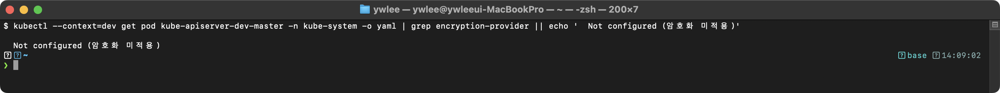

# KCSA 최종 재검토 피드백 (개선 후)

> 생성: 2026-06-13 (스크린샷+스토리라인+보안도구 실측 반영 후) · 파일당 1 에이전트 병렬 재검토

- 단독합격 **8/10** · 평균 가독성 **4.1** · 스토리라인 **4.4**
- 스크린샷 활용: 부분 8, 없음 1, 참조과다 1
- 남은 부족분 **75** (HIGH 22) · HIGH 카테고리: 스크린샷부족 10, 실습재현불가 9, 정확성오류 1, 맥락점프 1, 구조 1

| 파일 | 합격 | 가독성 | 스토리 | 스샷 | H/M/L |
|:--|:--:|:--:|:--:|:--:|:--:|
| 01-concepts.md | O | 4 | 5 | 부분 | 2/4/3 |
| daily/day01.md | O | 5 | 5 | 부분 | 1/3/1 |
| daily/day02.md | X | 4 | 4 | 부분 | 3/4/2 |
| daily/day03.md | O | 4 | 4 | 부분 | 2/3/2 |
| daily/day04.md | O | 4 | 4 | 부분 | 2/4/2 |
| daily/day05.md | O | 4 | 4 | 부분 | 2/3/2 |
| daily/day06.md | X | 4 | 4 | 없음 | 3/3/2 |
| daily/day07.md | O | 4 | 5 | 참조과다 | 2/4/2 |
| daily/day08.md | O | 4 | 4 | 부분 | 2/3/2 |
| daily/day09.md | O | 4 | 5 | 부분 | 3/3/1 |

---

### 01-concepts.md
- **HIGH** `스크린샷부족` _3.2절 PSA 검증 실습(L457), 3.3절 kubectl auth can-i 검증(L534-564), 3.5절 NetworkPolicy 차단 테스트(L705-797), 2.1.3절 Admission webhook 차단(L199-207), 6.3절 Audit 로그 조회(L1514)_ — 14개의 실습 검증 지점 중 12곳이 실제 스크린샷 이미지 없이 '예시(참조)' blockquote 텍스트로만 남아 있다. images/ 폴더에는 kcsa-psa.png, kcsa-cani.png 등 관련 파일이 존재하지만 01-concepts.md에서 참조하지 않는다. CLAUDE.md 절대규칙(4-1)에서 명령 출력은 반드시 실제 터미널 스크린샷 이미지로 넣도록 요구한다. → images/ 폴더에 이미 있는 kcsa-psa.png, kcsa-cani.png, kcsa-secret.png, kcsa-encryption.png, kcsa-clusteradmin.png 등을 해당 실습 지점 바로 아래에  형식으로 연결한다. 아직 캡처되지 않은 NetworkPolicy/Audit 실습은 '(미캡처)' 표기로 유지한다.
- **HIGH** `정확성오류` _2.2절 L291-298 etcd 암호화 확인 스크린샷_ — 암호화 적용 전후를 설명하는 두 문단(L291-293, L295-299)이 동일한 이미지 파일 kcsa-etcd.png를 참조하고 있다. 학생이 보면 '왜 두 상태가 같은 이미지인가'라는 혼란이 발생하며, 암호화 전후 차이를 시각적으로 비교하는 핵심 목적이 사라진다. → 암호화 전 hexdump(평문 mykey/mydata 노출)와 암호화 후 hexdump(k8s:enc:aescbc:v1:key1 접두사+랜덤 바이트) 두 캡처를 각각 다른 파일명(예: kcsa-etcd-plain.png, kcsa-etcd-encrypted.png)으로 분리한다. 현재 클러스터에서 캡처가 불가능하다면 두 이미지 참조를 하나로 합치고 '암호화 전후를 같은 스크린샷으로 확인하는 것은 04-tart-infra-practice.md 참조'라는 주석을 추가한다.
- **MED** `용어비약` _2.3절 L308-323 kubelet 보안 설정 표_ — 10250/10255 포트, Webhook authorization mode, certificate rotation 같은 kubelet 전용 용어들이 표에 나열되어 있으나, kubelet이 어떤 컴포넌트이고 어떤 역할을 하는지(노드 에이전트, Pod 라이프사이클 관리)를 설명하는 단락이 표 앞에 없다. 2.1~2.2절(API Server, etcd)에는 각각 역할 서술이 있는데 kubelet은 첫 문장만 있고 등장 배경-이전 방식-개선 스토리가 없다. → 2.3절 첫머리에 kubelet의 위치(노드 에이전트, kube-apiserver 지시를 받아 컨테이너 런타임에 위임)와 공격자가 왜 kubelet을 노리는지(노드 내 모든 컨테이너에 접근 가능한 로컬 관리 API이기 때문)를 두 문단으로 추가한다.
- **MED** `맥락점프` _5.4절 L1229 OPA 등장 후 L1310 ValidatingAdmissionPolicy 설명_ — ValidatingAdmissionPolicy(CEL)가 2.1.3절(Admission Control)에서 '내장 Admission Controller' 표에 이미 한 줄로 나왔고, 5.4절에서 다시 '대안 정책 엔진'으로 등장한다. 두 곳 사이에 앞 절을 참조하는 링크나 '2.1.3절에서 소개한 CEL 정책이다'라는 연결 문장이 없어 처음 읽는 학생은 같은 개념이 두 번 나오는지 다른 개념인지 판단하기 어렵다. → 5.4절 ValidatingAdmissionPolicy 설명 앞에 '2.1.3절 Admission Control 진화 과정에서 소개한 내장 CEL 정책이다'라는 한 줄 참조를 추가한다.
- **MED** `이해난이도` _4.3절 L953-980 SLSA 레벨 표와 provenance 검증 예시_ — SLSA Level 1~4(Build L1~L4)의 이름이 표 안에서 'Level 1 (Build L1)'처럼 괄호 혼용으로 표기되어 있는데, 실제 SLSA v1.0 명명은 Build L0~L3(4단계)이고 이전 v0.1은 SLSA 1~4였다. 버전 혼용 표기가 수험생에게 혼란을 준다. 또 provenance, hermetic build, reproducible build 용어에 첫 등장 시 한 줄 풀이가 없다. → 표 머리에 '이 표는 SLSA v0.1 기준 1~4 레벨 명칭을 사용한다(v1.0의 Build L0~L3에 대응)'라고 명시한다. provenance(빌드 출처 증명 메타데이터), hermetic build(외부 네트워크 차단 빌드), reproducible build(동일 입력이면 항상 동일 결과를 내는 빌드)에 괄호 한 줄 풀이를 추가한다.
- **MED** `스크린샷부족` _6.1절 L1376-1384 kube-bench 실행_ — kube-bench 결과 확인 명령(kubectl logs job/kube-bench) 다음에 kcsa-apiserver-flags.png 스크린샷이 있는데, 이 이미지는 kube-bench 로그 출력이 아니라 'kube-apiserver 보안 플래그(grep)'이라는 캡션을 가지고 있다. 즉 명령과 이미지가 불일치한다. 학생은 kube-bench 결과가 아니라 grep 출력을 보고 혼동하게 된다. → kube-bench 실행 결과(PASS/FAIL/WARN 항목 목록)를 실제로 캡처한 이미지를 별도 파일로 연결하거나, kcsa-apiserver-flags.png의 위치를 kube-bench 명령 블록이 아닌 2.1절 API Server 보안 플래그 점검 설명 아래로 이동하고 두 지점의 캡션을 정확하게 수정한다.
- **LOW** `구조` _2.4절 kube-proxy(L325-333), 2.5절 CoreDNS(L335-342)_ — kube-proxy와 CoreDNS 절은 등장 배경-직전 기술-개선-트레이드오프 서술이 없고 보안 고려사항 목록만 있다. 다른 절(API Server, etcd, kubelet)과 구조적으로 일관되지 않아 학생이 '이 컴포넌트는 왜 보안 대상인가'를 이해하지 못하고 암기에 의존하게 된다. → 두 절 각각 앞에 두 문단 분량의 역할 서술(kube-proxy: 서비스 VIP를 실제 Pod IP로 중개하는 iptables/IPVS 규칙 관리자라 규칙 조작이 트래픽 하이재킹으로 이어짐, CoreDNS: 클러스터 내부 DNS 서버라 응답 위조가 서비스 디스커버리 전체에 영향)을 추가하고 최소한의 등장 배경을 넣는다.
- **LOW** `스토리라인누락` _3.4절 ServiceAccount 및 Token 관리(L578-603)_ — Bound ServiceAccount Token의 특징(시간 제한·오브젝트 바인딩 등)은 설명되어 있으나, 이전 방식(legacy long-lived Secret 기반 토큰)의 어떤 한계 때문에 Bound Token이 도입되었는지 등장 배경이 없다. → 절 첫머리에 '1.24 이전에는 SA 생성 시 자동으로 만료 없는 Secret 토큰이 생성되어 토큰 유출 시 폐기가 어려웠다. 1.22의 TokenRequest API(Bound Token)는 만료 시간·Pod 바인딩으로 이 한계를 해결했다'는 두 문장 등장 배경을 추가한다.
- **LOW** `실습재현불가` _4.3절 L924-934 SBOM 생성(Syft) 및 취약점 검사(Grype)_ — syft와 grype 명령은 이 저장소 클러스터에 설치되어 있지 않으며, 설치 방법이나 설치 여부 안내가 없다. 학생이 명령을 그대로 따라 하면 'command not found' 오류를 만난다. → 해당 명령 앞에 'syft/grype는 호스트에 별도 설치가 필요하다(brew install syft grype 또는 GitHub Releases)'라는 한 줄 전제 조건을 추가하거나, 이미 클러스터에 설치된 Trivy를 이용한 동등한 대체 명령을 병기한다.

### daily/day01.md
- **HIGH** `스크린샷부족` _## tart-infra 실습 -- 실습 1 검증(1212행), 실습 2 예상 출력(1277-1278행), 실습 3 동작 원리(1327-1334행)_ — 실습 섹션 4개 중 실제 스크린샷은 kcsa-apiserver-flags.png 1개뿐이다. 실습 2 출력은 '예시(참조)' blockquote로 처리됐고, 실습 3은 출력 섹션 자체가 없다. kubectl auth can-i, kubectl get secret, kubectl get resourcequota 등의 결과가 텍스트로도 이미지로도 제시되지 않아 학생이 자신의 실행 결과가 맞는지 비교할 수 없다. → 실습 2와 실습 3 각 명령 블록 직후에 실제 터미널 캡처 이미지를 삽입하거나, 클러스터 기동이 불가한 경우 '(미캡처)'로 명기한다. blockquote 참조 노트는 제거하고 이미지로 대체한다.
- **MED** `실습재현불가` _## tart-infra 실습 전체 -- CLAUDE.md 규정 §9.3 4겹 원칙 중 '[시험형 미니랩]' 누락_ — CLAUDE.md는 daily 양식에 '시험형 미니랩(시간 제약 의식)' 절을 요구한다. day01 실습 섹션은 개념 확인 명령 위주로, 시험처럼 '5분 안에 NetworkPolicy를 만들어 demo 네임스페이스를 default-deny로 설정하라' 형태의 문제+시간 제한 랩이 없다. KCSA는 이론 시험이지만 개념을 문제 형식으로 실제 적용해보는 미니랩이 있어야 '자격증 합격' 기준을 충족한다. → 각 실습 말미에 '미니랩 (목표 시간 X분)' 절을 추가하고, 빈칸 채우기 또는 단답형 실습 문제(예: 'STRIDE에서 etcd 변조는 어느 위협인가, 방어 YAML을 작성하라')를 1-2개 제시한다.
- **MED** `정확성오류` _### 실습 2: Zero Trust 네트워크 확인 -- 1262-1265행 CiliumNetworkPolicy 매니페스트_ — egress: [{}] 구문을 '모든 egress 선택자를 선택하되 허용 규칙이 없음'으로 설명했으나, Cilium v1.14+ 문서상 egress: [{}]는 빈 엔드포인트셀렉터({})가 있는 규칙으로 '모든 egress 허용'으로 해석될 수 있다. 실제 default-deny egress는 egress 키 자체를 생략하거나 egress 규칙 없이 endpointSelector만 지정해야 한다. 잘못 따라하면 학생 환경에서 정책 의도와 다른 동작이 발생할 수 있다. → CiliumNetworkPolicy default-deny 매니페스트를 Cilium 공식 문서 기준으로 재확인 후 수정한다. 표준 NetworkPolicy(networking.k8s.io/v1)를 대안으로 함께 제시해 CNI 무관하게 실습 가능하게 한다.
- **MED** `구조` _### 1.1 등장 배경(26-64행)과 ### 1.2 왜 클라우드 네이티브 보안이 중요한가(92-130행)_ — 1.1절 코드블록과 1.2절 본문이 경계 보안의 한계(마이크로서비스, 동적 IP, 공유 인프라)를 거의 동일한 내용으로 반복 기술한다. 1.1은 산문 코드블록, 1.2는 번호 목록+다이어그램 형식으로만 다르고 내용이 중복된다. 분량 과잉으로 읽는 흐름이 끊린다. → 1.1절은 '등장 배경 스토리(경계 보안의 역사적 전제)'로 남기고, 1.2절은 '왜 K8s 환경에서 더 심각한가'의 K8s-specific 이유(동적 IP, 다중 테넌트)로 차별화하거나, 두 절을 합쳐 하나로 정리한다.
- **LOW** `맥락점프` _### 실습 3: STRIDE 위협 모델 적용 -- 1316-1325행 bash 명령 블록_ — kubectl auth can-i --list 출력은 실행 환경(컨텍스트, 현재 사용자)에 따라 전혀 다르게 나온다. 어떤 출력이 정상이고 어떤 출력이 문제 있는 상태인지 기준이 없다. 학생이 '내 출력이 맞는가'를 판단할 기준 설명이 누락됐다. → 명령 블록 아래에 '기대 출력 해석' 단락을 추가하여 cluster-admin 여부, 위험한 verb(* on *) 패턴, 의심해야 할 출력 예시를 설명한다. 또는 실제 캡처 이미지와 함께 어노테이션으로 설명한다.

### daily/day02.md
- **HIGH** `스크린샷부족` _실습 1(공급망 보안 점검 -- 이미지 분석), 실습 3(Zero Trust 네트워크 확인) 검증 블록_ — 두 실습의 기대 출력이 모두 '예시(참조) -- dev 실측(캡처 후 삭제)' blockquote로만 표시돼 있고 실제 스크린샷 이미지가 없다. images/ 디렉터리에는 kcsa-cani.png, kcsa-cilium.png, kcsa-clusteradmin.png 등 관련 스크린샷이 존재하나 day02.md에 삽입되지 않았다. → images/kcsa-cani.png(kubectl auth can-i 출력), images/kcsa-cilium.png(CiliumNetworkPolicy 출력) 등을  형식으로 해당 검증 블록에 직접 삽입한다. '예시(참조)' blockquote는 스크린샷으로 대체한다.
- **HIGH** `실습재현불가` _1.2 SBOM, 1.3 Cosign, 1.5 Trivy/Falco 절 -- 도구 설치 안내 전무_ — syft, cosign, trivy 명령을 실습 코드로 제시하지만 이 도구들의 설치 방법이 어디에도 없다. 학부생이 '$ syft myapp:v1.0' 명령을 따라 실행하려면 먼저 설치해야 한다. CLAUDE.md 절대규칙(4절)은 실습 재현 가능성을 요구한다. → 실습 전제 블록(1.2 상단)에 macOS/Linux 설치 원라이너를 추가한다. 예: 'brew install syft cosign trivy' 또는 바이너리 다운로드 명령. 클러스터 내 실행이라면 Helm chart 명령을 제시한다.
- **HIGH** `실습재현불가` _실습 1 및 1.2절 -- Syft/Trivy 실제 출력 없음_ — syft, trivy 명령이 코드블록에 제시되지만 해당 명령의 실제 출력 스크린샷이 없다. SBOM JSON 구조나 Trivy CVE 리포트 출력이 어떻게 생겼는지 학생이 전혀 확인할 수 없어 '내가 제대로 실행하고 있는지' 검증이 불가능하다. → trivy image --format spdx nginx:1.25 실행 결과와 syft nginx:1.25 -o spdx-json 출력 일부를 실제 터미널 스크린샷으로 캡처해 삽입한다.
- **MED** `용어비약` _섹션 5 CNCF 프로젝트 요약 -- Notary/TUF 등장 배경_ — Notary는 '아티팩트 서명, TUF 기반'으로만 한 줄 서술된다. TUF(The Update Framework) 자체의 등장 배경('미러 서버 변조 문제')은 설명돼 있으나, Notary가 왜 TUF 위에 만들어졌는지, Cosign과 무슨 차이인지 설명이 없다. 학습 목표 14번에 'Incubating(Kyverno/SPIFFE/Notary)'이 포함돼 있어 시험에 출제될 수 있다. → Notary 항목에 'Docker Hub 시절 이미지 신뢰 문제(Docker Content Trust)를 해결하기 위해 등장했고, Cosign이 OCI 아티팩트 서명을 단순화하면서 공존하는 이유'를 2~3줄로 추가한다.
- **MED** `맥락점프` _섹션 3 연습 문제 14번 -- Zero Trust 5원칙_ — 문제 14번 정답 해설에 '5원칙은 신원 확인, 최소 권한, 마이크로 세그멘테이션, 암호화, 지속적 검증'이 등장하지만, 본문(1절 또는 Day 1)에서 이 5원칙을 목록으로 설명한 부분이 없다. 학생이 해설을 보고 처음 5원칙을 접하게 된다. → Day 1 전제 블록(상단 22행)에 Zero Trust 5원칙 목록을 추가하거나, 본문 2절 시험 패턴 분석 내에 Zero Trust 5원칙을 표로 제시한다.
- **MED** `스크린샷부족` _1.5절 Falco 런타임 감지 -- rule 실행 결과_ — Falco rule 예시('Terminal shell in container')가 코드블록으로 제시되어 있으나, 실제 Falco 경보 로그 출력 스크린샷이 없다. images/ 디렉터리에 cks-falco-alert.png, cks-falco-pods.png 파일이 존재하는데 day02.md에 삽입되지 않았다. → cks-falco-alert.png를 Falco 규칙 예시 바로 아래에 로 삽입한다. 캡션에 '실제 터미널 캡처'를 명기한다.
- **MED** `이해난이도` _1.5절 -- 이미지 스캐닝 도구 비교표 (ASCII 박스)_ — Trivy/Grype/Clair/Snyk 비교가 ASCII 박스 테이블(+-|)로 작성돼 있다. CLAUDE.md 절대규칙(4절 2번)은 'ASCII 박스 다이어그램 금지(한글 더블폭으로 테두리 어긋남)'를 명시한다. 실제로 한글 셀 너비 불일치로 렌더링이 깨진다. → ASCII 박스를 GFM 파이프 테이블(| 도구 | 제조사 | 특징 |)로 교체한다. mermaid로 그릴 필요는 없다(표는 ASCII 예외 대상이 아니므로 GFM 표가 적절하다).
- **LOW** `구조` _tart-infra 실습 섹션 -- 위치(870행 말미)_ — 실습 절(tart-infra 실습)이 문서 맨 끝에 별도 섹션으로 떨어져 있고, 개념 절(1.2~1.6)과 연결이 명시적이지 않다. 학생이 1.3 Cosign을 읽고 'Cosign을 직접 실행해보고 싶다'고 생각할 때 어디서 실습하는지 바로 찾기 어렵다. → 각 개념 절(1.2 SBOM, 1.3 Cosign 등) 끝에 '-> 직접 실습: tart-infra 실습 1(공급망 보안 점검) 참고' 한 줄 앵커 링크를 추가한다.
- **LOW** `용어비약` _1.3절 Cosign 코드블록 -- Keyless 서명 설명_ — 키리스 서명 설명에서 '--identity-token=<oidc-token>' 명령이 제시되지만, OIDC 토큰을 어떻게 획득하는지(예: GitHub Actions의 'permissions: id-token: write') 가 없다. 학부생이 이 명령을 실제로 실행할 수 없다. → Keyless 서명 예시 아래에 'GitHub Actions에서는 permissions.id-token: write를 설정하면 OIDC 토큰이 자동 주입된다'는 한 줄 주석을 추가한다. 또는 '실제 사용 환경(GitHub Actions, GCP Workload Identity)에 따라 토큰 획득 방식이 다르므로 각 플랫폼 문서를 참조'라고 안내한다.

### daily/day03.md
- **HIGH** `스크린샷부족` _실습 2(etcd 보안 설정 확인, 690행), 실습 3(kubelet 보안 확인, 707행), 실습 4(인증서 체계 PKI 확인, 729행)_ — 실습 2/3/4 모두 '기대 출력' 텍스트 설명만 있고 실제 스크린샷이 없다. images/ 폴더에 kcsa-etcd.png, kcsa-encryption.png, kcsa-secret.png 파일이 이미 존재하지만 day03.md에서 단 한 곳도 참조되지 않는다. 실습 4는 '예시(참조)' blockquote로 처리되어 있다. → 실습 2 직후에 , 실습 4 직후에  등 이미 존재하는 이미지를 삽입한다. Encryption at Rest 실습(etcdctl 암호화 전후 비교)에는 kcsa-encryption.png를 삽입한다.
- **HIGH** `실습재현불가` _섹션 1.3 인가(Authorization) 상세 (169~206행)_ — RBAC를 '권장' 인가 모드로 제시하지만 Role/ClusterRole/RoleBinding YAML 예시나 kubectl auth can-i 검증 명령이 전혀 없다. 학생이 RBAC가 어떻게 동작하는지 실제로 확인할 방법이 없어 22% 비중 도메인에서 핵심 실습이 누락된 셈이다. → 섹션 1.3 아래에 최소한의 RBAC 예시(pods를 get/list할 수 있는 Role + RoleBinding YAML)와 kubectl auth can-i get pods --as=<사용자> 검증 명령 + kcsa-cani.png 스크린샷을 추가한다.
- **MED** `구조` _섹션 2.1 etcd의 중요성 (291~314행)_ — 개념 설명 전체가 언어 태그 없는 코드블록(```)으로 감싸져 있다. '코드블록은 실제 코드만' 이라는 CLAUDE.md 규칙에 어긋나며, 마크다운 렌더러에 따라 고정폭 폰트로 표시되어 가독성이 저하된다. → 코드블록을 제거하고 평서체 단락 + 굵은 키워드 + 인라인 코드(경로 부분만 `backtick`)로 재작성한다.
- **MED** `구조` _섹션 4.3 인증서 유효 기간 그림 8 (583~589행)_ — mermaid flowchart TB 에 노드 A, B, C 세 개가 선언만 되고 edge(화살표)가 없다. 노드 간 연결이 없어 다이어그램이 아니라 단순 목록과 동일하며 mermaid로 감싸는 의미가 없다. → 그림 8을 마크다운 리스트(- CA 인증서: 10년 / - 컴포넌트 인증서: 1년 / - SA 키: 만료 없음)로 교체하거나, 유효 기간 3종의 포함 관계를 표현하는 flowchart(CA -> 컴포넌트 -> SA 키 순)로 수정한다.
- **MED** `맥락점프` _섹션 1.2 OIDC 설명 (79행, 88행)_ — OIDC가 '권장(사용자)' 인증 방법으로 비교표에 올라 있지만, X.509는 시퀀스 다이어그램(그림 2)과 CN/O 필드 매핑 설명이 있는 반면 OIDC는 한 줄 설명만 있다. --oidc-issuer-url 플래그도 kube-apiserver YAML에 없어 학생이 실제 설정 방법을 알 수 없다. → kube-apiserver 매니페스트 예시(섹션 1.2 핵심 플래그 YAML)에 --oidc-issuer-url, --oidc-client-id, --oidc-username-claim 플래그를 주석과 함께 추가한다. OIDC 흐름(IdP -> ID Token -> API Server TokenReview)을 2~3행의 간단한 mermaid sequenceDiagram으로 보충한다.
- **LOW** `용어비약` _섹션 2.3 Encryption at Rest, aescbc 항목 (395행)_ — '패딩 오라클 공격(padding oracle attack) 취약 가능성'이라고 언급하지만 왜 AES-CBC에서 패딩 오라클이 발생하는지 한 줄 설명도 없다. 학부생이 이 단어를 처음 보는 경우 이해를 포기하고 넘어갈 수 있다. → aescbc 단점 설명에 '(패딩 오라클 공격 — 암호화 블록 패딩 검증 응답의 차이를 이용해 키 없이 평문을 복구하는 공격, AES-CBC 구현 결함 시 발생)' 한 줄 괄호 풀이를 추가한다.
- **LOW** `스크린샷부족` _섹션 2.3 기존 데이터 재암호화 (411~426행)_ — etcdctl로 etcd를 직접 조회해 암호화 전후를 비교하는 명령이 코드블록으로 제시되어 있으나 실제 출력 스크린샷이 없다. 'k8s:enc:secretbox:v1:key1:...' 형태의 실제 암호화된 값과 평문 값의 차이를 시각적으로 보여주지 못한다. → 기존 데이터 재암호화 코드블록 아래에 kcsa-encryption.png(이미 images/ 폴더에 존재)를 로 삽입한다.

### daily/day04.md
- **HIGH** `스크린샷부족` _섹션 8 tart-infra 실습 전체(실습 1/1b/2)_ — 실습 1·1b·2 합쳐 bash 블록이 여러 개지만 실제 스크린샷은 실습 1 검증 1장(kcsa-apiserver-flags.png)뿐이다. 실습 1b(profiling FAIL->PASS 전환)와 실습 2(Pod 생성 흐름 추적)는 명령 출력 스크린샷이 전혀 없다. 디스크에 kcsa04-69-kubebench-apply.png, kcsa04-70-kubebench-logs.png가 이미 존재하지만 day04.md에 삽입되지 않았다. → 실습 1b의 'grep profiling' 출력과 'kubectl wait' 완료 화면, 실습 2의 grep -E 출력에 각각  형식 스크린샷을 삽입한다. 특히 kcsa04-69/70이 이미 있으므로 kube-bench Job apply+logs 흐름에 해당 이미지를 연결한다.
- **HIGH** `실습재현불가` _섹션 1.2 kube-bench Job YAML / tart-infra 실습_ — 섹션 1.2에 kube-bench Job YAML이 있고 '재실행해 PASS 전환 여부를 확인한다'고 설명하지만, tart-infra 실습 절에는 kube-bench Job을 실제로 apply하고 logs로 결과를 읽는 end-to-end 명령이 없다. 실습 1b는 'vi로 편집'이라고만 적혀 있어 정확한 편집 명령(sed 또는 vi 키시퀀스)이 빠져 있다. → tart-infra 실습에 'kubectl apply -f kube-bench-job.yaml && kubectl wait --for=condition=complete job/kube-bench -n kube-system --timeout=120s && kubectl logs job/kube-bench -n kube-system' 명령 블록과 스크린샷을 추가한다. 실습 1b 편집 단계에는 'sudo sed -i ...' 또는 vi 명령을 명시한다.
- **MED** `스크린샷부족` _섹션 3 예제 2~4 검증 명령(lines 324-396)_ — Audit Policy dry-run, ResourceQuota apply+get quota, LimitRange get quota,limitrange 세 개 검증 명령 모두 스크린샷 없이 bash 블록으로만 제시된다. CLAUDE.md 4-1 규칙('명령 출력은 스크린샷')에 위반된다. → 각 검증 명령 아래에 실제 터미널 출력 스크린샷 을 삽입하거나, 클러스터가 꺼진 경우 '(미캡처)' 표기를 추가한다.
- **MED** `이해난이도` _섹션 2 Static Pod 보안 권장사항(lines 208-212)_ — '/etc/kubernetes/manifests/ 디렉토리 권한 제한(700), 파일 권한(600)'을 서술하지만 실제 chmod 명령이나 현재 권한 확인 명령이 없다. 파일 무결성 모니터링에 AIDE/Tripwire를 언급하지만 설치·실행 방법이 전혀 없어 학부생이 스스로 실습하기 어렵다. → 'ssh dev-master; ls -la /etc/kubernetes/manifests/' 출력 스크린샷과 'sudo chmod 700 /etc/kubernetes/manifests/' 명령을 트러블슈팅 섹션에 추가한다. AIDE는 패키지 설치(apt install aide) 한 줄 + 주요 명령(aide --init, aide --check) 두 줄만이라도 예시로 제공한다.
- **MED** `스토리라인누락` _섹션 1 kube-bench, CIS Benchmark 전반_ — CIS Benchmark 자체에 대한 트레이드오프(한계)가 섹션 1.3 끝에 부분적으로 있지만, 'CIS Benchmark를 따르면 생기는 비용/주의점(오버헤드, 버전별 차이, WARN 항목의 맥락 의존성)' 같은 구체적 트레이드오프가 빠져 있다. CLAUDE.md 4-4 요소 중 트레이드오프가 미흡하다. → 1.3 끝 또는 1.0 배경 섹션에 'CIS Benchmark 적용의 트레이드오프: (1) 버전마다 항목 번호가 바뀌어 자동화 스크립트 관리 필요, (2) WARN 항목은 환경별 판단이 필요해 획일 적용 시 오작동, (3) 관리형 K8s에서는 제어 불가 항목이 다수 존재'를 추가한다.
- **MED** `구조` _섹션 8 tart-infra 실습 전체_ — CLAUDE.md daily 양식에는 '직접 해보기(시험형 미니랩, 시간 제약 의식)' 서브섹션이 필수이나 day04.md 실습 절에는 시간 제한 없이 검증 명령만 나열돼 있다. KCSA는 이론 시험이지만 '60문제 90분' 패턴으로 객관식 풀이 속도를 연습해야 한다. → 실습 섹션 끝에 '직접 해보기(5분 미니랩)' 서브섹션을 추가한다: '5분 안에 kube-bench 결과에서 FAIL 항목 3개 찾아 YAML 수정 후 grep으로 확인'처럼 시간 제약을 명시한다.
- **LOW** `용어비약` _섹션 3 예제 1(line 238)_ — '--enable-admission-plugins=NodeRestriction,PodSecurity,ServiceAccount,LimitRanger,ResourceQuota' YAML에 ServiceAccount가 Admission Plugin으로 등장하는데, 이는 일반적으로 Admission Controller 플러그인이 아닌 별개 기능이다. ServiceAccount(서비스 어카운트를 자동 생성/할당하는 컨트롤러)와 ServiceAccountToken(토큰 자동 생성)을 구분하는 설명이 없어 혼동 가능하다. → 예제 1 YAML 주석에 'ServiceAccount: 생성 요청에 default SA를 자동 할당하는 Mutating Controller'를 한 줄 추가한다.
- **LOW** `맥락점프` _섹션 4 Pod 생성 흐름(line 455~466)과 학습 목표(line 18)_ — 학습 목표는 '6단계(인증->인가->Mutating->Schema->Validating->etcd)'로 명시하지만 다이어그램과 설명은 9단계(kubectl, Scheduler, kubelet까지 포함)로 확장된다. 목표와 본문 단계 수가 불일치해 혼동을 준다. → 학습 목표 6단계를 '9단계 전체 흐름 중 API Server 내부 6단계'로 표현을 수정하거나, 목표를 9단계로 맞춘다.

### daily/day05.md
- **HIGH** `스크린샷부족` _실습 2(SA 확인), 실습 3(PSA 레이블 확인), 실습 4(auth can-i) 검증 블록_ — 실습 섹션 4개 중 스크린샷이 실습 1 한 곳(kcsa-clusteradmin.png)에만 있다. 실습 2는 kubectl get sa / pod jsonpath 출력이 없고, 실습 3는 텍스트 해석 가이드만, 실습 4는 '예시(참조)' blockquote로 대체되어 CLAUDE.md 절대규칙(명령 출력은 실제 스크린샷)을 위반하고 있다. → dev 클러스터에서 실습 2~4 명령을 실제 실행하고 터미널 스크린샷을 캡처해 images/ 에 저장한 후 각 검증 블록에  로 삽입한다. 실습 4의 '예시(참조)' blockquote는 실제 스크린샷으로 교체한다.
- **HIGH** `실습재현불가` _2.5 SA 토큰 수동 발급 코드블록 (line 490-496)_ — kubectl create token 명령의 실행 결과(JWT JSON)가 bash 코드블록 주석(# {...})으로 텍스트 삽입되어 있다. CLAUDE.md 절대규칙인 '명령 출력은 텍스트 블록 금지, 실제 스크린샷만'을 직접 위반한다. 학생 입장에서는 이것이 실제 출력인지 예시인지 구분이 불명확하다. → 해당 주석 출력 텍스트를 제거하고, dev 클러스터에서 kubectl create token 명령을 실행한 터미널 화면을 스크린샷으로 캡처해 images/kcsa-sa-token.png 로 저장 후 코드블록 아래에  으로 삽입한다.
- **MED** `맥락점프` _3.1 PodSecurityPolicy(PSP) -> PSS/PSA 전환 역사_ — PSP의 문제점을 '복잡한 설정, RBAC와의 혼동, 디버깅 어려움'으로만 열거했다. PSP가 왜 RBAC과 혼동됐는지(PSP 사용에 RBAC Verb 'use'가 필요했고, 어떤 PSP가 적용될지 예측이 어려웠던 메커니즘)를 모르는 학생은 이 설명만으로 이해가 불가능하다. → PSP 동작 메커니즘 2~3줄 추가: 'PSP는 사용자가 해당 PSP 오브젝트에 use verb 권한을 가져야 적용됐다. 여러 PSP가 존재할 때 어느 PSP가 선택될지 순서가 불명확해 디버깅이 어려웠고, RBAC과 PSP의 권한 조합이 예상치 못한 정책을 만들어 냈다.'와 같은 설명을 추가한다.
- **MED** `실습재현불가` _tart-infra 실습 전체 - PSA enforce 동작 검증 실습 부재_ — PSA 3모드(enforce/audit/warn)를 이론으로만 설명하고, 실제로 enforce=restricted 네임스페이스에 위반 Pod를 생성해 403 거부를 손으로 확인하는 실습이 없다. 이론 과목(KCSA)이지만, 이 동작을 직접 보지 않으면 enforce vs warn 차이가 몸에 남지 않는다. → 실습 3 또는 별도 실습 5를 추가한다: 테스트 네임스페이스에 enforce=restricted 레이블을 붙이고, securityContext 없는 기본 Pod를 kubectl run 으로 생성 시도해 403 Forbidden 메시지를 스크린샷으로 확인한다. 이후 warn 모드로 재설정 후 동일 Pod를 생성해 Warning 메시지가 터미널에 출력됨을 대비 캡처로 보여준다.
- **MED** `용어비약` _1.0 등장 배경 - ABAC 첫 등장_ — ABAC(Attribute-Based Access Control)이 첫 줄에 약어만 풀이되고, 실제로 JSON 파일이 어떻게 생겼는지(예시 한 줄)가 없다. K8s를 처음 보는 학부생은 'JSON 파일에 정책'이 어떤 형태인지 이미지가 없어 왜 API 재시작이 필요한지 이해하기 어렵다. → ABAC 정책 예시 2~3줄을 인라인으로 추가한다: {"apiVersion": "abac.authorization.kubernetes.io/v1beta1", "kind": "Policy", "spec": {"user": "alice", "resource": "pods", "readonly": true}} 형태와 함께 '이 파일을 변경하려면 kube-apiserver 프로세스를 재시작해야 한다'는 설명을 붙인다.
- **LOW** `스토리라인누락` _Day 4 -> Day 5 연결 (파일 상단 1줄 브리지)_ — 'Day 4에서 CIS Benchmark, Static Pod를 다뤘다. Day 5는 그 위에서 동작하는 API 접근 제어 계층으로 이어진다'는 연결이 너무 추상적이다. CIS Benchmark의 RBAC 관련 권고(예: CIS 5.1.x 시리즈)와 Day 5 내용이 구체적으로 어떻게 이어지는지 한 줄 더 있으면 흐름이 완성된다. → 'CIS Benchmark 5.1 시리즈는 RBAC 최소 권한, 5.1.6은 system:masters 비사용을 명시한다. Day 5에서 이 권고들을 실제 리소스(Role/ClusterRole/SA)로 어떻게 구현하는지 다룬다.'와 같은 1~2줄을 브리지에 추가한다.
- **LOW** `이해난이도` _3.2 PSS 3단계 레벨 - Baseline 항목_ — Baseline이 차단하는 항목(hostNetwork, hostPID, hostIPC, privileged, hostPath 등)이 mermaid 노드 텍스트에만 압축되어 있고, 각 항목이 왜 위험한지에 대한 설명이 없다. hostNetwork가 위험한 이유를 모르는 학생은 왜 Baseline이 이를 금지하는지 이해하기 어렵다. → Baseline 항목 아래에 간단한 표를 추가한다: | 금지 항목 | 위험 이유 | 형태로 hostNetwork(노드 네트워크 스택 직접 접근 -> 다른 Pod 트래픽 감청), hostPID(노드 프로세스 목록 조회 -> 호스트 프로세스 조작), privileged(컨테이너 탈출 가능) 등을 1줄씩 설명한다.

### daily/day06.md
- **HIGH** `스크린샷부족` _tart-infra 실습 섹션 전체(실습 1~4, 약 line 962-1122)_ — 실습 명령어 블록은 존재하지만 실제 터미널 출력 스크린샷()이 단 한 장도 없다. line 1087의 blockquote는 불완전한 문구로 실질적인 캡처가 아니다. CLAUDE.md 4-1 절대규칙('명령 출력은 반드시 스크린샷')을 전면 위반한다. → 각 실습 단계(default-deny 전후 wget 결과, Secret 목록, auth can-i 출력, NS 라벨 확인)를 dev 클러스터에서 실제 실행 후 터미널 캡처 PNG를 KCSA/images/day06-*.png 로 저장하고  형식으로 삽입한다. 캡처 불가 시 '(미캡처)'로 명시한다.
- **HIGH** `실습재현불가` _섹션 3 OPA/Kyverno (line 383-565)_ — Day 6의 3번째 핵심 주제인 OPA Gatekeeper/Kyverno에 대한 tart-infra 실습이 전혀 없다. 이론과 YAML 예제만 있고 실제 설치-적용-위반-확인 실습 절차가 없어 학생이 손으로 따라할 수 없다. → 실습 5(Kyverno)를 추가한다: Kyverno 설치(kubectl apply -f https://... 또는 helm), disallow-latest-tag ClusterPolicy apply, latest 태그 Pod 생성 시 거부 확인, 정상 태그 Pod 허용 확인 순서로 구성한다. 도구 미설치로 실습이 불가능하면 '(미설치-미캡처)' 명시와 함께 설치 명령만 제공한다.
- **HIGH** `맥락점프` _연습 문제 8~13번 (line 707-801)_ — 문제 8(automountServiceAccountToken), 9(ClusterRole+RoleBinding), 10(PSS Restricted), 11(Bound SA Token), 12(NET_BIND_SERVICE), 13(escalate verb)은 Day 5 주제다. Day 6 파일에 갑자기 등장하는데 '복습 문제'임을 알리는 안내가 없어 처음 읽는 학생이 이 날 배운 내용인지 혼란을 겪는다. → 문제 7과 8 사이에 '--- 복습(Day 5): RBAC/PSA/ServiceAccount ---' 구분선과 1줄 안내('문제 8~13은 Day 5 내용의 복습이다')를 추가한다.
- **MED** `구조` _섹션 1.5 CNI 표(line 225-249), 섹션 3.1 Admission 흐름(line 399-425), 섹션 3.2 OPA vs Kyverno 비교표(line 429-452)_ — 세 블록이 모두 언어 태그 없는 ``` 펜스 안에 ASCII 박스/텍스트 다이어그램으로 작성됐다. CLAUDE.md 4-2('ASCII 박스 다이어그램 금지, 개념/흐름 그림은 mermaid')를 위반한다. → CNI 지원 현황은 GFM 마크다운 표(| CNI | NP 지원 | 비고 |)로, Admission 흐름은 mermaid flowchart로, OPA/Kyverno 비교는 GFM 표 또는 mermaid로 교체한다. mermaid 블록에는 규정된 흑백 init 테마 지시자를 포함한다.
- **MED** `이해난이도` _섹션 2.1 Secret 3중 방어 계층(line 276-300)_ — '계층 3 - Volume tmpfs'에서 tmpfs가 무엇인지 한 줄 정의 없이 '메모리 파일시스템'이라고만 나온다. 리눅스 tmpfs를 모르는 학부생에게는 왜 디스크에 기록되지 않는지 내부 원리가 불명확하다. → tmpfs 첫 등장 시 '(tmpfs: 커널이 RAM에만 존재하는 가상 파일시스템. /dev/shm 등이 대표 예. 마운트 해제 또는 재부팅 시 데이터가 사라진다)'를 괄호 한 줄로 추가한다.
- **MED** `스토리라인누락` _섹션 2.4 외부 시크릿 관리(line 338-379)_ — External Secrets Operator, Vault Agent Injector, CSI Driver 등 연동 방식이 나열되지만, 직전 기술(내부 K8s Secret 한계)에서 각 방식으로 이행하는 '왜 이 도구를 선택하는가'의 의사결정 기준이 표 없이 서술로만 짧게 제시된다. 트레이드오프(Vault 운영 부담, Sealed Secrets 키 분실 위험 등)가 누락됐다. → 선택 기준을 간단한 GFM 표(| 도구 | 선택 상황 | 주의점 |)로 정리하고 각 도구의 단점/운영 주의점을 한 행씩 추가한다.
- **LOW** `용어비약` _섹션 1.0 등장 배경(line 41-48) — MITRE ATT&CK/STRIDE 설명_ — MITRE ATT&CK의 Tactic/Technique 구분과 STRIDE 6가지 위협 범주가 텍스트 단락으로 나오지만, 이것이 KCSA 시험 도메인 어디에 해당하는지 연결이 없다. Day 7 주제(MITRE ATT&CK)와의 관계도 언급되지 않는다. → 두 설명 끝에 '(MITRE ATT&CK 상세는 Day 7에서 다룬다)'와 같이 학습 흐름 연계 한 줄을 추가한다.
- **LOW** `실습재현불가` _실습 4 PSA 레이블 테스트(line 1072-1087)_ — --dry-run=server 로 PSA 레이블을 테스트하는데, dry-run 결과가 어떻게 나와야 하는지(성공 메시지/경고 형식)를 명시하지 않는다. 검증 기대 출력 blockquote(line 1087)가 불완전한 문구여서 학생이 성공/실패를 판단할 수 없다. → 기대 출력 설명을 '(미캡처)' 명시 후 '정상이면 namespace/cap-kcsa-day06 labeled(dry run) 메시지가 출력된다'처럼 구체적인 기대 문구를 텍스트로 보완하거나, 실제 캡처로 교체한다.

### daily/day07.md
- **HIGH** `스크린샷부족` _5. tart-infra 실습 > 실습 1(L891), 실습 4(L954)_ — kubectl 명령 실행 결과가 있어야 할 자리에 '예시(참조)' blockquote 2개만 있고 실제  스크린샷이 없다. 학생이 실제 출력이 어떻게 보이는지 확인할 수 없어 실습 재현 성공 여부를 판단하기 어렵다. → dev 클러스터에서 실습 1·4 명령을 실제 실행해 터미널 스크린샷을 캡처하고 images/ 디렉터리에 저장 후  형태로 삽입한다. 'cap-kcsa-day07' 네임스페이스를 만들고 seccomp/privileged 설정 파드를 실제 배포한 결과여야 한다.
- **HIGH** `스크린샷부족` _3.3 seccomp > 직접 해보기 -- seccomp 프로파일 확인 (L521-535)_ — kube-system 파드의 seccomp 프로파일 조회 명령과 'RuntimeDefault가 보이면 정상'이라는 텍스트 해석만 있고 실제 출력 스크린샷이 없다. 학생이 명령을 실행해도 출력 형식을 예상할 수 없다. → dev-master에서 해당 jsonpath 명령을 실행하고 스크린샷을 찍어 images/kcsa-day07-seccomp.png로 삽입한다. 출력 중 RuntimeDefault vs 빈 값 행을 캡션으로 설명한다.
- **MED** `실습재현불가` _3.1 Falco 심화 / tart-infra 실습 전체_ — Falco가 실습 전체에서 핵심 도구로 언급되지만 dev 클러스터에 Falco가 설치돼 있는지, 어떻게 설치하는지 안내가 전혀 없다. 학생이 실습을 그대로 따라하면 falco 명령이 없어 실패한다. → 3.1 또는 실습 전 '실습 환경 설정' 섹션에 'dev 클러스터의 Falco 설치 여부 확인 방법(kubectl get pods -n falco 또는 helm list -n falco)'을 추가하고, 미설치 시 Helm 설치 명령 또는 KCSA 이론 과목 특성상 '(미설치, 개념 이해 목적)' 명시로 범위를 명확히 한다.
- **MED** `실습재현불가` _2.2 Cosign 상세 / 2.4 이미지 스캐닝 도구 비교_ — Cosign sign/verify 명령(L223-224)과 Trivy 스캔 명령이 bash 예시로만 제시되고 실제 실행 결과 스크린샷이 없다. KCSA 이론 시험 대비이지만 도구 역할을 체험 없이 암기만 해야 한다. → Trivy는 macOS 로컬에서 'brew install trivy && trivy image nginx:1.27'로 실행 가능하다. 로컬 터미널에서 스캔 결과(CVE 목록)를 캡처해 images/kcsa-day07-trivy.png로 삽입하면 '정적 분석'의 실제 출력을 눈으로 확인할 수 있다.
- **MED** `용어비약` _2.2 Cosign > 서명 저장 위치 (L242-244)_ — OCI 다이제스트(sha256:abc123...)와 서명 태그(sha256-abc123....sig) 변환 규칙을 설명하지만, OCI(Open Container Initiative) 자체와 이미지 다이제스트가 무엇인지 첫 등장 풀이가 없다. day07이 첫 등장이라면 사전지식 없는 학생이 막힌다. → L241 앞에 'OCI(Open Container Initiative): 컨테이너 이미지 형식과 레지스트리 API 표준을 정의하는 단체다. 이미지 다이제스트는 이미지 내용의 SHA-256 해시로, 태그와 달리 내용이 바뀌면 값이 달라져 무결성 검증에 쓰인다.'를 한 줄 추가한다.
- **MED** `이해난이도` _3.5 SELinux > MCS 라벨 설명 (L643-652)_ — s0:c1,c2 vs s0:c3,c4 격리 시나리오를 텍스트로만 설명하고 다이어그램이 없다. 파드 A/B가 같은 노드에서 MCS 범주로 격리되는 구조를 시각화하지 않아 흐름이 추상적으로 느껴진다. → 두 파드의 MCS 라벨과 접근 허용/거부 관계를 간단한 mermaid flowchart(노드=파드, 엣지=접근 시도, x 표시=거부)로 추가한다.
- **LOW** `구조` _## 자가점검 (L990-1037)_ — 학습 체크리스트 11개 항목 중 Q1-Q7 7문항만 있다. seccomp vs AppArmor 레이어 비교, IMDS(169.254.169.254) 차단 NetworkPolicy 작성, MCS 라벨 구체 사용 시나리오 등 체크리스트 나머지 항목에 대응하는 문항이 없다. → Q8: 'seccomp와 AppArmor를 동시에 적용할 수 있는가? 각각 어떤 레이어를 통제하는가?' Q9: '169.254.169.254 접근을 차단하는 NetworkPolicy를 작성하라.' 최소 2문항을 추가해 체크리스트와 자가점검을 일치시킨다.
- **LOW** `맥락점프` _2.1 이미지 서명/검증 파이프라인 > Kyverno 서명 검증 정책 예시 (L182-211)_ — Kyverno ClusterPolicy YAML에서 publicKeys 값이 '<cosign.pub 내용>' 플레이스홀더로 남아 있다. 학생이 실제로 cosign generate-key-pair를 실행해 얻은 공개키를 어떻게 넣는지 연결 설명이 없다. → YAML 뒤에 'cosign generate-key-pair 실행 후 cosign.pub 파일 내용(BEGIN PUBLIC KEY 블록)을 publicKeys 값으로 그대로 붙여넣는다'는 한 줄 안내를 추가한다. 또는 Keyless 방식 사용 시 keys 대신 keyless 필드로 대체하는 Kyverno 예시를 병기한다.

### daily/day08.md
- **HIGH** `스크린샷부족` _섹션 2.1 '현재 dev 클러스터에서의 대체 실습'(line 319-345), 섹션 2.2 'kubelet 설정 확인 실습'(line 402-421), tart-infra 실습 2(line 981-994), 실습 3(line 1002-1031)_ — bash 코드블록이 6개인데 실제 터미널 스크린샷()은 2곳(동일 이미지 cks-istio-sidecar.png 반복)뿐이다. 실습 2·3·kubelet 점검 명령의 기대 출력이 이미지 없이 텍스트 서술로만 대체되거나(실습 3) 아예 없다(실습 2, kubelet 점검). CLAUDE.md §4-1 절대 규칙 위반이다. → dev-master에서 실측 후 screencapture로 캡처한 PNG를 images/ 에 저장하고 각 실습 직후  으로 삽입한다. 실습 1 검증에 사용된 cks-istio-sidecar.png는 'istio-proxy 주입' 결과 화면인데 실습 내용(PeerAuthentication 미설정 확인)과 내용이 불일치하므로 실제 kubectl get peerauthentication 결과 스크린샷으로 교체한다.
- **HIGH** `구조` _line 241-251 (섹션 1.4 OSI 계층 테이블)_ — 한글 더블와이드 문자와 ASCII 박스(`┌┬┤` 등)가 혼용된 텍스트 표가 코드 블록 안에 있다. CLAUDE.md §4-2에서 개념·아키텍처 흐름 그림은 ASCII 박스 금지, mermaid 사용 의무로 규정되어 있다. 렌더러에 따라 열 너비가 틀어져 가독성이 깨진다. → 해당 ASCII 테이블을 mermaid flowchart 또는 GFM 파이프 테이블(| 헤더 | )로 교체한다.
- **MED** `용어비약` _line 447-448 (IMDS 방어 방법 2·3번)_ — IMDSv2, IRSA(IAM Roles for Service Accounts), Workload Identity가 별도 풀이 없이 나열된다. AWS 클라우드 서비스에 익숙하지 않은 학부생은 이 개념이 무엇인지 알 수 없다. → IMDSv2: 'PUT으로 TTL 제한 토큰을 먼저 발급받아야 GET 가능 — 토큰 없이 직접 접근하는 공격을 차단'. IRSA: 'AWS EKS에서 Pod에 IAM 역할을 부여하는 메커니즘 — SA 어노테이션과 OIDC 연동'. Workload Identity: 'GKE·AKS에서 동일 목적의 매커니즘'을 각각 한 줄로 첫 등장 시 풀이 추가.
- **MED** `맥락점프` _섹션 4 시험 출제 패턴 분석(line 549-598) 내 AppArmor·seccomp·gVisor·Kata 설명_ — 이 개념들의 등장 배경(왜 커널 공유가 위험한지, 기존 컨테이너 보안의 한계)은 섹션 4 본문 이전에 별도 절이 없어 갑자기 시험 패턴 섹션 안에 삽입된다. 스토리라인 없이 용어 정의만 나열되는 구조다. → 섹션 3의 시나리오 1(컨테이너 탈출) 또는 섹션 2 노드 하드닝에 '컨테이너 샌드박싱' 소절을 추가해 '표준 컨테이너가 호스트 커널을 직접 공유하는 위험 -> gVisor/Kata 등장 배경 -> 동작 메커니즘 -> 트레이드오프' 순으로 서술한 뒤, 섹션 4에서는 시험 포인트 요약만 남긴다.
- **MED** `실습재현불가` _line 358 '2. kubelet 보안 (Day 3 복습)'_ — Day 3에서 kubelet 핵심 보안 설정을 다뤘다고만 언급하고 링크나 요약이 없다. Day 3를 보지 않은 학생은 anonymous-auth·Webhook 등의 설정이 어느 파일에서 어떻게 변경되는지 알 수 없어 이 날의 kubelet 실습을 재현하기 어렵다. → 체크리스트 아래에 KubeletConfiguration 수정 예시 YAML(3~5줄)과 적용 명령(sudo systemctl restart kubelet)을 한 번 더 인라인으로 제시하고 '상세는 KCSA day03.md 섹션 N 참조'로 링크한다.
- **LOW** `이해난이도` _line 269-278 'Service Mesh 보안 비교' 표_ — Linkerd의 인가 정책이 'Server 리소스 기반'이라고만 되어 있어 Istio AuthorizationPolicy와의 실질적 차이를 알기 어렵다. 학부생 입장에서 '왜 Istio를 쓰고 Linkerd를 쓰지 않는지'의 선택 기준이 불명확하다. → 표 하단에 2줄 선택 기준을 추가한다: 'JWT/OIDC 외부 인증 연동이나 세밀한 L7 인가 정책이 필요하면 Istio, 경량·단순 mTLS만 필요하면 Linkerd'. 시험 포인트(KCSA 빈출 여부)도 한 줄 표기.
- **LOW** `스크린샷부족` _line 973 '실습 1 검증 기대 출력'_ — cks-istio-sidecar.png 이미지가 파일 첫 줄(line 5)의 표지 이미지와 동일한 파일이며 실습 1의 검증 결과(PeerAuthentication 미설정, WireGuard 미설정 메시지)와 내용이 맞지 않는다. 학생이 실습 후 자신의 출력과 비교할 수 없다. → 실습 1의 실제 명령 출력(kubectl get peerauthentication -A 결과가 'No resources found'로 표시되는 화면)을 별도 캡처해 images/day08-mtls-check.png 등으로 저장하고 삽입한다.

### daily/day09.md
- **HIGH** `실습재현불가` _sec tart-infra 실습 1 (line 563-583)_ — 실습 1의 검증 출력이 실제 스크린샷 없이 '예시(참조)' blockquote + 텍스트 설명으로만 제시된다. CLAUDE.md sec 4-1 절대규칙 위반이고 학생이 자기 클러스터 출력과 교재를 비교할 수 없다. → platform 클러스터에서 `kubectl get pod kube-apiserver-platform-master -n kube-system -o yaml | grep -E 'audit'` 실행 후 실제 터미널 캡처 PNG를 images/ 에 저장하고 `` 로 삽입한다. 미설정 상태라면 '(미캡처 — Audit 미설정 상태)' 명시로 대체한다.
- **HIGH** `실습재현불가` _sec 실습 3 단계 3 결과 확인 (line 682-685)_ — 실습 3의 핵심 검증 단계인 'level: Metadata이지만 requestObject 없음' 로그 확인 결과가 텍스트 기대치 문장으로만 서술되고 실제 캡처가 없다. 학생이 Policy 적용이 실제로 동작했는지 시각적으로 확인할 수 없다. → dev 클러스터에서 실습 3 단계 3 명령을 실행한 뒤 터미널 캡처 PNG를 `images/kcsa-day09-audit-metadata.png` 로 저장하고 기대 결과 문장 아래에 `` 를 삽입한다.
- **HIGH** `실습재현불가` _sec 실습 4 단계 1-3 (line 699-733)_ — kube-bench 실행 결과(FAIL 목록, authorization-mode PASS 전환) 스크린샷이 전혀 없다. 실습 4는 가장 긴 절차임에도 출력 증빙이 0개다. → dev-master에서 kube-bench run --targets=master 실행 결과(특히 FAIL 항목 목록)와 수정 후 PASS 전환 확인 결과를 각각 캡처해 `images/kcsa-day09-kube-bench-fail.png`, `images/kcsa-day09-kube-bench-pass.png` 로 저장하고 해당 단계 아래 삽입한다.
- **MED** `구조` _파일 전체 (CLAUDE.md sec 5 daily 양식)_ — CLAUDE.md daily 양식에 명시된 '## 자가점검 (<details> 정답)' 및 '## 시험 팁', '## 더 읽을거리' 절이 없다. 복습 체크리스트(sec 4)는 있지만 정답 해설이 없어 자가점검 기능을 못한다. → 파일 말미에 `## 자가점검` 절을 추가하고, 학습 목표 6개 항목에 대한 <details><summary>정답</summary>...</details> 블록을 삽입한다. `## 시험 팁` 절에서는 ★빈출 표시된 항목(Falco=Detect, Type I vs II, Secret=Metadata)을 집약한다.
- **MED** `맥락점프` _sec 실습 2 (line 584-616)_ — 실습 2에서 `kubectl get ciliumnetworkpolicies -n demo` 명령이 갑자기 등장하는데, demo 네임스페이스나 CiliumNetworkPolicy 리소스가 이 파일이나 Day 8에서 설정됐는지 전제 조건이 없다. 학생이 해당 네임스페이스가 없으면 오류를 만난다. → 실습 2 전제 조건에 `kubectl create ns demo --dry-run=client -o yaml | kubectl apply -f -` 또는 demo 네임스페이스와 CiliumNetworkPolicy가 Day X 실습에서 이미 생성됐음을 명시하는 한 줄을 추가한다. 없을 경우 `2>/dev/null`이 오류를 무시하지만 wc -l 이 0을 반환한다는 해석도 추가한다.
- **MED** `스토리라인누락` _sec 2.4 PCI DSS (line 441-462)_ — PCI DSS 12가지 요구사항 중 K8s에 관련 없는 나머지(1, 2, 4, 5, 9, 12 등)가 무엇인지 언급이 없어, 왜 6개만 골라 다이어그램에 넣었는지 기준이 불명확하다. 학생이 시험에서 '요구사항 2가 K8s와 관련 없나?'라고 의문을 가질 수 있다. → 다이어그램 아래에 한 문장으로 '나머지 요구사항(2·4·5·9·12 등)은 물리적 하드웨어·네트워크 장치·공급업체 계약 영역으로 K8s 컴포넌트와 직접 대응하지 않는다'는 설명을 추가한다.
- **LOW** `이해난이도` _sec 1.5 Webhook 백엔드 설명 (line 255)_ — Webhook 백엔드 설정 파일이 'kubeconfig 형식'임을 언급하지만 왜 kubeconfig 형식인지, 어떤 필드가 어디에 해당하는지 예시 YAML 한 조각도 없어 처음 접하는 학생이 직접 작성하기 어렵다. → Webhook 백엔드 절 아래에 server/token 필드가 있는 최소 kubeconfig 형식 webhook.yaml 예시를 5~8줄 YAML 코드블록으로 추가한다.
