# KCSA Day 1: 클라우드 네이티브 보안 개요 — 4C 모델, STRIDE, Zero Trust

> **시험 비중:** Overview of Cloud Native Security — 14%
> **도메인:** Overview of Cloud Native Security | **예상 소요 시간:** 3~4시간

---

## 오늘의 학습 목표

> KCSA 커리큘럼 첫 번째 날. 이후 day02~day10의 모든 보안 주제가 이 날의 프레임워크(4C·STRIDE·Zero Trust) 위에서 전개된다.

- [ ] 클라우드 네이티브 환경에서 경계 보안(Perimeter Security)이 한계를 갖는 이유를 4가지 이상 설명할 수 있다
- [ ] 4C 모델(Cloud → Cluster → Container → Code)의 계층 순서와 각 계층의 대표 보안 통제를 3개 이상 말할 수 있다
- [ ] Defense in Depth(심층 방어) 원칙을 한 문장으로 설명하고 단일 장애점 제거와 연결할 수 있다
- [ ] STRIDE 6가지 위협 유형을 모두 나열하고 각 유형에 대응하는 K8s 방어 메커니즘을 짝짓기할 수 있다
- [ ] Zero Trust의 핵심 원칙("Never trust, always verify")과 경계 보안과의 차이를 설명할 수 있다
- [ ] CNCF Security TAG의 역할과 프로젝트 성숙도 3단계(Sandbox → Incubating → Graduated)를 구분할 수 있다
- [ ] Shift Left의 개념과 CI/CD 파이프라인에서 보안 통제를 어느 단계에 배치하는지 설명할 수 있다

> **K8s 기초 전제:** 이 문서는 Pod·API Server·etcd·RBAC·ServiceAccount 등의 개념이 무엇인지 알고 있다고 가정한다. 모른다면 [KCNA day01~05](../../KCNA/daily/day01.md)를 먼저 학습하는 것을 권장한다.

---

## 1. 클라우드 네이티브 보안이란?

### 1.1 등장 배경

```
기존 방식의 한계:
전통적 보안은 "경계 보안(Perimeter Security)"에 의존했다. 방화벽(Firewall)을 신뢰 경계로
삼아 내부 네트워크를 "안전 지대"로 간주하는 모델이다. 방화벽 외부에서 들어오는 트래픽은
차단하지만, 내부 네트워크 간 트래픽은 무조건 신뢰한다.

이 모델의 근본적 한계는 "내부를 신뢰한다"는 전제에서 비롯된다.

[한계 1] 내부 침해 시 횡적 이동(Lateral Movement)이 자유롭다
  - 횡적 이동(Lateral Movement): 공격자가 한 시스템을 탈취한 뒤 같은 네트워크 내
    다른 시스템으로 수평적으로 이동하는 공격 기법이다.
  - 예시: 회사 내 개발자 노트북 한 대가 피싱 메일로 해킹됐다고 가정하면, 방화벽은
    그 노트북이 이미 내부에 있으므로 내부 트래픽으로 취급해 통과시킨다. 공격자는
    그 노트북을 발판 삼아 같은 네트워크의 데이터베이스, 결제 시스템, 내부 API 서버로
    자유롭게 이동할 수 있다. 방화벽은 이 이동을 막지 못한다.

[한계 2] 마이크로서비스 환경에서 공격 표면이 폭발적으로 확대된다
  - 모놀리식 애플리케이션 시대에는 내부 통신이 단일 프로세스 내에서 이루어졌다.
    마이크로서비스로 전환하면 수십~수백 개의 서비스가 네트워크로 통신하며, 각 통신 경로가
    잠재적 공격 표면이 된다. 방화벽 1개로 이 모든 경로를 제어할 수 없다.

[한계 3] Pod가 동적으로 생성/삭제되어 IP 기반 보안 규칙이 무용지물이 된다
  - 방화벽 규칙은 고정 IP 주소를 기반으로 한다. Kubernetes에서 Pod IP는 재시작할 때마다
    변경되므로, "IP X에서 IP Y로 오는 트래픽만 허용" 형태의 규칙은 유지가 불가능하다.

[한계 4] 컨테이너 오케스트레이션 환경에서 공유 인프라의 격리가 필수적이다
  - 여러 팀·서비스가 같은 클러스터(같은 내부 네트워크)를 공유한다. 한 팀의 워크로드가
    탈취되면 다른 팀의 워크로드로 횡적 이동할 위험이 생긴다. 경계 보안만으로는 이 내부
    격리를 제공할 수 없다.

해결 — 왜 심층 방어(Defense in Depth)인가:
경계 보안의 핵심 문제는 "경계가 뚫리면 내부는 무방비"라는 단일 장애점(Single Point of
Failure)이다. 클라우드 네이티브 보안은 이 단일 경계를 여러 독립적 계층으로 대체한다.
각 계층이 서로 다른 보안 도메인에서 독립적으로 작동하므로, 한 계층이 침해되더라도
나머지 계층이 공격자의 이동을 막는다.
이 설계 원칙을 심층 방어(Defense in Depth)라 하며, 4C 모델로 구체화된다.
```

### 1.1.1 4C 계층 구조와 심층 방어(Defense in Depth) 원칙

클라우드 네이티브 보안은 동심원형 계층 구조(Concentric Security Layers)로 설계된다.

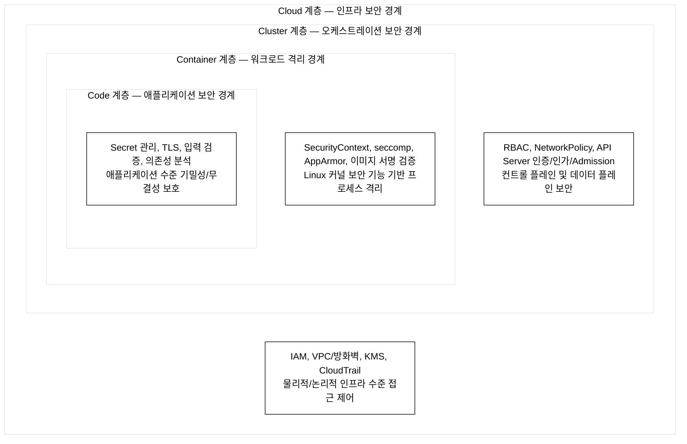
_그림 1. 4C 보안 계층 구조 — 바깥(Cloud)에서 안쪽(Code)으로 향하는 동심원형 심층 방어._

**핵심 원리:** 각 계층은 독립적인 보안 도메인(Security Domain)으로 작동하며, 외부 계층이 침해되더라도 내부 계층의 보안 통제가 추가 방어선을 형성한다. 이것이 **심층 방어(Defense in Depth)** 원칙이며, 단일 장애점(Single Point of Failure)을 제거하는 보안 아키텍처 설계 패턴이다.

**4C 계층 독립 방어 예시:** API Server 인증이 우회되어 `system:unauthenticated` 사용자가 Secret 조회를 시도하는 경우를 보면, (1) Cluster 계층의 RBAC에서 `system:unauthenticated`에는 `secrets:get` 권한이 없으므로 403 거부, (2) etcd는 TLS 클라이언트 인증서가 없으면 직접 접근 불가, (3) etcd 저장 데이터도 Encryption at Rest로 암호화되어 있어 파일을 복사해도 평문 탈취 불가. 단일 계층을 우회해도 나머지 계층이 추가 방어선을 형성한다.

### 1.2 왜 K8s 환경에서 클라우드 네이티브 보안이 더 심각한가?

1.1절에서 경계 보안의 한계를 서술했다. 그 한계가 Kubernetes 환경에서 특히 심각하게 드러나는 이유는 K8s 고유의 구조적 특성에 있다:

1. **동적 IP — IP 기반 방화벽 규칙이 무용지물:** K8s에서 Pod는 재시작할 때마다 새 IP를 받는다. 방화벽 규칙을 `"IP X → IP Y만 허용"`으로 작성하면 다음 재스케줄링 후 즉시 깨진다. K8s는 이 문제를 Label Selector 기반의 NetworkPolicy로 해결한다(`podSelector: {matchLabels: {app: backend}`)로 IP 대신 라벨을 기준으로 트래픽을 제어).

2. **다중 테넌트 클러스터 — 내부 격리 필수:** 여러 팀의 워크로드가 같은 K8s 클러스터에 네임스페이스로 분리되어 실행된다. 방화벽은 클러스터 외부 경계만 보호하므로, 한 팀의 Pod가 탈취되면 같은 클러스터 다른 네임스페이스로의 횡적 이동을 방화벽이 막지 못한다. NetworkPolicy와 RBAC의 네임스페이스 격리가 필수다.

3. **공급망 복잡성 — 의존성 체인의 취약점:** 단일 컨테이너 이미지가 수백 개의 오픈소스 라이브러리를 포함한다. 그 중 하나에 취약점(Log4Shell, 2021)이 있으면 이미지를 재빌드하고 클러스터 전체 Pod를 교체해야 한다. SBOM(Software Bill of Materials, 소프트웨어 구성 목록)과 이미지 스캔이 없으면 영향 범위를 파악조차 불가능하다.

4. **컨트롤 플레인의 단일 공격 표면:** API Server 하나를 탈취하면 클러스터 전체 상태(RBAC, Secret, Pod 스펙)를 읽고 쓸 수 있다. 전통적 보안에서는 서버마다 접근 제어가 분산되지만, K8s는 단일 컨트롤 플레인에 권한이 집중된다.

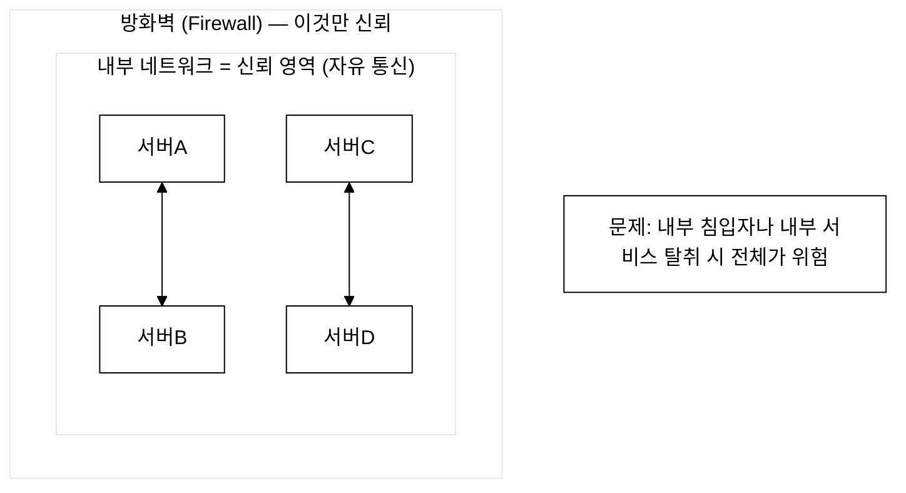
_그림 2. 전통적 경계 중심 보안 — 방화벽 하나에 의존하며 내부는 무조건 신뢰._

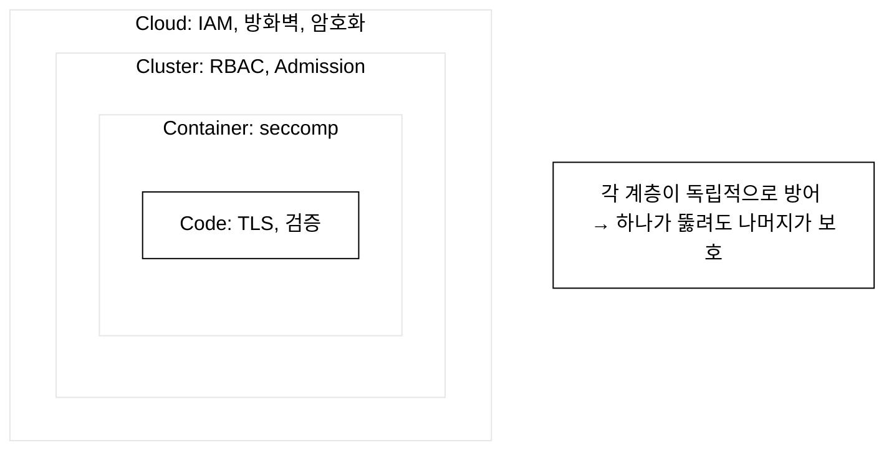
_그림 3. 클라우드 네이티브 심층 방어 — 계층별 독립 통제로 단일 장애점 제거._

---

## 2. 4C 보안 모델 심화

### 2.1 각 계층 상세 설명

#### Cloud 계층 (가장 바깥)

클라우드 제공자가 제공하는 인프라 수준의 보안 경계이다.

**왜 이 계층이 필요한가:** Cluster 계층의 RBAC는 "이미 인증된 사용자" 내에서만 작동한다. 만약 Cloud IAM 설정 오류로 인증 없이 클라우드 API에 접근 가능하다면, 공격자는 RBAC를 우회하고 K8s 클러스터의 VM·스토리지·네트워크 인프라를 직접 조작할 수 있다. Cloud 계층은 Cluster 계층이 그 위에 서 있는 토대(바닥)이므로, 이 토대가 무너지면 상위 계층은 모두 무력화된다.

**이 계층이 침해되면:** 공격자는 K8s 노드 VM에 직접 SSH 접근, etcd 볼륨 스냅샷 탈취, 네트워크 트래픽 가로채기, IAM 역할을 통한 모든 클라우드 리소스 접근이 가능해진다. Cluster·Container·Code 계층의 보안 통제는 모두 의미를 잃는다.

**구체적 사례:** AWS IAM에서 K8s 노드 IAM 역할에 `ec2:DescribeInstances`, `s3:GetObject` 과도한 권한이 부여된 경우, 탈취된 노드의 IMDS(Instance Metadata Service, EC2 인스턴스가 자신의 메타데이터·임시 자격증명을 조회하는 내부 HTTP 엔드포인트)를 통해 임시 IAM 자격증명을 획득하고 다른 AWS 서비스까지 접근할 수 있다.

| 보안 영역 | 구체적 내용 | 도구/서비스 예시 |
|----------|-----------|---------------|
| IAM (Identity & Access Management) | 클라우드 리소스 접근 제어 | AWS IAM, GCP IAM, Azure AD |
| 네트워크 보안 | VPC, 보안 그룹, 방화벽 | AWS VPC, GCP VPC, 서브넷 격리 |
| 데이터 암호화 | 전송 중/저장 시 암호화 | AWS KMS, GCP Cloud KMS |
| 감사 로그 | 클라우드 API 호출 기록 | AWS CloudTrail, GCP Cloud Audit |
| 물리적 보안 | 데이터센터 물리적 접근 제어 | 클라우드 제공자 책임 |
| 컴플라이언스 | 규정 준수 인증 | SOC 2, ISO 27001, HIPAA |

**공유 책임 모델 (Shared Responsibility Model):**
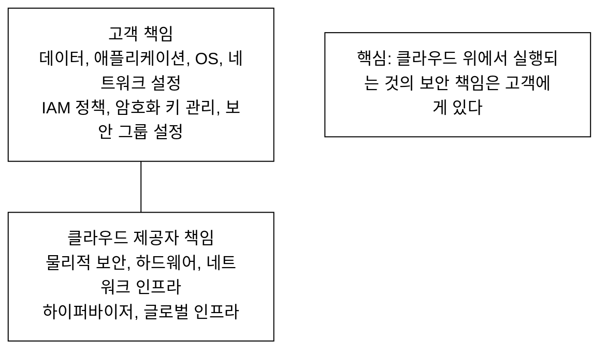
_그림 4. 공유 책임 모델 — 클라우드 위 계층은 고객, 인프라 계층은 제공자 책임._

#### Cluster 계층

Kubernetes 컨트롤 플레인 수준의 보안 경계이다. API Server의 3단계 요청 처리 파이프라인(Authentication → Authorization → Admission Control)이 클러스터 리소스에 대한 모든 접근을 제어한다. 인증되지 않은 요청은 401로 거부되고, 인가되지 않은 요청은 403으로 거부되며, 정책 위반 요청은 Admission Controller에서 차단된다.

**왜 이 계층이 필요한가:** Cloud 계층이 인프라 외부 경계를 보호하지만, 클러스터 내부의 워크로드·사용자·서비스 계정 간 권한을 Cloud IAM으로 제어하기 어렵다. K8s 오브젝트(Pod, Secret, ConfigMap 등)에 대한 세밀한 접근 제어는 Cluster 계층의 RBAC(Role-Based Access Control, 역할 기반 접근 제어)이 담당한다. CNI(Container Network Interface, 컨테이너 네트워크 인터페이스 — K8s 네트워킹 플러그인 표준)를 통해 Pod 간 트래픽을 NetworkPolicy로 제어하는 것도 이 계층의 역할이다.

**이 계층이 침해되면:** API Server 인증이 우회되거나 과도한 RBAC 권한이 부여되면, 공격자가 모든 K8s 오브젝트(Secret 포함)를 읽고 수정할 수 있다. etcd(K8s 분산 키-값 저장소, 클러스터 전체 상태를 저장)에 직접 접근하면 RBAC 정책 자체를 변조할 수 있어 Container·Code 계층 보안이 무력화된다.

| 보안 영역 | 구체적 내용 | 관련 K8s 기능 |
|----------|-----------|-------------|
| API Server 보안 | 인증, 인가, Admission Control | X.509, OIDC, RBAC, PSA |
| etcd 보안 | 저장 데이터 암호화, TLS 통신 | EncryptionConfiguration |
| 네트워크 정책 | Pod 간 통신 제어 | NetworkPolicy, CNI |
| 클러스터 업그레이드 | 보안 패치 적용 | kubeadm upgrade |
| Audit 로깅 | API 요청 기록 | Audit Policy |

#### Container 계층

Linux 커널의 보안 메커니즘을 활용한 프로세스 격리 경계이다. 각 컨테이너는 namespace(프로세스·네트워크·파일시스템 격리), cgroup(리소스 제한), seccomp(시스템 콜 제한), capabilities(커널 기능 토큰) 등 커널 수준의 격리 기능으로 보호된다.

**왜 이 계층이 필요한가:** Cluster 계층의 RBAC는 K8s API 수준에서 Pod 생성·삭제를 제어하지만, Pod가 일단 실행되고 나면 그 내부의 프로세스가 어떤 커널 기능을 사용하는지는 RBAC가 제어하지 못한다. 컨테이너 내부 코드가 취약점을 통해 root 권한을 획득하거나, 호스트 파일시스템에 접근하거나, 다른 컨테이너의 네트워크 트래픽을 가로채려 할 때 이를 막는 것이 Container 계층이다.

**이 계층이 침해되면:** `privileged: true` 컨테이너가 탈취되면 호스트 OS 전체에 접근 가능하다. 컨테이너가 탈출(Container Escape)하면 같은 노드에서 실행 중인 다른 모든 컨테이너와 노드 자체가 위험해진다. AppArmor(Linux 커널의 MAC, 필수 접근 제어 보안 모듈 — 프로세스가 접근할 수 있는 파일·기능을 프로파일로 제한)와 seccomp가 없으면 컨테이너 내 코드가 커널 취약점을 직접 공격할 수 있다.

| 보안 영역 | 구체적 내용 | 관련 설정 |
|----------|-----------|---------|
| 이미지 보안 | 취약점 스캐닝, 서명 검증 | Trivy, Cosign |
| 런타임 보안 | 시스템 콜 제한, MAC | seccomp, AppArmor |
| SecurityContext | 컨테이너 실행 권한 설정 | runAsNonRoot, capabilities |
| 리소스 제한 | CPU/메모리 제한 | resources.limits |
| 최소 이미지 | 불필요한 패키지 제거 | distroless, scratch |

#### Code 계층 (가장 안쪽)

애플리케이션 코드 수준의 보안 경계이다. OWASP Top 10 등 애플리케이션 보안 위협에 대응하는 계층이다.

**왜 이 계층이 필요한가:** Container 계층이 프로세스 격리를 제공하더라도, 애플리케이션 코드 내부의 취약점(SQL Injection, XSS, 인증 결함)은 Container 계층이 막을 수 없다. 또한 데이터베이스 패스워드가 소스 코드에 하드코딩되어 있으면 코드 저장소가 유출됐을 때 자격 증명까지 노출된다. TLS(Transport Layer Security, 전송 계층 보안 프로토콜 — HTTPS, mTLS의 기반)가 없으면 서비스 간 네트워크 트래픽을 평문으로 가로챌 수 있다.

**이 계층이 침해되면:** SQL Injection으로 데이터베이스 전체 덤프가 가능하다. 하드코딩된 자격 증명이 유출되면 클라우드 리소스나 데이터베이스에 직접 접근 가능하다. 의존성 취약점(예: Log4Shell)은 원격 코드 실행으로 이어질 수 있다. 이 공격들은 네트워크 방화벽이나 RBAC가 아닌 코드 레벨에서만 막을 수 있다.

| 보안 영역 | 구체적 내용 | 도구/방법 |
|----------|-----------|---------|
| 시크릿 관리 | 하드코딩 금지, 안전한 저장 | Vault, External Secrets |
| TLS 통신 | 모든 통신 암호화 | cert-manager, Istio mTLS |
| 입력 검증 | SQL Injection, XSS 방어 | 프레임워크 내장 검증 |
| 의존성 관리 | 취약한 라이브러리 탐지 | Snyk, Dependabot |
| SAST/DAST | 정적/동적 보안 분석 | SonarQube, OWASP ZAP |

### 2.2 4C 모델 YAML 연관 예제

각 계층의 보안이 Kubernetes YAML에서 어떻게 표현되는지 살펴본다.

#### 예제 1: Cluster 계층 - NetworkPolicy (기본 거부)

```yaml
# Cluster 계층: 네트워크 격리
# Zero Trust 네트워크 구현: Default Deny 정책으로 명시적 허용 규칙 없는 트래픽을 모두 차단
apiVersion: networking.k8s.io/v1
kind: NetworkPolicy
metadata:
  name: default-deny-all          # 정책 이름
  namespace: production           # 적용할 네임스페이스
spec:
  podSelector: {}                 # {} = 이 네임스페이스의 '모든' Pod에 적용
                                  # 특정 Pod만 선택하려면 matchLabels 사용
  policyTypes:                    # 어떤 방향의 트래픽을 제어할지
    - Ingress                     # 들어오는 트래픽 (수신)
    - Egress                      # 나가는 트래픽 (송신)
  # ingress/egress 규칙이 비어있으면 = 모든 트래픽 차단
  # 이것이 "Default Deny" 전략의 핵심이다
```

**NetworkPolicy 핵심 필드 해석:**

| 필드 | 값 | 의미 |
|:-----|:---|:-----|
| `podSelector: {}` | 빈 셀렉터(공집합) | 네임스페이스 내 **모든** Pod에 정책 적용. `matchLabels`로 특정 Pod만 선택 가능 |
| `policyTypes: [Ingress]` | Ingress만 지정 | **수신(들어오는)** 트래픽만 이 정책이 제어. Egress는 제어 안 함 |
| `policyTypes: [Egress]` | Egress만 지정 | **송신(나가는)** 트래픽만 제어 |
| `policyTypes: [Ingress, Egress]` | 둘 다 지정 | 수신·송신 모두 제어 |
| `ingress: []` (비어있음) | 허용 규칙 없음 | 해당 방향 트래픽을 **모두 차단** (Default Deny 효과) |
| `ingress.from` | 출처 셀렉터 목록 | 어떤 Pod/네임스페이스/IP에서 오는 트래픽을 허용할지 지정 |
| `egress.to` | 목적지 셀렉터 목록 | 어떤 목적지로 나가는 트래픽을 허용할지 지정 |
| `ports.port` | 포트 번호 | 해당 포트의 트래픽만 허용. 지정하지 않으면 모든 포트 허용 |

> **매칭 로직:** `ingress.from` 항목들은 **OR** 조건이다. 한 항목 내에서 `podSelector`와 `namespaceSelector`를 같이 쓰면 **AND** 조건이다. "특정 네임스페이스의 특정 Pod"를 허용하려면 두 셀렉터를 같은 `from` 항목 아래 나란히 써야 한다.

#### 예제 2: Container 계층 - SecurityContext (최소 권한)

```yaml
# Container 계층: 컨테이너 실행 권한 최소화
apiVersion: v1
kind: Pod
metadata:
  name: secure-app
  namespace: production
spec:
  # Pod 레벨 보안 설정 (모든 컨테이너에 적용)
  securityContext:
    runAsNonRoot: true            # root(UID 0)로 실행 금지
                                  # UID 0(root)로 실행되는 프로세스는 Linux capability 검사를 받지 않아
                                  # 제약 없이 모든 커널 기능(파일시스템·네트워크·프로세스 제어)에 접근할 수 있다.
                                  # capability 검사를 우회하므로 권한 상승 공격의 최종 목표가 된다.
    runAsUser: 1000               # UID 1000으로 실행
    runAsGroup: 3000              # GID 3000으로 실행
    fsGroup: 2000                 # 볼륨의 파일 시스템 그룹
    seccompProfile:               # 시스템 콜 제한 프로파일
      type: RuntimeDefault        # 런타임 기본 프로파일 사용
                                  # 허용된 syscall 화이트리스트 외의 시스템 콜을 차단하여 커널 공격 표면을 축소

  automountServiceAccountToken: false  # SA 토큰 자동 마운트 비활성화
                                       # API Server에 접근할 필요 없는 Pod에 필수
                                       # 불필요한 자격 증명 노출을 제거하여 Credential Access 공격 경로를 차단

  containers:
    - name: app
      image: myapp:v1.2.3@sha256:abc123...  # 다이제스트로 이미지 고정
                                              # SHA256 해시로 이미지의 무결성(Integrity)을 보장
                                              # 태그는 mutable하여 동일 태그에 다른 이미지가 매핑될 수 있으므로 위험

      securityContext:
        allowPrivilegeEscalation: false  # 권한 상승 금지
                                          # setuid/setgid 비트를 통한 프로세스 권한 상승(Privilege Escalation)을 차단
        readOnlyRootFilesystem: true     # 루트 파일시스템 읽기 전용
                                          # 런타임에 바이너리 변조나 악성 파일 기록을 방지하여 Tampering 위협에 대응
        capabilities:
          drop:
            - ALL                         # 모든 Linux capability 제거
                                          # Linux capability는 "권한"이 아니라 특정 커널 기능에 대한 접근 토큰이다.
                                          # 예: CAP_NET_RAW = raw socket 생성 기능 접근,
                                          #     CAP_SYS_ADMIN = 마운트·namespace 조작 등 시스템 관리 기능 접근.
                                          # drop: ALL로 이 접근 토큰을 모두 제거하여 최소 기능만 허용한다.
          add:
            - NET_BIND_SERVICE            # 필요한 것만 추가 (1024 미만 포트 바인딩)
                                          # 최소 권한 원칙(Least Privilege)에 따라 필요한 capability만 명시적으로 부여

      resources:                          # 리소스 제한 (DoS 방지)
        requests:
          memory: "64Mi"
          cpu: "100m"
        limits:
          memory: "128Mi"
          cpu: "250m"

      volumeMounts:
        - name: secret-vol
          mountPath: /etc/secrets          # Secret을 파일로 마운트
          readOnly: true                   # 읽기 전용 마운트

  volumes:
    - name: secret-vol
      secret:
        secretName: app-credentials
        defaultMode: 0400                  # 파일 권한: 소유자만 읽기
```

**SecurityContext 핵심 필드 해석:**

| 필드 | 위치 | 의미 |
|:-----|:-----|:-----|
| `runAsUser: 1000` | Pod·Container | 프로세스 실행 UID. Container 레벨이 Pod 레벨을 **재정의**한다 |
| `runAsGroup: 3000` | Pod·Container | 프로세스 실행 GID. 파일 접근 권한 그룹 |
| `fsGroup: 2000` | Pod만 | Pod 내 컨테이너들이 **공유 볼륨**을 접근할 때 적용되는 파일시스템 그룹 ID. 볼륨 파일의 GID를 이 값으로 설정하여 여러 컨테이너가 같은 볼륨을 올바른 권한으로 읽고 쓸 수 있게 한다 |
| `runAsNonRoot: true` | Pod·Container | UID 0으로 실행 시 Pod 시작 자체를 거부 |
| `allowPrivilegeEscalation: false` | Container만 | `setuid`/`setgid` 비트를 통한 프로세스 권한 상승 차단 |
| `readOnlyRootFilesystem: true` | Container만 | 컨테이너 루트 파일시스템을 읽기 전용 마운트. 런타임 바이너리 변조 방지 |

**Pod 레벨 vs Container 레벨 우선순위:**
Pod 레벨의 `securityContext`는 모든 컨테이너에 기본값으로 적용된다. Container 레벨에서 동일 필드를 재지정하면 그 컨테이너에 한해 Container 레벨이 우선된다.
예: Pod에서 `runAsUser: 1000`이고 특정 컨테이너에서 `runAsUser: 2000`이면, 그 컨테이너만 UID 2000으로 실행되고 나머지 컨테이너는 UID 1000으로 실행된다.

**seccompProfile 타입 비교:**

| 타입 | 동작 | 용도 |
|:-----|:-----|:-----|
| `RuntimeDefault` | 컨테이너 런타임(containerd/cri-o)이 제공하는 기본 허용 syscall 화이트리스트 적용 | 일반 워크로드 권장 |
| `Localhost` | 노드에 직접 배치한 커스텀 seccomp JSON 프로파일 적용 | 특정 syscall 세밀 제어 필요 시 |
| `Unconfined` | syscall 제한 없음(기본값, 설정 안 한 것과 동일) | 보안 취약, 레거시 호환 외 미사용 |

> **seccomp(Secure Computing Mode):** Linux 커널 기능으로, 프로세스가 호출할 수 있는 시스템 콜(syscall)을 제한한다. `RuntimeDefault`는 컨테이너 실행에 불필요한 `ptrace`, `mount`, `unshare` 같은 고위험 syscall을 차단하여 커널 익스플로잇 공격 표면을 줄인다.

#### 예제 3: Cluster 계층 - RBAC (최소 권한)

```yaml
# 읽기 전용 Role 정의
apiVersion: rbac.authorization.k8s.io/v1
kind: Role
metadata:
  namespace: production           # 이 네임스페이스에서만 유효
  name: pod-reader                # Role 이름
rules:
  - apiGroups: [""]               # "" = core API 그룹 (Pod, Service, Secret 등)
                                  # apps, networking.k8s.io 등 다른 그룹도 있음
    resources: ["pods"]           # 접근할 리소스 종류
    verbs: ["get", "list", "watch"]  # 허용할 동작 (읽기만)
                                     # create, update, delete는 포함하지 않음
  - apiGroups: [""]
    resources: ["pods/log"]       # Pod 로그 조회 (하위 리소스)
    verbs: ["get"]
---
# Role을 ServiceAccount에 바인딩
apiVersion: rbac.authorization.k8s.io/v1
kind: RoleBinding
metadata:
  name: read-pods
  namespace: production           # Role과 같은 네임스페이스
subjects:                         # 누구에게 권한을 부여할지
  - kind: ServiceAccount          # ServiceAccount, User, Group 가능
    name: monitoring-sa           # SA 이름
    namespace: production         # SA가 있는 네임스페이스
roleRef:                          # 어떤 Role을 바인딩할지
  kind: Role                     # Role 또는 ClusterRole
  name: pod-reader               # 위에서 정의한 Role
  apiGroup: rbac.authorization.k8s.io
```

#### 예제 4: Code 계층 - Secret 관리

```yaml
# Secret 생성 (Base64 인코딩 - 암호화가 아님!)
apiVersion: v1
kind: Secret
metadata:
  name: app-credentials
  namespace: production
type: Opaque                      # 일반 시크릿 (다른 타입: kubernetes.io/tls 등)
data:
  # Base64 인코딩된 값
  # echo -n 'mypassword' | base64 → bXlwYXNzd29yZA==
  # 주의: Base64는 누구나 디코딩 가능! 암호화가 아니다!
  password: bXlwYXNzd29yZA==
  api-key: c2VjcmV0LWtleS0xMjM=
# stringData를 사용하면 평문으로 작성 가능 (K8s가 자동 인코딩)
# stringData:
#   password: mypassword
```

#### 예제 5: Encryption at Rest 설정

```yaml
# etcd에 저장되는 Secret을 암호화하는 설정
# API Server의 --encryption-provider-config 플래그로 지정
apiVersion: apiserver.config.k8s.io/v1
kind: EncryptionConfiguration
resources:
  - resources:                    # 암호화할 리소스 목록
      - secrets                   # Secret 리소스를 암호화
      - configmaps                # ConfigMap도 암호화 가능
    providers:                    # 암호화 프로바이더 (순서 중요!)
      - aescbc:                   # 첫 번째 프로바이더로 새 데이터 암호화
          keys:
            - name: key1          # 키 이름 (로테이션 시 식별용)
              secret: <base64-encoded-32-byte-key>  # 256비트 키
      - identity: {}              # 두 번째: 기존 평문 데이터 읽기용
                                  # 암호화되지 않은 기존 데이터를 읽을 수 있게 함
# 프로바이더 순서의 의미:
# - 첫 번째 프로바이더: 새로 저장되는 데이터 암호화에 사용
# - 나머지 프로바이더: 기존 데이터 복호화에 사용
#
# 프로덕션 권장: kms v2 (외부 KMS 사용)
# 로컬 권장: secretbox (aescbc보다 빠르고 안전한 현대적 대칭 암호화)
```

**암호화 프로바이더 비교:**

| 프로바이더 | 키 관리 | 특징 | 권장 환경 |
|:----------|:--------|:-----|:---------|
| `identity` | 없음(평문) | 암호화 없이 저장. 기존 평문 데이터 읽기 호환용 | 암호화 미적용 상태 하위 호환 |
| `aescbc` | 로컬 키(config 파일) | AES-256-CBC 암호화. 키를 config 파일에 직접 관리 | 간단한 로컬 환경, 키 로테이션 수동 |
| `secretbox` | 로컬 키(config 파일) | 현대적 대칭 암호화 알고리즘 적용. aescbc보다 빠르고 authenticated encryption 제공 | 로컬 환경 권장(aescbc 대비 개선) |
| `kms v2` | 외부 KMS 연동 | AWS KMS·GCP Cloud KMS·HashiCorp Vault 등 외부 키 관리 서비스 사용. DEK(Data Encryption Key)를 KMS가 래핑·언래핑. 키 로테이션 자동화, 감사 추적 가능 | 프로덕션 권장 |

> **왜 kms v2가 프로덕션 권장인가:** `aescbc`·`secretbox`는 암호화 키가 API Server config 파일에 저장된다. 이 파일이 유출되면 암호화된 데이터도 즉시 복호화된다. `kms v2`는 키를 외부 KMS에서 관리하므로 API Server config 파일과 etcd 데이터를 모두 탈취해도 KMS 접근 없이는 복호화가 불가능하다.

**Encryption at Rest 마이그레이션 절차 — 기존 평문 Secret이 있는 클러스터에 적용하는 방법:**

EncryptionConfiguration을 처음 적용할 때 흔한 실수는 "설정하면 기존 데이터도 자동으로 암호화된다"고 오해하는 것이다. 실제로는 설정 이후 새로 저장되는 데이터만 암호화되며, 기존 평문 데이터는 여전히 평문으로 남는다. 완전한 암호화 전환을 위해서는 다음 절차를 따른다.

1. **identity를 두 번째에 배치한 설정으로 시작한다:** 예제 5처럼 `providers` 배열에 `aescbc`를 첫 번째, `identity: {}`를 두 번째로 배치하고 API Server를 재시작한다. 이 상태에서 새 데이터는 aescbc로 암호화되고, 기존 평문 데이터는 `identity` 프로바이더로 읽힌다.

2. **API Server 재시작 완료를 확인한다:** 재시작 후 `kubectl get secrets -A` 가 정상 동작하는지 확인한다. 오류가 나면 API Server 로그에서 EncryptionConfiguration 파싱 오류를 점검한다.

3. **기존 Secret을 강제로 다시 쓴다(re-encrypt):** 다음 명령으로 모든 네임스페이스의 Secret을 etcd에서 읽어 다시 쓰면, 첫 번째 프로바이더(aescbc)로 암호화되어 저장된다.

```bash
kubectl get secrets --all-namespaces -o json | kubectl replace -f -
```

4. **암호화 적용 확인:** etcd에서 직접 데이터를 읽어 암호화 여부를 확인한다. 암호화된 데이터는 `k8s:enc:aescbc:v1:` 같은 접두사로 시작한다.

```bash
# staging 클러스터의 dev-master 노드에서 실행 (ssh dev-master 로 접속 후)
ETCDCTL_API=3 etcdctl \
  --endpoints=https://127.0.0.1:2379 \
  --cacert=/etc/kubernetes/pki/etcd/ca.crt \
  --cert=/etc/kubernetes/pki/etcd/server.crt \
  --key=/etc/kubernetes/pki/etcd/server.key \
  get /registry/secrets/default/app-credentials | hexdump -C | head -5
# 암호화된 경우: 출력에 k8s:enc:aescbc 문자열이 보인다
# 평문인 경우: Secret 내용이 Base64 텍스트로 그대로 보인다
```

5. **마이그레이션 완료 후 identity 제거:** 모든 Secret이 암호화됐음을 확인한 뒤 `identity: {}` 항목을 providers 배열에서 제거하고 API Server를 재시작한다. 이후에는 평문 데이터 읽기가 불가능해지므로, 미처 재암호화하지 못한 Secret이 있으면 접근 불가 오류가 발생한다. 3단계를 반드시 먼저 완료한다.

---

## 3. 공격 표면(Attack Surface) 심화

### 3.1 Kubernetes 공격 표면 전체 지도

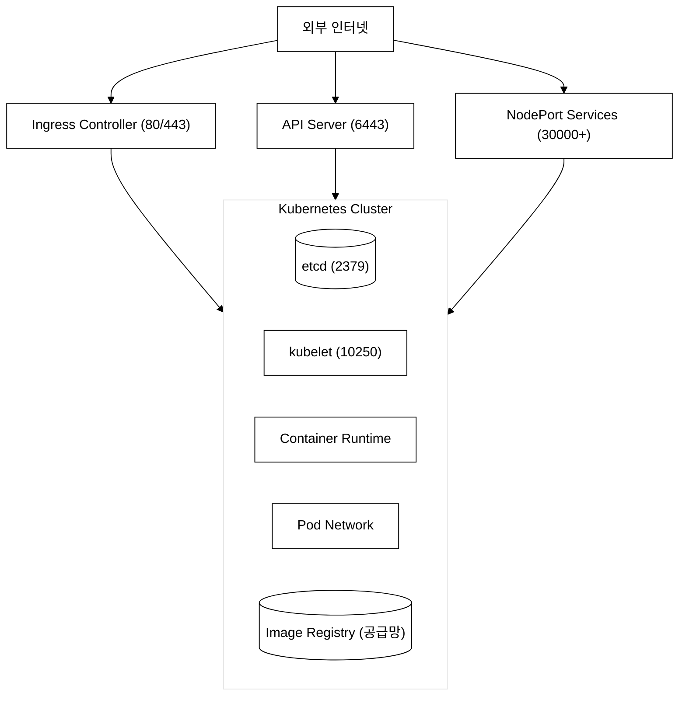
_그림 5. Kubernetes 공격 표면 지도 — 각 외부 진입점과 클러스터 내부 구성요소가 공격 표면을 형성._

### 3.2 주요 공격 표면 상세

#### API Server (포트 6443)

```
공격 시나리오:

1. 공격자가 노출된 API Server 발견
2. anonymous-auth=true이면 인증 없이 접근 가능
3. system:anonymous에 과도한 권한이 있으면 정보 탈취

방어:
--anonymous-auth=false           # 익명 접근 차단
--authorization-mode=Node,RBAC   # RBAC으로 인가
--enable-admission-plugins=NodeRestriction,PodSecurity  # Admission 검증
```

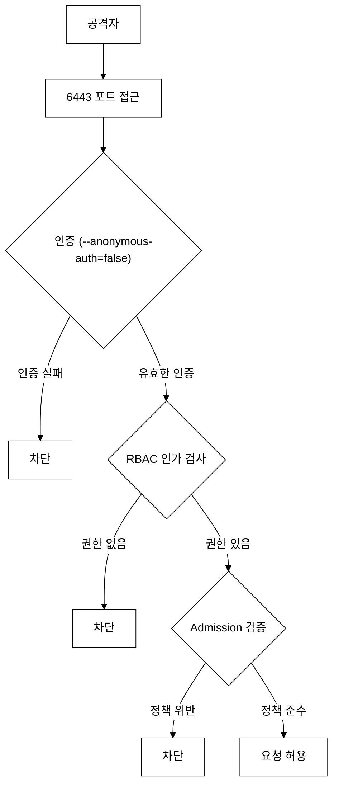
_그림 6. API Server 요청 처리 파이프라인 — 인증·인가·Admission 3단계에서 비인가 요청을 차단._

#### etcd (포트 2379/2380)

etcd는 K8s 클러스터의 모든 상태 데이터(Pod 스펙, Secret, ConfigMap, RBAC 정책, 서비스 계정 등)를 저장하는 분산 키-값 저장소다. Raft(분산 합의 알고리즘 — 리더 선출과 로그 복제를 통해 데이터 일관성을 보장) 알고리즘으로 고가용성을 유지한다. etcd 포트 2379는 클라이언트(API Server) 접근용, 2380은 etcd 피어 간 통신용이다.

**왜 etcd가 최고 위험 공격 표면인가:**

API Server는 etcd에서 데이터를 읽어 K8s 오브젝트를 반환한다. etcd 포트 2379는 API Server만 접근해야 한다. 만약 TLS 없이 외부에서 etcd에 직접 접근하면 다음이 가능하다:
- (1) 전체 Secret을 평문으로 다운로드 — `etcdctl get /registry/secrets/production/db-password` 형태로 모든 네임스페이스의 Secret을 나열 가능
- (2) 잘못된 데이터 삽입으로 Pod 스펙·RBAC 정책 변조 — 공격자가 자신에게 cluster-admin 역할을 부여하는 RoleBinding을 직접 etcd에 쓸 수 있다
- (3) RBAC 정책을 평문으로 읽어 권한 구조 파악 후 권한 상승 경로 설계 가능

**Secret의 기본 저장 방식:** K8s는 Secret을 기본적으로 etcd에 Base64 인코딩된 평문으로 저장한다. Base64는 암호화가 아니므로, etcd 접근 권한만 있으면 즉시 디코딩 가능하다.

```
공격 시나리오:

1. etcd가 네트워크에 직접 노출됨 (방화벽·VPC 격리 없음)
2. TLS 클라이언트 인증서 미설정으로 인증 없이 접근 가능
3. 공격자가 etcdctl로 /registry/secrets 하위 모든 키를 열람·변조

방어:
- etcd를 API Server만 접근 가능한 별도 보안 네트워크에 격리
- 클라이언트 인증서 요구 (--client-cert-auth=true, --trusted-ca-file 설정)
- TLS 통신 강제 (--cert-file, --key-file 설정)
- Encryption at Rest 설정 (예제 5 참조) — 저장 시 암호화로 etcd 파일 직접 접근해도 평문 탈취 불가

위험도 평가:
[최고 위험] etcd = 클러스터의 "상태 저장소"
            모든 Secret, 설정, RBAC 정책, 상태 데이터가 저장됨
            etcd가 탈취되면 = K8s 보안 통제 전체가 무력화된 것
```

#### kubelet (포트 10250/10255)

```
공격 시나리오:

1. kubelet의 읽기 전용 포트(10255) 노출
2. 인증 없이 노드의 Pod 정보, 환경 변수 조회 가능
3. 10250 포트에 인증 없이 접근하면 Pod에서 명령 실행 가능

방어:
--anonymous-auth=false            # 익명 접근 차단
--authorization-mode=Webhook      # API Server에 인가 위임
--read-only-port=0                # 10255 포트 비활성화

포트 비교:
10250: HTTPS, 인증 필요 → 보안 포트
10255: HTTP, 인증 없음 → 위험! 반드시 비활성화
```

#### 컨테이너 이미지 (공급망)

**공급망 공격(Supply Chain Attack)이 발생하는 구체적 경로:**

개발자가 `docker pull alpine:latest`를 실행하면, 레지스트리의 `latest` 태그가 현재 어떤 이미지 다이제스트를 가리키는지 자동으로 검증하지 않는다. 공격자가 이를 악용하는 경로는 다음과 같다:

- **태그 하이재킹:** 레지스트리 계정을 탈취하거나 레지스트리 자체를 침해하여 `latest` 태그를 악성 이미지로 재지정한다. 개발자는 동일한 명령을 실행하지만 전혀 다른 이미지를 받게 된다.
- **타이포스쿼팅(Typosquatting):** 인기 있는 이미지 이름과 유사한 악성 이미지를 레지스트리에 등록한다. 예: `alpine` 대신 `alpne`, `node` 대신 `nod3`. 개발자가 이름을 오타로 입력하면 악성 이미지를 pull하게 된다.
- **의존성 혼동(Dependency Confusion):** 내부 레지스트리에 있는 패키지와 같은 이름의 악성 패키지를 공개 레지스트리에 더 높은 버전으로 올리면, 빌드 도구가 공개 레지스트리의 악성 버전을 우선 설치하는 경우가 있다.

```
공격 시나리오 (공급망 공격):

1. 공격자가 인기 있는 베이스 이미지에 백도어 삽입 (계정 탈취 또는 타이포스쿼팅)
2. 개발자가 해당 이미지를 사용하여 애플리케이션 빌드
3. 프로덕션에 배포 → 백도어 실행

방어:
- 신뢰할 수 있는 레지스트리만 사용 (프라이빗 레지스트리)
- 이미지 서명 검증 (Cosign)
- 이미지 스캐닝 (Trivy)
- SBOM 생성 및 관리
- Admission Webhook으로 미서명/미스캔 이미지 차단
```

**스캔·서명·검증의 책임 주체:**

| 단계 | 담당 | 방법 |
|:-----|:-----|:-----|
| 빌드 시 스캔 | 개발 팀 / CI Pipeline | Trivy로 CVE 취약점 스캔, 기준 이상 심각도 발견 시 빌드 실패 |
| 서명 | 개발 팀 / CI Pipeline | Cosign으로 이미지 서명 후 레지스트리 푸시 |
| 배포 시 검증 | 클러스터 운영 팀 | Admission Webhook이 서명 유효성·스캔 정책 확인 후 배포 허용/거부 |

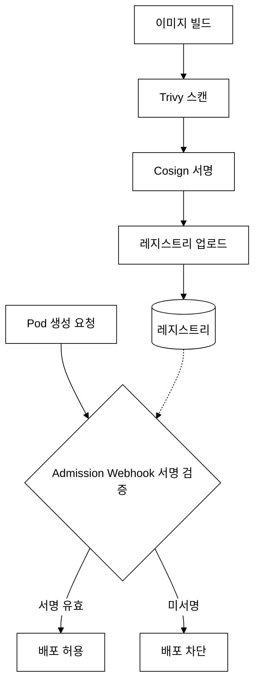
_그림 7. 공급망 보안 흐름 — 빌드 시 스캔·서명, 배포 시 Admission Webhook으로 검증._

---

## 4. 위협 모델링 — STRIDE 심화

### 4.0 STRIDE 등장 배경

1990년대 이전의 보안 위협 분석은 ad-hoc 방식이었다. 개발자가 떠오르는 위협을 제각각 나열하는 방식으로, 동일한 시스템을 분석해도 팀마다 완전히 다른 목록이 나왔고 중요한 위협 유형 전체를 체계적으로 빠짐없이 다루는 공통 언어가 없었다.

Microsoft는 1999년 Windows 제품군의 보안 설계 리뷰를 표준화하기 위해 STRIDE를 개발했다. Loren Kohnfelder와 Praerit Garg가 내부 문서로 작성한 것이 시작이며, 이후 SDL(Security Development Lifecycle)의 핵심 도구로 공개됐다. STRIDE의 핵심 가치는 위협을 6개 직교(독립적이고 서로 겹치지 않는) 범주로 분류해 "이 6가지를 모두 검토했다면 주요 위협은 빠뜨리지 않았다"는 체계적 완결성을 제공한다는 점이다.

**다른 위협 모델링 방법론과 비교:**

| 방법론 | 개발 주체 | 특징 | K8s 적합성 |
|:-------|:---------|:-----|:----------|
| **STRIDE** | Microsoft (1999) | 위협 유형 분류 중심. 체계적이고 적용이 쉬움 | 높음 — 보안 시험·설계 리뷰에서 표준으로 사용 |
| **PASTA** | OWASP (2012) | 공격자 관점 7단계 프로세스. 비즈니스 위험과 연계 | 중간 — 엔터프라이즈 위험 관리에 적합 |
| **VAST** | ThreatModeler (2015) | 대규모 Agile 환경 자동화 지향 | 낮음 — 도구 종속성이 높음 |

**K8s 환경에 STRIDE가 적합한 이유:** K8s 클러스터에는 STRIDE 6가지 위협이 모두 구체적으로 존재한다. ServiceAccount 토큰 탈취(S), etcd 변조(T), Audit Log 미설정(R), Secret 평문 저장(I), 리소스 쿼터 미설정(D), privileged 컨테이너(E). 이 6범주를 외우면 설계·심사 시 어떤 K8s 보안 통제가 빠졌는지 빠르게 점검할 수 있다.

**트레이드오프:** STRIDE는 위협 유형 분류에 집중하므로 "이 위협이 발생할 확률은 얼마인가", "비즈니스 피해 금액은 얼마인가" 같은 위험 정량화를 제공하지 않는다. CVSS(Common Vulnerability Scoring System, 취약점 공통 평가 시스템 — 0~10 점수로 심각도 수치화) 같은 별도 도구와 함께 사용해 우선순위를 정해야 한다.

### 4.1 STRIDE 각 위협 유형 상세 설명

#### S - Spoofing (위장)

```
정의: 인증 메커니즘을 우회하거나 타 주체(Subject)의 자격 증명을 도용하여
      시스템에 비인가 접근하는 공격 기법이다.

Kubernetes 예시:
1. 탈취한 ServiceAccount 토큰으로 API Server에 접근
2. 가짜 인증서로 kubelet 통신 가로채기
3. Pod가 다른 서비스의 ServiceAccount를 사용

Attack Chain — SA 토큰 탈취 공격:
  [전제 조건] Pod에 automountServiceAccountToken이 활성화(기본값 true)
  [저장 위치] K8s가 /var/run/secrets/kubernetes.io/serviceaccount/token 경로에
              SA 토큰을 자동 마운트
  [공격 단계] 공격자가 애플리케이션 취약점(RCE 등)으로 컨테이너 셸 접근 →
              cat /var/run/secrets/kubernetes.io/serviceaccount/token 로 토큰 읽기 →
              해당 토큰으로 API Server에 인증하여 RBAC 권한대로 오브젝트 조작
  [결과] 그 ServiceAccount의 RBAC 권한이 넓으면 다른 Pod 조작·Secret 탈취 가능
  [방어] automountServiceAccountToken: false로 필요 없는 Pod에 토큰 마운트 자체를 차단

대응 방법:
- 강력한 인증 메커니즘 (X.509, OIDC)
- SA 토큰 만료 시간 설정 (Bound Token)
- mTLS로 서비스 간 상호 인증
- automountServiceAccountToken: false
```

#### T - Tampering (변조)

```
정의: 전송 중(In-Transit) 또는 저장 중(At-Rest)인 데이터의 무결성(Integrity)을
      침해하여 시스템 상태나 구성을 비인가로 수정하는 공격이다.

Kubernetes 예시:
1. etcd 데이터를 직접 수정하여 RBAC 정책 변조
2. 컨테이너 이미지를 변조하여 악성 코드 삽입
3. ConfigMap/Secret을 무단으로 수정

대응 방법:
- etcd TLS 통신 + Encryption at Rest
- 이미지 서명 (Cosign) + 다이제스트 사용
- RBAC로 ConfigMap/Secret 수정 권한 제한
- Admission Webhook으로 정책 준수 강제
```

#### R - Repudiation (부인)

```
정의: 감사 추적(Audit Trail)이 부재하여 특정 주체의 행위를 사후에 증명할 수 없는
      보안 취약점이다. 비부인성(Non-Repudiation) 통제가 없으면 악의적 행위의 추적과 포렌식이 불가능하다.

Kubernetes 예시:
1. Audit Log 없이 Secret을 조회/삭제한 후 행위를 부인
2. RBAC 변경 이력이 없어 누가 권한을 변경했는지 추적 불가

대응 방법:
- Kubernetes Audit Logging 활성화
- 감사 로그를 외부 불변 저장소에 보관 (Loki, Elasticsearch)
- 모든 변경을 GitOps로 추적 (ArgoCD)
```

#### I - Information Disclosure (정보 노출)

```
정의: 기밀성(Confidentiality)이 침해되어 비인가 주체에게 민감 데이터가 노출되는 위협이다.
      접근 제어 미비, 암호화 부재, 부적절한 에러 처리 등이 원인이 된다.

Kubernetes 예시:
1. Secret이 etcd에 평문으로 저장되어 노출
2. 환경 변수로 전달된 Secret이 로그에 기록
3. kubelet 10255 포트를 통해 Pod 정보 노출
4. 에러 메시지에 내부 구조 정보 포함

대응 방법:
- Encryption at Rest로 etcd 데이터 암호화
- Secret은 환경 변수 대신 Volume 마운트
- 읽기 전용 포트 비활성화
- RBAC로 Secret 접근 권한 최소화
```

#### D - Denial of Service (서비스 거부)

```
정의: 시스템의 가용성(Availability)을 침해하여 정상 사용자의 서비스 접근을 방해하는 공격이다.
      리소스 고갈(Resource Exhaustion), 대량 요청(Flooding) 등의 기법이 사용된다.

Kubernetes 예시:
1. 리소스 제한 없는 Pod가 노드의 CPU/메모리를 모두 소진
2. API Server에 대량의 요청을 보내 과부하
3. etcd 저장 공간 고갈
4. CrashLoopBackOff Pod가 대량의 로그 생성

대응 방법:
- ResourceQuota로 네임스페이스 리소스 총량 제한
- LimitRange로 Pod/Container 리소스 기본값/최대값 설정
- API Server Rate Limiting
- Pod Priority와 Preemption 설정
```

#### E - Elevation of Privilege (권한 상승)

```
정의: 낮은 권한의 주체가 시스템 취약점이나 설정 오류를 악용하여 상위 권한을 획득하는 공격이다.
      수직적 권한 상승(Vertical Escalation)과 수평적 권한 이동(Lateral Movement)이 포함된다.

Kubernetes 예시:
1. privileged: true 컨테이너에서 호스트 탈출
2. hostPath로 호스트의 /etc/shadow 접근
3. SA 토큰 탈취 후 RBAC 권한 상승
4. 컨테이너에서 Docker 소켓(/var/run/docker.sock) 접근하여 새 컨테이너 생성

Attack Chain — Docker 소켓을 통한 호스트 탈출:
  [전제 조건] Pod에 hostPath로 /var/run/docker.sock이 마운트됨
  [공격 단계] 공격자가 컨테이너 내부에서 docker 명령 실행 →
              docker run -v /:/host --privileged ubuntu chroot /host 로
              호스트 파일시스템을 루트로 마운트한 새 컨테이너 생성 →
              호스트 OS 전체에 root로 접근
  [결과] 노드의 모든 컨테이너·파일·네트워크에 접근 가능. 클러스터 전체 탈취 경로
  [주의] containerd/CRI-O 환경에서는 /var/run/docker.sock 대신
         /run/containerd/containerd.sock 또는 /run/crio/crio.sock이 동일한 위험을 가진다

PSA(Pod Security Admission, K8s 1.25+에서 PSP를 대체한 빌트인 Pod 보안 정책 어드미션 컨트롤러):
  Restricted 레벨은 hostPath 마운트, privileged, hostNetwork 등을 모두 거부하여
  이 공격 경로 자체를 차단한다.

**PSP → PSA 전환 배경:**

PSP(PodSecurityPolicy)는 K8s 1.3에서 도입된 클러스터 수준 Pod 보안 정책으로, `privileged: true`나 `hostPath` 마운트 같은 위험한 설정을 Admission 단계에서 차단하는 최초의 빌트인 메커니즘이었다. 그러나 다음 세 가지 구조적 한계로 인해 K8s 1.21에서 deprecated, 1.25에서 완전 제거됐다.

1. **Admission Controller 직접 구현 필요:** PSP 자체만으로는 동작하지 않는다. 관리자가 별도로 Admission Controller를 활성화하고, PSP 객체를 생성하고, PSP를 사용할 ServiceAccount에 RBAC 규칙을 일일이 설정해야 했다. 이 3단계 설정이 얽혀 오류가 빈번했다.
2. **Audit/Warn 모드 없음:** PSP는 위반 즉시 거부(enforce)만 가능했다. 기존 클러스터에 PSP를 도입하면 운영 중인 Pod가 갑자기 차단될 수 있어, 점진적 마이그레이션이 불가능했다.
3. **ClusterAdmin 기본 권한 과도함:** ClusterAdmin은 모든 PSP를 사용할 수 있어 클러스터 관리자는 사실상 PSP의 보호를 받지 않았다.

PSA는 이 한계를 다음과 같이 해결한다.

- **빌트인(별도 설치 불필요):** K8s 1.22부터 기본 활성화되는 Admission Controller다.
- **3개 표준 레벨:** `Privileged`(제한 없음), `Baseline`(최소한의 알려진 권한 상승 차단), `Restricted`(엄격한 보안 모범 사례 강제) — 미리 정의된 레벨을 네임스페이스 레이블 하나로 적용한다.
- **3개 모드:** `enforce`(차단), `audit`(감사 로그 기록만), `warn`(경고만) — 기존 워크로드를 끊지 않고 점진적으로 적용 가능하다.

**PSA 트레이드오프:** PSA는 미리 정의된 3개 레벨 외의 세밀한 커스텀 정책을 지원하지 않는다. "이 Pod는 `CAP_NET_RAW`만 허용하고 나머지는 제한한다"처럼 세밀한 제어가 필요하면 OPA/Gatekeeper나 Kyverno(K8s 네이티브 정책 엔진) 같은 외부 도구가 필요하다. PSA는 "기준선 방어"를 빌트인으로 제공하고, 세밀한 제어는 외부 정책 엔진에 위임하는 역할 분리 모델이다.

대응 방법:
- Pod Security Standards (Restricted 레벨) — PSA로 hostPath·privileged 차단
- seccomp 프로파일 적용
- capabilities.drop: ["ALL"]
- RBAC에서 escalate, bind verb 제한
```

### 4.2 STRIDE를 Kubernetes에 매핑한 종합표

```yaml
# STRIDE 위협 매핑 참조 표
# 시험에서 "~는 STRIDE의 어떤 위협에 해당하는가?" 형태로 출제

Spoofing:
  - SA 토큰 탈취 → API 접근
  - 가짜 인증서 사용
  - Pod의 SA 위조
  대응: "인증 강화" 키워드

Tampering:
  - etcd 데이터 변조
  - 이미지 변조
  - ConfigMap/Secret 무단 수정
  대응: "무결성 검증, 서명" 키워드

Repudiation:
  - 감사 로그 없이 행위 부인
  - 변경 이력 미추적
  대응: "Audit Logging, 추적" 키워드

Information_Disclosure:
  - Secret 평문 저장/노출
  - 로그에 민감 정보
  - kubelet 10255 포트
  대응: "암호화, 접근 제한" 키워드

Denial_of_Service:
  - 리소스 고갈
  - API Server 과부하
  대응: "ResourceQuota, LimitRange" 키워드

Elevation_of_Privilege:
  - privileged 컨테이너
  - hostPath 마운트
  - 컨테이너 탈출
  대응: "PSS, seccomp, 최소 권한" 키워드
```

---

## 5. CNCF Security TAG 심화

### 5.0 CNCF Security TAG 등장 배경

CNCF 초기(2016년 전후)에는 보안 기준이 없었다. Kubernetes, Prometheus, Envoy 등 수십 개의 CNCF 프로젝트가 각자의 방식으로 보안 설계를 하거나 하지 않았다. 보안 취약점이 발견되어도 대응 방식이 프로젝트마다 달랐고, "이 프로젝트는 프로덕션에서 얼마나 안전한가"를 평가하는 공통 기준이 없었다.

2019년 CNCF는 이 문제를 해결하기 위해 TAG Security(Technical Advisory Group for Security)를 구성했다. 핵심 역할은 두 가지다. 첫째, CNCF 전체에서 공통으로 사용할 보안 백서·위협 모델·모범 사례를 작성한다. 둘째, CNCF 프로젝트가 Incubating → Graduated로 승급할 때 외부 보안 감사를 의뢰·검토한다. 이전에는 각 프로젝트가 자체적으로 "안전하다"고 주장했지만, TAG Security 이후에는 독립적인 보안 심사 결과가 공개된다.

**TAG 체계의 트레이드오프:** TAG의 보안 감사·표준화는 대규모 자원이 있는 Graduated 프로젝트에는 잘 동작하지만, 수백 개의 Sandbox 프로젝트에는 감사가 닿지 않는다. 또한 보안 백서와 표준은 수십 명의 전문가가 합의하는 과정을 거치므로 새 기술이 등장해도 표준 반영까지 시간이 걸린다. 프로젝트마다 보안 품질 편차가 발생하는 이유다.

### 5.1 CNCF Security TAG의 역할

**CNCF, TAG, 프로젝트의 계층 관계:**

CNCF(Cloud Native Computing Foundation)는 클라우드 네이티브 오픈소스 기술의 표준화·보급을 담당하는 재단이다. Linux Foundation 산하에 있으며, Kubernetes·Prometheus·Envoy 등 수백 개의 프로젝트를 호스팅한다.

TAG(Technical Advisory Group, 기술 자문 그룹)는 CNCF 산하의 도메인별 전문 그룹이다. Security, Storage, Networking, Runtime, App Delivery, Observability 등 여러 TAG가 존재한다. 각 TAG는 해당 도메인의 표준·모범 사례를 정의하고, CNCF 프로젝트를 기술적으로 평가·지원한다.

Security TAG는 클라우드 네이티브 환경의 보안 표준·모범 사례·위협 모델을 정의하고, CNCF 보안 프로젝트들을 기술적으로 평가하는 그룹이다.

**CNCF 프로젝트 성숙도 단계:**

| 단계 | 의미 | 특징 |
|:-----|:-----|:-----|
| **Sandbox** | 초기 단계, 실험적 | 아직 프로덕션 사용 미권장, 커뮤니티 탐색 중 |
| **Incubating** | 활발히 개발 중 | 프로덕션 사용 사례 있음, 보안 자기평가 완료 |
| **Graduated** | 프로덕션 성숙도 | 보안 외부 감사 통과, 넓은 채택 기반, 높은 안정성 |

졸업(Graduated) 프로젝트는 CNCF가 의뢰한 외부 보안 감사(Security Audit)를 통과해야 하며, 넓은 사용자 기반과 명확한 거버넌스를 갖춰야 한다. Incubating 단계는 보안 자기평가(Self-Assessment)만 요구한다.

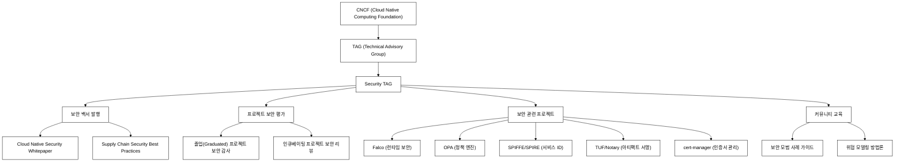
_그림 8. CNCF Security TAG의 역할 구조 — 백서 발행, 보안 평가, 프로젝트, 교육._

### 5.2 주요 CNCF 보안 프로젝트

| 프로젝트 | 상태 | 역할 | 핵심 키워드 |
|---------|------|------|-----------|
| **Falco** | Graduated | 런타임 보안 모니터링 | eBPF(커널을 재컴파일 없이 프로그래밍하는 커널 기술 — 시스템 콜 추적에 활용), 시스템 콜, 이상 탐지 |
| **OPA** | Graduated | 범용 정책 엔진 | Rego(OPA 정책 언어), Gatekeeper(K8s Admission Controller로 OPA를 통합한 프로젝트), Admission |
| **TUF** | Graduated | 업데이트 프레임워크 | 안전한 소프트웨어 배포 |
| **SPIFFE/SPIRE** | Incubating | 서비스 아이덴티티 | 워크로드 인증, SVID |
| **Notary** | Incubating | 아티팩트 서명 | 이미지 무결성, 서명 검증 |
| **cert-manager** | Incubating | 인증서 자동 관리 | Let's Encrypt, X.509 |
| **Kyverno** | Incubating | K8s 네이티브 정책 엔진 | YAML 기반 정책 |

---

## 6. Zero Trust 보안 모델 심화

### 6.1 Zero Trust의 핵심 원칙

```
Zero Trust Architecture(ZTA)는 NIST SP 800-207에서 정의한 보안 아키텍처 모델이다.

핵심 원칙: "Never trust, always verify"
- 네트워크 위치(내부/외부)에 관계없이 모든 접근 요청에 대해 인증/인가를 수행한다
- 암묵적 신뢰(Implicit Trust)를 제거하고, 모든 세션에서 명시적 검증(Explicit Verification)을 요구한다
- 최소 권한 원칙(Least Privilege)과 마이크로 세그멘테이션(Microsegmentation)을 적용한다

전통적 경계 보안(Perimeter Security)과의 차이:
- 경계 보안: 방화벽 내부 = 신뢰 영역 → 내부자 위협(Insider Threat)에 취약
- Zero Trust: 모든 주체, 모든 요청을 개별 검증 → 내부 침해 시에도 횡적 이동(Lateral Movement) 차단
```

### 6.2 Zero Trust의 5가지 원칙

| 원칙 | 설명 | K8s 구현 |
|------|------|---------|
| **신원 확인** | 모든 접근에 인증 요구 | X.509, OIDC, SA Token |
| **최소 권한** | 필요 최소한의 권한만 부여 | RBAC, Role 분리 |
| **마이크로 세그멘테이션** | 네트워크를 세분화하여 격리 | NetworkPolicy, default-deny |
| **암호화** | 모든 통신 암호화 | mTLS, TLS, WireGuard |
| **지속적 검증** | 접근을 지속적으로 모니터링 | (사후 감사) Audit Log / (실시간 탐지) Falco |

**신원 확인 메커니즘 비교:**

| 방식 | 검증 대상 | 동작 원리 |
|:-----|:---------|:---------|
| **X.509** | kubelet, 컴포넌트 간 통신 | TLS(Transport Layer Security, 인터넷 암호화 표준 프로토콜) 핸드셰이크 시 인증서의 CN(Common Name)/SAN(Subject Alternative Name) 필드로 신원 검증. API Server와 kubelet이 서로 인증서를 제시하는 상호 인증(mTLS) |
| **OIDC** | 외부 사용자(개발자, CI/CD) | 외부 ID 제공자(Okta, Google, GitHub 등)가 발급한 JWT 토큰의 서명·만료·클레임(sub, groups 등)을 검증. API Server가 직접 OIDC 제공자에 검증 요청 |
| **SA Token** | Pod 내 컨테이너 | K8s가 각 Pod에 마운트하는 서명된 JWT 토큰. API Server가 토큰 서명을 검증하여 어떤 ServiceAccount인지 확인. 이것이 Pod의 "아이덴티티" |

**지속적 검증의 두 역할 분리:**
- **Audit Log:** API Server에 들어오는 모든 요청을 기록하는 사후 감사(Audit Trail) 수단이다. "누가 언제 무엇을 했는가"를 사후에 추적하고 포렌식하는 데 사용한다.
- **Falco:** 런타임에 시스템 콜을 모니터링하여 비정상 행위를 실시간으로 탐지하는 도구다. "컨테이너에서 셸이 열렸다", "민감한 파일이 읽혔다" 같은 이상 행위를 즉시 알린다. Audit Log와는 다른 기술 스택과 목적을 가진다.

### 6.3 Zero Trust를 Kubernetes에서 구현하는 방법

```yaml
# 1. 기본 거부 NetworkPolicy (마이크로 세그멘테이션)
apiVersion: networking.k8s.io/v1
kind: NetworkPolicy
metadata:
  name: default-deny-all
  namespace: production
spec:
  podSelector: {}           # 모든 Pod
  policyTypes:
    - Ingress
    - Egress
# 효과: 모든 Pod의 인바운드/아웃바운드 트래픽 차단
# 이후 필요한 통신만 명시적으로 허용
---
# 2. 필요한 통신만 허용 (화이트리스트)
apiVersion: networking.k8s.io/v1
kind: NetworkPolicy
metadata:
  name: allow-frontend-to-backend
  namespace: production
spec:
  podSelector:
    matchLabels:
      app: backend            # backend Pod에 대해
  ingress:
    - from:
        - podSelector:
            matchLabels:
              app: frontend   # frontend Pod에서 오는 것만 허용
      ports:
        - protocol: TCP
          port: 8080          # 8080 포트만 허용
```

```yaml
# 3. mTLS 강제 (Istio PeerAuthentication)
apiVersion: security.istio.io/v1beta1
kind: PeerAuthentication
metadata:
  name: strict-mtls
  namespace: production       # 네임스페이스 전체에 적용
spec:
  mtls:
    mode: STRICT              # mTLS만 허용, 평문 트래픽 거부
                              # PERMISSIVE: mTLS + 평문 모두 허용 (마이그레이션용)
                              # DISABLE: mTLS 비활성화
```

---

## 7. DevSecOps와 Shift Left 심화

### 7.1 Shift Left란?

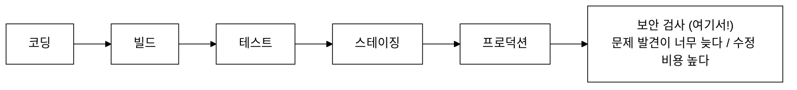
_그림 9. 전통적 파이프라인 — 보안 검사가 마지막에 배치되어 문제 발견과 수정 비용이 커진다._

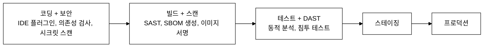
_그림 10. Shift Left 파이프라인 — 보안 통제를 개발 초기 단계로 당겨 조기에 결함을 차단._

### 7.2 CI/CD 보안 파이프라인 예시

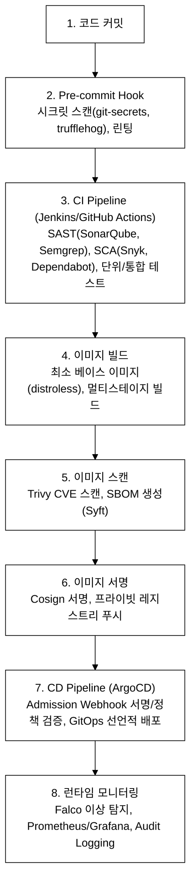
_그림 11. 완전한 보안 CI/CD 파이프라인 — 커밋부터 런타임까지 단계별 보안 통제._

### 7.3 주요 도구 비교

**주요 약어 정의 (처음 보는 경우 먼저 읽는다):**

- **SBOM(Software Bill of Materials, 소프트웨어 구성 목록):** 소프트웨어에 포함된 모든 오픈소스 라이브러리·컴포넌트·의존성의 목록과 버전 정보를 기계가 읽을 수 있는 형식(SPDX, CycloneDX)으로 작성한 명세서. 신규 CVE가 공개됐을 때 내 소프트웨어가 영향받는 컴포넌트를 포함하는지 SBOM으로 즉시 조회할 수 있다. Log4Shell 사태(2021) 이후 공급망 보안의 핵심 요소로 자리잡았다.
- **SAST(Static Application Security Testing, 정적 애플리케이션 보안 테스트):** 소스 코드를 실행하지 않고 분석하여 SQL Injection, XSS, 버퍼 오버플로우 같은 보안 취약점 패턴을 찾는 도구. 코딩 단계에서 즉시 피드백을 준다.
- **DAST(Dynamic Application Security Testing, 동적 애플리케이션 보안 테스트):** 실제로 실행 중인 애플리케이션에 공격을 시뮬레이션하여 런타임 취약점을 찾는 도구. SAST가 소스 레벨이라면 DAST는 네트워크 레벨에서 애플리케이션을 블랙박스로 테스트한다.
- **SCA(Software Composition Analysis, 소프트웨어 구성 분석):** 프로젝트가 사용하는 오픈소스 라이브러리·의존성을 분석하여 알려진 CVE 취약점과 라이선스 문제를 찾는 도구. SBOM 생성의 전단계이기도 하다.

| 단계 | 도구 | 설명 | 유형 |
|------|------|------|------|
| 시크릿 스캔 | git-secrets, trufflehog | 코드에 하드코딩된 시크릿 탐지 | 정적 |
| SAST | SonarQube, Semgrep | 소스 코드 보안 분석 | 정적 |
| SCA | Snyk, Dependabot | 의존성 취약점 분석 | 정적 |
| 이미지 스캔 | Trivy, Grype, Clair | 이미지 CVE 스캔 | 정적 |
| SBOM | Syft, Trivy | 소프트웨어 구성 목록 생성 | 정적 |
| 이미지 서명 | Cosign, Notary | 이미지 출처/무결성 검증 | 서명 |
| DAST | OWASP ZAP | 동적 보안 분석 (실행 중 테스트) | 동적 |
| 런타임 | Falco, Sysdig | 런타임 이상 행위 탐지 | 동적 |

> **day01 범위 안내:** 위 도구 표는 DevSecOps 파이프라인 전체 그림을 참조용으로 제시한 것이다. day01의 목표는 각 도구의 역할과 위치(파이프라인 어느 단계)를 이해하는 것으로 충분하다. Trivy·Cosign 실습, SBOM 생성, 이미지 서명 검증의 실제 사용법은 day02(공급망 보안 심화)에서 다룬다.

---

## 8. 핵심 개념 정리 (시험 직전 리뷰용)

### 8.1 4C 모델 요약

```
Cloud → Cluster → Container → Code (바깥 → 안쪽)

Cloud:     IAM, 방화벽, 물리 보안, 암호화
Cluster:   RBAC, NetworkPolicy, Admission, etcd 암호화
Container: SecurityContext, seccomp, 이미지 보안
Code:      TLS, Secret 관리, 입력 검증, 의존성 관리
```

### 8.2 STRIDE 요약

```
S - Spoofing     (위장)    → 인증 강화
T - Tampering    (변조)    → 무결성 검증, 서명
R - Repudiation  (부인)    → Audit Logging
I - Info Disclosure (정보노출) → 암호화, 접근 제한
D - Denial of Service (DoS) → ResourceQuota, LimitRange
E - Elevation    (권한상승)  → PSS, seccomp, 최소 권한
```

### 8.3 Zero Trust 요약

```
핵심: "Never trust, always verify"
5원칙: 신원확인 + 최소권한 + 마이크로세그멘테이션 + 암호화 + 지속적검증
K8s 구현: RBAC + default-deny NetworkPolicy + mTLS + Audit Log
```

---

## 9. 복습 체크리스트

- [ ] 4C 모델의 4개 계층을 순서대로 말할 수 있다 (Cloud → Cluster → Container → Code)
- [ ] 각 계층의 대표적인 보안 통제를 3개 이상 설명할 수 있다
- [ ] Defense in Depth 원칙을 한 문장으로 설명할 수 있다
- [ ] STRIDE 6가지 위협 유형을 모두 나열하고 K8s 예시를 들 수 있다
- [ ] Zero Trust의 핵심 원칙("Never trust, always verify")을 설명할 수 있다
- [ ] Zero Trust의 5가지 원칙과 K8s 구현 방법을 알고 있다
- [ ] CNCF Security TAG의 역할과 주요 산출물을 알고 있다
- [ ] Shift Left의 의미와 CI/CD에서의 적용을 설명할 수 있다
- [ ] 정적 분석(Trivy)과 동적 분석(Falco)의 차이를 설명할 수 있다
- [ ] 공유 책임 모델에서 고객과 클라우드 제공자의 책임 범위를 구분할 수 있다

---

## 내일 예고: Day 2 - 공급망 보안, 시험 패턴, 연습 문제

- 공급망 보안 (SBOM, Cosign, SLSA) 상세
- KCSA 시험 출제 패턴 분석
- 연습 문제 17문제 + 상세 해설
- 보안 용어 사전 및 약어 정리
- tart-infra 실습

---

## tart-infra 실습

### 실습 환경 전제 조건

이 실습은 다음 환경을 전제로 한다:

| 항목 | 값 |
|:-----|:---|
| 클러스터 | tart dev 클러스터 (파괴 실습 허용) |
| kubeconfig 경로 | `kubeconfig/dev.yaml` |
| 노드 SSH 별칭 | `ssh dev-master`, `ssh dev-worker1` |
| CNI | **Cilium** — 이 실습의 `kubectl get ciliumnetworkpolicies` 명령은 Cilium CNI 전용이다. Flannel·Calico 환경에서는 `kubectl get networkpolicies`를 사용한다 |
| 실습 네임스페이스 | `demo` — 아래 명령으로 미리 생성한다 |

```bash
# 실습 시작 전 — dev 클러스터 접속 및 네임스페이스 생성
export KUBECONFIG=kubeconfig/dev.yaml

# 클러스터 정상 여부 확인
kubectl get nodes

# IP 드리프트가 있을 경우: 먼저 복구 스크립트 실행 (재부팅 후 필요)
# ./scripts/fix-cluster-ip-drift.sh dev

# 실습용 네임스페이스 생성 (이미 있으면 무시)
kubectl create namespace demo --dry-run=client -o yaml | kubectl apply -f -
```

### 실습 1: 4C 보안 모델 실습 — Cloud/Cluster/Container/Code

**실습 전 준비 — demo 네임스페이스에 최소 리소스 배포:**

```bash
# 실습에 필요한 Pod와 Secret을 배포한다
# (이미 존재하면 idempotent하게 apply가 무시한다)
kubectl apply -f - <<'EOF'
apiVersion: v1
kind: Secret
metadata:
  name: app-credentials
  namespace: demo
type: Opaque
stringData:
  password: demo-password-plain
---
apiVersion: v1
kind: Pod
metadata:
  name: secure-app
  namespace: demo
  labels:
    app: secure-app
spec:
  securityContext:
    runAsNonRoot: true
    runAsUser: 1000
    seccompProfile:
      type: RuntimeDefault
  automountServiceAccountToken: false
  containers:
    - name: app
      image: nginx:stable-alpine
      securityContext:
        allowPrivilegeEscalation: false
        readOnlyRootFilesystem: false
        capabilities:
          drop:
            - ALL
      resources:
        requests:
          memory: "32Mi"
          cpu: "50m"
        limits:
          memory: "64Mi"
          cpu: "100m"
EOF
```

```bash
# [Cluster 레이어] API Server 보안 설정 확인
kubectl get pod kube-apiserver-dev-master -n kube-system -o yaml | grep -E "(--authorization-mode|--enable-admission)"

# [Cluster 레이어] NetworkPolicy 확인 (Zero Trust)
kubectl get ciliumnetworkpolicies -n demo --no-headers | wc -l
echo "CiliumNetworkPolicy 수 (Zero Trust 구현)"

# [Container 레이어] Pod SecurityContext 확인
kubectl get pods -n demo -o jsonpath='{range .items[*]}{.metadata.name}{" runAsNonRoot="}{.spec.securityContext.runAsNonRoot}{"\n"}{end}'

# [Container 레이어] mTLS 확인
kubectl get peerauthentication -n demo 2>/dev/null || echo "PeerAuthentication 확인"
```

**검증 — 기대 출력:**


**동작 원리:** 4C 보안 모델(Cloud, Cluster, Container, Code):
1. **Cloud**: 인프라 보안 — tart-infra는 로컬 VM이므로 호스트 OS(macOS) 보안이 해당
2. **Cluster**: K8s 보안 — RBAC, NetworkPolicy, Admission Controller, 인증서 관리
3. **Container**: 컨테이너 보안 — SecurityContext, 이미지 스캔, seccomp, AppArmor
4. **Code**: 애플리케이션 보안 — 시크릿 관리, 입력 검증, 의존성 취약점 점검
5. 각 레이어가 독립적으로 보안을 제공하여 Defense in Depth(심층 방어)를 구현한다

### 미니랩 1 (목표 시간: 5분)

다음 두 문제를 명령줄에서 직접 풀어본다. 시험에서 비슷한 유형이 출제된다.

**문제 1.** `demo` 네임스페이스의 `secure-app` Pod가 `runAsNonRoot: true`로 설정되었는지 단일 `kubectl` 명령으로 확인하라. 출력에서 어느 필드를 봐야 하는가?

```bash
# 여기에 명령을 작성한다
```

<details>
<summary>정답 확인</summary>

```bash
kubectl get pod secure-app -n demo -o jsonpath='{.spec.securityContext.runAsNonRoot}'
# 출력: true 이면 설정 완료. 빈 값이면 미설정(기본 false)
```

Pod 레벨 `.spec.securityContext.runAsNonRoot` 필드를 확인한다. Container 레벨 재정의는 `.spec.containers[0].securityContext.runAsNonRoot`를 추가로 확인한다.

</details>

**문제 2.** STRIDE에서 `automountServiceAccountToken: false` 설정은 어느 위협(S/T/R/I/D/E) 범주에 대응하는가? 이유를 한 문장으로 설명하라.

<details>
<summary>정답 확인</summary>

**S(Spoofing)** — SA 토큰 자동 마운트를 비활성화하면 애플리케이션 취약점(RCE)으로 셸을 획득한 공격자가 `/var/run/secrets/kubernetes.io/serviceaccount/token`에서 토큰을 읽어 API Server에 다른 주체로 위장 접속(Spoofing)하는 경로를 차단한다.

</details>

### 트러블슈팅: 4C 계층 보안 설정 문제

```
장애 시나리오 1: NetworkPolicy 적용 후 Pod 간 통신 불가
  증상: DNS 해석 실패, 서비스 연결 타임아웃
  원인: default-deny 정책 적용 시 DNS(53) 포트 허용을 빠뜨림
  디버깅:
    kubectl get ciliumnetworkpolicies -n demo
    kubectl exec -n demo <pod> -- nslookup kubernetes.default
  해결: DNS 허용 정책을 반드시 함께 생성한다

장애 시나리오 2: SecurityContext 설정 후 Pod CrashLoopBackOff
  증상: Pod가 반복적으로 재시작됨
  원인: runAsNonRoot: true인데 이미지가 root로 실행되도록 빌드됨
  디버깅:
    kubectl describe pod <pod-name> -n demo
    kubectl logs <pod-name> -n demo --previous
  해결: Dockerfile에서 USER 지시어로 비root 사용자를 지정하거나,
        runAsUser를 명시적으로 설정한다
```

### 실습 2: Zero Trust 네트워크 확인

**실습 전 준비 — default-deny-all CiliumNetworkPolicy 배포:**

> Cilium CNI 환경에서는 `CiliumNetworkPolicy`(cilium.io/v2)가 표준 `NetworkPolicy`를 확장한다. 표준 `NetworkPolicy`로도 동일한 default-deny 효과를 낼 수 있으며, Cilium이 자동으로 표준 NetworkPolicy를 인식한다. 아래는 Cilium 전용 리소스를 사용하는 예시이다.

```bash
# default-deny-all CiliumNetworkPolicy가 없으면 실습 2 명령이 "not found" 오류를 반환한다.
# 다음 명령으로 미리 배포한다.
kubectl apply -f - <<'EOF'
apiVersion: "cilium.io/v2"
kind: CiliumNetworkPolicy
metadata:
  name: default-deny-all
  namespace: demo
spec:
  endpointSelector: {}
  ingress:
    - {}
  egress:
    - {}
EOF
# ⚠️ 주의 — Cilium v1.14+ egress: [{}] 해석:
#   Cilium 문서에 따르면 egress: [{}] 는 "빈 엔드포인트셀렉터({})가 있는 규칙"으로
#   버전에 따라 "모든 egress 허용"으로 해석될 수 있다.
#   완전한 default-deny egress를 보장하려면 egress 키 자체를 생략하거나
#   아래 표준 NetworkPolicy(networking.k8s.io/v1)를 대신 사용한다.
# 실습 후 정리: kubectl delete ciliumnetworkpolicy default-deny-all -n demo
```

**[대안] 표준 NetworkPolicy — CNI 무관 default-deny:**

CNI에 Cilium 전용 리소스 대신 표준 `networking.k8s.io/v1` NetworkPolicy를 사용하면 Cilium·Flannel·Calico 모든 환경에서 동일하게 동작하며, default-deny 의미가 사양에 명확히 정의되어 있다.

```bash
kubectl apply -f - <<'EOF'
apiVersion: networking.k8s.io/v1
kind: NetworkPolicy
metadata:
  name: default-deny-all-std
  namespace: demo
spec:
  podSelector: {}        # 네임스페이스 내 모든 Pod
  policyTypes:
    - Ingress
    - Egress
  # ingress/egress 규칙 목록을 아예 생략 = 해당 방향 트래픽 전부 차단
  # (빈 리스트 [] 와 다름: 빈 리스트는 "허용 규칙 없음"이지만 일부 CNI에서
  #  해석 차이가 있다. 키 자체를 생략하는 것이 가장 명확한 default-deny)
EOF
# 적용 확인
kubectl get networkpolicy default-deny-all-std -n demo
# 실습 후 정리: kubectl delete networkpolicy default-deny-all-std -n demo
```

```bash
# Default Deny 정책 확인
kubectl get ciliumnetworkpolicy default-deny-all -n demo -o yaml | head -20

# 허용된 통신 경로 확인
kubectl get ciliumnetworkpolicies -n demo -o custom-columns=NAME:.metadata.name
```

**예상 출력:**
> **예시(참조) — dev 실측 (ns=cap-kcsa-day01, 캡처 후 삭제):** KCSA 보안 개념/점검 기대 출력(설정/도구/환경 의존). 재현 가능 핵심은 KCSA daily 및 본 캡처 참고.

**동작 원리:** Zero Trust 네트워크 구현:
1. "아무것도 신뢰하지 않는다" — 기본적으로 모든 트래픽을 차단한다
2. `default-deny-all`: Ingress + Egress 모두 차단하는 기본 정책
3. 각 `allow-*` 정책이 필요한 통신만 명시적으로 허용한다
4. 허용 경로: nginx → httpbin → postgres/redis/rabbitmq (계층적 접근)
5. DNS(53 포트) 허용이 없으면 Service 이름으로 통신할 수 없다

### 미니랩 2 (목표 시간: 5분)

**문제.** `demo` 네임스페이스에 `frontend` 레이블(`app: frontend`)을 가진 Pod에서 `backend` 레이블(`app: backend`)을 가진 Pod의 TCP 8080 포트로만 수신을 허용하는 표준 NetworkPolicy를 작성하라. 다른 모든 Ingress는 차단되어야 한다.

```bash
# 여기에 NetworkPolicy YAML을 작성하고 apply한다
```

<details>
<summary>정답 확인</summary>

```bash
kubectl apply -f - <<'EOF'
apiVersion: networking.k8s.io/v1
kind: NetworkPolicy
metadata:
  name: allow-frontend-to-backend
  namespace: demo
spec:
  podSelector:
    matchLabels:
      app: backend
  policyTypes:
    - Ingress
  ingress:
    - from:
        - podSelector:
            matchLabels:
              app: frontend
      ports:
        - protocol: TCP
          port: 8080
EOF
```

핵심: `podSelector`는 이 정책이 적용될 대상(backend) Pod를 선택하고, `ingress.from.podSelector`는 허용할 출처(frontend) Pod를 지정한다. `policyTypes: [Ingress]`만 선언하면 Egress는 이 정책이 제어하지 않는다.

</details>

### 실습 3: STRIDE 위협 모델 적용

**실습 전 준비 — demo 네임스페이스에 ResourceQuota와 Secret 배포:**

```bash
# 실습 3의 [Information Disclosure] 명령은 demo 네임스페이스에 Secret이 있어야 한다.
# 실습 1 준비 단계에서 app-credentials Secret을 이미 배포했다면 이 단계는 생략한다.
# [Denial of Service] 명령은 ResourceQuota가 없으면 "미설정" 메시지를 출력하는데,
# 실제 설정이 있을 때의 출력도 확인하려면 아래 ResourceQuota를 배포한다.
kubectl apply -f - <<'EOF'
apiVersion: v1
kind: ResourceQuota
metadata:
  name: demo-quota
  namespace: demo
spec:
  hard:
    pods: "10"
    requests.cpu: "500m"
    requests.memory: "512Mi"
    limits.cpu: "2"
    limits.memory: "1Gi"
    secrets: "10"
EOF
```

```bash
# [Spoofing] 인증 확인 — 누가 접근할 수 있는가?
kubectl auth can-i --list | head -10

# [Tampering] 변조 방지 — etcd 데이터 암호화 여부
kubectl get pod kube-apiserver-dev-master -n kube-system -o yaml | grep encryption-provider || echo "Encryption at Rest 미설정"

# [Information Disclosure] 정보 노출 — Secret이 평문으로 조회 가능한지
kubectl get secret -n demo -o jsonpath='{.items[0].metadata.name}' && echo " (Base64 인코딩만 됨, 암호화 아님)"

# [Denial of Service] 서비스 거부 — ResourceQuota/LimitRange 설정 여부
kubectl get resourcequota,limitrange -n demo 2>/dev/null || echo "ResourceQuota/LimitRange 미설정"
```

**`kubectl auth can-i --list` 출력 해석 기준:**

이 명령은 현재 kubeconfig에 설정된 사용자(ServiceAccount 또는 클러스터 관리자 인증서)가 가진 권한 목록을 출력한다. 출력 결과는 kubeconfig의 현재 컨텍스트와 사용자에 따라 완전히 다르므로 다음 기준으로 판단한다:

- **`* on *.*` 행이 있으면 cluster-admin 수준이다.** `*`는 모든 동사(get·create·delete 등) 또는 모든 리소스를 의미한다. kubeadm으로 구성한 클러스터에서 admin 인증서로 접근하면 이 패턴이 나타난다. 시험 환경에서는 문제마다 지정된 ServiceAccount로 `kubectl auth can-i --list --as=system:serviceaccount:<ns>:<sa>` 를 실행해 최소 권한 여부를 확인한다.
- **`secrets get`·`secrets *` 행은 즉시 위험 신호다.** STRIDE Information Disclosure 위협과 직결된다. 의도하지 않은 SA나 사용자에게 secrets 읽기 권한이 있으면 RBAC를 점검한다.
- **`clusterrolebindings escalate` 또는 `rolebindings bind` 행은 권한 상승 경로다.** STRIDE Elevation of Privilege와 직결된다. 이 verb가 보이면 해당 주체가 자신의 권한을 임의로 높일 수 있다.
- **아무 권한 행도 없으면 인증은 됐지만 인가가 없는 상태다.** `kubectl auth can-i get pods` 를 추가로 실행해 RBAC 설정 누락인지 확인한다.

**동작 원리:** STRIDE 위협 모델:
1. **S**poofing(위장): 인증 메커니즘으로 방어 — X.509 인증서, OIDC, SA Token
2. **T**ampering(변조): RBAC + Admission Controller로 무단 변경 방지
3. **R**epudiation(부인): Audit Log로 모든 API 요청을 기록
4. **I**nformation Disclosure(정보 노출): Secret 암호화, RBAC으로 접근 제한
5. **D**enial of Service(서비스 거부): ResourceQuota, LimitRange, PDB로 방어
6. **E**levation of Privilege(권한 상승): PSA, SecurityContext로 컨테이너 권한 제한

### 미니랩 3 (목표 시간: 5분)

**문제 1.** `demo` 네임스페이스의 etcd에 저장된 Secret이 Encryption at Rest 적용 여부를 확인하는 명령은 무엇인가? 그 출력에서 암호화 여부를 어떻게 판별하는가?

<details>
<summary>정답 확인</summary>

API Server Pod 스펙에서 `--encryption-provider-config` 플래그 유무를 확인한다:

```bash
kubectl get pod kube-apiserver-dev-master -n kube-system -o yaml | grep encryption-provider
# 출력 없음 = Encryption at Rest 미설정 (Secret이 Base64 평문으로 etcd에 저장됨)
# 출력 있음 = EncryptionConfiguration 파일 경로가 표시됨
```

etcd 직접 검증(dev-master 노드에서):

```bash
ssh dev-master
# 암호화된 경우: k8s:enc:aescbc:v1: 접두사가 보인다
# 평문인 경우: 내용이 Base64 텍스트로 그대로 보인다
```

</details>

**문제 2.** STRIDE에서 `etcd` 데이터 직접 변조(etcdctl put으로 RBAC 정책 삽입)는 어느 위협 범주이며, 이를 방어하는 K8s 메커니즘 3가지를 열거하라.

<details>
<summary>정답 확인</summary>

**T(Tampering)** — 데이터 무결성(Integrity)을 침해하는 위협이다.

방어 메커니즘:
1. **etcd TLS 클라이언트 인증(`--client-cert-auth=true`)** — 신뢰할 수 없는 클라이언트의 etcd 직접 접근 자체를 차단한다.
2. **네트워크 격리** — etcd 포트 2379/2380을 API Server만 접근 가능한 보안 네트워크 세그먼트에 배치한다.
3. **Audit Logging** — API Server를 통한 모든 변경을 기록한다(etcd 직접 접근은 감사 로그 회피 가능하므로 1·2가 선행되어야 한다).

</details>

---

## 자가점검

<details>
<summary>Q1. 4C 모델에서 "가장 바깥 계층"과 "가장 안쪽 계층"은 무엇이며, 각 계층이 침해되면 어떤 결과가 발생하는가?</summary>

**정답:**
- 가장 바깥: **Cloud 계층** — IAM, VPC, 물리적 인프라 수준. 이 계층이 침해되면 K8s 노드 VM에 직접 SSH 접근, etcd 볼륨 스냅샷 탈취가 가능하며 상위 계층(Cluster·Container·Code) 보안이 전부 무력화된다.
- 가장 안쪽: **Code 계층** — 애플리케이션 코드 수준. SQL Injection, 하드코딩된 자격 증명 노출, 의존성 취약점(Log4Shell 등)은 네트워크 방화벽이나 RBAC가 아닌 코드 레벨에서만 방어된다.

</details>

<details>
<summary>Q2. STRIDE에서 "Repudiation(부인)"을 방어하는 K8s 메커니즘은 무엇이며, 왜 외부 불변 저장소에 로그를 보관해야 하는가?</summary>

**정답:**
- 방어 메커니즘: **Kubernetes Audit Logging** — API Server에 들어오는 모든 요청(누가, 언제, 무엇을, 어떤 결과로)을 파일에 기록한다.
- 외부 저장소(Loki, Elasticsearch) 필요 이유: 클러스터 자체가 탈취되면 API Server 로그를 공격자가 삭제·변조할 수 있다. 외부 불변 저장소에 전송·보관하면 클러스터 침해 후에도 감사 추적이 보존된다.

</details>

<details>
<summary>Q3. Zero Trust의 "Never trust, always verify" 원칙이 경계 보안(Perimeter Security)과 다른 핵심 차이는 무엇인가?</summary>

**정답:**
- 경계 보안: 방화벽 내부 = 신뢰 영역 → 내부에 접근한 주체는 추가 검증 없이 신뢰한다. 한 시스템이 탈취되면 내부 네트워크 전체로 횡적 이동이 자유롭다.
- Zero Trust: 네트워크 위치(내부/외부)와 무관하게 모든 접근 요청에 대해 인증·인가·지속 검증을 수행한다. K8s에서는 RBAC(인가) + default-deny NetworkPolicy(마이크로 세그멘테이션) + mTLS(암호화+상호인증) + Audit Log(지속 검증)로 구현한다.

</details>

<details>
<summary>Q4. etcd 포트 2379가 "최고 위험 공격 표면"으로 분류되는 이유를 3가지 설명하라.</summary>

**정답:**
1. 클러스터 전체 상태 저장: Secret, RBAC 정책, Pod 스펙, ConfigMap 등 모든 데이터가 etcd에 있다. 직접 접근하면 RBAC를 우회해 전체 데이터를 읽고 쓸 수 있다.
2. Secret 기본 평문 저장: K8s는 기본적으로 Secret을 Base64 인코딩(암호화 아님) 형태로 etcd에 저장한다. Encryption at Rest를 별도 설정하지 않으면 etcd 접근 권한만으로 즉시 디코딩 가능하다.
3. RBAC 정책 변조 가능: 공격자가 etcd에 직접 쓰기로 자신에게 cluster-admin RoleBinding을 삽입할 수 있다. 이로써 API Server를 통하지 않고 K8s 보안 통제 전체를 무력화할 수 있다.

</details>

<details>
<summary>Q5. CNCF 프로젝트 성숙도 단계에서 Graduated 프로젝트가 Incubating과 다른 요건은 무엇인가? Falco와 Kyverno의 현재 단계는?</summary>

**정답:**
- Graduated 추가 요건: CNCF가 의뢰한 **외부 보안 감사(Security Audit) 통과** + 넓은 채택 기반 + 명확한 거버넌스. Incubating은 **보안 자기평가(Self-Assessment)** 만 요구한다.
- Falco: **Graduated** (런타임 보안 모니터링, eBPF 기반 시스템 콜 추적)
- Kyverno: **Incubating** (K8s 네이티브 정책 엔진, YAML 기반 정책)

</details>

---

## 시험 팁

1. **4C 순서 암기:** Cloud → Cluster → Container → Code (바깥 → 안쪽). "클라이언트가 코드 쪽으로 들어간다"고 기억하면 된다. KCSA 시험에서 계층 순서를 묻는 문제가 출제된다.

2. **STRIDE 키워드 매핑:** 문제에서 "감사 로그 없음/추적 불가"는 R(Repudiation), "평문 저장/정보 노출"은 I(Information Disclosure), "권한 상승/privileged 컨테이너"는 E(Elevation)로 즉시 연결하는 훈련을 한다.

3. **etcd 위험도:** "etcd를 탈취하면 무엇이 가능한가?" 유형의 문제에서는 "RBAC 우회 + 전체 Secret 접근 + 정책 변조"라는 세 가지를 모두 언급한다.

4. **PSA vs PSP 구분:** 시험은 K8s 1.25+ 기준이다. PSP(PodSecurityPolicy)는 deprecated/removed이며, PSA(Pod Security Admission)이 빌트인 어드미션 컨트롤러로 대체한다. PSA의 3개 레벨(Privileged, Baseline, Restricted)과 3개 모드(enforce, audit, warn)를 암기한다.

5. **Zero Trust 5원칙:** "신원확인 + 최소권한 + 마이크로세그멘테이션 + 암호화 + 지속적검증" — K8s 구현과 짝지어 외운다: RBAC, NetworkPolicy, mTLS, Audit Log.

6. **CNCF 프로젝트 성숙도 단계:** Graduated(외부 감사) vs Incubating(자기평가)의 차이를 구분한다. 시험에서 "Falco의 CNCF 상태는?"처럼 개별 프로젝트를 묻기도 한다.

---

## 더 읽을거리

- **CNCF Cloud Native Security Whitepaper (v2):** [https://github.com/cncf/tag-security/blob/main/security-whitepaper/v2/cloud-native-security-whitepaper.md](https://github.com/cncf/tag-security/blob/main/security-whitepaper/v2/cloud-native-security-whitepaper.md) — 4C 모델·공급망 보안·Zero Trust의 CNCF 공식 레퍼런스.
- **NIST SP 800-207 — Zero Trust Architecture:** [https://csrc.nist.gov/publications/detail/sp/800-207/final](https://csrc.nist.gov/publications/detail/sp/800-207/final) — Zero Trust의 공식 정의와 구현 원칙.
- **Kubernetes 공식 문서 — Pod Security Standards:** [https://kubernetes.io/docs/concepts/security/pod-security-standards/](https://kubernetes.io/docs/concepts/security/pod-security-standards/) — PSA Privileged/Baseline/Restricted 3레벨 상세.
- **STRIDE 위협 모델링 (Microsoft SDL):** [https://learn.microsoft.com/ko-kr/azure/security/develop/threat-modeling-tool-threats](https://learn.microsoft.com/ko-kr/azure/security/develop/threat-modeling-tool-threats) — STRIDE 원조 문서.
- **etcd 보안 모범 사례:** [https://etcd.io/docs/v3.5/op-guide/security/](https://etcd.io/docs/v3.5/op-guide/security/) — TLS 클라이언트 인증, 피어 인증 설정 방법.
- **Falco 공식 문서:** [https://falco.org/docs/](https://falco.org/docs/) — eBPF 기반 런타임 보안 모니터링 아키텍처.
- **day02 연결:** 이 날에서 언급된 Cosign 이미지 서명, SBOM, SLSA 공급망 보안의 실제 사용법은 [day02.md](day02.md)에서 실습과 함께 심화 학습한다.
