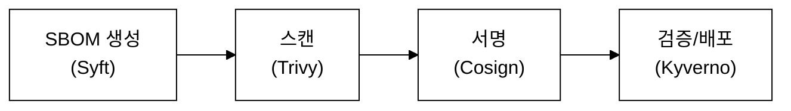
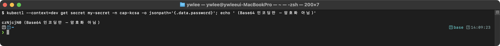

# KCSA Day 2: 공급망 보안, 시험 패턴, 연습 문제

> **시험 비중:** Overview of Cloud Native Security — 14%
> **목표:** 공급망 보안(SBOM, Cosign, SLSA)을 이해하고, 시험 출제 패턴을 분석하며, 연습 문제로 Day 1~2 범위를 점검한다.
> **예상 소요 시간:** 약 2시간

## 오늘의 학습 목표

- [ ] SBOM 두 가지 형식(SPDX vs CycloneDX)의 용도 차이를 설명할 수 있다
- [ ] Cosign 서명-검증 흐름(키 생성 → 서명 → 검증)을 단계별로 기술할 수 있다
- [ ] SLSA 4개 레벨을 순서대로 암기하고 각 레벨의 요구사항을 말할 수 있다
- [ ] Shift Left의 의미와 DevSecOps 파이프라인 단계(SAST → SCA → 이미지스캔 → 서명)를 설명할 수 있다
- [ ] Trivy(정적, 빌드 시점)와 Falco(동적, 런타임)의 역할 차이를 구분할 수 있다
- [ ] CNCF Graduated(Falco/OPA/TUF)와 Incubating(Kyverno/SPIFFE/Notary) 프로젝트를 구분할 수 있다

---

> **Day 1 필수 전제 (이 파일 독립 학습 전에 확인):**
> - **STRIDE** 위협 모델 6가지: Spoofing(위장), Tampering(변조), Repudiation(부인), Information Disclosure(정보 노출), Denial of Service(서비스 거부), Elevation of Privilege(권한 상승)
> - **4C 보안 계층**: Cloud → Cluster → Container → Code (바깥→안쪽)
> - **Zero Trust**: "Never trust, always verify" — 네트워크 위치와 무관하게 모든 접근을 명시적으로 검증
> - **Zero Trust 5원칙** (연습 문제 14번에 직접 출제됨):
>   1. **신원 확인(Verify Explicitly)** — 모든 접근 요청마다 사용자/기기/워크로드를 명시적으로 인증·인가한다.
>   2. **최소 권한(Least Privilege)** — 작업에 필요한 최소한의 권한만 부여하고, JIT(Just-In-Time) 접근으로 권한 유효 기간을 최소화한다.
>   3. **마이크로 세그멘테이션(Micro-segmentation)** — 네트워크를 작은 세그먼트로 분리해 침해 발생 시 횡적 이동(Lateral Movement)을 차단한다.
>   4. **암호화(Encrypt Everything)** — 데이터를 전송 중(mTLS)과 저장 시(Encryption at Rest) 모두 암호화한다.
>   5. **지속적 검증(Continuous Monitoring)** — 접근 권한을 일회성으로 부여하지 않고 세션 전체에 걸쳐 지속적으로 재검증한다.
> 연습 문제 1, 2, 4, 11, 12번은 Day 1 내용을 직접 묻는다. Day 1을 보지 않았다면 [day01.md](day01.md)를 먼저 읽는다.

---

## 1. 공급망 보안 (Supply Chain Security) 기초

### 1.0 등장 배경

```
기존 방식의 한계:
전통적인 소프트웨어 배포는 빌드 결과물의 출처를 검증하지 않았다.
개발자가 공개 레지스트리에서 베이스 이미지를 가져와 빌드하고,
누가 빌드했는지, 이미지가 변조되었는지 확인할 수 없었다.

실제 사고:
- SolarWinds 사건(2020): 빌드 파이프라인이 침해되어 1만8천 개 조직에 백도어 배포
- Codecov 사건(2021): CI 스크립트가 변조되어 환경 변수(시크릿) 유출
- Log4Shell(2021): 의존성 라이브러리의 취약점이 전 세계 시스템에 영향

해결:
공급망 보안은 "코드 → 빌드 → 배포" 전 과정에서
SBOM으로 구성 요소를 추적하고, Cosign으로 서명/검증하며,
SLSA로 빌드 환경의 보안 성숙도를 측정하는 체계다.
```

### 1.1 공급망 공격이란?

```
공급망 공격의 실제 사례 흐름:

[시나리오 1: 악성 베이스 이미지]
공격자 → 인기 베이스 이미지에 백도어 삽입
       → 개발자가 해당 이미지로 빌드
       → 프로덕션에 배포
       → 백도어 활성화 → 데이터 탈취

[시나리오 2: 의존성 혼란 (Dependency Confusion)]
공격자 → 내부 패키지와 같은 이름의 악성 패키지를 공개 레지스트리에 업로드
       → 빌드 시스템이 공개 레지스트리에서 악성 버전을 다운로드
       → 악성 코드가 빌드에 포함

[시나리오 3: CI/CD 파이프라인 침해]
공격자 → CI/CD 시스템 (Jenkins, GitHub Actions) 침해
       → 빌드 스크립트에 악성 코드 주입
       → 정상적인 빌드 결과물에 백도어 포함
       → 정상적인 서명/배포 과정을 통해 프로덕션에 배포

방어 체계 — 배포 전(정적)과 배포 후(동적) 두 단계로 구성된다:
- 배포 전: SBOM 생성 → 취약점 스캔(Trivy) → 이미지 서명(Cosign) → 정책 검증/배포(Kyverno)
- 배포 후: Falco가 런타임 이상 행동(예: 컨테이너 내 쉘 실행, 민감 파일 접근)을 동적으로 감지
- Falco(런타임 보안 모니터링 도구, eBPF/시스템 콜 기반)는 1.5절에서 상세히 다룬다.
```

_그림 1. 공급망 보안 방어 체계 단계 (SBOM 생성에서 검증/배포까지). 배포 후 런타임 감시는 Falco(1.5절)가 담당한다._

### 1.2 SBOM (Software Bill of Materials)

> **실습 전제 (1.2~1.3 공통):** dev 클러스터가 가동 중이어야 한다.
> 클러스터 미가동 시: `./scripts/boot.sh && ./scripts/fix-cluster-ip-drift.sh dev`
> 정상 확인: `kubectl --kubeconfig kubeconfig/dev.yaml get nodes` → 모두 Ready
> 아래 예시 이미지가 없으면 dev 클러스터에 이미 배포된 `nginx:1.25`를 사용한다.
> (`syft nginx:1.25 -o spdx-json > sbom.json` / `trivy image --format spdx nginx:1.25`)
> 직접 빌드 테스트를 원하면 `docker build -t myapp:v1.0 .` (간단한 Dockerfile 필요)으로 로컬 이미지를 만든다.

> **도구 설치 (macOS — 최초 1회):**
> syft, cosign, trivy 세 도구가 로컬에 없으면 아래 명령으로 설치한다.
> ```bash
> brew install syft cosign trivy
> # 설치 확인
> syft version && cosign version && trivy --version
> ```
> Linux(또는 CI 환경)라면 바이너리 직접 다운로드:
> ```bash
> # syft
> curl -sSfL https://raw.githubusercontent.com/anchore/syft/main/install.sh | sh -s -- -b /usr/local/bin
> # trivy
> curl -sfL https://raw.githubusercontent.com/aquasecurity/trivy/main/contrib/install.sh | sh -s -- -b /usr/local/bin
> # cosign
> COSIGN_VER=$(curl -s https://api.github.com/repos/sigstore/cosign/releases/latest | grep tag_name | cut -d '"' -f4)
> curl -Lo /usr/local/bin/cosign https://github.com/sigstore/cosign/releases/download/${COSIGN_VER}/cosign-linux-amd64
> chmod +x /usr/local/bin/cosign
> ```
> Kubernetes 클러스터 내에서 스캔을 자동화하려면 Trivy Operator Helm 차트를 사용한다:
> `helm repo add aquasecurity https://aquasecurity.github.io/helm-charts && helm install trivy-operator aquasecurity/trivy-operator -n trivy-system --create-namespace`

```
SBOM = 소프트웨어 재료 목록

이미지에 포함된 모든 패키지/라이브러리의 목록이다.
CVE(취약점)가 발표되면 SBOM을 검색하여 영향받는 서비스를 즉시 파악할 수 있다.

SBOM 형식 비교:
- SPDX: Linux Foundation 주도, ISO 26740 국제 표준. 소프트웨어 라이선스 추적에 강점.
  → 자동차/임베디드 소프트웨어처럼 컴플라이언스(법적 라이선스 관리)가 중요한 경우 선택.
- CycloneDX: OWASP 주도, 보안 중심. CVE(취약점) 정보를 SBOM에 직접 포함 가능.
  → 개발팀이 CVE 발생 시 즉시 영향 받는 서비스를 파악하고 빠르게 대응하려면 선택.
  두 형식이 공존하는 이유: SPDX는 라이선스 법무 추적 목적으로 먼저 등장했고,
  CycloneDX는 보안 취약점 관리 용도로 OWASP가 별도 설계했다. 용도가 다르므로 공존한다.

생성 도구:
- Syft: Anchore, 대표적 SBOM 생성 도구
- Trivy: Aqua Security, SBOM 생성 기능 내장

# SBOM 생성 예시
syft myapp:v1.0 -o spdx-json > sbom.json
trivy image --format spdx myapp:v1.0
```

→ 직접 실습: [tart-infra 실습 1 (공급망 보안 점검)](#실습-1-공급망-보안-점검--이미지-분석) 참고

### 1.3 이미지 서명 (Cosign)

```bash
# Cosign 이미지 서명 흐름

# 1. 키 쌍 생성
cosign generate-key-pair
# → cosign.key (개인 키) + cosign.pub (공개 키)

# 2. 이미지 서명
cosign sign --key cosign.key myregistry.io/myapp:v1.0
# OCI 아티팩트(Artifact): OCI 레지스트리에 저장 가능한 객체의 총칭.
#   이미지(Image) 외에도 서명, SBOM, 설정 파일 등을 같은 레지스트리에
#   "참조 아티팩트(Reference Artifact)"로 저장할 수 있다.
# → Cosign 서명은 이미지 본체가 아니라 별도의 참조 아티팩트로 저장되어,
#   이미지와 독립된 객체지만 같은 레지스트리에서 함께 관리·전송된다.

# 3. 서명 검증
cosign verify --key cosign.pub myregistry.io/myapp:v1.0
# Verified OK → 서명 유효
# Error → 서명 없거나 변조됨

# 키리스(Keyless) 서명:
# OIDC(OpenID Connect): Google/GitHub 같은 클라우드 제공자의 인증 토큰으로
# 빌드 환경이 자신의 신원을 증명하는 프로토콜. 별도 키 파일을 관리할 필요가 없다.
cosign sign --identity-token=<oidc-token> myregistry.io/myapp:v1.0
# <oidc-token> 획득 방법은 실행 환경마다 다르다:
#   GitHub Actions: `permissions: id-token: write`를 워크플로에 선언하면 OIDC 토큰이 자동 주입된다.
#   GCP Workload Identity: `gcloud auth print-identity-token`으로 토큰을 얻는다.
#   로컬 테스트: `cosign sign`을 키 없이 실행하면 브라우저 OAuth 흐름으로 토큰을 대화형 취득한다.
#   각 플랫폼의 OIDC 통합 문서를 반드시 참조한다.
# Fulcio: OIDC 토큰을 받아 유효 시간이 수 분인 단기 인증서로 변환하는 CA(인증 기관).
#   → 키 파일 대신 "이 빌드 환경이 2026-06-13 10시에 서명함"을 인증서로 증명.
# Rekor: 모든 서명 기록을 공개 투명성 원장(append-only log)에 기록.
#   → 나중에 "이 이미지는 언제, 어떤 OIDC 계정으로 서명됐는가"를 누구나 검증 가능.
```

→ 직접 실습: [tart-infra 실습 1 (공급망 보안 점검)](#실습-1-공급망-보안-점검--이미지-분석) 참고

### 1.4 SLSA (Supply Chain Levels for Software Artifacts)

```
SLSA (Supply Chain Levels for Software Artifacts)
발음: "살사"

Level 0: 보안 없음
  → 누가, 어떻게 빌드했는지 기록 없음

Level 1: 빌드 프로세스 문서화
  → 빌드 스크립트가 버전 관리됨
  → Provenance(출처 증명)가 존재하지만 서명되지 않음
  [L1→L2 전환 이유] 문서화만으로는 "빌드 서버가 침해돼 Provenance가 위조되면" 막을 방법이 없다.
  서명을 추가해야 Provenance의 무결성을 보장할 수 있다.

Level 2: 서명된 출처 증명
  → 빌드 서비스가 Provenance에 서명
  → 빌드가 자동화된 서비스에서 수행됨
  [L2→L3 전환 이유] 서명은 Provenance를 보호하지만, 빌드 중 공격자가
  외부 서버에 접근하거나 빌드 캐시를 오염시키면 결과물 자체가 침해된다.
  Hermetic Build(격리된 빌드): 빌드 실행 중 네트워크 접근, 기존 빌드 캐시,
  호스트 환경 변수 접근을 모두 차단해 공격자가 빌드 프로세스에 개입할 수 없게 한다.

Level 3: 격리된 빌드 환경
  → 빌드 환경이 다른 작업과 격리
  → 빌드 중 외부 개입 불가능 (Hermetic Build)
  [L3→L4 전환 이유] 빌드 환경이 격리되어도 의존성 패키지(npm, pip, go module 등)가
  이미 침해된 상태라면 막을 수 없다. L4는 모든 의존성 자체에도 Provenance가 있고,
  그 Provenance를 재귀적으로 검증해야 한다는 요구사항이다.

Level 4: 모든 의존성에 대한 2인 검토
  → 모든 변경에 2명 이상의 리뷰
  → 전체 의존성 트리에 대한 재귀적 Provenance 검증
  → 트레이드오프: L3/L4는 빌드 파이프라인 구축 비용이 크므로 오픈소스 핵심 인프라나
    금융/의료 시스템처럼 공격 피해가 큰 경우에 적용한다. 일반 웹 서비스는 L1~L2로 시작한다.

시험 출제 형태:
"SLSA Level 3에서 요구하는 것은?"
→ 격리된 빌드 환경
```

### 1.5 이미지 스캐닝 도구 비교 & Falco 런타임 감지

이미지 스캐닝 도구 비교:

| 도구 | 제조사 | 주요 특징 | 비고 |
|:---|:---|:---|:---|
| Trivy | Aqua Security | 이미지·파일시스템·Git 리포·K8s 전체 스캔. CVE, 설정 오류, 시크릿 탐지. SBOM 생성 내장. | 가장 널리 사용되는 독립 CLI, 주문형(on-demand) 스캔 |
| Grype | Anchore | 빠른 취약점 스캐너. Syft가 생성한 SBOM을 입력받아 CVE를 조회한다. | Syft(SBOM 생성)와 Grype(CVE 매핑)를 함께 사용하는 것이 Anchore 권장 조합 |
| Clair | CoreOS/Red Hat | 정적 분석, 레이어 기반 분석. OCI 레지스트리 내장형으로 이미지 Push 시 자동 스캔하여 Pull 시점에 취약 이미지를 차단. | Trivy(CLI 독립)와 달리 레지스트리에 상주하며 항상 검사하는 방식 |
| Snyk | Snyk Ltd | 상용. 코드 + 이미지 + IaC 통합 스캔. 취약점 수정 PR 자동 제안 기능. | IDE 플러그인 연동으로 Shift Left에 적합 |

핵심 구분: 이미지 스캐너(Trivy/Grype/Clair/Snyk)는 **정적 분석(빌드 시점)**이고, Falco는 **동적 분석(런타임)**이다. 두 축은 서로 다른 위협을 담당하므로 함께 사용한다.

#### Falco 런타임 보안 감지

**등장 배경 — auditd/syslog의 한계**

기존의 런타임 이상 탐지는 `auditd`(리눅스 감사 데몬)나 `syslog` 기반 로그 수집에 의존했다. 이 방식의 한계는 두 가지다.

첫째, `auditd`는 시스템 콜을 파일에 기록하는 방식이라 I/O 부하가 크고 고속 이벤트를 모두 수집하면 디스크가 금방 가득 찼다. 둘째, 이미 발생한 이벤트를 사후 분석하는 구조라 공격이 진행되는 도중 실시간으로 차단할 수 없었다.

Falco는 eBPF(extended Berkeley Packet Filter) 기반으로 이 문제를 해결했다. eBPF는 커널 소스코드를 수정하거나 커널 모듈을 적재하지 않고도 커널 내부에서 프로그램을 실행할 수 있는 리눅스 커널 기능이다(커널 4.1+ 지원). 커널 수준에서 동작하므로 사용자 공간 우회가 불가능하고, JIT 컴파일로 성능 손실이 최소화된다.

**동작 원리**

```
[커널 공간]
  시스템 콜 발생(execve, open, connect 등)
      ↓
  eBPF probe가 시스템 콜을 후킹
      ↓
  이벤트 버퍼(ring buffer)에 메타데이터 기록
      ↓ (사용자 공간으로 전달)
[사용자 공간 — Falco 데몬]
  rule 엔진이 이벤트를 조건과 매칭
      ↓ (rule 조건 충족 시)
  경보(stdout/syslog/gRPC/웹훅) 출력
```

**규칙(rule) 예시 — 컨테이너 내 bash 실행 감지**

```
- rule: Terminal shell in container
  desc: 컨테이너 내에서 대화형 쉘(bash/sh)이 실행될 때 경보를 발생시킨다
  condition: >
    spawned_process and container
    and shell_procs and proc.tty != 0
  output: >
    A shell was spawned in a container with an attached terminal
    (user=%user.name container=%container.name image=%container.image.repository)
  priority: WARNING
```

위 규칙에서 `container`는 프로세스가 컨테이너 네임스페이스 안에 있음을 의미하고, `proc.tty != 0`은 터미널이 연결된 대화형 쉘임을 의미한다. 프로덕션 컨테이너에서 `kubectl exec -it ... bash`가 실행되면 이 규칙이 즉시 경보를 발생시킨다.

**Trivy(정적) vs Falco(동적) 상호 보완 관계**

두 도구는 서로 다른 시점의 위협을 담당하기 때문에 함께 사용한다.

- Trivy: 배포 전(빌드/CI 시점)에 이미지에 포함된 알려진 취약점(CVE)을 탐지한다. "이미 알려진 나쁜 것"을 걸러내는 역할이다.
- Falco: 배포 후(런타임)에 컨테이너의 실제 행동을 관찰한다. Trivy가 놓친 제로데이 취약점 악용이나 내부자 공격처럼 "정상 이미지가 비정상적으로 행동하는 것"을 잡아낸다.

Trivy가 통과시킨 이미지가 런타임에서 `curl`로 외부 C2 서버에 연결하거나 `/etc/passwd`를 열람하면 Falco가 탐지한다. 두 도구를 함께 쓰는 것이 표준 방어 체계다.

### 1.6 Shift Left & DevSecOps

**등장 배경 — 출시 후 침투 테스트 중심의 한계**

전통적인 개발 수명주기(SDLC)에서 보안 점검은 개발이 끝나고 QA가 완료된 뒤, 즉 배포 직전에 침투 테스트(Penetration Test) 팀이 집중적으로 수행했다. 이 방식의 문제는 두 가지다.

첫째, 보안 결함이 발견되면 그 시점에는 이미 코드가 여러 단계를 거쳐 복잡하게 얽혀 있어 수정 비용이 막대하다. IBM의 연구에 따르면 설계 단계에서 발견된 결함 수정 비용을 1로 볼 때, 운영 단계에서 발견된 결함의 수정 비용은 약 30~100배에 달한다. 둘째, 릴리스 일정이 고정돼 있으면 보안 결함이 발견돼도 "다음 버전에서 고친다"는 타협이 일어난다.

**Shift Left: 보안 검사를 개발 주기의 왼쪽으로 앞당기기**

Shift Left(시프트 레프트)는 소프트웨어 개발 타임라인을 왼쪽(계획/코드 작성)에서 오른쪽(배포/운영)으로 보았을 때, 보안 검사를 오른쪽(배포 직전)에서 왼쪽(코드 작성, CI 파이프라인)으로 앞당기는 원칙이다.

```
[기존] 개발 → 빌드 → QA → [보안 점검] → 배포 → 운영
[Shift Left] 개발 → [SAST] → 빌드 → [SCA/이미지스캔] → QA → [서명/정책검증] → 배포 → [Falco] → 운영
```

**DevSecOps = Dev + Sec + Ops 통합 파이프라인**

DevSecOps(개발보안운영)는 DevOps 문화에 보안(Sec)을 내재화한 개념이다. 기존 DevOps에서 보안은 별도 팀의 게이트키핑 역할로 남아 있었는데, DevSecOps는 보안 검사를 CI/CD 파이프라인 자동화의 일부로 포함시켜 개발자가 직접 보안 피드백을 받게 한다.

**SAST / DAST / SCA 비교**

- SAST(Static Application Security Testing, 정적 애플리케이션 보안 테스팅): 소스 코드를 실행하지 않고 분석한다. SQL 인젝션, XSS 패턴, 하드코딩된 비밀번호 등을 탐지한다. 애플리케이션이 실행되지 않아도 되므로 코드 커밋 시점에 즉시 실행 가능하다. 대표 도구: SonarQube, Semgrep, Checkmarx.

- DAST(Dynamic Application Security Testing, 동적 애플리케이션 보안 테스팅): 실행 중인 애플리케이션에 외부에서 공격을 시뮬레이션한다. SAST가 잡지 못하는 런타임 취약점(인증 우회, 잘못된 HTTP 헤더 처리 등)을 탐지할 수 있다. 애플리케이션이 실행 중이어야 하므로 스테이징 환경에서 수행한다. 대표 도구: OWASP ZAP, Burp Suite.

- SCA(Software Composition Analysis, 소프트웨어 구성 분석): 프로젝트가 사용하는 오픈소스 라이브러리와 의존성의 알려진 취약점(CVE)을 분석한다. Log4Shell처럼 직접 작성하지 않은 의존성 라이브러리의 취약점을 잡아낸다. 대표 도구: Snyk, Dependabot, OWASP Dependency-Check.

**트레이드오프**

Shift Left를 도입하면 CI 파이프라인에 SAST, SCA, 이미지 스캔 단계가 추가되므로 빌드 시간이 늘어난다(일반적으로 3~10분 추가). 보안 도구마다 설정과 임계값 조정이 필요하고, 오탐(false positive)이 많으면 개발자가 경고를 무시하게 되는 "알람 피로(alert fatigue)" 현상이 생긴다. 또한 CI 복잡도가 높아져 파이프라인 자체의 유지보수 비용이 증가한다.

---

## 2. KCSA 시험 출제 패턴 분석

### 2.1 Day 1~2 범위 출제 패턴

```
패턴 1: "~는 STRIDE의 어떤 위협에 해당하는가?"
  Repudiation(부인): 사용자가 어떤 행동을 한 뒤 "내가 한 게 아니다"라고 부인하는 것.
  감사 로그(Audit Log)가 없으면 누가 Secret을 삭제했는지 증명할 수 없어 부인이 가능해진다.
  예: "감사 로그 없이 Secret 삭제를 부인하는 것은?"
  → Repudiation (부인)

패턴 2: "~의 주요 기능은?" (개념 이해)
  예: "SBOM의 목적은?"
  → 소프트웨어 구성 요소 목록을 관리하여 취약점 추적

패턴 3: "~가 아닌 것은?" (소거법)
  예: "SBOM의 주요 형식이 아닌 것은?"
  → YAML (SPDX, CycloneDX만 정답)

패턴 4: "~에서 적합한 도구는?" (도구 매핑)
  예: "런타임 보안 모니터링에 적합한 도구는?"
  → Falco (정적 분석: Trivy)

패턴 5: "Shift Left에서 ~하는 보안 활동이 아닌 것은?"
  Shift Left: 보안 검사를 개발 주기의 오른쪽(배포/운영)에서 왼쪽(코드 작성/CI)으로 앞당기는 원칙. (상세는 1.6절 참조)
  예: "CI/CD에 통합하는 보안 활동이 아닌 것은?"
  → 물리적 보안 점검

패턴 6: "CNCF Security TAG의 역할이 아닌 것은?"
  → Kubernetes 릴리스 관리 (SIG Release의 역할)

패턴 7: "공유 책임 모델에서 클라우드 제공자의 책임은?"
  공유 책임 모델(Shared Responsibility Model): 클라우드 제공자(AWS/GCP/Azure 등)가
  물리적 인프라·하이퍼바이저 보안을 책임지고, 사용자(테넌트)가 애플리케이션·설정·데이터
  보안을 책임지는 분담 구조. 4C 모델과 대응하면 Cloud 계층은 제공자 책임,
  Cluster·Container·Code 계층은 사용자 책임이다.
  → 시험 정답: 데이터센터 물리적 보안 (RBAC·이미지스캔·NetworkPolicy는 사용자 책임)
```

---

## 3. 연습 문제 (17문제 + 상세 해설)

### 문제 1.
4C 보안 모델에서 가장 바깥쪽 계층은?

A) Code
B) Container
C) Cluster
D) Cloud

<details><summary>정답 확인</summary>

**정답: D) Cloud**

**왜 정답인가:** 4C 모델은 바깥에서 안쪽으로 Cloud → Cluster → Container → Code 순서이다. Cloud가 가장 바깥쪽(인프라) 계층이며, Code가 가장 안쪽(애플리케이션) 계층이다.

</details>

### 문제 2.
STRIDE 위협 모델에서 SA 토큰을 탈취하여 다른 사용자로 API에 접근하는 것은?

A) Tampering
B) Spoofing
C) Information Disclosure
D) Elevation of Privilege

<details><summary>정답 확인</summary>

**정답: B) Spoofing**

**왜 정답인가:** Spoofing(위장)은 타인의 자격 증명을 도용하여 시스템에 접근하는 것이다. SA 토큰 탈취 후 다른 사용자/서비스로 위장하여 API에 접근하는 것은 Spoofing에 해당한다.

**왜 오답인가:**
- A) Tampering은 데이터 변조
- C) Information Disclosure는 정보 노출
- D) Elevation of Privilege는 자신의 권한을 상승시키는 것

</details>

### 문제 3.
Zero Trust 보안 모델의 핵심 원칙을 가장 잘 설명한 것은?

A) 내부 네트워크는 신뢰한다
B) Never trust, always verify
C) 방화벽만 설정하면 안전하다
D) VPN으로 모든 통신을 보호한다

<details><summary>정답 확인</summary>

**정답: B) Never trust, always verify**

**왜 정답인가:** Zero Trust는 네트워크 위치(내부/외부)에 관계없이 모든 접근 요청에 대해 인증/인가를 수행한다. 암묵적 신뢰를 제거하고 명시적 검증을 요구하는 것이 핵심이다.

</details>

### 문제 4.
Defense in Depth(심층 방어)의 핵심 개념은?

A) 하나의 강력한 보안 솔루션에 의존
B) 여러 계층에 독립적인 보안 통제를 배치하여 단일 장애점을 제거
C) 가장 바깥 방화벽만 강화
D) 공격 발생 후 빠르게 복구

<details><summary>정답 확인</summary>

**정답: B) 여러 계층에 독립적인 보안 통제를 배치하여 단일 장애점을 제거**

**왜 정답인가:** 심층 방어는 4C 모델처럼 각 계층(Cloud/Cluster/Container/Code)에 독립적인 보안 통제를 배치하여, 하나의 계층이 침해되더라도 다른 계층이 추가 방어선을 형성하는 원칙이다.

</details>

### 문제 5.
SBOM의 주요 형식이 아닌 것은?

A) SPDX
B) CycloneDX
C) YAML
D) 둘 다 아님

<details><summary>정답 확인</summary>

**정답: C) YAML**

**왜 정답인가:** SBOM 형식은 SPDX(Linux Foundation, ISO 표준)와 CycloneDX(OWASP)이다. YAML은 일반 설정 파일 형식이지 SBOM 형식이 아니다.

</details>

### 문제 6.
Cosign으로 이미지를 서명하는 주요 목적은?

A) 이미지 크기 줄이기
B) 이미지의 출처와 무결성을 검증
C) 이미지 다운로드 속도 향상
D) 이미지 포맷 변환

<details><summary>정답 확인</summary>

**정답: B) 이미지의 출처와 무결성을 검증**

**왜 정답인가:** Cosign은 이미지에 디지털 서명을 추가하여 (1) 누가 이미지를 빌드/배포했는지(출처), (2) 이미지가 변조되지 않았는지(무결성)를 검증할 수 있게 한다. Admission Webhook과 연동하여 미서명 이미지 배포를 차단할 수 있다.

</details>

### 문제 7.
SLSA Level 2에서 요구하는 것은?

A) 빌드 프로세스 문서화
B) 서명된 출처 증명 (Signed Provenance)
C) 격리된 빌드 환경
D) 모든 의존성에 대한 2인 검토

<details><summary>정답 확인</summary>

**정답: B) 서명된 출처 증명**

**왜 정답인가:** SLSA Level 1은 문서화, Level 2는 서명된 출처 증명, Level 3은 격리된 빌드 환경, Level 4는 2인 검토이다.

</details>

### 문제 8.
Shift Left에서 CI/CD에 통합하는 보안 활동이 아닌 것은?

A) 이미지 취약점 스캐닝
B) SAST (정적 코드 분석)
C) 프로덕션 서버 물리적 보안 점검
D) 의존성 취약점 분석

<details><summary>정답 확인</summary>

**정답: C) 프로덕션 서버 물리적 보안 점검**

**왜 정답인가:** 물리적 보안 점검은 클라우드 제공자의 책임이며 CI/CD 파이프라인에 통합할 수 없는 활동이다. Shift Left는 보안 검사를 개발 초기 단계로 앞당기는 것으로, SAST, SCA, 이미지 스캔, 시크릿 스캔 등이 해당된다.

</details>

### 문제 9.
CNCF Security TAG의 역할이 아닌 것은?

A) 보안 백서 발행
B) 프로젝트 보안 감사
C) Kubernetes 릴리스 관리
D) 공급망 보안 가이드

<details><summary>정답 확인</summary>

**정답: C) Kubernetes 릴리스 관리**

**왜 정답인가:** K8s 릴리스 관리는 SIG Release의 역할이다. CNCF Security TAG는 보안 백서 발행, 프로젝트 보안 평가, 공급망 보안 가이드 등 보안 자문 역할을 수행한다.

</details>

### 문제 10.
공유 책임 모델에서 클라우드 제공자의 책임은?

A) RBAC 설정
B) NetworkPolicy 설정
C) 데이터센터 물리적 보안
D) 이미지 스캐닝

<details><summary>정답 확인</summary>

**정답: C) 데이터센터 물리적 보안**

**왜 정답인가:** 물리적 인프라(데이터센터, 하드웨어, 네트워크 인프라, 하이퍼바이저)의 보안은 클라우드 제공자의 책임이다. RBAC, NetworkPolicy, 이미지 스캐닝 등 클라우드 위에서 실행되는 것의 보안은 고객 책임이다.

</details>

### 문제 11.
STRIDE에서 리소스 고갈로 서비스를 방해하는 것은?

A) Spoofing
B) Tampering
C) Denial of Service
D) Elevation of Privilege

<details><summary>정답 확인</summary>

**정답: C) Denial of Service**

**왜 정답인가:** DoS는 시스템의 가용성(Availability)을 침해하여 정상 사용자의 서비스 접근을 방해하는 공격이다. K8s에서는 ResourceQuota, LimitRange로 대응한다.

</details>

### 문제 12.
4C 모델에서 RBAC, NetworkPolicy, Admission Control이 속하는 계층은?

A) Cloud
B) Cluster
C) Container
D) Code

<details><summary>정답 확인</summary>

**정답: B) Cluster**

**왜 정답인가:** RBAC, NetworkPolicy, Admission Control은 Kubernetes 컨트롤 플레인 수준의 보안 통제로, Cluster 계층에 속한다. Cloud는 IAM/방화벽, Container는 SecurityContext/seccomp, Code는 TLS/Secret 관리이다.

</details>

### 문제 13.
다음 중 CNCF Graduated 보안 프로젝트가 아닌 것은?

A) Falco
B) OPA
C) Kyverno
D) TUF

<details><summary>정답 확인</summary>

**정답: C) Kyverno**

**왜 정답인가:** Kyverno는 CNCF Incubating 프로젝트이다. Falco, OPA, TUF는 모두 CNCF Graduated 프로젝트이다.

</details>

### 문제 14.
Zero Trust의 5가지 원칙이 아닌 것은?

A) 신원 확인
B) 경계 보안만으로 충분
C) 마이크로 세그멘테이션
D) 지속적 검증

<details><summary>정답 확인</summary>

**정답: B) 경계 보안만으로 충분**

**왜 정답인가:** Zero Trust는 경계 보안(Perimeter Security)을 부정한다. 5원칙은 신원 확인, 최소 권한, 마이크로 세그멘테이션, 암호화, 지속적 검증이다.

</details>

### 문제 15.
DevSecOps에서 SAST와 DAST의 차이는?

A) 둘 다 동적 분석이다
B) SAST는 정적 코드 분석, DAST는 실행 중 동적 분석
C) SAST는 런타임, DAST는 빌드 시점
D) 차이 없다

<details><summary>정답 확인</summary>

**정답: B) SAST는 정적 코드 분석, DAST는 실행 중 동적 분석**

**왜 정답인가:** SAST(Static Application Security Testing)는 소스 코드를 분석하여 취약점을 탐지하고(SonarQube, Semgrep), DAST(Dynamic Application Security Testing)는 실행 중인 애플리케이션에 대해 공격을 시뮬레이션한다(OWASP ZAP).

</details>

### 문제 16.
이미지 다이제스트(sha256)를 사용하는 이유는?

A) 이미지 다운로드 속도 향상
B) 이미지의 무결성을 보장하여 태그 변조 공격 방지
C) 이미지 크기 줄이기
D) 이미지 포맷 변환

<details><summary>정답 확인</summary>

**정답: B) 이미지의 무결성을 보장하여 태그 변조 공격 방지**

**왜 정답인가:** 태그(예: v1.0)는 mutable하여 동일 태그에 다른 이미지가 매핑될 수 있다. SHA256 다이제스트는 이미지 내용의 해시값으로, 이미지가 변조되면 해시가 변경되어 탐지 가능하다.

</details>

### 문제 17.
STRIDE에서 etcd 데이터를 직접 수정하여 RBAC 정책을 변경하는 것은?

A) Spoofing
B) Tampering
C) Repudiation
D) Denial of Service

<details><summary>정답 확인</summary>

**정답: B) Tampering**

**왜 정답인가:** Tampering(변조)은 데이터의 무결성을 침해하여 시스템 상태나 구성을 비인가로 수정하는 공격이다. etcd 데이터 직접 수정, 이미지 변조, ConfigMap/Secret 무단 수정이 해당한다. TLS + Encryption at Rest + 서명으로 대응한다.

</details>

---

## 4. 보안 용어 사전 및 약어 정리

```
주요 보안 약어:

4C         : Cloud, Cluster, Container, Code (보안 계층)
STRIDE     : Spoofing, Tampering, Repudiation, Info Disclosure, DoS, Elevation
ZTA        : Zero Trust Architecture
RBAC       : Role-Based Access Control
PSS/PSA    : Pod Security Standards / Pod Security Admission
NP         : NetworkPolicy
SA         : ServiceAccount
mTLS       : Mutual TLS (상호 인증)
SBOM       : Software Bill of Materials (소프트웨어 재료 목록)
SLSA       : Supply Chain Levels for Software Artifacts
SAST/DAST  : Static/Dynamic Application Security Testing
SCA        : Software Composition Analysis
CVE        : Common Vulnerabilities and Exposures
MAC        : Mandatory Access Control
DAC        : Discretionary Access Control
OIDC       : OpenID Connect
PKI        : Public Key Infrastructure
CA         : Certificate Authority
CSR        : Certificate Signing Request
KMS        : Key Management Service
DEK/KEK    : Data Encryption Key / Key Encryption Key
CIS        : Center for Internet Security
NIST CSF   : National Institute of Standards Cybersecurity Framework
SOC 2      : Service Organization Control Type 2
PCI DSS    : Payment Card Industry Data Security Standard
CNCF       : Cloud Native Computing Foundation
TAG        : Technical Advisory Group
```

---

## 5. CNCF 보안 프로젝트 상태 요약

```
CNCF 보안 관련 프로젝트 상태:

Graduated (졸업):
  ✓ Falco      — 런타임 보안 모니터링 (eBPF, 시스템 콜). 1.5절 참조.
  ✓ OPA        — Open Policy Agent. 범용 정책 엔진.
                  Rego(레고)라는 선언형 DSL로 정책을 작성하고,
                  K8s Admission Webhook(OPA Gatekeeper)으로 파드 배포 정책을 강제한다.
                  "네임스페이스에 resource limits가 없으면 배포 거부" 같은 규칙을 Rego로 표현한다.
  ✓ TUF        — The Update Framework. 소프트웨어 업데이트 프레임워크.
                  공개 미러 서버를 통해 소프트웨어를 배포할 때 미러 서버가 변조되어도
                  클라이언트가 탐지할 수 있도록 역할 분리 서명(root/targets/snapshot/timestamp)
                  체계를 제공한다. Notary v2, Sigstore 등의 기반 기술이다.

Incubating (인큐베이팅):
  ○ SPIFFE/SPIRE — 서비스 아이덴티티 (워크로드 인증).
                   SPIFFE(Secure Production Identity Framework For Everyone): 워크로드(파드, VM)에
                   암호화된 고유 신원(SVID, SPIFFE Verifiable Identity Document)을 부여하는 표준.
                   SPIRE는 SPIFFE의 참조 구현체다.
  ○ Notary     — 아티팩트 서명 (이미지 무결성). TUF 기반으로 컨테이너 이미지 서명/검증.
                   **등장 배경**: Docker Hub 초기에는 이미지 서명·검증 체계가 없어 레지스트리
                   미러 서버가 변조된 이미지를 배포해도 클라이언트가 탐지할 수 없었다. Docker
                   Content Trust(DCT)가 이를 해결하려 했지만 키 관리가 복잡하고 OCI 표준을
                   따르지 않았다. Notary v2(현재 OCI Distribution Spec 통합)는 TUF 역할 분리
                   서명 체계(root/targets/snapshot/timestamp)를 OCI 레지스트리에 네이티브로
                   적용해 레지스트리 서버가 침해돼도 클라이언트가 신뢰 체인을 검증할 수 있게 한다.
                   **Cosign과의 차이**: Cosign(Sigstore 프로젝트)은 Keyless 서명과 투명성 로그
                   (Rekor)를 통해 키 관리 부담을 없앤 것이 강점이다. Notary는 TUF 역할 위임
                   구조로 대규모 배포 환경에서 세밀한 신뢰 관리가 가능하다. 두 도구는 OCI
                   Artifact 표준을 공유하며 공존한다.
  ○ cert-manager — 인증서 자동 관리 (Let's Encrypt, X.509)
  ○ Kyverno    — K8s 네이티브 정책 엔진. OPA/Rego 대신 kubectl과 동일한 YAML 문법으로
                  정책을 작성한다. 학습 곡선이 OPA보다 낮아 K8s 운영자에게 적합하다.
                  예: 모든 파드에 label 강제, root 컨테이너 거부 정책을 YAML로 선언.

시험 팁: "Falco의 CNCF 상태는?" → Graduated
         "OPA의 CNCF 상태는?" → Graduated
         "TUF의 CNCF 상태는?" → Graduated
         "Kyverno의 CNCF 상태는?" → Incubating
         "OPA vs Kyverno 차이는?" → OPA는 Rego DSL, Kyverno는 YAML 기반
```

---

## 6. 핵심 개념 정리 (시험 직전 리뷰용)

### 6.1 공급망 보안 요약

```
공급망 보안 핵심 도구:
  SBOM: 소프트웨어 재료 목록 (SPDX, CycloneDX)
  Cosign: 이미지 서명/검증 (Sigstore, Keyless)
  Trivy: 이미지 취약점 스캔 (CVE)
  SLSA: 공급망 보안 성숙도 (L1~L4)

Shift Left:
  보안 검사를 개발 초기로 앞당김
  CI/CD: 시크릿 스캔 → SAST → SCA → 이미지 스캔 → 서명 → 배포
```

### 6.2 Day 1~2 키워드 매핑

```
문제에 이 키워드가 보이면 → 이 답을 선택:

"4C 모델 바깥 계층" → Cloud
"Never trust" → Zero Trust
"행위 부인" → Repudiation (STRIDE)
"심층 방어" → Defense in Depth
"재료 목록" → SBOM
"이미지 서명" → Cosign
"L1→L2→L3→L4" → SLSA
"런타임 보안" → Falco
"정적 분석, 이미지 스캔" → Trivy
"릴리스 관리" → SIG Release (Security TAG 아님!)
"물리적 보안" → 클라우드 제공자 책임
```

---

## 7. 복습 체크리스트

- [ ] SBOM의 두 가지 형식(SPDX, CycloneDX)을 알고 있다
- [ ] Cosign의 서명/검증 흐름을 설명할 수 있다
- [ ] SLSA 4개 레벨을 순서대로 기억한다 (문서화→서명→격리→검토)
- [ ] Trivy(정적)와 Falco(동적)의 차이를 설명할 수 있다
- [ ] SAST와 DAST의 차이를 알고 있다
- [ ] 이미지 다이제스트를 사용하는 이유를 설명할 수 있다
- [ ] CNCF Security TAG의 역할(릴리스 관리가 아님!)을 알고 있다
- [ ] 공유 책임 모델에서 고객/클라우드 제공자의 책임을 구분할 수 있다
- [ ] Day 1~2 연습 문제 17문제를 모두 풀 수 있다

---

## 내일 예고: Day 3 - API Server, etcd, kubelet 보안

- API Server 3단계 요청 처리 (인증 → 인가 → Admission)
- 6가지 인증 방법 비교
- etcd 보안 설정 (TLS, Encryption at Rest)
- kubelet 보안 (10250 vs 10255 포트)
- Control Plane TLS 통신 전체 지도

---

## tart-infra 실습

### 실습 환경 설정

> **사전 확인 (필수):** 아래 순서로 dev 클러스터를 가동하고 정상 상태를 확인한다.
> ```bash
> # 1. dev 클러스터 기동 및 IP 드리프트 복구
> cd ~/sideproejct/IaC_apple_sillicon
> ./scripts/boot.sh && ./scripts/fix-cluster-ip-drift.sh dev
> # 2. 전 노드 Ready 확인 (모두 Ready여야 이후 실습 진행 가능)
> kubectl --kubeconfig $(pwd)/kubeconfig/dev.yaml get nodes
> ```

```bash
# dev 클러스터에 접속 (Zero Trust + mTLS가 적용된 보안 환경)
# $(pwd)는 ~/sideproejct/IaC_apple_sillicon 디렉터리에서 실행해야 절대경로가 맞다.
export KUBECONFIG=$(pwd)/kubeconfig/dev.yaml
# 또는 절대경로 직접 지정: export KUBECONFIG=kubeconfig/dev.yaml
kubectl get nodes
```

### 실습 1: 공급망 보안 점검 — 이미지 분석

```bash
# 사용 중인 이미지 목록 추출
kubectl get pods -n demo -o jsonpath='{range .items[*]}{range .spec.containers[*]}{.image}{"\n"}{end}{end}' | sort -u

# 보안 점검 포인트:
# 1. :latest 태그 사용 여부 확인
# 2. @sha256 다이제스트 사용 여부 확인
# 3. 공개 레지스트리(docker.io) vs 프라이빗 레지스트리
```

**검증 — 기대 출력:**
> **예시(참조) — dev 실측 (ns=cap-kcsa-d02, 캡처 후 삭제):** KCSA 보안 개념/점검 기대 출력(설정/도구/환경 의존). 재현 가능 핵심은 KCSA daily 및 본 캡처 참고.
위 결과에서 `:latest`를 사용하거나 `@sha256` 다이제스트가 없는 이미지는 보안 위험으로 분류한다.

**동작 원리:** 공급망 보안 점검 포인트:
1. `:latest` 태그 사용 — 버전이 고정되지 않아 위험
2. 다이제스트(`@sha256:...`) 미사용 — 이미지 변조 감지 불가
3. 공개 레지스트리(docker.io) 사용 — 프라이빗 레지스트리(Harbor) 권장
4. Trivy로 취약점 스캔: `trivy image nginx:1.25 --severity CRITICAL,HIGH`
5. SBOM 생성: `trivy image --format spdx nginx:1.25`

### 실습 2: STRIDE 위협 모델 적용

```bash
# [Spoofing] 인증 확인 — 누가 접근할 수 있는가?
kubectl auth can-i --list | head -10

# [Tampering] 변조 방지 — etcd 데이터 암호화 여부
kubectl get pod kube-apiserver-dev-master -n kube-system -o yaml | grep encryption-provider || echo "Encryption at Rest 미설정"

# [Information Disclosure] 정보 노출 — Secret이 평문으로 조회 가능한지
kubectl get secret -n demo -o jsonpath='{.items[0].metadata.name}' && echo " (Base64 인코딩만 됨, 암호화 아님)"

# [Denial of Service] 서비스 거부 — ResourceQuota/LimitRange 설정 여부
kubectl get resourcequota,limitrange -n demo 2>/dev/null || echo "ResourceQuota/LimitRange 미설정"
```

**검증 — 기대 출력:**

이 kubeconfig 는 cluster-admin(`*.*` … `[*]`)이라 모든 리소스에 전체 권한을 가진다. ResourceQuota/LimitRange 조회 줄은 미설정 시 `kubectl`이 stderr 로 "No resources found"를 출력하고 종료 코드 0 으로 끝나므로(명령의 `2>/dev/null`로 억제됨) 출력이 비어 있다.

**동작 원리:** STRIDE 위협 모델:
1. **S**poofing(위장): 인증 메커니즘으로 방어 — X.509 인증서, OIDC, SA Token
2. **T**ampering(변조): RBAC + Admission Controller로 무단 변경 방지
3. **R**epudiation(부인): Audit Log로 모든 API 요청을 기록
4. **I**nformation Disclosure(정보 노출): Secret 암호화, RBAC으로 접근 제한
5. **D**enial of Service(서비스 거부): ResourceQuota, LimitRange, PDB로 방어
6. **E**levation of Privilege(권한 상승): PSA, SecurityContext로 컨테이너 권한 제한

### 실습 3: Zero Trust 네트워크 확인

```bash
# Default Deny 정책 확인
kubectl get ciliumnetworkpolicy default-deny-all -n demo -o yaml | head -20

# 허용된 통신 경로 확인
kubectl get ciliumnetworkpolicies -n demo -o custom-columns=NAME:.metadata.name
```

**검증 — 기대 출력:**
> **예시(참조) — dev 실측 (ns=cap-kcsa-d02, 캡처 후 삭제):** KCSA 보안 개념/점검 기대 출력(설정/도구/환경 의존). 재현 가능 핵심은 KCSA daily 및 본 캡처 참고.

**동작 원리:** Zero Trust 네트워크 구현:
1. "아무것도 신뢰하지 않는다" — 기본적으로 모든 트래픽을 차단한다
2. `default-deny-all`: Ingress + Egress 모두 차단하는 기본 정책
3. 각 `allow-*` 정책이 필요한 통신만 명시적으로 허용한다
4. 허용 경로: nginx → httpbin → postgres/redis/rabbitmq (계층적 접근)
5. DNS(53 포트) 허용이 없으면 Service 이름으로 통신할 수 없다

### 트러블슈팅: 공급망 보안 문제

```
장애 시나리오 1: Cosign 서명 검증 실패
  증상: Admission Webhook이 이미지 배포를 거부함
  원인: 서명 시 사용한 키와 검증 시 사용하는 공개 키가 불일치
  디버깅:
    cosign verify --key cosign.pub myregistry.io/myapp:v1.0 2>&1
  해결: cosign.pub 파일이 서명에 사용한 cosign.key와 쌍인지 확인한다

장애 시나리오 2: Trivy 스캔에서 CRITICAL CVE 발견
  증상: CI 파이프라인이 이미지 스캔 단계에서 실패
  원인: 베이스 이미지에 알려진 심각한 취약점이 존재
  디버깅:
    trivy image --severity CRITICAL myapp:v1.0
  해결: 베이스 이미지를 최신 패치 버전으로 업그레이드하거나,
        distroless 이미지(예: gcr.io/distroless/base)로 전환한다.
        distroless는 기초 OS 유틸리티(bash, apt, curl 등)와 불필요한 라이브러리를
        포함하지 않는 미니멀 이미지로, 공격 표면을 줄이고 포함된 CVE 수도 감소한다.
        (단순히 패키지를 "제거"하는 것이 아니라 처음부터 없는 이미지를 선택하는 것이다.)
```
