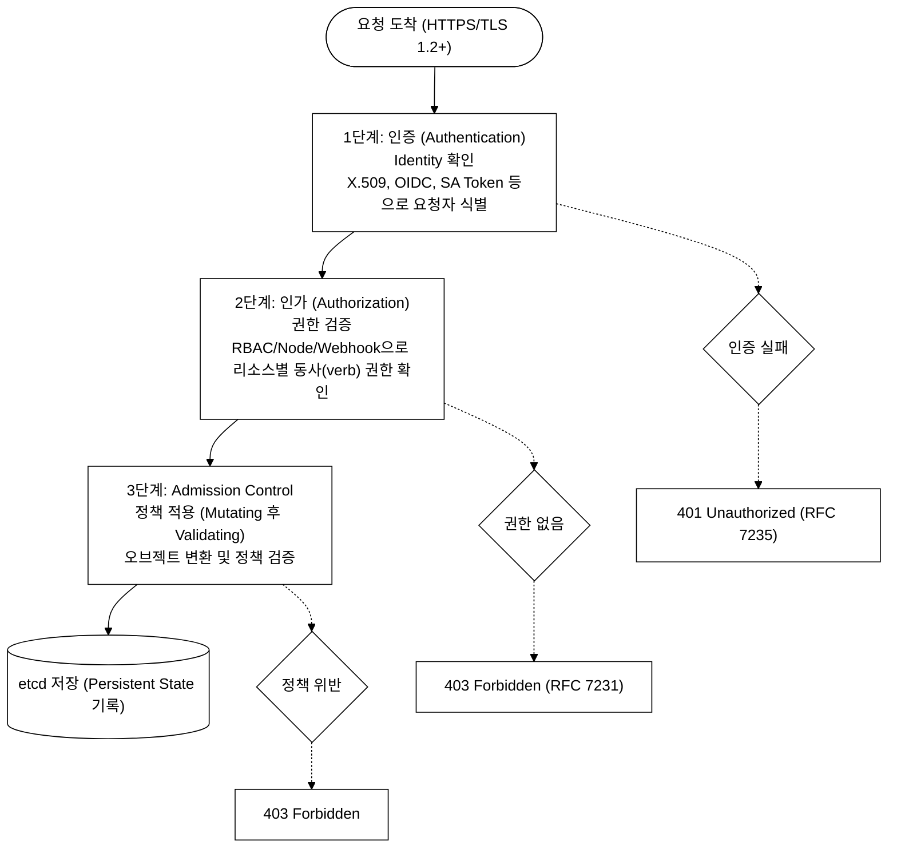
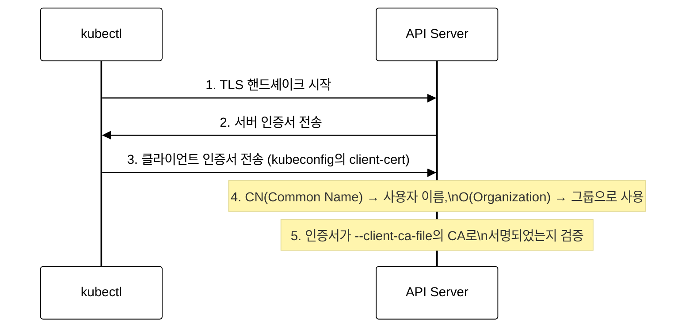
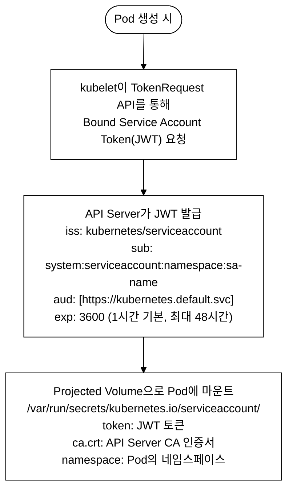
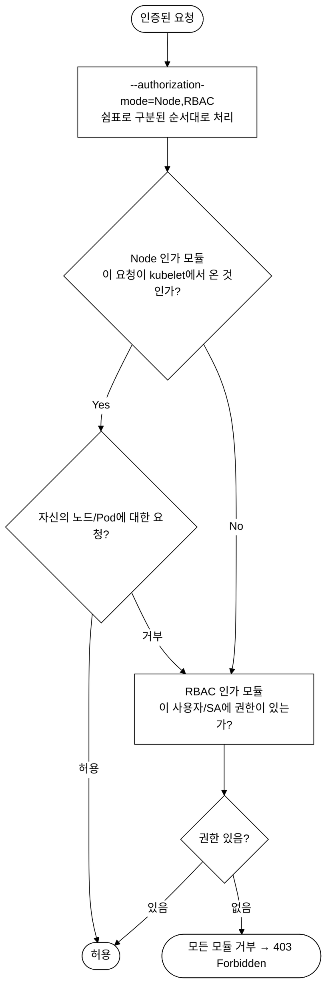
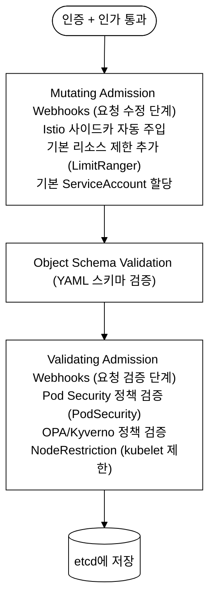
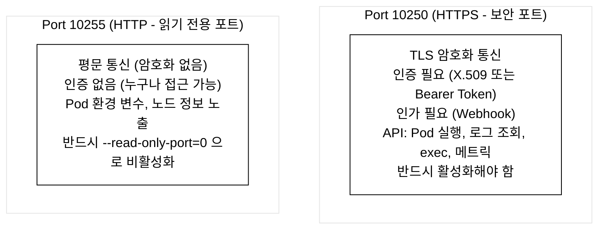
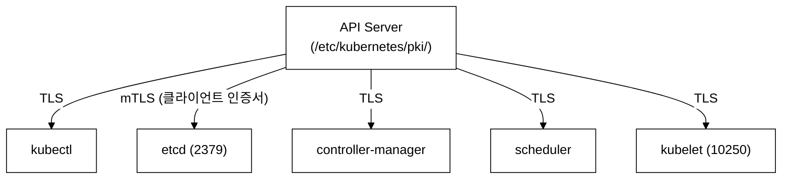

# KCSA Day 3: API Server, etcd, kubelet 보안

> **시험 비중:** Kubernetes Cluster Component Security — 22% (가장 높은 비중)
> **목표:** API Server의 3단계 요청 처리, etcd 보안, kubelet 보안, Control Plane TLS 통신을 완벽히 이해한다.

Day 2(공격 모델, 4C, 위협 모델링)에서 정의한 위협 모델을 전제로, 오늘은 그 위협을 실제로 막는 Control Plane 컴포넌트(API Server, etcd, kubelet) 보안 구현을 다룬다. 이 도메인은 KCSA 전체 문항 중 22%를 차지해 단일 도메인 기준 가장 높은 비중이다.

---

## 오늘의 학습 목표

- [ ] API Server의 3단계 처리 흐름(인증 → 인가 → Admission)을 순서대로 설명할 수 있다
- [ ] 6가지 인증 방법의 동작 원리와 권장 여부를 비교할 수 있다
- [ ] Node+RBAC 인가 모드가 필요한 이유와 처리 순서를 설명할 수 있다
- [ ] Mutating과 Validating Admission의 차이와 실행 순서를 설명할 수 있다
- [ ] etcd가 왜 클러스터 전체의 신뢰 기반인지, 보안 설정 3요소(TLS·mTLS·Encryption at Rest)를 설명할 수 있다
- [ ] EncryptionConfiguration 프로바이더 순서의 의미와 프로바이더별 트레이드오프를 설명할 수 있다
- [ ] kubelet의 --read-only-port=10255 위험성과 권장 보안 설정을 설명할 수 있다
- [ ] Control Plane 컴포넌트 간 TLS/mTLS 통신 경로를 인증서 파일명과 함께 설명할 수 있다

---

## 1. API Server 보안 — 3단계 요청 처리 흐름

### 1.0 등장 배경

```
기존 방식의 한계:
초기 Kubernetes에서는 API Server 인증이 정적 토큰 파일(--token-auth-file)이나
Basic Auth에 의존했다. 이 방식의 문제:

1. 정적 토큰은 파일에 평문으로 저장되며, 변경 시 API Server 재시작이 필요하다
2. Basic Auth는 HTTP 헤더에 비밀번호가 Base64로만 인코딩되어 전송된다
3. 인가 모드가 AlwaysAllow이면 인증된 사용자가 모든 작업을 수행할 수 있다
4. Admission Control이 없으면 악성 Pod 스펙을 검증 없이 배포할 수 있다

해결:
API Server의 3단계 직렬 파이프라인(Authentication → Authorization → Admission)은
각 단계가 독립적인 보안 게이트로 작동한다. X.509/OIDC 인증, Node+RBAC 인가,
Mutating/Validating Admission으로 다층 방어를 구현한다.
```

### 1.1 API Server 3단계 요청 처리 파이프라인

API Server는 모든 요청을 직렬 파이프라인(Serial Pipeline)으로 처리한다.
각 단계를 통과해야만 다음 단계로 진행되며, 실패 시 즉시 거부된다.


_그림 1. API Server의 인증-인가-Admission 직렬 파이프라인과 단계별 실패 응답._

### 1.2 1단계: 인증(Authentication) 상세

#### 인증 방법 비교표

인증의 핵심은 "요청자가 누구인지 증명하는 것"이다. Kubernetes가 지원하는 방법은 아래 6가지로, 각각 신원 증명 방식이 다르다.

- **X.509 클라이언트 인증서**: PKI(Public Key Infrastructure, 공개 키 기반 구조)에서 CA(Certificate Authority, 인증 기관)가 서명한 인증서로 신원을 증명한다. TLS 핸드셰이크(TLS handshake — 클라이언트와 서버가 암호화 통신 전에 서로를 인증하고 대칭키를 교환하는 과정) 과정에서 양방향 인증(mTLS)이 이루어진다.
- **OIDC**: OAuth 2.0(위임 권한 부여 프레임워크)을 확장해 사용자 신원을 JWT(JSON Web Token — JSON 형식의 서명된 토큰, Base64url 인코딩된 Header.Payload.Signature 3부분으로 구성)로 증명하는 방식이다.
- **ServiceAccount Token**: 클러스터 내부 서비스(Pod)가 API Server에 접근할 때 사용하는 자동 발급 토큰이다. Bound Token 방식(TokenRequest API로 특정 대상·만료 시간이 바인딩된 JWT)을 사용한다.
- **Webhook Token**: 외부 HTTP 서비스에 토큰 검증을 위임하는 방식이다. Bearer Token(HTTP Authorization 헤더에 `Bearer <토큰>` 형식으로 담는 문자열)을 외부 서버가 검증한다.
- **Bearer Token (정적)**: 파일(`--token-auth-file`)에 평문으로 저장한 정적 토큰이다. §1.0에서 언급했듯이 변경 시 API Server 재시작이 필요하다.
- **Basic Auth**: HTTP 기본 인증으로 사용자명:비밀번호를 Base64 인코딩해 전송한다. 인코딩은 암호화가 아니므로 TLS 없이는 평문 노출과 동일하다.

| 인증 방법 | 메커니즘 | 보안 수준 | 권장 여부 |
|----------|----------|---------|----------|
| **X.509 클라이언트 인증서** | PKI 기반 상호 TLS | 높음 | 권장 (컴포넌트 간) |
| **OIDC** | OAuth 2.0 + ID Token | 높음 | 권장 (사용자) |
| **ServiceAccount Token** | Bound JWT (TokenRequest API) | 보통 | 권장 (Pod) |
| **Webhook Token** | HTTP Callback 검증 | 보통 | 상황에 따라 |
| **Bearer Token (정적)** | 파일 기반 정적 토큰 | 낮음 | 비권장 |
| **Basic Auth** | HTTP Basic Authentication | 매우 낮음 | 사용 금지 |

#### X.509 인증서 인증 흐름


_그림 2. X.509 클라이언트 인증서 기반 상호 TLS 인증 시퀀스._

예시: CN=admin, O=system:masters
→ 사용자: admin, 그룹: system:masters

> **주의 — system:masters 그룹**: 인증서의 O(Organization) 필드가 Kubernetes 그룹으로 매핑된다. 그중 `system:masters`는 RBAC(Role-Based Access Control — 역할 기반 접근 제어, §1.3에서 설명) 규칙을 전혀 검사하지 않고 모든 작업을 허용하는 특수 하드코딩 그룹이다. 이 그룹은 API Server 코드 내부에서 RBAC 체크 이전에 슈퍼유저로 처리되므로, ClusterRoleBinding으로 제한할 수도 없다. 따라서 `O=system:masters`로 발급된 인증서는 클러스터 완전 제어권을 의미한다. kubeadm이 생성하는 `admin.conf`가 이 인증서를 사용한다(CKA Day 8 RBAC 절에서 재검토).

#### ServiceAccount Token 인증 흐름


_그림 3. ServiceAccount Bound Token(JWT) 발급 및 Projected Volume 마운트 흐름._

그림 3의 JWT 클레임(claim — JWT Payload 안에 포함된 키-값 쌍으로, 토큰의 발급자·주체·용도 등 메타데이터를 나타낸다) 풀이:
- `iss`(issuer, 발급자): 이 토큰을 발급한 주체. `kubernetes/serviceaccount`는 Kubernetes API Server가 발급했음을 나타낸다.
- `sub`(subject, 토큰 주체): 토큰이 대표하는 ServiceAccount 식별자. `system:serviceaccount:namespace:sa-name` 형식이다.
- `aud`(audience, 수신 대상): 이 토큰을 검증하고 수락할 서비스. `https://kubernetes.default.svc`는 API Server만 이 토큰을 검증해야 함을 명시한다. 다른 서비스에서 이 토큰을 사용하면 audience 불일치로 검증이 거부된다(토큰 재사용 공격 방어).
- `exp`(expiration, 만료 시각): Unix timestamp(1970-01-01 00:00:00 UTC 기준 경과 초). 3600이면 발급 후 1시간 뒤 만료된다. Bound Token 방식이 도입되기 전 구 ServiceAccount Secret 토큰은 `exp` 클레임이 없어 무기한 유효했다.

#### API Server 인증 관련 핵심 플래그

```yaml
# kube-apiserver 매니페스트 (/etc/kubernetes/manifests/kube-apiserver.yaml)
apiVersion: v1
kind: Pod
metadata:
  name: kube-apiserver
  namespace: kube-system
spec:
  containers:
    - name: kube-apiserver
      image: registry.k8s.io/kube-apiserver:v1.31.0
      command:
        - kube-apiserver

        # === 인증 관련 플래그 ===

        - --anonymous-auth=false
          # 익명 인증 비활성화
          # 기본값: true (위험!)
          # false로 설정하면 인증 없는 요청은 401 반환

        - --client-ca-file=/etc/kubernetes/pki/ca.crt
          # X.509 클라이언트 인증서 인증에 사용할 CA 파일

        - --service-account-issuer=https://kubernetes.default.svc
          # SA 토큰의 issuer (iss 클레임)

        - --service-account-key-file=/etc/kubernetes/pki/sa.pub
          # SA 토큰 서명 검증에 사용할 공개 키

        # - --token-auth-file=/path/to/tokens  ← 사용 금지!
        #   # 정적 토큰 파일: 평문 저장, 갱신 시 재시작 필요
```

#### OIDC 인증 설정 — kube-apiserver 플래그

비교표에서 OIDC를 "권장(사용자)" 방법으로 제시했지만, X.509와 달리 OIDC는 kube-apiserver에 추가 플래그를 명시해야만 활성화된다. OIDC 흐름은 다음과 같다: 사용자가 외부 IdP(Identity Provider — Keycloak, Dex, Google 등 신원 제공자)에 로그인 → IdP가 JWT 형식의 ID Token 발급 → 사용자가 이 토큰을 `kubectl`의 `--token` 또는 kubeconfig `user.token`에 지정 → API Server가 아래 플래그로 토큰을 검증.

```yaml
# kube-apiserver 매니페스트에 추가할 OIDC 관련 플래그
        - --oidc-issuer-url=https://keycloak.example.com/realms/myrealm
          # IdP의 OIDC Discovery 엔드포인트 기반 URL (/.well-known/openid-configuration 자동 조회)
          # API Server가 이 URL에서 IdP 공개 키를 가져와 JWT 서명을 검증한다

        - --oidc-client-id=kubernetes
          # API Server가 수락할 토큰의 aud(audience) 클레임 값
          # IdP에서 발급한 토큰의 aud가 이 값과 일치해야 검증 통과

        - --oidc-username-claim=email
          # JWT Payload에서 Kubernetes 사용자 이름으로 사용할 클레임 키
          # 기본값: sub (불투명 ID). email은 사람이 읽기 쉬운 형식
          # 이 값이 RBAC RoleBinding의 subjects[].name과 매핑된다

        # 선택 플래그:
        # - --oidc-groups-claim=groups
        #   JWT의 groups 클레임을 Kubernetes 그룹으로 매핑 (GroupBinding용)
        # - --oidc-ca-file=/etc/kubernetes/pki/oidc-ca.crt
        #   IdP가 자체서명(self-signed) 인증서를 사용하는 경우 CA 지정
```

`--oidc-issuer-url`에 지정한 IdP가 자체서명 인증서를 사용한다면 `--oidc-ca-file`에 해당 CA를 지정해야 한다. 자체서명 CA 생성 명령:

```bash
# 로컬 OIDC IdP용 자체서명 CA 생성 (openssl 필요)
openssl req -x509 -newkey rsa:4096 -keyout oidc-ca.key -out oidc-ca.crt \
  -days 3650 -nodes -subj "/CN=oidc-ca"
# 생성된 oidc-ca.crt를 --oidc-ca-file 경로에 배치하고 kube-apiserver를 재시작한다
```

### 1.3 2단계: 인가(Authorization) 상세

#### 인가 모드 비교표

| 인가 모드 | 설명 | 권장 여부 |
|----------|------|----------|
| **RBAC** | Role/ClusterRole + Binding으로 역할 기반 접근 제어 | **권장** |
| **Node** | kubelet이 자신의 노드에 스케줄된 Pod만 접근 가능 | **권장 (RBAC와 함께)** |
| **ABAC** | JSON 정책 파일 기반, 변경 시 재시작 필요 | 비권장 |
| **Webhook** | 외부 서비스에 인가 결정 위임 | 특수 상황 |
| **AlwaysAllow** | 모든 요청 허용 | **절대 비권장** |

#### 인가 처리 흐름


_그림 4. Node,RBAC 순차 인가 모듈 처리 흐름 — 한 모듈이라도 허용하면 요청 허용, 전부 거부 시 403._

**Node 인가 모듈이란**: kubelet은 API Server로부터 발급받은 특수 형식의 인증서(`CN=system:node:worker1`, `O=system:nodes`)로 인증된다. Node 인가 모듈은 이 인증서의 CN 값을 읽어, 해당 kubelet이 자신이 실행 중인 노드에 스케줄된 Pod와 관련 리소스(ConfigMap, Secret, PersistentVolume 등)에만 접근할 수 있도록 제한한다. 예를 들어 `worker1` 노드의 kubelet은 `worker1`에 스케줄된 Pod의 Secret은 읽을 수 있지만, `worker2`에 스케줄된 Pod의 리소스는 접근이 거부된다. 이 제한이 없다면 kubelet 하나가 침해당했을 때 전체 클러스터의 Secret을 열람할 수 있게 된다.

#### RBAC 동작 확인 — Role/RoleBinding 예시

RBAC(Role-Based Access Control — 역할 기반 접근 제어)는 "어떤 리소스에 어떤 동사(verb)를 허용하는가"를 Role 오브젝트에 선언하고, RoleBinding으로 사용자·그룹·ServiceAccount에 연결하는 방식이다. 아래 예시는 `dev` 네임스페이스에서 Pod를 조회(get·list)할 수 있는 최소 권한 Role과 그 바인딩이다.

```yaml
# Role: dev 네임스페이스 안에서만 유효한 역할 정의
apiVersion: rbac.authorization.k8s.io/v1
kind: Role
metadata:
  name: pod-reader
  namespace: dev
rules:
  - apiGroups: [""]          # "" = core API group (Pod, Service, ConfigMap 등)
    resources: ["pods"]
    verbs: ["get", "list"]   # 허용 동사: 조회만, 삭제(delete)·생성(create) 불가
---
# RoleBinding: 위 Role을 jane 사용자에게 연결
apiVersion: rbac.authorization.k8s.io/v1
kind: RoleBinding
metadata:
  name: read-pods-jane
  namespace: dev
subjects:
  - kind: User
    name: jane                # X.509 인증서의 CN 값 또는 OIDC 사용자명과 일치해야 함
    apiGroup: rbac.authorization.k8s.io
roleRef:
  kind: Role
  name: pod-reader
  apiGroup: rbac.authorization.k8s.io
```

Role(네임스페이스 범위)과 ClusterRole(클러스터 전체 범위)의 차이: Role은 한 네임스페이스 안에서만 효력이 있다. 클러스터 전체 Node·PersistentVolume처럼 네임스페이스가 없는 리소스에는 ClusterRole + ClusterRoleBinding을 써야 한다.

```bash
# 권한 부여 후 실제로 jane이 dev 네임스페이스의 Pod를 조회할 수 있는지 확인
# --as 플래그는 특정 사용자로 API 요청을 위장(impersonate)해 권한을 테스트한다
kubectl --kubeconfig kubeconfig/dev.yaml \
  auth can-i get pods --namespace dev --as=jane
# 기대 출력: yes

# 삭제 권한은 없어야 함
kubectl --kubeconfig kubeconfig/dev.yaml \
  auth can-i delete pods --namespace dev --as=jane
# 기대 출력: no

# 다른 네임스페이스(default)에서는 Role이 적용되지 않으므로 no
kubectl --kubeconfig kubeconfig/dev.yaml \
  auth can-i get pods --namespace default --as=jane
# 기대 출력: no
```

`kubectl auth can-i`는 API Server의 SubjectAccessReview(SAR — 특정 주체가 특정 리소스에 대해 특정 동사를 수행할 권한이 있는지 API Server에 질의하는 API) 엔드포인트를 통해 인가 결과를 반환한다. 실제 요청을 실행하지 않으므로 클러스터를 건드리지 않고 RBAC 설정을 사전 점검하는 데 활용한다.

### 1.4 3단계: Admission Control 상세

#### Admission Control 처리 순서


_그림 5. Admission Control 처리 순서 — Mutating이 먼저, Validating이 나중에 실행되어 수정된 필드를 검증한다._

#### 주요 내장 Admission Controller (kubeadm 기본 활성화, CKS 시험 빈출)

Admission Controller는 인증·인가를 통과한 요청을 두 방식으로 처리한다.
- **Mutating(변형)**: Pod 스펙을 가로채 필드를 추가하거나 수정한다. 예: 사용자가 `kubectl apply -f pod.yaml`을 실행하면 Mutating Webhook이 Pod 스펙에 자동으로 Istio 사이드카 컨테이너를 추가한다. 사용자는 이 수정을 요청하지 않았지만 Webhook이 자동 삽입한다.
- **Validating(검증)**: 이미 확정된 스펙이 정책에 맞는지 확인하고, 위반 시 거부한다. 수정은 하지 않는다. 예: LimitRanger는 리소스 요청(request — Pod가 보장받길 원하는 CPU/메모리 최솟값)과 제한(limit — Pod가 사용할 수 있는 CPU/메모리 최댓값)이 설정되지 않은 Pod에 기본값을 자동 추가(Mutating)하거나 허용 범위를 초과하면 거부(Validating)한다.

| Admission Controller | 유형 | 역할 | 보안 중요도 |
|---------------------|------|------|-----------|
| **PodSecurity** | Validating | PSS 정책 적용 (PSP 후속) | 최고 |
| **NodeRestriction** | Validating | kubelet이 자신의 노드/Pod만 수정 가능 | 최고 |
| **ServiceAccount** | Mutating | Pod에 SA 자동 할당, 토큰 마운트 | 높음 |
| **LimitRanger** | Mutating | 리소스 기본값/제한 자동 적용 | 높음 |
| **ResourceQuota** | Validating | 네임스페이스 리소스 총량 제한 | 높음 |
| **NamespaceLifecycle** | Validating | 삭제 중인 NS에 새 리소스 생성 방지 | 보통 |

> **참고 — ServiceAccount Controller**: Pod에 ServiceAccount를 자동 마운트하는 것은 ServiceAccount Admission Controller(내장)가 담당한다. 이는 외부 Webhook이 아니라 API Server 내부 로직이다. 표에 포함시킨 이유는 Pod 생성 흐름에서 Admission 단계에서 작동하기 때문이다. PSA(Pod Security Admission — PSP를 대체해 Kubernetes 1.25부터 내장된 보안 정책 적용 메커니즘)는 PodSecurity Controller가 구현한다.

#### Admission Webhook 예제

```yaml
# Validating Webhook 설정
apiVersion: admissionregistration.k8s.io/v1
kind: ValidatingWebhookConfiguration
metadata:
  name: pod-policy-webhook
webhooks:
  - name: pod-policy.example.com
    admissionReviewVersions: ["v1"]
    sideEffects: None

    clientConfig:
      service:
        name: pod-policy-service
        namespace: security
        path: /validate
      caBundle: <base64-encoded-ca-cert>

    rules:
      - apiGroups: [""]
        apiVersions: ["v1"]
        operations: ["CREATE", "UPDATE"]
        resources: ["pods"]
        scope: Namespaced

    failurePolicy: Fail    # Webhook 실패 시: Fail(거부) 또는 Ignore(허용)
                           # 보안 목적: Fail 권장
    timeoutSeconds: 10
```

---

## 2. etcd 보안 심화

### 2.0 등장 배경

Kubernetes 이전 컨테이너 오케스트레이션 환경에서는 클러스터 상태를 파일 시스템(JSON/YAML 파일)이나 개별 서버의 로컬 데이터베이스에 저장했다. 이 방식의 한계는 세 가지였다.

첫째, **단일 장애점(Single Point of Failure)**: 상태를 저장한 노드가 다운되면 클러스터 전체가 복구 불가 상태가 된다. 노드 재시작 후 "어떤 Pod가 어떤 노드에 있어야 하는가"를 알 수 없으므로 스케줄러가 동작할 수 없다.

둘째, **일관성 문제**: 복수의 컨트롤 플레인 노드가 제각각 상태 파일을 갖거나 단순 리더-팔로워 복제를 쓰면, 네트워크 분할(partition) 발생 시 두 노드가 모두 자신이 리더라고 판단하고(split-brain) 서로 다른 스케줄 결정을 내릴 수 있다.

셋째, **평문 저장**: 초기 구현에서 Secret 데이터도 그대로 파일에 저장됐다. 디스크 접근 권한이 있으면 DB 비밀번호, TLS 키 등이 그대로 노출된다.

**해결 — etcd 도입**: etcd는 Raft 분산 합의 알고리즘을 내장한 분산 KV 스토어로, 홀수 노드(3/5/7) 과반이 살아 있으면 split-brain 없이 일관된 쓰기를 보장한다. 그러나 도입 자체가 보안 문제를 자동 해결하지는 않았다. etcd 2.x 시대에는 기본 설정이 TLS 없는 평문 통신이었고, API Server만 etcd에 쓸 수 있다는 네트워크 분리가 이루어지지 않은 환경도 흔했다.

**트레이드오프**: etcd는 쓰기 성능이 약하다(Raft 합의로 과반 확인 후 커밋). 초당 수천 건 이상의 오브젝트 변경이 몰리면 레이턴시가 급등한다. 따라서 Kubernetes는 etcd에 쓰기를 최소화하고 controller-manager/scheduler는 watch API로 변경을 수신해 메모리 내 캐시를 유지하는 구조(informer 패턴)를 채택했다.

### 2.1 etcd의 중요성

etcd는 Kubernetes의 유일한 Persistent State Store(영속 상태 저장소)이다.

**etcd 침해 = 전체 클러스터 상태의 기밀성(Confidentiality) 및 무결성(Integrity) 상실이다.**

etcd에 저장되는 민감 데이터 경로:

- `/registry/secrets/...` — 모든 Secret (DB 비밀번호, API 키, TLS 인증서)
- `/registry/pods/...` — 모든 Pod 스펙 (환경변수 포함)
- `/registry/services/...` — 모든 Service 엔드포인트
- `/registry/configmaps/...` — 모든 ConfigMap (설정 데이터)
- `/registry/clusterroles/...` — RBAC 정책 (권한 구조 전체)

etcd 경로 규칙: `/registry/{리소스타입}/{네임스페이스}/{객체이름}`. 예를 들어 네임스페이스 `default`의 Secret `my-secret`은 `key=/registry/secrets/default/my-secret`, `value=JSON 직렬화된 객체 데이터`로 저장된다.

etcd는 평면(flat) key-value 스토어이므로 `/` 구분자는 디렉터리가 아니라 단순한 문자열 프리픽스다. 이 프리픽스를 범위 조회(range query — etcd에서 `/registry/secrets/`처럼 공통 프리픽스로 시작하는 모든 키를 일괄 조회하는 방식. SQL의 `LIKE 'prefix%'`와 유사하다)로 특정 네임스페이스 또는 리소스 타입의 객체를 일괄 조회할 수 있다.

### 2.2 etcd 보안 설정 상세

```yaml
# /etc/kubernetes/manifests/etcd.yaml (static pod)
apiVersion: v1
kind: Pod
metadata:
  name: etcd
  namespace: kube-system
spec:
  containers:
    - name: etcd
      image: registry.k8s.io/etcd:3.5.15-0
      command:
        - etcd

        # === 서버 TLS 설정 ===
        - --cert-file=/etc/kubernetes/pki/etcd/server.crt
        - --key-file=/etc/kubernetes/pki/etcd/server.key
        - --trusted-ca-file=/etc/kubernetes/pki/etcd/ca.crt

        - --client-cert-auth=true
          # 클라이언트 인증서 요구
          # false이면 인증서 없이도 etcd에 접근 가능! (매우 위험)

        # === 피어(peer) TLS 설정 ===
        - --peer-cert-file=/etc/kubernetes/pki/etcd/peer.crt
        - --peer-key-file=/etc/kubernetes/pki/etcd/peer.key
        - --peer-trusted-ca-file=/etc/kubernetes/pki/etcd/ca.crt
        - --peer-client-cert-auth=true

        # === 리스닝 주소 ===
        - --listen-client-urls=https://127.0.0.1:2379,https://10.0.0.5:2379
          # 2379: 클라이언트 통신 포트
        - --listen-peer-urls=https://10.0.0.5:2380
          # 2380: 피어 통신 포트

        # === 데이터 디렉토리 ===
        - --data-dir=/var/lib/etcd
          # chmod 700 /var/lib/etcd (소유자만 접근 가능)
```

### 2.3 Encryption at Rest 상세

```yaml
# /etc/kubernetes/enc/encryption-config.yaml
apiVersion: apiserver.config.k8s.io/v1
kind: EncryptionConfiguration
resources:
  - resources:
      - secrets
      - configmaps
    providers:
      # 프로바이더 순서가 매우 중요!
      # 첫 번째: 새로 저장되는 데이터 암호화에 사용
      # 나머지: 기존 데이터 복호화에 사용

      - secretbox:
          keys:
            - name: key1
              secret: <base64-encoded-32-byte-key>

      - identity: {}
        # 마지막에 identity를 두면 암호화되지 않은 기존 데이터를 읽을 수 있음
```

#### 암호화 방식 선택: 트레이드오프

프로바이더를 선택하기 전에 두 가지 핵심 개념을 이해해야 한다.

- **KMS(Key Management Service)**: 암호화 키를 외부 서비스(AWS KMS, HashiCorp Vault 등)에 위탁 관리하는 방식이다. 키가 클러스터 내부에 저장되지 않으므로 etcd 파일이 유출되더라도 키가 없으면 복호화가 불가능하다.
- **DEK(Data Encryption Key)**: 실제 데이터를 암호화하는 키다. KMS v2는 DEK를 메모리에 캐싱해 매번 외부 KMS를 호출하지 않고도 빠르게 암호화/복호화한다.

각 프로바이더의 트레이드오프:

| 프로바이더 | 알고리즘 | 장점 | 단점 | 선택 기준 |
|----------|---------|------|------|---------|
| `identity` | 없음 (평문) | 없음 | 암호화 자체가 없음 | 마이그레이션 중 기존 데이터 읽기 전용 |
| `secretbox` | XSalsa20-Poly1305 | 로컬에서 빠르고 안전, 구현 단순 | 키가 API Server 설정 파일에 저장 → 키 로테이션이 수동 | 개발 환경, 로컬 클러스터 |
| `aescbc` | AES-CBC | 업계 표준 | 패딩 오라클 공격(padding oracle attack — 암호화 블록 패딩 검증 응답의 차이를 이용해 키 없이 평문을 복구하는 공격, AES-CBC 구현 결함 시 발생) 취약 가능성, secretbox보다 느림 | 레거시 호환 필요 시 |
| `aesgcm` | AES-GCM | CBC보다 빠르고 인증 포함 | nonce(한 번만 써야 하는 난수값) 재사용 시 보안 붕괴, 키 자동 만료 후 교체 필수 | 단기 실습/테스트 |
| `kms` v2 | 외부 KMS 위임 | 키가 클러스터 외부에 격리, DEK 캐싱으로 성능 우수, 키 로테이션 자동화 가능 | 외부 KMS 서비스 의존 → 네트워크 레이턴시, 운영 복잡도 증가 | 프로덕션 환경 |

**선택 가이드**: 개발/로컬 환경 → `secretbox`, 프로덕션 환경 → `kms v2` 권장.

#### 프로바이더 비교표

| 프로바이더 | 알고리즘 | 프로덕션 권장 | 비고 |
|----------|---------|-------------|------|
| `identity` | 없음 (평문) | 비권장 | 기본값, 암호화 없음 |
| `secretbox` | XSalsa20+Poly1305 | 권장 (로컬) | 가장 빠르고 안전한 로컬 옵션 |
| `aescbc` | AES-CBC | 보통 | 패딩 오라클 공격 가능성 |
| `aesgcm` | AES-GCM | 보통 | nonce 재사용 주의 |
| `kms` v2 | KMS 위임 | **가장 권장** | DEK 캐싱으로 성능 향상 |

#### 기존 데이터 재암호화

```bash
# EncryptionConfiguration 적용 후 반드시 실행
kubectl get secrets --all-namespaces -o json | kubectl replace -f -

# 암호화 확인 (etcd에서 직접 조회)
ETCDCTL_API=3 etcdctl \
  --cacert=/etc/kubernetes/pki/etcd/ca.crt \
  --cert=/etc/kubernetes/pki/etcd/server.crt \
  --key=/etc/kubernetes/pki/etcd/server.key \
  get /registry/secrets/default/my-secret

# 암호화 전: 평문 데이터가 보임
# 암호화 후: k8s:enc:secretbox:v1:key1:... 형태
```

---

## 3. kubelet 보안 심화

### 3.0 등장 배경

**직전 기술의 한계 — 기본 개방 포트**: Kubernetes 초기(1.0~1.5 시대)에는 kubelet이 기본적으로 두 포트를 열었다. 포트 10250(HTTPS)은 인증을 요구했지만 **포트 10255(HTTP)는 인증 없이 누구나 접근 가능한 읽기 전용 포트**였다. 이 포트에서는 `/pods`, `/metrics`, `/configz`(kubelet 전체 설정 포함) 엔드포인트가 열려 있어, 노드 IP만 알면 해당 노드의 모든 Pod 목록과 환경 변수(DB 접속 문자열, API 키 등)를 평문으로 수집할 수 있었다.

**공격 사례 — Shodan 노출**: 2017~2018년 Shodan(인터넷 연결 장치 탐색 엔진) 스캔 결과에서 10255 포트가 공인 인터넷에 직접 노출된 Kubernetes 노드가 수천 개 발견됐다. 공격자는 HTTP GET만으로 클러스터 내 비밀 정보를 수집하고, 일부 사례에서는 10250 포트의 `/exec` API(인증 우회 취약점과 결합)를 통해 실행 중인 컨테이너에 임의 명령을 실행했다. Tesla의 Kubernetes 클러스터가 암호화폐 채굴에 악용된 2018년 사례(RedLock 보고서)가 대표적이다.

**무엇이 나아졌나**: Kubernetes 1.10 이후 기본값 변경 작업이 시작됐고, kubeadm 1.20 이후에는 `anonymous.enabled: false`, `authorization.mode: Webhook`, `readOnlyPort: 0`이 기본 설정이 됐다. 또한 TokenRequest API(Bound Service Account Token)가 도입되어 kubelet이 요청별·시간 제한부 토큰을 발급받아 API Server를 통해 인증/인가를 위임하는 구조가 확립됐다.

**트레이드오프**: 인증·인가를 모두 API Server에 위임하면(Webhook 모드) kubelet이 API Server 없이는 동작 불가한 결합도가 생긴다. 이를 완화하기 위해 kubelet은 TokenReview와 SubjectAccessReview 응답을 `cacheTTL`(기본 2분) 동안 캐싱해, API Server 일시 장애 시에도 기존 연결을 유지할 수 있게 한다.

### 3.1 kubelet이 위험한 이유

```
kubelet은 각 Worker Node에서 컨테이너 런타임(containerd)을 제어하는 에이전트이다.

kubelet 침해 시 위협:
- 해당 노드의 모든 컨테이너에 대한 임의 명령 실행
- Pod 삭제/변조를 통한 가용성 공격
- 악성 컨테이너 배포를 통한 Lateral Movement

따라서 kubelet API의 인증/인가 설정은 노드 보안의 핵심이다.
```

### 3.2 kubelet 설정 파일 상세

```yaml
# /var/lib/kubelet/config.yaml
apiVersion: kubelet.config.k8s.io/v1beta1
kind: KubeletConfiguration

# === 인증 설정 ===
authentication:
  anonymous:
    enabled: false              # 익명 접근 차단

  webhook:
    enabled: true               # API Server를 통한 인증
    cacheTTL: 2m

  x509:
    clientCAFile: /etc/kubernetes/pki/ca.crt

# === 인가 설정 ===
authorization:
  mode: Webhook                 # API Server에 인가 위임
                                # AlwaysAllow: 절대 사용 금지!

# === 보안 포트 설정 ===
readOnlyPort: 0                 # 읽기 전용 포트 비활성화
                                # 기본값: 10255 (위험!)
                                # 반드시 0으로 설정!

port: 10250                     # kubelet HTTPS 포트

# === TLS 설정 ===
tlsCertFile: /var/lib/kubelet/pki/kubelet.crt
tlsPrivateKeyFile: /var/lib/kubelet/pki/kubelet.key

# === 인증서 로테이션 ===
# serverTLSBootstrap: kubelet이 최초 시작 시 API Server를 통해
#   자신의 서버 인증서 발급을 자동 요청한다 (CSR — Certificate Signing Request).
#   관리자가 수동으로 인증서를 발급해 배포할 필요가 없다.
# rotateCertificates: 인증서 만료 전에 자동으로 갱신 요청을 보낸다.
# 두 플래그는 함께 사용해야 의미가 있다:
#   serverTLSBootstrap=true  → 초기 인증서 자동 발급
#   rotateCertificates=true  → 이후 만료 전 자동 갱신
# 결과: 관리자가 노드별 인증서를 수동 재발급하지 않아도 된다.
rotateCertificates: true
serverTLSBootstrap: true

# === 커널 보안 ===
protectKernelDefaults: true
```

### 3.3 kubelet 포트 비교

kubelet의 두 포트:


_그림 6. kubelet 보안 포트(10250)와 읽기 전용 포트(10255)의 보안 특성 비교._

---

## 4. 기타 컴포넌트 보안

### 4.0 등장 배경

**직전 기술의 한계 — 단일 권한 자격 증명**: Kubernetes 초기에는 controller-manager와 scheduler가 클러스터 admin 권한의 kubeconfig를 공유해 사용했다. 컨트롤러 하나가 침해되면 해당 자격 증명으로 클러스터 전체를 조작할 수 있었다. 또한 controller-manager의 `--profiling` 엔드포인트(`/debug/pprof`)가 기본 개방돼 있어 메모리 덤프·고루틴 추적 등 내부 상태 정보가 노출됐다.

**무엇이 나아졌나**: `--use-service-account-credentials=true` 플래그가 추가돼 각 컨트롤러(Deployment, ReplicaSet, StatefulSet, Node 등 30여 개)가 별도의 ServiceAccount와 RBAC 권한으로 동작하게 됐다. 예를 들어 `system:controller:node-controller`는 Node 리소스에만 접근할 수 있고, `system:controller:endpoint-slice-controller`는 EndpointSlice에만 쓸 수 있다. 이로써 단일 컨트롤러 침해가 전체 클러스터 장악으로 이어지지 않는다(최소 권한 원칙).

**트레이드오프**: 컨트롤러별 SA와 ClusterRoleBinding이 기본 설치 시 30개 이상 생성되어 RBAC 정책이 복잡해진다. Kubernetes 운영자가 커스텀 컨트롤러를 작성할 때 적절한 SA를 지정하지 않으면 의도치 않게 admin 권한의 default SA를 상속할 수 있으므로 주의가 필요하다.

### 4.1 kube-controller-manager 보안

```yaml
# /etc/kubernetes/manifests/kube-controller-manager.yaml
spec:
  containers:
    - command:
        - kube-controller-manager
        - --use-service-account-credentials=true
          # 각 컨트롤러가 별도의 SA 자격 증명 사용
        - --bind-address=127.0.0.1
          # 메트릭 서버를 localhost에만 바인딩
        - --profiling=false
          # 프로파일링 비활성화
```

### 4.2 Control Plane TLS 통신 전체 지도


_그림 7. Control Plane 컴포넌트 간 TLS/mTLS 통신 지도 — etcd만 상호 인증(mTLS)을 사용한다._

인증서 파일 정리 (`/etc/kubernetes/pki/`):
> **예시(참조) — ├── ca.crt / ca.key                 ← 클러스터 CA:** KCSA 보안 개념/점검 기대 출력(설정/도구/환경 의존). 재현 가능 핵심은 KCSA daily 및 본 캡처 참고.

**인증서 역할 해석**: 인증서는 "서버 인증서"와 "클라이언트 인증서"로 구분된다. TLS에서 상호 인증(mTLS — mutual TLS, 서버와 클라이언트 양쪽이 인증서로 서로를 인증하는 방식)을 수행하려면 각 통신 방향마다 별도 인증서가 필요하다.

- `apiserver.crt`: API Server가 TLS 서버로서 kubectl·kubelet·controller-manager 등 클라이언트에게 제시하는 **서버 인증서**다. "나는 신뢰할 수 있는 API Server다"를 증명한다.
- `apiserver-kubelet-client.crt`: API Server가 kubelet의 port 10250에 접근할 때 "나는 API Server다"를 증명하는 **클라이언트 인증서**다. kubelet은 이 인증서를 검증해 정상 API Server인지 확인한다.
- `apiserver-etcd-client.crt`: API Server가 etcd port 2379에 접근할 때 사용하는 **클라이언트 인증서**다. etcd는 `--client-cert-auth=true` 설정으로 이 인증서를 요구한다.
- 통신 경로마다 클라이언트 인증서를 분리하는 이유: 하나의 인증서가 탈취되더라도 해당 경로만 영향받고, 다른 경로는 차단된다(최소 권한 원칙 적용).

### 4.3 인증서 유효 기간

kubeadm 기본 인증서 유효 기간:

- **CA 인증서** (`ca.crt`, `etcd/ca.crt`, `front-proxy-ca.crt`): 10년 — 루트 신뢰 앵커이므로 긴 유효 기간을 가지며, 만료 시 클러스터 전체 재발급이 필요하다.
- **컴포넌트 인증서** (`apiserver.crt`, `apiserver-etcd-client.crt` 등 CA가 서명한 리프 인증서): 1년 — `kubeadm certs renew all`로 갱신. 만료 30일 전부터 갱신 권장.
- **SA 키** (`sa.pub` / `sa.key`): 만료 없음 — 서비스 어카운트 토큰 서명 검증용 키로, 만료 개념이 없다. 탈취 시 수동으로 교체해야 한다(교체 후 모든 SA 토큰 무효화).

_그림 8. kubeadm이 발급하는 인증서 종류별 기본 유효 기간._

갱신 방법:
```bash
kubeadm certs check-expiration    # 만료일 확인
kubeadm certs renew all           # 모든 인증서 갱신
systemctl restart kubelet         # 갱신 후 재시작 필요
```

---

## 5. 핵심 암기 항목

```
API Server 3단계: 인증 → 인가 → Admission
인가 권장: --authorization-mode=Node,RBAC
Admission 순서: Mutating → Validating
익명 접근 차단: --anonymous-auth=false

etcd 포트: 2379(클라이언트), 2380(피어)
etcd 보안: TLS + client-cert-auth + Encryption at Rest
Encryption 권장: kms v2 (프로덕션), secretbox (로컬)
EncryptionConfig 순서: 첫 번째 = 암호화용, 나머지 = 복호화용

kubelet 포트: 10250(보안, HTTPS), 10255(위험, HTTP)
kubelet 보안: anonymous-auth=false, authorization-mode=Webhook, read-only-port=0

인증서 위치: /etc/kubernetes/pki/
인증서 유효기간: 컴포넌트 1년, CA 10년
```

---

## 6. 복습 체크리스트

- [ ] API Server의 3단계 처리 흐름(인증→인가→Admission)을 설명할 수 있다
- [ ] 6가지 인증 방법을 나열하고 권장 여부를 알고 있다
- [ ] 인가 모드 중 권장 설정(Node,RBAC)과 각 모드의 역할을 설명할 수 있다
- [ ] Mutating과 Validating Admission의 순서와 차이를 설명할 수 있다
- [ ] 주요 내장 Admission Controller를 나열할 수 있다
- [ ] etcd 보안 설정(TLS, client-cert-auth, Encryption at Rest)을 설명할 수 있다
- [ ] EncryptionConfiguration의 프로바이더 순서의 의미를 알고 있다
- [ ] kubelet 보안 설정의 권장 값을 기억한다
- [ ] 10250(보안)과 10255(읽기전용) 포트의 차이를 설명할 수 있다
- [ ] 인증서 저장 위치와 유효 기간을 알고 있다

---

## 내일 예고: Day 4 - CIS Benchmark, Static Pod, 컴포넌트 보안 YAML, 연습 문제

- CIS Benchmark와 kube-bench
- Static Pod 보안 특성
- 보안 관련 YAML 예제 모음
- Pod 생성 전체 보안 흐름
- 연습 문제 18문제 + 상세 해설
- tart-infra 실습

---

## tart-infra 실습

### 실습 환경 전제 조건

> 이 실습은 아래 조건이 모두 충족된 상태에서 진행한다.
>
> 1. **클러스터 가동 확인**: `./scripts/boot.sh` 실행 후 `./scripts/fix-cluster-ip-drift.sh dev`로 IP 드리프트 복구 완료.
> 2. **kubeconfig 경로**: `kubeconfig/dev.yaml`
> 3. **노드 SSH 접속**: `ssh dev-master` (별칭 방식, `~/.ssh/config`의 ProxyCommand가 `tart ip`로 실시간 IP 조회)
> 4. **선행 리소스**: 특별한 사전 배포 없이 kubeadm 기본 설치 상태(kube-system 컴포넌트만)로 충분하다.
> 5. **파괴 실습 범위**: dev/staging 클러스터에서만 수행한다. platform/prod는 읽기 전용.

### 실습 환경 설정

```bash
# dev 클러스터에 접속 (API Server, etcd, kubelet 보안 확인)
export KUBECONFIG=kubeconfig/dev.yaml
kubectl get nodes
```

### 실습 1: API Server 인증/인가/Admission 3단계 확인

```bash
# API Server의 보안 플래그 확인
kubectl get pod kube-apiserver-dev-master -n kube-system -o yaml | grep -E "(--anonymous|--authorization|--enable-admission|--client-ca|--tls-cert)"
```

**검증 — 기대 출력:**

`--anonymous-auth`가 출력에 없으면 기본값 true로 동작하므로 명시적으로 false 설정이 필요하다.

**동작 원리 — 명령 해석 → 기대 출력 → 기술 원리:**

- **명령 해석**: kube-apiserver Static Pod의 YAML에서 보안 관련 플래그를 필터링한다. API Server는 `/etc/kubernetes/manifests/kube-apiserver.yaml`에 정의된 Static Pod로 실행된다.
- **기대 출력**: `--authorization-mode=Node,RBAC`, `--client-ca-file=...`, `--enable-admission-plugins=NodeRestriction` 등이 출력되어야 한다. `--anonymous-auth`가 출력에 없으면 기본값 `true`로 동작하므로 명시적으로 `false` 설정이 필요하다.
- **기술 원리 — API 요청 처리 3단계**:
  1. **인증(Authentication)**: `--client-ca-file`이 지정한 CA로 서명된 X.509 인증서, 또는 `--service-account-key-file`의 공개 키로 검증된 JWT 토큰으로 요청자 신원을 확인한다.
  2. **인가(Authorization)**: `--authorization-mode=Node,RBAC`에서 Node 모듈이 먼저 kubelet 요청을 처리하고, RBAC 모듈이 나머지를 처리한다. 두 모듈 중 하나라도 허용하면 통과한다.
  3. **Admission Control**: `--enable-admission-plugins=NodeRestriction`이 활성화된 컨트롤러 목록이다. Mutating(수정) → Validating(검증) 순으로 처리한다.
  4. 모든 단계를 통과해야 etcd에 저장된다.

### 실습 2: etcd 보안 설정 확인

```bash
# etcd Pod의 보안 플래그 확인
kubectl get pod etcd-dev-master -n kube-system -o yaml | grep -E "(--cert-file|--key-file|--trusted-ca|--client-cert-auth|--peer)"
```

**동작 원리 — 명령 해석 → 기대 출력 → 기술 원리:**

- **명령 해석**: `kubectl get pod etcd-dev-master -n kube-system -o yaml`로 etcd Static Pod의 전체 스펙을 가져오고, `grep`으로 보안 관련 플래그만 필터링한다.
- **기대 출력**: `--client-cert-auth=true`, `--cert-file=/etc/kubernetes/pki/etcd/server.crt`, `--peer-client-cert-auth=true` 등이 출력되어야 한다. `--client-cert-auth=true`가 없으면 인증서 없이도 etcd에 접근 가능한 심각한 보안 취약점이다.
- **기술 원리**:
  1. `--cert-file/--key-file`: etcd가 클라이언트(API Server)에게 제시하는 서버 TLS 인증서. 클라이언트가 "이게 진짜 etcd인가"를 검증한다.
  2. `--client-cert-auth=true`: 반대 방향 — etcd가 접속해 오는 클라이언트(API Server)의 인증서를 요구한다. 이 플래그가 없으면 누구든 etcd port 2379에 접근 가능하다.
  3. `--peer-cert/key-file`: etcd 클러스터 노드끼리의 Raft(분산 합의 알고리즘 — etcd가 여러 노드 간 데이터 일관성을 보장하는 메커니즘) 통신 암호화에 사용된다.
  4. `--trusted-ca-file`: 이 CA가 서명한 인증서만 신뢰한다. 클러스터 내부 PKI 경계를 정의한다.

### 실습 3: kubelet 보안 확인

```bash
# kubelet 포트 확인
# 보안 포트(10250): HTTPS, 인증 필요
# 읽기전용 포트(10255): HTTP, 인증 없음 — 비활성화 권장

# kubelet 설정 확인 (SSH 접속 필요)
# ssh dev-master
# sudo cat /var/lib/kubelet/config.yaml | grep -E "(authentication|authorization|readOnlyPort)"
```

**동작 원리 — 명령 해석 → 기대 출력 → 기술 원리:**

- **명령 해석**: SSH로 노드에 접속 후 kubelet 설정 파일을 조회한다(`tart ssh dev-master` 또는 `ssh dev-master`). kubelet은 Static Pod가 아니라 systemd 서비스로 직접 실행되므로 `kubectl get pod`로는 설정을 볼 수 없다.
- **기대 출력**: `readOnlyPort: 0`, `authorization.mode: Webhook`, `authentication.anonymous.enabled: false`가 설정되어 있어야 한다. `readOnlyPort: 10255`가 남아 있으면 노드 IP의 10255 포트로 인증 없이 Pod 정보를 열람할 수 있다.
- **기술 원리**:
  1. `authentication.anonymous.enabled: false` — 모든 요청에 인증서 또는 Bearer Token을 요구한다. 이것이 없으면 누구든 kubelet API에 접근 가능하다.
  2. `authentication.webhook.enabled: true` — kubelet이 Bearer Token을 받으면 API Server의 TokenReview API로 검증을 위임한다.
  3. `authorization.mode: Webhook` — 인증된 요청이 특정 리소스를 조작할 권한이 있는지 API Server의 SubjectAccessReview API로 위임한다. `AlwaysAllow`는 모든 인증된 요청을 허용하므로 절대 사용 금지.
  4. `readOnlyPort: 0` — 10255 포트를 완전히 비활성화한다. 이 포트는 암호화·인증 없이 Pod 목록, 환경변수, 노드 정보를 노출한다.

### 실습 4: 인증서 체계(PKI) 확인

```bash
# API Server가 사용하는 인증서 확인
kubectl get pod kube-apiserver-dev-master -n kube-system -o yaml | grep -E "(/etc/kubernetes/pki)" | sort -u
```

**검증 — 기대 출력:**
> **예시(참조) — dev 실측 (volume mount/path 행 포함):** KCSA 보안 개념/점검 기대 출력(설정/도구/환경 의존). 재현 가능 핵심은 KCSA daily 및 본 캡처 참고.

**동작 원리 — 명령 해석 → 기대 출력 → 기술 원리:**

- **명령 해석**: API Server Pod 스펙에서 `/etc/kubernetes/pki` 경로가 포함된 모든 행을 추출한다. `--tls-cert-file`, `--client-ca-file`, `--etcd-certfile`, `--kubelet-client-certificate` 등 플래그의 값이 모두 이 경로 아래에 있음을 확인한다.
- **기대 출력**: `apiserver.crt`, `apiserver-etcd-client.crt`, `apiserver-kubelet-client.crt` 등이 각자 다른 플래그에 할당되어 있어야 한다. 만약 하나의 인증서를 여러 통신 경로에 재사용하면 최소 권한 원칙 위반이다.
- **기술 원리**:
  1. `ca.crt`: 모든 인증서의 신뢰 앵커(trust anchor). 이 CA가 서명한 인증서만 클러스터 내에서 신뢰된다.
  2. `apiserver.crt`: API Server **서버 인증서** — kubectl·kubelet·controller-manager가 "이게 진짜 API Server인가"를 검증한다.
  3. `apiserver-kubelet-client.crt`: API Server가 kubelet 10250 포트 접근 시 제시하는 **클라이언트 인증서** — kubelet이 "이게 신뢰할 수 있는 API Server인가"를 검증한다.
  4. `apiserver-etcd-client.crt`: API Server가 etcd 2379 포트 접근 시 제시하는 **클라이언트 인증서** — etcd의 `--client-cert-auth=true`가 이를 요구한다.
  5. 인증서 유효 기간: CA는 10년, 나머지는 1년 — `kubeadm certs check-expiration`으로 확인하고 만료 전 `kubeadm certs renew all`로 갱신한다.

### 트러블슈팅: Control Plane 보안 문제

```
장애 시나리오 1: API Server 인증서 만료
  증상: kubectl 명령어 실행 시 "x509: certificate has expired" 에러
  디버깅:
    kubeadm certs check-expiration
    openssl x509 -in /etc/kubernetes/pki/apiserver.crt -noout -dates
  해결:
    kubeadm certs renew all
    systemctl restart kubelet

장애 시나리오 2: etcd 클라이언트 인증서 불일치
  증상: API Server가 시작되지 않음, "connection refused" 로그
  디버깅:
    kubectl logs kube-apiserver-dev-master -n kube-system --previous
    # 또는 직접 로그 확인: crictl logs <container-id>
  해결: --etcd-certfile과 --etcd-keyfile이 etcd의 --trusted-ca-file CA로
        서명된 인증서인지 확인한다

장애 시나리오 3: kubelet 10255 포트가 열려 있음
  증상: curl http://<node-ip>:10255/pods 로 Pod 정보가 노출됨
  공격-방어 매핑: Information Disclosure(STRIDE) → 정보 노출
  해결: kubelet config.yaml에서 readOnlyPort: 0으로 설정 후 kubelet 재시작
```

---

## 시험 팁

KCSA 객관식에서 이 도메인(22%)은 주로 다음 패턴으로 출제된다.

**자주 틀리는 오답 패턴**

1. **Admission 순서 혼동**: "Validating이 먼저 실행되어 스펙을 검증한 후 Mutating이 수정한다" — 틀렸다. 반드시 **Mutating 먼저, Validating 나중**이다. Mutating이 스펙을 변경한 뒤, 변경된 스펙을 Validating이 검증해야 일관성이 보장된다.

2. **authorization-mode=AlwaysAllow 함정**: 시험 문제에서 "이 설정이 안전한가"를 물을 때, AlwaysAllow는 인증된 사용자에게 모든 권한을 부여하므로 절대 프로덕션에서 사용하지 않는다. Node+RBAC 조합이 표준이다.

3. **etcd --client-cert-auth 기본값 착각**: "etcd는 기본적으로 TLS를 요구한다" — 틀렸다. kubeadm 설치 기준으로는 TLS가 설정되지만, etcd 자체 기본값은 TLS 없는 평문이다. `--client-cert-auth=true`를 명시해야만 인증서가 강제된다.

4. **kubelet anonymous-auth 기본값**: Kubernetes 1.20 이후 kubeadm 설치 기준 `anonymous.enabled: false`가 기본이지만, 시험 문제에서는 "다음 중 kubelet을 안전하게 하는 설정은?" 형식으로 `authentication.anonymous.enabled: false`를 올바른 답으로 고르게 한다.

5. **EncryptionConfig 프로바이더 순서**: 첫 번째 프로바이더가 **암호화**에 사용되고 나머지는 **복호화**에만 사용된다. `identity`가 첫 번째면 암호화가 사실상 적용되지 않는다.

6. **system:masters 그룹 우회**: "ClusterRoleBinding으로 system:masters 그룹의 권한을 제한할 수 있다" — 틀렸다. API Server 코드 내부에서 RBAC 검사 이전에 슈퍼유저로 처리하므로 RBAC으로 제한이 불가능하다.

---

## ✅ 자가점검

<details>
<summary>정답 보기</summary>

**Q1. API Server의 요청 처리 3단계를 순서대로 쓰시오.**

인증(Authentication) → 인가(Authorization) → Admission Control. 각 단계가 실패하면 즉시 거부된다(직렬 파이프라인). 인증 실패는 401, 인가/Admission 실패는 403을 반환한다.

---

**Q2. Mutating Admission과 Validating Admission의 실행 순서와 역할 차이는?**

Mutating이 먼저 실행되어 오브젝트 스펙을 수정(예: 사이드카 자동 주입, 기본 리소스 한도 추가)한다. 이후 Validating이 수정된 스펙이 정책에 부합하는지 검증하고 위반 시 거부한다. 순서가 반대이면 Mutating이 수정한 내용을 Validating이 보지 못해 검증 일관성이 깨진다.

---

**Q3. etcd --client-cert-auth=true가 없으면 어떤 위협이 발생하는가?**

etcd 포트 2379에 TLS 없이 또는 인증서 검증 없이 접근이 가능해진다. 공격자가 etcd에 직접 연결해 모든 Secret, Pod 스펙, RBAC 정책을 평문으로 읽거나 덮어쓸 수 있다. 클러스터 전체 상태의 기밀성과 무결성이 상실된다.

---

**Q4. kubelet readOnlyPort: 0의 의미는? 기본값은 무엇인가?**

readOnlyPort를 0으로 설정하면 포트 10255(HTTP, 인증 없음)가 완전히 비활성화된다. 이 포트가 열려 있으면 인증 없이 해당 노드의 Pod 목록, 환경변수, kubelet 설정 등이 노출된다. 역사적 기본값은 10255이었고, kubeadm 1.20 이후 기본 설정에서 0으로 변경됐다.

---

**Q5. EncryptionConfiguration에서 providers 순서가 중요한 이유는?**

첫 번째 프로바이더가 새로 저장되는 데이터의 암호화에 사용된다. 나머지 프로바이더는 기존에 그 프로바이더로 암호화된 데이터를 읽을 때(복호화)에만 사용된다. `identity`가 첫 번째이면 새 데이터가 평문으로 저장된다. 마이그레이션 시 기존 평문 데이터를 읽으려면 `identity`를 마지막에 두고 첫 번째에 새 암호화 프로바이더를 놓는다.

---

**Q6. authorization-mode=Node의 역할은? RBAC만으로는 왜 부족한가?**

Node 인가 모듈은 kubelet이 자신의 노드에 스케줄된 Pod와 직접 관련된 리소스(ConfigMap, Secret, PVC 등)에만 접근하도록 제한한다. RBAC만 쓰면 모든 kubelet이 같은 `system:nodes` 그룹 권한으로 전체 클러스터의 Secret을 읽을 수 있게 되어, 노드 하나 침해 시 전체 Secret이 노출된다. Node 모듈은 CN(노드 이름) 기준으로 접근 범위를 해당 노드에만 한정한다.

---

**Q7. system:masters 그룹이 위험한 이유는? ClusterRoleBinding으로 제한 가능한가?**

`system:masters` 그룹 멤버는 API Server 코드 내부에서 RBAC 검사 이전에 슈퍼유저로 처리된다. 따라서 ClusterRoleBinding을 통한 권한 제한이 불가능하다. 이 그룹의 인증서(예: kubeadm의 admin.conf)는 클러스터 완전 제어권을 의미하므로 엄격히 관리해야 한다.

</details>

---

## 더 읽을거리

- [Kubernetes 공식 문서: Authenticating](https://kubernetes.io/docs/reference/access-authn-authz/authentication/)
- [Kubernetes 공식 문서: Authorization](https://kubernetes.io/docs/reference/access-authn-authz/authorization/)
- [Kubernetes 공식 문서: Admission Controllers Reference](https://kubernetes.io/docs/reference/access-authn-authz/admission-controllers/)
- [Kubernetes 공식 문서: Encrypting Secret Data at Rest](https://kubernetes.io/docs/tasks/administer-cluster/encrypt-data/)
- [Kubernetes 공식 문서: Kubelet authentication/authorization](https://kubernetes.io/docs/reference/access-authn-authz/kubelet-authn-authz/)
- [etcd 공식 문서: Security model](https://etcd.io/docs/current/op-guide/security/)
- [RedLock: Tesla Cloud Security Incident (2018)](https://www.redlock.io/blog/cryptojacking-tesla) — Shodan 노출 kubelet 공격 사례 분석
