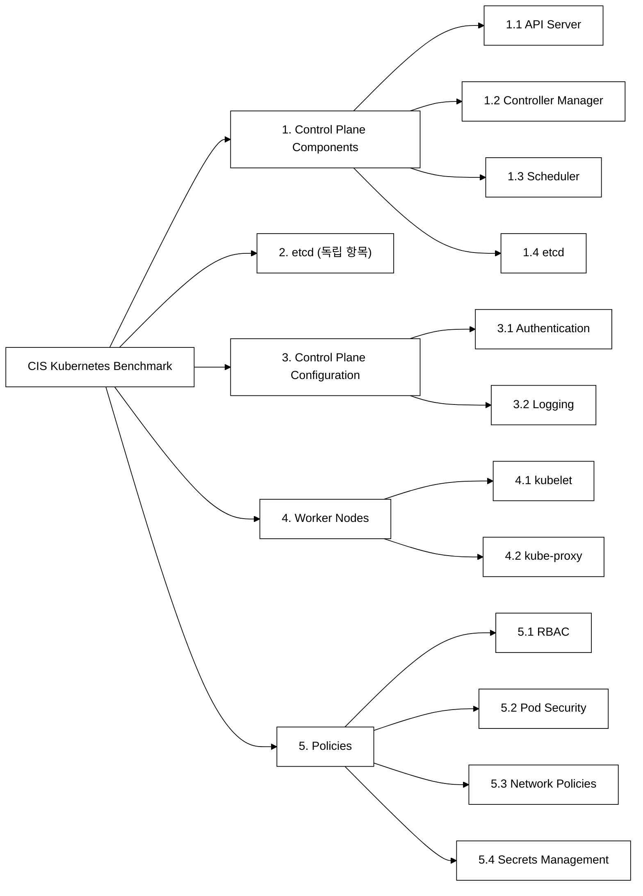
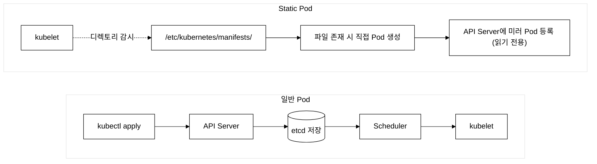
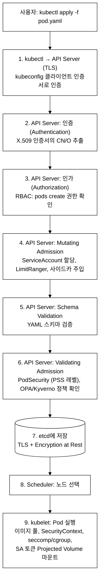

# KCSA Day 4: CIS Benchmark, Static Pod, 보안 YAML, 연습 문제

> **시험 비중:** Kubernetes Cluster Component Security — 22% (가장 높은 비중)
> **목표:** CIS Benchmark, Static Pod 보안, 보안 YAML 예제, Pod 생성 보안 흐름을 이해하고, 연습 문제로 점검한다.
> **예상 소요 시간:** 3~4시간 (개념 1.5h + 보안 YAML 1h + 연습 문제 0.5~1h + 실습 0.5h)

---

## 오늘의 학습 목표

Day 3에서는 API Server·etcd·kubelet의 보안 설정 옵션을 살펴봤다. Day 4는 그 설정들이 올바르게 적용되었는지를 **자동으로 점검**하는 방법(CIS Benchmark / kube-bench)과, 점검 결과로 도출된 FAIL 항목을 실제로 고치는 데 쓰이는 YAML 패턴을 다룬다.

- [ ] CIS Benchmark의 구성 카테고리와 kube-bench 결과(PASS/FAIL/WARN/INFO) 해석
- [ ] kube-bench FAIL 항목을 Static Pod 매니페스트에서 직접 수정하는 절차
- [ ] Static Pod의 보안 특성(Admission Control 미적용, RBAC 삭제 불가)과 위험 이해
- [ ] Audit Policy의 레벨 4단계(None/Metadata/Request/RequestResponse) 선택 기준
- [ ] ResourceQuota, LimitRange, ServiceAccount 보안 YAML의 역할 구분
- [ ] Pod 생성 전체 보안 흐름 9단계 중 API Server 내부 6단계(인증→인가→Mutating→Schema→Validating→etcd)와 이후 Scheduler·kubelet 단계 구분

---

## 1. CIS Benchmark와 kube-bench

### 1.0 등장 배경

```
기존 방식의 한계:
Kubernetes 클러스터의 보안 설정을 수동으로 점검하는 것은 비현실적이다.
API Server, etcd, kubelet, kube-proxy 등 수십 개의 보안 플래그가 있으며,
각각의 기본값이 보안에 안전하지 않은 경우가 많다.

예시:
- --anonymous-auth의 기본값은 true이다 (인증 없이 접근 가능)
- --read-only-port의 기본값은 10255이다 (정보 노출)
- --authorization-mode에 AlwaysAllow를 사용하면 모든 요청이 허용된다

해결:
CIS Benchmark는 합의 기반(consensus-based) 보안 점검 표준을 제공한다.
kube-bench는 이 표준을 자동화하여 PASS/FAIL/WARN/INFO로
클러스터의 보안 상태를 한눈에 파악할 수 있게 한다.
```

### 1.1 CIS Benchmark란?

> **보안 이해의 전제 개념** (이 섹션 전반에서 사용하는 용어 사전 정의)
>
> - **Admission Control**: API Server가 etcd에 객체를 저장하기 직전에 수행하는 마지막 검증·수정 단계. 인증·인가를 통과한 요청도 여기서 정책에 맞지 않으면 거절된다.
> - **Mutating Admission Controller**: 요청을 수정한다. 예를 들어 default 리소스 한도(LimitRanger) 주입, ServiceAccount 자동 할당, 사이드카 주입(Istio) 등이 여기서 이루어진다.
> - **Validating Admission Controller**: 수정된 요청이 정책에 맞는지 확인만 한다. 위반이면 거절(reject)한다. PSA, OPA/Gatekeeper, Kyverno 등이 대표적이다.
> - **PSA(Pod Security Admission)**: Pod 보안 수준을 Privileged(제한 없음) / Baseline(최소 제한) / Restricted(강한 제한) 세 단계로 나누어 네임스페이스 단위로 강제하는 내장 Validating Admission Controller이다. Day 5에서 상세히 다룬다.
> - **NodeRestriction**: kubelet이 자신의 노드와 그 노드에 스케줄된 Pod 정보만 수정할 수 있도록 제한하는 Admission Controller. 노드가 탈취되어도 다른 노드 정보를 조작하지 못하게 막는다.
> - **LimitRanger**: 네임스페이스 내 컨테이너의 리소스(CPU/메모리) 기본값과 최대·최소를 강제하는 Admission Controller. 리소스를 명시하지 않은 Pod에 자동으로 default 값을 주입한다.
>
> API Server는 초기에 개발 편의를 위해 누구든 연결할 수 있도록 설계되었다(--anonymous-auth 기본값 true). 그러나 프로덕션 환경에서는 미인증 요청에 401을 반환해야 하며, 모든 요청이 인증 → 인가 → Admission의 3단계를 거쳐야 한다. CIS Benchmark는 이 기본값들이 보안상 안전하지 않다는 점을 체계적으로 점검하는 표준이다.

CIS Kubernetes Benchmark — 보안 구성 기준선(Security Configuration Baseline). CIS(Center for Internet Security)가 발행하는 합의 기반 보안 점검 표준이다.

점검 카테고리는 다음과 같이 구성된다.


_그림 1. CIS Kubernetes Benchmark 점검 카테고리 계층 구조._

### 1.2 kube-bench 사용법

```yaml
# kube-bench를 Job으로 실행
apiVersion: batch/v1
kind: Job
metadata:
  name: kube-bench
  namespace: kube-system
spec:
  template:
    spec:
      hostPID: true
      containers:
        - name: kube-bench
          image: aquasec/kube-bench:v0.8.0
          command: ["kube-bench"]
          volumeMounts:
            - name: var-lib-etcd
              mountPath: /var/lib/etcd
              readOnly: true
            - name: etc-kubernetes
              mountPath: /etc/kubernetes
              readOnly: true
            - name: var-lib-kubelet
              mountPath: /var/lib/kubelet
              readOnly: true
      restartPolicy: Never
      volumes:
        - name: var-lib-etcd
          hostPath:
            path: /var/lib/etcd
        - name: etc-kubernetes
          hostPath:
            path: /etc/kubernetes
        - name: var-lib-kubelet
          hostPath:
            path: /var/lib/kubelet
```

### 1.3 kube-bench 결과 해석

```
결과 유형:
[PASS] : 보안 설정이 권장 값과 일치
[FAIL] : 보안 설정이 권장 값과 불일치 → 수정 필요
[WARN] : 수동 확인 필요
[INFO] : 정보성 메시지

예시 결과:
[PASS] 1.2.1 Ensure that the --anonymous-auth argument is set to false
[FAIL] 1.2.6 Ensure that the --profiling argument is set to false
[WARN] 1.2.10 Ensure that the admission control plugin EventRateLimit is set

FAIL 항목은 반드시 수정해야 한다.
```

**FAIL 항목 대응 예시 — 1.2.6 profiling 비활성화**

kube-bench가 `[FAIL] 1.2.6 Ensure that the --profiling argument is set to false`를 출력했을 때의 대응 절차:

1. API Server는 Static Pod이므로 `/etc/kubernetes/manifests/kube-apiserver.yaml`을 직접 수정한다.
2. `command` 배열에 `- --profiling=false`를 추가한다.
3. kubelet이 매니페스트 변경을 감지해 API Server Pod를 자동으로 재시작한다(약 30~60초).
4. 재기동 후 확인:

```bash
# staging 클러스터에서 수행 (dev 도 가능, CLAUDE.md §3 CKS 파괴 실습 정책 준수)
ssh staging-master
grep profiling /etc/kubernetes/manifests/kube-apiserver.yaml
# 또는 kubectl로 확인
kubectl --kubeconfig kubeconfig/staging.yaml \
  get pod kube-apiserver-staging-master -n kube-system -o yaml | grep profiling
```

동일 방식으로 대부분의 API Server FAIL 항목(--audit-log-path, --encryption-provider-config 등)을 수정할 수 있다. 수정 후 kube-bench를 재실행해 PASS 전환 여부를 확인한다.

**kube-bench의 한계**

kube-bench는 설정 파일과 프로세스 플래그를 정적으로 점검한다. 따라서 다음 두 가지 상황에서는 결과를 그대로 신뢰할 수 없다.

- **관리형 K8s(EKS·GKE·AKS)**: 클라우드 제공자가 컨트롤 플레인을 관리하므로 `/etc/kubernetes/manifests/`가 없거나 일부 플래그가 의도적으로 다르게 설정된다. FAIL로 표시되어도 해당 환경의 정상 동작일 수 있으므로 Remediation 전에 제공자 문서와 환경을 먼저 확인해야 한다.
- **런타임 행위 점검 불가**: kube-bench는 파일·프로세스 상태만 본다. "실제로 네트워크 패킷이 암호화되는가", "프로세스가 파일에 비정상 접근하는가"와 같은 런타임 동작은 Falco(이상 행위 탐지), Cilium(네트워크 관측) 등 별도 도구로 보완해야 한다.

**CIS Benchmark 적용의 트레이드오프**

CIS Benchmark를 도입하면 생기는 비용과 주의점은 다음과 같다.

1. **버전별 항목 번호 변동**: CIS Kubernetes Benchmark는 K8s 마이너 버전마다 새 판이 나오며 항목 번호가 바뀐다. 예를 들어 v1.8에서 1.2.6이었던 항목이 v1.9에서 1.2.8로 이동하는 경우가 있다. CI 파이프라인에서 kube-bench 결과를 파싱하는 자동화 스크립트가 있다면 K8s 버전 업그레이드 시마다 항목 번호 매핑을 갱신해야 한다.
2. **WARN 항목의 맥락 의존성**: WARN은 "자동 판별 불가, 수동 확인 필요"를 의미한다. 예를 들어 `EventRateLimit` Admission Plugin의 WARN은 "이 플러그인을 활성화했는가?"가 아니라 "이 환경에서 활성화가 적절한가?"를 사람이 판단해야 한다. WARN을 무조건 FAIL로 간주하고 자동 Remediation을 적용하면 의도하지 않은 기능 중단이 발생할 수 있다.
3. **관리형 K8s에서 제어 불가 항목**: EKS·GKE·AKS 같은 관리형 환경에서는 컨트롤 플레인 플래그를 사용자가 변경할 수 없다. kube-bench가 FAIL을 출력해도 클라우드 제공자가 해당 플래그를 내부적으로 다른 방식으로 보호하고 있을 수 있다. 이 경우 FAIL 카운트가 높아도 실제 보안 수준은 문서상 FAIL보다 높다 — 제공자별 보안 문서를 병행 참조해야 한다.

---

## 2. Static Pod 보안 특성

### 2.0 왜 Static Pod가 존재하는가 — 부트스트랩 딜레마

컨트롤 플레인 컴포넌트(API Server, etcd, scheduler, controller-manager)는 클러스터가 가동될 때 가장 먼저 실행되어야 한다. 그런데 이 컴포넌트들을 "Kubernetes Pod로 실행하려면" API Server가 이미 동작하고 있어야 한다 — 닭과 달걀 문제(bootstrap chicken-and-egg)다.

kubeadm은 이 문제를 Static Pod로 해결한다. kubelet은 API Server 없이도 `/etc/kubernetes/manifests/` 디렉토리를 직접 감시(inotify)하다가 YAML 파일이 생기면 해당 컨테이너를 즉시 실행한다. 즉 API Server 자신이 Static Pod 형태로 디스크의 파일에서 시작된다.

이 설계 덕분에 부트스트랩이 가능해지지만, 동시에 다음과 같은 보안 특성(그리고 위험)이 만들어진다.

Static Pod는 kubelet이 API Server를 거치지 않고 직접 관리하는 Pod이다. 일반 Pod와 Static Pod의 생성 경로는 다음과 같이 대비된다.


_그림 2. 일반 Pod와 Static Pod의 생성 경로 비교._

보안 특성:
1. **Admission Control 미적용**: kubelet이 `/etc/kubernetes/manifests/`를 직접 읽어 Pod를 생성하므로 API Server의 Admission Control(PSA 정책, ResourceQuota, LimitRanger 검증 등)을 전혀 거치지 않는다. 매니페스트에 `privileged: true`인 컨테이너를 정의해도 아무 검증 없이 그대로 실행된다.
2. **RBAC으로 삭제 불가**: API Server의 etcd에 실제 Pod 객체가 없고 미러 Pod(읽기 전용)만 존재한다. `kubectl delete pod`를 해도 kubelet이 즉시 재생성한다. 삭제하려면 디스크의 YAML 파일 자체를 지워야 한다.
3. **매니페스트 변조 즉시 반영**: 파일을 수정하면 kubelet이 감지해 즉시 Pod를 재시작한다. 공격자가 노드에 접근해 매니페스트를 변조하면 API Server 보안 플래그가 즉시 바뀐다(예: `--authorization-mode=AlwaysAllow` 삽입).
4. **컨트롤 플레인 컴포넌트 전체가 Static Pod**: API Server, etcd, scheduler, controller-manager 모두 여기에 해당한다. 이들의 보안 설정은 파일 수준 접근 제어에 의존한다.

보안 권장사항:
- /etc/kubernetes/manifests/ 디렉토리 권한 제한 (700)
- 매니페스트 파일 권한 제한 (600)
- 파일 무결성 모니터링 — IDS(침입 탐지 시스템, Intrusion Detection System)를 활용한다. AIDE(Advanced Intrusion Detection Environment)·Tripwire 같은 도구가 대표적이며, 파일의 해시값을 주기적으로 계산해 기준값(베이스라인)과 비교함으로써 무단 변조를 탐지한다.

권한 설정 및 무결성 모니터링 실습:

```bash
# dev-master 에 SSH로 접속해 현재 권한 확인
ssh dev-master  # ~/.ssh/config ProxyCommand 별칭
ls -la /etc/kubernetes/manifests/
# 기대값: drwx------ (700) 이어야 한다. 더 넓으면 수정이 필요하다.

# 디렉토리 권한 700으로 제한 (소유자만 rwx)
sudo chmod 700 /etc/kubernetes/manifests/

# 매니페스트 파일 권한 600으로 제한 (소유자만 rw, 실행 불필요)
sudo chmod 600 /etc/kubernetes/manifests/*.yaml

# 변경 확인
ls -la /etc/kubernetes/manifests/
```

AIDE를 이용한 파일 무결성 모니터링(개요):

```bash
# AIDE 설치 (Ubuntu/Debian 계열)
sudo apt-get install -y aide

# 기준 데이터베이스 초기화 (처음 1회 — 현재 상태를 베이스라인으로 저장)
sudo aide --init
sudo mv /var/lib/aide/aide.db.new /var/lib/aide/aide.db

# 이후 주기적으로 변조 여부 점검 (변경이 있으면 경고 출력)
sudo aide --check
# 출력 예: /etc/kubernetes/manifests/kube-apiserver.yaml ... changed
```

AIDE `--check` 결과에 `/etc/kubernetes/manifests/` 하위 파일이 나타나면 승인되지 않은 변조가 발생한 것이다.

---

## 3. 보안 관련 YAML 예제 모음

이 섹션은 CIS Benchmark FAIL 항목을 실제로 수정하거나 클러스터 보안을 강화할 때 쓰는 YAML 패턴 모음이다. 예제 1(API Server 보안 플래그) → 예제 2(Audit Policy) → 예제 3·4(ResourceQuota/LimitRange) → 예제 5·6(ServiceAccount/kubeconfig) 순서로, **컴포넌트 보안 → 감사 로그 → 리소스 제한 → 접근 제어** 계층을 따른다. KCSA 시험에서는 각 예제가 "Cluster Component Security(22%)", "Compliance·Logging(11%)", "Kubernetes Security Fundamentals(22%)" 도메인과 각각 대응된다.

### 예제 1: API Server 보안 강화 매니페스트

```yaml
apiVersion: v1
kind: Pod
metadata:
  name: kube-apiserver
  namespace: kube-system
spec:
  containers:
    - name: kube-apiserver
      command:
        - kube-apiserver
        # 인증
        - --anonymous-auth=false
        - --client-ca-file=/etc/kubernetes/pki/ca.crt
        # 인가
        - --authorization-mode=Node,RBAC
        # Admission
        - --enable-admission-plugins=NodeRestriction,PodSecurity,ServiceAccount,LimitRanger,ResourceQuota
        # ServiceAccount: 생성 요청에 default SA를 자동 할당하는 Mutating Controller
        # (ServiceAccount 리소스 자체와 다름 — 이 플러그인은 SA를 할당하는 역할만 수행)
        # etcd 연결
        - --etcd-servers=https://127.0.0.1:2379
        - --etcd-cafile=/etc/kubernetes/pki/etcd/ca.crt
        - --etcd-certfile=/etc/kubernetes/pki/apiserver-etcd-client.crt
        - --etcd-keyfile=/etc/kubernetes/pki/apiserver-etcd-client.key
        # Encryption at Rest
        - --encryption-provider-config=/etc/kubernetes/enc/encryption-config.yaml
        # Audit
        - --audit-log-path=/var/log/kubernetes/audit.log
        - --audit-policy-file=/etc/kubernetes/audit/policy.yaml
        - --audit-log-maxage=30
        - --audit-log-maxbackup=10
        - --audit-log-maxsize=100
        # 보안 강화
        - --profiling=false
```

**실습: API Server 보안 플래그 확인**

예제 1의 YAML은 `/etc/kubernetes/manifests/kube-apiserver.yaml`에 위치하는 Static Pod 매니페스트다. 현재 클러스터의 실제 플래그와 비교해 누락된 항목을 찾는 연습:

```bash
# dev 클러스터에서 현재 API Server 플래그 확인
kubectl --kubeconfig kubeconfig/dev.yaml \
  get pod kube-apiserver-dev-master -n kube-system -o yaml | grep -A5 command
```

출력 결과에서 `--encryption-provider-config`, `--audit-log-path`, `--profiling` 항목이 있는지 확인한다. 없으면 보안 강화 대상이다.

### 예제 2: Audit Policy

**왜 Audit Policy가 필요한가**

Kubernetes 1.7 이전에는 API Server에 접근한 모든 요청이 단일 로그 형식으로 기록되거나 아예 기록되지 않았다. 문제는 두 가지였다. 첫째, Secret에 대한 GET 요청을 그대로 로그에 남기면 감사 로그 자체가 민감 데이터 저장소가 된다. 둘째, `pods/exec`(컨테이너 내부 쉘 접근)처럼 고위험 행위를 일반 리소스 접근과 동일 수준으로 다루면 사후 추적이 어렵다.

Audit Policy는 리소스·동작 유형별로 기록 깊이(level)를 다르게 지정해 "필요한 것은 상세히, 민감한 것은 메타데이터만, 노이즈는 제외"하는 세밀한 제어를 가능하게 한다.

**Audit Level 4단계 비교**

| 레벨 | 기록 내용 | 대표 사용 예 |
|:---|:---|:---|
| `None` | 아무것도 기록 안 함 | 헬스체크(`/healthz`, `/readyz`) — 1초마다 수천 건 발생해 로그 폭증 유발 |
| `Metadata` | 요청자·시각·리소스명 등 메타데이터만 (본문 없음) | Secret·ConfigMap — 내용 노출 없이 "누가 언제 접근"만 기록 |
| `Request` | 메타데이터 + 요청 본문 | RBAC Role/Binding 변경 — 어떤 권한이 부여되었는지 기록 |
| `RequestResponse` | 메타데이터 + 요청 본문 + 응답 본문 | `pods/exec`, `pods/attach` — 쉘에 무엇을 입력했는지 전체 추적 |

`omitStages: RequestReceived`: 요청이 수신된 직후(파싱·인증 전) 단계에서는 로그를 생략한다. 이 단계의 로그는 중복·불완전 정보가 많아 볼륨만 늘리므로 일반적으로 제외한다.

```yaml
apiVersion: audit.k8s.io/v1
kind: Policy
rules:
  # 헬스 체크 제외
  - level: None
    nonResourceURLs:
      - /healthz*
      - /readyz*
      - /livez*

  # Secret 접근: 메타데이터만 (데이터 노출 방지!)
  - level: Metadata
    resources:
      - group: ""
        resources: ["secrets", "configmaps"]

  # Pod exec/attach: 전체 기록 (보안 감사)
  - level: RequestResponse
    resources:
      - group: ""
        resources: ["pods/exec", "pods/attach", "pods/portforward"]

  # RBAC 변경: 요청 본문 포함
  - level: Request
    resources:
      - group: "rbac.authorization.k8s.io"
        resources: ["roles", "clusterroles", "rolebindings", "clusterrolebindings"]

  # 나머지: 메타데이터
  - level: Metadata
    omitStages:
      - RequestReceived
```

**검증 명령 (예제 2 적용 시):**

```bash
# dry-run으로 YAML 유효성 먼저 확인
kubectl --kubeconfig kubeconfig/dev.yaml \
  apply --dry-run=server -f audit-policy.yaml
```

### 예제 3: ResourceQuota (DoS 방지)

**왜 ResourceQuota가 필요한가**

멀티테넌트 클러스터에서 한 팀(네임스페이스)이 CPU·메모리를 제한 없이 요청하면 다른 팀의 워크로드가 Pending 상태로 멈춘다. ResourceQuota 이전에는 클러스터 운영자가 수작업으로 과다 요청을 발견하고 정리해야 했다. ResourceQuota는 네임스페이스 단위로 리소스 총량 상한을 선언적으로 강제한다. 초과 요청은 API Server Admission 단계에서 즉시 거절되므로 "자원 고갈 공격(DoS)"을 예방한다.

```yaml
apiVersion: v1
kind: ResourceQuota
metadata:
  name: compute-quota
  namespace: production
spec:
  hard:
    requests.cpu: "4"
    requests.memory: "8Gi"
    limits.cpu: "8"
    limits.memory: "16Gi"
    pods: "20"
    secrets: "10"
    services.nodeports: "2"
```

**검증 명령 (예제 3 적용 시):**

```bash
kubectl --kubeconfig kubeconfig/dev.yaml \
  apply -f resource-quota.yaml -n production
kubectl --kubeconfig kubeconfig/dev.yaml \
  get quota -n production
```

### 예제 4: LimitRange (Pod 리소스 기본값)

**왜 LimitRange가 필요한가**

ResourceQuota는 네임스페이스 전체 총량을 제한하지만, 개별 컨테이너가 `resources` 필드를 아예 생략하면 "요청량 0으로 취급"되어 스케줄러가 아무 노드에나 배치한다. 리소스를 명시하지 않은 컨테이너는 노드 메모리를 무제한 사용할 수 있어 OOM(Out Of Memory) 킬을 유발한다. LimitRange는 `resources` 필드가 없는 컨테이너에 Mutating Admission Controller가 default 값을 자동 주입하고, 선언된 값이 min/max 범위를 벗어나면 거절한다. 이를 통해 개발자가 리소스를 선언 안 해도 안전한 기본값이 보장된다.

```yaml
apiVersion: v1
kind: LimitRange
metadata:
  name: default-limits
  namespace: production
spec:
  limits:
    - type: Container
      default:
        cpu: "500m"
        memory: "256Mi"
      defaultRequest:
        cpu: "100m"
        memory: "64Mi"
      max:
        cpu: "2"
        memory: "1Gi"
      min:
        cpu: "50m"
        memory: "32Mi"
```

**검증 명령 (예제 4 적용 시):**

```bash
kubectl --kubeconfig kubeconfig/dev.yaml \
  get quota,limitrange -n production
```

### 예제 5: ServiceAccount 보안 설정

**왜 ServiceAccount 토큰 자동 마운트를 끄는가**

Kubernetes 1.6 이전에는 모든 Pod에 `default` ServiceAccount 토큰이 자동으로 마운트되었다. 이 토큰은 API Server에 인증된 요청을 보낼 수 있어, 컨테이너가 탈취되면 공격자가 클러스터 API에 접근하는 수단이 된다. 실제로 많은 워크로드(정적 웹 서버, 배치 처리 등)는 API Server에 전혀 접근할 필요가 없다. `automountServiceAccountToken: false`로 불필요한 토큰 마운트를 원천 차단하면, 컨테이너 침해 시 피해 범위를 해당 컨테이너 내부로 제한할 수 있다(최소 권한 원칙).

```yaml
# API 접근이 불필요한 워크로드용 ServiceAccount
apiVersion: v1
kind: ServiceAccount
metadata:
  name: no-api-access
  namespace: production
automountServiceAccountToken: false
  # SA 토큰 자동 마운트 비활성화
```

### 예제 6: kubeconfig 보안

**왜 kubeconfig 보안이 중요한가**

kubeconfig 파일에는 클러스터 API 주소, CA 인증서, 그리고 **사용자의 클라이언트 개인 키**가 base64 인코딩(암호화 아님)으로 포함된다. 이 파일 하나가 유출되면 별도 인증 없이 클러스터에 완전히 접근 가능하다. `system:masters` 그룹 인증서를 가진 kubeconfig는 RBAC 규칙 자체를 우회한다(ClusterRoleBinding 없이도 cluster-admin 권한). Git에 커밋되는 순간 비공개 저장소라도 히스토리에 영구 기록된다.

```yaml
apiVersion: v1
kind: Config
clusters:
  - cluster:
      server: https://10.0.0.5:6443
      certificate-authority-data: <base64>
    name: kubernetes
users:
  - user:
      client-certificate-data: <base64>
      client-key-data: <base64>
    name: kubernetes-admin

# 보안 주의사항:
# 1. kubeconfig에 개인 키가 포함됨 → chmod 600
# 2. system:masters 그룹 인증서는 RBAC 우회 → 비상 시에만
# 3. Git에 kubeconfig 절대 커밋 금지
```

---

## 4. Pod 생성 전체 보안 흐름

> **용어 정의 — Admission의 두 의미**
>
> 이 섹션과 연습 문제에서 "Admission"은 맥락에 따라 두 가지를 가리킨다.
> - **처리 단계로서의 Admission**: API Server의 3단계(인증 → 인가 → Admission) 중 마지막 단계 전체를 말한다. 인가를 통과한 요청이 정책 기반으로 수용 또는 거절/변조되는 구간이다.
> - **개별 Admission Controller 플러그인**: Admission 단계 내부에서 차례로 실행되는 플러그인들이다. Mutating AC(수정) → Schema 검증 → Validating AC(확인) 순서로 동작한다.
> 문제 2의 "인증 → 인가 → Admission"은 처리 단계, 문제 5의 "Mutating → Validating"은 Admission 단계 내부의 플러그인 실행 순서를 묻는다.


_그림 3. Pod 생성 전체 보안 처리 흐름._

**주요 순서 설명 — 왜 이 순서인가**

각 단계의 순서에는 명확한 이유가 있다.

- **1~3단계(인증→인가)**: "누구인가"를 먼저 확인하지 않으면 "무엇을 할 수 있는가"를 판단할 수 없다. 인가를 인증 전에 하면 신원 불명의 요청도 권한 검사 처리를 소모한다.
- **4단계(Mutating Admission)**: 요청을 먼저 수정(SA 할당, LimitRange 기본값 주입)한다. 수정되지 않은 원본을 검증하면 "default 값이 없어서 실패"하는 오탐이 발생한다.
- **5단계(Schema Validation)**: 수정된 요청의 YAML 구조가 K8s API 스키마에 맞는지 확인한다.
- **6단계(Validating Admission)**: 최종 형태의 요청을 정책(PSA, OPA/Gatekeeper)으로 검증한다. Mutating 이후에 해야 주입된 sidecar·SA까지 포함해 정책을 평가할 수 있다.
- **순서가 바뀌면**: Admission을 인증 전에 배치하면 미인증 요청도 정책 검사를 거쳐 불필요한 연산이 발생하고, 로그에 신원 없는 거절 기록이 쌓인다.

---

## 5. 시험 출제 패턴 분석

아래 패턴은 Day 4(CIS Benchmark·Static Pod·보안 YAML·Pod 생성 흐름) 범위에서 출제되는 유형이다.

1. **"~하는 플래그는?" (정확한 플래그명)** (섹션 1.3, 섹션 2)
   - 예: "kubelet의 읽기 전용 포트를 비활성화하는 설정은?"
   - 정답: `--read-only-port=0`

2. **"~의 순서는?" (처리 순서)** (섹션 4)
   - 예: "API Server의 요청 처리 순서는?"
   - 정답: 인증 → 인가 → Admission

3. **"~에서 가장 권장되는 것은?" (모범 사례)** (섹션 6 문제 9·16)
   - 예: "Encryption at Rest 프로덕션 권장 프로바이더는?"
   - 정답: kms v2
   - 예: "EncryptionConfiguration providers 목록에서 첫 번째 항목의 의미는?"
   - 정답: 새 데이터를 암호화하는 데 쓰이는 프로바이더

4. **"올바르지 않은 것은?" (오류 찾기)** (섹션 1.3, 섹션 2)
   - 예: "kubelet 보안 설정으로 올바르지 않은 것은?"
   - 정답: `--read-only-port=10255` (인증 없는 정보 노출, 0으로 비활성화해야 함)

5. **"~의 역할은?" (컴포넌트 역할)** (섹션 1.1, 섹션 4)
   - 예: "NodeRestriction admission controller의 역할은?" (섹션 1.1 용어 정의 참조)
   - 정답: kubelet이 자신의 노드와 그 노드에 스케줄된 Pod만 수정 가능하도록 제한

---

## 6. 연습 문제 (18문제 + 상세 해설)

### 문제 1.
kube-apiserver에서 익명 접근을 비활성화하는 플래그는?

A) `--disable-anonymous-auth`
B) `--anonymous-auth=false`
C) `--no-anonymous`
D) `--authentication-mode=strict`

<details><summary>정답 확인</summary>

**정답: B) `--anonymous-auth=false`**

**왜 정답인가:** `--anonymous-auth`는 boolean 플래그로 기본값은 true이다. false로 설정하면 인증 없는 요청에 401을 반환한다.

</details>

### 문제 2.
API Server에서 요청 처리의 올바른 순서는?

A) Admission → 인증 → 인가
B) 인가 → 인증 → Admission
C) 인증 → 인가 → Admission
D) 인증 → Admission → 인가

<details><summary>정답 확인</summary>

**정답: C) 인증 → 인가 → Admission**

**왜 정답인가:** 먼저 "누구인지"(인증), "무엇을 할 수 있는지"(인가), "정책에 맞는지"(Admission) 순서로 처리한다.

</details>

### 문제 3.
etcd의 데이터를 보호하기 위해 가장 중요한 두 가지 보안 설정은?

A) 데이터 압축과 로그 로테이션
B) TLS 통신 암호화와 데이터 암호화(Encryption at Rest)
C) 백업과 스냅샷
D) 디스크 성능 최적화

<details><summary>정답 확인</summary>

**정답: B) TLS 통신 암호화와 데이터 암호화(Encryption at Rest)**

**왜 정답인가:** (1) TLS로 전송 중 데이터를 보호하고, (2) Encryption at Rest로 저장된 데이터를 보호하는 것이 가장 중요하다.

</details>

### 문제 4.
kubelet의 보안 설정으로 올바르지 않은 것은?

A) `--anonymous-auth=false`로 익명 접근 차단
B) `--authorization-mode=Webhook`으로 API Server 인가
C) `--read-only-port=10255`로 읽기 전용 포트 활성화
D) `--rotate-certificates=true`로 인증서 자동 갱신

<details><summary>정답 확인</summary>

**정답: C) `--read-only-port=10255`로 읽기 전용 포트를 활성화한다**

**왜 정답인가:** 10255 포트는 인증 없이 노드 정보를 노출하므로 `--read-only-port=0`으로 비활성화해야 한다.

</details>

### 문제 5.
Admission Controller의 실행 순서로 올바른 것은?

A) Validating → Mutating
B) Mutating → Validating
C) 동시 병렬
D) 순서 없이 랜덤

<details><summary>정답 확인</summary>

**정답: B) Mutating → Validating**

**왜 정답인가:** Mutating이 요청을 수정한 후 Validating이 최종 검증한다. Mutating에서 추가된 필드를 Validating에서 검증해야 하므로 이 순서가 필수적이다.

</details>

### 문제 6.
kubeadm 클러스터에서 인증서가 저장되는 기본 디렉토리는?

A) `/var/lib/kubelet/pki/`
B) `/etc/kubernetes/pki/`
C) `/opt/kubernetes/certs/`
D) `~/.kube/certs/`

<details><summary>정답 확인</summary>

**정답: B) `/etc/kubernetes/pki/`**

</details>

### 문제 7.
API Server의 인증(Authentication) 방식이 아닌 것은?

A) X.509 클라이언트 인증서
B) Bearer Token
C) NetworkPolicy
D) OpenID Connect (OIDC)

<details><summary>정답 확인</summary>

**정답: C) NetworkPolicy**

**왜 정답인가:** NetworkPolicy는 Pod 간 네트워크 트래픽을 제어하는 리소스이지, 인증 방식이 아니다.

</details>

### 문제 8.
Static Pod의 보안 관점에서의 특징은?

A) API Server를 통해 생성되므로 RBAC가 완전히 적용된다
B) kubelet이 직접 관리하며 Admission Control이 적용되지 않을 수 있다
C) etcd에 저장되어 암호화 보호를 받는다
D) NetworkPolicy에 의해 자동으로 보호된다

<details><summary>정답 확인</summary>

**정답: B) kubelet이 직접 관리하며 Admission Control이 적용되지 않을 수 있다**

**왜 정답인가:** Static Pod는 `/etc/kubernetes/manifests/`의 YAML을 kubelet이 직접 읽어 생성한다. API Server를 경유하지 않기 때문에 API Server가 제공하는 Admission Control(PSA 정책 레벨 검사, ResourceQuota 한도 검증, NodeRestriction 제한 등)이 전혀 적용되지 않는다. 따라서 매니페스트 파일에 `securityContext.privileged: true`인 컨테이너를 정의해도 아무 검증 없이 실행된다. 컨트롤 플레인 컴포넌트(API Server, etcd 등)가 모두 Static Pod이기 때문에 이 경로가 필요하지만, 동시에 노드에 대한 물리적 또는 파일 시스템 접근이 곧 최고 권한이 됨을 의미한다.

</details>

### 문제 9.
etcd의 Encryption at Rest에서 프로덕션에 가장 권장되는 프로바이더는?

A) identity
B) aescbc
C) kms (v2)
D) aesgcm

<details><summary>정답 확인</summary>

**정답: C) kms (v2)**

**왜 정답인가:** Encryption at Rest에서는 두 종류의 키를 사용한다.
- **DEK(Data Encryption Key)**: 실제 etcd 데이터를 암호화하는 키. Secret마다 고유한 DEK가 생성되어 데이터와 함께 etcd에 저장된다.
- **KEK(Key Encryption Key)**: DEK 자체를 암호화하는 마스터 키. KMS(AWS KMS, HashiCorp Vault 등) 외부 서비스에만 저장되어 etcd에 평문으로 남지 않는다.

aescbc나 aesgcm은 암호화 키가 API Server의 설정 파일(encryption-config.yaml)에 직접 적힌다 — 이 파일이 유출되면 모든 etcd 데이터가 복호화된다. KMS v2는 KEK를 외부에 두고, DEK를 메모리에 캐시(LRU)하여 매번 KMS를 호출하지 않아도 된다. 이로 인해 KMS v1 대비 성능이 2~3배 향상되고, 키 순환(key rotation) 시 새 DEK를 발급받아 기존 데이터를 재암호화할 수 있다.

</details>

### 문제 10.
NodeRestriction admission controller의 역할은?

A) 노드의 CPU 사용량을 제한한다
B) kubelet이 자신의 노드와 해당 Pod만 수정할 수 있도록 제한한다
C) 새 노드의 클러스터 참여를 제한한다
D) 노드 간 네트워크 트래픽을 제한한다

<details><summary>정답 확인</summary>

**정답: B) kubelet이 자신의 노드와 해당 Pod만 수정할 수 있도록 제한한다**

</details>

### 문제 11.
API Server의 `--authorization-mode`에서 권장되는 설정은?

A) `AlwaysAllow`
B) `Node,RBAC`
C) `ABAC`
D) `Webhook`

<details><summary>정답 확인</summary>

**정답: B) `Node,RBAC`**

**왜 정답인가:** Node와 RBAC를 함께 쓰는 이유는 각각 다른 주체를 다른 방식으로 제한하기 때문이다.

- **Node 모드**: kubelet 전용 인가 모드. kubelet이 `system:node:<nodeName>` 형식의 자격증명으로 접속할 때만 활성화된다. kubelet은 자신의 노드 객체와 그 노드에 스케줄된 Pod/ConfigMap/Secret만 읽고 수정할 수 있다. 다른 노드의 정보는 접근 불가다.
- **RBAC**: 일반 사용자와 ServiceAccount의 권한을 Role/ClusterRole + Binding으로 세밀하게 제어한다.

둘을 함께 쓰면: kubelet은 Node 모드로 자기 범위만 허용되고, 그 외 모든 주체(사용자, SA, 컨트롤러)는 RBAC로 제어된다. `AlwaysAllow`는 인가 단계가 없는 것과 같아 KCSA 시험에서 항상 오답이다. ABAC(Attribute-Based Access Control)는 파일 기반으로 동적 변경이 불가해 deprecated된 방식이다.

</details>

### 문제 12.
Control Plane에서 API Server와 etcd 사이의 TLS 유형은?

A) 단방향 TLS
B) 상호 TLS (mTLS)
C) 평문
D) SSH 터널

<details><summary>정답 확인</summary>

**정답: B) 상호 TLS (mTLS)**

**왜 정답인가:** API Server는 etcd의 서버 인증서를 검증하고, etcd는 API Server의 클라이언트 인증서를 검증한다.

</details>

### 문제 13.
Kubernetes 인증서의 기본 유효 기간(kubeadm)은?

A) 인증서 1년, CA 1년
B) 인증서 1년, CA 10년
C) 인증서 10년, CA 10년
D) 인증서 90일, CA 1년

<details><summary>정답 확인</summary>

**정답: B) 인증서 1년, CA 10년**

</details>

### 문제 14.
kube-controller-manager가 관리하는 보안 관련 기능이 아닌 것은?

A) ServiceAccount 토큰 발급
B) 인증서 서명 요청(CSR) 승인
C) Namespace 삭제 시 리소스 정리
D) 네트워크 패킷 필터링

<details><summary>정답 확인</summary>

**정답: D) 네트워크 패킷 필터링**

**왜 정답인가:** 네트워크 패킷 필터링은 CNI 플러그인(Cilium, Calico)이나 kube-proxy가 담당한다.

</details>

### 문제 15.
`--enable-admission-plugins`에 포함되어야 하는 보안 컨트롤러로 적절하지 않은 것은?

A) PodSecurity
B) NodeRestriction
C) AlwaysAdmit
D) ServiceAccount

<details><summary>정답 확인</summary>

**정답: C) AlwaysAdmit**

**왜 정답인가:** AlwaysAdmit은 모든 요청을 무조건 승인하므로 보안상 사용하면 안 된다.

</details>

### 문제 16.
EncryptionConfiguration에서 providers 순서의 의미는?

A) 순서 무관
B) 첫 번째로 새 데이터 암호화, 나머지는 기존 데이터 복호화
C) 마지막으로 새 데이터 암호화
D) 모든 프로바이더로 중복 암호화

<details><summary>정답 확인</summary>

**정답: B) 첫 번째로 새 데이터 암호화, 나머지는 기존 데이터 복호화**

**왜 이렇게 설계되었나 — 키 마이그레이션 시나리오:**

이 설계는 무중단 키 교체(key rotation)를 가능하게 한다. 예를 들어 KMS v1에서 aescbc로 마이그레이션하는 경우:

1. **1단계 전환**: providers 첫 번째에 `aescbc`, 두 번째에 `kms-v1`을 배치한다. 이후 새로 쓰이는 Secret은 aescbc로 암호화되고, 기존 Secret은 kms-v1로 계속 읽힌다.
2. **2단계 재암호화**: `kubectl get secrets --all-namespaces -o json | kubectl apply -f -`로 모든 Secret을 강제 재쓰기하면 전부 aescbc로 변환된다.
3. **3단계 정리**: 모든 데이터가 aescbc로 전환된 뒤 providers에서 `kms-v1` 항목을 제거한다.

이 순서 설계 덕분에 "쓸 때는 새 방식, 읽을 때는 구·신 모두 지원"이 가능하다.

</details>

### 문제 17.
kubelet의 `--authorization-mode`를 `AlwaysAllow`로 설정하면?

A) kubelet이 시작되지 않는다
B) 인증된 모든 사용자가 kubelet API를 통해 Pod에서 명령을 실행할 수 있다
C) kubelet이 API Server와 통신할 수 없다
D) 로그만 기록되고 접근은 차단된다

<details><summary>정답 확인</summary>

**정답: B) 인증된 모든 사용자가 kubelet API를 통해 Pod에서 명령을 실행할 수 있다**

**왜 정답인가:** AlwaysAllow는 모든 인가 요청을 허용한다. Webhook 모드로 API Server에 인가를 위임해야 한다.

</details>

### 문제 18.
Audit Logging에서 Secret 접근을 `Metadata` 레벨로 기록하는 이유는?

A) Secret은 감사할 필요가 없어서
B) 감사 로그에 Secret 데이터가 노출되는 것을 방지하기 위해
C) 저장 공간을 절약하기 위해
D) Metadata 레벨이 가장 상세한 레벨이라서

<details><summary>정답 확인</summary>

**정답: B) 감사 로그에 Secret 데이터가 노출되는 것을 방지하기 위해**

**왜 정답인가:** Request/RequestResponse 레벨은 요청/응답 본문을 포함하므로 Secret의 실제 비밀번호가 감사 로그에 노출된다. Metadata 레벨은 "누가, 언제, 어떤 Secret에 접근했는지"만 기록한다.

</details>

---

## 7. 복습 체크리스트

- [ ] CIS Benchmark와 kube-bench의 역할을 알고 있다
- [ ] kube-bench 결과(PASS/FAIL/WARN/INFO)를 해석할 수 있다
- [ ] Static Pod의 보안 특성(Admission Control 미적용)을 알고 있다
- [ ] API Server 보안 강화 매니페스트의 핵심 플래그를 기억한다
- [ ] Pod 생성 전체 보안 흐름을 설명할 수 있다
- [ ] 연습 문제 18문제를 모두 풀 수 있다

---

## 내일 예고: Day 5 - RBAC, ServiceAccount, Pod Security Standards

- RBAC 4대 구성 요소와 YAML 상세
- ServiceAccount와 Bound Token
- PSS 3단계 레벨 (Privileged/Baseline/Restricted)
- PSA 설정과 점진적 적용 전략

---

## tart-infra 실습

> **실습 전제 조건**
>
> - dev 또는 staging 클러스터가 가동 중이어야 한다(`./scripts/boot.sh` 실행 후 `./scripts/fix-cluster-ip-drift.sh dev` 로 IP 드리프트 복구 완료 상태).
> - kubeconfig 위치: `kubeconfig/dev.yaml`
> - 노드 SSH 별칭: `ssh dev-master` (비밀번호 없이 접속 가능, `~/.ssh/config` ProxyCommand 방식)
> - 네임스페이스 `cap-kcsa-d04`가 없으면 `kubectl --kubeconfig .../kubeconfig/dev.yaml create namespace cap-kcsa-d04`로 먼저 생성한다.
> - CIS Benchmark 파괴 실습은 **dev/staging에서만** 수행한다(platform/prod 금지, CLAUDE.md §3).

### 실습 환경 설정

```bash
# 절대경로로 kubeconfig 지정 (작업 디렉토리에 무관하게 동작)
export KUBECONFIG="${HOME}/sideproejct/IaC_apple_sillicon/kubeconfig/dev.yaml"
kubectl get nodes
```

### 실습 1: CIS Benchmark 주요 항목 점검

```bash
echo "=== CIS Benchmark 주요 항목 점검 ==="

# 1. API Server 보안
echo "[1.1] Authorization Mode:"
kubectl get pod kube-apiserver-dev-master -n kube-system -o yaml | grep authorization-mode

# 2. etcd 보안
echo "[2.1] etcd client-cert-auth:"
kubectl get pod etcd-dev-master -n kube-system -o yaml | grep client-cert-auth

# 3. NetworkPolicy 존재 여부 (표준 K8s API 사용 — CNI 중립)
# 이 클러스터는 Cilium CNI를 사용하지만 자격증 시험은 CNI 중립적이므로
# 표준 NetworkPolicy API로 점검한다.
# [참고] cap-kcsa-d04 네임스페이스에 NetworkPolicy를 아직 생성하지 않았다면
# count=0이 나오는 것이 정상이다. 이 명령은 "정책이 없다"는 상태를 확인하는
# 것이 목적이다. 프로덕션이라면 최소 1개 이상의 NetworkPolicy가 있어야
# CIS Benchmark 5.3 항목을 통과한다.
echo "[5.1] NetworkPolicy count:"
kubectl get networkpolicies -n cap-kcsa-d04 --no-headers | wc -l
# Cilium 전용 정책도 함께 확인하려면 (Cilium 환경 한정):
# kubectl get ciliumnetworkpolicies -n cap-kcsa-d04 --no-headers | wc -l

# 4. Secret encryption
echo "[5.4] Secret encryption:"
kubectl get pod kube-apiserver-dev-master -n kube-system -o yaml | grep encryption-provider || echo "  Not configured"
```

**검증 — 기대 출력:**


**동작 원리:** CIS Benchmark는 K8s 보안 설정 가이드라인이며 kube-bench로 자동 점검할 수 있다. PASS/FAIL/WARN/INFO 결과를 제공한다.

### 실습 1b: FAIL 항목 수정 → PASS 전환 end-to-end 흐름

섹션 1.3에서 다룬 profiling FAIL 항목을 실제로 수정하고 결과를 재확인하는 완결된 흐름이다.

```bash
# 1단계: 현재 profiling 설정 확인 (FAIL 상태)
ssh dev-master  # ~/.ssh/config 등록 별칭, ProxyCommand 방식으로 tart ip 자동 조회
grep -- '--profiling' /etc/kubernetes/manifests/kube-apiserver.yaml || echo "profiling flag 없음 — FAIL 상태"

# 2단계: 매니페스트에 --profiling=false 추가 (sed로 원자적 삽입)
# kube-apiserver 줄 바로 뒤에 플래그를 삽입한다
sudo sed -i '/- kube-apiserver/a\        - --profiling=false' \
  /etc/kubernetes/manifests/kube-apiserver.yaml
# 삽입 결과 확인
grep -- '--profiling' /etc/kubernetes/manifests/kube-apiserver.yaml

# 3단계: kubelet이 변경을 감지해 자동 재기동 대기 (약 30~60초)
# 로컬 터미널로 돌아와 실행
kubectl --kubeconfig kubeconfig/dev.yaml \
  wait pod kube-apiserver-dev-master -n kube-system \
  --for=condition=Ready --timeout=120s

# 4단계: PASS 전환 확인
kubectl --kubeconfig kubeconfig/dev.yaml \
  get pod kube-apiserver-dev-master -n kube-system -o yaml | grep profiling
```

3단계에서 `--profiling=false` 플래그가 출력되면 CIS Benchmark 1.2.6 항목이 PASS로 전환된다.

**kube-bench Job을 직접 실행해 결과 전체 확인 (end-to-end)**

FAIL → PASS 전환 여부를 kube-bench 자체로 검증하려면 섹션 1.2의 Job YAML을 apply하고 로그를 읽는다.

```bash
# kube-bench-job.yaml 파일이 없는 경우 섹션 1.2의 YAML을 먼저 저장한다
# (이미 파일이 있으면 이 단계 생략)
kubectl --kubeconfig kubeconfig/dev.yaml \
  apply -f kube-bench-job.yaml

# Job 완료 대기 (최대 120초)
kubectl --kubeconfig kubeconfig/dev.yaml \
  wait --for=condition=complete job/kube-bench -n kube-system --timeout=120s

# 결과 로그 확인 — 1.2.6 항목이 [PASS]로 바뀌었는지 확인
kubectl --kubeconfig kubeconfig/dev.yaml \
  logs job/kube-bench -n kube-system | grep -E "(PASS|FAIL|1\.2\.6)"
```

재실행 시에는 동일한 이름의 Job이 이미 존재하므로 `kubectl delete job/kube-bench -n kube-system`으로 먼저 삭제한 뒤 다시 apply한다.

### 트러블슈팅: CIS Benchmark 실패 항목 대응

```
장애 시나리오 1: kube-bench FAIL — profiling이 활성화됨
  증상: [FAIL] 1.2.6 Ensure that the --profiling argument is set to false
  공격-방어 매핑: Information Disclosure → 프로파일링 데이터로 내부 구조 노출
  해결: API Server 매니페스트에 --profiling=false 추가 후 자동 재시작 대기
  검증: kubectl get pod kube-apiserver-* -n kube-system -o yaml | grep profiling

장애 시나리오 2: Static Pod 매니페스트 변조
  증상: API Server 설정이 예상과 다름, 보안 플래그가 변경됨
  공격-방어 매핑: Tampering(STRIDE) → 매니페스트 파일 변조
  디버깅:
    ls -la /etc/kubernetes/manifests/
    sha256sum /etc/kubernetes/manifests/kube-apiserver.yaml
  해결: 매니페스트 디렉토리 권한을 700으로 설정하고,
        AIDE/Tripwire로 파일 무결성 모니터링을 활성화한다
```

### 실습 2: Pod 생성 보안 흐름 추적

```bash
# API Server의 보안 플래그 확인
kubectl get pod kube-apiserver-dev-master -n kube-system -o yaml | grep -E "(--anonymous|--authorization|--enable-admission|--encryption)"
```

**동작 원리:** Pod 생성 시 API Server의 3단계 처리:
1. 인증: 클라이언트 인증서 CN/O로 사용자/그룹 식별
2. 인가: RBAC으로 pods create 권한 확인
3. Admission: Mutating(SA 할당, LimitRange) → Validating(PSA, Kyverno)

---

### 직접 해보기 (5분 미니랩)

KCSA는 60문제 90분 이론 시험이다. 개념을 빠르게 적용하는 속도가 중요하다. 아래 미니랩은 5분 안에 완료하는 것을 목표로 한다.

**목표**: kube-bench 결과에서 FAIL 항목 3개를 찾아 YAML 수정 후 grep으로 변경 확인.

```bash
# 타이머 시작 (5분)
# 1단계: kube-bench Job 실행 (이미 실습 1b에서 실행했다면 로그 재확인으로 대체)
kubectl --kubeconfig kubeconfig/dev.yaml \
  logs job/kube-bench -n kube-system | grep '\[FAIL\]' | head -5

# 2단계: FAIL 항목 3개 선택 후 각각 kube-apiserver.yaml에서 수정
ssh dev-master
grep -n 'profiling\|audit-log\|encryption' /etc/kubernetes/manifests/kube-apiserver.yaml

# 3단계: 수정 결과 확인 (grep으로)
grep -E '\-\-(profiling|audit-log-path|encryption-provider-config)' \
  /etc/kubernetes/manifests/kube-apiserver.yaml
```

5분 안에 3개 항목을 모두 grep으로 확인했으면 성공이다. KCSA 시험에서는 "어떤 플래그를 어디에 추가하면 FAIL이 PASS가 되는가"를 묻는 문제가 출제된다. 플래그명과 위치(Static Pod 매니페스트 `command` 배열)를 암기하는 것이 핵심이다.

---

## ✅ 자가점검

<details>
<summary>1. kube-bench는 무엇을 검사하며, 무엇을 기준으로 하는가?</summary>

**CIS Kubernetes Benchmark** 항목을 자동 점검한다. API Server·etcd·controller-manager·scheduler·kubelet의 설정 파일·플래그를 직접 읽어 각 항목의 PASS/FAIL/WARN/INFO를 반환한다. 수동 CIS 감사를 자동화한 것이다(Aqua Security).
</details>

<details>
<summary>2. kube-bench 결과의 PASS/FAIL/WARN/INFO는 각각 무슨 뜻인가?</summary>

`PASS`=기준 충족, `FAIL`=기준 위반(수정 필요), `WARN`=자동 판정 불가라 **사람이 수동 확인**해야 함, `INFO`=참고 정보. 시험에서는 FAIL을 PASS로 바꾸는 작업이 핵심이고, WARN은 "왜 수동 확인인지"를 이해해야 한다.
</details>

<details>
<summary>3. kube-apiserver 하드닝 플래그는 어디를 수정하는가?</summary>

control-plane 노드의 **Static Pod 매니페스트** `/etc/kubernetes/manifests/kube-apiserver.yaml`의 `spec.containers[].command` 배열에 플래그를 추가/수정한다. 저장하면 kubelet이 apiserver Pod를 재생성한다(수십 초 응답 불가 가능 → dev/staging에서 실습).
</details>

<details>
<summary>4. 4C 모델에서 CIS Benchmark·kube-bench는 어느 계층에 해당하나?</summary>

**Cluster** 계층이다(Cloud·Cluster·Container·Code 중). API Server·etcd·RBAC·kubelet 등 클러스터 구성요소의 보안 설정을 다룬다.
</details>

<details>
<summary>5. kube-bench는 탐지 후 수정까지 해 주는가?</summary>

아니다. **탐지(점검)만** 하고 수정은 운영자가 직접 매니페스트를 고쳐야 한다. CI 파이프라인에 넣어 업그레이드 후 회귀를 자동 탐지하는 용도로 쓴다.
</details>

## 시험 팁

- FAIL → PASS로 바꾸는 **대표 플래그를 암기**한다: `--anonymous-auth=false`, `--profiling=false`, `--audit-log-path=...`, `--encryption-provider-config=...`.
- `WARN`은 자동 판정 불가라 **수동 확인** 필요 — "FAIL=무조건 위반"과 구분.
- kube-bench는 **탐지 전용**(수정 안 함). 4C 중 **Cluster** 계층.

## 더 읽을거리

- [CIS Kubernetes Benchmark](https://www.cisecurity.org/benchmark/kubernetes) — 점검 항목 원전.
- [kube-bench (Aqua Security)](https://github.com/aquasecurity/kube-bench) — 실행 방법·targets.
- [Kubernetes 공식 — Securing a Cluster](https://kubernetes.io/docs/tasks/administer-cluster/securing-a-cluster/) — API Server 하드닝 플래그.
