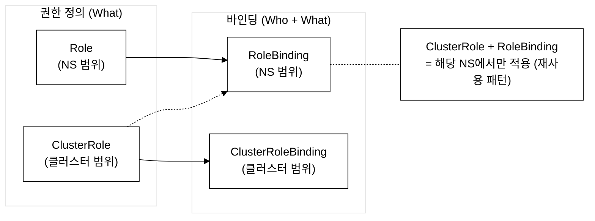
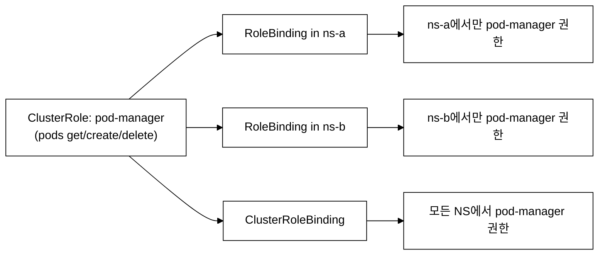
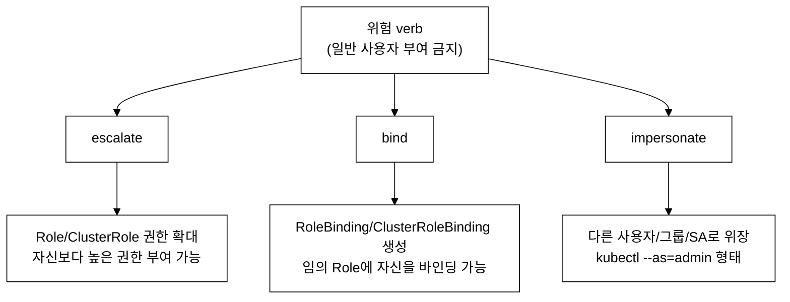
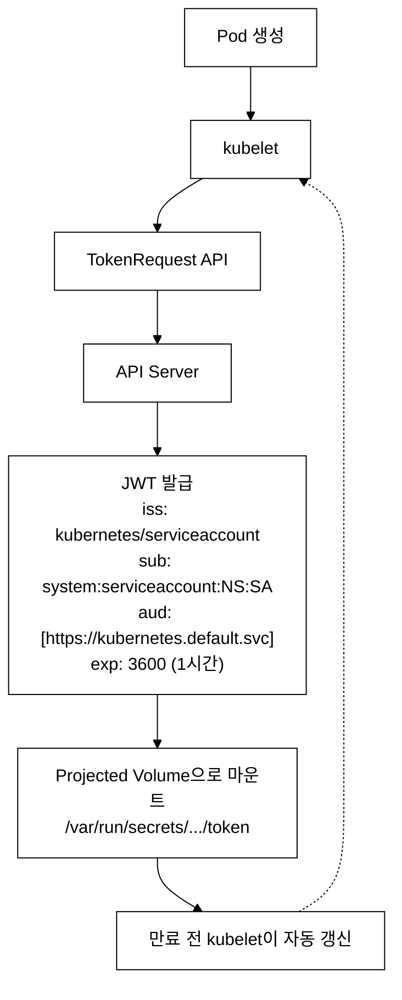
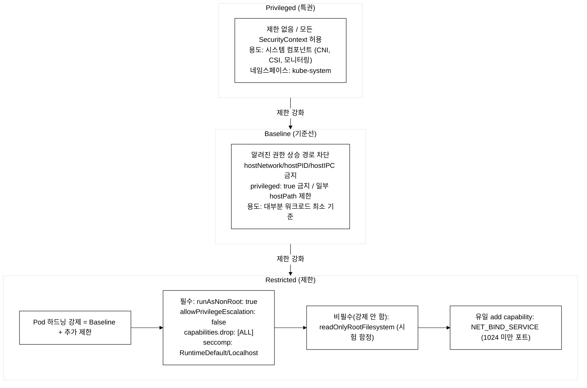
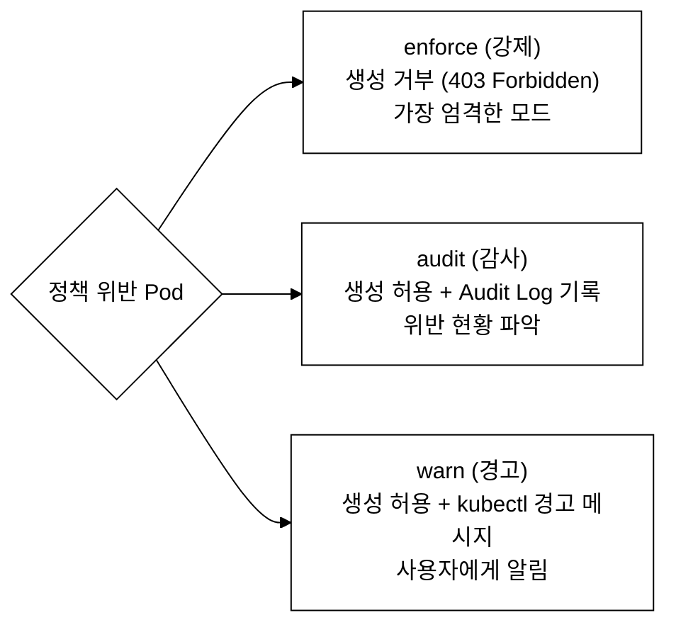
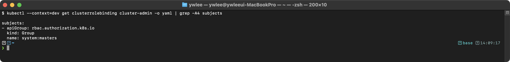

# KCSA Day 5: RBAC 심화, ServiceAccount, Pod Security Standards

> 학습 목표 | 도메인: Kubernetes Security Fundamentals (22%) | 예상 소요: 약 3시간

Day 4에서 클러스터 컴포넌트 수준 보안(CIS Benchmark, Static Pod)을 다뤘다. Day 5는 그 위에서 동작하는 API 접근 제어 계층(RBAC, SA, PSS)으로 이어진다. CIS Benchmark 5.1 시리즈는 RBAC 최소 권한을 명시하며, 5.1.6은 system:masters 그룹의 비사용을 권고한다. Day 5에서 이 권고들을 실제 리소스(Role/ClusterRole/SA)로 어떻게 구현하는지 다룬다.

---

## 오늘의 학습 목표

- [ ] RBAC 4종 리소스(Role·ClusterRole·RoleBinding·ClusterRoleBinding)의 범위와 관계를 설명할 수 있다
- [ ] ClusterRole + RoleBinding 패턴의 동작을 이해하고 적용할 수 있다
- [ ] escalate·bind·impersonate verb가 위험한 이유를 설명할 수 있다
- [ ] system:masters 그룹의 특수성과 위험성을 설명할 수 있다
- [ ] Bound ServiceAccount Token과 Legacy Token의 차이를 메커니즘 수준에서 설명할 수 있다
- [ ] automountServiceAccountToken의 우선순위(SA vs Pod)를 알고 있다
- [ ] PSS 3단계 레벨(Privileged/Baseline/Restricted)의 차이와 Restricted 필수·비필수 항목을 구분할 수 있다
- [ ] PSA 3가지 모드(enforce/audit/warn)를 설명할 수 있다
- [ ] PSP가 K8s 1.25에서 제거되었음을 알고 있다

---

## 1. RBAC (Role-Based Access Control) 심화

### 1.0 등장 배경

```
기존 방식의 한계:
초기 Kubernetes는 ABAC(Attribute-Based Access Control, 속성 기반 접근 제어)을 사용했다.
ABAC은 JSON 파일에 정책을 정의한다. 예를 들어 alice가 pods를 읽을 수 있는 정책은 다음과 같다:
{"apiVersion":"abac.authorization.kubernetes.io/v1beta1","kind":"Policy","spec":{"user":"alice","resource":"pods","readonly":true}}
이 파일을 변경하려면 kube-apiserver 프로세스를 재시작해야 한다. 그래서 다음과 같은 문제가 있었다:

1. 정책 변경 시 API Server를 재시작해야 한다
2. JSON 파일 기반이라 API로 동적 관리가 불가능하다
3. 정책이 복잡해지면 유지보수가 어렵다
4. 네임스페이스 단위의 세밀한 권한 분리가 불편하다

해결:
RBAC은 역할(Role)과 바인딩(Binding)의 분리를 통해
API 리소스로 동적 관리가 가능하다.
네임스페이스 범위(Role)와 클러스터 범위(ClusterRole)를 지원하며,
ClusterRole + RoleBinding 패턴으로 역할을 재사용할 수 있다.

RBAC 트레이드오프:
- 행(Row) 수준 접근 제어 불가: "특정 네임스페이스의 자기 Pod만 get"처럼
  리소스 필드 값 기반 세밀한 필터링이 불가능하다 → OPA/Kyverno 필요
- 권한이 복잡해지면 Role 수가 급증: 팀·환경·워크로드 조합이 늘어날수록
  Role/Binding 객체가 폭발적으로 증가해 관리 부담이 발생한다
- 허용/거부 이분법: RBAC은 허용 규칙만 정의한다. "이것만 빼고 허용"하는
  deny-specific 규칙이 없으므로 복잡한 예외 처리는 어렵다
```

### 1.1 RBAC의 4대 리소스

RBAC는 "누가(Subject) + 무엇을(Resource) + 어떻게(Verb)" 할 수 있는지 정의한다.

4대 리소스 구조:


_그림 1. RBAC 4대 리소스의 구성과 바인딩 관계._

### 1.2 Role vs ClusterRole 범위 비교

| 구분 | Role | ClusterRole |
|------|------|-------------|
| **범위** | 단일 네임스페이스 | 클러스터 전체 |
| **리소스** | NS 리소스 (pods, services 등) | 모든 리소스 + 비리소스 URL |
| **비리소스 URL** | 불가 (/healthz, /metrics 등) | 가능 |
| **노드** | 불가 | 가능 |
| **PV** | 불가 | 가능 |
| **NS** | 불가 | 가능 |
| **생성 위치** | 특정 네임스페이스 내 | 클러스터 레벨 |

### 1.3 RBAC YAML 상세

#### Role 예제 (NS 범위)

```yaml
apiVersion: rbac.authorization.k8s.io/v1
kind: Role
metadata:
  name: pod-reader
  namespace: production    # 이 네임스페이스에서만 유효
rules:
  - apiGroups: [""]        # "" = core API group
    resources: ["pods"]    # 대상 리소스
    verbs: ["get", "watch", "list"]  # 허용 동작
    # resourceNames: ["my-pod"]  ← 특정 리소스 이름으로 제한 가능
    # resourceNames는 문자열 배열로 리소스 이름을 직접 나열한다.
    # 예: ["web-pod", "api-pod"] → 해당 이름의 Pod에만 권한 적용
    # 와일드카드(*)보다 훨씬 안전하다. 단, list/watch 동작에는 적용되지 않는다.

  - apiGroups: [""]
    resources: ["pods/log"]  # 서브리소스
    verbs: ["get"]

  # 주요 verb:
  # get, list, watch      ← 읽기
  # create                ← 생성
  # update, patch         ← 수정
  # delete, deletecollection ← 삭제
  # ★ escalate, bind, impersonate ← 위험! (권한 상승 가능)
  # escalate: Role/ClusterRole에 자신이 갖지 않은 권한을 추가하거나
  #           자신보다 높은 권한의 Role을 생성·수정할 수 있다.
  #           → 관리자 전용. 일반 사용자에게 절대 부여 금지.
```

#### ClusterRole 예제 (클러스터 범위)

```yaml
apiVersion: rbac.authorization.k8s.io/v1
kind: ClusterRole
metadata:
  name: secret-reader
  # namespace 없음 (클러스터 범위)
rules:
  - apiGroups: [""]
    resources: ["secrets"]
    verbs: ["get", "list"]

  # 비리소스 URL 접근 (ClusterRole만 가능!)
  - nonResourceURLs: ["/healthz", "/metrics"]
    verbs: ["get"]
```

#### RoleBinding 예제

```yaml
apiVersion: rbac.authorization.k8s.io/v1
kind: RoleBinding
metadata:
  name: read-pods
  namespace: production
subjects:
  # 사용자 바인딩
  - kind: User
    name: jane@example.com
    apiGroup: rbac.authorization.k8s.io

  # 그룹 바인딩
  - kind: Group
    name: dev-team
    apiGroup: rbac.authorization.k8s.io

  # ServiceAccount 바인딩
  - kind: ServiceAccount
    name: monitoring-sa
    namespace: monitoring    # SA의 네임스페이스 (다른 NS도 가능)

roleRef:
  kind: ClusterRole          # ★ ClusterRole을 RoleBinding으로!
  name: secret-reader        #   → production NS에서만 적용
  apiGroup: rbac.authorization.k8s.io
  # roleRef는 변경 불가! → 삭제 후 재생성 필요
```

#### ClusterRoleBinding 예제

```yaml
apiVersion: rbac.authorization.k8s.io/v1
kind: ClusterRoleBinding
metadata:
  name: cluster-admin-binding
subjects:
  - kind: User
    name: admin@example.com
    apiGroup: rbac.authorization.k8s.io
roleRef:
  kind: ClusterRole
  name: cluster-admin        # 모든 리소스에 모든 권한
  apiGroup: rbac.authorization.k8s.io
  # ★ cluster-admin = system:masters 수준
  # 최소 권한 원칙에 따라 꼭 필요한 경우에만 사용!
```

### 1.4 ClusterRole + RoleBinding 패턴 (핵심!)

ClusterRole을 다양한 네임스페이스에서 재사용하는 패턴:


_그림 2. 하나의 ClusterRole을 네임스페이스별 RoleBinding과 클러스터 ClusterRoleBinding으로 재사용하는 패턴._

★ 시험 빈출: "ClusterRole을 RoleBinding으로 바인딩하면?" → 해당 NS에서만!

### 1.5 RBAC 위험 verb 분석

위험한 verb (권한 상승 가능):


_그림 3. 권한 상승을 유발하는 3가지 위험 verb와 각 위험 경로._

시험 패턴: "RBAC에서 escalate verb가 위험한 이유는?"
→ Role 권한을 상승시킬 수 있기 때문

### 1.6 기본 제공 ClusterRole

| ClusterRole | 권한 범위 | 비고 |
| :--- | :--- | :--- |
| `cluster-admin` | 모든 리소스에 모든 권한 | ★ `system:masters` 그룹에 바인딩됨. 모든 RBAC를 우회. 비상 시에만 사용 |
| `admin` | 네임스페이스 내 대부분 리소스 관리 | RBAC/ResourceQuota 편집 불가 |
| `edit` | 네임스페이스 내 리소스 읽기/쓰기 | Role/RoleBinding 편집 불가 |
| `view` | 네임스페이스 내 리소스 읽기 전용 | Secret 읽기 불가 |

시험 패턴: "system:masters 그룹의 특징은?"
→ 모든 RBAC 검사를 우회한다 (매우 위험!)

### 1.7 RBAC 권한 확인 명령어

```bash
# 현재 사용자 권한 확인
kubectl auth can-i create pods
kubectl auth can-i delete secrets -n production

# 다른 사용자 권한 확인 (관리자만)
kubectl auth can-i create pods --as=jane@example.com
kubectl auth can-i get secrets --as=system:serviceaccount:default:my-sa

# 모든 권한 나열
kubectl auth can-i --list
kubectl auth can-i --list --as=jane@example.com -n production

# RBAC 리소스 조회
kubectl get roles,rolebindings -n production
kubectl get clusterroles,clusterrolebindings
```

### 1.8 RBAC 보안 모범 사례

```
RBAC 보안 Best Practice:

1. 최소 권한 원칙 (Least Privilege)
   - 와일드카드(*) 사용 금지
   - 필요한 리소스/verb만 명시
   - resourceNames로 특정 리소스 제한

2. 정기적 권한 감사
   - 미사용 Role/Binding 정리
   - cluster-admin 바인딩 최소화
   - kubectl auth can-i --list로 권한 검토

3. 위험 verb 제한
   - escalate, bind, impersonate 부여 금지
   - create pods/exec 신중히 부여
     (pods/exec가 위험한 이유: kubectl exec로 실행 중인 Pod 내부에 진입해
      임의의 명령(예: cat /var/run/secrets/.../token)을 실행할 수 있어
      ServiceAccount 토큰 탈취 → 호스트 파일시스템 접근 → 클러스터 전체 장악
      으로 이어지는 공격 경로가 된다.)

4. 네임스페이스 분리
   - 환경(dev/staging/prod)별 네임스페이스 분리
   - 팀별 네임스페이스 할당
   - ClusterRole + RoleBinding 패턴으로 재사용
```

### 1.9 RBAC 권한 점검 도구

**[필수 — KCSA/CKS 시험 범위]**

| 도구 | 설명 | 주요 사용법 |
| :--- | :--- | :--- |
| `kubectl auth can-i` | 기본 내장 권한 확인 (시험 공식 도구) | `kubectl auth can-i verb resource`<br>`kubectl auth can-i --list`<br>`--as=<user/SA>`로 타 주체 권한 조회 |

**[참고 — 3rd-party 심화 도구 (시험 외 실무용)]**

| 도구 | 설명 | 주요 사용법 |
| :--- | :--- | :--- |
| `rakkess` | 전체 리소스에 대한 접근 행렬 표시 | `kubectl access-matrix` |
| `rbac-lookup` | RBAC 바인딩 조회 도구 | 사용자/SA별 바인딩 관계 시각화 |
| `kubectl-who-can` | "누가 이 리소스에 이 동작을 할 수 있는가?" 역방향 조회 | `kubectl who-can verb resource` |

시험에서는 `kubectl auth can-i` 만으로 모든 권한 검증이 가능하다.
3rd-party 도구는 자격증 문제에 출제되지 않으므로 개념만 파악해 두면 충분하다.

---

## 2. ServiceAccount와 Token 관리

### 2.0 등장 배경

초기 Kubernetes에는 Pod가 API Server에 안전하게 접근하는 표준 메커니즘이 없었다. 애플리케이션이 클러스터 내부에서 API Server를 호출해야 할 때(예: 오퍼레이터, 모니터링 에이전트, CI 파이프라인 등) 두 가지 방법이 사용됐다.

1. **쿠버네티스 없이 직접 파일을 마운트**: kubeconfig나 Bearer Token을 ConfigMap이나 Secret에 직접 넣고 Pod에 마운트했다. 관리자가 수동으로 토큰을 관리해야 했고, 토큰 만료·교체가 어려웠다.
2. **인증 없이 API 호출**: 내부 네트워크를 신뢰해 인증을 생략하는 경우도 있었다. 컨테이너 탈출이나 내부 네트워크 침투 시 API 전체가 노출되는 치명적 취약점이다.

**ServiceAccount(SA)가 해결한 것**

Kubernetes는 SA를 도입해 "Pod = 사람이 아닌 프로세스의 신원(Identity)"을 일급 객체로 만들었다. kubelet이 Pod 생성 시 자동으로 SA 토큰을 발급·마운트하므로, 애플리케이션은 별도 자격증명 관리 없이 `/var/run/secrets/kubernetes.io/serviceaccount/token` 파일만 읽으면 API Server에 인증된다.

**Legacy Token의 한계와 Bound Token의 개선**

SA 도입 초기(1.21 이전) Legacy Token은 만료 없이 Secret에 영구 저장됐다. Pod가 삭제된 뒤에도 토큰은 계속 유효했고, Secret이 탈취되면 클러스터 전체 수명 동안 공격자가 API에 접근할 수 있었다.

1.22부터 Bound ServiceAccount Token이 기본이 됐다. TokenRequest API가 발급하며, Pod 라이프사이클에 묶이고(Pod 삭제 시 토큰 자동 무효화), 만료 시간이 존재하고, 자동 갱신된다.

**트레이드오프**

- `default` SA는 모든 네임스페이스에 자동 생성되며 자동으로 Pod에 마운트된다. API 접근이 불필요한 워크로드(웹 서버, DB)에도 기본적으로 토큰이 마운트되므로 **공격 표면이 확대**된다. `automountServiceAccountToken: false`를 명시하지 않으면 모든 Pod가 잠재적 API 접근 경로를 갖는다.
- 워크로드별 전용 SA를 만들면 보안은 강해지지만 SA 객체와 RBAC 바인딩 수가 늘어 관리 부담이 증가한다.

### 2.1 ServiceAccount 기본 개념

```
ServiceAccount(SA)는 Pod가 API Server에 접근할 때 사용하는 ID이다.

SA 핵심 규칙:
1. 각 네임스페이스에 "default" SA가 자동 생성된다
2. Pod 생성 시 명시하지 않으면 "default" SA가 자동 할당된다
3. SA 토큰은 Projected Volume으로 Pod에 마운트된다
   (Projected Volume: kubelet이 Pod 런타임에 동적으로 생성하는 임시 볼륨으로,
    ConfigMap·Secret·ServiceAccount 토큰·downwardAPI 등 여러 정보원을
    하나의 디렉터리에 병합해 마운트하는 방식이다. 디스크에 저장되지 않으며
    Pod 삭제 시 함께 사라진다.)

SA 마운트 경로:
/var/run/secrets/kubernetes.io/serviceaccount/
├── token       ← JWT 토큰 (API Server 인증용)
├── ca.crt      ← API Server CA 인증서
└── namespace   ← Pod의 네임스페이스 이름
```

### 2.2 Bound ServiceAccount Token (1.22+)

```
Kubernetes 1.22부터 Bound ServiceAccount Token이 기본이다.

Legacy Token (1.21 이전):
- Secret 오브젝트에 저장
- 만료 없음 (영구 유효!)
- 삭제하지 않으면 계속 사용 가능
- ★ 보안 위험: 토큰 탈취 시 무기한 접근

Bound Token (1.22+):
- TokenRequest API로 발급
- 만료 시간 있음 (기본 1시간, 최대 48시간)
- audience 제한 (audience: 이 토큰을 검증할 수 있는 대상 서비스 URL — 다른 서비스에서 이 토큰을 사용하면 검증 실패)
- Pod에 바인딩 (Pod 삭제 시 토큰 무효)
- kubelet이 자동 갱신

Bound Token 발급-갱신 메커니즘 (단계별):
  ① Pod 생성 시 kubelet이 API Server의 TokenRequest API를 호출한다
  ② API Server는 JWT를 발급한다.
     - 유효기간: 3600초(1시간), audience: 해당 클러스터 URL
     - sub(subject): system:serviceaccount:<NS>:<SA명>
  ③ 발급된 토큰이 Projected Volume을 통해
     /var/run/secrets/kubernetes.io/serviceaccount/token 에 마운트된다
  ④ 만료 30분 전(또는 80% 경과 시점)에 kubelet이 자동으로 갱신 요청을 보내
     새 토큰으로 교체한다 → 애플리케이션은 재기동 없이 토큰을 갱신 받는다

  결과적으로 탈취된 토큰은 최대 1시간만 유효하고,
  Pod 삭제 시 API Server가 해당 Pod에 바인딩된 토큰을 즉시 무효화한다.
  Legacy Token의 "영구 유효" 문제를 메커니즘 수준에서 해결한 것이다.

Bound Token 흐름:
```


_그림 4. Bound ServiceAccount Token의 발급-마운트-자동 갱신 흐름._

★ 시험 빈출: "Bound SA Token의 특성이 아닌 것은? → 영구 유효"

### 2.3 automountServiceAccountToken

```yaml
# 방법 1: ServiceAccount 수준 (해당 SA를 사용하는 모든 Pod에 적용)
apiVersion: v1
kind: ServiceAccount
metadata:
  name: no-api-access
  namespace: production
automountServiceAccountToken: false
  # 이 SA를 사용하는 Pod에는 토큰이 마운트되지 않음

---
# 방법 2: Pod 수준 (개별 Pod에 적용, SA 설정보다 우선)
apiVersion: v1
kind: Pod
metadata:
  name: web-app
spec:
  serviceAccountName: no-api-access
  automountServiceAccountToken: false
  # Pod 수준 설정이 SA 수준보다 우선!
  containers:
    - name: app
      image: nginx:1.27
```

```
automountServiceAccountToken: false 사용 시기:

✓ API Server에 접근할 필요가 없는 워크로드 (웹 서버, DB 등)
✓ 최소 권한 원칙 적용
✓ SA 토큰 탈취 위험 제거

✗ 사용하면 안 되는 경우:
  - API Server에 접근해야 하는 오퍼레이터/컨트롤러
  - kubectl exec가 필요한 디버그 Pod
```

### 2.4 ServiceAccount 보안 모범 사례

```
SA 보안 Best Practice:

1. default SA 사용 금지
   - 각 워크로드에 전용 SA 생성
   - default SA에는 최소 권한만 (또는 권한 없음)

2. 불필요한 토큰 마운트 비활성화
   - automountServiceAccountToken: false
   - API 접근 불필요 시 반드시 설정

3. SA별 최소 권한 RBAC
   - SA에 필요한 최소한의 Role만 바인딩
   - 와일드카드(*) 사용 금지

4. 토큰 갱신 보장
   - Bound Token의 자동 갱신에 의존 (kubelet)
   - Legacy Secret 기반 토큰 사용 금지

5. SA 토큰을 Git에 커밋 금지
   - .gitignore에 토큰/kubeconfig 추가
```

### 2.5 SA 토큰 수동 발급

```bash
# TokenRequest API로 임시 토큰 발급
kubectl create token my-sa -n production --duration=600s

# 토큰 디코딩 (JWT 구조 확인)
kubectl create token my-sa | cut -d. -f2 | base64 -d | jq .
# 출력은 실제 클러스터에서 캡처한 이미지를 참조한다 (미캡처)
```

---

## 3. Pod Security Standards (PSS) / Pod Security Admission (PSA)

### 3.1 PodSecurityPolicy(PSP) → PSS/PSA 전환 역사

```
보안 정책 발전 역사:

PodSecurityPolicy (PSP):
- K8s 1.0부터 존재
- 1.21: deprecated 선언
- 1.25: 완전 제거! ★ 시험 빈출
- 문제점: 복잡한 설정, RBAC와의 혼동, 디버깅 어려움
  - PSP 동작 메커니즘: PSP는 사용자(또는 SA)가 해당 PSP 오브젝트에 `use` verb 권한을 가진 경우에만 적용됐다. 즉, RBAC로 `use` 권한을 부여해야만 PSP가 동작했으므로 RBAC와 PSP가 이중으로 얽혔다.
  - 여러 PSP가 존재할 때 어떤 PSP가 선택될지 결정 순서가 불명확했고, RBAC과 PSP의 권한 조합이 예상치 못한 정책을 만들어 디버깅이 매우 어려웠다.

Pod Security Standards (PSS):
- 3개의 보안 레벨 정의 (Privileged/Baseline/Restricted)
- K8s 공식 보안 표준

Pod Security Admission (PSA):
- PSS를 적용하는 내장 Admission Controller
- 네임스페이스 레이블로 설정
- 1.23: Beta, 1.25: Stable (GA)

PSA 트레이드오프:
- PSA는 Privileged / Baseline / Restricted 3레벨 고정이다.
  "특정 capability만 허용하되 나머지 금지"처럼 레벨 사이의 세밀한 커스텀 정책은
  정의할 수 없다 → OPA Gatekeeper 또는 Kyverno 같은 외부 정책 엔진이 필요하다.
- PSA는 허용/거부만 결정하며, Pod 스펙 자동 수정(mutation)은 하지 않는다.
  PSP는 일부 필드를 자동으로 주입(defaultAllowPrivilegeEscalation 등)해 줬지만
  PSA는 이를 지원하지 않는다 → 애플리케이션 팀이 스펙을 직접 수정해야 한다.
```

### 3.2 PSS 3단계 레벨 상세

PSS 3단계 레벨 비교:


_그림 5. PSS 3단계 레벨(Privileged → Baseline → Restricted)의 제한 강화 위계._

Baseline이 차단하는 항목과 위험 이유:

| 금지 항목 | 위험 이유 |
| :--- | :--- |
| `hostNetwork: true` | 컨테이너가 노드의 네트워크 스택을 직접 사용하므로 같은 노드에서 동작하는 다른 Pod 트래픽을 감청할 수 있다 |
| `hostPID: true` | 컨테이너가 노드의 프로세스 목록 전체를 조회·조작할 수 있어 호스트 프로세스를 직접 kill하거나 메모리를 읽는 공격이 가능하다 |
| `hostIPC: true` | 노드의 IPC 네임스페이스를 공유해 같은 노드 프로세스와 공유 메모리 세그먼트·세마포어를 통해 데이터를 교환하거나 탈취할 수 있다 |
| `privileged: true` | 컨테이너가 거의 root와 동일한 커널 능력을 갖게 되어 호스트 파일시스템 마운트, 커널 모듈 로드 등 컨테이너 탈출이 가능하다 |
| 일부 `hostPath` 볼륨 | 노드의 민감 디렉터리(`/etc`, `/var/run/docker.sock` 등)를 직접 마운트해 호스트 전체를 장악할 수 있다 |

### 3.3 PSS Restricted Pod YAML 예제

```yaml
apiVersion: v1
kind: Pod
metadata:
  name: restricted-pod
  namespace: production
spec:
  securityContext:
    runAsNonRoot: true           # ★ 필수: root로 실행 금지
    runAsUser: 1000
    runAsGroup: 1000
    fsGroup: 1000
    seccompProfile:
      type: RuntimeDefault       # ★ 필수: seccomp 프로파일
      # seccomp(Secure Computing Mode): 컨테이너 프로세스가 호출할 수 있는
      # 리눅스 시스템 콜(syscall)을 필터링하는 커널 보안 메커니즘이다.
      #
      # RuntimeDefault: 컨테이너 런타임(containerd 등)이 미리 정의한
      #   기본 허용 syscall 목록을 사용한다. 일반 워크로드에 충분하며 권장 옵션.
      #   Restricted 프로파일을 만족하고 별도 관리 부담이 없다.
      #
      # Localhost:      노드에 미리 배포한 커스텀 JSON 정책 파일을 사용한다.
      #   localhostProfile 필드에 파일 경로를 지정해야 한다.
      #   예: type: Localhost
      #       localhostProfile: profiles/my-custom.json
      #   Restricted 프로파일을 만족하지만, 노드마다 파일을 배포·관리해야 하므로
      #   운영 부담이 크다. 특수한 syscall 제어가 필요한 경우에만 사용한다.

  containers:
    - name: app
      image: nginx:1.27
      securityContext:
        allowPrivilegeEscalation: false  # ★ 필수: 권한 상승 금지
        readOnlyRootFilesystem: true     # 모범 사례 (필수 아님!)
        capabilities:
          drop: ["ALL"]                  # ★ 필수: 모든 capability 제거
          add: ["NET_BIND_SERVICE"]      # ★ 유일한 add 가능 capability
          # NET_BIND_SERVICE: 1024 미만 특권 포트(SSH 22, HTTP 80, HTTPS 443 등)를
          # 바인드할 수 있게 하는 capability이다.
          # Restricted 레벨에서는 root가 아닌 사용자로 실행하므로 기본적으로
          # 1024 미만 포트 바인드가 불가능하다. nginx처럼 포트 80이 꼭 필요한
          # 경우에만 이 capability를 추가하고, 그 외 모든 capability는
          # drop: ["ALL"]로 제거해야 권한 상승 공격 경로를 차단할 수 있다.
      resources:
        requests:
          cpu: "100m"
          memory: "64Mi"
        limits:
          cpu: "500m"
          memory: "256Mi"

  # 추가 보안 설정 (Restricted에서 금지되는 항목)
  # hostNetwork: true    ← 금지!
  # hostPID: true        ← 금지!
  # hostIPC: true        ← 금지!
```

### 3.4 PSA 3가지 모드

PSA는 네임스페이스 레이블로 설정하며, 3가지 모드가 있다:


_그림 6. PSA 3가지 모드(enforce/audit/warn)의 정책 위반 처리 방식._

점진적 적용 전략 (권장):
1단계: audit + warn으로 시작 → 위반 현황 파악
2단계: enforce=baseline + audit=restricted → 기본 차단
3단계: enforce=restricted → 최종 강화

audit 모드 위반 기록 위치:
  audit 모드는 위반 내역을 kube-apiserver Audit Log에 annotation으로 남긴다.
  kubectl get events 에는 나타나지 않는다 (events는 enforce 거부 시에만 PSA 항목 생성).
  Audit Log 확인 방법:
  - 클러스터 수준 Audit Log 파일: kube-apiserver 옵션 --audit-log-path 지정 경로
    (예: ssh staging-master 후 /var/log/kubernetes/audit.log)
  - 해당 로그에서 'pod-security.kubernetes.io/audit-violations' annotation 검색
  - warn 모드는 kubectl 명령 실행 시 터미널에 Warning 메시지로 즉시 표시된다.
  실무에서는 warn + audit 조합으로 시작해 위반 파악 후 enforce로 전환하는 것이 안전하다.

### 3.5 PSA 네임스페이스 레이블 설정

```yaml
# 네임스페이스에 PSA 레이블 적용
apiVersion: v1
kind: Namespace
metadata:
  name: production
  labels:
    # enforce: 위반 시 거부
    pod-security.kubernetes.io/enforce: restricted
    pod-security.kubernetes.io/enforce-version: latest

    # audit: 위반 시 Audit Log 기록
    pod-security.kubernetes.io/audit: restricted
    pod-security.kubernetes.io/audit-version: latest

    # warn: 위반 시 경고 메시지
    pod-security.kubernetes.io/warn: restricted
    pod-security.kubernetes.io/warn-version: latest
```

```bash
# 기존 네임스페이스에 레이블 추가
kubectl label namespace production \
  pod-security.kubernetes.io/enforce=restricted \
  pod-security.kubernetes.io/warn=restricted \
  pod-security.kubernetes.io/audit=restricted

# 적용 전 dry-run 점검
kubectl label namespace production \
  pod-security.kubernetes.io/enforce=restricted \
  --dry-run=server --overwrite
```

### 3.6 PSA 적용 시 주의사항

```
PSA 적용 시 주의사항:

1. kube-system 네임스페이스
   → Privileged 레벨 유지 (시스템 컴포넌트에 특권 필요)
   → CNI, CSI, kube-proxy 등이 hostNetwork/hostPID 사용

2. Static Pod에는 PSA 미적용
   → kubelet이 직접 관리하므로 Admission Control 우회
   → /etc/kubernetes/manifests/ 파일 보안으로 보호

3. 기존 Pod는 영향 없음
   → enforce는 새로 생성/업데이트되는 Pod에만 적용
   → 기존 실행 중인 Pod는 계속 실행

4. version 레이블
   → "latest"를 사용하면 K8s 업그레이드 시 자동으로 최신 PSS 적용
   → 특정 버전(v1.31)을 지정하면 해당 버전의 PSS로 고정
```

---

## 4. 핵심 암기 항목

```
RBAC:
- 4종: Role(NS) / ClusterRole(Cluster) / RoleBinding(NS) / ClusterRoleBinding(Cluster)
- ClusterRole + RoleBinding = 해당 NS에서만! ★★★
- roleRef: 변경 불가 → 삭제 후 재생성
- 위험 verb: escalate, bind, impersonate
- system:masters: 모든 RBAC 우회 → 비상 시에만!
- view ClusterRole: Secret 읽기 불가

SA:
- default SA: 네임스페이스마다 자동 생성
- automountServiceAccountToken: false → API 접근 불필요 시
- Bound Token: 만료 + audience 제한 + Pod 바인딩 + 자동 갱신
- Legacy Token: 영구 유효 → 사용 금지!

PSS/PSA:
- PSP: 1.25에서 제거! ★
- PSS 3레벨: Privileged / Baseline / Restricted
- Restricted 필수: runAsNonRoot, allowPrivilegeEscalation:false,
                   drop:ALL, seccomp(RuntimeDefault/Localhost)
- Restricted 비필수: readOnlyRootFilesystem ★★★ (시험 함정!)
- Restricted 유일 add capability: NET_BIND_SERVICE
- PSA 3모드: enforce(거부) / audit(감사) / warn(경고)
```

---

## 5. 복습 체크리스트

- [ ] RBAC 4종 리소스의 범위(NS/Cluster)를 구분할 수 있다
- [ ] ClusterRole + RoleBinding 효과를 설명할 수 있다
- [ ] roleRef가 변경 불가임을 알고 있다
- [ ] escalate/bind/impersonate verb의 위험성을 설명할 수 있다
- [ ] system:masters 그룹의 특수성을 알고 있다
- [ ] Bound SA Token과 Legacy Token의 차이를 설명할 수 있다
- [ ] automountServiceAccountToken의 용도를 알고 있다
- [ ] PSS 3단계 레벨의 차이를 표로 정리할 수 있다
- [ ] Restricted 필수/비필수 항목을 구분할 수 있다
- [ ] PSA 3모드를 설명할 수 있다
- [ ] PSP가 1.25에서 제거됨을 알고 있다

---

## 내일 예고: Day 6 - NetworkPolicy, Secret 관리, OPA/Kyverno, 연습 문제

- NetworkPolicy 심화 (AND/OR 규칙, default-deny)
- Secret 관리 (Base64 vs 암호화, Volume vs 환경변수)
- OPA Gatekeeper / Kyverno 비교
- 연습 문제 18문제 + 상세 해설
- tart-infra 실습

---

## tart-infra 실습

### 실습 환경 설정

```bash
export KUBECONFIG=kubeconfig/dev.yaml
kubectl get nodes
```

### 실습 1: RBAC 구조 확인

```bash
# ClusterRole 목록 (기본 제공)
echo "=== 기본 ClusterRole ==="
kubectl get clusterroles | grep -E "^(cluster-admin|admin|edit|view) "

# ClusterRoleBinding 확인
echo ""
echo "=== cluster-admin 바인딩 ==="
kubectl get clusterrolebinding cluster-admin -o yaml | grep -A 5 subjects
```

**검증 — 기대 출력:**


**ClusterRole + RoleBinding 다중 NS 재사용 패턴 검증:**

하나의 ClusterRole을 여러 네임스페이스에서 서로 다른 RoleBinding으로 재사용하면,
각 RoleBinding이 속한 NS 안에서만 권한이 적용된다. 이를 직접 확인한다.

```bash
# 전제: export KUBECONFIG=kubeconfig/dev.yaml
kubectl create namespace ns-a 2>/dev/null || true
kubectl create namespace ns-b 2>/dev/null || true
kubectl create serviceaccount sa-a -n ns-a
kubectl create serviceaccount sa-b -n ns-b

# 하나의 ClusterRole을 두 NS의 RoleBinding이 각각 참조
kubectl create clusterrole pod-viewer --verb=get,list --resource=pods
kubectl create rolebinding pod-viewer-in-ns-a \
  --clusterrole=pod-viewer -n ns-a --serviceaccount=ns-a:sa-a
kubectl create rolebinding pod-viewer-in-ns-b \
  --clusterrole=pod-viewer -n ns-b --serviceaccount=ns-b:sa-b

# 검증: 각 SA는 자신의 NS에서만 권한을 갖는다
kubectl auth can-i get pods --as=system:serviceaccount:ns-a:sa-a -n ns-a  # yes
kubectl auth can-i get pods --as=system:serviceaccount:ns-b:sa-b -n ns-b  # yes
kubectl auth can-i get pods --as=system:serviceaccount:ns-a:sa-a -n ns-b  # no ← ns-a에만 바인딩됨

# 정리
kubectl delete clusterrole pod-viewer
kubectl delete rolebinding pod-viewer-in-ns-a -n ns-a
kubectl delete rolebinding pod-viewer-in-ns-b -n ns-b
kubectl delete namespace ns-a ns-b
```

**동작 원리:** RBAC 4종 리소스:
1. **Role**: 네임스페이스 범위의 권한 정의
2. **ClusterRole**: 클러스터 범위의 권한 정의 (비리소스 URL 포함)
3. **RoleBinding**: 네임스페이스 범위에서 Subject와 Role을 연결
4. **ClusterRoleBinding**: 클러스터 범위에서 Subject와 ClusterRole을 연결

### 실습 2: ServiceAccount 확인

```bash
# 네임스페이스별 SA 확인
echo "=== demo 네임스페이스 ServiceAccount ==="
kubectl get sa -n demo

# Pod의 SA 토큰 마운트 확인
echo ""
echo "=== Pod의 SA 토큰 마운트 ==="
kubectl get pods -n demo -o jsonpath='{range .items[0]}{.spec.serviceAccountName}{"\n"}{range .spec.containers[*]}{.volumeMounts}{"\n"}{end}{end}' 2>/dev/null || echo "Pod 없음"
```

**automountServiceAccountToken 우선순위 검증:**

SA 수준보다 Pod 수준 설정이 우선한다는 점을 실제로 확인하려면 다음 명령을 사용한다.

```bash
# 전제: export KUBECONFIG=kubeconfig/dev.yaml
# demo 네임스페이스 생성 (없으면 생성, 이미 있으면 무시)
kubectl create namespace demo 2>/dev/null || true

# SA 수준: automountServiceAccountToken: true (기본값)
kubectl create sa test-sa -n demo

# Pod 수준: false 설정 → SA 수준보다 우선
kubectl run test-pod --image=nginx:1.27 -n demo \
  --overrides='{"spec":{"serviceAccountName":"test-sa","automountServiceAccountToken":false}}' \
  --restart=Never

# Pod 수준 설정 확인
kubectl get pod test-pod -n demo -o jsonpath="{.spec.automountServiceAccountToken}"
# 출력: false  ← SA가 true여도 Pod 수준 false가 이긴다

# 정리
kubectl delete pod test-pod -n demo
kubectl delete sa test-sa -n demo
```

**동작 원리:** ServiceAccount 보안:
1. 각 NS에 `default` SA가 자동 생성됨
2. Pod에 명시하지 않으면 default SA 사용
3. `automountServiceAccountToken: false`로 불필요한 토큰 마운트 방지
   - SA 수준 설정은 해당 SA를 사용하는 모든 Pod에 적용되지만,
     Pod 수준 설정이 명시되면 Pod 수준이 항상 우선한다.
4. Bound Token은 1시간 만료 + 자동 갱신

### 실습 3: PSA 레이블 확인

```bash
# 네임스페이스 PSA 레이블 확인
echo "=== 네임스페이스 PSA 레이블 ==="
kubectl get namespaces --show-labels | grep pod-security || echo "PSA 레이블 미설정"

# kube-system은 Privileged 레벨 (기본)
echo ""
echo "=== kube-system 레이블 ==="
kubectl get namespace kube-system --show-labels
```

**출력 해석 기준:**
- `grep pod-security` 결과가 없으면 `echo` 가 "PSA 레이블 미설정"을 출력한다.
  → kube-system은 PSA 레이블이 없어도 Privileged로 동작하는 것이 정상이다
    (컨트롤러가 네임스페이스 생성 시 자동으로 Privileged를 허용하는 built-in 예외 처리).
- PSA 레이블이 설정된 네임스페이스라면 `pod-security.kubernetes.io/enforce=restricted` 형태로 표시된다.
- `--show-labels` 출력에서 LABELS 컬럼이 `<none>`이면 PSA 레이블이 없는 것이다.

**동작 원리:** PSA(Pod Security Admission):
1. 네임스페이스 레이블로 PSS 레벨 적용
2. 3모드: enforce(거부), audit(감사), warn(경고)
3. kube-system은 Privileged 유지 (시스템 컴포넌트에 특권 필요)
4. Static Pod에는 적용되지 않음 (kubelet 직접 관리)

### 실습 4: PSA enforce=restricted 동작 검증

PSA 3모드 중 enforce와 warn의 차이를 직접 손으로 확인한다. 이론으로만 보면 "enforce는 거부, warn은 경고"가 추상적이지만, 실제 403 Forbidden 메시지와 Warning 메시지를 눈으로 보면 차이가 몸에 남는다.

```bash
# 전제: export KUBECONFIG=kubeconfig/dev.yaml
# 테스트용 네임스페이스 생성
kubectl create namespace psa-test 2>/dev/null || true

# 1단계: enforce=restricted 레이블 적용
kubectl label namespace psa-test \
  pod-security.kubernetes.io/enforce=restricted \
  pod-security.kubernetes.io/enforce-version=latest

# 2단계: securityContext 없는 기본 Pod 생성 시도 → 403 Forbidden 확인
kubectl run bad-pod --image=nginx:1.27 -n psa-test --restart=Never
# 예상 결과: Error from server (Forbidden): pods "bad-pod" is forbidden:
#   violates PodSecurity "restricted:latest": ...

# 3단계: enforce → warn 모드로 재설정
kubectl label namespace psa-test \
  pod-security.kubernetes.io/enforce- \
  --overwrite 2>/dev/null || true
kubectl label namespace psa-test \
  pod-security.kubernetes.io/warn=restricted \
  pod-security.kubernetes.io/warn-version=latest

# 4단계: 동일 Pod 재시도 → 생성 허용 + Warning 메시지 출력 확인
kubectl run bad-pod --image=nginx:1.27 -n psa-test --restart=Never
# 예상 결과: Warning: would violate PodSecurity "restricted:latest": ...
#            pod/bad-pod created  ← 생성은 됨 (enforce와 대비)

# 정리
kubectl delete namespace psa-test
```

**동작 원리:** enforce는 Pod 생성 자체를 API Server 단에서 거부(HTTP 403)한다. warn은 생성을 허용하되 kubectl 클라이언트에 Warning 헤더를 반환해 터미널에 경고 메시지를 표시한다. 두 모드를 직접 비교해야 "warn으로 시작 후 enforce로 전환"하는 점진적 적용 전략의 이유가 납득된다.

**기대 출력:** 실제 클러스터에서 캡처한 이미지를 참조한다 (미캡처)

### 실습 5: 권한 확인

```bash
# 현재 사용자의 권한 확인
echo "=== 현재 사용자 권한 (demo NS) ==="
kubectl auth can-i create pods -n demo
kubectl auth can-i delete secrets -n demo
kubectl auth can-i create clusterroles

# SA 권한 확인
echo ""
echo "=== default SA 권한 ==="
kubectl auth can-i get pods --as=system:serviceaccount:demo:default -n demo
```

**검증 — 기대 출력:**
> **예시(참조) — dev 실측 (ns=cap-kcsa-day05, 캡처 후 삭제):** KCSA 보안 개념/점검 기대 출력(설정/도구/환경 의존). 재현 가능 핵심은 KCSA daily 및 본 캡처 참고.
default SA에 `no`가 출력되면 최소 권한 원칙이 올바르게 적용된 것이다.

**동작 원리:** 최소 권한 원칙:
1. `kubectl auth can-i`로 권한 검증
2. 와일드카드(*) 사용 지양
3. escalate/bind/impersonate verb는 일반 사용자에게 부여 금지
4. cluster-admin은 비상 시에만 사용

### 트러블슈팅: RBAC 및 PSA 문제

```
장애 시나리오 1: "forbidden" 에러로 리소스 접근 불가
  증상: Error from server (Forbidden): pods is forbidden
  원인: RoleBinding이 없거나, 잘못된 네임스페이스에 생성됨
  디버깅:
    kubectl auth can-i get pods -n <namespace> --as=<user>
    kubectl get rolebindings -n <namespace> -o wide
  해결: 올바른 네임스페이스에 RoleBinding을 생성한다.
        roleRef는 변경 불가이므로 잘못된 경우 삭제 후 재생성한다.

장애 시나리오 2: PSA enforce=restricted 적용 후 기존 Deployment 실패
  증상: Deployment가 새 Pod를 생성하지 못함
  원인: Pod 스펙이 Restricted 필수 요구사항을 충족하지 않음
  디버깅:
    kubectl get events -n <namespace> --sort-by=.lastTimestamp
    kubectl label namespace <namespace> \
      pod-security.kubernetes.io/enforce=restricted \
      --dry-run=server --overwrite
  해결: Pod 스펙에 runAsNonRoot, allowPrivilegeEscalation: false,
        capabilities.drop: ["ALL"], seccompProfile 설정을 추가한다
```

---

## 자가점검

<details>
<summary>Q1. ClusterRole을 RoleBinding으로 바인딩하면 권한 범위는 어떻게 되는가?</summary>

ClusterRole이지만 RoleBinding이 속한 **해당 네임스페이스에서만** 권한이 적용된다. 클러스터 전체 권한을 원한다면 ClusterRoleBinding을 사용해야 한다.

</details>

<details>
<summary>Q2. roleRef를 수정하려면 어떻게 해야 하는가?</summary>

roleRef는 불변(immutable)이다. **삭제 후 재생성**해야 한다. `kubectl edit` 이나 `kubectl apply`로 roleRef만 변경하면 API Server가 거부한다.

</details>

<details>
<summary>Q3. escalate verb가 위험한 이유는?</summary>

사용자가 자신이 보유하지 않은 권한을 Role/ClusterRole에 추가하거나, 자신보다 높은 권한의 Role을 생성·수정할 수 있다. 결과적으로 낮은 권한의 사용자가 클러스터 관리자 수준으로 권한을 상승시킬 수 있다.

</details>

<details>
<summary>Q4. system:masters 그룹의 특수성은 무엇인가?</summary>

`system:masters` 그룹에 속한 사용자는 **모든 RBAC 검사를 우회**한다. 일반 `cluster-admin` ClusterRoleBinding과 달리, RBAC 레이어 자체를 건너뛰므로 RBAC으로 권한을 제거하거나 제한할 수 없다.

</details>

<details>
<summary>Q5. Bound ServiceAccount Token에서 Pod를 삭제하면 토큰은 어떻게 되는가?</summary>

API Server가 해당 Pod에 바인딩된 토큰을 **즉시 무효화**한다. Legacy Token은 Pod 삭제와 무관하게 영구 유효했지만, Bound Token은 Pod 라이프사이클에 묶여 있다.

</details>

<details>
<summary>Q6. Pod의 automountServiceAccountToken: false가 SA 수준의 true 설정을 덮어쓰는가?</summary>

그렇다. Pod 수준 설정이 SA 수준 설정보다 **항상 우선**한다. SA에 `automountServiceAccountToken: true`가 설정되어 있어도 Pod 스펙에 `false`를 명시하면 토큰이 마운트되지 않는다.

</details>

<details>
<summary>Q7. PSS Restricted 레벨에서 readOnlyRootFilesystem은 필수인가?</summary>

**아니다.** PSS Restricted에서 `readOnlyRootFilesystem`은 권장 모범 사례이지만 **필수 요구사항이 아니다**. 필수 항목은 `runAsNonRoot: true`, `allowPrivilegeEscalation: false`, `capabilities.drop: [ALL]`, `seccompProfile: RuntimeDefault/Localhost`이다. 시험 함정으로 자주 출제된다.

</details>

<details>
<summary>Q8. PSA audit 모드 위반은 kubectl get events에서 확인할 수 있는가?</summary>

**아니다.** audit 모드 위반은 kube-apiserver Audit Log에 annotation으로 기록된다. `kubectl get events`에는 나타나지 않는다. events는 enforce 모드에서 Pod 생성 거부가 발생할 때만 PSA 항목이 생성된다.

</details>

<details>
<summary>Q9. PSP가 제거된 Kubernetes 버전은?</summary>

K8s **1.25**에서 완전 제거됐다. 1.21에서 deprecated 선언됐고, 1.22~1.24에서는 PSP가 남아 있지만 비활성화가 권장됐다.

</details>

<details>
<summary>Q10. PSA에서 고정 3레벨 외에 커스텀 정책이 필요하다면 무엇을 사용하는가?</summary>

**OPA Gatekeeper** 또는 **Kyverno**를 사용한다. PSA는 Privileged/Baseline/Restricted 3레벨만 지원하며 사용자 정의 규칙을 정의할 수 없다.

</details>

---

## 시험 팁

- **ClusterRole + RoleBinding 조합**: 시험에서 가장 빈출하는 함정. "ClusterRole을 RoleBinding으로 바인딩하면 클러스터 전체 권한?"이라는 문제가 많다. 답은 **해당 NS에서만**이다.
- **roleRef 불변성**: 시험 시나리오에서 roleRef 수정 시도 → 거부 → 삭제 후 재생성 패턴을 묻는다.
- **Restricted 필수 vs 비필수**: `readOnlyRootFilesystem`은 비필수. `seccompProfile`은 필수. 이 두 가지를 혼동하는 문제가 자주 출제된다.
- **Bound Token 특성이 아닌 것**: "영구 유효"는 Legacy Token의 특성이다. 시험에서 "Bound Token의 특성이 아닌 것은?"에 "영구 유효"를 고르면 된다.
- **PSP 제거 버전**: 1.25. "1.21에 deprecated, 1.25에 제거"를 정확히 암기한다.
- **system:masters**: RBAC 우회. 일반 cluster-admin과 다르다는 점을 기억한다.
- **PSA audit vs warn**: audit은 Audit Log 기록, warn은 터미널 경고 메시지. `kubectl get events`에는 둘 다 표시되지 않는다(enforce 거부만 events에 남음).

---

## 더 읽을거리

- [Kubernetes 공식: RBAC Authorization](https://kubernetes.io/docs/reference/access-authn-authz/rbac/)
- [Kubernetes 공식: Service Accounts](https://kubernetes.io/docs/concepts/security/service-accounts/)
- [Kubernetes 공식: Bound Service Account Tokens](https://kubernetes.io/docs/reference/access-authn-authz/service-accounts-admin/#bound-service-account-tokens)
- [Kubernetes 공식: Pod Security Standards](https://kubernetes.io/docs/concepts/security/pod-security-standards/)
- [Kubernetes 공식: Pod Security Admission](https://kubernetes.io/docs/concepts/security/pod-security-admission/)
- [KEP-2579: Pod Security Admission (PSP 대체)](https://github.com/kubernetes/enhancements/tree/master/keps/sig-auth/2579-psp-replacement)
- 실습 보충: `manifests/rbac/` 디렉터리의 예제 매니페스트 참고
