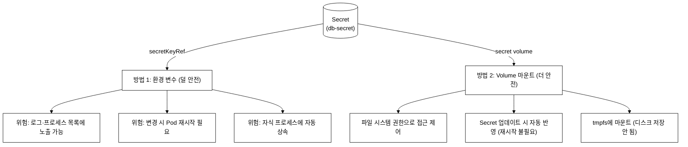
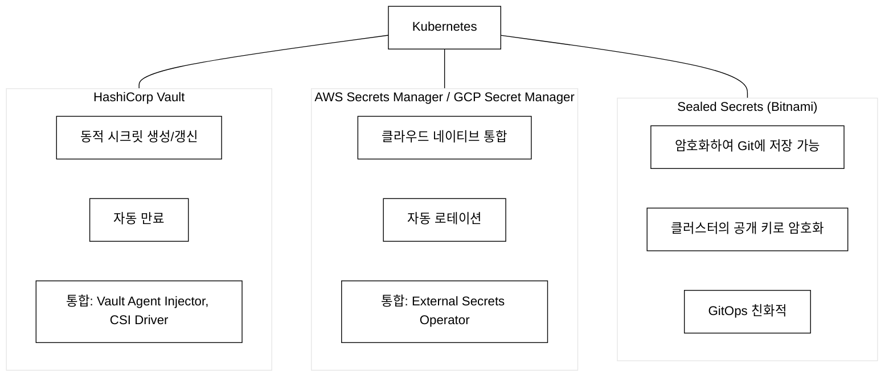
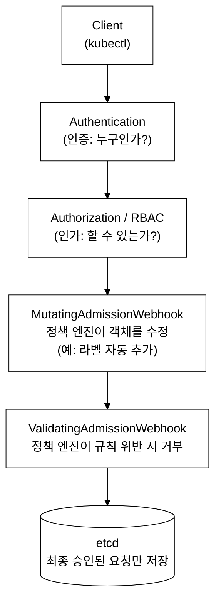

# KCSA Day 6: NetworkPolicy, Secret 관리, OPA/Kyverno, 연습 문제

> **학습 목표:** NetworkPolicy의 AND/OR 규칙·default-deny 패턴 이해, Secret 3중 방어 계층 파악, 정책 엔진(OPA Gatekeeper/Kyverno) 선택 기준 습득 | **도메인:** Kubernetes Security Fundamentals (22%) | **예상 소요:** 90분

Day 5에서 RBAC·PSA·ServiceAccount 토큰 수명 주기를 다뤘다. Day 6은 그 위에서 "인가된 연결도 네트워크 수준에서 다시 제한"하는 Zero Trust 네트워크 정책과, 인가 이후에도 남는 비밀값 보호 문제(Secret), 그리고 RBAC·PSA만으로 커버하지 못하는 리소스 수준 정책 집행(OPA/Kyverno)으로 이어진다.

## 오늘의 학습 목표

- [ ] NetworkPolicy가 없는 상태에서의 기본 통신 동작을 설명한다
- [ ] default-deny 정책 YAML을 직접 작성한다
- [ ] AND/OR 규칙을 YAML 들여쓰기 구조로 구분한다
- [ ] Egress default-deny 적용 시 DNS(53번 포트) 허용이 필요한 이유를 설명한다
- [ ] Secret의 Base64 인코딩이 암호화가 아닌 이유를 설명하고, 3중 방어 계층을 열거한다
- [ ] Volume 마운트가 환경 변수보다 안전한 이유를 3가지 이상 든다
- [ ] OPA Gatekeeper와 Kyverno의 정책 언어 차이를 말한다
- [ ] Admission Webhook의 failurePolicy가 클러스터 전체에 미치는 영향을 설명한다

---

## 1. NetworkPolicy 심화

### 1.0 등장 배경

```
기존 방식의 한계:
Kubernetes의 기본 네트워크 모델은 "모든 Pod가 모든 Pod와 통신 가능"이다.
이것은 개발 편의성을 위한 설계이지만 보안상 심각한 문제가 된다:

1. 공격자가 하나의 Pod를 침해하면 클러스터 내 모든 서비스에 접근 가능하다
2. 데이터베이스 Pod가 프론트엔드에서 직접 접근 가능하다
3. 네임스페이스 간 격리가 네트워크 수준에서는 존재하지 않는다

실제 침해 경로(Pod 탈취 → 횡적 이동 시나리오):
  ① 공격자가 취약한 app Pod에서 원격 코드 실행(RCE)에 성공한다
  ② app Pod에서 같은 노드의 kubelet API(포트 10250)에 직접 HTTP 요청을 보낸다
  ③ NetworkPolicy가 없으면 같은 노드의 db Pod로 TCP 연결이 열린다(Lateral Movement)
  ④ db Pod에 저장된 자격증명·개인정보가 외부로 유출된다(Information Disclosure)
  NetworkPolicy를 default-deny로 설정하면 ③ 단계에서 연결이 차단된다.

공격-방어 매핑:
- Lateral Movement(MITRE ATT&CK): 공격자가 침해한 시스템에서 인접 시스템으로
  이동하는 전술(Tactic). MITRE ATT&CK은 공격 기법(Technique)과 전술(Tactic)을
  체계화한 지식 베이스다. K8s 환경에서는 Pod→Pod, Pod→kubelet, Pod→API Server
  이동이 대표 Technique이다.
- Information Disclosure(STRIDE): 권한 없는 주체가 데이터를 읽는 위협 범주.
  STRIDE는 Microsoft가 정의한 6가지 소프트웨어 위협 유형(Spoofing, Tampering,
  Repudiation, Information Disclosure, Denial of Service, Elevation of Privilege).
  (MITRE ATT&CK의 컨테이너 전술 9종 상세와 공격 기법 매핑은 Day 7에서 다룬다.)

해결:
NetworkPolicy는 "default-deny + 명시적 허용" 패턴으로 Zero Trust 네트워크를
구현한다. CNI 플러그인(Cilium, Calico)이 실제 트래픽 필터링을 수행한다.
```

### 1.1 NetworkPolicy 기본 개념

```
NetworkPolicy가 없는 네임스페이스:
→ 모든 Pod 간 통신이 허용된다 (All Allow)
→ ★ 시험 빈출: "NetworkPolicy가 없으면?" → 모든 통신 허용!

NetworkPolicy가 있으면:
→ 선택된 Pod에 대해 명시적으로 허용된 트래픽만 통과
→ 나머지는 모두 차단 (Whitelist 방식)

podSelector: {} 빈 셀렉터 원리:
K8s 라벨 셀렉터는 {조건1, 조건2, ...} 형태로 Pod를 필터링한다.
  - podSelector: {matchLabels: {role: frontend}} → role=frontend 라벨이 있는 Pod만
  - podSelector: {}                              → 조건이 없음 = 필터 없음 = 모든 Pod
빈 {} 는 "어떤 조건도 요구하지 않는다"는 뜻이므로 라벨 유무와 무관하게
네임스페이스 내 모든 Pod가 선택된다. default-deny에서 {} 를 쓰는 이유가 여기 있다.
```

### 1.2 Default Deny 정책 (Zero Trust 구현)

```yaml
# Ingress Default Deny (모든 인바운드 차단)
apiVersion: networking.k8s.io/v1
kind: NetworkPolicy
metadata:
  name: default-deny-ingress
  namespace: production
spec:
  podSelector: {}           # {} = 모든 Pod 선택
  policyTypes:
    - Ingress               # Ingress만 차단
  # ingress 규칙 없음 → 모든 인바운드 트래픽 차단

---
# Egress Default Deny (모든 아웃바운드 차단)
apiVersion: networking.k8s.io/v1
kind: NetworkPolicy
metadata:
  name: default-deny-egress
  namespace: production
spec:
  podSelector: {}
  policyTypes:
    - Egress
  # egress 규칙 없음 → 모든 아웃바운드 트래픽 차단
  # ★ 주의: DNS(53번 포트)도 차단됨!

---
# Ingress + Egress 모두 Default Deny
apiVersion: networking.k8s.io/v1
kind: NetworkPolicy
metadata:
  name: default-deny-all
  namespace: production
spec:
  podSelector: {}
  policyTypes:
    - Ingress
    - Egress
```

### 1.3 AND/OR 규칙 (핵심!)

```yaml
# ★★★ 시험 빈출: AND vs OR 구분
#
# YAML 구조 해석 규칙:
# - from: 블록 안에서 같은 들여쓰기 수준의 namespaceSelector와 podSelector가
#   하나의 리스트 항목(-) 안에 나란히 있으면 → AND (두 조건 모두 만족해야 허용)
# - from: 블록 안에 별도 리스트 항목(-가 두 개)으로 각각 분리되어 있으면 → OR (어느 한 조건만 만족하면 허용)

# 패턴 1: AND (같은 from 항목 내 복수 셀렉터)
spec:
  ingress:
    - from:
        - namespaceSelector:       # ← 이 두 조건이
            matchLabels:            #    하나의 리스트 항목(-) 안에 있으므로
              env: production       #    AND로 결합
          podSelector:              # ← (하이픈 없이 같은 레벨에 나란히)
            matchLabels:
              role: frontend
      # 의미: production NS에 있는 AND frontend Pod만 허용

# 패턴 2: OR (별도 from 항목)
spec:
  ingress:
    - from:
        - namespaceSelector:       # ← 별도 리스트 항목 1 (하이픈 있음)
            matchLabels:
              env: production
        - podSelector:             # ← 별도 리스트 항목 2 (하이픈 있음)
            matchLabels:
              role: frontend
      # 의미: production NS의 모든 Pod OR 같은 NS의 frontend Pod

# 핵심 구분법:
# - from 블록 내 하나의 - 항목 안에 두 셀렉터가 나란히(AND)
# - from 블록 내 별도 - 항목으로 각각 분리(OR)
```

```
AND vs OR 시각적 비교:

AND (하나의 from 항목에 두 셀렉터):
  - from:
      - namespaceSelector: {env: prod}   ←─┐
        podSelector: {role: frontend}    ←─┘ AND

OR (두 개의 from 항목):
  - from:
      - namespaceSelector: {env: prod}   ←── OR
      - podSelector: {role: frontend}    ←── OR
```

### 1.4 NetworkPolicy 실전 예제

```yaml
# 웹 서버에 대한 NetworkPolicy
apiVersion: networking.k8s.io/v1
kind: NetworkPolicy
metadata:
  name: web-policy
  namespace: production
spec:
  podSelector:
    matchLabels:
      app: web

  policyTypes:
    - Ingress
    - Egress

  ingress:
    # 인그레스 컨트롤러에서 오는 HTTP 트래픽 허용
    - from:
        - namespaceSelector:
            matchLabels:
              name: ingress-nginx
      ports:
        - protocol: TCP
          port: 8080

  egress:
    # DNS 허용 (필수!)
    # Pod 생성 시 kubelet이 /etc/resolv.conf에 nameserver(예: 10.96.0.10)를 주입한다.
    # 이 IP는 kube-system 네임스페이스의 coredns Service IP이다.
    # namespaceSelector: {} 로 '모든 네임스페이스'를 지정해야 kube-system의 coredns까지
    # 포함된다. 만약 podSelector만 쓰면 같은 NS에 coredns가 없어 DNS가 차단된다.
    - to:
        - namespaceSelector: {}     # 모든 NS의 DNS 서비스(기본: kube-system의 coredns)
      ports:
        - protocol: UDP
          port: 53
        - protocol: TCP
          port: 53

    # 백엔드 API 호출 허용
    - to:
        - podSelector:
            matchLabels:
              app: api
      ports:
        - protocol: TCP
          port: 3000
```

### 1.5 CNI와 NetworkPolicy 지원

CNI(Container Network Interface): K8s에서 Pod 네트워킹을 담당하는 플러그인 표준. IP 할당, 라우팅, NetworkPolicy 집행을 CNI 구현체가 맡는다. 동작 원리는 다음과 같다: kubelet이 Pod 생성 시 컨테이너 샌드박스(network namespace)를 먼저 만들고, 이후 `/opt/cni/bin/` 경로의 CNI 바이너리를 호출한다. CNI 바이너리는 해당 network namespace에 IP를 할당하고 라우팅 테이블을 설정한다. NetworkPolicy가 apply되면 CNI는 그 규칙을 eBPF 맵 또는 iptables 체인으로 변환해 커널 수준에서 트래픽을 필터링한다. "NetworkPolicy를 CNI가 집행한다"는 표현이 이 동작을 가리킨다.

CNI별 NetworkPolicy 지원:

| CNI | NP 지원 | 비고 |
|:---|:---|:---|
| Cilium | ✓ L3/L4/L7 | eBPF 기반, L7 HTTP 정책 |
| Calico | ✓ L3/L4 | iptables/eBPF |
| Weave | ✓ L3/L4 | 기본 지원 |
| Flannel | ✗ 미지원! | 기본 오버레이만 |
| Canal | ✓ L3/L4 | Flannel + Calico NP 조합 |

L3/L4 vs L7 정책의 차이(OSI 계층 기준):
  - L3/L4(표준 NetworkPolicy): 출발지·목적지 IP(L3)와 TCP/UDP 포트(L4)만 검사한다.
    패킷 헤더만 보므로 "이 IP의 이 포트에서 오는 트래픽은 허용" 수준이다.
  - L7(Cilium 전용): HTTP 메서드(GET/POST), URL 경로(/admin, /api), Host 헤더 등
    애플리케이션 페이로드까지 검사한다.
    예: /admin 경로는 ops Pod만 허용, /health는 모든 Pod 허용처럼 세밀한 제어가 가능하다.
  eBPF(extended Berkeley Packet Filter): 커널 공간에서 패킷을 처리하는 Linux 기술.
  iptables 대비 오버헤드가 낮고 L7 파싱이 가능해 Cilium이 채택했다.

★ 시험 빈출: "Flannel의 NetworkPolicy 지원은?" → 미지원!
★ 시험 빈출: "Cilium이 표준 NP보다 우수한 점은?" → L7(HTTP) 정책

---

## 2. Secret 관리 심화

### 2.0 등장 배경 — ConfigMap 평문 시대의 한계

**Kubernetes Secret 이전에는 자격증명을 ConfigMap 또는 환경 변수에 평문으로 저장했다.** 초기 컨테이너 인프라에서는 DB 패스워드를 ConfigMap에 `password: "admin1234"` 형태로 넣거나 Deployment의 `env:` 필드에 `value: "admin1234"` 로 직접 기입하는 것이 일반적이었다. 이 방식의 한계는 세 가지였다: ① ConfigMap은 `kubectl get configmap -o yaml`만 실행하면 RBAC를 우회하지 않고도 전체 내용이 출력됐다, ② Git 저장소에 Deployment YAML을 커밋하면 패스워드가 코드 이력에 영구적으로 남았다, ③ 환경 변수는 `ps aux` 또는 `/proc/<pid>/environ`으로 같은 노드의 다른 프로세스에서 읽힐 수 있었다.

**Kubernetes Secret이 도입한 개선은 두 가지다.** 첫째, 리소스 타입을 별도로 분리해 RBAC의 동사(verb) 수준 제어가 가능해졌다. `get configmaps`와 `get secrets`는 별개의 권한이므로, 기존 권한 체계에 큰 변경 없이 자격증명 조회만 제한할 수 있다. 둘째, Secret 값은 etcd에 base64 인코딩된 형태로 저장돼 단순 텍스트 검색에는 걸리지 않는다.

**그러나 트레이드오프가 있다.** Base64 인코딩은 암호화가 아니다. `echo "cGFzc3dvcmQxMjMK" | base64 -d`로 누구나 즉시 복원할 수 있다. etcd에 직접 접근하면 평문이 드러난다. 이를 보완하기 위해 API Server의 `--encryption-provider-config` 플래그로 etcd 저장 시 AES 암호화를 적용하는 Encryption at Rest 기능이 별도로 존재하지만, 기본 설치에서는 비활성 상태다. 즉 "Secret = 안전한 저장소"가 아니라 "Secret = 접근 권한을 RBAC로 분리한 리소스"가 정확한 이해다.

### 2.1 Secret의 기본 저장 방식

```
★★★ 핵심 암기: Secret은 Base64 인코딩이지 암호화가 아니다!

$ echo "password123" | base64
cGFzc3dvcmQxMjMK

$ echo "cGFzc3dvcmQxMjMK" | base64 -d
password123

Base64는 누구나 디코딩 가능! → 암호화 아님!

Secret 3중 방어 계층:
K8s Secret 보안은 단일 수단으로는 충분하지 않다. 아래 세 계층을 함께 써야 한다.

  계층 1 — Encryption at Rest(저장 중 암호화):
    etcd에 Secret을 저장할 때 AES-CBC/AES-GCM으로 암호화한다.
    API Server에 --encryption-provider-config 플래그로 EncryptionConfiguration을 지정한다.
    뚫리는 경우: etcd 노드에 직접 접근해 파일을 가져가더라도 암호화키 없이는 복호화 불가.
    한계: API Server를 통한 읽기(kubectl get secret)는 복호화된 값을 반환하므로
           이 계층 단독으로는 RBAC 우회를 막지 못한다.

  계층 2 — RBAC(읽기 권한 제한):
    get/list/watch secrets 권한을 최소한의 SA·사용자에게만 부여한다.
    뚫리는 경우: 와일드카드(*) 권한이나 cluster-admin 바인딩이 있으면 우회된다.
    한계: RBAC가 뚫려도 etcd 암호화(계층 1)가 살아있으면 파일 접근만으로는 평문 노출 안 됨.

  계층 3 — Volume tmpfs(메모리 전달):
    Secret을 Volume으로 마운트하면 tmpfs에 올라간다.
    (tmpfs: 커널이 RAM에만 존재하는 가상 파일시스템. /dev/shm 등이 대표 예.
     마운트 해제 또는 재부팅 시 데이터가 사라진다. 디스크 블록을 전혀 사용하지 않는다.)
    디스크에 기록되지 않으므로 노드 디스크 포렌식으로 추출 불가.
    RBAC가 뚫려 Secret 값이 읽혔더라도, 이미 Pod가 종료됐다면 tmpfs 내용은 사라진다.

Secret 보안을 위한 추가 조치:
1. Encryption at Rest → etcd에 암호화 저장
2. RBAC → Secret 읽기 권한 제한
3. 외부 시크릿 관리자 → Vault, AWS Secrets Manager
```

### 2.2 Secret 전달 방법 비교


_그림 1. Secret을 Pod에 전달하는 두 방법(환경 변수 vs Volume 마운트)과 보안 특성 비교._

★ 시험 빈출: "Secret 전달 시 더 안전한 방법은?" → Volume 마운트

### 2.3 Secret 유형

```
Kubernetes Secret 유형:

| 유형 | 용도 |
|------|------|
| Opaque | 일반 목적 (기본값) |
| kubernetes.io/tls | TLS 인증서 (tls.crt + tls.key) |
| kubernetes.io/dockerconfigjson | 컨테이너 레지스트리 인증 |
| kubernetes.io/service-account-token | SA 토큰 (Legacy: K8s 1.24 이전 방식, 만료 없음. 1.24+부터는 만료·audience 제한이 있는 Bound Token 권장) |
| kubernetes.io/basic-auth | 기본 인증 (username + password) |
| kubernetes.io/ssh-auth | SSH 키 |
```

### 2.4 외부 시크릿 관리

내부 K8s Secret의 한계: Base64 평문 etcd 저장, RBAC 설정 실수 시 전체 노출, 로테이션 자동화 없음.
이를 해결하기 위해 외부 시크릿 관리자를 연동한다. 용도별 선택 기준과 주의점은 아래와 같다.

| 도구 | 선택 상황 | 주의점 |
|:---|:---|:---|
| HashiCorp Vault | 자격증명 동적 생성·자동 로테이션이 필요한 프로덕션 환경 | Vault 서버 자체의 고가용성 운영 부담. Vault가 다운되면 새 자격증명 발급 불가 |
| AWS Secrets Manager / GCP Secret Manager | 이미 클라우드 IAM을 사용하는 환경 | 클라우드 벤더 락인. External Secrets Operator의 폴링 주기(기본 1분)만큼 갱신 지연 발생 가능 |
| Sealed Secrets (Bitnami) | GitOps 파이프라인에서 Secret을 Git에 커밋해야 하는 경우 | 클러스터 복구 시 컨트롤러 개인 키(마스터 키)를 별도 백업해 두지 않으면 기존 SealedSecret을 복호화할 수 없어 영구 손실됨 |

- **HashiCorp Vault**: Vault Agent Injector 또는 CSI Driver로 Pod에 주입.
- **AWS Secrets Manager / GCP Secret Manager**: External Secrets Operator가 클라우드 API를 폴링해 K8s Secret으로 동기화한다.
- **Sealed Secrets (Bitnami)**: 클러스터의 공개 키로 암호화한 SealedSecret 리소스를 Git에 저장하고, 클러스터 내
  컨트롤러가 개인 키로 복호화해 K8s Secret을 생성한다. 암호화된 값이 Git에 있으므로
  ArgoCD/Flux 같은 GitOps 툴과 잘 맞는다.


_그림 2. 외부 시크릿 관리자(Vault, 클라우드 Secret Manager, Sealed Secrets)와 Kubernetes 통합 방식._

---

## 3. OPA Gatekeeper / Kyverno

### 3.0 등장 배경 — PSP 폐기와 PSA의 한계

**PodSecurityPolicy(PSP)는 2016년 K8s 1.3에서 도입됐으나 설계 결함으로 2022년(1.25)에 완전히 제거됐다.** PSP의 근본 문제는 RoleBinding이었다. PSP를 적용하려면 해당 PSP를 `use` 동사로 ServiceAccount에 바인딩해야 했는데, 이 동작 방식이 직관적이지 않아 운영자가 실수로 모든 SA에 privileged PSP를 바인딩하는 사고가 반복됐다. 또한 PSP는 오직 Pod 생성 시점에만 평가됐고, 이미 존재하는 Pod에는 소급 적용되지 않았다. RBAC로 PSP 사용 권한을 관리하는 2단계 구조가 복잡성을 높여 보안 감사가 어려웠다.

**PSP의 후속으로 PSA(Pod Security Admission)가 K8s 1.25에서 GA됐다.** PSA는 PSP보다 단순하다: 네임스페이스에 레이블만 달면 Privileged/Baseline/Restricted 세 프로파일 중 하나가 적용된다. 그러나 PSA는 Pod의 SecurityContext 필드만 검증하며, 커버 범위가 Pod 한 종류로 제한된다. "이미지가 특정 레지스트리에서만 와야 한다", "모든 Deployment에 `team` 라벨이 있어야 한다", "hostPath 마운트를 금지한다" 같은 조직 정책은 PSA로 표현할 수 없다.

**OPA Gatekeeper와 Kyverno는 PSA가 커버하지 못하는 임의 정책을 K8s Admission Webhook으로 집행한다.** 이들은 K8s API Server에 webhook을 등록해, Pod를 포함한 모든 K8s 리소스(Deployment, Ingress, Namespace 등)에 대해 커스텀 규칙을 apply·reject할 수 있다. PSA를 대체하는 것이 아니라 PSA 위에 추가 계층으로 동작한다.

**트레이드오프는 운영 복잡도와 가용성 리스크다.** 정책 엔진은 webhook 서버로 클러스터 내에서 실행된다. webhook 서버가 응답하지 않을 때 어떻게 동작할지를 `failurePolicy`로 지정해야 한다: `failurePolicy: Fail`이면 webhook 타임아웃 시 모든 리소스 생성이 거부되어 클러스터 전체가 멈출 수 있고, `failurePolicy: Ignore`이면 보안 정책이 우회된다. 이 트레이드오프를 이해하고 webhook 서버의 가용성을 별도로 확보해야 한다.

### 3.1 정책 엔진의 역할

**Admission Webhook이란** K8s API Server가 리소스를 etcd에 저장하기 전, 외부 HTTP 서버(webhook 서버)에 해당 요청을 전달해 허용/거부/수정 결정을 받는 확장 메커니즘이다. 두 종류가 있다. `ValidatingWebhookConfiguration`은 요청을 검사해 거부(deny)만 할 수 있고 객체를 변경하지 않는다. `MutatingWebhookConfiguration`은 요청 내용을 수정(patch)해 이후 처리 단계로 전달한다. webhook 서버는 K8s 클러스터 내부 또는 외부에서 실행되며, API Server는 TLS로 보호된 HTTPS로만 통신한다. webhook 서버가 응답하지 않거나 타임아웃 될 때의 동작은 `failurePolicy` 필드로 지정한다: `Fail`은 해당 요청을 거부하고, `Ignore`는 webhook 없이 진행한다.

정책 엔진은 Validating/Mutating Admission Webhook으로 동작한다. API 요청 처리 흐름에서 정책 엔진이 개입하는 위치는 아래와 같다.


_그림 3. K8s API Server의 요청 처리 흐름. 정책 엔진은 Admission Controller 단계(MutatingWebhook → ValidatingWebhook)에 개입한다._

ValidatingWebhook은 요청 거부만 가능하고 객체를 변경하지 않는다. MutatingWebhook은 요청 내용을 수정한 뒤 이후 단계로 전달한다. 4C 보안 모델(Cloud, Cluster, Container, Code) 중 "Cluster" 계층에 해당한다.

PSA만으로 부족한 이유: PSA는 Pod SecurityContext 필드만 검증하지만, 정책 엔진은 모든 K8s 리소스에 대해 커스텀 정책을 적용할 수 있다.

정책 엔진으로 가능한 것:
- 이미지 레지스트리 제한(특정 레지스트리만 허용)
- 라벨 필수 요구(app, team 라벨 없으면 거부)
- latest 태그 금지
- 리소스 제한 필수 요구
- 특정 hostPath 마운트 금지

### 3.2 OPA Gatekeeper vs Kyverno 비교

| 항목 | OPA Gatekeeper | Kyverno |
|:---|:---|:---|
| 정책 언어 | Rego (학습 필요) | YAML (K8s 네이티브) |
| CNCF 상태 | Graduated | Incubating |
| 학습 난이도 | 높음 | 낮음 |
| 유연성 | 매우 높음 | 높음 |
| Mutate 지원 | ✓ Rego 구현 필요 | ✓ mutation 블록 |
| Generate 지원 | ✗ | ✓ 리소스 자동 생성 |
| 이미지 검증 | 외부 도구 필요 | ✓ 내장 |
| 감사(Audit) | ✓ | ✓ |

★ 시험 빈출: "YAML 기반 정책 엔진은?" → Kyverno
★ 시험 빈출: "Rego 언어를 사용하는 것은?" → OPA Gatekeeper

**Mutate 지원 비교 상세:** OPA Gatekeeper는 MutatingAdmissionWebhook을 통한 객체 수정이 기술적으로 가능하다. 단, mutation 로직을 Rego 코드로 직접 작성해야 하므로 학습 곡선이 높다. Kyverno는 mutation 블록에서 YAML 수준의 직관적 필드 변경이 가능하다(예: 모든 Pod에 특정 라벨 자동 추가, securityContext 기본값 주입). 따라서 "제한적"이 아니라 "가능하지만 Rego 작성 부담이 큼"이 정확한 표현이다.

### 3.3 Kyverno 정책 예제

Kyverno pattern 문법 간단 정리:
  - `"!값"` : NOT(부정). 해당 값이 아닌 것만 허용. 예: `"!*:latest"` → latest 태그 아닌 것만 허용
  - `"*"`   : 와일드카드(1글자 이상 임의 문자열). 예: `"registry.io/*"` → 해당 레지스트리의 모든 이미지
  - `"?*"`  : 비어있지 않은 값. 예: `app: "?*"` → app 라벨에 값이 있어야 함(빈 문자열 거부)

```yaml
# Kyverno: latest 태그 금지 정책
apiVersion: kyverno.io/v1
kind: ClusterPolicy
metadata:
  name: disallow-latest-tag
spec:
  validationFailureAction: Enforce    # Enforce(거부) / Audit(감사)
  rules:
    - name: require-image-tag
      match:
        any:
          - resources:
              kinds:
                - Pod
      validate:
        message: "latest 태그 사용이 금지되어 있다. 구체적인 버전 태그를 사용하라."
        pattern:
          spec:
            containers:
              - image: "!*:latest"    # latest가 아닌 것만 허용
```

```yaml
# Kyverno: 필수 라벨 강제
apiVersion: kyverno.io/v1
kind: ClusterPolicy
metadata:
  name: require-labels
spec:
  validationFailureAction: Enforce
  rules:
    - name: require-app-label
      match:
        any:
          - resources:
              kinds:
                - Pod
      validate:
        message: "app 라벨이 필요하다."
        pattern:
          metadata:
            labels:
              app: "?*"              # 비어있지 않은 값 필수
```

### 3.4 OPA Gatekeeper ConstraintTemplate 예제

```yaml
# ConstraintTemplate 정의 (Rego 언어)
apiVersion: templates.gatekeeper.sh/v1
kind: ConstraintTemplate
metadata:
  name: k8sallowedrepos
spec:
  crd:
    spec:
      names:
        kind: K8sAllowedRepos
      validation:
        openAPIV3Schema:
          type: object
          properties:
            repos:
              type: array
              items:
                type: string
  targets:
    - target: admission.k8s.gatekeeper.sh
      rego: |
        package k8sallowedrepos

        violation[{"msg": msg}] {
          container := input.review.object.spec.containers[_]
          not startswith(container.image, input.parameters.repos[_])
          msg := sprintf("이미지 '%v'는 허용되지 않은 레지스트리이다", [container.image])
        }

---
# Constraint 적용 (어떤 네임스페이스에 어떤 정책을)
apiVersion: constraints.gatekeeper.sh/v1beta1
kind: K8sAllowedRepos
metadata:
  name: allowed-repos
spec:
  match:
    kinds:
      - apiGroups: [""]
        kinds: ["Pod"]
    namespaces: ["production"]
  parameters:
    repos:
      - "registry.k8s.io/"
      - "docker.io/library/"
      - "ghcr.io/myorg/"
```

**Rego 문법 핵심 4요소** — Rego는 프롤로그 계열의 선언형 언어로, Python·Java처럼 절차형 순서가 없다. 규칙의 모든 조건이 참(true)일 때 `violation`이 발동(정책 위반)된다.

1. `violation[{"msg": msg}] { ... }` — 위반을 나타내는 규칙 헤드. 중괄호 `{}` 안의 모든 문장이 참이면 위반 메시지를 반환한다. `msg`는 거부 사유 문자열이다.
2. `containers[_]` — `[_]`는 "어떤 인덱스든"을 의미하는 와일드카드다. 배열의 모든 원소를 순회한다. `containers[0]`, `containers[1]`... 을 하나씩 시도하는 것과 같다.
3. `input.review.object` — webhook 요청으로 전달된 K8s 리소스 전체 객체다. `input.review.object.spec.containers`는 Pod spec의 컨테이너 목록 경로다.
4. `not startswith(...)` — Rego의 `not`은 "다음 조건이 거짓이면 참"이다. 즉 `not startswith(이미지, 허용레지스트리)`는 "이미지가 허용 레지스트리로 시작하지 않으면 위반"을 의미한다.

### 3.5 실습 5: Kyverno 설치 및 정책 적용 (미캡처)

> 아래 실습은 dev 클러스터에 Kyverno가 설치되어 있지 않은 경우 설치 후 진행한다. 클러스터가 꺼져 있거나 Kyverno 설치를 건너뛰는 경우 "(미캡처)"로 명시된 단계는 실제 실행 결과 없이 명령만 확인한다.

**목표:** Kyverno를 설치하고, latest 태그 이미지를 거부하는 ClusterPolicy를 적용한 뒤 위반·허용 동작을 확인한다.

```bash
# ① Kyverno 설치 (helm 방식, dev 클러스터)
helm repo add kyverno https://kyverno.github.io/kyverno/
helm repo update
helm install kyverno kyverno/kyverno \
  --namespace kyverno --create-namespace \
  --kubeconfig kubeconfig/dev.yaml \
  --version 3.2.6

# ② Kyverno 파드가 Running 상태인지 확인
kubectl --kubeconfig kubeconfig/dev.yaml \
  -n kyverno get pods
```

```bash
# ③ disallow-latest-tag ClusterPolicy 적용
kubectl --kubeconfig kubeconfig/dev.yaml \
  apply -f - <<'EOF'
apiVersion: kyverno.io/v1
kind: ClusterPolicy
metadata:
  name: disallow-latest-tag
spec:
  validationFailureAction: Enforce
  rules:
    - name: require-image-tag
      match:
        any:
          - resources:
              kinds:
                - Pod
      validate:
        message: "latest 태그 사용이 금지되어 있다. 구체적인 버전 태그를 사용하라."
        pattern:
          spec:
            containers:
              - image: "!*:latest"
EOF
```

```bash
# ④ latest 태그 Pod 생성 → 거부 확인
# 정상이면 "Error from server: admission webhook ... denied the request" 메시지가 출력된다.
kubectl --kubeconfig kubeconfig/dev.yaml \
  run bad-pod --image=nginx:latest -n cap-kcsa-day06 || echo "거부 확인 완료 (미캡처)"

# ⑤ 구체적 태그 Pod 생성 → 허용 확인
# 정상이면 "pod/ok-pod created" 메시지가 출력된다.
kubectl --kubeconfig kubeconfig/dev.yaml \
  run ok-pod --image=nginx:1.25 -n cap-kcsa-day06 && echo "허용 확인 완료 (미캡처)"

# ⑥ 정리
kubectl --kubeconfig kubeconfig/dev.yaml \
  delete pod ok-pod -n cap-kcsa-day06 --ignore-not-found
```

**동작 원리:** Kyverno는 ValidatingAdmissionWebhook으로 등록되어, Pod 생성 요청이 API Server의 Admission 단계에 도달하면 ClusterPolicy 규칙과 대조한다. `validationFailureAction: Enforce`이면 패턴 불일치 시 요청을 즉시 거부(HTTP 403)한다. `Audit`이면 거부 없이 PolicyReport 리소스에 위반 내역만 기록한다.

---

## 4. 시험 출제 패턴 분석

이 6가지 패턴은 KCSA 보안 도메인의 핵심 목표인 Zero Trust 네트워크, Secret 보호, 정책 엔진 선택을 대표하므로 모의고사와 실시험에서 반복·응용된다. AND/OR 조합, egress 정책, 정책 동시 적용 같은 복합 시나리오도 출제될 수 있으므로 1.3의 AND/OR 규칙을 특히 깊이 이해해 두어야 한다.

```
패턴 1: "NetworkPolicy가 없는 네임스페이스에서 Pod 간 통신은?"
  → 모든 통신 허용 (All Allow)

패턴 2: "같은 from 항목 내 두 셀렉터의 관계는?"
  → AND

패턴 3: "Secret의 기본 저장 방식은?"
  → Base64 인코딩 (암호화 아님!)

패턴 4: "Secret 전달 시 더 안전한 방법은?"
  → Volume 마운트

패턴 5: "YAML 기반 정책 엔진은?"
  → Kyverno

패턴 6: "Flannel CNI의 NetworkPolicy 지원은?"
  → 미지원
```

---

## 5. 연습 문제 (18문제 + 상세 해설)

### 문제 1.
NetworkPolicy가 없는 네임스페이스에서 Pod 간 통신 기본 동작은?

A) 모든 트래픽 차단
B) 모든 트래픽 허용
C) 같은 NS만 허용
D) DNS만 허용

<details><summary>정답 확인</summary>

**정답: B) 모든 트래픽 허용**

**왜 정답인가:** NetworkPolicy가 없으면 K8s는 기본적으로 모든 Pod 간 통신을 허용한다. default-deny 정책을 수동으로 생성해야 한다.

</details>

### 문제 2.
NetworkPolicy에서 `podSelector: {}`의 의미는?

A) Pod 없음
B) 모든 Pod
C) 라벨 없는 Pod만
D) default NS만

<details><summary>정답 확인</summary>

**정답: B) 모든 Pod**

**왜 정답인가:** 빈 셀렉터 `{}`는 모든 것을 선택한다. default-deny 정책에서 사용된다.

</details>

### 문제 3.
NetworkPolicy의 같은 from 항목 내 셀렉터 관계는?

A) OR
B) AND
C) XOR
D) 무관

<details><summary>정답 확인</summary>

**정답: B) AND**

**왜 정답인가:** 같은 from 항목 내 = AND, 별도 from 항목 = OR. YAML 들여쓰기로 구분한다.

</details>

### 문제 4.
Egress default-deny 적용 시 반드시 허용해야 하는 포트는?

A) 80 (HTTP)
B) 443 (HTTPS)
C) 53 (DNS)
D) 22 (SSH)

<details><summary>정답 확인</summary>

**정답: C) 53 (DNS)**

**왜 정답인가:** DNS가 차단되면 서비스 디스커버리가 불가능하다. UDP/TCP 53을 반드시 허용해야 한다.

</details>

### 문제 5.
Flannel CNI의 NetworkPolicy 지원은?

A) 완전 지원
B) 부분 지원
C) 미지원
D) L7 지원

<details><summary>정답 확인</summary>

**정답: C) 미지원**

**왜 정답인가:** Flannel은 기본 오버레이 네트워크만 제공한다. NetworkPolicy가 필요하면 Cilium이나 Calico를 사용해야 한다.

</details>

### 문제 6.
Secret의 기본 저장 방식은?

A) AES-256 암호화
B) Base64 인코딩 (평문)
C) Vault 자동 저장
D) 노드 로컬 파일

<details><summary>정답 확인</summary>

**정답: B) Base64 인코딩 (평문)**

**왜 정답인가:** Base64는 인코딩이지 암호화가 아니다! 누구나 디코딩 가능. Encryption at Rest를 별도로 설정해야 한다.

</details>

### 문제 7.
Secret 전달 시 더 안전한 방법은?

A) 환경 변수
B) Volume 마운트
C) 동일
D) ConfigMap

<details><summary>정답 확인</summary>

**정답: B) Volume 마운트**

**왜 정답인가:** 환경 변수는 로그, 프로세스 목록, 자식 프로세스에 노출될 수 있다. Volume은 파일 권한으로 보호되며 tmpfs에 저장된다.

</details>

---
**복습(Day 5): RBAC / PSA / ServiceAccount**

문제 8~13은 Day 5에서 다룬 RBAC·PSA·ServiceAccount 토큰 주제의 복습이다. Day 6 신규 학습 내용이 아니므로 개념이 흐릿하면 Day 5로 돌아가 확인한다.

---

### 문제 8.
automountServiceAccountToken: false를 설정하는 경우는?

A) 모든 Pod
B) API Server 접근이 불필요한 Pod
C) 관리자 Pod만
D) DaemonSet만

<details><summary>정답 확인</summary>

**정답: B) API Server 접근이 불필요한 Pod**

**왜 정답인가:** 불필요한 SA 토큰은 탈취 위험을 증가시킨다. API Server 접근이 필요 없다면 마운트를 비활성화한다.

</details>

### 문제 9.
RBAC에서 ClusterRole을 RoleBinding으로 바인딩하면?

A) 클러스터 전체 적용
B) 해당 네임스페이스에서만 적용
C) 바인딩 실패
D) 자동 변환

<details><summary>정답 확인</summary>

**정답: B) 해당 네임스페이스에서만 적용**

**왜 정답인가:** ClusterRole을 여러 네임스페이스에서 재사용하는 유용한 패턴이다. ClusterRoleBinding을 사용해야 클러스터 전체에 적용된다.

</details>

### 문제 10.
PSS Restricted 필수 요구사항이 아닌 것은?

A) runAsNonRoot: true
B) allowPrivilegeEscalation: false
C) readOnlyRootFilesystem: true
D) capabilities.drop: ["ALL"]

<details><summary>정답 확인</summary>

**정답: C) readOnlyRootFilesystem: true**

**왜 정답인가:** readOnlyRootFilesystem은 모범 사례이지만 PSS Restricted에서 강제하지 않는다! 시험 단골 함정이다.

</details>

### 문제 11.
Bound ServiceAccount Token의 특성이 아닌 것은?

A) 만료 시간 있음
B) audience 제한
C) Pod 삭제 시 무효
D) 영구 유효

<details><summary>정답 확인</summary>

**정답: D) 영구 유효**

**왜 정답인가:** Bound Token은 시간 제한이 있으며 (기본 1시간), audience가 제한되고, Pod에 바인딩된다. 영구 유효한 것은 Legacy Token이다.

</details>

### 문제 12.
PSS Restricted에서 추가 가능한 유일한 capability는?

A) NET_ADMIN
B) SYS_PTRACE
C) NET_BIND_SERVICE
D) SYS_ADMIN

<details><summary>정답 확인</summary>

**정답: C) NET_BIND_SERVICE**

**왜 정답인가:** 1024 미만 포트 바인딩에 필요한 capability이다. Restricted에서는 capabilities.drop: ["ALL"] 후 이것만 add 가능하다.

</details>

### 문제 13.
RBAC에서 escalate verb의 위험성은?

A) Pod 삭제
B) Role 권한 상승 가능
C) Secret 읽기
D) NS 삭제

<details><summary>정답 확인</summary>

**정답: B) Role 권한 상승 가능**

**왜 정답인가:** escalate verb가 있으면 자기 자신보다 높은 권한을 가진 Role을 만들 수 있다.

</details>

### 문제 14.
Kyverno와 OPA Gatekeeper의 차이로 올바른 것은?

A) Kyverno는 Rego 사용
B) OPA는 YAML 기반
C) Kyverno는 YAML, OPA는 Rego
D) 둘 다 동일

<details><summary>정답 확인</summary>

**정답: C) Kyverno는 YAML, OPA는 Rego**

**왜 정답인가:** Kyverno는 K8s 네이티브 YAML로 정책을 작성하고, OPA Gatekeeper는 Rego라는 별도 언어를 사용한다.

</details>

### 문제 15.
PSA에서 정책 위반 Pod를 거부하는 모드는?

A) audit
B) warn
C) enforce
D) deny

<details><summary>정답 확인</summary>

**정답: C) enforce**

**왜 정답인가:** enforce는 위반 시 생성을 거부한다. audit은 로그만 기록, warn은 경고만 표시한다.

</details>

### 문제 16.
PodSecurityPolicy(PSP)가 완전히 제거된 K8s 버전은?

A) 1.21
B) 1.23
C) 1.25
D) 1.27

<details><summary>정답 확인</summary>

**정답: C) 1.25**

**왜 정답인가:** PSP는 1.21에서 deprecated, 1.25에서 완전히 제거되었다. 후속은 PSS/PSA이다.

</details>

### 문제 17.
Cilium이 표준 NetworkPolicy보다 우수한 점은?

A) 기본 통신 허용
B) L7(HTTP) 정책 적용
C) RBAC 관리
D) Secret 암호화

<details><summary>정답 확인</summary>

**정답: B) L7(HTTP) 정책 적용**

**왜 정답인가:** Cilium은 eBPF 기반으로 HTTP 메서드, 경로 등 L7 수준의 접근 제어가 가능하다.

</details>

### 문제 18.
roleRef의 특성으로 올바른 것은?

A) 언제든 수정 가능
B) update로 변경 가능
C) 변경 불가, 삭제 후 재생성 필요
D) patch로만 변경 가능

<details><summary>정답 확인</summary>

**정답: C) 변경 불가, 삭제 후 재생성 필요**

**왜 정답인가:** RoleBinding/ClusterRoleBinding의 roleRef는 immutable(불변)이다. 다른 Role/ClusterRole로 변경하려면 바인딩을 삭제하고 새로 생성해야 한다.

</details>

---

## 6. 핵심 암기 항목

```
NetworkPolicy:
- 없으면 = 모든 통신 허용 (All Allow)
- podSelector: {} = 모든 Pod
- 같은 from 항목 = AND / 별도 from 항목 = OR
- Egress default-deny 시 DNS(53) 반드시 허용
- Flannel: NetworkPolicy 미지원!
- Cilium: L7(HTTP) 정책 지원

Secret:
- Base64 = 인코딩 ≠ 암호화!
- Volume 마운트 > 환경 변수 (보안)
- Encryption at Rest 필수

OPA/Kyverno:
- OPA Gatekeeper: Rego 언어, CNCF Graduated
- Kyverno: YAML 기반, CNCF Incubating
- 용도: 이미지 레지스트리 제한, 라벨 강제, latest 금지 등
```

---

## 7. 복습 체크리스트

- [ ] NetworkPolicy가 없을 때의 기본 동작을 알고 있다
- [ ] default-deny 정책 YAML을 작성할 수 있다
- [ ] AND/OR 규칙을 구분할 수 있다
- [ ] Egress deny 시 DNS 허용이 필요한 이유를 안다
- [ ] Flannel의 NP 미지원을 알고 있다
- [ ] Secret의 Base64 인코딩 ≠ 암호화를 이해한다
- [ ] Volume vs 환경 변수의 보안 차이를 설명할 수 있다
- [ ] OPA Gatekeeper와 Kyverno의 차이를 설명할 수 있다
- [ ] 연습 문제 18문제를 모두 풀 수 있다

---

## 내일 예고: Day 7 - MITRE ATT&CK, 공급망 보안 심화, 런타임 보안

- MITRE ATT&CK for Containers 9대 전술
- 공급망 보안 심화 (이미지 서명, 정책 적용)
- 런타임 보안 (Falco, seccomp, AppArmor, SELinux)
- tart-infra 실습

---

## tart-infra 실습

### 실습 전제 조건

아래 실습은 다음 환경을 전제로 한다.

- **클러스터 가동**: dev 및 staging 클러스터가 정상 기동 상태여야 한다.
  ```bash
  cd ~/sideproejct/IaC_apple_sillicon
  ./scripts/boot.sh
  ./scripts/fix-cluster-ip-drift.sh dev
  ```
- **kubeconfig 경로**: `kubeconfig/dev.yaml`
- **노드 SSH 별칭**: `ssh dev-master`, `ssh dev-worker1` (키: `~/.ssh/tart_k8scert`)
- **파괴 실습 대상**: dev 또는 staging 클러스터에서만 수행한다. platform/prod는 건드리지 않는다.
- **선행 리소스**: 실습 1·2는 별도 네임스페이스를 생성해 격리한다.
  ```bash
  kubectl --kubeconfig kubeconfig/dev.yaml \
    create namespace cap-kcsa-day06 --dry-run=client -o yaml | kubectl apply -f -
  ```
- **스크린샷**: 실습 결과는 실제 터미널 화면 캡처(PNG)로 `KCSA/images/` 에 저장한다.
  클러스터가 꺼져 있거나 캡처가 불가능한 경우 "(미캡처)" 로 명시한다.

### 실습 환경 설정

```bash
export KUBECONFIG=kubeconfig/dev.yaml
kubectl get nodes
```

### 실습 1: NetworkPolicy default-deny → 차단 확인 → allow 추가 → 재확인

아래 명령은 모두 `cap-kcsa-day06` 네임스페이스를 대상으로 한다(선행 리소스 생성 명령에서 만든 네임스페이스와 동일).

```bash
# ① 기존 NetworkPolicy 목록 확인 (초기에는 없어야 한다)
kubectl get networkpolicies -n cap-kcsa-day06 2>/dev/null || echo "NetworkPolicy 없음"
kubectl get ciliumnetworkpolicies -n cap-kcsa-day06 2>/dev/null || echo "CiliumNetworkPolicy 없음"

# ② 테스트용 서버 Pod와 클라이언트 Pod 생성
kubectl run server --image=nginx:1.25 --port=80 -n cap-kcsa-day06
kubectl run client --image=busybox:1.36 --restart=Never -n cap-kcsa-day06 -- sleep 3600

# ③ default-deny 적용 전 — 연결 가능 확인 (성공이어야 한다)
SERVER_IP=$(kubectl get pod server -n cap-kcsa-day06 -o jsonpath='{.status.podIP}')
kubectl exec client -n cap-kcsa-day06 -- wget -qO- --timeout=3 http://$SERVER_IP || echo "연결 실패"

# ④ default-deny 정책 apply
kubectl apply -f - -n cap-kcsa-day06 <<'EOF'
apiVersion: networking.k8s.io/v1
kind: NetworkPolicy
metadata:
  name: default-deny-ingress
  namespace: cap-kcsa-day06
spec:
  podSelector: {}
  policyTypes:
    - Ingress
EOF

# ⑤ default-deny 적용 후 — 연결 차단 확인 (타임아웃 또는 실패여야 한다)
kubectl exec client -n cap-kcsa-day06 -- wget -qO- --timeout=3 http://$SERVER_IP || echo "차단 확인 완료"

# ⑥ server Pod에 nginx 레이블 확인 후 allow 정책 추가
kubectl label pod server app=nginx -n cap-kcsa-day06
kubectl apply -f - -n cap-kcsa-day06 <<'EOF'
apiVersion: networking.k8s.io/v1
kind: NetworkPolicy
metadata:
  name: allow-client-to-server
  namespace: cap-kcsa-day06
spec:
  podSelector:
    matchLabels:
      run: server
  policyTypes:
    - Ingress
  ingress:
    - from:
        - podSelector:
            matchLabels:
              run: client
      ports:
        - protocol: TCP
          port: 80
EOF

# ⑦ allow 정책 추가 후 — 연결 복구 확인 (성공이어야 한다)
kubectl exec client -n cap-kcsa-day06 -- wget -qO- --timeout=3 http://$SERVER_IP | head -3 || echo "연결 실패"
```

**동작 원리:** NetworkPolicy:
1. NetworkPolicy가 없으면 모든 Pod 간 통신이 허용된다
2. default-deny 정책으로 Zero Trust 구현 — 정책 apply 즉시 인바운드 차단
3. allow 정책을 추가할 때 `podSelector`로 대상 Pod를 특정하고 `from`으로 허용 출처를 선언한다
4. Egress deny 시 DNS(53번 포트)를 반드시 허용해야 서비스 이름 해석이 가능하다

### 실습 2: Secret 관리 확인

```bash
echo "=== Secret 목록 ==="
kubectl get secrets -n cap-kcsa-day06

echo ""
echo "=== Secret 유형 ==="
kubectl get secrets -n cap-kcsa-day06 -o jsonpath='{range .items[*]}{.metadata.name}{"\t"}{.type}{"\n"}{end}'

echo ""
echo "=== Encryption at Rest 설정 ==="
kubectl get pod kube-apiserver-dev-master -n kube-system -o yaml | grep encryption-provider || echo "Encryption at Rest 미설정"
```

**동작 원리:** Secret 보안:
1. Base64 인코딩은 암호화가 아님 → Encryption at Rest 필요
2. Volume 마운트가 환경 변수보다 안전
3. automountServiceAccountToken: false로 불필요한 토큰 제거
4. 외부 시크릿 관리자(Vault) 연동 권장

### 실습 3: RBAC 권한 테스트

```bash
# 현재 사용자 권한
echo "=== 현재 사용자 권한 ==="
kubectl auth can-i create pods -n cap-kcsa-day06
kubectl auth can-i delete secrets -n cap-kcsa-day06
kubectl auth can-i '*' '*'

# default SA 권한
echo ""
echo "=== default SA 권한 ==="
kubectl auth can-i get pods --as=system:serviceaccount:cap-kcsa-day06:default -n cap-kcsa-day06
kubectl auth can-i create pods --as=system:serviceaccount:cap-kcsa-day06:default -n cap-kcsa-day06
```

**동작 원리:** RBAC 보안 점검:
1. 최소 권한 원칙: 필요한 권한만 부여
2. 와일드카드(*) 사용 지양
3. cluster-admin 바인딩 최소화
4. 정기적 권한 감사

### 실습 4: PSA 레이블 테스트

```bash
# PSA 적용 테스트 (dry-run)
echo "=== PSA Restricted 적용 시뮬레이션 ==="
kubectl label namespace cap-kcsa-day06 \
  pod-security.kubernetes.io/enforce=restricted \
  --dry-run=server --overwrite 2>&1 || echo "dry-run 결과 확인"

echo ""
echo "=== 현재 cap-kcsa-day06 NS 레이블 ==="
kubectl get namespace cap-kcsa-day06 --show-labels
```

**검증 — 기대 출력 (미캡처):**

`--dry-run=server` 실행이 성공하면 다음과 같은 메시지가 출력된다.

`namespace/cap-kcsa-day06 labeled (dry run)`

아무 출력 없이 종료되거나 `Error from server` 메시지가 나타나면 네임스페이스 권한 또는 레이블 키 오타를 확인한다. `--overwrite` 없이 이미 동일한 레이블이 존재하면 `not labeled` 경고가 나올 수 있는데 이는 정상이다.

**동작 원리:** PSA 점진적 적용:
1. audit + warn으로 시작 → 위반 현황 파악
2. enforce=baseline + audit=restricted → 기본 차단
3. enforce=restricted → 최종 강화

### 트러블슈팅: NetworkPolicy 및 Secret 문제

```
장애 시나리오 1: Egress default-deny 후 DNS 해석 실패
  증상: Pod에서 서비스 이름으로 통신 불가, "could not resolve host" 에러
  공격-방어 매핑: Egress deny가 DNS(53번 포트)도 차단함
  디버깅:
    kubectl exec -n cap-kcsa-day06 <pod> -- nslookup kubernetes.default
    kubectl get networkpolicies -n cap-kcsa-day06 -o yaml | grep -A5 egress
  해결: DNS 허용 정책을 생성한다:
    egress:
    - to:
        - namespaceSelector: {}
      ports:
        - protocol: UDP
          port: 53
        - protocol: TCP
          port: 53

장애 시나리오 2: Secret이 etcd에 평문으로 저장됨
  증상: etcdctl get으로 Secret 내용이 그대로 노출됨
  공격-방어 매핑: Information Disclosure → Secret 평문 저장
  디버깅:
    kubectl get pod kube-apiserver-* -n kube-system -o yaml | grep encryption-provider
  해결: EncryptionConfiguration을 생성하고 API Server에
        --encryption-provider-config 플래그를 추가한다.
        적용 후 기존 Secret을 재암호화한다:
        kubectl get secrets --all-namespaces -o json | kubectl replace -f -
```
