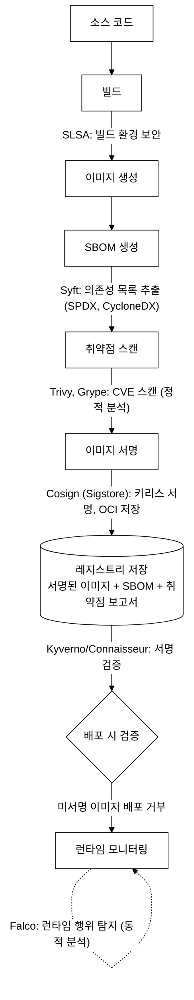
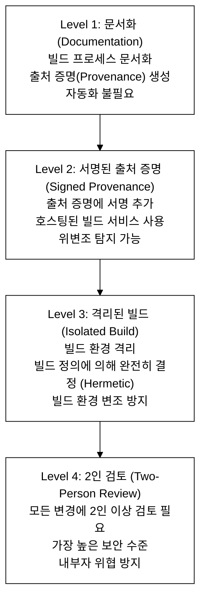
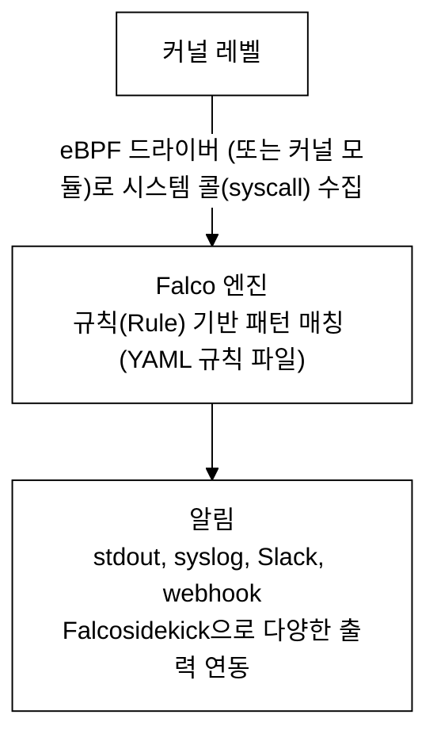
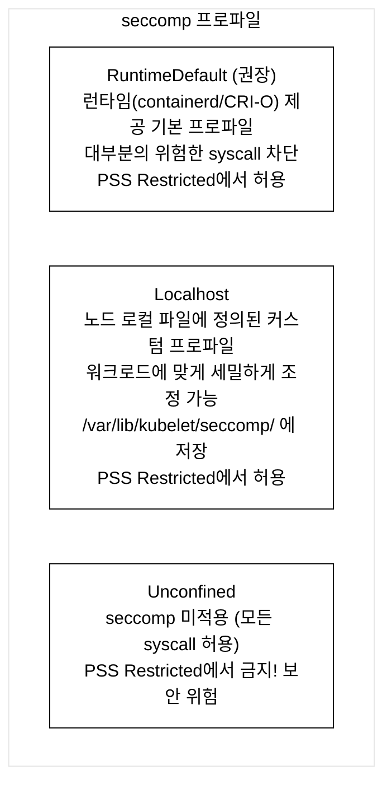
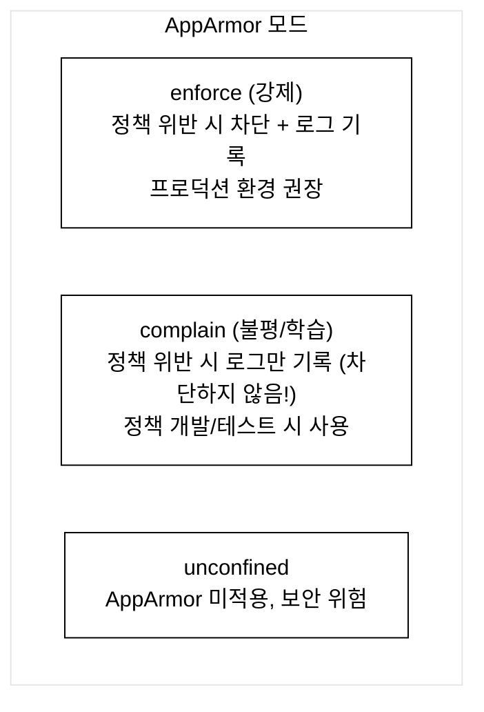
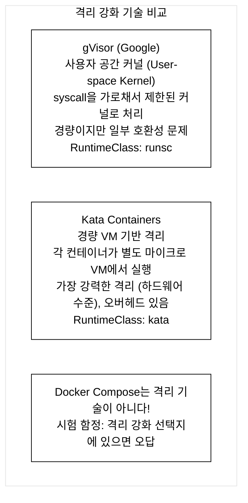

# KCSA Day 7: MITRE ATT&CK, 공급망 보안 심화, 런타임 보안

> **시험 비중:** Kubernetes Threat Model — 16%, Platform Security — 16%
> **목표:** MITRE ATT&CK for Containers의 9대 전술을 이해하고, 이미지 서명/검증 파이프라인과 런타임 보안 도구(Falco, seccomp, AppArmor, SELinux)를 마스터한다.
> **예상 소요 시간:** 60~90분

Day 6에서 다룬 Pod Security Admission(PSA)·RBAC·NetworkPolicy의 선언적 통제를 전제로, 이번 Day 7에서는 런타임에서 실제로 공격자가 어떻게 움직이는지(MITRE ATT&CK)와 그것을 커널 수준에서 막는 도구(Falco, seccomp, AppArmor, SELinux)로 범위를 확장한다.

## 오늘의 학습 목표 (체크리스트)

- [ ] MITRE ATT&CK for Containers 9대 전술을 순서대로 나열할 수 있다
- [ ] 공격 시나리오 키워드를 보고 해당 전술에 즉시 매핑할 수 있다
- [ ] 공급망 보안 파이프라인(Cosign·SLSA·SBOM·Trivy)의 각 도구 역할을 구분한다
- [ ] Falco의 eBPF 기반 동작 원리와 탐지 범위/한계를 설명할 수 있다
- [ ] seccomp·AppArmor·SELinux 각각의 등장 배경과 적용 레이어 차이를 안다
- [ ] seccomp 3개 프로파일·AppArmor 3개 모드·SELinux MCS 라벨을 설명할 수 있다
- [ ] gVisor와 Kata Containers의 격리 방식 차이와 트레이드오프를 비교한다

---

## 1. MITRE ATT&CK for Containers

### 1.0 등장 배경

```
직전 기술의 한계:
전통적인 Linux 서버는 호스트마다 SSH 데몬, systemd, 파일시스템 구성이
고정적이다. 방화벽 규칙과 안티바이러스(시그니처 기반)는 이 구조를 전제로
설계됐다.

컨테이너 환경은 세 가지 면에서 근본적으로 다르다:
1. 컨테이너는 수 초 만에 수천 개를 복제·삭제할 수 있다.
   시그니처 기반 탐지는 이 속도와 규모를 따라가지 못한다.
2. Kubernetes API 서버를 통해 원격에서 워크로드를 시작·중단·수정한다.
   전통 서버에는 없던 중앙 제어 지점이 생긴다는 것은
   공격자 입장에서 API 서버 하나를 장악하면 전체 클러스터를 통제할 수
   있다는 의미이기도 하다.
3. 실행 이미지는 이미지 레지스트리에서 런타임에 다운로드된다.
   이미지 공급망 자체가 공격 경로가 된다.

따라서 "어떤 파일이 바이러스인가"라는 시그니처 방식 대신,
"공격자가 클러스터에서 어떤 순서로 행동하는가"라는 동작 패턴
(시스템 콜 모니터링, API 접근 로그) 기반의 체계적 위협 모델이 필수가 됐다.

Kill Chain: 공격자가 최초 침투부터 최종 목표 달성까지 거치는 순차적
단계를 의미한다. MITRE ATT&CK은 이 Kill Chain을 컨테이너 환경에
특화해 9개의 전술(Tactic) 단계로 체계화한 것이다.

해결:
MITRE ATT&CK for Containers는 실제 공격 사례를 분석하여
9대 전술(Tactics)과 세부 기술(Techniques)로 분류한 지식 베이스다.
공격자의 관점에서 방어 전략을 수립할 수 있게 한다.
```

### 1.1 MITRE ATT&CK이란?

```
MITRE ATT&CK = 실제 공격 사례 기반의 전술/기술 프레임워크

MITRE Corporation: 미국 비영리 연구기관으로, 실제 사이버 공격 사례를
대규모로 수집·분석해 전술/기술 프레임워크를 만들고 공개한다.
"공격자가 어떤 단계를 거쳐 목표를 달성하는가"를 체계적으로 분류한다.

컨테이너 환경 고유의 공격 벡터: 기존 Windows/Linux 서버 공격과 달리
Kubernetes API 서버, 이미지 레지스트리, 네임스페이스 격리, SA(Service Account)
토큰, kubelet API 등 컨테이너 인프라 고유 자원을 악용하는 공격 경로를 말한다.

MITRE ATT&CK for Containers:
- Kubernetes/Docker 환경에 특화된 공격 전술/기술 매트릭스
- 컨테이너 환경 고유의 공격 벡터를 분류
- 방어 전략 수립의 기준 프레임워크
```

### 1.2 9대 전술(Tactics) 상세

```mermaid
%%{init:{'theme':'base','themeVariables':{'primaryColor':'#ffffff','primaryBorderColor':'#000000','primaryTextColor':'#000000','lineColor':'#000000','fontFamily':'Georgia, serif'}}}%%
flowchart TB
  T1["1. Initial Access (초기 접근)\n클러스터에 최초 진입\n취약한 공개 서비스/이미지, 노출된 kubeconfig, 공급망 공격\n방어: NetworkPolicy, 이미지 스캔, API Server 접근 제한"]
  T2["2. Execution (실행)\n악성 코드/명령 실행\nkubectl exec, 악성 이미지 실행, 크립토마이너 배포\n방어: PSA Restricted, RBAC, Falco 모니터링"]
  T3["3. Persistence (지속성)\n접근을 유지\n백도어 Pod, 악성 CronJob, Static Pod, 악성 Admission Webhook\n방어: RBAC 최소 권한, 이미지 서명 검증, 파일 무결성 모니터링"]
  T4["4. Privilege Escalation (권한 상승)\n더 높은 권한 획득\nprivileged true, hostPID/hostNetwork, RBAC escalate/bind, kubelet 자격 증명 탈취\n방어: PSA Restricted, RBAC 최소 권한, NodeRestriction"]
  T5["5. Defense Evasion (방어 회피)\n탐지를 피함\nPod 로그 삭제, exec 활용 실행, 정상 프로세스 위장\n방어: Audit Logging, Falco, 불변 컨테이너"]
  T6["6. Credential Access (자격 증명 접근)\n인증 정보 탈취\nSA 토큰 탈취, Secret 접근, 169.254.169.254 IMDS, etcd 직접 접근\n방어: automount 비활성화, RBAC, NP로 IMDS 차단"]
  T7["7. Discovery (탐색)\n환경 정보 수집\nkubectl get pods/secrets, API 디스커버리, 네트워크 스캐닝\n방어: RBAC 최소 권한, NetworkPolicy"]
  T8["8. Lateral Movement (횡적 이동)\n다른 컨테이너/노드로 이동\n탈취 SA 토큰으로 다른 NS 접근, 내부 서비스 악용, 컨테이너 탈출\n방어: NetworkPolicy, mTLS, 네임스페이스 격리"]
  T9["9. Impact (영향)\n최종 목표 달성\n데이터 유출/파괴, 크립토마이닝, 서비스 중단 (DoS)\n방어: 백업, ResourceQuota, 모니터링, 알림"]
  T1 --> T2 --> T3 --> T4 --> T5 --> T6 --> T7 --> T8 --> T9
```


_그림 1. MITRE ATT&CK for Containers 9대 전술 진행 순서._

### 1.3 MITRE ATT&CK 시험 빈출 매핑

시험에서는 9대 전술을 직접 이름으로 묻지 않는다. 구체적인 공격 시나리오를
제시하고 "이것은 어떤 전술에 해당하는가?"를 고르는 방식으로 출제된다.
1.2에서 전술 개념을 익혔다면, 이 섹션은 "시험장에서 즉시 매핑하는 훈련"이다.

```
키워드 → 전술 매핑 (시험 빈출):

"kubectl exec로 명령 실행"        → Execution
"백도어 Pod 배포"                 → Persistence
"privileged: true"               → Privilege Escalation
"169.254.169.254 접근"           → Credential Access ★
  (169.254.169.254는 클라우드 인스턴스 메타데이터 서비스(IMDS:
   Instance Metadata Service)의 링크-로컬 주소다. 컨테이너 내부에서
   이 주소에 접근하면 호스트 VM의 IAM 자격 증명을 탈취할 수 있다.)
"SA 토큰 탈취"                   → Credential Access
"다른 NS의 Pod 접근"             → Lateral Movement
"크립토마이너 배포"               → Impact
"Pod 로그 삭제"                  → Defense Evasion
"취약한 이미지 배포"              → Initial Access

시험 유형 예시:
Q. 공격자가 컨테이너 내부에서 /var/run/secrets/kubernetes.io/serviceaccount/token
   파일을 읽어 다른 네임스페이스의 Secret을 열람했다. 이 행위는 MITRE ATT&CK
   어느 전술에 해당하는가?
A. Credential Access (SA 토큰으로 자격 증명 탈취) → 이후 Lateral Movement로 이어짐

Q. 공격자가 Kubernetes CronJob을 악용해 클러스터가 재시작되어도 쉘을 유지한다.
   이것은 어느 전술인가?
A. Persistence (CronJob을 통한 지속적 백도어 유지)
```

### 직접 해보기 — MITRE ATT&CK 매핑 드릴

**목표:** 공격 시나리오 설명을 읽고 해당 전술을 즉시 답하는 속도를 높인다. 제한 시간 3분.

아래 시나리오를 보고 해당 MITRE ATT&CK 전술 이름을 손으로 적은 뒤, 1.2의 다이어그램과 대조한다.

1. 공격자가 `kubectl exec`으로 컨테이너에 bash 쉘을 열었다. → ?
2. 파드 내부에서 `/var/run/secrets/kubernetes.io/serviceaccount/token`을 읽어 다른 네임스페이스의 Secret에 접근했다. → ?
3. `securityContext.privileged: true`인 파드를 배포해 호스트 디바이스를 마운트했다. → ?
4. 악성 CronJob을 심어두어 클러스터가 재시작된 후에도 쉘이 유지된다. → ?
5. 메타데이터 서비스 169.254.169.254에 접근해 IAM 토큰을 획득했다. → ?

정답: 1=Execution · 2=Credential Access → Lateral Movement · 3=Privilege Escalation · 4=Persistence · 5=Credential Access

---

## 2. 공급망 보안 심화 (Supply Chain Security)

### 2.1 이미지 서명/검증 파이프라인

파이프라인에 등장하는 각 도구의 역할을 먼저 정리한다:

- Syft: 컨테이너 이미지에서 설치된 패키지 목록을 추출해 SBOM(Software Bill
  of Materials, 소프트웨어 부품 명세서)을 생성하는 도구다.
- Trivy: 가장 널리 쓰이는 오픈소스 CVE 스캐너다. 이미지 레이어를 분석해
  알려진 취약점을 찾는다(정적 분석).
- Grype: Anchore사가 만든 CVE 스캐너로 Trivy의 대안이다. 두 도구를 함께
  써도 되고 둘 중 하나만 써도 된다.
- Cosign: Sigstore 프로젝트의 서명 도구다. SBOM과 취약점 리포트를 이미지와
  함께 OCI 레지스트리에 저장하고 서명을 붙인다.
- Kyverno/Connaisseur: 배포 시점(Admission)에 이미지 서명 검증 정책을 적용한다.
  미서명 이미지는 클러스터에 들어오지 못하게 막는다.

학습 순서: Cosign → Trivy → SBOM(Syft) → Kyverno/Connaisseur


_그림 2. 공급망 보안 파이프라인 (빌드부터 런타임 모니터링까지)._

#### Kyverno 서명 검증 정책 예시

Kyverno는 Kubernetes Admission Webhook으로 동작하는 정책 엔진이다. 아래 ClusterPolicy는 `verifyImages` 필드를 사용해 Cosign으로 서명되지 않은 이미지를 배포 시 자동으로 거부한다.

```yaml
apiVersion: kyverno.io/v1
kind: ClusterPolicy
metadata:
  name: require-image-signature
spec:
  validationFailureAction: Enforce   # Audit(로그만)이 아닌 Enforce(거부)
  rules:
    - name: check-image-signature
      match:
        any:
          - resources:
              kinds: [Pod]
      verifyImages:
        - imageReferences:
            - "myregistry.io/myapp:*"  # 서명 검증 대상 이미지 패턴
          attestors:
            - entries:
                - keys:
                    publicKeys: |-
                      -----BEGIN PUBLIC KEY-----
                      <cosign.pub 내용>
                      -----END PUBLIC KEY-----
```

미서명 이미지 배포 시도 시 응답: `Error from server: admission webhook "kyverno-resource.kyverno.svc" denied the request: image signature not found`. 즉, Admission 단계에서 파드 오브젝트 자체가 생성되지 않는다.

`publicKeys` 값 채우는 방법: `cosign generate-key-pair` 실행 후 생성된 `cosign.pub` 파일의 전체 내용(`-----BEGIN PUBLIC KEY-----` 블록 포함)을 그대로 위 YAML의 `publicKeys: |-` 아래에 붙여넣는다. 키리스(Keyless) 방식을 사용하는 경우 `keys` 대신 `keyless` 필드를 쓰며 Fulcio·Rekor 엔드포인트를 지정한다(Kyverno 1.10+ 지원).

### 2.2 Cosign 상세

```
Cosign (Sigstore 프로젝트):

컨테이너 이미지 서명/검증 도구

서명 방식:
1. 키 기반 서명 (Key-based)
   - cosign generate-key-pair → cosign.key, cosign.pub
   - cosign sign --key cosign.key myimage:v1
   - cosign verify --key cosign.pub myimage:v1

2. 키리스 서명 (Keyless) ★ 권장
   키리스 서명(Keyless Signing): 사용자가 비대칭 암호 키 쌍을 직접
   생성·보관하지 않는 서명 방식이다. 팀원 간에 개인 키 파일을 공유하는
   복잡성이 없다는 뜻이며, 실제로는 아래 구조로 임시 인증서를 사용한다.

   - OIDC(OpenID Connect) 인증 기반: OAuth 위에 구축된 표준 인증
     프로토콜. GitHub, Google 등 기존 계정으로 신원을 증명한다.
   - Sigstore: Linux Foundation의 오픈소스 소프트웨어 서명 프로젝트.
     Fulcio, Rekor, Cosign 세 컴포넌트로 구성된다.
   - Fulcio: Sigstore의 인증 기관(CA). OIDC 인증이 완료되면
     수명이 짧은(수 분짜리) 임시 X.509 인증서를 발급한다. 이 인증서로
     서명을 만들고 나면 폐기되므로 장기 보관할 개인 키가 없다.
   - Rekor: Sigstore의 투명성 로그(Transparency Log). 모든 서명 기록을
     블록체인처럼 공개·불변 로그에 남겨 위변조를 탐지한다.

서명 저장 위치:
- OCI(Open Container Initiative): 컨테이너 이미지 형식과 레지스트리 API 표준을 정의하는 단체다. Docker Hub·ECR·GCR 등 대부분의 레지스트리는 OCI 표준을 따른다. 이미지 다이제스트는 이미지 내용 전체의 SHA-256 해시값으로, 태그(`nginx:1.27`)와 달리 이미지 내용이 바뀌면 값이 달라지므로 무결성 검증에 쓰인다.
- OCI 레지스트리에 별도 태그로 저장: 서명 태그 형식은 `sha256-<이미지다이제스트>.sig`다.
  예: 이미지 다이제스트가 `sha256:abc123...`이면 서명 태그는 `sha256-abc123....sig`로 저장된다.
  서명 위치 확인 명령: `cosign triangulate myimage:v1` (서명이 저장된 OCI 참조를 출력한다)
- 이미지와 함께 배포/관리
```

### 2.3 SLSA (Supply-chain Levels for Software Artifacts)

Provenance(출처 증명): 소프트웨어가 어디서, 누가, 어떤 환경에서 빌드됐는지
기록한 문서다. 빌드에 사용된 소스 커밋 해시, 빌드 도구 버전, 빌드 서버
정보, 의존성 목록(SBOM) 등을 포함한다. Provenance가 있으면 "이 이미지가
정말 우리 CI/CD에서 만들어졌는가"를 검증할 수 있다.

Hermetic Build(헤르메틱 빌드): 외부 네트워크나 환경 변수에 의존하지 않고,
빌드 정의(소스 코드 + 의존성 명세)만으로 100% 동일한 결과를 내는 빌드다.
같은 입력에 항상 같은 출력이 나오므로 재현성(reproducibility)이 보장된다.
공급망 공격자가 빌드 중에 외부에서 악성 패키지를 주입하는 것을 원천 차단한다.


_그림 3. SLSA 4단계 레벨 (보안 수준 상승 순서)._

★ 시험 빈출: "SLSA Level 2에서 요구하는 것은?" → 서명된 출처 증명
★ 암기법: L1(문서) → L2(서명) → L3(격리) → L4(검토)

Cosign과 SLSA의 관계: Cosign은 SLSA Level 2 이상에서 요구하는
"서명된 출처 증명"을 구현하는 구체적 도구다. SLSA는 "무엇을 해야 하는가"를
정의하는 프레임워크이고, Cosign은 "어떻게 서명하는가"를 해결하는 구현체다.

### 2.4 이미지 스캐닝 도구 비교

정적 분석(Static Analysis): 프로그램을 실행하지 않고 이미지 파일·소스
코드를 검사하는 분석 기법이다. 빌드·배포 전에 문제를 조기 발견할 수 있다.

동적 분석(Dynamic Analysis): 프로그램을 실제로 실행하면서 런타임 행동을
감시하는 기법이다. 정적 분석으로 잡을 수 없는 0-day 공격이나 실행 시점
이상 동작을 포착한다.

CVE(Common Vulnerabilities and Exposures): 공개된 보안 취약점에 고유 번호를
부여한 국제 데이터베이스다. 예: CVE-2021-44228(Log4Shell).

SPDX(Software Package Data Exchange): Linux Foundation이 관리하는 SBOM
표준 형식이다.

CycloneDX: OWASP(Open Web Application Security Project)가 관리하는 경량
SBOM 표준 형식이다. SPDX와 함께 가장 널리 쓰이는 두 가지 표준이다.

```
정적 분석(Static) vs 동적 분석(Dynamic):

┌──────────────────┬─────────────────┬─────────────────┐
│                  │ 정적 분석        │ 동적 분석        │
├──────────────────┼─────────────────┼─────────────────┤
│ 시점             │ 빌드/배포 전     │ 런타임 중        │
│ 대상             │ 이미지 파일      │ 실행 중 컨테이너  │
│ 도구             │ Trivy, Grype    │ Falco            │
│ 탐지 대상        │ CVE, 설정 오류   │ 비정상 행위       │
│ CNCF 상태        │ -               │ Graduated (Falco)│
│ 한계             │ 0-day 탐지 불가  │ 성능 영향 가능    │
└──────────────────┴─────────────────┴─────────────────┘

★ 시험 빈출: "Trivy와 Falco의 차이는?"
→ Trivy = 정적 분석 (이미지 스캔), Falco = 동적 분석 (런타임 행위)
```

### 직접 해보기 — 공급망 도구 역할 분류

**목표:** 파이프라인 도구들의 역할을 시험에서 즉시 구분한다. 제한 시간 2분.

아래 빈칸을 채운다.

| 도구 | 단계 | 역할 (한 줄) |
|:--|:--|:--|
| Syft | 빌드 후 | ① |
| Trivy | 빌드 후 | ② |
| Cosign | 서명 | ③ |
| Kyverno | 배포 시 | ④ |
| Falco | 런타임 | ⑤ |

정답:
① SBOM 생성 (패키지 목록 추출, SPDX/CycloneDX 포맷)
② 정적 CVE 스캔 (이미지 레이어 분석, 알려진 취약점 탐지)
③ OCI 이미지 서명 및 서명 검증 (키리스 서명: Fulcio+Rekor)
④ Admission 시 서명 검증 정책 적용 (미서명 이미지 배포 거부)
⑤ 동적 분석 - 런타임 syscall 이상 행위 탐지 (eBPF)

---

## 3. 런타임 보안 (Runtime Security)

### 3.1 Falco 심화

> **실습 환경 확인:** KCSA는 이론 시험이므로 Falco 실행 자체보다 동작 원리와 탐지 범위를 이해하는 것이 목표다. 아래 명령으로 dev 클러스터에 Falco가 설치돼 있는지 먼저 확인한다. 없는 경우 이 절은 개념 이해 목적으로만 진행하면 된다.
>
> ```bash
> export KUBECONFIG=~/sideproejct/IaC_apple_sillicon/kubeconfig/dev.yaml
> # Falco 파드 존재 여부 확인 (namespace는 설치 방법에 따라 다를 수 있다)
> kubectl get pods -n falco 2>/dev/null || kubectl get pods -n kube-system -l app=falco 2>/dev/null || echo "Falco 미설치 — 개념 이해 목적으로 진행"
> # Helm으로 설치된 경우
> helm list -n falco 2>/dev/null || echo "(helm 미설치 또는 falco 릴리즈 없음)"
> ```
>
> 미설치 상태라면 Helm으로 설치할 수 있다(dev 클러스터 권장, 이론 과목 특성상 필수는 아니다):
> ```bash
> helm repo add falcosecurity https://falcosecurity.github.io/charts && helm repo update
> helm install falco falcosecurity/falco --namespace falco --create-namespace \
>   --set driver.kind=ebpf
> ```

Falco: CNCF Graduated 프로젝트

syscall(시스템 콜): 애플리케이션이 커널에 특정 작업을 요청하는 인터페이스다.
파일 읽기(read), 프로세스 생성(execve), 네트워크 연결(connect) 등 하드웨어나
OS 자원에 접근하려면 반드시 syscall을 거쳐야 한다. 따라서 모든 컨테이너의
행동은 결국 syscall로 표현된다.

eBPF(Extended Berkeley Packet Filter): 리눅스 커널 내부에서 안전하게 실행되는
소형 프로그램을 사용자 공간에서 커널을 재컴파일 없이 주입할 수 있는 기술이다.
원래 패킷 필터링용이었으나 현재는 syscall 후킹, 네트워크 관찰, 성능 분석 등
광범위하게 활용된다. Falco는 eBPF 드라이버를 커널에 삽입해 모든 컨테이너의
syscall 이벤트를 실시간 수집하고, 미리 정의된 규칙과 대조해 비정상 행위를 탐지한다.

Falco의 동작 원리:


_그림 4. Falco의 동작 원리 (커널 syscall 수집부터 알림까지)._

```
Falco가 탐지하는 것:
✓ 컨테이너 내 쉘 실행 (bash, sh)
✓ 민감 파일 접근 (/etc/shadow, /etc/passwd)
✓ 예상치 못한 네트워크 연결
✓ 권한 상승 시도
✓ 크립토마이너 프로세스
✓ 컨테이너 탈출 시도

Falco가 탐지할 수 없는 것:
✗ SQL Injection 자체 → Falco는 syscall(시스템 계층) 행동만 본다.
  SQL Injection은 애플리케이션 코드 로직의 문제이므로 탐지 불가.
  단, Injection 공격 후 발생하는 이상 파일 쓰기나 프로세스 실행은 탐지 가능.
  SQL Injection 취약점 자체는 코드 레벨 분석(SAST/DAST) 도구가 필요하다.
  (예: Falco는 "/etc/shadow 파일 접근"은 탐지하지만 "악성 SQL 쿼리 문법"은 못 본다.)
✗ 이미지의 알려진 CVE → Trivy 필요 (정적 분석 영역)
✗ 네트워크 트래픽 내용 분석 → IDS/WAF 필요

Falco 데이터 소스:
1. 시스템 콜 (eBPF) ← 핵심
2. K8s Audit Log — API Server가 수신한 모든 요청(kubectl 명령, SA 토큰 사용 등)을 파일 또는 webhook으로 기록하는 로그다. Falco와의 연동 방법: kube-apiserver에 `--audit-log-path`를 설정해 로그 파일을 생성하고, Falco의 `k8s_audit` 플러그인이 해당 파일을 읽거나 `--audit-webhook-config`로 Falco HTTP 엔드포인트에 직접 전송한다. 이를 통해 "kubectl exec 실행", "Secret 열람" 같은 API 수준 행위도 Falco 규칙으로 탐지할 수 있다.
3. AWS CloudTrail
```

### 3.2 Falco 규칙 예제

Falco 규칙의 `condition` 필드에 사용되는 메타데이터 필드는 eBPF가 수집한
syscall 이벤트에서 온다. 주요 매핑은 다음과 같다:

```
eBPF가 잡는 syscall 이벤트  →  Falco 필드
─────────────────────────────────────────
execve() (프로세스 실행)    →  proc.name (프로세스 이름), proc.pname (부모 이름)
                            →  spawned_process (프로세스 생성 여부 true/false)
open()/openat() (파일 열기)  →  fd.name (파일 경로), open_read/open_write
connect() (네트워크 연결)   →  fd.rip (원격 IP), fd.rport (원격 포트)
컨테이너 컨텍스트           →  container.name, container.image.repository
K8s 메타데이터 (API 연동)   →  k8s.pod.name, k8s.ns.name
```

이 구조를 이해하면 아래 규칙 예제에서 각 필드가 어디서 오는지 파악된다.

```yaml
# Falco 규칙 구조
- rule: Terminal Shell in Container
  desc: 컨테이너 내에서 터미널 쉘이 실행됨
  condition: >
    spawned_process and
    container and
    proc.name in (bash, sh, zsh) and
    not proc.pname in (cron, supervisord)
  output: >
    Shell spawned in container
    (user=%user.name container=%container.name
     image=%container.image.repository
     shell=%proc.name parent=%proc.pname)
  priority: WARNING
  tags: [container, shell, mitre_execution]

- rule: Read Sensitive Files
  desc: 민감한 파일이 읽혔음
  condition: >
    open_read and
    container and
    fd.name in (/etc/shadow, /etc/passwd, /etc/kubernetes/admin.conf)
  output: >
    Sensitive file read (file=%fd.name container=%container.name)
  priority: CRITICAL
  tags: [container, filesystem, mitre_credential_access]
```

### 3.3 seccomp (Secure Computing Mode)

#### 등장 배경

DAC(Discretionary Access Control, 임의적 접근 제어): 파일 소유자가 권한을 임의로 설정하는 전통적 Unix 권한 모델이다(chmod/chown). 컨테이너에 DAC와 네임스페이스만 있으면 파일시스템·프로세스 격리는 되지만, 컨테이너 내부 프로세스가 호스트 커널에 어떤 syscall을 호출하느냐는 전혀 제한되지 않는다.

리눅스 커널은 수백 개의 syscall을 제공한다. 이 중 `ptrace`, `unshare`, `keyctl`, `perf_event_open` 같은 syscall은 네임스페이스 탈출이나 권한 상승에 직접 악용된다. 실제 컨테이너 탈출 CVE(예: CVE-2019-5736 runc 취약점)는 대부분 특정 syscall 경로를 이용한다.

기존 해결 시도와 한계:
- AppArmor/SELinux는 파일·프로세스 레이블 기반으로 접근을 통제하지만, "어떤 syscall 번호를 호출했는가"를 직접 필터링하지는 않는다.
- 따라서 공격 공격면 중 **커널 syscall 인터페이스 전체가 여전히 열려 있는** 문제가 남는다.

seccomp(Secure Computing Mode)는 2005년 리눅스 2.6.12에 도입됐다. 프로세스가 사용할 수 있는 syscall을 커널 레벨에서 화이트리스트/블랙리스트로 제한하여, 컨테이너가 익스플로잇에 필요한 위험 syscall 자체를 호출하지 못하게 막는다. DAC·네임스페이스·AppArmor 레이어를 우회하는 커널 공격면을 줄이는 **최후 방어선** 역할을 한다.

트레이드오프: 너무 좁은 프로파일은 정상 애플리케이션에 필요한 syscall도 차단해 Pod 크래시를 유발한다. 프로파일 설계 시 strace나 Falco로 실제 사용 syscall을 먼저 파악해야 한다.

seccomp는 컨테이너가 사용할 수 있는 시스템 콜(syscall)을 제한한다.

3가지 프로파일:


_그림 5. seccomp 3가지 프로파일._

#### seccomp 프로파일 위치와 커스텀 작성

RuntimeDefault 프로파일: containerd·CRI-O 런타임이 내장으로 제공한다.
별도 파일이 필요 없다.

Localhost 커스텀 프로파일: 노드의 `/var/lib/kubelet/seccomp/profiles/` 디렉터리에
JSON 파일을 두고, Pod YAML에서 `localhostProfile: profiles/my-profile.json`으로
지정한다. 기본적으로 허용할 syscall을 나열하는 whitelist 방식을 쓴다(보안 강함).
아래는 최소한의 whitelist 예시 구조다:

```json
{
  "defaultAction": "SCMP_ACT_ERRNO",
  "syscalls": [
    {
      "names": ["read", "write", "open", "close", "stat", "fstat",
                "mmap", "mprotect", "munmap", "brk", "rt_sigaction",
                "exit_group"],
      "action": "SCMP_ACT_ALLOW"
    }
  ]
}
```

`defaultAction: SCMP_ACT_ERRNO`는 목록에 없는 모든 syscall을 차단한다.
`SCMP_ACT_ALLOW`로 나열된 syscall만 허용된다. 실제 애플리케이션은 필요한
syscall이 더 많으므로 이 목록은 예시일 뿐이며, strace나 Falco로 실제 사용
syscall을 먼저 파악하고 프로파일을 작성한다.

#### seccomp 설정 YAML

```yaml
apiVersion: v1
kind: Pod
metadata:
  name: seccomp-pod
spec:
  securityContext:
    seccompProfile:
      type: RuntimeDefault          # ★ 권장

  # 또는 Localhost 프로파일:
  # securityContext:
  #   seccompProfile:
  #     type: Localhost
  #     localhostProfile: profiles/my-profile.json

  containers:
    - name: app
      image: nginx:1.27
```

### 직접 해보기 — seccomp 프로파일 확인

**목표:** dev 클러스터에서 파드의 seccomp 프로파일 설정 상태를 조회한다. 제한 시간 3분.

```bash
export KUBECONFIG=~/sideproejct/IaC_apple_sillicon/kubeconfig/dev.yaml

# kube-system 파드들의 seccomp 프로파일 확인
kubectl get pods -n kube-system -o jsonpath='{range .items[*]}{.metadata.name}{"\t"}{.spec.securityContext.seccompProfile.type}{"\n"}{end}' | head -10

# 특정 파드 seccomp 상세 확인
kubectl get pod -n kube-system kube-apiserver-dev-master -o jsonpath='{.spec.securityContext}' 2>/dev/null | python3 -m json.tool
```

기대 해석: `RuntimeDefault`가 보이면 seccomp가 적용된 것이다. 빈 값이면 `Unconfined` 상태로, PSS Restricted 정책에서는 거부된다.

### 3.4 AppArmor

#### 등장 배경

MAC(Mandatory Access Control, 강제 접근 제어): 시스템 관리자가 중앙에서 정책을 정의하고, 개별 파일 소유자가 임의로 바꿀 수 없는 접근 제어 모델이다. DAC가 "소유자가 권한을 스스로 부여"한다면, MAC은 "정책이 항상 소유자 의사보다 우선한다."

DAC만으로는 다음 시나리오를 막기 어렵다:
1. 악성 프로세스가 root로 실행되면 임의의 파일을 읽고 쓸 수 있다.
2. SUID 바이너리(setuid 비트 설정 파일)를 통한 권한 상승은 DAC 범위 내에서 정상으로 보인다.
3. 컨테이너가 `runAsRoot` 없이 실행되더라도 그 프로세스가 접근할 수 없어야 하는 호스트 경로에 대한 세밀한 통제가 없다.

AppArmor(Application Armor)는 2.6.36 커널에 메인라인으로 합류된 리눅스 LSM(Linux Security Module)이다. 프로그램 단위(경로 기반)로 어떤 파일·디렉터리·포트에 접근할 수 있는지를 정책으로 선언한다. Ubuntu·Debian 계열에서 기본 활성화돼 있다.

SELinux와의 차이: SELinux(Security-Enhanced Linux)는 RHEL/CentOS 계열 기본 LSM으로, 경로 대신 **보안 라벨(컨텍스트)**을 기반으로 동작한다. AppArmor는 경로 기반이라 정책이 직관적이고 작성하기 쉽지만 파일을 이동하면 라벨이 아닌 새 경로 규칙이 적용된다. SELinux는 파일 이동에도 라벨이 따라가므로 더 세밀하지만 정책 복잡도가 높다. 두 LSM은 동시에 활성화할 수 없고(상호 배타적), seccomp는 두 LSM과 **다른 레이어**(syscall 번호 필터)이므로 병행 사용이 가능하다.

AppArmor: Linux 커널 보안 모듈 (MAC - Mandatory Access Control)

3가지 모드:


_그림 6. AppArmor 3가지 모드. (시험 빈출: complain 모드는 차단 없이 로그만 기록한다.)_

> **예시(참조) — AppArmor vs SELinux::** KCSA 보안 개념/점검 기대 출력(설정/도구/환경 의존). 재현 가능 핵심은 KCSA daily 및 본 캡처 참고.

위 참조는 실제 노드에서의 상태 확인을 가리킨다. 노드에서 AppArmor 상태를 직접 확인하려면 `ssh dev-master` 후 `sudo aa-status`를 실행한다. 출력 중 `apparmor module is loaded`와 로드된 프로파일 수가 나오면 정상 활성 상태이며, SELinux는 Ubuntu 기반 tart 노드에서 기본 비활성(`sestatus`를 실행하면 not found 또는 disabled)이다.

#### AppArmor 설정 YAML (K8s 1.30+)

버전별 호환성: Kubernetes 1.30 이전에는 Pod annotation으로 AppArmor 프로파일을
지정했다. 1.30부터 securityContext 필드로 공식 지원(Stable)됐다. 기존 annotation
방식도 계속 동작하지만 새로 작성할 때는 securityContext를 사용한다.

```yaml
# K8s 1.30 이전 방식 (annotation 기반, deprecated but still works)
# metadata:
#   annotations:
#     container.apparmor.security.beta.kubernetes.io/app: localhost/my-profile

# K8s 1.30+ AppArmor 설정 (securityContext 방식, 권장)
apiVersion: v1
kind: Pod
metadata:
  name: apparmor-pod
spec:
  containers:
    - name: app
      image: nginx:1.27
      securityContext:
        appArmorProfile:
          type: RuntimeDefault      # 런타임 기본 프로파일
          # type: Localhost
          # localhostProfile: my-custom-profile
```

### 직접 해보기 — AppArmor vs SELinux 환경 판별

**목표:** 노드에서 AppArmor와 SELinux 중 어느 것이 활성화됐는지 판별하는 명령을 익힌다. 제한 시간 2분.

```bash
# dev-master 노드에 SSH 접속 (VM 이름 별칭, ~/.ssh/config의 ProxyCommand가 tart ip로 IP를 실시간 조회함)
ssh dev-master

# AppArmor 상태 확인 (Ubuntu 계열 노드)
sudo aa-status 2>/dev/null || echo "AppArmor 미설치"

# SELinux 상태 확인 (RHEL 계열 노드)
sestatus 2>/dev/null || echo "SELinux 미설치"

# 커널 파라미터로 확인
cat /sys/module/apparmor/parameters/enabled 2>/dev/null
```

기대 해석: `aa-status`에서 `apparmor module is loaded`가 나오면 AppArmor 활성 상태다. Ubuntu 기반 tart 노드는 AppArmor가 기본이며 SELinux는 비활성이다.

### 3.5 SELinux

#### 등장 배경

SELinux는 NSA(미국 국가안보국)가 2000년대 초 개발해 리눅스 커널에 기여한 MAC 구현체다. AppArmor가 경로 기반으로 정책을 기술하는 데 반해, SELinux는 모든 객체(파일·프로세스·포트·소켓)에 `user:role:type:level` 형식의 보안 컨텍스트(라벨)를 부여하고, 라벨 간의 허용 관계를 정책으로 정의한다.

컨테이너 환경에서 SELinux가 해결하는 문제: 여러 컨테이너가 같은 호스트 파일시스템을 `hostPath`로 공유하거나, 같은 노드에서 서로 다른 테넌트의 파드가 실행될 때, 단순 네임스페이스나 DAC만으로는 파드 간 파일시스템 격리가 불완전하다. SELinux의 MCS(Multi-Category Security) 라벨은 각 파드에 고유한 범주 조합을 부여해 **같은 type 레이블이어도 범주가 다르면 서로의 파일에 접근하지 못하게** 한다. RHEL/CentOS 기반 노드에서 CRI-O·containerd는 파드 생성 시 자동으로 고유 MCS 라벨을 할당한다.

트레이드오프: SELinux 정책은 학습 곡선이 가파르다. 잘못 설정하면 정상 프로세스가 파일을 못 읽어 애플리케이션이 오작동한다. `Permissive` 모드(SELinux 용어로 complain에 해당)로 먼저 로그를 수집한 뒤 `audit2allow`로 정책을 도출하는 것이 표준 접근 방식이다.

```
SELinux: Security-Enhanced Linux

라벨 기반 접근 제어 (Label-based MAC):
- 모든 파일, 프로세스, 포트에 보안 라벨(컨텍스트) 부여
- 라벨 규칙에 의해 접근 허용/차단

SELinux 컨텍스트 형식:
user:role:type:level
예: system_u:system_r:container_t:s0

K8s Pod에서 SELinux 설정:
```

MCS 라벨(Multi-Category Security): SELinux 컨텍스트의 level 부분으로,
형식은 `s0:c123,c456`이다. s0은 민감도(sensitivity level)를, c123·c456은
범주(category)를 나타낸다. 같은 type을 가진 여러 프로세스라도 범주가 다르면
서로의 파일에 접근할 수 없다. Kubernetes에서는 Pod마다 고유한 c 범주 조합을
할당해 Pod 간 파일시스템 격리를 강화하는 데 쓴다.

구체적 격리 시나리오: 파드 A는 `s0:c1,c2`, 파드 B는 `s0:c3,c4`를 부여받는다.
두 파드가 모두 `container_t` type이어도 범주 조합이 다르므로 파드 A의 프로세스가
파드 B의 볼륨 데이터(`c3,c4` 라벨 파일)에 접근하려 하면 SELinux 정책이 거부한다.
같은 노드에서 실행되더라도 파드 간 파일시스템 경계가 라벨 수준에서 강제된다.

```yaml
apiVersion: v1
kind: Pod
metadata:
  name: selinux-pod
spec:
  securityContext:
    seLinuxOptions:
      level: "s0:c123,c456"    # MCS 라벨 (Multi-Category Security)
  containers:
    - name: app
      image: nginx:1.27
```

### 3.6 위험한 SecurityContext 설정

```
컨테이너 보안 위험 설정:

┌─────────────────────────┬─────────────────────────────────────┐
│ 위험 설정               │ 위험 이유                            │
├─────────────────────────┼─────────────────────────────────────┤
│ privileged: true        │ 호스트의 모든 디바이스 접근 가능       │
│                         │ 컨테이너 탈출 용이!                   │
├─────────────────────────┼─────────────────────────────────────┤
│ hostNetwork: true       │ 호스트 네트워크 네임스페이스 공유      │
│                         │ 네트워크 격리 무효화                   │
├─────────────────────────┼─────────────────────────────────────┤
│ hostPID: true           │ 호스트 프로세스 목록 접근 가능         │
│                         │ 프로세스 신호 전송 가능                │
├─────────────────────────┼─────────────────────────────────────┤
│ hostIPC: true           │ 호스트 IPC 네임스페이스 공유           │
│                         │ 다른 프로세스와 메모리 공유            │
├─────────────────────────┼─────────────────────────────────────┤
│ hostPath 볼륨           │ 호스트 파일시스템 직접 접근            │
│ (특히 /, /etc, /var)    │ /etc/shadow, docker.sock 접근 가능   │
├─────────────────────────┼─────────────────────────────────────┤
│ capabilities.add:       │ 거의 privileged와 동일한 권한         │
│   - SYS_ADMIN           │ 네임스페이스 조작, 마운트 등          │
└─────────────────────────┴─────────────────────────────────────┘

★ 시험 빈출:
"privileged: true의 위험은?" → 호스트 디바이스 접근, 컨테이너 탈출
"hostPath 볼륨의 위험은?" → 호스트 파일시스템 접근, 컨테이너 탈출
```

### 3.7 컨테이너 격리 강화 기술

기본 컨테이너(runc)의 보안 한계:
runc는 리눅스 네임스페이스(PID, 네트워크, 마운트 등)와 cgroup(자원 제한)만으로
프로세스를 격리한다. 그런데 모든 컨테이너는 호스트 커널을 공유한다. 이는
두 가지 근본 위험을 낳는다:

1. 커널 취약점(kernel exploit): 커널에 새로운 CVE가 발견되면 격리된 네임스페이스를
   우회해 호스트로 탈출하는 컨테이너 탈출(container escape) 공격이 가능하다.
2. 공유 커널의 폭발 반경: 악성 컨테이너 하나가 커널 익스플로잇에 성공하면
   같은 노드의 모든 컨테이너가 위험해진다.

이 문제를 해결하기 위해 호스트 커널에 대한 직접 의존성을 줄이거나 제거하는
격리 강화 기술이 등장했다.


_그림 7. 컨테이너 격리 강화 기술 비교 (gVisor, Kata Containers)._

격리 강화 기술 트레이드오프:
- gVisor: 사용자 공간에서 syscall을 재구현하므로 호스트 커널을 거치지 않는다.
  하지만 모든 syscall을 사용자 공간에서 처리하므로 성능 오버헤드가 발생한다.
  또한 모든 Linux syscall을 완전히 구현하지 않아 일부 애플리케이션과 호환성
  문제가 생길 수 있다.
- Kata Containers: 각 컨테이너를 경량 VM에서 실행하므로 VM 단위로 별도 커널을
  탑재한다. 가장 강한 격리(하드웨어 수준)를 제공하지만 VM 부팅 오버헤드와
  메모리 사용량이 runc 대비 크다.
- 선택 기준: 멀티테넌트 환경(여러 고객 워크로드가 같은 노드에 공존)이나
  신뢰할 수 없는 코드를 실행하는 경우 Kata Containers가 권장된다.
  gVisor는 Google Cloud Run 등에서 사용하며 단일 테넌트 환경에서도 추가
  격리가 필요할 때 쓴다.

RuntimeClass 오브젝트와 Pod 적용 예시:

RuntimeClass(런타임 클래스): 클러스터 관리자가 사용 가능한 컨테이너 런타임 핸들러를 등록하는 클러스터 범위 오브젝트다. 파드가 `runtimeClassName` 필드로 원하는 런타임을 선택한다.

```yaml
# gVisor RuntimeClass 등록 (클러스터 관리자가 사전 설치)
apiVersion: node.k8s.io/v1
kind: RuntimeClass
metadata:
  name: gvisor
handler: runsc          # 노드에 설치된 runsc 바이너리 이름
---
# Kata Containers RuntimeClass 등록
apiVersion: node.k8s.io/v1
kind: RuntimeClass
metadata:
  name: kata
handler: kata           # 노드에 설치된 kata 런타임 이름
```

```yaml
# gVisor로 실행하는 Pod 예시
apiVersion: v1
kind: Pod
metadata:
  name: gvisor-pod
spec:
  runtimeClassName: gvisor   # 위에서 등록한 RuntimeClass 이름
  containers:
    - name: app
      image: nginx:1.27
```

등록 후 검증: `kubectl apply -f runtimeclass-gvisor.yaml` → `kubectl get runtimeclass`로 등록 확인.
파드 배포 후 `kubectl describe pod gvisor-pod`의 `Runtime Class` 필드에 `gvisor`가 보이면 정상이다.
노드에 해당 런타임(runsc/kata)이 설치되지 않으면 파드가 `FailedCreatePodSandBox` 에러로 실패한다.

---

## 4. 핵심 암기 항목

### 4.1 필수 — 자격증 문제 80% 이상 출제 범위

```
MITRE ATT&CK 9전술 (순서 암기):
Initial Access → Execution → Persistence → Privilege Escalation
→ Defense Evasion → Credential Access → Discovery
→ Lateral Movement → Impact

전술 매핑 (시험 출제 단골):
- kubectl exec → Execution
- 백도어 Pod, 악성 CronJob → Persistence
- privileged: true → Privilege Escalation
- 169.254.169.254(IMDS) 접근 → Credential Access ★
- SA 토큰 탈취 → Credential Access
- 크립토마이너 → Impact

SLSA 4단계 (순서 암기):
L1(문서) → L2(서명된 출처 증명) → L3(격리/Hermetic 빌드) → L4(2인 검토)
★ 시험: "SLSA Level 2에서 요구하는 것?" → 서명된 출처 증명(Signed Provenance)

도구 역할 구분:
- Cosign: 이미지 서명/검증 (Sigstore, 키리스 서명 지원)
- Trivy: 정적 분석 (이미지 CVE 스캔)
- Falco: 동적 분석 (런타임 syscall 행위 탐지, CNCF Graduated, eBPF)
```

### 4.2 중요 — 런타임 보안 설정

```
seccomp 프로파일:
- RuntimeDefault: 런타임 제공 기본 프로파일(권장, PSS Restricted 허용)
- Localhost: 노드 /var/lib/kubelet/seccomp/ 에 저장한 커스텀 프로파일
- Unconfined: seccomp 미적용(보안 위험, PSS Restricted에서 금지)

AppArmor 모드:
- enforce: 차단 + 로그
- complain: 로그만(차단 없음!) ← 시험 빈출 함정
- unconfined: 미적용

AppArmor ↔ SELinux: 상호 배타적! ★★★
- AppArmor = 경로 기반 MAC, Ubuntu/Debian 기본
- SELinux = 라벨 기반 MAC, RHEL/CentOS 기본
- seccomp는 둘과 병행 사용 가능(직교하는 다른 계층)

위험 SecurityContext 설정 5가지:
privileged, hostNetwork, hostPID, hostPath(/, /etc, /var), SYS_ADMIN capability
```

### 4.3 추가 — 심화 개념

```
SBOM 형식: SPDX(Linux Foundation 표준), CycloneDX(OWASP 경량 표준)

격리 강화 기술 비교:
- runc(기본): 네임스페이스+cgroup만, 호스트 커널 공유 → 커널 익스플로잇 위험
- gVisor: 사용자 공간 syscall 재구현, 호스트 커널 직접 접근 없음,
          성능 오버헤드·일부 호환성 문제 / RuntimeClass: runsc
- Kata Containers: 경량 VM 기반, 가장 강한 격리, 메모리·부팅 오버헤드 큼
                  RuntimeClass: kata
- Docker Compose는 격리 강화 기술이 아니다! (시험 함정)

Falco 탐지 가능/불가:
- 가능: 쉘 실행, 민감 파일 접근, 네트워크 연결, 권한 상승 시도
- 불가: SQL Injection 코드 자체(syscall 계층이 아닌 앱 로직), 이미지 CVE
```

---

## 5. 복습 체크리스트

- [ ] MITRE ATT&CK 9대 전술을 순서대로 나열할 수 있다
- [ ] 키워드-전술 매핑 (exec→Execution, 169.254→Credential Access 등)을 안다
- [ ] SLSA 4단계 레벨을 순서대로 기억한다
- [ ] Cosign의 키리스 서명 방식을 설명할 수 있다
- [ ] 정적 분석(Trivy)과 동적 분석(Falco)을 구분할 수 있다
- [ ] Falco의 동작 원리(eBPF)와 탐지 범위를 알고 있다
- [ ] seccomp 3가지 프로파일을 나열할 수 있다
- [ ] AppArmor 3가지 모드와 complain의 동작을 안다
- [ ] AppArmor와 SELinux가 상호 배타적임을 알고 있다
- [ ] 위험한 SecurityContext 설정을 나열할 수 있다
- [ ] gVisor/Kata Containers의 격리 방식 차이를 안다

---

## 내일 예고: Day 8 - 네트워크 보안, 노드 하드닝, 보안 시나리오, 연습 문제

- 네트워크 보안 (mTLS, CNI, Service Mesh)
- 노드 하드닝 (최소 OS, 커널 보안)
- 보안 시나리오 분석
- 연습 문제 18문제 + 상세 해설
- tart-infra 실습

---

## tart-infra 실습

### 실습 환경 설정

```bash
export KUBECONFIG=~/sideproejct/IaC_apple_sillicon/kubeconfig/dev.yaml
kubectl get nodes
```

### 실습 1: 컨테이너 보안 컨텍스트 확인

```bash
echo "=== Pod SecurityContext 확인 ==="
kubectl get pods -n demo -o jsonpath='{range .items[*]}{.metadata.name}{"\n"}{.spec.securityContext}{"\n\n"}{end}' 2>/dev/null || echo "Pod 없음"
```

**검증 — 기대 출력:**
> **예시(참조) — dev 실측 (ns=cap-kcsa-day07, 캡처 후 삭제):** KCSA 보안 개념/점검 기대 출력(설정/도구/환경 의존). 재현 가능 핵심은 KCSA daily 및 본 캡처 참고.
`runAsNonRoot`이 true이고 `runAsUser`가 0이 아닌 값이면 올바른 설정이다.

**동작 원리:** SecurityContext 확인 항목:
1. `runAsNonRoot: true` — root 실행 방지
2. `allowPrivilegeEscalation: false` — 권한 상승 방지
3. `capabilities.drop: ["ALL"]` — 모든 capability 제거
4. `seccompProfile.type: RuntimeDefault` — syscall 제한

### 실습 2: 위험한 설정 탐지

```bash
echo "=== privileged 컨테이너 탐지 ==="
kubectl get pods -A -o jsonpath='{range .items[*]}{range .spec.containers[*]}{.name}{"\t"}{.securityContext.privileged}{"\n"}{end}{end}' 2>/dev/null | grep true || echo "privileged 컨테이너 없음"

echo ""
echo "=== hostNetwork 사용 Pod ==="
kubectl get pods -A -o jsonpath='{range .items[*]}{.metadata.name}{"\t"}{.spec.hostNetwork}{"\n"}{end}' 2>/dev/null | grep true || echo "hostNetwork 사용 Pod 없음"
```

**동작 원리:** 위험한 SecurityContext:
1. `privileged: true` → 호스트 디바이스 접근, 컨테이너 탈출 가능
2. `hostNetwork: true` → 네트워크 격리 무효화
3. `hostPID: true` → 호스트 프로세스 접근
4. `hostPath` → 호스트 파일시스템 접근

### 실습 3: 이미지 태그 점검

```bash
echo "=== 이미지 태그 점검 ==="
echo "[latest 태그 사용]:"
kubectl get pods -n demo -o jsonpath='{range .items[*]}{range .spec.containers[*]}{.image}{"\n"}{end}{end}' 2>/dev/null | grep -E "(:latest$|[^:]+$)" || echo "  없음"

echo ""
echo "[고정 태그 사용]:"
kubectl get pods -n demo -o jsonpath='{range .items[*]}{range .spec.containers[*]}{.image}{"\n"}{end}{end}' 2>/dev/null | grep -v -E "(:latest$|[^:]+$)" || echo "  없음"
```

**동작 원리:** 이미지 보안:
1. latest 태그 → 재현 불가, 의도치 않은 업데이트 위험
2. 고정 태그(버전) 또는 다이제스트(@sha256:...) 사용 권장
3. Cosign으로 서명/검증하여 무결성 보장
4. Kyverno/OPA로 latest 태그 금지 정책 적용

### 실습 4: MITRE ATT&CK 매핑 확인

```bash
echo "=== MITRE ATT&CK 방어 현황 ==="
echo ""

echo "[Initial Access 방어]"
echo "  API Server 접근 제한: $(kubectl get pod kube-apiserver-dev-master -n kube-system -o yaml 2>/dev/null | grep -c 'authorization-mode=Node,RBAC') (1=활성화)"

echo ""
echo "[Credential Access 방어]"
echo "  etcd TLS: $(kubectl get pod etcd-dev-master -n kube-system -o yaml 2>/dev/null | grep -c 'client-cert-auth=true') (1=활성화)"

echo ""
echo "[Execution 방어]"
echo "  PSA 레이블: $(kubectl get ns demo --show-labels 2>/dev/null | grep -c 'pod-security')"
```

**검증 — 기대 출력:**
> **예시(참조) — dev 실측 (ns=cap-kcsa-day07, 캡처 후 삭제):** KCSA 보안 개념/점검 기대 출력(설정/도구/환경 의존). 재현 가능 핵심은 KCSA daily 및 본 캡처 참고.
etcd TLS가 2로 나오는 것은 `--client-cert-auth=true`와 `--peer-client-cert-auth=true`가 모두 매칭되기 때문이며, 둘 다 활성화된 정상 상태다. PSA 레이블이 0이면 PSA가 미적용된 상태이므로 보안 강화가 필요하다.

**동작 원리:** MITRE ATT&CK 방어 매핑:
1. Initial Access → NetworkPolicy, 이미지 스캔, API Server 인증
2. Execution → PSA Restricted, RBAC, Falco
3. Credential Access → automount 비활성화, etcd TLS, RBAC
4. Lateral Movement → NetworkPolicy, mTLS, NS 격리

### 트러블슈팅: 런타임 보안 문제

```
장애 시나리오 1: seccomp 프로파일 적용 후 Pod 크래시
  증상: Pod가 시작 직후 종료됨, "operation not permitted" 에러
  원인: RuntimeDefault 프로파일이 애플리케이션에 필요한 syscall을 차단함
  디버깅:
    kubectl logs <pod-name> --previous
    # 호스트에서: dmesg | grep -i seccomp
  해결: Localhost 프로파일을 사용하여 필요한 syscall만 허용하는
        커스텀 프로파일을 작성한다:
        /var/lib/kubelet/seccomp/profiles/my-profile.json

장애 시나리오 2: Falco가 대량의 쉘 실행 경고 발생
  증상: "Terminal Shell in Container" 경고가 반복됨
  원인: CronJob이 쉘 스크립트를 실행하는 정상 동작을 오탐으로 탐지
  디버깅:
    Falco 로그에서 container 이름과 image를 확인
  해결: Falco 규칙에 exception을 추가한다:
    exceptions:
      - name: known_cronjobs
        fields: [container.image.repository]
        values: [["myregistry.io/my-cronjob"]]
```

---

## 자가점검

<details>
<summary>정답 열기</summary>

**Q1.** 공격자가 클러스터 내부에서 `kubectl get secrets -A`를 실행해 환경을 파악하려 했다. MITRE ATT&CK 전술은?

**A1.** Discovery. 환경 정보를 수집하는 단계이며, RBAC 최소 권한으로 방어한다.

---

**Q2.** SLSA Level 3의 핵심 요구 사항은?

**A2.** Hermetic Build(헤르메틱 빌드) — 빌드가 외부 네트워크나 환경 변수에 의존하지 않고 완전히 격리된 환경에서 실행되어야 한다. 빌드 환경이 격리되어 있어 빌드 중 외부 악성 패키지 주입이 불가능하다.

---

**Q3.** seccomp `RuntimeDefault`와 `Unconfined`의 차이는?

**A3.** `RuntimeDefault`는 containerd/CRI-O 런타임이 제공하는 기본 화이트리스트 프로파일을 적용해 위험 syscall을 차단한다. `Unconfined`는 seccomp를 적용하지 않아 모든 syscall이 허용된다. PSS Restricted 정책에서 `Unconfined`는 파드 생성 자체가 거부된다.

---

**Q4.** AppArmor `complain` 모드의 동작은?

**A4.** 정책 위반 시 **차단하지 않고 로그만 기록**한다. 프로덕션 배포 전 정책 개발/테스트 단계에서 사용해 어떤 접근이 정책에 걸리는지 파악한다. `enforce` 모드로 전환하면 위반 접근이 실제로 차단된다.

---

**Q5.** Falco가 탐지할 수 있는 것과 없는 것을 각각 한 가지씩 예를 들어라.

**A5.**
- 탐지 가능: 컨테이너 내에서 `/etc/shadow` 파일 읽기(민감 파일 접근), 컨테이너 내 bash 쉘 실행, 예상치 못한 외부 IP로의 네트워크 연결.
- 탐지 불가: SQL Injection 취약점 자체(애플리케이션 로직 레이어 문제, syscall과 무관), 이미지에 포함된 알려진 CVE(Trivy 같은 정적 분석 도구 영역).

---

**Q6.** gVisor와 Kata Containers 중 하드웨어 수준 격리가 필요한 멀티테넌트 환경에서 권장되는 것은?

**A6.** Kata Containers. 각 컨테이너를 경량 VM에서 실행해 VM 단위로 별도 커널을 탑재하므로 하드웨어 수준의 격리를 제공한다. gVisor는 사용자 공간 커널 재구현 방식으로 경량이지만 일부 syscall 미구현으로 호환성 문제가 있다.

---

**Q7.** AppArmor와 SELinux는 동시에 사용할 수 있는가?

**A7.** 없다. 두 LSM(Linux Security Module)은 상호 배타적이다. 같은 노드에서 하나만 활성화된다. 단, seccomp는 두 LSM과 다른 레이어(syscall 번호 필터)이므로 AppArmor 또는 SELinux와 병행 적용이 가능하다.

---

**Q8.** seccomp와 AppArmor를 동시에 파드에 적용할 수 있는가? 각각 어느 레이어를 통제하는가?

**A8.** 동시에 적용 가능하다. seccomp는 **syscall 번호 레이어**를 통제한다 — 프로세스가 커널에 특정 syscall 번호를 호출하는 것 자체를 허용/차단한다. AppArmor는 **파일·포트 접근 레이어**를 통제한다 — 프로세스가 어떤 경로의 파일을 읽고 쓸 수 있는지, 어떤 포트로 네트워크 연결을 열 수 있는지를 정책으로 선언한다. 두 메커니즘은 직교(orthogonal)하므로 한 파드에 `seccompProfile`과 `appArmorProfile`을 동시에 설정해 중첩 방어가 가능하다.

---

**Q9.** 컨테이너에서 클라우드 IMDS 주소 169.254.169.254로의 접근을 차단하는 NetworkPolicy를 작성하라.

**A9.** NetworkPolicy의 `egress` 규칙에서 해당 IP 대역을 `except`로 제외한다.

```yaml
apiVersion: networking.k8s.io/v1
kind: NetworkPolicy
metadata:
  name: block-imds
  namespace: default
spec:
  podSelector: {}        # 네임스페이스 내 모든 파드에 적용
  policyTypes:
    - Egress
  egress:
    - to:
        - ipBlock:
            cidr: 0.0.0.0/0
            except:
              - 169.254.169.254/32   # 클라우드 IMDS 주소 차단
```

이 정책은 파드의 모든 외부 통신은 허용하되 `169.254.169.254`(IMDS)로의 egress만 차단한다. MITRE ATT&CK의 Credential Access 단계에서 IAM 토큰 탈취를 방어하는 핵심 수단이다.

</details>

---

## 시험 팁

**MITRE ATT&CK 전술 순서 암기법:** "I EP PE DCA DLI" — Initial·Execution·Persistence·Privilege Escalation·Defense Evasion·Credential Access·Discovery·Lateral Movement·Impact.

**IMDS 주소 암기:** 169.254.169.254는 클라우드 VM 메타데이터 서비스 주소다. 이 주소를 컨테이너에서 호출하면 Credential Access로 분류한다. NetworkPolicy로 이 IP 차단이 방어 수단이다.

**complain vs enforce 혼동 방지:** AppArmor의 `complain` = "불평만 한다(로그만)" = 차단 없음. `enforce` = "강제 집행" = 차단한다. 시험에서 "로그는 남지만 파드가 정상 동작한다"면 `complain`이다.

**seccomp 프로파일 위치:** Localhost 프로파일은 반드시 노드의 `/var/lib/kubelet/seccomp/` 하위에 둬야 한다. 다른 경로에 두면 kubelet이 찾지 못해 파드가 `CreateContainerError`로 실패한다.

**gVisor RuntimeClass 이름:** `runsc` (구글의 gVisor 런타임 이름). Kata는 `kata`. 시험에서 RuntimeClass handler 이름을 직접 묻는다.

**Cosign 키리스 서명 3요소:** Fulcio(임시 인증서 발급) + Rekor(투명성 로그) + OIDC(신원 증명). "키 없이 서명한다"는 의미는 장기 개인 키를 보관하지 않는다는 뜻이며, 실제 암호화 서명은 수 분짜리 임시 X.509 인증서로 이루어진다.

---

## 더 읽을거리

- MITRE ATT&CK for Containers 매트릭스: https://attack.mitre.org/matrices/enterprise/containers/
- Sigstore 공식 문서 (Cosign·Fulcio·Rekor): https://docs.sigstore.dev/
- SLSA 프레임워크 공식: https://slsa.dev/spec/v1.0/
- Falco 공식 규칙 라이브러리: https://github.com/falcosecurity/rules
- seccomp 커스텀 프로파일 작성 가이드 (K8s 공식): https://kubernetes.io/docs/tutorials/security/seccomp/
- AppArmor K8s 통합 문서: https://kubernetes.io/docs/tutorials/security/apparmor/
- gVisor 공식 문서: https://gvisor.dev/docs/
- Kata Containers 공식: https://katacontainers.io/docs/
