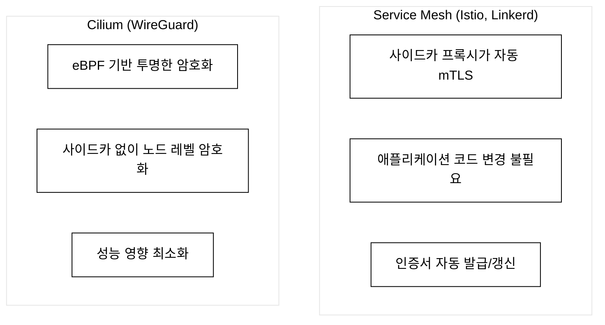
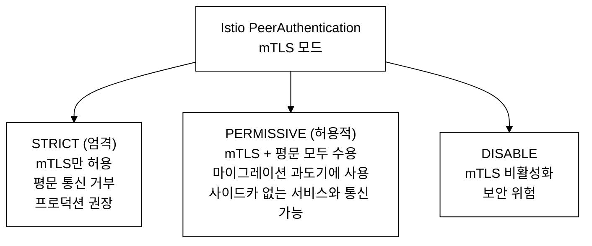
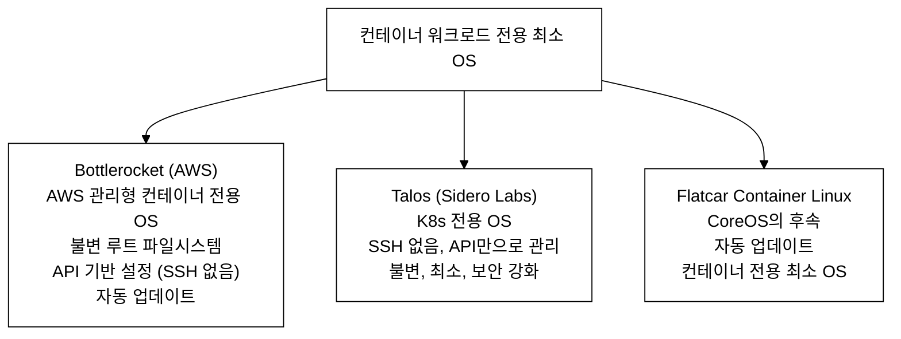

# KCSA Day 8: 네트워크 보안, 노드 하드닝, 보안 시나리오, 연습 문제

> **시험 비중:** Platform Security — 16%, Kubernetes Threat Model — 16%
> **Day 7 연결:** Day 7에서 STRIDE 위협 모델과 MITRE ATT&CK 전술, 공급망 보안(Trivy·Cosign·SLSA)을 다뤘다. Day 8은 그 위협 모델 위에 네트워크 보안(mTLS)·노드 하드닝 구현을 쌓는다.


---

## 오늘의 학습 목표 (체크리스트)

- [ ] mTLS 양방향 인증의 원리(X.509, TLS 핸드셰이크)를 설명할 수 있다
- [ ] Istio PeerAuthentication STRICT/PERMISSIVE/DISABLE의 차이와 적용 시나리오를 안다
- [ ] Cilium의 L7 정책과 표준 NetworkPolicy의 차이를 설명할 수 있다
- [ ] 컨테이너 최적화 OS(Bottlerocket, Talos, Flatcar)의 목적과 트레이드오프를 안다
- [ ] kubelet 핵심 보안 설정 5가지(anonymous-auth, Webhook, readOnlyPort, rotateCertificates, protectKernelDefaults)를 암기한다
- [ ] IMDS(169.254.169.254) 공격 흐름과 NetworkPolicy egress 차단 방법을 안다
- [ ] SLSA 4단계(L1~L4) 체계를 설명할 수 있다
- [ ] gVisor와 Kata Containers의 격리 메커니즘 차이를 안다
- [ ] 컨테이너 탈출·SA 토큰 탈취·공급망 공격의 흐름과 방어를 매핑할 수 있다
- [ ] 연습 문제 18문제를 모두 풀 수 있다

---

## 1. 네트워크 보안 심화

### 1.0 등장 배경

> **Day 7 위협 모델 복습**: Day 7에서는 STRIDE(스푸핑·변조·부인·정보유출·서비스거부·권한상승)와 MITRE ATT&CK 9대 전술로 K8s 위협 지형을 분류했다. Day 8은 그 위협 모델 위에 "어떻게 방어를 구현하는가"의 기술 계층을 쌓는다.

```
직전 기술의 한계:
마이크로서비스 아키텍처에서 서비스 간 통신은 기본적으로 평문(HTTP)이다.
Kubernetes 내부 네트워크를 "신뢰 영역"으로 간주하는 경우가 많았지만:

1. Pod 네트워크는 기본적으로 암호화되지 않는다
2. 공격자가 하나의 Pod를 침해하면 네트워크 트래픽을 스니핑(패킷 도청)할 수 있다
   → STRIDE 분류: Information Disclosure
3. 서비스 간 인증이 없으면 위조된 요청을 구분할 수 없다
   → STRIDE 분류: Spoofing (신원 위장)
4. 노드 간 통신도 평문이므로 물리 네트워크 탭핑(중간자 공격)에 취약하다
   → STRIDE 분류: Tampering

전송 중 공격 시나리오:
  공격자가 동일 네트워크 세그먼트에서 ARP 스푸핑으로 중간자(MitM) 위치를 확보하면,
  서비스 A가 서비스 B에 보내는 HTTP 요청을 캡처해 인증 토큰, DB 자격 증명,
  개인정보를 그대로 읽거나 응답을 조작할 수 있다.
  암호화만으로는 부족하다 — 서비스 A가 자신이 진짜 서비스 B와 통신하는지도 검증해야 한다.

무엇이 필요한가:
  1. 암호화(Encryption): 전송 중 도청 차단
  2. 양방향 인증(Mutual Authentication): 상대방이 진짜인지 확인

공격-방어 매핑:
- Spoofing(STRIDE) → mTLS 양방향 인증으로 서비스 신원 확인
- Information Disclosure(STRIDE) → TLS 암호화로 전송 중 데이터 보호

해결:
mTLS(Mutual TLS)는 두 요구를 동시에 충족한다.
Service Mesh(Istio, Linkerd)나 Cilium WireGuard로 구현하며,
애플리케이션 코드 변경 없이 투명하게 적용할 수 있다.

트레이드오프:
- mTLS 적용 시 TLS 핸드셰이크(handshake: 통신 시작 전 양측이 암호화 방식·인증서를
  교환하고 세션 키를 협상하는 초기 절차) 오버헤드가 발생한다.
- 인증서 발급·갱신·배포 인프라(PKI)가 필요하다.
- 기존 사이드카 미주입 서비스와의 호환성을 관리해야 한다.
```

### 1.1 mTLS (Mutual TLS)

```
mTLS = 양방향 TLS 인증 (Mutual TLS)

일반 TLS (단방향):
  클라이언트 → 서버 인증서 검증만 수행
  예: 브라우저 → HTTPS 웹서버
  동작: 서버가 자신의 인증서를 제시 → 클라이언트가 CA(인증 기관, Certificate Authority:
        인증서를 발급·서명하는 신뢰된 제3자) 서명을 검증 → 암호화 채널 수립.
        클라이언트는 신원을 증명하지 않는다(누구나 접속 가능).

mTLS (양방향):
  클라이언트 ←→ 서버 양방향 인증서 검증
  예: 마이크로서비스 A ←→ 마이크로서비스 B
  동작: 서버가 인증서 제시 → 클라이언트가 검증(일반 TLS와 동일)
        + 서버가 클라이언트 인증서를 요청 → 클라이언트도 인증서 제시
        + 서버가 클라이언트 인증서를 CA 신뢰 체인으로 검증
        → 양쪽 모두 "나는 신뢰된 CA가 서명한 인증서를 가진 정당한 서비스다"를 증명.

  핵심: X.509 인증서(X.509: ITU-T 표준 공개키 인증서 형식. 발급자·소유자·공개키·유효기간·
        CA 서명을 포함한다)를 클라이언트도 보유하고 제시해야 한다.
        서버가 모르는(CA 신뢰 체인에 없는) 클라이언트는 연결 자체가 거부된다.

mTLS의 보안 기능:
1. 암호화 (Encryption): 전송 중 데이터 보호
2. 인증 (Authentication): 양측 모두 신원 확인 — 이것이 단순 TLS와의 결정적 차이
3. 무결성 (Integrity): 데이터 변조 탐지

K8s에서 mTLS 구현:
```


_그림 1. K8s에서 mTLS를 구현하는 두 방식(Service Mesh, Cilium WireGuard)._

### 1.2 Istio mTLS 모드


_그림 2. Istio PeerAuthentication의 세 가지 mTLS 모드._

STRICT 모드 매니페스트 예:

```yaml
apiVersion: security.istio.io/v1
kind: PeerAuthentication
metadata:
  name: default
  namespace: production
spec:
  mtls:
    mode: STRICT
```

★ 시험 빈출: "STRICT vs PERMISSIVE 차이는?"
→ STRICT = mTLS만 허용, PERMISSIVE = mTLS + 평문 모두 허용

```
PERMISSIVE가 존재하는 이유 — 프로덕션 마이그레이션 시나리오:

Greenfield(신규 구축): 처음부터 모든 Pod에 사이드카를 주입하면 STRICT로 시작할 수 있다.

Brownfield(기존 클러스터 마이그레이션): 레거시 Pod(사이드카 미주입)와 신규 Pod(사이드카
주입)가 공존하는 전환 기간이 반드시 발생한다.
  - 이때 STRICT를 적용하면 레거시 Pod의 평문 요청이 즉시 거부 → 서비스 장애
  - PERMISSIVE를 적용하면 mTLS 클라이언트와 평문 클라이언트 모두 수용 → 무중단 전환 가능

단계적 롤아웃 전략:
  1단계: namespace/cluster 전체를 PERMISSIVE로 설정
  2단계: Pod 단위로 사이드카 주입 완료 확인
  3단계: STRICT로 전환 (트러블슈팅 섹션 참조)
  4단계: DISABLE은 보안 위험이므로 디버깅 외 사용 금지
```

### 1.3 Cilium 네트워크 보안

```
Cilium: eBPF 기반 CNI

Cilium의 보안 기능:

1. L3/L4 NetworkPolicy
   - 표준 K8s NetworkPolicy 지원
   - IP, 포트 기반 제어

2. L7 정책 (HTTP, gRPC, Kafka)
   - ★ 표준 NP에 없는 기능!
   - HTTP 메서드, 경로 기반 제어
   - 예: GET /api/v1/pods만 허용

3. WireGuard 투명 암호화
   - 노드 간 모든 트래픽 자동 암호화
   - 사이드카 불필요

4. Hubble (네트워크 관찰성)
   - 실시간 네트워크 흐름 시각화
   - 정책 위반 트래픽 식별

CiliumNetworkPolicy L7 예제:
```

```yaml
apiVersion: cilium.io/v2
kind: CiliumNetworkPolicy
metadata:
  name: l7-api-policy
  namespace: production
spec:
  endpointSelector:
    matchLabels:
      app: api-server
  ingress:
    - fromEndpoints:
        - matchLabels:
            app: frontend
      toPorts:
        - ports:
            - port: "8080"
              protocol: TCP
          rules:
            http:
              - method: "GET"           # GET만 허용
                path: "/api/v1/.*"      # /api/v1/ 경로만
              - method: "POST"
                path: "/api/v1/orders"
```

```
표준 NetworkPolicy vs CiliumNetworkPolicy 비교:

  표준 K8s NetworkPolicy: port: 8080으로 가는 모든 TCP 허용 (프로토콜/경로 구분 불가)
  CiliumNetworkPolicy:    port: 8080의 GET /api/v1/.*만 허용 (L7 HTTP 필터링)

path 정규식 해설:
  "/api/v1/.*"
    - .  = 임의 문자 1개 (POSIX ERE)
    - .* = 임의 문자 0개 이상 반복
    - 매칭 예: /api/v1/users, /api/v1/pods, /api/v1/orders/123
    - 미매칭:  /api/v2/users, /api/v1 (trailing slash 없음)

시험 포인트: "표준 NetworkPolicy가 할 수 없는 것?" → HTTP 메서드·경로 기반 제어
```

### 1.4 네트워크 보안 계층 이해

```
Cilium과 Service Mesh는 모두 암호화를 제공하지만 작동 계층이 다르다.

OSI 계층 관점:
  L3 (네트워크): IP 패킷 라우팅
  L4 (전송):    TCP/UDP 포트 기반 제어
  L7 (응용):    HTTP 메서드, 경로, 헤더 등 애플리케이션 프로토콜
```

| OSI 계층 | 구현체 | 주요 기능 |
| :--- | :--- | :--- |
| L7 (애플리케이션) | Istio / Linkerd (Service Mesh) | HTTP 메서드·경로 인가 정책 / JWT·OIDC 외부 인증 연동 / 사이드카 프록시 기반 |
| L3/L4 (네트워크/전송) | Cilium (eBPF + WireGuard) | IP·포트 기반 접근 제어 / 노드 간 투명 암호화 / 사이드카 불필요 |

```
둘 다 사용할 수 있는가? 그렇다. 계층이 다르므로 보완 관계다.
  - Cilium WireGuard: 인프라 수준의 노드 간 암호화 (Pod가 어떤 서비스인지 무관)
  - Istio mTLS: 서비스 신원(인증서) 기반 서비스 간 인증·인가 (L7 정책 가능)
  - 함께 사용 시: 네트워크 레이어에서도, 서비스 레이어에서도 이중 보호

eBPF(extended Berkeley Packet Filter): 커널 소스 수정 없이 커널에서 프로그램을 실행할 수
있는 리눅스 기술. Cilium은 eBPF를 이용해 네트워크 패킷을 커널 레벨에서 처리하므로
사이드카 없이 낮은 오버헤드로 네트워크 정책을 적용한다.

CNI(Container Network Interface): 컨테이너 런타임과 네트워크 플러그인 간 표준 인터페이스.
Cilium, Flannel, Calico 등이 CNI 구현체다. Flannel은 NetworkPolicy를 지원하지 않으므로
보안 정책이 필요한 환경에서는 Cilium 또는 Calico를 사용한다.
```

### 1.5 Service Mesh 보안 비교

| 항목 | Istio | Linkerd |
| :--- | :--- | :--- |
| mTLS | STRICT 모드 지원 | 기본 활성화 |
| 인증 정책 | 세밀한 제어 가능 | 기본 제공 |
| 인가 정책 | RBAC 기반 AuthorizationPolicy | Server 리소스 기반 |
| 외부 인증 | JWT/OIDC 연동 지원 | 미지원 |
| CNCF 상태 | Graduated | Graduated |
| 리소스 사용 | 높음 (Envoy 사이드카) | 낮음 (경량 사이드카) |
| 학습 곡선 | 높음 | 낮음 |

**선택 기준**: JWT/OIDC 외부 인증 연동이나 HTTP 메서드·경로 수준의 세밀한 L7 인가 정책이 필요하면 Istio를 선택한다. 경량·단순 mTLS만 필요하고 리소스 절약이 중요하면 Linkerd가 적합하다.

> **KCSA 시험 포인트**: "Istio의 인가 정책 리소스 이름은?" → `AuthorizationPolicy`. "Linkerd와 Istio의 결정적 차이?" → JWT/OIDC 외부 인증 연동 여부와 L7 인가 정책 세밀도. KCSA에서는 Istio가 훨씬 빈출이므로 PeerAuthentication·AuthorizationPolicy 리소스명을 암기한다.

---

## 2. 노드 하드닝 (Node Hardening)

### 2.1 컨테이너 최적화 OS


_그림 3. 컨테이너 워크로드 전용 최소 OS 세 가지._

```
컨테이너 최적화 OS를 사용하는 이유:
★ 공격 표면 축소 (Reduce Attack Surface)
  - 최소 패키지만 포함 → 취약점 감소
  - 불필요한 서비스 없음 → 공격 경로 차단
  - 불변 파일시스템 → 변조 방지

등장 배경:
  일반 Ubuntu/CentOS 서버는 컨테이너 워크로드 외에도 curl, python3, gcc, 텍스트 에디터,
  개발 라이브러리 등 수천 개의 패키지가 기본 설치되어 있다.
  공격자가 컨테이너 탈출에 성공하면 이 도구들을 악용해 추가 공격을 수행할 수 있다.
  Bottlerocket/Talos는 컨테이너 실행에 필요한 최소한만 포함하므로 공격자가
  사용할 수 있는 도구 자체를 제거한다.

트레이드오프:
  - SSH 없음 → 장애 시 디버깅 방법이 API 기반으로 제한된다.
  - 불변 파일시스템 → 런타임 패치가 불가하여 업데이트는 노드 교체(이미지 교체) 방식이다.
  - 일반 OS 대비 운영 도구·패키지 관리 방식이 달라 러닝 커브가 있다.
```

#### 현재 dev 클러스터에서의 대체 실습

> **전제**: dev 클러스터가 실행 중이어야 한다. kubeconfig 경로: `kubeconfig/dev.yaml`. SSH: `ssh staging-master` (또는 `ssh dev-master`).

```bash
# 실습 환경
export KUBECONFIG=kubeconfig/dev.yaml

# 1. 현재 노드 OS 확인 (컨테이너 최적화 OS vs 일반 OS 비교 기준)
ssh dev-master 'cat /etc/os-release | grep -E "(NAME|VERSION)"'

# 2. 루트 파일시스템 마운트 옵션 확인 (불변 FS라면 ro가 보인다)
ssh dev-master 'mount | grep "/ " | head -5'

# 3. 설치된 실행 파일 개수 비교 (공격 표면 크기 직접 확인)
# 현재 노드(일반 OS)
ssh dev-master 'ls /usr/bin | wc -l'
# Bottlerocket 노드라면 이 수치가 훨씬 적다

# 4. 잠재적 공격 도구 존재 여부 확인
ssh dev-master 'which curl wget python3 gcc 2>/dev/null | wc -l'
# 일반 OS: 여러 도구 발견 / 컨테이너 최적화 OS: 0 또는 극소
```

```
해석:
- 일반 Ubuntu 노드에서 /usr/bin의 바이너리 수는 보통 200~400개
- Bottlerocket은 수십 개 수준
- 공격자가 탈출에 성공하더라도 사용 가능한 도구가 없으면 추가 공격이 어렵다
- 이것이 "공격 표면 축소(Attack Surface Reduction)"의 실제 의미다
```

### 2.2 노드 보안 설정

```
Worker Node 보안 체크리스트:

1. OS 보안
   □ 최소 OS 사용 (Bottlerocket, Talos)
   □ 불필요한 패키지 제거
   □ 자동 보안 패치 적용
   □ SSH 접근 제한 (키 기반만, root 비활성화)

2. kubelet 보안 (Day 3 복습 — 상세는 [KCSA day03.md 섹션 2](../daily/day03.md) 참조)
   □ anonymous-auth=false
   □ authorization-mode=Webhook
   □ read-only-port=0
   □ rotateCertificates=true
   □ protectKernelDefaults=true

   KubeletConfiguration 핵심 파라미터 적용 예시(/var/lib/kubelet/config.yaml):

```yaml
apiVersion: kubelet.config.k8s.io/v1beta1
kind: KubeletConfiguration
authentication:
  anonymous:
    enabled: false          # anonymous-auth=false
authorization:
  mode: Webhook             # API Server가 인가 결정
readOnlyPort: 0             # 10255 읽기 전용 포트 비활성화
rotateCertificates: true    # 클라이언트 인증서 자동 갱신
protectKernelDefaults: true # sysctl 기본값 변경 시 kubelet 종료
```

   파일 수정 후 적용 명령:

```bash
sudo systemctl restart kubelet
# 재시작 후 상태 확인
sudo systemctl status kubelet
```

3. 커널 보안
   □ seccomp 기본 프로파일 적용
   □ AppArmor 또는 SELinux 활성화
   □ sysctl 보안 파라미터 설정
     sysctl(system control): 리눅스 커널 파라미터를 런타임에 조회·변경하는 인터페이스.
     /proc/sys/ 아래 가상 파일을 통해 커널 동작을 조정한다.
     보안 관련 대표 파라미터:
       - kernel.dmesg_restrict=1  : 일반 사용자의 커널 로그(dmesg) 읽기 금지.
                                    커널 버전·드라이버 정보 노출을 차단한다.
       - net.ipv4.conf.all.accept_redirects=0 : ICMP 리다이렉트 수신 거부.
                                    중간자 공격자가 라우팅을 조작하는 경로를 차단한다.
       - net.ipv4.ip_forward=1    : 노드가 패킷을 포워딩하도록 허용.
                                    K8s 네트워킹에 필수이므로 비활성화하면 안 된다.
     설정 방법: /etc/sysctl.d/99-kubernetes.conf 에 파라미터를 기술하고
               sysctl --system 으로 적용한다.

4. 파일시스템 보안
   □ /etc/kubernetes/manifests/ 권한 700
   □ /var/lib/etcd/ 권한 700
   □ kubelet 인증서 파일 권한 600
   □ 파일 무결성 모니터링 (AIDE, Tripwire)
     ※ AIDE(Advanced Intrusion Detection Environment): 파일의 해시(sha256 등) 스냅샷을
       주기적으로 찍어 현재 상태와 비교해 변조를 탐지하는 리눅스 표준 도구.
       예: kubelet 인증서(/var/lib/kubelet/pki/*.crt)가 악의적으로 교체되었는지
       감시한다. Tripwire는 상용 버전의 유사 도구다.
       KCSA에서는 "이런 도구가 있고 왜 필요한지"를 이해하면 충분하다.

5. 네트워크 보안
   □ 방화벽으로 불필요한 포트 차단
   □ Control Plane 포트 (6443, 2379, 10250) 접근 제한
   □ 메타데이터 서비스(169.254.169.254) 접근 차단
```

#### 현재 클러스터 kubelet 설정 확인 실습

> **전제**: `ssh staging-master` 또는 `ssh dev-master` 접속 가능. kubeconfig: `kubeconfig/dev.yaml`.

```bash
# kubelet 설정 파일 확인 (kind: KubeletConfiguration 형식)
ssh dev-master 'cat /var/lib/kubelet/config.yaml'

# 핵심 보안 파라미터만 추출
ssh dev-master 'grep -E "(anonymous|authorization|readOnlyPort|rotateCertificates|protectKernelDefaults)" /var/lib/kubelet/config.yaml'
```

```
CKS 시험 점검 기준:
  anonymous → anonymousAuth: false 이어야 한다 (익명 API 접근 차단)
  authorization → authorization.mode: Webhook 이어야 한다 (API Server가 인가를 담당)
  readOnlyPort → readOnlyPort: 0 이어야 한다 (10255 포트 비활성화)
  rotateCertificates → rotateCertificates: true 이어야 한다 (인증서 자동 갱신)
  protectKernelDefaults → protectKernelDefaults: true 이어야 한다 (커널 파라미터 보호)

KubeletConfiguration: kubelet이 구동 시 읽는 설정 파일(kind: KubeletConfiguration).
  /var/lib/kubelet/config.yaml 경로에 YAML 형식으로 저장된다.
  CKS 실기에서는 이 파일을 수정한 뒤 kubelet을 재시작하는 문제가 자주 출제된다.
```

### 2.3 메타데이터 서비스 보안

> **Day 7 연결**: IMDS(Instance Metadata Service) 공격은 MITRE ATT&CK의 **Credential Access** 전술에 해당한다(Day 7에서 분류한 9대 전술 중 하나). 노드 하드닝 섹션에 포함된 이유는, IMDS 접근 차단이 네트워크 보안 설정의 일환으로 노드 수준에서 제어하는 방어이기 때문이다.

```
노드 하드닝의 3계층:
  1. OS 수준: Bottlerocket·Talos로 공격 표면 축소
  2. kubelet 설정: anonymous-auth·Webhook·포트 제한
  3. 네트워크: IMDS 접근 차단 (이 절에서 다룸)

클라우드 메타데이터 서비스 (IMDS):

IMDS(Instance Metadata Service): 클라우드(AWS/GCP/Azure) 가상 머신이
169.254.169.254 링크-로컬 주소로 접근할 수 있는 내부 서비스.
노드(VM)에 할당된 IAM 역할의 임시 자격 증명을 포함한 메타데이터를 제공한다.
Pod는 노드와 같은 네트워크 스택을 공유하므로 기본적으로 이 주소에 접근 가능하다.

IMDS 공격 시나리오 (MITRE ATT&CK: Credential Access):
1. 공격자가 Pod 내에서 IMDS에 접근 (curl http://169.254.169.254/...)
2. 노드의 IAM 역할 자격 증명(임시 토큰) 탈취
3. 클라우드 리소스(S3, RDS 등)에 무단 접근

방어 방법:
1. NetworkPolicy로 IMDS 접근 차단 (아래 YAML 참조)
2. IMDSv2 사용 (토큰 기반, AWS): PUT 요청으로 TTL 제한 토큰을 먼저 발급받아야
   이후 GET 요청이 가능하다. 토큰 없이 직접 접근하는 SSRF 류 공격을 차단한다.
   IMDSv1은 curl 한 줄로 자격 증명이 노출되었으나, IMDSv2는 2단계 토큰 교환이
   필수이므로 공격 난이도가 높아진다.
3. Pod에 특정 IAM 역할만 할당:
   - IRSA(IAM Roles for Service Accounts): AWS EKS에서 ServiceAccount에 어노테이션으로
     IAM 역할 ARN을 지정하고, OIDC(OpenID Connect) 공급자와 연동해 Pod가 해당 역할의
     임시 자격 증명을 직접 받게 하는 메커니즘. 노드 전체 IAM 역할 대신 Pod별로
     최소 권한만 부여한다.
   - Workload Identity: GKE(Google Kubernetes Engine)·AKS(Azure Kubernetes Service)에서
     동일 목적으로 사용하는 메커니즘. 클라우드 플랫폼마다 명칭이 다르지만
     원리(SA → OIDC → 클라우드 IAM 역할 매핑)는 동일하다.
```

```yaml
# IMDS 접근 차단 NetworkPolicy
apiVersion: networking.k8s.io/v1
kind: NetworkPolicy
metadata:
  name: block-metadata
  namespace: production
spec:
  podSelector: {}
  policyTypes:
    - Egress
  egress:
    - to:
        - ipBlock:
            cidr: 0.0.0.0/0
            except:
              - 169.254.169.254/32    # IMDS 차단
```

---

## 3. 보안 시나리오 분석

### 시나리오 1: 컨테이너 탈출 공격

#### 컨테이너 샌드박싱 등장 배경

표준 컨테이너(runc 기반)는 호스트 커널을 직접 공유한다. cgroup·namespace로 프로세스를 격리하지만 커널 자체는 같다. 컨테이너 탈출에 성공하면 공격자가 호스트 커널 syscall에 직접 접근할 수 있다는 뜻이다.

기존 방어(seccomp, AppArmor, PSA Restricted)는 syscall을 필터링하거나 파일 접근을 제한하는 방식이다. 그러나 필터 우회 취약점이 발견되면 커널에 직접 도달한다는 근본 한계가 있다.

이 한계를 넘기 위해 커널 자체를 분리하는 컨테이너 샌드박싱 기술이 등장했다.

**gVisor (Google 오픈소스)**
- 사용자 공간(user space)에 구현된 별도 커널(Sentry)을 컨테이너와 호스트 커널 사이에 삽입한다.
- 컨테이너의 syscall을 Sentry가 가로채 처리하므로, 컨테이너가 호스트 커널에 직접 접근하지 못한다.
- 트레이드오프: syscall 중간 처리 비용으로 성능 오버헤드가 발생한다. I/O 집약 작업에서 체감된다.

**Kata Containers (OpenStack Foundation)**
- 컨테이너를 경량 VM(KVM 기반) 안에서 실행한다.
- VM 하드웨어 가상화가 격리 경계가 되므로 호스트 커널과의 분리가 강하다.
- 트레이드오프: VM 부팅 시간과 메모리 오버헤드가 일반 컨테이너보다 크다.

> Day 8 섹션 4 시험 패턴에서 gVisor·Kata 선택지가 출제된다. 격리 메커니즘(사용자 공간 커널 vs 경량 VM)을 구분하는 것이 핵심이다.

```
공격 흐름:
1. 공격자가 취약한 웹 앱의 RCE 취약점 악용
2. 컨테이너 내부에서 쉘 획득 (Execution)
3. privileged: true → 호스트 디바이스 접근
4. chroot /host → 호스트 파일시스템 접근
5. kubelet 자격 증명 탈취 (Credential Access)
6. 다른 노드로 이동 (Lateral Movement)

방어:
✓ PSA Restricted → privileged 금지
✓ Falco → 쉘 실행 탐지
✓ seccomp RuntimeDefault → 위험 syscall 차단
✓ RBAC → Pod 생성 권한 최소화
```

### 시나리오 2: SA 토큰 탈취

```
공격 흐름:
1. 공격자가 Pod 내에서 SA 토큰 읽기
   /var/run/secrets/kubernetes.io/serviceaccount/token
2. SA에 과도한 RBAC 권한이 있는 경우
3. 토큰으로 API Server에 접근
4. Secret 읽기, Pod 생성 등 악용

방어:
✓ automountServiceAccountToken: false → 불필요 시 비활성화
✓ Bound Token → 시간 제한 + Pod 삭제 시 무효
✓ RBAC 최소 권한 → SA에 필요한 최소 권한만
✓ Falco → /var/run/secrets 파일 접근 탐지
```

### 시나리오 3: 공급망 공격

> **난이도**: 고급 | **[Day 7 복습]** Trivy(정적 분석 — 이미지 취약점 스캔), Cosign(이미지 서명·무결성 검증), Kyverno·OPA/Gatekeeper(Admission Policy — 서명 없는 이미지 차단)는 Day 7 공급망 보안 섹션에서 다뤘다. 아래 시나리오를 읽으며 그 도구들이 어느 단계에서 어떻게 작동하는지 연결해본다.

**SLSA 4단계 체계**

SLSA(Supply chain Levels for Software Artifacts, "살사"로 읽는다): Google이 제안하고 OpenSSF(Open Source Security Foundation)가 관리하는 공급망 보안 프레임워크. 소프트웨어 빌드·배포 파이프라인이 얼마나 신뢰할 수 있는지를 4단계로 정량화한다. 문제 3의 SLSA Level 선택지가 이 체계에서 나온다.

| 레벨 | 요구사항 | 방어하는 위협 |
| :--- | :--- | :--- |
| L1 (문서화) | 빌드 프로세스를 문서화, 출처(provenance) 정보를 생성·제공한다 | 실수로 인한 빌드 오류, 기본적인 출처 추적 |
| L2 (서명된 출처 증명) | 출처 정보에 빌드 서비스가 서명(Cosign 등), 변조 탐지 가능 | 빌드 후 아티팩트 변조, 출처 위조 |
| L3 (격리된 빌드) | 빌드가 격리된 환경(ephemeral, hermetic)에서 실행된다 | 빌드 인프라 침해, 악성 의존성 주입 |
| L4 (2인 검토) | 모든 변경에 2인 이상 검토(two-person review) 필수, 완전한 감사 추적 | 내부자 위협, 의도적 백도어 삽입 |

> 시험 암기 포인트: **L1=문서화, L2=서명된 출처 증명, L3=격리된 빌드, L4=2인 검토**. 단계가 높을수록 더 강한 공급망 보안이다.

> OPA/Gatekeeper: OPA(Open Policy Agent)는 범용 정책 엔진이고, Gatekeeper는 이를 K8s Admission Webhook으로 연동한 CNCF 프로젝트다. 서명되지 않은 이미지나 특정 레지스트리 외 이미지의 배포를 API Server 수준에서 차단한다.
> PSA(Pod Security Admission): K8s 1.25에서 PSP(PodSecurityPolicy)를 대체한 내장 Admission Controller. Privileged/Baseline/Restricted 세 가지 프로파일로 Pod 보안 수준을 강제한다.

```
공격 흐름:
1. 공격자가 인기 베이스 이미지에 백도어 삽입
2. 개발자가 해당 이미지로 빌드
3. CI/CD 파이프라인에서 이미지 스캔 없이 배포
4. 프로덕션에서 백도어 활성화
5. 데이터 탈취 (Impact)

방어:
✓ 이미지 스캔 (Trivy) → CVE 탐지 (빌드 타임)
✓ 이미지 서명 (Cosign) → 무결성 검증 (배포 전)
✓ SBOM 생성 (Syft) → 의존성 추적 (감사)
✓ Admission Policy (OPA/Gatekeeper, Kyverno) → 미서명 이미지 거부 (배포 타임)
✓ 프라이빗 레지스트리 → 검증된 이미지만 사용 (운영)
```

---

## 4. 시험 출제 패턴 분석

```
시험 팁: KCSA는 객관식 개념 암기(패턴 1-3), CKS는 kubectl·파일 편집 손 실습(패턴 4-6).

─── KCSA 개념 이해 영역 ──────────────────────────────────────────
패턴 1: "mTLS의 주요 기능은?"
  → 서비스 간 암호화 및 양방향 인증

패턴 2: "Istio STRICT vs PERMISSIVE?"
  → STRICT = mTLS만, PERMISSIVE = mTLS + 평문

패턴 3: "컨테이너 최적화 OS를 사용하는 이유는?"
  → 공격 표면 축소

─── CKS 실기 병행 학습 영역 (KCSA에서는 개념만) ─────────────────
패턴 4: "AppArmor complain vs enforce?" [CKS 실기]
  → complain = 로그만, enforce = 차단 + 로그
  seccomp(secure computing mode): 프로세스가 사용할 수 있는 시스템 콜을
  커널 수준에서 제한하는 리눅스 기능. RuntimeDefault는 컨테이너 런타임이
  기본 제공하는 안전한 시스템 콜 허용 목록을 적용한다.
  AppArmor(Application Armor): 프로세스별로 파일 접근·네트워크·실행 권한을
  프로파일로 제한하는 리눅스 MAC(Mandatory Access Control) 보안 모듈.

패턴 5: "seccomp RuntimeDefault의 특징은?" [CKS 실기]
  → 런타임이 제공하는 기본 프로파일, PSS Restricted에서 허용

패턴 6: "Falco가 탐지할 수 없는 것은?" [KCSA 개념]
  → 코드의 SQL Injection 취약점 (SAST 도구 필요)
  Falco는 런타임 syscall 모니터링 도구로 실행 중인 컨테이너의 비정상 행위를 탐지한다.
  SAST(Static Application Security Testing): 소스 코드나 바이너리를 실행하지 않고
  정적 분석으로 취약점을 탐지하는 방법 (예: SonarQube, Semgrep).

컨테이너 샌드박싱 기술 (문제 13 관련):
  표준 컨테이너는 호스트 커널을 직접 공유한다. 컨테이너 탈출에 성공하면
  공격자가 호스트 커널 syscall에 바로 접근할 수 있다는 뜻이다.
  이를 보완하기 위한 컨테이너 격리 강화 기술 두 가지:

  gVisor (Google 오픈소스):
    - 사용자 공간(user space)에 구현된 커널을 제공한다.
    - 컨테이너의 syscall을 호스트 커널이 아닌 gVisor의 사용자 공간 커널(Sentry)이
      가로채 처리하므로, 컨테이너가 호스트 커널에 직접 접근하지 못한다.
    - 트레이드오프: syscall 중간 처리 비용으로 성능 오버헤드가 발생한다.

  Kata Containers (OpenStack Foundation):
    - 컨테이너를 경량 VM(KVM 기반) 안에서 실행한다.
    - VM 하드웨어 가상화가 격리 경계가 되므로 호스트 커널과의 분리가 강하다.
    - 트레이드오프: VM 부팅 시간과 메모리 오버헤드가 일반 컨테이너보다 크다.

  Docker Compose는 다중 컨테이너를 조합·관리하는 도구이며, 격리 강화와 무관하다.
  → 시험 포인트: "컨테이너 격리를 강화하는 기술?" → gVisor, Kata Containers, seccomp.
            "아닌 것?" → Docker Compose.
```

---

## 5. 연습 문제 (18문제 + 상세 해설)

### 문제 1.
MITRE ATT&CK에서 kubectl exec로 명령 실행은?

A) Initial Access
B) Execution
C) Persistence
D) Discovery

<details><summary>정답 확인</summary>

**정답: B) Execution**

**왜 정답인가:** kubectl exec는 이미 접근 가능한 컨테이너에서 악성 명령을 실행하는 것이므로 Execution 전술에 해당한다.

</details>

### 문제 2.
169.254.169.254 접근은 MITRE ATT&CK의 어떤 전술?

A) Execution
B) Credential Access
C) Impact
D) Persistence

<details><summary>정답 확인</summary>

**정답: B) Credential Access**

**왜 정답인가:** 클라우드 IMDS에서 IAM 자격 증명을 탈취하는 것은 Credential Access 전술이다.

</details>

### 문제 3.
SLSA Level 2에서 요구하는 것은?

A) 문서화
B) 서명된 출처 증명
C) 격리된 빌드
D) 2인 검토

<details><summary>정답 확인</summary>

**정답: B) 서명된 출처 증명**

**왜 정답인가:** L1=문서화, L2=서명된 출처 증명, L3=격리된 빌드, L4=2인 검토이다.

</details>

### 문제 4.
Falco가 탐지할 수 없는 것은?

A) 컨테이너 내 쉘 실행
B) 민감 파일 접근
C) 코드의 SQL Injection 취약점
D) 예상치 못한 네트워크 연결

<details><summary>정답 확인</summary>

**정답: C) 코드의 SQL Injection 취약점**

**왜 정답인가:** Falco는 런타임 행위(syscall) 모니터링 도구이다. 코드 취약점 탐지는 SAST 도구(SonarQube 등)의 영역이다.

</details>

### 문제 5.
mTLS의 주요 기능은?

A) 로드 밸런싱
B) 서비스 간 암호화 및 양방향 인증
C) 헬스 체크
D) 오토 스케일링

<details><summary>정답 확인</summary>

**정답: B) 서비스 간 암호화 및 양방향 인증**

**왜 정답인가:** mTLS는 클라이언트와 서버가 서로의 인증서를 검증하며, 통신을 암호화한다.

</details>

### 문제 6.
privileged: true의 위험성은?

A) 메모리 증가
B) 호스트의 모든 디바이스 접근 가능, 컨테이너 탈출 용이
C) 네트워크 지연
D) 로그 증가

<details><summary>정답 확인</summary>

**정답: B) 호스트의 모든 디바이스 접근 가능, 컨테이너 탈출 용이**

**왜 정답인가:** privileged 모드는 컨테이너에 호스트의 모든 디바이스와 커널 기능에 대한 접근 권한을 부여한다.

</details>

### 문제 7.
hostPath 볼륨 마운트의 위험은?

A) 디스크 부족
B) 호스트 파일시스템 접근으로 컨테이너 탈출 가능
C) 네트워크 저하
D) 스케줄링 지연

<details><summary>정답 확인</summary>

**정답: B) 호스트 파일시스템 접근으로 컨테이너 탈출 가능**

**왜 정답인가:** /etc/shadow, docker.sock 등 민감한 호스트 파일에 접근할 수 있다.

</details>

### 문제 8.
Istio STRICT vs PERMISSIVE의 차이는?

A) STRICT=외부 차단, PERMISSIVE=허용
B) STRICT=mTLS만, PERMISSIVE=mTLS+평문
C) 차이 없음
D) STRICT=갱신 안 함

<details><summary>정답 확인</summary>

**정답: B) STRICT=mTLS만, PERMISSIVE=mTLS+평문**

**왜 정답인가:** STRICT는 mTLS 연결만 허용하고, PERMISSIVE는 마이그레이션 과도기에 mTLS와 평문 모두 수용한다.

</details>

### 문제 9.
컨테이너 최적화 OS를 사용하는 이유는?

A) GUI 제공
B) 공격 표면 축소
C) 더 많은 앱 설치
D) 빠른 네트워크

<details><summary>정답 확인</summary>

**정답: B) 공격 표면 축소**

**왜 정답인가:** 최소 패키지만 포함하여 취약점을 줄이고, 불변 파일시스템으로 변조를 방지한다.

</details>

### 문제 10.
AppArmor complain vs enforce 차이는?

A) complain=차단, enforce=로그
B) complain=로그만, enforce=차단+로그
C) 차이 없음
D) complain=커널, enforce=사용자

<details><summary>정답 확인</summary>

**정답: B) complain=로그만, enforce=차단+로그**

**왜 정답인가:** complain 모드는 위반을 로그에만 기록하고 차단하지 않는다. enforce 모드는 차단하고 로그에도 기록한다.

</details>

### 문제 11.
seccomp RuntimeDefault 프로파일의 특징은?

A) 모든 시스템 콜 허용
B) 런타임 기본 프로파일
C) 커스텀만
D) 비활성화

<details><summary>정답 확인</summary>

**정답: B) 런타임 기본 프로파일**

**왜 정답인가:** containerd/CRI-O가 제공하는 기본 프로파일이며, PSS Restricted에서 허용되는 프로파일이다.

</details>

### 문제 12.
AppArmor와 SELinux의 관계는?

A) 동시 사용
B) 상호 배타적
C) AppArmor가 대체
D) 독립

<details><summary>정답 확인</summary>

**정답: B) 상호 배타적**

**왜 정답인가:** 하나의 시스템에서 AppArmor와 SELinux 중 하나만 사용할 수 있다. Ubuntu는 AppArmor, RHEL은 SELinux를 기본 사용한다.

</details>

### 문제 13.
컨테이너 격리를 강화하는 기술이 아닌 것은?

A) gVisor
B) Kata Containers
C) Docker Compose
D) seccomp

<details><summary>정답 확인</summary>

**정답: C) Docker Compose**

**왜 정답인가:** Docker Compose는 다중 컨테이너 조합 도구이지 격리 강화 기술이 아니다.

</details>

### 문제 14.
백도어 Pod를 배포하여 영구 접근을 유지하는 것은?

A) Execution
B) Persistence
C) Lateral Movement
D) Impact

<details><summary>정답 확인</summary>

**정답: B) Persistence**

**왜 정답인가:** 재부팅이나 Pod 삭제 후에도 접근을 유지하기 위한 기술은 Persistence 전술이다.

</details>

### 문제 15.
Cilium이 표준 NetworkPolicy보다 우수한 점은?

A) 기본 통신 허용
B) L7(HTTP) 정책 적용
C) RBAC 관리
D) Secret 암호화

<details><summary>정답 확인</summary>

**정답: B) L7(HTTP) 정책 적용**

**왜 정답인가:** Cilium은 eBPF 기반으로 HTTP 메서드, 경로 등 L7 수준의 접근 제어가 가능하다.

</details>

### 문제 16.
Falco의 CNCF 상태는?

A) Sandbox
B) Incubating
C) Graduated
D) Archived

<details><summary>정답 확인</summary>

**정답: C) Graduated**

**왜 정답인가:** Falco는 CNCF 졸업(Graduated) 프로젝트이다.

</details>

### 문제 17.
Pod에서 IMDS(169.254.169.254) 접근을 차단하는 방법은?

A) RBAC
B) NetworkPolicy egress deny
C) PSA
D) Audit Log

<details><summary>정답 확인</summary>

**정답: B) NetworkPolicy egress deny**

**왜 정답인가:** NetworkPolicy로 169.254.169.254/32를 except 목록에 추가하여 IMDS 접근을 차단한다.

</details>

### 문제 18.
Trivy와 Falco의 차이로 올바른 것은?

A) 둘 다 정적 분석
B) Trivy=정적 분석(이미지 스캔), Falco=동적 분석(런타임)
C) 둘 다 동적 분석
D) Trivy=런타임, Falco=빌드 타임

<details><summary>정답 확인</summary>

**정답: B) Trivy=정적 분석(이미지 스캔), Falco=동적 분석(런타임)**

**왜 정답인가:** Trivy는 이미지의 알려진 CVE를 스캔하는 정적 분석 도구이고, Falco는 실행 중인 컨테이너의 비정상 행위를 탐지하는 동적 분석 도구이다.

</details>

---

## 6. 핵심 암기 항목

```
(1) 네트워크 보안 [이론] [문제 예상]
- mTLS: 양방향 TLS — 서버+클라이언트 모두 X.509 인증서 제시·검증
- Istio 모드: STRICT(mTLS만) / PERMISSIVE(mTLS+평문, 마이그레이션용) / DISABLE(금지)
- Cilium: eBPF 기반 CNI, L3/L4 + L7(HTTP 메서드/경로) 정책, WireGuard 노드간 암호화
- CNI 비교: Flannel=NetworkPolicy 미지원, Cilium/Calico=지원
  → 시험 포인트: "NetworkPolicy를 지원하지 않는 CNI는?" → Flannel
- Cilium vs Istio 계층: Cilium=L3/L4 인프라 암호화, Istio=L7 서비스 인증·인가

(2) 노드 하드닝 [이론] [문제 예상]
- 컨테이너 최적화 OS: Bottlerocket(AWS), Talos(K8s 전용), Flatcar(CoreOS 후속)
- 사용 이유: 공격 표면 축소 (최소 패키지 + 불변 파일시스템)
- kubelet 핵심: anonymous-auth=false, authorization=Webhook, readOnlyPort=0
- IMDS(169.254.169.254): Credential Access 위협 → NetworkPolicy egress 차단

(3) 방어 기술 [이론] [문제 예상]
- PSA(Pod Security Admission): PSP 대체. Privileged/Baseline/Restricted 3 프로파일
- seccomp RuntimeDefault: 런타임 기본 시스템 콜 허용 목록, PSS Restricted에서 필수
- AppArmor: complain=로그만 / enforce=차단+로그
- Falco: 런타임 syscall 탐지 [동적]. SQL Injection 탐지 불가(SAST 필요)
- Trivy: 이미지 CVE 스캔 [정적], Cosign: 이미지 서명·검증
- OPA/Gatekeeper: Admission Policy로 미서명 이미지 차단

(4) 보안 시나리오 매핑 [이론]
- privileged: true → chroot /host → 컨테이너 탈출 → 호스트 접근 (Privilege Escalation)
- SA 토큰 → API Server → Secret 읽기 (Credential Access + Lateral Movement)
- 공급망 → 악성 이미지 → 백도어 → 데이터 탈취 (Initial Access → Impact)
```

---

## 7. 복습 체크리스트

- [ ] mTLS의 양방향 인증 개념을 설명할 수 있다
- [ ] Istio STRICT/PERMISSIVE 차이를 안다
- [ ] Cilium의 L7 정책과 WireGuard를 설명할 수 있다
- [ ] 컨테이너 최적화 OS의 목적(공격 표면 축소)을 안다
- [ ] 노드 보안 체크리스트를 알고 있다
- [ ] IMDS(169.254.169.254) 방어 방법을 안다
- [ ] 컨테이너 탈출 시나리오와 방어를 설명할 수 있다
- [ ] SA 토큰 탈취 시나리오와 방어를 설명할 수 있다
- [ ] 연습 문제 18문제를 모두 풀 수 있다

---

## 내일 예고: Day 9 - Audit Logging, Compliance 프레임워크, 종합 모의시험 (전반)

- Audit Logging 4단계 레벨과 정책 설계
- Compliance 프레임워크 (CIS, NIST CSF, SOC 2, PCI DSS, GDPR)
- 종합 모의시험 37문제 (Overview, Cluster, Fundamentals, Threat 도메인)
- tart-infra 실습

---

## tart-infra 실습

### 실습 환경 설정

```bash
export KUBECONFIG=kubeconfig/dev.yaml
kubectl get nodes
```

### 실습 1: mTLS 설정 확인

```bash
echo "=== mTLS 설정 확인 ==="

# Istio PeerAuthentication 확인
kubectl get peerauthentication -A 2>/dev/null || echo "Istio PeerAuthentication 미설정"

# Cilium 암호화 확인
kubectl get configmap cilium-config -n kube-system -o yaml 2>/dev/null | grep -E "(enable-wireguard|encrypt)" || echo "Cilium WireGuard 미설정"
```

**검증 — 기대 출력:**

이 dev 클러스터의 cilium-config에는 `enable-wireguard`/`encrypt` 키 자체가 없어 grep이 빈 결과를 내고 `미설정`으로 표시된다. Istio PeerAuthentication도 없으므로 클러스터 내 통신이 암호화되지 않은 상태다.

**동작 원리:** mTLS 구현 방법:
1. **Istio**: PeerAuthentication STRICT 모드 → 사이드카 기반 자동 mTLS
2. **Cilium**: WireGuard → 노드 레벨 투명 암호화, 사이드카 불필요
3. **Linkerd**: 기본 활성화 → 경량 사이드카 기반 mTLS

### 실습 2: 노드 보안 점검

```bash
echo "=== 노드 보안 점검 ==="

# kubelet 포트 확인
echo "[kubelet 보안 포트]"
kubectl get pod kube-apiserver-dev-master -n kube-system -o yaml | grep -c "10250" || echo "10250 포트 미확인"

# Control Plane 컴포넌트 확인
echo ""
echo "[Control Plane Static Pods]"
kubectl get pods -n kube-system -o wide | grep -E "(apiserver|etcd|controller|scheduler)"
```

**동작 원리:** 노드 하드닝:
1. 컨테이너 최적화 OS(Bottlerocket, Talos)로 공격 표면 축소
2. kubelet 보안 설정 (anonymous-auth=false, Webhook, port=0)
3. 파일 권한 제한 (/etc/kubernetes/manifests/ = 700)
4. IMDS(169.254.169.254) 접근 차단

### 실습 3: 보안 위험 탐지

```bash
echo "=== 보안 위험 탐지 ==="

# privileged 컨테이너 탐지
echo "[privileged 컨테이너]"
kubectl get pods -A -o json | python3 -c "
import json, sys
data = json.load(sys.stdin)
for pod in data.get('items', []):
    ns = pod['metadata']['namespace']
    name = pod['metadata']['name']
    for c in pod['spec'].get('containers', []):
        sc = c.get('securityContext', {})
        if sc.get('privileged'):
            print(f'  {ns}/{name}/{c[\"name\"]}: privileged=true')
" 2>/dev/null || echo "  점검 실패"

# hostNetwork 사용
echo ""
echo "[hostNetwork 사용 Pod]"
kubectl get pods -A -o json | python3 -c "
import json, sys
data = json.load(sys.stdin)
for pod in data.get('items', []):
    if pod['spec'].get('hostNetwork'):
        print(f'  {pod[\"metadata\"][\"namespace\"]}/{pod[\"metadata\"][\"name\"]}')
" 2>/dev/null || echo "  점검 실패"
```

**검증 — 기대 출력:**
> **예시(참조) — dev 실측 (kube-proxy 없음 — Cilium이 대체):** KCSA 보안 개념/점검 기대 출력(설정/도구/환경 의존). 재현 가능 핵심은 KCSA daily 및 본 캡처 참고.
이 dev 클러스터는 kube-proxy 대신 Cilium을 쓰므로 `container.securityContext.privileged=true`로 표시되는 컨테이너가 없다(Cilium은 CNI/Envoy를 hostNetwork로 띄우되 privileged 플래그는 다른 경로로 부여). hostNetwork는 Control Plane 정적 파드와 Cilium 컴포넌트가 사용하며, 모두 시스템 컴포넌트라 정상이다. 사용자 네임스페이스에서 발견되면 보안 위험이다.

**동작 원리:** 위험 설정 탐지:
1. `privileged: true` → 호스트 디바이스 접근, 컨테이너 탈출 가능
2. `hostNetwork: true` → 네트워크 격리 무효화
3. `hostPath` → 호스트 파일시스템 접근
4. PSA Restricted로 이러한 설정을 자동 차단 가능

### 트러블슈팅: 네트워크 보안 및 노드 하드닝 문제

```
장애 시나리오 1: Istio mTLS STRICT 적용 후 서비스 통신 실패
  증상: 503 Service Unavailable, "upstream connect error"
  원인: 사이드카가 주입되지 않은 Pod가 STRICT 정책 대상 서비스에 접근
  디버깅:
    kubectl get pod <pod-name> -o jsonpath='{.spec.containers[*].name}'
    # istio-proxy가 없으면 사이드카 미주입 상태
    istioctl analyze -n <namespace>
  해결: PERMISSIVE 모드로 전환 후 사이드카 주입을 완료하고
        단계적으로 STRICT로 전환한다

장애 시나리오 2: IMDS(169.254.169.254) 접근으로 IAM 자격 증명 탈취
  증상: Pod 내부에서 curl 169.254.169.254로 노드의 IAM 역할 토큰 획득
  공격-방어 매핑: Credential Access(MITRE ATT&CK) → IMDS를 통한 자격 증명 탈취
  디버깅:
    kubectl exec <pod> -- curl -s http://169.254.169.254/latest/meta-data/
  해결: NetworkPolicy로 IMDS 접근을 차단하고,
        IMDSv2(토큰 기반)로 전환하며,
        IRSA/Workload Identity로 Pod별 IAM 역할을 할당한다
```

---

## ✅ 자가점검

<details><summary>Q1. mTLS가 단순 TLS(단방향)와 다른 핵심 차이는?</summary>

단순 TLS는 클라이언트가 서버 인증서만 검증한다. mTLS는 서버도 클라이언트 인증서를 요청해 검증하므로 양방향 신원 확인이 이루어진다. 이것이 마이크로서비스 간 "신원 위장(Spoofing)" 공격을 차단하는 메커니즘이다.

</details>

<details><summary>Q2. Istio PERMISSIVE 모드가 필요한 이유는?</summary>

기존 클러스터에 Istio를 도입할 때 사이드카 미주입 레거시 Pod가 공존하는 전환 기간이 발생한다. 이 시기에 STRICT를 적용하면 레거시 Pod의 평문 요청이 즉시 거부되어 서비스 장애가 생긴다. PERMISSIVE는 mTLS와 평문을 모두 수용하므로 무중단 마이그레이션이 가능하다.

</details>

<details><summary>Q3. SLSA L1~L4를 순서대로 설명하라.</summary>

L1=문서화(출처 정보 생성), L2=서명된 출처 증명(빌드 서비스 서명), L3=격리된 빌드(ephemeral 환경), L4=2인 검토(two-person review). 단계가 높을수록 강한 공급망 보안이다.

</details>

<details><summary>Q4. gVisor와 Kata Containers의 격리 메커니즘 차이는?</summary>

gVisor는 사용자 공간 커널(Sentry)이 컨테이너의 syscall을 가로채 처리한다. 호스트 커널에 직접 접근하지 못하게 하는 소프트웨어 격리다. Kata Containers는 컨테이너를 경량 VM 안에서 실행해 하드웨어 가상화로 격리한다. gVisor는 성능 오버헤드, Kata는 VM 부팅·메모리 오버헤드가 트레이드오프다.

</details>

<details><summary>Q5. 표준 NetworkPolicy가 할 수 없고 CiliumNetworkPolicy만 할 수 있는 것은?</summary>

HTTP 메서드·경로 등 L7 수준의 접근 제어다. 표준 NetworkPolicy는 IP·포트(L3/L4) 기반 제어만 가능하다.

</details>

---

## 시험 팁

- **KCSA 빈출 1순위**: mTLS 양방향 인증, STRICT/PERMISSIVE 차이, SLSA 4단계. 이 세 가지는 반드시 암기한다.
- **오답 함정**: "PERMISSIVE가 더 안전하다" → 틀림. PERMISSIVE는 평문을 허용하므로 마이그레이션 과도기 외에는 사용하지 않는다.
- **컨테이너 샌드박싱 문제**: "격리를 강화하는 기술이 아닌 것?"에서 Docker Compose가 정답인 이유 — Docker Compose는 조합 도구이지 격리 메커니즘이 아니다.
- **SLSA 암기법**: 1문서, 2서명, 3격리, 4검토. 숫자가 올라갈수록 빌드 파이프라인 신뢰도가 높아진다.
- **Trivy vs Falco 구분**: Trivy=이미지 빌드 타임 CVE 스캔(정적), Falco=런타임 syscall 이상 행위 탐지(동적). SQL Injection 같은 코드 취약점은 둘 다 탐지 불가(SAST 도구 필요).
- **Cilium L7**: "표준 NetworkPolicy가 할 수 없는 것?" → HTTP 메서드·경로 제어. eBPF 기반 CiliumNetworkPolicy만 가능하다.

---

## 더 읽을거리

- [SLSA 공식 문서](https://slsa.dev/spec/v1.0/levels) — L1~L4 요구사항 원문
- [Istio PeerAuthentication 레퍼런스](https://istio.io/latest/docs/reference/config/security/peer_authentication/) — STRICT/PERMISSIVE 설정 상세
- [gVisor 아키텍처](https://gvisor.dev/docs/architecture_guide/) — Sentry·Gofer 내부 동작
- [Kata Containers 개요](https://katacontainers.io/learn/) — 경량 VM 기반 컨테이너 격리
- [Cilium Network Policy 가이드](https://docs.cilium.io/en/stable/network/kubernetes/policy/) — L3~L7 정책 예제
- [OpenSSF SLSA 프레임워크](https://openssf.org/projects/slsa/) — 공급망 보안 표준 배경
