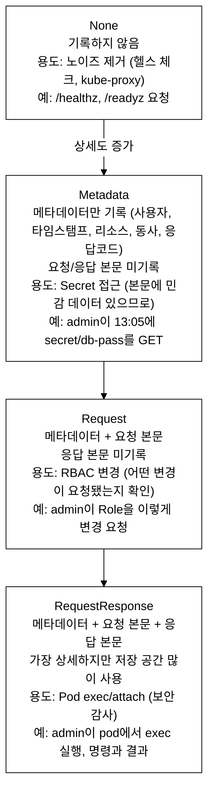
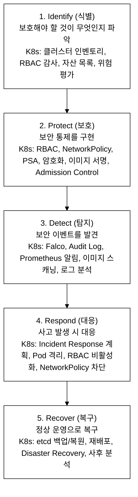
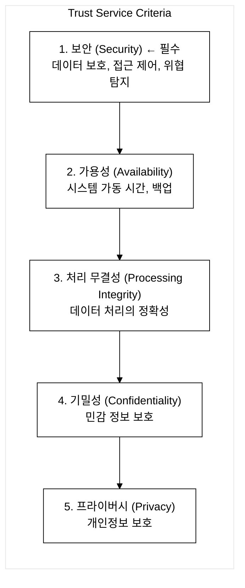
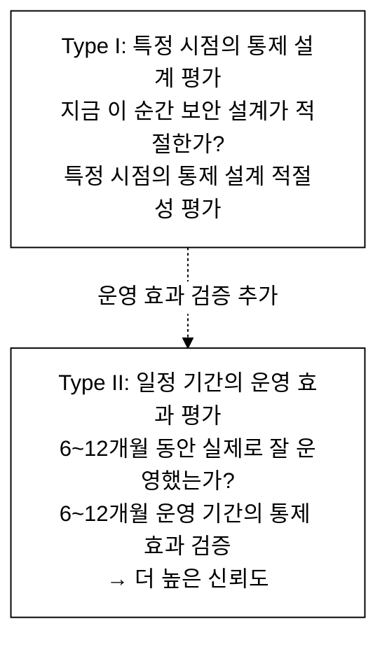
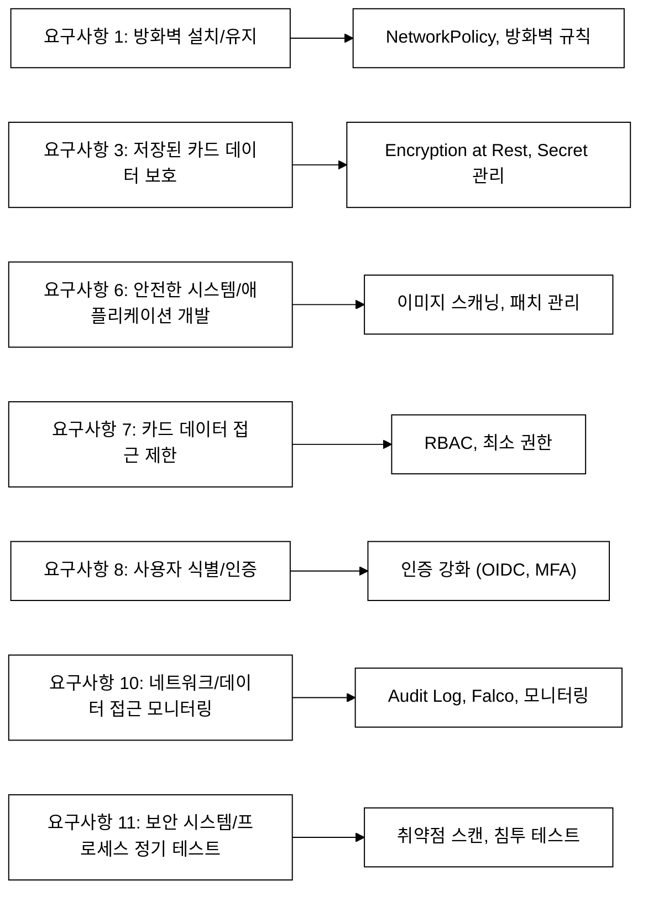
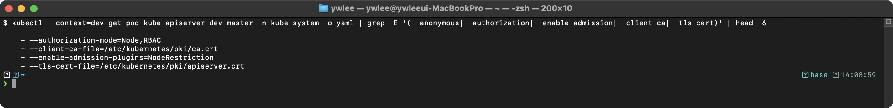

# KCSA Day 9: Audit Logging, Compliance 프레임워크

> 학습 목표 | 도메인: Compliance and Security Frameworks (10%) | 예상 소요 60분

Day 8에서는 네트워크 보안·노드 하드닝 기법을 다뤘다. Day 9는 그 방어 설정이 실제로 이루어졌는지를 기록·증명하는 Audit Logging과, 규정 준수 프레임워크(CIS·NIST·SOC 2·PCI DSS·GDPR)로 연결된다.

## 오늘의 학습 목표

- [ ] Audit Logging이 등장한 배경과 이전 방식의 한계를 설명할 수 있다
- [ ] Audit 4단계 레벨(None/Metadata/Request/RequestResponse)을 상세도 순서대로 나열하고, 각 레벨을 선택하는 이유를 리소스별로 설명할 수 있다
- [ ] Audit Policy YAML의 규칙 처리 흐름(첫 번째 매칭 규칙 적용, AND 결합)을 이해한다
- [ ] Audit 백엔드(Log vs Webhook) 차이를 설명할 수 있다
- [ ] CIS Benchmark·NIST CSF·SOC 2·PCI DSS·GDPR 각각의 목적과 K8s 구현 매핑을 안다
- [ ] SOC 2 Type I과 Type II의 차이를 설명할 수 있다

---

## 1. Audit Logging 심화

### 1.0 등장 배경

Kubernetes 초기(1.x ~ 1.6 이전)에 API Server는 요청을 stdout 텍스트 로그로만 기록했다. 이 방식의 한계는 세 가지였다.

1. **비구조화** — 텍스트 로그는 파싱 도구 없이 자동 분석이 불가능했다.
2. **세밀한 필터링 불가** — 헬스 체크부터 Secret 접근까지 모두 동일한 방식으로 기록되거나, 전혀 기록되지 않았다.
3. **민감 데이터 노출** — 요청 본문을 기록하면 Secret의 비밀번호·토큰이 로그 파일에 그대로 남았다.

그 결과:

- "누가 Secret을 삭제했는가?"를 추적할 방법이 없었다.
- RBAC 정책 변경 이력이 존재하지 않았다.
- 침해 사고 발생 시 공격 경로를 재구성(포렌식(Forensics): 사고 후 디지털 증거를 수집·분석해 공격 타임라인을 복원하는 과정)할 수 없었다.
- SOC 2, PCI DSS 등 규정 준수 감사에서 활동 증빙을 제출할 수 없었다.

Kubernetes 1.7에서 구조화된 Audit Logging이 도입됐다. API Server를 통과하는 모든 요청을 JSON 이벤트로 기록하되, 4단계 레벨(None/Metadata/Request/RequestResponse)로 상세도를 조절하여 민감 데이터 보호와 감사 추적을 동시에 달성한다.

**공격-방어 매핑에서 쓰이는 두 위협 모델 용어:**

- **STRIDE**: Microsoft가 정의한 6가지 위협 범주 — Spoofing(신원 위조) / Tampering(데이터 변조) / Repudiation(행위 부인) / Information Disclosure(정보 유출) / Denial of Service(서비스 거부) / Elevation of Privilege(권한 상승). Repudiation 위협이란 공격자가 자신의 행위를 "나는 하지 않았다"고 부인할 수 있는 상황이다. Audit Logging은 이 위협에 대한 직접 대응이다.
- **MITRE ATT&CK**: 실무 공격자의 전술(Tactics)·기법(Techniques)·절차(Procedures)를 분류한 공개 지식 베이스. "Defense Evasion" 전술(공격자가 탐지를 회피하는 기법 묶음)에서 Audit Log 삭제·변조가 자주 등장한다. Audit Log를 보존하면 이 전술의 흔적을 추적할 수 있다.

```
공격-방어 매핑:
- Repudiation(STRIDE) → Audit Logging으로 부인 방지(Non-Repudiation) 구현
- Defense Evasion(MITRE ATT&CK) → Audit Log로 공격자의 행위 추적

해결:
Audit Logging은 API Server를 통과하는 모든 요청을 구조화된 JSON 이벤트로 기록한다.
4단계 레벨(None/Metadata/Request/RequestResponse)로 상세도를 조절하여
민감 데이터 노출 방지와 보안 감사 요구사항을 동시에 충족한다.
```

### 1.1 Audit Logging의 목적과 보안 기능

Audit Logging은 API Server의 모든 요청에 대한 구조화된 이벤트 기록 시스템이다. §1.0에서 설명한 이전 방식의 세 가지 한계(비구조화·필터링 불가·민감 데이터 노출)를 직접 해소한다.

```
기록 필드: 주체(user), 타임스탬프(timestamp), 대상 리소스(resource), 동작(verb), 소스 IP, 응답 코드

Audit Log가 없을 때의 보안 위협:
- 부인 방지(Non-Repudiation) 불가: "누가 Secret을 삭제했는지" 추적 불가
  → STRIDE 모델의 Repudiation 위협이 그대로 실현됨(§1.0 참조)
- 변경 추적 불가: RBAC 정책 변경 이력 없음
- 포렌식 불가: 침해 사고 발생 시 공격 경로 분석 불가

Audit Log 활성화 시:
- Incident Response: 보안 사고 타임라인 재구성 가능
- Compliance: SOC 2, PCI DSS 등 규정 준수 감사 증빙
- Anomaly Detection: 비정상 API 호출 패턴 탐지 (UEBA(User and Entity Behavior Analytics: 사용자·엔티티의 행동 패턴을 학습해 이상 행동을 탐지하는 보안 분석 기법) 연동)
```

### 1.2 Audit 레벨 4단계 상세


_그림 1. Audit 레벨 4단계 상세도 순서(None < Metadata < Request < RequestResponse)._

핵심 기억사항:
- Secret → Metadata (본문에 비밀번호가 있으므로!)
- Pod exec → RequestResponse (보안 감사를 위해)
- 읽기(get, list) → Metadata (과다 로깅 방지)
- 변경(create, update, delete) → Request 이상

### 1.3 Audit 단계(Stage)

| 단계 | 설명 | 시점 |
|------|------|------|
| `RequestReceived` | 요청 수신 직후 | 처리 전 |
| `ResponseStarted` | 응답 헤더 전송 시 | long-running만 (watch) |
| `ResponseComplete` | 응답 완료 시 | 대부분의 요청 |
| `Panic` | 패닉 발생 시 | 오류 상황 |

### 1.4 Audit Policy YAML 상세

**규칙 처리 흐름(필독):** Audit Policy는 `rules` 배열을 위에서 아래로 순회하며 첫 번째로 매칭되는 규칙을 적용하고 나머지는 무시한다. 따라서 노이즈를 제거하는 `None` 규칙을 파일 상단에 배치해야 한다. 예를 들어 헬스 체크(`nonResourceURLs: /healthz*`)를 `None`으로 가장 먼저 정의하면, `/healthz` 요청은 이후 어떤 레벨 규칙이 있어도 기록되지 않는다.

**필터 AND 로직:** 한 규칙 안에 `resources`, `verbs`, `users`, `userGroups` 조건이 모두 있으면 모두 동시에 만족해야 해당 규칙이 적용된다(OR이 아닌 AND 결합). 예를 들어 `users: [system:kube-proxy]` + `verbs: [watch, list]` + `resources: [endpoints]` 규칙은 kube-proxy가 endpoints를 watch/list할 때만 매칭되고, kube-proxy가 다른 verbs로 요청하면 이 규칙을 건너뛴다.

**`omitStages`의 의미:** `omitStages: [RequestReceived]`는 특정 레벨로 기록하되 `RequestReceived` 단계는 제외하라는 뜻이다. `RequestReceived` 단계는 API Server가 요청을 막 받은 시점으로, 아직 인증/인가/처리가 이루어지지 않아 응답 결과를 알 수 없다. 이 단계를 기록하면 같은 요청이 `RequestReceived`와 `ResponseComplete` 두 번 기록되어 저장 공간을 낭비하고 분석 노이즈가 증가한다. Secret의 경우 `RequestReceived` 단계에서도 요청 URL에 Secret 이름이 포함되므로 이 단계까지 제외해 민감 정보 노출을 최소화한다.

```yaml
# /etc/kubernetes/audit/policy.yaml
apiVersion: audit.k8s.io/v1
kind: Policy

# 규칙 순서가 중요! 첫 번째로 매칭되는 규칙이 적용됨

rules:
  # ========== 1. 노이즈 제거 (None) ==========

  # 헬스 체크 제외
  - level: None
    nonResourceURLs:
      - /healthz*                 # API Server 헬스 체크
      - /readyz*                  # 레디니스 체크
      - /livez*                   # 라이브니스 체크
      - /version                  # 버전 정보

  # 시스템 사용자의 일상적인 요청 제외
  - level: None
    users:
      - system:kube-proxy         # kube-proxy의 watch 요청
      - system:kube-controller-manager
    verbs: ["watch", "list"]
    resources:
      - group: ""
        resources: ["endpoints", "services", "services/status"]

  # kube-system 네임스페이스의 일상적 요청 제외
  - level: None
    userGroups: ["system:nodes"]  # kubelet의 요청
    verbs: ["get"]
    resources:
      - group: ""
        resources: ["nodes", "nodes/status"]

  # ========== 2. 민감 데이터 보호 (Metadata) ==========

  # Secret 접근: 메타데이터만 (데이터 노출 방지!)
  - level: Metadata
    resources:
      - group: ""
        resources: ["secrets"]    # Secret 내용이 로그에 남지 않도록
    omitStages:
      - RequestReceived           # 이 단계는 생략

  # ConfigMap 접근: 메타데이터만
  - level: Metadata
    resources:
      - group: ""
        resources: ["configmaps"]
    omitStages:
      - RequestReceived

  # TokenReview, SubjectAccessReview: 메타데이터만
  - level: Metadata
    resources:
      - group: "authentication.k8s.io"
        resources: ["tokenreviews"]
      - group: "authorization.k8s.io"
        resources: ["subjectaccessreviews"]

  # ========== 3. 보안 감사 (RequestResponse) ==========

  # Pod exec/attach: 전체 기록 (보안 감사 필수!)
  - level: RequestResponse
    resources:
      - group: ""
        resources:
          - pods/exec             # kubectl exec
          - pods/attach           # kubectl attach
          - pods/portforward      # kubectl port-forward
    omitStages:
      - RequestReceived

  # ========== 4. 변경 요청 (Request) ==========

  # RBAC 변경: 요청 본문 포함 (누가 어떤 권한을 변경했는지)
  - level: Request
    resources:
      - group: "rbac.authorization.k8s.io"
        resources:
          - roles
          - clusterroles
          - rolebindings
          - clusterrolebindings
    omitStages:
      - RequestReceived

  # 네임스페이스, 노드 변경
  - level: Request
    resources:
      - group: ""
        resources: ["namespaces", "nodes"]
    verbs: ["create", "update", "delete", "patch"]

  # ========== 5. 기본 규칙 (Metadata) ==========

  # 나머지 모든 요청: 메타데이터
  - level: Metadata
    omitStages:
      - RequestReceived
```

### 1.5 Audit 백엔드 설정

각 플래그의 의미와 실무 영향:

- `--audit-log-path`: 감사 로그를 쓸 파일 경로. 지정하지 않으면 Audit Logging이 비활성화된다.
- `--audit-policy-file`: §1.4의 Policy YAML 경로. 없으면 모든 요청이 `Metadata` 레벨로 기록된다.
- `--audit-log-maxage=30`: 30일이 지난 로그 파일을 자동 삭제한다. 규제 요구사항에서 "최소 90일 보관"이 있다면 `90` 이상으로 설정해야 한다(PCI DSS 요구사항 10 참조).
- `--audit-log-maxbackup=10`: 순환(rotation) 후 최대 10개의 백업 파일을 유지한다. 파일 수가 이를 초과하면 가장 오래된 것부터 삭제된다.
- `--audit-log-maxsize=100`: 로그 파일이 100MB에 도달하면 새 파일로 순환한다. 값이 작으면 순환이 잦아 I/O 오버헤드가 증가하고, 값이 크면 단일 파일이 커져 로그 분석 도구가 파싱하는 데 시간이 걸린다. 일반적으로 100~500MB가 적절하다.

```yaml
# API Server의 Audit 관련 플래그
spec:
  containers:
    - command:
        - kube-apiserver

        # === Log 백엔드 ===
        - --audit-log-path=/var/log/kubernetes/audit.log
          # 감사 로그 파일 경로

        - --audit-policy-file=/etc/kubernetes/audit/policy.yaml
          # 감사 정책 파일

        - --audit-log-maxage=30
          # 로그 파일 최대 보관 기간 (일)

        - --audit-log-maxbackup=10
          # 최대 백업 파일 수

        - --audit-log-maxsize=100
          # 로그 파일 최대 크기 (MB)

        # === Webhook 백엔드 ===
        # - --audit-webhook-config-file=/etc/kubernetes/audit/webhook.yaml
        #   # 외부 서비스로 감사 로그 전송
        #   # Falco, Elasticsearch, Loki 등과 연동
```

**Log 백엔드 vs Webhook 백엔드 비교:**

Log 백엔드는 노드 로컬 파일에 동기(synchronous)적으로 기록한다. 별도 외부 서비스 의존이 없으므로 레이턴시가 낮고 설정이 단순하지만, 로그가 해당 노드에만 존재해 중앙화가 필요하면 별도 수집 파이프라인을 구성해야 한다.

Webhook 백엔드는 `--audit-webhook-config-file`로 지정한 kubeconfig 형식의 파일에서 읽은 외부 HTTP 엔드포인트로 이벤트를 전송한다. 기본적으로 비동기(batch) 전송을 지원해 SIEM(Security Information and Event Management: 보안 이벤트를 수집·상관분석하는 중앙 관리 시스템)이나 Falco 같은 런타임 보안 도구와 실시간으로 연동할 수 있다. 단 외부 서비스 장애 시 API Server에 레이턴시가 전파되는 트레이드오프가 있다. `--audit-webhook-truncate-enabled` 플래그로 이벤트 크기가 임계치를 초과할 때 요청/응답 본문을 잘라내는 truncate 정책을 활성화할 수 있다.

**Webhook 백엔드 설정 파일 최소 예시:** kubeconfig 형식을 쓰는 이유는 Kubernetes가 이미 kubeconfig의 `server`·`certificate-authority`·`token` 필드 체계를 클라이언트 인증에 표준으로 정의했기 때문이다. 별도 형식을 만들지 않고 기존 kubeconfig 구조를 재사용하면 TLS 인증, 토큰 기반 인증을 동일한 방식으로 표현할 수 있다.

```yaml
# /etc/kubernetes/audit/webhook.yaml
# kubeconfig 형식으로 작성 — clusters[].cluster.server 가 감사 로그를 수신하는 외부 엔드포인트
apiVersion: v1
kind: Config
clusters:
  - name: audit-backend
    cluster:
      server: https://falco.example.com:9765/k8s-audit  # 이벤트를 받을 외부 URL
      certificate-authority: /etc/kubernetes/audit/ca.crt  # 서버 TLS 검증용 CA
users:
  - name: apiserver
    user:
      token: "eyJhbGci..."  # 외부 서비스 인증 토큰 (선택)
contexts:
  - name: webhook
    context:
      cluster: audit-backend
      user: apiserver
current-context: webhook
```

### 1.6 Audit 로그 분석 예시

```json
// 감사 로그 항목 (JSON 형태)
{
  "kind": "Event",
  "apiVersion": "audit.k8s.io/v1",
  "level": "Metadata",                    // 기록 레벨

  "auditID": "abc-123-def-456",            // 고유 ID

  "stage": "ResponseComplete",             // 단계

  "requestURI": "/api/v1/namespaces/production/secrets/db-password",
  // 요청 URI

  "verb": "get",                           // 동작
  // 주요 verb: get, list, watch, create, update, delete, patch

  "user": {                                // 요청자 정보
    "username": "jane@example.com",
    "groups": ["dev-team", "system:authenticated"]
  },

  "sourceIPs": ["10.0.1.50"],              // 출발지 IP

  "objectRef": {                           // 대상 오브젝트
    "resource": "secrets",
    "namespace": "production",
    "name": "db-password",
    "apiVersion": "v1"
  },

  "responseStatus": {                      // 응답 상태
    "metadata": {},
    "code": 200                            // 200: 성공, 403: 권한 없음
  },

  "requestReceivedTimestamp": "2025-03-19T10:30:00.000Z",
  "stageTimestamp": "2025-03-19T10:30:00.050Z"
}
```

### 1.7 리소스별 Audit 레벨 권장 매핑

| 리소스 | 권장 레벨 | 이유 |
|--------|---------|------|
| Secret, ConfigMap | Metadata | 본문에 민감 데이터 포함 가능 |
| Pod exec/attach/portforward | RequestResponse | 보안 감사 필수 |
| RBAC (Role, Binding) | Request | 권한 변경 내용 추적 |
| Namespace | Request | 중요 리소스 변경 추적 |
| Pod, Deployment | Metadata | 일반 워크로드 변경 |
| 헬스 체크 (/healthz) | None | 노이즈 제거 |
| kube-proxy watch | None | 노이즈 제거 |

### 1.8 트레이드오프

Audit Logging은 보안 가시성을 높이지만 공짜가 아니다.

**I/O·디스크 비용:** API Server가 처리하는 모든 요청에 대해 JSON 이벤트를 동기적으로 파일에 기록하므로, 클러스터 요청량이 많을수록 디스크 I/O와 저장 용량이 선형으로 증가한다. 대규모 클러스터에서 RequestResponse 레벨을 무분별하게 적용하면 로그 파일이 수 GB/일 수준으로 불어나고 `audit-log-maxsize`·`audit-log-maxbackup` 설정에 따라 오래된 로그가 자동 삭제되어 감사 증빙이 소실될 수 있다.

**Webhook 백엔드의 네트워크 레이턴시:** Log 백엔드는 로컬 파일에 쓰므로 레이턴시가 낮지만, Webhook 백엔드는 외부 HTTP 엔드포인트(SIEM·Falco 등)로 이벤트를 전송한다. 외부 서비스가 느리거나 일시 장애 상태이면 API Server 응답 시간에 영향을 줄 수 있다.

**로그 보관 정책 설계 부담:** PCI DSS는 12개월 이상, SOC 2 Type II는 6~12개월 이상의 감사 로그 보존을 요구한다. 단순히 `--audit-log-maxage` 값을 높이면 디스크가 빠르게 소진되므로, 별도 로그 아카이브 파이프라인(Loki·Elasticsearch 등)을 구성하고 보관 기간별 압축·계층 스토리지를 설계해야 하는 운영 부담이 따른다.

**Compliance 프레임워크 도입 운영 비용:** CIS Benchmark·SOC 2·PCI DSS를 도입하면 초기 gap 분석, FAIL 항목 개선, 독립 감사 대응(SOC 2의 경우 감사법인 비용), 그리고 조직 전체의 보안 정책 갱신 공수가 발생한다. 특히 SOC 2 Type II는 6~12개월 운영 기간 내내 통제가 일관되게 작동해야 하므로, 자동화된 kube-bench 정기 점검과 이상 발생 시 알림 파이프라인을 미리 구축하지 않으면 감사 직전에 집중 대응 작업이 생긴다.

---

## 2. 규정 준수 프레임워크 (Compliance Frameworks)

### 2.0 왜 Audit Logging이 Compliance와 연결되는가

§1에서 다룬 Audit Logging은 단순한 디버깅 도구가 아니다. CIS·NIST·SOC 2·PCI DSS·GDPR 등 모든 보안 규정 준수 프레임워크는 공통적으로 두 가지를 요구한다.

1. **활동 기록 증빙** — "클러스터에서 누가 무엇을 했는가"를 기록으로 남겨야 한다.
2. **감사 추적(Audit Trail)** — 보안 사고 발생 시 타임라인을 재구성할 수 있어야 한다.

Audit Logging은 이 두 요구사항을 직접 충족하는 핵심 도구다. 따라서 §2의 모든 프레임워크를 공부할 때 "이 프레임워크가 Audit Log의 어떤 속성(보관 기간, 접근 제어, 무결성 보장 등)을 요구하는가"를 항상 연결해서 이해해야 한다.

각 프레임워크는 서로 독립적이지 않다. CIS Benchmark는 NIST 권고를 구체적 점검 항목으로 구현하고, SOC 2는 이 점검을 통해 독립 감사를 받는 과정이며, PCI DSS와 GDPR은 특정 산업·법 영역에서 준수를 법적으로 강제한다.

**KCSA 시험 출제 비중 기준 암기 우선순위:** 프레임워크 간 차이점(SOC 2 Type I/II, NIST 5기능, CIS vs NIST 관계)이 3~5문제로 가장 많이 출제된다. Audit 4레벨은 1~2문제 수준이므로 프레임워크를 먼저 확실히 암기하면 점수 효율이 높다.

### 2.1 CIS Benchmark

**CIS(Center for Internet Security)** 는 정부·업계 전문가들이 합의(consensus-based)로 보안 가이드라인을 작성해 공개하는 미국 비영리 조직이다. 합의 기반이란 해당 기술을 실제로 운영하는 기업·전문가가 초안을 검토하고 수정하는 공개 프로세스를 통해 가이드라인이 확정된다는 의미다. 따라서 CIS Benchmark는 이론적 표준이 아니라 현장 검증된 실무 가이드다.

**kube-bench**(Aqua Security 오픈소스)는 CIS Kubernetes Benchmark의 각 항목을 자동으로 점검하는 도구다. 점검 결과는 PASS/FAIL/WARN/INFO로 표시되며, CI/CD 파이프라인에 통합해 클러스터 보안 설정 준수도를 정기적으로 자동 확인하는 방식으로 사용한다.

**NIST와의 관계:** CIS Benchmark는 NIST SP 800-53(미국 정부 정보 시스템 보안 통제 카탈로그) 등 NIST 권고사항을 Kubernetes 실무 점검 항목으로 구체화한 것이다. NIST가 "접근 제어를 강화하라"고 권고하면, CIS는 "API Server에 `--authorization-mode=Node,RBAC`가 설정됐는가?"라는 구체적 점검 항목으로 변환한다.

```
CIS (Center for Internet Security) Kubernetes Benchmark

CIS(Center for Internet Security)가 합의 기반(consensus-based) 프로세스로 발행하는
Kubernetes 클러스터 컴포넌트의 보안 설정 평가 및 하드닝(Hardening) 표준이다.

점검 도구: kube-bench (Aqua Security)
결과: PASS / FAIL / WARN / INFO

주요 점검 항목:
1. Control Plane
   - API Server: anonymous-auth, authorization-mode, admission-plugins
   - etcd: TLS, client-cert-auth
   - Controller Manager: profiling, bind-address
   - Scheduler: profiling, bind-address

2. Worker Node
   - kubelet: anonymous-auth, authorization-mode, read-only-port
   - kube-proxy: metrics-bind-address

3. Policies
   - RBAC: cluster-admin 최소화, 와일드카드 금지
   - Pod Security: PSS Restricted 적용
   - Network: NetworkPolicy default-deny
   - Secrets: Encryption at Rest
```

### 2.2 NIST Cybersecurity Framework (CSF)

**NIST(National Institute of Standards and Technology)** 는 미국 상무부 산하 표준·기술 연구소다. NIST CSF(Cybersecurity Framework)는 2014년 미국 행정명령으로 시작해 정부 기관과 금융·에너지·의료 등 핵심 인프라 기업의 사이버보안 관리 성숙도를 평가하기 위해 만들어진 프레임워크다. CIS Benchmark가 "무엇을 설정하라"는 기술 체크리스트라면, NIST CSF는 "조직이 보안을 얼마나 체계적으로 관리하는가"를 5단계 기능으로 평가하는 관리 프레임워크다. 클러스터 기술 설정보다 조직 전체의 보안 성숙도를 높이려는 기업(특히 정부 계약·금융기관)이 선택한다.

NIST CSF 5가지 기능:


_그림 2. NIST CSF 5가지 기능과 K8s 매핑(Identify → Protect → Detect → Respond → Recover)._

★ 시험 빈출: "Falco와 Audit Log가 해당하는 NIST 기능은?" → Detect

### 2.3 SOC 2

**배경과 대상:** SOC 2(Service Organization Control 2)는 AICPA(미국공인회계사협회, American Institute of Certified Public Accountants)가 정의한 서비스 조직의 통제를 평가하는 기준이다. SOC 1이 서비스 조직의 내부 통제가 고객의 재무 보고에 미치는 영향을 감사하는 것(경영·재무 감시)인 반면, SOC 2는 보안·가용성·처리 무결성·기밀성·프라이버시 통제가 적절히 설계·운영되는지를 평가한다. SaaS 기업이 엔터프라이즈 고객에게 "우리 서비스는 안전하다"는 것을 독립적으로 증명하기 위해 가장 많이 취득한다.

SOC 2는 제3자 독립 감사(Third-Party Audit) 기반 보안 통제 인증이다. AICPA가 정의한 Trust Service Criteria에 따라 독립 감사법인이 조직의 보안 통제 설계 및 운영 효과를 평가/인증한다.

**Type I vs Type II(문자 설명):**
- **Type I**: 특정 시점의 통제 설계가 적절한가를 평가한다. "오늘 이 순간 RBAC 정책, 암호화 설정, 접근 제어가 올바르게 설계됐는가?"를 보며, 감사 기간은 수일~수 주다. 신뢰도는 낮은 편이며, SOC 2를 처음 취득하는 조직이 출발점으로 선택한다.
- **Type II**: 6~12개월의 운영 기간 동안 통제가 실제로 일관되게 작동했는가를 평가한다. "반년 동안 Audit Log가 항상 켜져 있었는가, 접근 제어가 예외 없이 시행됐는가?"를 검증하므로 신뢰도가 훨씬 높다. 대형 엔터프라이즈 계약이나 금융 고객은 Type II를 요구하는 경우가 많다.

Trust Service Criteria (TSC):


_그림 3. SOC 2 Trust Service Criteria 5개 항목(보안이 필수)._

Type I vs Type II:


_그림 4. SOC 2 Type I(시점)과 Type II(기간) 비교._

K8s에서 SOC 2 관련:
- RBAC → 접근 제어 증빙
- Audit Log → 활동 추적 증빙
- GitOps (ArgoCD) → 변경 관리 증빙
- 모니터링 (Prometheus/Grafana) → 가용성 증빙
- Encryption at Rest → 데이터 보호 증빙

### 2.4 PCI DSS

PCI DSS(Payment Card Industry Data Security Standard)는 Visa·Mastercard·American Express 등 주요 카드사가 설립한 PCI SSC(Payment Card Industry Security Standards Council)가 제정한 카드 데이터 보호 표준이다. 신용카드를 처리·저장·전송하는 사업자는 법적으로 반드시 준수해야 하며, 위반 시 카드 처리 자격 박탈과 과징금이 부과된다.

**K8s 적용 맥락:** K8s 클러스터에서 카드 결제 처리 애플리케이션이 동작한다면, PCI DSS 12가지 요구사항이 클러스터 설정 전체에 반영되어야 한다. 예를 들어 카드 데이터를 처리하는 Pod가 속한 네임스페이스는 다른 네임스페이스와 NetworkPolicy로 격리해야 하고(요구사항 1), Audit Log를 최소 12개월 보관해야 하며(요구사항 10), Secret으로 관리하는 카드 데이터는 Encryption at Rest가 필수다(요구사항 3).

카드회원 데이터(CHD: Cardholder Data, 카드 번호·유효기간·이름 등 카드에 인쇄된 식별 정보)를 처리/저장/전송하는 모든 조직에 의무 적용된다.

12가지 요구사항 중 K8s 관련:


_그림 5. PCI DSS 12가지 요구사항 중 K8s 관련 항목과 구현 매핑._

나머지 요구사항(2·4·5·9·12 등)은 물리적 하드웨어·네트워크 장치·공급업체 계약·물리 보안 영역으로 K8s 컴포넌트와 직접 대응하지 않는다. 예를 들어 요구사항 2(기본 암호 변경 및 불필요한 기본값 제거)는 서버·네트워크 장비의 공장 초기화 설정 제거를 다루고, 요구사항 9(카드 데이터 물리적 접근 제한)는 데이터센터 출입 통제에 해당한다.

### 2.5 GDPR (General Data Protection Regulation)

GDPR은 2018년 발효된 EU의 개인정보 보호 규정이다. EU 내에서 설립된 조직뿐 아니라 **EU 거주자의 개인 데이터를 처리하는 모든 조직(역외적용)**에 적용된다. 역외적용이란 법의 효력이 제정 국가 영토 밖까지 미친다는 의미로, 한국 기업이 EU 고객 데이터를 다루면 GDPR을 준수해야 한다. 위반 시 전 세계 연간 매출의 4% 또는 2,000만 유로 중 높은 금액의 과징금이 부과된다.

```
GDPR: EU 개인정보 보호 규정

K8s 관련:
- 데이터 암호화 (전송 중 + 저장 시)
- 접근 통제 (RBAC)
- 감사 로그 (데이터 접근 기록)
- 데이터 삭제 권리 (잊힐 권리)
- 데이터 이동 권리
```

K8s 관점에서 GDPR 준수는 세 가지로 요약된다. 첫째, EU 사용자 데이터를 담은 Secret은 Encryption at Rest로 저장 암호화하고 TLS로 전송 암호화한다. 둘째, RBAC로 최소 권한 원칙을 적용해 해당 데이터에 접근할 수 있는 주체를 제한한다. 셋째, Audit Log로 모든 데이터 접근을 기록해 "누가 언제 어떤 개인 데이터에 접근했는가"를 증명할 수 있어야 한다.

**GDPR 데이터 주체 권리의 K8s 운영 함의:** GDPR 제17조의 잊힐 권리(Right to Erasure)를 이행하려면 특정 사용자 데이터를 담은 PersistentVolume을 안전히 삭제하고, etcd에 남아 있는 해당 사용자의 Secret을 함께 제거해야 한다. 단순히 PVC를 삭제해도 Reclaim Policy가 `Retain`이면 실제 볼륨 데이터가 남으므로, 볼륨 프로바이더 수준의 완전 삭제 절차가 필요하다. 제20조의 데이터 이동 권리(Right to Data Portability)는 데이터를 다른 서비스로 이전할 수 있어야 함을 의미하는데, 이 과정에서 etcd에 저장된 Secret이 평문으로 추출·전송되지 않도록 Encryption at Rest와 전송 TLS를 모두 갖춰야 한다.

### 2.6 프레임워크 비교 요약표

| 프레임워크 | 목적 | 핵심 특징 | K8s 도구 |
|-----------|------|---------|---------|
| **CIS Benchmark** | 클러스터 보안 설정 표준 | 자동 점검 (kube-bench) | kube-bench |
| **NIST CSF** | 사이버보안 관리 프레임워크 | 5기능: ID/PR/DE/RS/RC | 전체 |
| **SOC 2** | 서비스 조직 보안 인증 | Type I/II, 5개 TSC | RBAC, Audit |
| **PCI DSS** | 카드 데이터 보안 | 12가지 요구사항 | NP, Encryption |
| **GDPR** | EU 개인정보 보호 | 데이터 주체 권리 | Encryption, RBAC |

### 2.7 Compliance 프레임워크-K8s 도구 매핑

| 프레임워크 요구 | K8s 구현 |
|:---|:---|
| 접근 제어 | RBAC, SA, OIDC |
| 데이터 암호화 | TLS, mTLS, Encryption at Rest |
| 감사 추적 | Audit Logging, GitOps |
| 네트워크 분리 | NetworkPolicy, default-deny |
| 취약점 관리 | Trivy 이미지 스캔, 패치 관리 |
| 인시던트 대응 | Falco 탐지, Pod 격리, 로그 분석 |
| 변경 관리 | GitOps (ArgoCD), Audit Log |
| 백업/복구 | etcd 스냅샷, Velero |
| 보안 테스트 | kube-bench, 침투 테스트 |
| 자산 인벤토리 | kubectl get all, 라벨링 정책 |

---

## 3. 핵심 암기 항목

**암기 우선순위(출제 비중 기준):** Compliance 프레임워크 간 차이점(SOC 2 Type I/II, NIST 5기능, CIS·NIST 관계)이 3~5문제로 가장 높은 빈도로 출제된다. Audit 4레벨은 1~2문제 수준이지만 확실한 득점원이므로 레벨별 사용 이유(Secret→Metadata, Pod exec→RequestResponse)까지 암기한다. 실습 환경 관련(실습 1·2)은 개념을 직접 확인하는 용도로 활용한다.

```
Audit Logging:
- 4레벨: None < Metadata < Request < RequestResponse
- Secret → Metadata (데이터 노출 방지!)
- Pod exec → RequestResponse (보안 감사)
- Audit 백엔드: Log(파일) / Webhook(외부)
- 규칙 순서: 첫 번째 매칭 규칙 적용

Compliance:
- CIS Benchmark: kube-bench 자동 점검 → PASS/FAIL/WARN/INFO
- NIST CSF: Identify/Protect/Detect/Respond/Recover
  - Falco + Audit = Detect
- SOC 2: Type I(시점) / Type II(기간, 6~12개월)
  - 핵심: 운영 효과성 입증
- PCI DSS: 카드 데이터 보안 12가지 요구사항
- GDPR: EU 개인정보 보호 (암호화, 접근 통제, 감사 로그)
```

---

## 4. 복습 체크리스트

- [ ] Audit 4레벨을 상세도 순서대로 나열할 수 있다
- [ ] Secret은 Metadata, Pod exec는 RequestResponse인 이유를 설명할 수 있다
- [ ] Audit Policy YAML을 작성할 수 있다
- [ ] CIS Benchmark와 kube-bench의 역할을 안다
- [ ] NIST CSF 5기능을 나열하고 K8s 매핑을 안다
- [ ] SOC 2 Type I/II 차이를 설명할 수 있다

---

## 내일 예고: Day 10 - 종합 모의시험 50문제, 채점, 시험 전략

- 종합 모의시험 50문제 (전 도메인)
- 채점 및 약점 분석
- 시험 당일 전략 (시간 관리, 키워드 매핑, 흔한 함정)
- tart-infra 실습

---

## tart-infra 실습

### 실습 환경 설정

```bash
alias kp='export KUBECONFIG=~/sideproejct/IaC_apple_sillicon/kubeconfig/platform.yaml'
alias kd='export KUBECONFIG=~/sideproejct/IaC_apple_sillicon/kubeconfig/dev.yaml'
```

### 실습 1: Audit Logging 확인

```bash
kp  # platform 클러스터

# API Server의 audit 설정 확인
kubectl get pod kube-apiserver-platform-master -n kube-system -o yaml | grep -E "audit" || echo "Audit 미설정"
```

**검증 — 기대 출력:**
> **예시(참조) — platform 실측:** KCSA 보안 개념/점검 기대 출력(설정/도구/환경 의존). 재현 가능 핵심은 KCSA daily 및 본 캡처 참고.
이 platform 클러스터의 API Server에는 `--audit-*` 플래그가 없어 grep이 빈 결과를 내고 `|| echo`가 `Audit 미설정`을 출력한다. audit 관련 플래그가 출력되지 않으면 Audit Logging이 미설정된 상태이므로 즉시 구성이 필요하다. (설정된 클러스터라면 아래 형태로 `--audit-log-path`, `--audit-policy-file` 등이 출력된다.)

> **참조 — audit 로깅(설정 의존):** (예시 — Audit Logging이 구성된 경우) ...

**동작 원리:** Audit Policy 4단계 레벨:
1. **None**: 이벤트 기록하지 않음
2. **Metadata**: 요청 메타데이터만 기록 (사용자, 리소스, verb, 시간)
3. **Request**: 메타데이터 + 요청 본문 기록
4. **RequestResponse**: 메타데이터 + 요청 본문 + 응답 본문 기록

### 실습 2: Compliance 프레임워크 점검

**전제 조건:** `demo` 네임스페이스와 CiliumNetworkPolicy는 Day 8 실습(네트워크 정책 실습)에서 이미 생성됐다고 가정한다. 네임스페이스가 없으면 `kubectl get ciliumnetworkpolicies -n demo` 명령이 오류 없이 빈 결과를 반환하고(`2>/dev/null` 이 오류를 무시) `wc -l`이 `0`을 출력한다. 이 경우 CiliumNetworkPolicy가 미적용 상태임을 의미하며, 실습을 위해 `kubectl create ns demo` 로 먼저 네임스페이스를 생성한 뒤 Day 8 실습의 CiliumNetworkPolicy 매니페스트를 적용하거나, 해당 점검 줄을 건너뛰어도 된다.

```bash
kd  # dev 클러스터

echo "=== CIS Benchmark 주요 항목 점검 ==="
echo ""

# 1. API Server 보안
echo "[1.1] Authorization Mode:"
kubectl get pod kube-apiserver-dev-master -n kube-system -o yaml | grep authorization-mode

# 2. etcd 보안
echo "[2.1] etcd client-cert-auth:"
kubectl get pod etcd-dev-master -n kube-system -o yaml | grep client-cert-auth

# 3. NetworkPolicy 존재 여부
echo "[5.1] NetworkPolicy count:"
kubectl get ciliumnetworkpolicies -n demo --no-headers 2>/dev/null | wc -l

# 4. Secret 관리
echo "[5.4] Secret encryption:"
kubectl get pod kube-apiserver-dev-master -n kube-system -o yaml | grep encryption-provider || echo "  Not configured"
```

**검증 — 기대 출력:**


**동작 원리:** 주요 Compliance 프레임워크:
1. **CIS Benchmark**: K8s 보안 설정 가이드라인 -- kube-bench로 자동 점검
2. **NIST CSF**: 식별(Identify) -> 보호(Protect) -> 탐지(Detect) -> 대응(Respond) -> 복구(Recover)
3. **SOC 2**: 서비스 조직의 보안, 가용성, 처리 무결성, 기밀성, 프라이버시
4. **PCI DSS**: 결제 카드 데이터 보안 표준

### 실습 전제 조건

모든 실습은 다음 환경을 전제로 한다.

- 클러스터 가동 상태: `./scripts/boot.sh && ./scripts/fix-cluster-ip-drift.sh dev` 실행 완료, 전 노드 Ready
- kubeconfig 경로: `~/sideproejct/IaC_apple_sillicon/kubeconfig/dev.yaml` (dev 클러스터) 또는 `platform.yaml`
- 노드 SSH 접속: `ssh dev-master`(SSH 별칭, `~/.ssh/config` 관리 블록 기준)
- dev/staging 클러스터에서만 파괴 실습을 진행한다. platform/prod는 읽기 위주.

### 실습 3: Audit Policy 작성 및 적용 (dev 클러스터, 예상 소요 20분)

목표: dev 클러스터의 kube-apiserver에 Audit Policy를 직접 작성하고 적용한 뒤, Secret 접근 시 본문이 로그에 남지 않음을 확인한다.

단계 1 — Policy 파일 작성:

```bash
# dev-master 노드에 SSH 접속
ssh dev-master

# 정책 파일 디렉터리 생성
sudo mkdir -p /etc/kubernetes/audit

# 정책 파일 작성 (§1.4의 예시를 기반으로 Secret을 Metadata로 제한)
sudo tee /etc/kubernetes/audit/policy.yaml << 'EOF'
apiVersion: audit.k8s.io/v1
kind: Policy
rules:
  - level: None
    nonResourceURLs: ["/healthz*", "/readyz*", "/livez*", "/version"]
  - level: Metadata
    resources:
      - group: ""
        resources: ["secrets"]
    omitStages: [RequestReceived]
  - level: Metadata
    omitStages: [RequestReceived]
EOF
```

단계 2 — API Server에 Audit 플래그 추가:

```bash
# kube-apiserver 정적 파드 매니페스트 편집
sudo cp /etc/kubernetes/manifests/kube-apiserver.yaml /etc/kubernetes/kube-apiserver.yaml.bak
sudo vi /etc/kubernetes/manifests/kube-apiserver.yaml
# spec.containers[0].command에 아래 4개 플래그 추가:
#   - --audit-log-path=/var/log/kubernetes/audit.log
#   - --audit-policy-file=/etc/kubernetes/audit/policy.yaml
#   - --audit-log-maxage=30
#   - --audit-log-maxsize=100
# 저장 후 API Server가 자동 재시작될 때까지 대기(30초~1분)
```

단계 3 — Secret 접근 후 로그 확인:

```bash
# Secret 생성 및 get
kubectl --kubeconfig ~/sideproejct/IaC_apple_sillicon/kubeconfig/dev.yaml \
  create secret generic test-audit --from-literal=password=supersecret -n default

kubectl --kubeconfig ~/sideproejct/IaC_apple_sillicon/kubeconfig/dev.yaml \
  get secret test-audit -n default

# 로그에서 secret 접근 항목 확인 (requestObject/responseObject 필드가 없어야 함)
sudo grep "test-audit" /var/log/kubernetes/audit.log | python3 -m json.tool | grep -E '"level"|"verb"|"requestObject"'
```

기대 결과: `"level": "Metadata"` 줄은 보이지만 `"requestObject"` 필드는 나타나지 않는다. Secret 본문(password 값)이 로그에 기록되지 않음을 확인한다.

단계 4 — 실습 후 복원:

```bash
sudo cp /etc/kubernetes/kube-apiserver.yaml.bak /etc/kubernetes/manifests/kube-apiserver.yaml
kubectl --kubeconfig ~/sideproejct/IaC_apple_sillicon/kubeconfig/dev.yaml \
  delete secret test-audit -n default
```

### 실습 4: CIS Benchmark 점검 및 개선 (dev 클러스터, 예상 소요 30분)

목표: kube-bench를 실행해 FAIL 항목을 찾고, `--authorization-mode=Node,RBAC` 설정이 적용됐는지 확인한 뒤, 미설정 항목을 직접 수정하고 재점검한다.

단계 1 — kube-bench 설치 및 실행:

```bash
ssh dev-master

# kube-bench 버전 고정 (arm64 기준, K8s 1.29 클러스터에는 CIS Kubernetes Benchmark v1.8.x 대응)
# 최신 버전은 https://github.com/aquasecurity/kube-bench/releases 에서 확인한다
KBENCH_VERSION=0.9.3
curl -LO "https://github.com/aquasecurity/kube-bench/releases/download/v${KBENCH_VERSION}/kube-bench_${KBENCH_VERSION}_linux_arm64.tar.gz"
tar -xzf "kube-bench_${KBENCH_VERSION}_linux_arm64.tar.gz"
sudo mv kube-bench /usr/local/bin/

# 설치 확인
kube-bench --version

# kube-bench 전체 점검 실행 (Control Plane)
sudo kube-bench run --targets=master 2>/dev/null | tee /tmp/kube-bench-result.txt

# FAIL 항목만 추출
grep "^\[FAIL\]" /tmp/kube-bench-result.txt
```

단계 2 — authorization-mode 항목 개선(FAIL 시):

```bash
# FAIL: 1.2.7 API Server authorization-mode에 AlwaysAllow가 포함된 경우
sudo grep "authorization-mode" /etc/kubernetes/manifests/kube-apiserver.yaml
# Node,RBAC 가 아니라면 kube-apiserver.yaml을 수정하여 --authorization-mode=Node,RBAC 로 변경
```

단계 3 — 수정 후 kube-bench 재실행:

```bash
sudo kube-bench run --targets=master 2>/dev/null | grep "authorization-mode"
# PASS로 변경됐는지 확인
```

### 트러블슈팅: Audit Logging 및 Compliance 문제

```
장애 시나리오 1: Audit Log 활성화 후 API Server 성능 저하
  증상: API 응답 시간 증가, kubectl 명령 지연
  원인: RequestResponse 레벨을 모든 리소스에 적용하여 로그 양이 폭증
  디버깅:
    ls -lh /var/log/kubernetes/audit.log
    du -sh /var/log/kubernetes/
  해결: Audit Policy에서 노이즈를 제거한다:
    - 헬스 체크(/healthz, /readyz)를 None으로 설정
    - kube-proxy, kubelet의 watch 요청을 None으로 설정
    - 일반 리소스는 Metadata 레벨로 낮춘다
    - audit-log-maxsize와 audit-log-maxbackup을 적절히 설정한다

장애 시나리오 2: Audit Log에 Secret 내용이 노출됨
  증상: 감사 로그에 Secret의 data 필드(비밀번호)가 기록됨
  공격-방어 매핑: Information Disclosure → Audit Log를 통한 민감 데이터 노출
  원인: Secret에 Request 또는 RequestResponse 레벨이 적용됨
  해결: Secret과 ConfigMap은 반드시 Metadata 레벨로 설정한다:
    - level: Metadata
      resources:
        - group: ""
          resources: ["secrets", "configmaps"]
```

---

## 자가점검

아래 질문에 먼저 스스로 답한 뒤 정답을 확인한다.

<details>
<summary>Q1. Audit Logging이 도입된 배경과 이전 방식의 세 가지 한계는?</summary>

Kubernetes 1.7 이전에는 API Server가 요청을 비구조화된 텍스트 stdout 로그로만 기록했다. 세 가지 한계는 (1) 비구조화 — 파싱 도구 없이 자동 분석 불가, (2) 세밀한 필터링 불가 — 헬스 체크부터 Secret 접근까지 동일 처리, (3) 민감 데이터 노출 — 요청 본문을 기록하면 Secret 값이 로그에 그대로 남는 것이다. 1.7부터 JSON 구조화 이벤트 + 4단계 레벨로 이 한계를 해소한다.
</details>

<details>
<summary>Q2. Audit 4단계 레벨을 상세도 순서대로 나열하고, Secret과 Pod exec에 각각 권장 레벨과 이유를 설명하라.</summary>

상세도 순서: None(미기록) < Metadata(메타데이터만) < Request(+요청 본문) < RequestResponse(+응답 본문). Secret은 **Metadata** — 요청/응답 본문에 비밀번호·토큰이 담겨 로그에 노출될 수 있기 때문이다. Pod exec/attach는 **RequestResponse** — 실행된 명령과 그 응답까지 보안 감사 증빙으로 남겨야 하기 때문이다.
</details>

<details>
<summary>Q3. Audit Policy의 규칙 처리 흐름(첫 번째 매칭, AND 결합, omitStages)을 설명하라.</summary>

`rules` 배열을 위에서 아래로 순회하며 **첫 번째로 매칭되는 규칙만 적용**하고 나머지는 무시한다. 한 규칙 안의 조건(resources, verbs, users, userGroups)은 **AND 결합**이므로 모두 동시에 만족해야 매칭된다. `omitStages: [RequestReceived]`는 레벨을 유지하되 RequestReceived 단계의 이벤트는 기록하지 말라는 뜻으로, 같은 요청이 이중 기록되는 노이즈와 저장 낭비를 방지한다.
</details>

<details>
<summary>Q4. Log 백엔드와 Webhook 백엔드의 차이와 각각의 트레이드오프는?</summary>

Log 백엔드는 노드 로컬 파일에 동기적으로 기록한다. 레이턴시가 낮고 외부 의존이 없지만 로그가 해당 노드에만 남아 중앙화를 위한 별도 파이프라인이 필요하다. Webhook 백엔드는 kubeconfig 형식의 설정 파일로 지정한 외부 HTTP 엔드포인트(SIEM·Falco 등)로 비동기 전송한다. 실시간 연동이 가능하지만 외부 서비스 장애 시 API Server 응답 레이턴시에 영향을 줄 수 있다.
</details>

<details>
<summary>Q5. CIS Benchmark·NIST CSF·SOC 2·PCI DSS·GDPR의 목적과 K8s 핵심 도구를 각각 한 줄로 정리하라.</summary>

- **CIS Benchmark**: 클러스터 보안 설정 점검 표준 — kube-bench(PASS/FAIL/WARN/INFO 자동 점검).
- **NIST CSF**: 조직 사이버보안 관리 성숙도 프레임워크 — Identify/Protect/Detect/Respond/Recover 5기능.
- **SOC 2**: 서비스 조직 보안 통제 독립 감사 인증 — RBAC·Audit Log·Encryption at Rest.
- **PCI DSS**: 카드 데이터 보호 법적 의무 표준 12개 요구사항 — NetworkPolicy·Encryption at Rest·Audit Log(12개월 보관).
- **GDPR**: EU 개인정보 보호 규정(역외 적용) — Encryption at Rest/TLS·RBAC·Audit Log·데이터 주체 권리 구현.
</details>

<details>
<summary>Q6. SOC 2 Type I과 Type II의 차이를 설명하라. ★빈출</summary>

**Type I**은 특정 시점의 통제 설계가 적절한지를 평가한다. "오늘 이 순간 보안 설계가 올바른가?"를 단기 감사로 확인하며, SOC 2를 처음 취득하는 조직의 출발점이다. **Type II**는 6~12개월 운영 기간 동안 통제가 실제로 일관되게 작동했는지를 검증한다. "반년 동안 Audit Log가 항상 켜져 있었는가?"를 평가하므로 신뢰도가 훨씬 높고, 대형 엔터프라이즈·금융 고객이 요구한다.
</details>

---

## 시험 팁

- **★빈출: Falco와 Audit Log가 해당하는 NIST CSF 기능** → **Detect(탐지)**. Identify·Protect와 혼동하지 않는다.
- **★빈출: SOC 2 Type I vs Type II** → 키워드: Type I = "특정 시점 설계", Type II = "6~12개월 운영 효과". 신뢰도는 Type II가 높다.
- **★빈출: Secret Audit 레벨** → 반드시 **Metadata**(Request·RequestResponse 선택 시 Secret 본문이 로그에 노출).
- Audit Policy 규칙은 **위에서 아래, 첫 매칭 적용**. None을 가장 위에 배치해야 노이즈 제거가 제대로 동작한다.
- kube-bench 결과는 **PASS/FAIL/WARN/INFO** 4가지. WARN은 권고 사항으로 강제가 아님.
- PCI DSS 요구사항 10 = Audit Log 최소 **12개월 보관**. `--audit-log-maxage` 단위는 일(day).
- GDPR 역외적용: EU 거주자 데이터를 다루는 한국 기업도 GDPR 적용 대상이다.
- CIS Benchmark는 NIST SP 800-53을 Kubernetes 점검 항목으로 구체화한 것 — "CIS가 NIST를 구현한다"는 관계를 기억한다.

---

## 더 읽을거리

- [Kubernetes Auditing 공식 문서](https://kubernetes.io/docs/tasks/debug/debug-cluster/audit/) — Audit Policy YAML 전체 스펙과 백엔드 설정 레퍼런스
- [CIS Kubernetes Benchmark](https://www.cisecurity.org/benchmark/kubernetes) — 최신 버전(v1.8.x 이상) 점검 항목 원문
- [kube-bench GitHub](https://github.com/aquasecurity/kube-bench) — arm64 바이너리 다운로드 및 CIS 버전 매핑 표
- [NIST CSF 공식 페이지](https://www.nist.gov/cyberframework) — CSF 2.0 업데이트 내용(Govern 기능 추가)
- [PCI DSS v4.0 빠른 요약](https://www.pcisecuritystandards.org/document_library/) — 12가지 요구사항 전문(한국어 번역본 없음, 영문 원본 기준)
- [GDPR 조문 검색](https://gdpr-info.eu/) — 제17조(잊힐 권리)·제20조(데이터 이동성) 조문 원문
