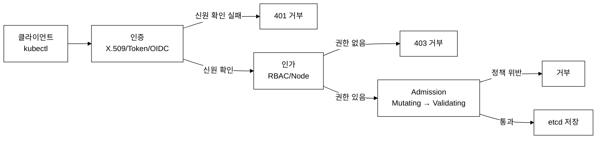

# KCSA Day 10: 종합 모의시험 50문제, 채점, 시험 전략

> **목표:** 종합 모의시험 50문제(축약판)로 전 범위를 점검하고, 약점 분석 및 시험 당일 전략을 수립한다.
> **이 모의시험 조건(축약판):** 50문항, 75분, 34문항(67%) 이상. **공식 KCSA 시험은 60문항·90분·67% 합격**(검토일 2026-06-15 기준)이므로, 실전 감각을 위해 90분으로 시간을 늘려 푸는 것을 권장한다.

---

## 0. KCSA 시험의 등장 배경

**기존 방식의 한계:** Kubernetes 보안 관련 인증이 CKS(Certified Kubernetes Security Specialist) 하나뿐이었다. CKS는 실습 기반의 고급 시험으로 진입 장벽이 높았다.

- CKS는 CKA 합격이 전제 조건이므로 보안 전문 인력이 접근하기 어렵다
- 보안 아키텍트, 관리자, 의사결정자에게는 개념적 이해가 더 중요하다
- 클라우드 네이티브 보안의 전체 그림(프레임워크, 도구, 프로세스)을 포괄하는 인증이 부재했다

**해결:** KCSA(Kubernetes and Cloud Native Security Associate)는 개념 기반 시험으로, 4C 모델, STRIDE, MITRE ATT&CK, CIS Benchmark, NIST CSF 등 보안 프레임워크와 도구의 이해도를 측정한다. 공식 시험은 객관식 60문항, 90분, 67% 합격이다(검토일 2026-06-15 기준, 응시 직전 공식 페이지 재확인). 아래 모의시험은 이를 50문항으로 축약한 연습판이다.

## 1. 종합 모의시험 (50문항 축약판 · 공식은 60문항/90분)

> **도메인 배분:** Overview 7문제 / Cluster 11문제 / Fundamentals 11문제 / Threat 8문제 / Platform 8문제 / Compliance 5문제

> **이 파일의 위치:** day10은 day 1~9 전 범위의 종합 검증이다. 각 문제에 `(→ Day N)` 형태로 해당 개념이 처음 등장한 일자를 표시한다. 특정 문제가 어렵다면 해당 Day 문서를 먼저 복습하고 돌아온다.

---

### [Overview] 핵심 용어 정의

> 이 섹션을 처음 보는 경우 아래 용어를 먼저 읽는다.

- **4C 모델**: 클라우드 네이티브 보안의 4개 계층 — Cloud(클라우드 인프라·물리 보안), Cluster(Kubernetes API Server·RBAC·Admission), Container(컨테이너 런타임·이미지), Code(소스코드·의존성). 안쪽 계층은 바깥 계층이 안전해야 의미가 있다.
- **NetworkPolicy**: Kubernetes 오브젝트로, Pod 간 L3/L4(IP/포트) 트래픽을 화이트리스트 방식으로 제어한다. CNI(Container Network Interface, 컨테이너 네트워크 플러그인) 플러그인이 구현을 담당한다.
- **Zero Trust**: "신뢰하지 않고, 항상 검증한다(Never trust, always verify)"는 보안 원칙. 내부 네트워크라도 기본 차단(Deny All)하고 명시적 허용만 통과시킨다.
- **STRIDE**: Microsoft가 정의한 위협 분류 — Spoofing(신원 위장), Tampering(데이터 변조), Repudiation(행위 부인), Information Disclosure(정보 노출), Denial of Service(서비스 거부), Elevation of Privilege(권한 상승).
- **SBOM(Software Bill of Materials)**: 소프트웨어를 구성하는 컴포넌트·라이브러리·버전 목록. 공급망 공격 대응에 사용된다.
- **Defense in Depth(다층 방어)**: 보안 계층을 여러 겹으로 배치해 한 계층이 뚫려도 다음 계층이 공격을 막는 원칙. 4C 모델(Cloud→Cluster→Container→Code)은 이 원칙의 구체적 구현이다. 단일 계층에 의존하면 그 계층이 실패하는 순간 전체가 무너진다는 교훈에서 출발했다.

---

### [Overview] 문제 1. (→ Day 1)
4C 보안 모델에서 Kubernetes RBAC가 속하는 계층은?

A) Cloud
B) Cluster
C) Container
D) Code

<details><summary>정답</summary>

**B) Cluster** — RBAC, NetworkPolicy, Admission Control은 Cluster 계층이다. 4C 모델에서 Cluster 계층은 Cloud(물리·인프라) 위에 있으며, Kubernetes API 수준의 접근 제어 전체를 포괄한다. Cloud 계층이 뚫리면 Cluster 계층 보안도 무의미해지므로 계층 순서가 중요하다.

</details>

### [Overview] 문제 2. (→ Day 1)
STRIDE 위협 모델에서 감사 로그가 없어서 리소스 삭제 행위를 부인하는 것은?

A) Spoofing
B) Tampering
C) Repudiation
D) Information Disclosure

<details><summary>정답</summary>

**C) Repudiation** — 행위를 부인하는 것. Audit Logging으로 대응한다. 감사 로그가 없으면 "내가 삭제하지 않았다"고 주장해도 반증할 수 없다. Kubernetes Audit Policy가 이 위협을 다루는 기술이다.

</details>

### [Overview] 문제 3. (→ Day 1)
Zero Trust의 네트워크 기본 정책은?

A) Allow All
B) Deny All (명시적 허용만 통과)
C) 내부 네트워크는 허용
D) VPN 연결만 허용

<details><summary>정답</summary>

**B) Deny All** — "Never trust, always verify". default-deny NetworkPolicy가 구현한다. 기존 경계 보안 모델은 내부 네트워크를 신뢰했지만, 내부 침해 시 횡적 이동(Lateral Movement)을 막을 수 없었다. Zero Trust는 이 한계를 극복하기 위해 내부 트래픽도 전부 명시적으로 허용해야 통과된다.

</details>

### [Overview] 문제 4. (→ Day 1)
SBOM의 주요 형식이 아닌 것은?

A) SPDX
B) CycloneDX
C) YAML
D) 둘 다 아님

<details><summary>정답</summary>

**C) YAML** — SBOM 형식은 SPDX(Linux Foundation)와 CycloneDX(OWASP)이다. YAML은 일반 데이터 직렬화 형식이며 SBOM 표준이 아니다. SPDX는 소프트웨어 패키지 데이터 교환(Software Package Data Exchange)의 약자로 Linux Foundation이 관리하고, CycloneDX는 OWASP(Open Web Application Security Project)가 주도한다.

</details>

### [Overview] 문제 5. (→ Day 1)
Shift Left에서 CI/CD에 통합하는 보안 활동이 아닌 것은?

A) 이미지 취약점 스캐닝
B) SAST
C) 프로덕션 서버 물리적 보안 점검
D) 의존성 취약점 분석

<details><summary>정답</summary>

**C) 물리적 보안 점검** — CI/CD에 통합할 수 없는 활동이다. Shift Left는 보안 검증을 개발 초기(왼쪽 타임라인)로 당기는 원칙이다. 이미지 취약점 스캐닝(Trivy), SAST(정적 코드 분석), 의존성 분석은 자동화 파이프라인에 삽입할 수 있지만, 물리적 서버 보안은 운영팀이 현장에서 수행하는 활동이므로 CI/CD 범위 밖이다.

</details>

### [Overview] 문제 6. (→ Day 1)
CNCF Security TAG의 역할이 아닌 것은?

A) 보안 백서 발행
B) 프로젝트 보안 감사
C) Kubernetes 릴리스 관리
D) 공급망 보안 가이드

<details><summary>정답</summary>

**C) Kubernetes 릴리스 관리** — SIG Release의 역할이다. CNCF Security TAG(Technical Advisory Group)는 보안 백서 작성, 프로젝트 보안 감사, 공급망 보안 가이드를 담당하지만 Kubernetes 버전 출시 자체는 SIG Release(Special Interest Group for Releases)가 관리한다.

</details>

### [Overview] 문제 7. (→ Day 1)
공유 책임 모델에서 클라우드 제공자의 책임은?

A) RBAC 설정
B) NetworkPolicy 설정
C) 데이터센터 물리적 보안
D) 이미지 스캐닝

<details><summary>정답</summary>

**C) 데이터센터 물리적 보안** — 인프라 수준의 물리적 보안은 클라우드 제공자 책임이다. 공유 책임 모델에서 클라우드 제공자는 물리적 데이터센터, 네트워크 인프라, 하이퍼바이저를 책임지고, 사용자는 그 위에서 실행되는 RBAC 설정, NetworkPolicy, 이미지 보안 등을 책임진다.

</details>

---

### [Cluster] 핵심 용어 정의

> Cluster 섹션(문제 8~18)에 처음 등장하는 개념을 정리한다.

- **인증(Authentication)**: 요청자가 누구인지 확인. X.509 클라이언트 인증서, Bearer 토큰, OIDC 등의 방법을 사용한다. X.509는 ITU-T 표준 공개키 인증서 형식으로, TLS에서 신원 증명에 사용된다.
- **인가(Authorization)**: 인증된 사용자가 무엇을 할 수 있는지 결정. RBAC(Role-Based Access Control, 역할 기반 접근 제어)가 대표 구현이다. 이전 방식인 ABAC(Attribute-Based Access Control)는 정책 파일을 직접 편집해야 해서 관리가 어려웠다.
- **Admission Control**: 인가를 통과한 요청이 etcd에 저장되기 전에 검증·변조하는 단계. Mutating(내용 수정)과 Validating(검증 후 거부) 두 종류가 있다.
- **Encryption at Rest**: etcd에 저장되는 데이터(Secret 등)를 암호화하는 기능. 미설정 시 Secret이 Base64 인코딩 상태로 etcd 파일에 저장된다.
- **KMS(Key Management Service)**: 암호화 키를 별도 외부 서비스에서 관리하는 방식. kms v2는 K8s 1.27+에서 권장되는 Encryption at Rest 프로바이더다.
- **mTLS(mutual TLS, 상호 TLS)**: 일반 TLS는 클라이언트가 서버 인증서만 검증하지만, mTLS는 서버도 클라이언트 인증서를 검증한다. TLS handshake(연결 초기의 인증서 교환·암호화 협상 과정) 시 양쪽이 상대방 인증서를 확인한다.
- **Static Pod**: kubelet이 API Server를 거치지 않고 `/etc/kubernetes/manifests/` 디렉터리의 YAML을 직접 읽어 실행하는 Pod. control-plane 구성요소(kube-apiserver, etcd 등)가 이 방식으로 동작한다.

---

### [Cluster] 개념 지도: API Server 요청 흐름



_그림 1. API Server 요청 처리 순서. 인증 없는 요청은 인가 단계에 도달할 수 없다._

> **핵심**: 이 순서를 지키는 이유는 비용이다. 인증(신원 확인)이 가장 싸고, 인가·Admission은 상대적으로 비싸다. 신원 불명 요청은 가장 앞에서 잘라낸다.

---

### [Cluster] 문제 8. (→ Day 2)
API Server의 요청 처리 순서는?

A) 인증 → Admission → 인가
B) 인가 → 인증 → Admission
C) 인증 → 인가 → Admission
D) Admission → 인증 → 인가

<details><summary>정답</summary>

**C) 인증 → 인가 → Admission** — 순서를 지켜야 하는 이유는 불필요한 처리를 최소화하기 위해서다. 미인가 사용자가 API를 호출해도 인증 단계에서 먼저 신원을 확인하고, 신원이 확인된 후 권한을 검증하고, 권한이 있을 때만 Admission 정책까지 실행한다.

</details>

### [Cluster] 문제 9. (→ Day 2)
API Server에서 권장하는 authorization-mode는?

A) AlwaysAllow
B) Node,RBAC
C) ABAC
D) AlwaysDeny

<details><summary>정답</summary>

**B) Node,RBAC** — Node는 kubelet 접근 제한, RBAC는 역할 기반 제어다. AlwaysAllow는 모든 요청을 허용하므로 프로덕션에서 사용하면 안 된다. ABAC(Attribute-Based Access Control)는 정책 파일을 직접 편집해야 해서 Kubernetes 환경에서는 RBAC보다 관리가 어렵다. Node,RBAC 조합은 문제 19번(RBAC ClusterRole)과 연결되는 개념이다.

</details>

### [Cluster] 문제 10. (→ Day 2)
etcd의 Encryption at Rest에서 프로덕션에 가장 권장되는 프로바이더는?

A) identity
B) aescbc
C) kms v2
D) aesgcm

<details><summary>정답</summary>

**C) kms v2** — 외부 KMS(Key Management Service)로 키를 관리하므로 가장 안전하다. kms v2는 K8s 1.27+에서 안정화된 프로바이더다(기존 프로덕션은 aescbc/aesgcm을 사용하는 경우도 있다). identity는 암호화 없음, aescbc/aesgcm은 키가 API Server 설정 파일에 저장되어 노드가 침해되면 키도 노출된다. kms v2는 키 자체를 외부 시스템(AWS KMS, HashiCorp Vault 등)이 관리하므로 노드 침해 시에도 키를 보호할 수 있다. 이 문제의 핵심은 Encryption at Rest(저장 데이터 암호화) 개념이다. etcd에 저장된 Secret은 기본값에서 Base64 인코딩 상태(평문)이므로 Encryption at Rest를 반드시 설정해야 한다(→ 문제 22 참조).

</details>

### [Cluster] 문제 11. (→ Day 2)
kubelet의 읽기 전용 포트를 비활성화하는 설정은?

A) --read-only-port=10255
B) --read-only-port=0
C) --disable-read-only-port
D) --read-only-port=false

<details><summary>정답</summary>

**B) --read-only-port=0** — 0으로 설정하면 비활성화된다. kubelet의 기본 읽기 전용 포트 10255는 인증 없이 Pod·노드 정보를 조회할 수 있어 정보 노출 위험이 있다. 0으로 설정하면 해당 포트가 비활성화된다.

</details>

### [Cluster] 문제 12. (→ Day 2)
Admission Controller의 실행 순서는?

A) Validating → Mutating
B) Mutating → Validating
C) 동시 병렬
D) 랜덤

<details><summary>정답</summary>

**B) Mutating → Validating** — Mutating에서 수정 후 Validating에서 검증한다. 순서가 반대가 되면 Validating이 검증한 내용을 Mutating이 나중에 수정해서 검증 결과가 무효가 될 수 있다. Mutating Webhook은 기본값 주입(예: 리소스 제한 자동 추가), Validating Webhook은 정책 위반 요청 거부에 사용된다.

</details>

### [Cluster] 문제 13. (→ Day 2)
NodeRestriction admission controller의 역할은?

A) 노드 CPU 제한
B) kubelet이 자신의 노드/Pod만 수정 가능하도록 제한
C) 새 노드 참여 제한
D) 노드 간 트래픽 제한

<details><summary>정답</summary>

**B) kubelet이 자신의 노드/Pod만 수정 가능하도록 제한** — NodeRestriction Admission Controller는 kubelet이 자신이 실행 중인 노드와 그 노드의 Pod 이외의 리소스를 수정하지 못하도록 막는다. 이를 통해 노드 하나가 침해되어도 다른 노드의 리소스를 탈취하지 못하게 격리한다.

</details>

### [Cluster] 문제 14. (→ Day 2)
kubeadm 클러스터에서 인증서가 저장되는 기본 디렉토리는?

A) /var/lib/kubelet/pki/
B) /etc/kubernetes/pki/
C) /opt/kubernetes/certs/
D) ~/.kube/certs/

<details><summary>정답</summary>

**B) /etc/kubernetes/pki/** — kubeadm으로 생성한 클러스터의 기본 인증서 경로다. CA 인증서, API Server 인증서, etcd 인증서 등이 이 디렉터리에 저장된다.

</details>

### [Cluster] 문제 15. (→ Day 3)
API Server와 etcd 사이의 TLS 유형은?

A) 단방향 TLS
B) mTLS (상호 TLS)
C) 평문
D) SSH

<details><summary>정답</summary>

**B) mTLS(mutual TLS, 상호 TLS)** — 양쪽 모두 상대방의 인증서를 검증한다. TLS handshake 과정에서 API Server와 etcd 모두 X.509 클라이언트 인증서를 제시하고 상대방이 신뢰하는 CA가 서명한 인증서인지 확인한다. 단방향 TLS는 클라이언트가 서버만 검증하므로, etcd처럼 민감한 데이터를 저장하는 컴포넌트는 mTLS로 보호해야 한다.

</details>

### [Cluster] 문제 16. (→ Day 3)
Kubernetes 인증서 기본 유효 기간은?

A) 인증서 1년, CA 1년
B) 인증서 1년, CA 10년
C) 인증서 10년, CA 10년
D) 인증서 90일, CA 1년

<details><summary>정답</summary>

**B) 인증서 1년, CA 10년** — kubeadm이 생성하는 클라이언트 인증서(kubelet, API Server 등)의 기본 유효 기간은 1년이다. CA(Certificate Authority, 인증 기관) 인증서는 10년이다. 인증서가 만료되면 클러스터 통신이 끊기므로 `kubeadm certs renew all`로 갱신한다.

</details>

### [Cluster] 문제 17. (→ Day 3)
Static Pod의 보안 특성으로 올바른 것은?

A) API Server의 Admission Control이 완전히 적용된다
B) kubelet이 직접 관리하며 Admission Control이 적용되지 않을 수 있다
C) etcd에 직접 저장된다
D) RBAC로 삭제 가능하다

<details><summary>정답</summary>

**B) kubelet이 직접 관리하며 Admission Control이 적용되지 않을 수 있다** — Static Pod는 kubelet이 노드의 특정 디렉터리(`/etc/kubernetes/manifests/`)를 감시하다 YAML 파일이 생기면 API Server를 거치지 않고 직접 실행한다. API Server를 우회하므로 PSA(Pod Security Admission) 같은 Admission Controller의 검증을 받지 않는다. kube-apiserver, kube-controller-manager, kube-scheduler, etcd가 Static Pod로 동작하는 이유도 이 때문이다 — API Server가 꺼져 있어도 이 Pod들은 동작해야 한다.

</details>

### [Cluster] 문제 18. (→ Day 3)
EncryptionConfiguration에서 providers 순서의 의미는?

A) 순서 무관
B) 첫 번째로 새 데이터 암호화, 나머지는 기존 데이터 복호화
C) 마지막으로 새 데이터 암호화
D) 모든 프로바이더로 중복 암호화

<details><summary>정답</summary>

**B) 첫 번째로 새 데이터 암호화, 나머지는 기존 데이터 복호화** — EncryptionConfiguration의 providers 배열에서 첫 번째 항목이 신규 쓰기에 사용되고, 나머지는 기존 데이터 읽기(복호화)에 사용된다. 프로바이더를 교체할 때는 이 순서를 활용해서 기존 데이터를 점진적으로 재암호화한다.

</details>

---

### [Fundamentals] 핵심 용어 정의

> Fundamentals 섹션(문제 19~29)에 처음 등장하는 개념을 정리한다.

- **RBAC(Role-Based Access Control, 역할 기반 접근 제어)**: 사용자·서비스어카운트에 역할(Role/ClusterRole)을 부여하고 역할에 허용된 동작(verb: get/list/create 등)을 정의하는 Kubernetes 인가 메커니즘. 이전의 ABAC는 정책 파일을 직접 수정해야 했지만 RBAC는 Kubernetes 오브젝트로 관리할 수 있다.
- **ClusterRole / Role**: ClusterRole은 클러스터 전체 범위, Role은 네임스페이스 범위의 권한 정의다. ClusterRoleBinding으로 ClusterRole을 바인딩하면 클러스터 전체에 적용되고, RoleBinding으로 ClusterRole을 바인딩하면 해당 네임스페이스에서만 적용된다.
- **PSA(Pod Security Admission)**: Pod가 특정 보안 수준(Privileged/Baseline/Restricted)을 준수하는지 검증하는 내장 Admission Controller. K8s 1.25에서 PSP(PodSecurityPolicy, 별도 리소스로 정책을 관리했으나 설정이 복잡하고 실수가 많았던 이전 방식)를 대체했다.
- **PSS(Pod Security Standards)**: PSA가 검증하는 보안 수준의 기준 집합. Privileged(제한 없음) > Baseline(최소 제한) > Restricted(엄격한 제한) 세 단계다.
- **NetworkPolicy**: Pod 간 L3(IP)/L4(포트) 트래픽을 제어하는 Kubernetes 오브젝트. 구현은 CNI 플러그인(Cilium, Calico 등)이 담당한다. Flannel은 오버레이 네트워킹만 제공하며 NetworkPolicy 구현 엔진을 포함하지 않는다.
- **Bound ServiceAccount Token**: K8s 1.21+에서 기본 사용되는 만료 시간이 있는 토큰. 기존 영구 ServiceAccount 토큰은 만료 없이 영구 유효해서 탈취 시 무기한 악용 가능했다. Bound Token은 특정 Pod·audience에 바인딩되고 만료되므로 탈취 피해를 최소화한다.

---

### [Fundamentals] 문제 19. (→ Day 4)
RBAC에서 ClusterRole을 RoleBinding으로 바인딩하면?

A) 클러스터 전체 적용
B) 해당 네임스페이스에서만 적용
C) 바인딩 실패
D) 자동 변환

<details><summary>정답</summary>

**B) 해당 네임스페이스에서만 적용** — ClusterRole 재사용의 유용한 패턴이다. ClusterRole은 클러스터 전체 리소스에 대한 권한을 정의하지만, RoleBinding(클러스터 범위가 아닌 네임스페이스 범위 바인딩)으로 연결하면 그 네임스페이스에서만 동작한다. 이 메커니즘은 문제 9의 `authorization-mode: Node,RBAC`와 연결된다. API Server가 Node,RBAC 모드일 때 kubelet은 자신의 노드 관련 ClusterRole을 가지고 있고, RoleBinding 없이 ClusterRoleBinding으로 연결되어 클러스터 전체에 적용된다.

</details>

### [Fundamentals] 문제 20. (→ Day 4)
PSS Restricted 필수 요구사항이 아닌 것은?

A) runAsNonRoot: true
B) allowPrivilegeEscalation: false
C) readOnlyRootFilesystem: true
D) capabilities.drop: ["ALL"]

<details><summary>정답</summary>

**C) readOnlyRootFilesystem** — 모범 사례이지만 PSS Restricted 필수 요구사항이 아니다. 그 이유는 많은 컨테이너가 `/tmp`나 `emptyDir`에 로그·임시 파일을 쓰는데, 루트 파일시스템을 읽기 전용으로 설정하면 이런 컨테이너가 정상 동작하지 않을 수 있기 때문이다. 운영상 필요한 쓰기 경로가 있으면 적용이 불가능하므로 PSS는 이를 선택적 모범 사례로 분류했다. runAsNonRoot, allowPrivilegeEscalation: false, capabilities.drop: ["ALL"]은 실제 Restricted 필수 항목이다.

</details>

### [Fundamentals] 문제 21. (→ Day 4)
NetworkPolicy에서 podSelector: {}의 의미는?

A) Pod 없음
B) 모든 Pod
C) 라벨 없는 Pod만
D) default NS만

<details><summary>정답</summary>

**B) 모든 Pod** — 빈 셀렉터(`{}`)는 모든 것을 선택한다. NetworkPolicy에서 `podSelector: {}`는 해당 네임스페이스의 모든 Pod에 정책을 적용한다는 의미다. default-deny 정책을 만들 때 이 패턴을 사용한다: `podSelector: {}`(모든 Pod 대상) + `policyTypes: [Ingress, Egress]`(모든 방향 차단) + 아무 규칙도 없음.

</details>

### [Fundamentals] 문제 22. (→ Day 4)
Secret의 기본 저장 방식은?

A) AES-256 암호화
B) Base64 인코딩 (평문)
C) Vault 자동 저장
D) 노드 로컬 파일

<details><summary>정답</summary>

**B) Base64 인코딩(평문)** — 암호화가 아닌 인코딩이다. Base64 인코딩은 단순히 바이너리 데이터를 ASCII 문자열로 변환하는 것으로 암호화가 아니다. 따라서 Encryption at Rest를 설정하지 않으면 etcd 데이터베이스 파일에 접근하는 사람은 누구나 Secret 내용을 읽을 수 있다(`echo "dXNlcjpwYXNz" | base64 -d`처럼 즉시 디코딩 가능). etcd 파일은 기본적으로 `/var/lib/etcd/`에 저장되므로 노드 root 권한을 얻으면 Secret 전체를 탈취할 수 있다.

</details>

### [Fundamentals] 문제 23. (→ Day 5)
automountServiceAccountToken: false를 설정하는 경우는?

A) 모든 Pod
B) API Server 접근이 불필요한 Pod
C) 관리자 Pod만
D) DaemonSet만

<details><summary>정답</summary>

**B) API Server 접근이 불필요한 Pod** — 불필요한 토큰은 탈취 위험을 높인다. ServiceAccount 토큰은 Pod 내 `/run/secrets/kubernetes.io/serviceaccount/token`에 파일로 마운트된다. Pod가 침해되면 공격자가 이 파일을 읽어서 API Server에 인증 요청을 보낼 수 있다. 웹 서버, 데이터 처리 워커 등 API Server를 호출할 필요가 없는 Pod는 `automountServiceAccountToken: false`를 설정해 토큰 마운트 자체를 막는다.

</details>

### [Fundamentals] 문제 24. (→ Day 5)
NetworkPolicy의 같은 from 항목 내 셀렉터 관계는?

A) OR
B) AND
C) XOR
D) 무관

<details><summary>정답</summary>

**B) AND** — 같은 항목 내 셀렉터는 AND(모두 만족), 별도 항목은 OR(하나라도 만족)이다. 예를 들어 `from` 배열에 하나의 항목 안에 `podSelector`와 `namespaceSelector`를 함께 쓰면 "그 네임스페이스의 그 Pod"를 의미한다(AND). 반면 두 항목으로 분리하면 "그 네임스페이스의 모든 Pod, 또는 클러스터 전체에서 그 라벨의 Pod"를 의미한다(OR). 시험에서 자주 나오는 함정이다.

</details>

### [Fundamentals] 문제 25. (→ Day 5)
Bound ServiceAccount Token의 특성이 아닌 것은?

A) 만료 시간 있음
B) audience 제한
C) Pod 삭제 시 무효
D) 영구 유효

<details><summary>정답</summary>

**D) 영구 유효** — Bound Token은 시간 제한이 있다. 기존 영구 SA 토큰(K8s 1.24 이전 기본 방식)은 Secret 오브젝트로 생성되어 만료 없이 영구 유효했다. 이는 토큰이 유출되면 영원히 악용될 수 있다는 심각한 문제가 있었다. K8s 1.21+의 Bound ServiceAccount Token은 만료 시간, audience 제한(특정 API에만 사용 가능), Pod 바인딩(Pod 삭제 시 무효)을 갖추어 이 한계를 해결했다.

</details>

### [Fundamentals] 문제 26. (→ Day 5)
Secret 전달 시 더 안전한 방법은?

A) 환경 변수
B) Volume 마운트
C) 동일
D) ConfigMap

<details><summary>정답</summary>

**B) Volume 마운트** — 환경 변수는 로그/프로세스에 노출될 수 있다. 환경 변수는 `kubectl describe pod`, 애플리케이션 에러 로그, 프로세스 목록(`/proc/<pid>/environ`)에서 노출될 수 있다. Volume 마운트는 파일 시스템으로 전달되므로 로그에 자동으로 남지 않고 파일 권한 제어가 가능하다. 단, Volume 마운트도 컨테이너 탈출 시에는 노출될 수 있으므로 완전한 보호는 Encryption at Rest + Vault와 같은 외부 비밀 관리 도구가 필요하다.

</details>

### [Fundamentals] 문제 27. (→ Day 5)
PSS Restricted에서 추가 가능한 유일한 capability는?

A) NET_ADMIN
B) SYS_PTRACE
C) NET_BIND_SERVICE
D) SYS_ADMIN

<details><summary>정답</summary>

**C) NET_BIND_SERVICE** — 1024 미만 포트 바인딩에 필요하다. PSS Restricted는 `capabilities.drop: ["ALL"]`로 모든 Linux 커널 Capability를 제거하고, 1024 미만 포트(HTTP 80, HTTPS 443 등)에 바인딩이 필요한 컨테이너를 위해 NET_BIND_SERVICE만 예외적으로 추가할 수 있다. NET_ADMIN, SYS_ADMIN 등은 Restricted에서 허용하지 않는다.

</details>

### [Fundamentals] 문제 28. (→ Day 5)
Flannel CNI의 NetworkPolicy 지원은?

A) 완전 지원
B) 부분 지원
C) 미지원
D) L7 지원

<details><summary>정답</summary>

**C) 미지원** — Flannel은 오버레이 네트워킹(Pod 간 IP 라우팅)만 제공하며 NetworkPolicy 구현 엔진을 포함하지 않는다. CNI(Container Network Interface)는 네트워크 연결 자체의 표준이고, NetworkPolicy 구현은 CNI 플러그인이 추가로 지원하는 기능이다. Cilium(eBPF 기반, eBPF는 Linux 커널에서 안전하게 프로그램을 실행하는 기술)과 Calico는 NetworkPolicy를 구현하는 정책 엔진을 포함한다. Flannel만 설치된 클러스터에서 NetworkPolicy 오브젝트를 생성해도 아무 효과가 없다.

</details>

### [Fundamentals] 문제 29. (→ Day 5)
RBAC에서 escalate verb의 위험성은?

A) Pod 삭제
B) Role 권한 상승 가능
C) Secret 읽기
D) NS 삭제

<details><summary>정답</summary>

**B) Role 권한 상승 가능** — escalate verb를 가진 사용자는 자신의 현재 권한 범위를 초과하는 Role을 만들어 자신에게 바인딩할 수 있다. 예를 들어 Role에 대한 create/update 권한만 있어도 escalate가 없으면 현재 자신이 가진 것 이상의 권한을 Role에 추가할 수 없다. bind verb도 위험하다 — 자신이 가지지 않은 권한을 다른 주체에게 바인딩할 수 있다.

</details>

---

### [Threat] 핵심 용어 정의

> Threat 섹션(문제 30~37)에 처음 등장하는 개념을 정리한다.

- **MITRE ATT&CK for Containers**: 공격자가 컨테이너·Kubernetes 환경을 침해하는 전술(Tactic)과 기법(Technique)을 분류한 프레임워크. Initial Access → Execution → Persistence → Privilege Escalation → Defense Evasion → Credential Access → Discovery → Lateral Movement → Impact 순서로 공격이 진행된다. 문제 30-37에서 다루지 않은 5개 전술의 Kubernetes 구현 예시는 다음과 같다:
  - **Privilege Escalation(권한 상승)**: RBAC escalate/bind verb를 통해 현재 권한보다 높은 ClusterRole을 자신에게 바인딩하거나, PSP(PodSecurityPolicy) 우회로 privileged 컨테이너를 실행한다.
  - **Defense Evasion(탐지 회피)**: 감사 로그를 남기지 않기 위해 API Server를 통하지 않고 etcd에 직접 접근하거나, Falco 규칙이 없는 syscall만 사용하는 방식으로 탐지를 회피한다.
  - **Discovery(정보 수집)**: 침해된 Pod 내부에서 `kubectl get secrets --all-namespaces` 또는 ServiceAccount 토큰을 이용해 API Server에 질의해 클러스터 구조·리소스·자격증명을 파악한다.
  - **Lateral Movement(횡적 이동)**: 침해된 Pod의 ServiceAccount 토큰으로 다른 네임스페이스의 Pod에 `exec`하거나, NetworkPolicy가 없는 클러스터에서 내부 서비스 IP를 직접 호출해 다른 워크로드로 이동한다.
  - **Impact(영향)**: 암호화폐 채굴(cryptomining) Pod를 대규모 배포해 클러스터 자원을 고갈시키거나, etcd 데이터를 삭제해 클러스터 전체를 복구 불가 상태로 만든다.
- **SLSA(Supply chain Levels for Software Artifacts)**: 소프트웨어 공급망 보안 수준을 4단계(L1~L4)로 정의하는 프레임워크. SolarWinds 공급망 공격(2020년) 이후 구글이 주도하여 제안되었다.
- **IMDS(Instance Metadata Service)**: 클라우드 VM 내부에서 `169.254.169.254` IP로 접근하는 메타데이터 서비스. AWS의 경우 IAM 역할 자격 증명이 여기서 제공된다. Pod에서 이 주소에 접근하면 클라우드 계정 권한을 탈취할 수 있다.
- **Falco**: CNCF 프로젝트. Linux 시스템 콜(syscall)을 실시간 모니터링해 컨테이너 런타임에서 비정상 행위를 탐지한다. 코드의 취약점(SAST/DAST 영역)은 탐지하지 못한다.
- **seccomp(Secure Computing Mode)**: Linux 커널 기능으로, 컨테이너가 호출할 수 있는 시스템 콜을 허용 목록으로 제한한다. 컨테이너 탈출에 필요한 위험한 syscall(예: ptrace, mount)을 차단한다.
- **gVisor / Kata Containers**: 컨테이너 격리를 강화하는 런타임. gVisor는 사용자 공간에서 게스트 커널을 구현해 호스트 커널 접근을 차단하고, Kata Containers는 경량 VM 내에서 컨테이너를 실행해 하드웨어 가상화로 격리한다.

---

### [Threat] 문제 30. (→ Day 6)
MITRE ATT&CK에서 kubectl exec로 명령 실행은?

A) Initial Access
B) Execution
C) Persistence
D) Discovery

<details><summary>정답</summary>

**B) Execution** — kubectl exec를 통해 실행 중인 Pod에 접속해 명령을 실행하는 것은 MITRE ATT&CK에서 Execution(실행) 전술에 해당한다. 공격자가 이미 API Server 접근 권한을 획득한(Initial Access) 후 다음 단계로 명령을 실행하는 시나리오다. Falco는 `exec_bin`·`shell_in_container` 규칙으로 이 행위를 탐지할 수 있다.

</details>

### [Threat] 문제 31. (→ Day 6)
SLSA Level 2에서 요구하는 것은?

A) 문서화
B) 서명된 출처 증명
C) 격리 빌드
D) 2인 검토

<details><summary>정답</summary>

**B) 서명된 출처 증명** — SLSA L1은 빌드 과정 문서화, L2는 빌드 출처(provenance)에 디지털 서명, L3는 빌드 환경 격리(다른 빌드가 오염하지 못하도록), L4는 2인 검토다. 서명이 있으면 "이 이미지가 특정 소스 코드에서 특정 빌드 시스템이 만든 것"임을 위변조 없이 검증할 수 있다. SolarWinds 공격처럼 빌드 시스템을 침해해 악성 코드를 주입하는 공급망 공격을 방어하는 것이 목적이다.

</details>

### [Threat] 문제 32. (→ Day 6)
hostPath 볼륨 마운트의 위험은?

A) 디스크 부족
B) 호스트 파일시스템 접근으로 컨테이너 탈출 가능
C) 네트워크 저하
D) 스케줄링 지연

<details><summary>정답</summary>

**B) 호스트 파일시스템 접근으로 컨테이너 탈출 가능** — hostPath로 `/etc`, `/var/run/docker.sock`, `/proc` 등 민감 경로를 마운트하면 컨테이너 격리가 무력화된다. `/var/run/docker.sock`을 마운트하면 Docker 데몬에 직접 명령을 보내 새 컨테이너를 privileged 모드로 실행할 수 있고, 이를 통해 호스트 파일시스템 전체에 접근할 수 있다.

</details>

### [Threat] 문제 33. (→ Day 7)
Falco가 탐지할 수 없는 것은?

A) 컨테이너 내 쉘 실행
B) 민감 파일 접근
C) 코드의 SQL Injection 취약점
D) 예상치 못한 네트워크 연결

<details><summary>정답</summary>

**C) SQL Injection 취약점** — Falco는 런타임 행위 모니터링 도구로, syscall 수준에서 "무엇이 실행되는가"를 감시한다. SQL Injection은 코드 로직의 취약점이므로 SAST(정적 코드 분석) 도구가 탐지해야 한다. Falco가 탐지할 수 있는 것은 "컨테이너 내에서 /bin/bash가 실행됨", "민감 파일(/etc/shadow)이 열림", "예상치 못한 외부 IP로 TCP 연결" 등 OS 레벨 이벤트다.

</details>

### [Threat] 문제 34. (→ Day 7)
169.254.169.254 접근은 MITRE ATT&CK의 어떤 전술?

A) Execution
B) Credential Access
C) Impact
D) Persistence

<details><summary>정답</summary>

**B) Credential Access** — 클라우드 IAM 자격 증명 탈취다. `169.254.169.254`는 IMDS(Instance Metadata Service) 주소로, AWS/GCP/Azure 등 모든 주요 클라우드에서 VM 내부에서만 접근 가능한 메타데이터 서비스다. 이 주소에서 IAM 역할 토큰을 가져오면 클라우드 API에 접근할 수 있어 Kubernetes 클러스터를 벗어난 클라우드 전체 피해로 이어질 수 있다. 대응책은 NetworkPolicy로 `169.254.169.254`로의 egress를 차단하거나, IMDSv2(토큰 기반 접근)를 강제하는 것이다.

</details>

### [Threat] 문제 35. (→ Day 7)
컨테이너 격리를 강화하는 기술이 아닌 것은?

A) gVisor
B) Kata Containers
C) Docker Compose
D) seccomp

<details><summary>정답</summary>

**C) Docker Compose** — 조합 도구이지 격리 기술이 아니다. gVisor는 사용자 공간에서 게스트 커널을 구현해 호스트 커널 syscall을 차단하고, Kata Containers는 경량 VM 내에서 컨테이너를 실행한다. seccomp(Secure Computing Mode)는 Linux 커널 기능으로 허용할 syscall 목록을 지정해 컨테이너가 위험한 커널 기능을 호출하지 못하게 막는다. Docker Compose는 다중 컨테이너를 함께 실행하기 위한 설정 도구일 뿐이다.

</details>

### [Threat] 문제 36. (→ Day 7)
privileged: true의 위험성은?

A) 메모리 증가
B) 호스트의 모든 디바이스 접근 가능, 컨테이너 탈출 용이
C) 네트워크 지연
D) 로그 증가

<details><summary>정답</summary>

**B) 호스트의 모든 디바이스 접근 가능, 컨테이너 탈출 용이** — `privileged: true`는 컨테이너에 호스트 커널의 모든 Linux Capability를 부여하고 `/dev`의 모든 디바이스에 접근할 수 있게 한다. 사실상 컨테이너 격리를 해제하는 것과 같으며, `nsenter --target 1 --mount --uts --ipc --net --pid`로 컨테이너에서 호스트 네임스페이스로 탈출할 수 있다. Falco의 `privileged_containers` 규칙으로 탐지 가능하다.

</details>

### [Threat] 문제 37. (→ Day 7)
백도어 Pod를 배포하여 영구 접근을 유지하는 것은?

A) Execution
B) Persistence
C) Lateral Movement
D) Impact

<details><summary>정답</summary>

**B) Persistence** — 접근을 유지하기 위한 기술이다. 공격자가 초기 침해 경로(Initial Access)를 통해 들어온 후, 백도어 Pod를 배포해 접근을 영구화하는 전술이다. CronJob이나 DaemonSet을 이용한 백도어 배포도 같은 Persistence 전술이다. 대응책은 Audit Logging(누가 Pod를 생성했는지)과 Falco(의심스러운 Pod 실행 탐지)다.

</details>

---

### [Platform] 핵심 용어 정의

> Platform 섹션(문제 38~45)에 처음 등장하는 개념을 정리한다.

- **OPA/Gatekeeper(Open Policy Agent)**: Kubernetes용 정책 엔진. Rego 언어로 작성된 정책을 Validating Webhook으로 적용한다. ConstraintTemplate이 정책 로직을 정의하고, Constraint가 적용 대상과 파라미터를 지정한다. PSA보다 유연하지만 설정 복잡도가 높다.
- **CRI(Container Runtime Interface)**: Kubernetes와 컨테이너 런타임 사이의 표준 인터페이스. Docker는 CRI를 직접 구현하지 않아서 dockershim 중간 레이어가 필요했고 이 오버헤드 때문에 K8s 1.24에서 Docker 지원이 제거되었다. containerd, CRI-O가 CRI를 직접 구현한다.
- **RuntimeClass**: Pod에서 사용할 컨테이너 런타임을 지정하는 Kubernetes 오브젝트. gVisor(`runsc`), Kata Containers(`kata`) 등 격리 수준이 높은 런타임을 특정 Pod에만 적용할 때 사용한다.
- **Sigstore/cosign**: 컨테이너 이미지에 디지털 서명을 추가하고 검증하는 오픈소스 도구. 이미지 레지스트리에서 서명을 저장·조회해서 "이 이미지가 신뢰할 수 있는 소스에서 왔는지"를 배포 전에 검증할 수 있다.

---

### [Platform] 문제 38. (→ Day 7)
Kubernetes에서 Ingress TLS 종료(termination)가 발생하는 위치는?

A) Pod
B) Ingress Controller
C) kube-proxy
D) kubelet

<details><summary>정답</summary>

**B) Ingress Controller** — TLS handshake를 처리하고 인증서를 보유하며 클라이언트와의 암호화 연결을 종료(terminate)한다. 그 이후 트래픽은 클러스터 내부에서 평문으로 전달되거나(termination 모드), 백엔드 Service로 다시 암호화해서 전달한다(re-encrypt 모드). kube-proxy는 L4 로드밸런싱을 담당하며 TLS를 처리하지 않는다.

</details>

### [Platform] 문제 39. (→ Day 8)
OPA Gatekeeper의 ConstraintTemplate이 정의하는 것은?

A) RBAC 정책
B) Rego 기반 정책 로직 (매개변수화된 정책 템플릿)
C) NetworkPolicy 규칙
D) Pod 스케줄링 규칙

<details><summary>정답</summary>

**B) Rego 기반 정책 로직** — ConstraintTemplate은 OPA/Gatekeeper에서 정책의 재사용 가능한 로직 템플릿을 정의한다. Rego는 OPA의 정책 언어다. ConstraintTemplate으로 "컨테이너에 리소스 제한이 없으면 거부"라는 로직을 정의하면, Constraint 오브젝트에서 이 템플릿을 특정 네임스페이스나 리소스에 적용하고 파라미터를 주입한다.

</details>

### [Platform] 문제 40. (→ Day 8)
이미지 서명 검증에 사용되는 도구는?

A) Trivy
B) cosign (Sigstore)
C) kube-bench
D) Falco

<details><summary>정답</summary>

**B) cosign** — Sigstore 프로젝트의 이미지 서명·검증 도구다. Trivy는 이미지 내 OS 패키지·라이브러리의 취약점(CVE)을 스캔하고, cosign은 이미지 자체의 출처와 무결성을 서명으로 검증한다. kube-bench는 CIS Benchmark 점검 도구이고, Falco는 런타임 탐지다.

</details>

### [Platform] 문제 41. (→ Day 8)
컨테이너 이미지에서 distroless 이미지를 사용하는 이유는?

A) 빌드 속도 향상
B) 공격 표면 최소화 (쉘, 패키지 관리자 없음)
C) 디버깅 용이
D) 이미지 캐싱 향상

<details><summary>정답</summary>

**B) 공격 표면 최소화** — 쉘(`/bin/sh`), 패키지 관리자(`apt`, `yum`), curl 등이 없어 컨테이너 침해 후 공격자가 사용할 수 있는 도구가 없다. 컨테이너 탈출 공격의 다수는 쉘이나 내부 도구를 활용하므로, distroless 이미지는 이런 공격 경로를 원천 차단한다. 단점은 디버깅이 매우 어렵다는 점이다(별도 debug 컨테이너를 임시로 실행해야 한다).

</details>

### [Platform] 문제 42. (→ Day 8)
Kubernetes에서 ServiceAccount 토큰을 자동 마운트하지 않으려면?

A) RBAC에서 권한 제거
B) automountServiceAccountToken: false 설정
C) ServiceAccount 삭제
D) NetworkPolicy 적용

<details><summary>정답</summary>

**B) automountServiceAccountToken: false** — Pod spec 또는 ServiceAccount 오브젝트에 설정한다. RBAC에서 권한을 제거해도 토큰은 여전히 마운트되므로 토큰 자체를 마운트하지 않아야 근본적으로 탈취 가능성을 없앤다. ServiceAccount에 설정하면 그 ServiceAccount를 사용하는 모든 Pod에 적용된다.

</details>

### [Platform] 문제 43. (→ Day 8)
멀티 스테이지 Docker 빌드의 보안 이점은?

A) 빌드 속도 향상
B) 빌드 도구와 소스 코드가 최종 이미지에 포함되지 않음
C) 캐시 효율 증가
D) 레이어 수 감소

<details><summary>정답</summary>

**B) 빌드 도구와 소스 코드 미포함** — 최종 이미지에는 실행 바이너리만 포함되어 공격 표면이 감소한다. 첫 번째 스테이지(builder)에서 컴파일러, 빌드 의존성, 소스 코드를 포함해 빌드하고, 두 번째 스테이지(runtime)에서 빌드 산출물만 복사한다. 컴파일러나 소스 코드는 공격자가 컨테이너를 침해했을 때 추가 공격에 활용할 수 있으므로 최종 이미지에서 제거하는 것이 보안에 유리하다.

</details>

### [Platform] 문제 44. (→ Day 8)
RuntimeClass의 용도는?

A) Pod 우선순위 설정
B) 컨테이너 런타임 선택 (gVisor, Kata 등)
C) 리소스 제한
D) 네트워크 정책

<details><summary>정답</summary>

**B) 컨테이너 런타임 선택** — Pod에 `runtimeClassName`을 지정해서 gVisor(`runsc`), Kata Containers 등 격리 수준이 높은 런타임을 사용한다. Kubernetes는 CRI(Container Runtime Interface)를 통해 다양한 런타임을 지원하며, RuntimeClass는 그 중 어느 런타임을 사용할지 Pod 단위로 선택하는 메커니즘이다.

</details>

### [Platform] 문제 45. (→ Day 8)
이미지 태그 `:latest`의 보안 문제는?

A) 이미지 크기 증가
B) 동일 태그에 다른 이미지가 배포될 수 있어 무결성 보장 불가
C) 레지스트리 부하
D) 네트워크 지연

<details><summary>정답</summary>

**B) 무결성 보장 불가** — `:latest` 태그는 레지스트리에서 언제든 다른 이미지로 덮어쓸 수 있다. 동일한 태그 이름으로 다른 내용의 이미지가 배포되면 이전에 검증한 이미지와 다른 코드가 실행될 수 있다. `@sha256:abc123...` 다이제스트는 이미지 내용의 해시값이므로 변경하면 값이 달라져 위변조를 감지할 수 있다.

</details>

---

### [Compliance] 핵심 용어 정의

> Compliance 섹션(문제 46~50)에 처음 등장하는 개념을 정리한다.

- **CIS Benchmark(Center for Internet Security)**: 시스템과 소프트웨어의 보안 구성 기준을 제공하는 비영리 단체의 가이드라인. CIS Kubernetes Benchmark는 API Server 설정, etcd 권한, 네트워크 정책 등의 보안 권고 사항을 PASS/FAIL/WARN으로 점검한다.
- **NIST CSF(Cybersecurity Framework)**: 미국 국립표준기술연구소(NIST)가 정의한 사이버보안 5개 기능 — Identify(자산 파악) → Protect(보호 적용) → Detect(위협 탐지) → Respond(사고 대응) → Recover(복구). Falco와 Audit Log는 Detect 기능에 해당한다.
- **SOC 2(System and Organization Controls)**: 서비스 제공자의 보안 통제를 외부 감사인이 검증하는 인증. Type I은 특정 시점에 통제가 설계되었는지 확인하고, Type II는 6~12개월 운영 기간 동안 통제가 실제로 작동했는지 검증한다.
- **PCI DSS(Payment Card Industry Data Security Standard)**: 신용카드 데이터를 다루는 조직이 준수해야 하는 보안 표준. 12가지 요구사항 중 요구사항 10은 네트워크 및 데이터 접근 모니터링이다.
- **Audit Policy 4단계**: None(기록 안 함) < Metadata(오브젝트 정보만) < Request(요청 본문 포함) < RequestResponse(요청+응답 본문). Secret은 비밀번호가 본문에 있으므로 Metadata로, Pod exec/attach는 무슨 명령을 실행했는지 파악해야 하므로 RequestResponse로 설정한다.
- **GDPR(General Data Protection Regulation, EU 일반 개인정보 보호규정)**: EU 시민의 개인정보 처리에 관한 규정으로 2018년 발효되었다. Kubernetes 관점에서는 개인정보가 포함된 Secret·ConfigMap의 Encryption at Rest 적용, 개인정보 접근 감사(Audit Log), 데이터 보존 기간에 따른 PersistentVolume 삭제 정책이 주요 이행 사항이다. KCSA 시험 공식 범위에 직접 명시되어 있지는 않으나 Compliance 도메인의 배경 지식으로 출제될 수 있다.

---

### [Compliance] 문제 46. (→ Day 9)
CIS Benchmark 점검 자동화 도구는?

A) Falco
B) kube-bench
C) Trivy
D) cosign

<details><summary>정답</summary>

**B) kube-bench** — Aqua Security가 개발한 CIS Benchmark 자동 점검 도구다. kube-bench를 실행하면 Kubernetes 컴포넌트의 설정을 CIS Benchmark 항목과 비교해 PASS/FAIL/WARN/INFO 결과를 출력한다. Falco는 런타임 탐지, Trivy는 이미지 취약점 스캔, cosign은 이미지 서명 검증이다.

</details>

### [Compliance] 문제 47. (→ Day 9)
NIST CSF에서 Falco와 Audit Log가 해당하는 기능은?

A) Identify
B) Protect
C) Detect
D) Respond

<details><summary>정답</summary>

**C) Detect** — 보안 이벤트를 발견하는 탐지 기능에 해당한다. NIST CSF에서 Falco(런타임 이상 행위 탐지)와 Audit Log(API 요청 기록)는 모두 "무슨 일이 일어났는가"를 감지하는 Detect 기능이다. 탐지만으로는 부족하며, Respond(사고 대응 절차)와 연결되어야 실질적인 보안 효과가 있다.

</details>

### [Compliance] 문제 48. (→ Day 9)
SOC 2 Type II가 Type I보다 높은 신뢰도를 갖는 이유는?

A) 더 많은 항목을 점검하므로
B) 6~12개월 운영 기간의 통제 효과를 검증하므로
C) 외부 감사인이 더 많으므로
D) 자동화 도구를 사용하므로

<details><summary>정답</summary>

**B) 6~12개월 운영 기간 검증** — Type I은 특정 시점에 통제가 설계되었는지 확인하고, Type II는 6~12개월 운영 기간 동안 통제가 일관되게 작동했는지 검증한다. Type II는 "규정상 있다"가 아니라 "실제로 작동한다"를 증명하므로 신뢰도가 높고 요구하는 고객이 많다.

</details>

### [Compliance] 문제 49. (→ Day 9)
Audit Policy에서 Secret 리소스에 권장되는 레벨은?

A) None
B) Metadata
C) Request
D) RequestResponse

<details><summary>정답</summary>

**B) Metadata** — Secret 본문에 비밀번호가 포함되므로 본문을 로깅하면 안 된다. Metadata 레벨은 리소스 이름, 네임스페이스, 사용자 등 메타데이터만 기록하고 Secret 값 자체는 로그에 남기지 않는다. Request나 RequestResponse 레벨로 설정하면 비밀번호가 감사 로그에 평문으로 저장되는 부작용이 생긴다.

</details>

### [Compliance] 문제 50. (→ Day 9)
PCI DSS에서 "네트워크/데이터 접근 모니터링"에 해당하는 K8s 구현은?

A) RBAC
B) NetworkPolicy
C) Audit Log + Falco
D) PSA

<details><summary>정답</summary>

**C) Audit Log + Falco** — PCI DSS 요구사항 10번: 접근 모니터링 및 추적이다. RBAC는 접근 제어(Protect), NetworkPolicy는 네트워크 분리(Protect), PSA는 Pod 보안 정책(Protect)에 해당하며, 모니터링·추적은 Detect 영역의 Audit Log + Falco가 담당한다.

</details>

---

## 2. 채점 및 약점 분석

=== 종합 모의시험 채점표 ===

| 도메인 | 문항 번호 | 시험 비중 | 정답 수 / 전체 | 목표 | 복습 Day |
|:-------|:----------|:---------|:--------------|:-----|:--------|
| Overview (14%) | 1-7 | 7문제 | __/7 | 5+ | Day 1 |
| Cluster (22%) | 8-18 | 11문제 | __/11 | 7+ | Day 2-3 |
| Fundamentals (22%) | 19-29 | 11문제 | __/11 | 7+ | Day 4-5 |
| Threat (16%) | 30-37 | 8문제 | __/8 | 5+ | Day 6-7 |
| Platform (16%) | 38-45 | 8문제 | __/8 | 5+ | Day 7-8 |
| Compliance (10%) | 46-50 | 5문제 | __/5 | 3+ | Day 9 |
| **합계** | **1-50** | **100%** | **__/50** | **34+** | |

합격 기준: 34/50 (67%) 이상

---

## 3. 전 범위 핵심 암기 항목 총정리

### 3.1 Overview (Day 1)

```
- 4C 모델: Cloud > Cluster > Container > Code
- STRIDE: Spoofing/Tampering/Repudiation/Info Disclosure/DoS/Elevation
- Zero Trust: "Never trust, always verify" → default-deny
- Defense in Depth: 다층 보안 (하나 뚫려도 다음 방어)
- Shift Left: 개발 초기에 보안 통합 (CI/CD에 스캐닝)
- SBOM: SPDX(Linux Foundation), CycloneDX(OWASP)
- 공유 책임: 클라우드=인프라, 사용자=설정/워크로드
```

### 3.2 Cluster Security (Day 2-3)

```
- API 요청 흐름: 인증 → 인가 → Admission → etcd
- authorization-mode: Node,RBAC (권장)
- Admission: Mutating → Validating 순서
- etcd 보안: mTLS, Encryption at Rest, kms v2 권장
- kubelet: --read-only-port=0, anonymous-auth=false
- 인증서: 클라이언트 1년, CA 10년
- NodeRestriction: kubelet이 자기 노드/Pod만 수정
- Static Pod: Admission Control 미적용 가능
```

### 3.3 Kubernetes Security Fundamentals (Day 4-5)

```
- RBAC: Role/ClusterRole + RoleBinding/ClusterRoleBinding
- ClusterRole + RoleBinding = 네임스페이스 범위로 제한
- 위험 verb: escalate, bind, impersonate
- PSS 3레벨: Privileged > Baseline > Restricted
- Restricted 필수: runAsNonRoot, drop ALL, no privilege escalation
- readOnlyRootFilesystem: Restricted 필수 아님! (모범 사례)
- NetworkPolicy: 빈 셀렉터 = 모든 것 선택
- 같은 from = AND, 별도 from = OR
- Secret: Base64 인코딩 (암호화 아님!)
- Volume 마운트 > 환경 변수 (보안)
- Bound SA Token: 만료 시간, audience 제한, Pod 삭제 시 무효
- Flannel: NetworkPolicy 미지원
```

### 3.4 Kubernetes Threat Model (Day 6-7)

```
- MITRE ATT&CK: Initial Access → Execution → Persistence → ...
  - kubectl exec = Execution
  - 백도어 Pod = Persistence
  - 169.254.169.254 = Credential Access
- SLSA: L1(문서화) L2(서명) L3(격리) L4(검토)
- Falco: 런타임 행위 탐지 (syscall 기반)
  - 코드 취약점(SAST)은 탐지 불가
- 컨테이너 탈출: privileged, hostPath, hostPID/hostNetwork
- 격리 강화: gVisor, Kata Containers, seccomp
```

### 3.5 Platform Security (Day 7-8)

```
- Ingress TLS 종료: Ingress Controller에서 수행
- OPA Gatekeeper: ConstraintTemplate(로직) + Constraint(적용)
- 이미지 서명: cosign (Sigstore)
- 이미지 스캐닝: Trivy
- distroless: 공격 표면 최소화
- :latest 금지: @sha256 다이제스트 사용
- 멀티 스테이지 빌드: 빌드 도구 미포함
- RuntimeClass: gVisor/Kata 등 런타임 선택
```

### 3.6 Compliance (Day 9)

```
- CIS Benchmark: kube-bench → PASS/FAIL/WARN/INFO
- NIST CSF: Identify/Protect/Detect/Respond/Recover
  - Falco + Audit = Detect
- SOC 2: Type I(시점) / Type II(기간, 더 높은 신뢰도)
- PCI DSS: 카드 데이터 보안 12가지 요구사항
- GDPR: EU 개인정보 보호
- Audit 4레벨: None < Metadata < Request < RequestResponse
  - Secret → Metadata / Pod exec → RequestResponse
```

---

## 4. 시험 당일 전략

### 4.1 시간 관리

```
총 50문제 / 75분 = 문제당 1.5분

전략:
1. 1회차 (50분): 전체 문제를 순서대로 풀기
   - 확신 있는 문제: 즉시 답 선택 (30초)
   - 애매한 문제: 표시(flag)하고 최선의 답 선택 후 넘기기 (1분)
   - 모르는 문제: 표시하고 소거법으로 답 선택 후 넘기기 (1분)

2. 2회차 (20분): 표시한 문제 재검토
   - 키워드 다시 확인
   - 소거법 재적용

3. 마지막 5분: 전체 검토
   - 빈 답 없는지 확인 (무응답 = 0점)
   - 직감 변경 자제 (첫 답이 맞을 확률 높음)
```

### 4.2 키워드-정답 매핑 (빈출)

```
키워드 → 정답:
- "부인 방지" / "누가 했는지" → Audit Logging / Repudiation
- "Never trust" → Zero Trust
- "기본 거부" → default-deny NetworkPolicy
- "kube-bench" → CIS Benchmark
- "Falco" → 런타임 탐지 / NIST Detect
- "cosign" → 이미지 서명 (Sigstore)
- "Trivy" → 이미지 취약점 스캐닝
- "kms v2" → Encryption at Rest 권장
- "Metadata 레벨" → Secret audit
- "RequestResponse" → Pod exec/attach audit
- "Mutating → Validating" → Admission 순서
- "Node,RBAC" → authorization-mode 권장
- "Base64" → Secret 기본 (암호화 아님!)
- "readOnlyRootFilesystem" → Restricted 필수 아님
- "NET_BIND_SERVICE" → Restricted에서 유일한 추가 capability
- "Type II" → SOC 2 장기 운영 검증
```

### 4.3 흔한 함정

```
1. readOnlyRootFilesystem은 PSS Restricted 필수가 아니다
   → 모범 사례이지만 필수 요구사항은 아님

2. Secret은 Base64 인코딩이지 암호화가 아니다
   → Encryption at Rest를 별도 설정해야 함

3. Flannel은 NetworkPolicy를 지원하지 않는다
   → Cilium, Calico를 사용해야 함

4. Falco는 코드 취약점을 탐지하지 못한다
   → SAST/DAST 도구가 필요함

5. ClusterRole + RoleBinding = 네임스페이스 범위
   → 클러스터 전체가 아님!

6. Audit 레벨 순서: None < Metadata < Request < RequestResponse
   → Request와 RequestResponse 혼동 주의

7. SLSA 레벨: L1(문서화) L2(서명) L3(격리) L4(검토)
   → 레벨별 요구사항 순서 혼동 주의
```

---

## 5. 복습 체크리스트

- [ ] 모의시험 50문제를 34문제 이상 맞출 수 있다
- [ ] 약점 도메인을 파악하고 해당 Day를 복습했다
- [ ] 키워드-정답 매핑을 빠르게 떠올릴 수 있다
- [ ] 흔한 함정 7가지를 모두 기억한다
- [ ] 시간 관리 전략을 숙지했다
- [ ] 전 범위 핵심 암기 항목을 한 번 더 훑어봤다

---

## tart-infra 실습

> **실습 전제 조건:**
> - dev 클러스터가 가동 중이어야 한다(`./scripts/boot.sh` 실행 후 `./scripts/fix-cluster-ip-drift.sh dev`로 복구 확인).
> - kubeconfig 경로: `~/sideproejct/IaC_apple_sillicon/kubeconfig/dev.yaml`
> - SSH 접속: `ssh dev-master`(VM 이름 별칭, `~/.ssh/tart_k8scert` 키 필요)
> - 이 실습은 dev 클러스터에서만 수행한다(CLAUDE.md §3 규정 — platform/prod 금지).
> - 실습 시작 전 노드 상태를 확인한다: `kubectl --kubeconfig ~/sideproejct/IaC_apple_sillicon/kubeconfig/dev.yaml get nodes`

### 실습 환경 설정

```bash
alias kp='export KUBECONFIG=~/sideproejct/IaC_apple_sillicon/kubeconfig/platform.yaml'
alias kd='export KUBECONFIG=~/sideproejct/IaC_apple_sillicon/kubeconfig/dev.yaml'
```

### 실습 1: 모의시험 자가 채점

```bash
echo "=== 종합 모의시험 채점표 ==="
echo ""
echo "| 도메인 | 문항 번호 | 정답 수 / 전체 | 목표 |"
echo "|--------|-----------|---------------|------|"
echo "| Overview (14%) | 1-7 | __/7 | 5+ |"
echo "| Cluster (22%) | 8-18 | __/11 | 7+ |"
echo "| Fundamentals (22%) | 19-29 | __/11 | 7+ |"
echo "| Threat (16%) | 30-37 | __/8 | 5+ |"
echo "| Platform (16%) | 38-45 | __/8 | 5+ |"
echo "| Compliance (10%) | 46-50 | __/5 | 3+ |"
echo ""
echo "약점 도메인을 파악하고 해당 Day를 복습하라."
```

### 실습 2: 전 범위 보안 점검 종합

```bash
kd  # dev 클러스터

echo "=== KCSA 전 범위 보안 점검 ==="
echo ""

# 1. Cluster Security
echo "[Cluster] Authorization Mode:"
kubectl get pod kube-apiserver-dev-master -n kube-system -o yaml 2>/dev/null | grep authorization-mode || echo "  확인 불가"

# 2. RBAC
echo "[Fundamentals] ClusterRoleBindings with cluster-admin:"
kubectl get clusterrolebindings -o json 2>/dev/null | grep -c '"cluster-admin"' || echo "  0"

# 3. NetworkPolicy
echo "[Fundamentals] NetworkPolicies:"
kubectl get networkpolicies --all-namespaces --no-headers 2>/dev/null | wc -l

# 4. Pod Security
echo "[Fundamentals] PSA labels on namespaces:"
kubectl get ns --show-labels 2>/dev/null | grep -c "pod-security" || echo "  0"

# 5. Secret Encryption
echo "[Cluster] Encryption at Rest:"
kubectl get pod kube-apiserver-dev-master -n kube-system -o yaml 2>/dev/null | grep encryption-provider || echo "  미설정"

# 6. Audit Logging
echo "[Compliance] Audit Policy:"
kubectl get pod kube-apiserver-dev-master -n kube-system -o yaml 2>/dev/null | grep audit-policy || echo "  미설정"

echo ""
echo "=== 점검 완료 ==="
```

**검증 — 기대 출력:**

NetworkPolicy 수가 0인 것은 이 dev 클러스터가 표준 `networking.k8s.io` NetworkPolicy 대신 Cilium의 `CiliumNetworkPolicy` CRD를 쓰기 때문이다(`kubectl get ciliumnetworkpolicies -A`로 확인). PSA 줄이 `0`과 `  0`으로 두 번 나오는 것은 `grep -c`가 0 매칭 시 종료 코드 1을 반환해 `|| echo "  0"`가 함께 실행되기 때문이다. cluster-admin 바인딩 3개는 kubeadm 기본 + 시스템 컴포넌트 바인딩을 포함한 값이다.

**동작 원리:** KCSA 시험의 전 도메인을 실제 클러스터에서 점검:
1. **Cluster**: API Server 인가 모드 확인
2. **Fundamentals**: RBAC, NetworkPolicy, PSA 확인
3. **Compliance**: Encryption at Rest, Audit Logging 확인

### 트러블슈팅: 시험 전 종합 점검

```
자가 진단 체크리스트:
1. cluster-admin 바인딩이 2개 이상이면 과도한 권한 부여 상태다
   → 필요 없는 바인딩을 제거한다
2. PSA 레이블이 0이면 Pod Security가 미적용된 상태다
   → 최소한 audit+warn 모드로 시작한다
3. Encryption at Rest가 미설정이면 Secret이 etcd에 평문 저장된다
   → EncryptionConfiguration을 생성한다
4. Audit Policy가 미설정이면 모든 API 요청이 추적 불가능하다
   → Audit Policy를 생성하고 API Server에 연결한다

시험 대비 핵심:
- 문제에서 "가장 안전한" → 가장 제한적인 옵션을 선택한다
- "~가 아닌 것은?" → 소거법을 적용한다. 확실한 정답 3개를 제거한다
- "기본값은?" → Kubernetes의 기본값은 대부분 보안에 불리하다
  (anonymous-auth=true, readOnlyPort=10255, authorization-mode=AlwaysAllow)
```
